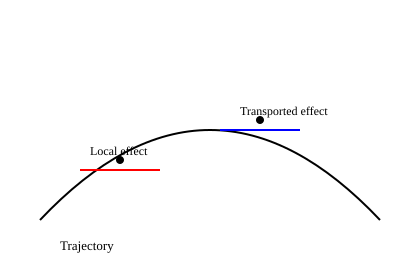

---
title: "Integral Superposition II: Variational Dynamics"
format:
  html:
    toc: true
    number-sections: true
---

## 1. Variational Equations

For a nonlinear system,

\[
\dot{x} = f(x,u),
\]

variations satisfy

\[
\delta \dot{x} = A(t)\delta x + B(t)\delta u.
\]

This equation governs the exact evolution of infinitesimal perturbations.

## 2. State Transition Operator

The solution is

\[
\delta x(t_1)
= \Phi(t_1,t_0)\delta x(t_0)
+ \int_{t_0}^{t_1} \Phi(t_1,t)B(t)\delta u(t)\,dt.
\]

All integrated effects are linearly accumulated *after transport*.

## 3. Geometry

The state transition operator encodes the curvature of the trajectory.
