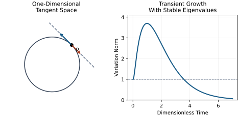

# Foundations: Tangent Spaces and Exactness
[]{#ch-foundations}

::: {.callout-tip}
## Zooming in on the Map

[]{#tangent_patch}
A tangent vector describes the direction and rate of a change at one state. A derivative
describes how that change affects another quantity. These are exact mathematical objects
when the required derivatives exist. Using them to predict a finite change is a further
step, whose accuracy must be checked. For a golfer or humanoid robot, that distinction
lets us ask precise questions about sensitivity without pretending that a whole swing
is linear or that a computed derivative validates the underlying physical model.
:::

## Motivation: Why Geometry Matters for Control

A configuration specifies an arrangement; a state must additionally contain the information
needed to predict its evolution under specified inputs. Joint angles alone do not determine
the next instant of a swing. Joint rates, muscle activation, shaft deformation and modal
rates can all matter. Contact mode and constitutive assumptions determine which states
and forces are admissible. Geometry supplies the language for representing these objects
and comparing nearby motions consistently.

For a homogeneous linear equation $\dot x=A(t)x$, combinations of solutions are solutions.
For $\dot x=A(t)x+B(t)u$, the corresponding initial conditions and inputs must also be
combined. Adding two responses to the same nonzero input generally doubles that forcing.
For a nonlinear system, trajectories expressed in Euclidean coordinates can still be
added algebraically, but the result generally does not solve the same dynamics; on a
general manifold, adding states has no intrinsic definition.

First variations obey a different rule. If $x(t,\epsilon)$ is a differentiable family of
solutions, then $\delta x(t)=\partial_\epsilon x(t,\epsilon)|_{\epsilon=0}$ belongs to the
tangent space at the nominal state. The equation for this derivative is linear in
$\delta x$ and the input variation. Its solutions superpose about the *same* nominal
trajectory. Off-diagonal coefficients still couple wrist, shoulder, shaft and other
coordinates: linear superposition does not mean those coordinates evolve independently.

On narrow screens, scroll the figure or [open it at full size](../figures/foundations_tangent_gain.svg).

::: {#fig-foundations_tangent-gain}
::: {.aba-diagram-scroll role="region" aria-label="Tangent vectors and transient amplification; scroll horizontally" tabindex="0"}

:::

Tangent Vectors and Finite-Time Amplification. Left: A One-Dimensional Circle Has a Tangent Line. Right: A Stable Linear System Can Amplify a Variation Before It Decays.
:::

A tangent space of an $n$-dimensional smooth manifold is $n$-dimensional. A curve has a
tangent line, not a two-dimensional tangent plane. For an embedded surface, a translated
tangent plane can touch the surface at a regular point, but is not a finite patch contained
in it. Corners, intersecting branches and other nonsmooth sets require additional care.
For an abstract manifold, no surrounding Euclidean space or literal touching plane is
required. The figure is an embedded illustration, not the definition.

## From the Scalar Derivative to a State-Space Model

[]{#the-conceptual-shift}

[]{#from-approximation-to-exact-structure}

[]{#riemanns-vision-of-intrinsic-geometry}

[]{#cauchy-weierstrass-and-the-rigorous-foundation}

[]{#newton-leibniz-and-the-birth-of-the-infinitesimal}

[]{#historical-context-from-newton-to-modern-differential-geometry}

For a scalar function, differentiability at $x_0$ means the limit
[]{#eq-ch1:derivative-limit}

$$
f'(x_0)=\lim_{h\to0}\frac{f(x_0+h)-f(x_0)}{h}
$$
exists. Its tangent line is the affine graph
[]{#eq-ch1:tangent-line}

$$
y-f(x_0)=f'(x_0)(x-x_0).
$$
The derivative is a linear map on displacements; the tangent-line function includes an
offset. In several variables the analogous statement is
[]{#eq-ch1:frechet-heuristic}

$$
f(\bar x+\delta x)=f(\bar x)+Df(\bar x)\delta x+o(\|\delta x\|).
$$
This defines differentiability at a point. It does not by itself assert continuity of the
derivative nearby. A $C^1$ map has continuous first derivatives; $C^2$ has continuous
second derivatives; smooth, without further qualification, normally means $C^\infty$.
We state the finite regularity actually needed below.

The numerical components in these equations depend on coordinates. Differentiability is
preserved by compatible differentiable charts with differentiable inverses. An arbitrary
smooth parameterization need not be a valid coordinate change: $z=x^3$ has zero derivative
at zero and its inverse is not differentiable there. The chain rule makes the derivative
an intrinsic map between tangent spaces; it does not make every displayed matrix or scalar
slope independent of the chart.

There is no conflict between calling a derivative an exact first-order object and calling
its use for a finite displacement an approximation. These are standard complementary
statements. Analytical differentiation, automatic differentiation of implemented code,
finite differences and numerical integration have different computational errors. None
of them establishes that an assumed muscle, contact or shaft model matches a person.

## Smooth Dynamical Systems

In a local chart consider
[]{#eq-ch1:dynamics}

$$
\dot x=F(x,u,t),\qquad x\in\mathbb R^n,\quad u\in\mathbb R^m.
$$
On a manifold, $F(x,u,t)\in T_x\mathcal M$. Time-independent examples below omit $t$.
The mechanical state space may be a tangent bundle, with additional activation or internal
variables. It must not be confused with the smaller configuration manifold.

::: {.callout-note}
## Regularity on a Fixed Mode

[]{#ass-smoothness}
On an open neighborhood of the nominal trajectory and admissible perturbations, assume
$F$ is continuous in time and $C^1$ in state and input, with continuous derivatives.
Use a finite interval on which nearby solutions exist in this neighborhood. Assume $C^2$
in the perturbed arguments for the quadratic Taylor bounds below.
:::

These are sufficient working conditions, not the weakest possible ones. Local Lipschitz
regularity in state gives local uniqueness under the usual time regularity assumptions;
continuous first derivatives provide it locally. Piecewise continuous prescribed inputs
can also be handled interval by interval. If a feedback law is used, differentiate the
closed-loop field, including the derivative of the law where it exists.

Regular holonomic constraints can define a smooth reduced manifold. Fixed sticking contacts
can admit smooth constrained equations while the contact remains feasible and its Jacobian
has constant rank. Thus a hard constraint does not automatically destroy differentiability.
Touchdown, slip, liftoff, saturation boundaries and impacts require checking mode-specific
regularity and the transition law. These events are central to golf and humanoid mechanics,
so the smooth calculation must have an explicit boundary of application.

## The Fréchet Derivative: Definition and Computation

[]{#the-fréchet-derivative-linearization-as-exact-structure}

### Definition and Uniqueness

[]{#prp-frechet-unique}

[]{#proof-of-uniqueness}

At fixed $(\bar x,\bar u,t)$, the state Jacobian is
[]{#eq-ch1:jacobian-A}

$$
A=D_xF(\bar x,\bar u,t)\in\mathbb R^{n\times n},
$$
provided a linear map $A$ satisfies
[]{#eq-ch1:frechet}

$$
F(\bar x+\delta x,\bar u,t)=F(\bar x,\bar u,t)+A\delta x+r(\delta x),
$$
with
[]{#eq-ch1:frechet-limit}

$$
\lim_{\delta x\to0,\,\delta x\ne0}\frac{\|r(\delta x)\|}{\|\delta x\|}=0.
$$
The limit is over all approaches, not a selected finite set of directions. Norms must be
declared; fixed norms are equivalent for existence of the derivative in finite dimensions,
but numerical magnitudes and condition numbers depend on scaling.

::: {.callout-note}
## Uniqueness of the Fréchet Derivative

[]{#prop-frechet-unique}
There is at most one such linear map $A$.
:::
::: {.proof}
If $A$ and $A'$ both satisfy the condition, subtract their expansions to obtain
[]{#eq-ch1:diff-matrices}

$$
(A-A')\delta x=r'(\delta x)-r(\delta x)=o(\|\delta x\|).
$$
For fixed $v\ne0$ set $\delta x=sv$ with $s>0$. Then

$$
\|(A-A')v\|\leq
\left(\frac{\|r'(sv)\|+\|r(sv)\|}{s\|v\|}\right)\|v\|\longrightarrow0.
$$

The left side is independent of $s$, hence is zero. This holds for every $v$, so $A=A'$.
:::

### Directional Derivatives and Uniformity

[]{#relationship-to-the-gâteaux-derivative}

The directional limit
[]{#eq-ch1:gateaux}

$$
D_vF(\bar x)=\lim_{s\to0}\frac{F(\bar x+sv)-F(\bar x)}{s}
$$
equals $Av$ when the Fréchet derivative exists. The term Gâteaux derivative is often
reserved for a directional-derivative map that is linear in $v$; even that condition need
not give the uniform remainder required here. For example, define the scalar function

$$
h(x,y)=\begin{cases}x^4y/(x^6+y^2),&(x,y)\ne(0,0),\\0,&(x,y)=(0,0).
\end{cases}
$$

The inequality $2|x^3y|\leq x^6+y^2$ gives $|h(x,y)|\leq|x|/2$, proving continuity
at the origin. Along any fixed ray $(x,y)=s(a,b)$, $h(sa,sb)/s\to0$; this is immediate
when $b=0$ and follows from an $s^2$ factor when $b\ne0$. All directional derivatives
therefore form the zero linear map. But along $y=x^3$, $h=x/2$, and for $x>0$

$$
\frac{|h(x,x^3)|}{\sqrt{x^2+x^6}}=\frac{1}{2\sqrt{1+x^4}}\longrightarrow\frac12.
$$

The function is not Fréchet differentiable there. Testing several directions numerically
cannot replace the assumptions or proof of a uniform limit.

### The Input Jacobian and Joint Perturbations

[]{#the-input-jacobian}

The input Jacobian is
[]{#eq-ch1:jacobian-B}

$$
B=D_uF(\bar x,\bar u,t)\in\mathbb R^{n\times m},
$$
and satisfies
[]{#eq-ch1:frechet-u}

$$
F(\bar x,\bar u+\delta u,t)=F(\bar x,\bar u,t)+B\delta u+o(\|\delta u\|).
$$
Joint differentiability yields the combined derivative $[A\ B]$ and a joint remainder in
$(\delta x,\delta u)$. Separate derivatives at one point alone do not guarantee this.
For a control-affine field $F=f(x,t)+G(x,t)u$, $B=G(\bar x,t)$, whereas

$$
A=D_xf(\bar x,t)+\sum_i\bar u_iD_xg_i(\bar x,t).
$$

Dropping the second term would omit state-dependent input transmission. Exact affinity in
joint torque also does not imply affinity in muscle excitation: activation dynamics and
force-length-velocity laws intervene between those inputs.

## Worked Example: A Dimensioned Pendulum

[]{#numerical-verification}

[]{#worked-example-the-pendulum-jacobian}

Use a point mass $m$ on a massless rigid rod of length $\ell$, angle $\theta$ from downward
vertical, gravity $g$, applied torque $u$ and viscous torque $-c\omega$. Moment balance about
the fixed pivot gives
[]{#eq-ch1:pendulum-dyn}

$$
\dot\theta=\omega,\qquad m\ell^2\dot\omega=-mg\ell\sin\theta-c\omega+u.
$$
Here $u$ is in N m, $c$ in N m s/rad and $I=m\ell^2$ in kg m$^2$. For a distributed
pendulum replace $I$ by its pivot inertia and $m\ell$ in gravity torque by mass times
pivot-to-center-of-mass distance. The point-mass state field is
[]{#eq-ch1:pendulum-f}

$$
F(x,u)=\begin{pmatrix}\omega\\-(g/\ell)\sin\theta-(c/I)\omega+u/I\end{pmatrix}.
$$
At a static equilibrium, $\bar\omega=0$ and $\bar u=mg\ell\sin\bar\theta$. At any state,
not only an equilibrium, the derivatives are
[]{#eq-ch1:pendulum-A}

$$
A=\begin{pmatrix}0&1\\-(g/\ell)\cos\bar\theta&-c/I\end{pmatrix},
$$
[]{#eq-ch1:pendulum-B}

$$
B=\begin{pmatrix}0\\1/I\end{pmatrix}.
$$
These coefficients expose distinct effects: geometry changes the gravity derivative;
damping changes the rate derivative; inertia scales torque authority. A high existing
angular rate does not reduce $B$ in this model.

For an illustrative numerical case, set $m=1$kg, $\ell=1$m, $g=10$m/s$^2$,
$c=0.1$N m s/rad and $\bar\theta=\pi/6$. Then $I=1$kg m$^2$, $\bar u=5$N m and
$A_{21}=-5\sqrt3$ s$^{-2}$, evaluated without rounding in the residual calculation.
For an angle perturbation $d$ with unchanged rate and torque, the only nonzero residual is

$$
r_\omega(d)=-10[\sin(\pi/6+d)-\sin(\pi/6)-\cos(\pi/6)d]
=2.5d^2+\frac{5\sqrt3}{6}d^3+O(d^4).
$$

At $d=0.01$rad, the true acceleration change is approximately $-0.086351099093$rad/s$^2$,
the first-order change is $-0.086602540378$rad/s$^2$, and the residual is
$0.000251441285$rad/s$^2$. The ratio $r_\omega/d^2$ approaches $2.5$ s$^{-2}$ (radians treated as dimensionless), while
$r_\omega/d\to0$. Mixing a rounded matrix with high-precision field evaluations can
create a spurious first-order error at small $d$.

| $d$ (rad) | $r_\omega$ (rad/s$^2$) | $r_\omega/d$ (s$^{-2}$) | $r_\omega/d^2$ (s$^{-2}$/rad) |
| --- | --- | --- | --- |
| $0.1$ | $0.02642183$ | $0.2642183$ | $2.642183$ |
| $0.01$ | $0.0002514413$ | $0.02514413$ | $2.514413$ |
| $0.001$ | $2.501443\times10^{-6}$ | $0.002501443$ | $2.501443$ |
| $0.0001$ | $2.500144\times10^{-8}$ | $0.0002500144$ | $2.500144$ |

: Pendulum Residuals With an Unrounded Analytic Jacobian {#tbl-foundations_pendulum}

Angles, angular rates and forces are different physical quantities. A Euclidean norm of
their raw numerical coordinates silently chooses units and relative weights. A declared
scale matrix $S$ defines dimensionless variations $S^{-1}\delta x$; a positive-definite
metric $W$ defines $\|\delta x\|_W^2=\delta x^TW\delta x$. The scalar ratios above use
only angle and angular-acceleration components, with their units retained.

## Tangent Spaces as Vector Spaces


### Curves, Charts, and Derivations

[]{#why-tangent-spaces-are-the-natural-home-of-superposition}

[]{#isomorphism-with-directional-derivatives}

[]{#abstract-definition}
[]{#def-tangent-space}
Let $p$ lie in a smooth $n$-manifold $\mathcal M$ and let $\psi$ be a chart near $p$.
Two curves through $p$ represent the same tangent vector if
[]{#eq-ch1:curve-equivalence}

$$
\left.\frac{d}{ds}\psi(\gamma_1(s))\right|_0
=\left.\frac{d}{ds}\psi(\gamma_2(s))\right|_0.
$$
The chain rule makes this equivalence independent of the compatible chart. If two curve
classes have chart velocities $a,b$, their sum has chart velocity $a+b$, represented
locally by $\psi^{-1}(\psi(p)+s(a+b))$. Scalar multiplication is constructed similarly.
This is not concatenation of two finite curves. These operations make $T_p\mathcal M$
a vector space. Vectors at different base points need a specified identification before
they can be compared or added.

A tangent vector also acts on a smooth scalar function $h$ as
[]{#eq-ch1:tangent-derivative}

$$
v_p(h)=\left.\frac{d}{ds}h(\gamma(s))\right|_0.
$$
This action is linear in $h$ and obeys the Leibniz rule,

$$
v_p(hk)=h(p)v_p(k)+k(p)v_p(h).
$$

Conversely a derivation at $p$ is determined by its action on local coordinate
functions and corresponds to a unique tangent vector. For a map $H:\mathcal M\to\mathcal N$,
its derivative $dH_p:T_p\mathcal M\to T_{H(p)}\mathcal N$ maps curve velocities by composition.

### Coordinate Representation Along a Trajectory

[]{#coordinate-representation}

A vector field is a section $F:\mathcal M\to T\mathcal M$, not an ordinary map back into
$\mathcal M$. Its coordinate Jacobian is not generally an intrinsic endomorphism of
$T_p\mathcal M$. A connection can define a covariant derivative, and at an equilibrium
the linearization does define an intrinsic tangent endomorphism. Along a moving trajectory,
the coordinate dependence must be handled explicitly.

For a time-independent $C^2$ diffeomorphism $z=\phi(x)$, put $T(t)=D\phi(\bar x(t))$. Then
[]{#eq-ch1:tangent-transform}

$$
\delta z=T(t)\delta x,
$$
so differentiating in time gives
[]{#eq-ch1:jacobian-transform}

$$
A_z=TAT^{-1}+\dot TT^{-1},\qquad B_z=TB.
$$
Even though $\phi$ has no explicit time argument, its derivative can vary along the
trajectory: $\dot T=D^2\phi(\bar x)[\dot{\bar x},\,\cdot\,]$. Thus time independence
of a chart does not imply $\dot T=0$. At a fixed equilibrium, or for a constant linear
coordinate map, the extra term vanishes and $A_z$ is similar to $A$. An explicitly
time-dependent chart includes its partial time derivative in $\dot T$ as well.

For example, $\dot x=1$ on $\mathbb R$ has $A_x=0$. With $z=e^x>0$, the same motion
satisfies $\dot z=z$ and $A_z=1$. A fixed $\delta x$ becomes $\delta z=e^{\bar x(t)}\delta x$.
There is no new physical instability. The metric representing the original ruler is
$W_z=z^{-2}$, so $\delta z^2W_z=\delta x^2$. Coordinate-dependent instantaneous eigenvalues
must not be treated as invariant measures of sensitivity.

## Residuals: Approximation Error and Nonlinear Information

[]{#residuals-geometry-not-error}

At fixed input and time define
[]{#eq-ch1:residual-def}

$$
r(d)=F(\bar x+d)-F(\bar x)-Ad.
$$
For $C^2$ fields on a neighborhood containing the line segment, apply the fundamental theorem
of calculus twice to obtain

$$
r(d)=\int_0^1(1-s)D^2F(\bar x+sd)[d,d]\,ds.
$$

The norm on the Hessian is the induced bilinear operator norm for the declared domain and
range norms. Consequently
[]{#eq-ch1:residual-bound}

$$
\|r(d)\|\leq\frac12\sup_{0\leq s\leq1}\|D^2F(\bar x+sd)\|\,\|d\|^2.
$$
The integral form avoids assuming that one common intermediate point represents every
component of a vector-valued remainder. A locally Lipschitz derivative also supplies a
quadratic bound. Bare differentiability gives only $o(\|d\|)$; for example $h(x)=|x|^{3/2}$
has derivative zero at zero and a remainder of order $|x|^{3/2}$, not $x^2$.

The residual is an error of the finite Taylor approximation and useful information about
the represented field. It is not automatically a physical-model discrepancy, measurement
noise, numerical integration error or intrinsic manifold curvature. Those contributions
need separate comparisons. A large residual can signal that a chosen local prediction is
inadequate at the tested displacement; calling it geometry does not remove that limitation.

### Quadratic Bounds and Cubic Leading Terms

[]{#residual-scaling-a-concrete-example}

For
[]{#eq-ch1:sin-example}

$$
f(x)=\sin x,
$$
the derivative at zero is one and
[]{#eq-ch1:sin-residual}

$$
r(d)=\sin d-d=-d^3/6+O(d^5).
$$
Thus $r/d^3\to-1/6$ and $r/d^2\to0$. The residual is both $O(d^3)$ and $O(d^2)$ on
a bounded small neighborhood: the cubic statement is sharper, not incompatible with the
quadratic upper bound. For $\cos x$ at zero,

$$
r(d)=\cos d-1=-d^2/2+O(d^4).
$$

| $d$ | $\sin d-d$ | $r/d^2$ | $r/d^3$ |
| --- | --- | --- | --- |
| $0.1$ | $-0.0001665834$ | $-0.01665834$ | $-0.1665834$ |
| $0.01$ | $-1.666658\times10^{-7}$ | $-0.001666658$ | $-0.1666658$ |
| $0.001$ | $-1.666667\times10^{-10}$ | $-0.0001666667$ | $-0.1666667$ |
| $0.0001$ | $-1.666667\times10^{-13}$ | $-1.666667\times10^{-5}$ | $-0.1666667$ |

: A Cubic Leading Residual Also Satisfies a Quadratic Bound {#tbl-ch1_sin-residual}

For a fixed direction $v$, a $C^2$ map has $r(sv)/s^2\to D^2F(\bar x)[v,v]/2$.
A nonzero Hessian need not act nontrivially in every direction, and an operator-norm bound
need not be attained. A vanishing second derivative alone does not establish cubic order
without appropriate higher regularity. At very small steps floating-point subtraction
can obscure either limit; use a step range and an independent series or identity.

### Why This Is Not Intrinsic Curvature

[]{#two-perspectives-on-linearization}

The line with metric $dx^2$ is intrinsically flat. The field $\dot x=x^2$ on that line has
$r(d)=d^2$, so a nonzero Taylor residual does not require intrinsic curvature. Conversely,
a zero vector field on a curved sphere has zero residual in every coordinate chart. A
Hessian of coordinate field components changes under nonlinear coordinate changes and
is not the Riemann curvature tensor.

Curvature requires a connection; the Riemannian metric supplies a particular torsion-free,
metric-compatible connection. Its curvature measures path dependence of parallel transport
around infinitesimal loops. Topology, the bending of an embedding, curvature of a chosen
metric and derivatives of the dynamical field are different structures. The distinctions
matter when a posture change, a coordinate singularity or a rapid motion is called a
“high-curvature region” without specifying which quantity was calculated.

| Quantity | Meaning | Assessment |
| --- | --- | --- |
| Taylor residual | Finite field change minus its first-order prediction | Perturbation-size and direction study |
| Flow sensitivity | Derivative of a solution map | Variational equation and nonlinear trajectories |
| Intrinsic curvature | Curvature of a declared connection | Metric/connection calculation |
| Numerical error | Computed result minus the mathematical model result | Step refinement and independent solution |
| Physical discrepancy | Model prediction versus observations | Measurement uncertainty and independent validation |

: Different Quantities Require Different Comparisons {#tbl-ch1_perspectives}

## Manifold Examples: Rotations, Poses, and Joint Angles

[]{#manifold-examples-from-theory-to-application}

### SO(3): Rotations and Attitude Kinematics

[]{#singular-configurations-on-manifolds}

[]{#why-so3-matters}

[]{#jacobian-on-so3}

[]{#so3-rotations-and-attitude-dynamics}

The rotation group is
[]{#eq-ch1:SO3-def}

$$
\mathrm{SO}(3)=\{R\in\mathbb R^{3\times3}:R^TR=I,\ \det R=1\}.
$$
Differentiate $R^TR=I$ along a curve to get $R^T\delta R+(\delta R)^TR=0$. Therefore
[]{#eq-ch1:so3-tangent}

$$
T_I\mathrm{SO}(3)=\mathfrak{so}(3)=\{S:S^T=-S\},
$$
and
[]{#eq-ch1:SO3-tangent-at-R}

$$
T_R\mathrm{SO}(3)=\{RS:S\in\mathfrak{so}(3)\}.
$$
This space has dimension three. The ambient matrix $RS$ need not be skew; multiplying
by $R^T$ identifies it with a skew matrix at the identity. That identification is called
left trivialization. Matrix commutators represent Lie brackets of the corresponding
left-invariant vector fields, not arbitrary vector fields without qualification.

If $R$ maps body coordinates to space coordinates and $\omega_b$ is body angular velocity,
[]{#eq-ch1:attitude-kinematics}

$$
\dot R=R[\omega_b]_\times,
$$
where
[]{#eq-ch1:skew-symmetric}

$$
[\omega]_\times=\begin{pmatrix}0&-\omega_3&\omega_2\\\omega_3&0&-\omega_1\\-\omega_2&\omega_1&0\end{pmatrix}.
$$
At fixed $R$, the input derivative acts on an angular-velocity variation as
[]{#eq-ch1:attitude-jacobian}

$$
D_{\omega_b}\dot R[\delta\omega_b]=R[\delta\omega_b]_\times.
$$
For simultaneous attitude and velocity variations, write $\delta R=R[\eta]_\times$.
Differentiating this identity and the kinematic equation gives

$$
[\dot\eta]_\times=[\eta]_\times[\omega_b]_\times-[\omega_b]_\times[\eta]_\times
+[\delta\omega_b]_\times,
\qquad \dot\eta=-[\omega_b]_\times\eta+\delta\omega_b.
$$

The resulting equation is linear in variations while retaining rotating-frame coupling.
It is kinematics; torque-to-angular-acceleration dynamics additionally require inertia,
external moments and any constraints.

Rotation matrices satisfy redundant constraints; unit quaternions satisfy a unit-norm
constraint and double-cover rotations. The equality of the rotations represented by $q$
and $-q$ is not a local singularity. Euler charts can be singular, and a chosen principal
logarithm has a branch cut at half turns, while $\mathrm{SO}(3)$ itself remains smooth.
A smooth positive-definite Riemannian metric does not degenerate at a particular rotation.
Compactness already prevents one global chart of $\mathrm{SO}(3)$ onto an open subset
of $\mathbb R^3$; the hairy-ball theorem on $S^2$ is not the reason to cite here.

### SE(3): Rigid-Body Poses and Twists

[]{#kinematics-and-dynamics}

[]{#se3-rigid-body-transformations}

A pose and its Lie algebra have the forms
[]{#eq-ch1:SE3-def}

$$
T=\begin{pmatrix}R&p\\0&1\end{pmatrix}\in\mathrm{SE}(3),
$$
[]{#eq-ch1:se3-tangent}

$$
\widehat\xi=\begin{pmatrix}[\omega]_\times&v\\0&0\end{pmatrix}\in\mathfrak{se}(3).
$$
The tangent space at $T$ is $T\mathfrak{se}(3)$, not the identity algebra itself.
For body and space twists,
[]{#eq-ch1:SE3-kinematics}

$$
\dot T=T\widehat\xi_b=\widehat\xi_sT,\qquad
\widehat\xi_b=T^{-1}\dot T,\quad\widehat\xi_s=\dot TT^{-1}.
$$
Consequently $v_b=R^T\dot p$, $\omega_s=R\omega_b$ and
$v_s=\dot p-\omega_s\times p$. The space-twist linear component is not generally the
velocity $\dot p$ of the moving body origin. State the six-vector ordering; here it is
$(\omega,v)$, with corresponding changes required for $(v,\omega)$ conventions.
These identities follow directly by matrix multiplication and agree with the
Modern Robotics twist convention  [@ModernRoboticsTwistsFoundations].

Plücker line coordinates describe a line with additional algebraic conditions; a general
twist additionally allows pitch and pure translation. Identifying every tangent vector
with an unspecified set of Plücker coordinates hides these distinctions. For the club,
one must declare both the reference point of the linear velocity and the frame of its
components before combining it with body-segment velocities or wrenches.

### A Double Pendulum: Topology and Dynamics

[]{#nonlinear-effects-and-coupling}

[]{#coordinates-and-tangent-space}

[]{#the-double-pendulum-configuration-manifold}

For two unrestricted planar revolute coordinates,
[]{#eq-ch1:double-pend-manifold}

$$
\mathcal Q=S^1\times S^1=\mathbb T^2,\qquad
T\mathcal Q\simeq\mathbb T^2\times\mathbb R^2.
$$
Each configuration tangent space is two-dimensional; the position-velocity state manifold
is four-dimensional. Joint limits and contacts may restrict it. Intervals such as
$[0,2\pi)$ are representatives with identified endpoints, not a single smooth chart
across the seam. Unwrapped real angles can be useful lifted coordinates as long as
periodic equivalence is handled when comparing configurations.

For a concrete dynamics model, take massless links $\ell_1,\ell_2$, endpoint masses $m_1,m_2$
and absolute angles from downward vertical. Define $\Delta=\theta_1-\theta_2$ and
$b=m_2\ell_1\ell_2$. Differentiate the endpoint positions to obtain

$$
K=\tfrac12(m_1+m_2)\ell_1^2\dot\theta_1^2
+\tfrac12m_2\ell_2^2\dot\theta_2^2+b\cos\Delta\,\dot\theta_1\dot\theta_2,
$$


$$
V=-(m_1+m_2)g\ell_1\cos\theta_1-m_2g\ell_2\cos\theta_2.
$$

The Lagrangian equations give
[]{#eq-ch1:double-pend-dyn}

$$
M(q)\ddot q+c(q,\dot q)+\nabla V(q)=Q,
$$
with

$$
M=\begin{pmatrix}(m_1+m_2)\ell_1^2&b\cos\Delta\\b\cos\Delta&m_2\ell_2^2\end{pmatrix},
\quad c=\begin{pmatrix}b\sin\Delta\,\dot\theta_2^2\\-b\sin\Delta\,\dot\theta_1^2\end{pmatrix}.
$$

For positive masses and lengths,


$$
\det M=m_2\ell_1^2\ell_2^2(m_1+m_2\sin^2\Delta)>0.
$$

Generalized forces $Q$ must match these absolute angles. If actuator torques are $\tau_1$
at the base and $\tau_2$ at the relative elbow, virtual work gives
$Q=(\tau_1-\tau_2,\tau_2)^T$, before adding dissipative loads. Ignoring this transformation
would change the physical interpretation of the input Jacobian.

The abstract torus admits the flat metric $d\theta_1^2+d\theta_2^2$: its local metric
coefficients are constant and its curvature tensor vanishes. A doughnut-shaped embedding
in three-space carries a different induced metric; the mechanical kinetic metric $M(q)$
is another choice. Torus topology therefore does not mean intrinsic curvature is nonzero.
Neither nonlinear pendulum motion nor inertial coupling requires that identification.
Large potential gradients alone do not establish large Taylor residuals of the state field.

## Variational Evolution and Transport

[]{#nonlinearity-re-enters-through-transport}
[]{#sec-transport}

### The Derivative of the Flow

[]{#state-transition-matrix-and-variational-equations}

Let $\varphi_{t,t_0}$ be the local solution map for a fixed nominal input. For a fixed
finite interval satisfying the regularity assumptions, its differential maps between
the tangent spaces at the initial and final states. In coordinates,
[]{#eq-ch1:perturbed-traj}

$$
\varphi_{t,t_0}(x_0+d)=\varphi_{t,t_0}(x_0)+\Phi(t,t_0)d+o(\|d\|).
$$
Differentiate the ODE with respect to a family parameter to obtain
[]{#eq-ch1:variational-eq}

$$
\dot{\delta x}=A(t)\delta x+B(t)\delta u,\qquad
\dot\Phi=A(t)\Phi,\quad\Phi(t_0,t_0)=I.
$$
Variation of constants gives
[]{#eq-ch1:dx-solution}

$$
\delta x(t)=\Phi(t,t_0)\delta x(t_0)+\int_{t_0}^t\Phi(t,s)B(s)\delta u(s)\,ds.
$$
This is an exact identity for the first variation. It is not an exact finite difference
between arbitrary trajectories. Its physical interpretation depends on the complete
nominal state, input, parameters and contact mode used to compute $A$ and $B$.
The composition law for flow derivatives is $\Phi(t,s)\Phi(s,t_0)=\Phi(t,t_0)$.
For time-varying $A$, $\exp(\int A\,dt)$ is generally not the solution unless the relevant
matrices commute; integration remains necessary.

Under the previous coordinate change,

$$
\Phi_z(t,t_0)=T(t)\Phi_x(t,t_0)T(t_0)^{-1}.
$$

This is not generally a similarity transform because the endpoint bases differ.
For a periodic orbit's return map with matched coordinates, Floquet multipliers have a
specific stability interpretation. A general finite-time transition matrix instead calls
for endpoint norms and singular-value or task-specific analysis.

### Parallel Transport Is a Different Map

[]{#christoffel-symbols-and-parallel-transport-intuitive-picture}

[]{#transport-as-curved-geometry}

Given a connection with Christoffel symbols $\Gamma^k_{ij}$, a parallel vector field
$w$ along a curve $x(t)$ satisfies

$$
\dot w^k+\Gamma^k_{ij}(x)\dot x^i w^j=0.
$$

Levi-Civita parallel transport preserves the chosen Riemannian inner product. The flow
derivative generally stretches and contracts perturbations. On the Euclidean line with
$\dot x=ax$, the connection coefficients vanish, parallel transport preserves $w$, and
the flow derivative multiplies a variation by $e^{a(t-t_0)}$. No intrinsic curvature is
needed for that amplification. With a torsion-free connection, a flow variation satisfies
$\nabla_{\dot x}\delta x=\nabla_{\delta x}F$; parallel transport would instead set the
left side to zero. These equations make the difference explicit.

### Finite Prediction Error and Numerical Integration

For a nearby solution with the same input, let $e=x-\bar x$ and let
$\eta=\Phi(t,t_0)e(t_0)$. Then $w=e-\eta$ obeys

$$
\dot w=A(t)w+r(e(t)),\qquad
w(t)=\int_{t_0}^t\Phi(t,s)r(e(s))\,ds.
$$

If $\|\Phi(t,s)\|\leq K e^{\alpha(t-s)}$ and $\|r(e)\|\leq C\|e\|^2/2$ in the
common valid region, then

$$
\|w(t)\|\leq\frac{KC}{2}\int_{t_0}^t e^{\alpha(t-s)}\|e(s)\|^2\,ds.
$$

Local residual size and subsequent amplification both matter. The interval of useful
prediction may shrink when variations grow; a pointwise derivative supplies no uniform
long-time accuracy guarantee.

An exact integral identity is not an exact quadrature algorithm. Euler integration of
$\dot x=ax$ gives $x_{k+1}=(1+ah)x_k$ rather than $e^{ah}x_k$, even on a flat line.
Discretization error therefore exists without curvature or Taylor error in the vector
field. Numerical studies should separately test derivative accuracy, time-step refinement,
nonlinear perturbation size and physical-model discrepancy.

## Local Optimal Control: What DDP and iLQR Approximate

[]{#connection-to-differential-dynamic-programming}

For a discretized dynamics map $x_{k+1}=f_k(x_k,u_k)$, form a quadratic local model of
$Q_k=\ell_k+V_{k+1}\circ f_k$. Let $z=(x,u)$. Applying the chain rule twice gives

$$
Q_{zz}=\ell_{zz}+f_z^TV_{xx}^{+}f_z+\sum_a V_{x_a}^{+}(f_a)_{zz}.
$$

Full DDP retains the last term from second derivatives of dynamics; the usual iLQR
approximation omits it. Both truncate local cost-to-go expansions. If $Q_{uu}$ is
positive definite, the unconstrained quadratic subproblem gives

$$
\delta u=k+K\delta x,\qquad k=-Q_{uu}^{-1}Q_u,\quad K=-Q_{uu}^{-1}Q_{ux}.
$$

Solving this subproblem is not solving the original nonlinear problem exactly. A forward
rollout evaluates candidate controls with the nonlinear dynamics, using a line search or
trust-region mechanism and appropriate regularization. On a manifold, a retraction or
other declared local update returns tangent increments to the configuration space;
$\Phi$ alone does not perform that update. Constraints require an appropriate constrained
subproblem, active-set treatment, penalty or other explicit formulation. The distinctions
agree with the iLQR/DDP discussion in Tedrake's trajectory-optimization notes
 [@TedrakeTrajectoryFoundations].

For golf, a converged optimizer provides a candidate within its cost, actuator bounds,
equipment model and contact assumptions. It need not find a global optimum, and it does
not show that a golfer implements the same algorithm. A small linearized residual does
not establish physiological plausibility, robustness to unmodeled disturbances or safe
loads. Repeated nonlinear rollout and independent evidence remain part of the argument.

## Lie Brackets and Reachable Motion
[]{#rem-ch1:lie-brackets}

For $C^1$ vector fields use the convention

$$
[f,g]=Dg\,f-Df\,g.
$$

The bracket measures the leading effect of exchanging short flows; higher-order brackets
need correspondingly greater regularity. It can be nonzero for linear fields, so it is
not a measure reserved for nonlinear coefficients. For a smooth driftless system
$\dot q=\sum_i g_i(q)u_i$, a bracket-generating family with controls allowing both signs
near zero provides local controllability through small alternating motions. This statement
requires the control-set and smoothness assumptions; input directions alone describe
instantaneous velocities, whereas their iterated effects concern finite reachable motion
 [@ModernRoboticsControllabilityFoundations].

With drift, full Lie rank is not by itself a small-time local controllability certificate.
For example $\dot x=1,\dot y=u$, $|u|\leq1$, has drift and input spanning the plane.
The set reachable within time $T$ has interior, but no state with $x<x_0$ is reachable
forward in time. Accessibility and bidirectional local control differ. A golf model's
torque limits, activation, unilateral ground contact and short remaining horizon all
restrict realizable maneuvers. Brackets cannot establish them away.

## Mode Changes and Boundaries of Differentiability

[]{#scope-of-exactness-when-the-tangent-space-picture-breaks-down}

### Friction, Constraints, and Switching

[]{#zeno-behavior-and-accumulation-of-events}

[]{#chattering-and-sliding-modes}

[]{#discontinuities-and-piecewise-smooth-systems}

For one-dimensional tangential contact with normal load $N\geq0$, ideal dry friction has

$$
F_t\in[-\mu_sN,\mu_sN]\quad(v_t=0),\qquad
F_t=-\mu_kN\,\operatorname{sign}(v_t)\quad(v_t\ne0).
$$

During sticking, the required force is selected together with the other dynamics and must
remain within the static bound. It is not zero because $\operatorname{sign}(0)=0$.
Multidirectional friction uses a cone or disk and a slip-direction law. A compliant
one-sided penalty $V=k\max(0,d)^2/2$ is $C^1$ but its force generally has a derivative
jump at $d=0$; it must not be called smooth merely because the potential is quadratic
on each side. Regular bilateral constraints and feasible fixed contact modes remain
different cases.

A function can be differentiable at a point while its derivative is discontinuous nearby;
loss of $C^1$ alone does not prove failure of every point derivative. A discontinuous
field at a point cannot be differentiable there. At a switching surface examine the
actual one-sided fields and transition law. For prescribed switching times, propagate
variations on successive intervals; state-triggered timing needs additional sensitivity.

Bang-bang means that the input takes boundary values, often with finitely many switches.
Chattering refers to increasingly rapid switching; Zeno means infinitely many discrete
events in finite time. Sliding motion in a Filippov model is governed by a differential
inclusion on a switching surface. These are distinct concepts, and none makes an
unjustified smooth averaged model automatically valid.

### Event Time and the Saltation Update

[]{#summary-boundaries-of-the-theory}

Suppose a nominal solution crosses a differentiable guard $g(x,t)=0$ transversely, then
resets by $x^+=R(x^-,t)$. Write the before/after fields as $F^-,F^+$ and assume nearby
solutions follow the same event sequence. Differentiating the guard gives

$$
\delta t=-\frac{g_x\delta x^-}{g_t+g_xF^-}.
$$

At the shifted event, the reset-state variation is
$R_x(\delta x^-+F^-\delta t)+R_t\delta t$. Bring it to the same post-event clock time by
subtracting $F^+\delta t$. Hence

$$
\delta x^+=\Xi\delta x^-,\qquad
\Xi=R_x+\frac{(F^+-R_xF^--R_t)g_x}{g_t+g_xF^-}.
$$

This is the saltation matrix. The timing term is essential even for an identity reset
when the vector fields change. For $\dot x=1$ before crossing zero and $\dot x=2$ afterward,
$R_x=1$ but $\Xi=2$: an earlier crossing creates extra time at the faster speed. The
derivation and transversality limits follow the treatment of Kong and colleagues
 [@Kong2024SaltationFoundations].

Grazing, simultaneous events, a changed contact sequence or Zeno accumulation can invalidate
this derivative or require generalized sensitivities. A rigid impact model can change
velocity discontinuously while its mode configurations remain smooth. If collision is
instead resolved with compliant dynamics, the needed regularity and time resolution
must be assessed for that model. The distinction changes which endpoint sensitivity
is appropriate for a club-ball or foot-ground event.

| Situation | Within a Mode | At Its Boundary |
| --- | --- | --- |
| Regular constrained motion | Reduced or constrained derivative | Check rank and contact feasibility |
| Prescribed finite switches | Piecewise variational propagation | Apply any reset derivative |
| State-triggered event | Smooth variational equation | Guard timing and saltation update |
| Sticking/sliding friction | Use the feasible mode law | Check inclusion and mode change |
| Grazing or simultaneous events | Valid away from event ambiguity | May need generalized sensitivities |
| Zeno accumulation | Analyze individual finite intervals | Specify continuation after accumulation |

: Mode-Specific Analysis and Transition Requirements {#tbl-ch1_scope}

## What the Foundations Establish

[]{#looking-ahead}

[]{#important-distinction-linearization-vs.-linear-approximation}

[]{#when-to-use-this-framework}

[]{#scope-and-limitations}

[]{#the-five-axioms-a-summary}

Five working principles replace any implication that local geometry removes approximation:

1. **Derivatives Have a Precise Domain.** State differentiability, coordinates, units,
input convention and the complete nominal state before interpreting a Jacobian.
1. **First Variations Superpose About One Trajectory.** The linear equation retains
coupling; finite trajectories generally do not superpose.
1. **Residuals Quantify a Declared Approximation.** Their rates depend on regularity,
direction and scaling; they are not intrinsic curvature or a measurement of biological control.
1. **Flow Sensitivity and Geometric Parallel Transport Differ.** Specify the map,
endpoint rulers and event corrections used to compare perturbations.
1. **Computation Requires Error Control.** Derivative estimation, time integration,
local optimization and physical-model validation answer distinct questions.


[Variational Dynamics](ch02_variational.html) develops the variational equation;
[Contraction Analysis](ch04_contraction.html) introduces metrics and contraction;
[Local Optimal Control](ch05_optimal_control.html) develops local optimization. These tools become more useful
when their assumptions and finite prediction errors are visible. They do not need a claim
of universal exactness to justify their role in analyzing human or robotic motion.

## The Golf Swing: From State Variations to Delivery

[]{#preview-why-these-ideas-matter-for-the-golf-swing}

### A Complete State and a Measurable Task

[]{#the-golfers-tangent-space}

Represent configuration, generalized velocity, shaft modes and their rates, and any required
muscle or tissue internal states. Let $u$ mean the chosen actuator input and keep its
bounds and activation dynamics explicit. A wrist-angle perturbation must respect the joint
definition, while a rotation variation must respect $\mathrm{SO}(3)$ rather than add arbitrary
matrix entries. Contact-consistent perturbations may need both position and velocity
constraints. A change of recorded coordinates should not change the physical conclusion.

For a fixed-time output $y=h(x(T))$, the first-order prediction is

$$
\delta y=h_x\Phi(T,t_0)\delta x_0+
\int_{t_0}^T h_x\Phi(T,s)B(s)\delta u(s)\,ds.
$$

This connects preparation, later input transmission, coupled evolution and delivery.
Possible outputs include clubface orientation in a specified frame, contact-point velocity,
or shaft deformation. A ball-flight output also requires an impact and flight model.
If delivery is sampled at first contact instead of a fixed time, its derivative includes
$h_xF^-\delta t$ and any explicit $h_t\delta t$; a post-impact output additionally uses
the reset and subsequent evolution. A common-clock comparison and a common-event comparison
can answer different questions.

### Drift Magnitude Is Not a Residual or an Authority Test

[]{#curvature-as-a-diagnostic}

For $F=f+Gu$, a drift-to-realized-control ratio $\|f\|/\|Gu\|$ concerns two vectors at a
specified state, in a specified norm. It is not the remainder $r(d)$, a Hessian, or an
endpoint sensitivity. In $\dot x=1000+u$ with $u=1$, that ratio is 1000 while the Taylor
residual is exactly zero. In $\dot x=x^2+u$ at $x=0,u=1$, the ratio is zero while the
state residual is $d^2$. Neither ratio implies how much a feasible input can change a
particular task at impact. Available input capacity, its direction and the remaining
time must be evaluated separately.

Quadratic velocity terms may become large in a downswing, but their residual depends on
which variables are perturbed, by how much, and under which scaling. Low speed does not
guarantee linear behavior in angle or contact; high speed does not guarantee loss of
feedback effectiveness. Those are model-and-data questions. Recompute the trajectory
sensitivities and validate finite perturbations rather than assigning a universal
control-dominated or drift-dominated phase from a conceptual diagram.

### Forgiving Directions, Coupling, and Uncertainty

[]{#transport-and-the-kinematic-chain}

Even a stable linear system can transiently amplify error. In dimensionless coordinates take

$$
A=\begin{pmatrix}-1&10\\0&-1\end{pmatrix},\qquad
\Phi(1,0)=e^{-1}\begin{pmatrix}1&10\\0&1\end{pmatrix}.
$$

Both eigenvalues of $\Phi$ equal $e^{-1}<1$, but a unit variation $(0,1)^T$ grows in norm
to $\sqrt{101}/e\simeq3.697$, and the largest singular value is about $3.715$. Eigenvalues
alone therefore do not identify forgiving swing directions. For endpoint metrics $W_0,W_T$,
the worst norm gain is the largest singular value of
$W_T^{1/2}\Phi W_0^{-1/2}$. For a task, use the corresponding output Jacobian and metric.
Lyapunov exponents concern long-time limits with further existence
and coordinate-boundedness conditions, not a substitute for this finite swing calculation.

If $K$ is the derivative from a declared uncertain parameter vector to delivery, then
$\Sigma_y\simeq K\Sigma_pK^T$ propagates small-error covariance in the selected local
coordinates. Correlations between joint, shaft and timing errors can reinforce or cancel
at first order. A null direction of $K$ is locally invisible to that output, not evidence
of no physical motion or no muscular cost. One output usually cannot identify a unique
history of torques and activation.

A defensible investigation therefore defines the complete model and task; reconstructs
a nominal motion with uncertainty; computes derivatives in compatible coordinates;
tests decreasing finite perturbations and numerical step sizes; checks contact feasibility;
and compares predicted delivery changes with independent interventions or observations.
Only then can it assess which aspects of preparation and coordination are forgiving for
the chosen outcome. This connects the geometry to a testable golf argument without
turning a local identity into a universal coaching prescription.

## Exercises


1. **A Multivariable Derivative.** Compute $Df$ for $f(x,y)=(x^2y,\sin(xy))$
at $(1,\pi)$. Evaluate residuals for $(d,d)$ at $d=0.1,0.01,0.001$. Derive the limit
of the residual vector divided by $d^2$ and account for $\|(d,d)\|^2=2d^2$.
1. **Rates of Remainder Decay.** Compute the leading residuals of $e^x$, $\sin x$,
$\tan x$ and $|x|^{3/2}$ at zero. Which have quadratic bounds? Explain why $f''(0)=0$
alone does not establish cubic order. Compare analytical derivatives with a fixed
finite-difference estimate across a decreasing step sequence.
1. **Uniformity.** Verify continuity and all zero directional derivatives of
$h=x^4y/(x^6+y^2)$ at the origin, and use $y=x^3$ to disprove Fréchet differentiability.
1. **Dimensioned Pendulum.** Derive the equilibrium input and $A,B$ for the
point-mass model. Reproduce the residual table using exact coefficients. Then set
$m=2$kg and $\ell=3$m and explain why interpreting $u$ as angular acceleration changes $B$.
1. **Equilibrium Versus Moving State.** In the dimensionless undamped model
$\dot\theta=\omega,\dot\omega=-\sin\theta$, compare $(0,0)$, $(\pi,0)$ and $(0,1)$.
Which are equilibria? Compute the instantaneous Jacobians, and explain why the matrix at
the third point does not by itself determine stability of its moving trajectory.
1. **Rotation Variations.** Differentiate $R^TR=I$, derive $T_R\mathrm{SO}(3)$,
and derive $\dot\eta=-[\omega_b]_\times\eta+\delta\omega_b$. Explain the difference
between a tangent matrix at $R$ and its left-trivialized algebra element.
1. **Twist Reference Points.** Multiply out $T^{-1}\dot T$ and $\dot TT^{-1}$.
For a body rotating in place about its own fixed origin $p\ne0$, compute $v_b$ and $v_s$.
Explain why the nonzero space-twist component does not imply translation of that origin.
1. **Torus and Mechanics.** Show that constant angular metric coefficients give
zero Christoffel symbols and curvature locally on the abstract torus. Derive the two-link
mass matrix, velocity bias and generalized actuator loads from kinetic energy and virtual work.
1. **A Moving Chart.** Transform $\dot x=1$ by $z=e^x$. Derive $A_z$, $\Phi_z$
and the transformed metric. Identify the missing term in an attempted similarity-only rule.
1. **Different Transport Maps.** Compare parallel transport, the flow derivative,
and Euler integration for $\dot x=ax$ on a Euclidean line. State which operations are
exact mathematical maps and which computed approximations require a step-size study.
1. **DDP and iLQR.** Differentiate $Q=\ell+V^+\circ f$ twice. Identify the
dynamics-Hessian term omitted in iLQR. Explain why a positive-definite local control Hessian
and a solved Riccati recursion do not certify a global optimum of the nonlinear problem.
1. **Accessibility and Control.** Describe the reachable set within time $T$ for
$\dot x=1,\dot y=u$, $|u|\leq1$. Explain why full spanning by drift and input does not
allow a return to every nearby point in arbitrarily short time.
1. **Friction and Events.** A contact needs 3N of static friction and has
$\mu_sN=5$N. Determine whether sticking is admissible and why sign(0) is inappropriate.
Derive the saltation factor for the speed-one/speed-two crossing example.
1. **Transient Amplification.** Compute the eigenvalues and singular values of
the triangular example's $\Phi(1,0)$. Compare full-state gain with gain in the first
coordinate alone, then explain how endpoint units and error covariance affect a golf interpretation.
1. **A Golf Sensitivity Study.** Choose one delivery quantity, a complete state,
an input definition, an admissible perturbation and a comparison event. Specify the
derivative calculation, finite-perturbation tests, uncertainty model and independent evidence
needed before using it to support a technique claim. Distinguish drift magnitude, Taylor
residual, input capacity and output sensitivity in the proposed analysis.


## Python Implementations {#sec-ch1-python}

[]{#tangent-space-visualization}

[]{#residual-scaling-verification}

[]{#numerical-fréchet-derivative}

The companion implements a dimensioned pendulum, a rectangular central-difference
Jacobian and a residual table. Coordinate-specific positive steps make their units
explicit. Central differences typically have $O(h^2)$ truncation error for sufficiently
regular fields, with roundoff and function-evaluation error amplified by division by $h$.
An arbitrarily tiny step is not automatically better. The routine is a diagnostic, not a
test that proves differentiability. The source is
`src/tools/foundations_examples.py`.

```python
import numpy as np
from src.tools.foundations_examples import (
    central_jacobian, pendulum_field, residual_table,
)

parameters = (1.0, 1.0, 10.0, 0.1)
state = np.array([np.pi / 6, 0.0])


def field(x: np.ndarray) -> np.ndarray:
    return pendulum_field(x, 5.0, parameters)


analytic = np.array([[0.0, 1.0],
                     [-10 * np.cos(state[0]), -0.1]])
for step in [1e-2, 1e-3, 1e-4, 1e-5]:
    estimated = central_jacobian(field, state,
                                 np.full(2, step))
    print(step, np.max(np.abs(estimated - analytic)))
sizes = np.array([0.1, 0.01, 0.001, 0.0001])
changes = np.column_stack((sizes, np.zeros(4)))
print(residual_table(field, analytic, state, changes))
```

Use the analytic Jacobian for the residual-order experiment: substituting a fixed inaccurate
matrix adds $(A-\widehat A)d$, which can dominate the true quadratic or cubic remainder.
The table uses a pure angle variation, avoiding mixed-unit norms. For a phase portrait,
plot the dimensioned field in $(\theta,\omega)$, label angle and rate axes, and distinguish
the undamped center from an asymptotically stable damped equilibrium. A phase portrait
depicts state velocities, not all tangent directions or a proof of contraction.
