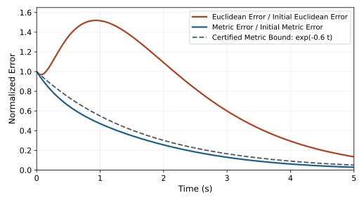

# Contraction Theory and Metric Certificates
[]{#ch-contraction}
[]{#laymans-shrinking_mistakes}


Contraction asks how differences between solutions evolve under the same specified dynamics. In a golf model, that question is incomplete until we identify the state, the feedback policy, the perturbation, the comparison clock and the delivery outcome. Two swings can approach the same geometric path while arriving at different times; two clubheads can arrive similarly while internal joint states differ. Full-state, same-time contraction is one precise and demanding property among these possibilities.

The useful promise is conditional: a verified differential inequality can bound an entire family of perturbations without simulating every initial condition. The work is to establish that inequality over an appropriate domain, connect its metric to physical units, and show that the implemented controller and contact events satisfy its assumptions. A positive stiffness, a negative instantaneous eigenvalue or a visually repeatable motion is not that certificate.

## Historical Context and the Shift to Trajectory Stability

### From Lyapunov Point Stability to Trajectory Convergence

Lyapunov stability means that sufficiently small initial errors remain small. Asymptotic stability adds convergence; exponential stability adds a uniform exponential estimate. Lyapunov methods can analyze equilibria, moving reference trajectories, invariant sets and pairs of solutions. Contraction therefore does not repair an inability of Lyapunov theory to address motion. It provides a differential route to an incremental property: convergence of trajectories to one another.

For example, $\dot x=-x^3$ has an asymptotically stable equilibrium, with solution $x(t)=x_0/\sqrt{1+2x_0^2t}$. Its decay is not uniformly exponential near zero. Conversely, $\dot x=-x+t$ contracts between solutions at rate one although its solutions grow approximately like $t-1$. Relative convergence and absolute boundedness are separate questions. These distinctions matter when a nominal movement is intentionally fast and far from an equilibrium.

Controllability asks which states can be reached by choosing inputs. Contraction asks how solutions approach under specified dynamics. They are not a general mathematical duality: $\dot x=-x$ contracts without any control input, whereas the controllable integrator $\dot x=u$ preserves offsets under a common open-loop input. Control contraction metrics connect these questions through feedback design under additional hypotheses.

### The Lohmiller--Slotine Framework (1998)

Lohmiller and Slotine [@LohmillerSlotine1998] develop convergence analysis using differential displacements and a changing metric. Their construction also explains why a differential coordinate transformation need not integrate to a global coordinate change. We use that framework while stating the domain and physical-distance assumptions explicitly below.

### Demidovich and Earlier Constant-Metric Conditions

[]{#demidovichs-condition-1961-an-historical-precursor}

[]{#ref-Demidovich1961}

Earlier convergence work includes constant-metric Jacobian conditions associated with Demidovich. The identity-metric condition is a particularly transparent sufficient case, not the entirety of that historical work. The modern control and transverse-contraction papers place these results within a longer development of incremental stability; no claim that one paper originated every version of the idea is needed for our argument.

### Connection to Modern Research

Contraction can support tracking, synchronization, observer analysis and verified controller synthesis. Each application changes what is compared. An observer compares estimated and actual states under an observation model; synchronization compares subsystems under their coupling; a controller compares a feasible reference with the controlled motion. A learned metric is a candidate mathematical certificate until its residual and domain have been verified. None of these constructions alone identifies the objective used by a nervous system.

## From Equilibrium Stability to Trajectory Stability

Fix a physical state representation and time coordinate. If angular positions, angular velocities and activation states are mixed, first specify their scales. For dimensionless coordinates $\xi=D^{-1}x$, a metric $M_x$ becomes $M_\xi=D^T M_xD$. Euclidean error and matrix condition numbers depend on this choice. A certificate should report its physical interpretation, rather than compare a metre with a radian per second as if their raw numbers were interchangeable.

We compare solutions under a common vector field. If $u=\pi(x,t)$ is the implemented policy, the field is $F(x,t)=f(x,t)+G(x,t)\pi(x,t)$ and its Jacobian includes the policy derivative. If instead a measured torque trace is replayed as an open-loop signal, that produces a different variational system. Both are legitimate experiments, but they answer different questions about robustness.

## The Contraction Condition
[]{#laymans-metric_tensor_reminder}

Consider the generally nonautonomous system
[]{#eq-ch4:system}


$$
\dot x=f(x,t),\qquad x\in\mathcal D\subseteq\mathbb R^n.
$$


Assume the field is sufficiently smooth in $x$, with unique solutions existing for the time interval considered. A tangent perturbation obeys
[]{#eq-ch4:variational}


$$
\dot{\delta x}=A(x,t)\delta x,\qquad A=D_xf.
$$


For a smooth symmetric positive-definite metric $M(x,t)$, define
[]{#eq-ch4:lyapunov-perturbation}


$$
V(x,\delta x,t)=\delta x^T M(x,t)\delta x.
$$


The product rule gives exactly three terms:
[]{#eq-ch4:Vdot}


$$
\dot V=\dot{\delta x}^{\,T}M\delta x+\delta x^T\dot M\delta x+
\delta x^TM\dot{\delta x}
=\delta x^T(A^TM+MA+\dot M)\delta x,
$$


where the material derivative follows the complete field:
[]{#eq-ch4:Mdot}


$$
\dot M=\partial_tM+\sum_i f_i\partial_{x_i}M.
$$


::: {.callout-note}
### Differential Contraction at Rate $\lambda$

[]{#def-ch4:contraction}
A metric certifies differential contraction at rate $\lambda>0$ on a stated domain and interval when
[]{#eq-ch4:contraction-LMI}


$$
A^TM+MA+\dot M\preceq-2\lambda M
$$


holds throughout them. The order is the positive-semidefinite matrix order: $H\preceq0$ means $z^THz\leq0$ for every vector $z$.

:::


The rate has units of inverse time. The factor two applies to squared length; length decays at rate $\lambda$. The inequality is linear in an unknown metric for a fixed field and fixed rate, but jointly choosing the rate and metric introduces the product $\lambda M$.

## Complete Proof of Exponential Convergence

::: {.callout-note}
### From Transported Curves to Finite Distance

[]{#thm-ch4:convergence}
Suppose $\mathcal D$ is path-connected and forward invariant, the flow is forward complete there, and the contraction inequality holds along all its trajectories. Define $d_{M,t}$ as the infimum of metric lengths of piecewise smooth curves contained in $\mathcal D$. Then
[]{#eq-ch4:geodesic-decay}


$$
d_{M,t}(x_1(t),x_2(t))\leq e^{-\lambda(t-t_0)}
d_{M,t_0}(x_1(t_0),x_2(t_0)).
$$


If additionally $\mathcal D$ is Euclidean convex and
[]{#eq-ch4:metric-bounds}


$$
0<\underline m I\preceq M(x,t)\preceq\overline m I<\infty
$$


uniformly, then
[]{#eq-ch4:euclidean-decay}


$$
\|x_1(t)-x_2(t)\|\leq\sqrt{\overline m/\underline m}\,
e^{-\lambda(t-t_0)}\|x_1(t_0)-x_2(t_0)\|.
$$


On a finite interval, the same argument gives only the corresponding finite-interval guarantee.

:::


::: {.callout-note}
### Proof

Choose any admissible initial curve $c_0(s)$, $0\leq s\leq1$, joining the initial states. Transport every point by the same flow: $c(s,t)=\phi_{t,t_0}(c_0(s))$. Forward invariance keeps this entire curve in the certified domain. Its tangent $w=\partial_sc$ satisfies
[]{#eq-ch4:tangent-evolution}


$$
\partial_tw=A(c(s,t),t)w.
$$


This identity belongs to the transported curve; it is generally false for a newly minimizing geodesic independently recomputed at every time.

Set
[]{#eq-ch4:geodesic-V}


$$
V(s,t)=w(s,t)^TM(c(s,t),t)w(s,t).
$$


The product rule and the hypothesis yield
[]{#eq-ch4:Vdot-bound}


$$
\partial_tV(s,t)\leq-2\lambda V(s,t),
$$


and scalar integration gives
[]{#eq-ch4:gronwall-result}


$$
V(s,t)\leq e^{-2\lambda(t-t_0)}V(s,t_0).
$$


Integrating its square root over $s$ bounds the transported length:
$L_t(c)\leq e^{-\lambda(t-t_0)}L_{t_0}(c_0)$.
The shortest possible final length is no greater than this particular final length. Taking the infimum over initial curves proves the distance bound, without requiring a minimizing geodesic to exist.

For completeness, if an initial minimizing curve is parameterized at constant speed on $[0,1]$, its speed is its length, so
[]{#eq-ch4:unit-tangent}


$$
w(s,t_0)^TM(c_0(s),t_0)w(s,t_0)=d_{M,t_0}^2(x_1,x_2),
$$


not generally one. Curve energy $\int_0^1V\,ds$ equals squared length only at constant speed, and the transported curve need not remain minimizing or constant-speed.

Finally, every connecting curve has metric length at least $\sqrt{\underline m}\|x_1-x_2\|$. The straight initial segment, available by Euclidean convexity, has length at most $\sqrt{\overline m}\|x_1(t_0)-x_2(t_0)\|$. Combining these bounds proves the stated physical estimate. In a nonconvex domain the intrinsic-distance result still applies, but an upper bound involving the initial Euclidean chord needs an additional path-length comparison.

:::


A changing ruler must not hide physical expansion. For $\dot x=x$ and $M(t)=e^{-4t}$, the differential inequality holds with $\lambda=1$, even though physical errors grow as $e^t$. The missing lower metric bound explains the discrepancy. Its scalar condition number is always one, so a condition-number bound alone cannot replace uniform scale bounds.

## The Identity Metric: Symmetric Jacobian Condition

For $M=I$,
[]{#eq-ch4:symmetric-condition}


$$
\operatorname{sym}(A)=\tfrac12(A+A^T)\preceq-\lambda I.
$$


Negative real parts of the eigenvalues of a fixed matrix imply asymptotic linear stability, but not contraction in the identity metric. For time-varying matrices, instantaneous eigenvalues alone do not even establish asymptotic stability. The symmetric part measures instantaneous Euclidean length growth; the full variational flow determines accumulated finite-time amplification.

More generally, the sharp signed local rate is $-\tfrac12\lambda_{\max}(H,M)$, where $H=A^TM+MA+\dot M$ and $\lambda_{\max}(H,M)$ is the largest generalized eigenvalue. It is a diagnostic at a point until a uniform bound is established on the required domain. Negative values mean that this metric allows instantaneous expansion.

## Worked Example: A Simple Linear System
[]{#sec-ch4:example}

### Problem Setup

In scaled coordinates, consider
[]{#eq-ch4:example-system}


$$
\dot x=Ax,\qquad A=\begin{bmatrix}-2&1\\0&-3\end{bmatrix}\ \mathrm{s}^{-1}.
$$


For a constant metric the required inequality is
[]{#eq-ch4:example-LMI}


$$
A^TM+MA\preceq-2\lambda M.
$$


### Checking the Symmetric Jacobian

Here $\operatorname{sym}(A)=[[-2,1/2],[1/2,-3]]$, with eigenvalues $(-5\pm\sqrt2)/2$. Therefore the identity metric certifies
$\lambda_I=(5-\sqrt2)/2\simeq1.792893\ \mathrm{s}^{-1}$.
The eigenvalues of $A^T+A$ are twice those values. Its positive off-diagonal entries do not invalidate negative definiteness: the condition concerns the entire quadratic form, not the sign of each entry.

### Finding the Contraction Metric via the Lyapunov Equation


For $M=[[a,b],[b,c]]$, direct multiplication gives


$$
A^TM+MA=\begin{bmatrix}-4a&a-5b\\a-5b&2b-6c\end{bmatrix}.
$$


In the chosen numerical units, solving $A^TM+MA=-I$ gives
$M=[[1/4,1/20],[1/20,11/60]]$.
Its eigenvalues are $(13\pm\sqrt{13})/60$, so its sharp rate is
$\lambda_M=30/(13+\sqrt{13})\ \mathrm{s}^{-1}$.
The metric $M_*=[[1,1],[1,2]]$ instead gives $A^TM_*+M_*A+4M_*=[[0,0],[0,-2]]$, attaining rate $2\ \mathrm{s}^{-1}$. A larger constant-metric rate is impossible along the eigenvector whose solution decays exactly as $e^{-2t}$.

Multiplying a metric by a positive scalar does not change its certified rate. For an unknown metric, fix $\lambda$, impose positive metric bounds or a normalization, and solve a feasibility problem. Searching rates by bisection is distinct from calling a joint optimization in $(M,\lambda)$ one LMI. Nonlinear domain certification and controller constraints require further work.

## Partial Contraction: Hierarchical Structure
[]{#sec-ch4:partial}

### When Not All Directions Contract

Partial contraction methods establish convergence toward a specified property or subspace, often through an auxiliary contracting system. A contracting subsystem is not automatically a fully contracting system. For example, $\dot q=v$, $\dot v=-\gamma(v-u(t))$ damps velocity differences, but solutions with equal velocities and different initial positions retain their position offset forever.

### The Hierarchical Contraction Theorem

For a triangular variational system, write
[]{#eq-ch4:block-jacobian}


$$
A=\begin{bmatrix}A_{11}&A_{12}\\0&A_{22}\end{bmatrix}.
$$


Choose block factors $M_i=\Theta_i^T\Theta_i$ whose total derivatives follow the full field. In transformed tangent coordinates,
[]{#eq-ch4:cascade-jacobian}


$$
F=(\dot\Theta+\Theta A)\Theta^{-1}
=\begin{bmatrix}F_{11}&C\\0&F_{22}\end{bmatrix},\qquad
C=\Theta_1A_{12}\Theta_2^{-1}.
$$


The coupling $C$ has already been transformed; it should not receive a second metric transformation.

::: {.callout-note}
### A Weighted Cascade Certificate

[]{#thm-ch4:partial}
Suppose uniformly $\operatorname{sym}(F_{ii})\preceq-\lambda_iI$, with $\lambda_i>0$, and $\|C\|\leq k$. For a target $0<\lambda<\min(\lambda_1,\lambda_2)$, choose
[]{#eq-ch4:block-metric}


$$
M_\theta=\begin{bmatrix}M_1&0\\0&\theta M_2\end{bmatrix},\qquad
\theta>\frac{k^2}{4(\lambda_1-\lambda)(\lambda_2-\lambda)}.
$$


This metric certifies differential contraction at least at rate $\lambda$. Finite-distance conclusions retain the earlier domain and metric-bound assumptions.

:::


Indeed, the off-diagonal transformed block becomes $C/\sqrt\theta$. The excess over the desired decay is bounded by the scalar two-block quadratic form with diagonal entries $-(\lambda_1-\lambda)$, $-(\lambda_2-\lambda)$ and off-diagonal entry $k/(2\sqrt\theta)$. The displayed inequality makes it negative definite. Increasing $\theta$ weights the second block more heavily and reduces its normalized coupling into the first.

For
[]{#eq-ch4:cascade-counterexample}


$$
\dot x_1=-x_1+4x_2,\qquad\dot x_2=-x_2,
$$


the identity metric has signed local rate $-1$, despite both eigenvalues being $-1$. With $M=\operatorname{diag}(1,25)$ the rate is $0.6$. The exact flow includes $4te^{-t}$, so a rate-one estimate with a finite uniform prefactor is impossible for all time. Rates below one are available; the minimum diagonal rate need not be attained.

For initial error $\delta x(0)=(0,1)^T$, the Euclidean error is $e^{-t}\sqrt{1+16t^2}$, which rises above its initial value after a short initial decline, while the metric error divided by its own initial value is $e^{-t}\sqrt{25+16t^2}/5$. The latter stays below $e^{-0.6t}$. Normalizing each curve by its own initial norm makes the comparison legible without pretending the two rulers measure the same numerical length.

On a narrow screen, scroll the plot horizontally to read its labels, or [open the full-size plot](../figures/contraction_cascade.svg).

::: {#fig-contraction_cascade}
::: {.contraction-diagram-scroll role="region" aria-label="Cascade error norms; scroll horizontally" tabindex="0"}

:::

Transient Euclidean Growth and Certified Metric Decay for the Same Cascade. Each Norm Is Divided by Its Own Initial Value; the Metric Is $\operatorname{diag}(1,25)$.
:::

An illustrative cascade is
[]{#eq-ch4:mech-example}


$$
\dot q=-\alpha q+v,\qquad\dot v=-\gamma(v-u(t)),\qquad\alpha,\gamma>0.
$$


Here $v$ is an auxiliary driving state, not literally $\dot q$ when $\alpha\ne0$. Its cascade certificate needs the target-rate-dependent weight above. Setting $\alpha=0$ recovers the offset-preserving integrator, which cannot be uniformly exponentially contracting in a uniformly nondegenerate full-state metric. A mechanical linkage's kinematic ordering alone does not establish this triangular dynamical structure.

## Control Contraction Metrics: Design and Duality
[]{#sec-ch4:ccm}

### Feedback Design Under Contraction

Consider
[]{#eq-ch4:controlled-system}


$$
\dot x=f(x,t)+G(x,t)u,\qquad G=[g_1,\ldots,g_m].
$$


The differential system is $\dot{\delta x}=A(x,u,t)\delta x+G\delta u$, with
$A=D_xf+\sum_i u_iD_xg_i$.
For a differential feedback $\delta u=-K(x,u,t)\delta x$,
[]{#eq-ch4:closed-loop-jacobian}


$$
A_{\mathrm{diff}}=A-GK.
$$


This is not the instruction $u=-K\delta x$ for a finite state. If a smooth implemented feedback is already known, use its actual derivative. Conversely, constructing a matrix field $K$ does not guarantee that it is the Jacobian of a single feedback function; integration along state-space paths provides a more general construction.

The differential feedback condition is
[]{#eq-ch4:CCM-nonlinear}


$$
\dot M+(A-GK)^TM+M(A-GK)+2\lambda M\preceq0,
$$


where $\dot M=\partial_tM+\partial_{f+Gu}M$. Both the input-dependent Jacobian and the metric's derivative along the controlled field are required.

### The Dual Formulation: Inverse Metric

[]{#the-dual-formulation-w-m-1}

Differentiate $MW=I$ to obtain $\dot W=-W\dot MW$. Congruence of the preceding inequality by $W$, with $Y=KW$, gives
[]{#eq-ch4:W-space-LMI}


$$
-\dot W+AW+WA^T-GY-Y^TG^T+2\lambda W\preceq0.
$$


The derivative is $-\dot W$, the rate term is $+2\lambda W$, and the stabilizing input terms carry minus signs for our convention $\delta u=-K\delta x$. A source using $\delta u=K\delta x$ has the corresponding plus signs. A congruence preserves the matrix order, not its raw eigenvalues.

### Pointwise LMI for Feedback Synthesis

For
[]{#eq-ch4:LTV-system}


$$
\dot x=A(t)x+G(t)u,
$$


one may choose $Y=\tfrac12\rho G^T$, obtaining
[]{#eq-ch4:pointwise-LMI}


$$
-\dot W+AW+WA^T-\rho GG^T+2\lambda W\preceq0,\qquad
K=\tfrac12\rho G^TW^{-1}.
$$


At fixed $\lambda$, this is linear in the unknown functions $W$ and $\rho$. It is a differential matrix inequality over time, not unrelated algebraic tests that may be solved independently at each instant. The multiplier $\rho$ creates feedback authority in actuated directions; it is not automatically a penalty or bound on physical effort.

For nonlinear systems, one useful sufficient construction imposes the stronger conditions


$$
\begin{aligned}
-\partial_tW-\partial_fW+(D_xf)W+W(D_xf)^T
-\rho GG^T+2\lambda W&\prec0,\\
\partial_{g_i}W-(D_xg_i)W-W(D_xg_i)^T&=0\quad\text{for every }i.
\end{aligned}
$$


The equalities cancel the terms proportional to arbitrary input values. Together with a smooth uniformly bounded positive metric and the complete-space/solution hypotheses, these conditions support the control contraction metric construction of Manchester and Slotine [@ManchesterSlotine2017]. They are sufficient conditions, not a claim that every stabilizable system must satisfy this particular parameterization.

The associated gain $K(x,t)=\tfrac12\rho(x,t)G(x,t)^TM(x,t)$ is independent of $u$. Given a feasible reference $(x_*,u_*)$ and a curve $c(s)$ joining $x_*$ to $x$, construct a path of controls by
$u(s)=u_*-\int_0^sK(c(r),t)c_r(r)\,dr$.
Transporting that curve with its controls, or recomputing suitable geodesics in a sampled/continuous construction under the theorem's conditions, converts differential contraction into finite tracking. Path existence, solution existence and controller regularity are part of the result. A domain restriction or an actuator limit must be incorporated explicitly; the unconstrained theorem does not certify saturation, muscle activation limits or unilateral ground contact.

### Computational Approaches

[]{#sum-of-squares-sos-method}

[]{#neural-network-parameterization}

[]{#sampling-and-conservative-approximation}

For polynomial data, a domain certificate can require $M-\underline mI$ and the negative contraction residual to be positive-semidefinite through sum-of-squares representations, with suitable polynomial multipliers for the domain. The residual must include the desired $2\lambda M$ margin and all material derivatives. Such certificates are sufficient and may be conservative; failure of a selected polynomial degree does not prove that no smooth metric exists.

A neural parameterization may use $M=L(x,t)^TL(x,t)+\varepsilon I$, with $L\in\mathbb R^{p\times n}$ and $\varepsilon>0$. A vector-valued $L\in\mathbb R^p$ alone does not produce the required $n\times n$ matrix. A positive floor ensures positivity, but upper bounds and a certified contraction residual remain necessary. Optimizer convergence is not a proof of either.

Sampling is useful for finding and falsifying candidates. It is not automatically conservative between samples. For a symmetric residual $H$, suppose every point is within distance $h$ of a sample and a verified operator-norm Lipschitz constant is $L_H$. A sampled margin $\lambda_{\max}(H)\leq-\eta$ extends across that coverage only if $L_Hh<\eta$, with the region, boundaries, inputs and times all covered. This follows from the eigenvalue perturbation bound. Without such an argument, report sampled feasibility as sampled feasibility.

## Discrete-Time Contraction
[]{#sec-ch4:discrete}

### Discrete Contraction Condition

Consider the actual implemented map
[]{#eq-ch4:discrete-system}


$$
x_{k+1}=\Phi_k(x_k),\qquad J_k=D_x\Phi_k.
$$


Assume the smooth map sends its certified path-connected domain into the next certified domain. A sequence of metrics satisfying
[]{#eq-ch4:discrete-metric-bounds}


$$
0<\underline mI\preceq M_k(x)\preceq\overline mI
$$


and
[]{#eq-ch4:discrete-contraction-condition}


$$
J_k(x)^TM_{k+1}(\Phi_k(x))J_k(x)\preceq\rho^2M_k(x),\qquad0<\rho<1,
$$


gives the following result.

::: {.callout-note}
### Discrete Distance Contraction

[]{#thm-ch4:discrete-contraction}
Under these domain and differential inequalities,
[]{#eq-ch4:discrete-geodesic-decay}


$$
d_{M_k}(x_k^{(1)},x_k^{(2)})\leq\rho^k d_{M_0}(x_0^{(1)},x_0^{(2)}).
$$


With a Euclidean-convex initial domain, the physical bound is
[]{#eq-ch4:discrete-euclidean-decay}


$$
\|x_k^{(1)}-x_k^{(2)}\|\leq\sqrt{\overline m/\underline m}\,
\rho^k\|x_0^{(1)}-x_0^{(2)}\|.
$$


:::


To prove it, map an entire connecting curve: $c_{k+1}(s)=\Phi_k(c_k(s))$. Its tangent obeys $\partial_sc_{k+1}=J_k(c_k)\partial_sc_k$. The metric length shrinks by at least $\rho$; take infima and iterate. An arbitrary finite difference does not equal one endpoint Jacobian times the previous difference. Even $\Phi(x)=\tfrac12\tanh x$ illustrates this distinction while remaining globally contractive in the identity metric.

For sample period $\Delta t$, the equivalent length-decay rate is $-\log\rho/\Delta t$. An exact flow map of a continuously contracting system inherits the corresponding factor, but a numerical integrator need not. For $\dot x=-ax$, explicit Euler gives $1-a\Delta t$, which contracts only when $0<a\Delta t<2$. A digital controller must be checked as its actual sampled map, including held inputs and computation delays.

### Connection to Riccati Analysis

For a stabilizing discrete LQR design, substitution into the Riccati equation gives
$A_c^TPA_c=P-Q-K^TRK$.
If $P\succ0$ and $Q+K^TRK\succeq(1-\rho^2)P$, this is a contraction certificate for the implemented closed loop. A semidefinite dissipation may require a multi-step argument instead of strict one-step decay. There is no universal theorem that contraction gives tighter guarantees than Riccati analysis; the latter can supply a particular metric, and both must be interpreted with their hypotheses and measured quantity.

## Numerical Example: Van der Pol Oscillator
[]{#sec-ch4:vdp}

### System Description

The unforced Van der Pol system is
[]{#eq-ch4:vdp-system}


$$
\dot x_1=x_2,\qquad\dot x_2=-x_1+\epsilon(1-x_1^2)x_2,\qquad\epsilon>0,
$$


with
[]{#eq-ch4:vdp-jacobian}


$$
A=\begin{bmatrix}0&1\\-1-2\epsilon x_1x_2&\epsilon(1-x_1^2)\end{bmatrix}.
$$


No feedback input appears in this equation. It has an unstable equilibrium at the origin and an attracting nonconstant periodic orbit. Two solutions at different phases on that orbit cannot converge to each other at the same clock time. Full contraction on a domain containing the complete orbit is therefore impossible in a uniformly nondegenerate metric.

### Metric Synthesis via Parameterization

For a diagonal candidate
[]{#eq-ch4:vdp-metric-ansatz}


$$
M(x_1)=\operatorname{diag}(m_1(x_1),m_2(x_1)),
$$


write $H=A^TM+MA+\dot M+2\lambda M$. Its entries are
[]{#eq-ch4:vdp-cc-11}
[]{#eq-ch4:vdp-cc-22}
[]{#eq-ch4:vdp-cc-12}


$$
\begin{aligned}
H_{11}&=m_1'(x_1)x_2+2\lambda m_1,\\
H_{22}&=2\epsilon(1-x_1^2)m_2+m_2'(x_1)x_2+2\lambda m_2,\\
H_{12}&=H_{21}=m_1+(-1-2\epsilon x_1x_2)m_2.
\end{aligned}
$$


The condition is $H\preceq0$, not componentwise inequalities on its off-diagonal entries. In two dimensions this requires $H_{11}\leq0$, $H_{22}\leq0$ and $\det H\geq0$. If $m_1$ is a positive constant, $H_{11}=2\lambda m_1>0$ for every positive requested rate. That alone disproves this entire candidate class for full contraction, at every point.

### Solution Strategy

The formerly proposed example
[]{#eq-ch4:vdp-metric-solution}


$$
M(x_1)=\operatorname{diag}\bigl(1,1.2(1+1.5x_1^2)\bigr),\quad
\epsilon=0.5,\quad\lambda=0.3
$$


is retained only as a falsification exercise. At the origin its residual is
[]{#eq-ch4:vdp-check}


$$
H(0)=\begin{bmatrix}0.6&-0.2\\-0.2&1.92\end{bmatrix}\not\preceq0.
$$


Its velocity weight increases with $|x_1|$, not toward the origin. No successful optimizer or experimentally measured rate is claimed. The diagonal obstruction is stronger than a finite grid of violations.

The appropriate orbital question allows phase alignment. Transverse contraction tests decay only for nonzero tangent directions satisfying $\delta x^TMf=0$, with the associated field/metric derivatives and domain conditions. Manchester and Slotine's transverse framework [@ManchesterSlotineTransverse2013] requires a compact, smoothly path-connected, strictly forward-invariant set and appropriate regularity; an absence of equilibria distinguishes a nontrivial cycle from an equilibrium limit. It establishes convergence after a time reparameterization, not same-time tracking of a prescribed phase. We do not assert that the rejected diagonal candidate satisfies a transverse certificate.

A periodic orbit or multiple equilibria can obstruct a claimed global full-contraction domain. An invariant set of positive dimension by itself does not: the whole line is invariant under $\dot x=-x$ and the system contracts. An infeasible numerical search should be investigated using the actual obstruction, domain, metric class and solver residual.

## Robustness Margins From Contraction

### Disturbance Attenuation via Contraction Rate

First use a state-independent metric $M(t)$ to make the additive-disturbance claim precise. Compare the nominal $\dot x_0=f(x_0,t)$ with
[]{#eq-ch4:perturbed-system}


$$
\dot x_d=f(x_d,t)+d(t),\qquad\|d(t)\|\leq D.
$$


Assume both solutions and their connecting segments remain in a Euclidean-convex certified domain, the nominal Jacobian inequality holds throughout it, and the metric has the uniform bounds above. Integrating $f(x_d,t)-f(x_0,t)$ along the segment gives, for $r=\sqrt{(x_d-x_0)^TM(t)(x_d-x_0)}$, the upper derivative bound $D^+r\leq-\lambda r+\sqrt{\overline m}D$. It also holds at $r=0$ in the upper-derivative sense.

::: {.callout-note}
### Nominal-to-Perturbed Error Bound

[]{#thm-ch4:disturbance-rejection}
Under the preceding assumptions, with $\tau=t-t_0$,
[]{#eq-ch4:ultimate-bound}


$$
\|x_d(t)-x_0(t)\|\leq\sqrt{\overline m/\underline m}\left[
e^{-\lambda\tau}\|x_d(t_0)-x_0(t_0)\|+
\frac{D}{\lambda}(1-e^{-\lambda\tau})\right].
$$


Consequently, if the assumptions continue for all time,
[]{#eq-ch4:ultimate-bound-steady}


$$
\limsup_{t\to\infty}\|x_d(t)-x_0(t)\|\leq
\sqrt{\overline m/\underline m}\,D/\lambda.
$$


:::


The proof is integration of the scalar comparison inequality, followed by the metric bounds. For two disturbed trajectories, replace $D$ by a bound on $\|d_1-d_2\|$, which may be $2D$ if each disturbance is separately bounded by $D$. A common additive disturbance cancels in the difference when the metric is state-independent. For a state-dependent metric, its material derivative changes with the disturbance; a nominal drift-only certificate does not automatically cover that change.

### Practical Implications

Increasing a verified rate reduces this error bound when the forcing bound and metric comparison remain fixed. Controller changes can alter all three, including the disturbance generated by noisy measurements. A bounded error relative to a growing nominal trajectory is not a bounded state. Neither this inequality nor the contraction condition alone is a general guarantee that a stronger feedback gain is beneficial or feasible.

## Incremental Input-to-State Stability (ISS)

### ISS vs. Contraction

Input-to-state stability bounds the state by a decaying function of initial error and a gain of the input magnitude, relative to an appropriate zero-input equilibrium. Bounded-input/bounded-state behavior is only part of that statement. Incremental ISS instead bounds the difference between two solutions by their initial difference and input difference. Differential ISS is a tangent-level formulation; finite-distance conclusions require integration and geometry.

::: {.callout-note}
### A Uniform Input-Family Certificate

[]{#prop-ch4:contraction-iss}
For $\dot x=f(x,t)+G(x,t)u$, assume the contraction inequality, including $A=D_xf+\sum_i u_iD_xg_i$ and $\dot M=\partial_tM+\partial_{f+Gu}M$, holds uniformly for a convex admitted input set. Assume the input-interpolated trajectories and connecting curves stay in the certified domain, and $\|M^{1/2}G\|\leq\overline G_M$. Then
[]{#eq-ch4:diff-ISS-bound}


$$
\|x_1(t)-x_2(t)\|\leq\sqrt{\overline m/\underline m}e^{-\lambda\tau}
\|x_1(t_0)-x_2(t_0)\|+
\frac{\overline G_M}{\lambda\sqrt{\underline m}}(1-e^{-\lambda\tau})
\sup_{s\in[t_0,t]}\|u_1(s)-u_2(s)\|,
$$


provided the initial chord comparison is valid as above.

:::


To see the input term, interpolate $u(s,t)=(1-s)u_1(t)+su_2(t)$ along a transported family. Its tangent dynamics acquire $G\partial_su$; Cauchy--Schwarz bounds the metric-length derivative by $-\lambda$ times length plus $\overline G_M\|u_2-u_1\|$. Integrate over the path and time. If only a Euclidean bound $\|G\|\leq\overline G$ is known, use $\overline G_M\leq\sqrt{\overline m}\,\overline G$. Omitting this metric factor changes the bound under a harmless rescaling of the ruler.

This proposition makes the required uniformity explicit. Contraction of one unforced field is not by itself incremental ISS of every controlled field. Ordinary ISS and contraction also have no unconditional implication ordering when their reference, input class and domains differ.

## Extended Lyapunov Comparison

### Unified Perspective

| Property | What the Stated Property Establishes |
| --- | --- |
| Lyapunov stability | Small initial errors remain small near the specified solution or set. |
| Asymptotic stability | Stability and eventual convergence; an exponential rate need not exist. |
| Exponential stability | A uniform exponential bound relative to the specified solution. |
| Incremental stability | A relationship between solution pairs, with their inputs specified. |
| Contraction certificate | A differential inequality that integrates to pairwise convergence under the stated domain and metric assumptions. |

: Distinct Stability Properties and Their Comparison Objects {#tbl-tbl_ch4_lyapunov-contraction}

[]{#tbl-ch4:lyapunov-contraction}


### Formal Relationships

::: {.callout-note}
### An Equilibrium as the Comparison Solution

[]{#prop-ch4:contraction-lyapunov}
If an equilibrium $x_*$ lies in the forward-invariant contraction domain with the required metric/path bounds, using $x_2(t)=x_*$ gives exponential attraction and stability relative to that domain. A suitable finite-distance Lyapunov function is
[]{#eq-ch4:induced-lyapunov}


$$
\mathcal V(x,t)=d_{M,t}(x,x_*)^2,
$$


which decays at least as $e^{-2\lambda\tau}$. At nonsmooth distance points interpret the statement through the finite-time inequality or upper derivative.

:::


In general $\mathcal V$ is not $(x-x_*)^TM(x)(x-x_*)$. For a concrete counterexample, let $z=\phi(x)=x+0.8\sin x$, so $0.2\leq\phi'(x)\leq1.8$, and define $\dot x=-\phi(x)/\phi'(x)$. In $z$ coordinates this is $\dot z=-z$, so $M(x)=\phi'(x)^2$ is a uniformly bounded contraction metric. The squared distance to zero is $\phi(x)^2$. The endpoint surrogate $x^2\phi'(x)^2$ has derivative
$2x\phi'(x)[\phi'(x)+x\phi''(x)]\dot x$, which is positive at $x=2$. The distinction is a real failure of the proposed Lyapunov argument, not a notational preference.

## Contraction in Biomechanical Systems

### What Impedance Can Establish

[]{#why-biological-motor-systems-are-naturally-contracting}

Mechanical impedance describes force response to motion; a contraction metric measures tangent-state error in a dynamical model. They are related through the equations of motion, but are different objects. Franklin and colleagues' arm-reaching experiment [@Franklin2003Stiffness] found direction-specific stiffness adaptation under unstable interactions, including changes not explained by altered net joint torque. This is evidence about an experimental task and measured mechanical response, not evidence that a golfer implements an optimal Riemannian metric.

Consider the explicitly simplified joint model
$I\ddot q+b\dot q+kq=\tau(t)$, with constant $I,b,k>0$ and a common torque input. For state $(q,v)$ its difference Jacobian is $A=[[0,1],[-k/I,-b/I]]$. This constant matrix is Hurwitz, so a positive solution of an appropriate Lyapunov equation supplies a full-state contraction metric. That is a model calculation; it does not require identifying the metric with muscle stiffness or joint inertia.

Mechanical error energy $E=\tfrac12(k\delta q^2+I\delta v^2)$ has derivative $\dot E=-b\delta v^2$. At nonzero position error and zero velocity error this derivative is zero, so this particular energy does not establish strict instantaneous contraction in every state direction. A different full-state metric can include position--velocity cross terms.

Nor does greater stiffness necessarily increase the asymptotic decay rate. In the underdamped constant model the eigenvalue real part is $-b/(2I)$, independent of $k$. Excessive damping can introduce a slow overdamped mode. Changing coactivation can alter stiffness, damping, activation state, metabolic cost and sensory response together; a verified comparison must use the resulting complete dynamics and admissible inputs.

Reflex delays require delayed-state or augmented-state analysis; they are not generally a static subtraction $GK$ that automatically improves a rate. Nonlinear muscle force--length--velocity relations, tendon compliance and state-dependent moment arms also change the Jacobian. The preceding two-state model is a transparent teaching example, not a complete neuromusculoskeletal certificate or a clinical prescription.

### Partial Contraction in Sequential Motion

The torso--arm--club chain defines kinematic relationships. Its dynamics generally couple the links in both directions through the mass matrix, interaction forces and contact constraints. Applying a cascade theorem requires an actual triangular representation or a justified approximation with quantified residual coupling. Segment size, muscular strength and the order of speed peaks do not supply those hypotheses or their contraction rates.

Repeatable club delivery may coexist with substantial variation in redundant joint states. That motivates task-space or transverse questions rather than automatically demanding global contraction of every coordinate. However, a projected error that happens to shrink on measured trials is not yet a certificate for all perturbations: the hidden states can feed back into the output later.

### Contraction and the Drift-Dominated Phase

[]{#contraction-and-the-driftdominated-phase}

Whether a phase is drift-dominated must be assessed in a specified model and with a declared comparison of accelerations, work or finite-horizon control authority. Rapid motion and large Coriolis terms do not by themselves establish negligible muscular influence. In a conservative passive model, energy and phase information can persist; inertial coupling redistributes motion without necessarily dissipating all perturbations.

For a specified policy and nominal swing, integrate $\dot\Phi=A_{\mathrm{cl}}(t)\Phi$, $\Phi(t_0)=I$. At a fixed terminal time, an output $y=h(x(t_f))$ has first-order sensitivity $\delta y=D h\,\Phi(t_f,t_0)\delta x_0$. This expression joins geometry, inertia, the torque/contact policy and the perturbation history. A contraction bound can upper-bound part of that map, but its usefulness depends on metric conditioning and output sensitivity. A merely contracting state metric does not optimize clubhead speed or ball-flight accuracy.

Impact is often state-triggered. Then the event-time derivative and reset/contact sensitivity enter the outcome map; a flow-only certificate need not survive the event. A useful research test specifies perturbation directions, measurement uncertainty, a feasible controller and an outcome such as clubface orientation or impact location, then compares predicted response bounds with held-out perturbations. Separate trials should retain their own noise and participant structure. This is a route to testing the robustness hypothesis, not a deduction of expert strategy from a sequence plot.

## Stochastic Contraction

### Systems With Brownian Perturbations

For an Itô model
[]{#eq-ch4:sde}


$$
dx=f(x,t)\,dt+\sigma(x,t)\,dW_t,
$$


state which noise is shared between the compared solutions. A common-noise comparison asks whether different initial states synchronize under the same random forcing. Independent-trial repeatability is a different quantity. Pham, Tabareau and Slotine [@PhamTabuadaSlotine2009] explicitly analyze independent Wiener processes using state-independent metrics and a bounded diffusion trace.

### The Stochastic Contraction Condition

The following state-independent-metric version has an elementary generator proof. Assume well-posed solutions with the integrability needed for Itô's formula and finite second moments, initial states independent of future noise, a common metric $M(t)$ with uniform positive bounds, and the deterministic contraction inequality globally. Suppose
$\operatorname{tr}(\sigma(x,t)^TM(t)\sigma(x,t))\leq C$
uniformly. Compare two solutions driven by independent Wiener processes and set $V=(x_1-x_2)^TM(t)(x_1-x_2)$.

::: {.callout-note}
### Independent-Noise Mean-Square Bound

[]{#thm-ch4:stochastic-contraction}
With $\tau=t-t_0$, the preceding assumptions imply
[]{#eq-ch4:stochastic-bound}


$$
\mathbb E[V(t)]\leq e^{-2\lambda\tau}\mathbb E[V(t_0)]
+\frac{C}{\lambda}(1-e^{-2\lambda\tau}).
$$


:::


The drift contribution is at most $-2\lambda V$, by the same segment argument used for deterministic forcing. Itô's formula adds two diffusion traces, one for each independent solution, totaling at most $2C$. Thus $\frac{d}{dt}\mathbb E V\leq-2\lambda\mathbb E V+2C$ and scalar integration proves the claim. A general state-dependent metric introduces additional stochastic derivative terms and needs a separate theorem; the deterministic material derivative is not enough.

### Connection to Uncertainty Propagation

For the scalar Ornstein--Uhlenbeck process $dx=-ax\,dt+\sigma\,dW$, $a>0$, the solution is
$x(t)=e^{-a\tau}x(t_0)+\sigma\int_{t_0}^te^{-a(t-s)}dW_s$.
The Itô isometry gives three distinct conclusions:

1. One trial with deterministic initial state has variance $\sigma^2(1-e^{-2a\tau})/(2a)$ and stationary variance $\sigma^2/(2a)$.
1. Two independent trials have mean-square difference $e^{-2a\tau}\mathbb E[(x_1(t_0)-x_2(t_0))^2]+\sigma^2(1-e^{-2a\tau})/a$.
1. With the same additive noise realization, the difference is exactly $e^{-a\tau}(x_1(t_0)-x_2(t_0))$; the noise cancels and there is no pairwise additive floor.

These statements do not extend unchanged to multiplicative common noise. For $dx=-ax\,dt+bx\,dW$, the mean-square difference under common noise evolves as $e^{(-2a+b^2)\tau}\mathbb E[\delta x(t_0)^2]$. It grows when $b^2>2a$, even though the deterministic drift contracts.

From the metric bound, an asymptotic upper bound on root-mean-square Euclidean separation is $\sqrt{C/(\lambda\underline m)}$. Expected distance is no larger than RMS distance by Jensen's inequality, but need not equal it or attain this upper bound. An observer claim additionally needs its actual error dynamics, sensor noise and observability assumptions. There is no blanket guarantee that a contracting observer outperforms an extended Kalman filter, or that increasing feedback lowers noise-driven error when the gain itself injects measurement noise.

## Contraction Tubes and Funnel Control

### The Contraction Tube

For a feasible nominal solution $\bar x(t)$, define
[]{#eq-ch4:tube}


$$
\mathcal T_r(t)=\{x\in\mathcal D:d_{M,t}(x,\bar x(t))\leq r\}.
$$


With certified scalar comparison $D^+d_{M,t}\leq-\lambda d_{M,t}+d$, the radius


$$
r(t)=r_0e^{-\lambda\tau}+\frac d\lambda(1-e^{-\lambda\tau})
$$


bounds solutions beginning in $\mathcal T_{r_0}(t_0)$, while the entire tube stays inside the certified domain. It starts at $r_0$ and approaches $d/\lambda$. With $d=0$ it shrinks exponentially. Here $d$ is a bound on forcing in metric-length units, not automatically the raw magnitude of torque or a Euclidean disturbance.

If $M$ is state-independent, these metric balls are ellipsoids in the chosen coordinates, with semi-axis lengths $r/\sqrt{\mu_i(M)}$. A state-dependent metric generally gives curved distance balls. Its endpoint matrix describes a local approximation, not an exact global ellipsoid. A condition number describes relative axis shape; absolute scale and the selected radius determine size.

### Funnel Control

A prescribed positive boundary $\varphi(t)$ can contain a contracting distance when the initial distance is inside it and
$\dot\varphi(t)+\lambda\varphi(t)\geq d$.
At a potential first boundary crossing this condition makes the outward distance derivative no larger than the boundary derivative. In the unforced case it reduces to $\lambda\geq-\dot\varphi/\varphi$. Strict containment needs an appropriate strict initial margin and regularity; the tube and control must remain feasible throughout.

This comparison is not a general funnel-controller design theorem. A gain that diverges near a boundary may violate torque, activation, contact or sampling limits and may not be suitable for the plant's relative degree or internal dynamics. A certified funnel in a golf model must include those restrictions. Its radius at impact can bound a specified state error, but a bound on ball flight requires the separate impact/output map and its uncertainty.

## Reproducible Numerical Checks

The following program runs from the repository root with NumPy and SciPy. The helper reports a signed pointwise rate; it does not search for or certify a metric over a domain.
```python
import numpy as np
from scipy.linalg import solve_continuous_lyapunov
from src.tools.contraction_examples import (
    local_contraction_rate, vdp_candidate_residual,
)

A = np.array([[-2.0, 1.0], [0.0, -3.0]])
M = solve_continuous_lyapunov(A.T, -np.eye(2))
zero = np.zeros((2, 2))
print(local_contraction_rate(A, np.eye(2), zero))
print(M)
print(local_contraction_rate(A, M, zero))

cascade = np.array([[-1.0, 4.0], [0.0, -1.0]])
print(local_contraction_rate(cascade, np.diag([1.0, 25.0]), zero))
print(vdp_candidate_residual(np.zeros(2)))
```
The outputs are the identity rate approximately $1.792893$, the Lyapunov metric given above, its generalized rate $30/(13+\sqrt{13})$, the cascade rate $0.6$, and the rejected Van der Pol residual $[[0.6,-0.2],[-0.2,1.92]]$. Independent checks compare metric decay with exact matrix exponentials, differentiate the nonlinear field and candidate metric numerically, verify the dual congruence, integrate the OU variance and tube forcing, and construct the endpoint-distance counterexample. These calculations test the displayed mathematics; they are not simulated or measured golfer performance.

## Chapter Summary

Contraction turns a differential metric inequality into a finite-distance bound by transporting connecting curves. Its interpretation depends on the complete vector field, common comparison clock, domain, metric scales and input assumptions. Matrix order, total derivatives and length-versus-squared-length factors are essential parts of the argument.

A cascade needs controlled coupling as well as contracting blocks. A CCM needs a finite controller construction as well as a differential gain. A sampled residual needs a between-sample certificate; a discrete controller needs a certificate for its actual map. Orbital convergence, independent-trial repeatability and same-time full-state convergence answer different questions.

For the golf swing, the productive connection is to specify a physical model and feasible policy, propagate meaningful perturbations, and connect the result to delivery and impact. Impedance measurements and repeatable motion can inform that investigation. They do not remove the need to establish the mathematical hypotheses or validate the resulting predictions.

## Further Reading

Lohmiller and Slotine [@LohmillerSlotine1998] provide the foundational differential treatment. Manchester and Slotine [@ManchesterSlotine2017] develop control contraction metrics and the path-based controller construction; their transverse paper [@ManchesterSlotineTransverse2013] treats orbital rather than same-time convergence. Pham, Tabareau and Slotine [@PhamTabuadaSlotine2009] state the noise independence and metric restrictions behind their stochastic result. Franklin and colleagues [@Franklin2003Stiffness] provide a specific reaching experiment on stiffness adaptation, whose measured scope should be distinguished from a contraction certificate for golf.

## Exercises


1. **Contraction of a Linear System.** For $A=[[-1,2],[0,-3]]$, compute the identity-metric rate. For $M=\operatorname{diag}(1,\theta)$, derive $\lambda(\theta)=2-\sqrt{1+1/\theta}$. Find the weights giving a prescribed rate below one, and explain why the supremum one is not attained by any finite positive diagonal weight. Compare with a nondiagonal metric constructed from eigenvectors.
1. **LMI Feasibility on a Domain.** For $\dot x_1=-x_1+x_2^2$, $\dot x_2=-2x_2+u$, apply $u=-x_2$. Show that no constant positive metric certifies a fixed positive rate on all $\mathbb R^2$: the unbounded off-diagonal coupling must be addressed. On the invariant strip $|x_2|\leq R$, use $M=\operatorname{diag}(1,\theta)$ and derive a sufficient weight for any $0<\lambda<1$.
1. **Partial and Cascade Contraction.** For the same cascade with $|u(t)|\leq U$, show that $|x_2|\leq R$ is invariant when $2R\geq U$. Bound the coupling there and find a weighted full-state certificate for a target rate below one. Explain why a statement based only on the two diagonal subsystem rates is insufficient, and contrast it with the position integrator $\dot q=v$.
1. **From Differential to Finite Feedback.** For $\dot x_1=x_2$, $\dot x_2=-x_1^3+u$, use $u=x_1^3-k_px_1-k_dx_2$ with $k_p,k_d>0$ to obtain a linear stable closed loop. Solve its Lyapunov equation and compute $K=-D_xu$ for our differential sign convention. Verify the primal and dual identities. Explain why an arbitrary polynomial differential gain would still require a finite controller construction and an actuator-feasibility check.
1. **Discrete-Time Contraction.** For $x_{k+1}=Ax_k$, show that a constant positive metric with induced norm $\|A\|_M<1$ exists precisely when $A$ is Schur stable. Give the length factor and its equivalent continuous-time rate for sample period $\Delta t$. Compare an exact scalar stable flow with explicit Euler and find the latter's allowable step interval.
1. **Stochastic Comparisons.** Derive the finite-time and stationary variances for $dx=-ax\,dt+\sigma\,dW$. Compute the mean-square difference for common-noise and independent-noise pairs, retaining the initial difference. Then derive the common-noise multiplicative condition $b^2<2a$ for mean-square decay in $dx=-ax\,dt+bx\,dW$.
1. **Tube Computation.** Use the identity rate of Exercise1, metric forcing bound $d=0.1$ and $r_0=1$. Compute the exact scalar comparison radius and the time at which it reaches twice its asymptotic radius, checking that such a positive time exists. Derive the inequality on a prescribed boundary $\varphi(t)$ and state the required initial/domain assumptions.
1. **Mechanical Impedance and Contraction.** For $I\ddot q+b\dot q+kq=\tau(t)$ with positive constants and common torque input, derive the two-state Jacobian and a full-state Lyapunov metric. Explain why the mechanical error energy has only semidefinite dissipation and why increasing stiffness need not increase the decay rate. State what additional dynamics and measurements would be required before using this model to interpret coactivation during a golf swing.
