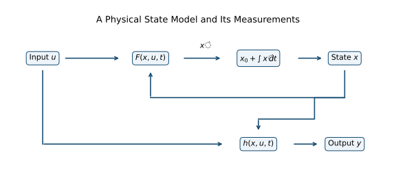
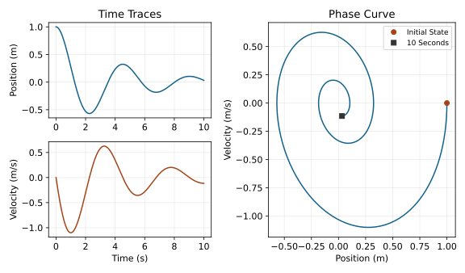

# The Transition to State Space
[]{#ch-state_space}

A photograph of a golfer tells us where the visible segments are. It does not tell us their velocities, the shaft's deformation rate, or the muscle activation that will persist into the next instant. Two swings can pass through nearly the same pose and then produce different clubhead motion. State-space modeling asks what information must be carried forward to predict that continuation under specified future inputs.

This is a way to organize physics, not to leave physical space behind. Joint coordinates describe configuration; forward kinematics gives the clubhead pose; equations of motion describe how forces change the state; measurement equations describe what cameras or sensors reveal. These maps must agree. A useful swing model connects them before making claims about passive motion, control effort or impact accuracy.

## State, Input, and Output

[]{#constructing-a-state-vector}

[]{#introduction-the-physics-abstraction}
[]{#sec-state_vector}

[]{#def-statevector}
[]{#laymans-context_box}

### A State Is Sufficient Information for a Declared Model

[]{#why-acceleration-is-not-part-of-the-state}

For a deterministic model, a state at time $t_0$, together with the future input and the model, determines the subsequent solution wherever that solution exists uniquely. State variables need not be a minimal list: redundant coordinates can be useful if their constraints are enforced. Minimal realization is a separate input--output concept introduced below. A state can be sufficient for one prediction task and insufficient for another.

For a point mass with known force law, position $q$ and velocity $v$ suffice:
[]{#eq-state_pair}

$$
x=\begin{bmatrix}q\\v\end{bmatrix},\qquad
 \dot x=\begin{bmatrix}v\\F(q,v,u,t)/m\end{bmatrix},\qquad m>0.
$$

Acceleration is computed from this model. It need not be an independent state here. But a model with commanded jerk, $\dot a=u$, has state $(q,v,a)$; an actuator with current, pressure, activation or hysteresis needs its own memory variables unless a justified reduction removes them. An accelerometer measures an output related to acceleration and gravity; using that measurement does not by itself make acceleration an independent state.

An unconstrained natural mechanical system with an $n$-dimensional configuration manifold $Q$ has state $(q,v)\in TQ$, of intrinsic dimension $2n$. Constraints, additional electrical or elastic states, delay, distributed deformation and hybrid modes change this description. Quaternion coordinates can contain more scalar entries than the intrinsic dimension. Finite-dimensional ordinary differential equations are a valuable model class, not a universal representation of every physical system.

Prediction also requires the future force or command history. A known instantaneous torque determines an instantaneous acceleration, not an entire future swing. Local Lipschitz continuity of the vector field in state is a standard sufficient condition for local uniqueness; continuity alone is insufficient. Even a smooth field can escape in finite time. Stochastic models specify conditional distributions rather than exact future realizations.

### What Can Be Observed Is a Different Question
[]{#sec-output_equations}

Write a smooth model as
[]{#eq-state_output_general}

$$
\dot x=F(x,u,t),\qquad y=h(x,u,t).
$$
[]{#pr-fund_eq}
The output may be a joint encoder, a camera projection, a clubhead position, or a force measurement. A measurement can be many-to-one: one camera image does not generally determine a three-dimensional configuration, much less all its velocities. A known input is information supplied to an observer, not automatically an additional state measurement. Parameters such as segment inertia also need specification or estimation.

For golf, distinguish the modeled state, the available measurements, the uncertain estimate and the quantities of interest at impact. The same visible clubhead path can be compatible with different internal loads or activation histories. State estimation and model identification are related but different problems: reconstructing $x(t)$ for a known model does not establish that the model's parameters or zero-input counterfactual are correct.

## Geometry of Position, Velocity, and Acceleration

[]{#the-hierarchy-of-motion}

[]{#position-velocity-and-acceleration-what-lives-where}
[]{#sec-state_geometry}

### Configuration Points and Tangent Vectors

A configuration is a point of $Q$. A velocity is a vector in $T_qQ$, attached to that configuration. Two velocities at the same point can be added; vectors at different points require a specified identification or transport. General manifolds have no canonical addition of points. In a chosen Euclidean vector-space model, however, addition of position coordinates is legitimate, and solutions of a linear position equation can superpose. The validity of dynamical superposition depends on the equations, not simply on naming a variable position or velocity.

For a pendulum, $Q=S^1$ and $TQ$ is a cylinder. A real-valued angle is a local coordinate or an unwrapped lift; $\theta$ and $\theta+2\pi$ denote the same configuration. The state curve $t\mapsto x(t)$ is parameterized by one time variable, but its image may be a single equilibrium point, a periodic curve, or a nonperiodic path. Under a prescribed time-dependent input, the state alone need not define an autonomous phase portrait.

### Coordinate Acceleration Is Not a Vector Under General Changes

For new coordinates $z=\phi(q)$,
[]{#eq-state_coordinate_acceleration}

$$
\dot z=D\phi(q)v,\qquad
 \ddot z=D\phi(q)\ddot q+D^2\phi(q)[v,v].
$$

The Hessian term prevents bare coordinate acceleration from transforming like a tangent vector. For example, $q(t)=1+2t$ has $\ddot q=0$, while $z=q^2$ has $\ddot z=8$ near $q=1$. With a chosen connection, covariant acceleration $\nabla_vv$ is a tangent vector; the lifted state derivative $(v,\ddot q)$ is a vector in $T_{(q,v)}TQ$. These are related objects, not interchangeable names for the same coordinate array.

For natural mechanics the kinetic metric supplies the Levi-Civita connection, so the coordinate equation contains its Christoffel velocity products. Generalized forces are covectors paired with virtual displacement or velocity; the inverse mass metric converts them into acceleration contributions. At a fixed $(q,v)$, differences between accelerations produced by different inputs transform linearly because the common Hessian term cancels. Adding two entire nonlinear trajectories has no such guarantee.

Clubhead position $r=h(q)$ makes the connection concrete:
[]{#eq-state_task_acceleration}

$$
\dot r=J(q)v,\qquad \ddot r=J(q)\dot v+\dot J(q,v)v.
$$

A large Cartesian radial acceleration can coexist with modest angular acceleration. Forces, coordinate acceleration, task acceleration and control authority must be compared in declared coordinates and units. The neighboring configuration and Lagrangian chapters develop this geometry further.

## Building Models From Physical Balances

[]{#state-space-representations}
[]{#sec-state_space_rep}


### A Point-Mass Pendulum
[]{#ex-pendulum}
[]{#ex-pendulum_state}

Take a point mass $m$ on a massless rod of length $\ell$, with a fixed pivot and angle measured from downward vertical. With applied pivot torque $\tau$ and viscous coefficient $b\geq0$,
[]{#eq-pendulum_eom}

$$
m\ell^2\ddot\theta+b\dot\theta+mg\ell\sin\theta=\tau,
 \qquad
 \dot x=\begin{bmatrix}v\\-(g/\ell)\sin\theta-bv/(m\ell^2)+\tau/(m\ell^2)\end{bmatrix}.
$$

Here $x=(\theta,v)$ and the input is torque, in N m. Writing the right side as $\tau$ after division by $m\ell^2$ would instead require redefining that symbol as an angular-acceleration input. A uniform rod has different inertia and center-of-mass distance. A moving pivot requires its prescribed motion and boundary force; it is not this fixed-pivot model.

### A DC Motor: An Electrical State Matters
[]{#ex-dc_motor}
[]{#ex-dcmotor_state}

For an ideal voltage-driven motor without load torque,
[]{#eq-motor_voltage}

$$
L\dot i=V_{\rm in}-Ri-K_e\omega,\qquad
 J\dot\omega=K_t i-b\omega,\qquad \dot\theta=\omega.
$$
[]{#eq-motor_torque}
Inductance $L$ and inertia $J$ are positive; $R$ and $b$ are nonnegative losses. The state order $(i,\theta,\omega)$ gives
[]{#eq-motor_matrices}

$$
A=\begin{bmatrix}-R/L&0&-K_e/L\\0&0&1\\K_t/J&0&-b/J\end{bmatrix},
 \qquad B=\begin{bmatrix}1/L\\0\\0\end{bmatrix}.
$$

For speed and current predictions alone, $\theta$ can be omitted because it does not feed back into those equations. To predict absolute angle, it must be retained. A state variable does not need a derivative directly containing the input: $\dot\theta=\omega$ is enough to make angle part of that prediction.

With $L=.01$ H, $R=1\,\Omega$, $K_e=K_t=.02$ in coherent SI units, $J=.001$ kg m$^2$ and $b=.001$ N m s/rad,
[]{#eq-motor_numeric}

$$
A=\begin{bmatrix}-100&0&-2\\0&0&1\\20&0&-1\end{bmatrix},
 \quad B=\begin{bmatrix}100\\0\\0\end{bmatrix},
 \quad \lambda(A)\approx\{0,-99.594297,-1.405703\}\,\mathrm{s}^{-1}.
$$

The zero mode is the retained angle offset. The zero-voltage full state is stable but not asymptotically stable to one selected angle; current and rate decay, and angle tends to an initial-condition-dependent constant. Voltage still controls angle through current and rate. An ideal motor with numerically equal $K_t,K_e$ satisfies
[]{#eq-motor_power}

$$
\frac{d}{dt}\left(\frac12Li^2+\frac12J\omega^2\right)
 =V_{\rm in}i-Ri^2-b\omega^2.
$$

This power identity checks the coupling signs. Neither the matrix $B$ alone nor a state derivative is a measure of energy injection.

### Two Tanks: State Domains and Flow Direction
[]{#ex-two_tank}
[]{#ex-twotank_state}

Let two open tanks have equal area $A_t>0$, nonnegative heights, and connections at the same zero-height datum. With nonnegative inflow $Q_{\rm in}$ and positive coefficients $c_t,c_o$,
[]{#eq-tank_model}

$$
\begin{aligned}
 Q_{12}&=c_t\operatorname{sgn}(h_1-h_2)\sqrt{|h_1-h_2|},
 &Q_o&=c_o\sqrt{h_2},\\
 A_t\dot h_1&=Q_{\rm in}-Q_{12},
 &A_t\dot h_2&=Q_{12}-Q_o.
 \end{aligned}
$$

Both flow coefficients have units m$^{5/2}$/s. A check valve would require a different law. The signed square root reverses transfer when tank 2 is higher. Adding the balances gives $A_t(\dot h_1+\dot h_2)=Q_{\rm in}-Q_o$, so internal transfer cancels. At a dry tank the vector field points into the nonnegative domain. Overflow, finite connecting-pipe inertia and empty-pipe behavior are excluded.

The square-root law is continuous but not locally Lipschitz at equal heads or zero outlet height. That fact alone does not establish nonuniqueness. For two solutions with the same inflow, monotonicity of each flow law gives
[]{#eq-tank_uniqueness}

$$
A_t\frac{d}{dt}\frac12\|h-\tilde h\|^2
 =-\Delta(h_1-h_2)\Delta Q_{12}-\Delta h_2\Delta Q_o\leq0.
$$

Here each $\Delta$ is the difference between the two solutions. Equal initial states therefore remain equal. Local existence, the inward boundary field and finite volume growth under bounded inflow complete the physical continuation argument. Numerical methods must respect the domain and resolve reversals; silently replacing a negative numerical height with zero can hide mass-balance error.

For $A_t=.1$ m$^2$, $c_t=.05$ and $c_o=.03$ m$^{5/2}$/s, $Q_{\rm in}=.01$ m$^3$/s and $h(0)=(.5,.2)$ m, integration gives approximately $h(10)=(.194816,.147879)$ m and $h(25)=(.153289,.112933)$ m. The equilibrium is
[]{#eq-tank_equilibrium}

$$
h_2^*=(Q_{\rm in}/c_o)^2=.111111\,\mathrm{m},\qquad
 h_1^*=h_2^*+(Q_{\rm in}/c_t)^2=.151111\,\mathrm{m}.
$$

These are illustrative hydraulic calculations, included to show why a state-space model must retain physical balance and admissibility.

## From Differential Equations to Linear State Models

[]{#standard-form-differential-equations}
[]{#sec-ode_conversion}
[]{#thm-nth_order_conversion}

For an explicit scalar equation $y^{(n)}=g(y,\dot y,\ldots,y^{(n-1)},u,t)$, set $x_j=y^{(j-1)}$. Then $\dot x_j=x_{j+1}$ for $j<n$ and $\dot x_n=g$. The construction requires an equation solvable for its highest derivative; an implicit singular relation may instead be a differential-algebraic system.

For constant coefficients,
[]{#eq-companion_model}

$$
y^{(n)}+a_{n-1}y^{(n-1)}+\cdots+a_0y=u,
 \quad
 A=\begin{bmatrix}0&1&\cdots&0\\\vdots&\ddots&\ddots&\vdots\\0&\cdots&0&1\\-a_0&-a_1&\cdots&-a_{n-1}\end{bmatrix},
 \quad B=\begin{bmatrix}0\\\vdots\\0\\1\end{bmatrix}.
$$

The shift equations prove equivalence, with initial derivatives included. This companion construction is not a uniqueness theorem for every realization of an input--output map. A nonsingular constant change $z=Tx$ gives $A_z=TAT^{-1}$, $B_z=TB$ and $C_z=CT^{-1}$; nonminimal realizations can even have different dimensions.

### Matrices, Units, and Ports
[]{#sec-linear_state_space}


An LTI model is
[]{#eq-linear_state_space}

$$
\dot x=Ax+Bu,\qquad y=Cx+Du,
 \quad A\in\mathbb R^{n\times n},\ B\in\mathbb R^{n\times m},\ C\in\mathbb R^{p\times n},\ D\in\mathbb R^{p\times m}.
$$
[]{#eq-output_standard}
[]{#def-output_eq}
Time-varying linear models use $A(t),B(t),C(t),D(t)$. Additive offsets produce an affine model; deviations about a feasible reference can remove its nominal offset. The output equation includes direct feedthrough where the physical measurement requires it. A block diagram must feed the state back into $Ax$ and the input into both $Bu$ and $Du$; neither path is optional merely because the system is open loop.

On narrow screens, scroll the figure or [open it at full size](../figures/state_space_architecture.svg).

::: {#fig-statespace_architecture}
::: {.aba-diagram-scroll role="region" aria-label="State-space illustration; scroll horizontally" tabindex="0"}

:::

State, Input, and Measurement Paths. State and Input Enter Both the Dynamics and the Output Map; Integration Also Requires an Initial State.
:::

Different state components can have different units. For $m\ddot q+c\dot q+kq=u$,
[]{#eq-mass_spring_matrices}

$$
x=(q,v),\qquad A=\begin{bmatrix}0&1\\-k/m&-c/m\end{bmatrix},\qquad B=\begin{bmatrix}0\\1/m\end{bmatrix}.
$$
[]{#eq-mass_spring_damper}
The input force changes the velocity derivative; it does not instantaneously jump position under a bounded ordinary input. An impulse needs an impulse law. Actual input power is $uv$, and mechanical energy satisfies $\dot E=uv-cv^2$. Thus signed work may be negative even for a nonzero positive input. Scaled coordinates are needed before interpreting a Euclidean norm of position and velocity as a physical error or energy.

## Solutions, Equilibria, and Local Models
[]{#sec-matrix_exponential}


### The LTI Solution and Its Limits

The matrix exponential is defined for every finite square matrix, including defective and singular ones:
[]{#eq-matrix_exp_series}

$$
e^{At}=\sum_{j=0}^{\infty}\frac{A^jt^j}{j!},\qquad
 x(t)=e^{At}x_0+\int_0^t e^{A(t-s)}Bu(s)\,ds.
$$
[]{#thm-matrix_exponential}
[]{#thm-matrix_exponential_solution}
[]{#eq-matrix_exp_solution}
[]{#eq-forced_solution}
Uniform convergence of the series and its derivative on bounded time intervals permits termwise differentiation; it gives $\frac{d}{dt}e^{At}=Ae^{At}$ and $e^{A0}=I$. Differentiating $e^{-At}x(t)$ and integrating proves the forced formula. This establishes superposition for this linear model, including its position components, with consistent initial data and inputs.

If $A=P\Lambda P^{-1}$ is diagonalizable, exponentiating its diagonal entries is an identity. It is not a universal numerical algorithm: defective matrices lack that decomposition and ill-conditioned eigenvectors amplify error. Established matrix-exponential routines use more robust constructions. For LTV systems replace $e^{A(t-s)}$ by the state-transition matrix $\Phi(t,s)$; in general $\Phi$ is not the exponential of the time integral of $A(t)$.

### Linearization About a State or a Swing
[]{#sec-equilibrium}

[]{#def-equilibrium_def}
[]{#eq-equilibrium_condition}
[]{#subsec-linearization}
[]{#eq-jacobian_def}

An equilibrium under constant $u^*$ satisfies $F(x^*,u^*)=0$. For an explicitly time-dependent model, a constant state requires that equality for all relevant times. A steady rotation may be stationary in selected reduced variables while angle keeps changing; it is not an equilibrium of the full angle state.

For a twice continuously differentiable field near an equilibrium,
[]{#eq-linearized_dynamics}

$$
\delta\dot x=A\delta x+B\delta u+r,\qquad
 A=F_x(x^*,u^*),\quad B=F_u(x^*,u^*),\quad
 \|r\|\leq c(\|\delta x\|+\|\delta u\|)^2
$$

on a sufficiently small neighborhood with a bounded Hessian. Continuous differentiability gives a little-$o$ remainder instead. A swing is usually a moving nominal solution, so its perturbations obey an LTV equation with derivatives evaluated along $(\bar x(t),\bar u(t))$. Feedback $u=\pi(x,t)$ contributes $F_u\pi_x$ to the closed-loop Jacobian. A reference that does not satisfy the dynamics leaves a residual forcing term.

For the unforced undamped pendulum, the downward and upward local matrices are
[]{#eq-pendulum_linearizations}

$$
A_{\rm down}=\begin{bmatrix}0&1\\-g/\ell&0\end{bmatrix},\qquad
 A_{\rm up}=\begin{bmatrix}0&1\\g/\ell&0\end{bmatrix}.
$$
[]{#ex-pendulum_linearization}
At the top, the displacement is $\eta=\theta-\pi$, so $\ddot\eta=(g/\ell)\eta$ to first order. It is incorrect to interpret that equation as an equation for the original absolute angle with equilibrium zero.

## Stability Requires More Than an Eigenvalue List
[]{#sec-phase_portraits}

[]{#thm-stability}
[]{#thm-stability_classification}
[]{#sec-equilibrium_summary}

### Linear Classification and Jordan Blocks

For an autonomous finite-dimensional LTI system, the origin is exponentially asymptotically stable exactly when $A$ is Hurwitz: all eigenvalues have negative real part. It is Lyapunov stable exactly when every eigenvalue has nonpositive real part and every eigenvalue on the imaginary axis is semisimple (all its Jordan blocks have size one). A positive real part or a nontrivial imaginary-axis Jordan block gives instability.

In two real dimensions, real negative eigenvalues produce a stable node; real positive ones produce an unstable node. They do not produce spirals. Opposite signs give a saddle. Nonreal conjugates with negative or positive real part give inward or outward spirals. A nonzero purely imaginary pair gives a linear center with periodic elliptical orbits. Repeated real eigenvalues require the eigenvector/Jordan structure to distinguish node types. Zero eigenvalues require their own examination.

For example,
[]{#eq-state_jordan_example}

$$
A=\begin{bmatrix}0&1\\0&0\end{bmatrix},\qquad
 e^{At}=\begin{bmatrix}1&t\\0&1\end{bmatrix}.
$$

Both eigenvalues are zero, but a nonzero initial velocity makes position grow without bound. Even when $A$ is Hurwitz, nonnormal matrices can amplify the Euclidean norm transiently. Eigenvalues describe asymptotic rates and modal structure; they do not determine every finite-time error or monotonicity property.

### Nonlinear Borderline Cases
[]{#sec-nonlinear_phase}

For a continuously differentiable autonomous nonlinear field, a Hurwitz equilibrium Jacobian implies local exponential stability; an eigenvalue with positive real part implies instability. If there are no positive real parts but some zero real parts, linearization can be inconclusive. The scalar systems $\dot x=-x^3$, $\dot x=0$ and $\dot x=x^3$ all have zero derivative at the origin, yet respectively have asymptotic stability, stability without attraction, and instability.

The undamped pendulum's bottom is stable but not attractive because its locally positive energy is conserved. The linear center alone is not a proof that every nonlinear system with the same imaginary eigenvalues has a center. A phase portrait can suggest a global picture, but simulations cover selected initial states and times, not every possible trajectory.

## Reachability, Observability, and Hidden Modes
[]{#sec-controllability}


### Reachability and the Gramian

For a continuous-time LTI system with unrestricted inputs, controllability means that any initial state can be driven to any terminal state over any prescribed positive horizon. Its equivalent rank condition is
[]{#eq-controllability_matrix}

$$
\mathcal C=[B\ AB\ \cdots\ A^{n-1}B],\qquad \operatorname{rank}\mathcal C=n.
$$
[]{#def-controllability_def}
[]{#thm-controllability_rank}
[]{#thm-kalman_controllability}
To see why, define
[]{#eq-state_gramian}

$$
W(T)=\int_0^T e^{As}BB^Te^{A^Ts}\,ds,\qquad
 z^TW(T)z=\int_0^T\|B^Te^{A^Ts}z\|^2\,ds.
$$

If the right side vanishes, continuity makes the integrand zero throughout the interval. Differentiating its analytic factor at zero gives $B^T(A^T)^jz=0$ for every $j$. Conversely, vanishing through $j=n-1$ implies vanishing for every power by Cayley--Hamilton, and hence for the exponential. Thus $W$ is positive definite exactly when $\mathcal C$ has full row rank. For $d=x_f-e^{AT}x_0$, the input
[]{#eq-state_steering}

$$
u(t)=B^Te^{A^T(T-t)}W(T)^{-1}d
$$

reaches $x_f$. Substitution into the solution formula verifies it. It minimizes the unweighted integral of $u^Tu$ among such inputs, by orthogonality to the nullspace of the endpoint operator. This is a squared-input cost, not generally mechanical energy or metabolic effort.

Rank alone says nothing about feasibility under torque, speed, contact or state constraints. Gramian conditioning and the remaining time matter, and require declared state/input scales. For a free unit mass, bounded force $|u|\leq U$ from rest gives $|v(T)|\leq UT$ and $|q(T)-q(0)|\leq UT^2/2$, despite full rank. The two bounds are necessary, not a complete independent description of the joint reachable set.

### PBH Tests Use the Correct Side

The equivalent Popov--Belevitch--Hautus test is
[]{#eq-state_pbh}

$$
\operatorname{rank}[\lambda I-A\ \ B]=n\quad\text{for every }\lambda\in\mathbb C.
$$

A failure means there is a nonzero complex row $w^*$ with $w^*A=\lambda w^*$ and $w^*B=0$: a left eigenvector annihilates the input. Right eigenvectors do not give this test. The double integrator above with $B=(0,1)^T$ is controllable, even though its right zero-eigenvector $(1,0)^T$ is orthogonal to $B$. The rank and Gramian formulations, with unrestricted-input assumptions, are also developed in Kia's lecture notes [@KiaReachabilityNotes].

### Observability Needs a Known Input and an Output History
[]{#sec-observability}


Subtract the known forced response and direct feedthrough from the measured output. The remaining signal is $Ce^{At}x_0$. The initial state is uniquely recoverable from its noiseless history over a positive interval exactly when
[]{#eq-observability_matrix}

$$
\mathcal O=\begin{bmatrix}C\\CA\\\vdots\\CA^{n-1}\end{bmatrix},\qquad
 \operatorname{rank}\mathcal O=n.
$$
[]{#def-observability_def}
[]{#thm-observability_rank}
[]{#thm-kalman_observability}
The observability Gramian $\int_0^T e^{A^Tt}C^TCe^{At}dt$ proves this by the same squared-norm argument. Formally differentiating the residual output generates the rows of $\mathcal O$; directly differentiating noisy measurements is usually a poor estimator. Independent sample noise of variance $\sigma^2$ gives variance $2\sigma^2/\Delta t^2$ in a forward difference. An observer needs a noise model, conditioning and bandwidth decisions in addition to structural observability.

The duality is between reachability of $(A,B)$ and observability of $(A^T,B^T)$; similarly, observability of $(A,C)$ is reachability of $(A^T,C^T)$. In the motor example the controllability rank is three, but current-only measurement $C=(1,0,0)$ has observability rank two. An unknown constant angle offset leaves all future current measurements unchanged. Adding an angle measurement changes observability, not the open-loop pair $(A,B)$.

Stabilizability allows uncontrollable modes if they are already strictly stable; detectability allows unobservable modes if they are strictly stable. Under those conditions a continuous LTI observer-based stabilizing controller exists without constraints. An unobservable angle integrator is not strictly stable, so current-only sensing does not provide asymptotic regulation of an unknown absolute angle. This distinction matters when a swing outcome depends on a face-angle component that the measurement setup cannot resolve.

## Transfer Functions and Realization
[]{#sec-transfer_function_conversion}

[]{#sec-kalman_history}
[]{#laymans-history_box}

For zero initial conditions, Laplace transformation gives
[]{#eq-transfer_function_def}

$$
G(s)=C(sI-A)^{-1}B+D,\qquad Y(s)=G(s)U(s).
$$

With a nonzero initial state, add $C(sI-A)^{-1}x_0$ to the output. For multiple inputs and outputs, $G$ is a transfer matrix; frequency-domain methods do not fail merely because a system is MIMO. State-space and transfer descriptions answer complementary questions. A realization may use physical coordinates or abstract internal coordinates; exposing state variables does not automatically expose an energy balance.

A finite-dimensional proper rational transfer matrix has state-space realizations. A minimal one is reachable and observable, and minimal realizations of the same map are related by similarity. Larger realizations can contain hidden modes. For $A=\operatorname{diag}(-1,1)$, $B=(1,0)^T$ and $C=(1,0)$, the transfer function is $1/(s+1)$, although a nonzero second state grows as $e^t$. Input--output stability does not establish internal stability of a nonminimal realization. The realization discussion in *Feedback Systems* explains this distinction [@AstromMurrayTransferNotes].

Kalman's 1960 paper cited here is specifically *A New Approach to Linear Filtering and Prediction Problems* [@Kalman1960]. It develops estimation from a state viewpoint and connects filtering with regulation. It should not be described as a paper that invented every state-space concept and only later led to a filter. This chapter uses the established framework without attributing an entire history to that one publication. Nor does it claim that transfer functions were replaced or that all optimal control problems have analytic solutions.

## Sampling a Plant and Implementing Feedback
[]{#sec-discrete_time}

[]{#def-discrete_ss}
[]{#eq-discrete_state}
[]{#eq-discrete_stability}
[]{#thm-discrete_stability}
[]{#laymans-discrete_practical}

For a fixed sample period $T_s>0$ and an input held constant between samples, exact LTI sampling gives
[]{#eq-exact_discretization}

$$
x_{k+1}=A_dx_k+B_du_k,\qquad A_d=e^{AT_s},\qquad
 B_d=\int_0^{T_s}e^{A\tau}B\,d\tau.
$$

If $A$ is invertible, $B_d=A^{-1}(A_d-I)B$; a block exponential works without that restriction:
[]{#eq-state_block_exponential}

$$
\exp\left(T_s\begin{bmatrix}A&B\\0&0\end{bmatrix}\right)
 =\begin{bmatrix}A_d&B_d\\0&I\end{bmatrix}.
$$

The zero-order-hold assumption concerns the input waveform, not every possible digital controller [@MathWorksC2dNotes]. Real controllers can have different holds, multiple rates, delays, jitter and internal states. The discrete plant model predicts sampled states; it need not be an equation literally executed inside the controller.

Discrete autonomous stability requires eigenvalues strictly inside the unit circle for asymptotic stability. Boundary eigenvalues additionally need semisimple Jordan structure for Lyapunov stability. Since $\lambda(A_d)=e^{\lambda(A)T_s}$, exact sampling of a Hurwitz autonomous plant remains stable for every positive sample period. A slow sample rate does not move those exact open-loop poles outside the unit circle. An unstable Euler approximation is a numerical issue, not a new physical instability.

Held feedback is different. With $u_k=-Kx_k$, its exact sampled matrix is $A_d-B_dK$, generally different from $e^{(A-BK)T_s}$. For $\dot x=-x+u$ and $K=2$,
[]{#eq-state_sampled_feedback}

$$
x_{k+1}=(3e^{-T_s}-2)x_k.
$$

Continuous feedback is stable with pole $-3$, but held feedback is asymptotically stable only for $0<T_s<\log3$ in these time units. This is an explicit implementation effect.

Sampling can also lose information or actuation directions. For $A=\left[\begin{smallmatrix}0&1\\-1&0\end{smallmatrix}\right]$, $B=(0,1)^T$, $C=(1,0)$ and $T_s=\pi$, $A_d=-I$ and $B_d=(2,0)^T$. The continuous system is reachable and observable, while both sampled ranks are one. Samples taken half a period apart miss the velocity component. There is no universal adequate sample rate: the relevant dynamics, hold, sensors, latency, noise and required accuracy must be stated.

## Lyapunov Functions, Domains, and Convergence
[]{#sec-lyapunov}

[]{#def-lyapunov_function}
[]{#thm-lyapunov_direct}
[]{#laymans-lyapunov_altitude}
[]{#pr-lyapunov_foundation}

Let $F$ be locally Lipschitz on an open neighborhood of an equilibrium at zero, and let $V$ be continuously differentiable, zero at the equilibrium and positive elsewhere in that neighborhood. Then
[]{#eq-lyapunov_derivative}

$$
\dot V=\nabla V^TF.
$$

Nonpositive $\dot V$ establishes local Lyapunov stability; negative definite $\dot V$ establishes local asymptotic stability. Global conclusions require global conditions and boundedness/completeness, for example a proper positive-definite $V$ with negative-definite derivative on all of $\mathbb R^n$. A local candidate is not automatically a global certificate. For an LTI Hurwitz matrix, solving $A^TP+PA=-Q$ with $Q>0$ gives $P>0$ and $V=x^TPx$, a metric that need not equal the physical inertia.

With a nonstrict derivative, LaSalle's principle uses a compact forward-invariant set $\Omega$: solutions approach the largest invariant subset of $\{x\in\Omega:\dot V=0\}$. They need not approach a single point. Khalil's invariance lecture gives the hypotheses and the pendulum application [@KhalilInvarianceNotes].

For the fixed-pivot damped pendulum,
[]{#eq-pendulum_lyapunov}

$$
V=\frac12m\ell^2v^2+mg\ell(1-\cos\theta),\qquad \dot V=-bv^2\leq0.
$$
[]{#ex-lyapunov_pendulum}
[]{#eq-damped_pendulum}
[]{#eq-pendulum_Vdot}
Choose the connected sublevel around the bottom with $V\leq c$ and $0<c<2mg\ell$. It stays strictly inside $|\theta|<\pi$, bounds velocity, and is compact and forward invariant. For $b>0$, remaining in $\dot V=0$ requires $v=0$ and $\sin\theta=0$; only the bottom equilibrium lies in this component. LaSalle therefore proves attraction there. The upright equilibrium prevents a global claim to the bottom over the entire cylinder. With $b=0$, energy is conserved and nearby nonstationary trajectories do not converge.

For a golf swing, attraction to a rest equilibrium is usually not the objective. One may study a moving trajectory, a periodic orbit or a finite-time impact event. Those require tracking, orbital or event-conditioned analysis with specified inputs and uncertainty. A decreasing energy-like function is not a universal explanation of a successful swing.

## A Reproducible Oscillator and Its Interpretation
[]{#sec-mass_spring_complete}


For $m,k>0$ and $c\geq0$, define $\omega_0=\sqrt{k/m}$ and $\zeta=c/(2\sqrt{km})$. The eigenvalues satisfy $\lambda^2+(c/m)\lambda+k/m=0$. In the unforced underdamped case $0<\zeta<1$,
[]{#eq-state_oscillator_solution}

$$
q(t)=e^{-\zeta\omega_0t}\left[q_0\cos(\omega_dt)
 +\frac{v_0+\zeta\omega_0q_0}{\omega_d}\sin(\omega_dt)\right],
 \qquad\omega_d=\omega_0\sqrt{1-\zeta^2}.
$$

At critical damping, $q(t)=[q_0+(v_0+\omega_0q_0)t]e^{-\omega_0t}$. For overdamping the solution is a combination of two decaying real exponentials. Nonoscillatory modal structure does not mean position always approaches zero monotonically: at critical damping with $\omega_0=1$, $q_0=1$ and $v_0=-3$, $q=(1-2t)e^{-t}$ crosses zero and later turns back. The usual fastest-nonoscillatory statement concerns a specified response comparison, not every initial condition, norm or settling threshold.

The illustrative model $m=1$ kg, $c=.5$ N s/m and $k=2$ N/m has $\zeta\approx.176777$ and poles $-.25\pm1.391941i$ s$^{-1}$. Compare numerical integration against the closed form, check $E=q^2+v^2/2$ decreases for zero input, and label position and velocity with their different units.

On narrow screens, scroll the figure or [open it at full size](../figures/state_space_oscillator.svg).

::: {#fig-state_space_oscillator}
::: {.aba-diagram-scroll role="region" aria-label="State-space illustration; scroll horizontally" tabindex="0"}

:::

An Unforced Damped Oscillator From the Analytic Solution. Time Traces Use Separate Units; the Phase Curve Connects Position and Velocity Without Treating Their Norm as Energy.
:::

### Running the Checks
[]{#sec-python_example}

Run this example from the repository root with Python 3.12 and the project dependencies. The small numerical module implements the declared motor, signed tank balance and singular-safe hold construction; it is not a swing simulator. The independent regression tests compare these results with balance identities, analytic solutions and rank counterexamples.

```python
import numpy as np
from scipy.integrate import solve_ivp
from scipy.linalg import expm
from src.tools.state_space_examples import (
    TankParameters, motor_matrices, zoh_matrices,
)

motor_a, motor_b = motor_matrices()
print("Motor poles:", np.linalg.eigvals(motor_a))
tank = TankParameters()
times = np.array([0., 10., 25., 50., 100.])
for tolerance in (1e-8, 1e-10):
    solution = solve_ivp(
        lambda t, h: tank.rate(h, .01), (0, 100), [.5, .2],
        method="DOP853", t_eval=times,
        rtol=tolerance, atol=tolerance / 100,
    )
    if not solution.success:
        raise RuntimeError(solution.message)
    print(tolerance, solution.y.T)

oscillator = np.array([[0., 1.], [-2., -.5]])
frequency = np.sqrt(2 - .25**2)
time = 10.
closed_q = np.exp(-.25*time) * (
    np.cos(frequency*time) + .25/frequency*np.sin(frequency*time)
)
print("Position residual:", (expm(time*oscillator) @ [1, 0])[0] - closed_q)
ad, bd = zoh_matrices(np.array([[-1.]]), np.array([[1.]]), 2.)
print("Held feedback pole:", (ad - 2*bd).item())
```

Convergence with tighter numerical tolerances verifies the computation of this model. It does not validate its parameters against measurements. A simulator and an estimator can agree because they share the same wrong assumptions; independent physical checks remain necessary.

## Connecting the State to a Golf Outcome
[]{#sec-state_golf_synthesis}

Start with the prediction: clubhead pose and velocity at ball contact, a shaft strain history, or a joint load. Choose a state that carries the information relevant to that quantity, and specify supports and contact modes. Recover the observable parts from measurements, attach uncertainty to the estimate, and identify the input channels and their limits. The history before a torque-removal branch is retained in its initial state; removing a command does not erase stored motion or activation.

Then propagate through the remaining dynamics. With a smooth nominal motion, a perturbation obeys $\delta\dot x=A(t)\delta x+B(t)\delta u$. Its terminal effect depends on the propagated input directions, not just the size of $B$ or the instantaneous passive acceleration. For an impact guard $\psi(x,t)=0$, changes in state also change event time. Comparing two states at one clock time is different from comparing their respective ball encounters. A contact-mode change can invalidate a smooth local approximation.

Preparation, sensing and late correction are therefore intertwined. Preparation changes the state from which the rest of the swing unfolds; sensing constrains which errors can be recognized; actuator dynamics and the remaining horizon constrain which corrections are feasible. A state-space model helps make these statements testable. It does not establish that a particular muscle should relax, that active torque is negligible, or that an observed proximal-to-distal sequence measures energy transfer.

## Chapter Synthesis and Further Reading

[]{#summary}
[]{#sec-summary}
[]{#pr-summary_principle}
[]{#sec-ch2_further_reading}

A state is sufficient information for a declared prediction model under specified future inputs. A coordinate chart, a measurement and a minimal realization are different constructions. Mechanical balances determine the state equations; geometry determines how their components transform; reachability and observability determine structural possibilities; constraints, sampling, conditioning and uncertainty determine practical limits. Stability results must retain their domains and hypotheses. The Lagrangian chapter explains where the mechanical equations come from, and the counterfactual chapter explains how to compare precisely defined interventions along a swing.

## Exercises
[]{#sec-ch2_exercises}


1. **Motor State and Sensing.** Derive the three-state numerical motor matrices and their eigenvalues. Verify its controllability rank and its current-only observability rank. Explain why an angle offset is both a state and a hidden measurement mode. Add an angle sensor and recompute observability. Check the electrical--mechanical power identity.
1. **Two-Tank Balance.** Integrate the stated tank example for 100 s. Repeat from $(.2,.5)$ m to exercise reversed flow. Verify total volume balance and nonnegative heights, derive the equilibrium, and compare two solver tolerances. Explain the square-root regularity issue and the monotonicity uniqueness argument.
1. **Damped Motion.** For $m=2$ kg, $c=4$ N s/m and $k=3$ N/m, compute $\zeta$ and the poles, and compare phase curves from $(1,0)$ and $(.5,1)$. State axis units. Contrast modal oscillation, position monotonicity and energy decay; test the chapter's critical-damping counterexample.
1. **Pendulum Equilibria.** With $\ell=1$ m and $g=9.81$ m/s$^2$, linearize the zero-torque undamped model at the downward angle zero and upward angle $\pi$. Use a local displacement at each. Distinguish what the eigenvalues prove from what the energy argument proves.
1. **State Completeness.** Give two motions with the same position and different futures under the same force law. Then construct an actuator example with the same $(q,v)$ but different internal state and different acceleration. Contrast it with a jerk-controlled model and with an accelerometer output.
1. **Representation and History.** Explain the complementary roles of state-space and MIMO transfer descriptions. For the hidden unstable-mode example, derive $G(s)$ and the nonzero-initial-state response. State the specific subject of the cited Kalman 1960 paper.
1. **A Saddle With Rotation.** For a real three-state LTI matrix with eigenvalues $-2,1+2i,1-2i$, describe the stable subspace and unstable rotating plane. Distinguish initial conditions on the stable subspace from generic nearby states. Does the eigenvalue list specify Euclidean transient magnitudes?
1. **Feedback With Incomplete Observation.** Explain controllability without observability. Give one unobservable stable mode that is compatible with detectability and one nondecaying hidden mode that prevents asymptotic estimation. State the information and assumptions required for a stabilizing observer-based LTI controller.
1. **The Rank Test and Its Limits.** Use Cayley--Hamilton and the Gramian identity to prove the controllability rank condition. Derive the double-integrator bounded-input inequalities. Explain why full rank does not guarantee a chosen impact target with limited torque and time.
1. **Exponential Propagation.** Prove the diagonalization identity where it applies, then calculate the exponential of the defective zero-eigenvalue matrix without diagonalization. Explain why both are covered by the defining series and why numerical eigendecomposition can be ill-conditioned.
1. **Linearization and Geometry.** Derive the forced pendulum Jacobians with physical torque input. Derive the Hessian term under $z=\phi(q)$ and verify $q=1+2t$, $z=q^2$. Explain when a same-state difference in acceleration transforms as a vector.
1. **Two-Dimensional Stability.** For $A=\left[\begin{smallmatrix}a&b\\c&d\end{smallmatrix}\right]$, derive

   $$
   \lambda=\frac{a+d\pm\sqrt{(a-d)^2+4bc}}{2}.
   $$

   Include repeated and zero roots in the classification. Construct nonlinear systems with the same zero Jacobian but different stability.
1. **The PBH Criterion.** Prove the left-eigenvector condition from the rank of $[\lambda I-A\ \ B]$, and connect it to the invariant orthogonal complement of the reachable subspace. Use the double integrator to disprove the right-eigenvector version.
1. **Variation of Constants and Sampling.** Derive the forced solution and the block-exponential hold formula. Verify the scalar held-feedback threshold $T_s<\log3$ and the oscillator's sampled rank loss at $T_s=\pi$. Distinguish numerical discretization error from actual sample-and-hold dynamics.
1. **Observability and Invariance.** Prove the observability rank test with its Gramian, including subtraction of known input terms. For the damped pendulum, construct a compact invariant sublevel below the upright energy and identify the largest invariant subset of $\dot V=0$. Explain why nonincreasing energy alone does not prove convergence or global attraction.
