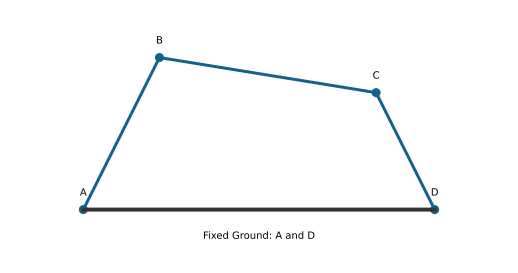
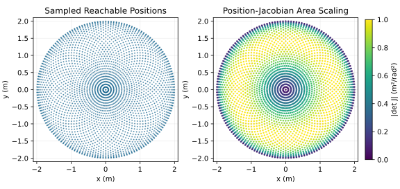

# Configuration Space and Degrees of Freedom
[]{#ch-configuration}
[]{#laymans-context_box}


A golfer can place the clubhead at the same point using different elbow, shoulder and torso configurations. Those postures need not permit the same next motion, require the same joint torques, or produce the same impact. Configuration space provides the language for distinguishing these questions. It describes the modeled arrangement of the bodies; kinematics maps that arrangement to a task; dynamics determines how forces change the motion.

This chapter develops local coordinates, constraint counts, tangent vectors, forward and inverse kinematics, workspace and non-holonomic motion. The examples are specified mechanisms, not measurements of an anatomical golfer. Keeping that boundary explicit lets us transfer the mathematics without transferring unjustified performance claims.

## Historical Context: From Lagrange to Riemann
[]{#sec-history}

Generalized coordinates let mechanics describe a constrained arrangement without carrying every particle coordinate independently. Manifold theory explains why a useful local coordinate description need not extend over the entire configuration space. Modern robotics combines these ideas with maps between joint arrangements and end-effector tasks [@Murray1994; @Lynch2017]. A coordinate system is a representation; it does not determine the underlying physical freedom.

Nor does curvature define a manifold: Euclidean space is a manifold, and a torus can carry an intrinsically flat metric despite its familiar curved embedding in three dimensions. Topology, smooth structure and metric answer different questions. A model's mass matrix later supplies one physically meaningful metric; the configuration manifold itself does not select it.

## Degrees of Freedom (DOF) and Grübler's Formula

[]{#degrees-of-freedom-dof}
[]{#sec-dof}
[]{#def-dof}

### Local Freedom and Independent Constraints

At a regular configuration, the number of degrees of freedom is the local dimension of the configuration space. A free rigid body has three translational and three rotational freedoms. Six local coordinates suffice near a regular chart point, but there is no globally nonsingular, unique three-angle description of all orientations. A rotation matrix or unit quaternion stores more scalar entries with constraints; that storage does not add physical freedoms.

For an ambient configuration manifold of dimension $D$, suppose smooth equations $\phi(q)=0$ have locally constant derivative rank $r$ and define a regular level set. Then


$$
\dim\mathcal Q=D-r,\qquad T_q\mathcal Q=\ker D\phi(q).
$$
This follows from the constant-rank theorem: locally, $r$ independent coordinates are fixed by the equations and $D-r$ remain free. Counting written equations instead of their independent rank can overcount constraints.

At a singular point the linearized kernel can be misleading. The equation $x^2+y^2=0$ has the single real solution $(0,0)$, while its derivative there is zero and its kernel is all of $\mathbb R^2$. A two-dimensional linearized kernel does not make the solution set locally two-dimensional. Closed linkages may similarly have singular branches or instantaneous motions that do not extend to finite motion.

Two welded floating bodies form one rigid assembly with six freedoms. A hinge between two otherwise free spatial bodies leaves six assembly freedoms plus one relative rotation. Fixing one body to ground removes the six assembly freedoms. These counts concern the chosen mechanical model, not the number of motors or available control inputs.

### Grübler's Formula
[]{#subsec-grubler}
[]{#thm-grubler_spatial}
[]{#thm-grubler_planar}

Let $n$ count moving rigid links, excluding a fixed ground link. Let joint $i$ permit $d_i$ relative freedoms within a planar or spatial model. Under independent regular joint constraints, a planar count is
[]{#eq-grubler}

$$
\mathrm{DOF}=3n-\sum_i c_i,\qquad c_i=3-d_i,
$$
or, for $j$ joints,
[]{#eq-grubler_alt}

$$
\mathrm{DOF}=3n-3j+\sum_{i=1}^{j}d_i.
$$
Each moving planar body begins with two translations and one rotation. A revolute or prismatic joint removes two independent relative freedoms. Subtracting their independent constraints gives the formula. For spatial bodies, replace each $3$ by $6$:


$$
\mathrm{DOF}=6n-\sum_{i=1}^{j}(6-d_i).
$$
With $N=n+1$ total links including ground, both forms are $\lambda(N-1-j)+\sum_i d_i$, where $\lambda=3$ or $6$. This is a useful count, not a proof that a particular linkage has independent constraints. Redundant constraints, special geometry and singular configurations require a rank or geometric analysis [@Lynch2017].

### Worked Example 1: Planar Four-Bar Linkage
[]{#example-4bar}
[]{#ex-ex_4bar}

Three moving links and four revolute joints give $3(3)-4(2)=1$ regular freedom. Write a closure equation using absolute link angles and a fixed ground displacement $d e_x$:


$$
a e(\theta_1)+b e(\theta_2)-c e(\theta_3)-d e_x=0,
 \qquad e(\theta)=(\cos\theta,\sin\theta)^T.
$$
These are two scalar equations in three angles. Their derivative normally has rank two. The input $\theta_1$ determines the other angles locally only when the two-column derivative with respect to $(\theta_2,\theta_3)$ is invertible. Its determinant is $-bc\sin(\theta_3-\theta_2)$, so that choice of input coordinate fails when the coupler and output link are parallel.

Different assembly branches can share an input angle. The branch must be specified and followed continuously; one motor does not make the global closure solution unique. At some singular postures the full closure derivative also loses rank, and finite mobility needs more than a first-order count.

On narrow screens, scroll the figure or [open it at full size](../figures/configuration_fourbar.svg).

::: {#fig-fourbar_linkage}
::: {.aba-diagram-scroll role="region" aria-label="Four-Bar Closure on One Regular Assembly Branch; scroll horizontally" tabindex="0"}

:::

Four-Bar Closure on One Regular Assembly Branch. Ground Contains Two Fixed Pivots; the Input Angle Is Only a Local Coordinate Where the Selected Closure Derivative Is Nonsingular.
:::

### Worked Example 2: Spatial Stewart Platform
[]{#example-stewart}
[]{#ex-ex_stewart}

For an ideal six-leg UPS platform, each leg has a universal joint, a prismatic joint and a spherical joint, with $2+1+3$ freedoms. There are $N=14$ bodies including ground, $n=13$ moving bodies and $j=18$ joints. Thus the regular independent-constraint count is
[]{#eq-stewart_dof}

$$
6(14-1-18)+6(2+1+3)=6.
$$
This is a mobility count for the mechanism with variable leg lengths. Local control of all platform velocities also requires the actuator-length derivative to have rank six.

If base anchors are $a_i$, platform-frame anchors are $b_i$, and the platform pose is $(p,R)$, the required lengths are directly


$$
\ell_i=\|p+Rb_i-a_i\|.
$$
No coupled root-finding is needed to obtain lengths from a specified pose. The reverse problem, pose from lengths, may have multiple solutions. Joint-angle limits, leg interference and stroke limits must still be checked. A singular length-to-pose relation is not diagnosed by merely recounting bodies.

### Worked Example 3: Human Arm Kinematics
[]{#example-human_arm}
[]{#ex-ex_human_arm}

A common reduced arm model assigns three shoulder rotations, one elbow flexion angle, one forearm pronation/supination angle and two wrist angles. That gives seven coordinates relative to a fixed shoulder base. Forearm rotation must not be relabeled as a third rotation of a ball-and-socket wrist. Scapular motion, shoulder translation, compliant tissues and hand joints change a more detailed model's configuration.

For a six-dimensional hand-pose task, a seven-coordinate model has a one-dimensional local inverse-kinematics family near a reachable regular point where the task derivative has rank six. This conclusion follows locally from the regular-level-set theorem. It does not say that every target is reachable or that every posture admits the same redundancy. Joint limits, singularities and grasp constraints can change the admissible set.

With both hands holding a rigid club, the arms and torso form a closed kinematic loop. Counting two unconstrained seven-coordinate arms and adding a club would ignore the grip constraints. Compliant grips require a different model. In either case, configuration redundancy is distinct from muscle-force redundancy and from the ability to alter a selected impact outcome.

## The Configuration Space and Topological Manifolds

[]{#the-configuration-space-configspace}
[]{#sec-config_space}
[]{#laymans-config_state}
[]{#ex-ex_torus}
[]{#ex-ex_sphere}
[]{#ex-ex_circle}
[]{#def-topological_manifold}

The configuration space $\mathcal Q$ is the set of modeled arrangements satisfying the selected geometric conditions. Its regular unconstrained regions are often smooth manifolds. Joint limits can introduce boundaries and corners; collision exclusions remove configurations; singular loop closures can create sets that are not manifolds. A contact-mode change can alter which equations apply. Therefore “every physical configuration space is a smooth manifold” is too strong.

A topological $n$-manifold without boundary is a Hausdorff, second-countable space in which every point has a neighborhood homeomorphic to an open subset of $\mathbb R^n$. Hausdorff means distinct points have disjoint neighborhoods; second-countable means a countable basis suffices. A manifold with boundary uses a local half-space at its boundary instead.

The circle $S^1=\{(x,y):x^2+y^2=1\}$ has dimension one. The sphere $S^2$ has dimension two, including at its poles; longitude fails at the poles, not the manifold. Two independent unrestricted revolute angles give $S^1\times S^1$, a torus. With restricted joint ranges, the admissible set can instead be a rectangle or another subset of that torus. Tracking cable wind-up or accumulated revolutions introduces additional model information; an unwrapped angle is not automatically the physical orientation itself.

For a free spatial rigid body, position and orientation give $\mathbb R^3\times SO(3)$ as a manifold. Its group multiplication is the semidirect product $SE(3)$, because rotating one frame also changes how translations compose. The orientation space $SO(3)$ is three-dimensional and compact. Unit quaternions give a two-to-one representation: opposite quaternion points represent the same orientation.

## Charts, Atlases, and Coordinate Patches
[]{#sec-charts}
[]{#def-atlas}
[]{#def-chart}

A chart is a homeomorphism $\varphi:U\to\varphi(U)\subset\mathbb R^n$, where both $U$ and its image are open in their respective spaces. An atlas is a collection of charts covering the manifold. A smooth atlas has smooth transition maps on every overlap; the associated maximal compatible atlas defines the smooth structure. Here “smooth” means $C^\infty$, although other differentiability classes can be specified.

### Worked Example: Two Valid Charts on the Circle
[]{#example-circle_charts}
[]{#ex-ex_circle_charts}

No single chart covers all of $S^1$. A hypothetical homeomorphism would map the compact circle onto a nonempty compact open subset of $\mathbb R$, which does not exist. The half-open interval representation $[0,2\pi)$ is a bijective labeling of circle points, but its inverse-angle assignment jumps across the cut and its image is not open. Boundedness alone is not the problem: a bounded open interval can be a valid chart image.

Let $U_N=S^1\setminus\{(0,1)\}$ and $U_S=S^1\setminus\{(0,-1)\}$. Stereographic coordinates are


$$
u=\varphi_N(x,y)=\frac{x}{1-y},\qquad
 v=\varphi_S(x,y)=\frac{x}{1+y}.
$$
Both images are all of $\mathbb R$. Their explicit inverses are


$$
\varphi_N^{-1}(u)=\frac{(2u,u^2-1)}{1+u^2},\qquad
 \varphi_S^{-1}(v)=\frac{(2v,1-v^2)}{1+v^2}.
$$
Substitution verifies unit norm and recovers the original coordinate. Each point other than its chart's omitted pole has one coordinate. The two chart domains cover the circle and overlap away from both poles.

In contrast, projecting to $x$ on a region $y>-\epsilon$ is generally not injective: for a small positive $\eta<\epsilon$, both $(\sqrt{1-\eta^2},\eta)$ and $(\sqrt{1-\eta^2},-\eta)$ belong to the region and share $x$. A smooth formula is not a valid chart unless it is also a homeomorphism onto an open image.

## Transition Maps and Smooth Compatibility
[]{#sec-transitions}
[]{#def-differentiable_manifold}
[]{#def-transition_map}

For overlapping charts, the transition map is $\varphi_j\circ\varphi_i^{-1}$ on $\varphi_i(U_i\cap U_j)$. It changes coordinates of the same point. It need not preserve their numerical values, Euclidean lengths or component velocities.

### Worked Example: Circle Transition and Velocity
[]{#example-circle_transition}
[]{#ex-ex_circle_transition}

The circle inverses give, on $u\ne0$,


$$
v=\frac1u,\qquad u=\frac1v,\qquad
 \dot v=-\frac{\dot u}{u^2}.
$$
These transition maps are smooth on their open, disconnected overlap images $\mathbb R\setminus\{0\}$. Their singularity at zero lies outside the overlap: zero is the opposite chart's omitted pole.

For example, $u=1$ corresponds to $(1,0)$ and $v=1$. If $\dot u=2$, then $\dot v=-2$. These represent the same physical tangent vector. Differentiating the inverse map also gives the circle's induced line element


$$
ds^2=\frac{4}{(1+u^2)^2}\,du^2.
$$
The same speed is obtained in the $v$ chart after transforming both the metric and the velocity. Comparing raw coordinate rates without this transformation can create an apparent difference that is purely representational.

## Tangent Vectors, Curves, and Derivations
[]{#sec-tangent_vectors}
[]{#laymans-tangent_bundle_reminder}
[]{#def-tangent_bundle}
[]{#thm-tangent_equivalence}
[]{#def-tangent_derivation}
[]{#def-tangent_curve}
[]{#def-tangent_space}

The tangent space $T_q\mathcal Q$ is an $n$-dimensional vector space attached to a particular configuration. It describes unconstrained instantaneous directions on the smooth configuration manifold. Additional non-holonomic restrictions may allow only a subspace of these directions; an active unilateral boundary may instead admit a one-sided cone.

Two smooth curves through $q$ represent the same tangent vector when their coordinate derivatives agree at zero in one chart. The chain rule for a transition map then makes them agree in every chart. The tangent vector is the equivalence class, while $\dot q$ is its coordinate representation.

Alternatively, a tangent vector is an $\mathbb R$-linear derivation $v$ on smooth real functions satisfying


$$
v(fg)=v(f)g(q)+f(q)v(g).
$$
A curve $\gamma$ supplies $v(f)=\frac{d}{dt}|_0 f(\gamma(t))$. Conversely, in coordinates $z$ centered at $q$, a smooth function locally has the form


$$
f(z)=f(0)+\sum_i z_i h_i(z),\qquad h_i(0)=\partial_i f(0).
$$
The product rule gives $v(f)=\sum_i v(z_i)\partial_i f(0)$. Constants have zero derivative, and a derivation depends only on the function near $q$; smooth cutoff functions justify using local coordinate functions. The coordinate curve $z(t)=t(v(z_1),\ldots,v(z_n))$ realizes this derivation for sufficiently small $t$. Thus curve classes and derivations are isomorphic, with $n$ independent components.

The tangent bundle is the disjoint union


$$
T\mathcal Q=\bigsqcup_{q\in\mathcal Q}T_q\mathcal Q.
$$
Its elements are pairs $(q,v_q)$ and it has dimension $2n$. Locally its coordinates transform as $(z,\dot z)\mapsto(\tau(z),D\tau(z)\dot z)$. In general it is not a global product $\mathcal Q\times\mathbb R^n$.

For an unconstrained second-order mechanical model, configuration and velocity can form the state in $T\mathcal Q$. With a rank-$k$ homogeneous allowed-velocity distribution, the constrained mechanical state lies in that distribution and has dimension $n+k$, under the regularity assumptions. Muscle activation, tendon deformation, flexible-shaft modes, controller memory or contact-mode variables add states. Consequently “state always has twice the configuration dimension” is not a general modeling rule.

## Generalized Coordinates and Forward Kinematics

[]{#generalized-coordinates}

[]{#forward-kinematics}
[]{#sec-generalized}
[]{#def-forward_kinematics}
[]{#def-generalized_coordinates}

Generalized coordinates parameterize configurations locally; they need not all be motor angles or all be independently actuated. Prismatic displacement, a passive hinge angle and a floating-base coordinate are examples. A redundant constrained representation can also be computationally useful, even though it is not a minimal chart.

For a fixed-length arm model, joint coordinates and a base pose determine Cartesian segment positions. A shoulder angle alone is not enough for a general spatial shoulder: its orientation requires the chosen multi-coordinate representation. The anatomical elbow is approximated as a hinge only within a declared model.

Forward kinematics is a map $f:\mathcal Q\to\mathcal Y$ to a selected task space. Position may lie in $\mathbb R^3$, planar pose in $SE(2)$, and spatial pose in $SE(3)$. These targets are different maps, with potentially different derivative ranks.

For planar links of positive lengths $L_1,L_2$ and relative joint angles,


$$
\begin{aligned}
 x&=L_1\cos q_1+L_2\cos(q_1+q_2),\\
 y&=L_1\sin q_1+L_2\sin(q_1+q_2).
 \end{aligned}
$$
The final-link orientation is $q_1+q_2$ modulo $2\pi$. The position equations by themselves do not include it as a controlled task coordinate.

## The Jacobian Matrix and the Kinematic Derivative
[]{#sec-jacobian}
[]{#def-jacobian_kin}

The intrinsic derivative is $Df_q:T_q\mathcal Q\to T_{f(q)}\mathcal Y$. In local coordinates its matrix has entries


$$
J_{ij}(q)=\frac{\partial f_i}{\partial q_j},\qquad
 \dot y=J(q)\dot q.
$$
In particular, the bottom-left entry is $\partial f_m/\partial q_1$, not $\partial f_m/\partial q_n$. Changing nonsingular coordinate charts changes the matrix but preserves its rank. Singular coordinate representations can introduce an apparent singularity that is not a loss of physical task freedom.

For a spatial pose, Euler-angle derivatives are not generally the angular-velocity vector. A geometric Jacobian maps the declared generalized velocities to a declared twist, with its frame, reference point and angular/linear ordering specified. A six-coordinate pose derivative and a six-component twist Jacobian are related through the relevant chart map, not interchangeable by notation alone.

### Worked Example: Two-Link Position Jacobian
[]{#example-2link_jacobian}
[]{#ex-ex_2link_jacobian}

Differentiating the two-link equations gives


$$
J_p=\begin{bmatrix}
 -L_1\sin q_1-L_2\sin(q_1+q_2)&-L_2\sin(q_1+q_2)\\
 L_1\cos q_1+L_2\cos(q_1+q_2)&L_2\cos(q_1+q_2)
 \end{bmatrix},
$$
with $\det J_p=L_1L_2\sin q_2$. For $L_1=2,L_2=1,q=(0,0)$,


$$
J_p=\begin{bmatrix}0&0\\3&1\end{bmatrix}.
$$
Only vertical endpoint velocity is available to first order. The arm still has two joint configuration freedoms. Motion in its position-Jacobian null space can alter joint posture, and second-order endpoint changes can appear even when the first-order velocity is zero.

### Worked Example: Three-Link Planar Pose
[]{#example-3link_jacobian}
[]{#ex-ex_3link_jacobian}

Let $\alpha_i=\sum_{j=1}^i q_j$. A three-link planar pose is


$$
(x,y)=\sum_{i=1}^3L_i(\cos\alpha_i,\sin\alpha_i),\qquad
 \theta=\alpha_3\pmod{2\pi}.
$$
On a local angle chart, a compact expression for every Jacobian column is


$$
J_{1j}=-\sum_{i=j}^3L_i\sin\alpha_i,\qquad
 J_{2j}=\sum_{i=j}^3L_i\cos\alpha_i,\qquad J_{3j}=1.
$$
Subtracting consecutive columns shows $\det J=L_1L_2\sin q_2$. Full rank gives a locally invertible planar pose map. It does not establish global uniqueness or a six-dimensional spatial pose capability.

## Inverse Kinematics
[]{#sec-inverse_kinematics}
[]{#thm-newton_raphson_ik}
[]{#ex-ex_2link_ik}
[]{#def-ik_problem}

Inverse kinematics asks for configurations satisfying $f(q)=y_d$ within the admissible set. Solutions may be absent, isolated, multiple or continuous. A mathematical solution may violate a joint limit or collision condition. Even an admissible configuration does not supply a dynamically feasible path to it.

### Geometric Two-Link Inverse Kinematics

For a target $(x_d,y_d)$ with $r^2=x_d^2+y_d^2$, the forward equations imply


$$
r^2=L_1^2+L_2^2+2L_1L_2\cos q_2.
$$
Therefore, defining $c_2=(r^2-L_1^2-L_2^2)/(2L_1L_2)$, a reachable target requires $|c_2|\le1$. The two generic branches are


$$
\begin{aligned}
 s_2&=\pm\sqrt{1-c_2^2},\qquad q_2=\operatorname{atan2}(s_2,c_2),\\
 q_1&=\operatorname{atan2}(y_d,x_d)
       -\operatorname{atan2}(L_2s_2,L_1+L_2c_2).
 \end{aligned}
$$
Angles are understood modulo $2\pi$ before applying physical joint ranges. The sign of the cosine numerator follows directly from the squared vector sum; using the opposite sign produces the wrong elbow angle.

For $L_1=L_2=1$ and target $(1,1)$, the branches are $(0,\pi/2)$ and $(\pi/2,-\pi/2)$. Substitution recovers the same position but different final-link orientations. At ordinary inner or outer boundaries, the two branches coalesce modulo angle periodicity. At the equal-link origin, $q_2=\pi$ and any $q_1$ works, so the solution is a continuous family and $\operatorname{atan2}(0,0)$ must not be treated as a unique shoulder solution.

### Numerical Inverse Kinematics and Convergence

For local Euclidean task coordinates, set $e(q)=y_d-f(q)$. Linearizing gives $J(q)\delta q\approx e(q)$. A common iteration is


$$
q_{k+1}=q_k+\alpha_kJ(q_k)^\dagger e(q_k).
$$
For an invertible square Jacobian, solve the linear system rather than explicitly forming an inverse. Classical Newton iteration has local quadratic convergence near a nonsingular root under suitable smoothness and sufficiently close initialization, with full steps eventually accepted. That statement is not a universal guarantee for singular, rectangular, damped or constrained iterations.

The pseudoinverse minimizes the linearized residual, and among tied solutions chooses the smallest Euclidean coordinate step. Both choices depend on scaling and metrics. A regularized alternative solves


$$
\min_{\delta q}\ \|W^{1/2}(J\delta q-e)\|^2
             +\lambda^2\|R^{1/2}\delta q\|^2,
$$
with declared positive-definite task and joint weights. It trades residual against step size; it does not make an unreachable target reachable. Use meaningful stopping tolerances, step limits and admissibility checks. On an orientation manifold, use a consistent local error or retraction rather than subtracting arbitrary wrapped angles across a cut.

## Reachable and Dexterous Workspace
[]{#sec-workspace}
[]{#def-dexterous_workspace}
[]{#def-reachable_workspace}

Let $\mathcal Q_{\rm adm}$ be the admissible configuration set and $p$ the position map. The reachable position workspace is $p(\mathcal Q_{\rm adm})$. For a required orientation set $\mathcal R_{\rm req}$, define the dexterous position workspace by


$$
\begin{aligned}
 p_d\in\mathcal W_{\rm dex}\quad\Longleftrightarrow\quad
 &\text{for every }R_d\in\mathcal R_{\rm req},\\
 &\text{there exists }q\in\mathcal Q_{\rm adm}\text{ such that}\\
 &(p(q),R(q))=(p_d,R_d).
 \end{aligned}
$$
The configuration may differ for each orientation. Existence of one full-rank Jacobian at a position is a local differential property, not this global orientation quantifier. A determinant is also undefined for a rectangular Jacobian.

For two unrestricted positive-length planar links, vector geometry gives


$$
|L_1-L_2|\le\|p\|\le L_1+L_2.
$$
Every intermediate radius occurs as $q_2$ varies, and $q_1$ rotates the resultant through all directions. Unequal lengths give a closed annulus; equal lengths give a closed disk. With $L_1=2,L_2=1$, its area is $\pi(3^2-1^2)=8\pi$ in squared length units. This analytic argument establishes coverage; a finite sample cloud only illustrates it.

For an equal-link planar 2R arm, the folded origin is reachable with every final-link orientation by varying $q_1$ while keeping $q_2=\pi$. Yet its position Jacobian has rank one. At a generic nonzero point, the two inverse branches give only two final-link orientations, even when the position Jacobian is full rank. Thus, for the all-planar-orientations requirement and unrestricted equal links, the dexterous workspace is just the origin. The example directly separates dexterity in this defined sense from local position manipulability.

The magnitude $|\det J_p|=L_1L_2|\sin q_2|$ measures local area scaling for the selected coordinate metrics. It is not a geometric distance to singularity or a condition number. Singular values describe directional gains; their ratio describes conditioning after choosing units and metrics. Two matrices with equal determinant can have very different conditioning, such as $I_2$ and $\operatorname{diag}(100,0.01)$. A colored determinant plot must say what it measures.

## The Frobenius Theorem and Integrability
[]{#sec-frobenius}

[]{#laymans-laymans_frobenius}
[]{#ex-rod_frobenius}
[]{#ex-car_frobenius}
[]{#thm-frobenius}
[]{#def-smooth_distribution}


A smooth constant-rank distribution $\Delta$ assigns a smoothly varying $k$-dimensional subspace $\Delta(q)\subset T_q\mathcal Q$. It is integrable when it is tangent to a foliation by $k$-dimensional leaves. The regular Frobenius theorem states that this occurs exactly when the distribution is involutive:
[]{#eq-frobenius_condition}

$$
X,Y\text{ smooth sections of }\Delta
 \quad\Longrightarrow\quad[X,Y]\text{ is a section of }\Delta.
$$
Use the convention $[X,Y]=DY\,X-DX\,Y$, equivalent to the commutator of derivations. The brackets can leave the original distribution when it is nonintegrable. They need not span the entire ambient tangent space.

For example, on $\mathbb R^4$ with coordinates $(x,y,z,w)$, take


$$
X_1=\partial_x,\qquad X_2=\partial_y+x\partial_z,
 \qquad[X_1,X_2]=\partial_z.
$$
The rank-two distribution is nonintegrable, but every generated motion keeps $w$ fixed. Its Lie closure has rank three, not four. Nonintegrability alone cannot imply full configuration reachability.

### A Specified Unicycle and Its Lie Bracket

For an ideal unicycle with independently commanded signed forward speed and heading rate, let $q=(x,y,\theta)$ and


$$
X_1=(\cos\theta,\sin\theta,0)^T,\qquad X_2=(0,0,1)^T.
$$
The no-lateral-slip restriction is
[]{#eq-car_constraint_frobenius}

$$
-\sin\theta\,\dot x+\cos\theta\,\dot y=0,
$$
so the allowed-velocity distribution has rank two in a three-dimensional configuration space. Its bracket is


$$
[X_1,X_2]=(\sin\theta,-\cos\theta,0)^T.
$$
These three vectors span the tangent space everywhere. For the smooth driftless system with reversible controls around zero, the bracket-generating condition yields local controllability; appropriate connected, obstacle-free models admit connections by concatenated admissible motions [@Murray1994; @BulloLewis2004]. This conclusion uses more than failure of Frobenius.

The four-step sequence forward, rotate, backward, reverse-rotate, each for duration $\epsilon$ with unit magnitudes, produces


$$
\Delta q=\epsilon^2[X_1,X_2]+O(\epsilon^3).
$$
Every segment obeys the velocity constraint. The net sideways displacement is not instantaneous sideways slipping. Its order also matters: a small maneuver does not provide a first-order sideways velocity channel. Finite time, speed limits, collision clearance and lack of reverse motion can change the practical or local reachability question.

For two points connected by a positive-length rigid rod, $\|r_1-r_2\|^2=L^2$ is a regular position constraint in six-dimensional particle space. Its tangent constraint is integrable and the selected length level set has dimension five. The differentiated velocity equation alone preserves whichever separation was selected initially; an initial position constraint chooses the physical leaf.

## Holonomic and Non-Holonomic Constraints
[]{#sec-constraints}

[]{#ex-ex_car_pfaffian}
[]{#def-pfaffian}
[]{#ex-ex_ball_plate}
[]{#ex-unicycle}
[]{#ex-rolling_coin}
[]{#def-nonholonomic}
[]{#def-holonomic}

A holonomic equality constraint can be written $\phi(q,t)=0$. At regular points it defines the corresponding position set or time-dependent family. Differentiation gives $D_q\phi\,\dot q+\partial_t\phi=0$. Time-dependent constraints are generally affine in velocity. Joint-limit and separation inequalities need their own admissibility and active-set treatment; an inequality is not simply another equality that always subtracts a dimension.

A genuinely non-holonomic velocity restriction cannot locally be replaced by a family of position equalities of the same codimension. It restricts paths in the ambient configuration space. Which positions a controlled system can reach still depends on all its vector fields, their Lie closure, control bounds, drift and obstacles.

### Upright Rolling Wheel

For an ideal upright wheel of radius $r>0$, use configuration $(x,y,\theta,\varphi)$, with heading $\theta$ and signed rolling angle $\varphi$. Choose the sign of $\varphi$ so positive rolling advances along heading. No slip then requires


$$
\dot x=r\dot\varphi\cos\theta,\qquad
 \dot y=r\dot\varphi\sin\theta.
$$
These are two independent velocity constraints on a four-dimensional configuration. The factors have units of speed. Replacing the signed rolling relation by an unspecified length ratio times speed gives the wrong units and loses the direction of rotation. An actual coin that can lean needs additional configuration and contact dynamics; this is the upright-wheel idealization.

### Unicycle Versus Bicycle Steering

The independently driven unicycle has two controls:


$$
\dot x=v\cos\theta,\qquad \dot y=v\sin\theta,\qquad\dot\theta=\omega.
$$
A kinematic bicycle with wheelbase $L>0$ and steering angle $\delta$ instead uses $\dot\theta=v\tan\delta/L$. Its admissible $(v,\dot\theta)$ pairs depend on steering bounds, and it cannot turn in place with finite steering angle. If steering rate is the input, $\delta$ becomes a state. Neither model is accurately described as a one-input unicycle while simultaneously treating speed and steering as independent inputs.

### Ball and Moving-Surface Contact

Let $C$ be the ball center and $P$ its contact point, all expressed in the same inertial frame. No slip equates velocities of the contacting material points:


$$
v_C+\omega\times r_{CP}=v_{\rm surface}(P,t).
$$
Here $r_{CP}$ is the vector from center to contact, not the contact's absolute position. For a sphere of radius $r$ on a fixed plane with unit normal $n$ toward the center, $r_{CP}=-rn$, giving $v_C=r\omega\times n$. Rotation about $n$ is not excluded by no slip at an ideal point; a no-twist or finite-patch law would add a condition.

Maintained sphere-plane contact leaves two center-position coordinates plus three orientation freedoms, a five-dimensional configuration manifold. Tangential no slip removes two velocity directions, leaving rank three and an eight-dimensional constrained mechanical state under this idealization. A tilted fixed plane changes gravitational dynamics, not the algebra of the contact-velocity equality. A moving plate requires its actual surface velocity and maintained-contact geometry. Friction and normal-force feasibility must be checked separately.

### Pfaffian Constraints

A homogeneous Pfaffian constraint is $A(q)\dot q=0$. Its independent rows are covectors that annihilate allowed velocities. If the rank is $r$ on an $n$-dimensional manifold, $\ker A$ has dimension $n-r$. Calling velocities “orthogonal to the rows” uses the Euclidean metric of a chosen coordinate representation; the intrinsic statement is covector-vector pairing equal to zero.

For the unicycle, $A=(-\sin\theta,\cos\theta,0)$ has one independent row and a two-dimensional kernel. A holonomic constraint's differentiated equation can also be written in Pfaffian form. Thus the appearance of $A\dot q=0$ alone does not prove non-holonomy; integrability is the additional question.

## Python Example: Kinematics and Workspace
[]{#sec-python_example}
[]{#ex-ex_python_2r}

The repository module implements the stated planar chain, two-link inverse branches, circle charts and exact constant-input unicycle step. Its tests compare Jacobians with finite differences, close both inverse branches through the forward map, verify chart transitions and recover the finite-motion bracket sign. No numerical sample replaces the geometric proofs.

```python
import numpy as np
from src.tools.configuration_examples import (
    planar_pose, planar_jacobian, inverse_two_link,
    circle_point, circle_coordinate, unicycle_step,
)

lengths = np.ones(2)
angles = np.array([np.pi / 4, np.pi / 3])
pose = planar_pose(lengths, angles)
print(pose)
print(np.linalg.det(planar_jacobian(lengths, angles)[:2]))
for branch in inverse_two_link(lengths, pose[:2]):
    np.testing.assert_allclose(
        planar_pose(lengths, branch)[:2], pose[:2]
    )
    print(branch)
point = circle_point(0.7, 1)
print(point, circle_coordinate(point, -1))
state = np.zeros(3)
for speed, turn in [(1, 0), (0, 1), (-1, 0), (0, -1)]:
    state = unicycle_step(state, speed, turn, 0.01)
print(state / 0.01**2)
```

For the published unit-link example at $q=(\pi/4,\pi/3)$, the endpoint is approximately $(0.448287736,1.673032607)$, with final-link orientation $7\pi/12$. The position determinant is $\sqrt3/2$. The two-link inverse reproduces the position on both branches; comparing their orientations illustrates why a position task is not a pose task.

On narrow screens, scroll the figure or [open it at full size](../figures/configuration_workspace.svg).

::: {#fig-configuration_workspace}
::: {.aba-diagram-scroll role="region" aria-label="A Sampled Unit-Link Position Workspace and Its Local Area Scaling; scroll horizontally" tabindex="0"}

:::

A Sampled Unit-Link Position Workspace and Its Local Area Scaling. The Exact Reachable Set Is a Disk; Determinant Magnitude Is Not Dexterous Workspace or Distance to Singularity.
:::

The figure samples an unrestricted unit-link arm and colors configurations by $|\det J_p|$. The analytic reachable set is the disk of radius two. Joint-angle samples are not uniformly distributed in workspace, and overlapping points can hide branch information. This is an area-scaling illustration, not a dexterous-workspace plot, a singularity-distance map or evidence of a human swing strategy.

## From Configuration Geometry to a Golf-Swing Argument

A defensible analysis first names the modeled bodies, joint coordinates, admissible contact and grip modes, and the task. Clubhead position, face orientation, path direction, impact speed and contact location are different outputs. Their Jacobians and tolerances differ. A change invisible to one task may matter to another.

At a fixed regular posture, $\delta y=J\delta q$ describes first-order geometric sensitivity. A null-space displacement can leave that task unchanged to first order while changing joint leverage, mass distribution, available muscle force or contact feasibility. It need not preserve the task after a finite displacement; following a level set requires integrating a compatible direction field or resolving the nonlinear constraint.

Kinematic freedom is also not torque authority. Ground reactions and two-hand grip forces couple the body and club. Joint torques act through the mass matrix and the constraint equations; muscle activation and tendon dynamics restrict how those torques can change. A desired endpoint velocity in the Jacobian image may demand unavailable joint rates or forces. Conversely, a singular instantaneous map need not eliminate all finite-motion options.

Finally, club delivery is evaluated along a trajectory, often at an impact event. The same posture reached with different velocities, activation states or shaft deformation can produce different outcomes. A claim that a geometric feature improves delivery must specify a feasible intervention, propagate the controlled dynamics and evaluate the selected outcome under measurement uncertainty. This connects configuration geometry to dynamics and control while keeping their distinct evidential roles clear.

## Chapter Summary and Key Principles

[]{#summary}
[]{#sec-summary}
[]{#princ-principle_config}

Configuration dimension is local freedom under a stated model. Charts represent it locally; topology and constraints determine where those charts work. Tangent vectors transform with chart derivatives, and state requires all variables needed to predict motion. Kinematic maps and their ranks depend on the selected task. Inverse solutions and workspace require global admissibility checks beyond local rank.

Frobenius tests integrability of a regular distribution. Reachability additionally requires the controlled vector fields and their admissible inputs. Geometric freedom, instantaneous velocity authority and dynamically feasible golf delivery are related through explicit maps and equations, not interchangeable descriptions of the same quantity.

## Further Reading
[]{#sec-ch3_further_reading}

Lynch and Park [@Lynch2017] distinguish configuration topology, independent-constraint counts, task space and workspace. Their official task-space supplement [@MRWorkspaceSupplement] explains the orientation requirement in dexterous workspace. The numerical inverse-kinematics supplement [@MRNumericalIKSupplement] develops the pseudoinverse's local linear role; the mobile-robot controllability supplement [@MRControllabilitySupplement] connects bracket rank to admissible control sets.

Murray, Li and Sastry [@Murray1994], Siciliano and colleagues [@siciliano2009], and Bullo and Lewis [@BulloLewis2004] provide broader treatments of robot kinematics and geometric mechanics/control. The explicit chart inverses, triangle derivation and nonintegrability counterexample here can be checked directly. A source citation does not remove the need to state regularity, coordinate conventions or the physical model used in an application.

## Exercises
[]{#sec-ch3_exercises}


1. []{#ex-ch3_1}  Explain the six local freedoms of a free spatial rigid body. Why do a rotation matrix's nine entries and a unit quaternion's four entries not increase its three rotational freedoms?
1. []{#ex-ch3_2}  Count the regular mobility of a planar four-bar with three moving links and four revolute joints. Differentiate its two closure equations. State when the input angle is a valid local coordinate and why assembly branches can share its value.
1. []{#ex-ch3_3}  Prove that no single chart covers the circle using compactness and openness of a chart image. Explain why the angle labeling on $[0,2\pi)$ is not such a chart. Give a bounded open interval that is a valid possible chart image.
1. []{#ex-ch3_4}  Show that the tangent space

   $$
   T_{(x,y)}S^1=\{(a,b):xa+yb=0\}
   $$

   has dimension one. Compare this tangent space with the derivative kernel of $x^2+y^2=0$ at its isolated solution.
1. []{#ex-ch3_5}  For two unit links at $q=(0,0)$, compute position and position Jacobian. Identify the available first-order endpoint velocity direction and a nonzero joint velocity giving zero endpoint velocity.
1. []{#ex-ch3_6}  A standard planar slider-crank has three moving links, three revolute joints and one prismatic joint. Sketch its connectivity and obtain the regular count. Explain why the mobility count alone does not uniquely identify these joint types.
1. []{#ex-ch3_7}  For two unit links at $q=(\pi/2,0)$, compute the singular position Jacobian and its image. Describe the missing radial velocity direction. Does the mechanism lose a joint configuration coordinate?
1. []{#ex-ch3_8}  Derive the inner radius, outer radius and area of the unrestricted planar workspace with $L_1=2,L_2=1$. State what changes when the lengths are equal or the joint angles are limited.
1. []{#ex-ch3_9}  Verify both stereographic inverses, derive $v=1/u$ on the overlap and transform the velocity. Recover the same circle speed using the induced metric in either chart.
1. []{#ex-ch3_10}  Write the ideal unicycle's Pfaffian constraint and count its kernel dimension. Compute $[X_1,X_2]$ using the stated convention. Explain which additional control hypotheses permit a local controllability conclusion, and test the four-step finite maneuver numerically.
1. []{#ex-ch3_11}  Prove the reachable-radius bounds for arbitrary positive $L_1,L_2$ and show every intermediate radius occurs. For equal links, determine the all-planar-orientations dexterous workspace and explain why it differs from the nonsingular position workspace.
1. []{#ex-ch3_12}  For a planar arm with lengths $(1,1,0.5)$ and target $(x,y,\theta)=(2,0.5,\pi/4)$, subtract the final-link vector to obtain the two-link wrist target. Solve both branches geometrically. Compare with a safeguarded Newton iteration starting at $(\pi/6,\pi/6,\pi/6)$, reporting residuals and any rejected steps rather than assuming convergence.
1. []{#ex-ch3_13}  For a sphere of radius $r$ on a fixed horizontal plane, write its five-dimensional configuration, no-slip velocity equation and rank-three allowed-velocity space. Explain the eight-dimensional constrained mechanical state and how no twist or a moving plate would change the model.
1. []{#ex-ch3_14}  Complete the curve/derivation equivalence proof using the local expansion $f(z)=f(0)+\sum_i z_i h_i(z)$. Explain why the equivalence is independent of chart choice and why tangent vectors at different base points are not automatically interchangeable.
1. []{#ex-ch3_15}  For specified Stewart platform anchors, derive the six lengths directly from a requested pose. Then differentiate them with respect to translational velocity and angular velocity, identifying each row's moment arm and direction. State the rank test for local platform control and distinguish direct length calculation from solving pose from lengths.
