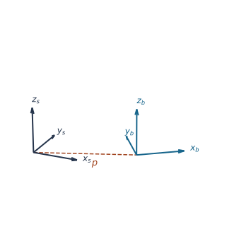

# Rotations, Quaternions, and SO(3)
[]{#ch-rotations}


A golfer's clubface orientation, a robot's hand orientation and a walking model's foot orientation all require more than a point in space. Two bodies can occupy the same position and face different directions. Conversely, changing the numbers used to describe an orientation need not change the physical body at all. This chapter separates the orientation, its coordinates, its rate of change and its effect on a task.

We use right-handed frames and column vectors. Every formula states which frame supplies its components and which multiplication order it uses. These conventions are essential: a transposed rotation can still be orthogonal, have determinant one and look numerically reasonable while transforming a clubface in the wrong direction. Representation checks and physical interpretation must work together.

## Historical Context: From Euler to Hamilton
[]{#sec-rotation_history}
[]{#laymans-context_box}


Euler's rotation theorem describes a finite proper rotation by an axis and an angle. Rodrigues' 1840 memoir studied rigid displacements [@rodrigues1840]. Hamilton's letter to Graves dated 17 October 1843 records the preceding day's discovery of quaternion algebra; the letter was published in 1844 [@HamiltonQuaternionLetterReview]. These are related developments, not interchangeable inventions of the modern matrix notation.

Matrices, axis-angle descriptions and unit quaternions represent the same orientations with different constraints and ambiguities. Their computational value depends on the operation. A matrix applies directly to a collection of vectors; a quaternion gives compact constrained storage; a local rotation vector is useful for perturbations. None makes dynamics linear, guarantees a controller's stability or removes the need to identify the body's actual motion.

## The Coordinate Frame
[]{#sec-coordinate_frame}


Let $\{s\}$ be a chosen spatial or laboratory frame and $\{b\}$ a frame rigidly attached to a modeled body. The laboratory frame is a reference, not an absolute stationary universe. For inertial dynamics we must either choose an adequate inertial approximation or account for the reference frame's acceleration. The kinematic transformations below do not themselves assert that a frame is inertial.

Write $R=R_{sb}$ for the orientation of $\{b\}$ expressed in $\{s\}$. For a geometric vector with component columns $v_b$ and $v_s$,
[]{#eq-frame_vector_rotation}

$$
v_s=R_{sb}v_b,\qquad v_b=R_{sb}^Tv_s.
$$
If $p_{sb}$ is the body origin's spatial position and $r_b$ is a point's body-relative position, the point's spatial position is $x_s=p_{sb}+R_{sb}r_b$. A direction such as a face normal transforms with $R$ alone; a point generally also requires the translation.

{#fig-coordinate_frames fig-alt="Two right-handed three-dimensional frames. Spatial axes originate at zero. Body axes, rotated 35 degrees about the spatial z axis, originate at p. A dashed arrow marks the origin offset; the body axes are expressed as columns of R in spatial coordinates."}

For a third frame, $R_{sc}=R_{sb}R_{bc}$. The inner frame subscripts match because $R_{bc}$ first produces body components, which $R_{sb}$ then converts to spatial components. The same matrix can also act as an active rotation on a vector while retaining its coordinate frame. State which interpretation applies; an active rotation and a passive component change use related algebra but describe different operations [@Lynch2017].

If a spatial rotation increment $Q_s$ acts on a body orientation, $R^+=Q_sR$. If the increment is expressed about the current body axes, $R^+=RQ_b$. Their equality for the same physical increment requires $Q_s=RQ_bR^T$. This is the source of the intrinsic/extrinsic convention distinctions used below.

## Rotation Matrices: From First Principles
[]{#sec-rotation_matrices}


### What Is a Rotation Matrix?

The columns of $R_{sb}$ are the three unit body axes expressed in spatial components:
[]{#eq-rotation_matrix_def}

$$
R_{sb}=\begin{bmatrix}|&|&|\\ \hat x_b^s&\hat y_b^s&\hat z_b^s\\|&|&|\end{bmatrix}.
$$
They are columns, not vertically stacked row vectors. Thus $Re_1$ is the body's first axis in the spatial frame. Orthonormal columns imply $R^TR=I$, so $R^{-1}=R^T$ and $\|Rv\|_2=\|v\|_2$. Requiring $\det R=1$ preserves handedness. An orthogonal matrix of determinant $-1$ reverses orientation and is not a proper rotation.

### Orthonormality Constraints
[]{#thm-orthonormality}

The three unit-length equations and three pairwise orthogonality equations impose six independent scalar constraints at an orthogonal matrix. Independence needs a derivative argument, supplied in the manifold section; counting equations alone is insufficient. The determinant condition selects one component of the orthogonal group. It does not reduce its local dimension by one more.

### The Three Elementary Rotation Matrices
[]{#thm-rotation_x_axis}
[]{#thm-rotation_y_axis}
[]{#thm-rotation_z_axis}


For active right-hand rotations in a fixed right-handed basis, the elementary matrices are
[]{#eq-Rx}

$$
R_x(\alpha)=\begin{bmatrix}1&0&0\\0&\cos\alpha&-\sin\alpha\\0&\sin\alpha&\cos\alpha\end{bmatrix},
$$
[]{#eq-Ry}

$$
R_y(\beta)=\begin{bmatrix}\cos\beta&0&\sin\beta\\0&1&0\\-\sin\beta&0&\cos\beta\end{bmatrix},
$$
[]{#eq-Rz}

$$
R_z(\gamma)=\begin{bmatrix}\cos\gamma&-\sin\gamma&0\\\sin\gamma&\cos\gamma&0\\0&0&1\end{bmatrix}.
$$
For $R_x$, the $x$ component is unchanged and the $yz$ components undergo the ordinary planar rotation $(y,z)\mapsto(y\cos\alpha-z\sin\alpha,y\sin\alpha+z\cos\alpha)$. The other formulas follow by cyclic permutation. This construction immediately verifies their columns, orthogonality and determinants. A positive rotation appears counterclockwise when viewed from the positive axis toward the origin.

Rotation order matters. For example,


$$
\begin{aligned}
R_x(\pi/2)R_y(\pi/2)e_z&=e_x,\\
R_y(\pi/2)R_x(\pi/2)e_z&=-e_y.
\end{aligned}
$$
Noncommutativity is a property of the composition law. It is not by itself a proof that a manifold is non-Euclidean: some noncommutative Lie groups have Euclidean underlying manifolds. For $SO(3)$, the topology and constraints give the relevant global obstruction.

## The Special Orthogonal Group: SO(3)
[]{#sec-SO3}


### SO(3) as a Group
[]{#def-SO3_group}
[]{#thm-SO3_is_group}

Define $SO(3)=\{R\in\mathbb R^{3\times3}:R^TR=I,\det R=1\}$. If $R_1,R_2$ satisfy these constraints, then $(R_1R_2)^T(R_1R_2)=R_2^TR_1^TR_1R_2=I$ and $\det(R_1R_2)=1$. Matrix multiplication is associative; $I$ belongs to the set; and $R^{-1}=R^T$ belongs to it. These facts establish the group axioms. Multiplication and inversion are smooth on this set, giving a Lie group [@Murray1994].

### SO(3) as a Smooth Manifold
[]{#thm-SO3_manifold}
[]{#princ-so3_principle}

Consider $G:\mathbb R^{3\times3}\to\operatorname{Sym}(3)$, $G(R)=R^TR-I$. Its derivative is
[]{#eq-rotation_constraint_derivative}

$$
DG_R[H]=R^TH+H^TR.
$$
At an orthogonal $R$, any symmetric $S$ is attained by $H=RS/2$. Thus $DG_R$ has rank six, the dimension of $\operatorname{Sym}(3)$. The regular-level-set theorem gives dimension $9-6=3$. Orthogonal matrices have determinant $\pm1$; the continuous determinant separates the two components, and restricting to $+1$ preserves local dimension. The set is closed and bounded in $\mathbb R^9$, hence compact.

Its tangent vectors are the matrices $H$ satisfying $R^TH+H^TR=0$, equivalently
[]{#eq-rotation_tangent_space}

$$
T_RSO(3)=\{R\Omega:\Omega^T=-\Omega\}.
$$
The local map $\delta\mapsto R\exp([\delta]_\times)$ has an invertible three-dimensional derivative at $\delta=0$ and supplies a local chart. It does not give a unique global three-vector coordinate system. In particular, compact $SO(3)$ cannot be globally diffeomorphic to an open subset of $\mathbb R^3$. A body that is free to rotate about a fixed point has configuration space $SO(3)$, while a hinge-constrained body has a different, lower-dimensional space.

## Euler Angles: Gimbal Lock and Beyond

[]{#euler-angles-and-gimbal-lock}
[]{#sec-euler_angles}


### Definition of Euler Angles

Euler-type coordinates describe an orientation by three sequential rotations. A convention must specify the axis sequence, whether axes are fixed or moving, active versus passive interpretation, and angle/rate ordering. ZYX uses three distinct axes and is also called a Tait--Bryan convention; ZXZ repeats the first axis. Merely writing "roll, pitch, yaw" does not settle these choices.

### The ZYX Convention

Start with aligned frames, yaw by $\psi$ about $z_s$, pitch by $\theta$ about the resulting current $y$ axis, then roll by $\phi$ about the resulting current $x$ axis. Each body-axis increment postmultiplies the current orientation, giving
[]{#eq-euler_zyx}

$$
R(\phi,\theta,\psi)=R_z(\psi)R_y(\theta)R_x(\phi).
$$
This is intrinsic ZYX, and equivalently fixed-axis XYZ applied in chronological order roll, pitch, yaw. Using $c_a=\cos a$ and $s_a=\sin a$, direct multiplication gives
[]{#eq-euler_zyx_full}

$$
R=\begin{bmatrix}
 c_\psi c_\theta&c_\psi s_\theta s_\phi-s_\psi c_\phi&c_\psi s_\theta c_\phi+s_\psi s_\phi\\
 s_\psi c_\theta&s_\psi s_\theta s_\phi+c_\psi c_\phi&s_\psi s_\theta c_\phi-c_\psi s_\phi\\
 -s_\theta&c_\theta s_\phi&c_\theta c_\phi
 \end{bmatrix}.
$$
For $(\phi,\theta,\psi)=(45^\circ,30^\circ,60^\circ)$ this is approximately
[]{#eq-euler_numeric_example}

$$
R=\begin{bmatrix}
 .433013&-.435596&.789149\\
 .750000&.659740&-.047367\\
 -.500000&.612372&.612372
 \end{bmatrix}.
$$
The unrounded product is exactly orthogonal. Reversing the factors generally gives a different orientation, although that wrong-convention result is also orthogonal. This illustrates why checking only $R^TR$ cannot detect a frame convention error.

### The ZXZ Convention

If the chronological current-axis rotations are $\phi$ about $z$, $\theta$ about the new $x$, and $\psi$ about the new $z$, then $R=R_z(\phi)R_x(\theta)R_z(\psi)$. This convention's singular sets occur when $\sin\theta=0$, unlike ZYX's $\cos\theta=0$. A statement about gimbal lock must name its convention.

### Gimbal Lock: Singularity and Proof
[]{#sec-gimbal_lock}
[]{#laymans-gimballock}
[]{#thm-gimbal_lock_proof}


For intrinsic ZYX, express angular velocity in spatial components and order the coordinate rates as $(\dot\phi,\dot\theta,\dot\psi)$. Each angle contributes about its current spatial axis. Therefore
[]{#eq-euler_spatial_rate_map}

$$
\omega_s=J_s\begin{bmatrix}\dot\phi\\\dot\theta\\\dot\psi\end{bmatrix},\qquad
 J_s=\begin{bmatrix}
 c_\psi c_\theta&-s_\psi&0\\
 s_\psi c_\theta&c_\psi&0\\
 -s_\theta&0&1
 \end{bmatrix}.
$$
The columns are $R_zR_ye_x$, $R_ze_y$ and $e_z$, respectively. Expanding the determinant gives $\det J_s=\cos\theta$. At $\theta=\pi/2$, the roll column is $-e_z$ and the yaw column is $e_z$: only their difference contributes about that direction, and $(1,0,1)^T$ lies in the kernel. Rank is two. At $-\pi/2$, the two columns coincide instead.

[]{#euler-angles-where-singularities-propagate}

The singular values follow from
[]{#eq-euler_rate_conditioning}

$$
J_s^TJ_s=\begin{bmatrix}1&0&-\sin\theta\\0&1&0\\-\sin\theta&0&1\end{bmatrix}.
$$
Away from the singular set, the 2-norm condition number is $\sqrt{(1+|\sin\theta|)/(1-|\sin\theta|)}$. It is about 114.59 at 89 degrees of pitch. The forward map remains bounded; its inverse becomes ill-conditioned. Small orientation-rate or measurement errors can demand very large changes in the inferred Euler rates. This is different from claiming that small angle changes inevitably cause arbitrarily large physical rotations.

The freely rotating body still has three physical rotational freedoms. The selected chart fails to represent all instantaneous directions regularly at that point. A mechanical three-gimbal device can also lose instantaneous actuation directions when its physical axes align, but that is a statement about the mechanism. Neither phenomenon makes the laws of mathematics fail or guarantees a computer crash. Controllers must handle the relevant coordinate and actuator maps explicitly.

Euler coordinates are useful on a domain that stays away from their singularity, including local estimation and control with monitored conditioning. Quaternions or matrices allow global orientation storage; local perturbation charts remain useful alongside them. Choosing a representation does not prove controllability, robustness or numerical integration accuracy.

## Differential Geometry Primer: Lie Groups and Lie Algebras
[]{#sec-lie_groups_algebras}
[]{#def-lie_group}


### The Tangent Space and Lie Algebra
[]{#def-lie_algebra}
[]{#laymans-group_vs_algebra_reminder}

The Lie algebra is the tangent space at identity, $\mathfrak{so}(3)=\{\Omega:\Omega^T=-\Omega\}$. The hat map identifies a three-vector with a skew matrix:
[]{#eq-skew_symmetric}

$$
[\omega]_\times=\begin{bmatrix}0&-\omega_z&\omega_y\\\omega_z&0&-\omega_x\\-\omega_y&\omega_x&0\end{bmatrix},
 \qquad [\omega]_\times v=\omega\times v.
$$
For any orientation, left or right multiplication transports a tangent vector to this identity-space representation. The object need not be unrotated. A rotation vector has units of angle; an angular-velocity vector has units of angle per time. The vector space can represent either, but their physical meanings differ.

The Lie bracket is the matrix commutator. Applying the vector triple-product identity to an arbitrary vector yields $[[a]_\times,[b]_\times]=[a\times b]_\times$. Although the algebra is a linear space, a nonlinear rigid-body dynamical equation expressed through it does not become a linear dynamical system. The exponential reconstructs finite rotations from constant increments, with ordering needed for changing noncommuting rates.

## Rodrigues' Rotation Formula: Full Derivation
[]{#sec-rodrigues}


### The Key Identity
[]{#thm-skew_cubic}

Let $a$ be a unit axis and $A=[a]_\times$. For every vector $v$, $A^2v=a\times(a\times v)=a(a^Tv)-v$. Consequently
[]{#eq-skew_squared}

$$
A^2=aa^T-I,\qquad A^3=-A.
$$
[]{#eq-skew_cubic}
Multiplying repeatedly gives $A^4=-A^2$, $A^5=A$, $A^6=A^2$, and the cycle continues. The unit-axis condition matters; for arbitrary $u$, $[u]_\times^3=-\|u\|^2[u]_\times$.
[]{#eq-skew_power_cycle}

### Taylor Expansion and Regrouping
[]{#thm-rodrigues_formula}

The absolutely convergent matrix exponential series is
[]{#eq-exp_taylor}

$$
\exp(\alpha A)=I+\alpha A+\frac{\alpha^2}{2}A^2+\frac{\alpha^3}{6}A^3+\cdots.
$$
Regrouping its odd powers gives $(\alpha-\alpha^3/6+\cdots)A=\sin\alpha A$. Regrouping its positive even powers gives $(\alpha^2/2-\alpha^4/24+\cdots)A^2=(1-\cos\alpha)A^2$. Thus
[]{#eq-rodrigues}

$$
\exp(\alpha[a]_\times)=I+\sin\alpha[a]_\times+(1-\cos\alpha)[a]_\times^2.
$$
Its vector action is
[]{#eq-rodrigues_vector}

$$
Rv=v\cos\alpha+(a\times v)\sin\alpha+a(a^Tv)(1-\cos\alpha).
$$
The parallel component stays fixed and the perpendicular component rotates in its plane. This independently derived matrix proof is the modern form used here; citing Rodrigues' historical memoir does not imply that the memoir used modern matrix exponentials.

For a rotation vector $u=\alpha a$, use $I+\operatorname{sinc}(\alpha)[u]_\times+\operatorname{cosc}(\alpha)[u]_\times^2$, with $\operatorname{sinc}(\alpha)=\sin\alpha/\alpha$ and $\operatorname{cosc}(\alpha)=(1-\cos\alpha)/\alpha^2$. Their limits at zero are 1 and 1/2. Stable implementations use series or equivalent cancellation-resistant formulas near zero rather than divide by a tiny number after subtracting nearly equal cosines.

## Quaternion Algebra

[]{#unit-quaternions-mathcalh}
[]{#sec-quaternions}


### Definition and Representation

Use scalar-first Hamilton quaternions $q=(w,v)=(w,x,y,z)\in\mathbb H$, with $i^2=j^2=k^2=ijk=-1$. Then $ij=k$ while $ji=-k$, and cyclic permutations give the other products. Quaternion addition is componentwise. Unit quaternions form $S^3\subset\mathbb R^4$, not all of $\mathbb H$.
[]{#eq-quaternion_def}

### Quaternion Operations

Distributing products and collecting real and imaginary parts gives
[]{#eq-hamilton_product}

$$
(w,v)\otimes(s,u)=(ws-v^Tu,\;wu+sv+v\times u).
$$
The conjugate is $q^*=(w,-v)$ and $q\otimes q^*=(w^2+v^Tv,0)$. Define $\|q\|=\sqrt{w^2+v^Tv}$. For $q\ne0$, the inverse is $q^{-1}=q^*/\|q\|^2$; for a unit quaternion it is simply $q^*$. Zero has no inverse and cannot be normalized to an orientation.

For example, with $c=1/\sqrt2$, $(c,c,0,0)\otimes(c,0,c,0)=(1,1,1,1)/2$. The factors represent 90-degree rotations about $x$ and $y$, respectively. Their product applies the $y$ rotation first and then the $x$ rotation. Its unit norm follows exactly; replacing $c$ by rounded 0.7071 does not preserve exact unit norm.

### Unit Quaternions and Rotation
[]{#thm-quaternion_rotation}
[]{#laymans-quaternion_half_angle}


Every unit quaternion can be written
[]{#eq-quaternion_rotation}

$$
q=(\cos(\alpha/2),\;a\sin(\alpha/2)),\qquad \|a\|=1,\quad 0\le\alpha\le 2\pi.
$$
For nonzero vector part, choose $\alpha=2\operatorname{atan2}(\|v\|,w)$ and $a=v/\|v\|$. At $q=1$ and $q=-1$, choose any axis, with $\alpha=0$ and $2\pi$, respectively. Both endpoints are required if the statement covers every unit quaternion.

Represent a three-vector by the pure quaternion $(0,r)$. Two applications of the Hamilton product give the vector part of $q\otimes(0,r)\otimes q^*$ as
[]{#eq-quaternion_sandwich_expansion}

$$
(w^2-v^Tv)r+2v(v^Tr)+2w(v\times r).
$$
Substituting the half-angle representation reproduces Rodrigues' vector formula. This proves both the action and the half-angle factor. Using $q^*$ instead of $q^{-1}$ without first normalizing a nonunit quaternion would scale the rotated vector by $\|q\|^2$. That is a concrete numerical error, not merely a different convention.

### Double Cover: q and -q Represent the Same Rotation
[]{#thm-quaternion_double_cover}


Negating both factors in the sandwich product changes nothing. To show that these are the only two representatives, suppose two unit quaternions have the same action. Their quotient commutes with every pure quaternion. The Hamilton formula then forces its vector part to vanish, so the quotient is $+1$ or $-1$. Every proper rotation has an axis-angle representation, proved below, so the map is onto. Locally its derivative has rank three; globally $SO(3)$ is $S^3$ with antipodal points identified.

For a time series, align a new quaternion's sign to its predecessor when their dot product is nonzero and the intended step is the short rotation. This avoids a representation jump. It cannot infer full revolutions or resolve an exactly 180-degree ambiguity from endpoint orientations alone. A continuous physical turn through 360 degrees can lift from $q$ to $-q$; resetting every sample's scalar component to nonnegative can introduce an artificial discontinuity.

## Conversion Between Quaternions and Rotation Matrices
[]{#sec-quat_to_matrix}


### Quaternion to Rotation Matrix
[]{#thm-quat_to_matrix}

The sandwich expansion gives the sign-safe polynomial formula $R=(w^2-v^Tv)I+2vv^T+2w[v]_\times$. For unit $q=(w,x,y,z)$ this becomes
[]{#eq-quat_to_matrix}

$$
R(q)=\begin{bmatrix}
 1-2(y^2+z^2)&2(xy-wz)&2(xz+wy)\\
 2(xy+wz)&1-2(x^2+z^2)&2(yz-wx)\\
 2(xz-wy)&2(yz+wx)&1-2(x^2+y^2)
 \end{bmatrix}.
$$
This avoids choosing a square-root sign for a half-angle. It also proves $R(p\otimes q)=R(p)R(q)$ by composition of the sandwich actions. Always verify scalar ordering and active/passive conventions at a software boundary.

### Rotation Matrix to Quaternion
[]{#thm-matrix_to_quat}

Let $R\in SO(3)$ and $t=\operatorname{tr}R$. The diagonal entries determine four squared components:
[]{#eq-quaternion_component_squares}

$$
(w^2,x^2,y^2,z^2)=\tfrac 14(1+t,\;1+2R_{11}-t,\;1+2R_{22}-t,\;1+2R_{33}-t).
$$
Choose the largest square and take its nonnegative root. Since the squares sum to one, this component is at least 1/2. The subsequent divisor is therefore at least 2 in exact arithmetic, including at half turns.

If $w$ is selected, recover $x=(R_{32}-R_{23})/(4w)$, $y=(R_{13}-R_{31})/(4w)$ and $z=(R_{21}-R_{12})/(4w)$. If vector component $v_i$ is selected, let $(i,j,k)$ be a cyclic permutation of $(1,2,3)$ and use
[]{#eq-quaternion_largest_component}

$$
w=\frac{R_{kj}-R_{jk}}{4v_i},\qquad
 v_j=\frac{R_{ji}+R_{ij}}{4v_i},\qquad
 v_k=\frac{R_{ki}+R_{ik}}{4v_i}.
$$
For $R=\operatorname{diag}(1,-1,-1)$, the algorithm selects $x=1$ and returns $(0,1,0,0)$. The trace-only branch would divide by $w=0$. In floating point, validate shape, finite entries, orthogonality and determinant within a stated tolerance. A final normalization removes small roundoff; it cannot make an arbitrary nonrotation into valid measured data. Fitting noisy matrices is a separate problem.

### Rotation Representation Comparison
[]{#sec-rotation_comparison}


[]{#tab-rotation_comparison}

| Representation | Entries | Conditions and Ambiguities |
|---------|---:|--------------------------|
| Matrix | 9 | Six independent orthogonality constraints; determinant selects proper rotations. |
| Euler angles | 3 | Convention-specific local chart; singular rate maps and periodic branches. |
| Axis and angle | 4 | Unit axis; arbitrary axis at identity and sign ambiguity at half turns. |
| Rotation vector | 3 | Principal-log branch at $\pi$; exponential derivative degenerates at nonzero $2\pi$ multiples. |
| Unit quaternion | 4 | Unit norm; two opposite representatives of each orientation. |


An axis plus an angle stores four scalar entries with a unit-axis constraint and branch redundancy. A rotation vector $u=\alpha a$ stores three. They are related, but should not be given the same raw parameter count. The principal rotation vector has norm at most $\pi$, with opposite boundary axes identified; its inverse logarithm is ambiguous at half turns. At identity the rotation vector is zero while the separate axis is arbitrary.

The derivative of the exponential has a different singularity. In spatial trivialization,
[]{#eq-rotation_exponential_differential}

$$
J_l(u)=I+\frac{1-\cos\alpha}{\alpha^2}[u]_\times
       +\frac{\alpha-\sin\alpha}{\alpha^3}[u]_\times^2,\qquad \alpha=\|u\|,
$$
with the continuous limit at zero. One derivation differentiates the matrix exponential and transports the result to identity, obtaining $J_l(u)=\int_0^1\exp(s[u]_\times)\,ds$. Along $u$ its eigenvalue is one; on the perpendicular plane its singular values are $2|\sin(\alpha/2)|/\alpha$. Thus
[]{#eq-rotation_exponential_rank}

$$
\det J_l(u)=\left(\frac{2\sin(\alpha/2)}{\alpha}\right)^2.
$$
It is nonsingular at $\pi$ and singular at nonzero multiples of $2\pi$. The principal-log cut and exponential differential singularity are distinct. A quaternion's double cover is yet another issue. Keeping these distinctions explicit prevents a coordinate choice from being mistaken for a physical singularity.

## Spherical Linear Interpolation (SLERP)
[]{#sec-slerp}
[]{#def-slerp_def}


Normalize the two nonzero endpoints. Set $a=q_0$ and choose $b=q_1$ if $q_0^Tq_1\ge0$, otherwise $b=-q_1$. With $c=a^Tb\in[0,1]$ and $\Omega=\arccos c$, short-arc interpolation is
[]{#eq-slerp}

$$
q(u)=\frac{\sin((1-u)\Omega)}{\sin\Omega}a+
      \frac{\sin(u\Omega)}{\sin\Omega}b,\quad 0\le u\le 1.
$$
Changing only the dot product's sign without changing $b$ is incorrect. At $\Omega=0$, define $q(u)=a$. Antipodal quaternion inputs then describe a stationary orientation after sign alignment, not a mandatory full revolution. At $c=0$, both endpoint signs define equally short 180-degree physical rotations; the data or application must select a path.

To derive the formula, take $n=(b-ca)/\sin\Omega$ for $\Omega>0$. Then $a,n$ are orthonormal and $q(u)=a\cos(u\Omega)+n\sin(u\Omega)$. Resolving $n$ into $a,b$ gives the displayed sine weights. Moreover $\|dq/du\|=\Omega$; the quaternion remains on the unit sphere and traverses its great-circle arc at constant speed. The corresponding physical rotation angle is $2\Omega$, so over a duration $T$ with $u=t/T$ the angular-speed magnitude is $2\Omega/T$ [@Shoemake1985RotationReview].

Near coincident endpoints, the program uses normalized linear interpolation. This is a controlled small-angle approximation, not exact constant-speed SLERP. For $\ell(u)=(1-u)a+ub$, the angle swept on the great circle satisfies $d\beta/du=\sin\Omega/\|\ell(u)\|^2$, which generally varies with $u$. As $\Omega\to0$ the discrepancy vanishes. The stated threshold makes the approximation explicit and testable.

Consecutive SLERP segments are orientation-continuous at a shared endpoint, but their angular velocities generally jump. Shoemake's work motivates higher-continuity quaternion curves; merely naming SLERP does not give a smooth acceleration history. Nor does interpolation enforce torque, contact, joint-range or muscle-activation limits. A measured trajectory and a dynamically feasible planned trajectory require additional information.

## Angular Velocity and the Matrix Exponential
[]{#sec-angular_velocity}


### Angular Velocity in the Spatial Frame
[]{#thm-matrix_derivative_spatial}


For a differentiable $R(t)=R_{sb}(t)$, differentiating $RR^T=I$ shows that $\dot RR^T$ is skew. Define $[\omega_s]_\times=\dot RR^T$. Multiplying by $R$ yields
[]{#eq-R_dot_spatial}

$$
\dot R=[\omega_s]_\times R.
$$
Each column obeys $\dot r_i=\omega_s\times r_i$, the velocity of a rotating unit axis. When $\omega_s\ne0$, its direction gives the instantaneous spin axis and its magnitude the angular speed in radians per second. At zero angular velocity there is no unique instantaneous axis.

### Angular Velocity in the Body Frame


Differentiating $R^TR=I$ similarly makes $R^T\dot R$ skew. Define $[\omega_b]_\times=R^T\dot R$, giving
[]{#eq-R_dot_body}

$$
\dot R=R[\omega_b]_\times,\qquad \omega_s=R\omega_b.
$$
The second relation follows from $[\omega_s]_\times=R[\omega_b]_\times R^T$ and preservation of cross products by proper rotations. These are two component descriptions of the same angular velocity relative to the spatial frame. They cannot be interchanged in a numerical formula without transforming the components.

### Proof That Angular Velocity Lives in the Lie Algebra
[]{#thm-angular_velocity_so3}

The derivative $\dot R$ itself lies in $T_RSO(3)$. The products $R^T\dot R$ and $\dot RR^T$ lie in $\mathfrak{so}(3)$. For example, $\dot R^TR+R^T\dot R=0$ implies $(R^T\dot R)^T=-R^T\dot R$. This proof applies at every orientation and explains precisely what is meant by an angular velocity "in the Lie algebra."

For a unit quaternion carrying the same orientation, differentiation of the sandwich action gives
[]{#eq-quaternion_kinematics}

$$
\dot q=\tfrac 12(0,\omega_s)\otimes q
       =\tfrac 12q\otimes(0,\omega_b).
$$
Indeed, a short body rotation has increment $(1,\omega_b\,dt/2)+O(dt^2)$ and postmultiplies $q$; a spatial increment premultiplies it. This also explains the factor of two in the Lie bracket of pure quaternions: their commutator is $(0,2a\times b)$. The Lie-algebra isomorphism from skew matrices to pure quaternions is $[a]_\times\mapsto(0,a/2)$ when both use their ordinary commutators.

For constant spatial rate, $R(t+h)=\exp(h[\omega_s]_\times)R(t)$. For constant body rate, $R(t+h)=R(t)\exp(h[\omega_b]_\times)$. A changing noncommuting rate generally requires an ordered product or an appropriate numerical integrator. Substituting the integral of the rate into one exponential is not generally exact. Quaternion normalization controls a representation constraint; it does not remove integration phase error.

## Axis-Angle Form and Euler's Theorem
[]{#sec-axis_angle}
[]{#thm-euler_rotation_theorem}


A real orthogonal 3-by-3 matrix has eigenvalues of unit magnitude. Nonreal eigenvalues occur in conjugate pairs with product one. Since the dimension is odd, at least one eigenvalue is real and hence $\pm1$. Determinant $+1$ forces at least one $+1$ eigenvalue, including the all-real case. Choose a unit eigenvector $a$ with $Ra=a$.

Its perpendicular plane is invariant because $a^TRv=(R^Ta)^Tv=a^Tv$. The restriction to that plane is a proper two-dimensional rotation and therefore has an angle. Choosing the axis sign allows the angle $\alpha$ to lie in $[0,\pi]$. This establishes existence without assuming a fixed axis at the start. Its trace is $1+2\cos\alpha$.

For $0<\alpha<\pi$, $[a]_\times=(R-R^T)/(2\sin\alpha)$. At identity the axis is arbitrary; at a half turn the sign of the axis is ambiguous and the antisymmetric formula fails. Use an eigenvector or the stable quaternion conversion there. The finite endpoint axis need not equal the instantaneous angular-velocity axis anywhere along a general intervening trajectory. An orientation pair alone does not recover the body's path or accumulated turns.

## Numerical Stability and Software Contracts

[]{#numerical-stability-a-practical-consideration}
[]{#sec-rotation_numerics}

[]{#practical-guidance}

Store a matrix, quaternion or local chart according to the operation and domain. There is no universal fastest or most stable representation. MuJoCo, for example, documents scalar-first unit quaternions and distinguishes quaternion position storage from three-dimensional angular-velocity coordinates [@MuJoCoRotationReview]. That interface fact does not establish a speed comparison or the representation used by every other engine.

[]{#rotation-matrices-stability-through-constraints}

If a near-rotation matrix $M$ needs projection, an SVD $M=U\Sigma V^T$ gives the Frobenius-nearest proper rotation $U\operatorname{diag}(1,1,\det(UV^T))V^T$, with descending singular values. The determinant adjustment prevents a reflection. Projection can be nonunique at degenerate data, and a chosen branch need not vary continuously there. Plain QR without sign and orientation conventions is not this nearest-rotation solution.

[]{#unit-quaternions-efficiency-meets-stability}

A numerical tolerance should reflect the expected error scale. The teaching converter rejects matrices outside its declared tolerance instead of silently fitting them. A quaternion normalization should first scale by its largest absolute component, then normalize the scaled vector; this prevents overflow or underflow of the intermediate norm for finite nonzero inputs. Neither operation validates the motion-capture calibration that produced the data.

## Interpreting Golf and Humanoid Motion
[]{#sec-rotation_tasks}

Let a fixed body-frame clubface normal be $n_b$ and a fixed clubhead point be $r_b$. Their spatial values are $n_s=Rn_b$ and $x_s=p+Rr_b$. Under a small spatial orientation perturbation $R^+=\exp([\delta\alpha_s]_\times)R$,
[]{#eq-clubface_point_sensitivity}

$$
\delta n_s=-[n_s]_\times\delta\alpha_s+O(\|\delta\alpha_s\|^2),
 \qquad
 \delta x_s=\delta p-[Rr_b]_\times\delta\alpha_s+O(\|\delta\alpha_s\|^2).
$$
A perturbation parallel to $n_s$ changes the full body orientation but leaves that normal unchanged to first order. The same perturbation can move an off-axis point. Face normal, strike position and complete orientation are related but different tasks. For a one-metre lever arm perpendicular to a small 0.01-radian rotation, the leading point displacement is 0.01 metres. This is a geometric example, not a measured swing or a prediction of ball dispersion.

For a small zero-mean orientation error represented in body components, $\delta\alpha_s=R\delta\alpha_b$ gives $\Sigma_s=R\Sigma_bR^T$. A normal's first-order covariance is $[n_s]_\times\Sigma_s[n_s]_\times^T$. Position and orientation correlations must be included when propagating the point expression. Subtracting Euler angles or quaternion entries across a branch cut does not provide a consistent global orientation error. These linear covariance formulas require a sufficiently concentrated distribution within a common perturbation convention.

Timing is intertwined with geometry. Comparing a nominal face at $t$ with the same trajectory at $t+\delta t$ adds $\dot n_s\delta t=(\omega_s\times n_s)\delta t$ to first order. Near ball impact or foot contact, the event time itself depends on state and geometry. Compare equivalent events and use the appropriate event sensitivity before attributing an orientation mismatch to a golfer's control. The hybrid chapters develop that additional calculation.

Orientation specifies arrangement; angular velocity specifies its rate. Inertia, torques, activation, compliance and constraints determine which rates and accelerations are feasible. A smooth quaternion interpolant does not establish a feasible human movement, and a compact endpoint orientation error does not identify the forces that produced it. These distinctions let geometric analysis inform the golf question without claiming that representation mathematics explains skilled coordination by itself.

## Worked Example: Quaternion Interpolation
[]{#sec-python_example}


The following self-contained NumPy program is the actual file exercised by the repository tests. It uses scalar-first Hamilton multiplication, normalizes nonzero rotation inputs consistently, validates domains, converts matrices by the largest-component rule and returns point-cloud frames. It generates no plot by itself and reports no performance benchmark.

```python
"""Quaternion operations and SLERP, as developed in Volume 0 Chapter 4.

Self-contained by design: this file is typeset into the chapter as a worked
example, so it depends only on NumPy and repeats nothing the chapter has not
already derived. Equation numbers in the comments refer to Chapter 4.

Correctness is pinned by tests/test_affine_control/test_quaternion_demo.py --
the properties asserted there (unit norm, orthogonality of the rotation matrix,
agreement between quaternion rotation and matrix rotation, SLERP endpoints and
constant angular velocity) are what make this an example rather than a claim.
"""

from __future__ import annotations

import numpy as np
from numpy.typing import NDArray

type Array = NDArray[np.float64]

# Above this sign-aligned dot product, use normalized linear interpolation.
# It approximates SLERP near coincident endpoints without dividing by sin(Omega).
SLERP_LINEAR_THRESHOLD = 1.0 - 1.0e-9
ROTATION_TOLERANCE = 1.0e-10


def _finite_vector(value: Array, size: int, name: str) -> Array:
    """Validate a vector before applying the chapter's algebra."""
    vector = np.asarray(value, dtype=float)
    if vector.shape != (size,) or not np.isfinite(vector).all():
        raise ValueError(f"{name} must be a finite vector of length {size}")
    return vector


def _unit_vector(value: Array, size: int, name: str) -> Array:
    """Normalize after scaling to avoid overflow and underflow in the norm."""
    vector = _finite_vector(value, size, name)
    scale = float(np.max(np.abs(vector)))
    if scale == 0.0:
        raise ValueError(f"the zero {name} cannot be normalized")
    scaled = vector / scale
    return scaled / np.linalg.norm(scaled)


def hamilton_product(p: Array, q: Array) -> Array:
    """Quaternion product, equation (eq:hamilton_product).

    Both arguments are ordered [w, x, y, z]. The product is not commutative;
    ``hamilton_product(p, q)`` applies ``q`` first, then ``p``.
    """
    pw, px, py, pz = _finite_vector(p, 4, "quaternion")
    qw, qx, qy, qz = _finite_vector(q, 4, "quaternion")
    return np.array(
        [
            pw * qw - px * qx - py * qy - pz * qz,
            pw * qx + px * qw + py * qz - pz * qy,
            pw * qy - px * qz + py * qw + pz * qx,
            pw * qz + px * qy - py * qx + pz * qw,
        ]
    )


def normalize(q: Array) -> Array:
    """Normalize a finite nonzero quaternion; q and -q represent one rotation."""
    return _unit_vector(q, 4, "quaternion")


def conjugate(q: Array) -> Array:
    """For a unit quaternion this is also the inverse."""
    w, x, y, z = _finite_vector(q, 4, "quaternion")
    return np.array([w, -x, -y, -z])


def from_axis_angle(axis: Array, angle: float) -> Array:
    """Unit quaternion for a rotation of ``angle`` about ``axis``.

    Note the half-angle: a quaternion covers SO(3) twice, so q and -q are the
    same rotation.
    """
    if not np.isfinite(angle):
        raise ValueError("angle must be finite and expressed in radians")
    unit = _unit_vector(axis, 3, "axis")
    return np.concatenate([[np.cos(angle / 2.0)], np.sin(angle / 2.0) * unit])


def to_matrix(q: Array) -> Array:
    """Rotation matrix of a unit quaternion, equation (eq:quat_to_matrix)."""
    w, x, y, z = normalize(q)
    return np.array(
        [
            [1 - 2 * (y * y + z * z), 2 * (x * y - w * z), 2 * (x * z + w * y)],
            [2 * (x * y + w * z), 1 - 2 * (x * x + z * z), 2 * (y * z - w * x)],
            [2 * (x * z - w * y), 2 * (y * z + w * x), 1 - 2 * (x * x + y * y)],
        ]
    )


def rotate(q: Array, v: Array) -> Array:
    """Normalize q, then rotate a finite vector by the unit sandwich product."""
    unit = normalize(q)
    pure = np.concatenate([[0.0], _finite_vector(v, 3, "point")])
    return hamilton_product(hamilton_product(unit, pure), conjugate(unit))[1:]


def from_matrix(matrix: Array) -> Array:
    """Convert a proper rotation using the largest quaternion component.

    Finite 3-by-3 inputs must satisfy orthogonality and determinant +1 within
    ROTATION_TOLERANCE. This checks a representation; it does not fit noisy data.
    The selected component is nonnegative. Signs can change between samples,
    so a time series needs a separate continuity choice.
    """
    value = np.asarray(matrix, dtype=float)
    if value.shape != (3, 3) or not np.isfinite(value).all():
        raise ValueError("matrix must be finite with shape (3, 3)")
    if not np.allclose(value.T @ value, np.eye(3), atol=ROTATION_TOLERANCE, rtol=0):
        raise ValueError("matrix must be orthogonal")
    if not np.isclose(np.linalg.det(value), 1, atol=ROTATION_TOLERANCE, rtol=0):
        raise ValueError("matrix must have determinant +1")
    trace = float(np.trace(value))
    squares = np.r_[1 + trace, 1 + 2 * np.diag(value) - trace] / 4
    selected = int(np.argmax(squares))
    result = np.zeros(4)
    result[selected] = np.sqrt(squares[selected])
    divisor = 4 * result[selected]
    if selected == 0:
        result[1:] = (
            np.array(
                [value[2, 1] - value[1, 2], value[0, 2] - value[2, 0], value[1, 0] - value[0, 1]]
            )
            / divisor
        )
    else:
        i = selected - 1
        j, k = (i + 1) % 3, (i + 2) % 3
        result[0] = (value[k, j] - value[j, k]) / divisor
        result[j + 1] = (value[j, i] + value[i, j]) / divisor
        result[k + 1] = (value[k, i] + value[i, k]) / divisor
    return normalize(result)


def slerp(q0: Array, q1: Array, t: float) -> Array:
    """Spherical linear interpolation, equation (eq:slerp).

    Two details matter and neither is cosmetic:

    * If the dot product is negative the interpolation would take the long way
      round the sphere -- 360 degrees minus the short arc. Negating one input
      selects the short arc, which is legitimate because q and -q denote the
      same rotation.
    * As the quaternions approach each other sin(Omega) approaches zero and the
      closed form loses precision, so below a threshold we fall back to
      normalised linear interpolation, which agrees to first order.
    """
    if not np.isfinite(t) or not 0 <= t <= 1:
        raise ValueError("interpolation fraction must be finite and in [0, 1]")
    a = normalize(np.asarray(q0, dtype=float))
    b = normalize(np.asarray(q1, dtype=float))

    dot = float(np.dot(a, b))
    if dot < 0.0:
        b, dot = -b, -dot

    if dot > SLERP_LINEAR_THRESHOLD:
        return normalize(a + t * (b - a))

    omega = float(np.arccos(np.clip(dot, -1.0, 1.0)))
    sin_omega = np.sin(omega)
    return np.asarray(
        (np.sin((1.0 - t) * omega) / sin_omega) * a + (np.sin(t * omega) / sin_omega) * b,
        dtype=float,
    )


def interpolate_point_cloud(points: Array, q0: Array, q1: Array, frames: int) -> list[Array]:
    """Carry a point cloud through the interpolated frames.

    Returns one rotated copy of ``points`` per sample, including both endpoints.
    Plotting these arrays is a separate operation.
    """
    if isinstance(frames, bool) or not isinstance(frames, (int, np.integer)) or frames < 2:
        raise ValueError("frames must be an integer of at least two")
    values = np.asarray(points, dtype=float)
    if values.ndim != 2 or values.shape[1] != 3 or not np.isfinite(values).all():
        raise ValueError("points must be a finite array with shape (n, 3)")
    return [(to_matrix(slerp(q0, q1, t)) @ values.T).T for t in np.linspace(0.0, 1.0, frames)]
```

The interpolation fraction lies in $[0,1]$; at least two integer frames are required to include both endpoints. Near coincident endpoints the documented normalized-linear branch approximates SLERP. The test suite checks matrix action against independent Rodrigues and SciPy constructions, half turns, sign-equivalent endpoints, large and tiny quaternion scales, invalid data and constant-speed behavior away from the approximation branch. Finite floating-point arithmetic remains distinct from exact symbolic identities.

## Chapter Summary
[]{#sec-ch4_summary}

A rotation matrix carries body components to spatial components under the stated convention. Its orthogonality and determinant define a three-dimensional Lie group. Euler coordinates are local and their rate maps can lose rank; the body's freedom is a separate question. Unit quaternions provide a constrained double cover, with explicit sign and interpolation choices. Spatial and body angular velocities are related by $R$, and their multiplication sides follow from that relation.

For golf and humanoid modeling, the practical chain is orientation representation, consistent angular rate, task sensitivity, uncertainty and event timing, followed by a dynamical feasibility analysis. The next chapter combines $R$ and $p$ into $SE(3)$ and distinguishes rigid-body twists, origins and finite screw displacements.

## Further Reading
[]{#sec-ch4_further_reading}

Murray, Li and Sastry [@Murray1994] and Lynch and Park [@Lynch2017] give the broader robotics treatment of rotation and rigid transformations. The official Modern Robotics frame and angular-velocity transcripts are directly relevant to the conventions used here. Shoemake [@Shoemake1985RotationReview] develops quaternion interpolation and explains why joining great-circle segments alone does not ensure higher-order continuity. MuJoCo's documentation [@MuJoCoRotationReview] supplies a concrete software convention to check against an implementation.

Hall [@hall2015] develops Lie-group theory, and Marsden and Ratiu [@marsden1999] place these structures in geometric mechanics. They are further study, not evidence that the present examples have validated an anatomical golfer. Historical references identify the original works; the proofs and numerical checks in this chapter state their own assumptions.

## Exercises and Answer Checks
[]{#sec-rotation_exercises}

[]{#exercises-ch4}

### Foundation Tier

#### Exercise 1

[]{#ex-orthogonal_matrices}
Verify $R_z(\theta)^TR_z(\theta)=I$ and $\det R_z(\theta)=1$. Interpret its columns under $R=R_{sb}$. Explain why these checks alone cannot distinguish $R_{sb}$ from $R_{bs}$.


#### Exercise 2

[]{#ex-rotation_composition}
Prove that $R_1R_2\in SO(3)$ when both factors are proper rotations. Apply $R_x(\pi/2)R_y(\pi/2)$ and the reversed product to $e_z$. State which rotation acts first in each expression.


#### Exercise 3

[]{#ex-euler_angles_zyx}
Compute the intrinsic ZYX product $R_z(\psi)R_y(\theta)R_x(\phi)$ for $(\phi,\theta,\psi)=(45^\circ,30^\circ,60^\circ)$. Check orthogonality and compare the third column with the reversed product's third column. Explain what that column could represent for an attached club frame.


#### Exercise 4

[]{#ex-gimbal_lock_jacobian}
At $\theta=\pi/2$, identify the dependent columns of the spatial ZYX rate map in roll/pitch/yaw order. Find a nonzero kernel vector and the rank. Explain why the result does not remove a freely rotating body's physical degree of freedom.


#### Exercise 5

[]{#ex-skew_symmetric}
Construct $[\omega]_\times$ for $\omega=(1,2,3)^T$. Verify skew symmetry and show that its action on an arbitrary vector equals the cross product. State the units if $\omega$ is an angular velocity.


### Intermediate Tier

#### Exercise 6

[]{#ex-quaternion_product}
Let $c=1/\sqrt2$, $q_1=(c,c,0,0)$ and $q_2=(c,0,c,0)$. Compute $q_1\otimes q_2$ and its exact norm. Repeat with $c=0.7071$ and quantify the norm difference. Why should an exact theorem not be checked by demanding exact equality from rounded input?


#### Exercise 7

[]{#ex-quaternion_double_cover}
For $q=(\cos(\pi/4),\sin(\pi/4),0,0)$, find axis-angle descriptions of $q$ and $-q$ using angles in $[0,2\pi]$. Verify identical matrix actions. Explain why the axis-angle pairs themselves need not be identical.


#### Exercise 8

[]{#ex-quat_to_matrix}
Convert $(\cos(\pi/8),\sin(\pi/8),0,0)$ to a matrix and recover it using the largest-component algorithm. Then apply the algorithm to $\operatorname{diag}(1,-1,-1)$ and explain why the scalar-only conversion fails.


#### Exercise 9

[]{#ex-slerp_interpolation}
Interpolate from identity to a 45-degree rotation about $x$ at fraction $u=1/2$. Repeat with a negated endpoint quaternion. Then interpolate from $q$ to $-q$: what physical path does the short-arc convention choose, and what information would be needed to request a full turn instead?


#### Exercise 10

[]{#ex-angular_velocity_skew}
For $R(t)=R_z(t)R_x(\pi/2)$, compute spatial and body angular velocity from the two matrix products. Verify $\omega_s=R\omega_b$. Explain why using $R(t)=R_z(t)$ alone would not expose a confusion between the two component conventions.


#### Exercise 11

[]{#ex-axis_angle_from_matrix}
Recover an axis-angle description of $R_x(\pi/3)$ from its trace and antisymmetric part. Treat $R_x(\pi)$ and $I$ separately. Explain what a finite endpoint axis says, and does not say, about an intervening swing trajectory.


### Advanced Tier

#### Exercise 12

[]{#ex-so3_manifold_dimension}
Prove the rank-six statement for $DG_R[H]$. Characterize its kernel, account for the determinant condition and construct a three-parameter local chart. Explain why counting written scalar equations would not suffice at a general singular constraint set.


#### Exercise 13

[]{#ex-quaternion_lie_algebra}
Compute the ordinary commutator of pure quaternions $(0,a)$ and $(0,b)$. Find the scale factor in the map $[a]_\times\mapsto(0,ca)$ that makes it a nonzero Lie-algebra isomorphism. Relate the result to the quaternion angular-velocity equation.


#### Exercise 14

[]{#ex-matrix_exponential}
Expand $\exp(t[e_z]_\times)$ through second order and compare it with $R_z(t)$. Then consider one interval rotating about $x$ followed by one about $y$. Explain why one exponential of the sum is generally different from the ordered product.


#### Exercise 15

[]{#ex-rodrigues_derivation}
Derive Rodrigues' vector formula by decomposing $v$ into components parallel and perpendicular to a unit axis. Derive the singular values of $J_l(u)$ on the axis and its perpendicular plane. Distinguish the behavior at $\|u\|=\pi$ and $2\pi$.


#### Exercise 16

[]{#ex-quaternion_interpolation_constant_speed}
Differentiate the great-circle form of SLERP and show that its quaternion speed is $\Omega$. Convert this to physical angular speed over duration $T$. Derive the normalized-linear angular rate and explain why consecutive SLERP segments need not have continuous angular velocity.


#### Exercise 17

[]{#ex-rotation_task_sensitivity}
Let $R=I$, $n_b=e_z$, $r_b=L e_x$ and $\delta\alpha_s=\varepsilon e_z$. Compare the first-order normal change with the point displacement. If $\Sigma_s=\sigma^2I$, compute the first-order normal covariance and its rank. Identify the physical perturbation that this normal-only task cannot observe.


#### Exercise 18

[]{#ex-rotation_timing}
A body has $n_s=e_x$ and $\omega_s=10e_z$ radians per second at a nominal event. Compute the first-order normal difference due solely to a 1-millisecond timestamp shift. Explain why this does not establish a golfer's control error or determine the true state-dependent impact-time sensitivity.


### Answer Checks


1. **Rotation Constraints.** The planar sine/cosine columns have unit norm and zero inner product; the third column is $e_z$. The determinant is $\cos^2\theta+\sin^2\theta=1$. The transpose satisfies the same constraints, so frame direction needs an independent convention or known vector-action check.


2. **Composition.** $(R_1R_2)^T(R_1R_2)=I$ and the determinant is the product of the determinants. The rightmost factor acts first. The two actions on $e_z$ are $e_x$ and $-e_y$ respectively.


3. **ZYX Example.** The worked example gives the full matrix. The two third columns are


    $$
    \begin{aligned}
    R_z(\psi)R_y(\theta)R_x(\phi)e_z&\approx(.789149,-.047367,.612372)^T,\\
    R_x(\phi)R_y(\theta)R_z(\psi)e_z&\approx(.5,-.612372,.612372)^T.
    \end{aligned}
    $$
    A body $z$ axis aligned with a face normal would therefore be predicted differently by the two conventions.

4. **Gimbal Lock.** Columns 1 and 3 are opposite; $(1,0,1)^T$ is in the kernel and rank is two. This is the derivative of the chosen orientation coordinates, not a proof of reduced configuration dimension or loss of physical actuation authority.


5. **Skew Map.** The rows are $(0,-3,2)$, $(3,0,-1)$ and $(-2,1,0)$. Multiplication by $(v_x,v_y,v_z)^T$ gives $(2v_z-3v_y,3v_x-v_z,v_y-2v_x)^T$. Rate components carry inverse-time units with radians as the angle convention.


6. **Quaternion Product.** The exact result is $(1,1,1,1)/2$ with norm one. Rounded factors yield each component $0.49999041$ and norm $0.99998082$. Floating-point tolerances must account for the input approximation as well as arithmetic.


7. **Double Cover.** One pair is $(e_x,\pi/2)$; the negated quaternion gives $(-e_x,3\pi/2)$. Their sandwich actions and matrices are identical. Their coordinates are different representatives of the same orientation.


8. **Conversion.** The first matrix is $R_x(\pi/4)$ and the largest component is its positive scalar part. The half-turn matrix selects $x=1$ and returns $(0,1,0,0)$; its scalar part is zero, so division by $4w$ is invalid.


9. **Interpolation.** The midpoint is $(\cos(\pi/16),\sin(\pi/16),0,0)$, a 22.5-degree rotation. Negating the endpoint changes no short-arc physical path. Sign-aligned $q,-q$ gives a constant orientation; a full turn requires path or turn-count information beyond the endpoints.


10. **Rate Frames.** $\omega_s=e_z$ and $\omega_b=R_x(-\pi/2)e_z=e_y$. The relation $Re_y=e_z$ verifies consistency. For $R_z(t)$ both component columns happen to be $e_z$, hiding a convention error.


11. **Axis and Angle.** At $\pi/3$, trace is 2 and the antisymmetric formula gives $e_x$. At $\pi$, use the fixed eigenvector or quaternion branch and retain axis-sign ambiguity. At identity any axis is permissible. Endpoints do not identify the path or its changing instantaneous axes.


12. **Manifold Rank.** For every symmetric $S$, choose $H=RS/2$, proving surjectivity. The kernel is $R\mathfrak{so}(3)$ and has dimension three. Determinant $+1$ selects a component. The map $\delta\mapsto R\exp([\delta]_\times)$ is locally invertible at zero; irregular constraints need separate analysis.


13. **Lie Bracket.** The pure-quaternion commutator is $(0,2a\times b)$. Requiring $2c^2=c$ gives $c=1/2$ for a nonzero isomorphism. This is the same half factor in $\dot q=q\otimes(0,\omega_b)/2$.


14. **Exponential.** The upper-left block is $\left[\begin{smallmatrix}1-t^2/2&-t\\t&1-t^2/2\end{smallmatrix}\right]+O(t^3)$, with the third diagonal entry one. Nonzero commutators produce second-order ordered-product terms that an exponential of the summed generators does not generally match.


15. **Rodrigues and Differential.** The parallel component is fixed and the perpendicular plane has ordinary sine/cosine rotation. For $J_l$, the axial singular value is 1 and the perpendicular values are $2|\sin(\alpha/2)|/\alpha$. At $\pi$ they are $2/\pi$; at $2\pi$ they vanish. The first case concerns a principal-log branch boundary, not a rank loss of the exponential derivative.


16. **Speed.** Differentiation gives $\|q'(u)\|=\Omega$ and physical speed $2\Omega/T$. For normalized linear interpolation, $\beta'(u)=\sin\Omega/\|(1-u)a+ub\|^2$. Its denominator generally varies. At a piecewise join, both axis and speed can change even though orientation is continuous.


17. **Task Sensitivity.** The normal change is zero to first order, while $\delta x_s=L\varepsilon e_y$. The normal covariance is $\sigma^2\operatorname{diag}(1,1,0)$ with rank two for $\sigma>0$. Rotation about the normal is invisible to the normal alone, although it can move an off-axis strike point.


18. **Timing.** The first-order difference is $10e_z\times e_x\,(.001)=.01e_y$. This is a timestamp-shift calculation on the given trajectory. An actual contact event requires the event surface, its state dependence and the corresponding event-time derivative; control error cannot be inferred from this number alone.
