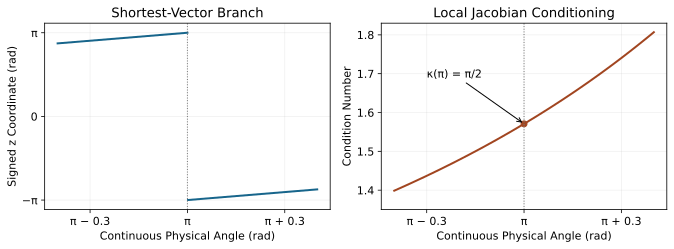

# Exponential Coordinates and Matrix Logarithms
[]{#ch-exponential_coordinates}

A rotation matrix describes orientation. An angular velocity describes its instantaneous change. An exponential coordinate describes a finite displacement through an equivalent constant-axis rotation. These objects are related, but they answer different questions. Confusing them can turn a valid geometric construction into an unsupported account of how a golfer moved the club.

Suppose two cameras reconstruct the clubface at two instants. Their relative rotation determines an endpoint displacement. With a specified duration, we can construct a constant-angular-velocity interpolation joining those orientations. The actual club may have accelerated, changed its rotation axis, or completed extra turns between the samples. Neither the logarithm nor the interpolation identifies that history, the applied torque, or the golfer's intention.

This chapter develops the exponential and logarithm with explicit frames, branches and units. We derive rotation and rigid-motion formulas, explain their numerical limits, and establish exactly when an interpolating path is shortest. The same differential that couples rotation to translation also converts coordinate rates into angular velocity; that connection is central to estimation and control.

## Historical Context and the Mathematical Question
[]{#sec-historical_context_lie}
[]{#laymans-context_box}

Rodrigues' rotation formula appeared in 1840  [@rodrigues1840], before Sophus Lie's later theory of continuous transformation groups. The formula is therefore not a consequence that Rodrigues rediscovered after Lie. Modern robotics texts develop rigid-motion calculations using this group structure; Murray, Li and Sastry and Lynch and Park provide systematic treatments  [@Murray1994; @Lynch2017]. The derivations below are included so that the conventions can be checked without relying on historical priority claims.

Ordinary physical position space is Euclidean in the model used here. It is the constrained set of orientation matrices that has a curved manifold structure. An average of two rotation matrices generally fails orthogonality, but a matrix difference is still meaningful as an ambient residual. For example, if the relative rotation angle is $\theta$, direct expansion of the Frobenius norm gives
[]{#eq-rotation_chordal_cost}

$$
\|R_1-R_0\|_F^2
 =6-2\operatorname{tr}(R_0^TR_1)
 =8\sin^2(\theta/2).
$$
This is a valid chordal error measure, not a rotation matrix or an intrinsic velocity. A choice of residual affects an optimizer's behavior; calling every matrix subtraction meaningless obscures that useful distinction.

## Lie Algebras and the Tangent Space

[]{#the-lie-algebra-mapping-to-lie-groups}
[]{#sec-lie_algebras}


Use column vectors and right-hand rotations. The matrix $R=R_{WB}$ maps body coordinates to world coordinates: $x_W=Rx_B$. The group $SO(3)$ consists of real matrices with $R^TR=I$ and $\det R=1$. Differentiating the first condition shows that $R^T\dot R$ is skew-symmetric. Equivalently, $\dot RR^T$ is skew-symmetric. Define the hat operation by
[]{#eq-exponential_hat}

$$
[a]_\times=
 \begin{bmatrix}0&-a_3&a_2\\a_3&0&-a_1\\-a_2&a_1&0\end{bmatrix},
 \qquad [a]_\times b=a\times b.
$$
The vee operation reverses this map on skew matrices. The Lie algebra $\mathfrak{so}(3)$ is the whole vector space of these matrices, equipped with the commutator $[A,B]=AB-BA$. A particular $[a]_\times$ is an element of the algebra, not the algebra itself. Vector cross products and matrix commutators agree under the hat map.

Every tangent space is a vector space. At $R$ it can be written either as $R\mathfrak{so}(3)$ or as $\mathfrak{so}(3)R$; using multiplication to identify it with the tangent space at the identity produces body or spatial coordinates. Consequently,
[]{#eq-exponential_angular_frames}

$$
\dot R=R[\omega_B]_\times=[\omega_W]_\times R,
 \qquad \omega_W=R\omega_B.
$$
These equalities define the velocity convention. They do not require the angular velocity to be constant or small. The finite-dimensional tangent representation permits calculus, while the frame identification determines which components may be compared or added.

## Exponential Coordinates and Axis-Angle Representation

[]{#exponential-coordinates-and-axis-angle}
[]{#sec-exponential_coordinates}


For a unit direction $u$ and a signed angle $\vartheta$, define the rotation vector
[]{#eq-exp_coord}

$$
\phi=u\vartheta\in\mathbb R^3,\qquad
 \Phi=[\phi]_\times,\qquad \theta=\|\phi\|=|\vartheta|.
$$
Angles are in radians. We reserve $u$ for a unit vector and $\Phi$ for a matrix, avoiding a hat that ambiguously means both normalization and skew conversion. At $\phi=0$ the rotation is the identity and the axis direction is undetermined; the vector itself is well defined.

The matrix exponential is the absolutely convergent series $\exp A=\sum_{k=0}^\infty A^k/k!$. It maps $\mathfrak{so}(3)$ into $SO(3)$. If a constant spatial angular velocity acts for duration $t$, its solution is $R(t)=\exp(t[\omega_W]_\times)R(0)$. A constant body angular velocity instead multiplies $R(0)$ on the right. A general time-varying angular velocity requires ordered integration: exponentiating its vector time integral is not generally exact because increments at different times need not commute.

## Rodrigues' Formula and Its Derivation

[]{#rodrigues-formula}

[]{#the-matrix-exponential}
[]{#sec-rodrigues_formula}


Let $K=[u]_\times$ with $\|u\|=1$. The vector triple-product identity gives $K^2=uu^T-I$. Since $Ku=0$, we obtain $K^3=-K$. Successive powers therefore obey $K^4=-K^2$, $K^5=K$, $K^6=K^2$ and $K^7=-K$. Grouping the absolutely convergent exponential series into odd and even powers gives
[]{#eq-rodrigues}

$$
\begin{aligned}
 e^{\theta K}
 &=I+\left(\theta-\frac{\theta^3}{3!}+\cdots\right)K
   +\left(\frac{\theta^2}{2!}-\frac{\theta^4}{4!}+\cdots\right)K^2\\
 &=I+\sin\theta K+(1-\cos\theta)K^2.
 \end{aligned}
$$
More generally, $K^{2k+1}=(-1)^kK$ for $k\geq0$, and $K^{2k}=(-1)^{k-1}K^2$ for $k\geq1$. The even-power coefficient is $1-\cos\theta$; its sign does not change through rearrangement. For nonzero $\phi$, the equivalent expression is

$$
I+\frac{\sin\theta}{\theta}\Phi+\frac{1-\cos\theta}{\theta^2}\Phi^2,
$$

with continuous limits at zero. Rodrigues' formula is valid for every real angle, not just a principal interval.

There are two useful verification routes. Algebraically, $\Phi^T=-\Phi$ implies $(e^\Phi)^Te^\Phi=e^{-\Phi}e^\Phi=I$, and $\det e^\Phi=e^{\operatorname{tr}\Phi}=1$. Geometrically, decompose a vector into a component parallel to $u$ and a component perpendicular to it. The parallel component is fixed; on the perpendicular plane, $K$ is a quarter turn and the formula is the usual planar rotation. This proves the result has the advertised physical action.

Conversely, a real proper orthogonal matrix in three dimensions has an eigenvector with eigenvalue $1$. On its perpendicular plane it acts as a planar rotation. Applying the preceding construction recovers the entire matrix. Thus every rotation has an exponential representation. Surjectivity does not imply a unique representation.

## The Matrix Logarithm on SO(3)

[]{#the-matrix-logarithm}
[]{#sec-matrix_log_so3}


A rotation logarithm chooses a skew matrix $\Phi$ such that $e^\Phi=R$. For a shortest rotation vector, choose $0\leq\theta\leq\pi$. The trace satisfies
[]{#eq-angle_from_trace}

$$
\cos\theta=\frac{\operatorname{tr}R-1}{2},\qquad
 \theta=\arccos\left(\frac{\operatorname{tr}R-1}{2}\right).
$$
For $0<\theta<\pi$, subtracting the transpose of Rodrigues' formula yields
[]{#eq-axis_from_skew}

$$
u=\frac{(R-R^T)^\vee}{2\sin\theta},\qquad
 \phi=\frac{\theta}{2\sin\theta}(R-R^T)^\vee.
$$
The trace identity remains correct at a half turn, where the trace is $-1$. The axis formula fails there because both numerator and denominator vanish. At exactly $\pi$, $R+I=2uu^T$ determines an axis line. A nonzero column, normalized, supplies one direction; its negative supplies the other. Both $\pi u$ and $-\pi u$ exponentiate to the same rotation.

The open ball $\|\phi\|<\pi$ parametrizes rotations with angle less than $\pi$ uniquely. The closed ball does not: antipodal boundary points must be identified. Identity also has longer logarithms such as $2\pi u$, though its shortest vector is zero. No globally continuous, single-valued shortest rotation logarithm exists. At a half turn, the term “principal rotation vector” denotes a convention for choosing one sign; it must not be confused with the usual analytic principal matrix logarithm, whose domain excludes matrices with eigenvalues on the negative real axis.

An application tracking a smooth motion may continue a local logarithm beyond angle $\pi$. That continuation is different from repeatedly demanding the shortest vector. For an isolated matrix, a deterministic sign rule makes output reproducible; it cannot remove the global discontinuity or reveal unobserved revolutions.

### Numerical Stability and Branch Choice

[]{#numerical-computation-of-logr}
[]{#sec-log_numerical_stability}


Near zero, $\arccos$ of a trace close to one loses relative accuracy. The skew part is more informative. Its series gives
[]{#eq-log_taylor}

$$
\frac{R-R^T}{2}=\Phi+\frac{\Phi^3}{3!}+O(\theta^5),\qquad
 \frac{\theta}{2\sin\theta}=\frac12+\frac{\theta^2}{12}+O(\theta^4).
$$
Thus half the skew part approximates the logarithm with a cubic error. It is not exactly equal at a finite small angle. The nonskew residual $R-I$ contains a second-order symmetric term and is not itself an element of $\mathfrak{so}(3)$.

For a proper rotation, an alternative principal-angle formula is

$$
\operatorname{atan2}\!\left(\frac{\|(R-R^T)^\vee\|}{2},\frac{\operatorname{tr}R-1}{2}\right).
$$ It avoids the direct inverse-cosine endpoint calculation but still leaves axis extraction to be handled near a half turn. A stable implementation can recover a unit quaternion using a well-scaled component and then obtain angle and axis with a half-angle formula. The worked implementation delegates that rotation calculation to SciPy and validates the input first. It does not silently repair an invalid matrix.

Do not snap a near-half-turn angle to $\pi$, or treat a column of $R+I$ as an exact eigenaxis away from $\pi$. For example, applying those shortcuts at an angle $\pi-10^{-5}$ about $(1,2,3)/\sqrt{14}$ can produce a reconstruction error of order $10^{-5}$, even though a stable algorithm resolves the pose to floating-point precision. Test the neighborhood of a branch boundary as well as the boundary itself.

## The Exponential Map on SE(3)
[]{#sec-exp_se3}


A rigid pose is $T_{WB}=\begin{bmatrix}R&p\\0&1\end{bmatrix}$, mapping $x_B$ to $Rx_B+p$. Use an angular-first integrated coordinate $\xi=(\phi,\rho)$, with $\phi$ in radians and $\rho$ in length units. Its matrix is
[]{#eq-exponential_se3_block}

$$
\widehat\xi=\begin{bmatrix}\Phi&\rho\\0&0\end{bmatrix},\qquad
 \exp\widehat\xi=
 \begin{bmatrix}e^\Phi&J_l(\phi)\rho\\0&1\end{bmatrix}.
$$
To derive the translation, solve the constant spatial-twist equations from the identity. With $\xi=t(\omega,v)$, $\dot R=[\omega]_\times R$ and $\dot p=[\omega]_\times p+v$. Variation of constants gives $p(t)=\int_0^t e^{s[\omega]_\times}v\,ds$. After rescaling the integration variable, the coupling matrix is
[]{#eq-v_matrix}

$$
\begin{aligned}
 J_l(\phi)&=\int_0^1 e^{s\Phi}\,ds\\
 &=I+\frac{1-\cos\theta}{\theta^2}\Phi
      +\frac{\theta-\sin\theta}{\theta^3}\Phi^2.
 \end{aligned}
$$
This matrix is often called $V$ in rigid-motion formulas and the left Jacobian in rotation calculus. At zero it is $I$, so pure translation gives $p=t v$, not $v$ for every duration. With a unit angular direction and an angle parameter $\vartheta$, the alternative convention is
[]{#eq-v_matrix_simple}

$$
p=G(\vartheta)v,\qquad
 G(\vartheta)=\vartheta I+(1-\cos\vartheta)K
                       +(\vartheta-\sin\vartheta)K^2.
$$
Here $v$ belongs to a screw generator per unit angle, whereas $\rho$ belongs to an integrated six-vector. Mixing these conventions drops a factor of angle or applies it twice. For a nonunit angular generator, use $\phi=t\omega$ and $\rho=t v$ directly.

For $\omega=(0,0,1)$ rad/s and $v=(1,0,0)$ m/s, after one second the translation is $(\sin1,1-\cos1,0)$ m, approximately $(0.84147098,0.45969769,0)$. The linear component is perpendicular to the angular axis: this is rotation about an offset axis through $(0,1,0)$, with zero pitch. It is not independent straight-line translation superimposed on a rotation at the origin. A point on that offset axis is fixed, which provides a direct physical check of the formula.

## The Matrix Logarithm on SE(3)
[]{#sec-matrix_log_se3}

First choose a rotation vector $\phi$ for $R$, then solve $J_l(\phi)\rho=p$. For the shortest branch, $0\leq\theta\leq\pi$, this solve is nonsingular. A useful analytic inverse is
[]{#eq-exponential_jacobian_inverse}

$$
\begin{aligned}
 J_l(\phi)^{-1}&=I-\tfrac12\Phi+c(\theta)\Phi^2,\\
 c(\theta)&=\frac{1-(\theta/2)\cot(\theta/2)}{\theta^2}
 =\frac1{12}+\frac{\theta^2}{720}+O(\theta^4).
 \end{aligned}
$$
For derivation, substitute $I-\Phi/2+c\Phi^2$ into the product with $J_l$ and reduce powers using $\Phi^3=-\theta^2\Phi$. Equating the coefficients of $\Phi$ and $\Phi^2$ to zero yields the displayed half-angle expression. At $\theta=\pi$ it is finite, with $c=1/\pi^2$. Its Taylor limit is $1/12$, not $1/4$. Numerical code may use a linear solve instead of explicitly forming this inverse.

If $T=e^{\widehat\xi}$, then $T^{-1}=e^{-\widehat\xi}$. It follows that $-\widehat\xi$ is a logarithm of the inverse. The equality $\operatorname{Log}(T^{-1})=-\operatorname{Log}(T)$ for a named single-valued function additionally requires compatible branch choices. Away from the half-turn cut, shortest branches satisfy it. At a pure half turn, $T=T^{-1}$; a deterministic single-valued nonzero logarithm cannot equal its own negative. Translation coordinates also change when a different rotation branch is selected.

## Coordinate Rates, Jacobians, and Conditioning
[]{#sec-exponential_differential}

The same integral $J_l$ arises when differentiating a changing rotation vector. The differential of the matrix exponential satisfies
[]{#eq-exponential_dexp}

$$
D\exp_\Phi[\delta\Phi]e^{-\Phi}
 =\int_0^1 e^{s\Phi}\delta\Phi e^{-s\Phi}\,ds
 =[J_l(\phi)\delta\phi]_\times.
$$
The last equality uses $R[a]_\times R^T=[Ra]_\times$. Therefore, if $R(t)=\exp[\phi(t)]_\times$,
[]{#eq-exponential_coordinate_rates}

$$
\omega_W=J_l(\phi)\dot\phi,\qquad
 \omega_B=J_l(-\phi)\dot\phi.
$$
The right Jacobian is $J_r(\phi)=J_l(-\phi)$. A fixed-axis coordinate trajectory has $\dot\phi$ parallel to $\phi$ and the Jacobian acts as the identity on that direction. In general, differentiating a rotation vector does not directly give physical angular velocity. Inverse Jacobians are required when expressing a measured angular velocity as a coordinate rate.

The conditioning can be derived rather than guessed from the denominator in an axis formula. Along $u$, $J_l$ acts as the identity. On the perpendicular plane it acts as $(\sin\theta/\theta)I+((1-\cos\theta)/\theta)K$. Its two perpendicular singular values are $2|\sin(\theta/2)|/\theta$. On the shortest interval,
[]{#eq-log_condition}

$$
\kappa_2(J_l)=\kappa_2(J_l^{-1})
 =\frac{\theta}{2\sin(\theta/2)},\qquad
 \kappa_2(0)=1,\quad\kappa_2(\pi)=\frac\pi2.
$$
This is a condition number in Euclidean rotation-vector and angular-velocity norms for a chosen local branch. It does not assert that a globally shortest logarithm is continuous at $\pi$. The exponential loses differential rank at nonzero multiples of $2\pi$, while the shortest-branch cut occurs already at $\pi$. A local branch through a half turn can be smooth even though the globally selected vector jumps. Normalizing a tiny vector to estimate its axis is another conditioning problem: axis uncertainty can be large when the rotation vector itself is accurately estimated.

On narrow screens, scroll the figure or [open it at full size](../figures/exponential_branches.svg).

::: {#fig-exponential_map}
::: {.aba-diagram-scroll role="region" aria-label="Logarithm branches and Jacobian condition number; scroll horizontally" tabindex="0"}

:::

A Half-Turn Branch Cut Is Different From a Differential Singularity. A Smooth Rotation About a Fixed Axis Crosses the Shortest-Vector Cut, While the Chosen Local Jacobian Remains Nonsingular.
:::

## The Baker–Campbell–Hausdorff Formula

[]{#non-commutativity-and-the-bch-formula}
[]{#sec-bch}


Successive rotations compose by matrix multiplication. For fixed matrices $A,B$ and sufficiently small $\epsilon$, expanding the product and its local logarithm yields
[]{#eq-exponential_bch_second}

$$
\operatorname{Log}(e^{\epsilon A}e^{\epsilon B})
 =\epsilon(A+B)+\tfrac12\epsilon^2[A,B]+O(\epsilon^3).
$$
The commutator is a second-degree correction in the small amplitudes. If $A=[a]_\times$ and $B=[b]_\times$, it is $[a\times b]_\times$. Thus ordered infinitesimal rotations differ in a direction perpendicular to their axes at leading order. This statement concerns orientation composition, not a new force or an independently generated energy source.

### Higher-Order Terms and Their Domain
[]{#sec-bch_higher_order}


Keeping total degree three gives
[]{#eq-bch_third_order}

$$
\begin{aligned}
 \operatorname{Log}(e^{\epsilon A}e^{\epsilon B})
 &=\epsilon(A+B)+\frac{\epsilon^2}{2}[A,B]\\
 &\quad+\frac{\epsilon^3}{12}
   \bigl([A,[A,B]]+[B,[B,A]]\bigr)+O(\epsilon^4).
 \end{aligned}
$$
The remainder refers to total degree under simultaneous scaling, not to a count of four nested brackets. The local logarithm exists analytically near the identity, which justifies this finite-order expansion for sufficiently small amplitudes. Merely requiring each individual rotation angle to be below $\pi$ is not a justification for arbitrary truncation or global convergence of a chosen BCH series.

Commuting generators satisfy $e^{A+B}=e^Ae^B$ exactly. Noncommuting generators generally do not, although periodicity can produce accidental finite-angle equalities; a global “if and only if” statement needs extra hypotheses. For large rotations, compute the ordered product and choose its logarithm branch explicitly.

As a finite-angle check, let $X$ and $Y$ be positive $90$-degree rotations about the world $x$ and $y$ axes. Applying $x$ then $y$ gives $YX$; reversing the order gives $XY$. Their spatial relative rotation is $(YX)(XY)^T$. Its shortest angle is $120$ degrees, with vector $\frac{2\pi}{3\sqrt3}(-1,1,-1)$, not a $90$-degree rotation about $z$. This example also shows why the small-angle commutator must not be extrapolated quantitatively to quarter turns.

## Numerical Computation of Matrix Exponentials
[]{#sec-numerical_exp}

Use `scipy.linalg.expm` for a matrix exponential. NumPy's elementwise exponential computes a different operation. For a general matrix, scaling and squaring reduces its norm, evaluates a suitable rational approximation, then repeatedly squares the result. As a simple illustration, the Padé approximant of order $[2/2]$ is
[]{#eq-exponential_pade}

$$
e^A\approx
 (I-A/2+A^2/12)^{-1}(I+A/2+A^2/12).
$$
Implement the displayed inverse action by solving a linear system. This small fixed-order example is not the full adaptive algorithm used by SciPy, and it has no unconditional accuracy guarantee for arbitrary $A$. Matrix size, norm, conditioning and tolerance determine a sensible method; no universal speed ranking follows from counting formula terms.

For $SO(3)$ and $SE(3)$, structure-specific formulas are compact. Near zero, evaluate the coefficients of $J_l$ using series: $1/2-\theta^2/24+\theta^4/720$ and $1/6-\theta^2/120+\theta^4/5040$. Away from zero, writing $1-\cos\theta=2\sin^2(\theta/2)$ reduces cancellation. In array code, $\Phi^2$ means `Phi @ Phi`, not `Phi ** 2`, which squares entries independently. An apparently plausible rotation block cannot validate an incorrect translation block.

## Geodesics on SO(3): Metric and Shortest Paths
[]{#sec-geodesics}

[]{#sec-geodesic_riemannian_proof}


“Shortest” requires a metric. We use the rotation-angle metric, assigning tangent vectors at $R$ the inner product
[]{#eq-bi_invariant_metric}

$$
\langle R[a]_\times,R[b]_\times\rangle_R
 =a^Tb=\tfrac12\operatorname{tr}([a]_\times^T[b]_\times).
$$
Both left and right multiplication preserve it because rotations preserve dot products. A curve's length is $L=\int\|\omega_B\|dt=\int\|\omega_W\|dt$. The factor $1/2$ makes the matrix-induced speed equal to angular speed, rather than $\sqrt2$ times that speed.

For this bi-invariant metric the geodesic equation, with an affine time parameter, is
[]{#eq-geodesic_condition}

$$
\dot\omega_B=0,\qquad
 R(t)=R_0\exp(t[a]_\times).
$$
One way to derive it is to vary the energy $\frac12\int\|\omega_B\|^2dt$. A variation $\delta R=R[\eta]_\times$ gives $\delta\omega_B=\dot\eta+\omega_B\times\eta$. The cross-product term has zero dot product with $\omega_B$; integration by parts with fixed endpoints leaves $\dot\omega_B=0$. This proves stationarity, not yet global minimality. A geodesic continued through extra revolutions remains a geodesic but is not a shortest connection.

To prove minimality for a shortest branch, lift a rotation curve to the unit-quaternion sphere. Its lifted speed is half its angular speed. The lifts of an endpoint are $q_1$ and $-q_1$; choosing the nearer one gives a spherical separation $\alpha=\arccos|q_0^Tq_1|$. Any spherical curve joining the lifts has length at least that great-circle separation, so the rotation length is at least $2\alpha$. The constant-axis curve
[]{#eq-geodesic_subgroup}

$$
R(s)=R_0\exp(s[\phi_B]_\times),\qquad
 \phi_B=\operatorname{Log}(R_0^TR_1)^\vee,\quad 0\leq s\leq1,
$$
attains the bound. Therefore
[]{#eq-geodesic_distance}

$$
d(R_0,R_1)=\|\phi_B\|
 =\arccos\left(\frac{\operatorname{tr}(R_0^TR_1)-1}{2}\right)
 =2\arccos|q_0^Tq_1|.
$$
Below angle $\pi$ the minimizing geodesic is unique. At $\pi$ there are two equal-length axis-sign choices. The exponential is not a local isometry throughout a neighborhood: the perpendicular singular values of its differential, derived above, are generally less than one. Its differential at zero is the identity, which is a weaker statement and not a proof of global minimality.

## SLERP and Its Physical Limits

[]{#the-quaternion-connection}
[]{#sec-slerp}


For unit quaternions, first choose the sign of $q_1$ so that $q_0^Tq_1\geq0$, and set $\alpha=\arccos(q_0^Tq_1)$. Spherical linear interpolation is
[]{#eq-exponential_slerp}

$$
q(s)=\frac{\sin((1-s)\alpha)}{\sin\alpha}q_0
      +\frac{\sin(s\alpha)}{\sin\alpha}q_1.
$$
Use its continuous limit when $\alpha$ is small. The physical rotation angle is $2\alpha$, not $\alpha$. Quaternions $q$ and $-q$ represent the same orientation, so sign management is necessary despite the absence of an Euler-angle chart singularity in the unit-quaternion representation. SLERP is a continuous exact interpolation formula; sampling it at a few times does not turn the mathematical path itself into an approximation.

The matrix curve above is the same path. With $\phi_W=R_0\phi_B$, it can also be written $R(s)=\exp(s[\phi_W]_\times)R_0$. Left and right descriptions do not create different interpolations when the coordinates are transformed consistently. If the duration is $\tau$, then $s=t/\tau$ gives constant body angular velocity $\phi_B/\tau$ and constant spatial angular velocity $\phi_W/\tau$. Other time laws change the speed without changing the geometric path. Piecewise SLERP can have angular-velocity jumps at its knots and therefore is not automatically suitable for a torque-limited mechanism.

Euler-angle interpolation can be useful in a suitable chart, but generally follows a different path and depends on the convention. It is not inherently chaotic. Likewise, a screw interpolation in $SE(3)$ is not universally shortest without a declared metric and a length scale relating translation to rotation. The rigid-motion group has no positive-definite bi-invariant Riemannian metric: under translation, its adjoint can add an arbitrarily large linear component to a nonzero angular twist, contradicting invariance of a positive norm.

Even in pure rotation, the rotation-angle metric differs from a body's kinetic-energy metric when its inertia is anisotropic. Torque-free body motion obeys
[]{#eq-exponential_free_rotation}

$$
I_B\dot\omega_B+\omega_B\times(I_B\omega_B)=0.
$$
Constant angular velocity is torque-free only when the cross product vanishes, as along a principal axis. A geometrically shortest orientation path need not minimize actuator effort, metabolic expenditure, tracking error or execution time.

## Python Worked Example: Checked Exponentials and Logarithms
[]{#sec-python_exp_log}

The shared implementation in `src/tools/exponential_coordinates_examples.py` uses integrated angular-first coordinates. It validates the homogeneous transform with the same routine used by the screw-axis chapter, obtains a rotation vector through SciPy, and solves for translation coordinates. It accepts exact proper matrices within a stated numerical tolerance; projection or statistical estimation of noisy observations is a separate modeling step.

Run this example from the repository root with NumPy and SciPy installed. The generic matrix exponential supplies an independent check of the structured rigid-motion formula. Comparing two copies of the same formula would not catch a shared sign error.

```python
import numpy as np
from scipy.linalg import expm
from src.affine_control.dynamics import skew
from src.tools.exponential_coordinates_examples import (
    se3_exp, se3_log,
)

coordinates = np.array([0., 0., 1., 1., 0., 0.])
generator = np.zeros((4, 4))
generator[:3, :3] = skew(coordinates[:3])
generator[:3, 3] = coordinates[3:]
pose = se3_exp(coordinates)
np.testing.assert_allclose(pose, expm(generator), atol=1e-14)
np.testing.assert_allclose(
    se3_log(pose), coordinates, atol=1e-14,
)
print("Translation:", pose[:3, 3])
print("Recovered coordinates:", se3_log(pose))
```

The translation output is approximately $(0.84147098,0.45969769,0)$ and the recovered coordinates are $(0,0,1,1,0,0)$. Tests also cover zero and tiny rotation, generic axes, nonunit generators, negative durations, near-half-turn and exact-half-turn inputs, and rejection of nonrigid matrices. Pose reconstruction remains the appropriate branch-independent assertion; demanding the original coordinate vector after a full turn would be mathematically incorrect.

## Reading a Golf Swing Through These Coordinates
[]{#sec-exponential_golf}

The connection to golf is more than a convenient orientation display. A point fixed in a rigid club has world position $x=p+Rr$, where $r$ is its body-frame offset. A small spatial rotation error $\delta\phi_W$ and translation error $\delta p$ produce
[]{#eq-exponential_delivery_sensitivity}

$$
\delta x\approx\delta p-[Rr]_\times\delta\phi_W,\qquad
 \delta n\approx-[n]_\times\delta\phi_W,
$$
where $n$ is a world-frame face normal. The lever arm couples orientation error to contact-point error. Rotation about $n$ does not change the normal to first order, although it may change other club geometry. A face-angle scalar therefore describes only part of the delivered pose. These expressions assume a rigid club; shaft deformation requires additional coordinates and their own sensitivity terms.

Measured orientation uncertainty also depends on representation. For a small covariance $\Sigma_\phi$ in exponential coordinates around a nominal vector, the corresponding spatial tangent covariance is approximately $J_l\Sigma_\phi J_l^T$. Reexpressing a body tangent covariance in world components uses $R\Sigma_B R^T$. These are different transformations. Near a shortest-branch cut, a single ordinary Gaussian in principal coordinates may be misleading even when the physical orientation distribution is concentrated. Estimating angular velocity by differencing noisy coordinates adds both sampling sensitivity and the Jacobian conversion.

The delivery event supplies another coupling. If the impact time shifts by $\delta t$, a first-order comparison of a smooth pre-impact observable contains its fixed-time state variation plus $\dot y\,\delta t$. Geometry, speed and event timing must therefore be compared under the same event definition. This linearization assumes a smooth pre-impact trajectory and a transverse event crossing; grazing contact needs separate analysis. A smooth interpolation between measured orientations cannot establish which hand supplied energy, whether muscle co-contraction increased impedance, or whether an alternative torque history would improve impact. Those questions require dynamics, force or activation assumptions, and a counterfactual with stated constraints.

For a two-hand grip, individually chosen orientation interpolations may violate the common club constraint. For a full-body model, foot contacts and joint limits further restrict feasible motion. Exponential coordinates help represent and differentiate those constraints; they do not eliminate them. This is how the geometry chapter connects to recursive dynamics and affine control: coordinates describe the state, Jacobians describe local change, dynamics determine required loads, and bounded control determines which changes can actually be realized.

## Summary
[]{#sec-exp_summary}

The exponential converts an integrated generator to a finite displacement. A logarithm chooses one generator among branches; it cannot recover motion history from endpoints alone. Rodrigues' formula follows from the skew-matrix power cycle, and integrating it yields the translation Jacobian. Differentiating it yields the same Jacobian as the conversion between coordinate rates and angular velocity. Half-turn branch ambiguity, small-axis uncertainty and full-turn differential singularity are distinct issues. SLERP supplies a shortest path for a specified rotation metric, while mechanical feasibility and physical optimality require additional models.

## Further Reading
[]{#sec-further_reading_ch6}

Lynch and Park and Murray, Li and Sastry develop the rigid-motion conventions used here  [@Lynch2017; @Murray1994]. The Modern Robotics rotation and rigid-motion exponential demonstrations provide accessible derivations  [@ModernRoboticsRotationExpReview; @ModernRoboticsRigidExpReview]. Solà, Deray and Atchuthan collect left/right Jacobians and $SE(3)$ formulas; their six-vector convention is translation-first, so block order must be changed when comparing to this chapter  [@SolaMicroLieReview]. SciPy documents the numerical behavior of `expm`, `Rotation.from_matrix` and `Slerp`  [@SciPyExpmReview; @SciPyRotationMatrixReview; @SciPySlerpReview]. These mathematical and software references do not independently establish empirical claims about golf technique.

## Exercises
[]{#sec-exercises_ch6}


1. **Rodrigues' Formula Verification:** Compute a positive $45$-degree rotation about $(1,1,1)/\sqrt3$. Check orthogonality, determinant and the fixed axis. State the frame in which the axis is expressed.

1. **A Quarter-Turn Logarithm:** For $R=\begin{bmatrix}0&-1&0\\1&0&0\\0&0&1\end{bmatrix}$, find a shortest rotation vector and its skew matrix. Give one longer logarithm with the same exponential.

1. **Trace and the Half Turn:** Derive $\operatorname{tr}R=1+2\cos\theta$. Explain why it remains valid at $\pi$, why the skew-based axis formula fails there, and how $R+I$ recovers an axis line at exactly $\pi$.

1. **Skew Powers:** Prove $K^2=uu^T-I$ and $K^3=-K$ for a unit vector $u$. List $K^4$ through $K^7$ and recover the signs in Rodrigues' series.

1. **A Finite First-Order Step:** Expand $e^{\theta K}-(I+\theta K)$ through degree two. Show that $I+\theta K$ is not exactly orthogonal when $\theta\ne0$.

1. **Rigid-Motion Exponential:** Compute $\exp\widehat\xi$ for the integrated coordinate $\xi=(0,0,1,1,0,0)$, using radians and metres. Identify an offset rotation axis and verify that a point on it is fixed.

1. **Pure Translation and Duration:** For constant twist $(\omega,v)=(0,0,0,1,0,0)$ in radians/s and m/s, find $T(t)$ from the identity. Explain the difference between $J_l(0)=I$ and the factor $t$ in its translation.

1. **Inverse and Branches:** Prove that $-\widehat\xi$ is a logarithm of $(e^{\widehat\xi})^{-1}$. State when shortest branches give $\operatorname{Log}(T^{-1})=-\operatorname{Log}(T)$ and construct the pure-half-turn counterexample to an unconditional single-valued identity.

1. **Second-Degree BCH:** With $A=[a]_\times$, $B=[b]_\times$, derive the coefficient of $\epsilon^2$ in $\operatorname{Log}(e^{\epsilon A}e^{\epsilon B})$. Explain how reversing order changes it and why this does not quantify a pair of $90$-degree rotations accurately.

1. **SLERP Velocity:** Differentiate $R(t)=R_0\exp((t/\tau)[\phi_B]_\times)$. Calculate $R^T\dot R$ and $\dot RR^T$. Explain why differentiating a general rotation vector instead requires a Jacobian.

1. **Metric Normalization:** Compute the rotation-angle distance from identity to a $120$-degree rotation about $(1,1,1)/\sqrt3$. What length would an unnormalized Frobenius tangent norm assign to the same path?

1. **Small-Angle Error:** At $\theta=0.001$ rad about $z$, compute the Frobenius error of $I+\theta K$ relative to Rodrigues' matrix. Compare it with the leading term $\theta^2/\sqrt2$.

1. **A Generic Matrix Exponential:** Let the $4\times4$ generator $A$ have $A_{12}=-1$, $A_{21}=1$ and all other entries zero. Evaluate `scipy.linalg.expm`$(tA)$ at $t=\pi/4$ and verify its rotation block. Do not apply a second hat operation to $A$.

1. **Interpolation Fractions:** Choose two proper rotations and interpolate at $s=0.3$ and $0.7$ on one shortest geodesic. Verify $d(R_0,R(s))=s\,d(R_0,R_1)$. Describe the additional choice needed if their relative angle is $\pi$.

1. **An Offset-Axis Trajectory:** For constant twist $(1,0,0,0,1,0)$ in radians/s and m/s, compute $T(t)$ at $0$, $\pi/4$ and $\pi/2$ seconds. Show that $p(t)=(0,\sin t,1-\cos t)$ m and identify the zero-pitch rotation axis.
