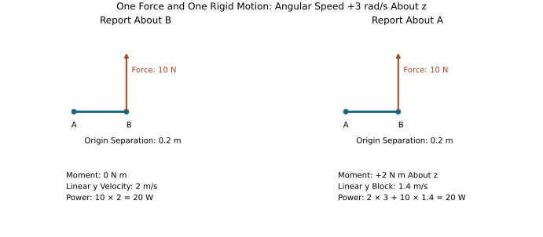
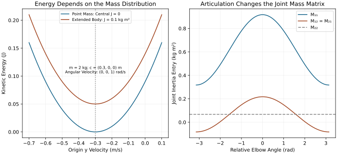

# Spatial Vector Algebra and Inertia
[]{#ch-spatial_algebra}

## The Physical Question and the Coordinate Contract
[]{#laymans-context_box}

A golfer's hand both translates and rotates. A force at the grip can change linear momentum and angular momentum about a shoulder, while a couple changes angular momentum without adding a resultant force. These are connected effects of one mechanical interaction. Spatial algebra packages them so that changing the reporting frame does not change predicted power, kinetic energy or motion. The packaging does not remove the need to specify the body, the reference point, the coordinate axes, the loads and the approximation being made.

Throughout this chapter, motion is angular-first, [$\mathcal V=(\boldsymbol\omega,\mathbf v)^T$]{.long-inline-math role="group" aria-label="Inline calculation 1; scroll horizontally" tabindex="0"}, and force is moment-first, [$\mathcal F=(\mathbf n,\mathbf f)^T$]{.long-inline-math role="group" aria-label="Inline calculation 2; scroll horizontally" tabindex="0"}. The blocks have different units: angular velocity in rad/s, linear velocity in m/s, moment in N m and force in N. Their six-dimensional Euclidean lengths are therefore not intrinsic physical magnitudes. A norm or condition number that mixes these blocks needs an explicit length scale and a stated purpose.

Write [$[\mathbf a]\mathbf b=\mathbf a\times\mathbf b$]{.long-inline-math role="group" aria-label="Inline calculation 3; scroll horizontally" tabindex="0"}. A pose [$T_{AB}=(R_{AB},\mathbf p_{AB})$]{.long-inline-math role="group" aria-label="Inline calculation 4; scroll horizontally" tabindex="0"} maps point coordinates in B into A: [$\mathbf r_A=R_{AB}\mathbf r_B+\mathbf p_{AB}$]{.long-inline-math role="group" aria-label="Inline calculation 5; scroll horizontally" tabindex="0"}. Here $\mathbf p_{AB}$ locates B's origin in A. Both rotation and offset are part of the convention. We will use two motion maps: [$A=\operatorname{Ad}_{T_{AB}}$]{.long-inline-math role="group" aria-label="Inline calculation 6; scroll horizontally" tabindex="0"} maps B to A, whereas $X_i$ in a tree maps parent coordinates to child coordinates. Naming the direction prevents an inverse or transpose from becoming an apparently harmless implementation choice.

## Historical Context and the Role of the Representation

[]{#featherstones-spatial-algebra}
[]{#sec-history_spatial_algebra}

Line coordinates, screw theory and recursive dynamics provide complementary viewpoints. Plücker coordinates describe a line independently of a chosen point on it; screw theory adds coupled translation and rotation; spatial-vector methods organize the resulting mechanics into small, structured operations. Featherstone's textbook develops these operations and recursive algorithms; the accompanying software makes transform conventions inspectable. This chapter derives the identities and verifies them independently rather than treating a software name as evidence of a physical model's accuracy. See the selected references at the end.

The benefit is disciplined composition. A six-vector can carry a body's motion or its net loading, but a whole articulated system still needs joint kinematics, external loads and equations of motion. The golf swing is three-dimensional; a planar mechanism is an explicit teaching approximation. Matching a simulated club path does not independently validate tissue parameters, grip reactions or internal joint loading.

## Plücker Coordinates and Screw Axes
[]{#sec-plucker}
[]{#def-plucker_def}

For a finite line, choose a nonzero direction $\mathbf d$ and any point $\mathbf r$ on the line. Its homogeneous coordinates are [$(\mathbf d,\mathbf m)$]{.long-inline-math role="group" aria-label="Inline calculation 7; scroll horizontally" tabindex="0"} with [$\mathbf m=\mathbf r\times\mathbf d$]{.long-inline-math role="group" aria-label="Inline calculation 8; scroll horizontally" tabindex="0"}. Replacing $\mathbf r$ by [$\mathbf r+s\mathbf d$]{.long-inline-math role="group" aria-label="Inline calculation 9; scroll horizontally" tabindex="0"} leaves $\mathbf m$ unchanged, and

$$
\mathbf d^T\mathbf m=0,\qquad
(\mathbf d,\mathbf m)\sim(\lambda\mathbf d,\lambda\mathbf m),\quad\lambda\ne0.
$$

Thus equal geometric lines need proportional coordinates, not identical six numerical entries. Unit normalization removes the scale magnitude; simultaneous sign reversal still represents the same unoriented line. An oriented unit line retains the direction sign. These are finite Euclidean lines within the projective representation, not every point of projective five-space.

A general twist is not a zero-pitch line coordinate. If [$\boldsymbol\omega\ne0$]{.long-inline-math role="group" aria-label="Inline calculation 10; scroll horizontally" tabindex="0"}, define

$$
h=\frac{\boldsymbol\omega^T\mathbf v}{\|\boldsymbol\omega\|^2},\qquad
\mathbf r_\perp=\frac{\boldsymbol\omega\times\mathbf v}{\|\boldsymbol\omega\|^2},\qquad
\mathbf v=\mathbf r_\perp\times\boldsymbol\omega+h\boldsymbol\omega.
$$

The screw axis passes through $\mathbf r_\perp$ parallel to $\boldsymbol\omega$, and points on it have velocity $h\boldsymbol\omega$. Pitch $h$ has length per radian. The corresponding line coordinates use the perpendicular part [$\mathbf v-h\boldsymbol\omega$]{.long-inline-math role="group" aria-label="Inline calculation 11; scroll horizontally" tabindex="0"}. Only zero pitch gives [$\boldsymbol\omega^T\mathbf v=0$]{.long-inline-math role="group" aria-label="Inline calculation 12; scroll horizontally" tabindex="0"}. Pure translation has [$\boldsymbol\omega=0$]{.long-inline-math role="group" aria-label="Inline calculation 13; scroll horizontally" tabindex="0"} and no unique finite rotation axis; the zero twist determines no axis.

For a wrench with $\mathbf f\ne0$, [$\mathbf r_\perp=\mathbf f\times\mathbf n/\|\mathbf f\|^2$]{.long-inline-math role="group" aria-label="Inline calculation 14; scroll horizontally" tabindex="0"} locates its central axis. The residual moment there is $h_F\mathbf f$, where [$h_F=\mathbf f^T\mathbf n/\|\mathbf f\|^2$]{.long-inline-math role="group" aria-label="Inline calculation 15; scroll horizontally" tabindex="0"}. A single applied force has zero residual couple and satisfies [$\mathbf f^T\mathbf n=0$]{.long-inline-math role="group" aria-label="Inline calculation 16; scroll horizontally" tabindex="0"}. A general wrench need not. A pure couple has $\mathbf f=0$ and can be reported about any origin without changing its moment. Motion and force occupy dual vector spaces; neither the units nor their coordinate-transformation rules are interchangeable.

## Twists, Wrenches and Invariant Power
[]{#sec-spatial_vectors}
[]{#def-twist_def}
[]{#def-wrench_def}

In one coordinate frame, a rigid velocity field is [$\mathbf v(\mathbf r)=\mathbf v+\boldsymbol\omega\times\mathbf r$]{.long-inline-math role="group" aria-label="Inline calculation 17; scroll horizontally" tabindex="0"}. If the reporting origin is attached to the body, $\mathbf v$ is that body's origin velocity relative to the inertial observer, expressed in the reporting axes. If the origin is elsewhere, it is the value of the body's extended rigid velocity field at that location. It is not necessarily the velocity of the coordinate frame itself. In a fixed world frame with body-origin position $\mathbf p$, the spatial-twist linear block is [$\dot{\mathbf p}-\boldsymbol\omega\times\mathbf p$]{.long-inline-math role="group" aria-label="Inline calculation 18; scroll horizontally" tabindex="0"}, not simply $\dot{\mathbf p}$.

For forces $\mathbf f_k$ applied at offsets $\mathbf r_k$ and free couples $\boldsymbol\tau_k$, define [$\mathbf f=\sum_k\mathbf f_k$]{.long-inline-math role="group" aria-label="Inline calculation 19; scroll horizontally" tabindex="0"} and [$\mathbf n=\sum_k(\mathbf r_k\times\mathbf f_k+\boldsymbol\tau_k)$]{.long-inline-math role="group" aria-label="Inline calculation 20; scroll horizontally" tabindex="0"}. The moment block already includes the force moment. Adding [$\mathbf r\times\mathbf f$]{.long-inline-math role="group" aria-label="Inline calculation 21; scroll horizontally" tabindex="0"} to it a second time double-counts that contribution. Summing the powers of the applied loads gives

$$
P=\sum_k\left[\mathbf f_k^T(\mathbf v+\boldsymbol\omega\times\mathbf r_k)+\boldsymbol\tau_k^T\boldsymbol\omega\right]
=\mathcal F^T\mathcal V.
$$

This is the actual power when the forces act on the specified rigid velocity field. A deformable contact patch or sliding interface can require separate local velocities.

Using the declared pose direction,

$$
A=\operatorname{Ad}_{T_{AB}}=
\begin{bmatrix}R&0\\{}[\mathbf p]R&R\end{bmatrix},\qquad
\mathcal V_A=A\mathcal V_B,\qquad
\mathcal F_A=A^{-T}\mathcal F_B.
$$

The last equation follows from requiring [$\mathcal F_A^T\mathcal V_A=\mathcal F_B^T\mathcal V_B$]{.long-inline-math role="group" aria-label="Inline calculation 22; scroll horizontally" tabindex="0"} for every motion. It gives [$\mathbf f_A=R\mathbf f_B$]{.long-inline-math role="group" aria-label="Inline calculation 23; scroll horizontally" tabindex="0"} and [$\mathbf n_A=R\mathbf n_B+\mathbf p\times R\mathbf f_B$]{.long-inline-math role="group" aria-label="Inline calculation 24; scroll horizontally" tabindex="0"}. A force sensor reading cannot be compared with a shoulder moment until both the axes and the moment reference point are reconciled.

On narrow screens, scroll the figure or [open it at full size](../figures/spatial_wrench_power.svg).

::: {#fig-spatial_wrench}
::: {.synthesis-diagram-scroll role="region" aria-label="spatial wrench power; scroll horizontally" tabindex="0"}

:::

Changing the Reporting Origin Changes the Moment and the Twist’s Linear Block. Both Pairings Give the Same 20 W for This Rigid Motion.
:::

## The Two Spatial Cross Products

[]{#the-spatial-cross-product}
[]{#sec-spatial_cross}
[]{#def-motion_cross_def}

For two motion vectors [$\mathcal V=(\boldsymbol\omega,\mathbf v)$]{.long-inline-math role="group" aria-label="Inline calculation 25; scroll horizontally" tabindex="0"} and [$\mathcal W=(\boldsymbol\eta,\mathbf w)$]{.long-inline-math role="group" aria-label="Inline calculation 26; scroll horizontally" tabindex="0"}, their Lie bracket is represented by
[]{#eq-motion_cross_matrix}

$$
[\mathcal V\times]=\operatorname{ad}_{\mathcal V}
=\begin{bmatrix}[\boldsymbol\omega]&0\\{}[\mathbf v]&[\boldsymbol\omega]\end{bmatrix}.
$$

Its action is
[]{#eq-motion_cross_action}

$$
[\mathcal V\times]\mathcal W=
\begin{bmatrix}\boldsymbol\omega\times\boldsymbol\eta\\
\mathbf v\times\boldsymbol\eta+\boldsymbol\omega\times\mathbf w\end{bmatrix}.
$$

The motion operator is not generally a skew-symmetric matrix under the ordinary six-dimensional dot product. It is also not an operation that takes the position of a point as its six-vector argument. In particular, [$[\mathcal V\times]\mathcal V=0$]{.long-inline-math role="group" aria-label="Inline calculation 27; scroll horizontally" tabindex="0"} by antisymmetry, but a body with constant angular speed can have substantial centripetal acceleration.

[]{#def-force_cross_def}
The associated force operator is defined by negative transpose:
[]{#eq-force_cross_matrix}

$$
[\mathcal V\times^*]=-[\mathcal V\times]^T
=\begin{bmatrix}[\boldsymbol\omega]&[\mathbf v]\\0&[\boldsymbol\omega]\end{bmatrix}.
$$

For [$\mathcal G=(\mathbf n,\mathbf f)$]{.long-inline-math role="group" aria-label="Inline calculation 28; scroll horizontally" tabindex="0"},
[]{#eq-force_cross_action}

$$
[\mathcal V\times^*]\mathcal G=
\begin{bmatrix}\boldsymbol\omega\times\mathbf n+\mathbf v\times\mathbf f\\
\boldsymbol\omega\times\mathbf f\end{bmatrix}.
$$

[]{#princ-duality_principle}
Consequently the differential duality identity has a minus sign:

$$
\mathcal G^T[\mathcal V\times]\mathcal W
=-([\mathcal V\times^*]\mathcal G)^T\mathcal W.
$$

The two contributions cancel when differentiating an invariant pairing. This is consistent with finite transforms preserving power; it does not mean the two individual terms are equal. For [$\mathcal V=(0,0,1,1,0,0)$]{.long-inline-math role="group" aria-label="Inline calculation 29; scroll horizontally" tabindex="0"}, [$\mathcal G=(0.1,0.2,0.3,1,2,3)$]{.long-inline-math role="group" aria-label="Inline calculation 30; scroll horizontally" tabindex="0"} and [$\mathcal W=(0.5,0.5,0.5,0.1,0.1,0.1)$]{.long-inline-math role="group" aria-label="Inline calculation 31; scroll horizontally" tabindex="0"}, the two unnegated expressions evaluate to $0.65$ and $-0.65$ in compatible units.

[]{#princ-ad_vs_Ad}
Uppercase [$\operatorname{Ad}_T$]{.long-inline-math role="group" aria-label="Inline calculation 32; scroll horizontally" tabindex="0"} depends on a pose and re-expresses a vector. Lowercase [$\operatorname{ad}_{\mathcal V}$]{.long-inline-math role="group" aria-label="Inline calculation 33; scroll horizontally" tabindex="0"} depends on a motion and generates its bracket action. In a recursive algorithm, one transports quantities between frames and the other supplies velocity-dependent terms. Their matrices have related structure but different inputs, units and uses.

## Spatial Inertia From Kinetic Energy

[]{#the-spatial-inertia-matrix}
[]{#sec-spatial_inertia}
[]{#sec-kinetic_energy_spatial_inertia}
[]{#def-spatial_inertia_matrix_def}

Let $m>0$, let $\mathbf c$ point from the reporting origin O to the body's center of mass C, and let $I_C$ be the rotational inertia about C expressed in the same axes. With [$\mathbf v_C=\mathbf v_O+\boldsymbol\omega\times\mathbf c=\mathbf v_O-[\mathbf c]\boldsymbol\omega$]{.long-inline-math role="group" aria-label="Inline calculation 34; scroll horizontally" tabindex="0"},
[]{#thm-ke_spatial_quadratic}

$$
2K=\boldsymbol\omega^T I_C\boldsymbol\omega
+m\|\mathbf v_O-[\mathbf c]\boldsymbol\omega\|^2
=\mathcal V^T\mathcal I_O\mathcal V.
$$

Expansion fixes the signs of all blocks:
[]{#eq-spatial_inertia_full}

$$
\mathcal I_O=
\begin{bmatrix}I_C-m[\mathbf c][\mathbf c]&m[\mathbf c]\\
-m[\mathbf c]&mI_3\end{bmatrix}.
$$

The correct skew-square identity is [$[\mathbf c]^2=\mathbf c\mathbf c^T-\|\mathbf c\|^2I_3$]{.long-inline-math role="group" aria-label="Inline calculation 35; scroll horizontally" tabindex="0"}. Equivalently,
[]{#eq-spatial_inertia_alt}

$$
\mathcal I_O=
\begin{bmatrix}I_C+m(\|\mathbf c\|^2I_3-\mathbf c\mathbf c^T)&m[\mathbf c]\\
m[\mathbf c]^T&mI_3\end{bmatrix}.
$$

At the center of mass,
[]{#eq-spatial_inertia_cocom}

$$
\mathcal I_C=\operatorname{diag}(I_C,mI_3).
$$

The rotational block has units kg m$^2$, the coupling blocks kg m and the translational block kg. Multiplying by a twist produces angular and linear momentum, not a wrench; multiplying by a compatible spatial acceleration gives the inertial part of the wrench. Velocity-dependent terms still matter.

### Positive Definiteness and Physical Realizability
[]{#thm-spatial_inertia_spd}

For a physical mass distribution, $I_C$ is symmetric positive semidefinite. The energy identity proves that $\mathcal I_O$ is symmetric positive semidefinite and, for $m>0$, positive definite exactly when $I_C$ is positive definite. To prove the converse, take a nonzero $\boldsymbol\omega$ in the nullspace of $I_C$ and set [$\mathbf v_O=[\mathbf c]\boldsymbol\omega$]{.long-inline-math role="group" aria-label="Inline calculation 36; scroll horizontally" tabindex="0"}. Both energy terms then vanish. To prove strict positivity when $I_C>0$, separate [$\boldsymbol\omega\ne0$]{.long-inline-math role="group" aria-label="Inline calculation 37; scroll horizontally" tabindex="0"} from [$\boldsymbol\omega=0,\mathbf v_O\ne0$]{.long-inline-math role="group" aria-label="Inline calculation 38; scroll horizontally" tabindex="0"}.

A point mass has $I_C=0$ and spatial inertia of rank three. All twists [$\mathcal V=(\boldsymbol\omega,[\mathbf c]\boldsymbol\omega)$]{.long-inline-math role="group" aria-label="Inline calculation 39; scroll horizontally" tabindex="0"} leave its point stationary and cost zero kinetic energy. A straight, ideal line mass has a zero rotational moment about its own line and typically spatial rank five. Neither is an invalid idealization merely because its six-dimensional inertia is singular. A numerical solver that requires positive-definite body inertias has a narrower model contract.

Positive definiteness alone also does not establish physical realizability. The principal rotational moments must satisfy the triangle inequalities $J_1\le J_2+J_3$ and their cyclic versions. For example, [$J_2+J_3-J_1=2\int x_1^2\,dm\ge0$]{.long-inline-math role="group" aria-label="Inline calculation 40; scroll horizontally" tabindex="0"}. A diagonal tensor with moments $(1,1,3)$ is positive definite but violates this condition. Equivalently the central second-moment matrix [$\Sigma=\tfrac12\operatorname{tr}(I_C)I_3-I_C$]{.long-inline-math role="group" aria-label="Inline calculation 41; scroll horizontally" tabindex="0"} must be positive semidefinite. Even physically realizable inertias do not prove that a chosen segment model represents a particular golfer.

## Changing the Inertia Reference Frame
[]{#sec-parallel_axis_6d}
[]{#thm-parallel_axis_6d}

Kinetic energy is invariant under re-expression. Substituting [$\mathcal V_B=A^{-1}\mathcal V_A$]{.long-inline-math role="group" aria-label="Inline calculation 42; scroll horizontally" tabindex="0"} gives the congruence
[]{#eq-parallel_axis_6d}

$$
\mathcal I_A=A^{-T}\mathcal I_B A^{-1},\qquad
\mathcal I_B=A^T\mathcal I_A A.
$$

This is not a similarity transformation. Rank and positive definiteness are preserved, but the six-dimensional eigenvalues and a raw condition number generally are not. A pure rotation changes the components of an anisotropic inertia; the quadratic energy remains unchanged when the velocity is rotated consistently.

If B is centered at the mass center and [$T_{AB}=(R,\mathbf c_A)$]{.long-inline-math role="group" aria-label="Inline calculation 43; scroll horizontally" tabindex="0"}, the upper-left block is [$RI_C^BR^T+m(\|\mathbf c_A\|^2I_3-\mathbf c_A\mathbf c_A^T)$]{.long-inline-math role="group" aria-label="Inline calculation 44; scroll horizontally" tabindex="0"}, with upper-right $m[\mathbf c_A]$ and lower-left its transpose. Rotational transport and the parallel-axis addition must use the same destination axes. Moving a body actively while holding the reporting frame fixed is a different physical operation from re-expressing the same body and velocity.

## Planar Motion as a Consistent Restriction
[]{#sec-planar_spatial}

Choose the x-y plane and motion coordinates [$\nu=(\omega_z,v_x,v_y)^T$]{.long-inline-math role="group" aria-label="Inline calculation 45; scroll horizontally" tabindex="0"}. Let $E=[e_3\ e_4\ e_5]$ embed those coordinates in the angular-first six-vector: $\mathcal V=E\nu$. Restrict motion by $E$ and restrict forces by the dual map $E^T$. This preserves [$\mathcal F^TE\nu=(E^T\mathcal F)^T\nu$]{.long-inline-math role="group" aria-label="Inline calculation 46; scroll horizontally" tabindex="0"} and gives

$$
[\nu\times]_p=E^T[E\nu\times]E
=\begin{bmatrix}0&0&0\\v_y&0&-\omega_z\\-v_x&\omega_z&0\end{bmatrix},\qquad
[\nu\times^*]_p=-[\nu\times]_p^T.
$$

For [$\mathbf c=(c_x,c_y,0)$]{.long-inline-math role="group" aria-label="Inline calculation 47; scroll horizontally" tabindex="0"} and central perpendicular moment $J_C$,

$$
\mathcal I_p=E^T\mathcal I E
=\begin{bmatrix}
J_C+m(c_x^2+c_y^2)&-mc_y&mc_x\\
-mc_y&m&0\\mc_x&0&m
\end{bmatrix}.
$$

For $m=2$ kg, $J_C=0.1$ kg m$^2$ and [$(c_x,c_y)=(0.3,0.4)$]{.long-inline-math role="group" aria-label="Inline calculation 48; scroll horizontally" tabindex="0"} m, the first row is $(0.6,-0.8,0.6)$ with the respective block units above. Directly calculating [$m\|\mathbf v_O+\omega_z(-c_y,c_x)\|^2/2+J_C\omega_z^2/2$]{.long-inline-math role="group" aria-label="Inline calculation 49; scroll horizontally" tabindex="0"} checks these signs.

A dense $3\times3$ matrix stores a quarter as many entries as a $6\times6$ matrix, but that ratio is not a universal runtime speedup: sparsity, algorithm, language and memory behavior matter. A real golf swing's projected trajectory does not establish planar dynamics. Omitted out-of-plane velocities, loads and constraints must be justified separately.

On narrow screens, scroll the figure or [open it at full size](../figures/spatial_inertia_energy.svg).

::: {#fig-spatial_inertia_energy}
::: {.synthesis-diagram-scroll role="region" aria-label="spatial inertia energy; scroll horizontally" tabindex="0"}

:::

A Point Mass Has Zero-Energy Rotations About Itself; an Extended Body Also Has Rotational Energy. In the Two-Link Example, Elbow Configuration Changes the Joint Inertia and Its Coupling.
:::

## Momentum, Acceleration and Newton–Euler Dynamics
[]{#sec-spatial_newton_euler_full}

Spatial momentum has angular momentum about the reporting origin in its upper block and total linear momentum in its lower block:
[]{#eq-spatial_momentum}

$$
\mathcal P=\mathcal I\mathcal V.
$$

For a fixed inertial origin with inertial axes, the derivative of these components is the net applied wrench about that same origin:
[]{#eq-spatial_newton_euler_basic}

$$
\dot{\mathcal P}_s=\mathcal F_s.
$$

This statement cannot be copied unchanged to a rotating frame or a moving moment origin. For example, with world-oriented axes at a point O moving with velocity $\mathbf u_O$, angular momentum obeys [$\dot{\mathbf H}_O=\mathbf n_O-\mathbf u_O\times\mathbf p_{\rm lin}$]{.long-inline-math role="group" aria-label="Inline calculation 50; scroll horizontally" tabindex="0"}. Even without rotating axes, shifting the moment origin introduces a transport term.

In a body-fixed frame B, rigid-body inertia is constant. Write [$\mathcal V_B=(\boldsymbol\omega_B,\mathbf v_B)$]{.long-inline-math role="group" aria-label="Inline calculation 51; scroll horizontally" tabindex="0"}, with $\mathbf v_B$ the inertial velocity of B's origin expressed in B. The dot in $\dot{\mathcal V}_B$ differentiates these body-coordinate components. The physical origin acceleration expressed in B is

$$
\mathbf a_O^B=\dot{\mathbf v}_B+\boldsymbol\omega_B\times\mathbf v_B.
$$

Thus the lower three entries of $\dot{\mathcal V}_B$ are not the ordinary Cartesian acceleration of O. Likewise an accelerometer measures specific force, with gravity and sensor orientation requiring separate treatment.

Let [$A=\operatorname{Ad}_{T_{sB}}$]{.long-inline-math role="group" aria-label="Inline calculation 52; scroll horizontally" tabindex="0"}, where the body pose is measured in the inertial frame. Momentum and wrench transform as [$\mathcal P_s=A^{-T}\mathcal P_B$]{.long-inline-math role="group" aria-label="Inline calculation 53; scroll horizontally" tabindex="0"} and [$\mathcal F_s=A^{-T}\mathcal F_B$]{.long-inline-math role="group" aria-label="Inline calculation 54; scroll horizontally" tabindex="0"}. Differentiating, using [$\dot A=A\operatorname{ad}_{\mathcal V_B}$]{.long-inline-math role="group" aria-label="Inline calculation 55; scroll horizontally" tabindex="0"}, gives
[]{#thm-spatial_ne_theorem}
[]{#eq-spatial_newton_euler_final}

$$
\mathcal F_B=\dot{\mathcal P}_B-[\mathcal V_B\times]^T\mathcal P_B
=\mathcal I_B\dot{\mathcal V}_B+[\mathcal V_B\times^*](\mathcal I_B\mathcal V_B).
$$

The bias term incorporates the coordinate transport. At the mass center, its lower block becomes [$\boldsymbol\omega\times m\mathbf v_B$]{.long-inline-math role="group" aria-label="Inline calculation 56; scroll horizontally" tabindex="0"}, restoring [$\mathbf f=m\mathbf a_C$]{.long-inline-math role="group" aria-label="Inline calculation 57; scroll horizontally" tabindex="0"}; its upper block gives [$\boldsymbol\omega\times I_C\boldsymbol\omega$]{.long-inline-math role="group" aria-label="Inline calculation 58; scroll horizontally" tabindex="0"}. Away from C, the coupling blocks recover the force moment and centripetal contributions.

In inertial coordinates the inertia generally changes as the body moves, so the ordinary product rule is instead
[]{#eq-spatial_momentum_full}

$$
\dot{\mathcal P}_s=\mathcal I_s\dot{\mathcal V}_s+\dot{\mathcal I}_s\mathcal V_s.
$$

This and the body-frame equation are compatible descriptions, not extra terms to add together. The body-frame bias also does no instantaneous power by itself: [$\mathcal V^T[\mathcal V\times^*]\mathcal I\mathcal V=0$]{.long-inline-math role="group" aria-label="Inline calculation 59; scroll horizontally" tabindex="0"}, since [$[\mathcal V\times]\mathcal V=0$]{.long-inline-math role="group" aria-label="Inline calculation 60; scroll horizontally" tabindex="0"}. Consequently [$\mathcal F_B^T\mathcal V_B=d(\mathcal V_B^T\mathcal I_B\mathcal V_B/2)/dt$]{.long-inline-math role="group" aria-label="Inline calculation 61; scroll horizontally" tabindex="0"} for a rigid body. This does not make all components of the bias zero or imply that contact work vanishes.

## Composite Inertias and the Joint Mass Matrix
[]{#sec-composite_rigid_body}
[]{#alg-alg_crb}

Consider an open tree of N rigid bodies with a fixed base, one scalar degree of freedom per joint and constant local joint-motion direction $S_i$. Let $\lambda(i)$ be the parent, indexed before its child. Define $X_i$ to map the parent's motion coordinates into the child's frame, and express each body inertia $\mathcal I_i$ in its own frame. At a fixed configuration, the motion recursion is [$\mathcal V_i=X_i\mathcal V_{\lambda(i)}+S_i\dot q_i$]{.long-inline-math role="group" aria-label="Inline calculation 62; scroll horizontally" tabindex="0"}.

The composite inertia $\mathcal I_i^C$ describes the subtree below i with its internal joints instantaneously locked. Initialize every composite to its own body inertia, visit children before parents, and accumulate

$$
\mathcal I_{\lambda(i)}^C\mathrel{+}=X_i^T\mathcal I_i^C X_i.
$$

The transpose direction follows directly from energy: a parent twist $\mathcal V_p$ induces $X_i\mathcal V_p$ in the locked child. It is equally valid to use a child-to-parent map A, but then the child's inertia must be transformed by [$A^{-T}\mathcal I_i^C A^{-1}$]{.long-inline-math role="group" aria-label="Inline calculation 63; scroll horizontally" tabindex="0"}. The two formulas agree only when the directions are defined consistently.

An articulated forearm and hand do not actually move as one rigid body whenever the wrist moves. Locking is an intermediate construction used to assemble the generalized inertia, not a claim that all joints remain fixed during the swing. Let $J_i$ map all joint rates to body i's twist in its own frame. Summing physical body energies gives the independent identity

$$
M(q)=\sum_i J_i(q)^T\mathcal I_i J_i(q),\qquad
K=\tfrac12\dot q^T M(q)\dot q.
$$

For each i, form [$F_i=\mathcal I_i^C S_i$]{.long-inline-math role="group" aria-label="Inline calculation 64; scroll horizontally" tabindex="0"} and set $M_{ii}=S_i^T F_i$. Carry this force-like column up through each ancestor using $F_p=X_i^TF_i$, project onto that ancestor's $S_p$, and place the result in both symmetric mass-matrix entries. Continue to the base. Distinct branches have no direct off-diagonal coupling when neither joint is an ancestor of the other in this fixed-base tree; a floating base or constraint elimination changes that structure.

[]{#thm-crb_complexity}
Composite assembly takes $\mathcal O(N)$ fixed-size operations. Filling the joint matrix takes $\mathcal O(N^2)$ operations in a serial chain, and dense storage alone costs $\mathcal O(N^2)$. Tree structure can reduce the nonzero work and storage when exploited. Solving a generic dense system $M\ddot q=\tau-b$ uses $\mathcal O(N^3)$ factorization and $\mathcal O(N^2)$ triangular solves; multiplying by a precomputed inverse is neither free nor a linear-time algorithm. Articulated-body forward dynamics achieves $\mathcal O(N)$ for the applicable unconstrained tree by eliminating joints recursively. Closed loops and contact require additional equations and a specified solver.

## Worked Example: A Two-Link Teaching Mechanism
[]{#sec-worked_example_multi_inertia}

Use two illustrative links with the original mass properties. The first has mass $m_1=2$ kg and center offset [$\mathbf c_1=(0.3,0,0)$]{.long-inline-math role="group" aria-label="Inline calculation 65; scroll horizontally" tabindex="0"} m. Its central tensor is [$I_{C1}=\operatorname{diag}(0.05,0.05,0.01)$]{.long-inline-math role="group" aria-label="Inline calculation 66; scroll horizontally" tabindex="0"} kg m$^2$.

The second has mass $m_2=1$ kg and center offset [$\mathbf c_2=(0.25,0,0)$]{.long-inline-math role="group" aria-label="Inline calculation 67; scroll horizontally" tabindex="0"} m. Its central tensor is [$I_{C2}=\operatorname{diag}(0.02,0.02,0.005)$]{.long-inline-math role="group" aria-label="Inline calculation 68; scroll horizontally" tabindex="0"} kg m$^2$. These are declared teaching values, not subject-specific anatomical measurements. Both central tensors satisfy the physical inertia inequalities.

The first link's inertia is

$$
\mathcal I_1=\begin{bmatrix}
0.05&0&0&0&0&0\\
0&0.23&0&0&0&-0.6\\
0&0&0.19&0&0.6&0\\
0&0&0&2&0&0\\
0&0&0.6&0&2&0\\
0&-0.6&0&0&0&2
\end{bmatrix}.
$$

The displayed entries carry their respective block units. A unit angular velocity about z with O stationary has energy $0.19/2=0.095$ J: central rotation contributes $0.005$ J and center-of-mass translation contributes $0.09$ J. This physical split checks the matrix more directly than symmetry alone.

Now specify the missing geometry: joint 2 lies $L_1=0.6$ m along link 1's x-axis and rotates about the local z-axis by the relative angle $q_2$. Link 1's joint is also a z-axis rotation. Then [$T_{12}=(R_z(q_2),(0.6,0,0))$]{.long-inline-math role="group" aria-label="Inline calculation 69; scroll horizontally" tabindex="0"} maps link-2 coordinates to link 1, and [$X_2=\operatorname{Ad}_{T_{12}}^{-1}$]{.long-inline-math role="group" aria-label="Inline calculation 70; scroll horizontally" tabindex="0"}. Direct differentiation of the two center-of-mass positions gives

$$
M(q_2)=\begin{bmatrix}
0.6175+0.3\cos q_2&0.0675+0.15\cos q_2\\
0.0675+0.15\cos q_2&0.0675
\end{bmatrix}\ \mathrm{kg\,m^2}.
$$

At $q_2=0$, this is [$\left[\begin{smallmatrix}0.9175&0.2175\\0.2175&0.0675\end{smallmatrix}\right]$]{.long-inline-math role="group" aria-label="Inline calculation 71; scroll horizontally" tabindex="0"}. At $q_2=\pi/2$, the entries are $0.6175$, $0.0675$ and $0.0675$. The matrix is independent of the first angle because rotating the entire unconstrained mechanism preserves its kinetic energy. Gravity loading generally still depends on both angles. With rates $(1,-2)$ rad/s at $q_2=0$, $K=0.15875$ J. Link 2's relative rotation changes the energy substantially; its locked composite inertia alone cannot replace the two-rate calculation.

### The Cylinder Example and the Meaning of a Shape Model

[]{#worked-example-spatial-inertia-of-a-cylinder}

A uniform solid cylinder with symmetry axis z, mass $m$, radius $r$ and length L has [$I_C=\operatorname{diag}(m(3r^2+L^2)/12,m(3r^2+L^2)/12,mr^2/2)$]{.long-inline-math role="group" aria-label="Inline calculation 72; scroll horizontally" tabindex="0"}. For $m=2$ kg, $r=0.05$ m and $L=0.30$ m, these moments are [$(0.01625,0.01625,0.0025)$]{.long-inline-math role="group" aria-label="Inline calculation 73; scroll horizontally" tabindex="0"} kg m$^2$. Reporting at an end with [$\mathbf c=(0,0,0.15)$]{.long-inline-math role="group" aria-label="Inline calculation 74; scroll horizontally" tabindex="0"} m adds $0.045$ kg m$^2$ to each transverse rotational moment. The upper-right block has entries $-0.3$ and $+0.3$ kg m in positions (1,2) and (2,1). A cylinder can be a useful teaching approximation; it does not establish a humerus or whole forearm's mass distribution.

## Physical Interpretation and Constrained Motion
[]{#sec-inertia_interpretation}

The off-diagonal inertia blocks describe energy coupling caused by the reporting origin's offset. They disappear at the mass center, while joint-space coupling can remain because connected links share motion. A coordinate choice can remove some matrix entries without removing a physical interaction. Conversely, a large entry alone does not identify a muscle's causal contribution or prove energy transfer between particular tissues.

For ideal stationary constraints, write [$M\ddot q+b=B u+J_c^T\lambda$]{.long-inline-math role="group" aria-label="Inline calculation 75; scroll horizontally" tabindex="0"} and $J_c\dot q=0$. If N spans the allowed velocity directions, $\dot q=N\nu$ and [$\ddot q=N\dot\nu+\dot N\nu$]{.long-inline-math role="group" aria-label="Inline calculation 76; scroll horizontally" tabindex="0"}. Projection gives

$$
(N^TMN)\dot\nu+N^T(M\dot N\nu+b)=N^TB u.
$$

The reaction drops out because $J_cN=0$, not because it is physically absent. Its generalized power is [$\lambda^TJ_c\dot q=0$]{.long-inline-math role="group" aria-label="Inline calculation 77; scroll horizontally" tabindex="0"} for an ideal stationary constraint. A moving support, sliding friction, compliance or an impact needs its own power or impulse accounting. Rolling constraints can restrict velocities without reducing to globally independent position coordinates; N may therefore parameterize allowed velocities without being the derivative of a reduced configuration chart.

For a two-hand grip or feet in contact with the ground, the unconstrained open-tree mass matrix is only one ingredient. Muscle activation, tendon and shaft compliance, and external reaction forces determine what motion is feasible. Solving inverse dynamics estimates net generalized loading under those assumptions; it does not uniquely distribute the result among redundant muscles or contacts. Spatial algebra makes these dependencies consistent, but experimental identification and uncertainty remain separate tasks.

## Dual Quaternions: Poses and Velocities Are Different Objects
[]{#sec-dual_quaternions}

A dual quaternion has eight real components, written [$\widehat q=q_r+\epsilon q_d$]{.long-inline-math role="group" aria-label="Inline calculation 78; scroll horizontally" tabindex="0"} with $\epsilon^2=0$. In a common Hamilton convention, a rigid pose is represented by a unit real quaternion $q_r$ and [$q_d=\tfrac12 p\,q_r$]{.long-inline-math role="group" aria-label="Inline calculation 79; scroll horizontally" tabindex="0"}, where p is the pure translation quaternion. The constraints $q_r^Tq_r=1$ and $q_r^Tq_d=0$ leave six local degrees of freedom; $\widehat q$ and $-\widehat q$ represent the same pose. Multiplication conventions and whether translation is expressed before or after rotation must be stated.

This constrained pose representation is not a linear isomorphism between all dual quaternions and six-component spatial velocities. Velocities belong to the tangent algebra and forces to its dual. An inertia is a linear map from motion to momentum; rewriting it in dual-quaternion notation requires an explicitly defined operator and pairing, not an unspecified multiplication by a pose quaternion. The six-vector treatment here provides the needed inertia and energy calculations without that additional machinery.

## Checked Python Implementation
[]{#sec-python_spatial_algebra}

The companion uses the shared functions for skew matrices, motion/force cross products and rigid spatial inertia. The additional module supplies frame re-expression, subtree assembly and joint mass-matrix construction; their contracts name the frame direction. The prepared-tree example requires positive-definite physical body inertias, parent-before-child indexing and constant one-DOF local joint directions. The separate inertia re-expression function also permits ideal singular body inertias. Neither routine infers anatomical parameters or solves contact.

```python
import numpy as np

from src.affine_control.dynamics import spatial_inertia
from src.tools.articulated_body_examples import PreparedTree
from src.tools.screw_examples import adjoint
from src.tools.spatial_inertia_examples import joint_mass_matrix

first = spatial_inertia(
    2.0, np.array([0.3, 0, 0]), np.diag([0.05, 0.05, 0.01])
)
second = spatial_inertia(
    1.0, np.array([0.25, 0, 0]), np.diag([0.02, 0.02, 0.005])
)
pose_12 = np.eye(4)  # Zero relative angle in this example.
pose_12[0, 3] = 0.6  # Link-2 origin expressed in link 1 (m).
tree = PreparedTree(
    parents=(-1, 0),
    transform=np.array([np.eye(6), adjoint(np.linalg.inv(pose_12))]),
    subspace=np.tile([0, 0, 1, 0, 0, 0], (2, 1)),
    inertia=np.array([first, second]),
)
mass = joint_mass_matrix(tree)
rates = np.array([1.0, -2.0])  # rad/s
energy = float(rates @ mass @ rates / 2)
assert np.allclose(mass, [[0.9175, 0.2175], [0.2175, 0.0675]])
assert np.isclose(energy, 0.15875)  # J
```

The scalar energy checks are frame invariant. The tree checks compare the recursive joint matrix against independently propagated body Jacobians, including a branched tree with nontrivial rotations and offsets. Point-particle energy sums independently verify inertia transport. These checks deliberately exercise off-center and noncommuting cases: all-zero offsets or identical axes can hide a reversed transform. A successful self-consistency test does not by itself validate the underlying physical parameter values.

## Fifteen Exercises
[]{#sec-spatial_exercises}

Use the ordering and transform directions defined in this chapter. Every numerical value is an illustrative model input unless stated otherwise.

1. **Motion Operator.** For $\nu=(2,3,5)$ in planar coordinates, construct the embedded six-dimensional motion cross product and its planar restriction. Apply the planar operator to $(1,0,0)^T$.

1. **Force Duality.** Derive the negative-transpose identity from differentiation of an invariant pairing. Check the numerical example yielding $0.65$ and $-0.65$.

1. **Point-Mass Inertia.** For mass m at $\mathbf c$, find the rank and all zero-energy spatial motions. Explain why positive definiteness is the wrong criterion for this idealization.

1. **Rod and Cylinder.** Derive the inertia of a uniform thin rod along x at its center and one end. Compare its rank with the finite-radius cylinder example.

1. **Power Transport.** A force $(0,10,0)$ N acts through B's origin, which is at $(0.2,0,0)$ m in parallel A axes. With [$\mathcal V_B=(0,0,3,1,2,0)$]{.long-inline-math role="group" aria-label="Inline calculation 80; scroll horizontally" tabindex="0"}, compute wrench and twist in A and verify power.

1. **Rotation and Realizability.** Rotate [$I_C=\operatorname{diag}(1,2,2.5)$]{.long-inline-math role="group" aria-label="Inline calculation 81; scroll horizontally" tabindex="0"} through 90 degrees about z. Compare components and energy. Explain why $(1,1,3)$ cannot be principal moments of a nonnegative mass distribution.

1. **Two-Link Inertia.** Derive M from the two center-of-mass velocities and compare it with composite recursion at $q_2=0$ and $\pi/2$.

1. **Numerical Duality.** Construct a numerical check of duality for nonzero offsets and mixed angular/linear motion. State what changing the sign would violate.

1. **Block Interpretation.** Derive the center-of-mass energy decomposition and identify every block's units and sign. Give an independent check that is stronger than symmetry.

1. **Humanoid Tree.** Describe a bottom-up composite-inertia pass for a torso with two arms. Explain what is locked in this intermediate object and what changes when the feet and both hands impose constraints.

1. **Line and Screw.** Derive the Plücker relation and scale equivalence. For [$\boldsymbol\omega=(0,0,2)$]{.long-inline-math role="group" aria-label="Inline calculation 82; scroll horizontally" tabindex="0"} and $\mathbf v=(0,-2,1)$, recover screw axis and pitch.

1. **Dual-Quaternion Scope.** Count the local degrees of freedom of a unit dual quaternion pose. Explain why that does not make arbitrary dual quaternions a vector space of six velocity components.

1. **Congruence and Recursion.** Derive [$A^{-T}\mathcal I A^{-1}$]{.long-inline-math role="group" aria-label="Inline calculation 83; scroll horizontally" tabindex="0"} from energy and show why a parent-to-child motion map appears as $X^T\mathcal I_C X$ in upward assembly.

1. **Constraint Reduction.** Derive the projected equation for $\dot q=N\nu$. In the illustrative planar metric [$M=\operatorname{diag}(2,3)$]{.long-inline-math role="group" aria-label="Inline calculation 84; scroll horizontally" tabindex="0"} and constraint [$\dot q_1+\dot q_2=0$]{.long-inline-math role="group" aria-label="Inline calculation 85; scroll horizontally" tabindex="0"}, calculate the reduced inertia and response to load $(1,0)^T$ with zero bias.

1. **Dynamics Validation.** Design checks for a spatial-algebra simulator covering frame transformations, inertia, inverse/forward consistency, energy and contact assumptions. Distinguish verification of equations from validation of a golfer model.

## Worked Answers
[]{#sec-spatial_answers}

1. **Motion Operator.** Embed as $(0,0,2,3,5,0)^T$ and use the block formula. The planar matrix is [$\left[\begin{smallmatrix}0&0&0\\5&0&-2\\-3&2&0\end{smallmatrix}\right]$]{.long-inline-math role="group" aria-label="Inline calculation 86; scroll horizontally" tabindex="0"}; its action on $(1,0,0)^T$ is $(0,5,-3)^T$. Its first row is zero because two planar z-axis angular velocities commute. A skew-symmetric three-dimensional Cartesian cross matrix would give a different result.

1. **Force Duality.** If the infinitesimal motion update is [$\delta\mathcal W=\operatorname{ad}_{\mathcal V}\mathcal W\,\delta t$]{.long-inline-math role="group" aria-label="Inline calculation 87; scroll horizontally" tabindex="0"}, preservation of [$\mathcal G^T\mathcal W$]{.long-inline-math role="group" aria-label="Inline calculation 88; scroll horizontally" tabindex="0"} requires [$\delta\mathcal G=-\operatorname{ad}_{\mathcal V}^T\mathcal G\,\delta t$]{.long-inline-math role="group" aria-label="Inline calculation 89; scroll horizontally" tabindex="0"}. Thus the two unnegated scalar terms sum to zero. For the supplied vectors, [$\operatorname{ad}_{\mathcal V}\mathcal W=(-0.5,0.5,0,-0.1,-0.4,0.5)^T$]{.long-inline-math role="group" aria-label="Inline calculation 90; scroll horizontally" tabindex="0"}, giving $0.65$; the force-side scalar is $-0.65$.

1. **Point-Mass Inertia.** Write $\mathcal I=mD^TD$ with [$D=(-[\mathbf c]\ I_3)$]{.long-inline-math role="group" aria-label="Inline calculation 91; scroll horizontally" tabindex="0"}. D has rank three, so does $\mathcal I$. Its nullspace is [$(\boldsymbol\omega,[\mathbf c]\boldsymbol\omega)$]{.long-inline-math role="group" aria-label="Inline calculation 92; scroll horizontally" tabindex="0"} for arbitrary $\boldsymbol\omega$. The point stays still even while the notional surrounding rigid frame rotates about it. Negative energy would be nonphysical; zero energy in these idealized directions is expected.

1. **Rod and Cylinder.** Integrating $x^2$ over a uniform rod centered on zero gives $mL^2/12$. The central tensor is [$\operatorname{diag}(0,mL^2/12,mL^2/12)$]{.long-inline-math role="group" aria-label="Inline calculation 93; scroll horizontally" tabindex="0"}. At one end, use [$\mathbf c=(L/2,0,0)$]{.long-inline-math role="group" aria-label="Inline calculation 94; scroll horizontally" tabindex="0"}: the two transverse rotational entries become $mL^2/3$, and retain the coupling blocks $m[\mathbf c]$. Spatial rank is five. A cylinder with positive radius, length and mass has all central moments positive and spatial rank six. Its thin-radius limit recovers the appropriate rod after aligning the axes.

1. **Power Transport.** In A, the force is unchanged and the moment is $(0,0,2)$ N m. The twist's linear block becomes $(1,1.4,0)$ m/s because [$\mathbf p\times\boldsymbol\omega=(0,-0.6,0)$]{.long-inline-math role="group" aria-label="Inline calculation 95; scroll horizontally" tabindex="0"}. Power in B is $10(2)=20$ W; in A it is [$2(3)+10(1.4)=20$]{.long-inline-math role="group" aria-label="Inline calculation 96; scroll horizontally" tabindex="0"} W. Keeping the moment shift while leaving the linear twist block unchanged would give a spurious 26 W.

1. **Rotation and Realizability.** The rotated central tensor is [$\operatorname{diag}(2,1,2.5)$]{.long-inline-math role="group" aria-label="Inline calculation 97; scroll horizontally" tabindex="0"}, which differs componentwise. Rotating [$\boldsymbol\omega=(1,0,0)$]{.long-inline-math role="group" aria-label="Inline calculation 98; scroll horizontally" tabindex="0"} to $(0,1,0)$ preserves the energy at $0.5$ in consistent SI units. For $(1,1,3)$, the implied second moment associated with the third axis is [$(1+1-3)/2=-0.5$]{.long-inline-math role="group" aria-label="Inline calculation 99; scroll horizontally" tabindex="0"}, impossible for an integral of a squared coordinate against nonnegative mass.

1. **Two-Link Inertia.** The link velocities yield central rotations [$J_1\dot q_1^2/2+J_2(\dot q_1+\dot q_2)^2/2$]{.long-inline-math role="group" aria-label="Inline calculation 100; scroll horizontally" tabindex="0"} and translational energies with [$\mathbf v_{C1}=\dot q_1 e_z\times\mathbf c_1$]{.long-inline-math role="group" aria-label="Inline calculation 101; scroll horizontally" tabindex="0"} and [$\mathbf v_{C2}=\dot q_1 e_z\times(L_1 e_x+R_z(q_2)\mathbf c_2)+\dot q_2 e_z\times R_z(q_2)\mathbf c_2$]{.long-inline-math role="group" aria-label="Inline calculation 102; scroll horizontally" tabindex="0"}, expressed after removing the common first rotation. Expanding gives the stated M. At zero elbow angle and rates $(1,-2)$, half the quadratic form is $0.15875$ J; this includes both links' actual motion.

1. **Numerical Duality.** Generate finite random motion and force vectors. Evaluate the two scalar terms in the duality identity and check that their sum is zero to a tolerance scaled by the operands' magnitudes. Include an explicit nonzero example so a degenerate zero does not hide a sign error. The incorrect positive equality violates infinitesimal power invariance; it does not define a different consistent convention while the other matrices remain fixed.

1. **Block Interpretation.** Expanding [$m\|\mathbf v_O-[\mathbf c]\boldsymbol\omega\|^2$]{.long-inline-math role="group" aria-label="Inline calculation 103; scroll horizontally" tabindex="0"} fixes the off-diagonal signs. The blocks have units kg m$^2$, kg m and kg. Verify $K$ against a direct sum of point-mass energies [$\sum_k m_k\|\mathbf v_O+\boldsymbol\omega\times\mathbf r_k\|^2/2$]{.long-inline-math role="group" aria-label="Inline calculation 104; scroll horizontally" tabindex="0"}. A symmetric matrix with both coupling signs reversed can pass a symmetry test while predicting the wrong energy.

1. **Humanoid Tree.** Add finger/hand subtrees to forearms, forearms to upper arms and upper arms to the torso, always transporting child inertia to the parent frame before summation. Lock only the subtree's relative motions for this intermediate composite. The joint mass matrix restores the independent rates through the motion subspaces. A free torso requires floating-base coordinates; ground contact and a two-hand closed chain require constraint equations, not additional summation of inertia alone.

1. **Line and Screw.** Since [$\mathbf d^T(\mathbf r\times\mathbf d)=0$]{.long-inline-math role="group" aria-label="Inline calculation 105; scroll horizontally" tabindex="0"}, the line relation follows. Moving along the line or multiplying both blocks by the same nonzero scale preserves it. In the supplied twist, $h=2/4=0.5$ m/rad and [$\mathbf r_\perp=(1,0,0)$]{.long-inline-math role="group" aria-label="Inline calculation 106; scroll horizontally" tabindex="0"} m. Velocity on that z-directed axis is $(0,0,1)$ m/s. Its nonzero axial velocity is why the full twist fails the zero-pitch line relation.

1. **Dual-Quaternion Scope.** Eight components minus the two independent normalization and orthogonality constraints leave six local degrees of freedom. The simultaneous sign identification is discrete and does not change that local count. Adding two unit poses generally violates the constraints, so this set is not a six-dimensional vector space. Velocity coordinates describe a tangent object, and inertia needs a map and a dual pairing on such objects.

1. **Congruence and Recursion.** Insert [$\mathcal V_B=A^{-1}\mathcal V_A$]{.long-inline-math role="group" aria-label="Inline calculation 107; scroll horizontally" tabindex="0"} into [$K=\mathcal V_B^T\mathcal I_B\mathcal V_B/2$]{.long-inline-math role="group" aria-label="Inline calculation 108; scroll horizontally" tabindex="0"}. Equality for every $\mathcal V_A$ fixes the symmetric inertia congruence. In the tree, [$\mathcal V_C=X\mathcal V_P$]{.long-inline-math role="group" aria-label="Inline calculation 109; scroll horizontally" tabindex="0"} for locked relative motion, so the child's energy in parent coordinates is [$\mathcal V_P^TX^T\mathcal I_CX\mathcal V_P/2$]{.long-inline-math role="group" aria-label="Inline calculation 110; scroll horizontally" tabindex="0"}. Apply this to every child and induct upward.

1. **Constraint Reduction.** Substitute both velocity and acceleration expressions before multiplying by $N^T$; this retains $N^TM\dot N\nu$. For $N=(1,-1)^T$, the reduced inertia is 5, the projected load is 1 and $\dot\nu=1/5$, so [$\ddot q=(0.2,-0.2)^T$]{.long-inline-math role="group" aria-label="Inline calculation 111; scroll horizontally" tabindex="0"}. With $J_c=(1,1)$, the required reaction multiplier is $-0.6$ in the declared generalized units, and the reaction power is zero for allowed motion. Choosing a normalized N changes the reduced coordinate and matrix entries while preserving the physical acceleration.

1. **Dynamics Validation.** First compare transformed force power and particle energy, including anisotropic inertia and nonzero offsets. Compare recursive M with body-Jacobian energy and inverse-dynamics columns; compare forward dynamics against a linear solve under identical loads. Check work/energy residuals as the integration step is reduced and distinguish numerical drift from modeled damping. Verify constraint residuals and impulse/work rules for the chosen contact model. Finally compare independent experimental observables with uncertainty: agreement among algorithms using the same incorrect anatomy is verification of implementation, not validation of that anatomy.

## Synthesis and Further Reading
[]{#sec-ch8_summary}
[]{#sec-further_reading_ch8}

Geometry specifies how motion and loads are reported; inertia turns motion into momentum; energy fixes the coupling signs; recursive dynamics assembles connected bodies; constraints and actuators determine the admissible response. These layers explain why apparently separate questions about grip force, shoulder moment, club delivery and muscular effort are intertwined. They also explain why the same kinematic observation can be compatible with several internal loading patterns.

Featherstone's *Rigid Body Dynamics Algorithms* is the main algorithm reference [@Featherstone2008]. The public companion's transform rules and small planar/rigid-inertia routines provide directly inspectable conventions [@FeatherstoneSpatialV1Review]. Lynch and Park's wrench supplement derives the power-preserving frame change from an applied-force example [@MRWrenchSpatialSupplement]. Their textbook and Murray, Li and Sastry provide broader rigid-motion context [@Lynch2017; @Murray1994]. These are mathematical and computational references, not empirical validation of golf-specific tissue, joint or contact models.
