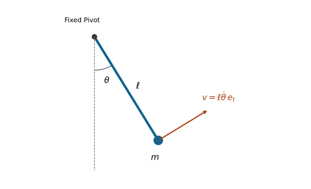

# Lagrangian Mechanics
[]{#ch-lagrangian}


A golf swing combines posture-dependent inertia, muscle and joint action, gravity, contact reactions and elastic storage. An energy formulation helps keep those contributions consistent. It does not remove forces from the physical explanation. It organizes their effects in coordinates that respect the chosen geometry, so that a model's acceleration, power and conservation statements can be checked against one another.

The central question is whether the same declared model gives the same predictions through kinetic energy, virtual work and Newton--Euler balance. A model that produces a plausible trajectory but admits negative kinetic energy has already failed that test. A model that conserves an incorrectly defined energy has not passed it.

## What the Lagrangian Formulation Assumes
[]{#sec-lagrangian_scope}
[]{#laymans-energy_intuition}
[]{#laymans-context_box}

Lagrange's analytical mechanics, the calculus of variations and Hamilton's later action and phase-space formulations provide complementary tools. Hamilton's stationary-action principle should not be treated as a synonym for every historical least-action principle. Here we use a finite-dimensional classical mechanical model; no claim about quantum paths or a universal optimization performed by nature is needed.

Let $q$ be a local configuration chart, $v=\dot q$ its coordinate velocity, and $Q$ a generalized-force covector. Coordinates can include passive joints, floating-base variables and elastic modes; they need not be motor angles. A regular chart can incorporate independent holonomic constraints locally. Closed loops, singular configurations and changing contacts can require redundant coordinates, multipliers or separate contact modes.

For an autonomous natural mechanical system we write
[]{#eq-lagrangian}

$$
\mathcal L(q,v)=T(q,v)-V(q),\qquad
T(q,v)=\tfrac12v^TM(q)v.
$$
This form assumes homogeneous quadratic kinetic energy in coordinate velocities and conservative forces from the stated potential. Moving coordinate systems or prescribed base motion can introduce terms linear in velocity and explicit time dependence. Velocity-dependent interactions may require a more general Lagrangian. Dissipation and actuation normally enter through generalized forces, not by relabeling them as potential energy.

A rigid body's kinetic energy is its center-of-mass translation plus rotation about that center. With all vectors expressed consistently,
[]{#eq-lagrangian_body_energy}

$$
T_i=\tfrac12m_i\|v_{C_i}\|^2+
\tfrac12\omega_i^TI_{C_i}\omega_i.
$$
The same frame must be used for the inertia and angular velocity; the inertia is about the center of mass. Near a uniform gravitational field, $V_g=\sum_i m_i g y_{C_i}$; a linear spring adds $k x^2/2$. Neither expression includes the metabolic cost of producing muscle force.

## Virtual Work and the Role of Constraints

[]{#the-limitations-of-newton}
[]{#sec-lagrangian_virtual_work}

Newton's laws do not require solving every reaction force before obtaining motion. Projecting force balance onto admissible displacements can eliminate ideal reactions. Lagrange--d'Alembert mechanics makes that projection systematic. For particle positions $r_a(q,t)$, the fixed-time virtual displacement is $\delta r_a=(\partial r_a/\partial q)\delta q$. Applied forces define
[]{#eq-lagrangian_generalized_force}

$$
Q_i=\sum_a F_a\mathbin{\cdot}\frac{\partial r_a}{\partial q_i},
\qquad \delta W=Q^T\delta q.
$$
A spatial wrench similarly contributes $J^TF$, using a velocity Jacobian and dual wrench with matching frame, reference point and component ordering. This is why coordinate changes must transform forces as well as positions.

D'Alembert's equation is $\sum_a(F_a-m_a\ddot r_a)\cdot\delta r_a=0$ after ideal reaction terms vanish. The word ideal is an assumption: reaction covectors annihilate the allowed virtual displacements. Friction, compliance, bearing losses or a driven contact can require additional terms. A normal direction in Cartesian space becomes a constraint covector in generalized coordinates; calling it perpendicular without specifying a metric can obscure that distinction.

For fixed holonomic constraints and independent reduced coordinates, virtual displacements are arbitrary in those coordinates. Newton's projection then yields the forced Euler--Lagrange equations. For moving constraints, virtual displacement still holds time fixed. Actual velocity has an additional prescribed-motion component, so zero virtual work need not mean zero actual power. We derive that distinction below.

## Hamilton's Principle and Variation

[]{#the-lagrangian-mathcall-and-the-euler-lagrange-equations}

[]{#the-principle-of-least-action}
[]{#sec-lagrangian_action}

For an unforced variational system, fix both endpoint configurations and their times. A smooth trajectory is stationary for
[]{#eq-hamilton_principle}

$$
\mathcal S[q]=\int_{t_0}^{t_1}\mathcal L(q,\dot q,t)\,dt,
\qquad \delta\mathcal S=0.
$$
Stationary means zero first variation. It does not assert a minimum, a maximum or an extremum; saddles are possible. The physical initial-value problem also needs an initial configuration and velocity. Stationarity of an endpoint problem is not a substitute for those data.

For $q_\epsilon=q+\epsilon\eta$ with $\eta(t_0)=\eta(t_1)=0$, differentiation and integration by parts give
[]{#eq-lagrangian_variation}

$$
\begin{aligned}
\delta\mathcal S
&=\int_{t_0}^{t_1}(\mathcal L_q^T\eta+\mathcal L_v^T\dot\eta)\,dt\\
&=[\mathcal L_v^T\eta]_{t_0}^{t_1}
+\int_{t_0}^{t_1}\left(\mathcal L_q-
\frac{d}{dt}\mathcal L_v\right)^T\eta\,dt.
\end{aligned}
$$
The endpoint term is zero. The fundamental lemma of the calculus of variations therefore gives
[]{#eq-euler_lagrange}

$$
\frac{d}{dt}\mathcal L_v-\mathcal L_q=0.
$$
For nonconservative generalized force $Q$, the Lagrange--d'Alembert statement is
[]{#eq-lagrangian_forced_variation}

$$
\delta\mathcal S+\int_{t_0}^{t_1}Q^T\eta\,dt=0.
$$
The same integration by parts gives
[]{#eq-el_with_torque}

$$
\frac{d}{dt}\mathcal L_v-\mathcal L_q=Q.
$$
This is a forced virtual-work principle, not a claim that every dissipative trajectory is stationary for the unmodified action. Nonholonomic admissible variations require their own restriction and cannot generally be replaced by an unconstrained endpoint variation.

For a point-mass pendulum with a massless rigid rod, angle $\theta$ measured counterclockwise from downward vertical, $T=m\ell^2\dot\theta^2/2$ and $V=mg\ell(1-\cos\theta)$. [The forced Euler–Lagrange equation](#eq-el_with_torque) gives $m\ell^2\ddot\theta+mg\ell\sin\theta=u$. Tension does no work in this fixed-length, fixed-pivot model, but its force remains physically necessary. The bob's tangential speed is $\ell|\dot\theta|$, not $\dot\theta$ in metres per second.

On narrow screens, scroll the figure or [open it at full size](../figures/lagrangian_pendulum.svg).

::: {#fig-lagrangian_pendulum}
::: {.aba-diagram-scroll role="region" aria-label="Point-mass pendulum; scroll horizontally" tabindex="0"}

:::

Point-Mass Pendulum With a Fixed Pivot. Tangential Velocity Depends on Length and Angular Rate; the Equation Also Requires Initial State and Applied Torque.
:::

## Deriving the Manipulator Equations

[]{#deriving-the-standard-form}
[]{#sec-lagrangian_manipulator}

For the autonomous natural Lagrangian, the conjugate momentum is $p=\mathcal L_v=Mv$. Differentiate the entire product:
[]{#eq-lagrangian_momentum_rate}

$$
\dot p=M\dot v+\dot Mv,\qquad
\dot M_{ij}=\sum_k\partial_kM_{ij}\,v_k.
$$
The velocity-dependent force in the equations of motion is not simply $\dot Mv$. Euler--Lagrange also subtracts the configuration gradient of kinetic energy,
[]{#eq-lagrangian_kinetic_gradient}

$$
(\partial_qT)_i=\tfrac12\sum_{j,k}\partial_iM_{jk}\,v_jv_k.
$$
Combining these terms and symmetrizing the dummy velocity indices gives
[]{#eq-lagrangian_christoffel_first}

$$
\begin{aligned}
\gamma_{ijk}&=\tfrac12(\partial_kM_{ij}+\partial_jM_{ik}-\partial_iM_{jk}),\\
c_i(q,v)&=\sum_{j,k}\gamma_{ijk}v_jv_k,\qquad
C_{ij}(q,v)=\sum_k\gamma_{ijk}v_k.
\end{aligned}
$$
Here $\gamma_{ijk}$ are Christoffel symbols of the first kind for the kinetic metric. Thus $c=Cv$, with $C$ linear and $c$ quadratic in velocity. The resulting standard form is
[]{#eq-standard_form}

$$
M(q)\ddot q+C(q,\dot q)\dot q+G(q)=Q,
\qquad G=\partial_qV.
$$
For gravity alone, the applied generalized gravitational force is $-G$. The positive vector $G$ on the left is the holding-force demand in a static unconstrained model. If $V$ also contains springs, its gradient is not exclusively a gravity vector.

Squared-velocity and mixed-velocity terms are often called centrifugal/centripetal and Coriolis terms. Their partition depends on coordinates and conventions. Centripetal acceleration points inward in circular motion; a rotating-frame centrifugal force points outward. Mixed products require velocities, not the acceleration of another joint. Inertia coupling also appears in $M\ddot q$, so a claim about a distal segment's acceleration cannot be assigned to $C\dot q$ alone.

The force side can contain $Bu+J^TF_{\rm ext}-Dv$. The actuator map $B$ can depend on configuration and can be rectangular. With quaternion positions and independent angular velocities, software commonly uses $\dot q=N(q)v$; those $v$ are not coordinate derivatives. The formulas above must then be transformed with the appropriate velocity representation rather than applied entry by entry unchanged. Tedrake's manipulator-equation notes discuss this distinction and force mapping [@TedrakeMultibodySupplement].

## Mass, Coriolis and Gravity Properties
[]{#sec-lagrangian_matrix_properties}

### When the Mass Matrix Is Positive-Definite

[]{#the-mass-matrix-mbmq}
[]{#subsec-lagrangian_mass}

Define $M$ as the velocity Hessian of a twice continuously differentiable kinetic energy. Equality of mixed partial derivatives proves symmetry. Merely observing that a scalar equals its transpose cannot prove symmetry of a proposed matrix: its skew part is invisible in $v^TMv$.

Let each body's linear/angular velocity be $J_i(q)v$ and its positive kinetic quadratic form be $\mathcal I_i$. Then
[]{#eq-lagrangian_mass_pullback}

$$
M=\sum_iJ_i^T\mathcal I_iJ_i,\qquad
v^TMv=\sum_i(J_iv)^T\mathcal I_i(J_iv).
$$
This is nonnegative. It is strictly positive for nonzero coordinate velocity when the aggregate velocity map has no kinetic null direction. Independent regular coordinates and physically nondegenerate inertias provide a standard sufficient condition. Massless variables, redundant coordinates or singular charts can violate it. Nonnegative energy alone proves only semidefiniteness.

Under a time-independent coordinate change $q=\psi(z)$, $v=J\dot z$ and $M_z=J^TM_qJ$. Force transforms as $Q_z=J^TQ_q$, preserving $Q^Tv$. Positive-definiteness is preserved under nonsingular chart changes, while individual matrix entries and their numerical condition numbers depend on coordinate units and scaling.

### The Skew Identity and Nonunique Factors

[]{#the-coriolis-and-centripetal-matrix-cbmq-dotbmq}
[]{#subsec-lagrangian_coriolis}

For the Christoffel factor in [the Christoffel definition](#eq-lagrangian_christoffel_first), symmetry of $M$ gives
[]{#eq-lagrangian_skew}

$$
(\dot M-2C)_{ij}
=\sum_k(\partial_iM_{jk}-\partial_jM_{ik})v_k.
$$
Interchanging $i$ and $j$ changes the sign, proving the matrix identity. It follows that $v^TCv=\tfrac12v^T\dot Mv$. The converse argument from that one contracted scalar is insufficient because $C$ itself depends on $v$.

The Christoffel factor is a convenient choice, not the only factor with the skew property. If $Kv=0$, then $(C+K)v=Cv$. A generic such $K$ need not preserve the matrix identity. However, a skew $K$ does preserve it; in three coordinates $K(v)=[v]_\times$ is a nonzero example with $Kv=v\times v=0$. A controller proof must establish the identity for its chosen factor, not assert uniqueness of that factorization.

Even the skew check is not complete model validation. It can pass for a consistently wrong inertia model. Independent kinetic-energy, force, potential-gradient and coordinate-transformation checks are needed. The numerical example uses these complementary tests.

### Gravity Sign and Energy Units

[]{#the-gravity-vector-fracpartial-vpartial-bmq}
[]{#subsec-lagrangian_gravity}

For $V_g=\sum_i m_i g y_i(q)$, $G_i=\partial V_g/\partial q_i$. An angular coordinate gives a generalized torque; a translational coordinate gives a generalized force. A mass-matrix entry has corresponding coordinate-dependent units. Multiplying an inertia entry by $g\cos q$ does not generally produce potential energy: a lever length is required in the correct place. Derive $V$ from physical center-of-mass heights before differentiating it.

## Energy Balance Before Energy Conservation
[]{#sec-lagrangian_energy}

For a general smooth Lagrangian define the energy function $E=v^Tp-\mathcal L$, with $p=\mathcal L_v$. Direct differentiation gives
[]{#eq-lagrangian_energy_balance}

$$
\begin{aligned}
\dot E&=v^T(\dot p-\mathcal L_q)-\mathcal L_t\\
&=v^TQ-\mathcal L_t.
\end{aligned}
$$
For an autonomous natural system, homogeneity gives $v^Tp=2T$ and $E=T+V$. In that setting $\dot E=v^TQ$, and energy is conserved when net generalized power is zero. Zero actuator torque alone is insufficient if there are other forces, changing constraints, prescribed motion or unmodeled dissipation. Conversely, a nonzero force can do zero power if its pairing with velocity vanishes.

With $Q=Bu-Dv$ and symmetric $D\succeq0$, the balance is $\dot E=u^TB^Tv-v^TDv$. Damping makes energy nonincreasing; strict decrease requires positive dissipation at that instant. At rest the damping power is zero. For physical joint dampers, $D$ must be transformed with the coordinate map just like other forces.

A moving coordinate system changes the relation between $E$ and laboratory mechanical energy. For a free particle with $x=q+a(t)$, $\mathcal L=m(\dot q+\dot a)^2/2$. Its energy function is $m\dot q^2/2-m\dot a^2/2$, while laboratory kinetic energy is $m(\dot q+\dot a)^2/2$. Conflating them would manufacture or conceal apparent energy transfer. The balance identity remains valid for the correctly declared Lagrangian.

## Hamiltonian Mechanics and Phase Space
[]{#sec-lagrangian_hamiltonian}

If the velocity Hessian of $\mathcal L$ is nonsingular, the inverse function theorem locally solves $p=\mathcal L_v$ for $v=v(q,p,t)$. Define $H(q,p,t)=p^Tv-\mathcal L(q,v,t)$. Differentiating while keeping the appropriate independent variables fixed cancels the $dv$ terms and yields $H_p=v$, $H_q=-\mathcal L_q$ and $H_t=-\mathcal L_t$. Consequently,
[]{#eq-hamiltonian_equations}

$$
\dot q=H_p,\qquad \dot p=-H_q+Q.
$$
In the natural SPD case, $H=\tfrac12p^TM^{-1}(q)p+V(q)$ equals mechanical energy. Global invertibility needs more than a local regularity assertion. Degenerate Lagrangians require constrained Hamiltonian analysis, not an ordinary inverse of a singular mass matrix.

The canonical phase space is $T^*Q$, with local coordinates $(q,p)$. Its symplectic form is
[]{#eq-symplectic_form}

$$
\omega=\sum_i dq_i\wedge dp_i.
$$
A Hamiltonian flow preserves this form, including when $H$ depends explicitly on time; time dependence can nevertheless destroy energy conservation. General applied forces need not preserve symplectic structure. For $\dot q=p/m$, $\dot p=-kq-bp/m$, phase-space divergence is $-b/m$, so viscous damping contracts area. Energy preservation, volume preservation and symplecticity are distinct properties.

## Noether's Theorem and Momentum Balance
[]{#sec-noether}

A continuous symmetry of the Lagrangian gives a conserved quantity along unforced Euler--Lagrange trajectories. The symmetry must act on velocities as well as configurations and respect the model's domain and constraints. For forced trajectories it gives a balance law with the force projected onto the symmetry direction. This formulation makes conservation useful for grounded and actuated systems without pretending that they are isolated.

### Proof for a Configuration Symmetry
[]{#sec-noether_proof}


Let $\Phi_\epsilon$ be a smooth one-parameter group of configuration diffeomorphisms, with
[]{#eq-noether_generator}

$$
\xi(q)=\left.\frac{d}{d\epsilon}\Phi_\epsilon(q)\right|_{\epsilon=0}.
$$
Its tangent action maps $(q,v)$ to $(\Phi_\epsilon(q),D\Phi_\epsilon(q)v)$. Assume exact invariance at fixed time:
[]{#eq-noether_symmetry}

$$
\mathcal L(\Phi_\epsilon(q),D\Phi_\epsilon(q)v,t)=\mathcal L(q,v,t).
$$
The candidate momentum is
[]{#eq-noether_charge}

$$
I(q,v,t)=p^T\xi(q).
$$
Differentiating the invariance condition at zero gives
[]{#eq-noether_diff}

$$
\mathcal L_q^T\xi+p^TD\xi\,v=0.
$$
Along the forced equations, the product rule therefore gives
[]{#eq-noether_dIdt}

$$
\dot I=(\mathcal L_q+Q)^T\xi+p^TD\xi\,v=Q^T\xi.
$$
Thus the charge is conserved if the projected generalized force vanishes. Ideal reaction forces drop out when the generator is an admissible displacement. A symmetry that changes the constraint surface is not covered. If the Lagrangian changes by a total derivative $dF/dt$ under the infinitesimal transformation, the corresponding charge becomes $p^T\xi-F$; exact invariance is sufficient but not necessary.

### Which Quantity Is Actually Conserved?
[]{#subsec-lagrangian_symmetry_examples}
[]{#laymans-noether_practice}

A cyclic coordinate satisfies $\mathcal L_{q_i}=0$, so $\dot p_i=Q_i$. Its momentum need not equal a single link's $I_i\dot q_i$. In a coupled chain it generally includes several angular rates. For a particle, translation symmetry in a fixed Cartesian direction gives that component of linear momentum. A simultaneous rigid rotation of all relevant positions gives the corresponding total angular-momentum component, including all masses and their contributions about the stated origin.

In uniform downward gravity, $\mathcal L=m(\dot x^2+\dot y^2+\dot z^2)/2-mgz$ is invariant under horizontal translations and vertical-axis rotations, not vertical translations. Thus $p_x,p_y$ and vertical angular momentum are conserved for a free particle, while $\dot p_z=-mg$. Time independence gives conservation of mechanical energy, not conservation of every momentum component.

A free particle described in a frame rotating at constant $\Omega$ has planar polar Lagrangian $\mathcal L=m[\dot r^2+r^2(\dot\theta+\Omega)^2]/2$. It remains independent of $\theta$. The cyclic momentum is $p_\theta=mr^2(\dot\theta+\Omega)$, the inertial angular momentum, not $mr^2\dot\theta$. A table that exerts friction supplies an external torque and changes that balance; changing coordinate frames alone does not.

Time-translation symmetry is handled by the energy identity above, which includes a time transformation rather than the fixed-time configuration action proved here. Unactuated does not automatically mean autonomous, frictionless or isolated. For a golfer, the ground can change whole-system momentum while ideal stationary contact does no contact-point power. Momentum and energy answer different questions.

## Constrained Lagrangian Systems
[]{#sec-lagrangian_constraints}

For independent holonomic constraints $\phi(q,t)=0$, let $A=D_q\phi$. Ideal reaction force is $A^T\lambda$, so
[]{#eq-lagrange_multipliers}

$$
\frac{d}{dt}\mathcal L_v-\mathcal L_q=Q+A^T\lambda.
$$
Velocity consistency is $Av+\phi_t=0$. Differentiating again gives $A\dot v+b=0$, where component $a$ of the known bias is
[]{#eq-lagrangian_constraint_bias}

$$
b_a=v^TD_{qq}^2\phi_a\,v+2D_{qt}^2\phi_a\,v+\partial_{tt}\phi_a.
$$
For the natural-system equation define $F=Q-c-G$. The coupled solve is
[]{#eq-lagrangian_constraint_solve}

$$
\begin{pmatrix}M&-A^T\\A&0\end{pmatrix}
\begin{pmatrix}\dot v\\\lambda\end{pmatrix}
=\begin{pmatrix}F\\-b\end{pmatrix}.
$$
If $M$ is SPD and $A$ has full row rank, $AM^{-1}A^T$ is SPD, and elimination yields


$$
\lambda=-(AM^{-1}A^T)^{-1}(b+AM^{-1}F).
$$
 Numerical implementations solve linear systems rather than form dense inverses. Redundant constraints can make individual multipliers nonunique even when motion is determined. Scaling a constraint rescales its multiplier; the physical generalized reaction is the invariant object.

Acceleration consistency alone does not restore initially violated position or velocity constraints. Consistent initial data, projection, stabilization or a suitable differential-algebraic integrator is needed. Unilateral contacts also require nonpenetration and admissible reaction signs; friction introduces inequalities and possible slip. An equality multiplier solve alone does not certify a feasible foot-ground contact.

At fixed time, $A\delta q=0$ makes reaction virtual work zero. Actual reaction power is
[]{#eq-lagrangian_constraint_power}

$$
v^TA^T\lambda=-\lambda^T\phi_t.
$$
It vanishes for stationary holonomic constraints, but a moving support can supply or absorb energy. A prescribed hand path can therefore do work on a club subsystem through its constraint reactions. Treating that subsystem as energy-conserving would exclude the very mechanism under investigation.

For an ideal nonholonomic constraint $A(q,t)v+a(q,t)=0$, Lagrange--d'Alembert uses $A\delta q=0$ and reaction $A^T\lambda$. In general the allowed distribution is not tangent to any lower-dimensional configuration surface. Varying an action with velocity constraints imposed on every neighboring path instead gives a vakonomic problem, usually different dynamics. Use the appropriate physical constraint law; do not obtain rolling dynamics merely by substituting velocities into $\mathcal L$ and varying freely.

## The Kinetic Metric and Geodesic Motion
[]{#sec-christoffel}

When $M$ is SPD it defines a Riemannian metric on configuration space. Raise the first index of the first-kind symbols to obtain the connection coefficients
[]{#eq-lagrangian_christoffel_second}

$$
\Gamma^i{}_{jk}=\sum_\ell(M^{-1})_{i\ell}\gamma_{\ell jk}.
$$
For no applied force and constant potential, the equation is $\ddot q^i+\sum_{jk}\Gamma^i{}_{jk}\dot q^j\dot q^k=0$. This describes a geodesic parameterized by physical time. With forces, covariant acceleration is $\nabla_{\dot q}\dot q=M^{-1}(Q-G)$. A free geodesic need not be a globally shortest route between its endpoints.

The connection terms are not geodesic deviation. Geodesic deviation concerns the relative evolution of neighboring geodesics and involves curvature. Nonzero Christoffel symbols do not prove nonzero curvature: the Euclidean plane in polar coordinates has $M=\operatorname{diag}(1,r^2)$ and nonzero coefficients for $r>0$, yet it is flat. The equations $\ddot r-r\dot\theta^2=0$ and $\ddot\theta+2\dot r\dot\theta/r=0$ can describe an ordinary straight Cartesian trajectory.

This distinction matters for swing interpretation. A change in the numerical Coriolis terms under a new coordinate chart does not imply a new physical force source. Posture changes physical kinetic coupling, while coordinates change its representation. A kinetic metric is also not automatically a contraction metric: contraction requires a differential inequality for the actual forced, dissipative or controlled state dynamics, with the relevant domain and input assumptions.

## Worked Example 1: Two Uniform Pendulum Rods
[]{#sec-lagrangian_double_pendulum}

### Geometry and Distributed Kinetic Energy
[]{#subsec-lagrangian_rods_geometry}

Use two uniform slender rods of masses $m_1,m_2>0$, lengths $\ell_1,\ell_2>0$, a fixed base and ideal planar hinges. Both angles $\alpha_1,\alpha_2$ are absolute, counterclockwise from downward vertical. Define $e(\alpha)=(\sin\alpha,-\cos\alpha)^T$. The centers are $r_{C_1}=\ell_1e(\alpha_1)/2$ and $r_{C_2}=\ell_1e(\alpha_1)+\ell_2e(\alpha_2)/2$.

Differentiation gives $\|v_{C_1}\|^2=\ell_1^2\dot\alpha_1^2/4$ and
[]{#eq-lagrangian_rods_velocity}

$$
\|v_{C_2}\|^2=\ell_1^2\dot\alpha_1^2+
\tfrac14\ell_2^2\dot\alpha_2^2+
\ell_1\ell_2\cos(\alpha_1-\alpha_2)\dot\alpha_1\dot\alpha_2.
$$
Each rod also has center rotational inertia $I_{C_i}=m_i\ell_i^2/12$. Add both terms from [the rigid-body kinetic-energy equation](#eq-lagrangian_body_energy); treating each rod as a point at its center would be a different physical model. With $\Delta=\alpha_1-\alpha_2$ and $k=m_2\ell_1\ell_2/2$,
[]{#eq-lagrangian_rods_mass}

$$
M_\alpha=
\begin{pmatrix}
(m_1/3+m_2)\ell_1^2&k\cos\Delta\\
k\cos\Delta&m_2\ell_2^2/3
\end{pmatrix}.
$$
The cross term in $T=\dot\alpha^TM_\alpha\dot\alpha/2$ is $k\cos\Delta\,\dot\alpha_1\dot\alpha_2$. Its coefficient is the off-diagonal entry because the quadratic form contains both symmetric entries and the leading factor one-half.

The determinant has the positive lower bound
[]{#eq-lagrangian_rods_spd}

$$
\begin{aligned}
\det M_\alpha&=\ell_1^2\ell_2^2
\left(\frac{m_1m_2}{9}+\frac{m_2^2}{3}
-\frac{m_2^2}{4}\cos^2\Delta\right)\\
&\geq\ell_1^2\ell_2^2\left(\frac{m_1m_2}{9}+\frac{m_2^2}{12}\right)>0.
\end{aligned}
$$
Together with a positive diagonal entry this proves SPD for the declared positive parameters, including aligned rods.

### Bias, Potential and Motor Torques
[]{#subsec-lagrangian_rods_forces}

Potential relative to pivot height and its gradient are
[]{#eq-lagrangian_rods_potential}

$$
\begin{aligned}
V&=-(m_1/2+m_2)g\ell_1\cos\alpha_1
-m_2g\ell_2\cos\alpha_2/2,\\
G_\alpha&=\begin{pmatrix}
(m_1/2+m_2)g\ell_1\sin\alpha_1\\
m_2g\ell_2\sin\alpha_2/2
\end{pmatrix}.
\end{aligned}
$$
The derivative of the off-diagonal mass entry is $\dot M_{12}=-k\sin\Delta(\dot\alpha_1-\dot\alpha_2)$. The Christoffel factor and its contracted bias are
[]{#eq-lagrangian_rods_bias}

$$
C_\alpha=k\sin\Delta
\begin{pmatrix}0&\dot\alpha_2\\-\dot\alpha_1&0\end{pmatrix},
\qquad c_\alpha=k\sin\Delta
\begin{pmatrix}\dot\alpha_2^2\\-\dot\alpha_1^2\end{pmatrix}.
$$
Direct substitution gives


$$
\dot M-2C=k\sin\Delta(\dot\alpha_1+\dot\alpha_2)\left(\begin{smallmatrix}0&-1\\1&0\end{smallmatrix}\right)
.
$$
This matrix is skew.

Let $u_1$ be the base motor torque and $u_2$ the elbow torque on rod 2, whose equal opposite reaction acts on rod 1. Their virtual work is $u_1\delta\alpha_1+u_2(\delta\alpha_2-\delta\alpha_1)$, so
[]{#eq-lagrangian_rods_motor_power}

$$
Q_\alpha=\begin{pmatrix}u_1-u_2\\u_2\end{pmatrix},\qquad
\dot E=u_1\dot\alpha_1+u_2(\dot\alpha_2-\dot\alpha_1).
$$
Writing $(u_1,u_2)$ directly on the right in absolute coordinates would change the actuation model. Internal joint torques can do mechanical work because the connected bodies have different angular velocities. Equal and opposite torque does not mean zero summed power.

For unit masses and lengths with $\Delta=0$, the correct matrix is $\left(\begin{smallmatrix}4/3&1/2\\1/2&1/3\end{smallmatrix}\right)$, with determinant $7/36$. This supplies a quick numerical checkpoint. The distributed-particle integration in the companion tests checks the whole quadratic form, not just this special pose.

## Worked Example 2: A Two-Link Robot Arm
[]{#sec-lagrangian_relative_arm}

Let $q_1$ be the first rod's angle from horizontal and $q_2$ the relative elbow angle. The same physical rods have $\alpha=S q+(\pi/2,\pi/2)^T$, with $S=\left(\begin{smallmatrix}1&0\\1&1\end{smallmatrix}\right)$. Therefore $\dot\alpha=S\dot q$, $M_q=S^TM_\alpha S$, $C_q=S^TC_\alpha S$ and $G_q=S^TG_\alpha$. The positive offset is required by the downward-vertical convention.

The endpoint is


$$
(\ell_1\cos q_1+\ell_2\cos(q_1+q_2),\ell_1\sin q_1+\ell_2\sin(q_1+q_2))^T.
$$
 Its position Jacobian is
[]{#eq-lagrangian_arm_jacobian}

$$
J=\begin{pmatrix}
-\ell_1\sin q_1-\ell_2\sin(q_1+q_2)&-\ell_2\sin(q_1+q_2)\\
\ell_1\cos q_1+\ell_2\cos(q_1+q_2)&\ell_2\cos(q_1+q_2)
\end{pmatrix}.
$$
With $b=m_2\ell_2^2/3$ and $d=m_2\ell_1\ell_2\cos q_2/2$, the mass matrix is
[]{#eq-lagrangian_arm_mass}

$$
M_q=\begin{pmatrix}
(m_1/3+m_2)\ell_1^2+b+2d&b+d\\
b+d&b
\end{pmatrix}.
$$
In particular the distal squared-length contribution to $M_{12}$ is $m_2\ell_2^2/3$, not $m_2\ell_2^2/6$. It includes both translation and rod rotation. For $h=m_2\ell_1\ell_2\sin q_2/2$, one Christoffel factor gives
[]{#eq-lagrangian_arm_bias}

$$
C_q=h\begin{pmatrix}-\dot q_2&-(\dot q_1+\dot q_2)\\\dot q_1&0\end{pmatrix},
\qquad
c_q=h\begin{pmatrix}-2\dot q_1\dot q_2-\dot q_2^2\\\dot q_1^2\end{pmatrix}.
$$
Let $a_g=(m_1/2+m_2)g\ell_1$ and $b_g=m_2g\ell_2/2$. Then
[]{#eq-lagrangian_arm_gravity}

$$
\begin{aligned}
V&=a_g\sin q_1+b_g\sin(q_1+q_2),\\
G_q&=\begin{pmatrix}a_g\cos q_1+b_g\cos(q_1+q_2)\\b_g\cos(q_1+q_2)\end{pmatrix}.
\end{aligned}
$$
Now $Q_q=(u_1,u_2)^T$, and motor power is $u^T\dot q$. The two coordinate descriptions produce identical Cartesian motion and power. Their different individual coefficients are not competing physical explanations.

## Lagrangian Equations and Recursive Computation

[]{#why-both-formulations-exist}
[]{#sec-lagrangian_algorithms}

A formulation and an algorithm answer different questions. Euler--Lagrange and Newton--Euler equations describe the same declared classical model. Either can support simulation, inverse dynamics, linearization or controller design; an explicit symbolic expression for every matrix is not required for feedback or optimization.

Recursive Newton--Euler evaluates inverse dynamics: given motion, it computes generalized force. The articulated-body algorithm solves forward dynamics: given force and state, it computes acceleration. For a tree with bounded joint dimension, both have linear complexity for their respective tasks. Building a dense mass matrix and factoring it is another forward-dynamics strategy, with cubic dense factorization cost; that cost is not inherent to the Lagrangian formulation. Closed-loop/contact solves add their own work.

Comparing an inverse-dynamics recursion with a forward-dynamics matrix solve is not an equal-task benchmark. A claim of a hundredfold speedup for a 15-coordinate golf model needs measured implementations, hardware, tolerances and identical tasks. The chapter makes no such performance claim. The useful connection is structural: energy-derived expressions provide independent checks on recursive results, and recursive algorithms provide efficient evaluations for larger models [@Featherstone2008].

## Symplectic Integration and Its Limits
[]{#sec-symplectic_integrators}
[]{#laymans-symplectic_robotics}


For a conservative Hamiltonian system, a symplectic one-step map preserves the canonical form. It need not preserve the original Hamiltonian exactly. Phase errors can accumulate even when energy error stays small, and a chaotic trajectory can diverge from a reference while remaining on a nearby energy level. Contacts, dissipation and control inputs need a method appropriate to their actual structure.

### Symplectic Euler for a General Hamiltonian
[]{#subsec-lagrangian_symplectic_euler}

One symplectic Euler variant is
[]{#eq-symp_euler_p}

$$
p_{n+1}=p_n-hH_q(q_n,p_{n+1}),
$$
[]{#eq-symp_euler_q}

$$
q_{n+1}=q_n+hH_p(q_n,p_{n+1}).
$$
The first equation is generally implicit in the new momentum. The generating function is


$$
F_2(q_n,p_{n+1})=q_n^Tp_{n+1}+hH(q_n,p_{n+1}).
$$
It gives $p_n=\partial_{q_n}F_2$ and $q_{n+1}=\partial_{p_{n+1}}F_2$, establishing symplecticity where the implicit map is regular. Evaluating the first gradient at old momentum instead does not generally preserve the form. Nonlinear solve tolerances also matter in an implementation.

For a nondimensional example, set $x=\exp q$ for a free unit-mass particle on $x>0$. Its Hamiltonian is $H=e^{-2q}p^2/2$. Set $a=e^{-2q_n}$. The momentum equation is $p_{n+1}=p_n+ha p_{n+1}^2$. On the branch continuous from $h=0$,
[]{#eq-lagrangian_variable_mass_step}

$$
p_{n+1}=\frac{2p_n}{1+\sqrt{1-4ha p_n}},\qquad
q_{n+1}=q_n+ha p_{n+1}.
$$
Require a positive discriminant for a regular real local branch. This example isolates the implicit-momentum requirement without a complicated robot. Its map preserves area; replacing $p_{n+1}^2$ by $p_n^2$ in the first equation yields determinant $1-6z^2-4z^3$, where $z=ha p_n$, which generally differs from one.

### Separable Verlet and Step-Size Restrictions
[]{#subsec-lagrangian_verlet}

For a separable $H(q,p)=K(p)+V(q)$, compose exact kick and drift substeps:
[]{#eq-verlet_half_p}

$$
p_{n+1/2}=p_n-\tfrac h2\nabla V(q_n),
$$
[]{#eq-verlet_q}

$$
q_{n+1}=q_n+h\nabla K(p_{n+1/2}),
$$
[]{#eq-verlet_p}

$$
p_{n+1}=p_{n+1/2}-\tfrac h2\nabla V(q_{n+1}).
$$
This Störmer--Verlet map is second order, reversible and symplectic. A robot Hamiltonian $p^TM^{-1}(q)p/2+V(q)$ is generally nonseparable, so this explicit kick--drift formula cannot simply be reused. Implicit midpoint is another symplectic option for a smooth general canonical Hamiltonian when its implicit equations are solved consistently.

Even a symplectic scheme can be unstable. For the unit-frequency harmonic oscillator, momentum-first symplectic Euler has matrix
[]{#eq-lagrangian_oscillator_step}

$$
A_h=\begin{pmatrix}1-h^2&h\\-h&1\end{pmatrix}
$$
in $(q,p)$ order. Its determinant is one, but its eigenvalues leave the unit circle for $h>2$. For $0<h<2$ it preserves the positive quadratic form $(q^2+p^2-hqp)/2$, a modified energy different from $(q^2+p^2)/2$. At the boundary $h=2$, generic solutions can grow through a nontrivial Jordan block. Symplecticity alone gives no unconditional energy bound.

Backward error analysis explains near energy preservation for sufficiently small fixed steps under appropriate smoothness, boundedness and regularity assumptions. Analytic Hamiltonians and suitable methods can yield exponentially long estimates; the modified series is generally formal or truncated, not a guarantee that every numerical orbit exactly solves a globally convergent nearby system. Hairer's review states the small-step/highest-frequency regime and the limits of that analysis [@HairerChallengesSupplement]. Neither stability for arbitrarily long times nor exact phase accuracy follows. Ordinary state-dependent step adaptation can also destroy the original symplectic property.

## Python Example: Dynamics and Power Checks
[]{#sec-lagrangian_python}

The importable example uses the uniform rods and absolute-angle motor map derived above. It solves linear systems rather than forming an inverse. Run from the repository root with its Python dependencies. The integration uses an adaptive high-order ODE solver as a finite-horizon accuracy check; it is not presented as symplectic. The independently tested functions also expose the relative-coordinate arm and the one-dimensional implicit example.

```python
import numpy as np
from scipy.integrate import solve_ivp
from src.tools.lagrangian_examples import RodPair, variable_mass_step

model = RodPair()
initial = np.array([0.6, -0.2, 0.3, -0.4])
times = np.linspace(0, 5, 501)
for torque in (np.zeros(2), np.array([0.2, -0.1])):
    for tolerance in (1e-9, 1e-11):
        result = solve_ivp(
            lambda t, state: np.r_[
                state[2:], model.acceleration(state, torque)
            ],
            (times[0], times[-1]), initial,
            method="DOP853", t_eval=times,
            rtol=tolerance, atol=tolerance / 100,
        )
        if not result.success:
            raise RuntimeError(result.message)
        energy = np.array([model.energy(s) for s in result.y.T])
        joints = np.vstack((result.y[0], result.y[1] - result.y[0]))
        work = torque @ (joints - joints[:, :1])
        residual = energy - energy[0] - work
        print(torque, tolerance, np.max(np.abs(residual)))
print(model.mass_matrix(np.zeros(2)))
print(variable_mass_step(np.array([0.2, 0.4]), 0.1))
```

For constant physical motor torques, define $\Delta\alpha_i=\alpha_i-\alpha_{i,0}$. The work is
[]{#eq-lagrangian_motor_work}

$$
W=u_1\Delta\alpha_1+u_2(\Delta\alpha_2-\Delta\alpha_1).
$$ Comparing that analytic work with sampled energy change checks the force-coordinate pairing. For zero torque the same residual becomes energy error. Inspect the maximum error over the interval, not merely the difference between two endpoints; repeat at tighter tolerances before interpreting fine features.

The tests independently integrate particle kinetic energy over each uniform rod, check the mass matrix's positive eigenvalues, differentiate potential and inertia numerically, verify coordinate transformation, and compare energy change with motor work. An energy check by itself would miss a consistently wrong model. None of these numerical checks validates a particular golfer's inertial parameters, muscle forces or swing strategy.

## Golf and Humanoid Modeling
[]{#sec-lagrangian_golf}

Geometry determines which configurations and contact motions are admissible. The kinetic model then assigns inertia to those motions; actuator and contact maps determine which forces can produce them. The resulting dynamics determine how power, momentum and state evolve. These are connected stages of one explanation. A posture may change clubhead sensitivity or joint coupling without proving that a particular muscle sequence caused the observed speed.

Define the system boundary before discussing energy transfer. For a club alone, moving-hand force and moment can supply power. For golfer plus club, grip interactions are internal. Their equal and opposite wrenches cancel in total power when the paired interface velocities agree, as in an ideal rigid grip. Relative slip, deformation or other interface motion requires its own dissipation or storage accounting. Muscle action can increase mechanical energy while drawing on chemical energy; shaft bending can store and release energy. A rigid-joint model cannot quantify omitted elastic storage.

At an ideal stationary sticking ground contact, contact-point velocity is zero and contact force does no instantaneous mechanical power, even though ground reaction changes total momentum and enables muscle forces to accelerate the body. Real shoes, turf, slip and compliance can change the local power balance. A force multiplied by center-of-mass velocity is not automatically ground-contact power; the point of application matters.

Within a selected coordinate chart, $M\ddot q$, $C\dot q$ and $G$ help organize calculations. Their individual entries are not coordinate-invariant labels for independent energy channels. To attribute a change in club delivery to a modeled action, perturb a declared input or parameter, retain the physical constraints, recompute the coupled motion and compare the relevant output at the same event. Include actuator limits, feedback, state uncertainty and impact timing before drawing performance conclusions.

This leads to a practical writing standard: state the boundary, coordinates, inertia assumptions, force maps and power balance before assigning a causal story to a velocity peak. Energy consistency supplies a necessary foundation; it does not by itself identify a unique mechanism, a globally optimal swing or a stable controller.

## Further Reading
[]{#sec-lagrangian_reading}

Goldstein, Poole and Safko [@Goldstein2002] and Arnold [@Arnold1989] treat classical variational and Hamiltonian mechanics. Marsden and Ratiu [@marsden1999] develop symmetry, momentum maps and reduction; Murray, Li and Sastry [@Murray1994] connect geometric mechanics with robotics.

For accessible primary supplements, Tedrake's multibody notes discuss manipulator equations, force maps and velocity representations [@TedrakeMultibodySupplement]; Hairer's numerical-analysis review gives the implicit symplectic Euler formulas and qualified long-time energy reasoning [@HairerChallengesSupplement]. Featherstone [@Featherstone2008] treats recursive computation, while Siciliano et al. and Spong et al. develop robot dynamics and control applications [@siciliano2009; @Spong2006]. The worked formulas, counterexamples and numerical checks in this chapter are derived explicitly so that a citation is not asked to substitute for their verification.

## Exercises
[]{#sec-lagrangian_exercises}


1. []{#ex-lagrangian_1}  For $\mathcal S=\int_0^T(q^2+\dot q^2)\,dt$, $T>0$, with $q(0)=0$ and $q(T)=1$, derive $\ddot q-q=0$ and solve for $q(t)$. Compute the second variation and determine whether the stationary path is a strict minimum.

1. []{#ex-lagrangian_2}  Derive the point-mass pendulum equation from the stated downward-vertical convention. Add a motor torque $u$ and viscous hinge damping $-b\dot\theta$, with $b\geq0$, and verify $\dot E=u\dot\theta-b\dot\theta^2$.

1. []{#ex-lagrangian_3}  Starting from $\mathcal L=m[\dot r^2+r^2(\dot\theta+\Omega)^2]/2$ for a free planar particle in a frame rotating at constant $\Omega$, identify the cyclic momentum. Relate it to inertial angular momentum. Then add a specified table friction torque and derive the new momentum balance.

1. []{#ex-lagrangian_4}  Consider a three-link horizontal planar arm with a fixed base, no gravity in its plane and no applied torques. Use relative joint angles and rotational invariance to identify a cyclic coordinate and its conserved momentum. Explain why the other two generalized momenta are not generally conserved. State what changes when gravity acts in the motion plane.

1. []{#ex-lagrangian_5}  Prove symmetry from the kinetic Hessian and positive-definiteness from an injective aggregate velocity map with positive body kinetic forms. Give a massless-coordinate or redundant-coordinate example for which nonnegative physical kinetic energy does not imply a positive-definite coordinate matrix.

1. []{#ex-lagrangian_6}  Verify $\dot M-2C$, including the time derivative, for both two-rod coordinate descriptions. Construct a nonzero skew addition $K(v)$ in three coordinates with $Kv=0$ to show that the skew-preserving factor is not unique.

1. []{#ex-lagrangian_7}  Derive the complete energy of the uniform-rod pendulum and check its balance for arbitrary initial velocities. Explain why release from rest is not required for conservation in the autonomous unforced model. Compare the kinetic quadratic form with independent integration along the rods.

1. []{#ex-lagrangian_8}  For $\mathcal L=m\dot x^2/2-kx^2$ with $m,k>0$, compute $p$, $H$ and Hamilton's equations. Identify the oscillator frequency and distinguish the coefficient $k$ in this potential from the conventional spring constant multiplying $x^2/2$.

1. []{#ex-lagrangian_9}  A bead of mass $m$ slides frictionlessly on the stationary parabola $y=ax^2$, with downward gravity. Derive the equation using $\delta y=2ax\delta x$ and independently using the reduced Lagrangian. Identify the effective mass, velocity bias and potential gradient.

1. []{#ex-lagrangian_10}  A particle moves on $r^Tr=R^2$ in a specified applied force $F$. Set reaction $2\lambda r$, derive $\lambda$ from acceleration consistency, and explain the required initial position/velocity constraints. Verify that the reaction does no power on the stationary sphere.

1. []{#ex-lagrangian_11}  Re-derive the relative-coordinate uniform-rod arm's $M,C,G$ directly from center translation and center rotation. Compare with the constant transformation from absolute coordinates. Verify the distal squared-length contribution to the off-diagonal mass entry.

1. []{#ex-lagrangian_12}  Put viscous dampers at the physical base and elbow hinges. Their torques are $u_1=-b_1\dot\alpha_1$ and $u_2=-b_2(\dot\alpha_2-\dot\alpha_1)$. Find the generalized damping matrix in absolute coordinates and the energy dissipation rate. Specify when the rate is strictly negative.

1. []{#ex-lagrangian_13}  Compute first- and second-kind Christoffel symbols for the polar-plane kinetic metric $M=\operatorname{diag}(1,r^2)$, $r>0$. Derive the free-motion equations and verify that a straight Cartesian path satisfies them. Explain why nonzero connection coefficients do not establish curvature or geodesic deviation.

1. []{#ex-lagrangian_14}  For an unconstrained particle in uniform vertical gravity, identify horizontal translation, vertical-axis rotation and time-translation symmetries. Derive the corresponding conserved quantities and the nonzero rate of vertical momentum. State the external-force assumptions.

1. []{#ex-lagrangian_15}  Set the point-pendulum potential to zero at the bottom. Find the top's potential barrier and the bottom speed with that energy. For an unforced lossless pendulum, distinguish asymptotic arrival at the unstable top from finite-time crossing. Explain how active control, final velocity and losses change a swing-up requirement.

1. []{#ex-lagrangian_16}  Implement the relative-coordinate arm and compare it with the absolute-coordinate example under identical physical torques and initial conditions. Check sampled energy-minus-work residuals at two tolerances. Independently differentiate the variable-mass symplectic map and its old-momentum alternative to test area preservation; do not use energy error alone as a test of symplecticity.
