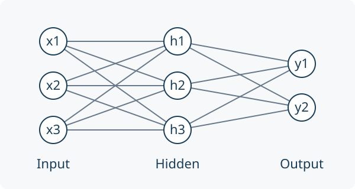

[]{#machine-learning-and-neural-networks}

## Scope of This Chapter

Learning is useful when measured examples can improve a model, an estimator or a decision rule. It does not remove the need to define the physical system and the question being asked. A network that predicts a golfer's motion, a network that proposes muscle excitations, and a network that estimates joint torques solve different problems. Success at one is not evidence of success at the others.

This chapter develops neural function approximation, manual backpropagation, reinforcement learning and learned dynamical models in one consistent scope. It connects policy optimization to the geometric mechanics of the preceding chapters and provides a reproducible regression example. The pendulum and golf discussions specify models and experiments; they do not report a trained swing controller or new measurements of human performance.

Use $q$ for configuration, $v$ for generalized velocity, $x$ for the complete modeled state, $o$ for observations and $u$ for the chosen physical input. In the learning equations, $\theta$ denotes network parameters, never the pendulum angle. A loss $\ell$ is an optimization criterion; a Lagrangian $L$ is a mechanical function. Their similar notation in the literature does not make them the same quantity.

## The Limits of Analytical Control

Rigid-body algorithms are exact evaluations of declared mathematical models up to numerical error. Real predictions also depend on identified inertias, joint definitions, contact laws, actuator dynamics, measurement errors and the appropriateness of the rigid approximation. Even a manufactured robot is not described perfectly merely because its equations are analytical. Conversely, deformable bodies can have analytical constitutive equations and numerical models. Complexity and nonlinearity alone do not force a choice between physics and learning.

For a selected smooth mechanical mode, one useful model is
$$
\begin{aligned}
\dot q&=N(q)v,\\
M(q)\dot v+c(q,v)+g(q)&=B(q)u+J(q)^T\lambda+f_{\mathrm{other}}.
\end{aligned}
$$
Here $M$ is inertia, $c$ contains velocity-dependent inertial forces, $g$ is gravity, $B$ maps inputs to generalized forces, and $J^T\lambda$ represents constraint reactions. $N$ maps generalized velocities to configuration rates; it need not be an identity for quaternion coordinates. Contact feasibility and actuator or tissue states complete the model. Adding a learned residual to these equations can be more informative than replacing every term with an unconstrained network, provided the residual is identifiable and does not duplicate forces already included.

### Prediction, Inversion and Policy Are Different Maps

A forward model predicts $\dot x=F_\theta(x,u)$ or a sampled transition $x_{k+1}=T_{\theta,h}(x_k,u_k)$ for a declared sampling interval $h$ and input hold. These maps have different units and different meanings. Fitting $x_{k+1}$ directly does not make the output an acceleration. A learned transition may also depend on the integration scheme and sampling interval used to produce its data.

An inverse model might estimate $u$ from $(q,v,\dot v_{\mathrm{desired}})$ and the contact mode. For full actuation and known external loads, a torque-level inverse can be well-defined. Underactuation, redundant muscles and unknown reactions can make an inverse nonexistent or nonunique. A least-squares torque estimate then depends on an explicitly chosen allocation or regularization criterion. A small residual is not proof that its individual muscle forces were measured correctly.

A policy instead selects an action given information and a task. Let $i_k$ contain the observation history, target and current step. A deterministic policy gives $u_k=\mu_\theta(i_k)$; a stochastic policy specifies a conditional distribution $\pi_\theta(u_k\mid i_k)$. Identical posture can require different actions when velocity, activation, target, remaining time or disturbances differ. There is no universal hidden function from posture alone to the uniquely correct motor torque.

### Why State Choice Matters for Golf

Position and velocity can be a sufficient state for a specified rigid torque-driven model. A muscle-driven swing may also require activation, fiber or tendon variables and shaft deformation. Two swings with the same visible geometry can therefore have different subsequent responses. Observations of joint angles, club motion and ground forces provide incomplete and noisy information about these states.

A partially observed Markov decision process retains a Markov latent state; the observation alone need not be Markov. An estimator, belief distribution or history-dependent network can use past observations to infer missing information. Recurrence does not guarantee recovery of an unobservable state. Sensor placement, synchronization and experimental excitation remain essential.

This distinction links preparation to impact. An earlier action can change configuration, velocity, stored elastic energy and activation before a later interval begins. A policy may exploit that retained state. Explaining its benefit requires controlled comparisons with the retained quantities declared, not a label such as "the network discovered passive dynamics." Classical optimal control can exploit the same dynamics when its model and objective include them.

## Neural Networks as Function Approximators

With column vectors, a feedforward network composes affine maps and nonlinear activations:
$$
h_0=x,\qquad z_j=W_jh_{j-1}+b_j,\qquad h_j=\sigma_j(z_j).
$$
For a real-valued regression output, the last layer may be affine: $\hat y=W_Lh_{L-1}+b_L$. If every activation is an identity, the whole network is affine, including a composed bias. The nonlinear activations create a richer function class. The weights have shapes determined by the input and output sizes of their respective layers.

{#fig-neural-network fig-alt="Three input nodes connect through nine weighted edges to three hidden nodes, which connect through six weighted edges to two output nodes. Biases are omitted."}

The network in the figure has three inputs, three hidden units and two outputs: nine input-to-hidden and six hidden-to-output weights, plus five biases. Its architecture alone specifies no task or training data. A torque policy, value function and forward-model residual can share an architecture while having entirely different input definitions, losses and validation requirements.

### Universal Approximation and Its Limits

For continuous $f:[0,1]^n\to\mathbb R$ and any $\epsilon>0$, Cybenko's theorem permits a finite-width single-hidden-layer network with a continuous sigmoidal activation such that
$$
\sup_{x\in[0,1]^n}\left|f(x)-\sum_{i=1}^{H}c_i\sigma(w_i^Tx+b_i)\right|<\epsilon.
$$
The $c_i$ are output coefficients and $b_i$ are hidden biases. Width and parameter magnitudes are not fixed in advance. This is an existence result, not an algorithm for finding the coefficients or a bound on the data needed. It does not guarantee uniform approximation of a discontinuous policy by continuous networks. ReLU networks also have universal approximation results with sufficient width; a blanket requirement for extra hidden depth is inappropriate. Depth can help represent particular compositional functions efficiently, but cannot rescue missing information in the inputs.

For an elementary constructive example, $|x|=\max(0,x)+\max(0,-x)$. Two ReLU hidden units and one linear output represent this function exactly. That identity is a statement about representation. Learning those parameters from a finite noisy dataset is a separate optimization and generalization problem.

## Activation Functions

ReLU is $\sigma(z)=\max(0,z)$, with derivative zero for $z<0$ and one for $z>0$; an implementation must choose a derivative convention at zero. A unit inactive on every training input supplies no local gradient through that branch. Whether it remains inactive depends on future inputs, upstream changes and the update rule. "Dead forever" is not a theorem for every network.

The logistic sigmoid satisfies
$$
s(z)=\frac{1}{1+e^{-z}},\qquad s'(z)=s(z)(1-s(z))\le\frac14,
$$
with equality at $z=0$. Tanh has derivative $1-\tanh^2z$, reaching one at zero and tending to zero in either tail. Both activations can saturate. GELU is $z\Phi(z)$, where $\Phi$ is the standard normal cumulative distribution; its derivative is $\Phi(z)+z\phi(z)$, with $\phi$ the corresponding density. Smoothness does not imply uniformly large or positive derivatives.

For a stack of layers, the input Jacobian contains products $D_jW_j$, where $D_j$ is the diagonal activation-derivative matrix. Thus
$$
\left\|\frac{\partial h_L}{\partial h_0}\right\|
\le\prod_{j=1}^{L}\|D_j\|\,\|W_j\|.
$$
Ten sigmoid derivative factors alone are at most $4^{-10}=9.5367\times10^{-7}$. The actual gradient also depends on weights, inputs and loss derivatives. Large weight norms can counteract that attenuation or cause explosion; multiplying ten sigmoid bounds is not a universal estimate of a first-layer parameter gradient.

## Loss Functions and What They Estimate

For $m$ scalar examples, use the half mean squared error
$$
\ell(\theta)=\frac{1}{2m}\sum_{i=1}^{m}(\hat y_i-y_i)^2.
$$
Under squared loss, the ideal unrestricted predictor is the conditional mean of the target given the input. If two hidden physiological states produce different torques at the same observed posture, averaging their labels need not yield a successful action for either state. This is a representation and information problem, not necessarily inadequate network width. Supervised labels can come from calibrated measurements, a specified inverse-dynamics procedure or simulation; a human need not supply every correct answer manually.

Huber loss with threshold $\delta>0$ is
$$
\ell_\delta(e)=
\begin{cases}
e^2/2,&|e|\le\delta,\\
\delta(|e|-\delta/2),&|e|>\delta.
\end{cases}
$$
The threshold has the same units as the residual, unless residuals have been normalized. Linear growth reduces the influence of large residuals relative to squared loss; it does not identify which observations are erroneous. A contact event, a sensor fault and a rare valid swing can all create a large residual for different reasons.

Multiple outputs require a declared metric. Squared radians, angular velocities and newtons cannot be added meaningfully without scale factors or a covariance model. Normalize using training data only and retain the transformations for deployment. Split evaluation by independent trajectories, sessions or participants as appropriate; random neighboring frames from one swing can leak almost identical states into both training and testing.

[]{#backpropagation-and-gradient-descent}

## Backpropagation: Chain Rule for Neural Networks

Consider a scalar output $\hat y=W_2h+b_2$, $h=\tanh(W_1x+b_1)$, and a single-example loss $\ell=(\hat y-y)^2/2$. Set $e=\hat y-y$. Applying the chain rule gives
$$
\begin{aligned}
\nabla_{W_2}\ell&=eh^T,&\nabla_{b_2}\ell&=e,\\
d_1&=(W_2^Te)\odot(1-h\odot h),\\
\nabla_{W_1}\ell&=d_1x^T,&\nabla_{b_1}\ell&=d_1.
\end{aligned}
$$
For a batch mean, sum the individual gradients and divide by the actual number of examples in that batch. A shorter final batch uses its own size. Compute all derivatives using the same parameter values before applying updates: changing $W_2$ before computing $d_1$ would differentiate a different network.

Backpropagation efficiently accumulates these derivatives in reverse order through a computational graph. Gradient descent, momentum and Adam are optimizers that use the derivatives to update parameters. The gradient calculation itself is not a training algorithm, a guarantee of decreasing loss or a method for choosing a physically appropriate loss.

Finite differences provide an independent check. For one parameter component $\theta_j$, compare backpropagation with
$$
\frac{\ell(\theta+\varepsilon e_j)-\ell(\theta-\varepsilon e_j)}{2\varepsilon}.
$$
Choose a step large enough to avoid cancellation and small enough to control truncation error. Check every parameter group, including biases, and avoid ReLU kinks for an ordinary smooth derivative check. Passing this test validates differentiation at the checked inputs; it does not certify generalization or control stability.

## Gradient Descent and Optimization

For a differentiable objective with gradient $g=\nabla\ell(\theta)$, the directional derivative along $-g$ is $-\|g\|^2$. A sufficiently small step decreases the same smooth objective when $g\ne0$. A fixed large step can overshoot. A mini-batch gradient is a noisy estimate, so even a reasonable stochastic step need not decrease the full-data loss on every iteration.

SGD updates $\theta_{k+1}=\theta_k-\alpha_k\hat g_k$. A momentum convention is $m_k=\beta m_{k-1}+\hat g_k$, followed by $\theta_{k+1}=\theta_k-\alpha_km_k$. Other conventions multiply the new gradient by $1-\beta$; the learning-rate interpretation changes accordingly. Momentum can reduce oscillation in some directions and accelerate progress in others, but it can also overshoot.

Adam maintains coordinatewise first and second moments:
$$
\begin{aligned}
m_k&=\beta_1m_{k-1}+(1-\beta_1)\hat g_k,\\
v_k&=\beta_2v_{k-1}+(1-\beta_2)\hat g_k\odot\hat g_k,\\
\hat m_k&=m_k/(1-\beta_1^k),\quad
\hat v_k=v_k/(1-\beta_2^k),\\
\theta_{k+1}&=\theta_k-\alpha_k\hat m_k/(\sqrt{\hat v_k}+\varepsilon).
\end{aligned}
$$
Here $m_0=v_0=0$, operations in the last line are elementwise, and $\varepsilon>0$ prevents division by zero. Moment adaptation is different from a schedule for $\alpha_k$. Neither Adam nor momentum universally converges for every nonconvex or changing reinforcement-learning objective. Learning rate, normalization, initialization and optimizer settings remain part of the experiment.

[]{#reinforcement-learning-rl}

## Markov Decision Processes

For clarity, first use a finite horizon of $T$ decisions. At step $t$, the agent observes state $s_t$, samples action $a_t$, receives reward $r_t$, and transitions to $s_{t+1}$. The distribution $P(s_{t+1},r_t\mid s_t,a_t)$ is the environment model. The reward index here names the action that generated it; some texts use $r_{t+1}$ for the same event.

The Markov property means this conditional distribution does not additionally depend on earlier history when $s_t$ is complete. Include time in the state or use time-indexed policies when the task has a deadline. A terminal state is part of the task definition, not just an accidental interruption of data collection.

### Return and Value

Define $G_t=\sum_{k=t}^{T-1}\gamma^{k-t}r_k$ and $J(\theta)=\mathbb E_{\pi_\theta}[G_0]$, with $0\le\gamma\le1$. Rewards must have finite expectations. For an infinite discounted task, bounded rewards and $\gamma<1$ give a finite return; $\gamma=1$ requires additional termination or summability conditions. Continuing average-reward control is a different formulation and needs its own assumptions.

Under a specified policy $\pi$, define
$$
V_t^\pi(s)=\mathbb E[G_t\mid s_t=s],\qquad
Q_t^\pi(s,a)=\mathbb E[G_t\mid s_t=s,a_t=a].
$$
The advantage $A_t^\pi(s,a)=Q_t^\pi(s,a)-V_t^\pi(s)$ compares an action with the policy's conditional average, not necessarily with doing nothing. Since $\mathbb E_{a\sim\pi}[A_t^\pi(s,a)]=0$, it expresses relative merit under the chosen reward, horizon and future policy.

### Policy Evaluation Versus Optimality

With $V_T^\pi=0$, conditioning on the next transition gives
$$
V_t^\pi(s)=\sum_a\pi_t(a\mid s)
\mathbb E[r_t+\gamma V_{t+1}^\pi(s_{t+1})\mid s,a].
$$
This Bellman equation evaluates the fixed policy. It does not optimize that policy. For finite action sets, the optimal recursion replaces the average with a maximum:
$$
V_t^*(s)=\max_a\mathbb E[r_t+\gamma V_{t+1}^*(s_{t+1})\mid s,a].
$$
Continuous spaces require integrals, and a supremum replaces the maximum unless an optimizer exists. Policy iteration alternates evaluation and improvement; value iteration applies an optimality operator. Approximate neural versions do not inherit every convergence property of finite tabular algorithms.

For a one-decision example, actions return 0 and 2. The policy choosing each equally has value 1; the optimal value is 2. Solving the evaluation equation more accurately cannot improve the equal-choice policy. This simple distinction prevents a common misunderstanding when interpreting a learned critic.

## Policy Gradient Methods

Let $\zeta=(s_0,a_0,r_0,\ldots,s_T)$ be a trajectory. Assume the initial-state and environment distributions are independent of $\theta$, the policy has differentiable positive likelihood on the sampled support, and differentiation can pass through the expectation. Its likelihood factors as
$$
p_\theta(\zeta)=p_0(s_0)\prod_{t=0}^{T-1}
\pi_\theta(a_t\mid s_t)P(s_{t+1},r_t\mid s_t,a_t).
$$
The log derivative is a sum of policy scores. Therefore
$$
\nabla_\theta J=
\mathbb E\left[G_0\sum_{t=0}^{T-1}\nabla_\theta\log\pi_\theta(a_t\mid s_t)\right].
$$
Past rewards have zero expected product with a later score, because the score has conditional mean zero before the action is sampled. Removing those terms yields the return-to-go form
$$
\nabla_\theta J=
\mathbb E\left[\sum_{t=0}^{T-1}\gamma^t
\nabla_\theta\log\pi_\theta(a_t\mid s_t)G_t\right].
$$
This derivation accounts for the effect of actions on subsequent state visitation through the trajectory likelihood. It does not simply hold a policy-dependent state distribution constant. If the initial distribution, environment or reward depends directly on $\theta$, additional derivative terms are needed. The explicit $\gamma^t$ belongs to the stated start-state objective; uniform time-step averages used in practical implementations can correspond to a different weighting convention.

### Baselines and REINFORCE

For an action-independent baseline $b_t(s_t)$,
$$
\mathbb E_{a_t\sim\pi_\theta}
[b_t(s_t)\nabla_\theta\log\pi_\theta(a_t\mid s_t)]
=b_t(s_t)\nabla_\theta\int\pi_\theta(a\mid s_t)\,da=0.
$$
Thus $G_t-b_t(s_t)$ can replace $G_t$ without changing the expected score estimator under these assumptions. Treat the baseline and sampled returns as constants in the actor loss; differentiating through a learned baseline adds unwanted terms. A baseline fitted using the same action's outcome can also introduce finite-sample dependence unless the estimator is designed appropriately.

REINFORCE samples complete returns to estimate the score-weighted update. A useful baseline can reduce variance, but an arbitrary baseline can increase it. The variance-minimizing scalar baseline generally weights returns by score magnitude; it is not always exactly $V^\pi$. Reward scale, horizon, rare successes and stochastic transitions affect estimator variance.

## Actor-Critic Architecture

An actor represents the policy and a critic estimates value. For a transition that genuinely terminates the task, let $d_t=1$; otherwise $d_t=0$. A one-step target and temporal-difference residual are
$$
y_t=r_t+\gamma(1-d_t)V_\phi(s_{t+1}),\qquad
\delta_t=y_t-V_\phi(s_t).
$$
The usual semi-gradient critic step minimizes $(V_\phi(s_t)-\operatorname{stopgrad}(y_t))^2/2$. An actor loss uses a detached advantage estimate, for example $-\log\pi_\theta(a_t\mid s_t)\operatorname{stopgrad}(\delta_t)$ with the objective's appropriate weighting. A low critic training loss is not a proof that $\delta_t$ estimates the true advantage accurately on all visited states.

An artificial rollout cutoff differs from task termination. If the underlying task continues, bootstrap from the final observed state; do not use a reset observation as that state. If a deadline defines the task itself, include remaining time and use zero continuation at its terminal boundary. This choice can materially change a swing policy trained around an impact deadline.

### Multi-Step Returns and Bias-Variance Tradeoffs

Before a terminal boundary, an $n$-step target is
$$
G_t^{(n)}=\sum_{j=0}^{n-1}\gamma^jr_{t+j}
+\gamma^nV_\phi(s_{t+n}).
$$
Stop the sum at termination and omit continuation there. A longer return typically relies less on an imperfect bootstrap and uses more sampled rewards, often reducing bootstrap bias while increasing variance. These are tendencies, not universal monotonic laws: reward correlations, critic errors and environment noise matter. With an exact critic under the same policy, the shorter target need not have bootstrap bias.

Generalized advantage estimation forms a truncated weighted sum of TD residuals, $\hat A_t=\sum_{j=0}^{K-1}(\gamma\lambda)^j\delta_{t+j}$, with boundary masks and final bootstrap handled consistently. $\lambda$ changes the mixture of multi-step estimates. Neither this estimator nor nonlinear actor-critic training guarantees convergence without further assumptions.

## Proximal Policy Optimization

PPO gathers data under a frozen old policy and optimizes a surrogate using those data. Define the likelihood ratio $\rho_t(\theta)=\pi_\theta(a_t\mid s_t)/\pi_{\mathrm{old}}(a_t\mid s_t)$, keeping the stored old likelihood and advantage fixed during the update. Its clipped sample objective is
$$
L_t^{\mathrm{clip}}=\min\left(
\rho_t\hat A_t,
\operatorname{clip}(\rho_t,1-\epsilon,1+\epsilon)\hat A_t\right).
$$
For positive advantage this is $\hat A_t\min(\rho_t,1+\epsilon)$; for negative advantage it is $\hat A_t\max(\rho_t,1-\epsilon)$. The first branch stops rewarding a sufficiently large increase in the sampled action's likelihood. The second stops rewarding a sufficiently large decrease. Harmful changes in the opposite direction are still penalized.

With $\epsilon=0.2$ and $\hat A=2$, ratios 1.2 and 2 both give 2.4. With $\hat A=-2$, ratios 0.8 and 0.1 both give $-1.6$. These plateaus do not forbid those ratios. Shared parameters, other samples and optimizer steps can move probabilities outside the interval. The clipped quantity is no greater than the corresponding unclipped sampled surrogate, but is not a lower-bound certificate for true future performance. Clipping does not enforce a hard ratio or KL-divergence constraint or guarantee that a policy cannot collapse.

An actor-critic implementation can maximize the average clipped objective minus $c_V$ times a value-error loss plus $c_H$ times an entropy bonus. Equivalently, minimize its negative. Define signs and coefficients explicitly. Monitor actual likelihood ratios, KL estimates, entropy, critic errors and independent rollout performance; a plateau in the surrogate is not sufficient evaluation.

### Stochastic Bounded Actions

A deterministic tanh network alone does not provide PPO's sampling likelihood. One possible continuous policy draws $z\sim\mathcal N(\mu_\theta(s),\operatorname{diag}(\sigma_\theta(s)^2))$ with positive standard deviations and maps $a_i=a_{\max,i}\tanh z_i$. Inside the bounds, change of variables gives
$$
\log\pi_\theta(a\mid s)=\log p_\theta(z\mid s)
-\sum_i\log\left[a_{\max,i}(1-\tanh^2z_i)\right].
$$
The action scales are positive and fixed here. Use numerically stable log-Jacobian evaluation near saturation. For old and new policies with the same transform and the same stored action, the common Jacobian cancels in their ratio; it still matters for the actual action density and entropy. Sampling an unbounded Gaussian and clipping afterward produces a different distribution, with probability mass at the boundaries, and cannot silently use this tanh density.

Collect new rollouts after a bounded number of optimization epochs and freeze a new old policy for the next update. Excessive reuse of the old data, changed normalization statistics or inconsistent likelihood calculations can invalidate the intended comparison. PPO is an algorithmic design, not a guarantee that these implementation details are automatically correct.

## Value-Based Methods and Continuous Actions


Tabular Q-learning uses the sampled optimality target:
$$
Q(s_t,a_t)\leftarrow Q(s_t,a_t)+\alpha
\left[r_t+\gamma(1-d_t)\max_{a'}Q(s_{t+1},a')-Q(s_t,a_t)\right].
$$
Its standard discounted finite-MDP convergence results require suitable learning-rate schedules and repeated exploration of the relevant state-action pairs. Replacing the table with a neural network changes the problem substantially.


DQN fits a network to targets from a separate target network:
$$
\ell_Q=\mathbb E_{(s,a,r,s',d)\sim\mathcal D}
\left[\left(Q_\theta(s,a)-
\operatorname{stopgrad}[r+\gamma(1-d)\max_{a'}Q_{\mathrm{target}}(s',a')]\right)^2\right].
$$
Replay changes how stored experience is reused and can reduce correlations within training batches. A delayed target slows movement of the bootstrap. Neither device eliminates all statistical dependence, approximation error or instability. Exploration still determines what information enters the buffer.


For continuous actions, maximizing a general nonlinear $Q$ can be an expensive nonconvex optimization at every state. It is not categorically impossible; special quadratic or concave forms can be tractable. DDPG uses a deterministic actor $\mu_\theta$ and a learned critic. A practical actor update follows
$$
\hat g=\mathbb E_{s\sim\mathcal D}
\left[(D_\theta\mu_\theta(s))^T
\nabla_aQ_\phi(s,a)\big|_{a=\mu_\theta(s)}\right].
$$
This is a gradient through a learned critic over replay states, not an exact global argmax or automatically an unbiased start-state performance gradient. The deterministic policy-gradient theorem uses a specified state-visitation weighting and true or suitably compatible action values. Exploration must be supplied during data collection because a deterministic actor itself does not sample alternatives.


TD3 addresses particular actor-critic estimation errors using two critics with a minimum target, delayed actor updates and target-policy smoothing. Taking a minimum can also create underestimation. SAC uses an entropy-regularized objective, schematically
$$
J_{\mathrm{soft}}=\mathbb E\sum_t\gamma^t
\left[r_t+\alpha_{\mathrm{ent}}\mathcal H(\pi(\cdot\mid s_t))\right].
$$
The entropy coefficient changes the tradeoff being optimized. In continuous action coordinates this is differential entropy, which depends on action scaling and can be negative. These methods differ in policy class, objective and data reuse; there is no universal ranking of their stability or sample efficiency for every swing model.

## Exploration Strategies


In a finite action set, epsilon-greedy exploration chooses a random action with probability $\epsilon$ and otherwise a greedy action. A uniform distribution over an unbounded continuous action space does not exist; continuous exploration requires a defined distribution and admissible bounds. For a finite action set, entropy is
$$
\mathcal H(\pi(\cdot\mid s))=-\sum_a\pi(a\mid s)\log\pi(a\mid s),
$$
with $0\log0=0$ by continuity. Entropy regularization encourages spread according to its chosen density and coordinates, but broad action noise alone does not ensure useful coverage of long-horizon states.


A curiosity bonus can depend on forward-prediction error,
$$
r_t^{\mathrm{int}}=\eta\|\hat T_\theta(s_t,a_t)-s_{t+1}\|_W^2.
$$
The weighting $W$ declares the state metric. Large error can indicate a new learnable transition, sensor noise, stochasticity or a deficient model class. Rewarding all such error can repeatedly attract an agent to irreducible noise. Adding the bonus also changes the optimization objective unless its role and limiting behavior are specified.

For golf, define an exploratory simulation task before assigning human significance to its discoveries. A policy that gains club speed by exploiting unphysical contact penetration or unlimited torque has found a weakness in the model or reward, not a coaching principle.

## Worked Example: Pendulum Swing-Up Objective

Use a point mass $m$ on a massless rod of length $l$, a fixed pivot, viscous rotational damping $b\ge0$, and torque $u$. The angle $q=0$ points downward and $q=\pi$ upward. With $I=ml^2$,
$$
I\ddot q=u-b\dot q-mgl\sin q,\qquad |u|\le u_{\max}.
$$
The model's mechanical energy above hanging and its rate are
$$
E=\tfrac12 I\dot q^2+mgl(1-\cos q),\qquad
\dot E=u\dot q-b\dot q^2.
$$
These formulas make signs and input power checkable. A sample implementation must also declare its integration method, step size, torque hold and terminal conditions. A physical pendulum with distributed rod mass would have a different inertia and center-of-mass gravity coefficient.

Let $e_q=\operatorname{atan2}(\sin(q-\pi),\cos(q-\pi))$. One dimensionless upright reward is
$$
r(q,\dot q,u)=-\left[e_q^2+
w_v(\dot q/\omega_*)^2+w_u(u/u_{\max})^2\right],
$$
where angular measure is in radians, $\omega_*>0$ is a declared speed scale, and $w_v,w_u\ge0$ are dimensionless weights. The wrapped error is discontinuous in sign at the opposite orientation, though its square is continuous there; its derivative has a cusp. The smooth periodic alternative $1+\cos q$ also has its minimum at upright. In either case, the objective must be examined at both equilibria before training.

For illustrative $m=l=1$, $g=9.81$, $b=0$, $u_{\max}=2$, $\omega_*=1$, $w_v=0.1$, and $w_u=0.01$, upright at rest with zero torque gives reward 0, while hanging gives $-\pi^2$. Replacing $e_q$ with the raw downward angle would reverse the intended preference. At $q=\pi/2$, $\dot q=1$ and $u=2$, acceleration is $-7.81$ rad/s$^2$ and input power is 2 W. The energy difference between the two resting equilibria is 19.62 J.

An action-squared penalty is an effort regularizer, not mechanical work. Work is $\int u\dot q\,dt$; it can be positive or negative, whereas $u^2$ cannot. Metabolic expenditure requires an additional physiological model. A torque-free interval may retain kinetic energy from earlier actuation; low instantaneous effort does not show that preparation was free.

For a reproducible training experiment, specify an initial-state distribution, sampling interval, finite horizon, policy distribution, optimizer settings and random seeds. Compare against a declared baseline controller and evaluate unseen initial states and parameter perturbations. Report success criteria such as dwell time near upright, speed tolerance, torque feasibility and energy balance in addition to return. No PPO training run is reported here, so no learned swing-up trajectory or success rate is claimed.

## Physics-Informed Neural Networks

A neural network can approximate a solution while a loss penalizes a specified differential-equation residual. For example, a nondimensional viscous Burgers problem is
$$
\begin{aligned}
w_t+ww_\xi-\nu w_{\xi\xi}&=0,
&\xi\in[-1,1],\quad t\in[0,1],\\
w(0,\xi)&=-\sin(\pi\xi),&
w(t,-1)=w(t,1)&=0,
\end{aligned}
$$
with $\nu=0.01/\pi$ in the cited example. We use $w$ rather than control input $u$ to avoid a notation collision. Given an approximation $w_\theta(t,\xi)$, its residual is $R_\theta=w_{\theta,t}+w_\theta w_{\theta,\xi}-\nu w_{\theta,\xi\xi}$. A training loss combines initial/boundary data errors and squared residuals at collocation points. The nonlinear transport sign and viscosity term must agree with the stated PDE.

This is different from fitting an unknown vector field directly to derivative labels. For $\dot x=F_\theta(x,u)$, minimizing $\sum_i\|F_\theta(x_i,u_i)-\dot x_i\|_W^2$ is derivative regression. It becomes physics-informed only through additional known equations, restrictions or priors. Noisy numerical differentiation can bias those labels, and a full-state derivative includes configuration rates as well as accelerations.

For the known forced pendulum, an appropriate trajectory residual is $I\ddot q_\theta+b\dot q_\theta+mgl\sin q_\theta-u(t)$. Observations and initial conditions constrain the solution as well. A small residual at finitely many points does not establish a global solution error bound, unique parameters or valid behavior at impacts. Enforcing an incorrect conservative equation on a driven dissipative swing can produce a physically misleading fit despite an apparently principled loss.

## Neural ODEs and the Adjoint Method

A Neural ODE parameterizes a continuous vector field $\dot h=f_\theta(h,t)$ and computes states with an ODE solver. The state can be physical or latent; a latent dimension does not automatically correspond to measured joint coordinates. A policy evaluated at discrete observations is not a Neural ODE merely because it controls a continuous mechanical system.

For a terminal loss $\ell=\Psi(h(T),\theta)$ with fixed endpoints, define a column adjoint $a(t)$ by
$$
\dot a=-(D_hf_\theta)^Ta,\qquad
a(T)=\nabla_h\Psi(h(T),\theta).
$$
Differentiating $a^T\delta h$ gives the parameter contribution after the state-variation terms cancel. The result is
$$
\nabla_\theta\ell=\partial_\theta\Psi
+(D_\theta h(0))^Ta(0)
+\int_0^T(D_\theta f_\theta)^Ta\,dt.
$$
If the initial state is parameter-independent and the terminal loss has no direct parameter dependence, only the integral remains. Writing it as $-\int_T^0$ is equivalent; that reversed-limit notation is not itself a sign error. Running costs add source terms to the adjoint and parameter integral, while losses at intermediate observation times introduce adjoint jumps. Contact events need their own event and reset sensitivities.

These equations differentiate the continuous initial-value problem. Differentiating a particular numerical solver produces the derivative of its discrete computation; the two agree only to the relevant numerical accuracy. Backward reconstruction of a forward-dissipative state can be unstable. Checkpointing and solver tolerances affect memory use, accuracy and cost, so a universal constant-memory exact-gradient claim is unwarranted.

As a direct check, let $\dot h=\theta h$, $h(0)=1$, $T=1$ and $\Psi=h(T)^2/2$. Then $h(T)=e^\theta$ and $d\ell/d\theta=e^{2\theta}$. The adjoint integral gives the same value. This verifies the sign convention on a solvable example, not the accuracy of every adaptive-solver implementation.

## Structure-Preserving Neural Networks


### Hamiltonian Models


An autonomous Hamiltonian neural network learns a scalar $H_\theta(q,p)$ in canonical coordinates and defines
$$
\dot q=\nabla_pH_\theta,\qquad \dot p=-\nabla_qH_\theta.
$$
Along a smooth exact solution, $dH_\theta/dt=0$ because the two cross-products cancel. The conserved quantity is the learned Hamiltonian; data and physical calibration must establish whether it equals the real energy. Canonical momentum is not generally equal to velocity. A numerical integrator need not conserve $H_\theta$ exactly or preserve the symplectic form merely because its vector field is Hamiltonian.

For an explicit force $f_p$ added to $\dot p$, the balance becomes $\dot H_\theta=\nabla_pH_\theta^Tf_p$, plus $\partial_tH_\theta$ when time dependence is present. Dissipation and actuation therefore call for power balances, not a claim that an actively driven golf swing conserves total mechanical energy.

### General Lagrangian Models


For a learned smooth $L_\theta(q,v)$ with $v=\dot q$, the forced Euler--Lagrange equation is
$$
\frac{d}{dt}\nabla_vL_\theta-\nabla_qL_\theta=\tau.
$$
Let $H_{vv}=D_v(\nabla_vL_\theta)$ and $H_{vq}=D_q(\nabla_vL_\theta)$. If $H_{vv}$ is invertible,
$$
\dot v=H_{vv}^{-1}\left[\tau+\nabla_qL_\theta-H_{vq}v\right].
$$
A generic Lagrangian's velocity Hessian can depend on both $q$ and $v$ and can be indefinite or singular. It is not automatically a positive-definite mass matrix depending only on configuration. A pseudoinverse may produce a numerical vector, but does not establish that a singular system has unique physically consistent dynamics. Time-dependent Lagrangians require an additional $\partial_t\nabla_vL$ term.

For an autonomous regular model, the energy function is $E_L=v^T\nabla_vL-L$, and the forced balance is $\dot E_L=v^T\tau$. Lagrangian gauge freedoms also mean that fitting trajectories need not identify one unique scalar Lagrangian. Do not interpret every learned coefficient as a measured anatomical parameter.

### Natural Mechanical Models and DeLaN


A more restricted construction sets
$$
M_\theta(q)=R_\theta(q)R_\theta(q)^T+\varepsilon I,
\qquad L_\theta=\tfrac12v^TM_\theta(q)v-U_\theta(q),
$$
where $R_\theta$ is lower triangular and $\varepsilon>0$ is defined in appropriately scaled inertia units. This guarantees a positive-definite inertia matrix. Deriving both inertial bias and gravity from this same $L_\theta$ gives a coherent natural mechanical model. It does not guarantee identified parameters or accurate contact forces outside the training regime.

The original DeLaN paper parameterizes a triangular inertia factor and a separate gravity-force network. Learning a scalar potential and taking its gradient, as in the construction above, adds an integrability restriction; it should not be attributed to every original DeLaN implementation. A separately learned force vector is not automatically conservative. Likewise, an independently learned Coriolis matrix must not be assumed consistent with a learned mass matrix without verification.

Friction, muscle activation, tendon storage, contact and input limits require explicit representation beyond the conservative component. For the swing, a useful learned model should expose which quantities exchange power, which dissipate energy and which retain history. Structural priors can reduce certain impossible predictions while still encoding the wrong physiological mechanism.

## Sim-to-Real Transfer and System Identification

A known analytical model or a learned forward model can support model-based planning. Model-free learning does not explicitly require that forward model in its policy/value update, but can still use physical representations, simulation, constrained actions and engineered rewards. Neither category is universally more data-efficient. Model errors, exploration cost and the precision required near impact determine the relevant tradeoffs.

Domain randomization trains over a specified distribution of plausible parameters, delays, sensor errors and disturbances. The distribution is part of the model. Mass and inertia should vary consistently, and correlated subject parameters should not be replaced automatically by independent uniform noise. Terrestrial gravity is usually much better known than muscle strength or sensor bias; arbitrary gravity variation is not a default model of differences among golfers.

Evaluate on withheld parameter combinations and, when claiming transfer, on appropriately governed physical observations. Training on diverse simulations does not substitute for real validation. Report failures and uncertainty rather than only mean reward. A policy may be robust to the sampled uncertainties and fragile to an omitted contact or actuator mechanism.

### What Can the Data Identify?

For an unforced ideal point-mass pendulum,
$$
\ddot q=-\kappa\sin q,\qquad \kappa=g/l.
$$
Any pair $(cg,cl)$ with $c>0$ gives the same angle dynamics. Angle-only free-motion data therefore cannot identify $g$ and $l$ separately. At an exact resting equilibrium they may provide no information even about $\kappa$. A network cannot remove this structural ambiguity by having more parameters.

An independent length measurement, known gravity or a calibrated forced experiment can add information. With measured torque, acceleration depends on both $1/(ml^2)$ and $g/l$; which individual parameters become identifiable still depends on what else is known and whether the input sufficiently excites the system. In a golfer, redundant muscle forces and unknown external loads create analogous ambiguities. Design the measurement and intervention before giving a fitted parameter a mechanistic interpretation.

[]{#worked-example-forward-pass-in-python}

## Python Worked Example: Backpropagation From Scratch

The accompanying example fits the scalar function $y=x^2$ on $[-1,1]$ using a tanh hidden layer and a linear output. Its implementation is shared between the print and web lessons in the repository module `src.tools.learning_examples`. This is supervised regression, not reinforcement learning, inverse dynamics or a pendulum controller.

The implementation uses row samples, so $X$ has shape $(m,1)$, the input weights have shape $(1,H)$, hidden activations have shape $(m,H)$ and output weights have shape $(H,1)$. These are the transposed storage conventions of the earlier column-vector derivation. The actual gradient core is reproduced below; training and validation use that same source.

```python
prediction = predict(network, features)
hidden = np.tanh(features @ network.input_weights + network.hidden_bias)
error = prediction - targets
output_derivative = error / features.shape[0]
hidden_derivative = (output_derivative @ network.output_weights.T) * (1 - hidden**2)
gradient = Network(
    features.T @ hidden_derivative,
    hidden_derivative.sum(axis=0, keepdims=True),
    hidden.T @ output_derivative,
    output_derivative.sum(axis=0, keepdims=True),
)
loss = float(np.mean(error**2) / 2)
```

Mini-batches are shuffled with an explicit random generator. Every nonempty slice is processed, including a partial final batch or one batch larger than the whole dataset. After all updates, the reported epoch loss is recomputed on the full dataset at the final parameters. Averaging batch losses computed at changing parameter values would answer a different question, and dividing by the number of full batches would misweight a remainder or divide by zero for an oversized batch.

```python
from src.tools.learning_examples import regression_demo

result = regression_demo()
print(result)  # Interactive lesson output; the library performs no printing.
```

The declared example uses seed 2026, 12 hidden units, 41 equally spaced training inputs, batch size 16, learning rate 0.05 and 1,200 epochs. It evaluates additional interval midpoints never used as training inputs. The numerical report is:

Initial half MSE: $0.158078703$; final training half MSE: $0.001261210$; unseen-midpoint half MSE: $0.001021767$.

Tests compare manual gradients with centered finite differences for every weight and bias, check partial and oversized batches against the actual final full-data loss, and verify deterministic reproduction. Midpoint accuracy tests interpolation within this example's interval. It is not evidence for extrapolation to arbitrary inputs, a simulation throughput claim, or successful control of a physical system.

## Deep Reinforcement Learning for Robot and Golf Control

The technical chain begins with the task: desired impact position and time, clubhead velocity and orientation, balance or contact requirements, and allowable actuator and tissue loads. Those quantities determine what the policy must know and what its reward should value. A scalar reward is a modeling choice, not an automatic expression of "good golf." Distinct combinations of speed, accuracy, repeatability and loading can produce different preferred actions.

### State Representation and Action Parameterization

Use consistent frames, units and phase conventions. A representation containing pelvis orientation, joint configuration, generalized velocity, club state and target information still may omit activation, shaft vibration or contact history. Test the consequences of these omissions. A periodic angle representation such as $(\sin q,\cos q)$ avoids a raw wrap discontinuity but does not uniquely represent every three-dimensional orientation; rotation encodings need their own constraints and continuity analysis.

Direct joint torque, muscle excitation and desired joint position are different action ports. A desired position normally passes through a feedback controller, so its force response depends on gains and current state. Muscle excitation passes through activation and contraction dynamics. Document these layers and their limits before comparing policies. A low excitation at impact can coexist with retained activation or tendon force, and a bounded position command need not imply a bounded joint torque.

When comparing actions from the same frozen state in a torque-affine mechanical model, instantaneous acceleration increments can add linearly. Policies applied over time change the state, feedback and contact mode, so their full trajectories need not add. Learned strategies should respect this distinction rather than treating trajectory interaction as evidence against force addition.

### Reward Shaping and Evidence

Adding speed bonuses, torque penalties or trajectory-tracking terms can change the optimal task. Potential-based shaping has a special telescoping structure: with $r'_t=r_t+\gamma\Phi(s_{t+1})-\Phi(s_t)$,
$$
G'_0=G_0-\Phi(s_0)+\gamma^T\Phi(s_T).
$$
For a fixed initial distribution and an action-independent terminal term, such as zero potential at every terminal state, the added terms do not change policy ranking. In an infinite discounted task a bounded potential makes the terminal term vanish. Arbitrary penalties do not share this property. A finite-horizon impact bonus or a nonzero terminal potential must be checked explicitly.

A large penalty for exceeding a limit is not a guarantee that the limit is never exceeded. Hard constraints, feasibility checks and validated safety mechanisms have separate roles. A reported simulation experiment should name its numerical tolerances, failure conditions, episode resets and contact handling. If an outcome depends on a very narrow impact timing interval, small integration or observation delays can alter the apparent strategy.

To explain a learned swing, compare matched models and controlled interventions: retain the initial state, define the altered input port, preserve unrelated parameters and measure the specified downstream outcome. Assess whether the explanation survives plausible modeling errors and withheld observations. A zero-torque counterfactual removes the declared torque channel; it does not erase prior work, stored energy, gravity or other active channels. Sensitivity analysis can reveal interactions, while identifiability analysis tells us which of those interactions the available measurements can distinguish.

## Chapter Summary and Further Reading

Function approximation supplies a flexible representation; differentiation supplies parameter sensitivities; optimization uses those sensitivities to change a stated objective. Reinforcement learning adds the consequences of decisions over time. Learned mechanics adds structural assumptions about how states evolve. Each layer can be mathematically correct while the overall physical explanation remains unsupported because the state, input, objective or evidence is wrong.

The preceding geometry and recursive-dynamics chapters provide coordinate maps and consistent mechanics. This chapter adds tools for fitting uncertain components and optimizing policies. Their connection is especially useful in golf because earlier actions change the conditions under which later actions operate. Technical rigor comes from making those dependencies testable, not from assigning a universal sequence or physiological interpretation to a network's behavior.

The references below identify methods and assumptions, not empirical validation of a human golf policy. Cybenko's Theorem 2 supports the bounded approximation statement. Goodfellow, Bengio and Courville's chapters on feedforward networks and optimization distinguish gradient computation from training. Sutton and colleagues' policy-gradient paper explains the state-visitation weighting and compatible-critic conditions. The PPO paper's clipped surrogate and actor-critic algorithm motivate the update described here; they do not prove hard clipping or safety.

[Cybenko (1989), Theorem 2](https://papers.baulab.info/papers/Cybenko-1989.pdf) [@cybenko1989review]. Uniform approximation on the unit cube; no training guarantee.

[Goodfellow, Bengio and Courville (2016), Chapters 6 and 8](https://www.deeplearningbook.org/contents/mlp.html) [@goodfellow2016]. Feedforward models, loss functions, backpropagation and optimization; see the book navigation for Chapter 8.

[Sutton and Colleagues (1999), Policy Gradients](https://proceedings.neurips.cc/paper/1999/hash/464d828b85b0bed98e80ade0a5c43b0f-Abstract.html) [@sutton1999review]. State-visitation weighting and compatible function approximation; not a blanket deep actor-critic convergence theorem.

[Schulman and Colleagues (2017), PPO](https://arxiv.org/abs/1707.06347) [@schulman2017]. Sections 3 and 5 define the clipped surrogate and rollout/update procedure.

[Mnih and Colleagues (2015), DQN](https://www.nature.com/articles/nature14236). Replay and target-network method; its game benchmarks are not golf evidence.

[Silver and Colleagues (2014), Deterministic Policy Gradients](https://proceedings.mlr.press/v32/silver14.html). The deterministic policy-gradient framework and exploration distinction.

[Lillicrap and Colleagues, Continuous Control](https://arxiv.org/abs/1509.02971). The DDPG actor, critic, replay and target-network implementation.

[Fujimoto, Van Hoof and Meger (2018), TD3](https://proceedings.mlr.press/v80/fujimoto18a.html). Twin critics, delayed updates and target-policy smoothing; Algorithm 1.

[Haarnoja and Colleagues (2018), SAC](https://proceedings.mlr.press/v80/haarnoja18b.html). Entropy-regularized objective and approximate soft actor-critic; theoretical assumptions differ from practical approximation.

[Raissi, Perdikaris and Karniadakis, PINNs](https://maziarraissi.github.io/PINNs/) [@raissi2019review]. The authors' specified Burgers problem and collocation residual; no general solution-error certificate.

[Chen and Colleagues (2018), Neural ODEs](https://arxiv.org/abs/1806.07366) [@chen2018review]. Section 2, numerical considerations and Appendix B explain adjoint calculation and its numerical limits.

[Greydanus, Dzamba and Yosinski (2019), HNNs](https://arxiv.org/abs/1906.01563) [@greydanus2019hamiltonian]. Section 2 constructs a learned conserved quantity in canonical coordinates.

[Cranmer and Colleagues (2020), LNNs](https://arxiv.org/abs/2003.04630) [@cranmer2020lagrangian]. Euler--Lagrange derivative construction and its distinction from a natural mechanical model.

[Lutter, Ritter and Peters (2019), DeLaN](https://www.ias.informatik.tu-darmstadt.de/uploads/Team/MichaelLutter/lutter_iclr_2019.pdf) [@lutter2019review]. Sections 3--4 parameterize inertia and a separate gravity force; distinguish a scalar-potential variant.

## Exercises


1. **Representation:** Construct $|x|$ from two ReLU units. Then explain why continuous networks cannot uniformly approximate a jump of nonzero height to arbitrarily small error on a domain containing the jump.
1. **Backpropagation:** Derive all four parameter gradients for the tanh network. Compare them with centered finite differences at three nonzero inputs. State the loss normalization and array shapes.
1. **Activation Functions:** Plot sigmoid, tanh, ReLU and GELU and their derivatives. Identify saturation regions and nondifferentiability. Discuss advantages and disadvantages for a specified regression problem without asserting one activation is universally best.
1. **Gradient Bounds:** Derive the product-of-Jacobians bound for ten sigmoid layers. Evaluate the bound when every weight norm is one and when every weight norm is eight. Explain why neither is a measured parameter gradient.
1. **Pendulum Task:** Specify an MDP with the downward angle convention, torque bounds, input hold, integrator, observation, horizon and upright reward. Check reward and energy at both resting equilibria and at the numerical state in the text.
1. **Evaluation and Improvement:** In a 5-by-5 grid, movements are deterministic; attempted off-grid moves leave the state unchanged. The upper-right cell is absorbing with zero future reward; every preceding action earns $-1$, including the action entering the goal. Use $\gamma=0.9$. Compare uniform-random policy evaluation with optimal value iteration from all-zero initial values.
1. **Policy Gradient:** Derive the finite-horizon score estimator for the stated discounted start-state objective. Show explicitly where the $\gamma^t$ factor and the cancellation of past rewards enter.
1. **Bootstrap Boundaries:** For rewards $(1,2,3)$, $\gamma=0.9$, critic values $V(s_1)=4$, $V(s_2)=5$, and true termination at $s_3$, compute the one-, two- and three-step targets from $s_0$. Explain what repeated trajectories would be needed to compare their variance.
1. **Actor-Critic:** Write pseudocode that keeps bootstrap targets and actor advantages detached. Distinguish a genuine terminal transition from a truncated continuing rollout and specify the final observation used for bootstrapping.
1. **PPO:** Plot the clipped sample objective for $\epsilon=0.2$ and advantages $2$ and $-2$. Give ratios outside the interval that lie on its plateaus. Explain why the plot does not establish a hard probability bound or prevent policy collapse.
1. **Physics Residual:** Write a trajectory-fitting loss for the forced damped pendulum with known input and initial conditions. Give a residual that would be incorrect if actuation or damping were omitted. Propose held-out residual checks.
1. **Domain Randomization:** Define a physically consistent uncertainty distribution for the pendulum's mass, length, torque calibration and observation delay. Explain how inertia changes with mass and length, and separate training draws from held-out evaluation cases.
1. **Identification:** Show that scaling both $g$ and $l$ by the same positive factor leaves free angle trajectories unchanged. Identify an additional measurement or calibrated experiment and explain which ambiguity it removes.
1. **Adjoint and Conservation:** Verify the scalar Neural ODE derivative in the text analytically and with finite differences. Separately show that explicit Euler applied to $H=(q^2+p^2)/2$ multiplies $H$ by $1+h^2$ per step, despite the exact Hamiltonian flow conserving it.
1. **Reproducible Learning:** Run the shared regression example with batch sizes that divide the dataset, leave a remainder and exceed its size. Then design, but do not claim to have executed, a multi-seed PPO pendulum comparison with explicit success and failure criteria.
1. **Golf Interpretation:** A simulated policy uses less commanded torque near impact after a stronger early action. List the retained states and power flows needed to interpret that result. Design a matched counterfactual and identify which conclusions would still require independent human measurements.
