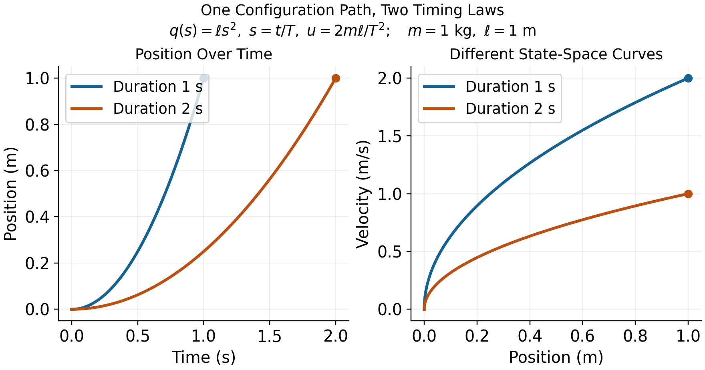
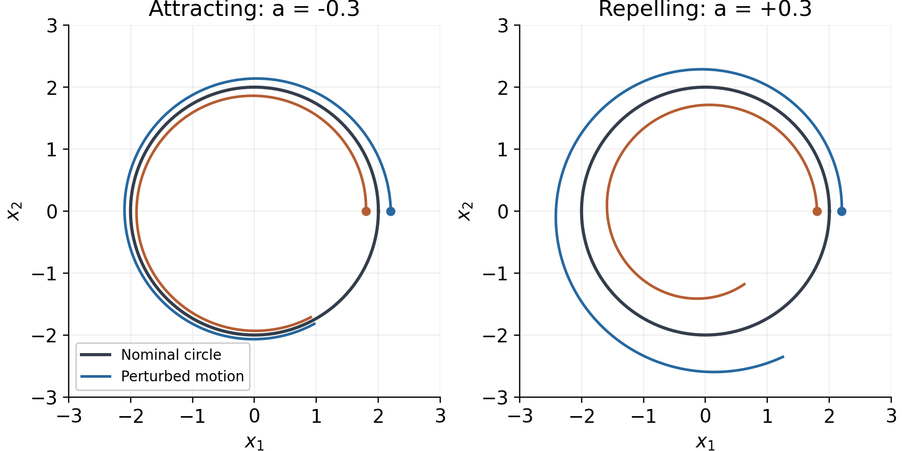
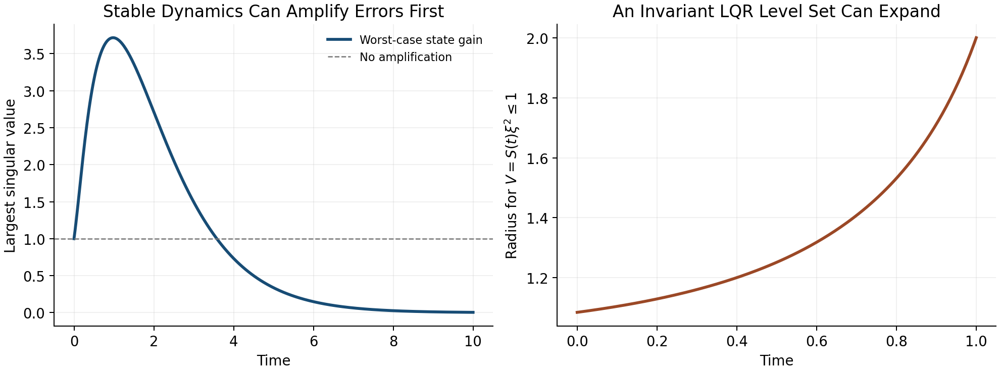
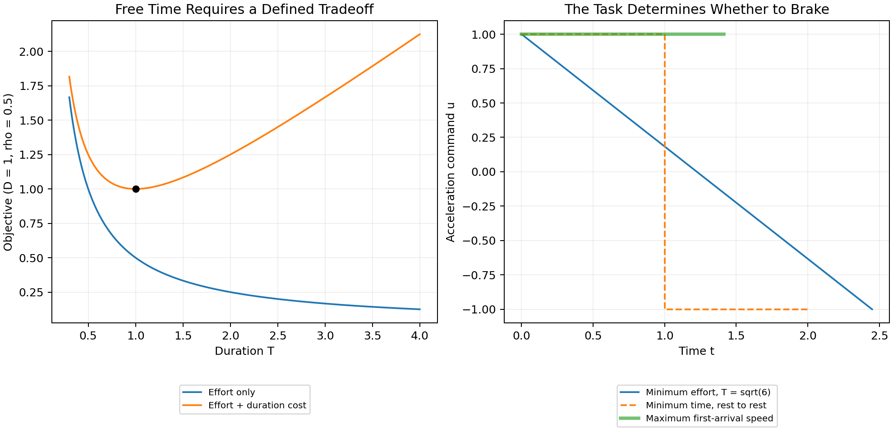
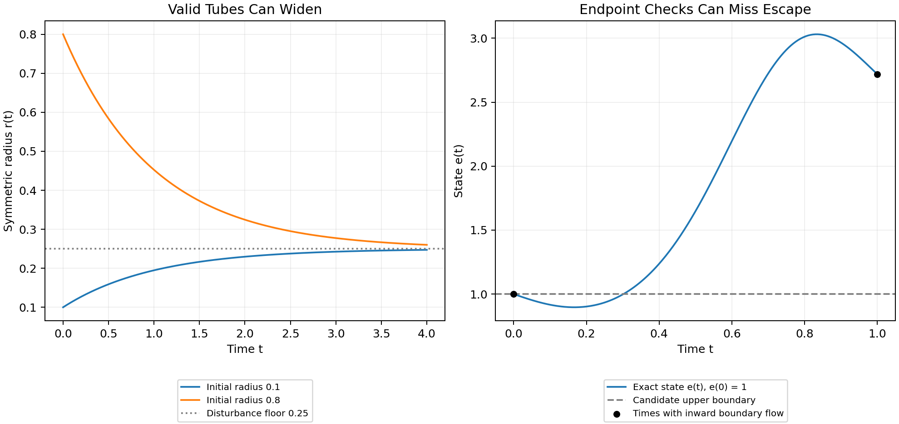
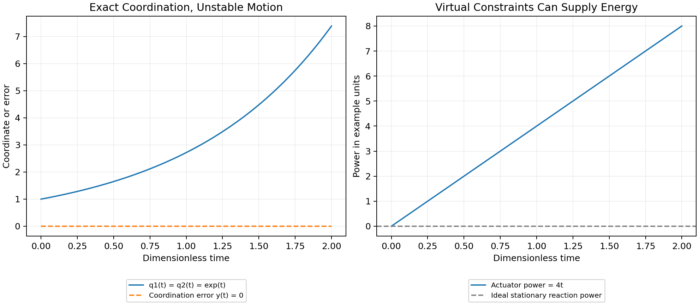
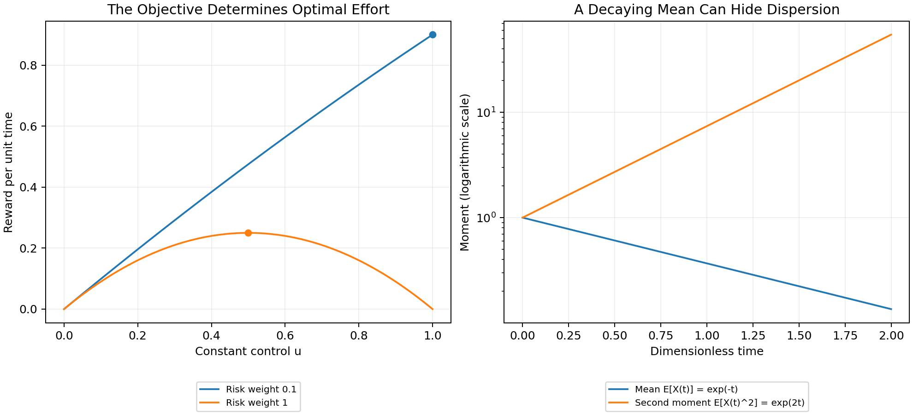

## Motion, Targets, and Timing {#throwing-away-the-target}

A golf swing is a motion undertaken for an outcome. The club must arrive at
contact with a useful position, velocity, orientation, and impact location;
the subsequent collision and flight determine what the ball does. The body
must produce that delivery through a feasible movement, tolerate relevant
variation, and continue into follow-through. Studying only a static pose
misses much of this problem. Discarding the outcome would miss its purpose.

"Control is motion" is the organizing perspective of this book. It directs
attention to how a trajectory is generated, shaped, and made reliable. It is
not a claim that trajectory tracking, optimal control, or orbital stability
replaces classical control theory. Those established tools already address
moving references, periodic behavior, disturbances, and constrained objectives.
The task is to choose and combine them correctly for the question at hand.

The important connections are physical. Earlier applied work changes the
state available later. Configuration and velocity change inertial coupling,
force transmission, and external loads. Grip and ground constraints restrict
compatible motion and affect reactions. Timing changes velocity and effort
even along an unchanged configuration path. Feedback and constitutive response
alter how disturbances develop. Impact samples the resulting state at an event,
which need not occur at a fixed clock time. A rigorous account keeps these
connections while distinguishing a model identity from a claim about a golfer.

### Specify What the Motion Should Produce

Let the state be $x$, the effective input be $u$, and the declared dynamics be
$$
\dot x=f(x,u,t),\qquad u\in\mathcal U(x,t).
$$ {#eq-nonlinear_sys}
The state must contain enough information for the model to predict its own
continuation. For a rigid mechanical model it includes configuration and
velocity. A muscle-driven or flexible model may also need activation, tissue,
shaft, and other internal states. A list of joint angles alone is not generally
a complete dynamic state. Contact modes and their transition rules are part
of the model as well.

Several objectives are useful and can coexist. Regulation keeps a quantity
near a desired constant value. Trajectory tracking compares the state or output
with a time-indexed reference. Path following permits progress along a geometric
path with a separately specified timing objective. Terminal or event objectives
constrain the state delivered at a particular time or crossing. Periodic tasks
may call for orbital stabilization. The names describe different specifications;
they are not mutually exclusive schools of control.

For a simplified impact investigation, let the first intended approach crossing
be described by
$$
h(x(t_e))=0,\qquad \nabla h(x(t_e))^Tf(x(t_e),u(t_e),t_e)\ne0,
$$ {#eq-motion_impact_event}
with an appropriate approach direction and contact mode. The nonzero derivative
is a transversality condition: it excludes a grazing crossing where event time
can be especially sensitive. Define an output $y_e=H(x(t_e^-))$ from the
pre-impact state and a target set $\mathcal Y$ of acceptable deliveries. Its
components might describe clubhead velocity, face orientation, path direction,
and impact location. A ball-outcome model can map those quantities, together
with ball and contact properties, into launch and flight predictions.

A terminal requirement $y_e\in\mathcal Y$ is compatible with a moving club.
It does not demand convergence to an equilibrium with nonzero velocity, nor
require that the club accelerate through the collision. The impact model must
account for the rapid change in momentum. Follow-through and any subsequent
constraints require their own continuation. The event model, output definition,
and admissible set determine what constitutes success.

This distinction is practical: two motions can have similar joint paths but
different delivery speeds, while different joint paths can deliver similar
club states. Neither observation by itself identifies how individual muscles
produced the motion.

### A Moving Reference Must Be Feasible

A nominal time-indexed trajectory $x_d(t)$ must have a compatible admissible
input $u_d(t)$:
$$
\dot x_d(t)=f(x_d(t),u_d(t),t),\qquad u_d(t)\in\mathcal U(x_d(t),t).
$$ {#eq-motion_nominal_feasibility}
Joint limits, closure conditions, contact forces, and internal-state dynamics
must also hold. Drawing a smooth curve in state space does not establish these
properties. If a tracking error is expected to remain zero, the closed-loop
vector field must reproduce the nominal tangent there.

For a control-affine model $f=f_0+Gu$, define
$r=\dot x_d-f_0(x_d,t)$. At a given nominal state, an unconstrained input exists
only if $r\in\operatorname{im}G$. When that condition holds,
$$
u_d=G^\dagger r+(I-G^\dagger G)z
$$ {#eq-motion_feedforward_family}
expresses the family of solutions in chosen coordinates. The pseudoinverse
selects a minimum Euclidean-norm representative; that criterion depends on
input scaling and is not a muscle-recruitment law. Input bounds can eliminate
all members of the family. A nonlinear input map may require a different
solution procedure and still need not have an inverse.

For example, $G=(1,0)^T$ cannot produce $r=(0,1)^T$. Its least-squares solution
leaves a nonzero residual. Conversely, $G=(1,1)$ with $r=1$ admits both
$(1,0)^T$ and $(1/2,1/2)^T$, among infinitely many choices. Feasibility,
uniqueness, and the selection of a preferred input are separate questions.

One useful architecture is $u=u_d+\Delta u$, with corrections designed for the
actual tracking-error dynamics. It does not imply a universal feedforward share
of measured joint torque. A nominal passive motion can have $u_d=0$, whereas
a strongly forced motion may require substantial nominal input. The split also
depends on the chosen reference and policy representation. Establishing a neural
feedforward or feedback contribution requires an experimental and physiological
model beyond this algebraic split.

### Tracking and Regulation

In a local Euclidean chart, set $e=x-x_d(t)$. Then
$$
\dot e=f(e+x_d(t),u,t)-\dot x_d(t).
$$ {#eq-motion_error_dynamics}
Tracking becomes regulation of the origin in a generally time-varying error
system. This change of variables explains why Lyapunov methods and
linear-quadratic designs remain useful for moving references. The
[MIT treatment of finite-horizon LQR and trajectory stabilization](https://underactuated.mit.edu/lqr.html)
provides an established development of these tools. Applying an equilibrium
controller without accounting for the changing reference can fail; that is a
modeling or design error, not a limitation of all regulation-based analysis.

For a scalar example, take $\dot x=x+u$ and $x_d(t)=\sin t$. The nominal input
is $u_d=\cos t-\sin t$. Choosing
$$
u=u_d-(k+1)e,\qquad k>0,
$$ {#eq-motion_tracking_example}
gives $\dot e=-ke$ exactly. The state keeps moving while its tracking error
converges. If actuator bounds are imposed, this result applies only where the
specified input can actually be delivered. Delays, unmodeled dynamics, and
measurement error also require their own treatment.

### Configuration Paths, Timing, and State

Write a configuration path as $q_d(s)$, where $s$ is a dimensionless progress
coordinate. For a timing law $s(t)$, define $\sigma=\dot s$. The chain rule gives
$$
\begin{aligned}
 q(t)&=q_d(s(t)),\\
 \dot q(t)&=q_d'(s)\sigma,\\
 \ddot q(t)&=q_d''(s)\sigma^2+q_d'(s)\dot\sigma.
 \end{aligned}
$$ {#eq-motion_path_timing}
Thus the mechanical state is $(q_d(s),q_d'(s)\sigma)$, not a configuration-only
curve. Changing $\sigma$ changes that state and usually the required loads.
A prescribed full-state curve $(q_d(s),v_d(s))$ has an additional compatibility
condition $q_d'(s)\sigma=v_d(s)$. It cannot generally be traversed at any chosen
speed while remaining the same physical state trajectory.

For a mechanical model $M(q)\ddot q+h(q,\dot q)=B(q)u$, substitution yields
$$
B(q_d)u=M(q_d)\bigl(q_d''\sigma^2+q_d'\dot\sigma\bigr)
             +h(q_d,q_d'\sigma).
$$ {#eq-motion_timing_feasibility}
The right side must lie in the admissible input image. Closure reactions,
external forces, and constitutive loads must be included consistently in a
more complete model. Geometric path design and timing design are useful
subproblems, but the dynamics couples them. Underactuation makes that
compatibility especially important; it does not make arbitrary retiming free.

As a reproducible example, take $m\ddot q=u$ with mass $m=1$ kg and applied
force $u$. Let $q_d(s)=\ell s^2$ with $\ell=1$ m. Use $s=t/T$ on
$0\leq t\leq T$. The same configuration path from 0 to 1 metre gives
$$
q=\ell(t/T)^2,
 \qquad \dot q=2\ell t/T^2,
 \qquad u=2m\ell/T^2.
$$ {#eq-motion_retiming_example}
At the endpoint, $T=1$ s
gives speed 2 m/s, force 2 N, and kinetic energy 2 J. With $T=2$ s, the values
are 1 m/s, 0.5 N, and 0.5 J. Work over the one-metre displacement equals the
kinetic-energy increase in each case. The phase-plane curves are
$\dot q=2\sqrt{\ell q}/T$, so they are different state-space curves.
This is an illustrative timing calculation, not a measured golf swing.

{#fig-motion_path_timing fig-alt="A unit mass follows q equals phase squared from zero to one metre. Traversals lasting one and two seconds end at the same position but at velocities of two and one metres per second. The resulting position-velocity curves differ."}

The example uses a prescribed clock-based phase. Estimating phase from the
configuration itself needs care near the stationary start, where $q_d'(0)=0$.
In a swing, a coordinate that reverses at the top of the backswing cannot serve
as a globally increasing phase through that reversal without a different
construction. A useful phase must be defined on the intended interval, be
observable from the chosen state or measurements, and have the required
regularity and progress properties.

### Choose a Meaningful Metric and Phase

A raw norm of position and velocity coordinates mixes different units. Even
among positions, changing metres to centimetres changes an unweighted norm.
One local choice is
$$
\|e\|_W^2=e^TWe,\qquad W=W^T\succ0,
$$ {#eq-motion_metric}
with weights and scales declared according to the desired interpretation.
Under an invertible linear coordinate change $\widetilde e=Se$, the same
quantity uses $\widetilde W=S^{-T}WS^{-1}$. Keeping $W$ unchanged while changing
units generally changes the specification. A physically motivated metric or
scaled output error can be useful, but neither is automatically a clinical
risk measure or an empirical measure of human effort.

On a configuration manifold, subtraction is a local coordinate operation;
rotations, for example, need compatible charts or a chosen local logarithmic
error. The mass matrix defines a kinetic-energy metric on configuration
velocities, not by itself a unique distance on the entire augmented state
including angles, velocities, activation, and other quantities.

For an embedded regular reference curve $\gamma(s)$ in a scaled state chart,
one possible local phase is
$$
s_*(x)\in\arg\min_s\frac12(x-\gamma(s))^TW(x-\gamma(s)).
$$ {#eq-motion_projection_phase}
At an interior minimizer with constant $W$,
$$
\gamma'(s_*)^TW(x-\gamma(s_*))=0.
$$ {#eq-motion_phase_orthogonality}
A sufficiently small tubular neighborhood of a suitably regular embedded curve
can make the projection unique and smooth. That conclusion is local. At the
center of a circle every point on the circle is equally close; self-intersections,
nearby branches, zero tangents, or a finite arc's endpoints can invalidate the
assumed phase chart. A constrained endpoint minimizer need not satisfy the
interior orthogonality equation.

Transverse coordinates need not use nearest-point orthogonality, but must form
valid local coordinates together with phase. If the state dimension is $d$,
there are locally $d-1$ transverse coordinates around a regular one-dimensional
curve. This coordinate count is different from the number of actuators and
from the dimension of a task-equivalent set.

### Stability, Attraction, and Finite Motion

Lyapunov stability means sufficiently small initial errors remain small over
the stated time domain. It does not by itself mean convergence. Asymptotic
stability adds attraction as time tends to infinity. Exponential stability adds
a quantitative decay bound with specified constants. These distinctions apply
to equilibria and have corresponding trajectory and orbital formulations; see
[the MIT Lyapunov analysis notes](https://underactuated.mit.edu/lyapunov.html).

For a periodic orbit of an autonomous closed-loop system, orbital stability
allows phase displacement while controlling distance to the orbit. A nearby
solution can converge to the orbit without converging to the same clock phase
as a nominal solution. This is useful for periodic motions when phase locking
is not the objective. It is not a general license to change the physical speed
along a prescribed position-velocity curve.

A golf swing studied only up to an impact event is a finite-duration motion.
Its appropriate claims may concern bounded deviation, successful event arrival,
and delivered output tolerances. An infinite-time attraction statement needs
a defined continuation, such as a periodic task or a subsequent stabilization
phase. A finite reference arc is not an invariant orbit once the motion leaves
its endpoint. Bounds on a finite interval should not be renamed asymptotic
stability without that missing structure.

For example, $\dot e=e$ gives $e(t)=e(0)e^t$. On a fixed interval $[0,T]$,
choosing $|e(0)|<\varepsilon e^{-T}$ keeps $|e(t)|<\varepsilon$. This finite-time
bound holds even though errors amplify and the origin is unstable on the
infinite time axis. A useful swing robustness result should therefore report
the permitted initial/measurement uncertainty, the amplification or decay,
the time or event interval, and the terminal output bound.

Orbital analysis still uses Lyapunov functions. For an explicit example,
consider $\dot x_1=x_2$, $\dot x_2=-x_1+u$. The unit circle is a nominal orbit
with $u_d=0$. Put $r^2=x_1^2+x_2^2$ and choose
$$
u=kx_2(1-r^2),\qquad
 V=\tfrac14(r^2-1)^2,\qquad
 \dot V=-k x_2^2(r^2-1)^2\leq0,
 \quad k>0.
$$ {#eq-motion_orbit_example}
On a sufficiently small compact annulus around the unit circle, the largest
invariant subset of $\dot V=0$ is the circle itself. Points with $x_2=0$ away
from the circle do not remain there, since $\dot x_2=-x_1\ne0$; the origin is
excluded by the annulus. Lyapunov and invariance arguments then establish local
orbital attraction and stability. They do not establish phase locking or global
attraction from the origin. The
[MIT limit-cycle treatment](https://underactuated.mit.edu/limit_cycles.html)
and [Manchester's transverse-dynamics analysis](https://arxiv.org/abs/1010.2241)
provide the broader framework.

### Verifying a Motion Tube

A time-varying tube can be defined by
$$
\mathcal T(t)=\{x:V(x,t)\leq\rho(t)\}.
$$ {#eq-motion_tube}
For example, $V$ may measure weighted tracking error. Selecting $\rho(t)$ to
be small near impact expresses a desired tolerance. It does not show that the
closed-loop motion can stay inside the tube. Even $\dot e=0$ leaves a shrinking
tube when initialized on its boundary: constant error cannot fit inside an
arbitrarily decreasing allowed radius.

Suppose the closed-loop dynamics is well posed with admissible inputs,
$V$ and $\rho$ are continuously differentiable, and the tube has a regular
boundary on the domain of interest. For disturbances $d$ in a declared set
$\mathcal D$, a robust inward-boundary condition is
$$
\partial_t V+\nabla_x V^Tf(x,k(x,t),d,t)\leq\dot\rho(t)
 \quad\text{when }V(x,t)=\rho(t),\quad\forall d\in\mathcal D.
$$ {#eq-motion_tube_boundary}
Together with the appropriate regularity and initial membership, this supports
forward invariance over the specified interval. The derivative must include
reference motion and changing metric weights. If $V$ and $\rho$ are indexed
by phase, their derivatives involve the actual $\dot s$; it cannot silently
be replaced by one. Nonsmooth profile corners or hybrid resets need their own
one-sided or transition conditions.

A scalar example makes the effort and disturbance limit explicit. Let
$\dot e=-ke+d$, $|d|\leq\bar d$, and require $|e|\leq r(t)$. On either boundary,
a sufficient condition is
$$
\dot r\geq-kr+\bar d.
$$ {#eq-motion_radius_condition}
For $k=2$, $\bar d=0.1$, and $r(0)=1$ in declared scaled units, the tight
comparison radius is $r(t)=0.05+0.95e^{-2t}$. Constant worst-direction
disturbances attain its two boundaries. The nonzero limiting radius follows
from the disturbance bound and available correction rate. A drawing that
shrinks to zero would not certify this disturbed system.

For an impact specification, also require that every relevant pre-impact
boundary state allowed by the verified tube maps into $\mathcal Y$, and that
the intended event is reached. A phase estimate bounded below by
$\dot s\geq\alpha_{\min}>0$ can supply a progress bound on an appropriate
interval; distance to a path alone cannot. Actuator saturation, sensor delay,
contact feasibility, and uncertainty in the model must be included in the
claimed guarantee. A verified model tube is still a statement about that model
and its declared uncertainty set, not automatic validation on golfers.

### Input Rank and Reachability

For an $n$-coordinate mechanical model with $m<n$ effective inputs, rank limits
instantaneous input acceleration directions. It does not imply that all feasible
states lie on a surface of dimension $2m$. In a state model, drift and input
directions evolve as the system moves; their effect over time can provide
additional reachable directions. The underactuation chapter develops the
associated feasibility and reachability questions.

A concrete counterexample uses two unit masses, one grounded spring, and one
coupling spring, all with unit coefficients. In scaled coordinates,
$$
\ddot q+Kq=bu,\qquad
 K=\begin{pmatrix}2&-1\\-1&1\end{pmatrix},\qquad
 b=\begin{pmatrix}1\\0\end{pmatrix}.
$$ {#eq-motion_coupled_springs}
There is one applied force. With $x=(q_1,q_2,\dot q_1,\dot q_2)^T$,
$$
\dot x=Ax+gu,\qquad
 A=\begin{pmatrix}0&I\\-K&0\end{pmatrix},\qquad
 g=\begin{pmatrix}0\\0\\1\\0\end{pmatrix}.
$$ {#eq-motion_spring_state}
The controllability matrix $[g,Ag,A^2g,A^3g]$ has determinant $-1$ and rank
four. With unconstrained signed inputs, this linear system is controllable in
its full four-dimensional state space. Input limits restrict the size of
reachable sets and time needed; they do not restore the asserted universal
$2m$ dimension bound.

A single trajectory is itself a one-dimensional curve, but the union of
reachable trajectories and the span of a curve's successive derivatives are
different objects. For the same system with $u=0$ and $x(0)=(1,0,0,0)^T$,
the matrix $[Ax,A^2x,A^3x,A^4x]$ at the initial state also has determinant
$-1$. Thus even an unforced example has four independent time derivatives.
At that regular point, smooth arc-length reparameterization preserves their
rank. Actuator count therefore does not cap the number of independent
Frenet-frame directions at $2m$ either.

The useful golf interpretation is more specific. Coupling can transmit and
redistribute the effects of earlier work and present loads. Whether an effective
wrist coordinate is unactuated, weakly actuated, or actively constrained is a
modeling and measurement question. A rapid release does not prove zero wrist
moment, and passive planar dynamics does not guarantee three-dimensional face
squaring. Force, joint moment, mechanical power, and muscle activation must be
kept distinct when testing such hypotheses.

### Reliability and Performance

A path error, a delivery error, and a ball-dispersion measure are different
costs. Choose the one that represents the study, then state how the others
enter the model. Both regulation and trajectory problems can use cost
functionals over an entire history; neither is restricted to a single
instantaneous error value.

For a specified stochastic model and admissible policy $\pi$, one possible
criterion is
$$
\begin{aligned}
 J_\pi&=\phi(y_e)+\int_0^{t_e}\ell(x(t),u(t))\,dt,\\
 \min_\pi\quad&\mathbb E[J_\pi]+\lambda\operatorname{Var}(J_\pi),
 \qquad\lambda\geq0.
 \end{aligned}
$$ {#eq-motion_risk_objective}
The cost and its units, disturbance distribution, event definition, and
constraint handling must be declared. The variance weight has corresponding
units; it expresses a design preference rather than a universal biological
constant. A low variance can accompany a consistently poor mean outcome, so
repeatability alone is not sufficient. Expected cost, tail risk, target-set
probability, and worst-case guarantees answer different questions.
If the intended event is not reached by an allowed horizon, define a failure
cost or constraint; silently discarding those trials changes the question.

A candidate policy may use feedback, a learned reference, or both. Comparing
policies requires recomputing the motion, loads, event time, and output in each
branch. Reusing a measured state or reaction history after the intervention
changes the trajectory can invalidate the comparison. Experimental perturbations
and held-out predictions can test a model; fitting one observed motion does not
establish that the nervous system optimized the proposed criterion.

A practical golf investigation can proceed as follows:

1. Define the delivered output, its tolerance, and the ball/contact model
   used to connect that output to performance.
1. Declare the mechanical boundary, contact modes, state variables, input
   meaning, parameter uncertainty, and available measurements.
1. Construct compatible nominal states and inputs. Check closure, timing,
   actuator limits, work, and contact feasibility before optimizing a path.
1. Model disturbances and measurement/actuation delays. Compare finite-time
   or event-based output sensitivity and verify any proposed tube condition.
1. Test predictions on independent swings or perturbations, including
   uncertainty in event timing and the inferred loads.
1. Separate demonstrated mechanical identities, validated predictions,
   physiological interpretations, and proposed coaching or design hypotheses.

This is the role of the subsequent chapters: curve geometry describes motion;
configuration manifolds describe compatible coordinates; transverse analysis
and underactuation constrain candidate designs; optimization and robustness
analysis evaluate them; learning and experiments test how well they transfer.
The later golf case study is a modeling proposal unless supported by a complete
specified model, reproducible results, and validation data. The framework's
value comes from making the links testable.

### Chapter Exercises

1. Specify an impact-event output set that distinguishes clubhead speed,
   face orientation, and impact location. Explain why a terminal target
   does not require stopping there.
1. Derive the error dynamics for the scalar tracking example, then impose
   an input bound and identify where the proposed law becomes infeasible.
1. Reproduce the one-mass timing example. Compare endpoint velocity, input,
   work, and the phase-plane curves for $T=1$ and $T=2$ seconds.
1. For a prescribed pair $(q_d(s),v_d(s))$, derive the compatibility condition
   on $\dot s$ and give an example where arbitrary retiming fails.
1. Rescale a position coordinate from metres to centimetres. Transport the
   error metric and verify that the weighted distance remains unchanged.
1. Show why nearest-point phase is not unique at a circle's center and why
   a finite arc's endpoint needs a separate projection condition.
1. Derive the scalar robust-radius condition and integrate its two
   worst-direction disturbance cases. Explain the nonzero limiting radius.
1. Verify both rank-four matrices in the spring example. Distinguish
   actuator rank, reachable-set dimension, and a trajectory's derivative span.
1. Verify the orbital Lyapunov derivative and the invariant-set argument.
   Explain why this does not prove phase locking or global convergence.
1. Formulate two different reliability objectives for a golf study. State
   what data would distinguish their predictions and what remains unidentifiable.

## Curves in State Space {#curves-in-state-space}

### What a Curve Describes

A golf swing has several useful geometric descriptions. The clubhead traces a
curve in three-dimensional physical space. The joint configurations trace a
curve in configuration space. Positions, velocities, and any additional
internal states trace a curve in state space. These descriptions answer
different questions. A bend in a plot of joint angle against angular velocity
is not a bend of the clubhead in metres, and its curvature is not a force.

The purpose of this chapter is to make geometry useful without asking it to
supply missing dynamics. We develop arc length, curvature, moving frames,
local transverse coordinates, and timing constraints. We then connect these
tools to physical acceleration, admissible control, and the impact task.
Geometry specifies a motion's shape within a stated space and metric.
Dynamics determines which timed motions and corrections are possible.
Measurements determine whether a proposed model describes an actual swing.

Throughout the Euclidean calculations, the ambient space is $\mathbb R^d$
with a specified inner product. A prime denotes differentiation with respect
to the displayed curve parameter; a dot denotes physical time. A regular
curve has a nonzero first derivative on the interval under discussion.
Configurations are denoted by $q$, full states by $x$, and a physical point
such as the clubhead by $p$. We use $s$ for arc length and $\lambda$ for a
parameter that need not measure distance.

#### Geometry Depends on the Space and Metric

Euclidean curvature is invariant under regular reparameterization and rigid
changes of Cartesian frame. It is an extrinsic property of the embedded
curve: it measures how the curve bends in its ambient space. Calling this
"intrinsic" merely because it does not depend on timing confuses two uses
of geometry. A straight segment and a circular arc of the same length have
the same one-dimensional arc-length metric, although their ambient
curvatures differ.

Changing units without transforming the metric changes the calculation.
For a state $x=(q,\dot q)$, a raw sum of squared positions and velocities has
no universal physical meaning. One possible declared convention is
$z=Sx$, where $S$ contains inverse reference scales, followed by Euclidean
geometry in the dimensionless coordinates $z$. Different scales generally
give different curvature signatures. This is a modeling choice to report
and test, not a coordinate-free marker of skill.

For a positive-definite metric $W$, the squared displacement is
$dx^T W dx$. Under $z=Sx$, the same metric has matrix
$\widetilde W=S^{-T}WS^{-1}$. A constant metric can be handled through a
linear change to orthonormal coordinates. With a position-dependent metric,
ordinary second derivatives are not sufficient: curvature uses the
appropriate covariant derivative. The kinetic-energy matrix $M(q)$ defines
a metric on configuration velocities; it is not automatically a metric on
an augmented state containing velocities, activation, and contact variables.

### Regular Parameters and Arc Length

Let $\gamma:I\rightarrow\mathbb R^d$ be a $C^2$ curve, and let
$h(\lambda)=\|\gamma'(\lambda)\|>0$. Its arc-length function and unit tangent are
$$
s(\lambda)=\int_{\lambda_0}^{\lambda}h(\mu)\,d\mu,
 \qquad T(\lambda)=\frac{\gamma'(\lambda)}{h(\lambda)}.
$$ {#eq-arc_length}
Because $ds/d\lambda=h>0$, the inverse function theorem gives a local regular
arc-length parameter. In that parameter $\|\gamma'(s)\|=1$ and
$T=\gamma'(s)$. Replacing $\lambda$ by a smooth increasing diffeomorphism
changes the rate of traversal while preserving the oriented curve.
A merely increasing function can have zero derivative and need not preserve
regularity at every point.

For example, $(\cos t,\sin t)$ and $(\cos t^2,\sin t^2)$ trace the same circle
on suitable intervals. The second time parameterization has zero velocity
at $t=0$. Arc-length formulas that divide by speed apply for $t>0$; the
circle's geometry can separately be extended through the starting point.
A temporal stop is not by itself a geometric cusp or an infinite curvature.

A reversal is even more informative. In normalized coordinates, the physical path
$p(t)=(t^2,0)$ has zero curvature on either side of $t=0$, while velocity
vanishes and reverses there. The unit tangent defined by time is undefined
at the reversal. The full mechanical state
$x(t)=(t^2,2t)$ has derivative $(2t,2)$ and is regular at the same instant.
Thus the physical point can stop while the state continues moving. There is
no universal conclusion that the top of a backswing is the point of maximum
curvature in any of these spaces.

If a regular configuration path is parameterized by $\lambda$ and traversed
with $\dot\lambda>0$, its chosen-metric speed is
$\dot s=\|q'(\lambda)\|\dot\lambda$. In particular, $\dot\lambda$ is not
Cartesian speed unless the path is parameterized by physical arc length.
This distinction matters when converting a speed limit into a timing law.

### Curvature and Physical Acceleration

For a unit-speed $C^2$ Euclidean curve,
$$
k(s)=\frac{dT}{ds},\qquad \kappa(s)=\|k(s)\|.
$$ {#eq-curvature_def}
Differentiating $T^TT=1$ gives $T^Tk=0$. Where $\kappa>0$, the principal
normal is $N=k/\kappa$. At a point with zero curvature, $k$ remains defined
but this particular normal does not. Curvature vanishing on an entire
connected regular interval makes $T$ constant and the curve a straight
segment. Vanishing at one point does not: $(t,t^3)$ has zero curvature at
$t=0$ and bends arbitrarily nearby.

For any regular parameter, differentiating the normalized tangent gives
$$
\kappa=\frac{\|(I-TT^T)\gamma''\|}{\|\gamma'\|^2}
 =\frac{\sqrt{\|\gamma'\|^2\|\gamma''\|^2-(\gamma'^T\gamma'')^2}}
 {\|\gamma'\|^3}.
$$ {#eq-curvature_general_n}
In three dimensions the numerator of the final expression is
$\|\gamma'\times\gamma''\|$. In two dimensions it is the absolute determinant
of the two derivative vectors. There is no need to invent an ordinary cross
product in arbitrary dimension. The projected-acceleration form also avoids
subtracting two large nearly equal squared quantities, although numerical
error can still dominate near zero speed.

#### A Checkable Ellipse

For $\gamma(\lambda)=(a\cos\lambda,b\sin\lambda)$ with $a>b>0$,
$$
\kappa(\lambda)=\frac{ab}
 {(a^2\sin^2\lambda+b^2\cos^2\lambda)^{3/2}}.
$$
The major-axis endpoints $(\pm a,0)$, at $\lambda=0,\pi$, have the largest
curvature $a/b^2$. The minor-axis endpoints $(0,\pm b)$ have the smallest
curvature $b/a^2$. With $a=2$ m and $b=1$ m these are $2$ and $0.25$ inverse
metres. Uniformly changing the rate of traversal preserves these values.
Stretching a circle into this ellipse does not preserve curvature.

#### Where the Speed-Squared Law Applies

Let $p(s)$ now be a physical position in an inertial Cartesian frame, with
$s$ measured in metres, and let $v=\dot s>0$. The chain rule gives
$$
\dot p=vT,\qquad \ddot p=\dot vT+v^2k
 =\dot vT+v^2\kappa N\quad(\kappa>0).
$$ {#eq-centripetal}
Here $v^2\kappa$ is a physical normal acceleration in m/s$^2$. The identity
is kinematic: it describes the acceleration of the prescribed motion before
assigning which forces produce it.

For a point mass, Newton's law says
$$
m\ddot p=F_{\mathrm{act}}+F_{\mathrm{pass}}+F_{\mathrm{external}}
 +F_{\mathrm{reaction}}.
$$ {#eq-control_demand}
Only in a model where the actuator supplies the entire resultant force does
$F_{\mathrm{act}}=m(\dot vT+v^2k)$. Gravity, springs, contact, and constraint
reactions can contribute. A $0.2$ kg mass moving at $20$ m/s on a horizontal
circle of radius $1$ m requires $80$ N inward. In an ideal frictionless
circular guide with no tangential resistance, the guide supplies that force
and does zero work because its force is perpendicular to velocity. No
continuous actuator work is needed to maintain the speed in this model.
That calculation does not show that a golfer supplies zero joint moments.
It shows why resultant acceleration and active effort are different
quantities.

A clubhead is a point on a moving, rotating, possibly flexible body rather
than an isolated point mass with all force applied at that point. For a
rigid model with $p=p(q)$,
$$
\dot p=J_p(q)\dot q,\qquad
 \ddot p=J_p(q)\ddot q+\dot J_p(q,\dot q)\dot q.
$$
The Jacobian-rate term supplies normal acceleration even at constant joint
speed. Segment force and moment balances, distributed mass, hand wrenches,
and any modeled shaft deflection are needed to interpret measured clubhead
acceleration. Multiplying it by total club mass does not generally recover
the hand force.

For a first-order state equation $\dot x=f(x,u,t)$, the analogous curve
identity concerns $\ddot x$, which may include mechanical jerk and internal
state derivatives. When $u$ is differentiable,
$$
\ddot x=f_xf+f_u\dot u+f_t.
$$
This is not a generic decomposition of $u$ into tangential and normal
forces. The reference condition remains
$f(\gamma(s(t)),u_*(t),t)=\gamma'(s(t))\dot s(t)$, together with input
admissibility. In an autonomous model the final argument is absent.

### Moving Frames and Their Limits

#### An Oriented Three-Dimensional Frame

For a $C^3$ regular curve in oriented Euclidean three-space with $\kappa>0$,
define $T=dp/ds$, $N=T'/\kappa$, and $B=T\times N$. Then
$$
\frac{dT}{ds}=\kappa N,\qquad
 \frac{dN}{ds}=-\kappa T+\tau B,\qquad
 \frac{dB}{ds}=-\tau N.
$$ {#eq-frenet_serret}
The signed torsion is
$$
\tau=\frac{\det[p',p'',p''']}{\|p'\times p''\|^2},
$$
where the primes in this formula may use any regular parameter. Torsion
requires nonzero curvature. A planar regular curve has zero torsion where
the formula is defined; at an inflection the Frenet normal and torsion may
be undefined even when the original curve is smooth.

For the helix $p(\lambda)=(a\cos\lambda,a\sin\lambda,b\lambda)$ with $a>0$,
$$
\kappa=\frac{a}{a^2+b^2},\qquad \tau=\frac{b}{a^2+b^2}.
$$
Changing the sign of $b$ reflects the helix and changes the sign of torsion.
Proper rotations and translations preserve both. Blindly applying
Gram--Schmidt to all three derivatives chooses the final vector from the
third derivative's residual; it can produce $-B$ when torsion is negative.
That convention cannot simultaneously be identified with the oriented
binormal $T\times N$ without tracking the sign.

In this physical three-dimensional setting, torsion measures rotation of the
osculating plane per unit distance. Torsion of a normalized state-space curve
has a different ambient space and interpretation. It is not a direct measure
of anatomical rotation or of how a golfer should change the swing plane.

#### Higher Dimensions and Regular Normal Frames

With sufficient smoothness and independent successive derivatives,
Gram--Schmidt constructs an orthonormal basis for the successive osculating
spaces of a curve in $\mathbb R^d$. A full oriented Frenet frame can be chosen
by orthogonalizing the first $d-1$ independent derivatives and completing the
last vector with a fixed ambient orientation. Its equations have the form
$$
e_i'=-\kappa_{i-1}e_{i-1}+\kappa_i e_{i+1},
 \qquad \kappa_0=\kappa_d=0.
$$
The first $d-2$ curvatures are positive under the required independence
conditions; the final oriented curvature can have either sign or vanish.
Alternatively, a frame made from all $d$ independent derivatives adopts a
different sign convention. State the convention before comparing signatures.
If only a partial frame is constructed, its last derivative need not remain
inside that partial span. A closed lower-dimensional Frenet system needs an
appropriate containing affine subspace and its own regularity assumptions.

There is a simpler option for local control: choose any smooth orthonormal
normal frame $E(s)$, with $d-1$ columns, satisfying
$T^TE=0$ and $E^TE=I$. Define
$$
c=E^TT',\qquad \Omega=E^TE',\qquad
 T'=Ec,\qquad E'=-Tc^T+E\Omega.
$$
Differentiating $E^TE=I$ shows that $\Omega$ is skew-symmetric. A parallel
normal frame, often called a Bishop frame, chooses $\Omega=0$ locally along
an interval. It continues through zero-curvature points of a regular curve
where the principal Frenet normal fails. Such a frame still requires an
initial normal orientation; a periodic curve can have a nontrivial change
of normal orientation after one circuit.

The number of normal coordinates is $d-1$, not the actuator count. The
one-input spring example in the previous chapter has four independent
unforced trajectory derivatives at its specified initial state. A single
trajectory is one-dimensional, its osculating span can be larger, and the
union of reachable trajectories is another object again.

### Shape Reconstruction and Its Limits

For continuously differentiable $\kappa(s)>0$ and continuous signed
$\tau(s)$ on an interval,
the three-dimensional Frenet equations, together with $p'=T$, reconstruct a
unit-speed curve once its initial point and oriented frame are specified.
Existence and uniqueness follow from the frame's linear differential
equation and integration of $T$. Without the initial point and frame, the
curve is determined up to a proper rigid motion. Analogous statements in
higher dimensions require a complete consistent curvature list and frame
convention; an arbitrary truncated signature is insufficient.

Congruence is not equality relative to the golf ball. Translating or rotating
a clubhead path can make it miss the ball while preserving its curvature and
torsion. A rigid rotation of normalized position-velocity coordinates need
not even correspond to a physically allowed state transformation. Gravity,
contact, anatomy, and the target frame further restrict useful symmetries.
Neither shape reconstruction nor a similar curvature signature establishes
equal timing, forces, face orientation, or performance.

Where $\kappa>0$, the osculating circle has center $p+N/\kappa$ and radius
$1/\kappa$. It matches local position, tangent, and curvature; the tangent
line and osculating plane supply lower-order geometric descriptions. An
osculating sphere in three dimensions needs additional conditions. Writing
$\rho=1/\kappa$, when $\tau\ne0$ its center is
$p+\rho N+(\rho'/\tau)B$. This follows by requiring successive derivatives
of squared distance to a fixed center to vanish through third order. At
zero torsion the construction may fail or be nonunique, depending on
$\rho'$. It is not an unconditional approximation for every high-dimensional
state curve.

### Feasible Timing and Available Forces

For a chosen configuration path $q=q(\lambda)$,
$$
\dot q=q'\dot\lambda,\qquad
 \ddot q=q''\dot\lambda^2+q'\ddot\lambda.
$$
Substitution into mechanical dynamics gives the required generalized load:
$$
M(q)(q'\ddot\lambda+q''\dot\lambda^2)+h(q,q'\dot\lambda)
 =B(q)u+Q_{\mathrm{pass}}+Q_{\mathrm{external}}+J_c^T\eta.
$$ {#eq-curve_path_dynamics}
Here $h$ contains the declared velocity and potential terms, and passive
terms must not be counted twice. The path must satisfy configuration
constraints; its derivatives must satisfy their velocity and acceleration
conditions. Contact reactions $\eta$, friction, actuator bounds, activation
dynamics, and any force-rate limits constrain feasible timing. For an
underactuated system, not every desired generalized load lies in the input
image even if every motor is individually below its limit.

For a fully actuated model, each torque bound can become an inequality in
$\lambda$, $\dot\lambda$, and $\ddot\lambda$. This is the basis of
path-constrained time scaling. It is more informative than assigning a
single curvature cost because it retains gravity, inertia, coupling, and
the available input directions. The configuration path and timing can be
optimized in stages, but their feasibility constraints remain coupled.
Retiming also changes the corresponding full state curve, as shown in the
previous chapter.

A simple point-mass model gives a useful limited speed bound. Suppose the
actuator supplies the entire force, with $\|F\|\le F_{\max}$, and there are
no other forces. On a physical arc-length path,
$$
\dot v^2+(\kappa v^2)^2\le(F_{\max}/m)^2.
$$
Thus $v\le\sqrt{F_{\max}/(m\kappa)}$ is necessary when $\kappa>0$, but leaves
no force for tangential acceleration at equality. For $m=2$ kg,
$F_{\max}=10$ N, $\kappa=0.5$ m$^{-1}$, and $v=3$ m/s, the normal
acceleration is $4.5$ m/s$^2$ and the remaining tangential bound is
$\sqrt{25-4.5^2}=\sqrt{4.75}$ m/s$^2$. If a guide supplies normal reaction,
the actuator's feasible set is different.

At zero curvature this particular normal-acceleration bound supplies no
speed ceiling. Tangential acceleration, initial and terminal conditions,
velocity limits, power, and the next bend can still limit speed. A
minimum-time exercise based only on normal acceleration can therefore lack
an attained smooth solution or a physically meaningful optimum. Prescribe
the full bounds and endpoint conditions before claiming an optimal law.

### Local Phase and Transverse Dynamics

#### Coordinates in a Tubular Neighborhood

Let $\gamma(s)$ be a regular embedded unit-speed state curve in a chosen
Euclidean metric, and choose the smooth normal frame $E(s)$ above. In a
sufficiently small neighborhood of an interior segment, write
$$
x=\gamma(s)+E(s)\xi.
$$ {#eq-frenet_coords}
Nearest-point phase satisfies $T^T(x-\gamma)=0$ there. Local uniqueness
requires more than this stationary equation: the curve must not intersect
itself in the neighborhood, and the coordinate Jacobian must be invertible.
The scalar factor $1-c^T\xi$ in that Jacobian must be nonzero. A smaller
neighborhood may be needed to exclude other closest points. For a circle,
the center has many nearest points and the inward normal coordinates become
singular there. Endpoints require one-sided treatment. A regular local
normal frame does not turn all nearby states into a single global chart.

Let the smooth autonomous dynamics be $\dot x=f(x,u)$ and suppose a feasible
nominal input satisfies
$f(\gamma(s),u_*(s))=v_*(s)T(s)$ with $v_*>0$. Differentiate the coordinate
map and project onto $T$ and $E$:
$$
\dot s=\frac{T^Tf(x,u)}{1-c^T\xi},\qquad
 \dot\xi=E^Tf(x,u)-\Omega\xi\dot s.
$$ {#eq-curve_exact_transverse}
These equations retain both the phase denominator and the normal-frame
transport. They are coordinate-rate equations; the word "force" should
not be assigned to every transport term in a first-order state model.

With $u=u_*(s)+\delta u$, the transverse linearization at $\xi=0$ is
$$
\dot\xi=A_\perp(s)\xi+B_\perp(s)\delta u
 +O(\|(\xi,\delta u)\|^2),
$$ {#eq-transverse_lin}
where
$$
A_\perp=E^Tf_x(\gamma,u_*)E-v_*\Omega,
 \qquad B_\perp=E^Tf_u(\gamma,u_*).
$$
All partial derivatives here hold $s$ fixed; nominal phase evolves by
$\dot s=v_*(s)$. For explicitly time-dependent dynamics, include the time
state or derive the corresponding time-dependent coordinate map. A
feedback depending on an independently prescribed clock is also a different
problem from the phase-indexed law assumed here.

There is no universal correction of the form speed squared times a curvature
matrix subtracted from the original Jacobian. Curvature enters the phase
map and chosen frame; transverse stability depends on the actual vector
field, its derivatives, input directions, feedback, and regularity.
Changing the normal basis changes the coordinate matrices consistently,
without changing physical attraction of the orbit.

#### The Same Circle With Opposite Stability

In a neighborhood of $r=R>0$, consider the planar systems
$$
\dot r=a(r-R),\qquad \dot\theta=\omega>0.
$$
Every value of $a$ has exactly the same nominal circle, curvature $1/R$,
speed $R\omega$, and nominal time parameterization. Yet radial error evolves
as $e(t)=e(0)e^{at}$: $a<0$ attracts, $a>0$ repels, and $a=0$ is neutral.
Curvature and nominal speed cannot distinguish these cases. The figure uses
$R=2$ and $\omega=1.3$, with initial radii $1.8$ and $2.2$, over four model
time units. Its radial growth rates are $a=-0.3$ and $a=0.3$.

{#fig-curve_stability_comparison fig-alt="Both systems have the same radius-two nominal circle and angular speed. Perturbed paths converge toward the circle with negative radial growth and diverge with positive radial growth."}

Using the inward normal coordinate $\xi=R-r$ and arc length $s=R\theta$
gives $\dot\xi=a\xi$ and $\dot s=R\omega$. The exact phase formula agrees:
$T^Tf=\omega(R-\xi)$ and $1-c^T\xi=1-\xi/R$. Their ratio is $R\omega$.
This checks the denominator as well as the transverse linearization. A
geometric tube around the circle becomes a verified invariant tube only
when the actual transverse dynamics and disturbances satisfy its boundary
condition.

### Curvature and Reachability Are Different

For a control-affine system, instantaneous input directions, reachable sets,
and the derivatives of one trajectory are distinct. Lie brackets describe
noncommuting flows. With the convention
$[g_i,g_j]=Dg_j\,g_i-Dg_i\,g_j$, the bracket can expose a displacement
direction generated by suitable short sequences of controls. The
Chow--Rashevskii result concerns bracket-generating driftless systems under
appropriate smoothness and reversible control assumptions. The orbit
theorem describes the geometry of orbits of vector fields and is not the
same theorem. Allowing forward and backward field flows to define an orbit
does not automatically describe forward-time reachability with drift,
unilateral contact, or bounded controls.

A curved path need not use nonzero brackets at all. For the planar integrator
$\dot x=u$, the two constant input fields commute. The control
$u(t)=(-\sin t,\cos t)$ traces the unit circle from $(1,0)$ with curvature
one. Its acceleration comes from changing the input, while every bracket of
the constant input fields is zero. Conversely, a system can have useful
bracket directions without expressing them as a large curvature along one
recorded trajectory. High curvature does not identify a commutator, a neural
synergy, or an underactuated strategy.

### Using Geometry in a Golf Investigation

A useful investigation keeps the chain of interpretation explicit:
measurement, geometric description, feasible mechanics, uncertainty, and
task outcome. Consider the following protocol.

1. Choose the object and frame. A clubhead point, shaft orientation,
   joint configuration, and complete state are different data products.
   Use a target-fixed physical frame for ball delivery. State how angles,
   rotations, velocities, and internal states are represented.
1. Report units and metric scales. For a state signature, repeat the
   calculation under plausible scaling choices. For three-dimensional
   clubhead curvature, use physical positions in consistent length units.
1. Fit derivatives with an explicit measurement model. Differentiation
   amplifies noise; torsion requires a third derivative and is especially
   fragile near small curvature or speed. Report sampling, smoothing,
   uncertainty, and sensitivity to filtering. Do not divide by near-zero
   denominators and then interpret numerical spikes as swing phases.
1. Align trials using a declared event or phase convention. Compare both
   geometric shape and timing; report where a reference curve's nearest
   projection becomes ambiguous. Treat impact and contact changes using
   one-sided smooth segments or a hybrid model.
1. Compute physical acceleration and mechanical load with the appropriate
   Jacobians, inertias, external loads, and constraints. Distinguish net
   joint moments from muscle recruitment and resultant force from work.
   Validate these quantities against independent measurements where possible.
1. Evaluate pre-impact speed, face orientation, path direction, strike
   location, and relevant ball outcomes with uncertainty. Test whether a
   geometric feature predicts outcomes beyond simpler measured variables
   on held-out trials. A correlation does not identify the control policy.
1. Test interventions in a declared forward model and then seek empirical
   validation. Altering timing can change speed-dependent loads and contact
   feasibility; altering a path can change moment arms and the impact frame.
   Recompute the complete trajectory rather than attaching a new conclusion
   to an unchanged force history.

The hypothesis that golfers exploit passive coupling remains worth testing.
The geometric tools can identify repeatable patterns and organize model
comparisons. They cannot by themselves establish that a particular pause,
release, curvature peak, or low-dimensional signature is optimal, automatic,
or a consequence of a particular neural strategy. Those arguments require
mechanics and evidence at the next links in the chain.

### Further Reading

The geometric conventions can be checked against
[Petersen's Classical Differential Geometry](https://www.math.ucla.edu/~petersen/DGnotes.pdf), especially its curve, Frenet, and parallel-frame
treatments. Path-constrained timing and torque bounds are developed in
[Lynch and Park's Modern Robotics](https://modernrobotics.northwestern.edu/nu-gm-book-resource/9-4-time-optimal-time-scaling-part-1-of-3/).
For transverse dynamics and orbital stabilization, see
[Manchester's Transverse Dynamics and Regions of Stability for Nonlinear Hybrid Limit Cycles](https://arxiv.org/abs/1010.2241). These are
mathematical and robotics references; they do not validate the golf-specific
hypotheses in this chapter.

### Exercises

1. For $(t,t^3)$, derive the curvature and show why its zero value at the
   origin does not imply a straight neighborhood. Contrast this with the
   stopped physical path $(t^2,0)$ and its regular position-velocity state.
1. Derive the ellipse formula and identify its major- and minor-axis
   endpoint curvatures. Verify invariance under $t\mapsto 2t$ and explain
   why stretching only one coordinate changes the Euclidean answer.
1. Compute curvature and signed torsion for $(t,t^2,t^3)$ at $t=0$ and
   $t=1$. Explain what extra mechanical assumptions are needed to compare
   actuator effort along the two portions of the curve.
1. For the helix $(2\cos t,2\sin t,t)$, calculate $T,N,B,\kappa,\tau$.
   Reflect its third coordinate and track the sign of the oriented torsion.
1. Derive the exact normal-coordinate equations by projecting the
   derivative of $x=\gamma(s)+E(s)\xi$. Identify the coordinate singularity
   for a circle and verify the radial stability counterexample.
1. A $2$ kg point mass is driven solely by a force of norm at most
   $10$ N. Find the available tangential acceleration at speed $3$ m/s on a
   radius-$2$ m circle. Repeat the interpretation when an ideal guide
   supplies all normal reaction.
1. Let $p(\lambda)=\ell(\lambda,\sin(\pi\lambda),0)$ for
   $0\le\lambda\le2$, where $\ell=1$ m. Derive the curvature and the
   conversion from $\dot\lambda$ to physical speed. Formulate a timing
   optimization with a total-acceleration bound, a finite speed bound, and
   zero initial and terminal speeds; do not assume that a bound on normal
   acceleration alone specifies a smooth minimum-time solution.
1. Starting with a declared double-pendulum model, generate a smooth
   swing-like segment and compare configuration, physical clubhead, and
   normalized state curvature. Repeat under different state scales and
   sampling noise. Report which features remain stable and which do not.
1. Construct two congruent physical paths with different positions
   relative to a fixed ball. Explain why their curvature signatures agree
   while their impact outcomes differ.
1. For a measured or simulated swing, propose one geometric hypothesis,
   its mechanical interpretation, a competing explanation, an independent
   validation measurement, and a criterion that could falsify it.

## Configuration Manifolds {#configuration-manifolds}

### Describe the System Before Choosing Coordinates

A club has a position and an orientation. An elbow angle describes a relative
configuration, while clubface orientation describes an output of the entire
kinematic chain. Angular velocity adds information that a configuration does
not contain. These distinctions matter when comparing swings: a small change
in a joint coordinate can accompany a large change in an impact outcome, and
a large coordinate jump can occur while the physical motion remains smooth.
Geometry helps us distinguish these possibilities. It does not determine which
motion a golfer should make without a mechanical model and an outcome criterion.

Coordinates are measurements expressed as numbers. They are legitimate local
descriptions, not false versions of the physical system. A useful model states
what configurations are identified, what constraints apply, and where its
coordinates remain valid. Some mechanical configuration spaces are Euclidean;
others require multiple charts or a constrained representation. The relevant
question is whether the chosen description covers the motion being analyzed
without ambiguity that the analysis fails to handle.

An ideal revolute joint with unlimited rotation has configuration space $S^1$
when a full turn restores every modeled property. If cable winding, accumulated
twist, or another internal variable distinguishes successive turns, that angle
alone is not a complete configuration. A joint restricted between two stops
instead has an interval of admissible angles. Its interior admits a single
real coordinate; the endpoints require a boundary or contact model. These
models answer different questions and should not be interchanged silently.

A smooth $n$-dimensional manifold is a Hausdorff, second-countable space locally
described by open subsets of $\mathbb R^n$, with smooth invertible transitions
between overlapping coordinate charts. This definition covers $\mathbb R^n$
itself. A chart need not cover the entire space, but some manifolds do admit one
global chart. A circle does not admit a single nonsingular real coordinate
with all its identifications preserved. Embedding it as $(\cos\theta,\sin\theta)$
uses two numbers subject to one constraint rather than creating a second
degree of freedom. Boundaries, corners, changing contact modes, and singular
constraint sets require qualifications beyond an ordinary smooth manifold.

#### Configurations, Directions, and Task Outputs

A spherical pendulum whose only configuration is the direction of a rigid rod
has space $S^2$. An unconstrained rigid-body orientation has space $SO(3)$,
which also records rotation about the rod's axis. A two-axis universal joint
consists of ordered revolute joints. With ideal unlimited independent angles,
its joint configuration space is $S^1\times S^1$, not automatically $S^2$.
Its pointing-direction output may cover a sphere with repeated or singular
representations. Joint limits, interference, or closure can restrict that
space. Counting two degrees of freedom does not identify its topology.

An open ideal chain with two spherical joints and three revolute joints has
the nine-dimensional configuration space
$$
Q_0=SO(3)\times SO(3)\times(S^1)^3,\qquad \dim Q_0=9.
$$ {#eq-golf_config}
This can be a teaching model of torso, shoulder, elbow, and wrist motion.
It is not an anatomical assertion that those joints rotate without limits,
nor a complete two-handed golfer. A real model must state its pelvis/ground
attachment, joint axes, ranges, hand contacts, and whether shaft flexibility
or grip compliance is represented. Shoulder translation and distributed
spinal motion may matter for the chosen question.

Smooth holonomic constraints $\Phi(q)=0$ with independent Jacobian rows define
a local submanifold of dimension $n-\operatorname{rank}D\Phi$. Velocities then
satisfy $D\Phi(q)\dot q=0$. At changing rank, this dimension argument needs
reassessment. Unilateral contact also has inequalities and mode transitions.
A velocity constraint need not integrate to a configuration constraint.
Consequently, a closed chain cannot be analyzed by adding nominal joint
degrees of freedom and ignoring closure. Nor does configuration dimension
give the number of independently identifiable hand forces or muscle inputs.

The clubhead position $p(q)$ and face orientation $R_c(q)$ are task maps out
of this configuration space. Their derivatives can lose rank even when the
configuration coordinates are regular. Conversely, singular coordinates can
be replaced without changing the rank of a physical task map. Keeping these
two questions separate is essential when interpreting a large wrist-angle
change or a poorly conditioned inverse calculation.

### Velocities, Forces, and Mechanical State

A tangent vector at $q$ describes an infinitesimal configuration change. In
coordinates it has components $v^i$, and a mechanical velocity is one such
vector. The tangent bundle $TQ$ collects all pairs $(q,v)$. For a regular
second-order mechanical model with no additional internal state, it is a
natural state space of dimension $2n$. Muscle activation, viscoelastic memory,
flexible modes, controller state, and contact mode can require an augmented
state. A configuration path alone does not determine any of these quantities.

A generalized force is a covector $F\in T_q^*Q$: it acts on a virtual
displacement to give virtual work, and on velocity to give power. In coordinates,
$$
\delta W=F_i\,\delta q^i,\qquad P=F_i\dot q^i.
$$ {#eq-manifold_force_power}
Repeated indices are summed here. A torque represented by a three-vector in
a chosen orthonormal frame uses an identification between vectors and
covectors; this convenience should not obscure the dual role of force.
Mass and inertia provide a different identification in generalized coordinates.

Let new coordinates be $z=\psi(q)$ with invertible Jacobian $A=D\psi$.
Velocity components transform as $v_z=A v_q$, whereas force components
transform as $F_z=A^{-T}F_q$. Therefore $F_z^Tv_z=F_q^Tv_q$: physical power
does not depend on the coordinate units or chart. Transforming both with $A$
would generally destroy this equality. This is a direct diagnostic for
incorrect unit scaling in a swing model.

For a positive-definite mass matrix $M(q)$, kinetic energy is
$$
T(q,v)=\tfrac12v^TM(q)v,\qquad
 M_z=A^{-T}M_qA^{-1}.
$$ {#eq-manifold_kinetic_metric}
It defines an inner product on configuration tangent vectors. Redundant
coordinates, massless idealizations, or uneliminated constraints can instead
give a singular matrix; then a positive-definite metric must be justified on
the appropriate reduced tangent space. The configuration mass matrix is not
automatically a metric on the augmented position/velocity/activation state.

### Rotations and Three Different Singularities

We use active rotation matrices $R\in SO(3)$ mapping body components into
world components. Thus $R^TR=I$ and $\det R=1$. Body angular velocity $\omega$
and world angular velocity $\omega_w$ satisfy
$$
\dot R=R\widehat\omega=\widehat{\omega_w}R,\qquad
 \omega_w=R\omega,\qquad \widehat a\,b=a\times b.
$$ {#eq-manifold_rotation_kinematics}
Nine matrix entries describe three rotational degrees of freedom subject to
constraints. A numerical integrator must preserve or appropriately restore
these constraints. This representation avoids Euler-chart singularities,
but it does not remove joint stops, loss of task authority, or input bounds.

For the specific ZYX convention $R=R_z(\psi)R_y(\theta)R_x(\phi)$, body
angular velocity is related to roll, pitch, and yaw rates by
$$
\omega=
 \begin{pmatrix}
 1&0&-\sin\theta\\
 0&\cos\phi&\sin\phi\cos\theta\\
 0&-\sin\phi&\cos\phi\cos\theta
 \end{pmatrix}
 \begin{pmatrix}\dot\phi\\\dot\theta\\\dot\psi\end{pmatrix},
 \qquad \det E=\cos\theta.
$$ {#eq-manifold_euler_rates}
At $\theta=\pm\pi/2$ the rate map loses rank. Recovering arbitrary angle
rates from a physical angular velocity is then impossible or nonunique, and
nearby inversions can amplify measurement errors. This does not mean the
rigid body loses a rotational degree of freedom. A pure pitch motion
$R(t)=R_y(t)$ crosses $\pi/2$ with finite body velocity $(0,1,0)$; this special
coordinate path remains finite even though the chart cannot represent all
nearby motions regularly. Infinite torque does not follow from the chart
alone: it depends on whether a controller performs an ill-conditioned
inversion, differentiates discontinuities, saturates, or switches charts.

There are three distinct concerns. A \emph{coordinate singularity} is a
failure of a representation. A \emph{mechanical singularity} may align actual
gimbal axes or change the mobility of a mechanism. A \emph{task singularity}
is a rank loss in the map from feasible joint velocity to the selected output.
A three-gimbal inertial platform can physically suffer gimbal alignment;
rewriting its orientation with quaternions does not rebuild its hardware.
Historical spacecraft incidents should not substitute for this distinction.

For biomechanics, report the rotation sequence, segment frames, calibration,
and the observed distance to its singular set. A different Euler sequence or
local chart can be entirely adequate over a measured swing. Quaternion or
matrix methods are useful when coverage, interpolation, or integration makes
them preferable. No sequence-independent claim that every golf shoulder
passes near gimbal lock is justified without actual orientation data.

#### Exponential Coordinates and the Half-Turn Cut

For a rotation vector $a\in\mathbb R^3$, $\alpha=\|a\|$, Rodrigues' formula is
$$
\exp(\widehat a)=I+\frac{\sin\alpha}{\alpha}\widehat a
       +\frac{1-\cos\alpha}{\alpha^2}\widehat a^2.
$$ {#eq-manifold_rodrigues}
The coefficients have limits $1$ and $1/2$ at zero. Stable implementations
use appropriate small-angle expansions. The principal rotation logarithm
chooses an angle below $\pi$ away from half-turns. At angle $\pi$, axes $n$
and $-n$ give the same rotation with opposite rotation vectors. A single
continuous principal branch cannot resolve that choice globally.

This branch ambiguity differs from a singular differential of the exponential
map. The right-trivialized differential is
$$
J_r(a)=I-\frac{1-\cos\alpha}{\alpha^2}\widehat a
       +\frac{\alpha-\sin\alpha}{\alpha^3}\widehat a^2,
 \qquad \det J_r=\left(\frac{2\sin(\alpha/2)}{\alpha}\right)^2.
$$ {#eq-manifold_exp_jacobian}
Its determinant is $4/\pi^2$ at a half-turn and zero at a nonzero full turn.
The exponential is locally regular at each half-turn vector even though the
principal logarithm must choose between globally identified vectors. At
zero the determinant limit is one. This example separates local invertibility
from global uniqueness, two ideas that should remain distinct throughout
trajectory analysis.

A unit quaternion is another rotation representation, with $q$ and $-q$
representing the same orientation. The raw Euclidean difference can have norm
two for identical physical orientations. A shortest angular distance is
$2\arccos(|q_1^Tq_2|)$ for normalized quaternions, with the dot product clipped
for numerical roundoff. Sign-consistent interpolation or a sign-invariant
error is needed. A raw quaternion difference does not generally reverse
direction when only one input sign changes; the actual defect is dependence
on an arbitrary representative. Lifting rotations to quaternions does not
by itself guarantee global continuous feedback convergence or prevent unwinding.

### What a Kinetic Metric Measures

The kinetic metric gives the length of a configuration curve $q(\lambda)$ as
$$
L_M=\int\sqrt{q'(\lambda)^TM(q(\lambda))q'(\lambda)}\,d\lambda
     =\int\sqrt{2T(q(t),\dot q(t))}\,dt.
$$ {#eq-manifold_metric_length}
It is invariant under regular monotone changes of the path parameter. It is
not an energy expenditure. With ordinary mechanical units its length has
units $\sqrt{\mathrm{kg}}\,\mathrm m$, whereas its time derivative has units
$\sqrt{\mathrm J}$. Work also depends on applied forces, and metabolic cost
requires a physiological model. The action $\int T\,dt$ is another quantity
again and depends on timing.

For an illustrative pair of independent constant-inertia rotations with
$I_1=12$ and $I_2=0.03\;\mathrm{kg\,m^2}$, equal angular displacements have
metric lengths in ratio $\sqrt{I_1/I_2}=20$. At equal angular speeds their
kinetic energies have ratio $400$. If the first motion takes twenty times
as long with a correspondingly scaled speed profile, their instantaneous
kinetic energies at matched path phase can instead be equal. The angle
change alone establishes neither energy ratio nor required work. These
numbers illustrate a model; they are not subject-specific torso and wrist
inertia estimates. Coupled limbs also have off-diagonal mass-matrix terms.

Different metrics answer different questions. An orientation distance based
on rotation angle is convenient for face alignment; a measurement covariance
metric can quantify uncertainty; the kinetic metric weights generalized
velocity by inertia. For the standard rotation-angle metric, the largest
distance on $SO(3)$ is $\pi$. Arbitrary scaling or an anisotropic kinetic
metric changes that statement. A clubface error measured in degrees should
not be silently reinterpreted as a kinetic distance or a success probability.

### Geodesics, Gravity, and Passive Dynamics

The Levi-Civita connection of a metric is the unique metric-compatible,
torsion-free connection. Its coordinate coefficients are
$$
\Gamma^i_{jk}=\tfrac12(M^{-1})^{i\ell}
 (\partial_jM_{\ell k}+\partial_kM_{\ell j}-\partial_\ell M_{jk}),
 \qquad
 (\nabla_{\dot q}\dot q)^i=\ddot q^i+\Gamma^i_{jk}\dot q^j\dot q^k.
$$ {#eq-manifold_christoffel}
An affinely parameterized geodesic satisfies $\nabla_{\dot q}\dot q=0$.
It has constant metric speed and minimizes length on sufficiently short
segments. A long geodesic need not be a globally shortest path. General
reparameterization preserves its unparameterized image but can introduce
tangential covariant acceleration. The geodesic equation requires its
parameter convention as well as its metric.

Let $F=B(q)u+F_{\rm passive}+F_{\rm external}$ denote nonpotential generalized
force covectors, and let $V$ include the conservative gravity and elastic
potentials chosen for the model. Avoid counting an elastic force in both
$V$ and $F_{\rm passive}$. For an unconstrained regular simple mechanical
system, the equivalent covector and vector equations are
$$
M\nabla_{\dot q}\dot q=-dV+F,\qquad
 \nabla_{\dot q}\dot q=-\operatorname{grad}_M V+M^{-1}F,
 \qquad \operatorname{grad}_M V=M^{-1}dV.
$$ {#eq-euler_lagrange_manifold}
Here $dV$ means the column of partial derivatives when written in coordinates.
The metric lowers a tangent index; its inverse raises a covector index.
Multiplying the left side by $M$ while leaving a Riemannian gradient on the
right would mix the two types. In coordinates the same mechanics is
$M\ddot q+C\dot q+dV=F$, where $C\dot q$ equals the metric-lowered connection
term. The matrix $C$ is not uniquely determined by that product.

Only when the total nonkinetic force vanishes does physical time parameterize
a geodesic of the kinetic metric. Zero actuator command does not eliminate
gravity, springs, dissipation, or external forces. An ideal pendulum with
$M=m\ell^2$ has zero connection coefficient in its angular coordinate, yet
under gravity it satisfies $\ddot\theta=-(g/\ell)\sin\theta$. With $\ell=1$
metre and $\theta=\pi/6$, its acceleration is $-4.905\;\mathrm{rad/s^2}$.
It is passive and conserves $T+V$, but is not a time-parameterized geodesic
of that kinetic metric. Fixed-energy conservative paths can sometimes be
related to a Jacobi metric with a different parameter; this is a separate
construction, requiring $E>V$ and excluding the degeneracy at turning points.

Thus an observed follow-through cannot be called nearly geodesic merely
because it looks relaxed. The test is a model-based covariant-acceleration
residual, interpreted alongside estimated gravity, elasticity, contact,
dissipation, and active moments. A small residual is not an observation of
small muscle activation. Opposing muscles can have substantial activation
and small net moment, and motion data may not identify those forces uniquely.

#### A Flat-Space Counterexample

In polar coordinates on the Euclidean plane away from the origin, the unit-mass
metric is $M=\operatorname{diag}(1,r^2)$. Its nonzero coefficients include
$\Gamma^r_{\theta\theta}=-r$ and
$\Gamma^\theta_{r\theta}=\Gamma^\theta_{\theta r}=1/r$. A free particle obeys
$$
\ddot r-r\dot\theta^2=0,\qquad
 \ddot\theta+2\dot r\dot\theta/r=0.
$$ {#eq-manifold_polar_geodesic}
For the straight Cartesian motion $(x,y)=(1,t)$, take
$r=\sqrt{1+t^2}$ and $\theta=\arctan t$. Then
$\dot r=t/r$, $\ddot r=1/r^3$, $\dot\theta=1/r^2$, and
$\ddot\theta=-2t/r^4$. Both equations vanish exactly, despite nonzero
ordinary coordinate accelerations and connection coefficients.

Intrinsic Riemann curvature is zero here. Connection coefficients are not
themselves curvature tensors; they can be nonzero in curvilinear coordinates
on flat space. Conversely, the topology of a configuration space does not
specify its metric curvature. The coordinate terms represent a consistent
description of inertial dynamics, not a source of energy. In a multibody
system, inertial coupling can exchange energy between motions while the
overall power balance remains
$$
\frac{d}{dt}(T+V)=F_i\dot q^i
$$ {#eq-manifold_energy_balance}
for time-independent $M,V$ and the stated unconstrained model. Stationary
ideal constraint reactions do no work on allowed velocities; moving constraints,
friction, and impacts require their own power or energy terms. A distal speed
increase must be reconciled with this balance, not attributed to work created
by a coordinate connection.

### Path Bending and Required Actuation

Let $q(s)$ be a regular configuration path parameterized by kinetic-metric
arc length, $T_q=dq/ds$ its unit tangent, and $\nu=ds/dt>0$ its metric speed.
To avoid confusing kinetic energy with the tangent, the subscript is retained.
Its covariant curvature vector is $k_g=\nabla_{T_q}T_q$, with norm
$\kappa_g=\|k_g\|_M$. The acceleration decomposition is
$$
\nabla_{\dot q}\dot q=\dot\nu T_q+\nu^2 k_g,\qquad
 B u=M(\dot\nu T_q+\nu^2 k_g)+dV-F_{\rm passive}-F_{\rm external}.
$$ {#eq-manifold_path_force}
The curvature vector is metric-orthogonal to the tangent. In the special
case that actuators supply the entire force and there is no potential or
other load, the transverse force covector is $\nu^2 M k_g$, whose dual norm
is $\nu^2\kappa_g$. The dual norm is $\|F\|_{M^{-1}}=\sqrt{F^TM^{-1}F}$.
This is not an unqualified formula for muscle effort or Cartesian newtons.

In a constrained system add reaction covectors and enforce the constraints,
or use a valid reduced model. In an underactuated system the right side must
lie in the image of $B$, and a feasible solution must satisfy input bounds.
Different columns can have different torque limits and biological costs.
The scalar curvature does not establish this feasibility. A guide can provide
normal reaction without actuator work; gravity can supply some acceleration
while changing potential energy. The feasible timing calculation in Chapter 2
is therefore still required.

Geodesic curvature is not obtained by subtracting a scalar coordinate curvature
from a scalar "Coriolis curvature." It is a norm of a covariant derivative
in a specified metric. Ordinary curvature of a plotted coordinate path changes
under coordinate scaling and can have different units. Neither is automatically
the Cartesian curvature of the clubhead path $p(q)$. That physical path still
obeys $\ddot p=J\ddot q+\dot J\dot q$. These are connected descriptions,
but they answer different questions about the same motion.

### Tracking Errors With Consistent Frames

A nearby configuration can be compared with a reference using a common chart,
a local Riemannian logarithm, a retraction, or an embedded error with stated
constraints. A Lie-group logarithm is another option when the configuration
space actually has that group structure. It is not a universal subtraction
operation on every manifold. The Riemannian exponential of a chosen metric
also need not coincide with the Lie-group exponential; they agree in special
settings such as the standard bi-invariant rotation metric.

Velocities at different configurations require a stated identification.
Levi-Civita parallel transport is one choice and depends on the connection
and path. A common coordinate chart or group trivialization is another.
Rotating components between body frames is a physical frame transformation;
it should not be casually labeled parallel transport for an arbitrary kinetic
metric. These conventions must be settled before constructing feedback gains.

#### A Derived Rigid-Body Tracking Law

Consider a fully actuated rigid body with constant body inertia $J>0$,
$J\dot\omega+\omega\times J\omega=\tau$. Assume an exactly known model,
a smooth feasible desired rotation $R_d(t)$, and available torque without
saturation for the following derivation. Define $\dot R_d=R_d\widehat\omega_d$
and $A=R^TR_d$, which maps desired-body components into actual-body components.
Let
$$
e_\omega=\omega-A\omega_d,\qquad
 \Psi=\tfrac12\operatorname{tr}(I-R_d^TR),\qquad
 e_R=\tfrac12(R_d^TR-R^TR_d)^\vee.
$$ {#eq-manifold_attitude_errors}
The vee map inverts the hat map on skew matrices. This smooth $e_R$ is
$\sin\alpha$ times the relative rotation axis, not the logarithmic angle-axis
vector $\alpha n$. In particular it vanishes at a half-turn, an important
limitation rather than a numerical defect to conceal.

Differentiating the frame transformation gives
$$
\dot A=-\widehat\omega A+A\widehat\omega_d,\qquad
 b=\frac{d}{dt}(A\omega_d)=-\omega\times(A\omega_d)+A\dot\omega_d.
$$ {#eq-manifold_attitude_transport}
Using the inverse transformation $R_d^TR$ in $e_\omega$ would compare vectors
in inconsistent frames. Omitting the first term in $b$ would omit the rate
at which the reference components rotate relative to the actual body.

For positive scalar gains, choose
$$
\tau=-k_R e_R-k_\omega e_\omega+\omega\times J\omega+Jb.
$$ {#eq-pd_so3}
Substitution yields $J\dot e_\omega=-k_R e_R-k_\omega e_\omega$.
Direct differentiation of $\Psi$ gives $\dot\Psi=e_R^Te_\omega$; hence
$$
W=\tfrac12e_\omega^TJe_\omega+k_R\Psi,\qquad
 \dot W=-k_\omega\|e_\omega\|^2.
$$ {#eq-manifold_attitude_energy}
For $W(0)<2k_R$, the trajectory stays away from the half-turn potential level.
In the ideal closed error dynamics, the largest invariant zero-dissipation
set in this region has $e_\omega=0$, then $e_R=0$, and therefore the desired
relative orientation. This supplies a local attraction argument. Stronger
rate or domain claims require the corresponding proof and assumptions.
At a half-turn with zero velocity error the feedback vanishes, providing an
explicit counterexample to global attraction. A globally defined smooth
formula is not the same as a globally convergent controller. Logarithmic
feedback has its own branch restriction; quaternion feedback must respect
the double cover, and hybrid designs require analysis of their switching.

Two checks make the formula practical to audit. If actual and desired bodies
have the same world angular velocity $w$, then $\omega=R^Tw$ and
$\omega_d=R_d^Tw$, so $e_\omega=0$ exactly. For arbitrary orientations and
rates, substituting the torque into the rigid-body equation must reproduce
the stated $\dot W$. Both identities can be verified numerically without
simulating a golf swing. Torque saturation, disturbances, uncertain inertia,
underactuation, and muscle activation dynamics change this closed-loop result.
It is a mathematical example, not an identified human motor-control law.

### Connecting Geometry to a Golf Investigation

Begin with the observable outcome: preimpact clubhead velocity, face orientation,
strike location, and their uncertainty at a defined event. Construct the
kinematic model needed to map measured segment poses to those outcomes.
State which joints, constraints, flexible elements, and contact modes the
model retains. A larger geometric model is useful only when its parameters
and outputs can be estimated well enough for the question.

Next verify representation consistency. Record active/passive rotation
conventions, handedness, body/world frames, joint sequence, units, quaternion
ordering, and calibration. Test that converting coordinates preserves physical
orientations, velocities, kinetic energy, and power. Examine chart conditioning
along the actual data. A discontinuity created by angle wrapping is not
evidence of a sudden physical release, and smoothing it as if it were physical
can corrupt estimated acceleration and inverse torque.

Then connect kinematics to dynamics. Estimate the forces and moments required
by the motion, including gravity, elastic energy, hand and ground interactions,
and the shaft model. Propagate measurement and parameter uncertainty. Compute
covariant quantities only with a declared metric and compare them with physical
clubhead quantities through the task Jacobian. Apparent simplicity in one
coordinate system does not establish lower loading, greater efficiency, or
better impact reliability.

Finally test the explanatory hypothesis. If inertial coupling is proposed to
assist distal speed, verify the energy and power balance and compare forward
simulations under a precisely defined change in coupling, activation, or timing.
Recompute the resulting motion rather than subtracting a term from a fixed
trajectory and calling it a performance prediction. Check predictions on
held-out swings and report where uncertainty prevents discrimination between
mechanisms. Passive assistance, active regulation, and task constraints may
operate together; their contributions are questions to estimate.

A configuration tube $d_M(q,q_d(t))\leq\varepsilon$ bounds only configuration
error under its chosen metric. Two states inside it can have very different
velocities and impact results. A state tube needs a metric or certificate on
the actual state space, with explicit velocity comparisons and contact events.
Invariance must be verified under the closed-loop dynamics and disturbances.
Geometry defines the set; dynamics determine whether a trajectory stays inside,
and the task map determines whether staying inside is useful.

The benefit of manifold methods is precise bookkeeping of configuration,
velocity, force, and frame relationships across a motion. That precision
strengthens an explanation of the swing when combined with measured evidence.
It does not remove the need for timing, feasibility, stability, or an empirical
account of how the golfer supplies and regulates forces.

### Further Reading

[Lynch and Park's Modern Robotics](https://hades.mech.northwestern.edu/images/2/25/MR-v2.pdf) provides joint, rotation, wrench, and rigid-body conventions.
[Lee, Leok, and McClamroch's geometric control analysis](https://arxiv.org/abs/1003.2005) develops smooth attitude tracking with explicit attraction
conditions. These are mathematical and engineering sources; applying their
structures to a human swing requires the additional modeling and validation
steps described here.

### Exercises

1. Compare an unlimited revolute joint, a joint with stops, and a rod whose
direction alone is measured. Identify the configuration, output map, and any
unobserved rotation. Explain why dimension alone cannot identify topology.
1. For an ideal chain with two spherical and three revolute joints, count
configuration and tangent-bundle dimensions. Add two independent holonomic
constraints locally. Explain why an activation state changes the state count.
1. Derive the ZYX body-rate matrix and its determinant. Evaluate a pure
pitch crossing through the rate-map singular set at $\theta=\pi/2$.
Distinguish loss of inverse uniqueness from unbounded physical velocity.
1. Evaluate $\det J_r$ at $0$, $\pi$, and $2\pi$. Compare the exponentials
of $\pi n$ and $-\pi n$. Explain why local invertibility at each half-turn
does not define a globally continuous principal logarithm.
1. Choose a nonsingular coordinate scaling and verify the velocity, force,
and mass-matrix transformation laws. Check kinetic energy, power, and dual
force norm numerically before and after transformation.
1. Verify the polar-coordinate free-particle example and compute a component
of its Riemann curvature tensor. Contrast nonzero connection coefficients
with zero intrinsic curvature and zero Cartesian acceleration.
1. Derive the gravity pendulum equation and its energy balance. Compare
its motion with the kinetic-metric geodesic from the same initial state.
Explain what zero actuator torque does and does not imply.
1. For a regular configuration path, derive the required actuator covector
including a potential and external force. State the image and bound tests
needed when the actuation map is rectangular.
1. Implement the attitude law with two different body orientations but a
common world angular velocity. Verify zero velocity error, the transport
derivative, and the dissipation identity. Test the undesired half-turn
equilibrium and a torque-saturated case separately.
1. Design a swing-data comparison that preserves the physical motion while
changing its coordinates. Identify quantities that must remain invariant and
quantities that depend on the chosen metric. Add a separate intervention that
changes the dynamics and specify the impact prediction it would test.

## Orbital Stability and Transverse Linearization {#orbital-stability-and-transverse-linearization}

### Choose the Error That Matches the Task

A swing can follow a similar spatial path at a different speed, arrive at
impact at a different time, or deliver a different face orientation at the
same time. These are different perturbations. Their importance depends on
the task and on which variables the path contains. A configuration path
omits velocity; a mechanical state-space path includes it. Sliding along
the latter is therefore not permission to choose an arbitrary speed along
the former. The compatibility conditions from Chapter 1 still apply.

Timed tracking compares $x(t)$ with a feasible reference $x_d(t)$ at the same
clock time. Orbital analysis compares a state with an invariant trajectory
set. Event-based analysis compares outcomes when a specified event occurs.
All three can be useful. A stationary ball may make some absolute start-time
shifts irrelevant, while clubhead speed, face orientation, contact order,
and timing relative to an external disturbance remain consequential. The
choice should follow the outcome, not a general preference for or against
time-indexed error.

Lyapunov stability means that sufficiently small initial perturbations remain
small. Asymptotic stability additionally requires convergence; exponential
stability specifies a rate bound. Lyapunov functions can analyze equilibria,
time-varying tracking errors, invariant sets, and periodic orbits. Orbital
stability is not an alternative that invalidates Lyapunov analysis. It is a
choice of the set whose stability we want to study.

For the unit-speed circle $x_d(t)=(\cos t,\sin t)$, a phase-shifted solution
$x_d(t-\varepsilon)$ has same-time distance
$$
\|x_d(t-\varepsilon)-x_d(t)\|=2|\sin(\varepsilon/2)|.
$$ {#eq-timing_error}
This remains small with small $\varepsilon$ and does not decay. It disproves
asymptotic convergence to the scheduled solution, not stability. For a system
driven by an explicit clock-dependent input, the shifted curve is not generally
a solution under the original input. Either shift the input too, use a
phase-dependent autonomous feedback law, or include the forcing phase in the
state before drawing an orbital conclusion.

### Invariant Orbits and Finite Segments

Consider a smooth autonomous closed-loop system $\dot x=F(x)$ with a regular
nonstationary periodic solution $\gamma(t+T)=\gamma(t)$ of minimal period $T$.
Its image $\mathcal O$ is an invariant closed curve. In a neighborhood with a
specified distance, orbital stability means
$$
\forall\epsilon>0\ \exists\delta>0:\quad
 d(x_0,\mathcal O)<\delta\ \Longrightarrow
 d(x(t),\mathcal O)<\epsilon\quad\text{for all }t\geq0.
$$ {#eq-orbital_stability}
Asymptotic orbital stability adds $d(x(t),\mathcal O)\to0$ locally. Asymptotic
phase additionally means convergence to a particular time-shifted nominal
solution, $\|x(t)-\gamma(t+\theta_*)\|\to0$. These statements require the
relevant existence, invariance, and neighborhood conditions; they are not
inferred from a visually closed plot of a few coordinates.

A finite downswing segment is generally not invariant: its nominal solution
leaves through the endpoint. It cannot satisfy an all-future-time set-stability
definition merely because nearby motions remain close until impact. Useful
finite-horizon questions instead concern error amplification, constraint
satisfaction, disturbance sensitivity, and event outcomes before termination.
They need their own bounds. Calling a finite segment an orbit for descriptive
purposes should not transfer infinite-time theorems to it.

A nonstationary smooth periodic orbit is regular because its autonomous flow
cannot pass through an equilibrium and then leave under uniqueness. Arbitrary
reference curves can have stops, self-intersections, or endpoints. A projection
into selected measurements can intersect itself even if the full state orbit
does not. The state, metric, regularity, and selected phase neighborhood must
therefore be specified before constructing transverse coordinates.

The Van der Pol oscillator has an attracting limit cycle for positive damping
parameter in its standard form. It is a useful mathematical example. Walking
is often modeled with hybrid periodic gaits, and a golf swing is usually modeled
as a transient. Neither an analogy with an oscillator nor an attractive orbit
in a reduced model establishes a measured human coordination strategy.

### Derive the Local Phase and Transverse Coordinates

Work first in a fixed Euclidean state chart with declared scaling. Let
$\gamma(\tau)$ be a regular reference, parameterized by its nominal physical
time $\tau$, and let $u_*(\tau)$ satisfy
$\gamma'(\tau)=f(\gamma(\tau),u_*(\tau))$. Define
$v(\tau)=\|\gamma'(\tau)\|>0$, unit tangent $T=\gamma'/v$, and a smooth
orthonormal normal basis $E(\tau)\in\mathbb R^{n\times(n-1)}$, with
$E^TE=I$ and $E^TT=0$. A local coordinate representation is
$$
x=\gamma(\tau)+E(\tau)\xi,\qquad \xi\in\mathbb R^{n-1}.
$$ {#eq-decomposition}
The ambient displacement $E\xi$ has $n$ components; the reduced error $\xi$
has $n-1$. The orthogonal projector $P=EE^T=I-TT^T$ is an $n\times n$
matrix. Projecting with $P$ does not itself produce reduced coordinates.

For nearest-point phase, $T(\tau)^T[x-\gamma(\tau)]=0$. This defines a smooth
local phase only where its derivative with respect to $\tau$ is nonzero and
the chosen closest point is unique. A compact embedded curve has an appropriate
tubular neighborhood, but a curvature radius alone does not establish its
global width: distant pieces of the curve can approach one another. Endpoints
and branch changes need explicit handling. Frenet frames can fail at zero
curvature; a smooth normal frame can often be constructed without that failure.

Differentiate the coordinate representation and project along $T$ and $E$.
For $u=u_*(\tau)+\delta u$, the exact local equations are
$$
\dot\tau=\frac{T^Tf(x,u)}{v-T'^TE\xi},\qquad
 \dot\xi=E^Tf(x,u)-E^TE'\xi\dot\tau.
$$ {#eq-orbital_exact_transverse}
Primes here mean derivatives with respect to nominal time $\tau$, and dots
mean actual physical time. We used $T^TE'=-T'^TE$. The denominator must remain
nonzero; forward progression additionally requires $\dot\tau>0$. At the
reference $\dot\tau=1$ and $\dot\xi=0$. This is the nominal-time version of
Chapter 2's arc-length equations, with its parameter factors made explicit.

Linearization at fixed phase gives
$$
\dot\xi=A_\perp(\tau)\xi+B_\perp(\tau)\delta u
       +O(\|\xi\|^2+\|\delta u\|^2),
$$ {#eq-transverse_linear}
$$
A_\perp=E^Tf_xE-E^TE',\qquad B_\perp=E^Tf_u.
$$ {#eq-transverse_practical}
Mixed second-order terms are absorbed into the displayed bound locally.
The dimensions are $(n-1)\times(n-1)$ and $(n-1)\times m$, respectively.
The frame derivative matters; an arbitrary sequence of independently computed
normal bases can introduce sign jumps and fictitious dynamics. In a rotating
normal basis this term transforms with the basis, preserving the physical
prediction when the full transformation is retained.

The derivation assumes an autonomous plant and feedforward evaluated at the
estimated phase. Explicit time dependence, an independent clock-driven input,
or a dynamic phase estimator adds variables or coupling terms. For a manifold
state use compatible local charts, connections, or group coordinates as in
Chapter 3. The fixed-chart formula should not be applied unchanged to an
arbitrary position-dependent metric. Under a different path parameter, both
the speed and cost integration measure must be transformed consistently.

#### An Oscillator With a Missing Input Factor

For $\dot x_1=x_2$, $\dot x_2=-x_1+u$, take
$\gamma(\tau)=(\cos\tau,-\sin\tau)$ and $u_*=0$. Then
$T=(-\sin\tau,-\cos\tau)^T$, $E=(-\cos\tau,\sin\tau)^T$, and
$x=(1-\xi)\gamma(\tau)$. The equations become
$$
\dot\xi=u\sin\tau,\qquad
 \dot\tau=1-\frac{u\cos\tau}{1-\xi},\qquad
 A_\perp=0,\quad B_\perp=\sin\tau.
$$ {#eq-orbital_oscillator}
Choose $u=-k\sin\tau\,\xi$ with $k>0$. The exact radial equation is
$\dot\xi=-k\sin^2\tau\,\xi$; along the nominal orbit $\tau=t$ its scalar
linearization has one-period multiplier
$$
\mu=\exp\!\left(-k\int_0^{2\pi}\sin^2t\,dt\right)=e^{-k\pi}<1.
$$ {#eq-orbital_oscillator_multiplier}
This is a local exponential-stability certificate with the usual smoothness
and regular-phase assumptions. No averaging is required for the multiplier.
The incorrect law $u=-k\xi$ instead gives exponent
$-k\int_0^{2\pi}\sin t\,dt=0$ and multiplier one. The missing sine factor
changes the conclusion. For sufficiently small $\xi$, forward phase remains
well-defined; this local argument does not establish global behavior at the
origin, where radial phase is undefined, or under torque saturation.

The related exercise $\dot x_1=x_2+u$, $\dot x_2=-x_1^3$ cannot track the
same timed circle by any choice of $u$: the second equation would require
$-\cos t=-\cos^3t$ for all $t$. Checking the uncontrolled equation should
precede linearization, optimization, or feedback design.

### What Linearization Can Certify

For a smooth invariant orbit, uniform exponential stability of the transverse
linearization implies local exponential orbital stability under standard
regularity conditions. An unstable transverse multiplier gives local
instability. A marginal linearization generally leaves nonlinear behavior
undecided. Nonlinear asymptotic stability is not equivalent to asymptotic
stability of the linearized system.

For example, in a local annulus use angular phase $\dot\theta=1$ and radial
error dynamics either $\dot\xi=-\xi^3$ or $\dot\xi=+\xi^3$. Both have the
same circle and the same transverse linearization $\dot\xi=0$. Yet
$$
\xi_-(t)=\frac{\xi_0}{\sqrt{1+2\xi_0^2t}},\qquad
 \xi_+(t)=\frac{\xi_0}{\sqrt{1-2\xi_0^2t}}.
$$ {#eq-orbital_nonlinear_marginal}
The first converges algebraically; the second grows until it leaves the local
region. Both linearizations have multiplier one. Higher-order terms decide
the distinction. This counterexample also explains why a linear Lyapunov
function is a candidate for nonlinear verification, not an automatic proof
over a large tube.

### Periodic Orbits, Return Maps, and Hybrid Events

For a periodic transverse linear system $\dot\xi=A_\perp(t)\xi$, the state
transition matrix satisfies $\partial_t\Phi(t,t_0)=A_\perp(t)\Phi(t,t_0)$,
$\Phi(t_0,t_0)=I$. Its one-period map $M_\perp=\Phi(T,0)$ has Floquet
multipliers as eigenvalues. All magnitudes strictly below one give exponential
stability of this periodic linear system and local exponential stability of
the smooth nonlinear orbit. Any magnitude above one implies instability.
For the linear system, semisimple unit-modulus multipliers can permit bounded
solutions; for the nonlinear orbit they are inconclusive without more analysis.

A nonstationary autonomous periodic orbit has a unit multiplier in the full
variational system because its tangent is a periodic solution of that system.
There may be additional unit multipliers. Transverse reduction removes the
phase direction, not every possible neutral mode. Periodically forced systems
do not automatically have the same neutral phase direction when the forcing
clock is held fixed. An augmented phase formulation must state what is varied.

A local Poincare section crosses the flow transversely near a point on a
periodic orbit. The local return map has a fixed point there. Its derivative
represents the transverse monodromy map up to a consistent change of section
coordinates; numerical matrices need not be literally equal under different
bases. Their nontrivial multipliers agree. A phase basis used around a cycle
must also be identified consistently after one period; a frame mismatch can
alter an incorrectly assembled return matrix.

A hypothetical return map with diagonal multipliers $0.7,0.4,-0.3$ contracts
those eigenmodes, with the last alternating sign. Along the first eigenmode,
ten returns give factor $0.7^{10}\approx0.028$. This is an illustrative map,
not a computed walking or golf result. Nonnormal eigenvectors can produce
large norm growth before asymptotic decay. A gain that moves a multiplier
cannot be computed from the multiplier alone: the input map is required.
For $z_{j+1}=1.1z_j+b u_j$, $u_j=-kz_j$, the target $0.6$ requires
$k=0.5/b$ when $b\ne0$.

Hybrid motion requires the event and reset derivative as well as continuous
variational integration. For a smooth guard $h(x,t)=0$, reset
$x^+=\Delta(x^-,t)$, and transverse crossing
$h_t+h_xf^-\ne0$, the saltation matrix mapping perturbations at a common
nominal time is
$$
S=\Delta_x+
 \frac{(f^+-\Delta_x f^--\Delta_t)h_x}{h_t+h_xf^-}.
$$ {#eq-orbital_saltation}
This includes the effect of changed event time. A hybrid cycle's linear map
composes continuous transitions and these event maps in chronological order,
with consistent coordinates. Grazing, simultaneous contacts, or changes in
event order can invalidate this smooth local formula.

Even an identity reset does not imply $S=I$. In one dimension, let speed
change from one to two when $x$ crosses zero. Then $S=2$: a small position
lead triggers the faster mode earlier and doubles the subsequent position
lead. Differentiating only the identity reset would miss this effect.
Club-ball contact, ground contact, and changing grip constraints likewise
need a stated event model; a smooth downswing Jacobian alone does not
describe sensitivity across an impact.

### Finite-Time Amplification and Impact Sensitivity

For a transient, $\Phi(t_2,t_1)$ gives first-order sensitivity under its stated
closed-loop dynamics. In a fixed Euclidean norm its largest singular value
is a worst-case amplification factor. A value above one means \emph{some}
initial direction is amplified, not all directions. A terminal value below
one does not exclude earlier growth. Higher-order errors and ongoing
disturbances also remain outside that homogeneous linear map.

The stable constant matrix
$$
A=\begin{pmatrix}-1&10\\0&-1\end{pmatrix},\qquad
 \Phi(t,0)=e^{-t}\begin{pmatrix}1&10t\\0&1\end{pmatrix}
$$ {#eq-orbital_transient_growth}
has both eigenvalues at $-1$. Nevertheless $\|\Phi(1,0)\|_2>3.7$, while
$\|\Phi(10,0)\|_2<0.005$. A small final error does not prove an intermediate
joint or contact constraint was respected. Bounds should cover the whole
relevant interval and the actual output, not just a terminal state norm.

With positive-definite endpoint metrics $W_1,W_2$, the consistent gain is
$$
\rho_W=\|W_2^{1/2}\Phi(t_2,t_1)W_1^{-1/2}\|_2.
$$ {#eq-amplification}
Changing coordinate units without transforming the metrics changes the
numerical gain and can change whether it exceeds one. Output sensitivity
may matter more than the norm of the full transverse state: some directions
barely affect face orientation, while others have large task consequences.
For phase-to-phase integration, convert $d\xi/dt$ to $d\xi/ds$ with the
phase rate; do not substitute a path coordinate for time in an unchanged ODE.

Impact is usually an event rather than a fixed clock time. Let the nominal
event occur at $t_e$, with $a=h_t+h_xf\ne0$ and a pre-event fixed-time
perturbation $\delta x=\Phi(t_e,t_0)\delta x_0$. To first order,
$$
\delta t_e=-\frac{h_x\delta x}{a},\qquad
 \delta x_e=\delta x+f\delta t_e,\qquad
 \delta y=H_x\delta x+(H_xf+H_t)\delta t_e.
$$ {#eq-orbital_event_sensitivity}
Here $y=H(x_e,t_e)$ is the event output, and all derivatives are evaluated
on the nominal pre-event state. A reset requires its own derivative afterward.
The denominator reveals why near-grazing events can have large timing
sensitivity even when fixed-time state perturbations look modest.

For constant-speed travel $\dot q=v$, $\dot v=0$ toward $q=L$, the fixed-time
transition is $\Phi=\left(\begin{smallmatrix}1&t_e\\0&1\end{smallmatrix}\right)$.
At the event, position perturbation is zero by definition, but velocity
perturbation remains and
$\delta t_e=-(\delta q_0+t_e\delta v_0)/v$. A metric that discards event
time is appropriate only if the task also discards it. A metric that discards
velocity would miss a central contributor to impact performance.

### LQR With the Correct Variables and Cost

For the reduced linear model, define the finite-horizon cost
$$
J=\xi(T)^TS_T\xi(T)+\int_0^T
       (\xi^TQ(t)\xi+\delta u^TR(t)\delta u)\,dt,
 \qquad Q,S_T\succeq0,\quad R\succ0.
$$ {#eq-orbital_lqr_cost}
With appropriate continuous bounded coefficients and positive-definite $R$,
the finite-horizon Riccati solution gives
$$
-\dot S=A_\perp^TS+SA_\perp-SB_\perp R^{-1}B_\perp^TS+Q,
 \quad S(T)=S_T,\quad K=R^{-1}B_\perp^TS.
$$ {#eq-riccati}
The input law is
$$
u=u_*(\tau)-K(\tau)\xi,\qquad
 \xi=E(\tau)^T[x-\gamma(\tau)].
$$ {#eq-full_control_law}
Its correction has $m$ components. Multiplying $K\xi$ by the state basis
$E$ is generally dimensionally invalid: that basis maps reduced state error
to ambient state displacement, not to actuator input. The negative sign
follows the stated gain convention. Finite-horizon optimality for this linear
cost is not an unlimited-time stability theorem or a nonlinear optimum.

Evaluating a nominal-time gain schedule at measured phase creates a
phase-dependent controller. The exact dynamics include $\dot\tau$, so an
off-reference nonlinear certificate must differentiate $S(\tau)$ with that
actual rate. If the optimization itself uses another phase coordinate $s$,
then $dt=ds/\dot s$ changes the dynamics and running cost. A frozen nominal
conversion can be a local design approximation, but should not be described
as an exact nonlinear optimal-control solution.

The value $V=\xi^TS\xi$ satisfies
$$
\dot V=-\xi^T(Q+K^TRK)\xi
$$ {#eq-orbital_lqr_dissipation}
along the ideal linear closed loop. If $S>0$, a constant level set gives an
invariant time-varying ellipsoid for that linear system. Its axis radii are
$\sqrt{c/\lambda_i(S)}$, but they need not decrease toward the terminal time.
For a scalar integrator with $Q=R=1$, $T=1$, and $S_T=1/4$,
$$
S(t)=\tanh(1-t+\operatorname{arctanh}(1/4)).
$$ {#eq-orbital_riccati_counterexample}
This positive solution decreases toward $1/4$, so a fixed-level ellipsoid
expands. A larger terminal penalty or state weight does not by itself prove
monotone tightening, feasible torque, or improved impact variance. Those
claims require the resulting closed-loop and task calculations.

{#fig-orbital_transient_bounds fig-alt="A stable triangular system initially amplifies state errors above three before decaying. A positive finite-horizon Riccati solution produces an invariant level-set radius that grows toward two."}
The left panel evaluates the triangular transition matrix above; the right
evaluates the scalar Riccati radius with level one. Both are calculated
counterexamples, not measured golf profiles. Together they separate asymptotic
stability, intermediate amplification, and the geometric width of a verified set.

Standard full-state time-varying LQR can use nonuniform weights and explicitly
represent task-relevant directions. It does not inherently penalize all errors
equally. Transverse design is useful when phase freedom matches the task and
the phase estimate is reliable. Timed tracking is useful when schedule matters.
The comparison should use equal constraints, uncertainty assumptions, and
outcome criteria, rather than assume one architecture always expends less effort.

### Verify Nonlinear Tubes and Disturbance Effects

For a candidate tube $V(\tau,\xi)\leq c(\tau)$, verify on its boundary
$$
V_\tau\dot\tau+V_\xi\dot\xi\leq c'(\tau)\dot\tau
$$ {#eq-orbital_tube_boundary}
under the actual nonlinear controller, admissible disturbances, and input
bounds, with the initial condition inside. Also verify phase-coordinate
validity, event ordering, and any reset inclusion into the next tube. A
positive Riccati matrix is a useful starting candidate, not a replacement
for these checks. For $\dot\xi=-\xi+\xi^3$, the quadratic $V=\xi^2$ has
$\dot V=-2\xi^2+2\xi^4$: the linearized dissipation holds locally but fails
outside $|\xi|=1$. Available actuator authority alone does not repair an
unverified nonlinear inequality.

For additive linear disturbances, the propagation is
$$
\xi(t)=\Phi(t,0)\xi_0+
       \int_0^t\Phi(t,s)D(s)d(s)\,ds.
$$ {#eq-orbital_disturbance}
Even strong attenuation of initial error does not eliminate disturbances
arriving near impact. For white-noise diffusion with covariance intensity
$Q_d$, a linear covariance model satisfies
$\dot\Sigma=A_{\rm cl}\Sigma+\Sigma A_{\rm cl}^T+DQ_dD^T$.
This is a stochastic-model assumption, not a universal description of motor
noise. Event-output covariance additionally uses the event sensitivity map,
and uncertainty in estimated phase or model parameters must be included.

Classical gain and phase margins concern specified frequency-domain loop
models under particular assumptions. An arbitrary time-varying transverse
system has no ordinary stationary transfer function to which those margins
can be assigned unchanged. Setting $R=rI$ in finite-horizon LQR does not
establish universal per-channel half-gain or sixty-degree margins for a
time-varying nonlinear swing controller. Appropriate alternatives include
verified Lyapunov inequalities over an uncertainty set, induced-gain bounds,
delay-aware models, and explicit perturbation studies. Simulation evidence
should be distinguished from a worst-case certificate.

### A Reproducible Golf Stability Investigation

Define the measured state and the impact event first. State whether the
comparison is at common time, common phase, or each swing's own impact, and
which output coordinates determine success. Include clubhead velocity and
face orientation with their measurement uncertainties rather than treating
proximity in an arbitrary state plot as sufficient evidence of accuracy.

Next construct a feasible nominal motion and identify what is held fixed in
the perturbation experiment: prescribed torques, phase-dependent feedback,
an estimated biological controller, or a passive model. A nominal trajectory
does not identify its surrounding closed-loop vector field. Different
feedback laws can generate the same nominal swing and different stability.
Inverse dynamics supplies model-dependent net force requirements; it does
not alone reveal how those forces change after a perturbation.

Compute the variational dynamics, phase transformation, and event/reset maps
for that model. Test numerical derivatives against finite perturbations and
check convergence with integration tolerance and perturbation size. Examine
weighted singular values throughout the motion, not just eigenvalues or the
final gain. Propagate realistic ongoing disturbances and inspect input,
contact, and joint constraints. Estimate nonlinear validity by direct tests
or a certificate with a stated region.

Only then compare a proposed passive-assistance mechanism with a changed
model or controller. Recompute the trajectory and impact event under the
intervention. Report whether a difference comes from initial-error attenuation,
disturbance rejection, timing, output sensitivity, or altered nominal speed.
These aspects can interact: higher speed can improve a performance objective
while reducing correction time, and a stable state direction may have little
effect on the ball. There is no universal numerical amplification profile
through backswing, transition, release, and impact established by geometry alone.

Validate the predicted distinctions on held-out data and report alternative
models that fit equally well. A reduction in a model's transverse norm is
evidence about that model and metric. Calling it improved repeatability requires
the event-output distribution; attributing it to human feedback requires
additional identification or intervention evidence. Feedforward and feedback
contributions should be measured under a stated decomposition, not assigned
a fixed ninety-to-ten percentage.

### Further Reading

[Tedrake's limit-cycle notes](https://underactuated.mit.edu/limit_cycles.html) and [LQR treatment](https://underactuated.mit.edu/lqr.html) explain
trajectory and orbital analysis within Lyapunov and optimal-control methods.
[Manchester's transverse-dynamics work](https://arxiv.org/abs/1010.2241)
develops local coordinates and nonlinear region verification.
[Kong and colleagues' saltation tutorial](https://arxiv.org/abs/2306.06862)
explains event-time corrections in hybrid linearization. Their assumptions
must be matched to the swing model before transferring a stability conclusion.

### Exercises

1. Compute the same-time distance between two phase-shifted unit circles.
Distinguish bounded error, convergence to the scheduled solution, and orbital
convergence. Explain what changes with a fixed periodic forcing clock.
1. Derive the nominal-time phase and reduced equations from
$x=\gamma(\tau)+E(\tau)\xi$. State matrix dimensions and the denominator
condition. Convert to an arc-length parameter and check the speed factors.
1. Verify the oscillator's two feedback laws and their linear multipliers.
Simulate small radial perturbations and compare with $e^{-k\pi}$ after one
cycle. Check phase positivity and input saturation separately.
1. Compare $\dot\xi=-\xi^3$ and $\dot\xi=+\xi^3$ around a periodic orbit.
Explain why their identical unit multiplier does not settle nonlinear stability.
1. Test feasibility of the proposed circle in
$\dot x_1=x_2+u$, $\dot x_2=-x_1^3$. Identify the violated equation before
attempting a feedback or optimization calculation.
1. Compute singular values of the triangular transition matrix throughout
$0\leq t\leq10$. Compare transient gain with its eigenvalues, then repeat
after coordinate scaling with and without transforming the metric.
1. Derive the event-time and output sensitivity for constant-speed travel.
Check it by finite differences, then add an identity-reset speed switch and
verify the saltation factor two.
1. Verify the scalar Riccati solution with terminal weight $1/4$ and plot
the fixed-level radius. Explain how invariance and expanding geometric width
can coexist. Test the nonlinear cubic remainder on a candidate tube.
1. For $z_{j+1}=1.1z_j+b u_j$, compute gains producing multiplier $0.6$
for $b=1$ and $b=2$. Explain why multiplier data alone cannot determine a gain.
1. Design a model-based swing experiment separating initial-error reduction,
ongoing noise, phase uncertainty, and impact-output sensitivity. Specify an
intervention and held-out evidence that would distinguish competing explanations.

## Underactuation and Passive Dynamics
\label{ch:underactuation}

> ### How One Input Moves Several Links
> Moving the hands can accelerate a club even when a simplified model applies
> no wrist torque. The club's response depends on its orientation, existing
> velocity, gravity, and the acceleration of the hands. This is a useful way to
> study release. It does not establish that a golfer's wrists are freely hinged,
> that the arms must actively brake, or that the resulting motion is stable or
> optimal. Those are separate questions that the model and measurements must answer.

## Instantaneous Authority and Motion Over Time

In independent configuration coordinates $q\in\mathbb R^n$, write
\begin{equation}
M(q)\ddot q+h(q,\dot q)=B(q)u,\qquad M=M^T\succ0.
\end{equation}
Here $h=C(q,\dot q)\dot q+\nabla V(q)$ for an ideal rigid mechanical model;
damping, elastic forces, and other loads must be added when retained.
At fixed state the attainable acceleration set is
\begin{equation}
\mathcal A(q,\dot q)=-M^{-1}h+M^{-1}B\mathcal U,
\end{equation}
where $\mathcal U$ is the admissible input set. With unrestricted inputs its
affine dimension is $r=\operatorname{rank}B$. Underactuation means $r<n$.
When $m<n$, an $n\times m$ matrix can have full column rank $m$ while lacking
full row rank. Multiple muscles do not guarantee independent joint torques:
moment arms, force signs, activation, and force limits constrain the attainable set.

Instantaneous authority is different from reachability over time. Coupled
dynamics can move an unactuated coordinate. A full-row-rank model also cannot
follow every trajectory when contact, torque, power, speed, or state constraints
are imposed. A walking foot has no moment at an ideal point contact, whereas
distributed foot contact can support a bounded moment. The contact model matters.

## A Coordinate-Consistent Double Pendulum

Let $\theta_1$ and $\theta_2$ be absolute angles of the arm and club measured
from downward vertical in one inertial plane. Let $\tau_s$ be shoulder torque
and $\tau_w$ wrist torque exerted on the club. Virtual work gives
\begin{equation}
\delta W=\tau_s\delta\theta_1+\tau_w(\delta\theta_2-\delta\theta_1),
\qquad Q_\theta=(\tau_s-\tau_w,\tau_w)^T.
\end{equation}
The corresponding actuator power is
$\tau_s\dot\theta_1+\tau_w(\dot\theta_2-\dot\theta_1)$.
For relative coordinates $q=(\theta_1,\theta_2-\theta_1)^T$, let
\begin{equation}
\theta=Tq,\qquad T=\begin{pmatrix}1&0\\1&1\end{pmatrix}.
\end{equation}
Then $Q_q=T^TQ_\theta=(\tau_s,\tau_w)^T$ and $M_q=T^TM_\theta T$.
For this constant transformation, $h_q=T^Th_\theta$. The shoulder-only map
$(1,0)^T$ is valid in both conventions when $\tau_w=0$; the mass and bias terms
must still use the chosen coordinates. Wrist power uses relative angular speed.

For a transparent worked model, use massless links of lengths $l_1,l_2$,
point masses $m_1$ at the wrist and $m_2$ at the club tip, and positive gravity
magnitude $g$. Set $\Delta=\theta_1-\theta_2$ and $b=m_2l_1l_2$. In absolute angles,
\begin{equation}
M_\theta=\begin{pmatrix}
(m_1+m_2)l_1^2&b\cos\Delta\\
b\cos\Delta&m_2l_2^2
\end{pmatrix},
\end{equation}
\begin{equation}
h_\theta=\begin{pmatrix}
b\sin\Delta\,\dot\theta_2^2+(m_1+m_2)gl_1\sin\theta_1\\
-b\sin\Delta\,\dot\theta_1^2+m_2gl_2\sin\theta_2
\end{pmatrix}.
\end{equation}
These equations follow from $L=\tfrac12\dot\theta^TM_\theta\dot\theta-V$ with
$V=-(m_1+m_2)gl_1\cos\theta_1-m_2gl_2\cos\theta_2$.
They omit distributed limb inertia, a moving shoulder, shaft bending, and
three-dimensional grip mechanics. Their purpose is an inspectable mechanism.

### What Arm Deceleration Does and Does Not Imply

With zero wrist torque, the second row is
\begin{equation}
M_{21}\ddot\theta_1+M_{22}\ddot\theta_2+h_2=0,
\qquad
\ddot\theta_2=-\frac{M_{21}\ddot\theta_1+h_2}{M_{22}}.
\label{eq:pend_unactuated}
\end{equation}
The positive denominator does not determine the sign of this expression.
$M_{21}=b\cos\Delta$ changes sign with geometry, and the velocity and gravity
terms remain. With $M_{22}=1$, $h_2=0$, and $\ddot\theta_1=-2$,
$M_{21}=0.4$ gives $\ddot\theta_2=0.8$ whereas $M_{21}=-0.4$ gives $-0.8$.
Both matrices with $M_{11}=2$ are positive definite. These are a dimensionally
consistent rotational-inertia example, not measured golfer parameters.

Arm deceleration can therefore accompany club acceleration in suitable states.
It is not a necessary instruction to actively brake the arms: reaction torques
can decelerate an arm while shoulder torque remains positive. Angular momentum
of the arm-plus-club system also changes under external shoulder torque and
gravity. Calling this an optimal momentum transfer requires an objective,
admissible inputs, and an optimization result that these equations alone do not supply.

For the ideal conservative model,
\begin{equation}
\frac{d}{dt}(T_{\rm kinetic}+V)
=\tau_s\dot\theta_1+\tau_w(\dot\theta_2-\dot\theta_1).
\end{equation}
Zero wrist actuator power does not mean zero energy flow into the club.
Forces at the moving wrist can do work on the club while doing opposite work
on the arm. Whole-system and segment energy budgets answer different questions;
include translational boundary power and avoid counting internal power twice.

## The Annihilator Test for Feasible Trajectories

On a constant-rank coordinate patch, let $N_B(q)\in\mathbb R^{(n-r)\times n}$
have rows spanning the left nullspace of $B$. Thus $N_BB=0$. A twice
differentiable configuration path with its stated timing requires the load
\begin{equation}
b_*(t)=M(q_*)\ddot q_*+h(q_*,\dot q_*).
\end{equation}
The condition
\begin{equation}
N_B(q_*)b_*=0
\label{eq:unactuated_dynamics}
\end{equation}
is equivalent to $b_*\in\operatorname{range}B$: some unrestricted algebraic
input produces that load. One solution is $u_*=B^+b_*$, with possible additions
from $\ker B$. The required input must also belong to $\mathcal U$.
For example, $B=(1,0)^T$ and $b_*=(10,0)^T$ pass the annihilator test but fail
an input bound $|u|\leq1$. Input-rate and actuator-state constraints require
additional dynamical checks. A locally smooth constant-rank pseudoinverse does
not remove these restrictions.

This is a constraint on position, velocity, and acceleration along a trajectory,
not generally a fixed subspace of state space. Changing the timing changes
$\dot q_*$ and $\ddot q_*$, so the same geometric path may pass or fail.
Contact reactions must first be eliminated consistently or retained as additional
unknowns with their friction and unilateral-contact conditions.

## Partial Feedback Linearization and Zero Dynamics

For an ideal collocated partition with $B=(I,0)^T$, write
\begin{align}
M_{aa}\ddot q_a+M_{au}\ddot q_u+h_a&=u,\\
M_{ua}\ddot q_a+M_{uu}\ddot q_u+h_u&=0.
\end{align}
Choosing the acceleration command $v_a$ requires
\begin{equation}
u=(M_{aa}-M_{au}M_{uu}^{-1}M_{ua})v_a
  +h_a-M_{au}M_{uu}^{-1}h_u.
\end{equation}
The Schur complement is positive definite when $M\succ0$. Exact cancellation
assumes an accurate model and an admissible computed input. Saturation and
uncertain loads invalidate the ideal equality $\ddot q_a=v_a$.

For output $e_a=q_a-q_a^*(t)$, zero dynamics are the remaining dynamics on
$e_a=\dot e_a=0$ under the input that keeps this set invariant. They depend on
the output and its reference, and are generally time varying for tracking.
They are not identical to the motion obtained by switching all actuators off.

No phase of a generic swing is automatically attracting. Integrate a specified
nominal solution and the variational equation
\begin{equation}
\delta\dot z=A_z(t)\delta z,\qquad
\dot\Phi_z=A_z(t)\Phi_z,\quad\Phi_z(t_0)=I.
\end{equation}
Specify the output, comparison time or event, and the metric used to scale
angle and velocity errors. Singular values of the appropriately scaled
transition map measure finite-time amplification. A time-varying positive
metric $W(t)$ satisfying
\begin{equation}
\dot W+A_z^TW+WA_z\preceq-2\lambda W
\end{equation}
certifies differential decay on the interval where it holds, with metric bounds
needed to translate it into a coordinate norm. Frozen-time eigenvalues and
large club speed alone do not supply this certificate. A verified invariant
funnel additionally checks its moving boundary, input limits, and disturbances.

## Accessibility Is Not Forward-Time Reachability

For driftless systems $\dot x=\sum_i g_i(x)u_i$ with reversible inputs, a
bracket-generating distribution on a connected manifold gives the horizontal
connectivity described by Chow--Rashevskii. This does not immediately extend
to a drifting mechanical system $\dot x=f(x)+\sum_i g_i(x)u_i$ with bounded
inputs and a fixed downswing duration.

An orbit generated by vector-field flows permits both positive and negative
flow times. Forward reachable sets do not reverse an unavoidable drift.
For $\dot x=1$, $\dot y=u$, $|u|\leq1$, the fields span the plane, yet from
the origin $x(T)=T$ and $|y(T)|\leq T$. No negative $x$ is reachable for
$T\geq0$. Lie-algebra rank can support local accessibility under appropriate
regularity and input assumptions; it does not certify global or small-time
local controllability. Smooth orbit theorems also require care beyond a
pointwise Lie-bracket rank test.

Abnormal extremals have a zero cost multiplier in Pontryagin's principle;
singular arcs require separate analysis of the Hamiltonian's input dependence.
Neither is diagnosed by visually rapid wrist release. Establish them for a
specified optimal-control problem before assigning them a physiological meaning.

## Connecting the Reduced Model to a Real Swing

The useful hypothesis is that proximal motion and earlier work prepare a state
from which mechanical coupling contributes to club delivery. Testing it requires
measured wrist and hand wrenches, consistent angular coordinates, a moving-base
model, and uncertainty estimates. A passive hinge is one comparison model.
Compare it with bounded wrist torques and compliant grips on the same task;
then assess speed, orientation, dispersion, and effort separately.

Shaft deformation stores energy and changes the contact-point velocity. Muscle
activation affects force capacity and impedance. Feedback changes responses to
perturbations, while preparation changes the nominal trajectory itself. These
mechanisms can coexist. A zero-torque comparison does not identify their unique
biological contributions, and a simulated advantage must survive measurement
and model-sensitivity checks before becoming a coaching recommendation.

## Exercises

1. Verify the mass and bias terms from the Lagrangian and check the power
   identity with nonzero wrist torque in both coordinate systems.

1. Reproduce the coupling-sign counterexample. Include gravity and nonzero
   angular rates and identify when club acceleration changes sign.

1. Construct $N_B$ for a rank-deficient actuator map. Give a load that passes
   the range test but violates an actuator bound.

1. For $\ddot q_u+cq_u=\sin t$, subtract a particular solution. Classify
   homogeneous perturbations for $c>0$, $c=0$, and $c<0$; examine resonance at $c=1$.
   Explain why bounded perturbations do not guarantee bounded forced motion.

1. Specify an experiment that distinguishes passive-hinge prediction error
   from measurement noise, wrist actuation, and shaft compliance.

## Trajectory Optimization {#trajectory-optimization}

### From an Impact Task to a Candidate Motion

A trajectory optimizer answers a conditional question: among the motions
allowed by a specified model and its constraints, which performs best under
a declared objective? For golf, the result might be a candidate downswing
that delivers a desired contact state with limited actuator effort. It is
neither a measured human strategy nor a guarantee that a player can execute
the motion. Those conclusions need additional evidence.

The previous chapters establish the pieces of this question. Configuration
geometry determines how motion and force are represented. Underactuated
dynamics restrict which timed paths are feasible. Transverse and event
analysis explain how perturbations affect a nominal motion and its impact
outcome. Optimization joins these pieces by choosing a feasible reference,
and possibly a feedback policy, under explicit performance and uncertainty
criteria. A reference need not be optimal before it is useful for tracking
or identification.

Let $x$ contain the mechanical state and any required actuator or environmental
states, and let $u$ be the command. For a smooth phase, a deterministic
optimal-control problem can be written
$$
\begin{aligned}
 \min_{x(\cdot),u(\cdot),T}\quad &
 \phi(x(T),T)+\int_0^T L(x(t),u(t),t)\,dt,\\
 \dot x&=f(x,u,t),\qquad x(0)=x_0,\\
 c(x,u,t)&\leq0,\qquad \psi(x(T),T)=0,\\
 0<T_{\min}&\leq T\leq T_{\max}.
\end{aligned}
$$ {#eq-ocp_cost}
Bounds on duration are modeling choices, not mandatory features of every
OCP; they are useful when unlimited waiting or pumping would undermine the
intended task. The initial state, admissible controls, regularity, and event
sequence must be specified. Existence of a minimizer also requires suitable
compactness/coercivity and closure conditions. A nonempty numerical search
space alone does not establish existence or attainability.

A stationary ball can make absolute start time irrelevant in an autonomous
model. Duration still changes acceleration, effort, dissipation, noise
accumulation, and actuator feasibility. A moving ball, gust, imposed rhythm,
or fatigue state introduces further timing dependence. A pause is feasible
only if the full state can be held or evolves admissibly during that pause.
Free final time is permission to optimize timing, not permission to ignore it.

The terminal constraint must encode the actual contact geometry. A scalar
signed gap $h(x,t)=0$ can describe an impact guard, while additional target
conditions describe strike location, face orientation, and other outputs.
Not every equality in $\psi$ is an event guard. For first passage, require
no earlier contact and the chosen crossing direction; at a regular event,
$h_t+h_xf\ne0$. A terminal equality alone could select a later crossing or
an approach from the wrong side. Finite face and ball geometry, rather than
coincidence of idealized centers, should define a physical collision model.

If post-impact ball speed or dispersion is the objective, include the impact
map and any subsequent flight model needed to compute that outcome. Pre-impact
clubhead speed is a proxy that omits strike location, orientation, restitution,
friction, and equipment deformation. Acceleration at the endpoint is likewise
not automatically a useful impact objective. Select quantities because the
model and evidence connect them to the question being investigated.

### Timing, Effort, and Well-Posed Objectives

Consider the nondimensional integrator $\dot q=u$, with $q(0)=0$, $q(T)=D>0$,
and cost $\tfrac12\int_0^T u^2dt$. Cauchy--Schwarz gives
$$
D^2=\left(\int_0^T u\,dt\right)^2
 \leq T\int_0^T u^2dt,\qquad
 J_{\min}(T)=\frac{D^2}{2T},\quad u_*=D/T.
$$ {#eq-free_time_effort}
With unrestricted $T$, the infimum is zero as $T\to\infty$ and is not attained
at finite duration. Adding $\rho T$, $\rho>0$, gives
$T_*=D/\sqrt{2\rho}$ if no other constraint is active. This simple example
shows why a free-time objective needs scrutiny before choosing a solver.

A quadratic torque penalty is a weighted effort surrogate. It is not
mechanical work: actuator power is $u^T\dot q_a$ for work-conjugate actuator
coordinates, and positive/negative work, heat, activation, and fatigue require
their own models. Cost weights have units that make the summed terms
commensurate, or the variables should be explicitly nondimensionalized.
Changing those scales changes the question unless the weights transform too.
Low commanded torque does not by itself ensure low muscle force or repeatability.

For a fixed-duration rest-to-rest double integrator,
$\dot q=v$, $\dot v=u$, the minimum of $\tfrac12\int u^2dt$ with
$(q,v)(0)=(0,0)$ and $(q,v)(T)=(D,0)$ is
$$
\begin{aligned}
 s&=t/T,\qquad q_*=D(3s^2-2s^3),\\
 v_*&=(6D/T)(s-s^2),\qquad
 u_*=(6D/T^2)(1-2s),\qquad J_*=6D^2/T^3.
 \end{aligned}
$$ {#eq-cubic_optimal_motion}
The stationarity condition makes $u$ affine in time; the two integral endpoint
conditions determine its coefficients. The strictly convex quadratic cost
and linear constraints make this the unique minimizing control up to
changes on sets of measure zero. An acceleration bound $|u|\leq a$ is
satisfied by this solution only if $6D/T^2\leq a$.

Changing the same plant's objective changes its control. Minimum-time
rest-to-rest travel with $|u|\leq a$ uses $+a$ followed by $-a$, with
$T=2\sqrt{D/a}$. For monotone first passage to $q=D$ from rest with terminal
velocity free, maximum arrival speed under the same acceleration bound is
$v(T)=\sqrt{2aD}$, achieved by $u=+a$ throughout and
$T=\sqrt{2D/a}$. Indeed, $v(T)^2=2\int_0^D u\,dq\leq2aD$.
The monotonicity and first-passage assumptions matter. These are calculated
particle examples, not golf optimizations. They demonstrate why a torque
reversal cannot be inferred without specifying the task and constraints.

{#fig-trajectory_objective_comparison fig-alt="Dimensionless integrator effort decreases with duration, while adding duration cost gives a finite optimum. Double-integrator controls differ for minimum effort, minimum time, and maximum first-arrival speed."}
The left panel uses the integrator with $D=1$ and $\rho=0.5$. The right
uses the double integrator with $D=1$ and $|u|\leq1$: the effort-minimizing
rest-to-rest example has $T=\sqrt6$, the minimum-time rest-to-rest example
has $T=2$, and maximum first-arrival speed uses $T=\sqrt2$. Their different
endpoint and duration requirements explain the different controls.

### Necessary Conditions and Hamiltonian Conventions

On a smooth unconstrained arc of a normal extremal, use the minimization
convention
$$
\mathcal H=L+p^Tf,\qquad
 \dot p=-\mathcal H_x,\qquad
 u_*\in\operatorname*{arg\,min}_{u\in\mathcal U}\mathcal H(x_*,u,p,t).
$$ {#eq-ocp_hamiltonian}
Here gradients in the costate equation are columns. For regular terminal
equalities, there is a multiplier $\nu$ such that
$$
p(T)=\phi_x+\psi_x^T\nu,\qquad
 \mathcal H(T)+\phi_T+\nu^T\psi_T=0.
$$ {#eq-ocp_transversality}
The second condition applies to an interior free final time; it is absent
for fixed time and is modified at an active time bound. Endpoint derivatives
hold $x$ fixed. State/path constraints require their own multipliers and
possibly junction conditions; the displayed unconstrained adjoint is not a
complete formula for contact or state-constrained arcs. Abnormal extremals
cannot normalize the running-cost multiplier to one and need the general
maximum/minimum principle.

The alternative maximum convention uses a consistently transformed costate
and Hamiltonian, commonly $\tilde p^Tf-L$. Maximizing $L+p^Tf$ with the
minimization costate equations reverses the control selection. For
$L=u^2/2$ and $f=u$, minimization gives $u=-p$; maximization over unbounded
$u$ has no finite solution. In an autonomous free-time problem without
explicit endpoint-time dependence, the normal Hamiltonian is zero along
the optimum on the applicable smooth arcs. A fixed-time problem does not
inherit that zero condition.

These are necessary conditions under the relevant assumptions, not a general
certificate of global optimality. If the Hamiltonian is affine in a bounded
scalar input, a nonzero switching coefficient selects a bound. If that
coefficient vanishes over an interval, higher-order conditions may determine
a singular arc. Quadratic effort, actuator dynamics, rate constraints, or
active state constraints change this structure. A smooth wrist release does
not identify a singular optimal-control arc or a pattern of muscle activation.

### Transcription and Numerical Verification

Use normalized time $s=t/T\in[0,1]$. The chain rule and change of variables give
$$
\frac{dx}{ds}=T f(x,u,Ts),\qquad
 J=\phi(x(1),T)+T\int_0^1 L(x(s),u(s),Ts)\,ds.
$$ {#eq-normalized_ocp}
Thus a constant physical speed $f=2$ over $T=3$ gives $dx/ds=6$.
Multiplying $dx/ds$ by $T$ instead would give the wrong physical duration.
Both dynamics and objective must carry the same consistent scaling.

The numerical decision vector contains state samples, control parameters,
possibly duration and policy parameters, and any algebraic variables. Write
equalities and inequalities separately. Scale residuals by meaningful state,
force, and time scales; a solver tolerance is otherwise difficult to interpret.
Derivatives must include the dependence on $T$ and on event or reset variables.

#### Shooting and Collocation

Multiple shooting introduces interval initial states and enforces
$x_{k+1}-\widehat\Phi_k(x_k,u_k,T)=0$, where $\widehat\Phi_k$ is a numerical
flow map for the declared control parameterization. Shorter integrations
and sparse continuity constraints often improve conditioning relative to
single shooting. They do not remove physical instability, guarantee convergence,
or make integration error vanish. Matching the numerical map to solver
tolerance is different from matching the exact differential equation.

Direct collocation represents states and controls by chosen polynomials
and imposes dynamics at selected points. One concrete Hermite--Simpson
interval, of physical duration $h_k=T(s_{k+1}-s_k)$, uses
$$
\begin{aligned}
 x_c&=\tfrac12(x_k+x_{k+1})+\tfrac{h_k}{8}(f_k-f_{k+1}),\\
 0&=x_{k+1}-x_k-\tfrac{h_k}{6}(f_k+4f_c+f_{k+1}).
 \end{aligned}
$$ {#eq-hermite_simpson}
Here $f_c=f(x_c,u_c,t_c)$ and, for a linearly interpolated control,
$u_c=(u_k+u_{k+1})/2$. A cubic Hermite state interpolant has the endpoint
derivatives $f_k,f_{k+1}$; its midpoint derivative condition yields the defect
above. Use a matching quadrature rule for the cost. Smoothness and interpolation
choices determine accuracy; not every collocation method uses these polynomials.

For the rest-to-rest cubic example with $D=1,T=2$, the endpoint states are
$(0,0)$ and $(1,0)$, and accelerations are $1.5$ and $-1.5$. These formulas
give $x_c=(0.5,0.75)$ and zero Simpson defect. That exact polynomial check
is a useful unit test before applying transcription to multibody dynamics.

#### What Solver Success Does Not Establish

Dynamics enforced at finitely many points need not hold between them. For
example, a residual proportional to $s(s-1/2)(s-1)$ vanishes at three sample
points and is nonzero elsewhere. A path $q(s)=4s(1-s)$ satisfies
$q\leq1/2$ at its endpoints and violates it at the midpoint. Checking a few
additional points reduces the risk of missing such behavior but is not a
continuous-interval proof.

Reintegrate the optimized control with an independent, tighter error-controlled
solver, preserving its actual interpolation and the same initial state.
Compare the resulting path, first event, terminal outputs, and constraints
with the transcription. Inspect differential residuals between nodes and
repeat on refined meshes until the quantities of interest stabilize to stated
tolerances. Integration agreement supports numerical fidelity to the model;
it does not validate the model itself. A rigorous continuous-time certificate
requires additional bounds on residuals, interpolation, and constraint margins.

Nonconvex solvers may find different feasible local solutions from different
initial guesses, or return an infeasible stationary point. Report termination
status, primal residuals, stationarity measures, active bounds, discretization,
and results across starts. Use a finite stopping budget and return failure
when acceptance criteria are unmet. Relaxing a constraint for continuation
is useful only if the original constraint is restored and checked before
accepting the result. No algorithmic workflow should promise a feasible
trajectory for an infeasible problem.

### Mechanics and Clubhead Speed

For minimal mechanical coordinates $q$, write
$$
\dot q=v,\qquad M(q)\dot v+b(q,v)=B(q)u+F_{\rm ext}(q,v,t).
$$ {#eq-ocp_underactuation}
The bias $b$ includes the chosen velocity, potential, and passive terms once.
The state is $x=(q,v)$, possibly augmented; $M$ acts on configuration
accelerations, not on a second derivative of the entire state. On a regular
patch, a left annihilator $N_BB=0$ gives
$N_B(M\dot v+b-F_{\rm ext})=0$. This tests membership in the unrestricted
actuation image. Input magnitude/rate limits and actuator states remain
separate constraints. A correct first-order transcription already enforces
these passive equations, so adding a redundant annihilator constraint is
not generally necessary.

For closed chains or maintained contacts, include the independent closure
constraints, compatible velocities, and constraint reactions or use a valid
minimal-coordinate reduction. Ideal reactions can exert force without doing
work along an admissible velocity. Unilateral contact also requires the
appropriate nonpenetration, reaction-sign, friction, and mode conditions.
An optimizer that ignores these conditions can obtain an attractive objective
from a mechanically impossible motion. Contact switches need separate phases
and reset/guard constraints, or a contact formulation whose approximation
and convergence are explicitly assessed.

If the clubhead point is $r(q)$, its velocity is $J_r(q)v$ and its speed is
$\|J_rv\|$. With the absolute planar angles of Chapter 5,
$$
\|\dot r\|^2=l_1^2\dot\theta_1^2+l_2^2\dot\theta_2^2
 +2l_1l_2\cos(\theta_1-\theta_2)\dot\theta_1\dot\theta_2.
$$ {#eq-ocp_clubhead_speed}
For aligned unit links and $\dot\theta_2=1$, changing $\dot\theta_1$ from
$-1$ to $1$ changes tip speed from zero to two. Distal angular velocity
alone therefore does not determine linear clubhead speed. A moving shoulder,
distributed shaft deformation, and a different angle convention require the
corresponding kinematics rather than this particular two-link formula.

The passive club equation relates arm acceleration, coupling, gravity, and
velocity terms. It does not specify the sign of shoulder torque or an
optimal switching schedule. A credible golf optimization must publish its
parameters, initial state, objective, input bounds, contact conditions, and
converged solution before describing such a schedule as a result. Compare
alternative objectives and model assumptions, and inspect whole-system
and segment energy/power balances to explain the mechanism. A nominal
simulation is not evidence that a player should actively brake a segment.

### Repeatability Requires an Uncertainty Model

Separate initial-state variation, uncertain parameters, disturbances, motor
command variability, observation noise, and feedback/estimation errors.
They enter different equations and can have different time correlations.
A single Gaussian random vector can model a random initial condition or a
finite set of uncertain parameters. It is not automatically a continuous
noise process, nor signal-dependent noise merely because its covariance is
named in the objective.

Harris and Wolpert's 1998 theory investigated eye and goal-directed arm
movements using signal-dependent neural-command noise. It motivates a class
of hypotheses; it does not supply a universal golf joint-torque noise law.
Torque is already the result of activation and muscle mechanics. A chosen
model such as conditional command covariance proportional to $u_j^2$ needs
calibration, units, sampling interval, correlation structure, and validation
for the intended movement.

For a local discrete linear model with feedback
$u=u_*-K_k\delta x$, independent zero-mean noise $w_k$ of identity covariance,
and $\delta x_{k+1}=A_{{\rm cl},k}\delta x_k+G_kw_k$, covariance satisfies
$$
A_{{\rm cl},k}=A_k-B_kK_k,\qquad
 \Sigma_{k+1}=A_{{\rm cl},k}\Sigma_kA_{{\rm cl},k}^T+G_kG_k^T.
$$ {#eq-ocp_covariance}
This is exact for the stated linear model. Substituting Jacobians and nominal
diffusion amplitudes from nonlinear dynamics gives a local approximation.
Covariance propagation alone is analysis; covariance steering additionally
chooses admissible controls or policies to meet distributional objectives
or constraints. Neither phrase identifies a biological controller.

Freezing signal-dependent diffusion at its nominal value can omit
multiplicative terms. For the zero-mean scalar example
$\xi_{k+1}=a\xi_k+n\xi_kw_k+g w_k$, with $w_k$ independent of $\xi_k$,
$$
\Sigma_{k+1}=(a^2+n^2)\Sigma_k+g^2.
$$ {#eq-multiplicative_covariance}
The $n^2\Sigma_k$ term survives even though the state mean is zero. With
$a=0.5,n=0.2,g=0.1,\Sigma_k=1$, the next variance is $0.30$, compared with
$0.26$ if multiplicative noise is discarded. Correlated or colored noise
requires the corresponding cross-covariances or augmented dynamics. State
and diffusion linearizations must therefore be described, not silently
replaced with an additive-noise formula.

### Impact Loss, Sensitivity, and Risk

Let $y$ be a physically scaled impact outcome, not just the terminal guard
residual. For a random output with mean $\mu_y$
and covariance $\Sigma_y$, a quadratic loss satisfies
$$
\mathbb E[(y-y_d)^TW(y-y_d)]
 =(\mu_y-y_d)^TW(\mu_y-y_d)+\operatorname{tr}(W\Sigma_y),
 \qquad W\succeq0.
$$ {#eq-ocp_output_loss}
This identity only needs finite second moments. Penalizing covariance alone
can favor a repeatable miss. Combining mean outcome, dispersion, effort, and
constraint risk with declared weights makes the tradeoffs explicit. For a
nonquadratic expected cost, the mean trajectory alone generally does not
determine the expectation.

At an event, Chapter 4 gives the output sensitivity to a fixed-time state
perturbation just before the nominal event:
$$
C_e=H_x-\frac{(H_xf+H_t)h_x}{h_t+h_xf},\qquad
 \Sigma_y\approx C_e\Sigma^-C_e^T.
$$ {#eq-ocp_event_output}
Here $y=H(x,t)$ is a smooth pre-event output and $h=0$ is the regular guard.
The approximation assumes small perturbations and the same event sequence;
parameter/measurement uncertainty and cross-covariances add further terms.
If post-impact states are compared at a common time, use the reset and
saltation map from Chapter 4. Near grazing or changing contact order, these
local derivatives can fail.

For an actual hitting event, $h(x(t_e),t_e)=0$ by definition for trajectories
that hit it. Its variance does not measure all strike errors, and trajectories
that never hit require a separate failure outcome. Propagate the relevant
face, location, velocity, and ball-flight outputs instead. The condition
number of $\psi_x$ is also not an absolute error-amplification measure:
$I$ and $1000I$ both have condition number one but their gains differ by
a factor of one thousand. The dynamics-to-event map, physical metrics,
input uncertainty, and singular values determine local output sensitivity.

A Gaussian scalar approximation to a one-sided chance constraint
$a^Tx\leq b$ gives
$$
a^T\mu+\Phi_{\rm N}^{-1}(1-\epsilon)
 \sqrt{a^T\Sigma a}\leq b.
$$ {#eq-ocp_chance_constraint}
Here $\Phi_{\rm N}$ is the standard normal distribution function. This is a
marginal probability statement under the specified distribution, not a
guarantee for every state or every time. Ten independent constraints each
met with probability $0.95$ have joint success probability $0.95^{10}$,
about $0.599$. Allocating failure probabilities whose sum is at most a
target $\epsilon$ gives a conservative union-bound guarantee for the finite
collection, without requiring independence. Continuous-time safety still
needs treatment between the checked times. Gaussian models have unbounded
tails and cannot provide deterministic hard bounds on every realization.

Local covariance analysis is not a robustness certificate for the nonlinear
swing. Validate predicted means, tails, event failures, and constraint
violations with independent simulations and held-out measurements, reporting
sampling uncertainty. Worst-case bounded-disturbance verification answers
a different question and requires the set-invariance conditions of the
funnel chapter. A stochastic objective may favor lower effort, a different
reference, or stronger active feedback; it need not select passive stability,
submaximal speed, or a geometrically wider funnel.

### Search, Comparison, and Scientific Interpretation

Derivative-free population methods can explore policy parameters and provide
warm starts when derivatives are unavailable or unreliable. Gradient-based
methods can exploit sparse derivatives for local refinement. Neither a
population search nor multiple initial guesses guarantees a global solution
to a nonconvex swing problem. Contact events do not make derivatives
universally unavailable: regular event sensitivities may be computed, while
mode changes and grazing require special care. State the actual derivative
and contact treatment.

For an equality-constrained task, rejecting every inexact candidate may leave
no feasible population. Use a feasibility-preserving parameterization,
constraint restoration, or a documented tolerance, and return an explicit
failure if no acceptable candidate exists. Penalties and relaxed constraints
must not silently redefine the final task. Report computational effort and
best feasible objectives, not an unqualified claim of global discovery.

A useful golf comparison holds the task and admissible mechanics fixed while
changing one proposed explanation: input distribution, timing, feedback,
equipment parameters, or uncertainty model. Check whether the result
persists across parameter uncertainty, meshes, initial guesses, and held-out
trials. If several objectives reproduce the same nominal motion, observation
alone does not identify which objective a human optimizes. Forward
interventions and measurable impact predictions can distinguish them.

The output of this chapter is therefore a documented candidate trajectory
and, when optimized, a realizable policy with quantified numerical and
statistical limits. Its geometry, power flow, transient response, and impact
distribution should form one consistent argument. The next chapter asks
which neighborhood can be verified for the chosen nonlinear model and
controller; that neighborhood cannot be assumed from optimizer success.

### Further Reading

[Tedrake's trajectory-optimization notes](https://underactuated.mit.edu/trajopt.html) compare shooting and transcription. [Kelly's transcription tutorial](https://arxiv.org/abs/1707.00284) explains numerical and hybrid formulations.
[Liberzon's optimal-control text](https://liberzon.csl.illinois.edu/teaching/cvoc/node1.html) develops the maximum principle, transversality,
existence, and the distinction between necessary and sufficient conditions;
translate its Hamiltonian convention consistently.
[Tedrake's robust/stochastic notes](https://underactuated.mit.edu/robust.html) distinguish probabilistic and bounded-disturbance problems.
[Harris and Wolpert's original noise-model paper](https://www.nature.com/articles/29528) provides the specific motor-planning hypothesis discussed
above, with its original movement scope.

### Exercises

1. Derive both normalized-time equations. Test them on constant speed
over a duration different from one. State the units of every cost weight.
1. Verify the free-time integrator infimum, then add duration cost and
an input bound. Identify when the bound changes the optimal duration.
1. Derive the rest-to-rest cubic and its effort. Compare its control
with the two bounded-acceleration objectives in the text.
1. Derive the normal PMP conditions using the stated minimum convention.
Explain what changes at fixed terminal time and active path constraints.
1. Check the Hermite--Simpson cubic example, then exhibit an inter-node
constraint violation despite feasible nodes. Propose a verification protocol.
1. Derive clubhead speed in absolute and relative joint angles, including
a moving shoulder. Explain why distal angular speed is insufficient.
1. Compute the multiplicative-noise variance example by averaging over
independent values $\xi,w\in\{-1,1\}$. Compare with the additive approximation.
1. Derive the quadratic output-loss identity and event covariance map.
Explain why variance of an exactly satisfied hitting guard is inadequate.
1. Compare marginal and joint chance constraints. State which assumptions
would allow a statistical claim about continuous-time constraint violations.
1. Specify a reproducible golf optimization and a forward intervention
that could falsify its proposed mechanical explanation. Separate numerical
convergence, model fidelity, repeatability, and human-policy identification.

## Funnel Synthesis {#funnel-synthesis}

### What Must Survive a Perturbation?

A nominal swing answers one question: can this model, with these inputs, produce this motion and impact? A feedback calculation asks how nearby deviations evolve. A funnel asks a stronger, explicitly bounded question: which sets of initial states and disturbances can this particular controller accommodate while respecting the declared task? These are successive investigations, not interchangeable descriptions of athletic skill. A beautifully shaped tube is useful only when its boundary follows from the equations, its inputs are realizable, and its terminal states meet the actual impact requirements.

The distinction matters for golf. Clubhead speed, face orientation, strike location, and arrival time are coupled outputs of a constrained mechanical system. The same change in wrist motion can alter several of them, while a deviation that looks large in one joint coordinate may scarcely change the selected impact output. Conversely, a small deviation in a sensitive direction can matter greatly. A funnel can organize those dependencies for a specified model. Its shape alone does not establish a golfer's nervous-system strategy, a universal release pattern, or a measured tolerance for error.

The preceding chapters supplied feasible trajectories, local transverse dynamics, finite-horizon feedback, and candidate uncertainty models. None automatically supplies a nonlinear invariance certificate. In particular, a positive Riccati solution can define level sets that expand in physical coordinates. Expansion is compatible with containment when the actual motion expands more slowly. Contraction, set containment, bounded input, and terminal accuracy must each be checked rather than inferred from the word "funnel."

### A Moving Set and Its Boundary Condition

Consider a closed-loop model $\dot x=f(x,k(x,t),t,w)$ on a declared state domain, with admissible disturbance $w\in\mathcal W$. Let $x_d(t)$ be a differentiable reference, and put $e=x-x_d(t)$. Its exact error dynamics are
$$
F(e,t,w)=f(x_d(t)+e,k(x_d(t)+e,t),t,w)-\dot x_d(t).
$$ {#eq-funnel_exact_error}
If the nominal reference is infeasible, the residual $F(0,t,0)$ does not vanish. Dropping that residual creates a certificate for a different model. Actuator states, state-estimation errors, or delay approximations belong in $x$ when they influence the realized feedback; a controller that sees the true state instantly cannot certify an implementation that does not.

Choose a differentiable scalar $V(e,t)$ and a positive level $\rho(t)$ on a finite interval $[0,T]$. Define
$$
\mathcal F(t)=\{e:g(e,t)=V(e,t)-\rho(t)\leq0\},\qquad
 q(e,t,w)=V_t+\nabla_e V^\top F-\dot\rho.
$$ {#eq-funnel_boundary_derivative}
A sufficient invariance condition is $q\leq0$ on $g=0$, for every allowed disturbance and every time in the interval, under the regularity assumptions below. The subtraction of $\dot\rho$ is essential: the boundary moves too. A strict margin $q\leq-\varepsilon$, with $\varepsilon>0$, gives an inward-pointing certificate where it is feasible. Strictness is stronger than invariance and should not be claimed from mere nonnegativity of an optimization expression.

For the usual boundary argument, take $V,\rho$ continuously differentiable, a regular boundary $\nabla_e g\neq0$, and error dynamics continuous in their arguments and locally Lipschitz in $e$, uniformly over the allowed disturbance set. Assume measurable disturbances, well-defined solutions, and compact tubes contained in a model domain on which the required existence and uniqueness conditions hold through $T$. For a continuous differential inclusion obtained by allowing all $w\in\mathcal W$, the corresponding tangent condition must hold for every allowed velocity. These hypotheses rule out escape caused by a missing solution, a singular coordinate chart, or a nonunique evolution. Piecewise smooth dynamics and resets need their own interval and jump conditions.

To understand the proof, view $(e,t)$ as an extended state with $\dot t=1$. At a regular side boundary, $q$ is the derivative of its defining function along every allowed velocity. The inequality says that these velocities belong to the tangent half-space of the closed moving set. The standard invariance theorem then prevents outward crossing before the end of the interval. With a strict inward margin, a first-exit contradiction gives the familiar intuitive argument. The terminal slice $t=T$ ends the claim; this finite certificate is not an assertion about all future time.

Positive-definite $V$ is convenient for a tube centered on a reference, but the boundary condition itself is a containment argument. It does not require every interior value of $V$ to decrease, nor does it prove convergence to $e=0$. Conversely, checking $\dot V<0$ at a handful of interior states does not check the moving boundary. Safety and input conditions must hold throughout the tube, not just on its boundary.

#### An Exact Robust Tube That Can Widen

For the scalar model $\dot e=-ke+d$, with $k>0$ and $|d(t)|\leq\bar d$, choose $\mathcal F(t)=[-r(t),r(t)]$, where $r_0>0$. At $e=r$, the largest outward velocity is $-kr+\bar d$; the lower boundary gives the same condition. The choice
$$
\dot r=-kr+\bar d,\qquad
 r(t)=r_0e^{-kt}+\frac{\bar d}{k}(1-e^{-kt})
$$ {#eq-funnel_scalar_radius}
therefore contains every solution starting in the initial interval. Equivalently, $V=e^2$, $\rho=r^2$, and the worst boundary derivative $q$ is zero. Constant extreme disturbances attain the appropriate boundary solution, so this is an exact scalar bound, not just a Monte Carlo envelope.

When $r_0>\bar d/k$, the interval narrows. When $r_0<\bar d/k$, it widens. Both are valid. Persistent bounded disturbance prevents a guarantee of arbitrarily small asymptotic error for this controller. Even without disturbance, $e(t)=e_0e^{-kt}$ does not reach zero at a finite time from a nonzero initial error. Exponential attraction cannot be silently upgraded to an exact finite-time impact constraint.

Input limits further change the conclusion. If the same plant is an integrator with $u=-\operatorname{sat}(ke)$ and $|u|\leq\bar u$, its robust symmetric radius must satisfy $\dot r\geq-\min(kr,\bar u)+\bar d$. When $\bar d>\bar u$, no fixed finite interval is robustly invariant for this plant: an allowed constant disturbance can exceed the available opposing control. Increasing the requested feedback gain does not remove saturation. A widening finite-horizon bound can still be useful, provided it remains within the terminal and safety requirements.

{#fig-funnel_invariance_examples fig-alt="An exact robust scalar tube narrows or widens toward its disturbance floor. A separate scalar system escapes the unit interval despite inward endpoint derivatives at both sampled times."}

The left panel shows the exact scalar radius for $k=1$, $\bar d=0.25$, and two initial radii. The right panel shows a different system whose boundary appears inward-pointing at both sampled endpoints but escapes between them. Both panels are calculated model examples; neither is a fitted golf-swing funnel.

### Containment, Arrival, and Successful Impact

Suppose the safe state set is $\mathcal S(t)$, the admissible input set is $\mathcal U$, and the terminal goal is $\mathcal G$. A timed reach-and-stay-inside claim requires $x_d(t)+\mathcal F(t)\subseteq\mathcal S(t)$ and $k(x_d(t)+e,t)\in\mathcal U$ for all $e\in\mathcal F(t)$, plus the terminal inclusion $x_d(T)+\mathcal F(T)\subseteq\mathcal G$. Together with invariance and existence, these conditions imply arrival in $\mathcal G$ at $T$ for the admitted initial states and disturbances. Invariance alone supplies none of the other inclusions.

A smooth finite-time flow with unique forward and backward local solutions maps open sets to open sets. It cannot map a full-dimensional open set of initial states exactly onto a lower-dimensional equality target at one prescribed finite time. This explains why a nondegenerate smooth timed tube generally terminates in a tolerance region rather than an exact state equality. Hybrid resets, nonsmooth finite-time controllers, and stopping at a state-dependent event change the assumptions and require separate analysis. A candidate $\rho(T)=0$ also destroys the regular nondegenerate boundary assumed above; it cannot be justified by simply substituting zero into the same theorem.

Golf impact is usually an event. A guard $h(x,t)=0$ describes contact, while a separate output $H(x,t)$ describes face orientation, impact location, relative velocity, or another performance variable. The equation $h=0$ does not guarantee desirable values of $H$. An event-based certificate needs no premature invalid contact, finite arrival at the intended guard, an appropriate crossing direction, and containment of $H$ in the allowed impact-output set at every admissible crossing. A guard can be reached accurately in its normal direction while the ball is struck with an unacceptable face angle or tangential offset.

One way to prove progress uses a valid phase coordinate $\tau$ with $\dot\tau=\nu\geq\nu_{\min}>0$ until the desired terminal phase. Then an initial phase gap $\Delta\tau$ is traversed within $\Delta\tau/\nu_{\min}$, provided the phase domain remains valid and the target phase actually represents the intended event. A phase tube $V(\xi,\tau)\leq\rho(\tau)$ must satisfy
$$
\nabla_\xi V^\top F_\xi+(V_\tau-\rho'(\tau))\nu\leq0
 \quad\hbox{on }V=\rho.
$$ {#eq-funnel_phase_condition}
Changing the coordinate to phase does not remove time from the physics. The phase speed, actuator bandwidth, disturbance specification, and event/reset conditions remain relevant. If $\nu$ can vanish or change sign, the progress bound fails, and division by $\nu$ is not legitimate throughout the tube.

#### Which Set Is Being Approximated?

For a fixed controller and initial uncertainty set, the forward reachable set contains all states generated by the allowed initial conditions and disturbances. An invariant funnel containing that initial set is an outer bound on this forward reachable set at each time. A smaller outer tube can make obstacle or safety checks less conservative.

For a fixed terminal goal, a different question asks which initial states can be brought to the goal while remaining admissible. A verified funnel with terminal inclusion gives an inner subset of this backward feasible set for the chosen policy. Relative to a problem allowing other admissible policies, it is still a sufficient subset, provided the controller has the same information and disturbance rules as that problem. Expanding its initial slice may increase the set of initial conditions certified as recoverable. Minimizing a forward uncertainty envelope and maximizing an initial capture set are different optimization objectives, not conflicting descriptions of one volume calculation.

An optimal value function is another object. It depends on a specified cost, terminal condition, control class, and treatment of uncertainty. For a deterministic cost-minimization problem, the Hamilton--Jacobi--Bellman equation, interpreted appropriately when the solution is nonsmooth, relates that value to the optimal policy. Its finite sublevel sets can describe cost-bounded feasible states when the boundary data encode the goal. An arbitrary Lyapunov polynomial is not automatically a value-function approximation or a cost bound. Invariance is a feasibility statement only after the other task conditions are supplied.

For a concrete cost comparison, let the realized policy have running cost $L(x,k,t)$ and terminal cost $\phi(x(T))$. If a differentiable function $W$ satisfies $W_t+\nabla W^\top f+L\leq0$ along all admitted trajectories and $W(x,T)\geq\phi(x)$ on their terminal set, integration gives
$$
\int_t^T L(x(s),k(x(s),s),s)\,ds+\phi(x(T))\leq W(x(t),t).
$$ {#eq-funnel_cost_comparison}
This is a bound on that policy's cost; it is not necessarily the optimal value. For instance, $\dot e=-e$, $L=e^2$, $\phi=0$ gives the exact finite-horizon cost $e^2(1-e^{-2(T-t)})/2$. Multiplying an invariant-set function by an arbitrary constant preserves its corresponding rescaled set but does not preserve this cost interpretation.

### What a Sum-of-Squares Certificate Proves

If a polynomial $p(z)$ can be written as $\sum_i a_i(z)^2$, it is a sum of squares (SOS), hence globally nonnegative. For a chosen finite monomial vector $m(z)$, a Gram representation $p=m^\top Qm$, $Q\succeq0$, converts this search into positive-semidefinite and coefficient-matching constraints. With coefficients affine in the decision variables, these are semidefinite-program constraints. The size grows with dimension and degree; tractable is not synonymous with cheap for a full musculoskeletal model.

SOS is a sufficient test for nonnegativity, not a necessary one for every multivariate polynomial. The zero polynomial is SOS, so an SOS label does not establish strict positivity. A strict boundary claim needs an explicit positive margin or another argument appropriate to the domain. The floating-point output of an SDP solver also needs a numerical validity check before it is described as a proof.

Suppose the dynamics and candidate are polynomial in $z=(e,t,w)$ on a domain described by polynomial inequalities $h_j(z)\geq0$. Include the time interval, disturbance bounds, and coordinate domain among these inequalities. With $g=V-\rho$ and $q$ as above, one sufficient certificate for a strict boundary condition is
$$
-q-\varepsilon-\lambda g-\sum_j\sigma_jh_j\quad\hbox{is SOS},
 \qquad \sigma_j\ \hbox{SOS},\quad\varepsilon>0.
$$ {#eq-funnel_sos_certificate}
On $g=0$, all the $\sigma_jh_j$ are nonnegative, so this implies $q\leq-\varepsilon$. The multiplier $\lambda$ of the equality is unrestricted in sign: its term vanishes on the boundary. Requiring it to be positive is unnecessary and can make a useful certificate unavailable. Setting $\varepsilon=0$ instead certifies a nonstrict condition, subject to the regularity assumptions already stated. For one time segment, $h_t=(t-t_k)(t_{k+1}-t)\geq0$ describes its closed interval.

This formulation is a sufficient polynomial relaxation of a boundary implication. A failure to find such a certificate at a chosen degree does not prove the tube unsafe; the ansatz, multipliers, numerics, or search method may be too restrictive. Conversely, a certificate for a simplified polynomial system does not automatically certify the original trigonometric mechanics.

#### A Complete Scalar Polynomial Calculation

Take $\dot e=-e+e^3$, $V=e^2$, and the constant level $\rho=r^2$, with $0<r<1$. Then $q=-2e^2+2e^4$. Choose $\lambda=2(1-r^2-e^2)$. Direct expansion gives
$$
-q-\lambda(e^2-r^2)=2r^2(1-r^2)>0.
$$ {#eq-funnel_polynomial_identity}
The right side is a positive constant, hence SOS. Choosing $\varepsilon=r^2(1-r^2)$ leaves the same positive constant as the SOS remainder after subtracting the margin. This proves strict inward flow at both endpoints of $[-r,r]$ without sampling. The equality multiplier becomes negative for sufficiently large $|e|$, which is harmless.

At $r=1$, the endpoints are equilibria and the interval remains invariant, but boundary initial states do not converge to zero. For $r>1$, the vector field points outward at the positive endpoint. Thus the same example distinguishes strict inward flow, nonstrict containment, attraction of every admitted state, and an invalid oversized tube. It also shows why a solver's inability to enlarge a particular certificate should not be called the exact structural limit of a golf swing.

### Time Coverage and Model Approximation

Checking an inward derivative at grid nodes is useful numerical evidence, but it is not a whole-interval proof. Consider
$$
\dot e=a(t)e,\qquad a(t)=-1+4\sin^2(\pi t),\qquad 0\leq t\leq1.
$$ {#eq-funnel_time_sampling}
For the unit interval and $V=e^2$, the boundary derivative is negative at $t=0$ and $t=1$, but positive at $t=1/2$. The exact amplification is $\exp(\int_0^1a(t)\,dt)=\exp(1)>1$. A trajectory starting at $e(0)=1$ therefore leaves the candidate interval even though both endpoint checks pass. Interpolating endpoint matrices does not repair the missing derivative test between nodes.

A continuous-time certificate can use polynomial representations on each segment and an SOS condition over the whole segment, validated interval bounds, or another rigorous enclosure of the intervening dynamics. At knots, continuity of the moving set or the required containment from the left slice into the right slice must be checked. Piecewise derivatives are checked on their respective intervals. A theorem that sufficiently dense sampling will eventually detect a violation under particular fixed smoothness bounds does not turn an arbitrary optimized finite grid into a certificate.

Model approximation needs the same care. Replacing $\dot e=-e+8e^3$ by its linearization $\dot e=-e$ predicts inward flow at $e=0.5$, whereas the true derivative there is $+0.5$. A verified result for the truncation is false for the original system on that interval. If $F=\widehat F+R$ with a validated remainder bound, the missing boundary contribution is $\nabla V^\top R$. In compatible dual norms it is bounded above by $\|\nabla V\|_*\|R\|$. The certified margin must dominate that contribution everywhere it is needed; it cannot be replaced by an assertion that the error is "small."

For mechanical models, one may lift trigonometric coordinates into polynomial variables such as $s=\sin\theta$ and $c=\cos\theta$, while enforcing $s^2+c^2=1$ and the lifted dynamics and initial consistency. This changes the domain and algebraic constraints; treating $s,c$ as independent unrestricted states changes the physical model. Clearing a rational denominator in an inequality is valid only where its sign is known. A positive-definite mass matrix on the chosen domain may help establish such a sign, but an unexamined denominator can reverse or invalidate the inequality. Saturation and contact modes likewise require their actual piecewise dynamics or a justified enclosing model.

Numerical certificate validation should report the polynomial degree, basis scaling, solver tolerances, coefficient residuals, positive-semidefinite margins, and how these errors are bounded on the declared domain. A Gram matrix with a small negative eigenvalue is not positive semidefinite merely because the solver calls the problem feasible. For example, $1+z^2-10^{-8}z^4$ is eventually negative, despite its tiny negative quartic coefficient. On a bounded box, coefficient-error bounds can be computed using the monomial bounds and compared with a reserved strict margin. Exact rational reconstruction or verified interval arithmetic can provide stronger checks where appropriate. Numerical residuals and an unqualified mathematical certificate should not be conflated.

### Volume, Shape, and the Optimization Problem

For an $n$-dimensional ellipsoid $e^\top P e\leq\rho$ with $P\succ0$, its principal semiaxis lengths and volume are
$$
a_i=\sqrt{\frac{\rho}{\lambda_i(P)}},\qquad
 \operatorname{vol}(\mathcal F)=\frac{\kappa_n\rho^{n/2}}{\sqrt{\det P}},
$$ {#eq-funnel_ellipsoid_volume}
where $\kappa_n$ is the unit-ball volume. A larger eigenvalue of $P$ means a narrower permitted direction, not a longer geometric axis. Scaling $P$ and $\rho$ by the same positive factor leaves the set unchanged, so a joint optimization needs a normalization. Coordinate units also matter: replacing radians by degrees changes a raw coordinate volume. Physical comparisons require consistent coordinates, scaling, and an interpretation of the admitted set, rather than treating a determinant as a unit-free measure of athletic consistency.

For a scalar linear output deviation $\delta y=c^\top e$, its exact worst-case magnitude over this ellipsoid is $\sqrt{\rho\,c^\top P^{-1}c}$. This follows by writing $e=\sqrt\rho\,P^{-1/2}z$ and maximizing over $\|z\|_2\leq1$. With $\rho=1$ and $\delta y=e_1$, the two matrices $\operatorname{diag}(1,100)$ and $\operatorname{diag}(100,1)$ give the same area but output tolerances of $1$ and $0.1$. Volume alone misses a tenfold difference in the relevant direction. For a nonlinear event output, a local sensitivity row can give a first-order estimate, but a guarantee also requires bounds on the nonlinear remainder and on the admissible event states.

For fixed $\rho$, maximizing volume is equivalent to maximizing $-\log\det P$. That function is convex on positive-definite matrices, and maximizing a convex function is not a convex optimization problem in general. In a different parameterization $\mathcal E=\{Bz+d:\|z\|_2\leq1\}$ with symmetric $B\succ0$, maximizing $\log\det B$ is a concave-objective maximization. With a fixed containing polytope $a_i^\top x\leq b_i$, its containment constraints are $\|Ba_i\|_2+a_i^\top d\leq b_i$, giving a convex formulation. This special result does not make nonlinear dynamic funnel constraints convex under every parameterization.

There are additional couplings. In the SOS expression, $\lambda V$ is bilinear when both multiplier and candidate are unknown. In $\nabla V^\top f(x,k)$, simultaneous optimization of $V$ and feedback can introduce further bilinear or higher-order terms. Holding some blocks fixed can yield SDP subproblems; alternating between them is a search procedure, not a single global SDP. Its result depends on initialization, degree, normalization, and termination criteria. A feasible verified solution is valuable without being the largest possible funnel or the exact recoverable set.

The objective should follow the question. With a fixed initial uncertainty set, minimizing a valid outer tube can improve obstacle clearance. With a fixed terminal goal, enlarging a verified initial capture set can improve admissible starting conditions. An integral of log-volumes over time, a selected initial volume, and a worst-direction tolerance answer different questions. Even a valid volume increase can sacrifice a task-critical direction, so report directional and output-level tolerances alongside volume.

### Reproducible Synthesis and Composition

Start by declaring the plant, state, domain, controller information, input limits, disturbance set, horizon or event, safety conditions, and acceptable terminal outputs. Verify nominal feasibility with the original dynamics. Construct a candidate, perhaps initialized from a Riccati solution, and state its normalization and intended interpretation as an outer forward enclosure or an inner capture certificate.

Next, choose a representation whose approximation errors are bounded over the proposed domain. Search for boundary, safety, input, and terminal certificates on complete time intervals. If alternating optimization is used, record which variables are fixed in each step. Infeasibility can motivate a smaller admitted set, a different controller or candidate degree, a revised approximation, or a different task. It is not evidence that the physical golfer is incapable of the motion.

Finally, validate coefficient and solver residuals, interval and knot conditions, domain containment, and any reset maps. Independently integrate representative boundary and disturbance cases in the original model to look for implementation errors; such simulations supplement the certificate rather than replacing its universal quantifiers. Publish the model version, parameters and units, reference trajectory, controller, disturbance assumptions, candidate coefficients, margins, and executable verification procedure. Without these, a colored envelope is an illustration, not a reproduced computed result.

To compose two verified segments, every possible terminal state of the first, after the applicable reset or handover map, must lie in the admitted initial set of the second. If $R$ is uncertain, require that inclusion for every allowed reset. The state must include the variables on which subsequent evolution depends, including actuator or estimator states and the next controller's phase or clock. Spatial overlap of clubhead paths is insufficient. The composed argument also needs valid guards, allowed inputs, appropriate progress, and a well-defined hybrid evolution; an unexamined sequence of infinitely many switches cannot be treated as ordinary finite execution.

### What This Lets Us Investigate in Golf

The useful scientific question is not whether every good swing inhabits a universally shaped funnel. It is whether a specified mechanical model and a realizable correction policy can explain measured tolerances in impact outcomes across controlled changes in initial state, timing, equipment, and load. Underactuation, passive forces, intersegmental transfer, and contact constraints enter through the dynamics. Actuator limits and delays restrict feedback. Kinematics and event timing map state deviations into strike outcomes. A funnel connects these ingredients by asking whether all of them can be satisfied together over a declared range.

For example, allowing more early shoulder-angle variation may enlarge an initial capture set but require wrist moments or correction rates beyond the selected human model. A high-speed nominal swing may reduce time available for feedback while changing the sensitivity of face orientation to timing. A wider state tube can nevertheless yield acceptable impact outputs when the additional variation lies along weakly relevant directions; a smaller raw volume can still contain an unacceptable strike-error direction. These are conditional mechanisms to calculate and test, not empirical findings supplied by the drawing of an ellipsoid.

Distinguish bounded-disturbance guarantees from probabilities. A robust tube covers all disturbances in its declared set. A covariance ellipse describes second moments under a stochastic model and is not automatically an invariant or fixed-confidence tube for nonlinear dynamics. If observed noise has unbounded support, a finite robust set cannot cover every realization; one needs an explicitly probabilistic statement, a finite-horizon risk specification, or a justified bounded operating regime. Uncertain fixed parameters should retain their temporal consistency when possible; allowing them to vary adversarially at every instant changes the uncertainty model and can be much more conservative.

To evaluate an explanation of human coordination, first measure or bound the relevant states, joint/contact loads, torque capacities, timing, and observation uncertainty. Then compare predicted feasible perturbations and impact-output changes against held-out trials and safe, discriminating interventions. A controller used to demonstrate mechanical feasibility is not evidence that the nervous system implements that controller. A successful certificate supports the modeled conditional claim; a mismatch can identify missing actuation, model error, an incorrect disturbance description, or an inadequate policy. This makes the framework useful for investigating the swing without converting a mathematical construction into an unsupported coaching law.

### Primary Sources and Exercises

Continuous-time SOS conditions and time-sampling limits are treated by [Tobenkin, Manchester, and Tedrake (2010)](https://arxiv.org/abs/1010.3013). For forward uncertainty envelopes, alternating synthesis, and library composition, see [Majumdar and Tedrake (2017)](https://groups.csail.mit.edu/robotics-center/public_papers/Majumdar16.pdf). Related fundamentals appear in [Tedrake's Lyapunov notes](https://underactuated.mit.edu/lyapunov.html). Ellipsoid optimization is developed by [Boyd and Vandenberghe, Section 8.4](https://web.stanford.edu/~boyd/cvxbook/bv_cvxbook.pdf). These sources support the mathematical methods; the proposed human-golf interpretation requires separate evidence.

1. For $k=1$ and $\bar d=0.25$, derive $r(t)$ from both boundary inequalities. Compare $r_0=0.1$ and $r_0=0.8$ and identify the disturbance attaining each upper boundary.
1. For a saturated integrator with $\bar u=0.2$ and $\bar d=0.25$, explain why increasing the gain cannot make a constant symmetric interval invariant. Derive a finite-horizon lower bound on its required expansion once saturated.
1. Verify the polynomial multiplier identity for $r=0.5$. Distinguish what changes at $r=1$ and $r=1.2$, including attraction from boundary initial states.
1. Integrate the time-sampling counterexample exactly. Find a time at which the state first exceeds its initial unit bound, and explain why endpoint certificates miss the violation.
1. Bound the Taylor-remainder contribution for $\dot e=-e+8e^3$ with $V=e^2$ on $|e|\leq r$. Determine the largest positive radius with strict inward boundary flow.
1. Calculate the axes and area of $e^\top\operatorname{diag}(1,4)e\leq1$. Repeat after multiplying both $P$ and $\rho$ by nine, then after changing only $P$.
1. State an impact goal involving both a contact guard and two independent performance outputs. Identify which additional conditions would prove finite arrival and acceptable output for every admitted disturbance.
1. Give an example in which a smaller forward uncertainty envelope is useful, and another in which a larger initial capture set is useful. State the quantities held fixed in each optimization.
1. For a reset $e^+=2e^-$, determine the required relation between symmetric terminal and initial radii of two composed funnels. Extend the calculation to an additive reset uncertainty bounded by $\delta$.
1. Compare two feasible golf-swing references using declared coordinates, controller limits, uncertainty, impact metrics, and certificate margins. Specify an observation that would contradict the proposed mechanical explanation.

## Phase-Variable Control {#phase-variable-control}

### Coordination, Progress, and the Clock

Two swings can pass through similar joint configurations at different speeds and produce different impacts. Conversely, a modest delay need not spoil a shot if the golfer still reaches a suitable contact state. Phase-variable control addresses this distinction by scheduling selected relationships according to measured progress. It does not make elapsed time or velocity physically irrelevant.

For a prescribed configuration path $q_d(s)$, write $\nu=\dot s$. Its mechanically consistent lift is
$$
q=q_d(s),\qquad v=q_d'(s)\nu,\qquad
\dot v=q_d''(s)\nu^2+q_d'(s)\dot\nu .
$$
Changing $\nu$ changes the velocity state, inertial loads, actuator demand, and impact speed. A configuration path with freely varying speed generally lifts to a two-dimensional surface in state space, parameterized by $(s,\nu)$; specifying a speed law reduces that freedom. A full-state reference $(q_d(s),v_d(s))$ already specifies velocities. It cannot generally be traversed at arbitrary speed while preserving $\dot q=v$.

This is the connection to Chapters 2 and 6: geometry organizes possible motion, while dynamics determines which timing laws can realize it. Phase scheduling can avoid an unnecessary catch-up command when a movement slows, but its performance depends on the phase estimator, feedback, and available actuation. Time tracking with a reference governor can also adapt its schedule. Neither architecture is universally safer.

### A Phase Coordinate Has a Domain

On a stated region of a smooth deterministic model $\dot x=f(x)+g(x)u$, a candidate $s=\phi(x)$ has rate
$$
\nu=\dot s=\nabla\phi(x)^\top[f(x)+g(x)u].
$$
A useful progress condition is $\nu\geq\nu_{\min}>0$ throughout the relevant closed-loop region, with the bound checked over the admitted disturbances if robustness is claimed. This is a property of the model, policy, and region together. Requiring it along every trajectory under every physically admissible control is usually unnecessarily strong and may be impossible.

If $s$ ranges from zero to one and this bound holds while solutions remain admissible, arrival takes at most $1/\nu_{\min}$. Positivity at the nominal trajectory alone does not establish the same bound for perturbed trajectories. If $\nu$ approaches zero, the change of independent variable $dx/ds=\dot x/\nu$ becomes singular; a phase-domain calculation then loses its stated justification.

A shoulder angle may reverse, a hand-path projection may repeat, and the top of a backswing may have zero angular speed. Use a restricted downswing interval, additional state information, or explicit phase charts and transition rules. A single smooth real-valued state function cannot increase strictly around an entire periodic orbit: after one period the state, and therefore that function, returns to its original value. Rhythmic models instead use a circular phase, an unwrapped phase with additional memory, or a coordinate reset.

The phase must also be estimable from the available measurements. For a local estimate $\hat x=x+\delta x$, the first-order phase error is $\delta s\approx\nabla\phi^\top\delta x$. A poorly conditioned projection amplifies measurement error; different full states with the same marker can demand different controls. Filtering trades noise against lag, and a nominally monotone marker need not remain monotone after measurement noise. Chapter 9 develops the additional changes required for a diffusion model.

### Virtual Constraints Live in Configuration Space

Consider a mechanical model on a regular coordinate chart,
$$
M(q)\ddot q+c(q,\dot q)=B(q)u ,
$$
where $M$ is positive definite and $c$ collects the stated velocity-dependent, gravitational, and other uncontrolled generalized loads. Physical loop constraints must already be reduced consistently or retained through a constrained dynamics formulation; they cannot be silently discarded.

Choose $k$ independent configuration outputs $y=h(q)$. An example is $h(q)=q_a-h_d(\phi(q))$, prescribing selected joint relationships as functions of a configuration-based phase. Here $Dh$ must have rank $k$ on the region of interest. A velocity-dependent phase generally produces a state-dependent output with different relative degree, so the configuration-only derivation below cannot be copied unchanged.

For these outputs,
$$
\begin{aligned}
\dot y&=Dh\,v,&\ddot y&=A(q)u+b(q,v),\\
A&=Dh\,M^{-1}B,&b&=D^2h[v,v]-Dh\,M^{-1}c .
\end{aligned}
$$
The Hessian term includes the acceleration generated by moving along a curved constraint. Omitting it incorrectly treats a curved joint relationship as a straight one. The zero-output state set is
$$
\mathcal Z=\{(q,v):h(q)=0,\ Dh(q)v=0\}.
$$
Both position and velocity conditions are necessary. Starting with $y(0)=0$ and $\dot y(0)\ne0$ gives $y(t)=t\dot y(0)+O(t^2)$, so the state immediately leaves the configuration constraint. Under the stated regularity conditions, $\mathcal Z$ has dimension $2(n-k)$ for $n$ configuration coordinates.

The term virtual means that actuation maintains the relationship. It does not mean that software creates an exact mechanical linkage under disturbances, saturation, delay, or imperfect state estimation. A physical ideal linkage supplies constraint reactions through a different force channel. Its feasibility and power properties cannot simply be assigned to a virtual constraint.

### Feedback Requires Input Authority

If the number of independent inputs equals $k$ and $A$ is nonsingular, the ideal feedback
$$
u=A^{-1}\bigl[-b-K_d\dot y-K_p y\bigr]
$$
produces $\ddot y+K_d\dot y+K_p y=0$. Positive diagonal gains give decaying output errors in this exact, unsaturated model. The on-manifold input is $u^\star=-A^{-1}b$. Its existence within the allowed input set must be checked throughout the proposed region, including any muscle activation or force-rate dynamics represented by the effective plant.

Rank loss of $A$ prevents this inversion. Near rank loss, the required commands and sensitivity to estimation error can become large. With additional inputs, a right inverse and a null-space allocation may be available, but the allocation must satisfy bounds. With too few independent input directions, the prescribed output accelerations may be infeasible. A small tracking error is not evidence that all joint torques are independently controllable.

This connects virtual constraints to underactuation rather than eliminating it. The controlled outputs consume input authority; the remaining dynamics still determine progress, energy, and internal motion. High gains also increase sensitivity to noisy differentiated measurements and can push the controller into saturation, invalidating the exact output equation.

### Perfect Coordination Can Hide Unstable Motion

Consider the dimensionless two-coordinate system
$$
\ddot q_1=u,\qquad \ddot q_2=q_2,\qquad y=q_1-q_2 .
$$
The input $u=q_2-2\dot y-y$ gives $\ddot y+2\dot y+y=0$. Output errors decay. Nevertheless, on $\mathcal Z$ the coordinates satisfy $q_1=q_2$ and the internal dynamics remains $\ddot q_2=q_2$. With $q_2(0)=\dot q_2(0)=1$, both coordinates follow $e^t$. Coordination is exact while the state grows without bound.

The example separates three claims: invariance of $\mathcal Z$, attraction of output errors toward zero, and acceptable dynamics within $\mathcal Z$. Establishing the first two does not establish the third. In a golf model, correlated joint angles could coexist with insufficient club speed, excessive speed, loss of balance, or a wrong face orientation. The task determines which internal motions are acceptable.

Nor does a virtual constraint make the remaining motion passive. For $\ddot q_1=u$, $\ddot q_2=0$, choose $h=q_1-q_2^2$. On $\mathcal Z$,
$$
q_1=q_2^2,\qquad v_1=2q_2v_2,\qquad u^\star=2v_2^2 .
$$
With unit masses and no potential energy, $E=(v_1^2+v_2^2)/2$ and $\dot E=v_1u^\star=4q_2v_2^3$. At $q_2=v_2=1$, the controller supplies power $4$ in the example's units while the virtual constraint is satisfied exactly. An ideal stationary physical constraint force of the form $Dh^\top\lambda$ instead has power $\lambda^\top Dh\,v=0$ on its constraint. These are different actuation mechanisms.

{#fig-phase_coordination_limits fig-alt="Exactly coordinated coordinates grow exponentially in one analytic model. A second model requires positive actuator power to maintain a parabolic virtual constraint."}

The left panel plots the exactly coordinated but unstable solution. The right panel evaluates the active power needed to maintain the parabolic virtual constraint with $q_2(0)=0$ and $v_2=1$. Both are analytic examples, not simulated human swings.

### Impact Adds a Separate Invariance Condition

A hybrid model follows continuous dynamics until a guard $\mathcal S$ is reached and then applies a reset $x^+=\Delta(x^-)$. Hybrid zero dynamics requires continuous invariance and the additional condition
$$
\Delta(\mathcal S\cap\mathcal Z^-)\subseteq\mathcal Z^+ .
$$
The pre- and post-impact output relationships can differ. The reset must preserve the appropriate position and velocity constraints, not merely make the configuration look similar.

For illustration, an instantaneous perfectly plastic contact at unchanged configuration has
$$
\begin{aligned}
M(v^+-v^-)&=J^\top\Lambda,\qquad Jv^+=0,\\
v^+&=\left[I-M^{-1}J^\top(JM^{-1}J^\top)^{-1}J\right]v^- ,
\end{aligned}
$$
assuming independent contact rows, no other impulsive loads, and a valid sticking contact mode. This follows by solving the impulse balance and the post-impact velocity condition. A rigid ground can exchange momentum with the modeled body: its momentum is not generally conserved in isolation.

For unit mass coordinates and $J=(0,1)$, the reset changes $(v_1,v_2)=(1,1)$ to $(1,0)$. A pre-impact virtual relationship $v_1-v_2=0$ is therefore broken. Continuous output regulation did not guarantee hybrid invariance.

Club-ball contact needs its own model: normal restitution or compliant deformation, tangential interaction, spin, contact location, and any retained external impulse. The perfectly plastic sticking example is not a club-ball impact law. The first contact event must also be detected with the intended crossing direction, rather than selecting an arbitrary intersection of a plotted path.

Even valid hybrid zero dynamics does not prove stable walking. Existence of a periodic solution, admissible contacts, progress, and stability of the relevant return map require separate analysis; attraction of the transverse output dynamics must be connected to that analysis. For a single golf strike, periodic stability is usually the wrong objective. The relevant questions concern finite-time contact, ball-launch outputs, and an admissible continuation after impact.

### Connecting Phase Control to a Golf Outcome

Suppose a downswing model uses $s=\phi(q)$ to schedule selected arm and club relationships. First choose the modeled interval and show that the progress coordinate remains usable there. Then check $A(q)$ and the commanded forces or torques, including passive wrist assumptions, bilateral hand closure, ground contacts, and the declared actuator dynamics. A reference satisfying a geometrical relationship but requiring unavailable torque is not a realizable swing.

Next retain the internal speed and energy variables. On a given configuration path, kinetic energy is
$$
T(s,\nu)=\tfrac12\nu^2 q_d'(s)^\top M(q_d(s))q_d'(s).
$$
Doubling phase speed quadruples this kinetic energy at the same configuration. Clubhead velocity also scales with $\nu$ for that path. Equal phase and small output errors therefore do not imply equal impact. Impact evaluation must include clubface pose, relative contact velocity, strike location, and the chosen ball-launch or shot-loss objective.

A phase-indexed containment function $V(x,s)\leq\rho(s)$ must be differentiated with the actual phase rate:
$$
\frac{d}{dt}\bigl[V(x,s)-\rho(s)\bigr]
=V_x\dot x+\bigl(V_s-\rho'(s)\bigr)\nu .
$$
Replacing $\nu$ by one without changing the dynamics is a different model. A tube can contain errors while the swing stalls; a progress condition is needed for arrival. A tube can reach contact while admitting poor face orientation; terminal output bounds are needed for accuracy. These are the same separate requirements developed in Chapters 4 and 7.

The biological interpretation is a testable hypothesis: scheduling coordination by a reliably estimated progress variable may reduce sensitivity to some timing disturbances. Test it against alternatives with the same actuator limits, sensing delay, initial-state distribution, and task objective. Compare held-out impact outcomes as well as joint tracking error. Observing a common joint-angle relationship does not identify the nervous system's controller or establish that it explicitly implements a virtual constraint.

### Primary Reading

[Grizzle and Chevallereau's virtual-constraints chapter](https://grizzle.robotics.umich.edu/files/HZD_HandbookApril2015.pdf) develops configuration outputs, the decoupling condition, zero dynamics, and hybrid invariance for underactuated locomotion. Its walking-specific results require their stated hypotheses when applied to another mechanism. The examples and golf analysis above explicitly separate those ingredients rather than asserting that locomotion results transfer automatically.

### Worked Checks and Exercises

1. Differentiate $q_d(s(t))$ twice. Identify the terms lost by treating a curved path as a velocity reference with arbitrary timing.
1. Prove that a smooth real-valued state function cannot increase strictly around a closed periodic orbit.
1. Show that $h=0$ alone does not define the zero dynamics for a relative-degree-two output.
1. Derive the feedback for $y=q_1-q_2$ and verify the exact unstable internal solution.
1. Calculate the input and mechanical power on $q_1=q_2^2$ when $v_2$ is constant.
1. Derive the plastic-contact reset and test whether it preserves $v_1-v_2=0$.
1. For a proposed swing phase, state the measurements, monotonicity region, reset rules, and behavior if progress stops.
1. Explain why an invariant coordination surface, a successful contact event, and a stable periodic orbit are distinct claims.

## Stochastic Trajectories \& Motor Variability {#stochastic-trajectories-motor-variability}

### Variability Matters Through the Task

A golfer can repeat a broadly similar movement and still produce different contact locations, face angles, and ball flights. Variation in muscle force is one possible contributor. Initial conditions, perception, timing, equipment, and the environment also matter. A useful stochastic model explains how these sources propagate into the outcomes that define a good shot.

The central question is therefore more specific than whether effort produces noise: which variation enters the system, when and in which directions, and how does the controlled motion transform it before impact? Inertial coupling can increase club speed while also changing sensitivity to a perturbation. Feedback can reduce some errors while adding measurement-noise sensitivity or exceeding available actuation. These effects must be evaluated together.

Neither biological nor robotic actuators deliver perfectly repeatable forces. A variance law is an identified or assumed model over a stated operating range, not a universal property that distinguishes humans from machines. Deterministic mechanics remains part of the stochastic model; uncertainty adds questions about distributions and risk rather than invalidating the equations of motion.

### What Signal-Dependent Noise Claims

For a scalar command held over a specified sampling interval, one possible model is
$$
\tilde u_k=u_k+\sigma |u_k|\epsilon_k,\qquad
\mathbb E[\epsilon_k\mid u_k]=0,\quad
\operatorname{Var}(\epsilon_k\mid u_k)=1,\qquad
\operatorname{Var}(\tilde u_k\mid u_k)=\sigma^2u_k^2 .
$$
Here standard deviation is proportional to command magnitude; variance is proportional to its square. Independence, Gaussianity, and a constant $\sigma$ are additional assumptions. A vector model must specify the covariance and correlations of its channels, rather than use an ambiguous product of a matrix, control vector, and noise vector. Additive and signal-dependent terms can coexist.

In voluntary isometric thumb-extension experiments, Jones, Hamilton, and Wolpert observed approximately linear scaling of force standard deviation with mean force. Their electrical-stimulation comparison and motor-unit model showed that this force-level scaling need not originate from signal-dependent noise in the neural command itself. This is evidence from a specific muscle, task, bandwidth, and force range; it does not measure a universal coefficient for dynamic golf-swing joint torques.

Joint torque combines muscle forces through moment arms and coordination. Coactivation can change stiffness and net-force variability together. Correlations between muscles, force-dependent moment arms, activation dynamics, and feedback alter the mapping from neural variability to task error. A force-noise parameter cannot be transferred unchanged to clubface-angle variance without this intervening model.

### Discrete Noise and Continuous Diffusion

An ordinary random force sampled at finite bandwidth differs from mathematical white noise. In a continuous Itô model, write
$$
dX=f(X,u,t)\,dt+G(X,u,t)\,dW_t ,
$$
where $W_t$ has independent standard Brownian components and $\operatorname{Cov}(dW_t)=I\,dt$. The coefficient $G$ has units of state divided by square-root time. It is not generally the same numerical quantity as a dimensionless discrete coefficient of variation.

For a time step $\Delta t$, the basic Euler--Maruyama increment is
$$
X_{k+1}=X_k+f_k\Delta t+G_k\sqrt{\Delta t}\,\xi_k,\qquad
\xi_k\sim\mathcal N(0,I),
$$
with independent increments in this model. The square-root scaling is essential. For $dX=\sigma\,dW$ over duration $T$, independent increments give variance $\sigma^2T$. Incorrectly using $\sigma\Delta t\,\xi_k$ produces variance $\sigma^2T\Delta t$, which vanishes under mesh refinement. A simulation can appear increasingly repeatable simply because its noise has been discretized incorrectly.

Finite-bandwidth force fluctuations can instead be modeled as a colored process with an identified correlation time, augmenting the mechanical state if necessary. White noise is a limiting idealization, not a finite-variance random number that exists independently at every real-valued instant. Report the sampling interval, bandwidth, covariance convention, and numerical method when comparing simulations with measurements.

For state-dependent diffusion, the Itô and Stratonovich conventions generally have different drifts. In one dimension, the Stratonovich equation $dX=a_S(X)\,dt+g(X)\circ dW$ corresponds to Itô drift $a_I=a_S+\tfrac12g g'$. Choose the convention from the modeled process and apply its calculus consistently; exchanging the symbols without the drift correction changes predictions.

### A Stable Mean Can Conceal Growing Dispersion

For the Itô example $dX=aX\,dt+bX\,dW$ with deterministic $X_0$, direct differentiation of the first two moments gives
$$
\mathbb E[X_t]=X_0e^{at},\qquad
\mathbb E[X_t^2]=X_0^2e^{(2a+b^2)t},\qquad
\operatorname{Var}(X_t)=X_0^2e^{2at}(e^{b^2t}-1).
$$
With $a=-1$ and $b=2$ in nondimensional units, the mean approaches zero while the second moment grows as $e^{2t}$. Stability of the deterministic drift or of the mean does not establish mean-square stability. Neither statement alone establishes a finite-horizon probability of acceptable impact.

This is one reason to retain multiplicative noise during local analysis. For a zero-mean linear error model driven by independent Brownian components,
$$
de=Ae\,dt+\sum_j(g_j+N_je)\,dW_j,\qquad
\dot\Sigma=A\Sigma+\Sigma A^\top+
\sum_j\left(g_jg_j^\top+N_j\Sigma N_j^\top\right).
$$
The last term disappears in the additive-noise approximation but can change stability. For a nonlinear system these matrices may come from a local expansion, and the resulting covariance need not describe large deviations, contact-mode changes, or strongly non-Gaussian distributions. A deterministic nominal trajectory also need not equal the true stochastic mean, because generally $\mathbb E[f(X)]\ne f(\mathbb E[X])$.

### How Mechanics Transports Uncertainty

For additive linear error dynamics with state-transition matrix $\Phi$, an independent initial error and process noise give
$$
\begin{aligned}
\Sigma(T)={}&\Phi(T,0)\Sigma(0)\Phi(T,0)^\top\\
&+\int_0^T\Phi(T,t)G(t)G(t)^\top\Phi(T,t)^\top\,dt .
\end{aligned}
$$
A linearized task output $z=C e(T)$ has covariance $C\Sigma(T)C^\top$. The sensitivity $C\Phi(T,t)G(t)$ connects input variability, coupled dynamics, feedback, and the selected outcome. Large state variability in a task-insensitive direction can coexist with small task error. Small variability in a highly sensitive direction can be consequential.

Peak command alone does not order terminal variance. In a dimensionless integrator $dX=u\,dt+\sigma(t)u\,dW$, let $\sigma=10$ during the first second and $\sigma=1$ afterward. Applying $u=0.2$ for that first second produces mean displacement $0.2$ and variance $4$. Applying $u=1$ for $0.2$ seconds during the later interval produces the same mean displacement with variance $0.2$. The lower peak command has twenty times the variance. This constructed example changes the noise gain with time; it demonstrates why timing and sensitivity must be specified, not a prescription to delay a golf swing.

Propagation calculates a distribution or approximation for a selected policy. Covariance steering additionally chooses a policy to satisfy or optimize distributional conditions. Merely integrating $\Sigma$ alongside a nominal trajectory is not, by itself, a solution to that control problem.

### Smoothness and Accuracy Are Distinct Objectives

Flash and Hogan's minimum-jerk model concerns hand kinematics in reaching tasks. For a scalar movement from $0$ to $D$ in fixed time $T$ with zero velocity and acceleration at both ends, minimizing $\int_0^T(q^{(3)})^2dt$ gives
$$
q(t)=D(10s^3-15s^4+6s^5),\quad
\dot q(t)=\frac{30D}{T}s^2(1-s)^2,\quad s=t/T .
$$
The Euler--Lagrange equation is $q^{(6)}=0$, and the six endpoint conditions determine this quintic. Its cost is $720D^2/T^5$. The bell-shaped speed profile follows from this stated kinematic objective and its boundary conditions.

Smoothness does not imply small torque. Holding a heavy segment still against gravity has zero kinematic jerk but can require substantial sustained torque. Compressing the same quintic into less time preserves its smoothness class while increasing acceleration and jerk. A physical effort objective requires the mass, gravity, contact, and actuator model.

Harris and Wolpert instead modeled signal-dependent noise and optimized positional variability during a post-movement interval for eye and arm tasks. Their arm input represented a neural drive filtered through muscle dynamics, rather than joint torque directly. The resulting modeled trajectories reproduced several observed movement features. That study supports a particular explanatory model; it does not establish that every human movement minimizes instantaneous endpoint variance, or that golf impact has the same objective as reaching and holding.

Agreement with a movement trace does not uniquely identify an internal objective. Different costs, constraints, and feedback strategies can produce similar trajectories. Distinguishing them requires predictions across tasks or perturbations, not only a visually plausible velocity profile.

### Noise Does Not Prove Universal Submaximal Effort

Consider $dX=u\,dt+\sigma u\,dW$ with constant $0\leq u\leq U$ over fixed $T$. Let the objective reward mean displacement and penalize variance:
$$
R(u)=uT-\lambda\sigma^2u^2T,\qquad
u^\star=\min\left\{U,\frac{1}{2\lambda\sigma^2}\right\},
$$
for $\lambda,\sigma>0$. The second derivative is negative, so this is the global optimum in the stated scalar problem. With $U=\sigma=1$, $\lambda=0.1$ gives $u^\star=1$, whereas $\lambda=1$ gives $u^\star=0.5$. Both models contain signal-dependent noise. One optimum saturates the actuator; the other does not.

Alternatively, if the mean displacement must equal $D$, the constant input is $u=D/T$ and terminal variance is $\sigma^2D^2/T$. Allowing more time reduces that variance in this example, but time costs and other disturbances can change the decision. The objective, horizon, dynamics, and constraints determine the tradeoff. There is no universal percentage of maximal effort implied by the presence of signal-dependent noise.

{#fig-stochastic_effort_examples fig-alt="Two risk weights select maximum or reduced effort in the same scalar noise model. A separate multiplicative-noise example has a decaying mean and a growing second moment."}

The calculated curves compare the two scalar reward functions and the separate multiplicative-noise example with a decaying mean but growing second moment. They are illustrative mathematical systems, not fitted human performance curves.

Fitts's original experiments relate movement duration to target amplitude and tolerance in particular motor tasks. A familiar fitted form is
$$
T=a+b\log_2(2D/W),
$$
with $D$ the movement amplitude and $W$ the target width. It is not a theorem that increasing effort worsens every shot. Applying such a relationship to golf requires defining the task, tolerances, outcome distribution, and range over which a fitted model is supported. A fixed-position target acquisition task and high-speed moving club-ball contact have different terminal requirements.

### Risk, Reachability, and Contact Events

For a task error $Z$ with mean $\mu$, covariance $\Sigma_Z$, and fixed positive-semidefinite weight $W$, the exact quadratic-loss identity is
$$
\mathbb E[Z^\top WZ]=\mu^\top W\mu+\operatorname{tr}(W\Sigma_Z).
$$
Minimizing variance alone can retain a systematic miss. Include mean error and the appropriate performance reward. If the loss is strongly nonlinear or tail events matter, first and second moments may not determine expected loss or failure probability.

A smooth value function for a fixed-terminal-time Itô control problem formally satisfies the stochastic dynamic-programming equation
$$
0=V_t+\min_u\left\{L+V_x f+
\tfrac12\operatorname{tr}(GG^\top V_{xx})\right\},
$$
with its terminal condition and admissibility assumptions. The diffusion term arises from Itô's formula. Event termination, partial observation, and nonsmooth values require additional treatment. Stochastic optimal control is not obtained by merely adding an unspecified uncertainty penalty to a deterministic Pontryagin Hamiltonian; the stochastic maximum principle is a separate framework with its own hypotheses.

One risk-sensitive criterion is $J_\theta=\theta^{-1}\log\mathbb E[e^{\theta C}]$, when the exponential moment exists. If the moment-generating function is finite around zero, the small-$\theta$ expansion is $\mathbb E[C]+\tfrac{\theta}{2}\operatorname{Var}(C)+O(\theta^2)$. Positive $\theta$ penalizes dispersion of cost locally in this expansion. It is not an arbitrary entropy term or a guarantee that every realization succeeds.

Define stochastic reachability explicitly, for example as a probability of reaching an acceptable impact set before leaving an admissible region. A Gaussian disturbance has unbounded support; a certificate proved only for bounded disturbances does not automatically cover all Gaussian realizations. A chance constraint, a mean-square bound, and a robust invariant tube quantify different properties. Deterministic Lie-algebra rank does not assign a probability to successful contact.

If contact occurs at a random first-hit time $\tau$, evaluate the appropriate output at $X_{\tau^-}$ and through the declared reset, rather than blindly using a fixed-time covariance. The guard equation is zero at contact by construction; that does not make clubface orientation or launch direction error zero. Event-time sensitivity and grazing contact can invalidate a simple fixed-time linearization.

### Phase, Measurement, and a Testable Swing Model

For a smooth phase function $s=\phi(X)$ under closed-loop Itô dynamics, the chain rule becomes
$$
ds=\left[\nabla\phi^\top f+
\tfrac12\operatorname{tr}(GG^\top D^2\phi)\right]dt
+\nabla\phi^\top G\,dW .
$$
The second-derivative term changes phase drift, and nonzero diffusion along the phase generally prevents strictly monotone sample paths. Positive expected progress does not restore the deterministic monotonicity assumption of Chapter 8. A filtered physical progress variable, event-based phase estimator, or colored-noise model must state how it handles this distinction.

Build a golf analysis in stages: identify the mechanical and observation models; estimate force-noise statistics at a stated bandwidth; propagate initial-state and process uncertainty under the actual feedback and limits; then evaluate first-contact outcomes. Include estimation errors and delays rather than granting the controller exact state information. Linear-quadratic-Gaussian separation results do not automatically apply to control-dependent diffusion, nonlinear contacts, or constrained actuators.

Validate the numerical model by checking time-step convergence with correctly scaled increments, comparing moment calculations with independent simulations where applicable, and reporting uncertainty in estimated failure rates. Validate its golf interpretation using held-out participants or swings, conditions, and perturbations appropriate to the claim. A model predicting lower dispersion at a chosen effort does not establish the athlete's internal objective or a universal coaching rule.

### Primary Reading

[Jones, Hamilton, and Wolpert (2002)](https://wolpertlab.neuroscience.columbia.edu/sites/default/files/content/papers/JonHamWol02.pdf) reports the isometric force study.
[Harris and Wolpert (1998)](https://wolpertlab.neuroscience.columbia.edu/sites/default/files/content/papers/HarWol98.pdf) presents the minimum-variance model.
[Flash and Hogan (1985)](https://pubmed.ncbi.nlm.nih.gov/4020415/) develops the reaching model.
[Fitts (1954)](https://doi.org/10.1037/h0055392) reports the original amplitude-and-tolerance experiments.
[Särkkä and Solin (2019)](https://users.aalto.fi/~ssarkka/pub/sde_book.pdf) provides background on stochastic calculus, moment equations, and numerical simulation.

### Worked Checks and Exercises

1. Derive the variance produced by correct and incorrect noise increments under time-step refinement.
1. Calculate the first two moments of geometric Brownian motion and distinguish mean from mean-square stability.
1. Recover the multiplicative term in the linear covariance equation using Itô's product rule.
1. Verify the two equal-displacement controls with different peak commands and terminal variances.
1. Derive the minimum-jerk quintic and its cost; explain why it does not determine torque.
1. Solve the bounded scalar mean-variance optimization for both stated risk weights.
1. Separate bias and variance in an impact-error objective and identify the information moments omit.
1. State the difference between a bounded-disturbance funnel and a probabilistic first-contact success claim.

## Learning to Move

> The first swing establishes the manifold. The ten-thousandth swing perfects the funnel.

## Iterative Learning Control (ILC)

Trajectory optimization (Chapter 6) computes a reference motion strictly from a mathematical model. However, dynamic models of humans—and even robots—are invariably flawed. Frictional forces are unmodeled, inertias are estimated, and actuators possess hidden dynamics. If you execute a computed reference $\traj^*(t)$ open-loop, the physical system will likely fail to strike the moving target due to these discrepancies.

**Iterative Learning Control (ILC)** resolves this by leveraging the repetitive nature of tasks like a golf swing. ILC exploits the premise that while models are inaccurate, *the unmodeled dynamics are highly deterministic across repeated trials*, provided that initial states are repeatable and disturbances are bounded. (Standard ILC convergence conditions require stable, repetitive exogenous disturbances [@Sastry1999] and fail if parameters drift arbitrarily).

If a robot under-swings by $5$ cm on the first attempt, the controller records this terminal error and updates the feedforward command $\control_{\text{ff}}$ for the *second* attempt. Over repeated trials, the system learns the inverse dynamics of the true physical plant without ever explicitly identifying the model parameters, acting as a robust convergence mechanism.

  Let $j$ denote the trial index. The feedforward command for trial $j+1$ is updated based on the command and the *transverse error* $\bm{\xi}$ from trial $j$:
  \begin{equation}
    \control_j(t) = \control_{\text{ff}, j}(t) + \bm{K}_\perp(t) \bm{\xi}_j(t)
  \end{equation}
  \begin{equation}
    \control_{\text{ff}, j+1}(t) = \control_{\text{ff}, j}(t) + \bm{L}(t) \bm{\xi}_j(t)
  \end{equation}
  where $\bm{L}(t)$ is a learning filter. This updates the nominal trajectory to iteratively cancel out deterministic disturbances.

## Policy Search and Reinforcement Learning

While ILC updates the feedforward commands to zero-out deterministic tracking errors, **Policy Search** algorithms optimize the *shape of the funnel* itself.

Instead of computing the transverse LQR gains $\bm{K}_\perp(t)$ from an analytical Riccati equation (Chapter 4), we parameterize the controller as a policy $\pi_{\bm{\theta}}(\state)$ and search the parameter space $\bm{\theta}$ to minimize the variance at the moving goal under realistic noise.

Reinforcement learning (RL), including policy-gradient methods, can sample many simulated swings and update policy parameters to maximize expected reward terms such as clubhead speed and face orientation at impact. If the simulator, reward, and constraints match the chapter assumptions, a trained policy may recover behaviors similar to the earlier control arguments:
1. It abandons rigid time-tracking and autonomously discovers phase-variable mapping.
2. It exploits the underactuated double-pendulum whipping motion to gain speed.
3. It artificially widens its "funnel" during the transition phase, realizing that overly tight feedback control here merely amplifies motor noise and spoils the impact constraints.

## Trajectory Libraries

A singular optimal trajectory $\traj^*$ and its corresponding funnel $\mathcal{F}$ are highly specific to a single objective. What if the golfer wishes to fade the ball, hit a draw, or execute a punch shot out of the rough?

Instead of re-running a large NLP optimization for every scenario, engineered controllers can maintain **Trajectory Libraries**. A library consists of several distinct, pre-computed trajectories and their corresponding local funnels. The analogy to biological movement planning is suggestive rather than established by this chapter.

When faced with a new task (e.g., striking the ball on an uneven lie), the system searches its library for the closest matching funnel. By interpolating between established funnels using techniques like LQR-Trees [@Tedrake2009] or simple spatial blending, the system can instantly generate a stable, feasible motion without any online optimization.

## Case Study: The Complete Golf Swing

> The physics are invariant. What separates the professional is their mastery over the geometry of the resultant funnel.

## Unifying the "Control Is Motion" Framework

Throughout this text, we have reframed control around trajectory geometry and local transverse correction. We conclude with a hypothetical 15-DOF musculoskeletal golf-swing model that illustrates how the framework could be assembled into a reproducible analysis.

The objective is to maximize clubhead speed at the spatial intersection with the golf ball while controlling face orientation and respecting biological torque limits. The terminal time may be treated as a decision variable, but the formulation must still state admissible timing, contact, and phase-coordinate assumptions. Robustness is included through an explicit signal-dependent-noise model.

### Phase 1: Defining the Geometry and Optimization

The system is heavily underactuated in this example. The wrists are treated as passive pin joints, which is a simplifying assumption used to expose inertial coupling rather than a complete anatomical model.

We formulate a **Stochastic Moving Target Optimal Control Problem** (Chapter 6). Direct collocation optimizes the trajectory $\traj^*(s)$ over a spatial phase variable $s$ representing shoulder angle, provided that this phase coordinate remains monotone over the modeled interval (Chapter 8). The integral cost penalizes signal variance through local covariance propagation (Chapter 9).

In the illustrative model, the collocation solver satisfies the $\Bmat^\perp$ annihilator constraint (Chapter 5) and may produce a smooth reference motion. A torque reversal before impact can exploit passive wrist dynamics, but claims about face squaring require explicit contact geometry, grip modeling, and validation against measured swings.

### Phase 2: Funnel Synthesis and Robustness

With $\traj^*(s)$ computed, we lock down the trajectory using **Transverse Linearization** (Chapter 4). We ignore errors along the tangent of the path (since chronological timing is irrelevant) and construct a time-varying LQR feedback matrix to regulate only the transverse deviations. 

Finally, we compute candidate bounds for this stability region using **Sums-of-Squares Programming** (Chapter 7). The SDP supplies a boundary function $V(\state, t) = 1$ that certifies invariance under the polynomial model, controller, and disturbance assumptions used in the computation.

  The final computed funnel describes the model's certified region of attraction. During the backswing, the funnel may be wider if the modeled dynamics tolerate larger transverse deviations without violating the invariant boundary.
  
  As the swing approaches the transition and downswing, the funnel may tighten because the model becomes more sensitive to timing, phase, and actuation errors. Any claim about a final $0.15$ seconds, near-zero funnel diameter, or passive absorption of muscular noise must be supported by the actual SDP solution and sensitivity analysis.

The case study illustrates the intended use of the framework: define a motion objective, state the model assumptions, compute a trajectory, and certify the local control region. It does not replace empirical validation, and it should be read as a reproducible modeling program rather than a proof of a universal control language.
