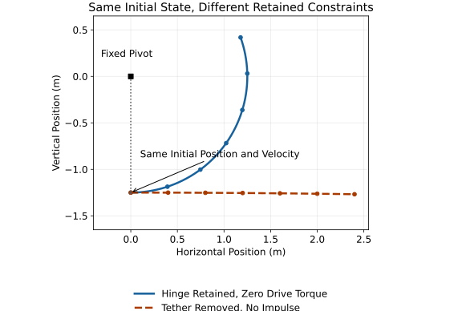

# Why Physics Matters in Golf {#sec-why_physics}

[]{#sec-01_why_physics}
[]{#ch-01_why_physics}

::: {.callout-tip}
## The Central Mystery

A swing can feel easy while transmitting large forces. A large joint moment can occur while the club barely speeds up. Two swings can reach similar positions and then produce different strikes. To understand these possibilities, we must connect the motion we see to the forces, energy and constraints that make it possible.

Our central question is: **how does a golfer organize a coupled mechanical system to deliver the club to a useful impact state?** That question includes speed, orientation, contact location and timing. It also includes the body's ability to produce forces, tolerate loads and respond to disturbances. No single angle, force peak or ratio answers it.
:::

## What We Actually Know About Swings

Video and motion capture describe how the body and club move. Force plates measure external contact forces and moments. Other instruments can observe club delivery, ball launch or muscle electrical activity. Each observes a different part of the process. A useful explanation connects these observations through a model whose assumptions can be inspected and whose predictions can be tested.

For example, an observed increase in clubhead speed establishes a change in motion. It does not identify which muscles supplied the energy. An inverse-dynamics calculation can estimate net joint forces and moments, given suitable kinematics, inertial parameters and external loads. It still does not uniquely determine the forces of individual muscles. Several muscles, tendons and passive tissues can contribute to the same net result.

We will distinguish three kinds of statement throughout this book: an identity derived within a declared model, a prediction that depends on fitted or assumed parameters, and an empirical claim about golfers. The first can be checked mathematically; the second needs numerical and model checks; the third needs relevant measurements. Moving from one category to another requires evidence.

## Two Incomplete Stories

### The Kinematic Story

Kinematics describes positions, orientations and their time derivatives. It is indispensable: geometry determines where the club can reach, and velocity determines how it approaches the ball. A pose alone, however, omits velocity and any internal state needed to predict what follows. A measured hip angle is also meaningless without its reference frame, rotation convention and point in the swing.

Dynamics links the motion to applied forces and moments, mass distribution and constraints. The relation works in both directions: forces change motion, while configuration and velocity change the response to those forces. The same wrist moment can have different effects when the arm–club geometry differs. This dependence is one reason a coaching cue cannot be translated into a universal torque prescription.

### The Strength and Flexibility Story

Force capacity, range of motion and coordination restrict the movements a person can produce. They do not select a unique swing. Even an ideal actuator has limits on torque and speed; a muscle's response also depends on activation and mechanical history. A model that prescribes arbitrary joint torques has abstracted away those physiological restrictions.

A useful analysis therefore asks both whether a motion produces desirable impact conditions and whether the body can generate it under the relevant loading and contact conditions. More available strength need not produce greater clubhead speed in every swing. Less visible motion or less net joint torque need not mean less muscular activity.

## The Missing Story: Forces, Motion and Work {#the-missing-story-forces}

For a point mass in an inertial frame, Newton's equation is $m\bm a=\sum\bm F$. Momentum $\bm p=m\bm v$ describes its motion; force is the rate of change of momentum. Momentum is not an additional applied force. In rotating coordinates, centrifugal and Coriolis terms help express the same dynamics, but they must not be added again as physical external forces in an inertial-frame force balance.

Acceleration changes the velocity vector. It can change speed, direction, or both. For a smooth path with nonzero speed $v$ and local curvature radius $\rho$,

$$
\bm a=\dot v\,\bm t+\frac{v^2}{\rho}\bm n.
$$

Here $\bm t$ is the unit tangent and $\bm n$ points toward the center of curvature. The normal term $v^2/\rho$ is not the full acceleration unless the tangential term vanishes. A real clubhead does not generally follow a circle about a fixed shoulder, so arm length alone does not determine $\rho$.

For that point mass, power and kinetic energy obey

$$
P=\sum\bm F\cdot\bm v=\frac{dK}{dt},\qquad
K=\frac12mv^2.
$$

A force perpendicular to velocity can turn the path without changing kinetic energy. Work is power integrated over time, or force integrated along displacement. Thus a large force, a large acceleration, a large power and a large accumulated work are four different claims.

A rigid club adds rotation. Its kinetic energy includes COM translation and rotation about the COM. A force applied at a moving grip does work at the grip's velocity, and an applied couple does work at the club's angular velocity. Clubhead speed by itself is insufficient to compute either total club energy or the work of each applied load.

::: {.callout-note}
## Why Attribution Matters

Consider a manufactured point mass of $m=0.20$ kg on a massless tether of fixed length $L=1.25$ m, attached to a fixed pivot. Gravity is $g=9.81$ m/s$^2$; there is no drag or hinge friction. At the bottom, the mass moves horizontally at $v=40$ m/s. These values are chosen to expose a mechanical distinction, not to represent a measured golfer.

The required upward normal acceleration is $v^2/L=1280$ m/s$^2$, about $130.48g$. Upward tension $T$ and downward gravity give

$$
T-mg=m\frac{v^2}{L},\qquad T=257.962\ \mathrm N.
$$

Both forces are perpendicular to the velocity at that instant, so their instantaneous powers are zero. The mass nevertheless has $K=160$ J of kinetic energy supplied before this instant. Large tension does not establish that the support is currently adding energy, nor does it tell us what a human hand would expend to sustain the load.
:::

## Two Kinds of Terms: A Preview {#two-kinds-of-forces-a-preview}

The book uses a **drift–input decomposition** to ask a precise question: at a given state, what motion rate would a chosen model predict at zero selected input, and how does changing that input alter the prediction? This is a mathematical split of a model's state derivative. It is not a universal division of physical forces into effortless effects and muscular effort.

### Drift: Evolution at the Chosen Input Zero {#drift-the-physics-you-cant-control}

Drift depends on the model, its state and the definition of input zero. It can include motion resulting from energy supplied earlier. For example, a fast unforced pendulum already contains kinetic energy; inertia shapes its evolution but does not create energy. If elastic tissues or a flexible shaft are modeled, their stored energy and internal state also matter.

A past control changes the state at which future drift is evaluated. Consequently, saying that an instantaneous acceleration is attributed to drift does not mean that earlier muscle action was unimportant. Nor does it mean that the trajectory is unavoidable: a feasible future input can alter it.

### Control: The Selected Model Input {#control-what-your-muscles-add}

In our first rigid-link models, the input is an applied generalized actuator torque. A detailed human model might instead use muscle excitation and include activation and contraction dynamics. These are different input choices. A muscle command is not generally an instantaneous, unconstrained joint-torque command.

Antagonist muscles can exert opposing moments with a small or zero net joint moment. Such co-contraction can change joint stiffness and tissue loads. Therefore **zero net torque is not muscle relaxation**, and net mechanical work is not metabolic expenditure. Claims about effort require measurements or an additional physiological model.

::: {.callout-important}
## Drift vs. Control in a Simple Fall

A freely falling point mass, released from rest through a height $h$ in uniform gravity without air resistance, gains $mgh$ in kinetic energy. At $h=1$ m and $m=0.20$ kg, this is $1.962$ J and the final speed is $\sqrt{2gh}=4.429$ m/s. To reach $40$ m/s from rest using only gravity in this model would require a drop of $81.55$ m.

This comparison is an energy check for the specified mass, not a percentage of a golfer's energy budget. A golfer's segments have different height changes, initial velocities, muscular work and elastic storage. A quantitative attribution must identify the system boundary and time interval and balance all relevant energy flows. There is no general rule here that passive dynamics supplies most downswing work or that muscles mainly steer.
:::

## The Central Equation

For independent local coordinates $q$ of an ideal rigid mechanical model, with no additional external loads or unresolved constraints, write

$$
M(q)\ddot q+c(q,\dot q)+g(q)=B(q)u.
$$
[]{#eq-ch01_euler_lagrange}

The symmetric positive-definite mass matrix $M$ describes inertia. The vector $c$ is the velocity-dependent inertial bias. We define $g=\nabla_q V$ using gravitational potential $V$, so the gravitational generalized force is $-g$. The matrix $B$ maps the selected inputs into generalized forces. When each independent angular coordinate has its own conjugate actuator torque, $B$ can be the identity. A factorization $c=C\dot q$ is common but the matrix $C$ is not unique. These conventions follow standard multibody mechanics [@TedrakeMultibodyEnergy].

Solving for acceleration gives

$$
\ddot q=\underbrace{-M^{-1}(c+g)}_{a_0}
       +\underbrace{M^{-1}Bu}_{a_u}.
$$

The inverse is analytical notation; numerical implementations solve a linear system. The term $M\ddot q$ is part of the force balance, not itself a drift force. For $x=(q,\dot q)$, the corresponding state equation is

$$
\dot x=f(x)+G(x)u,\qquad
f(x)=\begin{bmatrix}\dot q\\a_0\end{bmatrix},\quad
G(x)=\begin{bmatrix}0\\M^{-1}B\end{bmatrix}.
$$
[]{#eq-ch01_affine}

Drift includes the kinematic block $\dot q$. This state closes the ideal rigid model; it does not claim that pose and rate fully specify a human. Generalized velocities may also differ from coordinate rates in spatial representations, as Chapter 2 explains.

### Constraints and Energy Complete the Interpretation

When coordinates retain an ideal, stationary holonomic constraint $h(q)=0$, its reaction appears as $J^T\lambda$, where $J=\partial h/\partial q$. The dynamics and the differentiated constraint must be solved together:

$$
M\ddot q+c+g=Bu+J^T\lambda,\qquad
J\ddot q+\dot J\dot q=0.
$$

For independent constraint rows and nonsingular $M$, these equations determine acceleration and reaction. Changing $u$ generally changes $\lambda$ too; one cannot remove an actuator torque while arbitrarily freezing the old reaction. Foot contact additionally requires feasible normal forces and friction. A foot cannot pull on an ordinary floor; a model may need to change contact mode when a constraint ceases to be feasible.

For ideal stationary constraints, $J\dot q=0$ and their total power is $\lambda^TJ\dot q=0$. They can nevertheless transmit forces and transfer energy between connected bodies. A moving support can supply power. For the simple rigid system with stationary ideal constraints, no dissipation and no other loads,

$$
E=\frac12\dot q^TM\dot q+V(q),\qquad
\dot E=\dot q^TBu.
$$

Gravity exchanges potential and kinetic energy; internal inertial coupling redistributes motion. Neither creates total mechanical energy. Modeling the club alone places hand forces outside its boundary, whereas modeling body and club together makes their contact internal. This boundary change must be stated when comparing energy accounts.

### The Input Baseline Matters

If $u=\bar u(x)+w$, then exactly the same dynamics can be written

$$
\dot x=\bigl[f(x)+G(x)\bar u(x)\bigr]+G(x)w.
$$

The new drift contains the selected baseline input. As a scalar illustration, let angular acceleration be $a=-2+0.5u$, with $a$ measured in rad/s$^2$, torque $u$ in N m and the gain $0.5$ in (rad/s$^2$)/(N m). Take $u=6$. The total is $a=1$. With baseline $\bar u=4$, the zero-residual acceleration is $0$ and $w=2$ supplies the same $a=1$. A ratio of drift magnitude to input-induced magnitude changes from $2/3$ to $0$ although the physical acceleration is unchanged. The admissible input set must be shifted with the baseline as well.

A Drift-Control Ratio (DCR) therefore requires a declared input zero, state or task quantity, norm, units and treatment of small denominators. It measures the stated decomposition; it does not alone measure energetic efficiency, tissue load or expertise. Comparing skill groups or prescribing a swing from it requires separate validation. Affine dependence on inputs at one fixed state also does not imply that complete nonlinear swing trajectories can be superposed.

[]{#why-physics-matters}

## Why a Physics Textbook for Golfers?

The purpose is to connect useful observations to mechanisms and testable questions. Existing research already combines motion analysis, inverse dynamics, forward simulation and energy analysis. Our contribution should be a clear account of how those perspectives fit together, with enough detail to reproduce an argument and understand its limitations.

For example, Nesbit and Serrano used kinematically driven body and club models to estimate work and power for one selected swing from each of four amateur golfers [@Nesbit2005b]. That supports an explicit energy accounting approach. Model-derived joint work in four swings is not a direct measurement of muscle metabolism or a population law relating skill to passivity.

MacKenzie and Sprigings developed a three-dimensional forward model with a flexible shaft and torque generators, fitted aspects of its motion to a golfer and optimized a clubhead-speed objective [@MacKenzie2009]. Its methods include actuation and timing; it is not evidence that a universal passive-work percentage applies to golf. A result optimized for one objective within one model must be tested before being used as individual coaching advice.

### Connecting the Swing to the Shot

A useful chain of reasoning starts with feasible body and club states, then computes the effects of inputs and contacts over time, then evaluates the delivered club state at impact. Ball launch requires a collision model or measurements of the collision. Flight then depends on the ball's launch velocity, spin and aerodynamic environment. Optimizing one joint moment or maximizing clubhead speed is not equivalent to optimizing the final shot.

Timing is part of the mechanics. Changing a torque earlier in the downswing changes later geometry, velocity and the forces needed to preserve contact. It can also change when and where impact occurs. A comparison at the same clock time may therefore answer a different question from a comparison at each swing's actual impact. This is why later chapters distinguish local acceleration attribution from finite-time trajectory and impact sensitivity.

A coaching cue can be investigated through this chain: measure how the player's motion changes, estimate loads under declared assumptions, predict delivery, and check the result against observed impact and ball flight. The mechanics does not guarantee that the cue produces the intended change, or that the same cue acts identically on another golfer.

[]{#the-double-pendulum}

## The Double Pendulum: Your Guide

Chapter 3 uses two effective rigid links joined by planar hinges, with a fixed proximal pivot. Its coordinates describe one link's absolute angle and the second link's relative angle. It exposes inertial coupling, energy transfer and the distinction between joint acceleration and endpoint acceleration in a model small enough to derive and check completely.

These are effective links, not a unique anatomical map. An arm–club interpretation and an upper-arm–forearm interpretation are different models. The baseline omits bilateral grasp, torso translation, three-dimensional face orientation, shaft deformation and ball contact. It is a starting point for a model hierarchy, not proof that those omitted effects are small.

Some unforced double pendulums exhibit chaotic dynamics in some regimes. Nonlinearity alone does not establish chaos, and a sensitive impact result over a short interval is not a demonstration of long-time chaotic behavior. Feedback can reduce some disturbances under suitable conditions; its presence alone does not guarantee stability. The relevant question for a swing is how plausible initial-state, input and model uncertainty affects the outcome over the swing interval.

### What Happens If You Let Go Mid-Swing?

Three interventions must be kept separate. Setting an ideal hinge's drive torque to zero retains the hinge and its reaction forces. Removing the attachment changes the constraint and hence the equations. Asking a person to relax changes an evolving physiological system; it is not automatically either of those mathematical operations. The coaching word “release” must therefore be operationally defined before a model can test it.

Return to the manufactured tethered point mass. Choose an inertial plane with horizontal coordinate $X$ and upward $Y$, with the pivot at the origin. Let $\theta$ increase from downward vertical toward positive $X$. Retaining the hinge with zero drive torque gives

$$
\ddot\theta=-\frac{g}{L}\sin\theta,\qquad
(X,Y)=(L\sin\theta,-L\cos\theta).
$$

Start at $\theta(0)=0$ and $\dot\theta(0)=32$ rad/s. Removing the tether without an impulse instead preserves initial position and velocity but gives

$$
(X,Y)=(40t,-1.25-\tfrac12gt^2).
$$

The first trajectory curves upward initially because the retained tether supplies tension; the second falls below the horizontal tangent. Both have zero drive torque. Their different accelerations demonstrate why “zero torque” does not specify a trajectory without the retained constraints and initial state.

On narrow screens, scroll the figure or [open it at full size](../figures/why_physics_release.svg).

::: {#fig-ch01_drift_control_schematic}
::: {.aba-diagram-scroll role="region" aria-label="Retained pendulum and released point-mass trajectories; scroll horizontally" tabindex="0"}

:::

Same Initial State, Different Constraints. Manufactured Point-Mass Example With L = 1.25 m, Initial Speed 40 m/s and g = 9.81 m/s². Markers Are 10 ms Apart Through 60 ms. The Retained Hinge Has Zero Drive Torque; the Released Mass Has No Tether Force. Neither Trajectory Is a Measured Golf Swing.
:::

For a released rigid club under uniform gravity and no aerodynamic force, it is the **center of mass** that follows a ballistic path. The clubhead also moves because the club rotates. Zero external moment about the COM conserves angular momentum; it does not generally keep a three-dimensional body's angular velocity constant.

The retained example also disproves a supposed need for nonzero drive torque at every instant of a predictable motion. A specified initial state and zero-input dynamics already define a trajectory. Whether that trajectory reaches a particular target, remains feasible or is robust to uncertainty is a further question. Chapter 3 computes such model trajectories with declared, manufactured parameters.

## A Road Map

[Chapter 2](ch02_language_of_motion.html#sec-02_language_of_motion) defines frames, coordinates, configuration, velocity and predictive state. It explains why a pose is not a complete description of an evolving system.

[Chapter 3](ch03_double_pendulum.html#sec-03_double_pendulum) derives the two-link equations, checks their energy balance and separates mathematical coupling from claims about anatomy or chaotic behavior.

[Chapter 4](ch04_forces_and_torques.html#sec-04_forces_and_torques) examines applied loads, generalized moments and directional acceleration. [Chapter 5](ch05_affine_structure.html#sec-05_affine_structure) develops the chosen-input affine form and its limits. Together these tools support later treatments of constraints, inverse dynamics, control, uncertainty and impact.

::: {.callout-important}
## Key Takeaways

1. Motion, forces and constraints must be interpreted together. Geometry changes force response, and forces change future geometry.
2. Normal acceleration can be large while instantaneous power is zero. Momentum and inertia are not new sources of energy.
3. Drift is a model's evolution at a specified input zero. It can reflect earlier work and retained internal state.
4. Net torque, muscle activation, contact force, mechanical work and metabolic effort are distinct quantities.
5. A useful model carries its assumptions through to finite-time impact predictions and is tested against the observations relevant to its claim.
:::

::: {.callout-note}
## On This Site

- **[The Affine Nature of the Golf Swing](../../affine-nature-golf-swing.html)** — Overview of drift–input modeling in the swing.
- **[Part 1: Control-Affine Framework](../../theory-part1.html)** — Derivation of the chosen-input decomposition.
- **[Superposition in Control-Affine Systems](../../superposition.html)** — Fixed-state attribution and local perturbations in multibody models.
:::

## Chapter Exercises

1. **Free Fall.** A point mass is released from rest 1 m above a horizontal floor. Ignore air resistance and use $g=9.81$ m/s$^2$. Find flight time and speed immediately before contact. Does doubling mass change them?
2. **The Spinning Ball.** Contrast a sphere spinning about a vertical axis at an ideal point contact with a sphere initially backspinning about a horizontal axis while its center is stationary. What does tangential contact friction do in each idealization? Why can real balls eventually stop?
3. **The Retracting Tether.** A mass moves in a horizontal plane without gravity or friction. An inward tension acts along a tether through a fixed hole, while tether length $r$ decreases. Is there torque about the hole? Can tension do positive work?
4. **The Mystery of Cues.** Does “rotate your hips faster” specify a unique joint torque? What additional observations and assumptions would an inverse-dynamics calculation require?
5. **Two Throws.** The same ball starts from rest at the same initial height in two trials and leaves the hand at the same final height, at speeds $v$ and $2v$. Neglect air resistance during the throws. Compare the changes in kinetic energy and gravitational work. Can peak muscle force be inferred from those speeds?
6. **Drift and the Baseline.** Recompute the scalar example $a=-2+0.5u$ at $u=6$ using baseline $\bar u=4$. Explain why the changed attribution does not demonstrate improved skill.

## Worked Answers

### 1. Free Fall

The displacement is $h=gt^2/2$, so $t=\sqrt{2h/g}=0.4515$ s and the final speed is $gt=4.429$ m/s. Both are independent of mass in this model: doubling gravitational force also doubles inertia. Contact deceleration at the floor is outside this calculation.

### 2. The Spinning Ball

For pure vertical-axis spin, the ideal bottom point lies on the spin axis and has no tangential slip. A point-contact model with tangential Coulomb friction alone has no torsional resistance about that normal. A real finite contact patch can develop a resisting torsional moment.

For horizontal-axis backspin with a stationary center, the contact point slips. Tangential friction changes both translation and spin and dissipates mechanical energy while slipping. Once ideal rolling without slip is reached on a rigid level surface, rolling can persist without dissipative friction. Real deformation, rolling resistance and air drag can remove energy. Ice is not an exactly frictionless model.

### 3. The Retracting Tether

The tension has zero moment about the hole because its line of action passes through it. Yet its power is $P=-T\dot r$, which is positive during retraction. With no external torque about the hole, angular momentum $mr^2\dot\theta$ is conserved even as energy increases through work done by the puller. For $T=5$ N and $\dot r=-0.3$ m/s, power is $1.5$ W. “Pulling harder” is therefore not synonymous with applying a larger pivot torque.

### 4. The Mystery of Cues

The cue names a desired change in motion, not an actuator command. We need a defined coordinate and reference frame, time-resolved motion and its derivatives, inertial properties, external loads and a feasible contact model. Even then, inferred net joint torques do not uniquely identify muscle forces or establish which coaching cue would produce them.

### 5. Two Throws

The kinetic-energy changes are $mv^2/2$ and $2mv^2$, so the second is four times the first. With the same initial and final heights, gravitational work is identical: $mg(Y_{\rm initial}-Y_{\rm final})$. Under the stated assumptions the larger final energy requires more non-gravitational work on the ball, but peak force depends on the path and force-time history. Muscle forces further depend on body mechanics; ball speed alone does not determine them.

### 6. Drift and the Baseline

The original terms are $-2$ and $3$, summing to $1$. The shifted terms are $-2+0.5(4)=0$ and $0.5(6-4)=1$. Nothing about the motion or body has changed. Only the definition of the zero-input comparison changed, so a different ratio cannot by itself demonstrate a physiological or coaching improvement.
