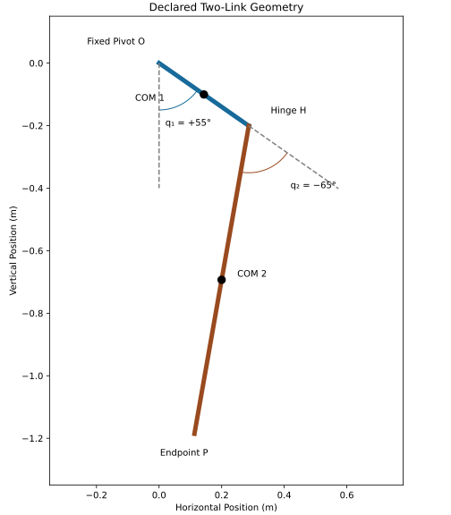

# The Double Pendulum: Golf's Simplest Useful Model {#sec-03_double_pendulum}

[]{#ch-03_double_pendulum}

[]{#box:ch03_why_model}

::: {.callout-note}
## Why This Model?

A two-link model lets us ask a precise question: how do geometry, inertia, gravity and applied joint moments combine to produce motion at a distal endpoint? The answer already contains nonlinear coupling, moving-joint energy transfer and a distinction between joint motion and task motion. These are useful ingredients for understanding the golf swing.

The simplification does not follow from a claim that the wrist, hips or torso contribute little. Here the first link is an effective proximal body and the second is an effective distal body. Interpreting their hinge as an elbow produces a different anatomical model from interpreting it as an arm–club connection. We will call them link 1, link 2 and the connecting hinge throughout. Their coordinates are not measurements of particular anatomical joints.

The model is planar, rigid and supported at a fixed pivot. It omits a moving hand path, bilateral grasp, shaft deformation, spatial clubface orientation and ball contact. Deriving its equations exactly does not validate those simplifications for a human swing. Nor does having explicit differential equations give a general closed-form trajectory: numerical integration is normally needed.

:::

## The Double Pendulum: Physical Setup {#the-double-pendulum-physical-setup}

### The System {#the-system}

Let $O$ be the fixed pivot and $H$ the connecting hinge. Link lengths are $L_1,L_2$, masses $M_1,M_2$, and COM distances from each proximal hinge are $r_1,r_2$. The centroidal planar moments of inertia are $I_1,I_2$. They have units kg m$^2$ and exclude the parallel-axis contribution. Define

$$
K_1=I_1+M_1r_1^2,\qquad K_2=I_2+M_2r_2^2.
$$

Thus $K_i$ is the inertia about the body's own proximal hinge, whereas $I_i$ is about its COM. For a moving hinge, $\tfrac12K_i\omega_i^2$ alone is not the body's full kinetic energy: COM translation must still be accounted for correctly. A point mass at the COM has $I_i=0$ but generally $K_i>0$.

The hinges impose position attachment and permit relative rotation. They are frictionless in this baseline; prescribed actuator moments can nevertheless act about them. The applied generalized moments are $\tau_1$ at the base and $\tau_2$ between the bodies. No muscle model is implied by these inputs.

$$
\bm q=\begin{bmatrix}\theta_1\\\theta_2\end{bmatrix},\qquad
\alpha_1=\theta_1,\quad\alpha_2=\theta_1+\theta_2.
$$

[]{#eq-ch03_coords}

Angles increase counterclockwise from downward vertical in an inertial plane with horizontal $x$ and upward $y$. The first coordinate is absolute; the second is relative. Zero first angle means downward, not toward the target. The distal endpoint $P$ is a geometric point a distance $L_2$ from $H$; it is not necessarily the distal COM.

On narrow screens, scroll the figure or [open it at full size](../figures/double_pendulum_verified.svg).

::: {#fig-ch03_double_pendulum}
::: {.aba-diagram-scroll role="region" aria-label="Two-link geometry with angle arcs and centers of mass; scroll horizontally" tabindex="0"}

:::

Declared Two-Link Geometry. The First Angle Is Measured From Downward Vertical; the Second Is Relative to the First Link. COM Markers and Angle Arcs Are Computed From the Same Geometry. The Distal Endpoint and COM Are Different Points. This Is a Manufactured Planar Model, Not Measured Golf Anatomy.
:::

[]{#box:ch03_absolute_relative}

::: {.callout-note}
## Absolute vs. Relative Angles

Both coordinate conventions describe the same physical motion. Relative coordinates make a hinge actuator's power easy to express; absolute coordinates can make some energy terms simpler. Neither removes inertial coupling. The absolute distal angular velocity is $\dot\theta_1+\dot\theta_2$, not $\dot\theta_2$.

Writing $\bm\alpha=\bm A\bm q$ with $\bm A=\begin{bmatrix}1&0\\1&1\end{bmatrix}$, virtual work requires

$$
\bm Q_\alpha=\bm A^{-T}\bm\tau
=\begin{bmatrix}\tau_1-\tau_2\\\tau_2\end{bmatrix},\qquad
\bm M_\alpha=\bm A^{-T}\bm M_q\bm A^{-1}.
$$

The hinge moment acts oppositely on the two bodies. Its total power is $\tau_2(\dot\alpha_2-\dot\alpha_1)=\tau_2\dot\theta_2$. The full actuator power is therefore $\bm\tau^T\dot{\bm q}$ in relative coordinates. Changing coordinates without transforming forces breaks this equality.

:::

### Numerical Parameters for Illustration {#sec-ch03_numerical}

The following manufactured parameters match the later affine and constraint-force examples, so their results can be compared directly. This is not a measured golfer or a fitted arm–club model. Link 2 has endpoint length 1.0 m; its COM is at 0.5 m. We use $g=9.81$ m/s$^2$.

$$
\begin{array}{c|cc}
 &\text{Link 1}&\text{Link 2}\\\hline
L\ (\mathrm m)&0.35&1.0\\
M\ (\mathrm{kg})&2.5&0.4\\
r\ (\mathrm m)&0.175&0.5\\
I_{\rm COM}\ (\mathrm{kg\,m^2})&0.025&0.03\\
K_{\rm hinge}\ (\mathrm{kg\,m^2})&0.1015625&0.13
\end{array}
$$

Point-mass and rigid-body parameters describe different mass distributions: adding a hinge inertia to an existing COM-translation term double counts its parallel-axis contribution. For compatibility with the expanded notation below, $L_{i,\mathrm{cm}}=r_i$.

[]{#box:ch03_roadmap}

::: {.callout-note}
## Roadmap: Deriving the Equations of Motion

First locate both COMs and compute their velocities. Add translational and centroidal rotational kinetic energy, then gravitational potential energy. Apply the forced Euler–Lagrange equations and collect mass, velocity-bias and potential-gradient terms. Finally, independently check energy balance and map the joint motion to the endpoint task. These checks connect the algebra to quantities a reader can interpret physically.

:::

## The Kinetic Energy {#the-kinetic-energy}

To derive the equations of motion, we start with energy. Every moving system has kinetic energy.

### Kinetic Energy of Link 1 {#kinetic-energy-of-link-1}

Link 1 rotates about the fixed pivot. Its COM translation and centroidal rotation combine to give:

$$
T_1 = \frac{1}{2} K_1 \dot{\theta}_1^2
$$

[]{#eq-ch03_T1}

Here $K_1=I_1+M_1L_{1,\mathrm{cm}}^2$. The centroidal inertia is retained; the point-mass limit is obtained by setting $I_1=0$, not $K_1=0$.

### Kinetic Energy of Link 2 {#kinetic-energy-of-link-2}

Link 2 has a moving proximal hinge. Its absolute angular rate and COM velocity must both be included.

The connecting hinge is at position:

$$
\bm{r}_{H} = L_1 (\sin \theta_1, -\cos \theta_1)
$$

[]{#eq-ch03_elbow_pos}

Its velocity is:

$$
\dot{\bm{r}}_{H} = L_1 \dot{\theta}_1 (\cos \theta_1, \sin \theta_1)
$$

[]{#eq-ch03_elbow_vel}

The center of mass of link 2 is at distance $L_{2,\text{cm}}$ from the connecting hinge, at angle $\theta_1 + \theta_2$:

$$
\bm{r}_{\text{cm},2} = L_1 (\sin \theta_1, -\cos \theta_1) + L_{2,\text{cm}} (\sin(\theta_1 + \theta_2), -\cos(\theta_1 + \theta_2))
$$

[]{#eq-ch03_cm2_pos}

Its velocity is:

$$
\begin{aligned}
\dot{\bm{r}}_{\text{cm},2} &= L_1 \dot{\theta}_1 (\cos \theta_1, \sin \theta_1) \\
&\quad + L_{2,\text{cm}} (\dot{\theta}_1 + \dot{\theta}_2) (\cos(\theta_1 + \theta_2), \sin(\theta_1 + \theta_2))
\end{aligned}
$$

[]{#eq-ch03_cm2_vel}

The kinetic energy of link 2 is the sum of COM translation and centroidal rotation:

$$
T_2 = \frac{1}{2} M_2 |\dot{\bm{r}}_{\text{cm},2}|^2 + \frac12 I_2(\dot\theta_1+\dot\theta_2)^2
$$

[]{#eq-ch03_T2_general}

Expanding $|\dot{\bm{r}}_{\text{cm},2}|^2$:

$$
\begin{aligned}
|\dot{\bm{r}}_{\text{cm},2}|^2 &= \big[ L_1 \dot{\theta}_1 \cos \theta_1 + L_{2,\text{cm}} (\dot{\theta}_1 + \dot{\theta}_2) \cos(\theta_1 + \theta_2) \big]^2 \\
&\quad + \big[ L_1 \dot{\theta}_1 \sin \theta_1 + L_{2,\text{cm}} (\dot{\theta}_1 + \dot{\theta}_2) \sin(\theta_1 + \theta_2) \big]^2
\end{aligned}
$$

After expanding and simplifying (using $\cos^2 + \sin^2 = 1$ and $\cos \alpha \cos \beta + \sin \alpha \sin \beta = \cos(\alpha - \beta)$):

$$
\begin{aligned}
|\dot{\bm{r}}_{\text{cm},2}|^2 &= L_1^2 \dot{\theta}_1^2 + L_{2,\text{cm}}^2 (\dot{\theta}_1 + \dot{\theta}_2)^2 \\
&\quad + 2 L_1 L_{2,\text{cm}} \dot{\theta}_1 (\dot{\theta}_1 + \dot{\theta}_2) \cos \theta_2
\end{aligned}
$$

[]{#eq-ch03_expansion}

So:

$$
\begin{aligned}
T_2 &= \frac{1}{2} M_2 \big[ L_1^2 \dot{\theta}_1^2 + L_{2,\text{cm}}^2 (\dot{\theta}_1 + \dot{\theta}_2)^2 + 2 L_1 L_{2,\text{cm}} \dot{\theta}_1 (\dot{\theta}_1 + \dot{\theta}_2) \cos \theta_2 \big] \\
&\quad + \frac{1}{2} I_2 (\dot{\theta}_1 + \dot{\theta}_2)^2
\end{aligned}
$$

[]{#eq-ch03_T2_expanded}

### Total Kinetic Energy {#total-kinetic-energy}

$$
\begin{aligned}
T &= T_1 + T_2 \\
&= \frac{1}{2} K_1 \dot{\theta}_1^2 + \frac{1}{2} M_2 \Big[ L_1^2 \dot{\theta}_1^2 + L_{2,\text{cm}}^2 (\dot{\theta}_1 + \dot{\theta}_2)^2 \\
&\quad + 2 L_1 L_{2,\text{cm}} \dot{\theta}_1 (\dot{\theta}_1 + \dot{\theta}_2) \cos \theta_2 \Big] + \frac{1}{2} I_2 (\dot{\theta}_1 + \dot{\theta}_2)^2
\end{aligned}
$$

[]{#eq-ch03_T_total}

Collecting terms:

$$
\begin{aligned}
T &= \frac{1}{2} (K_1 + M_2 L_1^2) \dot{\theta}_1^2 \\
&\quad + \frac{1}{2} (M_2 L_{2,\text{cm}}^2 + I_2) (\dot{\theta}_1 + \dot{\theta}_2)^2 \\
&\quad + M_2 L_1 L_{2,\text{cm}} \dot{\theta}_1 (\dot{\theta}_1 + \dot{\theta}_2) \cos \theta_2
\end{aligned}
$$

[]{#eq-ch03_T_rearranged}

[]{#box:ch03_why_T}

::: {.callout-note}
## Why Kinetic Energy Matters

Kinetic energy is energy of motion, not a fuel supply separate from the mechanics. In this model, energy can enter through applied moments and can exchange between kinetic and gravitational potential forms. In a golfer, chemical energy, elastic storage, dissipation, moving support and impact add further terms. There is no reason for all backswing energy to end up in club motion; other segments still move and energy can be stored or dissipated.

The conservative variational statement is stationary action, $\delta\int(T-V)\,dt=0$, with fixed endpoint variations. Stationary does not always mean a minimum, and prescribed nonconservative moments require the forced equations below. This principle is not an optimization claim about a golfer's chosen movement.

:::

## The Potential Energy {#the-potential-energy}

The work of a uniform gravitational field is represented by gravitational potential energy for the two bodies.

[]{#ch03_potential}

::: {.callout-note}
## Gravitational Potential Energy

The potential energy of a mass at height $h$ is $V = Mgh$ (relative to some reference).

:::

For link 1, the center of mass is at height:

$$
h_1 = -L_{1,\text{cm}} \cos \theta_1
$$

[]{#eq-ch03_h1}

The pivot is the zero-height reference; downward COM positions have negative height.

For link 2, the center of mass is at height:

$$
h_2 = -L_1 \cos \theta_1 - L_{2,\text{cm}} \cos(\theta_1 + \theta_2)
$$

[]{#eq-ch03_h2}

Total potential energy:

$$
\begin{aligned}
V &= M_1 g h_1 + M_2 g h_2 \\
&= -M_1 g L_{1,\text{cm}} \cos \theta_1 - M_2 g \big[ L_1 \cos \theta_1 + L_{2,\text{cm}} \cos(\theta_1 + \theta_2) \big]
\end{aligned}
$$

[]{#eq-ch03_V_total}

[]{#box:ch03_potential_landscape}

::: {.callout-note}
## The Potential Energy Landscape

Gravity does work $W_g=V(q_a)-V(q_b)$ between configurations. A path ending lower can release potential energy, but a downswing label alone does not specify both COM heights. Lifting the system earlier required work, and gravity supplies no net work over a closed configuration cycle. Its contribution to club speed must be assessed together with actuator work and the energy retained in the proximal body.

:::

## The Lagrangian and Euler-Lagrange Equations {#the-lagrangian-and-euler-lagrange-equations}

Now we use the Lagrangian formalism.

[]{#box:ch03_why_lagrangian}

::: {.callout-note}
## Why the Lagrangian Approach?

Generalized coordinates solve the ideal hinge geometry before dynamics are computed. The equal-and-opposite hinge forces cancel in virtual work over compatible motions, so they need not be explicit unknowns in the coordinate equations. They still exist physically and must be recovered from body force balances when load or interface power is the question. Newton–Euler and Lagrange formulations express the same mechanics; recursive force-balance methods are also efficient for large systems.

:::

[]{#ch03_lagrangian}

::: {.callout-note}
## Lagrangian

The Lagrangian is defined as:

$$
\mathcal{L} = T - V
$$

[]{#eq-ch03_lagrangian_def}

It's the kinetic energy minus the potential energy.

:::

The Euler-Lagrange equations state that the equations of motion are:

$$
\frac{d}{dt} \left( \frac{\partial \mathcal{L}}{\partial \dot{q}_i} \right) - \frac{\partial \mathcal{L}}{\partial q_i} = \tau_i
$$

[]{#eq-ch03_euler_lagrange}

for each coordinate $q_i$. Here, $\tau_i$ is the generalized applied moment conjugate to $q_i$. In a biomechanical model, mapping muscle forces to this resultant is a separate modeling step.

This looks abstract. But it's a recipe: compute two partial derivatives of the Lagrangian, take one time derivative, subtract them, and you get the equation of motion for that coordinate.

Let's do it for the double pendulum.

### The $\theta_1$ Equation {#the-theta_1-equation}

We need:

- $\frac{\partial \mathcal{L}}{\partial \dot{\theta}_1}$
- $\frac{\partial \mathcal{L}}{\partial \theta_1}$

From $T$ (The [collected kinetic energy](#eq-ch03_T_rearranged)), the terms involving $\dot{\theta}_1$ are:

$$
\begin{aligned}
\frac{\partial T}{\partial \dot{\theta}_1} &= (K_1 + M_2 L_1^2) \dot{\theta}_1 + (M_2 L_{2,\text{cm}}^2 + I_2) (\dot{\theta}_1 + \dot{\theta}_2) \\
&\quad + M_2 L_1 L_{2,\text{cm}} [(\dot{\theta}_1 + \dot{\theta}_2) + \dot{\theta}_1] \cos \theta_2 \\
&= (K_1 + M_2 L_1^2) \dot{\theta}_1 + (M_2 L_{2,\text{cm}}^2 + I_2) (\dot{\theta}_1 + \dot{\theta}_2) \\
&\quad + M_2 L_1 L_{2,\text{cm}} (2 \dot{\theta}_1 + \dot{\theta}_2) \cos \theta_2
\end{aligned}
$$

Taking the time derivative:

$$
\begin{aligned}
\frac{d}{dt} \left( \frac{\partial T}{\partial \dot{\theta}_1} \right) &= (K_1 + M_2 L_1^2) \ddot{\theta}_1 + (M_2 L_{2,\text{cm}}^2 + I_2) (\ddot{\theta}_1 + \ddot{\theta}_2) \\
&\quad + M_2 L_1 L_{2,\text{cm}} (2 \ddot{\theta}_1 + \ddot{\theta}_2) \cos \theta_2 \\
&\quad - M_2 L_1 L_{2,\text{cm}} (2 \dot{\theta}_1 + \dot{\theta}_2) \dot{\theta}_2 \sin \theta_2
\end{aligned}
$$

Now the partial of $T$ with respect to $\theta_1$:

$$
\begin{aligned}
\frac{\partial T}{\partial \theta_1} &= 0
\end{aligned}
$$

The kinetic energy depends on both rates and the relative angle, but not on an overall rotation of the pair in this fixed inertial plane.

The partial of $V$ with respect to $\theta_1$:

$$
\begin{aligned}
\frac{\partial V}{\partial \theta_1} &= M_1 g L_{1,\text{cm}} \sin \theta_1 + M_2 g L_1 \sin \theta_1 + M_2 g L_{2,\text{cm}} \sin(\theta_1 + \theta_2) \\
&= (M_1 L_{1,\text{cm}} + M_2 L_1) g \sin \theta_1 + M_2 g L_{2,\text{cm}} \sin(\theta_1 + \theta_2)
\end{aligned}
$$

So:

$$
\begin{aligned}
-\frac{\partial \mathcal{L}}{\partial \theta_1} &= -\frac{\partial (T - V)}{\partial \theta_1} = \frac{\partial V}{\partial \theta_1}
\end{aligned}
$$

The Euler-Lagrange equation becomes:

$$
\begin{aligned}
&(K_1 + M_2 L_1^2) \ddot{\theta}_1 + (M_2 L_{2,\text{cm}}^2 + I_2) (\ddot{\theta}_1 + \ddot{\theta}_2) \\
&+ M_2 L_1 L_{2,\text{cm}} (2 \ddot{\theta}_1 + \ddot{\theta}_2) \cos \theta_2 \\
&- M_2 L_1 L_{2,\text{cm}} (2 \dot{\theta}_1 + \dot{\theta}_2) \dot{\theta}_2 \sin \theta_2 \\
&= \tau_1-(M_1 L_{1,\text{cm}} + M_2 L_1) g \sin \theta_1 - M_2 g L_{2,\text{cm}} \sin(\theta_1 + \theta_2)
\end{aligned}
$$

[]{#eq-ch03_eq1_raw}

Similarly, for $\theta_2$:

$$
\begin{aligned}
&(M_2 L_{2,\text{cm}}^2 + I_2) (\ddot{\theta}_1 + \ddot{\theta}_2) + M_2 L_1 L_{2,\text{cm}} \ddot{\theta}_1 \cos \theta_2 \\
&+ M_2 L_1 L_{2,\text{cm}} \dot{\theta}_1^2 \sin \theta_2 \\
&= \tau_2-M_2 g L_{2,\text{cm}} \sin(\theta_1 + \theta_2)
\end{aligned}
$$

[]{#eq-ch03_eq2_raw}

[]{#box:ch03_reading_eqs}

::: {.callout-note}
## Reading the Equations

The acceleration terms express coupled inertia. The remaining quadratic rate terms arise from differentiating kinetic energy; they are generalized moments, not automatically individual hinge forces. Gravity on the right is $-\nabla V$. At a small positive common tilt, its physical generalized moment restores the pair toward downward vertical. Setting only $\theta_1=0$ does not make both gravity terms zero when the distal body remains tilted.

The term proportional to $\dot\theta_1^2\sin\theta_2$ can influence relative motion, but its sign in the bias vector is not the sign of the resulting acceleration. The full coupled system must be solved. Calling a term centrifugal does not establish outward inertial acceleration or a universal straightening action.

:::

## Rewriting in Matrix Form {#rewriting-in-matrix-form}

The Euler-Lagrange equations are hard to parse. Let's rewrite them in the standard form:

$$
\bm{M}(\bm{q}) \ddot{\bm{q}} + \bm{C}(\bm{q}, \dot{\bm{q}}) \dot{\bm{q}} + \bm{g}(\bm{q}) = \bm{\tau}
$$

[]{#eq-ch03_manipulator}

where:

- $\bm{M}(\bm{q})$ is the **mass matrix** (moment of inertia matrix).
- $\bm{C}(\bm{q}, \dot{\bm{q}})$ contains the Coriolis and centrifugal terms.
- $\bm{g}(\bm{q})$ is the potential gradient; the physical generalized gravity torque is $-\bm g$.
- $\bm{\tau}$ is the applied generalized moment vector.

### The Mass Matrix {#the-mass-matrix}

Collecting all terms with $\ddot{\theta}_1$ and $\ddot{\theta}_2$:

$$
\bm{M}(\bm{q}) = \begin{bmatrix}
M_{11}(\theta_2) & M_{12}(\theta_2) \\
M_{21}(\theta_2) & M_{22}
\end{bmatrix}
$$

[]{#eq-ch03_mass_matrix}

where:

$$
\begin{aligned}
M_{11}(\theta_2) &= K_1 + M_2 L_1^2 + M_2 L_{2,\text{cm}}^2 + I_2 + 2 M_2 L_1 L_{2,\text{cm}} \cos \theta_2 \\
M_{12}(\theta_2) &= M_{21}(\theta_2) = M_2 L_{2,\text{cm}}^2 + I_2 + M_2 L_1 L_{2,\text{cm}} \cos \theta_2 \\
M_{22} &= M_2 L_{2,\text{cm}}^2 + I_2
\end{aligned}
$$

The matrix is symmetric and positive definite for the declared positive inertial parameters. It depends on relative configuration, not on velocity. Its off-diagonal terms express kinetic coupling. $M_{11}$ describes the proximal inertia when relative acceleration is held zero; it is not generally the denominator for free-distal response to proximal torque. Eliminating the distal equation at fixed state gives the incremental relation

$$
\delta\ddot\theta_1=
\frac{\delta\tau_1-(M_{12}/M_{22})\delta\tau_2}
{M_{11}-M_{12}^2/M_{22}}.
$$

The positive denominator is the Schur effective inertia. The affine and constraint chapters extend this comparison to input capacity and explicitly imposed locks.

### The Coriolis/Centrifugal Matrix {#the-corioliscentrifugal-matrix}

Define $b=M_2L_1r_2$. The full velocity-bias vector is unambiguous once the coordinates are specified:

$$
\bm c(\bm q,\dot{\bm q})=
b\sin\theta_2\begin{bmatrix}-2\dot\theta_1\dot\theta_2-\dot\theta_2^2\\\dot\theta_1^2\end{bmatrix}.
$$

A Christoffel factorization satisfying $\bm C\dot{\bm q}=\bm c$ is

$$
\bm C=b\sin\theta_2
\begin{bmatrix}
-\dot\theta_2&-(\dot\theta_1+\dot\theta_2)\\
\dot\theta_1&0
\end{bmatrix}.
$$

[]{#eq-ch03_coriolis_matrix}

$\bm C$ has units kg m$^2$/s and its product with angular rate has units N m. Putting $\dot\theta_1^2$ in $C_{21}$ would introduce an extra rate factor when the matrix multiplies velocity. Other factorizations can produce the same $\bm c$; matrix entries alone are not unique physical force channels.

This choice also gives $\dot{\bm M}-2\bm C$ skew-symmetric. Consequently

$$
\dot T=\dot{\bm q}^{T}(\bm M\ddot{\bm q}+\bm c),\qquad
\frac{d}{dt}(T+V)=\bm\tau^T\dot{\bm q}.
$$

This is an independent sign and factor check. It shows why velocity-dependent terms can alter motion and exchange energy between bodies without being an additional energy source. The derivation follows standard manipulator mechanics, with the present COM-inertia and gravity conventions stated explicitly. [@TedrakeMultibodyEnergy]

### The Gravity Vector {#the-gravity-vector}

$$
\bm{g}(\bm{q}) = \begin{bmatrix}
(M_1 L_{1,\text{cm}} + M_2 L_1) g \sin \theta_1 + M_2 g L_{2,\text{cm}} \sin(\theta_1 + \theta_2) \\
M_2 g L_{2,\text{cm}} \sin(\theta_1 + \theta_2)
\end{bmatrix}
$$

[]{#eq-ch03_gravity_vector}

## Numerical Example: A Declared Two-Link State {#numerical-example-a-realistic-golf-swing}

### Before Contact {#at-impact}

Consider $\bm q=(0,-5^\circ)$ and $\dot{\bm q}=(10,9)$ rad/s. These values are chosen for arithmetic, not presented as population averages or a measured impact. With the declared parameters,

$$
\bm M\approx\begin{bmatrix}0.420029758&0.199733629\\0.199733629&0.130000000\end{bmatrix}\ \mathrm{kg\,m^2},
$$

$$
\bm c\approx\begin{bmatrix}1.592335420\\-0.610090199\end{bmatrix}\ \mathrm{N\,m},\qquad
\bm g\approx\begin{bmatrix}-0.170999567\\-0.170999567\end{bmatrix}\ \mathrm{N\,m}.
$$

For zero applied moments, $\ddot{\bm q}=\bm M^{-1}(-\bm c-\bm g)$ is

$$
\ddot{\bm q}\approx(-23.166250085,\ 41.601299717)\ \mathrm{rad/s^2}.
$$

Applying $(5,0)$ N m at that same state instead gives

$$
\ddot{\bm q}\approx(21.020338033,\ -26.287527914)\ \mathrm{rad/s^2}.
$$

The proximal input changes both accelerations and reverses the distal relative acceleration here. That instantaneous comparison does not predict a terminal club speed without integrating the resulting motion and specifying the task.

[]{#box:ch03_forces_meaning}

::: {.callout-note}
## Interpretation of the Force Components

The Schur effective inertia is 0.113156508 kg m$^2$, whereas $M_{11}$ is 0.420029758 kg m$^2$. Using the latter to predict free-distal proximal response would be incorrect. The negative values of $\bm g$ mean the actual generalized gravity moments $-\bm g$ are positive at this configuration.

The 5 N m proximal input supplies 50 W at $\dot\theta_1=10$ rad/s. Torque magnitude, acceleration response and power answer different questions. No comparison with an unsupported generic shoulder-torque budget can determine which muscles supplied this power or how efficiently a golfer moved. The total kinetic energy is 44.242514485 J, shared between the two physical bodies.

:::

## The Interaction Torque: How the Links Couple {#the-interaction-torque-how-the-arm-pulls-the-club}

[]{#ch03_interaction_torque}

::: {.callout-note}
## Interaction Torque

In inverse dynamics, one may call the terms involving another coordinate's motion interaction terms. For example, the first equation contains $M_{12}\ddot\theta_2$. This is an algebraic decomposition conditional on coordinates and bookkeeping. It is not by itself a separately measured hinge torque or a unique amount of transferred energy.

:::

[]{#ch03_interaction}

::: {.callout-tip}
## The Coupled Interaction of Two Links

For a specified motion, changing distal acceleration changes the proximal moment required to maintain that motion. For specified applied moments, both accelerations instead change through the inverse mass matrix. Those inverse- and forward-dynamics questions must not be interchanged.

The ideal hinge can transmit a force even when its applied rotational moment is zero. If $\bm F_H$ acts on link 2 at the moving point $H$, it supplies power $\bm F_H\cdot\bm v_H$ to that body and the opposite power to link 1. With $\tau_2$ acting on link 2, the physical body moment powers are $\tau_2\dot\alpha_2$ and $-\tau_2\dot\alpha_1$; their sum is $\tau_2\dot\theta_2$. The base moment adds $\tau_1\dot\theta_1$. Physical body energies use each COM and centroidal inertia, not arbitrary blocks of the generalized mass matrix.

A whip-like speed pattern is therefore a possible motion to investigate, not a proof that an amateur should accelerate the elbow harder or that an expert feels a particular load. A useful comparison specifies input history, initial energy, constraints, endpoint result and segment power balances. The constraint-force chapter develops that accounting explicitly.

:::

### From Joint Motion to Endpoint Motion

Let $\bm e(\alpha)=(\sin\alpha,-\cos\alpha)^T$ and $\bm t(\alpha)=(\cos\alpha,\sin\alpha)^T$. The endpoint and its Jacobian are

$$
\bm p=L_1\bm e(\theta_1)+L_2\bm e(\alpha_2),\qquad
\bm J_P=\begin{bmatrix}L_1\bm t(\theta_1)+L_2\bm t(\alpha_2)&L_2\bm t(\alpha_2)\end{bmatrix}.
$$

Then

$$
\dot{\bm p}=\bm J_P\dot{\bm q},\qquad
\ddot{\bm p}=\bm J_P\ddot{\bm q}
-L_1\dot\theta_1^2\bm e(\theta_1)
-L_2(\dot\theta_1+\dot\theta_2)^2\bm e(\alpha_2).
$$

The last two terms are normal accelerations toward the respective moving rotation centers in this decomposition. They remain even at zero joint angular acceleration. Endpoint speed is not simply proximal angular rate times the sum of lengths unless relative rotation and geometry satisfy that special rigid-rotation assumption.

At the numerical state above, endpoint velocity is $(22.427699264,-1.655959112)$ m/s. With zero applied moments, endpoint acceleration is $(41.719934305,393.019565568)$ m/s$^2$. Its magnitude is dominated by the normal component; that does not mean speed is increasing at the same rate. The speed derivative is the projection $\dot{\bm p}\cdot\ddot{\bm p}/|\dot{\bm p}|$ when speed is nonzero.

The Jacobian determinant is $L_1L_2\sin\theta_2$. At aligned links it loses rank: one instantaneous endpoint acceleration component cannot be chosen freely using joint accelerations. This kinematic task singularity does not make the mass matrix singular. Underactuation, task rank and inertia are different properties.

## Chaotic Dynamics: What Sensitivity Establishes {#chaotic-dynamics-why-small-differences-matter}

[]{#ch03_chaos}

::: {.callout-note}
## Chaotic Dynamics

Sensitive finite-time response alone does not diagnose chaos. A chaos claim needs a specified dynamical system and regime, typically sustained sensitive dependence on a bounded invariant set, with an appropriate diagnostic such as an asymptotic Lyapunov exponent. Large transient amplification, an unstable equilibrium or two different terminal outcomes is not sufficient by itself.

:::

Experiments and simulations on a mechanical double pendulum have demonstrated chaotic motion in specified conditions. That evidence concerns the studied pendulum and initial states, not a controlled human swing. [@Shinbrot1992DoublePendulum] The unforced double pendulum can have regular and chaotic regimes. Nonlinearity does not make every initial condition chaotic. Near the stable downward equilibrium, the conservative linearization is

$$
\bm M_0\delta\ddot{\bm q}+\bm K_g\delta\bm q=0,\qquad
\bm K_g=g\begin{bmatrix}M_1r_1+M_2L_1+M_2r_2&M_2r_2\\M_2r_2&M_2r_2\end{bmatrix}.
$$

The declared model has small-oscillation angular frequencies approximately 3.644068205 and 7.552873204 rad/s, obtained from $\det(\bm K_g-\omega^2\bm M_0)=0$. Both are real and positive. This local oscillatory approximation supplies a counterexample to inevitable exponential error growth, without proving global regularity at larger amplitudes.

[]{#box:ch03_chaos_consistency}

::: {.callout-note}
## Sensitivity to Initial Conditions

For a short controlled movement, a more direct question is how perturbations change the actual endpoint task over its finite duration. With state $x=(q,\dot q)$ and $\dot x=f(x,u,t)$, linearize along a declared nominal motion:

$$
\delta\dot x=A(t)\delta x+B(t)\delta u,\qquad
\delta x(T)=\Psi(T,0)\delta x(0)+\int_0^T\Psi(T,s)B(s)\delta u(s)\,ds.
$$

Here $A=f_x$, $B=f_u$ and $\Psi$ is the state-transition matrix. Map this state perturbation through the task derivative and specify scales before comparing angle, angular-rate and position errors. Feedback changes the linearized system; timing shifts change the input or event description. Effects can amplify, cancel or contract depending on direction and phase.

Thus a release shifted by 0.01 s does not automatically miss the sweet spot. The present endpoint model has no clubface contact location at all. An impact event also changes the evaluation time, which must be included in event sensitivity. The later affine and brain-control chapters connect finite-horizon mechanics to input bounds, observation and neuromuscular dynamics.

:::

## Decomposing the Equation of Motion {#from-force-equations-to-physical-insight}

The zero-input drift is obtained by solving $\ddot q=M^{-1}(-c-g)$; $M\ddot q$ on the left is not a separate force that the system supplies by itself. Applied generalized moments may represent actuators, passive tissues or externally imposed loads depending on the declared input convention. A net moment is not a neural command, individual muscle force or metabolic effort.

[]{#ref-Gatt1998}

For golf, the fixed-pivot planar model is a first model-ladder member. Nesbit's three-dimensional study used measured motion to drive a full-body model with a flexible club and emphasized changing hand paths and wrist motion. These features are precisely what the fixed-pivot two-link reduction omits. Its inverse-dynamics outputs depend on segment, contact and motion-processing assumptions; the study does not calibrate our parameters or establish that wrist effects are negligible. Association with skill does not independently identify an optimal control policy. [@Nesbit2005]

A useful extension adds only the degrees of freedom or physical effects needed for the target observable, then checks the improvement against relevant measurements. A model predicting endpoint position may still be inadequate for face orientation, shaft strain, bilateral hand loads or tissue stress. The connecting argument is constructive: derive the mechanics, define the task, quantify uncertainty, and test which omitted mechanisms change the conclusion.

[]{#pr:ch03_key_takeaways}

::: {.callout-important}
## Key Takeaways

Use one coordinate convention and distinguish COM from hinge inertia. Derive $M$, $c$ and $g$ from the same energy model, verify $\dot E=\tau^T\dot q$, and solve the coupled equations before interpreting acceleration. Recover segment powers and loads from physical body boundaries. Map joint motion through endpoint kinematics, including normal acceleration. Treat sensitivity, chaos, effort and skill as separate questions requiring their own observables and evidence.

:::

### Looking Ahead

[Forces and Torques](ch04_forces_and_torques.html) develops forces and moments. [Affine Structure](ch05_affine_structure.html) separates the declared drift and input response. The constraint-force chapter explains compatible motion and boundary work; the triple-pendulum chapter adds another independently moving body. These extensions should preserve this chapter's sign, inertia and power conventions while declaring any changed parameters.

## Related Articles

Continue with [Forces and Torques](ch04_forces_and_torques.html), [Affine Structure](ch05_affine_structure.html), [Constraint Forces](ch07_constraint_forces.html), [Triple-Pendulum Dynamics](ch08_triple_pendulum.html), and [Brain Control](ch24_motor_control_brain.html).

[]{#ex:ch03}

## Chapter Exercises {#chapter-exercises}

### 1. Distinguish Centroidal and Hinge Inertia

For a separate uniform-rod example with $M=1.5$ kg and $L=1$ m, calculate both inertias. The answer is $I_{\rm COM}=ML^2/12=0.125$ kg m$^2$ and $K_{\rm end}=I_{\rm COM}+M(L/2)^2=0.5$ kg m$^2$. These are not the numerical link-2 parameters used above. Adding $K_{\rm end}$ to COM translation would double count the parallel-axis term.

### 2. Compute Gravitational Work

Using the chapter parameters, compare $(150^\circ,-70^\circ)$ with $(0,0)$. Substitution into $V$ gives a potential drop of 12.192849345 J, so gravity does that positive amount of work from the first configuration to the second. It is a total-system energy contribution, not necessarily club kinetic energy; actuator work and initial kinetic energy must also be included.

### 3. Identify the Rigid-Rotation Assumption

If the links are aligned, relative angular rate is zero and the pair rotates at 10.47 rad/s, the endpoint's inward normal acceleration is $\omega^2(L_1+L_2)=147.988215$ m/s$^2$, or 15.085444954 $g$. This is centripetal inertial acceleration. An outward centrifugal term belongs to a rotating-frame balance. If the relative rate is nonzero, use the full two-link expression instead.

### 4. Solve an Underdetermined Task Request

At $(0,0)$, request 50 m/s$^2$ horizontal tangential endpoint acceleration. The condition is $1.35\ddot\theta_1+\ddot\theta_2=50$: there is a family, not a unique pair. Examples are $(0,50)$, $(20,23)$ and $(37.037037037,0)$ rad/s$^2$. With rates $(10,9)$ rad/s, all have upward normal acceleration $0.35(10)^2+1(19)^2=396$ m/s$^2$. Additional torque limits or a declared optimization objective can select among feasible pairs. This smooth pre-contact model cannot infer ball-impact accelerations without a collision model.

### 5. Keep Gravity Signs and Acceleration Separate

At $(150^\circ,-70^\circ)$, physical generalized gravity moments are

$$
-\bm g\approx(-4.764830311,-1.932192811)\ \mathrm{N\,m}.
$$

 They tend toward decreasing the declared angles in virtual work; naming a forward or backward golf direction requires a target-frame convention. Actual acceleration is $M^{-1}(-c-g+\tau)$ and need not have the sign of each isolated moment component.

### 6. Sensitivity Is Not a Chaos Diagnosis

The small-oscillation calculation gives regular linear modes near the hanging equilibrium, whereas a larger-energy unforced trajectory may require a separate chaos analysis. A controlled golf movement requires its input or feedback law, initial state, model parameters and finite-duration task before sensitivity can be computed. Neither the label double pendulum nor two perturbed trajectories alone establishes that a human swing is chaotic.
