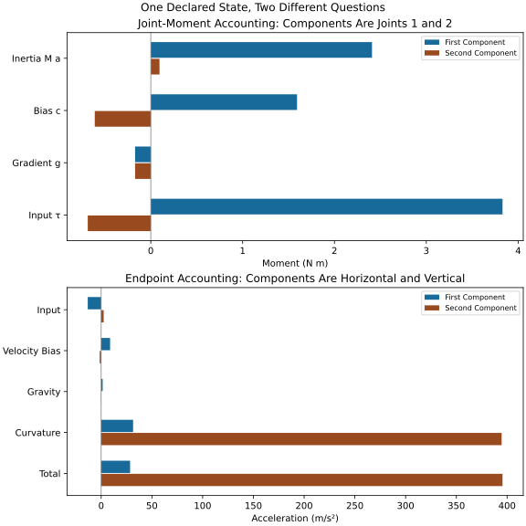

# Forces and Torques: Where They Come From {#sec-04_forces_and_torques}

[]{#ch-04_forces_and_torques}

[]{#box:ch04_decompose}

::: {.callout-note}
## Decomposing the Forces

The golf swing combines applied forces, coupled motion and contact. To understand that combination, first specify what is being balanced: a physical body's linear momentum, its angular momentum, a generalized joint equation, or mechanical energy. These are connected descriptions, but their terms are not interchangeable.

This chapter builds on the two-link model of [Double-Pendulum Dynamics](ch03_double_pendulum.html). It explains how to recover physical loads, distinguish them from coordinate-dependent terms, and map the resulting motion to an endpoint task. A large force need not supply large power, a negative torque need not remove energy, and a net joint moment does not identify individual muscle forces. Keeping those distinctions explicit makes the connection to golf more informative.

:::

## Five Parts of a Mechanical Accounting {#the-five-sources-of-force}

For the declared fixed-pivot, planar two-link model,

$$
\bm M(\bm q)\ddot{\bm q}+\bm c(\bm q,\dot{\bm q})+\bm g(\bm q)=\bm\tau,
\qquad \bm c=\bm C\dot{\bm q},\quad \bm g=\nabla V.
$$

[]{#eq-ch04_euler_lagrange}

The coordinates are $q_1=\theta_1$, measured counterclockwise from downward vertical, and relative angle $q_2=\theta_2$. Neither is automatically an anatomical shoulder or elbow angle. The following five parts organize the equation and its physical interpretation:

- **Acceleration terms** $\bm M\ddot{\bm q}$ come from differentiating momentum. They are not an additional external agency pushing the body.
- **Velocity-bias terms** $\bm c$ arise from the same kinetic-energy model in moving generalized coordinates. Their decomposition into individual $C_{ij}$ entries is not unique.
- **Gravity** has physical generalized moment $-\bm g$. The positive gradient appears on the left because it has been moved there.
- **Applied generalized moments** $\bm\tau$ represent the declared actuators and other loads included in that input convention. In a muscle-driven model, their production has additional geometry and internal dynamics.
- **Constraint reactions** act at physical interfaces. Ideal hinge reactions eliminated by compatible coordinates still exist, but must not be added a second time to the same reduced equation.

These are not five independent physical force sources to add without regard to signs and body boundaries. The kinetic terms together play the role of $m\bm a$. A more general model can include elastic and dissipative loads, external wrenches, and explicit contact reactions on the right. The standard manipulator formulation provides this organization; the actual terms depend on the declared model. [@TedrakeMultibodyEnergy]

## Inertial Terms and Coupled Acceleration {#inertial-forces-resisting-acceleration}

For a body of constant mass, expressed in an inertial frame,

$$
\sum\bm f_{\rm ext}=m\bm a_C.
$$

[]{#eq-ch04_newton}

Here $C$ is its COM. For a rigid body in planar motion, moments about its COM satisfy

$$
\sum n_C=I_C\dot\omega.
$$

[]{#eq-ch04_newton_rot}

The corresponding spatial equation in body axes is $\sum\bm n_C=\bm I_C\dot{\bm\omega}+\bm\omega\times(\bm I_C\bm\omega)$. A scalar $I\alpha$ formula is therefore a planar or fixed-axis specialization, not a universal three-dimensional joint equation. Choosing a moving point instead of the COM requires the appropriate moment-transport terms.

[]{#ch04_inertia_shoulder}

::: {.callout-tip}
## Specified Acceleration and Required Moments

Use Chapter 3's manufactured parameters, not a measured golfer: masses $(2.5,0.4)$ kg, proximal length 0.35 m, distal endpoint length 1 m, COM distances $(0.175,0.5)$ m, centroidal inertias $(0.025,0.03)$ $\mathrm{kg\,m^2}$, and $g=9.81$ $\mathrm{m/s^2}$.

At $\bm q=(0,-5^\circ)$, with both rates zero, prescribe $\ddot{\bm q}=(1000\pi/180,0)$ $\mathrm{rad/s^2}$. Full inverse dynamics gives

$$
\bm M\ddot{\bm q}\approx(7.33090223,3.48600945)\ {\rm N\,m},\qquad
\bm\tau\approx(7.15990266,3.31500988)\ {\rm N\,m}.
$$

The second moment is needed to maintain the prescribed zero relative acceleration. Applying only the first moment with a free distal actuator produces a different motion. For an incremental proximal input at fixed state with distal input unchanged, the acceleration gain is the inverse Schur inertia, approximately $8.83731762\ ({\rm rad/s^2})/({\rm N\,m})$, rather than $1/M_{11}$. Constraints change this comparison, as developed in Chapter 7.

:::

### Why Mass Distribution Matters {#why-inertia-increases-with-mass}

For a fixed axis, $I=\int r_\perp^2\,dm$. Adding mass while preserving geometry increases that inertia; moving mass outward can increase it without changing total mass. In a multibody system, off-diagonal inertia, distal freedom and the requested task also matter. A lighter club does not by itself establish greater speed, lower physiological effort or shorter ball flight: those conclusions require a player's input response, impact properties and a flight model. Compare equipment under a declared task and constraints, not from mass alone.

## Velocity-Dependent Terms: Coriolis and Centrifugal {#velocity-dependent-forces-coriolis-and-centrifugal}

### Centrifugal Force and Inertial Acceleration {#centrifugal-force}

A particle moving uniformly on a circle has inward acceleration. The force of a taut string on the particle is inward; the particle's outward force on the string acts on a different body. In a frame rotating with the particle, an outward centrifugal inertial term can balance the inward physical force. These are compatible descriptions once the body and frame are named.

[]{#ch04_centrifugal}

::: {.callout-note}
## Circular-Motion Acceleration

For radius $r$ and constant angular rate $\omega$, let $\bm e_r$ point outward. Then

$$
\bm a_{\rm inertial}=-\omega^2r\bm e_r,
\qquad \bm f_{\rm centrifugal}=+m\omega^2r\bm e_r
$$

[]{#eq-ch04_centrifugal_accel}

in the corresponding rotating-frame force balance. The second expression is an inertial force term, not an extra physical outward force on the particle. Nonuniform circular motion also has tangential acceleration $r\dot\omega$.

:::

[]{#ch04_centrifugal_numbers}

::: {.callout-tip}
## A Declared Circular Particle

[]{#ref-Jorgensen1994}

For a separate 0.2 kg particle, $r=1.35$ m and $\omega=30$ rad/s imply speed 40.5 m/s and inward acceleration 1215 $\mathrm{m/s^2}$. Its required inward resultant is 243 N. This is an ideal circular-particle calculation. It is not a whole-club grip measurement, and it does not establish shaft stress or muscle activity. Gravity and other applied loads must be included when finding a particular support force.

:::

[]{#ch04_centrifugal_golf}

::: {.callout-tip}
## Curvature in the Two-Link Model

[]{#ref-Penner2001}

The hinge H at distance 0.35 m from the fixed pivot has normal acceleration $0.35\dot q_1^2$ toward that pivot. The distal endpoint has a further normal term about moving H involving $(\dot q_1+\dot q_2)^2$. Their vector sum need not point toward the fixed pivot. A velocity-bias term in a generalized equation cannot be renamed a physical elbow reaction or assumed to straighten a human arm; first solve the coupled accelerations and use the actual geometry.

:::

### Coriolis Force and the Moving Frame {#coriolis-force}

Let a frame have moving origin O, angular velocity $\bm\Omega$ and angular acceleration $\dot{\bm\Omega}$. Express every vector in common axes at the instant of evaluation. For relative position $\bm r$, velocity $\bm v_{\rm rel}$ and acceleration $\bm a_{\rm rel}$, transport gives

$$
\bm a=\bm a_O+\bm a_{\rm rel}
+\dot{\bm\Omega}\times\bm r
+\bm\Omega\times(\bm\Omega\times\bm r)
+2\bm\Omega\times\bm v_{\rm rel}.
$$

The Coriolis contribution here has a positive sign. When solving Newton's law for relative acceleration, it moves to the other side:

$$
\bm f_{\rm Cor}=-2m\bm\Omega\times\bm v_{\rm rel}.
$$

[]{#eq-ch04_coriolis_accel}

This is the rotating-frame inertial force. The other transport terms likewise change sides. An inertial observer attributes the particle's acceleration to its physical applied forces; the rotating observer uses the added inertial terms. Omitting the frame or mixing these two equations reverses the interpretation.

[]{#ch04_coriolis}

::: {.callout-note}
## Generalized Velocity Bias

The two-link expression uses $b=m_2L_1r_2=0.07$ $\mathrm{kg\,m^2}$:

$$
\bm c=b\sin q_2
\begin{bmatrix}-2\dot q_1\dot q_2-\dot q_2^2\\ \dot q_1^2\end{bmatrix}.
$$

The cross-rate product is often called Coriolis coupling and the squared-rate terms centrifugal coupling. These labels organize the generalized equation. They do not identify independent physical contact forces or a unique $\bm C$ matrix.

:::

[]{#ch04_coriolis_golf}

::: {.callout-tip}
## The Sign of a Bias Is Not Assistance

At $\bm q=(0,-5^\circ)$ and rates $(10,9)$ rad/s, the bias is

$$
\bm c\approx(1.59233542,-0.61009020)\ {\rm N\,m}.
$$

Positive $c_1$ is on the left of the equation. In inverse dynamics it increases the required first input for a fixed acceleration; in forward dynamics its contribution is $-\bm M^{-1}\bm c$. A positive first component therefore cannot be described as a positive applied shoulder torque helping motion. Joint coupling also means an isolated component's sign does not determine the full acceleration.

:::

### What Quadratic Scaling Establishes {#the-velocity-dependence-is-crucial}

At fixed configuration, scaling every rate by $s$ gives $\bm c(\bm q,s\dot{\bm q})=s^2\bm c(\bm q,\dot{\bm q})$. This statement does not apply to every velocity-dependent physical load: viscous damping is typically linear and aerodynamic laws require their own assumptions. Scaling one rate alone also does not scale all cross terms uniformly.

[]{#box:ch04_speed_helps}

::: {.callout-note}
## Speed, Power and the Chosen Task

Larger bias terms need not help the desired endpoint motion or reduce required input. Reversing all rates leaves this quadratic bias unchanged but reverses its contraction with velocity. Direction matters as much as magnitude.

The kinetic-energy identity is $\dot T=\dot{\bm q}^{T}(\bm M\ddot{\bm q}+\bm c)$, so $\dot E=\bm\tau^T\dot{\bm q}$ when gravitational potential is included. Bias terms can mediate coupling without being a new energy supply. Calling a motion easy, economical or optimal requires a specified effort measure and comparison; the manipulator equation alone supplies none of those conclusions.

:::

## Gravitational Forces and Potential {#gravitational-forces-position-dependent}

In a uniform field, each body experiences $m\bm g_0$, where $\bm g_0=(0,-9.81)$ $\mathrm{m/s^2}$ in this inertial plane. Its magnitude does not depend on joint configuration; its generalized moments do. With COM distances $r_1,r_2$,

$$
\bm g(\bm q)=g\begin{bmatrix}
(m_1r_1+m_2L_1)\sin q_1+m_2r_2\sin(q_1+q_2)\\
m_2r_2\sin(q_1+q_2)
\end{bmatrix},\qquad \bm Q_g=-\bm g.
$$

[]{#eq-ch04_gravity}

### Reading the Gravity Terms {#reading-the-gravity-terms}

The first component contains both the motion of H and the distal COM relative to H. Setting $q_1=0$ removes only the first sine term; a tilted distal body retains a gravity moment. At $(0,0)$ both gradients vanish and the configuration is a stable hanging equilibrium for this conservative model. At $(\pi,0)$ both vanish but the equilibrium is unstable. Zero moment does not imply zero weight or zero joint force.

At $(150^\circ,-70^\circ)$, physical generalized gravity moments are

$$
\bm Q_g\approx(-4.76483031,-1.93219281)\ {\rm N\,m}.
$$

These signs refer to the declared coordinates. Translating them to forward or backward golf motion requires a target-frame convention and the full coupled dynamics.

### Gravity Work and the Complete Cycle {#gravity-does-work-during-the-downswing}

Define $\Delta V=V_{\rm final}-V_{\rm initial}$. Then

$$
W_g=-\Delta V=V_{\rm initial}-V_{\rm final},\qquad
P_g=-\bm g^T\dot{\bm q}.
$$

[]{#eq-ch04_work_gravity}

A lower final potential gives positive gravity work. Returning both coordinates to the same configuration gives zero net gravity work, regardless of the final speed. Actuator work, initial kinetic energy, storage and dissipation explain changes in the full energy balance; gravity cannot supply net energy over a closed configuration cycle.

For the declared model, descent from $(150^\circ,-70^\circ)$ to $(0,0)$ releases 12.192849345 J. The reverse ascent costs that potential increase. Without a trajectory, one cannot determine whether gravity supplies or absorbs power early or late in a downswing. Nor does its work specify how much energy ends in the distal body.

## Muscular Forces and the Input Model {#muscular-forces-your-control}

$$
\bm\tau=\bm R(\bm q)\bm F_T+\bm\tau_{\rm other}.
$$

[]{#eq-ch04_tau_def}

Here $\bm F_T$ contains nonnegative tendon tensions, $\bm R$ contains signed moment arms, and $\bm\tau_{\rm other}$ collects other loads included in the chosen convention. An inverse-dynamics net moment does not uniquely recover the tendon tensions. Equal antagonist moments can cancel while both tensions remain substantial. The result also depends on which passive loads, external wrenches and residual actuators have already been modeled.

### Constraints on Muscular Forces {#constraints-on-muscular-forces}

[]{#ref-Gatt1998}

A simple torque box $\tau_i^{\min}\leq\tau_i\leq\tau_i^{\max}$ can be an engineering approximation, but muscle tension being nonnegative does not imply symmetric independent bounds. Moment arms depend on configuration; multiarticular muscles couple joints; force capacity depends on activation, fiber length and shortening velocity, with tendon mechanics introducing further states. Numerical capacity bounds require measurements or an explicitly validated actuator model for the population and state of interest.

Consider a manufactured antagonist pair with signed moment arms $(0.03,-0.03)$ m. Tensions $(100,100)$ N and $(200,200)$ N both produce zero net moment. They are not the same internal loading state. Net zero moment or net zero joint power cannot demonstrate muscle inactivity or zero metabolic cost.

### From Excitation to Realized Moment {#muscular-forces-are-the-only-thing-you-control}

[]{#ref-Nesbit2005}

A muscle-driven state description can include excitation $\bm u$, activation $\bm a$, fiber/tendon states $\bm z$, and their dynamics:

$$
\dot{\bm a}=\bm f_a(\bm a,\bm u),\quad
\dot{\bm z}=\bm f_z(\bm q,\dot{\bm q},\bm a,\bm z),\quad
\bm F_T=\bm f_T(\bm q,\dot{\bm q},\bm a,\bm z).
$$

This is a model structure, not a universal physiological law. OpenSim's documented activation and forward-dynamics workflows distinguish excitation, activation, fiber state and realized force. They motivate retaining these states rather than assuming an arbitrarily prescribed net torque is an instantaneous neural command. [@OpenSimActivationDynamics; @OpenSimForward2024]

Once inputs, initial states and an admissible contact mode are specified, forward integration gives

$$
\dot{\bm q}(t)=\dot{\bm q}(0)+\int_0^t\ddot{\bm q}(s)\,ds,\qquad
\bm q(t)=\bm q(0)+\int_0^t\dot{\bm q}(s)\,ds.
$$

[]{#eq-ch04_integration}

The acceleration is evaluated along the evolving state, not held at its initial value. Feedback and activation dynamics change that evolution. Chapter 24 develops the relation to observation and motor control.

## Constraint Forces and Contact Feasibility {#constraint-forces-the-reactive-forces}

[]{#ch04_constraint_forces}

::: {.callout-note}
## Constraint Reactions

An ideal reaction enforces an assumed compatible motion. A revolute hinge can transmit forces while allowing free relative rotation about its axis; an actuator moment about that axis is a separate load. A rigid attachment has a different constraint set. Real contact must also satisfy unilateral and friction conditions, so an arbitrary computed reaction may be infeasible.

:::

### Why Some Reactions Disappear From Reduced Equations {#why-constraint-forces-dont-appear-in-the-equation}

Compatible angular coordinates solve the ideal hinge geometry. Equal-and-opposite interface forces cancel in virtual work over compatible motions, eliminating them from the reduced generalized equations. They can be recovered from physical body force and moment balances. This elimination does not make them zero, and not every choice of generalized coordinates eliminates every constraint.

For explicit stationary constraints, a common formulation is

$$
\bm M\ddot{\bm q}+\bm c+\bm g=\bm\tau+\bm J_c^T\bm\lambda,\qquad
\bm J_c\ddot{\bm q}+\dot{\bm J}_c\dot{\bm q}=0.
$$

The reaction depends on motion, applied loads and the constraint mode. A frictional contact additionally needs compressive normal force and tangential force within its friction limit. If the required load lies outside the admissible set, use a slip/separation model. Simply lowering applied torque does not necessarily cause slip; nor does increasing it monotonically increase every reaction component.

## Putting It Together: Attribution Before Contact {#putting-it-together-force-attribution-in-impact}

Use $\bm q=(0,-5^\circ)$, $\dot{\bm q}=(10,9)$ rad/s and prescribed $\ddot{\bm q}=(20,-30)$ $\mathrm{rad/s^2}$. This is a manufactured state before contact, not a measured impact. It fixes all quantities needed for an instantaneous inverse-dynamics calculation:

$$
\begin{aligned}
\bm M\ddot{\bm q}&\approx(2.40858629,0.09467258)\ {\rm N\,m},\\
\bm c&\approx(1.59233542,-0.61009020)\ {\rm N\,m},\\
\bm g&\approx(-0.17099957,-0.17099957)\ {\rm N\,m},\\
\bm\tau&\approx(3.82992214,-0.68641719)\ {\rm N\,m}.
\end{aligned}
$$

Each row is a two-component vector with the same convention. Both off-diagonal inertia contributions are included. The input power is 32.12146671 W. The negative distal input at positive relative rate absorbs 6.17775470 W in that generalized channel; positive proximal power more than offsets it. A negative torque at a negative rate would instead supply positive power.

On narrow screens, scroll the figure or [open it at full size](../figures/forces_torques_verified.svg).

::: {#fig-ch04_force_decomposition}
::: {.aba-diagram-scroll role="region" aria-label="Joint moment and endpoint acceleration contributions; scroll horizontally" tabindex="0"}

:::

One Declared State, Two Different Questions. Top: Inverse-Dynamics Moment Components at the Two Joints. Bottom: Fixed-State Contributions to Horizontal and Vertical Endpoint Acceleration. Input and Bias Contributions Must Be Mapped Through Inverse Inertia and the Endpoint Jacobian; Curvature Remains a Separate Kinematic Term. The State Is Manufactured, Not a Measured Golf Swing.
:::

### The Endpoint Acceleration {#the-clubhead-acceleration}

With $\bm e(\alpha)=(\sin\alpha,-\cos\alpha)^T$, the endpoint acceleration is

$$
\ddot{\bm p}=\bm J_P\ddot{\bm q}
-L_1\dot q_1^2\bm e(q_1)-L_2(\dot q_1+\dot q_2)^2\bm e(q_1+q_2).
$$

[]{#eq-ch04_centripetal_impact}

Here $\bm J_P$ is the full endpoint Jacobian from Chapter 3. The speed and distance to the base alone do not determine local path curvature; $v^2/r$ requires the appropriate curvature radius, not an assumed shoulder-to-head distance.

$$
\ddot{\bm p}\approx(28.50127615,395.49784344)\ {\rm m/s^2}.
$$

[]{#eq-ch04_total_accel_impact}

The total includes vector normal and tangential contributions; their magnitudes must not be added as scalars. Smooth swing acceleration and collision acceleration are separate regimes. Predicting the ball–club contact impulse, duration or peak force requires contact mechanics and incident states absent from this two-link model.

### Where Do These Accelerations Come From? {#where-do-these-accelerations-come-from}

[]{#ref-MacKenzie2009}

At this fixed state, an algebraic decomposition of the same endpoint acceleration is

$$
\ddot{\bm p}=\bm J_P\bm M^{-1}\bm\tau
-\bm J_P\bm M^{-1}\bm c
-\bm J_P\bm M^{-1}\bm g
+\dot{\bm J}_P\dot{\bm q}.
$$

The four vectors, in horizontal/vertical $\mathrm{m/s^2}$, are approximately

$$
\begin{aligned}
\bm a_{\rm input}&\approx(-13.21865815,2.47827787),\\
\bm a_{\rm bias}&\approx(8.79688124,-1.45418002),\\
\bm a_{\rm gravity}&\approx(1.45982994,-0.15254042),\\
\bm a_{\rm curvature}&\approx(31.46322313,394.62628601).
\end{aligned}
$$

They sum to the endpoint value above. The large curvature term does not correspond to an independent applied force or energy source. This is instantaneous attribution with the state held fixed. Removing an input throughout a swing changes the state, Jacobian and every subsequent contribution, so terminal causal comparisons require a new forward solution. Imposed constraints also alter the acceleration map.

### Recovering the Distal Body's Interface Load {#the-constraint-force-at-the-grip}

For an actual club, use the whole-club COM and whole-club mass. Let $\bm f_H$ be the resultant hand force on the club and $\bm f_{\rm other}$ other non-gravitational external forces. Then

$$
\bm f_H=m_c(\bm a_C-\bm g_0)-\bm f_{\rm other}.
$$

[]{#eq-ch04_grip_centripetal}

For a planar rigid club, its required hand moment at H also satisfies

$$
n_H=I_C\dot\omega-(\bm r_H-\bm r_C)\times\bm f_H-n_{\rm other,C}.
$$

[]{#eq-ch04_grip_tangential}

The planar cross product denotes its out-of-plane component. Multiplying clubhead acceleration by a nominal head mass omits shaft/grip mass distribution, COM motion and moment balance. A guessed tangential acceleration cannot establish a numerical grip-force range.

For the declared distal link, $\bm a_{C2}\approx(17.75063808,215.24892172)$ $\mathrm{m/s^2}$, giving $\bm f_H\approx(7.10025523,90.02356869)$ N and $n_H=\tau_2\approx-0.68641719$ N m. Recovering the proximal body's balance gives base force $(15.85025523,158.29856869)$ N and the same $\tau_1$ obtained from the generalized equation. Independent Newton–Euler and energy calculations check these results.

[]{#box:ch04_grip_physics}

::: {.callout-note}
## Resultant Load Is Not Grip Squeeze

A resultant wrench constrains the sum of contact loads, not the distribution of finger pressure or the forces supplied by each hand. Opposing hand forces can change internal loading while preserving the same net force and moment on the club. Grip squeeze can also change frictional capacity and compliance, which a perfectly rigid attachment model omits.

Choi and Park's instrumented-grip study combines measured internal grip loading with spatial upper-limb inverse dynamics, illustrating why separate hand loads need information beyond a net club wrench. Its nine professional participants and modified 551 g club with foam balls limit direct transfer to ordinary driver swings. It does not establish a universal squeeze prescription. [@Choi2020GripKinetics]

OpenSim likewise distinguishes net generalized forces from the structural reaction loads produced after actuator forces are specified. Reports must identify the receiving body, frame and included actuators. Neither output alone is tissue stress or proof of muscle inactivity. [@OpenSimJointReactions2019]

:::

## Wrenches: Forces, Moments and Power {#wrenches-forces-and-torques-unified}

[]{#ch04_wrench}

::: {.callout-note}
## A Wrench With a Declared Reference

Use force-first ordering $\bm w_H=(\bm f,\bm n_H)$ and matching twist $\bm V_H=(\bm v_H,\bm\omega)$, expressed in the same axes. The moment is about H, not an unspecified point. The rigid-body power is

$$
P=\bm w_H^T\bm V_H=\bm f\cdot\bm v_H+\bm n_H\cdot\bm\omega.
$$

For offset $\bm d=\bm r_K-\bm r_H$, shift to K using

$$
\bm n_K=\bm n_H-\bm d\times\bm f,\qquad
\bm v_K=\bm v_H+\bm\omega\times\bm d.
$$

These transformations preserve power. Rotating axes rotates both three-vectors consistently. Other texts use moment-first ordering; the matching twist must change too. A resultant wrench describes the net rigid-body load, not its detailed contact-pressure distribution. [@LynchParkWrenches]

:::

At ideal hinge H, force power into the distal body is $\bm f_H\cdot\bm v_H$, and the proximal body receives its negative. Here those powers are $\pm24.85089331$ W. Hinge moment powers are $\tau_2(\dot q_1+\dot q_2)$ on body 2 and $-\tau_2\dot q_1$ on body 1. Their sum is $\tau_2\dot q_2$. The individual body kinetic-energy derivatives are approximately 20.3125 and 15.05795849 W; together they equal input power plus 3.24899178 W of gravity power. A zero net internal force power does not imply zero power into each body.

[]{#box:ch04_full_body}

::: {.callout-note}
## The Full-Body Problem

For the combined golfer–club system, hand–club forces are internal and cancel in the total momentum balance. Ground contact, weight, aerodynamic loads and ball contact are external. The total external force equals total mass times system-COM acceleration; external moments about the COM equal the rate of total angular momentum about it. Dynamic balance does not generally mean that the force and moment sums are zero.

A floating-body model commonly uses generalized velocity $\bm v$, kinematics $\dot{\bm q}=\bm N(\bm q)\bm v$, actuator map $\bm S^T$, and contact map $\bm J_c^T$. Its base equations are not directly actuated by muscle moments. Ground reactions connect internal actuation to motion while satisfying contact feasibility. A moving torso also changes arm-base motion; treating it as fixed changes the question being answered. The physics remains consistent across this hierarchy when frames, loads and omitted mechanisms are declared.

:::

## Numerical Summary: Compare Declared States {#numerical-summary-forces-throughout-the-swing}

Instead of assigning unsupported torques to named swing phases, hold $\bm q=(0,-5^\circ)$ and $\ddot{\bm q}=(20,-30)$ fixed while scaling rates $(10,9)$ by $s$. Every row is independently reproducible inverse dynamics, not a time history:

$$
\begin{array}{c|rr|rr|r}
s&c_1&c_2&\tau_1&\tau_2&P_{\rm input}\\\hline
0&0&0&2.237587&-0.076327&0\\
1&1.592335&-0.610090&3.829922&-0.686417&32.121467\\
2&6.369342&-2.440361&8.606928&-2.516688&126.838188
\end{array}
$$

Moments are N m and power is W. The inertia contribution and gravity gradient are unchanged, whereas bias scales by $s^2$. In this example greater speed requires greater first input and more positive total input power for the prescribed acceleration. This is a counterexample to inevitable passive assistance, not a claim that faster golf always requires more effort. A phase name alone specifies neither configuration, rate, acceleration nor input.

## The Fundamental Insight {#the-fundamental-insight}

The useful argument connects levels of description: applied loads change body momentum; geometry and inertia couple that change across joints; endpoint kinematics map it to a task; actuator dynamics and contact determine which motions are feasible. Physical power balances then track energy supplied, transferred, stored or dissipated. Measurements test the parts of that model relevant to the intended conclusion.

[]{#pr:ch04_key_takeaways}

::: {.callout-important}
## Key Takeaways

Name the body and frame before naming a force. Use full coupled dynamics rather than a single diagonal inertia. Distinguish physical gravity from the gradient moved to the left. Keep normal acceleration in the endpoint map. Recover whole-body COM loads and moments before interpreting grip measurements. Evaluate signed power rather than torque sign alone, and distinguish a net wrench from individual contact or muscle forces. Claims about optimal effort, skill or passive dominance require a stated task, admissible inputs and independent evidence.

:::

### Looking Ahead

Chapter 5 separates a declared zero-input drift from applied input response. Chapter 7 develops compatible motion and reaction power, and Chapter 24 adds the observation and actuation states needed for motor control. These extensions can test how the mechanisms combine over a swing; they do not follow from a universal table of helpful and opposing forces.

## Related Articles

Continue with [Double-Pendulum Dynamics](ch03_double_pendulum.html), [Affine Structure](ch05_affine_structure.html), [Constraint Forces](ch07_constraint_forces.html), [Triple-Pendulum Dynamics](ch08_triple_pendulum.html), and [Brain Control](ch24_motor_control_brain.html).

[]{#ex:ch04}

## Chapter Exercises {#chapter-exercises}

### 1. Prescribed Inertial Moments

At $\bm q=(0,0)$, zero rates, prescribe $\ddot{\bm q}=(500\pi/180,0)$ $\mathrm{rad/s^2}$. The generalized gravity moment vanishes, and inverse dynamics requires approximately $(3.67010017,1.74532925)$ N m. The distal input is essential to the prescribed zero relative acceleration. One first-coordinate acceleration alone would leave the problem underdetermined.

### 2. Circular Motion and the Receiving Body

For a separate 1 kg particle in uniform circular motion at 10.47 rad/s and radius 1.35 m, acceleration is 147.988215 $\mathrm{m/s^2}$ inward and the resultant force is 147.988215 N inward. Its outward reaction on a string acts on the string. The rotating-frame centrifugal term on the particle is outward; do not add it to the inertial-frame force balance.

### 3. Specified Coriolis Coupling

Specify $q_2=-5^\circ$ and rates $(8,5)$ rad/s. Then $c_1=0.64059471$ and $c_2=-0.39045773$ N m. These are left-side bias components, not standalone applied moments. Without configuration, the original rate-only request has no numerical answer. A sudden change in rate additionally needs an impulse or a finite acceleration history.

### 4. Gravity and Coordinate Signs

At $(150^\circ,-70^\circ)$, $\bm Q_g\approx(-4.76483031,-1.93219281)$ N m. The gradient is its negative. To infer acceleration, solve with the mass matrix, velocity terms and applied loads. To call it forward or backward, first define the golf target frame.

### 5. Complete Inverse Dynamics

Using the chapter's declared before-contact state and acceleration, add $\bm M\ddot{\bm q}$, $\bm c$ and $\bm g$ componentwise to obtain $(3.82992214,-0.68641719)$ N m. The power is 32.12146671 W. Omitting $M_{12}\ddot q_2$ would add 5.99200887 N m to the first estimate and solve a different problem.

### 6. COM Force, Moment and Contact

Use the distal-link COM acceleration from the worked example: subtract gravity and multiply by 0.4 kg to obtain $(7.10025523,90.02356869)$ N. Balance moments about its COM to recover $-0.68641719$ N m at H. These determine a resultant in the ideal model, not finger pressure. Assess actual contact using a friction/compliance model and appropriate measurements.

### 7. Gravity Over a Closed Configuration Cycle

Specify both endpoints as $(0,0)$ and $(150^\circ,-70^\circ)$. Potential rises 12.192849345 J on ascent. Gravity work is negative that amount on ascent and positive on return; net gravity work is zero. If the final speed differs, explain it using the rest of the energy balance. Specifying only $q_1$ leaves the distal COM height unknown.
