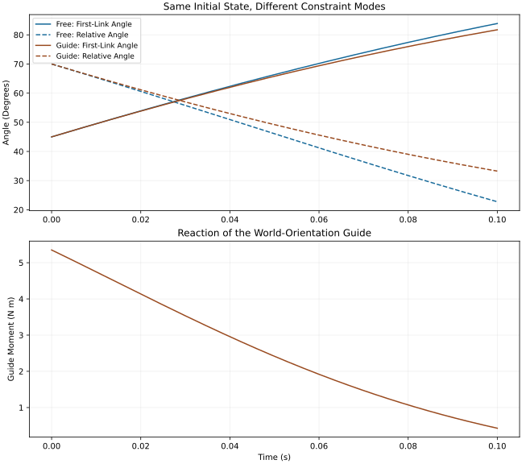

# Constraint Forces: Coupling, Work and Control {#sec-constraint_forces}

[]{#ch-constraint_forces}

[]{#context:constraint_forces_motivation}

::: {.callout-note}
## Why Constraint Forces Matter

The hand can accelerate the club by exerting a force and a moment on it. The same interaction loads the hand in the opposite direction. Understanding the swing requires both sides of that interaction: how the bodies remain connected, how their motion determines the required reaction, and how muscles and external supports influence that motion.

The zero-torque counterfactual in the preceding chapter asks what a specified model would do when its declared control input is removed. It does not establish that the human downswing is passive. Here we ask a different question: what forces are necessary to maintain a specified connection, and what work do those forces perform on each part of the system?

A connection can carry considerable load while supplying no net power to the combined bodies. It can nevertheless supply positive power to the club and negative power to the arm. That distinction is central to understanding a kinetic chain. It does not make muscles irrelevant: muscle forces influence both the motion and the reactions, and ideal constraints themselves supply no energy source.

:::

## Holonomic Constraints and Their Jacobians {#holonomic-constraints-and-their-jacobians}

[]{#sec-holonomic_constraints}

[]{#holonomic_constraint}

::: {.callout-note}
## Holonomic Constraint

For local configuration coordinates $\bm q\in\mathbb R^n$, a holonomic constraint is a restriction

$$
\bm\Phi(\bm q,t)=\bm0.
$$

[]{#eq-holonomic_constraint_general}

The constraint is scleronomic when it has no explicit time dependence. A prescribed moving support generally gives a time-dependent, or rheonomic, constraint. Both descriptions require a choice of system boundary: a hand represented as a prescribed trajectory is an external support for a club-only model; the same hand represented as a moving body belongs inside a coupled hand–club model.

An ideal point attachment satisfies $\bm x_A(\bm q)-\bm x_B(\bm q)=\bm0$, where the two material points belong to different bodies. They coincide but can move through space. A no-slip hand--grip point constraint therefore equates hand and grip positions; it does not hold the grip stationary in the world. A rigid grasp additionally constrains relative orientation. A point attachment alone permits relative rotation and cannot represent all moments that a distributed grasp can transmit.

:::

[]{#inplain:constraint_meaning}

::: {.callout-note}
## What a Constraint Is

A joint connects specified locations on adjacent bodies. In a rigid-link model, the distance between a body's own joint centers is fixed. The elbow does not keep every point of the forearm at one fixed distance from the shoulder: that distance changes as the elbow bends. A free hinge keeps its two attachment points together while allowing relative rotation. Free rotation and physical separation are different models.

The idealization matters. Real cartilage, tendons, skin and grip material deform; contact can slip or separate. A perfectly rigid connection is an approximation whose validity depends on the motion, loads and time scale being studied. Increasing muscular stiffness is not literally the creation of a new exact holonomic equation.

:::

[]{#constraint_jacobian}

::: {.callout-note}
## The Constraint Jacobian

Define

$$
\bm J_c=\frac{\partial\bm\Phi}{\partial\bm q},
\qquad \bm J_c\dot{\bm q}+\bm\Phi_t=\bm0.
$$

[]{#eq-constraint_jacobian_definition}

With $m$ equations, $\bm J_c$ has $m$ rows and $n$ columns. The derivative $\bm\Phi_t$ is taken at fixed configuration. For a stationary constraint, allowed velocities lie in $\ker\bm J_c$. For a moving constraint they instead satisfy an affine equation, generally an offset of that null space.

These equations use local coordinates with $\dot{\bm q}$ as the velocity variables. A model with quaternion configurations and a separate generalized velocity $\bm v$ must include its kinematic map $\dot{\bm q}=\bm N(\bm q)\bm v$; the velocity Jacobian is then $\bm\Phi_q\bm N$. Quaternion normalization is not an extra physical joint restraint.

:::

[]{#wrist_constraint_jacobian}

::: {.callout-tip}
## Relative Lock or World-Orientation Guide?

For the two-link model, let $q_1$ be the first link's angle from downward vertical and $q_2$ the second link's angle relative to the first. The second body's absolute angle is $\theta_2=q_1+q_2$.

A relative joint lock has $q_2=q_{2*}$ and Jacobian $[0\;1]$: both bodies share the same absolute angular velocity. A different constraint is

$$
\Phi=q_1+q_2-\theta_* =0,
$$

[]{#eq-wrist_constraint_example}

with

$$
\bm J_c=\begin{bmatrix}1&1\end{bmatrix},
\qquad \dot q_2=-\dot q_1.
$$

[]{#eq-wrist_jacobian_example}

This holds the second body at a fixed world orientation. Its relative angle changes as the first link rotates. It is an ideal world-orientation guide, not a locked wrist. In these coordinates a pure external moment on the second body contributes equal generalized moments to $q_1$ and $q_2$, explaining the column $\bm J_c^T$. By contrast, an internal relative-joint moment contributes to $q_2$ alone: its opposite effects on the two bodies are already encoded by the coordinate definition.

:::

## The Constrained Equations of Motion {#the-constrained-equations-of-motion}

[]{#sec-constrained_eom}

[]{#box:ch07_constraint_intuition}

::: {.callout-note}
## What Are Constraint Forces, Really?

A stationary frictionless table can support a book without doing work on it. The normal reaction prevents penetration, while tangential motion remains free. A rough table can exert friction and remove mechanical energy during sliding. A rising table can do positive work on the book. Thus the phrase “constraint force” alone does not determine the power: we need the contact law, the motion of its point of application and the system boundary.

:::

[]{#theorem:constrained_lagrangian}

::: {.callout-important}
## Constrained Lagrangian Dynamics

In a fixed ideal bilateral constraint mode, assume a positive-definite mass matrix, smooth local coordinates and a velocity bias vector $\bm c$. Write

$$
\bm M(\bm q)\ddot{\bm q}+\bm c(\bm q,\dot{\bm q})+\bm g(\bm q)
=\bm B(\bm q)\bm u+\bm Q_o+\bm J_c^T\bm\lambda.
$$

[]{#eq-constrained_eom_full}

Here $\bm g=\nabla V$ is the potential gradient; its force contribution after rearrangement is $-\bm g$. The vector $\bm Q_o$ contains other declared loads, such as damping or an applied wrench. The vector $\bm c$ contains the velocity-dependent inertial terms; these terms are not independent energy sources. Define $\bm r=\bm B\bm u+\bm Q_o-\bm c-\bm g$ so that $\bm M\ddot{\bm q}=\bm r+\bm J_c^T\bm\lambda$.

The multiplier is conjugate to the chosen constraint equation. It is a force in newtons for a suitably normalized positional constraint, or a moment in newton-metres for an angular constraint. Rescaling or mixing equations changes multiplier values. The physically meaningful generalized reaction is $\bm J_c^T\bm\lambda$, together with an explicitly defined map to a spatial wrench. Multipliers are not universally force magnitudes.

:::

[]{#inplain:constrained_eom_reading}

::: {.callout-note}
## Reading the Constrained EOM

The same dynamics determine motion and reaction together. Applied muscle moments enter the load vector; the joint reaction is whatever the specified ideal connection requires in response. A large reaction is therefore not evidence that the load is independent of muscle action. Nor does a large numerical force in newtons establish dominance over a moment in newton-metres: those quantities need a common mechanical mapping before comparison.

An ideal reaction has zero virtual work on admissible virtual displacements. This statement is about a force–displacement pairing. With mixed angular and translational coordinates it is safer than imagining ordinary perpendicular arrows in a Euclidean picture of configuration space.

:::

## Solving for the Constraint Forces

[]{#sec-solving_constraint_forces}

[]{#proc:compute_multipliers}

::: {.callout-tip}
## Computing Lagrange Multipliers

For a stationary constraint, differentiation gives

$$
\bm J_c\ddot{\bm q}=-\dot{\bm J}_c\dot{\bm q}.
$$

[]{#eq-constraint_acceleration_consistency}

There is no additional unconstrained-acceleration term in this kinematic identity. For the general time-dependent constraint, define the vector

$$
\bm\gamma=\bm\Phi_{qq}[\dot{\bm q},\dot{\bm q}]
+2\bm\Phi_{qt}\dot{\bm q}+\bm\Phi_{tt},
\qquad \bm J_c\ddot{\bm q}+\bm\gamma=\bm0.
$$

Each component of $\bm\Phi_{qq}[\dot{\bm q},\dot{\bm q}]$ is the corresponding constraint Hessian contracted with velocity twice. For stationary constraints, $\bm\gamma=\dot{\bm J}_c\dot{\bm q}$.

Substitution of the dynamics gives

$$
\bm J_c\bm M^{-1}(\bm r+\bm J_c^T\bm\lambda)=-\bm\gamma,
$$

[]{#eq-constraint_lambda_equation}

and hence the Schur-complement system

$$
\underbrace{\bm J_c\bm M^{-1}\bm J_c^T}_{\bm S}\bm\lambda
=-\bm J_c\bm a_0-\bm\gamma,
\qquad \bm a_0=\bm M^{-1}\bm r.
$$

[]{#eq-lambda_linear_system}

Solve for $\bm\lambda$ and recover $\ddot{\bm q}=\bm a_0+\bm M^{-1}\bm J_c^T\bm\lambda$. The free acceleration appears once. Subtracting it a second time produces the wrong reaction.

:::

[]{#inplain:lambda_computation}

::: {.callout-note}
## Why This Procedure Works

The free dynamics predict an acceleration. The constraint specifies the correction needed to keep the connection compatible. If $\bm M$ is positive definite and $\bm J_c$ has full row rank, then $\bm S$ is positive definite: for nonzero $\bm y$, $\bm y^T\bm S\bm y=(\bm J_c^T\bm y)^T\bm M^{-1}(\bm J_c^T\bm y)>0$. The reaction is then unique for those equations and loads.

With redundant rows, multipliers may be nonunique even when the generalized reaction and acceleration are unique. A minimum-norm multiplier selected by a pseudoinverse depends on constraint scaling; it is not automatically the real distribution of contact forces or muscle loads. Remove redundant equations or state the additional physical model that resolves load sharing. Near rank loss, inspect conditioning and residuals rather than treating a large multiplier as a biological discovery.

:::

The coupled calculation can also be checked without the Schur reduction:

$$
\begin{bmatrix}\bm M&-\bm J_c^T\\\bm J_c&\bm0\end{bmatrix}
\begin{bmatrix}\ddot{\bm q}\\\bm\lambda\end{bmatrix}
=\begin{bmatrix}\bm r\\-\bm\gamma\end{bmatrix}.
$$

Compare both residuals, $\bm M\ddot{\bm q}-\bm r-\bm J_c^T\bm\lambda$ and $\bm J_c\ddot{\bm q}+\bm\gamma$. Initial position and velocity must also be compatible: acceleration-level enforcement does not repair an already separated joint or an inadmissible incoming velocity. Numerical drift control and physical constraint activation are distinct operations. Standard multibody treatments discuss bilateral constraints, contact modes and their acceleration/impulse formulations; the equations here are derived with the sign convention above. [@TedrakeMultibodyEnergy]

## The Null Space and Range of the Constraint Jacobian {#the-null-space-and-range-of-the-constraint-jacobian}

[]{#sec-jacobian_null_range}

[]{#jacobian_spaces}

::: {.callout-note}
## Allowed Velocities and Reaction Covectors

For stationary constraints, $\ker\bm J_c$ is the tangent velocity space. Ideal reaction covectors belong to $\operatorname{range}(\bm J_c^T)$ and annihilate every tangent velocity:

$$
(\bm J_c^T\bm\lambda)^T\bm v=0
\quad\text{whenever}\quad\bm J_c\bm v=0.
$$

Acceleration is generally not tangent. A point travelling around a circle needs a normal centripetal acceleration even though its velocity is tangent. The curvature term $\bm\gamma$ expresses precisely that requirement.

:::

[]{#wrist_null_space}

::: {.callout-tip}
## Null Space for the Orientation Guide

The guide $q_1+q_2=\theta_*$ has tangent basis $\bm n=(1,-1)^T$ and reaction covectors proportional to $(1,1)^T$. The relative lock $q_2=q_{2*}$ instead has tangent basis $(1,0)^T$ and reaction covectors proportional to $(0,1)^T$. An ordinary free two-link chain already includes its point attachment in the coordinates and has neither of these extra restrictions. Its joint force must be recovered from body force balance; no extra angular-lock multiplier is needed to make the bodies remain attached.

:::

[]{#constraint:effective_dof}

::: {.callout-warning}
## Constraints Restrict the Effective DOF

At a regular configuration with constant Jacobian rank $r$, the constraint manifold has local dimension $n-r$. Counting equations gives $n-m$ only when all $m$ equations are independent. Contact activation and singular configurations can change that local description.

The acceleration solves a mass-weighted least-change problem:

$$
\min_{\bm a}\ \frac12(\bm a-\bm a_0)^T\bm M(\bm a-\bm a_0)
\quad\text{subject to}\quad \bm J_c\bm a=-\bm\gamma.
$$

Its solution is $\bm a=\bm a_0-\bm M^{-1}\bm J_c^T\bm S^{-1}(\bm J_c\bm a_0+\bm\gamma)$. This is a projection onto an affine set of compatible accelerations in the mass metric. It is not an ordinary Euclidean projection of acceleration into the velocity null space. The distinction matters whenever constraints curve or move.

:::

## Energy Transfer via Constraint Forces {#energy-transfer-via-constraint-forces}

[]{#sec-energy_transfer_constraints}

[]{#theorem:zero_power_constraint}

::: {.callout-important}
## Zero Power Constraint Condition

The instantaneous power supplied by an ideal reaction is

$$
P_c=(\bm J_c^T\bm\lambda)^T\dot{\bm q}
=\bm\lambda^T\bm J_c\dot{\bm q}
=-\bm\lambda^T\bm\Phi_t.
$$

[]{#eq-constraint_power}

For a compatible stationary ideal constraint,

$$
P_c=0.
$$

[]{#eq-constraint_zero_power}

This concerns the sum of reaction powers over the declared system. It does not say that each body receives zero power, or that total energy is constant when other forces do work. For time-independent rigid-body kinetic energy $T=\tfrac12\dot{\bm q}^T\bm M\dot{\bm q}$, conservative potential $V$, and a consistent velocity bias, the complete balance is

$$
\frac{d}{dt}(T+V)=\dot{\bm q}^T(\bm B\bm u+\bm Q_o)
-\bm\lambda^T\bm\Phi_t.
$$

The identity uses $\dot{\bm q}^T\bm c=\tfrac12\dot{\bm q}^T\dot{\bm M}\dot{\bm q}$. A moving boundary, friction, damping, deformation or impact needs its own work or energy accounting; the stationary ideal theorem does not remove those effects.

:::

[]{#inplain:power_paradox}

::: {.callout-note}
## The Power Paradox

Suppose an ideal point connection moves with common velocity $\bm v_J$. Let $\bm F$ be the force on body B from body A. The powers at the connection are $P_B=\bm F\cdot\bm v_J$ and $P_A=-\bm F\cdot\bm v_J$. Positive power adds mechanical energy to the receiving body; negative power removes it. The sum is zero although either term can be large.

For an entirely illustrative instant, $\bm F=(100,0,0)$ N and $\bm v_J=(4,0,0)$ m/s give $P_B=400$ W and $P_A=-400$ W. The force is parallel to the common velocity, not perpendicular to it. Cancellation comes from the opposite forces acting at equal point velocities. If those powers persisted for 0.01 s, 4 J would cross the interface; an instantaneous power value alone does not establish that integrated transfer.

The direction can reverse during a swing. A proximal segment slowing down while a distal segment speeds up is not by itself proof of this power pathway: gravity, muscle work, changes in each body's translation and rotation, and other joint loads also contribute.

:::

[]{#energy_partition}

::: {.callout-note}
## Energy Partition

For each rigid body $i$, define its physical kinetic energy using its center-of-mass velocity $\bm v_{G_i}$ and angular velocity $\bm\omega_i$:

$$
T_i=\frac12m_i\|\bm v_{G_i}\|^2
+\frac12\bm\omega_i^T\bm I_{G_i}\bm\omega_i,
\qquad T=\sum_iT_i.
$$

[]{#eq-energy_partition_definition}

Express inertia and angular velocity in the same frame. The separate terms $\tfrac12M_{11}\dot q_1^2$, $\tfrac12M_{22}\dot q_2^2$ and $M_{12}\dot q_1\dot q_2$ in a coordinate expansion are not generally the energies of body 1, body 2 and a third physical “coupling reservoir.” Each body's COM velocity may depend on several generalized velocities. Cross terms change with the coordinate choice; physical body energies do not.

For a connection transmitting both a force $\bm F$ and a moment $\bm\mu$ on B, write both moments about the same joint point. The interface sum is

$$
P_A+P_B=\bm F\cdot(\bm v_B-\bm v_A)
+\bm\mu\cdot(\bm\omega_B-\bm\omega_A).
$$

[]{#eq-energy_transfer_constraint}

An ideal coincident point joint cancels the force term. A frictionless hinge has no reaction moment along its free rotation axis, so the ideal moment also has zero relative power. A rigid lock cancels both relative velocities. A motor acting across a rotating joint can instead supply power $\bm\mu\cdot(\bm\omega_B-\bm\omega_A)$; a damper can remove it. Those are distinct from the ideal zero-power reaction.

To compute a body's mechanical-energy change, integrate all of its nonconservative boundary powers and include changes in its potential energy. The club can gain energy from a moving hand even when ideal hand–club interaction contributes zero net power to the combined model. Whole-system and segment statements must never silently exchange boundaries.

:::

## A Compatible Two-Link Constraint Example

[]{#sec-double_pendulum_constraint_force}

[]{#double_pend_constraint_force}

::: {.callout-tip}
## Reaction of a World-Orientation Guide

Use the complete manufactured model from the affine chapter: $m_1=2.5$ kg, $m_2=0.4$ kg, $l_1=0.35$ m, COM distances $r_1=0.175$ m and $r_2=0.5$ m, centroidal inertias $I_1=0.025$ and $I_2=0.03$ kg m$^2$, and $g=9.81$ m/s$^2$. The first pivot is fixed. The two bodies are attached at a frictionless point hinge; there is no applied joint torque, damping or impact during the following interval. These are illustrative rigid links, not fitted human segments.

For reproducibility, put $a=I_1+m_1r_1^2+m_2l_1^2$, $d=I_2+m_2r_2^2$, $b=m_2l_1r_2$, $h_1=m_1r_1+m_2l_1$, and $h_2=m_2r_2$. The operators are

$$
\bm M=\begin{bmatrix}a+d+2b\cos q_2&d+b\cos q_2\\d+b\cos q_2&d\end{bmatrix},
\quad
\bm c=b\sin q_2\begin{bmatrix}-2\dot q_1\dot q_2-\dot q_2^2\\\dot q_1^2\end{bmatrix},
$$

$$
V=-g[h_1\cos q_1+h_2\cos(q_1+q_2)],\qquad \bm g=\nabla V.
$$

The companion calculation reuses that chapter's operator implementation, which is checked against independent recursive Newton–Euler dynamics.

Add the world-orientation guide $q_1+q_2=115^\circ$. Start at $\bm q=(45^\circ,70^\circ)$ with $\dot{\bm q}=(8,-8)$ rad/s. Both position and velocity are compatible, and

$$
\bm J_c=\begin{bmatrix}1&1\end{bmatrix},\quad
\bm J_c\dot{\bm q}=0,\quad \bm J_c\ddot{\bm q}=0.
$$

[]{#eq-constraint_consistency_wrist}

At this instant,

$$
\bm M\approx\begin{bmatrix}0.32844532&0.15394141\\0.15394141&0.13000000\end{bmatrix}\ \mathrm{kg\,m^2},
$$

$$
\bm c\approx\begin{bmatrix}4.20982294\\4.20982294\end{bmatrix}\ \mathrm{N\,m},
\qquad
\bm g\approx\begin{bmatrix}5.78413025\\1.77817588\end{bmatrix}\ \mathrm{N\,m}.
$$

Without the orientation guide, but retaining the hinge attachment, the free acceleration is

$$
\bm a_0\approx(-19.86390770,-22.53939122)\ \mathrm{rad/s^2}.
$$

Solving the constrained system gives

$$
\lambda\approx5.35099959\ \mathrm{N\,m},\qquad
\ddot{\bm q}\approx(-26.60658776,26.60658776)\ \mathrm{rad/s^2}.
$$

The equal generalized moments have powers $\lambda\dot q_1\approx42.80799674$ W and $\lambda\dot q_2\approx-42.80799674$ W. Their sum is zero. These are coordinate powers, not arm and club powers. Physically the guide supplies a moment to the second body, whose absolute angular velocity is zero, so the guide does no work on that body either. The body's hinge-force power can still be nonzero because its COM translates. Calling the two coordinate products a measured transfer from arm to club would repeat the energy-partition error.

:::

[]{#inplain:wrist_constraint_meaning}

::: {.callout-note}
## Why the Hinge and Lock Distinction Matters

Both the free and guided cases above keep the bodies attached. Removing the guide permits the second body's absolute orientation to change; it does not disconnect the club. A true relative lock instead fixes $q_2$ and starts with $\dot q_2=0$. It is a third experiment with a different compatible initial velocity. Comparing it with the first two without stating that change would confuse an initial-condition effect with a constraint effect.

The numerical comparison uses exact reduced coordinates for each linear constraint. For the guide, $\bm q=\bm q_0+(1,-1)^Ts$ and $\dot{\bm q}=(1,-1)^T\dot s$; the equation is $(\bm n^T\bm M\bm n)\ddot s=-\bm n^T(\bm c+\bm g)$. This satisfies position and velocity constraints directly. Independently solving the full saddle-point equations checks the multiplier signs.

:::

On narrow screens, scroll the figure or [open it at full size](../figures/constraint_forces_verified.svg).

::: {#fig-constraint_forces_hinge}
::: {.aba-diagram-scroll role="region" aria-label="Free and guided two-link trajectories; scroll horizontally" tabindex="0"}

:::

Compatible Free and Guided Two-Link Motion. Both Runs Start From the Same Position and Velocity With Zero Applied Joint Torque. The Guide Holds the Second Body at a Fixed World Orientation; It Is Not a Relative Wrist Lock. Its Reaction Moment Changes the Motion While Its Power Remains Zero. The Curves Are Manufactured Model Results, Not Golfer Measurements.
:::

### Engaging and Releasing a Constraint

A new stationary lock cannot be imposed smoothly on a velocity that violates it without specifying an engagement process. In a perfectly inelastic ideal capture at a compatible configuration, let $\bm\Lambda$ be the constraint impulse and neglect bounded forces during the instantaneous event. Then

$$
\bm M(\dot{\bm q}^{+}-\dot{\bm q}^{-})=\bm J_c^T\bm\Lambda,
\qquad \bm J_c\dot{\bm q}^{+}=0,
$$

$$
\bm\Lambda=-\bm S^{-1}\bm J_c\dot{\bm q}^{-},\qquad
\dot{\bm q}^{+}=\dot{\bm q}^{-}-\bm M^{-1}\bm J_c^T\bm S^{-1}\bm J_c\dot{\bm q}^{-}.
$$

Using the unchanged configuration and inertia across the impulse,

$$
T^{+}-T^{-}=-\frac12(\bm J_c\dot{\bm q}^{-})^T\bm S^{-1}(\bm J_c\dot{\bm q}^{-})\le0.
$$

This is a kinetic-energy loss, representing unresolved dissipation in this ideal capture law. It does not contradict zero reaction power during subsequent smooth compatible motion. An elastic, compliant or actively controlled engagement requires a different event model and energy budget.

For the same configuration but the incompatible incoming velocity $(8,12)$ rad/s, capture by the world-orientation guide gives $\dot{\bm q}^{+}\approx(11.18026202,-11.18026202)$ rad/s and $\Lambda\approx-2.52386004$ N m s. The total kinetic energy falls from 34.64862561 J to 9.41002518 J, a loss of 25.23860043 J. This is not a zero-work redistribution between bodies.

Conversely, releasing an ideal constraint without an impulse preserves position and velocity at that instant. Acceleration may jump because the reaction disappears. No energy is automatically added at release. Real releases can involve stored elastic energy or active work, which must be represented explicitly rather than attributed to removal of an algebraic equation.

## Constraint Forces and Joint Reaction Forces {#constraint-forces-vs.-joint-reaction-forces}

[]{#sec-constraint_vs_reaction_forces}

[]{#principle:constraint_forces_internal}

::: {.callout-important}
## Define the Reaction, Frame and System Boundary

A joint reaction is a force and moment transmitted across a specified interface. Whether it is internal depends on the system: hand–club interaction is internal to a model containing both bodies and external to the club alone. Ground contact is external to a golfer–club system that excludes Earth. Muscle forces can be internal to the whole body yet external to an isolated segment. Internal and active are not opposite categories.

To relate a spatial wrench to generalized force, define a twist $\bm t=\begin{bmatrix}\bm v_P^T&\bm\omega^T\end{bmatrix}^T=\bm J_P\dot{\bm q}$ and wrench $\bm w=\begin{bmatrix}\bm F^T&\bm\mu_P^T\end{bmatrix}^T$ at the same point $P$, in the same frame and ordering. Power duality gives

$$
\bm Q=\bm J_P^T\bm w,
\qquad \bm Q^T\dot{\bm q}=\bm F\cdot\bm v_P+\bm\mu_P\cdot\bm\omega.
$$

[]{#eq-joint_force_from_constraint}

For an internal pair, use the relative twist and both bodies' contributions. A generalized moment does not determine a unique three-dimensional joint force by division by one lever arm. Even $\bm\mu=\bm r\times\bm F$ leaves the component of force along $\bm r$ unresolved; a pure couple is another possible source of moment.

If $\bm r$ points from $P$ to $P'$, then $\bm\mu_{P'}=\bm\mu_P-\bm r\times\bm F$ and $\bm v_{P'}=\bm v_P+\bm\omega\times\bm r$. These transformations preserve wrench power. Mixing a moment about one point with velocity at another does not. Report the receiving body, point, frame, sign and whether the value is a net wrench, ideal reaction or muscle-resolved contact estimate.

:::

OpenSim's Joint Reactions Analysis illustrates the distinction in practice: reported joint forces and moments depend on the loads included in the model and the selected reporting frame/body. They are not the same output as inverse-dynamics generalized joint moments. Muscle forces and even actuator representation affect the interpretation of the reported reaction. A rigid-body balance inferred from motion is therefore not a direct measurement of every anatomical contact load. [@OpenSimJointReactions2019]

## Coupling and Control in the Kinetic Chain {#why-constraint-forces-are-the-real-story-of-the-kinetic-chain}

[]{#sec-why_constraints_dominate}

[]{#principle:kinetic_chain_constraint_driven}

::: {.callout-important}
## The Kinetic Chain Combines Actuation and Coupling

Mechanical coupling lets forces applied in one region influence motion elsewhere. Muscles supply and absorb work, maintain or change posture, alter joint loading, and influence contact conditions. Inertia and geometry determine how those actions propagate. Gravity contributes according to the changing potential energy. These mechanisms coexist in a single equation rather than competing as separate explanations of the swing.

The multiplier calculation makes this interdependence explicit. At fixed configuration, velocity and regular constraint mode, suppose the input enters as $\bm B\bm u$ and other terms are independent of $\bm u$. Then

$$
\frac{\partial\bm\lambda}{\partial\bm u}
=-\bm S^{-1}\bm J_c\bm M^{-1}\bm B,
$$

$$
\frac{\partial\ddot{\bm q}}{\partial\bm u}
=\left[\bm I-\bm M^{-1}\bm J_c^T\bm S^{-1}\bm J_c\right]\bm M^{-1}\bm B.
$$

Actuation changes the reaction and its permitted acceleration effect simultaneously. Part of an input can be balanced by a reaction rather than producing acceleration in a forbidden direction. The constraint-dependent map is the appropriate local input map for a drift/control comparison. Changing a contact mode can change that map abruptly; changing muscular activation can also alter the underlying force law and future state.

These derivatives hold within the stated ideal mode. They do not say that the complete physiological system is affine in neural excitation: activation dynamics, muscle force–length–velocity behavior, compliance and contact transitions require additional states and constitutive laws.

:::

[]{#constraint:energy_momentum_transfer}

::: {.callout-warning}
## Energy and Momentum Transfer Through Constraints

To substantiate a proposed kinetic-chain mechanism, identify the receiving body and compute interface force and moment powers over an interval. Close its mechanical-energy balance using all other loads and potential changes. Separately check whole-system momentum: linear momentum changes with external force, and angular momentum about a fixed inertial point changes with external moment. Ground and gravity can make those totals nonconserved even when internal reaction powers cancel.

Angular speed is not angular momentum, and neither is kinetic energy. Changes in body configuration and velocity direction can increase one while decreasing another. A sequence of speed peaks does not uniquely identify energy flow, muscular timing or an optimal sequence of joint locks. Likewise, a large ideal reaction can be necessary to turn a trajectory while doing little work. Its magnitude alone is not a measure of useful energy transfer or efficiency.

A useful coaching hypothesis connects an action to a measurable result: for example, a change in hand trajectory may alter both club loading and interface work. Testing it requires comparable task conditions, a declared system model, uncertainty estimates and a controlled comparison. The equations do not establish a universal instruction to grip harder, relax muscles or unlock joints in a prescribed order.

:::

## Constraint Forces in Real Swings: Grip Forces and Ground Reaction Forces {#constraint-forces-in-real-swings-grip-forces-and-ground-reaction-forces}

[]{#sec-constraint_forces_real_swing}

[]{#grip_force}

::: {.callout-tip}
## Grip Force During a Golf Swing

“Grip force” can mean local normal pressure integrated over contact, a net hand force, a six-axis resultant wrench, or an internal wrench measured between two grip sections. These are different observables. Opposing forces from two hands can partly cancel in their resultant while creating a moment through their separation. Neither a pressure total nor a net wrench directly identifies the individual muscle forces supporting the grasp.

Choi and Park measured an internal six-axis grip wrench in nine professional golfers using a split instrumented grip, then combined it with kinematics and a rigid-body inverse-dynamics model. They observed counteracting hand forces, demonstrating why net club motion alone need not reveal how the two hands share load. The instrumented club differed in mass from a regular club; foam balls, hand overlap and rigid-segment assumptions limit interpretation. Their results support measuring internal load sharing, not a universal grip-force range or a conclusion that muscles are inactive. [@Choi2020GripKinetics]

In a real grasp, normal pressure helps sustain the frictional tractions needed for the required wrench. A no-slip model is valid only while the demanded loads are feasible for that contact. Greater squeezing force may change friction capacity and tissue stiffness, but does not by itself specify the net club wrench or work. With a given kinematic trajectory and inertial model, inverse dynamics can infer a resultant load; it cannot uniquely recover activation, co-contraction or every local contact traction.

:::

[]{#ground_reaction_forces}

::: {.callout-tip}
## Ground Reaction Forces and the Closed Kinematic Chain

For a golfer–club system of total mass $M_T$, the external force balance is

$$
\bm F_{\mathrm{ground}}+M_T\bm g_0+\bm F_{\mathrm{other}}
=M_T\bm a_G,
$$

where $\bm g_0$ is the downward gravitational acceleration vector and $\bm a_G$ the whole-system COM acceleration. Ground reaction forces are measured in newtons; normalization by body weight must specify whose weight and whether the club is included. As an illustrative SI check, with $M_T=80$ kg, no other vertical force and upward COM acceleration $2$ m/s$^2$, the summed vertical reaction is $80(9.81+2)=944.8$ N. This is a calculated state, not a typical golfer value. Zero vertical COM acceleration gives 784.8 N for the same system.

Ordinary nonadhesive contact can push but cannot sustain an arbitrary tensile normal force. A candidate active-contact solution must have nonnegative normal reaction; otherwise that contact mode is inadmissible and separation must be considered. Sticking also requires feasible tangential traction, commonly approximated by $\|\bm F_t\|\le\mu F_n$. Sliding requires a friction law, and a finite foot contact patch restricts the admissible center of pressure and moments. Writing only $z_{\mathrm{foot}}=0$ does not establish no slip, no rotation or feasible support.

If all contacting material points are stationary on rigid ground, ideal contact power is zero. Muscles can still do internal work and change total mechanical energy. COM power $\bm F_{\mathrm{ground}}\cdot\bm v_G$ is not the ground's point-of-application power; it appears in the COM translational energy balance and must not be substituted for the full multibody energy budget. Deforming footwear, moving ground and slip modify that budget.

Muscular action changes body motion and contact demand, so ground reaction and muscle action remain coupled. The ground need not keep the entire lower body stationary, and the feet can redistribute pressure or rotate. Without ground contact, a golfer–club system can still reorient its segments subject to external-force and angular-momentum balances; absence of contact does not imply a universal backward slide.

:::

## Summary and Key Insights {#summary-and-key-insights}

[]{#sec-constraint_forces_summary}

[]{#principle:constraint_forces_key_takeaways}

::: {.callout-important}
## Key Takeaways: Constraint Forces

**Define the connection.** Attachment, free rotation, a relative lock and a world-orientation guide impose different conditions. Contact additionally needs feasibility and mode rules.

**Solve compatible dynamics.** Use position, velocity and acceleration consistency, the correct curvature term and one free-acceleration contribution. Interpret rank, conditioning and multiplier units before interpreting magnitudes.

**Account for power at a boundary.** Stationary ideal reactions have zero net power on their declared system. Individual bodies can exchange energy, moving supports can do work, and constraint activation can dissipate energy through an impulse.

**Keep physical and coordinate quantities distinct.** Generalized reaction powers are not automatically segment powers. Use COM kinetic energies and wrenches paired with velocities at matching points and frames.

**Connect mechanics to control and evidence.** Muscles, geometry, inertia and external support jointly determine the motion and reaction. Use measured loads and reproducible balances to test claims about a swing; neither a speed sequence nor a large reaction establishes a passive or optimal mechanism.

:::

Continue with [Triple-Pendulum Dynamics](ch08_triple_pendulum.html), [Parallel Mechanisms](ch09_parallel_mechanisms.html), [Induced Acceleration](ch30b_induced_acceleration.html), [Muscle Force Generation](ch17_muscle_force_generation.html), and [Brain Control](ch24_motor_control_brain.html).

[]{#ex:chapter_7_exercises}

## Chapter Exercises: Constraint Forces {#chapter-exercises-constraint-forces}

### 1. Explain Interface Power

An ideal connection moves at $(4,0,0)$ m/s. Body B receives $(100,0,0)$ N from A. Compute the powers and explain their signs.

**Worked answer.** B receives $+400$ W and A receives $-400$ W at this interface. The pair sums to zero because the point velocities coincide and the forces oppose each other. Positive work adds mechanical energy to the receiving body. Perpendicularity of force and point velocity is not required. A statement about energy transferred over time requires integrating power, while a statement about either body's total energy change requires its other loads as well.

### 2. Distinguish the Two Angular Constraints

With $q_1$ measured from downward vertical and $q_2$ relative, compare $q_1+q_2=115^\circ$ with $q_2=70^\circ$ at $(45^\circ,70^\circ)$.

**Worked answer.** Both pass through this configuration. The first has $\bm J_c=[1\;1]$ and tangent direction $(1,-1)$: the second body stays at fixed world orientation as the first moves. The second has $\bm J_c=[0\;1]$ and tangent direction $(1,0)$: the relative angle stays fixed and both absolute angles turn together. Their generalized reactions are respectively $(\lambda,\lambda)$ and $(0,\lambda)$. These columns are coordinate representations, not sketches of two physical forces in space.

### 3. Compute a Pivot Reaction

Consider a uniform slender rod of mass 2 kg and length 0.7 m rotating about a fixed end in a vertical plane. At the instant it points straight down, its angular speed is 10 rad/s. With no applied moment, find the upward pivot force.

**Worked answer.** The COM is 0.35 m from the pivot and has upward centripetal acceleration $r_G\omega^2=35$ m/s$^2$. Gravity has zero moment about the pivot at this instant, so the angular acceleration is zero. Upward force balance gives $F_P-mg=mr_G\omega^2$, hence $F_P=70+19.62=89.62$ N. The 70 N term is the required net radial force, not the full reaction. The endpoint acceleration cannot be multiplied by the entire rod mass to obtain its COM force balance. In an inertial frame the acceleration is inward and is called centripetal; an outward centrifugal term belongs to an appropriate rotating-frame description. The consistent centroidal inertia is $mL^2/12\approx0.08167$ kg m$^2$ and pivot inertia is $mL^2/3\approx0.32667$ kg m$^2$.

### 4. Compare Compatible Trajectories

Integrate the chapter's complete two-link model for 0.1 s from $(45^\circ,70^\circ)$ and $(8,-8)$ rad/s, first with free relative rotation and then with the world-orientation guide. Keep all other assumptions fixed.

**Worked answer.** The free and guided final states are

$$
\begin{aligned}
\bm q_{\mathrm{free}}&\approx(83.88564444^\circ,22.75882070^\circ),\\
\dot{\bm q}_{\mathrm{free}}&\approx(5.31225354,-7.54851685)\ \mathrm{rad/s},\\
\bm q_{\mathrm{guide}}&\approx(81.73079376^\circ,33.26920624^\circ),\\
\dot{\bm q}_{\mathrm{guide}}&\approx(4.64868766,-4.64868766)\ \mathrm{rad/s}.
\end{aligned}
$$

Both conserve their initial total mechanical energy to numerical precision. The guide enforces the 115-degree sum throughout; the free case does not. The reproduced figure plots both angles and the guide moment. A large multiplier means a large corrective moment is needed for that state and mode, not that the guide supplies large work.

Use exact reduced coordinates for the guide, check the full dynamics residual independently, and refine integration tolerance and step size. Here DOP853 with relative tolerances $10^{-10}$ and $10^{-12}$ and maximum steps 0.002 and 0.001 s gives state differences below $10^{-9}$ and energy ranges below $10^{-9}$ J. These numerical checks verify this manufactured example, not human-swing validity. A separate relative-lock run starts from $(8,0)$ rad/s and ends at $q_1\approx85.34277402^\circ$, $q_2=70^\circ$, $\dot q_1\approx6.04969667$ rad/s; its different initial energy prevents a like-for-like comparison with the first two.

### 5. Interpret a Nearly Constant Wrist Angle

A video shows a nearly constant relative wrist angle during part of the downswing. Does that establish an ideal lock or identify its reaction?

**Worked answer.** It establishes an approximately constant measured angle within the reconstruction error and time resolution. Similar motion can arise from active stabilization, passive stiffness, an external constraint or a momentary dynamic balance. Frame rate alone does not resolve those alternatives. Define three-dimensional segment frames, estimate orientation and derivative uncertainty, and combine kinematics with external-load measurements and a stated inertial/contact model. Perturbation-response measurements can help distinguish stiffness and active regulation. Even then, net inverse-dynamics moments do not uniquely identify muscle forces or prove a perfect lock.

### 6. Account for Energy During Capture

Apply the chapter's perfectly inelastic orientation-guide capture to the incompatible incoming velocity $(8,12)$ rad/s. Partition kinetic energy by physical body and determine whether all lost club energy reaches the first link.

**Worked answer.** Use $\bm v_{G_1}=r_1\dot q_1(\cos q_1,\sin q_1)$ and

$$
\bm v_{G_2}=l_1\dot q_1(\cos q_1,\sin q_1)
+r_2(\dot q_1+\dot q_2)(\cos(q_1+q_2),\sin(q_1+q_2)).
$$

The absolute angular rates are $\dot q_1$ and $\dot q_1+\dot q_2$. Before capture, $T_1=3.25$ J and $T_2\approx31.39862561$ J. After capture, $T_1\approx6.34756783$ J and $T_2\approx3.06245734$ J. Body 1 gains about 3.09756783 J while body 2 loses about 28.33616826 J. The difference, 25.23860043 J, is dissipated by the assumed capture law. Position and potential are unchanged during the impulse. Subsequent smooth guide motion has zero guide power; that theorem must not be applied across the incompatible capture event.
