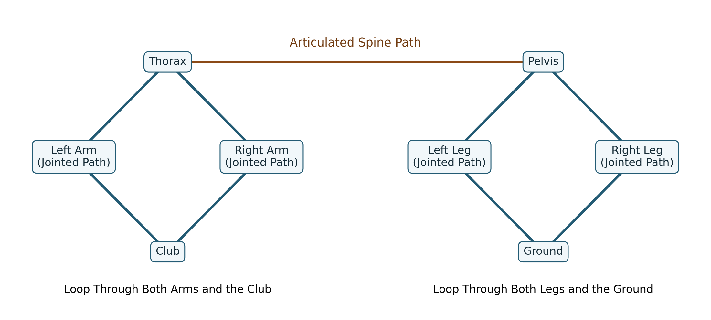

# Parallel Mechanisms and Loop Constraints {#sec-parallel_mechanisms}

The golf swing combines articulated chains, closed contact paths, muscle-generated
loads, and elastic deformation. A useful model must say which connections it
represents before it counts freedoms or interprets forces. The two-handed grip
closes a path through the arms and club. Two supported feet close another through
the legs and ground. The spine connects pelvis and thorax along an articulated
path; that connection alone does not form a loop.

The central question is how these connections change the motion produced by a
specified set of inputs, and what measurements can distinguish different ways
of producing the same motion. Geometry defines feasible motion. Inertia and
applied loads determine its acceleration. Contact reactions enforce the declared
contact model. Muscle and tissue mechanics determine available forces and energy.
None of those roles can be inferred merely by calling the golfer a parallel
mechanism.

## Draw the Actual Mechanical Graph {#sec-serial_vs_parallel}

Represent each rigid segment as a graph vertex and each joint or maintained
contact as an edge. A serial chain has one unbranched path. An open articulated
tree can branch without containing a cycle. A closed chain contains a cycle:
there must be a distinct return path, not an instruction to go back along the
same spine or arm. Serial models can have strongly coupled dynamics even when
their joint coordinates are independently selectable.

For a fixed-torso upper-body model, trace the cycle as thorax, left upper arm,
left forearm/hand, club, right hand/forearm, right upper arm, thorax. Hand offsets,
wrist joints, and shoulder-girdle motion can be resolved further when needed.
For the lower body, trace ground, left foot, left leg, pelvis, right leg, right
foot, ground. The spine links the pelvis to the thorax between these structures.
Removing one hand contact opens the upper loop; removing one foot contact changes
the lower contact structure. A raised heel can change the admissible contact
wrench without completely detaching the foot.

{#fig-parallel_mechanical_graph fig-alt="Two closed paths pass through both arms and the club, and both legs and the ground. The articulated spine connects thorax and pelvis without forming an additional cycle."}

A pelvis–spine–thorax sequence is an open path. Defining a relative angle
between pelvis and thorax does not add a physical return connection. Soft tissue
can introduce additional force paths, but a tendon spanning joints is usually
represented by a length-dependent force law, not an inextensible closure
constraint. Its finite stiffness must not be silently converted into a rigid
kinematic restriction.

The distinction agrees with the humanoid examples in the
[Modern Robotics constrained-dynamics treatment](https://modernrobotics.northwestern.edu/nu-gm-book-resource/8-7-constrained-dynamics/).
The same geometry can be represented by independent joint coordinates plus loop
constraints or by a larger set of segment poses plus joint constraints. Mixing
those two counts subtracts the same restriction twice.

## Mobility and Independent Constraints {#sec-gruebler_formula}

Let $q\in\mathbb R^n$ be local coordinates for an open-tree model. Suppose the
additional, time-independent holonomic closures are
$$
\Phi(q)=0,\qquad J_c(q)=D_q\Phi(q).
$$ {#eq-loop_jacobian_definition}
If $J_c$ has constant rank $r$ near a feasible configuration, the local
configuration manifold has dimension $n-r$. This is a regular-point statement.
At a singular point, the linearized null space can include directions that do
not extend to a finite feasible motion; higher-order closure conditions matter.
Neither an actuator being passive nor a muscle being inactive adds a kinematic
constraint by itself.

For a connected linkage with $N$ bodies including one grounded body, $J$ joints,
and $f_i$ freedoms at joint $i$, the generic Gruebler count is
$$
d_{\mathrm{generic}}=s(N-1)-\sum_{i=1}^{J}(s-f_i),
 \qquad s=3\ \text{(planar)},\quad s=6\ \text{(spatial)}.
$$ {#eq-gruebler_spatial}
It assumes that the counted joint restrictions are independent. In a planar
linkage made only of one-freedom revolute or prismatic joints this becomes
$d_{\mathrm{generic}}=3(N-1)-2J$. A four-bar with four bodies including ground
and four revolute joints therefore has one generic freedom. An unactuated
revolute joint still has one freedom. A fixed contact removes freedoms; it is
not a positive correction called a passive constraint.

A negative generic count is a reason to inspect the model, independence, and
geometry. It is not proof that the actual mechanism is immobile or that tissue
elasticity is the only reason a human can move. Omitted arm or leg bodies,
counting joint freedoms as joints, and mixing planar and spatial restrictions
can all produce meaningless results. Special rigid mechanisms can move because
some restrictions are dependent.

### A Stewart-Platform Count With All the Parts Included

Consider a six-leg UPS platform: each leg has a universal joint with two
freedoms, a prismatic joint with one, and a spherical joint with three. Each
leg contains two telescoping rigid members. Including base and moving platform,
$N=14$, $J=18$, and $\sum_i f_i=6(2+1+3)=36$. Thus
$$
d_{\mathrm{UPS}}=6(14-1-18)+36=6.
$$ {#eq-stewart_mobility}
Away from singularities, these six freedoms can describe the moving platform's
pose. Locking the six independent prismatic lengths fixes that pose locally.
Actual platforms may use different joint architectures; their counts must follow
their own joints rather than the word hexapod.

In particular, two platforms connected by six fixed-length rods with spherical
joints at both ends give $N=8$, $J=12$, and a count of six. Those six freedoms
are the axial spins of the rods, not six free motions of the platform. The six
fixed distance conditions generically fix the platform pose. This example shows
why total mechanism mobility, internal passive motion, and output mobility must
be distinguished. The
[joint-counting derivation](https://modernrobotics.northwestern.edu/nu-gm-book-resource/2-2-degrees-of-freedom-of-a-robot/)
provides the general starting point; the physical interpretation still requires
examining the particular linkage.

## Grip Closure With Separated Hand Frames {#sec-grip_parallel_constraint}

A rigid two-handed grip fixes each hand frame relative to a different location
and orientation on the club. It does not require the hands to coincide. Let
$T_L(q)$ and $T_R(q)$ be hand poses in a common world frame, $T_C$ the club pose,
and $H_L,H_R$ the constant poses of the hand frames in club coordinates. Then
$$
T_L=T_C H_L,\qquad T_R=T_C H_R,\qquad
 T_L^{-1}T_R=H_L^{-1}H_R.
$$ {#eq-grip_spatial_constraint}
The last relation supplies six local independent restrictions at a regular
spatial grasp. Pose coordinates require a nonsingular local representation;
three position equations alone do not enforce relative orientation. Grip
compliance, rolling, or slip replaces some of these ideal equalities with an
appropriate contact model.

For two seven-coordinate arms attached to a fixed torso, there are 14 arm
coordinates before the grip closes. Seven is a modeling choice; it commonly
resolves shoulder rotation, elbow flexion, forearm rotation, and wrist motion.
It is not a claim that the wrist alone supplies all three distal rotations.
With six independent relative-pose restrictions, the assembly has $14-6=8$
local freedoms. Equivalently, adding a free club contributes six coordinates
and fixing each hand to it adds twelve independent restrictions:
$$
d=14+6-12=8.
$$ {#eq-two_arm_dof_with_grip}
The fixed torso was already assumed. Subtracting additional pelvis or spine
restrictions from this upper-body count is double counting. A whole-body model
must instead add its pelvis, trunk, legs, and contact coordinates explicitly.
Eight kinematic freedoms also do not mean eight independently available neural
commands or eight controllable directions over a finite time interval.

### A Planar Example You Can Differentiate

For a deliberately simpler coincident-point grip, fix shoulder bases at
$b_L=(-1,0)^T$ and $b_R=(1,0)^T$, in meters. Give each arm two unit-length links
and relative elbow coordinates. Its hand position is
$$
p_i=b_i+
 \begin{bmatrix}\cos q_{i1}+\cos(q_{i1}+q_{i2})\\
 \sin q_{i1}+\sin(q_{i1}+q_{i2})\end{bmatrix},\qquad i=L,R.
$$ {#eq-two_arm_positions}
The point closure is $\Phi=p_L-p_R=0$, with $J_c=[J_L\;-J_R]$ and
$J_i=D_{q_i}p_i$. The difference is essential: fixing the sum of hand positions
would allow the hands to move apart while their midpoint stayed fixed.

At $q_L=(0,\pi/2)$ and $q_R=(\pi,-\pi/2)$, both hands are at $(0,1)$ and
$$
J_L=\begin{bmatrix}-1&-1\\1&0\end{bmatrix},\quad
 J_R=\begin{bmatrix}-1&-1\\-1&0\end{bmatrix},\quad
 J_c=\begin{bmatrix}-1&-1&1&1\\1&0&1&0\end{bmatrix}.
$$ {#eq-two_arm_loop_jacobian}
Here $J_c$ has rank two, leaving two freedoms. The velocity
$\dot q=(1,-1,-1,1)^T$ satisfies $J_c\dot q=0$, yet both hands move upward at
$1$ meter per second. Preserving closure does not mean holding the club still.
A separated rigid club requires its pose and attachment offsets as above; the
point example is a lower-fidelity model, not an anatomical measurement.

## Three Different Null Spaces {#sec-constraint_jacobian_nullspace}

The constraint null space $\ker J_c$ contains compatible velocities. For a
stationary holonomic closure,
$$
J_c\dot q=0,\qquad J_c\ddot q+\dot J_c\dot q=0.
$$ {#eq-velocity_constraint}
The second equation includes the change in tangent directions along the motion.
Dropping $\dot J_c\dot q$ can remove required normal acceleration even when the
velocity satisfies closure perfectly.

A task has a different Jacobian. Let $y=\psi(q)$ describe the chosen output and
$J_y=D_q\psi$. Motions that preserve both closure and this output lie in
$\ker J_c\cap\ker J_y$. If the columns of $Z$ form a basis of $\ker J_c$, then
$\dot q=Z\nu$ and $\dot y=J_yZ\nu$. The task-preserving dimension is
$$
(n-r)-\operatorname{rank}(J_yZ).
$$ {#eq-task_null_dimension}
For the regular spatial arm example, an independent six-dimensional club-pose
task leaves two posture freedoms out of eight. Holding only club-center position
leaves orientation unspecified. A face-angle change can preserve that position
task while changing the impact task. It is not invisible to every meaningful
output, and kinematic freedom does not establish negligible actuation cost.

For a feasible desired task velocity, a weighted minimum-velocity construction
uses $H=J_yZ$ and a positive-definite coordinate weight $W$:
$$
\nu_* = W^{-1}H^T(HW^{-1}H^T)^{-1}\dot y_{\mathrm{des}}.
$$ {#eq-pseudoinverse_solution}
This formula requires full row rank of $H$. It minimizes
$\tfrac12\nu^TW\nu$ subject to $H\nu=\dot y_{\mathrm{des}}$. It does not minimize
joint torque, muscle activation, or metabolic cost. Rank-deficient or bounded
problems need a suitable pseudoinverse or constrained optimization, with explicit
handling of infeasible requests.

Finally, a grasp map $G$ maps contact-load coordinates to a resultant club
wrench. Its null space $\ker G$ contains self-equilibrated load changes. Those
are forces, not joint velocities. Even the multiplier null space $\ker J_c^T$
is a different object: it describes redundant multiplier representations that
produce the same generalized reaction. When $J_c$ has independent rows,
$\ker J_c^T=\{0\}$, although a bilateral grip can still have unresolved internal
loads when applied inputs are unknown.

## Constraint Reactions and the Forward Dynamics {#sec-drift_control_parallel}

Use minimal open-tree coordinates with $M(q)$ positive definite, input map
$B(q)$, and input vector $u$. Put velocity-dependent inertial terms and gravity
in $h(q,\dot q)$. Keep passive tissue loads and other applied loads explicitly
in $p(q,\dot q,z)$, where $z$ denotes any additional constitutive states. For a
fixed, ideal contact mode,
$$
M\ddot q+h=Bu+p+J_c^T\lambda.
$$ {#eq-drift_control_constrained}
Do not put $h$ on the left and then subtract it again inside an additional
right-hand-side drift torque. Different bookkeeping conventions are possible,
but each physical term must occur exactly once.

Set $a_0=M^{-1}(Bu+p-h)$ and $A=J_cM^{-1}J_c^T$. If $J_c$ has independent rows,
$A$ is positive definite. Substitution into the acceleration constraint yields
$$
\lambda=-A^{-1}(J_c a_0+\dot J_c\dot q),\qquad
 \ddot q=a_0-M^{-1}J_c^TA^{-1}(J_c a_0+\dot J_c\dot q).
$$ {#eq-reaction_elimination}
The acceleration correction depends on the mass matrix as well as the geometry.
The matrix $I-M^{-1}J_c^TA^{-1}J_c$ acts on velocities or acceleration
increments; its transpose acts on generalized-force covectors. They cannot be
interchanged merely because both are called projections.

This solution is unique for the specified model, state, applied inputs, and
regular active equality constraints. Redundant constraints can leave multiplier
coordinates nonunique. Unilateral contacts can be infeasible for the computed
reaction; frictional contact can require a different mode or contact law.
Calling a problem forward dynamics does not remove those conditions.

### Reactions Depend on Applied Muscle Loads

For a two-coordinate illustration take $M=\operatorname{diag}(2,1)$,
$J_c=[1\;-1]$, $h=p=0$, and $B=I$. The two coordinates must accelerate together.
With $u=(1,0)^T$, the solution is
$$
\ddot q=(1/3,1/3)^T,\qquad \lambda=-1/3.
$$ {#eq-reaction_example}
With $u=(2,-1)^T$, the acceleration is unchanged and $\lambda=-4/3$. An
additional applied load in $\operatorname{range}(J_c^T)$ is balanced by a changed
reaction. Geometry determines the admissible reaction directions, not their
magnitudes independently of actuation. A reaction may be zero or large depending
on the state and inputs; the existence or number of loops alone gives no force
scale.

In inverse dynamics, the observed motion supplies the balance
$$
[B\;J_c^T]\begin{bmatrix}u\\\lambda\end{bmatrix}
 =M\ddot q+h-p.
$$ {#eq-inverse_loop_balance}
Uniqueness depends on the rank of this identification map and on additional
measurements and restrictions. Joint-level net torques can be ambiguous as well
as individual muscle forces and hand loads. Known segment inertias and motion
fix inertial demands; they do not generally separate all unknown sources.

## Club Wrenches and Bilateral Load Sharing {#sec-loop_ambiguity_active}

For a rigid club, express all vectors in a common inertial frame and take moments
about its center of mass $C$. Let $r_i$ point from $C$ to hand contact $i$, $f_i$
be its force on the club, and $m_i$ its contact couple. Then
$$
\begin{aligned}
 m_c a_C &= f_L+f_R+m_c g+f_{\mathrm{other}},\\
 I_C\dot\omega+\omega\times(I_C\omega)
 &=r_L\times f_L+r_R\times f_R+m_L+m_R+m_{\mathrm{other},C}.
 \end{aligned}
$$ {#eq-club_total_force}
The current rotational inertia tensor $I_C$ is expressed in that same frame. Other
loads include aerodynamic forces or ball contact when applicable. The hand
points of a rotating club generally have different linear accelerations:
$a_i=a_C+\dot\omega\times r_i+\omega\times(\omega\times r_i)$.
Sharing a rigid body does not make those accelerations equal.

Stack each hand load as $w_i=(m_i,f_i)$ and transport its moment to $C$ before
summing. The resulting $6\times12$ grasp map $G$ has rank six if both contacts
are modeled as unrestricted full wrenches. For a compatible required wrench,
$$
w=G^+w_{\mathrm{req}}+N_G\eta,\qquad
 \operatorname{range}(N_G)=\ker G,
$$ {#eq-force_decomposition_ambiguous}
so there are six unconstrained load-sharing parameters before friction,
unilateral pressure, moment capacity, and actuator limits are imposed. Those
physical restrictions can reduce the feasible set or make it empty; an arbitrary
algebraic split need not be realizable by a hand.

If each contact transmits only a point force, the map is $6\times6$. For two
distinct points it generically has rank five, because equal opposite forces along
the joining line produce zero resultant wrench. The null dimension is then one,
and arbitrary required spatial wrenches cannot be supported. Grip models that
allow contact couples and distributed pressure have different capabilities.

A simple scalar illustration is $\tau_L+\tau_R=10$ N m, with both torques expressed
about the same axis and reference point after all other terms are accounted for.
The pairs $(4,6)$ and $(7,3)$ satisfy the same balance. A minimum-squared-torque
choice gives $(5,5)$, but that is an optimization assumption, not an observation
of how a golfer shared the load. Relative EMG amplitudes do not by themselves
supply the missing torque ratio. Calibrated instrumented grips, muscle models,
or additional experimental perturbations can constrain the inference.

### Force Transmission, Power, and Internal Loading

A twist is a six-component angular/linear velocity representation, not generally
a unit vector. With the matching wrench ordering, $V=(\omega,v)$ and
$w=(m,f)$ pair to give power $w^TV=m\cdot\omega+f\cdot v$. Both must refer to
compatible points and frames. A change of point changes the moment and linear
velocity together, preserving power.

For an ideal rigid internal attachment, the two bodies have the same contact
twist and experience opposite wrenches. Their contact powers cancel when both
bodies are included in the system. Each body separately can receive or lose
power through that attachment. Thus the grip can transfer energy to the club
while ideal closure reactions do zero total work on the golfer-plus-club system.
In generalized coordinates this cancellation is
$$
\dot q^TJ_c^T\lambda=\lambda^TJ_c\dot q=0.
$$ {#eq-orthogonality_relation}
A constraint can redirect acceleration while doing no total work. An internal
load need not produce mechanical work merely because it stresses tissue. Muscle
maintenance can have a metabolic cost even when modeled joint power is zero;
local tissue deformation and injury outcomes require their own measurements and
constitutive models.

## Ground Contact: Wrench, Momentum, and Energy {#sec-grf_lower_body}

Ground reaction is an external contact wrench on the golfer-plus-club system.
Its value depends on the motion, geometry, muscle loading, and contact conditions.
It is not independent of muscle action, nor is it an additional muscle force.
For a simple unilateral contact with normal gap $\phi_n$, the ideal conditions
include $\phi_n\ge0$, $\lambda_n\ge0$, and $\phi_n\lambda_n=0$. A sticking
Coulomb contact also requires $\|f_t\|\le\mu\lambda_n$. Distributed foot contact
has moment and center-of-pressure restrictions in addition to this force cone.
Slip, lift-off, shoe deformation, and moving support change the equations.

For the center of mass $C$ of the selected whole system and angular momentum
$H_C$, the external balances are
$$
\begin{aligned}
 m_{\mathrm{tot}}a_C &=m_{\mathrm{tot}}g+\sum_i f_i+f_{\mathrm{other}},\\
 \dot H_C &=\sum_i\big((r_i-C)\times f_i+m_i\big)
                  +m_{\mathrm{other},C}.
 \end{aligned}
$$ {#eq-whole_body_momentum}
Here $r_i$ is the contact position in world coordinates, whereas the preceding
club balance used offsets from the club center. Uniform gravity contributes no
net moment about the whole-system center of mass. These equations constrain
whole-system momentum, not the pelvis acceleration alone. Hip, spine, and joint
reactions exchange angular momentum among segments. Even with zero total external
moment, one segment can rotate while others counter-rotate. A free moment measured
at a foot is therefore not a complete explanation of pelvis motion or proof of a
universally passive shoulder.

### A Force Plate's Reference Point Matters

Declare a right-handed frame with $z$ upward, and let $(F,M_O)$ be the wrench
of the ground on the golfer measured about an origin $O$ in the contact plane.
For $F_z\ne0$, a center of pressure $r=(x,y,0)$ is defined so that the remaining
moment there has only a vertical component. Since
$M_O=r\times F+T_z e_z$,
$$
x=-\frac{M_y}{F_z},\qquad y=\frac{M_x}{F_z},\qquad
 T_z=M_z-(xF_y-yF_x).
$$ {#eq-cop_computation}
Thus the plate-origin yaw moment $M_z$ is not generally the free moment $T_z$.
If the contact plane is at height $h$ relative to $O$, use
$x=(hF_x-M_y)/F_z$ and $y=(M_x+hF_y)/F_z$. Vendor outputs may use the opposite
force-on-plate sign or different axes; transform the full wrench before applying
these formulas. Near zero normal load the division is ill-conditioned, so state
a justified contact threshold and report unloaded intervals separately.

For a numerical check, a force $F=(20,30,800)$ N applied at
$r=(0.2,-0.1,0)$ m with free moment $T_z=5$ N m gives
$M_O=(-80,-160,13)$ N m. The formulas recover $x=0.2$ m, $y=-0.1$ m, and
$T_z=13-(6+2)=5$ N m. Calling the measured $13$ N m the free moment would
conflate the horizontal-force lever arm with the residual couple.

COP is pressure-weighted position, not the center of mass or a direct measure
of transferred body mass. A changing foot-load share can move COP while the
center of mass barely moves. With two coplanar plates, transform the wrenches
to one frame and origin before combining them. Separate plates supply each
foot's boundary wrench; one combined plate generally leaves bilateral sharing
unresolved. Six-axis measurements are wrench components, not six motion DOFs.
Calibration, cross-talk, sampling, synchronization, and filtering affect accuracy;
a universal instrument-accuracy percentage cannot substitute for calibration.

With each foot wrench known, segment poses and inertial parameters allow a
Newton–Euler recursion from foot to shank to thigh. Transfer both force and
moment, including their lever arms, at each step. This gives model-conditioned
net joint loads when other external loads and joint assumptions are specified.
It does not uniquely identify individual muscle forces or tissue stress.

### Support Can Enable Work Without Supplying Energy

A fully stationary rigid foot has zero velocity at its ground-contact points
and zero angular velocity. In this idealization, the ground wrench has zero
mechanical power, although its force and moment can change the whole-system
momentum. Muscle work can increase body and club energy while ground support
prevents an incompatible foot motion. The resultant external force dotted with
center-of-mass velocity describes center-of-mass translational-energy change; it is not the
contact power of that force on a deformable or articulated system.

For time-independent elastic potentials and ideal stationary contacts, an
energy balance has the form
$$
\frac{d}{dt}(T+V_g+V_e)
 =\dot q^TBu+P_{\mathrm{other}}-P_{\mathrm{diss}},
 \qquad P_{\mathrm{diss}}\ge0.
$$ {#eq-parallel_energy_balance}
Moving support, slipping friction, changing elastic rest states, and contact
impacts require their corresponding boundary or constitutive power terms.
Neither a large ground force nor an early force peak establishes the source,
amount, or direction of energy transferred to the club. A segment power audit
must state the system boundaries, force points, velocities, and sign conventions.

There is no single force-plate curve in this model that defines a good golfer.
Lead-foot and combined forces, normalization by body weight, club choice, swing
phase, and target all change a comparison. A claim that the best peak must occur
exactly at impact needs an identified study and outcome definition, not an
illustrative sketch. The chapter's equations specify what must balance; they do
not provide a coaching threshold or an injury-risk cutoff.

## X-Factor, Compliance, and Muscle State {#sec-body_as_closed_chain}

In a planar illustration, define $\theta_p$ and $\theta_t$ as pelvis and thorax
angles about the same axis. Then $\Delta=\theta_t-\theta_p$ is a relative
rotation, not a new loop-closure equation. For $\theta_p=60$ degrees and
$\theta_t=20$ degrees, $\Delta=-40$ degrees under this convention. In three
dimensions, use the relative orientation $R_p^TR_t$ and declare its reported
angle convention. Subtracting two Euler angles or projected shoulder-line
angles need not measure the same quantity.

[Brown, Selbie, and Wallace's X-factor methods study](https://doi.org/10.1080/02640414.2013.775474)
examines this measurement issue. A reported intersegment angle is not a direct
measurement of lumbar rotation, disc compression, tissue strain, or stored
elastic energy. Distribution among spinal levels, rib-cage/shoulder motion,
posture, and muscle activation matter. An angle associated with performance is
also not by itself evidence that increasing that angle improves an individual
swing or is safe for that individual.

For a clearly declared toy torsional spring,
$$
V_e=\tfrac12k(\Delta-\Delta_0)^2,\qquad
 Q_t=-k(\Delta-\Delta_0),\qquad Q_p=+k(\Delta-\Delta_0).
$$ {#eq-elastic_restoring_torque}
The two torques are opposite, and their combined power is
$-k(\Delta-\Delta_0)\dot\Delta=-\dot V_e$ when $k$ and $\Delta_0$ are fixed.
Doubling displacement quadruples this model's energy only if the stiffness and
rest angle stay the same. It does not establish a universal human tissue law
or prove that the stored energy reaches the club rather than another segment
or dissipation. If stiffness is actively changed, the energy derivative also
contains $\tfrac12\dot k(\Delta-\Delta_0)^2$; changing a rest angle adds another
term. An impedance schedule is not energetically free by definition.

Joint range of motion, tangent stiffness, damping, geometric constraint rank,
and neural feedback are distinct. Finite stiffness resists displacement without
reducing the exact kinematic dimension. It can make some motions small over a
specified loading range and time scale. A rigid-constraint approximation must
be justified against those scales, contact margins, and output errors.

Muscle excitation, activation, fiber length, shortening velocity, and tendon
stretch must likewise be distinguished. Eccentric contraction means active
lengthening; active shortening is concentric. A tendon can recoil while its
muscle fibers behave differently. Treating all release-phase tissue forces as
passive because club speed is high is not justified. For a muscle model,
$\tau=R(q)F_m(q,\dot q,z)$ maps muscle forces through moment arms; multiplying
moment arms by dimensionless activation alone does not produce torque.

## Constrained Drift and Forward Counterfactuals {#sec-drift_not_constrained}

At a fixed admissible state and contact mode, reaction elimination gives
$$
\begin{aligned}
 \ddot q &= f_c(q,\dot q,z)+G_c(q)u,\\
 G_c &=\big(I-M^{-1}J_c^TA^{-1}J_c\big)M^{-1}B.
 \end{aligned}
$$ {#eq-constrained_affine_dynamics}
The input-independent term includes gravity, velocity-dependent dynamics,
retained passive forces, and the geometric acceleration correction. It depends
on the declared inputs and state variables. This is the useful local affine
structure: closure reshapes both drift and the effect of an input. Removing
$u$ does not remove the reactions needed to satisfy the remaining contacts.

Computing these terms requires a model, inertial parameters, calibrated
kinematics, and any relevant tissue or contact state. Motion capture alone
does not measure masses, inertias, tendon preload, or the chosen decomposition.
Although gravitational force can be evaluated before solving for reactions,
the resulting constrained gravitational acceleration differs from free fall.
Observable motion and model-computable force terms are different evidential
categories.

For a particle observed in a rotating frame, the centrifugal and Coriolis
fictitious forces are
$$
F_{\mathrm{cf}}=-m\omega\times(\omega\times r),\qquad
 F_{\mathrm{cor}}=-2m\omega\times v_{\mathrm{rel}}.
$$ {#eq-rotating_frame_forces}
An accelerating origin and changing frame angular velocity introduce translational
and Euler terms as well. These expressions cannot be added to inertial-frame
loads without the matching frame transformation; that would double count the
kinematics. Generalized velocity-dependent terms in an articulated model are
not automatically identical to one particle's rotating-frame force.

For a hypothetical $3$ kg point mass rotating at $15$ rad/s on a $0.6$ m radius,
$m\omega^2r=405$ N. About that same center, however, the radial force has zero
moment because $r\times F_{\mathrm{cf}}=0$. It has zero power on purely tangential
relative motion. About another joint it can have a moment, but the perpendicular
lever arm and vector directions must be computed. Multiplying $405$ N by an
arbitrary segment distance does not establish a shoulder torque.

Similarly, $F_{\mathrm{cor}}\cdot v_{\mathrm{rel}}=0$: the Coriolis term is
perpendicular to the relative velocity and is not dissipative resistance to it.
For mutually perpendicular $\omega$ and $v_{\mathrm{rel}}$, with magnitudes
$10$ rad/s and $8$ m/s and mass $3$ kg, its magnitude is $480$ N. That conditional
number is not an observed golf force. A $3$ kg segment weighs $29.43$ N in
$9.81$ m/s$^2$ gravity. Neither example establishes a universal ratio of inertial
to muscle torque, and ratios of load magnitudes are not fractions of work or
clubhead-speed causation.

A forward zero-torque counterfactual (forward ZTCF) branches from a specified
initial state and changes a declared torque input or policy. It then evolves
the state and recomputes compatible reactions, contact events, and retained
passive forces. It must not reset the measured state at every time sample and
call the resulting instantaneous accelerations a new trajectory. If the inferred
baseline torques or contact model are uncertain, that uncertainty carries into
the forward prediction. Forward simulation avoids solving for unspecified
inputs during integration; it does not establish that its initial inputs,
parameters, or biological interpretation are correct.

## Kinematics, Singularities, and Feasible Control {#sec-singularities_parallel}

When all compatible open-tree joint coordinates are known, their link poses can
be computed recursively and the closure residual checked. If only some actuated
coordinates are specified, passive coordinates and platform pose may require
solving nonlinear closure equations. Multiple isolated assembly modes are not
the same as continuous redundancy or a Jacobian singularity. Inverse kinematics
asks for coordinates achieving a specified pose; its difficulty depends on the
architecture. For a Stewart-type platform, computing leg lengths from a pose
can be much simpler than computing pose from lengths. Constraint forces are not
unknowns in a purely kinematic solve.

For local input coordinates $s$ and output coordinates $x$, write differentiated
closure as $A_x\dot x+B_s\dot s=0$. In a square nonredundant mechanism, the
[Gosselin–Angeles classification](https://doi.org/10.1109/70.56660)
distinguishes rank loss of the input-side matrix $B_s$ (first kind), output-side
matrix $A_x$ (second kind), and simultaneous loss (third kind). When $A_x$ is
singular, a nonzero output velocity may satisfy the linearized equations with
locked inputs. Architecture singularity concerns geometric design that imposes
persistent rank deficiency; it is not a name for any transient unusual posture.

Standing still at address does not demonstrate a singularity, because these
ranks depend on geometry rather than whether velocity happens to be zero. A
straight two-link planar arm has a singular endpoint-position Jacobian, but its
elbow coordinate still exists. A mechanical stop, contact inequality, or a
separately imposed lock changes the admissible motion in another way. Neither
near extension nor a small singular value proves maximum impact efficiency or
safe tissue loading. A first-order rank loss may require nonlinear analysis to
determine actual finite self-motion.

Report which Jacobian is tested, its coordinate and unit scaling, the posture,
and the numerical threshold. Conditioning of $J_yZ$ concerns task velocity;
conditioning of $J_cM^{-1}J_c^T$ concerns reaction elimination; rank of
$[B\;J_c^T]$ concerns inverse load identification. Their numerical values answer
different questions. Local input rank also does not alone determine finite-time
reachability, because drift, input bounds, time horizon, and contact transitions
matter.

## An Investigation That Connects the Pieces {#sec-synthesis_golfer}

The defensible research hypothesis is that preparation and changing geometry
alter how feasible muscle inputs and stored energy produce the impact state.
The two-handed grip and ground contacts are essential parts of that mapping.
They can transmit loads, restrict relative motion, and alter the effectiveness
of an input without supplying unlimited energy or determining a unique neural
strategy. To investigate the hypothesis:

1. Define the outcome: clubhead velocity and face orientation at contact,
   strike location, ball launch, or dispersion. A club-center path alone is
   not a complete impact task.
1. Declare the graph, joint coordinates, contact modes, hand-frame offsets,
   inertias, muscle/input representation, and elastic states. Check closure,
   velocity, and acceleration residuals with measurement uncertainty.
1. Synchronize segment kinematics, separate foot wrenches, and any hand-load
   measurements. Identify which aggregate loads are determined and which
   bilateral or muscle distributions remain compatible with the data.
1. Audit linear and angular momentum separately from segment power, total
   energy, and tissue loading. Report sign conventions and reference points.
   An acceleration contribution, work contribution, and injury hypothesis
   must not share a percentage without an explicit derivation.
1. Compare a baseline trajectory with declared forward interventions on
   torque, timing, grip compliance, or contact. Preserve the same starting
   state when testing a late intervention; change it deliberately when testing
   preparation. Include uncertainty in unmeasured load sharing and parameters.
1. Test predictions on held-out trials and controlled perturbations where
   feasible. Similar observed kinematics do not prove identical forces, and
   a model that reproduces a swing does not identify the golfer's intention.

This approach can reveal when a change in grip loading mainly affects internal
stress, when it changes club orientation, or when a different contact condition
changes the admissible acceleration. It also allows a passive mechanism to be
supported where the evidence supports it, while retaining the muscle work,
feedback, and prior preparation needed to explain the entire swing.
[The energy-transfer chapter](./ch10_energy_transfer.qmd#sec-energy_transfer) develops the next question: how energy moves
between the chosen segments and storage elements.

## Exercises and Checks

1. Draw the upper and lower loops and the connecting spine path. Remove one
   grip edge. Which cycle disappears? Why does defining a pelvis–thorax
   relative angle not restore it?
1. Reproduce the UPS platform count and explain the six axial rod spins in
   the fixed-length SPS example. State which freedoms move the platform.
1. Differentiate the planar two-arm positions. Verify both closure and
   common upward hand motion for the stated configuration and velocity.
   Then compute the stacked closure/task rank when the hand point is fixed.
1. Solve the two-coordinate reaction example for both applied loads. Verify
   identical accelerations, different reactions, and zero total ideal
   constraint power for a common admissible velocity.
1. Construct the two-point-force grasp map. Show that opposite forces along
   the joining line lie in its null space. Explain why opposite forces in
   an arbitrary direction generally leave a couple.
1. Recover COP and free moment from the numerical wrench. Repeat after
   moving the reference origin, transporting the moment consistently.
1. Derive the complete energy derivative of the torsional spring when both
   stiffness and rest angle vary. Identify which terms require a source or
   sink beyond the fixed-spring mechanical exchange.
1. Specify an experiment that distinguishes a grip-load change preserving
   the resultant club wrench from one that changes club orientation. List
   the measurements needed; explain why motion alone and raw EMG ratios
   do not resolve every candidate load distribution.
