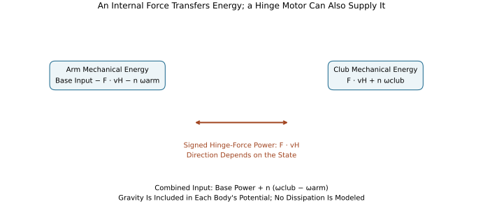
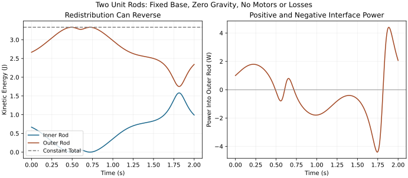

# Energy Transfer: How Power Flows Through the Kinetic Chain {#sec-energy_transfer}
[]{#ch-energy_transfer}

A useful explanation of the golf swing must answer two different questions:
what changes the motion, and where does the mechanical energy come from?
Constraint forces, muscular moments and gravity all affect acceleration, but
their energy accounts depend on the system boundary. A force can accelerate a
body without doing work on the complete system. A joint motor can add energy
while an adjacent segment loses energy. An angular-speed peak does not identify
either process by itself.

This chapter develops a consistent account from whole-system work to individual
segment power, then applies it to sequencing, lag and impact. The aim is to make
the kinetic-chain idea testable: identify the bodies, forces, moments, storage
and measurements that would support an explanation. Two explicit teaching
mechanisms and six worked exercises separate mechanical identities from
hypotheses about a golfer. The idealized examples establish possibilities and
counterexamples; their parameter values are not measured human physiology.

## Energy Fundamentals: Define the System

[]{#energy-fundamentals-kinetic-and-potential}
[]{#sec-energy_fundamentals}

For a chosen collection of rigid bodies and elastic elements, write
[]{#eq-total_energy}

$$
E_{\mathrm{mech}}=\sum_i K_i+V_g+U_e.
$$

Here $V_g$ is gravitational potential, $U_e$ is recoverable elastic energy, and
chemical energy is outside this mechanical account. Muscles can therefore add
mechanical energy during the downswing even if the total energy of a larger
thermodynamic system is conserved. Neglecting air resistance does not make an
actively driven swing mechanically conservative. Active shortening, lengthening,
elastic deformation and dissipation may coexist throughout the motion.

In one inertial laboratory frame, the kinetic energy of rigid segment $i$ is
[]{#eq-kinetic_energy_segment}

$$
K_i=\tfrac12m_i\lVert\mathbf v_{C_i}\rVert^2
 +\tfrac12\boldsymbol\omega_i^T I_{C_i}\boldsymbol\omega_i.
$$

The translational velocity is that of its center of mass; the angular velocity
and central inertia tensor must use the same axes. A relative wrist rate is not
the club's absolute angular velocity. The scalar expression $I\omega^2/2$
alone applies to rotation about a specified fixed axis with the appropriate
inertia about that axis. A translating club generally needs both terms above.
For a deforming segment this rigid-body approximation omits internal motion;
whether that omission matters requires validation for the intended output.

Near the ground, with upward height $y_i$ and constant gravitational acceleration
of magnitude $g$,
[]{#eq-potential_energy_segment}

$$
V_g=\sum_i m_i g y_i+\text{constant}.
$$

Changing the height origin changes no force or energy difference. It does change
a ratio such as gravitational energy divided by total mechanical energy. Such a
percentage is therefore not an intrinsic efficiency measure. A segment's share
of nonzero total kinetic energy is well-defined in the declared frame; at a
completely stationary instant that share is $0/0$, not zero percent.

### What Is Stored, and What Is Merely a Configuration?

[]{#inplain:energy_storage}

Kinetic energy describes motion. Elevation changes gravitational storage. A
specified elastic constitutive law assigns energy to deformation. A visible
angle, a constrained degree of freedom or a desired movement pattern does not
by itself define an additional store. The club, shaft, tendons and body can all
participate in an energy account, but including the same elastic element both
inside a segment model and as a separate spring would count it twice.

In generalized coordinates $q$, a rigid multibody model gives
[]{#eq-kinetic_energy_compact}

$$
K=\tfrac12\dot q^T M(q)\dot q.
$$

The mass matrix contains cross terms because a body's motion depends on more
than one joint rate. Those terms are required by the coordinate representation;
they are not independent packets of energy traveling between anatomical parts.
Physical segment energies remain the center-of-mass expressions above. Changing
coordinates changes the appearance of the cross terms without changing those
energies for the same physical state and observer.

## Power and the Whole-System Work Balance

[]{#theorem:power_decomposition}

[]{#power-and-the-equation-of-power-flow}
[]{#sec-power_flow}

Power is the rate of energy change through a specified mechanism:
[]{#eq-power_definition}

$$
P=\frac{dE}{dt},\qquad W=\int_{t_0}^{t_1}P\,dt.
$$

A positive input power increases the chosen mechanical account; negative input
power extracts energy from it. A dissipative loss is reported here as a
nonnegative quantity. For conservative storage $V=V_g+U_e$, use
[]{#eq-power_decomposition}

$$
M\ddot q+C(q,\dot q)\dot q+\nabla V
 =B(q)u+Q_{\mathrm{nc}}+J^T\lambda.
$$

The motor map $B$ converts actuator efforts $u$ into generalized forces.
$Q_{\mathrm{nc}}$ contains the declared remaining nonconservative forces, and
$J^T\lambda$ represents an ideal constraint reaction. Do not place the same
muscle, spring or contact force in two of these terms. A standard Christoffel
choice of $C$ satisfies the skew-symmetry identity for $\dot M-2C$; an arbitrary
matrix factorization of the velocity bias need not satisfy that matrix identity.

Differentiating kinetic and potential energy gives
[]{#eq-kinetic_energy_time_derivative}

$$
\dot K=\dot q^T M\ddot q+\tfrac12\dot q^T\dot M\dot q,
\qquad \tfrac12\dot q^T\dot M\dot q=\dot q^T C\dot q,
$$

[]{#eq-potential_energy_time_derivative}

$$
\dot V=\dot q^T\nabla V.
$$

Consequently,
[]{#eq-power_balance}

$$
\dot E_{\mathrm{mech}}
 =\dot q^T Bu+\dot q^T Q_{\mathrm{nc}}+\lambda^T J\dot q.
$$

The cancellation is between the metric-derivative term and the velocity-bias
term. It does not require $\dot q^T C\dot q=0$, which is generally false.
The general manipulator formulation and a simpler point-mass double pendulum
are also developed in Tedrake's multibody notes [@TedrakeMultibodyEnergy].

For a stationary ideal constraint and a decomposition into supplied power
$P_{\mathrm{in}}$ and dissipation $D\geq0$, the integrated account is
[$E(t)-E(t_0)=W_{\mathrm{in}}-\int D\,dt$]{.long-inline-math role="group" aria-label="Inline calculation 1; scroll horizontally" tabindex="0"}.
Gravity is already represented by $V_g$. Alternatively one can track kinetic
plus elastic energy and include gravitational power on the right. Adding
gravitational work while also retaining its potential-energy change counts the
same conversion twice. Time-dependent stiffness, an imposed spring rest angle,
or a moving prescribed base requires its corresponding parameter or support
work; the autonomous formula alone is then incomplete.

### Signed Work, Positive Work and Metabolic Cost

For separately modeled actuator powers $P_a$, distinguish
[$W_{\mathrm{net}}=\sum_a\int P_a\,dt$]{.long-inline-math role="group" aria-label="Inline calculation 2; scroll horizontally" tabindex="0"} from
[$W_+=\sum_a\int\max(P_a,0)\,dt$]{.long-inline-math role="group" aria-label="Inline calculation 3; scroll horizontally" tabindex="0"}. The latter is positive work; it does not cancel
energy supplied at one time against energy absorbed at another. Taking the
positive part after summing powers gives a different quantity when some
actuators supply energy while others absorb it. Declare which convention is
used before comparing swings.

Net joint moments inferred from motion do not resolve antagonistic muscle
forces, tendon storage or activation costs. A joint with zero net power can
still involve active muscle and metabolic expenditure. Neither a ratio to net
joint work nor a ratio to positive joint work is automatically a metabolic
efficiency. Estimating that efficiency requires a separately justified chemical
energy or metabolic model and a consistent measurement interval.

## Constraint Power: Zero for Which Boundary?

[]{#theorem:constraint_zero_work}

[]{#constraint-power-is-zero-proof-and-interpretation}
[]{#sec-constraint_power_zero}

An ideal reaction to a position constraint $\Phi(q,t)=0$ has generalized force
$Q_c=J^T\lambda$, where [$J=\partial\Phi/\partial q$]{.long-inline-math role="group" aria-label="Inline calculation 4; scroll horizontally" tabindex="0"}. Its actual power is
[]{#eq-constraint_power_general}

$$
P_c=Q_c^T\dot q=\lambda^T J\dot q.
$$

Differentiating the constraint gives
[]{#eq-constraint_time_derivative}

$$
J\dot q+\Phi_t=0,
$$

and therefore
[]{#eq-constraint_power_zero}

$$
P_c=-\lambda^T\Phi_t.
$$

It vanishes for a stationary ideal holonomic constraint. A moving support can
exchange energy with the modeled bodies. Conversely, some ideal nonholonomic
constraints, such as homogeneous no-slip rolling constraints, also have zero
reaction power. Holonomic versus nonholonomic is not the test by itself:
ideality, the admissible velocities and explicit support motion matter.
Friction, tissue damping and impact losses require their own models.

### Why Energy Can Cross an Ideal Joint

[]{#inplain:constraint_power_meaning}

[]{#inplain:constraint_power_paradox}

Consider an arm and a club connected at hinge $H$, with coincident material-point
velocities $\mathbf v_H$ in the ideal attachment. Let $\mathbf F$ act on the club
at $H$, with $-\mathbf F$ on the arm. Then
[]{#eq-constraint_power_decomposed}

$$
P_{F,\mathrm{club}}=\mathbf F\cdot\mathbf v_H,
\qquad P_{F,\mathrm{arm}}=-\mathbf F\cdot\mathbf v_H.
$$

The pair sums to zero while either term may be nonzero. This is energy crossing
an internal boundary, with equal and opposite entries in the two ledgers.
Equality of attachment-point velocities enables the cancellation; it does not
prevent transfer. Substituting the two centers' different velocities for the
contact-point velocity would calculate the wrong contact power.

In a planar model let a hinge motor apply moment $n$ to the club and $-n$ to the
arm. If gravity is included in each segment's potential, the club balance is
[]{#eq-constraint_power_wrist}

$$
\dot E_{\mathrm{club}}=\mathbf F\cdot\mathbf v_H+n\omega_{\mathrm{club}},
\qquad P_{\mathrm{hinge\ motor}}=n(\omega_{\mathrm{club}}-\omega_{\mathrm{arm}}).
$$

The moment's power on the club uses its absolute angular velocity, whereas the
motor's net mechanical power uses relative angular velocity. Their difference
is the equal-and-opposite moment's power on the arm. An ideal unactuated hinge
transmits attachment force while allowing relative rotation; setting its motor
moment to zero does not disconnect the club.

On narrow screens, scroll the figure or [open it at full size](../figures/energy_interface_ledger.svg).

::: {#fig-energy-sankey}
::: {.synthesis-diagram-scroll role="region" aria-label="energy interface ledger; scroll horizontally" tabindex="0"}

:::

Both Sides of the Internal Boundary Must Balance. Hinge-Force Power Cancels Between Bodies, While Motor Power Depends on Their Relative Angular Velocity.
:::

These balances do not select a universal direction of transfer or maximize
club energy. Geometry, motion and applied efforts determine the signed power.
The opposite signs of the interface entries establish accounting consistency;
they do not identify what would happen if the golfer deliberately changed an
effort or movement. That requires a new dynamically consistent trajectory.

### Reporting Point, Observer and Ground Contact

A wrench's power is [$\mathbf F\cdot\mathbf v_O+\mathbf n_O\cdot\boldsymbol\omega$]{.long-inline-math role="group" aria-label="Inline calculation 5; scroll horizontally" tabindex="0"}
when both the moment and velocity refer to the same rigid body's reporting
point $O$. Moving that point changes the moment and linear velocity together;
the power is unchanged. Changing the inertial observer by a constant velocity
changes individual kinetic energies and force powers consistently. A segment
energy fraction is therefore an explicitly frame-dependent diagnostic, not an
observer-independent property of the swing.

For an ideal fixed no-slip foot contact, local contact velocity is zero and the
contact force does no work there, although it can change the golfer's momentum.
Multiplying ground-reaction force by whole-body center-of-mass velocity produces
a center-of-mass power quantity, not necessarily actual foot-contact power.
Deforming footwear, slipping contacts and moving ground alter the boundary.
Gravity, air and the ball can also supply external forces; ground reaction is
not the only external interaction in a complete swing and collision.

## Energy Partition During a Declared Passive Motion

[]{#inplain:energy_flow_visualization}

[]{#energy-partition-during-the-downswing}
[]{#sec-energy_partition_downswing}
[]{#ex-five_phases_energy}

Before interpreting a golfer's downswing, test the transfer claim on a mechanism
whose assumptions and trajectory are known. Take two uniform rods, each of mass
1 kg and length 1 m, a fixed base, ideal hinges, zero gravity and no motors.
Absolute angles are measured from vertically downward. Initially the inner rod
has angle zero, the outer rod angle $-\pi/2$, and both absolute angular rates
are 2 rad/s. Their kinetic energies are $2/3$ J and $8/3$ J, respectively.
Total energy is $10/3$ J.

The initial hinge-force power into the outer rod is $+1$ W. Reflecting the outer
angle to $+\pi/2$, without changing either angular rate, gives $-1$ W. Both
states have the same segment kinetic energies. The transfer direction therefore
cannot be inferred from the energies or speed ordering alone. The force and
attachment-point velocity matter.

Numerical integration of the first state gives the following rounded outer-rod
energies at 0, 0.5, 1, 1.5 and 2 s: 2.6667, 3.3327, 2.9780, 2.5007 and 2.3421 J.
At all five times the total remains $10/3$ J within integration error. The outer
fraction rises from 80 percent to about 99.98 percent at 0.5 s and subsequently
falls. The signed power changes direction again later. There is no active
braking and no dissipative sink in this model: a decrease of outer-rod energy
is an increase of inner-rod energy.

On narrow screens, scroll the figure or [open it at full size](../figures/energy_passive_transfer.svg).

::: {#fig-energy_passive_transfer}
::: {.synthesis-diagram-scroll role="region" aria-label="energy passive transfer; scroll horizontally" tabindex="0"}

:::

An Explicit Passive Mechanism Redistributes Energy in Both Directions. The Outer Rod Gains Energy, Loses Energy and Later Gains It Again; Total Energy Remains Constant.
:::

These times are integration times for this declared mechanism, not five measured
phases of a golf swing. A realistic model needs measured or justified segment
properties, gravity, multiple joints, applied efforts and boundary conditions.
A sequence of arbitrarily selected joint rates is not a simulated trajectory;
it cannot establish a missing-work budget or a universal club-energy percentage.

## Sequential Speed Peaks and Their Interpretation

[]{#inplain:why_speeds_increase}

[]{#the-summation-of-speed-principle-vs.-sequential-acceleration}
[]{#sec-summation_vs_sequential}

The phrase summation of speed can obscure three different statements. Velocities
combine vectorially through kinematics. Powers add algebraically in a declared
energy balance. Peak times are features of a time series. None of these implies
that scalar peak angular speeds should simply be added, or that the observed
ordering proves a one-way energy cascade.

For an isolated rotor about a fixed axis, equal assigned energy gives
[]{#eq-energy_inertia_speed}

$$
\omega=\sqrt{2K/I}.
$$

For example, separate rotors with inertias 2, 0.5 and 0.1 kg m$^2$, each assigned
100 J, have angular speeds 10, 20 and approximately 44.72 rad/s. This algebra
does not describe three connected segments at successive swing phases. Their
energies need not be equal; their centers translate; their physical inertia
tensors and the full joint mass matrix have different roles. A smaller scalar
inertia alone does not guarantee a later or higher speed peak in the chain.

An especially useful counterexample uses the same two unit rods, now aligned
vertically downward with both rates 2 rad/s, zero gravity, a base moment of
$-1$ N m and zero hinge moment. The inner and outer absolute angular
accelerations are $-12/7$ and $18/7$ rad/s$^2$. Yet their kinetic-energy rates
are $-8/7$ and $-6/7$ W. The outer rod accelerates rotationally while losing
energy because its translational energy falls more rapidly. Total power is
$-2$ W, exactly the base moment times its angular velocity.

A proximal segment slowing while the club speeds up can accompany transfer,
active work, gravity conversion, elastic release or combinations of them.
It does not show that the proximal segment has exhausted its energy. Testing a
sequencing explanation requires synchronized physical segment energies,
interface powers and actuator powers, together with a model that reproduces
the measured motion. Prescribing the observed speed peaks in a model and then
claiming that the model explains those peaks would be circular.

## Storage, Active Work and a Balanced Swing Ledger

[]{#def:energy_storage}

[]{#where-is-energy-stored-and-released}
[]{#sec-energy_storage_release}

The following five-state account is deliberately hypothetical. It illustrates
bookkeeping, not a typical golfer. Start from rest at the chosen reference
height with no elastic deformation. The successive stored energies, in joules,
are given by the three rows
[]{#eq-energy_storage_ledger}

$$
\begin{aligned}
K &: (0,\ 0,\ 80,\ 115,\ 115),\\
V_g &: (0,\ 15,\ 5,\ 0,\ 0),\\
U_e &: (0,\ 10,\ 2,\ 0,\ 0).
\end{aligned}
$$

Their sums are 0, 25, 87, 115 and 115 J. Choose cumulative active mechanical
work of 0, 25, 90, 120 and 120 J and cumulative dissipative loss of 0, 0, 3, 5
and 5 J. Every state satisfies stored energy equals initial energy plus supplied
work minus losses. Between the second and third states, stored energy increases
62 J while active work increases 65 J and dissipation increases 3 J. Falling
gravitational and elastic storage explains part of the kinetic-energy rise;
it does not replace the active-work contribution.

The model could instead start at the top with its already stored 25 J. Then
that amount is initial energy, while only subsequent work belongs in the
downswing input. Adding both the initial store and all work previously used to
create it would double count the backswing. A claim that impact energy exceeds
downswing muscular work can be consistent with energy conservation, but it
requires an explicit initial store and other inputs rather than an efficiency
greater than one inferred from incomplete accounting.

### Impact Is a New Boundary and Time Interval

For an isolated one-dimensional head–ball collision, assume head mass
$m_h=0.2$ kg, ball mass $m_b=0.04593$ kg, initially stationary ball, head speed
$u_h=45$ m/s and restitution $e=0.8$. These are teaching assumptions, including
the effective isolated head mass; a shaft-coupled, spinning or oblique impact
requires additional dynamics. Momentum conservation and relative restitution give
[]{#eq-energy_collision_speeds}

$$
v_h=\frac{m_h-e m_b}{m_h+m_b}u_h,
\qquad v_b=\frac{(1+e)m_h}{m_h+m_b}u_h.
$$

The final speeds are approximately 29.8724 and 65.8724 m/s. Initial head energy
is 202.5 J; residual head energy is 89.2360 J; ball energy is 99.6491 J; the
mechanical loss in this collision is 13.6148 J. Ball energy, residual head
energy and collision loss sum to the initial energy. Residual head motion is
not collision dissipation, and swing-phase air or tissue losses are not added
again to this impact account.

With reduced mass [$\mu=m_hm_b/(m_h+m_b)$]{.long-inline-math role="group" aria-label="Inline calculation 6; scroll horizontally" tabindex="0"}, the loss is
$\mu(1-e^2)u_h^2/2$. The ratio of ball energy to pre-impact head energy is
[$m_hm_b(1+e)^2/(m_h+m_b)^2$]{.long-inline-math role="group" aria-label="Inline calculation 7; scroll horizontally" tabindex="0"}, approximately 49.21 percent here. This is an impact
energy-transfer ratio for the declared model, not a measured swing efficiency.
A halving of a body's speed quarters its kinetic energy at fixed mass; it does
not halve it. These distinctions are essential when interpreting residual
club speed, ball launch and claims about efficient energy delivery.

## Lag, Elasticity and Release Timing

[]{#why-lag-is-an-energy-storage-mechanism}
[]{#sec-lag_energy_storage}

A lag angle is a relative configuration. An ideal freely rotating hinge has no
elastic potential associated with that angle. If a torsional spring is explicitly
included, with stiffness $k$ and rest angle $q_{20}$, then
[]{#eq-lag_spring_energy}

$$
U_e=\tfrac12 k(q_2-q_{20})^2,
\qquad \tau_e=-k(q_2-q_{20}).
$$

At a 0.5 rad displacement, stiffness zero stores zero joules; stiffness
40 N m/rad stores 5 J. The angle alone cannot distinguish these cases. A
deforming shaft or tendon needs its own strain coordinate and constitutive law;
its energy is not automatically a function of the visible wrist angle.

If the rest angle or stiffness changes, the explicit parameter contribution is
[$\partial U_e/\partial t=\dot k(q_2-q_{20})^2/2-k(q_2-q_{20})\dot q_{20}$]{.long-inline-math role="group" aria-label="Inline calculation 8; scroll horizontally" tabindex="0"}.
That term represents work associated with changing the modeled spring, rather
than free passive release. A viscous hinge damper with coefficient $d\geq0$
dissipates $d\dot q_2^2$. Active moment, elastic moment and damping moment must
be separated if the question concerns their individual contributions.

Holding a relative angle fixed is a different idealization from storing energy
in a spring. A stationary ideal lock can transmit forces and moments with zero
net constraint power. Removing such a lock need not change velocity or kinetic
energy instantaneously, although subsequent dynamics change. Engaging a lock
when the relative rate is nonzero generally requires an impulsive transition
and a specified loss or actuator-work model. Releasing a rotational lock leaves
the translational attachment intact; it does not remove the hinge force.

### A Fair Release-Timing Comparison

[]{#inplain:lag_timing}

Compare strategies from the same full initial state and with declared actuator
limits, allowed controls and delivery event. The event should include relevant
club position, face orientation, path and contact conditions, rather than only
the largest angular speed anywhere in the trajectory. Report terminal kinetic
and elastic energy, signed and positive work, losses and residual motion.
Equal commanded torque histories do not generally imply equal work, because
the trajectories and rates may differ.

If one strategy begins with 90 J and another with 140 J, their final speeds
cannot isolate the effect of timing. If terminal energies are 60 and 150 J
for the same isolated fixed-axis rotor, the speed ratio is $\sqrt{150/60}$,
approximately 1.581, not two. For a translating multibody club, even that ratio
requires checking the relationship between the reported speed and total kinetic
energy. There is no universal release delay or speed multiplier established by
these examples.

Setting one motor effort to zero at a frozen state is a useful instantaneous
acceleration comparison. It is not the complete trajectory produced by a
different release strategy. Passive tissue forces, gravity, constraints and
other motors can remain active. This is where energy analysis connects to
counterfactual dynamics and control: the intervention, retained terms, starting
state and event must all be specified before assigning a causal benefit.

## Two-Link Dynamics and Physical Energy Transfer

[]{#double-pendulum-energy-transfer-complete-derivation}
[]{#sec-double_pendulum_energy}

To derive the coupling explicitly, take a fixed planar base, inner-link length
$L_1$, masses $m_1,m_2$, center distances $c_1,c_2$ from each proximal hinge and
central planar inertias $I_1,I_2$. Define relative coordinates
$q_1=\theta_1$ and [$q_2=\theta_2-\theta_1$]{.long-inline-math role="group" aria-label="Inline calculation 9; scroll horizontally" tabindex="0"}, where the absolute angles $\theta_i$
are measured from downward. Let $u=\dot q_1$, $w=\dot q_2$ and
[$a=I_1+m_1c_1^2+m_2L_1^2$]{.long-inline-math role="group" aria-label="Inline calculation 10; scroll horizontally" tabindex="0"}, $b=I_2+m_2c_2^2$, $d=m_2L_1c_2$.
Directly differentiating the center positions gives
[]{#eq-double_pend_kinetic_energy}

$$
K=\tfrac12a u^2+\tfrac12b(u+w)^2+d\cos q_2\,u(u+w).
$$

The club rotates at $u+w$, not $w$. The inner contribution is
[$(I_1+m_1c_1^2)u^2/2$]{.long-inline-math role="group" aria-label="Inline calculation 11; scroll horizontally" tabindex="0"}; the rest belongs to the translating and rotating outer
body. Hence the physical outer-body energy includes the cross term and an
$m_2L_1^2u^2/2$ contribution. Assigning only $bw^2/2$ to the club would omit
its motion induced by the inner link.

Euler--Lagrange equations with base and relative-hinge motor efforts
[$\tau=(\tau_1,\tau_2)^T$]{.long-inline-math role="group" aria-label="Inline calculation 12; scroll horizontally" tabindex="0"} give $M\ddot q+h+G=\tau$, where
[]{#eq-energy_two_link_dynamics}

$$
M=\begin{bmatrix}
a+b+2d\cos q_2&b+d\cos q_2\\
b+d\cos q_2&b
\end{bmatrix},\qquad
h=\begin{bmatrix}-d\sin q_2(2uw+w^2)\\d\sin q_2u^2\end{bmatrix}.
$$

Both velocity-bias components matter. For upward gravitational potential,
[]{#eq-energy_two_link_gravity}

$$
G=\begin{bmatrix}
(m_1c_1+m_2L_1)g\sin q_1+m_2c_2g\sin(q_1+q_2)\\
m_2c_2g\sin(q_1+q_2)
\end{bmatrix}.
$$

Multiplying by the rates and retaining the metric derivative recovers
[]{#eq-double_pend_power}

$$
\dot E=\tau_1u+\tau_2w.
$$

In particular,
[]{#eq-coriolis_power}

$$
\dot q^T h=-d\sin q_2\,uw(u+w)
 =\tfrac12\dot q^T\dot M\dot q.
$$

This scalar can be nonzero. It is canceled in the total energy derivative,
not identified as a separate physical input or equated to the club's energy
rate. A term called Coriolis power in one coordinate decomposition must not be
promoted into an invariant segment-transfer measurement.

To compute the actual hinge-force transfer, let $\mathbf a_{C_2}$ be the outer
center acceleration and $\mathbf g=(0,-g)^T$. With no other outer-body force,
Newton's equation gives
[]{#eq-coriolis_power_numerical}

$$
\mathbf F=m_2(\mathbf a_{C_2}-\mathbf g),
\qquad P_{F,2}=\mathbf F\cdot\mathbf v_H.
$$

The physical body rates follow from center translation, rotation and gravity:
[]{#eq-coriolis_power_late}

$$
\dot E_2=P_{F,2}+\tau_2(u+w),\qquad
\dot E_1=\tau_1u-P_{F,2}-\tau_2u.
$$

Their sum agrees with the generalized balance. This independent Newton-force
calculation is the check that a coordinate-based interpretation needs. In
three dimensions replace scalar moments and rates by compatible moment/angular
velocity pairings; in a two-arm closed chain include both attachment wrenches
and avoid duplicating the shared club energy.

### Reproducible Calculation

The shared `rod_energy_ledger` routine computes center energies and
their derivatives from `RodPair` dynamics. Its state uses absolute
angles and rates; motor inputs remain base and relative-hinge moments. For
uniform rods the central inertias are $m_iL_i^2/12$ and $c_i=L_i/2$.
Run this example from the repository root:

```python
import numpy as np

from src.tools.energy_ledger_examples import rod_energy_ledger
from src.tools.lagrangian_examples import RodPair

model = RodPair(gravity=0)
state = np.array([0, -np.pi / 2, 2, 2])
ledger = rod_energy_ledger(model, state, np.zeros(2))
np.testing.assert_allclose(ledger.kinetic, [2 / 3, 8 / 3])
np.testing.assert_allclose(ledger.mechanical_rates, [-1, 1])
assert np.isclose(ledger.force_power, 1)
assert np.isclose(ledger.actuator_power, 0)

braking = rod_energy_ledger(
    model, np.array([0, 0, 2, 2]), np.array([-1, 0])
)
np.testing.assert_allclose(braking.mechanical_rates, [-8 / 7, -6 / 7])
```

The calculation has been independently checked against directional derivatives
of each physical body's energy, total generalized motor power and the force
power at the hinge. Conservation alone would be insufficient verification:
two incorrectly assigned segment rates could cancel in the total. Conversely,
a small integration drift is a numerical diagnostic, not evidence of unmodeled
muscular work or physical dissipation.

## Evidence, Measurement and an Investigable Golf-Swing Argument

[]{#summary-the-energy-picture-of-the-golf-swing}
[]{#sec-energy_summary}

Nesbit and Monika Serrano's work-and-power study used four selected amateur
golfers and a selected swing from each, with model-derived mechanical quantities
[@Nesbit2005b]. It supports examining coordinated body and club work within
that study's model. It does not establish a population-wide energy percentage,
directly measure metabolic efficiency or identify the causal effect of an
instruction to delay release. Those questions need additional evidence.

To investigate an energy-transfer explanation, first define the outcome:
clubhead delivery speed and orientation, ball launch, repeatability or effort.
Then choose the body and time boundaries. Estimate segment properties and
synchronized motion; state coordinate, frame and joint-moment conventions.
Use the [inverse-dynamics chapter](./ch18_inverse_dynamics_parallel.html) and [constraint-force chapter](./ch07_constraint_forces.html) to construct physically
compatible forces. Close the whole-system ledger and both sides of each
important interface before interpreting a sequence of peaks. The [complete-swing chapter](./ch14_complete_swing.html) and [synthesis chapter](./ch13_interdisciplinary.html) connect these local mechanisms to finite-time delivery
and competing task objectives.

Power estimates amplify synchronization and differentiation errors. To first
order, the error in a wrench power includes
[]{#eq-energy_power_uncertainty}

$$
\delta P\simeq\delta\mathbf F\cdot\mathbf v
 +\mathbf F\cdot\delta\mathbf v
 +\delta\mathbf n\cdot\boldsymbol\omega
 +\mathbf n\cdot\delta\boldsymbol\omega.
$$

These errors can be correlated; uncertainty in integrated work also depends
on timing, filtering, interval endpoints and their covariance. Compare a
reported transfer difference with that uncertainty, test plausible segment
properties, and inspect energy residuals without treating residual magnitude
alone as a diagnosis of the missing mechanism. Force-plate, motion-capture and
club measurements must share time and frame conventions.

The resulting argument is interconnected but specific: configuration and
inertia determine how efforts and constraints affect acceleration; actual
velocities determine their power; constitutive behavior determines storage and
loss; control changes the trajectory and delivery event; observations constrain
which of those explanations can be distinguished. A convincing coaching claim
requires a controlled intervention or a validated counterfactual model with
uncertainty, not just a mechanically plausible story. The mechanics makes better
questions possible without prescribing a universal hip-braking or lag strategy.

## Chapter Exercises: Energy Transfer {#chapter-exercises-energy-transfer}

1. Derive the mechanical-energy balance from the manipulator equation.
   Explain why setting the scalar Coriolis contraction to zero is unnecessary.
   Then derive the power of an ideal constraint with explicit time dependence.

1. At an arm–club hinge, force power into the club is 12 W. The base motor
   moment is 7 N m, hinge motor moment 3 N m, and arm and club absolute angular
   rates are 2 and 5 rad/s. Find both body mechanical-energy rates, hinge-motor
   power and total motor power. Assume all other interactions are conservative.

1. Check the five-state storage ledger between the second and third states.
   If the second state is the beginning of the downswing, explain which initial
   energy and work interval belong in its balance. Can a video lag angle determine
   the initial elastic store?

1. For the stated isolated impact, derive the speeds, energy-transfer ratio
   and loss from momentum and restitution. Explain why residual head energy and
   swing losses cannot be relabeled as collision dissipation.

1. Derive $M$, $h$ and $G$ for the two-link relative chart. For the aligned
   unit-rod braking case, compute both absolute angular accelerations and both
   body-energy rates. Explain how the outer rod can gain angular speed while
   losing energy.

1. Design a comparison of two release strategies that could distinguish
   active work, elastic release and interface transfer. State the common initial
   conditions, actuation constraints, delivery event, measured quantities and
   uncertainties. Explain why equal torques or a sequence of speed peaks is
   insufficient evidence of equal effort or one-way transfer.

## Worked Answers

1. Differentiate [$K=\dot q^TM\dot q/2$]{.long-inline-math role="group" aria-label="Inline calculation 13; scroll horizontally" tabindex="0"}, substitute the equation of motion,
   and add [$\dot V=\dot q^T\nabla V$]{.long-inline-math role="group" aria-label="Inline calculation 14; scroll horizontally" tabindex="0"}. The terms
   [$\dot q^T\dot M\dot q/2$]{.long-inline-math role="group" aria-label="Inline calculation 15; scroll horizontally" tabindex="0"} and $\dot q^TC\dot q$ cancel by the compatible
   Christoffel identity, leaving actuator, nonconservative and constraint powers.
   From $J\dot q+\Phi_t=0$, constraint power is $-\lambda^T\Phi_t$; only the
   stationary ideal case guarantees zero through this argument. A moving support
   must remain in the work account.

1. Club moment power is $3(5)=15$ W, so its energy rate is $12+15=27$ W.
   The arm receives base power $7(2)=14$ W and loses 12 W through the force and
   $3(2)=6$ W through the hinge moment: its rate is $-4$ W. Hinge-motor power is
   $3(5-2)=9$ W; total motor power is $14+9=23$ W. The body rates sum to the
   same 23 W. Equating club moment power to motor power would miss the arm's
   opposite moment entry.

1. Stored energy rises from 25 to 87 J, a 62 J increase. Active work over
   that interval is $90-25=65$ J and loss is 3 J. Kinetic energy rises 80 J,
   supplied by 65 J active work plus 10 J gravitational release plus 8 J elastic
   release, minus 3 J loss. Starting at the second state means 25 J initial
   storage and work counted only afterward. Lag alone supplies neither a spring
   stiffness nor its rest deformation; an ideal hinge can have that angle with
   zero elastic energy.

1. Solve [$m_hu_h=m_hv_h+m_bv_b$]{.long-inline-math role="group" aria-label="Inline calculation 16; scroll horizontally" tabindex="0"} and $v_b-v_h=e u_h$. The stated speeds
   follow. Divide $m_bv_b^2/2$ by $m_hu_h^2/2$ to obtain the ratio, about
   0.492094. Subtract both final kinetic energies from the initial energy to obtain
   $\mu(1-e^2)u_h^2/2$, about 13.6148 J. Residual head energy is still mechanical
   energy, and earlier swing dissipation occurred outside the collision interval.

1. Differentiate the kinetic-energy quadratic twice with respect to rates
   to obtain $M$; Euler--Lagrange differentiation gives both components of $h$.
   Differentiate gravitational potential to obtain both entries of $G$. In the
   aligned unit-rod case the absolute-coordinate mass matrix is
   [$\left[\begin{smallmatrix}4/3&1/2\\1/2&1/3\end{smallmatrix}\right]$]{.long-inline-math role="group" aria-label="Inline calculation 17; scroll horizontally" tabindex="0"},
   with zero instantaneous velocity bias and gravity. Solving against $(-1,0)^T$
   gives $(-12/7,18/7)^T$. Inner energy rate is
   [$(1/3)(2)(-12/7)=-8/7$]{.long-inline-math role="group" aria-label="Inline calculation 18; scroll horizontally" tabindex="0"} W; total motor power is $-2$ W, so outer energy rate
   is $-6/7$ W. Independent center and hinge-power calculations give the same
   result. Increasing rotational energy is outweighed by decreasing translational
   energy; angular speed alone does not measure total outer-body energy.

1. Use identical positions, velocities and internal elastic states, with
   the same stated motor capacities and support conditions. Define release as a
   specific control or constraint change, including any switching impulse or
   parameter work. Evaluate at the same physical delivery event and report its
   orientation and position as well as speed. Integrate separate active, elastic,
   dissipative and interface powers; compare signed work, positive work, residual
   energy and uncertainty across strategies. Equal torque commands can yield
   different rates and therefore different work. Peak order alone leaves those
   accounts unidentified. Repeat the comparison under plausible measurement and
   model variations before attributing a robust benefit to timing.
