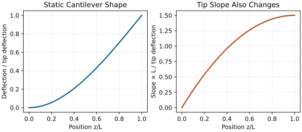
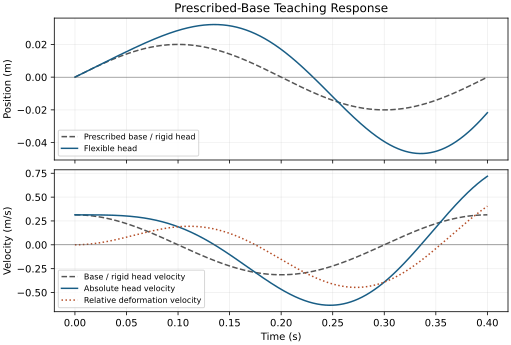

# The Flexible Shaft: Elastic Energy and the Catapult Effect {#sec-flexible_shaft}
[]{#ch-flexible_shaft}

::: {.callout-note}
## Why the Shaft Matters

[]{#ch11-why_shaft}
A shaft connects a moving golfer to a moving clubhead through a deformable structure. Its bending changes the position and orientation of the head, stores some of the work exchanged through the grip, and returns or dissipates that energy as loading changes. The reaction also acts on the golfer. Understanding this two-way connection is essential: motion of the head relative to the grip is not automatically an increase in the head's speed relative to the ground.

This chapter connects beam mechanics, coupled dynamics, energy accounting and control. The word "catapult" describes temporary elastic storage and subsequent motion; it does not establish a universal speed bonus. The useful question is which shaft, golfer, input history and impact outcome are being compared, and which measurements can distinguish the proposed mechanisms.
:::

## When a Rigid Model Is Adequate {#why-rigid-models-fail}
A rigid club model is a deliberate approximation. It can explain gross segment motion or provide a reference for a more detailed calculation. Its adequacy depends on the output: an error acceptable for overall swing timing may be unacceptable for face orientation, strike location or strain. Assess the difference against an explicit tolerance and measurement uncertainty. Adding flexibility without identifying its parameters does not by itself improve predictive accuracy.

Separate bending in two transverse directions, torsion about the shaft, and axial extension. Composite construction can couple these deformations. A planar bending model is useful for deriving principles, but it cannot independently predict three-dimensional face delivery. Even the direction called "lead" needs a reference frame; a camera projection alone can mix shaft motion, perspective and grip rotation.

::: {.callout-tip}
## Shaft Deflection Magnitudes

[]{#ch11-deflection}
For a straight, uniform, nonrotating cantilever under a static transverse tip force $F$, let $L$ be its free length and $EI$ its bending rigidity. Integrating the moment-curvature relation gives

$$
w(z)=\frac{Fz^2(3L-z)}{6EI},\qquad
\delta=w(L)=\frac{FL^3}{3EI},\qquad
w_z(L)=\frac{FL^2}{2EI}.
$$

These relations require small slopes, a fixed clamp, no tip moment and negligible shear deformation. They establish the strong length dependence and connect displacement to tip rotation; they are not a measured range for all golf shafts. For the illustrative values $L=1\,\mathrm{m}$, $EI=40\,\mathrm{N\,m^2}$ and $F=2\,\mathrm{N}$, the tip deflects $16.67\,\mathrm{mm}$ and rotates $0.025\,\mathrm{rad}$. Changing the support or loading changes the answer. Elementary cantilever theory is developed in [@Parks2004Beam].
:::

On narrow screens, scroll the figure or [open it at full size](../figures/shaft_bending_shape.svg).

::: {#fig-shaft_bending}
::: {.aba-diagram-scroll role="region" aria-label="shaft bending shape; scroll horizontally" tabindex="0"}

:::

A Tip-Normalized Static Cantilever Shape and Its Slope. This Is an Admissible Approximation, Not an Exact Vibration Eigenmode.
:::

An acceleration magnitude does not specify a bending load. A force along the centerline of an ideal straight beam produces axial loading. A transverse force or an offset force can produce a bending moment. The clubhead center of mass is generally offset from the shaft axis, so a grip force described as radial can participate in bending. MacKenzie and Sprigings varied this offset and replayed selected grip-force components in a three-dimensional model, demonstrating the importance of geometry and the declared loading intervention [@MacKenzie2010Deflection]. A large centripetal acceleration alone cannot establish the sign or size of shaft bend.

## Beam Theory Basics: How Shafts Deform {#beam-theory-basics-how-shafts-deform}
Let $z\in[0,L]$ denote distance along a straight reference shaft, $w(z,t)$ a transverse displacement, and $\mu(z)$ mass per length. For small bending about a stationary configuration, an Euler--Bernoulli teaching model with prescribed tensile prestress $N(z)$ is

$$
\mu w_{tt}+\partial_z^2(EI w_{zz})-\partial_z(Nw_z)=q(z,t).
$$

Here $q$ is transverse load per length in $\mathrm{N/m}$. Spatial variation of $EI$ stays inside the derivatives. For constant $EI$, zero prestress and a nonrotating frame this reduces to $\mu w_{tt}+EIw_{zzzz}=q$. This scalar model neglects shear deformation and cross-section rotary inertia within the beam; it is not a complete equation for a rotating, anisotropic golf club. Moving-frame inertial terms, boundary motion, torsion and head inertia must be added consistently when those effects matter.

At a fixed clamp, $w(0)=w_z(0)=0$. For an unloaded bare tip with $N=0$, the bending moment and shear vanish: $EIw_{zz}(L)=0$ and $\partial_z(EIw_{zz})(L)=0$. A head with mass and rotational inertia supplies dynamic end forces and moments instead. A compliant grip supplies different boundary relations again. A frequency measured with a bench clamp therefore belongs to that assembled test, including clamp length, tip attachment and measurement procedure.

::: {.callout-note}
## Why $EI$ Matters

[]{#ch11-ei_product}
Bending rigidity $EI$ has units $\mathrm{N\,m^2}$; a translational spring stiffness $k$ has units $\mathrm{N/m}$; a rotational spring coefficient has units $\mathrm{N\,m/rad}$. They cannot be substituted for one another. In the static cantilever above, $k=3EI/L^3$. A tapered composite shaft has a stiffness profile, and two shafts with similar tip compliance can have different local curvature, tip slope, torsion or vibration response.
:::

The elastic bending energy is

$$
U_b=\frac12\int_0^L EI(z)w_{zz}^2\,dz.
$$

For a fixed tensile prestress, the quadratic transverse contribution is $U_N=\tfrac12\int_0^L N(z)w_z^2\,dz$. Varying these functionals yields the stiffness terms in the PDE, including the boundary terms. Positive tension penalizes transverse slope in this idealization. Compression contributes with the opposite sign and can invalidate a stable small-deflection approximation near buckling. A rotating shaft requires the prestress and associated work to be derived from the same mechanical system.

::: {.callout-note}
## Modal Coordinates

[]{#ch11-modal}
Approximate $w(z,t)=\sum_{j=1}^{n}\phi_j(z)\eta_j(t)$ using declared admissible shapes. For a mode with nonzero tip displacement, choose dimensionless $\phi_j$ with $\phi_j(L)=1$; its amplitude $\eta_j$ is then in metres. With several such modes, the tip displacement is their sum. The amplitudes are signed coordinates, and zero displacement in one coordinate does not imply that every deformation is absent.
:::

For a stationary planar beam with a centered point head mass $m_h$, projection gives

$$
M_{ij}=\int_0^L\mu\phi_i\phi_j\,dz+m_h\phi_i(L)\phi_j(L),
$$

$$
K_{ij}=\int_0^L EI\phi_i''\phi_j''\,dz+
\int_0^L N\phi_i'\phi_j'\,dz.
$$

A tip rotational inertia $J_h$, when included about the appropriate bending axis with coincident mass center and attachment, adds $J_h\phi_i'(L)\phi_j'(L)$ to $M_{ij}$. An offset mass needs the full tip kinematics and its translational-rotational coupling. These expressions show why the loaded modes need not equal those of a bare clamped-free shaft.

The static shape in the first example, normalized by its tip displacement, is $\phi=(3s^2-s^3)/2$ with $s=z/L$. It is an admissible single-coordinate approximation, not an exact vibration eigenmode. For uniform $\mu$ and zero prestress it gives $M=33/140\,\mu L+m_h$ and $K=3EI/L^3$. This is a useful consistency check linking the static compliance, distributed kinetic energy and modal stiffness.

Mode normalization is bookkeeping. Replacing $\phi$ by $a\phi$ and $\eta$ by $\eta/a$ multiplies the corresponding single-mode mass and stiffness by $a^2$, while preserving displacement, energy and frequency. Reporting an effective mass without the coordinate normalization is incomplete. Add modes until the outputs of interest converge: tip slope and rapid transients may need more resolution than gross displacement. Validate against measurements after numerical convergence; one does not substitute for the other.

## The Extended State Vector {#the-extended-state-vector}
Let $\mathbf q$ contain skeletal coordinates and $\boldsymbol\eta$ the retained elastic coordinates. One ordering is

$$
\mathbf x=(\mathbf q,\dot{\mathbf q},\boldsymbol\eta,
\dot{\boldsymbol\eta}).
$$

::: {.callout-tip}
## State Dimension Growth

[]{#ch11-state_dim}
Two joint coordinates plus one bending coordinate give six mechanical states. In the order $(q_1,q_2,\dot q_1,\dot q_2,\eta,\dot\eta)$, the fifth derivative is $\dot x_5=x_6$. Its value is a velocity, not $x_5$ itself. Additional bending directions, torsion, muscle activation or tendon dynamics require additional states. Count coordinates separately from their velocities and actuator states.
:::

With a stationary, uncoupled single mode,

$$
m\ddot\eta+c\dot\eta+k\eta=Q_\eta,
\qquad \omega_n=\sqrt{k/m},\qquad \zeta=\frac{c}{2\sqrt{km}}.
$$

For a displacement coordinate, $Q_\eta$ is a force. Dividing by $m$ gives an acceleration on the right of $\ddot\eta+2\zeta\omega_n\dot\eta+\omega_n^2\eta=Q_\eta/m$. In a coupled model, skeletal accelerations also enter the elastic equations; these accelerations depend on applied input. They cannot generally be hidden in a function of joint position and velocity alone.

A rating of 240--280 cycles per minute converts to $4.00$--$4.67\,\mathrm{Hz}$, or approximately $25.13$--$29.32\,\mathrm{rad/s}$. This conversion says nothing about whether that bench frequency equals an in-swing mode. Nor does multiplying a free-vibration frequency by downswing duration establish how many loading/recovery cycles a driven shaft executes. Forcing, initial state, damping and changing configuration all matter.

## How Shaft Flexibility Enters the Drift Field {#how-shaft-flexibility-enters-the-drift-field}
Collect all mechanical coordinates into $\mathbf r=(\mathbf q,\boldsymbol\eta)$. For an ideal torque-input model, write

$$
\mathbf M(\mathbf r)\ddot{\mathbf r}+\mathbf h(\mathbf r,\dot{\mathbf r})
+\nabla U(\mathbf r)+\mathbf D\dot{\mathbf r}
=\mathbf B(\mathbf r)\mathbf u.
$$

Here $\mathbf h$ contains the remaining velocity and load terms, and $U$ includes the retained conservative potentials. The acceleration input map is $\mathbf M^{-1}\mathbf B$. An elastic coordinate can have a zero row in $\mathbf B$ but a nonzero row in this map. Virtual work identifies where forces are applied; solving the coupled inertia problem identifies how every coordinate accelerates.

An exact translation example makes the distinction concrete. Let a base of mass $m_b$ have position $x$, and a head of mass $m_h$ have position $x+\eta$. Connect them with a spring and damper, and apply an external force $u$ to the base. There is no gravity along this axis. Then

$$
T=\frac12m_b\dot x^2+\frac12m_h(\dot x+\dot\eta)^2,
\quad U=\frac12k\eta^2,\quad \delta W=u\,\delta x.
$$

The mass matrix and generalized input are

$$
\mathbf M=\begin{bmatrix}m_b+m_h&m_h\\m_h&m_h\end{bmatrix},
\quad \mathbf B=\begin{bmatrix}1\\0\end{bmatrix},
\quad \mathbf M^{-1}\mathbf B=\begin{bmatrix}1/m_b\\-1/m_b\end{bmatrix}.
$$

Solving gives

$$
\ddot x=\frac{u+k\eta+c\dot\eta}{m_b},
\qquad
\ddot\eta=-\frac{u}{m_b}
-\left(\frac1{m_b}+\frac1{m_h}\right)(k\eta+c\dot\eta).
$$

At $m_b=1\,\mathrm{kg}$, $m_h=0.2\,\mathrm{kg}$, $u=2\,\mathrm N$ and initially zero bend and relative velocity, the base acceleration is $2\,\mathrm{m/s^2}$ and relative acceleration is $-2\,\mathrm{m/s^2}$. The head's absolute acceleration is initially zero. There is no actuator in the shaft, yet the input immediately changes the bending-coordinate acceleration.

::: {.callout-note}
## The Catapult Mechanism

[]{#ch11-catapult}
Recoil pushes on both sides of the connection. A head can move forward relative to the grip while the grip slows relative to another trial. Comparing relative recoil alone omits that reaction. In the two-mass example, zero external force conserves total momentum, while damping removes mechanical energy. Internal motion can redistribute energy and momentum among the bodies without creating either.
:::

This distinction also clarifies the affine form $\dot{\mathbf x}=f(\mathbf x)+G(\mathbf x)\mathbf u$. Elastic restoring forces contribute to the drift under the declared input convention. Flexibility changes the state space, and inertia coupling can give elastic accelerations direct dependence on the same input. If muscle excitation is the input, activation and force dynamics must be included before making statements about immediacy or control bandwidth. An ideal torque channel and a physiological excitation channel are different models.

## Elastic and Damping Terms {#elastic-and-damping-terms}
For a fixed linear modal stiffness $k>0$ and viscous damping $c\geq0$,

$$
Q_{\rm elastic}=-k\eta,\qquad Q_{\rm damp}=-c\dot\eta,
\qquad U=\frac12k\eta^2.
$$

Restoring force opposes signed displacement; damping force opposes relative velocity. Their powers are $-\dot U$ and $-c\dot\eta^2$, respectively. A shaft can therefore absorb mechanical work while loading, return some while unloading, and dissipate some throughout motion. A single viscous coefficient is a chosen approximation to measured dissipation, not a universal material constant independent of frequency or assembly.

::: {.callout-important}
## Elastic and Damping Forces

[]{#ch11-elastic_damp}
For the complete two-mass example,

$$
\frac{d}{dt}(T+U)=u\dot x-c\dot\eta^2.
$$

For multiple elastic coordinates, passive viscous dissipation requires the symmetric part of the damping matrix to be positive semidefinite. Check the full power balance before interpreting a plot of individual energy components. Nonzero elastic energy is storage at that instant; release over an interval is a decrease in storage, and head kinetic-energy gain also depends on the other bodies and external work.
:::

At a fixed deflection, increasing $k$ increases $U$. At a fixed force in static equilibrium, $\eta=F/k$ and $U=F^2/(2k)$, so increasing $k$ decreases $U$. These are different experiments. With stiffnesses $80$ and $160\,\mathrm{N/m}$, a fixed deflection of $0.02\,\mathrm m$ stores $0.016$ and $0.032\,\mathrm J$. A fixed force of $1.6\,\mathrm N$ instead gives deflections $0.02$ and $0.01\,\mathrm m$, storing $0.016$ and $0.008\,\mathrm J$. In a swing, force and deformation evolve together; neither static comparison alone predicts the result of changing shafts.

## Shaft Loading During the Downswing: Centrifugal Stiffening {#shaft-loading-during-the-downswing-centrifugal-stiffening}
In an inertial frame, centripetal acceleration is produced by real applied forces. A rotating-frame description introduces inertial terms often described using centrifugal loading. Those descriptions must agree when transformed consistently. Gravity remains approximately constant near the ground; changes in its projection onto a shaft-fixed direction arise from rotation, not an increase in gravitational acceleration during the downswing.

Tensile prestress can increase tangent bending stiffness through $U_N$. It does not remove transverse forcing or the moment of an offset head mass. In the deflection model discussed earlier, radial loading and head geometry affected lead and toe-down deflection near impact; the model did not reduce to a spring freely snapping straight [@MacKenzie2010Deflection]. The magnitude of prestress effects must be compared with bending stiffness and the other inertial terms over a declared trajectory.

::: {.callout-tip}
## Centrifugal Stiffening in a Driver Swing

[]{#ch11-centrifugal_numbers}
If a reduced model prescribes $k(t)$ externally, its storage is $U=\tfrac12k(t)\eta^2$. Therefore

$$
\dot U=k\eta\dot\eta+\frac12\dot k\eta^2.
$$

The second term is parameter power. Increasing stiffness while holding a nonzero bend requires energy from the mechanism changing that stiffness. For $\eta=0.02\,\mathrm m$ and $\dot k=10\,\mathrm{N/(m\,s)}$, this contribution is $0.002\,\mathrm W$. A full rotating model accounts for the corresponding exchange through its coupled coordinates. Inserting a speed-dependent stiffness into a constant-parameter energy balance omits that exchange.
:::

## The Catapult Effect: Energy Release Near Impact {#the-catapult-effect-energy-release-near-impact}
For an isolated, undamped oscillator, speed is maximal at its equilibrium position. A driven, rotating golf club with moving supports and an offset head is a different system. Peak head speed need not occur when the shaft is straight, and the sign of bend at impact need not be lag. An equilibrium position under current loading can itself be deflected.

To connect deformation to observable motion, let $\mathbf r_g$ and $R_g$ be the grip position and rotation, and let $\mathbf a(\boldsymbol\eta)$ locate a selected head point in the grip frame. Its inertial position and velocity are

$$
\mathbf r_h=\mathbf r_g+R_g\mathbf a,\qquad
\mathbf v_h=\mathbf v_g+R_g\left(
\boldsymbol\omega_g\mathbin\times\mathbf a+
J_\eta\dot{\boldsymbol\eta}\right),
$$

where $\boldsymbol\omega_g$ is expressed in the grip frame and $J_\eta=\partial\mathbf a/\partial\boldsymbol\eta$. Include tip slope, twist and the offset from shaft attachment to the chosen head point when constructing $\mathbf a$. A clubface center, head center of mass and impact point are different points. The moving-frame rotation term remains even when relative deflection stops changing.

The norm $\|\mathbf v_h\|$ is not generally the sum of the norms of these terms. A projected deformation contribution is a kinematic decomposition within one trajectory. A speed gain from changing equipment is a difference between two complete trajectories and may include different grip motion, timing and impact states.

::: {.callout-note}
## Why Shaft Flex Profiles Matter

[]{#ch11-flex_profile}
In MacKenzie and Sprigings' optimized model, a sizable relative kick velocity coexisted with a much smaller difference between flexible- and rigid-club speed; the grip motion also differed. The tested flexible shafts produced very similar maximum speeds despite different deflections and presentation [@MacKenzie2009Stiffness]. This supports measuring the coupled response. It does not establish a universal percentage benefit, a universal best stiffness, or that flexibility never matters.
:::

## Shaft Flex Profiles and Forward ZTCF Trajectories {#shaft-flex-profiles-and-forward-ztcf-trajectories}
A forward zero-torque counterfactual (ZTCF) begins at a declared full state and sets a specified active torque channel to zero from that instant. The shaft retains its initial deformation and deformation velocity, passive forces remain, and the grip evolves under the coupled equations. A measured or prescribed grip trajectory supplies continuing external influence and is not that full-system counterfactual.

In the two-mass example with $u=0$, the center of mass travels at constant velocity and the internal coordinate obeys

$$
m_{\rm red}\ddot\eta+c\dot\eta+k\eta=0,
\qquad m_{\rm red}=\frac{m_bm_h}{m_b+m_h}.
$$

This reduced mass differs from the head mass used when the base is externally fixed. With $m_b=1\,\mathrm{kg}$, $m_h=0.2\,\mathrm{kg}$ and $k=80\,\mathrm{N/m}$, the undamped internal frequency is $21.91\,\mathrm{rad/s}$; a fixed-base model gives $20\,\mathrm{rad/s}$. Boundary freedom changes dynamics even though the spring and head are unchanged.

::: {.callout-tip}
## Comparing Shaft Profiles

[]{#ch11-shaft_comparison}
Specify whether a comparison holds joint torques, muscle excitations, measured grip motion, initial mechanical energy or task objective fixed. Holding the same bend across different stiffnesses changes initial elastic energy. Holding the same force changes initial bend. Reoptimizing each swing changes the controller. Each comparison answers a legitimate but different question. Report its initial state, input channel, constraints, event time and output before attributing an improvement to the shaft.
:::

Changing stiffness alone can leave $G$ unchanged at a matched state in a particular fixed-mass model, while altering its later trajectory and therefore task sensitivity. Changing shaft mass or geometry can also change the mass matrix and input map directly. Neither possibility licenses an inference about control authority from the size of the zero-input motion alone.

## Shaft Fitting Through the Lens of Drift {#shaft-fitting-through-the-lens-of-drift}
Shaft fitting is a coupled equipment-and-movement comparison. Relevant outcomes include clubhead velocity vector, face presentation, strike location, ball launch, dispersion and the golfer's ability to reproduce the task. A deterministic model can predict a trajectory or local sensitivity. Shot dispersion requires a distribution of inputs, states or parameters, together with an observation and impact model; oscillation in a single trajectory is not dispersion.

MacKenzie and Boucher studied 33 golfers using two shaft-stiffness conditions with matched club inertial properties. Greater relative kick in the more flexible condition accompanied lower grip angular velocity, while the group clubhead-speed comparison was not statistically significant. Individual results varied. This was not an equivalence test, and individual significance in repeated trials is not proof of a stable fitting response across future sessions. The study also distinguished bend-induced loft from total delivered loft [@mackenzie2017shaft].

::: {.callout-important}
## Shaft Fitting as Coupled System Design

[]{#ch11-shaft_fitting}
Define the desired outcome and an improvement threshold before comparing shafts. Record the assembly and measured properties, counterbalance trial order, allow familiarization, retain repeated shots and quantify uncertainty. To distinguish passive reaction from altered motor behavior, grip/head kinematics alone may be insufficient; additional force or physiological measurements and a validated model are needed. A simulator's reoptimized solution is a hypothesis about achievable behavior, not evidence that a golfer has learned it.
:::

This connects shaft dynamics to the muscle and motor-learning chapters. Muscle force depends on activation, length, shortening velocity and tendon state. Shaft reaction changes skeletal loading and can change those states even with the same neural command. The golfer may also adapt commands through practice and sensation. Separating these pathways requires an explicit intervention; a changed shot outcome alone cannot identify which pathway caused it.

## The Shaft as an Energy Buffer {#the-shaft-as-an-energy-buffer}
For a declared golfer-club mechanical system, energy accounting over an interval has the form

$$
\Delta(T+U_g+U_{\rm shaft}+U_{\rm tissue})
=W_{\rm active}+W_{\rm external}-E_{\rm diss}.
$$

Choose the system boundary before classifying grip work as internal or external. If the golfer and club are both inside, their grip interaction is internal and must not be counted again as an external energy source. If only the club is inside, grip work crosses the boundary. Avoid double-counting active work and the release of elastic energy previously stored by that work.

An isometric fiber contraction is not itself a reservoir of potential energy: zero fiber shortening implies zero fiber mechanical power in the idealized description, although metabolic energy is consumed and series tissues may change length. Muscle, tendon and shaft need separate storage and power terms. During recoil, head kinetic energy can rise while another segment slows, stored energy falls, external work continues and dissipation remains positive.

::: {.callout-note}
## Why Swing Speed Alone Cannot Select a Shaft

[]{#ch11-slow_golfer}
A slower swing does not by itself establish greater elastic benefit. Available work, loading direction, head offset, grip response, shaft properties, timing and the chosen performance outcome are intertwined. Static energy comparisons reverse when the controlled quantity changes. Treat a swing-speed fitting rule as an empirical rule to test under stated conditions; it does not follow from the spring-energy equation or from centrifugal stiffening alone.
:::

## Worked Example: A Prescribed Base and a Flexible Head {#sec-ch11_worked}
### Rigid Shaft Case {#rigid-shaft-case}
Use a one-dimensional horizontal translation model to isolate base excitation. The axis is a declared transverse teaching direction, not simultaneously a vertical coordinate and a rotating swing plane. A massless spring-damper connects a prescribed base $y_b(t)$ to a point head of mass $m$. The rigid comparison imposes $y_h=y_b$ and requires whatever actuator force maintains that constraint. It is not a free golfer-club simulation.

Choose the smooth observed interval

$$
y_b(t)=A\sin(\Omega t),\quad A=0.02\,\mathrm m,
\quad \Omega=\frac{\pi}{0.2\,\mathrm s},\quad 0\leq t\leq0.4\,\mathrm s.
$$

The base starts and ends with nonzero velocity $A\Omega$. We do not abruptly stop it at either endpoint. At $t=0.1\,\mathrm s$ its velocity is zero and acceleration is maximally negative; negative acceleration already occurs throughout $0<t<0.2\,\mathrm s$. Calling $0.1\,\mathrm s$ the onset of deceleration would misdescribe the function.

### Flexible Shaft Case {#flexible-shaft-case}
Define the relative displacement $\eta=y_h-y_b$. Newton's law on the head is

$$
m(\ddot y_b+\ddot\eta)=-k\eta-c\dot\eta,
\quad
\ddot\eta+\frac cm\dot\eta+\frac km\eta=-\ddot y_b.
$$

Set $\eta(0)=\dot\eta(0)=0$. The head initially shares the base velocity, so the initial absolute kinetic energy is nonzero. Use $m=0.2\,\mathrm{kg}$, $k=80\,\mathrm{N/m}$ and $c=0.64\,\mathrm{N\,s/m}$, giving $\omega_n=20\,\mathrm{rad/s}$ and $\zeta=0.08$. These are manufactured teaching parameters, not fitted golfer measurements. By comparison, combining $k=7000\,\mathrm{N/m}$ with the same mass would give $\omega_n=187.08\,\mathrm{rad/s}$, not $15\,\mathrm{rad/s}$.

### Numerical Example {#numerical-example}
The forcing is $A\Omega^2\sin(\Omega t)$. Introduce $s_\Omega=\sin(\Omega t)$ and $c_\Omega=\cos(\Omega t)$. A reproducible independent solution uses the state $\mathbf z=(\eta,\dot\eta,s_\Omega,c_\Omega)$:

$$
\dot{\mathbf z}=\begin{bmatrix}
0&1&0&0\\
-400&-3.2&A\Omega^2&0\\
0&0&0&\Omega\\
0&0&-\Omega&0
\end{bmatrix}\mathbf z,
\qquad \mathbf z(0)=\begin{bmatrix}0\\0\\0\\1\end{bmatrix}.
$$

Thus $\mathbf z(t)=\exp(Ht)\mathbf z(0)$ for the displayed matrix $H$. Its rows have the units appropriate to the mixed state components; the matrix is not dimensionless. The figure uses a direct ODE integration, checked against this matrix exponential. Displacement, velocity and energy must agree under tighter tolerances, rather than merely producing a plausible-looking curve.

On narrow screens, scroll the figure or [open it at full size](../figures/shaft_base_response.svg).

::: {#fig-ch11:ztcf_comparison}
::: {.aba-diagram-scroll role="region" aria-label="shaft base response; scroll horizontally" tabindex="0"}

:::

Position and Velocity Under the Declared Prescribed Base. The Flexible Response Includes Continuing Boundary Work; No Ball-Impact Event Is Modeled.
:::

Two energy descriptions answer different questions. Relative oscillator energy satisfies

$$
E_{\rm rel}=\frac12m\dot\eta^2+\frac12k\eta^2,
\qquad \dot E_{\rm rel}=-m\ddot y_b\dot\eta-c\dot\eta^2.
$$

The effective forcing term is work in the base-relative description. For absolute head kinetic energy plus spring storage,

$$
E_{\rm abs}=\frac12m(\dot y_b+\dot\eta)^2+\frac12k\eta^2,
$$

$$
\dot E_{\rm abs}=P_b-c\dot\eta^2,
\qquad P_b=-(k\eta+c\dot\eta)\dot y_b.
$$

Here $P_b$ is power supplied through the prescribed base to the spring-damper/head system. It can have either sign. Integrating this balance, including initial head kinetic energy, checks the forcing sign and reveals the source of motion. The example shows a response to continuing boundary input. It provides neither a ZTCF of the full golfer nor a percentage speed benefit at ball impact, which is absent from this model.

## Passive Flexibility and Ongoing Control {#why-shaft-flex-is-in-the-drift-not-the-control}
::: {.callout-important}
## Shaft Flexibility: Passive Forces and Coupled Inputs

[]{#ch11-drift_only}
The golfer does not command a bending coordinate independently. The golfer can influence its evolution through forces and motion at the grip, subject to muscle dynamics, constraints and finite time. Restoring and damping forces are passive, while their coordinate accelerations can still respond to active inputs through $\mathbf M^{-1}\mathbf B$. These facts are compatible.
:::

Evaluate control over a specified remaining time, task output and admissible input set. A large passive contribution is not proof that an active perturbation has no effect, and a nonzero input-map row is not proof that an arbitrarily large correction is feasible. With excitation inputs, propagation through activation, muscle force, skeletal motion and shaft deformation can limit the attainable change before impact. This is where the beam, muscle and control descriptions must meet within one model.

::: {.callout-important}
## Key Takeaways

[]{#ch11-takeaways}
The shaft stores and exchanges energy; it creates no mechanical energy. Its deformation changes position and orientation, and its reaction changes the grip response. Specify boundary conditions, normalized coordinates, inertia and input channels before discussing drift. Distinguish relative recoil from equipment-induced speed differences, a prescribed boundary from zero input, and deterministic sensitivity from measured dispersion. Model checks establish internal consistency; measured comparisons establish how well the model describes golfers.
:::

## Chapter Exercises {#chapter-exercises}

[]{#ex-ch11}

1. An unforced underdamped mode has $\omega_n=12\,\mathrm{rad/s}$, $\zeta=0.05$, $\eta(0)=0.03\,\mathrm m$ and $\dot\eta(0)=0$. Find the time for the exponential envelope to shrink by a factor $e^{-1}$, and distinguish it from the first zero of displacement.
1. Compare spring energy for $k=80$ and $160\,\mathrm{N/m}$ under a fixed deflection of $0.02\,\mathrm m$ and under a fixed force of $1.6\,\mathrm N$. Explain why a dynamic fitting conclusion requires more information.
1. If total shaft mass changes but its spatial distribution, stiffness profile and grip/head boundaries are unknown, can the new modal frequency be computed? State the conditional result when only a known modal mass increases.
1. A repeated-shaft trial reports a change in distance and dispersion. Identify measurements and controls needed to distinguish relative shaft recoil, altered grip motion and impact-location effects. Does a nonsignificant group speed test demonstrate equivalence?
1. In the prescribed-base example, translate the whole forcing and its matched initial state earlier by $\Delta t$. Contrast this with changing only a local part of the acceleration history while keeping the initial state fixed. Must the latter shift peak deformation by $\Delta t$?
1. For externally prescribed $k(t)$, derive the additional energy term. Explain why tensile stiffening cannot establish that the shaft becomes straight at impact.

## Worked Answers

1. With $\omega_d=\omega_n\sqrt{1-\zeta^2}$, the displacement is $\eta_0e^{-\zeta\omega_nt}[\cos(\omega_dt)+(\zeta\omega_n/\omega_d)\sin(\omega_dt)]$. The envelope reduction time is $1/(\zeta\omega_n)=1.6667\,\mathrm s$. Writing $\alpha=\arctan(\zeta\omega_n/\omega_d)$, the first zero is $(\pi/2+\alpha)/\omega_d\approx0.13524\,\mathrm s$. The sine term enforces release from rest; the exponential alone is not the displacement.
1. Fixed deflection gives $0.016$ and $0.032\,\mathrm J$; fixed force gives $0.016$ and $0.008\,\mathrm J$. During a swing, changes in loading, timing, grip response and initial state must also be solved or measured.
1. No. For a fixed single-coordinate stiffness and all other model assumptions unchanged, $\omega_n=\sqrt{k/m}$ falls as modal mass increases. Total shaft mass does not determine that modal mass without its spatial weighting and normalization.
1. Record grip and head kinematics, delivered face and velocity, strike location and ball launch, with repeated, counterbalanced trials and uncertainty estimates. Force measurements and model interventions can test competing mechanisms. Nonsignificance alone does not establish equivalence; that requires a prespecified practical margin and an appropriate uncertainty analysis.
1. Translating the complete input and matched state history of a time-invariant system translates its response. A local change adds a new forced response and can change both amplitude and phase. Its peak must be recomputed; it need not move by the same amount as the edited feature.
1. Differentiation gives $\dot U=k\eta\dot\eta+\tfrac12\dot k\eta^2$. The second term accounts for parameter power. Transverse loads, head offsets, initial state and ongoing boundary motion can sustain bend even when tangent stiffness increases.
