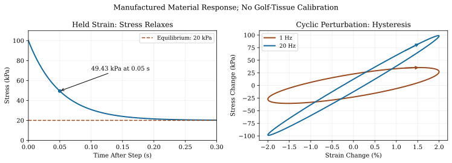

# Fascia and Connective Tissue: Material Mechanics and Evidence {#sec-fascia}
[]{#ch-fascia}

::: {.callout-note}
## What Connective Tissue Contributes

[]{#ch12-myth_landscape}
Connective tissue helps determine how a golfer's muscles load the skeleton, how neighboring structures move against one another, and how deformation is sensed. Those roles connect anatomy to both mechanics and control. They do not establish a universal percentage of swing power supplied by fascia, nor do they make the tissue mechanically unimportant.

A stretched elastic structure can pull and can accelerate another structure while it recoils. The energy came from earlier loading. A tissue can also dissipate energy, change its properties over time, and contain cells and nerve endings. The useful questions concern the amount, direction and timing of these effects in a specified task.

This chapter replaces an earlier overly categorical account. In particular, stiffness is not the opposite of elasticity, force transmission is not necessarily force loss, and a single hypothetical tissue volume cannot establish whole-body golf energy storage. We will derive those distinctions and identify the measurements needed to test their importance.
:::

## What Fascia Actually Is {#what-fascia-actually-is}

The word fascia needs an anatomical scope. A named fascial sheet, such as fascia lata around the thigh, is a specific structure. The broader term fascial system can include several interconnected connective-tissue compartments. A model that counts tendon, aponeurosis, intramuscular connective tissue and deep fascia separately must define non-overlapping volumes before adding their energy. Otherwise, a broad label can count the same material twice.

Collagen fibers contribute tensile strength and recoverable deformation. Elastin, hydrated matrix, cells and interstitial fluid also contribute, in proportions that depend on the tissue and site. Epimysium surrounds a muscle, perimysium organizes fascicles, and endomysium surrounds individual muscle fibers. Deep fascial sheets and these intramuscular coverings are related structures, but they are not interchangeable names for a single interface. Nor are tendon and bone successive layers underneath every patch of skin.

::: {.callout-note}
## Anatomy Before Parameters

[]{#ch12-fascia}
A reproducible tissue model specifies its anatomical region, constituent boundaries, fiber directions, thickness, reference configuration and attachments. Its parameters also require a loading protocol and material law. The name fascia alone does not supply these quantities.
:::

For example, Bonaldi and colleagues tested composite fascia-lata specimens from four fresh-frozen human donors. Their measured response depended strongly on loading direction relative to collagen layers. Their preparation and relatively slow test protocols must accompany any quoted modulus; these are not universal constants for a golfer's shoulder or torso. [@glossaryFascia2023]

Elasticity means that deformation stores recoverable mechanical energy within the model's applicable range. A large elastic modulus means that more stress is required for a specified small strain. A material can therefore be both stiff and elastic. Viscosity introduces rate-dependent dissipation; plasticity and damage introduce other forms of irreversible change. Biological remodeling changes tissue over still other time scales. These mechanisms should not all be described as a tissue becoming looser or releasing.

## Four Claims That Need Separate Tests {#the-myth-landscape-common-false-claims}

### Can Fascial Structures Supply Swing Power? {#myth-1-fascial-slings-generate-swing-power}

::: {.callout-note}
## Force, Power and Metabolic Generation

[]{#myth:ch12:slings}
A passive stretched spring exerts force. If its tensile force is $F$ and its length is $\ell$, the power supplied to the spring by its attachments is $F\dot\ell$. During unloading, this quantity can be negative: the spring is returning power to the surrounding system. Calling the spring passive does not make its instantaneous force or output power zero.

For a passive element with recoverable energy $S$, let $P_{\rm in}$ be the total mechanical power entering its boundary and $\mathcal D\geq0$ its dissipation rate. Then

$$
\dot S=P_{\rm in}-\mathcal D.
$$

Over a cycle returning every internal state to its initial value, net mechanical input is nonnegative. During part of that cycle, however, output power can be substantial. Neither a measured force nor a peak-power percentage establishes how much new metabolic energy the tissue supplied.

The categorical biological statement that fascial tissue cannot contract is also incorrect. Schleip and colleagues examined human tissue histology and pharmacologically stimulated rat fascial strips containing myofibroblasts. Their study discusses responses on minutes-to-hours scales and explicitly does not support a substantial direct contractile contribution on the seconds scale of locomotion. These findings justify distinguishing cellular contractility from rapid skeletal-muscle actuation; they do not measure golf-swing power. [@fasciaSchleip2019]

Thus a claim such as half the swing power comes from fascia needs a defined tissue boundary, power signal, time interval and denominator. It cannot be established or refuted by saying that fascia only transmits force. The defensible energy question is how earlier loading, later recoil and dissipation alter club delivery.
:::

### Can Fascia Store and Return Elastic Energy? {#myth-2-fascia-stores-and-releases-energy-like-a-spring}

::: {.callout-note}
## Energy Requires a Loading History

[]{#myth:ch12:spring}
Collagenous structures can store elastic energy. Their contribution cannot be inferred from the elastin fraction, nor ranked from modulus alone. For a linear material with modulus $E$, strain $\epsilon$ and volume $V$, the stored energy is $S=VE\epsilon^2/2$. This formula assumes homogeneous uniaxial strain, a fixed reference volume and linear elasticity.

At equal strain and volume, increasing $E$ increases stored energy. At equal stress $\sigma$, however, $\epsilon=\sigma/E$ and $S/V=\sigma^2/(2E)$: increasing $E$ decreases stored energy. These are different experiments. Neither comparison determines which tissue has more energy during an actual swing, because the anatomical volumes, loading and deformations also differ.

For a nonlinear elastic law, energy density is the area under the elastic stress-strain curve. For a viscoelastic cycle, some input work is dissipated and the returned work depends on the path and rate. A whole-body fascial energy budget would need the relevant fields across all counted tissue regions and a consistent muscle-tendon accounting. No such calibrated golf budget is established here.
:::

### Do Anatomical Continuities Establish Force Chains? {#myth-3-myofascial-meridians-create-full-body-force-chains}

::: {.callout-note}
## Continuity, Direction and Coupling

[]{#myth:ch12:meridians}
Connective-tissue continuity is a legitimate anatomical observation. It does not by itself establish an exclusive path carrying a specified fraction of force or energy. Conversely, a network need not spread loading equally in every direction: aligned fibers and attachments can produce strong anisotropy. Dismissing every proposed continuity as anatomical fiction replaces one unsupported generalization with another.

In a study of 37 participants, Carvalhais and colleagues altered latissimus-dorsi tension while measuring passive hip torque and resting position, with muscle activity monitored. Passive and active tensioning produced different changes in the measured hip variables. This supports a bounded interpretation of mechanical interaction across connected regions. It does not establish an exclusive transmission route, a universal map of meridians, or a golf-swing energy fraction. [@fasciaCarvalhais2013]

A proposed load path becomes useful when it predicts an observable change under a declared perturbation and performs better than alternatives. An anatomical drawing, a remote range-of-motion change and a validated dynamic power budget are different levels of evidence. Preserve that distinction when using a coaching image of a sling or line.
:::

### What Would Establish a Training Effect? {#myth-4-fascial-training-transforms-your-swing}

::: {.callout-note}
## Outcomes and Mechanisms

[]{#myth:ch12:training}
A change in range of motion, soreness or performance does not identify the tissue or mechanism that changed. Nor does failure to isolate one mechanism prove that connective tissue cannot adapt. The intervention, comparison group, measurement and time scale determine the inference.

Konrad and Tilp's six-week stretching study reported increased range without detected changes in the measured muscle-tendon structural parameters. A later acute study by Konrad and colleagues reported changes in muscle and muscle-tendon stiffness after two stretching protocols. Taken together, these examples caution against explaining every improvement either as permanent tissue deformation or as a purely neurological effect. Neither study isolated fascia or tested a golf outcome. [@fasciaKonrad2014; @fasciaKonrad2017]

To claim that a fascia-targeted intervention improves a swing through a particular tissue change, measure that change and the golf outcome, compare a credible alternative intervention, and address other adaptations. A short-term response to rolling or stretching cannot by itself establish scar removal, faster healing, or improved clubface control. These are hypotheses requiring their own evidence, not consequences of the word myofascial.
:::

## Mechanical Models and Their Measurable Predictions {#what-the-science-actually-says}

On narrow screens, scroll the figure or [open it at full size](../figures/fascia_viscoelastic_memory.svg).

::: {#fig-fascia_layers}
::: {.aba-diagram-scroll role="region" aria-label="Manufactured viscoelastic response; scroll horizontally" tabindex="0"}

:::

Manufactured Standard-Linear-Solid Response With Equilibrium Modulus 1 MPa, Branch Modulus 4 MPa and Relaxation Time 0.05 s. Left: An Ideal 2 Percent Strain Step. Right: Steady Cycles of 2 Percent Strain Amplitude About a Tensile Bias; Arrows Show Time Direction. These Curves Are Model Examples, Not Golf-Tissue Measurements.
:::

### Force Transmission and Virtual Power {#fascia-as-force-transmission-tissue}

Consider tissue paths with lengths $\ell(q)$, length Jacobian $J_\ell=\partial\ell/\partial q$, and tensile force vector $F$. Positive $F_i$ resists increasing path length. The generalized force exerted by those paths on the modeled body is

$$
\tau_f=-J_\ell^T F,\qquad
\dot\ell=J_\ell\dot q,\qquad
\tau_f^T\dot q=-F^T\dot\ell.
$$

These equations follow from virtual work. The same force can appear at several joint coordinates through its moment arms. That redistribution does not imply energy has disappeared. Dissipation requires a material mechanism and a nonnegative loss term in a consistent power balance.

::: {.callout-tip}
## A Coupled Pair of Motions

[]{#ch12-shoulder_coupling}
For a manufactured small-motion spring with extension proportional to $q_1-q_2$, let $S=k(q_1-q_2)^2/2$. Its stiffness matrix is

$$
K=k\begin{bmatrix}1&-1\\-1&1\end{bmatrix}.
$$

It resists relative motion, with stiffness eigenvalue $2k$, while common motion $(1,1)^T$ has eigenvalue zero. The spring changes directional response; it does not reduce every possible motion by the same percentage. This example is not an anatomical rotator-cuff model. It explains why the sign and direction of a coupling matter before making such a model.

Mechanical tension in a neighboring tissue also does not establish that its muscle has received an additional neural command. Activation, passive tension and any reflex response must be represented separately. The muscle-force ([the related chapter](ch17_muscle_force_generation.html)) and passive-control ([the related chapter](ch27_passive_distributed_control.html)) chapters develop those distinctions.
:::

### Elastic and Viscoelastic Elements {#fascia-as-a-series-elastic-element}

Whether a tissue is represented in series, in parallel, or through a distributed network depends on its attachments and on the model boundary. An aponeurosis along a muscle's force path can contribute series compliance. Intramuscular and neighboring connective tissues can provide additional parallel or lateral paths. Treating all surrounding fascia as a compulsory series spring is an anatomical assumption, not a general consequence of connective-tissue mechanics.

For a uniform, linear, uniaxial strip with reference length $L$, area $A$, extension $\delta$ and strain $\epsilon=\delta/L$,

$$
F=EA\epsilon=k\delta,\qquad k=\frac{EA}{L},\qquad
S=\frac12 k\delta^2=\frac12 E\epsilon^2 AL.
$$

Here $E$ has units Pa, $k$ has units N/m and $S$ has units J. Doubling area or halving length changes structural stiffness even if the material modulus is unchanged. A joint stiffness additionally includes the attachment geometry and moment arms.

For a small-strain nonlinear elastic law $\sigma_e(\epsilon)$, define

$$
\psi(\epsilon)=\int_0^\epsilon\sigma_e(s)\,ds,
\qquad E_{\rm tan}=\frac{d\sigma_e}{d\epsilon}.
$$

The reference stress and energy have been set to zero here. If one writes $\sigma_e=E_{\rm sec}(\epsilon)\epsilon$, then

$$
E_{\rm tan}=E_{\rm sec}+\epsilon\frac{dE_{\rm sec}}{d\epsilon}.
$$

The coefficient multiplying strain is a secant modulus; it is not generally the tangent modulus. Likewise, substituting a strain-dependent modulus into $E\epsilon^2/2$ does not generally give the correct stored energy. For $\sigma_e=E_0(\epsilon+b\epsilon^3)$, the integral is $\psi=E_0(\epsilon^2/2+b\epsilon^4/4)$.

The familiar compliant toe region of a collagenous tensile response can reflect progressive fiber recruitment before a stiffer range. Failure and damage require further modeling. For large deformation, a three-dimensional law must use a consistent stress-strain pair and reference volume, with fiber directions, near-incompressibility and shear as appropriate. The scalar formulas here are controlled illustrations, not a universal constitutive law for all fascia.

A Kelvin-Voigt approximation adds a dashpot in parallel:

$$
\sigma=E\epsilon+\eta\dot\epsilon,
\qquad\sigma\dot\epsilon=\dot\psi+\eta\dot\epsilon^2,
\qquad\psi=\frac12 E\epsilon^2.
$$

The viscosity $\eta$ has units Pa\,s. With $E>0$ and $\eta\geq0$, the material stores elastic energy and dissipates energy. During a prescribed constant-rate ramp from zero to $\epsilon_0$ in time $T$, its final stored energy density is $E\epsilon_0^2/2$, independent of ramp time, while the dissipated energy density is $\eta\epsilon_0^2/T$. Faster loading at the same final strain increases this model's loss; it does not eliminate its stored energy. Under prescribed force rather than prescribed strain, the deformation history is different.

::: {.callout-note}
## Why Tissue Memory Matters

[]{#ch12-viscoelasticity}
Hold a stretched material at the same length and its force may change with time. Its current length then does not tell you everything needed to predict its current force. The loading history matters.

This does not mean tissue becomes a liquid whenever stretching is slow. It means the chosen model needs enough internal state to represent its measured response. A stiffness measured over minutes cannot simply be inserted into a millisecond loading calculation without checking the rate range. Likewise, a rapid test cannot establish the effects of weeks of training.
:::

Kelvin-Voigt has no gradual stress relaxation once strain is held constant. A standard linear solid can represent one relaxation time. Let $z$ be a viscous strain-like internal state, $E_\infty>0$ an equilibrium modulus, $E_1>0$ a branch modulus and $\tau_r>0$ a relaxation time:

$$
\begin{aligned}
\sigma&=E_\infty\epsilon+E_1(\epsilon-z),\\
\dot z&=(\epsilon-z)/\tau_r,\\
\psi&=\tfrac12 E_\infty\epsilon^2+\tfrac12 E_1(\epsilon-z)^2.
\end{aligned}
$$

The branch viscosity is $\eta_1=E_1\tau_r$. Direct differentiation gives the energy balance

$$
\sigma\dot\epsilon-\dot\psi
=\frac{E_1}{\tau_r}(\epsilon-z)^2\geq0.
$$

This is a check on the model's passivity with fixed parameters, not proof of whole-body stability or of a particular tissue's parameter values. For an ideal imposed strain step $\epsilon_0$ from an initially relaxed state,

$$
\sigma(t)=\left(E_\infty+E_1e^{-t/\tau_r}\right)\epsilon_0,
\qquad t\geq0.
$$

An actual testing machine applies a finite ramp, which must be included when fitting data. The equilibrium spring leaves a nonzero stress at long times. The memory variable can also leave two specimens at the same strain with different stresses after different histories.

As a manufactured example, take $E_\infty=1$ MPa, $E_1=4$ MPa, $\tau_r=0.05$ s and $\epsilon_0=0.02$. Stress begins at 0.100 MPa, is about 0.04943 MPa after one relaxation time, and approaches 0.020 MPa. These numbers illustrate the equations; they are not fitted golf-tissue measurements. Multiple relaxation modes, nonlinear response or fluid transport may be necessary for actual data.

For a steady sinusoidal strain perturbation $\delta\epsilon=\epsilon_a\sin\omega t$ about a tensile bias, the same linear model gives

$$
\begin{aligned}
\delta\sigma&=\epsilon_a(E'\sin\omega t+E''\cos\omega t),\\
E'&=E_\infty+\frac{E_1(\omega\tau_r)^2}{1+(\omega\tau_r)^2},\\
E''&=\frac{E_1\omega\tau_r}{1+(\omega\tau_r)^2}.
\end{aligned}
$$

Here $\omega$ is angular frequency in rad/s. The storage modulus $E'$ and loss modulus $E''$ describe this harmonic experiment. The dissipated energy per cycle per reference volume is $\pi E''\epsilon_a^2$. With this one-mode model, that loss is greatest at $\omega\tau_r=1$ and decreases at still higher frequencies; a blanket assertion that higher rate always means greater cyclic loss is incorrect. The figure uses perturbations about a sufficiently tensile baseline, not a claim that slack fascia supports arbitrary compression.

### What Material Numbers Establish {#fascia-stiffness-values-quantitative-reality}

The earlier table combined unsupported site-independent values for fascia, passive muscle and other tissues. It also contradicted its own cortical-bone value. A defensible comparison keeps the experiment attached to each number. Bonaldi and colleagues' Table 1 reports, for one donor's composite fascia lata, linear-region moduli of 191.9 MPa in the L1 direction and 6.9 MPa in the T1 direction, with standard deviations 54.5 and 2.0 MPa respectively. L1 and T1 designate specimen orientation relative to the first layer's fibers; the specimens retain the composite layers. The study included four donors aged 54--89 and used a 0.5%/s failure ramp after preconditioning. [@glossaryFascia2023]

::: {.table-wrapper role="region" aria-label="Directional fascia-lata moduli; scroll horizontally" tabindex="0"}
| Orientation | Mean (MPa) | Standard Deviation (MPa) |
| --- | ---: | ---: |
| L1 | 191.9 | 54.5 |
| T1 | 6.9 | 2.0 |
:::

One Donor's Composite Fascia Lata: Directional Linear-Region Moduli. Source: Bonaldi et al. [@glossaryFascia2023], Table 1, S4. These are composite-specimen measurements, not isolated-layer constants.

[]{#tab-ch12:stiffness}

Those values refute a universal claim that deep fascia must have a modulus below 2 MPa. They do not supply a constitutive model for a living golfer, nor a safe strain limit. A modulus measured in one part of a nonlinear failure curve cannot automatically be used across an entire loading cycle. Donor variability and test uncertainty also matter; a quoted mean is not a guaranteed value for an individual.

::: {.callout-tip}
## An Energy Estimate With Correct Units

[]{#ch12-energy_units}
Retain the earlier example's hypothetical area $A=10$ cm$^2$, path length $L=10$ cm, strain 5% and linear modulus 1 MPa. The conversion is

$$
A=10(10^{-2}\,\mathrm m)^2=10^{-3}\,\mathrm m^2,
\qquad V=AL=10^{-4}\,\mathrm m^3.
$$

Consequently,

$$
S=\tfrac12(10^6)(0.05)^2(10^{-4})=0.125\,\mathrm J.
$$

A 0.2 kg clubhead traveling at 50 m/s has translational kinetic energy $K=mv^2/2=250$ J. The ratio is 0.05%, for this hypothetical region and these assumptions. The earlier 1.25 J result used ten times the stated area. Neither result is a measured golf contribution.

Geometry can also be expressed as sheet width, length and thickness. A hypothetical 10 cm by 10 cm by 1 mm sheet has volume $10^{-5}$ m$^3$. With a selected modulus of 50 MPa and strain 2%, a linear calculation gives 0.1 J. These values are a second manufactured example, not a re-interpretation of the first geometry or an extrapolation of a donor measurement.

To estimate returned work at impact, replace uniform strain by measured fields and include unloading history, material loss and the boundary power transferred to other structures. Adding several guessed regions does not create a credible whole-body total. The original claim of a few-percent fascial contribution to golf energy is therefore withdrawn.
:::

### Fascia in the Drift and Control Model {#the-role-of-fascia-in-the-affinedrift-framework}

A mechanical model can write

$$
M(q)\ddot q+c(q,\dot q)+g(q)
=\tau_m(q,\dot q,a)+\tau_f(q,\dot q,z)+J_c^T\lambda.
$$

Here $a$ denotes muscle activation, $z$ tissue memory variables, and $J_c^T\lambda$ declared contact or ideal-constraint forces. Elastic fascial loading belongs in $\tau_f$ as well as dissipative loading; it is not represented completely by a scalar drag coefficient. If $S_f(q)$ is an elastic potential, its contribution is $-\nabla_q S_f$. For a path-dependent model, the internal variables need their own evolution equations.

Tissue compliance can affect ranges of motion, contact and load paths. An ideal constraint fixing a tissue path length may be useful in a stated limit, but actual stiffness does not automatically create or remove a holonomic degree of freedom. The decision to resolve a compliant state, eliminate it quasi-statically, or replace it by a constraint changes what the model can predict.

::: {.callout-important}
## Declare the Input Before Assigning Drift

[]{#ch12-fascia_drift_control}
Suppose the input is neural excitation $u$ and activation follows $\dot a=(u-a)/\tau_a$ with constant $\tau_a>0$. Then muscle force depends on an activation state, and a change in $u$ does not instantly equal a change in joint torque. A possible augmented state is $x=(q,\dot q,a,z)$.

Under this particular activation law and constitutive choices, the augmented equations may be control-affine, $\dot x=f(x)+G(x)u$. Muscle activation already present in $x$ contributes to the zero-new-input baseline. That baseline is not necessarily mechanically passive. If activation time constants or force laws depend nonlinearly on excitation, a control-affine form requires additional justification.

If the declared input instead is generalized torque, its input map is different. Tissue coupling may change force transmission, passive response and task sensitivity without being representable solely as a reduction of $G$. Setting new excitation to zero, setting activation to zero, and deleting elastic tissue forces are distinct counterfactuals. The muscle-force, passive-control and DCR chapters explain why comparing them requires a common state and boundary definition.
:::

Even at a frozen state, coupling has no universal effect on useful capacity. In a manufactured two-input acceleration map $\ddot q=Bu$, choose

$$
B=\begin{bmatrix}1&0.5\\0.5&1\end{bmatrix},\qquad |u_i|\leq1.
$$

The maximum magnitude of acceleration in the sum coordinate $q_1+q_2$ is 3; in the difference coordinate $q_1-q_2$ it is 1. With $B=I$, both capacities are 2. The coupled map remains full rank, since its determinant is 0.75. This example establishes only that coupling can help one task direction while hindering another. To infer a golfer's capacity, identify the real input bounds, force-length geometry, activation and time available.

## Connecting Tissue Mechanics to the Golf Task {#where-fascia-genuinely-matters}

### Load Distribution and Local Stress {#load-distribution-and-injury-prevention}

Distributing a resultant force over a larger effective area can reduce average stress, $F/A$. It does not guarantee a smaller peak stress everywhere. Attachment geometry, fiber orientation, prestress and load-sharing constraints can move or create concentrations. A model must resolve the quantity it claims to predict: a resultant joint force is not a tissue stress field, and a clubhead acceleration is not the load in a shoulder tendon.

The swing and ball-contact phases also require distinct time resolutions and boundary forces. One cannot transmit an estimated peak clubhead force unchanged through every tissue to the ground. Segment inertia, joint reactions, grip compliance and wave propagation affect that relation. Those effects connect this chapter to the flexible-shaft ([the related chapter](ch11_flexible_shaft.html)) and force-balance ([the related chapter](ch04_forces_and_torques.html)) chapters; a tissue model should be coupled to the same declared whole-body dynamics.

::: {.callout-tip}
## What a Shoulder Model Would Need

[]{#ch12-rotator_cuff}
Replacing the earlier claim that healthy fascia automatically prevents rotator-cuff injury requires more than a softer adjective. A mechanical shoulder model would need anatomical attachments, loading histories, activation, contact and material properties. A local stress estimate then requires spatial resolution or a validated reduction. A risk claim requires an additional relationship between those exposures and observed injury, including relevant patient and loading factors.

Reducing average stress in one idealized region does not establish that the maximum stress, accumulated damage or clinical risk decreases. Similarly, a strength improvement or a change in motion does not identify a fascial mechanism. These are separate predictions, with different measurements needed for validation.
:::

### Sensing and Position Estimation {#proprioception-and-position-sensing}

Stecco and colleagues found free nerve endings and encapsulated receptors in sampled deep fascia from 20 upper limbs, with regional differences. Their anatomical study proposed a proprioceptive role; it did not quantify how much golf-swing state estimation comes from fascia. [@fasciaStecco2007]

Sensory and mechanical functions are intertwined. Tissue deformation is part of the physical stimulus reaching a receptor. A change in local loading can therefore alter a measurement as well as a force. The resulting signal is processed with other sensory information and predictions from motor commands. Describing it as purely sensory, with no mechanical relationship, misses this connection. Describing it as a second nervous system adds an unsupported interpretation.

::: {.callout-note}
## What the Golfer Can Know

[]{#ch12-proprioception_golf}
The nervous system does not need a camera view of every joint to estimate its state. Signals from muscles, tendons, skin and other tissues can be combined with prior information and motor predictions. Their usefulness depends on noise, delay and the movement being performed.

A tissue's nerve endings establish an anatomical route for information; they do not establish that a particular drill improves that route or that the signal can correct every error before impact. To connect sensing to performance, specify which error is detected, when it becomes detectable and what change remains physically achievable.
:::

For example, a modeling choice might be a measurement $y=h(q,\dot q,a,z)+\nu$ with noise $\nu$, followed by a delayed controller. The same memory variable $z$ that affects mechanical force may affect $h$. Adding an estimator and controller expands the state again. The closed-loop response then depends on tissue mechanics, sensing, activation and policy together. A scalar tissue stiffness or DCR cannot identify that whole response.

### Injury and Recovery: Limits of a Mechanical Account {#injury-mechanics-and-recovery}

A tissue model can predict deformation or stress under specified loading. That output alone does not diagnose the source of pain, establish a clinical lesion, or prescribe recovery time. Different anatomical regions, disease processes and treatment contexts cannot be reduced to a generic poorly vascularized fascia category. The original universal treatment sequence and recovery claims exceeded the evidence presented in this chapter and are removed.

Changes in a measured range can result from several interacting factors: passive mechanical resistance, active muscle behavior, perception and the test protocol. Reduced resistance in a model is not synonymous with healing. A clinical intervention's effect also cannot be assigned to fascia merely because pressure or stretch was applied near it.

::: {.callout-important}
## Keep Clinical and Mechanical Endpoints Distinct

[]{#ch12-fascial_injury}
Use separate endpoints for tissue structure, mechanical response, symptoms, function and golf performance. A change in one may motivate a hypothesis about another, but does not establish it. Intervention claims require appropriate clinical evidence in the relevant population and time frame. This chapter supplies mechanical reasoning and evidence boundaries; it does not derive a universal injury-prevention or treatment program from a material law.
:::

## An Integrated, Testable Account {#the-honest-summary-connective-tissue-not-magic-tissue}

The central question is how an interacting golfer-club system produces a useful impact state. Connective tissue contributes to that question through load paths, stored energy, dissipation and sensing. Its role can be modest or consequential for a particular outcome without being an independent metabolic engine. A small energy contribution may still change a sensitive output; a large stored-energy quantity may be delivered in the wrong direction or at the wrong time.

A useful investigation starts with a specified change in club delivery, such as a change in impact position, orientation or speed. It then declares the model boundary and inputs. Tissue lengths, strains, loading history and attachment geometry connect local material laws to joint forces. Muscle activation and sensing determine how the golfer responds. The impact event defines when the output is sampled, which can change the sensitivity relative to a fixed-time calculation.

Before attributing an effect to fascia, compare the full model with a clearly defined alternative. Removing a tissue, changing its modulus, suppressing its viscous term and setting its stored strain to zero are different interventions. Some alter equilibrium or contact, making identical initial configurations mechanically inconsistent unless the balancing forces are also specified. Report that difference rather than interpreting every simulation contrast as a biological intervention.

Parameter fitting and validation are also different steps. Matching a force-relaxation curve checks one loading protocol; it does not establish high-rate unloading, multi-axial response or golfer-level prediction. Use separate loading histories and outcomes to test transfer. Report which parameters can actually be identified from the measurements, and compare competing models when several mechanisms fit equally well. Uncertain mechanisms can still support useful bounded predictions if those predictions survive the uncertainty.

::: {.callout-important}
## Key Takeaways

[]{#ch12-takeaways}
Fascia is not one universal material with one modulus. Specify anatomy, direction, geometry and protocol. Stiffness and elasticity are compatible properties. Passive tissue can exert force and return energy; net energy production and cellular contractility are separate questions.

Energy estimates require correct units, measured deformation and a material law. The numerical examples here are manufactured and do not establish a whole-body golf percentage. Viscous loss and recoverable storage must be computed from the same loading history. Memory needs internal state when current deformation alone does not determine force.

Mechanical coupling can redistribute task capacity without destroying force or causing neural activation. Its usefulness depends on the desired correction, time remaining, contact and sensory feedback. Anatomical, experimental and clinical findings should be carried only as far as their measurements support. The strength of the framework is its ability to make those assumptions explicit and test their consequences.
:::

## Chapter Exercises and Worked Answers {#chapter-exercises}

**Exercise 1.** Assess a claim that fascia supplies 50% of swing power. What measurements and definitions are missing?

**Answer 1.** Specify the counted tissue, the mechanical boundary, time interval, power signal and denominator. A peak output-power fraction differs from integrated work and from net metabolic production. A passive element can return previously stored energy. Test its loading and unloading balance, including dissipation; the percentage is not determined by tissue identity alone.

**Exercise 2.** For two hypothetical linear materials with moduli 200 MPa and 1 MPa, compare strains at the same applied stress. Then compare energy density under fixed stress and under fixed strain.

**Answer 2.** At equal stress, $\epsilon=\sigma/E$, so the 1 MPa material has 200 times the strain within the assumed linear range. Its energy density $\sigma^2/(2E)$ is also 200 times greater. At equal strain, the 200 MPa material has 200 times the energy density $E\epsilon^2/2$. These are prescribed material examples, not a validated tendon/fascia ranking or a prediction of actual tissue strains.

**Exercise 3.** A tissue transmits a nonzero tensile force while its endpoints remain fixed. Is it producing mechanical power? What changes during recoil?

**Answer 3.** With both endpoints fixed, their mechanical power contributions vanish even if force is large. During shortening, $F\dot\ell<0$ in the sign convention used here, so the tissue can supply power to the surroundings. That power must be accounted for by decreasing stored energy or a declared active source, minus any losses. Force alone does not specify power.

**Exercise 4.** In a hypothetical shoulder model with increased capsular resistance, why might intact muscles fail to achieve a desired angle? Does that explanation diagnose a frozen shoulder?

**Answer 4.** Bounded muscle torque may be unable to overcome passive resistance along a feasible path, or may be unable to do so within the available time. The model must specify its resistance law, activation and initial state. This is a mechanical possibility, not a diagnosis: observed motion restriction does not uniquely identify its cause, and the model does not determine treatment.

**Exercise 5.** A rolling intervention increases a measured range of motion. What can be concluded about fascia or golf performance?

**Answer 5.** The reported endpoint changed under that test. Without further evidence, one cannot determine whether tissue mechanics, muscle activity, perception or another factor mediated the change. Measure candidate mechanisms and compare a suitable control. Golf performance requires its own outcome test; a range change alone does not establish improved club delivery.

**Exercise 6.** Use the original exercise geometry, 10 cm by 10 cm by 5 cm, with linear modulus 1 MPa and homogeneous strain 5%. Compare stored energy with a 0.2 kg clubhead moving at 50 m/s.

**Answer 6.** The volume is $0.1\times0.1\times0.05=5\times10^{-4}$ m$^3$. Therefore $S=0.5(10^6)(0.05)^2(5\times10^{-4})=0.625$ J. Clubhead translational kinetic energy is 250 J, so the ratio is $0.625/250=0.0025$, or 0.25%. This geometry differs from the corrected 10 cm$^2$ cross-sectional example. Neither is an anatomical measurement or a returned-work estimate.

**Exercise 7.** Explain why rapid loading does not imply zero elastic energy storage. What can the standard linear solid predict that Kelvin-Voigt cannot?

**Answer 7.** At the same final prescribed strain, Kelvin-Voigt stores $E\epsilon_0^2/2$ regardless of ramp duration, although faster loading increases dashpot dissipation in the constant-rate example. The standard linear solid includes an internal state and predicts gradual stress relaxation at fixed strain, toward $E_\infty\epsilon_0$. A finite-ramp experiment and its time scale are needed before fitting either model to tissue.

**Exercise 8.** Does fascia belong in the drift field, control map, or measurement model?

**Answer 8.** The answer depends on the state, input and reduction. Elastic and viscous forces contribute to mechanical dynamics; memory variables require evolution equations. Tissue geometry can alter how muscle forces map to joint forces. Local deformation can influence sensory measurements. If excitation is the input, activation is generally a separate state. A declared control-affine representation may include all these effects, but its zero-input drift is not automatically passive and its scalar DCR is not a measure of golf success.
