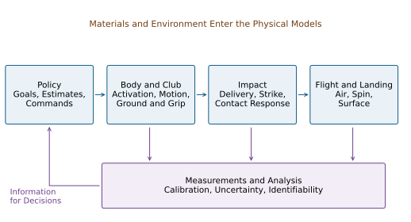
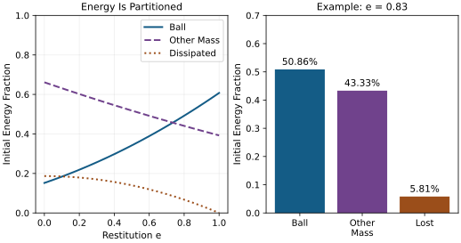

# Where Disciplines Collide: An Interdisciplinary Perspective {#sec-interdisciplinary}
[]{#ch-interdisciplinary}

## Why Disciplines Matter {#why-disciplines-matter}

A golfer changes a cue, a shaft, or a training routine and the ball flies differently. What changed between the intention and the outcome? The answer may involve the chosen movement, muscle activation, contact with the ground, elastic deformation, club delivery, ball impact, or the measurement itself. Several of these can change together. A convincing explanation must follow the connections without treating a successful shot as proof of every proposed mechanism.

The central question of this book is how a golfer prepares and regulates a coupled mechanical system so that its evolving motion delivers a useful impact. Momentum, gravity, constraints and elasticity can help carry a movement forward. Muscles prepare that motion, continue to exchange energy with it, and alter its response to disturbances. The interesting comparison is therefore between specified movement strategies under specified conditions, with their benefits and costs measured at the appropriate level.

::: {.callout-note}
## Multiple Disciplines, One Framework

[]{#laymans-ch13-disciplines}
A mechanical model connects forces to motion. A controller connects information and goals to actions. A measurement model connects physical events to recorded data. An injury study connects exposure and other factors to health outcomes. These models can inform one another, but their conclusions are not interchangeable. A mathematically valid simulation can motivate an experiment without establishing what a person's nervous system does or which technique prevents injury.
:::

This chapter builds those connections explicitly. Its numerical examples are declared teaching models, not measured golf populations or fitting recommendations. The worked answers also show how to challenge the framework: specify an alternative mechanism that predicts the same observation, then identify a measurement or intervention that could distinguish them.

## Interdisciplinary Connections: Overview

The useful common structure is a chain of interacting models. The golfer's policy selects commands using goals, observations and internal state. The body and club transform commands and external forces into motion. Impact converts a particular delivery and contact configuration into club and ball changes. Flight, landing and subsequent motion determine the result. Sensors observe selected parts of this process, and their reports feed into subsequent decisions.

On narrow screens, scroll the figure or [open it at full size](../figures/interdisciplinary_model_map.svg).

::: {#fig-ch13_interdisciplinary_map}
::: {.synthesis-diagram-scroll role="region" aria-label="interdisciplinary model map; scroll horizontally" tabindex="0"}

:::

Connected Models Link Commands, Motion, Impact and Outcome. Measurements Observe Selected Stages and Inform Decisions; the Map Does Not Assign These Functions to Brain Regions.
:::

@fig-ch13_interdisciplinary_map is a map of questions, not a diagram of brain anatomy. Materials enter both the moving system and contact law. Ground and grip conditions constrain the motion. Neural and mechanical responses operate during the swing, while learning changes future policies. Uncertainty propagates through every stage; a precise final number does not imply that every upstream quantity was observed.

This chain also explains why one scalar cannot represent overall swing quality. Ball speed, directional dispersion, joint loading, effort, robustness and learning are different outcomes. Improving one may change another. A rigorous argument names the outcome, comparison and operating conditions before it calls a movement efficient, stable, safe or optimal.

## Control Theory and Biomechanics: The Affine Bridge {#control-theory-and-biomechanics-the-affine-bridge}

In a local coordinate description, a constrained multibody model may be written

$$
M(q)\ddot q+c(q,\dot q)+g(q)+d(q,\dot q)
=B(q)\tau+J(q)^T\lambda+Q_{\rm ext}.
$$

Here $q$ describes configuration, $M$ is the inertia matrix, $c$ collects velocity-dependent inertial terms, $g$ is gravity, and $d$ represents the explicitly modeled dissipative forces. Joint torques $\tau$, contact reactions $\lambda$, and other external generalized forces must be assigned to the correct system boundary. Ideal constraints can be eliminated locally or retained with their acceleration equations. Contact creation, separation and slip may require different modes.

After choosing independent states and inputs, one possible model is

$$
\dot x=f(x)+G(x)u.
$$

This form says that the instantaneous state derivative is affine in the selected input. It does not say that motion is linear in initial conditions, that muscle force is globally linear in excitation, or that every biological model has this form. If the input is joint torque, muscle activation and tendon behavior may lie outside that simplified plant. If the input is neural excitation, activation and elastic states generally belong inside it. An input-dependent activation time constant can require a more general or piecewise description.

### Input Coordinates and the Meaning of Zero

The drift $f$ is the vector field obtained when the declared input is zero. It is not the set of effects that cannot be controlled. Control can change the state at which drift acts, and feedback can change the baseline used to describe the system. Under the input substitution

$$
u=\alpha(x)+\beta(x)\nu,
\qquad
\dot x=\underbrace{f(x)+G(x)\alpha(x)}_{\widetilde f(x)}
       +\underbrace{G(x)\beta(x)}_{\widetilde G(x)}\nu,
$$

zero residual input $\nu$ retains the baseline action $\alpha(x)$. For an invertible $\beta$, this is an equivalent input description if the admissible input set is transformed as well. If $\beta$ restricts input directions, it also restricts the controller.

Consider a rotor with inertia $I$ and torque $u=-kq+\nu$. Zero $\nu$ retains the restoring torque $-kq$; zero physical torque removes it. At [$I=0.05\,\mathrm{kg\,m^2}$]{.long-inline-math role="group" aria-label="Inline calculation 1; scroll horizontally" tabindex="0"}, $k=2\,\mathrm{N\,m/rad}$ and $q=0.1\,\mathrm{rad}$, the former gives an angular acceleration of $-4\,\mathrm{rad/s^2}$. The two zero-input experiments answer different questions. A zero-excitation muscle model likewise retains whatever activation and tendon strain already exist; it is not an instantaneous zero-force intervention.

Changing the state at the top of the backswing changes the trajectory through a fixed vector field. Changing equipment or tissue parameters changes the plant itself. Changing a feedback policy changes the resulting closed-loop vector field. These are three distinct ways to obtain a different swing, even though all can change the club's eventual delivery.

### Control Authority Requires a Task and a Time

A large nominal drift term does not prove that additional input has little effect. For the constant-inertia rotor,

$$
\ddot q=\tau/I,\qquad
\delta q(T)=\frac{\delta\tau}{2I}(T-t_0)^2
$$

for a constant added torque starting at $t_0$, with zero initial perturbation. The torque-to-acceleration gain is $1/I$ at every angular speed. With [$I=0.05\,\mathrm{kg\,m^2}$]{.long-inline-math role="group" aria-label="Inline calculation 2; scroll horizontally" tabindex="0"}, a $0.5\,\mathrm{N\,m}$ increment acting for $0.1\,\mathrm{s}$ changes angle by $0.05\,\mathrm{rad}$ and angular speed by $1\,\mathrm{rad/s}$, whether the initial speed is zero or $100\,\mathrm{rad/s}$.

A late intervention can nevertheless have little effect because little time remains, the command arrives after contact, activation develops slowly, torque is saturated, or available directions poorly affect the desired output. For a linearization about a specified trajectory, a fixed-time output perturbation has the form

$$
\delta y(T)=C(T)\Phi(T,t_0)\delta x(t_0)
 +\int_{t_0}^{T}C(T)\Phi(T,s)G(x(s))\delta u(s)\,ds.
$$

The state-transition matrix $\Phi$ propagates perturbations through the coupled dynamics; $C$ maps state changes to the chosen output. A state-triggered impact also requires event-time sensitivity. Input limits, delays and units must be included before comparing authority across phases or joints. The [computational-brain chapter](./ch26_remarkable_brain.html#sec-26_remarkable_brain) develops a delayed-activation example that makes this distinction quantitative.

### Minimum Effort Requires a Cost and a Horizon

Preparing a useful trajectory can reduce later correction, but proximity to the zero-input endpoint is not a universal minimum-effort criterion. For a controllable linear system with an unconstrained quadratic input cost, the minimum cost of an endpoint correction $e$ is

$$
J_{\min}=e^T W^{-1}e,
\qquad
W=\int_0^T e^{A(T-s)}BR^{-1}B^T e^{A^T(T-s)}\,ds,
$$

where the cost is $\int_0^T u^TRu\,dt$ and $R$ is positive definite. A singular Gramian requires a reachable endpoint and the corresponding restricted solution. Saturation, nonlinear dynamics and path constraints can invalidate this unconstrained formula.

The result follows by minimizing the cost subject to the endpoint integral constraint. A Lagrange multiplier gives

$$
u_*(s)=R^{-1}B^T e^{A^T(T-s)}W^{-1}e.
$$

Substitution into the endpoint integral returns $WW^{-1}e=e$, and substitution into the cost returns $e^TW^{-1}e$. The weighting therefore comes from the dynamics and input cost, not an arbitrary distance between poses.

To see why the metric matters, nondimensionalize a double integrator using a one-unit horizon, a chosen position scale and its associated velocity scale. With unit input weight,

$$
W=\begin{bmatrix}1/3&1/2\\1/2&1\end{bmatrix},
\qquad
W^{-1}=\begin{bmatrix}12&-6\\-6&4\end{bmatrix}.
$$

The correction $(0.1,-0.1)^T$ is shorter in Euclidean distance than $(0.2,0.3)^T$, yet costs $0.28$ rather than $0.12$. Position and velocity errors can reinforce or oppose what the available input can accomplish. Even this input cost is not metabolic expenditure or injury risk. Those require additional models and evidence.

## Robotics: What Golf Can Learn From Machines {#robotics-what-golf-can-learn-from-machines}

Robotics provides explicit ways to connect task objectives, constraints, actuator limits and feedback. A robot can be designed with rigid or compliant transmissions, delayed sensing, learned policies and adaptive parameter estimates. Human-versus-machine comparisons should specify the systems being compared rather than assign flexibility exclusively to people or fixed control exclusively to robots.

### Principle 1: Hierarchical Control {#principle-1-hierarchical-control}

A useful design can separate a task objective, a movement policy and an actuator controller. For example, a target distribution may constrain acceptable launch conditions; a trajectory optimizer may search for feasible club delivery; a lower-level controller may regulate torque or interaction dynamics. Information can also pass between levels during execution.

This is an engineering decomposition, not proof that the motor cortex, cerebellum and spinal cord implement those stages in that order. Nor is a hierarchy mathematically necessary for every controller. A feedback policy can map estimated state directly to actuator commands. The important questions are whether its commands are feasible, whether it handles uncertainty, and whether it produces the intended response under disturbances.

For golf, a hierarchy is useful when it keeps the instruction at the right level. A target direction is an outcome goal; an intended club path is an intermediate task; a particular muscle activation is an implementation hypothesis. A coach who changes one level should measure the outcome at the others before attributing success to a specific mechanism.

### Principle 2: Controlling Interaction Dynamics {#principle-2-impedance-matching}

Mechanical impedance describes a force--velocity relation. For a scalar linear mass--damper--spring perturbation with zero initial conditions, $M>0$, $B\geq0$ and $K\geq0$,

$$
F(s)=(Ms+B+K/s)V(s).
$$

The force--displacement relation instead has dynamic stiffness $Ms^2+Bs+K$. These quantities depend on frequency, direction, operating state and the chosen mechanical port. A compliant shaft, an activated muscle and a feedback controller need not have the same response merely because each can resist displacement.

For an elastic rotational controller with error $e=q-q_d$, nonnegative stiffness $K(t)$ and damping $D$,

$$
\tau=-Ke-D\dot e,\qquad V_{\rm stored}=\tfrac12Ke^2,
$$

and direct differentiation gives

$$
\tau\dot q+\dot V_{\rm stored}
=-D\dot e^2+\tau\dot q_d+\tfrac12\dot K e^2.
$$

With fixed reference and stiffness, damping removes energy at this port. Moving the reference or increasing stiffness while displaced can supply energy. At a clamped error of $0.1\,\mathrm{rad}$, raising $K$ from $10$ to $30\,\mathrm{N\,m/rad}$ increases storage by $0.1\,\mathrm{J}$. Calling all such behavior passive would hide an energy source.

Impedance control therefore suggests a research question: what response to a specified perturbation is useful at each phase? It does not prescribe maximal stiffness at impact or a universal early-soft/late-stiff schedule. Resistance in one direction may help face orientation while affecting another degree of freedom or increasing internal loading. The biology and computational-brain treatments discuss the mechanical and experimental distinctions behind this question.

### Principle 3: Task-Space vs. Joint-Space Planning {#principle-3-task-space-vs.-joint-space-planning}

Let a chosen club task coordinate be $y=h(q)$. Locally,

$$
\dot y=J(q)\dot q,\qquad \tau_{\rm task}=J(q)^TF_{\rm task},
$$

where the task force and velocity must use compatible coordinates and units. The second relation follows from virtual work. Full orientation requires an appropriate local representation or a geometric treatment on the rotation group. A three-dimensional club pose cannot be reconstructed from face azimuth and path azimuth alone.

Redundancy means that different joint motions can satisfy the same instantaneous task velocity. Such alternatives may differ in posture, contact feasibility, energy, sensitivity and tissue loading. A kinematic null direction is not automatically dynamically harmless: moving in it can change inertia, future reachability or the next task Jacobian. This is why a good club-level result does not uniquely identify a whole-body technique.

## Why Robots Teach Us About Muscles {#why-robots-teach-us-about-muscles}
[]{#laymans-ch13-robot_lesson}
[]{#ex-ch13-supraspinatus}

The analogy becomes productive when actuator dynamics are made explicit. Torque is an input in one model and an output of activation, force--length--velocity behavior, tendon deformation and moment arms in another. A command can change immediately while muscle force develops over time; stored elastic energy can persist after a command changes.

Muscle recordings add evidence but need their own observation model. Pink, Jobe and Perry's shoulder EMG study reports muscle- and phase-dependent activity; its abstract does not establish that a particular muscle simply turns off once drift takes over [@Pink1990Shoulder]. EMG is not a direct measurement of tendon force or joint torque. Electrode placement, normalization, activation dynamics and muscle geometry matter when connecting it to a mechanical model.

The useful robot experiment is correspondingly precise. Compare a torque-controlled rotor, a motor with series elasticity, and an actuator with delayed activation under the same output task. Match initial states and input limits, then perturb each system. Similar trajectories may coexist with different internal forces and correction capacities. Differences reveal which modeling elements matter, rather than which machine resembles a golfer in appearance.

## Neuroscience: Motor Control and the Cerebellum {#neuroscience-motor-control-and-the-cerebellum}

Control theory offers computational hypotheses about prediction, estimation and action selection. Neuroscience asks how those functions are implemented and how they interact. Mechanical equations alone cannot assign an algorithm to a brain region or rank one region as more important because a swing is fast.

### The Cerebellum and Feedforward Control {#the-cerebellum-and-feedforward-control}

A forward model predicts consequences of a state and command. An inverse model or policy selects commands intended to achieve an outcome. Inverse kinematics solves a geometric configuration problem; it is not synonymous with either a forward dynamics model or a complete motor controller. Planning a joint trajectory also leaves the force and activation problem unresolved.

Predictive control is useful when sensory information is delayed, but feedforward action need not be independent of feedback. A policy may use a state estimate that combines prior commands with new observations. The mechanical model then helps explain what information would be useful, while physiological experiments are needed to establish where and how such computations occur. Learning a useful prediction need not mean explicitly storing the functions named $f$ and $G$ in this book.

### Motor Cortex and Feedback Control {#motor-cortex-and-feedback-control}

The value of feedback depends on its information, noise, latency, the task, and the time remaining. The distant location of the ball's eventual landing is not an explanation for absent visual control: vision can also concern the target, body, club or environment. Proprioception and other sensory channels provide different information and can be combined with prediction.

Controlled reaching experiments demonstrate online visual corrections, and multijoint perturbation experiments show task-relevant responses involving motor cortex [@Saunders2003Feedback; @Pruszynski2011Feedback]. These results support studying feedback in context; they do not supply a universal golf-swing latency. A command triggered too late to affect impact cannot correct that impact, while forces and feedback processes initiated earlier can still be acting. Feedback after impact can also affect follow-through and subsequent learning.

### Learning and Adaptation {#learning-and-adaptation}

A different shot after practice may reflect an explicit aiming strategy, implicit adaptation, altered coactivation, a changed state estimate, or a different movement policy. Mazzoni and Krakauer's adaptation experiment illustrates that explicit strategy and implicit adaptation can coexist and conflict [@Mazzoni2006Strategy]. One successful trial therefore does not identify what was learned.

A discriminating golf experiment records the cue or perturbation, actual delivery and outcome, then examines retention, transfer and behavior when the perturbation is removed. If the claim concerns improved mechanical robustness, apply a controlled perturbation and measure the response. If it concerns implicit learning, use appropriate behavioral comparisons rather than infer it from a fitted trajectory. If it concerns a neural location, behavioral and mechanical evidence alone is insufficient.

## Material Science: Shaft Design and Ball Physics {#material-science-shaft-design-and-ball-physics}

Equipment changes both the plant and, potentially, the golfer's policy. A comparison with prescribed identical grip motion asks how two shafts respond mechanically. A comparison in which a golfer freely adapts asks how each golfer--club combination performs. Both are useful, but they estimate different effects.

### Shaft Materials and Design {#shaft-materials-and-design}

An anisotropic laminate has direction-dependent stiffness. Axially aligned fibers can strongly support axial loading; off-axis plies can contribute importantly to shear and torsional response. A statement that angled fibers are more compliant is incomplete until the loading direction, constraints and response quantity are specified. Laminate analysis combines transformed ply constitutive laws with through-thickness force and moment balances [@Roylance2000Laminates].

For a declared plane-stress orthotropic ply, use engineering shear strain and

$$
\begin{bmatrix}\sigma_1\\\sigma_2\\\tau_{12}\end{bmatrix}
=
\begin{bmatrix}Q_{11}&Q_{12}&0\\Q_{12}&Q_{22}&0\\0&0&Q_{66}\end{bmatrix}
\begin{bmatrix}\epsilon_1\\\epsilon_2\\\gamma_{12}\end{bmatrix}.
$$

Take illustrative constants $E_1=135$, $E_2=10$, $G_{12}=5$ in GPa and $\nu_{12}=0.3$, with [$\nu_{21}=\nu_{12}E_2/E_1$]{.long-inline-math role="group" aria-label="Inline calculation 3; scroll horizontally" tabindex="0"}. Inverting the compliance matrix gives $Q_{11}=135.9060$, $Q_{22}=10.0671$, $Q_{12}=3.0201$ and $Q_{66}=5$ in GPa.

For a $45^\circ$ ply, rotation gives the constrained-strain coefficients

$$
\begin{aligned}
\overline Q_{11}&=\frac{Q_{11}+Q_{22}+2Q_{12}+4Q_{66}}4=43.0034,\\
\overline Q_{66}&=\frac{Q_{11}+Q_{22}-2Q_{12}}4=34.9832
\end{aligned}
$$

in GPa. Axial response decreases while the shear coefficient increases. These are stiffness-matrix entries, not freely contracting Young's and shear moduli: extension--shear coupling can matter. A balanced layup can cancel some couplings, and ply positions determine bending response. A shaft's full bending and torsional behavior additionally depends on tube geometry, layup, boundary conditions, damping and frequency.

For an ideal uniform Euler--Bernoulli beam, a mode frequency scales as $\sqrt{EI/(\mu L^4)}$, with a boundary-dependent factor, bending rigidity $EI$, mass per length $\mu$, and length $L$. Reducing mass does not logically require reducing stiffness. Nor does a lighter shaft automatically transfer a fixed saved-energy amount to the clubhead: the golfer may change work, speed and timing. A shaft stiffness label or an undefined shaft COR cannot settle that coupled comparison.

### Ball Compression and the Coefficient of Restitution {#ball-compression-and-the-coefficient-of-restitution}
[]{#ex-ch13-ball_fitting}

For a one-dimensional normal collision, restitution is the ratio of separating to approaching relative speed,

$$
e=\frac{v_b'-v_c'}{v_c-v_b},
$$

under the declared positive direction and an initially approaching pair. Smash factor is outgoing ball speed divided by incoming club speed, a different quantity. Restitution also is not the fraction of initial club energy transferred to the ball.

Derive the distinction in a free two-mass model: positive mass $M$ moves at speed $U>0$ into stationary positive mass $m$, external impulse is negligible, and there is no rotation or tangential contact. Take $0\leq e\leq1$ for this dissipative collision example. Momentum conservation and the restitution law give

$$
v_b'=\frac{(1+e)M}{M+m}U,\qquad
v_c'=\frac{M-em}{M+m}U.
$$

The ball's fraction of initial kinetic energy and the total dissipated fraction are

$$
\eta_b=\frac{mM(1+e)^2}{(M+m)^2},
\qquad
\eta_{\rm loss}=(1-e^2)\frac{m}{M+m}.
$$

Equivalently, lost energy is $(1-e^2)\mu_r U^2/2$, where the reduced mass is $\mu_r=Mm/(M+m)$. Restitution squared governs retention of relative translational kinetic energy in this model, not the ball's share of the initial laboratory-frame energy.

With illustrative $M=0.200\,\mathrm{kg}$, $m=0.04593\,\mathrm{kg}$ and $e=0.83$, the speed ratio is $1.48823$, the ball fraction is $0.5086$, and the dissipated fraction is $0.0581$. The remaining approximately $43.33%$ stays in the moving first mass. These identities can be checked directly from both outgoing velocities.

On narrow screens, scroll the figure or [open it at full size](../figures/interdisciplinary_collision_energy.svg).

::: {#fig-interdisciplinary_collision_energy}
::: {.synthesis-diagram-scroll role="region" aria-label="interdisciplinary collision energy; scroll horizontally" tabindex="0"}

:::

Restitution Does Not Equal Energy Transfer. The Free Two-Mass Teaching Model Uses a 0.200 kg Incoming Mass and a Stationary 0.04593 kg Ball; Fractions Sum to One.
:::

A real club--ball impact can include rotation, off-center contact, tangential impulse, elastic waves and external coupling. Its effective normal inertia is not necessarily the head mass, much less the whole golfer's mass. The [impact chapter](./ch28_impact_collision.html#sec-impact_collision) treats those distinctions. The number $0.83$ here is a model input, not a statement of a current equipment-conformance rule.

Compression describes deformation under a specified test; it does not alone determine restitution, launch, spin or dispersion. Arakawa and colleagues' normal impacts against a rigid steel target showed decreasing restitution with increasing inbound speed while normal compression increased [@Arakawa2006Impact]. That experiment contradicts a universal rule linking greater compression to greater restitution, but does not rank modern balls in a golfer's driver or wedge. Fitting requires defined impact conditions and measured outcomes, including variation across strikes.

## Data Science and Launch Monitor Analysis {#data-science-and-launch-monitor-analysis}

Data science enters through an observation equation,

$$
z_k=h(x(t_k),\theta,\kappa)+\epsilon_k,
$$

where $\theta$ contains physical parameters, $\kappa$ calibration parameters, and $\epsilon_k$ measurement error. A launch report can combine directly observed signals with estimates and model-derived quantities. A ball-flight sensor is not automatically a full-body motion-capture system or a measurement of muscle force. The [launch-monitor article](../../technology-launch-monitors.html) explains the geometry and observability of several measurement approaches.

### Identifying Dynamics From Data {#learning-the-drift-field-from-data}

Even complete noiseless motion need not separate a plant parameter from an unobserved input. Consider

$$
I\ddot q+kq=u(t).
$$

If one stiffness $k_1$ and input $u_1(t)$ reproduce an observed motion, any alternative $k_2$ reproduces it with

$$
u_2(t)=u_1(t)+(k_2-k_1)q(t),
$$

provided that alternative input is admissible. A hundred terminal launch reports do not remove this structural ambiguity. More samples of the same confounded experiment may improve numerical precision while leaving the underlying cause unidentified.

Identification can improve with independently measured input or force, calibrated geometry, known boundary conditions, purposeful excitation, repeated conditions and external parameter measurements. Its success must be checked for the particular parameterization and experiment. Strong regularization can select one plausible model without making it uniquely supported by the data. An optimizer's convergence is not an observability result.

### Predicting Ball Outcome From Swing Data {#predicting-ball-outcome-from-swing-data}

Prediction is a legitimate goal even when the internal mechanism is not identified. Its evaluation must match the intended use. A model trained on one golfer, club and session may interpolate well within that setting but fail after a shaft change, injury, different sensor, or new movement strategy. Separate training and evaluation by the units over which generalization is claimed, such as golfer, session or equipment condition.

The complete prediction chain is body/club state, delivery, contact, flight and landing. Each stage needs its own assumptions and uncertainty. Face angle and path do not specify attack angle, dynamic loft, strike location, angular velocity or all contact properties. Ball speed, launch angle and spin magnitude do not uniquely specify wind, aerodynamic coefficients or the full spin vector. Carry estimates require an explicit flight model; total distance additionally depends on landing and surface interaction.

A model should also be compared with simpler alternatives. If a regression from measured delivery predicts ball flight as well as a personalized full-body model, the extra body parameters have not yet demonstrated predictive value for that output. They may still be useful for other questions, but that requires separate evaluation.

### Personalizing the Model {#personalizing-the-model}

Personalization means estimating quantities the available experiment can support, with uncertainty and a record of calibration. Segment dimensions, inertial properties, joint constraints, actuator capacity, elastic response and policy parameters have different measurement requirements. Their estimates can be correlated.

Keep an explicit inventory of measured, estimated, assumed and unidentifiable quantities. Report held-out errors and failure conditions alongside parameter intervals. When an equipment change modifies both mechanics and behavior, distinguish a fixed-policy simulation from observed adaptation. A credible personalized model may be deliberately modest: for example, predicting a distribution of launch conditions within a calibrated range without claiming to recover every muscle's action.

## Sports Medicine: From Force Estimates to Health Outcomes {#sports-medicine-injury-prevention-through-force-understanding}

### Net Torque Is Not Tissue Load
[]{#ex-ch13-rotator_cuff_training}

Inverse dynamics estimates net generalized forces under its model and measurements. Multiple muscles, passive tissues and contact reactions can contribute to the same result. A low net moment therefore does not establish low tendon force or low joint compression.

Consider a planar teaching model with two parallel muscle forces that both compress a joint but have opposite $0.03\,\mathrm{m}$ moment arms. Forces of $200$ and $100\,\mathrm{N}$ produce a net moment of $3\,\mathrm{N\,m}$ and a total compressive muscle contribution of $300\,\mathrm{N}$. Forces of $500$ and $400\,\mathrm{N}$ produce the same moment and a $900\,\mathrm{N}$ contribution. Additional external loads and joint reactions must still be included in a full balance. The example establishes non-uniqueness, not a clinical injury threshold.

Similarly, greater torque-to-acceleration gain does not imply that a larger torque is required for the same acceleration. In torque coordinates, strength limits primarily change the feasible torque set; in normalized activation coordinates, force capacity can also appear in the input map. Coordinate choice must be settled before interpreting a change in control authority as strength or tissue demand.

Injury risk concerns exposure, tissue capacity, recovery, prior injury and other factors over time. Robinson and colleagues followed 910 amateur golfers for five months and reported associations involving age, osteoarthritis and previous injury [@Robinson2024Injuries]. They did not measure swing biomechanics. Self-report, population selection and incomplete questionnaire response further limit interpretation. Such surveillance helps define relevant outcomes; it does not validate a zero-torque technique as an injury-prevention intervention.

A mechanics-based hypothesis can propose that a change reduces a specified load under matched conditions. Testing prevention additionally requires suitable prospective health outcomes, exposure accounting and comparison groups. A decrease in one joint's estimated moment may shift demand elsewhere or accompany higher internal coactivation. The chapter consequently cannot derive a rehabilitation exercise, return-to-play decision or universally safer sequence from its equations. Those questions require individualized clinical assessment and relevant intervention evidence.

## Coaching Science: Translating Physics Into Cues {#coaching-science-translating-physics-into-cues}

Coaching connects a proposed mechanism to a learnable action and a measurable outcome. A cue is an intervention on behavior, not a boundary condition that guarantees a particular joint trajectory. Different golfers can interpret the same words differently, and a familiar cue can affect several mechanical variables at once.

### Phase-Specific Coaching {#phase-specific-coaching}

An early change can alter the initial state for later motion, including momentum and elastic strain. A late change has less remaining time to propagate and may encounter activation or torque limits. Those observations motivate phase-specific experiments; they do not establish that speed problems are always drift problems or face errors are always late control problems.

For example, a changed setup might affect path, strike location and available torque directions together. An apparent improvement in face delivery might result from an earlier trajectory change rather than a conscious correction near impact. Record the relevant timing and delivery before deciding which mechanism explains the result.

### Cue Design {#cue-design}
[]{#ex-ch13-cue_design}

Start with an observable difficulty, such as excessive variation in a specified face-to-path measure under a repeatable task. Propose one understandable cue, state its intended effect, and alternate or randomize comparable blocks with and without it. Record delivery, strike, ball outcome and perceived effort; include retention or transfer when the claim concerns learning.

Interpretation then has three levels. First, did the outcome improve beyond normal variability? Second, did the proposed intermediate variable change? Third, did that change plausibly account for the outcome under the experiment's controls? A positive answer to the first question does not settle the other two. Fatigue, order, familiarization and changed strike quality can explain part of an observed benefit.

Physics makes a cue more testable by identifying those intermediate variables and alternatives. It does not establish that a particular wording, more aggressive hip motion, grip change or release timing is universally effective. An unsuccessful cue can still teach something if the experiment reveals which assumed link failed.

## Synthesis: The ZTCF Family Connects Testable Questions {#synthesis-the-ztcf-family-framework-unifies-these-perspectives}

A zero-torque counterfactual is most useful as a specified intervention in a specified model. Start from a declared state at a declared time, replace selected active torques with zero, retain or modify other mechanisms explicitly, and integrate to a defined horizon or event. Report what happens if balance, contact or joint constraints fail before the intended event.

Zero joint torque does not mean zero gravity, zero ground reaction, zero passive tissue force or zero previously stored energy. A branch with zero new excitation generally differs from one with zero activation or zero actuator force. These choices should be separate members of a counterfactual family, not silently conflated as the body's natural motion.

The contact mode matters for equipment comparisons too. Before any physical interaction with the ball, its compression law does not directly enter the golfer--club mechanical equations. A different ball can change the golfer's expectations, policy or prepared state, and its material response enters once contact begins. Assigning a direct pre-contact mechanical effect to ball compression would mix those pathways.

The comparison asks how the modeled future changes under that intervention. It does not uniquely apportion the actual club speed among muscles or prove that muscles did not create the motion. For a mechanically consistent model, an energy balance has the schematic form

$$
\dot E=\dot q^T B\tau+P_{\rm ext}-P_{\rm diss},
$$

with elastic storage included in $E$ and appropriate work terms for moving constraints. Velocity-dependent inertial coupling can redistribute energy among coordinates without creating energy for the complete conservative system. Energy present at the branch point can reflect substantial earlier muscle work.

Different counterfactual interventions can interact nonlinearly. Removing two torques together need not produce the sum of their separately removed effects. A chosen attribution rule can summarize such interactions, but its result depends on the rule and baseline. This is particularly important when a zero-torque branch leaves the range in which the fitted model was validated.

The framework is therefore a common language for posing connected questions: what state was prepared, what forces remain, what alternatives are feasible, what can be observed, and what outcomes follow? Its strongest contribution is a reproducible comparison with explicit limits. Neural, coaching and clinical claims remain subject to their own experiments.

## The Expanded Framework: From Rigid Bodies to Living Systems

Rigid segments are a modeling approximation, not a denial of deformation. Add degrees of freedom when they improve the questions the model can answer: spinal motion for segment-level loading, tendon or shaft states for elastic exchange, actuator states for delayed force development, or soft-tissue modes for measured relative motion. Each addition requires parameters and observations; a larger model can be less identifiable.

There is no universal anatomical degree-of-freedom count that follows by counting vertebrae or muscles. Define bodies, joints, constraints and contact modes, then determine the local independent coordinates. Redundant constraints or special configurations can change a simple counting argument. The spine and [inverse-dynamics chapters](./ch18_inverse_dynamics_parallel.html) develop these issues.

For a system containing the golfer and club, ground interaction and gravity are external, but so are aerodynamic loads and, during impact, the ball's action unless the ball is included in the system. A stationary ideal no-slip contact point can exert force and exchange momentum while doing zero point-contact mechanical work. That does not mean the ground force has no effect on center-of-mass kinetic energy: center-of-mass force times center-of-mass velocity is a different decomposition from the total body's external contact power. Real foot deformation, contact moments, slipping or moving supports require their own work accounting.

The same discipline applies to energy stored in tissue. Specify deformation relative to a reference, constitutive behavior, dissipation and active sources before describing recoil. Changes in mechanical work are not automatically changes in metabolic cost. A living system can maintain force while doing little external work, and the relation between those quantities is itself a physiological question.

## The Future: Personalized Physics Models {#the-future-personalized-physics-models}

A defensible development programme proceeds from calibrated measurements to identifiable models and then to tested interventions. Publish coordinate conventions, sensor timing, reference points, contact assumptions and parameter uncertainty. Verify the numerical implementation on problems with known solutions. Validate predictions against independent measurements in the intended operating range.

Next ask whether the model improves decisions. Compare a model-guided intervention with a suitable alternative, using outcomes that matter to the golfer and an evaluation long enough for the claim. Better explanation, improved launch consistency, lower estimated load and reduced injury incidence are separate milestones. Existing sensing and modeling methods make parts of this programme possible; their availability does not mean that comprehensive personalized diagnosis has already been validated.

The most useful model may change with the task. A launch predictor, a shaft bench model, a full-body inverse-dynamics model and a clinical study answer different questions. Their integration should preserve their individual validation boundaries rather than hide them inside one impressive-looking simulation.

## Worked Example: What a Launch Report Can Establish {#worked-example-how-a-launch-monitor-measures-what-ztcf-predicts}

### The Scenario {#the-scenario}

Suppose a report gives ball speed $145\,\mathrm{mph}$, launch angle $14^\circ$, spin magnitude $2500\,\mathrm{RPM}$, club path $3^\circ$ right and face azimuth $2^\circ$ right of the target. Treat these as reported quantities whose measurement definitions and uncertainty must be checked. They do not specify the complete delivery, spin vector, atmosphere or body motion.

The golfer wants more carry while maintaining directional consistency. That is a useful objective, but the report alone does not establish present carry, an achievable distance increase, a unique spin optimum, or whether a particular muscle should act earlier.

### The Physics {#the-physics}

If the declared two-mass collision model applies with the illustrative parameters above, the $1.48823$ speed ratio implies an incoming mass speed of $97.4313\,\mathrm{mph}$. This is a conditional model calculation, not an independent club-speed measurement. A different effective mass, restitution or contact configuration changes the inferred value.

In an explicitly horizontal, positive-right angle convention, the face is $1^\circ$ left of the path. A local illustrative direction model

$$
\ell=w f+(1-w)p
$$

with $w=0.76$, $f=2^\circ$ and $p=3^\circ$ gives launch azimuth $\ell=2.24^\circ$ right. The selected weight is a local modeling assumption, not a universal law. Dynamic loft, attack angle, strike location and tangential contact remain unspecified. Face-to-path in this horizontal calculation does not by itself explain the reported backspin magnitude.

To predict carry, choose and validate a flight model with appropriate launch velocity, spin vector, aerodynamic behavior and atmosphere. To predict a zero-torque branch, additionally obtain an adequate pre-impact body/club state and a declared intervention. Neither calculation can be reconstructed uniquely from the five reported values.

### The Feedback {#the-feedback}

A useful next session first establishes measurement reliability and repeatability, then tests a limited hypothesis. For example, compare strike-location and delivery distributions under matched conditions, determine which variation contributes most to the outcome uncertainty, and evaluate a cue or equipment change against that baseline. If the hypothesis concerns shaft response, measure that response or use an independently calibrated shaft model.

Report what improved, its variability, and what mechanism remains unresolved. A measured club-speed change can be a result; a simulation can suggest a cause; a controlled comparison can test that suggestion. Keeping these steps distinct makes the feedback actionable without pretending that a launch report uniquely diagnoses the entire swing.

## Key Takeaways {#key-takeaways}
[]{#princ-ch13-takeaways}

1. The affine description depends on state, input and baseline choices. Drift is not synonymous with uncontrollability or absence of prior muscle work.

1. Control authority concerns feasible changes in a specified output over a specified time. High speed alone does not imply a smaller input gain.

1. Mechanical impedance, internal tissue load, input effort and metabolic cost are different quantities, with different models and measurements.

1. Equipment affects material response, system dynamics, contact and behavior. Restitution, smash factor, compression and energy transfer must be distinguished.

1. More data do not resolve a structural ambiguity without informative observations or interventions. Prediction accuracy is not unique identification.

1. A counterfactual can connect disciplines by making assumptions testable. It does not replace neural evidence, coaching evaluation or prospective clinical research.

## Chapter Exercises {#chapter-exercises}
[]{#exercises-ch13}

1. For the two antagonist force pairs in this chapter, compute net moment and compressive muscle contribution. Explain what each result does and does not say about injury.

1. Compare a torque-controlled rotor with one described by $u=-kq+\nu$. Identify the two zero-input interventions and propose a perturbation experiment that could distinguish their responses.

1. For the $145\,\mathrm{mph}$ worked example, calculate the conditional incoming speed and launch azimuth. List the additional quantities needed for carry prediction and for a whole-body counterfactual.

1. A golfer improves after a cue. Give three explanations that do not require learning an explicit drift field, and design observations that help distinguish them.

1. Reproduce the $45^\circ$ ply coefficients and the collision energy fractions. Explain why neither a shaft stiffness label nor ball compression alone determines distance.

1. Compute the two double-integrator endpoint costs. Explain why the closer endpoint can require more effort and why neither result gives a universally effective coaching cue.

1. A new command arrives after the impact event. Under what assumptions is its effect on that impact zero? Explain why this does not imply that feedback or muscle force was absent earlier.

1. Design a study that separates a change in estimated joint loading from a claim of injury prevention. Include exposure, comparison, uncertainty and the possibility of shifted internal loads.

## Worked Answers

1. The moments are [$0.03(200-100)=3$]{.long-inline-math role="group" aria-label="Inline calculation 4; scroll horizontally" tabindex="0"} and [$0.03(500-400)=3\,\mathrm{N\,m}$]{.long-inline-math role="group" aria-label="Inline calculation 5; scroll horizontally" tabindex="0"}. Compressive muscle contributions are $300$ and $900\,\mathrm{N}$. Net moment cannot identify the individual forces; neither force sum supplies a tissue-specific injury threshold, exposure history or clinical outcome.

1. Zero physical torque gives $\ddot q=0$ in the ideal rotor. Zero residual command retains $\ddot q=-kq/I$, which is $-4\,\mathrm{rad/s^2}$ at the declared initial displacement. Release both from matched state and measure acceleration or apply a known displacement perturbation. Distinguish a real passive spring from active feedback using power, actuator and timing measurements; matching motion alone need not distinguish them.

1. Dividing $145\,\mathrm{mph}$ by the conditional speed ratio $1.48822836$ gives $97.4313\,\mathrm{mph}$. The illustrative horizontal launch is [$0.76(2)+0.24(3)=2.24^\circ$]{.long-inline-math role="group" aria-label="Inline calculation 6; scroll horizontally" tabindex="0"} right. Carry additionally needs a sufficient three-dimensional launch state, aerodynamic model and atmosphere. A body counterfactual needs configuration, velocity, relevant activation/elastic states, physical parameters, external/contact conditions, an intervention and a stopping rule. None is uniquely supplied by the report.

1. Possible explanations include explicit re-aiming, a different movement policy, changed coactivation, altered strike location or ordinary trial variation. Measure aiming reports, delivery and strike, compare repeated conditions, and test retention, transfer or removal of the perturbation. A mechanical perturbation can probe impedance. These observations narrow hypotheses; neural localization requires additional evidence.

1. Substitution into the two rotated-ply expressions gives axial and shear numerators of $172.0134$ and $139.9329\,\mathrm{GPa}$. Dividing each by four gives $43.0034$ and $34.9832\,\mathrm{GPa}$, respectively. With the stated masses and restitution, the ball and lost-energy fractions are $0.5086$ and $0.0581$, leaving about $0.4333$ in the other mass. Laminate/shaft boundary conditions, golfer adaptation and contact/flight conditions prevent a universal distance inference from either material label.

1. Multiplying by $W^{-1}$ gives costs $0.28$ and $0.12$. The corresponding optimal dimensionless inputs are $0.8-1.8t$ and $0.6-0.6t$ for $0\leq t\leq1$; integrating each input and its remaining-time-weighted value recovers the requested velocity and position corrections. The first correction reverses part of its acceleration, making its smaller Euclidean endpoint error more expensive. These unconstrained, scaled calculations are not metabolic costs or verified human strategies.

1. If the command is causally generated after the event, initial perturbations are zero, and the model has no anticipatory dependence, it cannot alter the already completed event. Earlier activation, stored energy, prior feedback and ongoing contact forces may still have affected that event. Post-impact feedback can affect later motion and future trials. A time constant is not automatically an additional pure delay.

1. First validate the load estimate against suitable independent measurements and vary uncertain muscle-force allocations. Compare interventions under matched tasks while recording strike, performance, exposure and relevant symptoms. A prospective prevention claim requires appropriately defined health outcomes, sufficient follow-up and a suitable comparison design, with prior injury and other confounders addressed. Randomization where feasible strengthens causal interpretation. Lower estimated net moment alone cannot substitute for that study.
