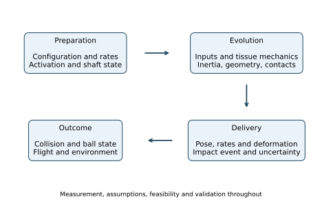
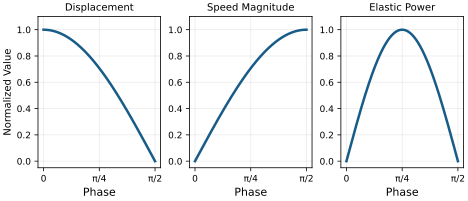

# The Complete Golf Swing: Putting It All Together {#sec-complete_swing}
[]{#ch-complete_swing}

::: {.callout-tip}
## One Swing, Interacting Mechanisms

[]{#ch14:synthesis}
A golfer arrives at impact with more than a clubhead speed. Position, orientation, translational and angular velocity, shaft deformation, tissue state and contact conditions have developed together. Earlier muscle work changes energy and momentum; changing geometry changes how forces act; muscle activation affects both movement and response to disturbance. The collision then converts part of the delivered mechanical state into ball motion.

The purpose of a complete-swing model is to explain these connections and make comparisons testable. It should help answer why a particular change improves delivery, which assumptions that explanation needs, and what measurements could distinguish competing explanations. Calling a phase “drift-dominated” does not answer those questions by itself. This chapter connects phase descriptions to equations, worked examples and an investigation protocol.
:::

## The Full Model: Body, Arms, Club, Shaft, and Ground

Choose a system boundary before assigning forces. For the golfer and club together, hand–club interactions are internal. Gravity, ground contact, aerodynamic loads and, during impact, ball or turf contact are external. Ground reaction is therefore not the only external force besides gravity. For the club alone, the hand wrench crosses the boundary and can supply substantial power. Both descriptions are useful, but their force and energy accounts differ.

Let $q$ contain the modeled body configuration and shaft deformation coordinates, and let $v$ contain their corresponding generalized velocities. A floating-base orientation may require $\dot q=N(q)v$ rather than $\dot q=v$. Add internal states $z$ when activation, tendon dynamics, viscoelastic history or other memory affects subsequent evolution. A suitable continuous state within a contact mode is
[]{#eq-complete_state}

$$
x=(q,v,z),\qquad \dot q=N(q)v.
$$
Modal positions without modal velocities do not determine shaft evolution. Likewise, identical joint angles and velocities with different muscle activation need not produce identical accelerations. Ideal contact reactions are normally algebraic unknowns, not additional independent state coordinates; compliant contact may introduce deformation and memory states.

For a declared torque-input model, write the mechanical equations as
[]{#eq-complete_dynamics}

$$
M(q)\dot v=r(q,v,z)+B(q)\tau+J(q)^T\lambda,
\qquad Jv=0.
$$
Here $M$ is positive definite on the chosen independent velocity coordinates. The vector $r$ includes known passive, gravity, velocity-dependent and other declared loads with their signs; $B\tau$ is the modeled applied generalized load. The rows of $J$ describe independent, stationary, active ideal constraints. A two-hand grip can close a kinematic loop; foot contact can constrain a floating base. Neither makes its reaction an independently commanded actuator.

For a fixed feasible contact mode with full-row-rank $J$, differentiate the velocity constraint and eliminate $\lambda$. Define
[]{#eq-complete_reduced}

$$
\begin{aligned}
A_c&=JM^{-1}J^T,\\
D_c&=M^{-1}-M^{-1}J^TA_c^{-1}JM^{-1},\\
a_0&=D_cr-M^{-1}J^TA_c^{-1}\dot Jv,\\
B_c&=D_cB,\qquad \dot v=a_0+B_c\tau.
\end{aligned}
$$
The reaction follows from
[]{#eq-complete_reaction}

$$
\lambda=-A_c^{-1}\{JM^{-1}(r+B\tau)+\dot Jv\}.
$$
It depends on input. Keeping the measured reaction fixed while changing torque generally violates the same constraint. The acceleration offset contains the moving-tangent term $\dot Jv$ even for a stationary curved constraint. These equations are a derivation of the torque-affine mechanics, not an assertion that every physiological model is globally control-affine in neural excitation.

For muscles, an excitation input can first alter $z$, with force subsequently determined by activation, length, shortening velocity, tendon state and history. The attainable torque set can therefore depend on both state and recent inputs. A zero-torque actuator intervention differs from zero excitation, which need not immediately remove muscle force. Use $\dot x=f(x)+G(x)u$ only when the selected input and constitutive model actually support that representation.

Contact feasibility remains an additional condition: normal forces cannot pull a nonadhesive foot toward the ground, tangential forces must satisfy the chosen friction law, and a contact must be removed when its gap opens. Slip, lift-off, heel/toe changes and collision can change the governing mode. A smooth equation valid in one mode is not a complete hybrid swing model.

On narrow screens, scroll the figure or [open it at full size](../figures/complete_swing_system.svg).

::: {#fig-ch14_complete_model}
::: {.aba-diagram-scroll role="region" aria-label="complete swing system; scroll horizontally" tabindex="0"}

:::

Preparation, Coupled Evolution, Delivery, and Outcome. Measurements and Model Assumptions Are Needed at Every Stage; the Arrows Describe Dependencies, Not Validated Causal Attribution.
:::

## What a Drift Ratio Measures

[]{#the-drift-control-and-constraint-forces-through-the-entire-swing}

A norm requires compatible units and an explicit metric. Comparing meters, radians, velocities and activation entries in an unscaled state vector can make a ratio depend mainly on unit choices. For one acceleration-based diagnostic, choose a positive-definite weighting $W$ and an admissible torque set $\mathcal U(x)$. Define
[]{#eq-complete_dcr}

$$
c(x)=\sup_{\tau\in\mathcal U(x)}\|B_c(x)\tau\|_W,
\qquad D_{\rm avail}(x)=\frac{\|a_0(x)\|_W}{c(x)}.
$$
This definition uses available input, not the torque actually applied. Using the realized torque in the denominator defines a different estimand. If $c=0$, the ratio is infinite for nonzero numerator and undefined if both vanish. Coupled muscle limits, unilateral contacts and asymmetric torque bounds cannot generally be summarized by substituting one vector called $u_{\max}$.

The ratio loses direction. In the dimensionless system $\dot x_1=1000$, $\dot x_2=u$, $|u|\leq1$, the drift-to-available-input norm ratio is 1000. Yet the entire evolution of the output $y=x_2$ is controlled by $u$; drift contributes zero in that direction. A task-direction support function, or a finite-horizon reachable-output calculation, answers a different and often more relevant question.

For fixed $q$, fixed ideal contacts and the torque-input assumptions above, the instantaneous derivative is
[]{#eq-complete_gain}

$$
\frac{\partial\dot v}{\partial\tau}=B_c(q).
$$
Increasing speed can increase the velocity-dependent bias without reducing this derivative. Physiological torque limits may change with speed, and configuration can change $M$, $J$ and $B$; those are distinct mechanisms. “The inertia becomes large because the body is moving fast” is not a general property of rigid-body mass matrices.

For an independently checkable constrained example, take
[]{#eq-complete_gain_example}

$$
M=\begin{bmatrix}2&0.4\\0.4&1\end{bmatrix},\qquad
J=\begin{bmatrix}1&1\end{bmatrix},\qquad B=I.
$$
The constraint allows only opposite coordinate accelerations. Adding the generalized input $(10,0)^T$ changes acceleration by $(10/2.2,-10/2.2)^T$, regardless of the existing velocity-dependent bias. Equal inputs $(1,1)^T$ produce no acceleration change and are balanced by the reaction. Thus even a large available input norm says little about a particular useful direction unless constraints are included.

There is no calculated universal DCR curve in this chapter. Earlier numerical phase bands are removed because neither a declared computation nor the cited empirical study established them. A phase trend must be computed for a stated model, metric, input set, uncertainty and contact sequence. It is not a definition of expertise, conscious effort or metabolic efficiency.

## Phase 1: Address and Initial State Preparation

[]{#the-importance-of-initial-conditions}

[]{#the-physics-of-address}

[]{#phase-1-address-static-configuration-pre-swing-dynamics}

At an ideal steady address, generalized velocity and acceleration vanish, but supporting muscle loads need not vanish. Equilibrium requires the applied, passive and contact loads to balance, together with feasible contact forces. The reduced zero-input acceleration need not point vertically downward: geometry and support constraints shape the permitted motion. A nearly stationary person may also have small postural motion or changing activation, so a video frame alone does not establish a full-state equilibrium.

Stance, ball position, grip and alignment change geometry and the reachable set of club poses. They can also change feasible support moments and muscle moment arms. Gravitational potential changes by $\sum_i m_i g\,\Delta h_i$ for the chosen segments; a wider stance or increased forward lean does not universally raise their centers of mass. The energy claim must follow the actual geometry.

Preparation is consequently more than selecting a photograph. The initial velocities, shaft state, activation and task intention influence what follows. Repeatable address geometry can reduce one source of variation, but movement variability, fatigue, equipment and subsequent control still matter. No claim of maximal control authority at address follows merely from knowing $G$ or standing still.

## Phase 2: Backswing and Distributed Loading

[]{#backswing}

[]{#the-top-of-the-backswing}

[]{#energy-loading}

[]{#phase-2-backswing-storing-energy-building-momentum}

The backswing changes body and club geometry while muscles perform positive and negative work at different locations. Raising a segment can store gravitational energy. Stretching a loaded elastic element can store recoverable strain energy, while hysteresis and viscosity dissipate some work. A visible torso turn does not identify the strain energy of an individual tendon, fascia sheet or muscle fiber. Activation-dependent tissue behavior also makes “elastic” different from “metabolically passive.”

Angular momentum and kinetic energy develop as mass moves. They are not stored in a lag angle independently of velocity. Some segments begin decelerating or reversing while others are still moving backward. If the top is defined by reversal of a particular club-coordinate angle, that coordinate's rate crosses zero at the event; other generalized rates need not do so. The top therefore does not imply simultaneous maximal speed, maximal tissue stretch or zero kinetic energy of the entire golfer.

Keep rotation references explicit. The McTeigue study's publisher abstract reports upper-body and hip rotations relative to its measurement reference; those values are not a torso rotation of 90 degrees relative to the hips [@McTeigue1994]. Subtracting two projected orientation angles also need not equal an anatomical spinal rotation in three dimensions. A useful analysis names the segments, axes, decomposition and event.

Backswing duration and amplitude are observations that vary with player, club and shot. A model can compare alternatives while constraining delivery, load and effort. The affine form alone does not establish an optimal duration, require a maximum stretch at the top, or show that the motor cortex has finished planning and the cerebellum has learned a specific drift field.

## Phase 3: Transition and Coupled Sequencing

[]{#transition}

[]{#the-kinetic-chain-sequence}

[]{#what-happens-at-the-transition}

[]{#phase-3-the-transition-critical-configuration-drift-setup}

Transition is an interval of overlapping segment reversals, not necessarily one simultaneous reversal of all angular momentum. Define it with observable events, such as pelvic rotation reversal, club reversal and a specified change in hand motion. Compare the event times with measurement uncertainty; a universal 50–100ms transition is not needed to explain the mechanics.

The mass matrix couples accelerations, and velocity-dependent terms reflect the changing geometry of moving segments. Active torques, tissue loads and contact reactions act within that same system. A distal acceleration can result partly from proximal actuation, but a proximal-to-distal ordering of velocity peaks does not prove a uniquely passive cascade. Joint torques at several locations can generate similar motion, and the ordering can change with task, model, initial state and actuator limits.

For an explicit coupling example, a positive-definite two-coordinate inertia
[]{#eq-complete_coupling}

$$
M=\begin{bmatrix}a&b\\b&c\end{bmatrix},\qquad ac-b^2>0,
$$
gives a second-coordinate acceleration change $-b\,\delta\tau_1/(ac-b^2)$ when only the first generalized load changes and the other loads are held fixed. Coupling can assist or oppose a chosen distal direction depending on the coordinate convention and configuration. This calculation predicts an instantaneous response, not an entire sequence of peak velocities or a causal energy-transfer story.

Ground forces and moments enter the momentum balance. For the combined golfer–club system, about its center of mass $C$ in an inertial frame,
[]{#eq-complete_momentum}

$$
\begin{aligned}
m\ddot r_C&=\sum F_{\rm ext},\\
\dot H_C&=\sum\big[(r_k-r_C)\times F_k+\mu_k\big].
\end{aligned}
$$
Internal forces cancel from the total linear-momentum balance, but redistribute momentum among segments. A stationary foot can supply an external moment without doing contact work. For example, a vertical 800N force applied 0.2m horizontally from $C$ has a 160N m moment magnitude even when its contact-point velocity is zero. These are illustrative values, not a prescription for a golfer's ground loading.

Ground reaction peaks need to be measured in a declared direction and reference interval. Total vertical force, each foot's vertical force, horizontal shear, center of pressure and free moment are different signals. They need not peak together or at transition. Muscles help create motion under support constraints; ground reaction does not directly identify which gluteal or other muscle was activated.

## Phase 4: Early Downswing, Release Coordinates, and Shaft State

[]{#early-downswing}

[]{#the-lag-maintenance}

[]{#drift-and-control-at-early-downswing}

[]{#phase-4-early-downswing-acceleration-low-dcr}

Define “lag” before measuring it. A projected arm–shaft angle describes one aspect of articulated geometry. Wrist flexion/extension, radial/ulnar deviation and forearm rotation are distinct anatomical motions. Flexible shaft lead/lag and toe-up/toe-down deflections describe deformation relative to a specified shaft reference. The shaft's angle to the horizontal is an absolute orientation, not a universal measure of wrist lag or elastic storage.

Maintaining a projected angle does not by itself prove active resistance, nor does its release prove a particular extensor contraction. Net joint moments require a dynamic model and external loads; individual muscle forces require additional information. Motion can result from active load, transmitted segment forces, inertia and passive tissue response together. Relative angles and angular velocities are informative observables, but they do not identify the control strategy on their own.

In an inertial frame, a clubhead following a curved path has an inward normal acceleration $v_h^2/R_{\rm path}$, where $R_{\rm path}$ is the local curvature radius and $v_h$ the speed. Tangential acceleration changes speed. Outward centrifugal terms arise in an appropriate rotating-coordinate description; Coriolis, Euler and frame-translation terms must then be included consistently. A large normal acceleration is not an additional source of outward power.

Shaft bending is driven by the coupled hand motion, grip loads, head inertia and offset geometry. Its deformation can change sign and can differ between bending directions. Earlier loading is retained through both deformation and modal velocity. High axial tension can modify transverse dynamics through geometric stiffness, but its effect depends on loading and the structural model; it does not imply a universally monotonic shaft stiffness or bend through the downswing.

The shaft-deflection simulations of MacKenzie and Sprigings show that both loading direction and previous bending matter, with radial loading capable of shifting the time of peak relative head velocity beyond a neutral shaft shape [@MacKenzie2010Deflection]. This is a model result with specified boundary conditions. It does not justify assigning a fixed snapback time or the same deformation pattern to every player.

## Phase 5: Mid-Downswing and the Remaining Correction Window

[]{#mid-downswing}

[]{#the-shrinking-late-correction-window}

[]{#the-drift-field-dominance}

[]{#phase-5-mid-downswing-critical-phase-dcr-rising}

The time available before impact matters, but it is not interchangeable with instantaneous input gain. A fixed-inertia rotor demonstrates the distinction. With inertia $I=0.1$kg m$^2$, an added constant torque of 1N m for 40ms changes angular velocity by 0.4rad/s and angle by 0.008rad, approximately $0.458$ degrees:
[]{#eq-complete_rotor}

$$
\Delta\omega=\frac{\delta\tau}{I}\Delta t,\qquad
\Delta\theta=\frac{\delta\tau}{2I}(\Delta t)^2.
$$
These increments are independent of the initial rotor speed. They are not measured golf responses: the model omits changing geometry, muscle dynamics, contacts and flexibility. They show why limited time reduces some corrections without proving that speed has removed input authority. Whether a fraction of a degree matters depends on the delivery variable and task tolerance.

New sensory information, a planned command already being executed, and the intrinsic mechanical response of activated tissue act on different timelines. Delays restrict responses to a newly detected disturbance; they do not erase ongoing force or preplanned changes. An arm-perturbation experiment found multi-joint responses involving primary motor cortex on a roughly 50ms timescale [@Pruszynski2011Feedback]. That result does not supply a universal golf delay or demonstrate that voluntary control is absent in a named swing phase.

For a first-order illustrative activation model, $\dot a=(e-a)/T_a$, zero excitation gives $a(t)=a(t_0)\exp[-(t-t_0)/T_a]$, not immediate zero activation. Force also depends on muscle and tendon state. A late zero-excitation experiment therefore differs fundamentally from replacing all joint torques by zero. Anticipatory impedance and feedforward timing may remain important even when little time is available for a new feedback response.

## Phase 6: Late Downswing and Flexible Delivery

[]{#late-downswing}

[]{#the-catapult-effect-in-action}

[]{#the-feedforward-dominated-swing}

[]{#phase-6-late-downswing-drift-dominated-phase-high-dcr}

Delivery is the outcome of continued coupled dynamics. A useful flexible-coordinate representation is $p_h=p_g+R_g r_h(\eta)$, giving
[]{#eq-complete_head_velocity}

$$
\dot p_h=\dot p_g+\omega_g\times(R_g r_h)
       +R_g\frac{\partial r_h}{\partial\eta}\dot\eta.
$$
All terms refer to the same physical point and inertial frame. The expression separates contributions to velocity at one state. It does not show how grip motion would change if shaft flexibility were removed. That comparison requires another dynamically consistent trajectory, because the golfer and club react to one another.

The shaft-stiffness study makes this distinction concrete: a relative kick contribution of several meters per second did not equal the speed difference between optimized rigid and flexible model swings, and the tested nonrigid stiffness changes produced little speed difference in that model [@MacKenzie2009Stiffness]. Head orientation changed as well. These findings motivate separate reporting of delivered orientation, relative deformation velocity and the outcome of a declared equipment intervention; they do not imply universal irrelevance of shaft properties or guarantee a fitting benefit.

### Force, Velocity, Power, and Stored Energy Have Different Peaks

For one unforced, undamped mode of constant modal mass $m_s$ and stiffness $k_s$,
[]{#eq-complete_mode}

$$
\eta=A\cos(\omega_s t),\quad
\dot\eta=-A\omega_s\sin(\omega_s t),\quad
\omega_s=\sqrt{k_s/m_s}.
$$
Elastic force is $-k_s\eta$. At maximum $|\dot\eta|$, displacement and elastic force are zero. Maximum force occurs at a turning point, where velocity and instantaneous elastic power are zero. The elastic power delivered to modal motion is
[]{#eq-complete_modal_power}

$$
P_e=-k_s\eta\dot\eta
   =-\frac{d}{dt}\left(\frac12k_s\eta^2\right).
$$
Its positive maximum lies between those events. A driven, damped, coupled shaft shifts them further. Maximum modal velocity at impact therefore does not imply maximum restoring force, elastic power or head acceleration at impact.

For a linear spring, stored energy is $k\eta^2/2$ at prescribed deformation, but $F^2/(2k)$ under a prescribed static force. Reducing stiffness lowers the first and raises the second. Neither boundary condition describes the entire swing. If stiffness varies with an imposed preload, the derivative of stored energy also includes $\dot k\eta^2/2$; the source of that parameter work must be included in the full system account.

On narrow screens, scroll the figure or [open it at full size](../figures/complete_swing_mode.svg).

::: {#fig-complete_mode}
::: {.aba-diagram-scroll role="region" aria-label="complete swing mode; scroll horizontally" tabindex="0"}

:::

Displacement, Velocity, and Elastic Power Peak at Different Times. This Free Harmonic Mode Is an Illustrative Limit, Not a Measured Shaft Trajectory.
:::

The coupled equations and the impact objective determine useful timing. Energy transferred back toward the hands is not automatically wasted; it can alter subsequent movement and loads. A flexible mode can affect face orientation even when its contribution to speed along a chosen direction is small. Steel and graphite are material categories, not complete mechanical specifications: geometry, mass distribution, bending and torsional rigidity, damping and grip coupling also matter.

## Phase 7: Impact and the Delivered State

[]{#the-bounce-back}

[]{#the-launch-conditions}

[]{#the-impact-dynamics}

[]{#phase-7-impact-the-collision}

Impact introduces contact forces on a much shorter timescale than the preceding swing. Specify the incoming ball and club states, contact location and orientation, material model, friction, and any external impulses being neglected. A rigid impulse model approximates a short collision; a compliant model resolves deformation and time. Their parameters and output meanings are different. A clubhead spring-effect test is not a universal ball COR limit, and its pendulum characteristic time is not the ball–club contact duration.

For a transparent reference calculation, consider only a central, one-dimensional collision: an initially stationary ball of mass $m$, a free translating club mass $M$ at speed $V$, no spin and negligible external impulse during collision. Conservation of momentum and restitution give
[]{#eq-complete_collision}

$$
MV=MV_c^++mv_b^+,\qquad v_b^+-V_c^+=eV,
$$
where $e$ is the relative separation-speed to approach-speed ratio. Solving,
[]{#eq-complete_collision_speeds}

$$
v_b^+=\frac{(1+e)M}{M+m}V,\qquad
V_c^+=\frac{M-em}{M+m}V.
$$
Relative to the initial club kinetic energy, the ball fraction, retained club fraction and loss fraction are
[]{#eq-complete_collision_energy}

$$
\begin{aligned}
\eta_b&=\frac{mM(1+e)^2}{(M+m)^2},\\
\eta_c&=\left(\frac{M-em}{M+m}\right)^2,\\
\eta_D&=\frac{m}{M+m}(1-e^2),\qquad
\eta_b+\eta_c+\eta_D=1.
\end{aligned}
$$
The relative-motion kinetic energy loses the fraction $1-e^2$; the total initial laboratory-frame energy loses $\eta_D$ in this particular setup. Neither is $1-e$.

For illustrative $M=0.200$kg, $m=0.04593$kg, $e=0.83$ and $V=45$m/s, the ball speed is approximately 66.970m/s and the retained club speed 29.620m/s. The club retains 65.823% of its speed, or 43.326% of its initial kinetic energy. Ball translation receives 50.863%, and 5.810% is lost from the two translational energy stores. These numbers follow from the declared two-mass model, not a population estimate or a complete driver collision.

Off-center contact couples translation and rotation. Tangential contact, frictional sticking or slipping and deformation affect ball spin; the incoming face normal, local contact velocity and contact location matter. Grip and shaft impedance, clubface flexibility, ball construction, turf contact and the collision timescale can change the effective model. A single COR and clubhead speed cannot identify every launch condition.

After separation, ball translation, spin and position initialize a flight model with atmospheric, wind and aerodynamic assumptions. The swing no longer exerts a contact force on the departed ball. A deterministic model gives a definite prediction only conditional on those complete inputs and parameters; uncertain launch and aerodynamic quantities produce uncertain flight. A ball curving right does not uniquely reveal which earlier joint or control phase was responsible.

## Phase 8: Follow-Through and Energy Absorption

[]{#impact-and-follow-through}

[]{#constraint-management}

[]{#deceleration}

[]{#phase-8-follow-through-constraint-management-and-deceleration}

The ball removes only part of the preceding mechanical energy. Body and club motion continue, with active muscle work, passive losses, changing gravitational and elastic storage, and possible new contacts. Impact can abruptly alter clubhead motion while a finite-compliance shaft and grip transmit a time-dependent response to the hands. Muscles merely relaxing is not a complete explanation for the collision impulse or the subsequent deceleration.

Eccentric muscle action can absorb mechanical energy, but the sign of one net joint power does not identify all individual muscle contractions. Opposing muscles and biarticular pathways can produce different internal work distributions for the same observed net moment. Ground reactions can change total momentum without dissipating energy when the stationary contact is ideal. Slip, deformation and collision require their own power or impulse accounts.

For an ideal stationary constraint, $P_c=\lambda^TJv=0$ in the combined system. Internal joint and grip forces can perform opposite powers on adjacent subsystems, redistributing energy while their ideal total cancels. A prescribed moving boundary can do nonzero work. This distinction explains how support can redirect motion without functioning as a brake that converts all residual energy to heat.

There is no mechanics-based reason to label every follow-through high-DCR, uncontrolled, or devoid of cortical involvement. Its duration and load distribution vary with the task and player. Load estimates can motivate investigation of tissue demand, but an injury-risk claim requires appropriate evidence beyond a computed reaction force. The physical objective is feasible deceleration and task completion, with explicit assumptions about support and tissue behavior.

## The Complete Energy Budget: Work, Storage, and Transfer

[]{#the-complete-force-budget-energy-flow-through-the-swing}

The swing connects a chemical energy source to mechanical work, changing body and club energy, and a collision with the ball. Those are different accounting boundaries. A ratio measured at one boundary cannot be interpreted as efficiency at another without the intervening balances. In particular, club work divided by reconstructed body joint work does not measure the fraction of metabolic energy converted to useful motion.

### Define the Mechanical System and Interval

Before contact with the ball, consider the golfer and club together. Use disjoint body segments, a declared inertial frame, and the same start and end times for all quantities. Include gravitational potential energy and whatever recoverable elastic energy the chosen model resolves. Its total mechanical energy is

$$
E=T_{\rm body}+T_{\rm club}+U_g+U_e.
$$

For ideal internal constraints, a consistent balance is

$$
E_f-E_i=W_{\rm act}+W_{\rm ext}-D.
$$

Here $W_{\rm act}$ is signed mechanical actuator work delivered to the modeled coordinates; $W_{\rm ext}$ is signed external work not already represented by the included potentials; and $D\geq0$ is the model's separately represented passive dissipation. Do not count the same loss in both negative actuator work and $D$. Gravity is already in $U_g$, so it must not also be included in $W_{\rm ext}$. A moving prescribed boundary or an inverse-dynamics residual actuator contributes work and must be recorded rather than silently omitted.

This equation is not a metabolic balance. A net joint actuator can summarize unresolved muscles and tissues, but joint motion and net moment alone do not determine individual muscle work, activation cost or heat. Such quantities require additional measurements and a physiological model.

### Follow Energy Without Assuming a Universal Phase Pattern

During the backswing, positive actuator work can increase kinetic, gravitational and elastic energy while losses and negative work occur elsewhere. Raising a center of mass changes its gravitational energy by $mg\,\Delta h$; the amount must be calculated for the actual system. A turn angle alone does not identify tissue elastic energy, which depends on deformation, loading history and the constitutive model.

The top of the backswing is an event defined from a chosen observable, not simultaneous rest of every segment. Body, club and elastic energies need not attain their maxima together. Through transition and downswing, active work continues alongside conversion of previously stored energy. Whether gravity or a particular elastic element supplies substantial power is a result to calculate, not a consequence of labeling the phase as drift-dominated.

At a joint, forces can redistribute energy between segments. For the club alone, power supplied by the hands includes both the dot product of force with its application-point velocity and the dot product of couple with angular velocity. That grip power is internal to the combined golfer–club system. Ideal no-slip contact with stationary ground can transmit force and angular momentum while doing zero contact work; ground reaction force is therefore not itself a dissipative mechanism. Deforming or slipping contact requires its actual power balance.

### What the Reported Work Ratio Measures

Nesbit and Serrano analyzed four amateur golfers using reconstructed body and club models. Their reported swing efficiency is club work divided by total body joint work, with values of 20.2–26.8% in Table 3 [@Nesbit2005b]. Neither denominator nor numerator is metabolic energy or ball energy. The remaining fraction cannot be assigned to heat, and these four cases do not establish an elite-versus-amateur metabolic advantage.

When reporting a new work ratio, state whether its denominator sums signed work, positive work only, or the absolute values of work. For actuator powers $P_j$, define positive work and the magnitude of absorbed work by

$$
W_+=\sum_j\int\max(P_j,0)\,dt,\qquad
W_-=\sum_j\int\max(-P_j,0)\,dt.
$$

Then $W_{\rm act}=W_+-W_-$. This separation does not resolve individual muscle contributions when $P_j$ represents a net joint actuator.

For an illustrative mechanical budget, let $E_i=100$ J, $W_+=500$ J, $W_-=80$ J, $W_{\rm ext}=0$ and $D=20$ J. The final energy is 500 J. If 250 J is club kinetic energy and 250 J remains in the other included energy stores, club energy divided by positive actuator work is 0.50; divided by signed actuator work it is approximately 0.595. These ratios use club energy, not the cited paper's club-work numerator. Both are compatible with the same balance, and neither determines metabolic efficiency. Initial storage also prevents treating an arbitrary output-to-new-work ratio as necessarily bounded by one.

### Separate Impact and Follow-Through

To include impact, enlarge the system to contain the ball and resolve an interval spanning contact. Include initial and final ball, club and body energies, work across the external boundary, and dissipative terms. Energy left in the moving club is retained energy, not collision heat. Ball translation, spin, deformation and subsequent aerodynamic flight are distinct; ball kinetic energy alone does not determine carry distance.

During follow-through, actuator absorption, passive losses and external work alter the remaining mechanical energy. Recoverable deformation and changed gravitational potential may remain even when the golfer stops. Do not assert that every joule unaccounted for at impact has become heat. Check energy closure and identify the model's residual before interpreting a loss mechanism.

### Connect the Budget to Drift and Control

The drift field describes evolution under a specified zero-input convention. It is not an energy source, and a large drift contribution does not establish low metabolic cost. Stored energy may have required earlier active work; zero net joint torque can coexist with muscle activity; and a different input convention changes what is called drift. A useful comparison holds the task and system boundary explicit, reports initial storage and signed work, and measures the resulting club state. This connects preparation, timing, geometry and active effort without assuming that reducing muscle work must increase ball energy.

## From Phase Inputs to Impact Sensitivity

An endpoint sensitivity connects the whole trajectory, not just the norm of a vector field at one instant. For a nominal smooth-mode trajectory of $\dot x=F(x,u)$, let $A(t)=F_x$ and $B_x(t)=F_u$ evaluated along that trajectory. The first variation satisfies
[]{#eq-complete_variation}

$$
\delta\dot x=A(t)\delta x+B_x(t)\delta u,\qquad
\delta x(T)=\Phi(T,t_0)\delta x_0+
\int_{t_0}^{T}\Phi(T,s)B_x(s)\delta u(s)\,ds.
$$
The transition matrix obeys $\partial_t\Phi(t,s)=A(t)\Phi(t,s)$ and $\Phi(s,s)=I$. For the torque-affine model, $F_x$ includes derivatives of $G(x)u$ as well as $f_x$. For an output $y=h(x(T))$, left-multiply by $h_x$ to obtain the delivered-output sensitivity. The kernel $h_x\Phi(T,s)B_x(s)$ includes later amplification, rotation, damping and task projection.

Equal input changes at different times need not have equal effects. For a torque-driven free rotor, a fixed torque impulse changes final velocity equally wherever applied, while earlier application has more time to change angle. In the stable scalar mode $\dot x=-10x+u$ over $0\leq t\leq1$, equal-duration unit pulses in the final versus initial 0.1s have endpoint-effect ratio $e^9$, approximately 8103. This counterexample does not model golf; it disproves a universal rule that early inputs must always have greater endpoint influence.

Impact is usually an event rather than a prescribed clock time. Let the contact condition be $g(x,t)=0$ at nominal $T$, with a transverse crossing $g_t+g_xF^-\ne0$. The first-order event-time shift and pre-impact output change are
[]{#eq-complete_event}

$$
\begin{aligned}
\delta T&=-\frac{g_x\delta x(T)}{g_t+g_xF^-},\\
\delta y^-&=h_x\delta x(T)+(h_t+h_xF^-)\delta T.
\end{aligned}
$$
Parameter perturbations add their direct derivatives. A post-impact comparison must additionally differentiate the reset/contact solution. Near grazing contact the denominator can become small, and a perturbation may remove impact or change the contact mode entirely; one smooth derivative then ceases to describe the comparison.

For a simple crossing $p(t)=p_0+vt=L$, perturbing initial position and speed gives $\delta T=-(\delta p_0+T\delta v)/v$. Position at the event remains $L$ even though position at the original clock time changes. Thus fixed-time and event-matched errors can lead to different conclusions about the same perturbation. Report which one is being used.

Observability is separate: do the chosen measurements distinguish nearby hidden states or parameters? One measured impact error cannot generally be uniquely decomposed into address, backswing and transition errors. Many input histories map to the same small set of outputs. A sensitivity matrix can predict effects of specified perturbations; inversion needs rank, conditioning, measurements over time and additional assumptions. A regularized inverse selects one explanation according to its penalty, not necessarily the unique physical cause.

## What a Forward Zero-Torque Counterfactual Can Establish

[]{#the-ztcf-as-a-guide}

[]{#what-the-ztcf-reveals-about-each-phase}

Initialize the measured/model-consistent state at a declared event, set the selected applied torque channel to zero, and evolve the model forward with its retained gravity, tissue, shaft and contact dynamics. Declare what happens to activation, prescribed boundaries, feedback, grip constraints and contact transitions. Compare actual and zero-channel trajectories in a named output, metric and interval, including whether each reaches the same impact event.

The branch tells us what this specified model predicts under that intervention. It does not recover an observed passive trajectory, identify muscle silence or demonstrate that a player should relinquish control. Existing stored energy may have been created through earlier muscle work. Changing the control channel or retaining an active support law changes the meaning of “zero.” The state at which the intervention begins matters just as much as the torque being removed.

A pointwise ratio alone does not guarantee close trajectories. If the zero-input field is Lipschitz with constant $L$ in a common valid region, and the removed input contribution has norm bounded by $b$ there, equal initial states obey the sufficient bound
[]{#eq-complete_ztcf_bound}

$$
\|x_u(t)-x_0(t)\|\leq
\begin{cases}
b\,[e^{L(t-t_0)}-1]/L,&L>0,\\
b(t-t_0),&L=0.
\end{cases}
$$
This follows by bounding the difference equation and integrating the resulting scalar inequality. It needs an absolute input bound, a growth bound and a time interval. A large ratio caused by an even larger unrelated drift component provides none of those guarantees. Contact changes require a mode-aware analysis rather than silently extending this smooth bound through a collision.

To investigate sequencing, compare the complete, zero-channel and carefully specified modified-input trajectories. Record whether a velocity-peak order persists, reverses or disappears, and examine the forces, work and state changes that accompany it. Persistence supports a statement about the chosen model and initial state. It does not prove that the measured player used the same intervention or that other muscle commands were unnecessary.

## A Reproducible Complete-Swing Investigation

[]{#final-synthesis-the-golf-swing-as-a-masterpiece-of-managed-drift}

[]{#the-paradox-of-the-golf-swing}

[]{#lessons-for-golfers-what-you-can-control-and-when}

Begin with a concrete question: for example, whether changing a transition command improves face-orientation consistency at a specified speed, or whether a shaft change alters delivery after allowing the golfer model to respond. Define the target and tolerances before selecting the comparison. Speed, accuracy, load, robustness and effort can conflict; a claim of “better” needs an objective and feasible constraints.

1. **Specify the Model and Measurements.** Record segment geometry and inertias, joint definitions, body/club frames, shaft modes, muscle states and contact laws. Synchronize kinematics, ground wrenches and club/ball observations. Distinguish measured data, reconstructed quantities and fitted parameters.
1. **Define Events and Outputs.** State the top/transition definitions, impact detection, follow-through endpoint and whether comparisons use clock time or matched events. Report speed, face orientation, path, strike location and uncertainty without substituting one for the full delivery state.
1. **Close the Mechanical Accounts.** Check constraint residuals, contact feasibility, momentum balance and the energy budget. Identify residual actuators and moving boundaries. Reproducing motion used to drive an inverse model is not an independent forward-prediction test.
1. **Run Declared Interventions.** Change one stated parameter or input schedule from a common initial state, or explicitly reoptimize under the same objective and constraints. A frozen-kinematics shaft comparison and a dynamically responding golfer comparison estimate different effects.
1. **Test Sensitivity and Robustness.** Perturb plausible states, parameters and measurement errors; compare finite differences with the variational prediction where it applies. Resolve contact changes explicitly. A nominally accurate trajectory can be sensitive to timing or uncertainty, and a smaller net torque does not establish greater robustness.
1. **Separate Mechanism From Evidence.** Report whether a conclusion is an identity, an illustrative calculation, a model-specific prediction, an observational association or an independently tested intervention. Preserve failures and alternative explanations. Extending a golf model to humanoid tasks requires rechecking actuation, contacts and task constraints.

The work of Nesbit provides an instructive measurement/model example: motion reconstruction, flexible-club dynamics and work analysis reveal individual differences, while imposed motion and fitted ground support limit causal interpretations [@Nesbit2005]. A new complete-swing investigation should state which observations were used for fitting and which were held out for validation. Evidence for one model's joint loads is not automatically evidence for individual muscle forces or a neural policy.

The resulting practical insight is specific: preparation changes the state from which later forces act; geometry determines their directions and coupling; activation and tissue dynamics constrain the available response; shaft state changes delivery; timing changes the contact event; and the collision and flight models translate delivery into ball outcome. These connections justify investigating the whole swing. They do not establish a universal passive sequence or a theorem that trying less must produce more speed.

::: {.callout-important}
## Summary of Analysis

[]{#ch14:takeaways}
The swing is a coupled, constrained, sometimes hybrid evolution of a complete mechanical and physiological state. Drift/control labels depend on the declared input model. A drift norm does not replace directional gain, finite-time sensitivity, contact feasibility or energy accounting. Segment sequencing and shaft motion must be explained with forces and evolving state, while their causal interpretation needs explicit interventions and appropriate evidence. A useful reference connects preparation to delivery through calculations that can be checked, and leaves player-specific performance claims open to measurement.
:::

## Chapter Exercises
1. Derive the reduced acceleration and reaction formulas from the constrained equations. For the stated two-coordinate example, calculate the response to $(10,0)^T$ and $(1,1)^T$. Explain why changing velocity-dependent bias alone does not change the input derivative.

1. Define an available-input DCR using a metric and admissible set. Distinguish it from an actual-input ratio. Use $\dot x_1=1000$, $\dot x_2=u$ to explain why neither ratio determines authority over every output. Give conditions and measurements needed to establish a rising phase trend.

1. For a smooth state-dependent club-velocity output $h(x)$, integrate $\dot h=h_x[f(x)+G(x)u]$ along the actual trajectory. Explain why these same-trajectory integrals are not the velocity difference between two independently evolved swings and are not energy fractions.

1. Derive the first variation from address through impact, including the event-time correction. Identify the extra initial states omitted if address is represented only by joint angles. Check the ballistic-crossing example.

1. Compare early and late equal-duration input pulses for a free rotor and for $\dot x=-10x+u$. State the output for each comparison and compute the damped-mode ratio. Explain why a desire to add 10mph does not identify the best swing phase without a model, constraints and objective.

1. Use a two-coordinate inertia matrix to show how proximal input can accelerate a distal coordinate in either sign. Specify a forward experiment that tests whether a particular peak-velocity sequence persists after an input channel is removed. Explain what that result would not establish about muscles.

1. A player has rightward ball curvature or a measured face-angle error. Form a local input-to-delivery sensitivity matrix and explain why one endpoint observation cannot uniquely allocate the error among address, backswing and transition. Identify additional measurements or interventions that would distinguish candidate explanations.

1. For the harmonic mode, find the times of maximum displacement magnitude, velocity magnitude and positive elastic power. Explain why simultaneous maximum velocity and restoring force is impossible in this example and why a driven shaft can depart from its timing.

1. Compare stored spring energy under prescribed displacement and prescribed force. Then distinguish a steel/graphite material change from a controlled change in bending stiffness. Specify fixed-input and reoptimized golfer–shaft comparisons and explain why their outcomes can differ.

1. Derive the three central-collision energy fractions and reproduce the illustrative speeds. Explain why $1-e$ is not a loss fraction, and list the additional information required for off-center impact and spin.

1. Use total linear and angular momentum balance to explain how stationary ground contact can change motion while doing zero work. Distinguish an external support moment, muscle torque and a dissipative contact force. State how to test a claim about the phase of peak ground reaction.

1. Construct a follow-through energy account with actuator absorption, passive dissipation and changing storage. Explain why ideal grip/joint reactions can redistribute subsystem energy without absorbing total energy, and why net negative joint power does not identify every muscle contraction.

1. Compare high and low late muscle activation while requiring the same delivery and feasible support. Identify measurements needed to compare mechanical work, metabolic cost and robustness. Explain why neither control magnitude nor DCR alone proves one strategy faster, cheaper or more consistent.

1. Derive the stated equal-initial-state counterfactual error bound. Explain its dependence on absolute input magnitude, state-transition growth and duration, and identify what fails when one branch misses impact or changes contact mode.

1. Formulate an inverse design problem for a desired delivery state, with initial conditions, torque/activation constraints, contact feasibility and shaft parameters. Explain why multiple solutions can exist and what additional cost and validation would be needed to choose among them.
