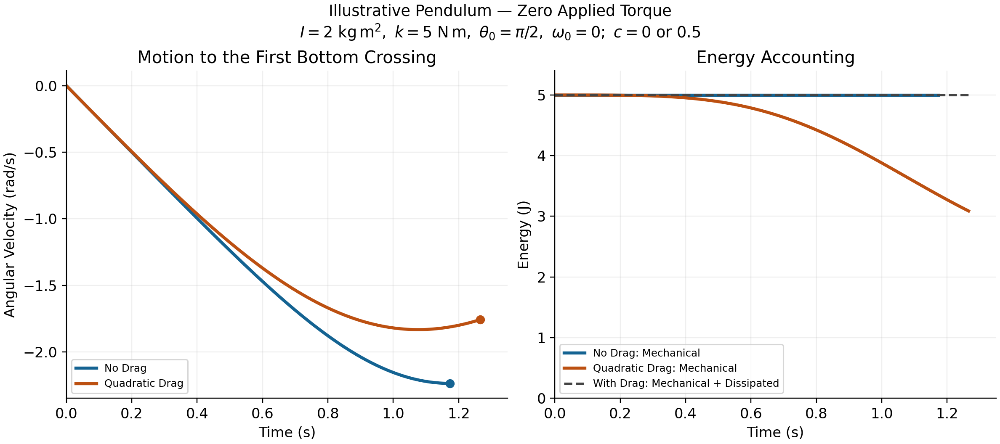

# Aerodynamic Loads in Swing and Flight {#sec-aerodynamic-drag}

Air loads belong in a golf model when their effect matters for the question and
accuracy being investigated. The useful question is not whether drag is always
negligible or always dominant. It is how a plausible aerodynamic load changes
a measured-load estimate, a forward prediction, or the delivered ball flight,
relative to the uncertainty and effect size that matter to the study.

That question connects several parts of the swing. Geometry determines local
air-relative velocity and orientation. Fluid mechanics determines distributed
tractions and moments. Joint and contact geometry maps those loads into the
multibody equations. The chosen input policy and initial state determine the
forward response. Impact then supplies the ball's initial flight state; ball
aerodynamics determines how that state develops. A force estimate at one point
does not settle all of these questions at once.

## Define the Relative Airflow

At a point on the moving body, let $v$ be its velocity in an inertial reporting
frame and $w$ the undisturbed ambient-air velocity evaluated at that point.
Define $v_r=v-w$. In a quasi-steady drag model,
$$
F_D=-\tfrac12\rho C_D A\|v_r\|v_r.
$$ {#eq-drag-vector}
The force opposes motion relative to the air. It need not oppose velocity
relative to the ground. Density $\rho$, reference area $A$, and coefficient
$C_D$ require declared units and conventions. This expression represents the
drag component; lift, side force, and an aerodynamic couple may be needed to
represent the full load on an oriented or rotating clubhead.

The coefficient summarizes the effects of shape, orientation, Reynolds number,
surface condition, and other features of the flow. It is not a universal
constant belonging to a shape name. The
[NASA drag-equation explanation](https://www1.grc.nasa.gov/beginners-guide-to-aeronautics/drag-equation/)
emphasizes that a measured coefficient and its reference area must be used
together. Doubling the reporting area halves the coefficient for the same force.
A fixed nominal area with an orientation-dependent coefficient is a valid
convention; repeatedly changing area as well as using a coefficient already
calibrated for that change can double-count the orientation effect.

For a ball, $A=\pi r_b^2$ is a common convention. For a cylinder in normal
crossflow, projected area is diameter times exposed length. For a clubhead,
state the area used in its calibration rather than assuming it always equals
the clubface area. Its airflow incidence changes during the swing.

### Quadratic Scaling and Its Limits

The force magnitude is
$$
D=\tfrac12\rho C_D A v_r^2.
$$ {#eq-drag-scalar}
It increases fourfold when speed doubles only if $\rho,C_D,A$ remain fixed.
A momentum-flux argument motivates a scale $\rho Av_r^2$ in inertia-dominated
flow. It does not prove that the coefficient is speed-independent. At low
Reynolds number, a sphere's Stokes drag is proportional to speed; expressing it
using the quadratic formula gives $C_D=24/\mathrm{Re}$. Thus the same coefficient
notation can encode different speed dependence.

Use
$$
\mathrm{Re}=\frac{\rho\|v_r\|L}{\mu}
$$ {#eq-drag_reynolds}
to state the flow regime, with the relevant characteristic length $L$ and
dynamic viscosity $\mu$. For illustrative values $\rho=1.225$ kg/m$^3$,
$\mu=1.81\times10^{-5}$ Pa s, and speed 50 m/s, a 0.1 m head scale gives
$\mathrm{Re}\approx3.4\times10^5$; a 0.01 m shaft diameter gives about
$3.4\times10^4$. They are different flow problems. Reynolds number alone does
not tell whether every boundary layer or wake is turbulent. Surface roughness,
orientation, unsteadiness, and separation affect the result.

A quasi-steady coefficient approximation also needs the airflow to adjust
sufficiently quickly relative to the changing motion. Rapid orientation changes,
shaft-head interference, and wake history can require unsteady measurements or
a more detailed fluid model. CFD is a way to calculate a candidate load model;
mesh, time-step, turbulence-model, and experimental validation remain necessary.

## A Force Estimate With a Clear Scope

Choose $\rho=1.225$ kg/m$^3$, $C_D=0.4$, $A=0.005$ m$^2$, and
$\|v_r\|=50$ m/s as an illustrative coefficient-area-speed combination. Then
$$
D=\tfrac12(1.225)(0.4)(0.005)(50)^2=3.0625\ {\rm N}.
$$ {#eq-drag-example}
This is a conditional calculation, not a measured typical driver force. The
same force results from $C_D=0.2$ with area $0.01$ m$^2$. Comparing coefficients
across products without matching area, incidence, and flow conditions can be
misleading.

In still air, the instantaneous translational drag power for this example is
$-D\|v\|=-153.125$ W. If the same speed and load were maintained for 0.05 s,
7.65625 J would be transferred out through drag. Maintaining speed requires
other loads to supply that work. This calculation is an energy scale, not a
claim that a freely evolving club loses exactly that fraction of its speed.
A 0.2 kg point-mass head at 50 m/s has translational kinetic energy 250 J;
the complete club also has its distributed translational and rotational energy.
A percentage loss for an actual swing requires integration along that swing.

Similarly, impulse is $\int F_D\,dt$, while work is $\int F_D^Tv\,dt$ with
the relevant point velocity and any aerodynamic-couple power included. A peak
force multiplied by total downswing duration does not reproduce either integral
unless the corresponding simplifying assumptions hold. Comparing newtons to
newton metres without a defined moment arm has no physical meaning.

## Distributed Shaft Loads and the Actual Pivot

For a slender shaft with centerline $p(s,q)$, local velocity $v(s)$, and tangent
unit vector $t(s)$, a simple normal-crossflow model uses
$$
v_\perp=(I-tt^T)(v-w),\qquad
 dF_D=-\tfrac12\rho C_n d(s)\|v_\perp\|v_\perp\,ds.
$$ {#eq-shaft-drag-element}
The coefficient $C_n$ is calibrated for the chosen crossflow model. This
approximation omits axial skin friction and some three-dimensional or unsteady
effects. Flexible motion enters through the actual centerline and local
velocity; a coating or aerodynamic shape is not itself shaft compliance.

As an exactly specified toy geometry, take a straight uniform shaft of length
$L$, rotating in a plane at signed angular speed $\omega$ about a fixed pivot
on its extended axis. The near end is distance $a\geq0$ from that pivot, and
$s\in[0,L]$ measures distance along the shaft. Its speed is $|\omega|(a+s)$.
With still air and constant diameter $d$ and $C_n$, integration gives
$$
D_{\rm shaft}=\tfrac12\rho C_n d\omega^2
 \frac{(a+L)^3-a^3}{3},
$$ {#eq-total-shaft-drag}
$$
\tau_{D,\rm pivot}=-\tfrac12\rho C_n d\omega|\omega|
 \frac{(a+L)^4-a^4}{4}.
$$ {#eq-shaft-drag-torque}
The moment sign opposes the signed rotation. For $a=0$, the pivot is the shaft's
near end; it is not automatically the shoulder. A real golfer's grip translates
and rotates, so a single fixed-pivot shaft example does not represent all
shoulder, wrist, and club angular speeds.

For $L=1.1$ m, $d=0.01$ m, $C_n=0.5$, $\rho=1.225$ kg/m$^3$,
$\omega=25$ rad/s, and $a=0$, the resisting moment magnitude is
0.700595 N m. The near-end-pivot head speed in this same toy geometry would be
27.5 m/s. It would be inconsistent to combine that shaft calculation with a
50 m/s head while claiming one rigid fixed-pivot motion. A different motion
model can produce different local speeds, but must specify how.

The generalized load contribution of a segment depends on its velocity
Jacobian and the chosen output, not merely its speed or mass. Arm, torso,
shaft, and head contributions should therefore be integrated with compatible
kinematics. There is no universal 40/40/20 percentage split. The component
that dominates force need not dominate a selected joint moment, work integral,
or change in endpoint club speed.

## From Air Loads to Generalized Loads

If point $i$ has velocity $v_i=J_{v_i}(q)\dot q$ and segment angular velocity
$\omega_i=J_{\omega_i}(q)\dot q$, its aerodynamic force $F_i$ and couple
$m_i$ about that same point contribute
$$
Q_{\rm aero}=\sum_i\left(J_{v_i}^TF_i+J_{\omega_i}^Tm_i\right),
$$ {#eq-lumped-drag}
with an integral replacing the sum for distributed loads. The formula follows
from virtual power:
$$
\dot q^TQ_{\rm aero}=\sum_i(v_i^TF_i+\omega_i^Tm_i).
$$ {#eq-aero_virtual_power}
All components must use compatible frames and reference points. For one
revolute coordinate, the generalized moment is the projection of the
force-induced moment and couple onto that joint's axis. A sum of three-vectors
$r_i\times F_i$ is not a general $n$-coordinate load vector.

Use one consistent sign convention in the equations:
$$
M\ddot q+h=Bu+p+Q_{\rm aero}+J_c^T\lambda.
$$ {#eq-eom-with-drag}
The drag force already contains its resisting sign. It enters the right-hand
side as written; adding an extra minus sign there would reverse its action.
Here $h$ contains the declared inertial bias and gravity, $p$ other constitutive
loads, and $J_c^T\lambda$ the ideal closure reactions. Other external loads
must also be included where appropriate.

For a regular fixed contact mode, eliminating reactions gives an acceleration
map $a=f_a+KB u$, where
$$
K=M^{-1}-M^{-1}J_c^T(J_cM^{-1}J_c^T)^{-1}J_cM^{-1}.
$$ {#eq-drag_constrained_projection}
An input-independent aerodynamic load contributes $KQ_{\rm aero}$ to the
zero-input acceleration at a fixed state. It does not change $KB$ at that
state merely because it depends on velocity. It can change the drift
linearization, the trajectory, required effort, and reachable outcomes under
bounded inputs. Those are different from changing the instantaneous input
coefficient. Actively controlled aerodynamic surfaces or actuator-dependent
flow would require a model that represents that additional input dependence.

The influence of drag on a norm ratio is also not fixed in sign. It is a vector
addition that can reinforce or cancel other drift components. Sums of scalar
load magnitudes do not establish a drift/control ratio, and a large norm ratio
by itself is not a reachability or neural-strategy certificate.

## Power, Frames, and System Boundaries

For the quasi-steady translational drag law with $C_D\geq0$,
$$
F_D^Tv_r=-\tfrac12\rho C_DA\|v_r\|^3\leq0.
$$ {#eq-drag-power}
It is zero at zero relative speed. In an inertial ground frame,
$$
F_D^Tv=F_D^Tv_r+F_D^Tw.
$$ {#eq-wind_power}
A tailwind faster than a body can push it forward and add body kinetic energy,
while drag still opposes relative motion. For a one-dimensional illustrative
law $F_D=-|v-w|(v-w)$, take body speed $v=1$ and wind $w=3$ in consistent
units: $F_D=4$, ground-frame body power is 4, and relative-motion power is
$-8$. The difference comes from energy exchange with the moving air.

In still air, for a declared whole mechanical system with conservative gravity
and elastic storage included in $E=T+V_g+V_e$, a suitable balance is
$$
\dot E=\dot q^TBu+P_{\rm aero}+P_{\rm other}-P_{\rm diss,other}.
$$ {#eq-energy-balance}
This assumes the remaining passive terms have been classified consistently and
ideal stationary constraints do zero total power. Moving constraints,
activation-dependent constitutive parameters, and additional stored-energy
states require their own terms. Gravity is already in $V_g$; it is not counted
again as an energy source in this total-energy derivative. Inertial coupling
redistributes the kinetic-energy rate and is not an extra supply of energy.

Aerodynamic work is not metabolic expenditure. Isometric force, co-contraction,
activation, and muscle efficiency can consume metabolic energy even when the
net external mechanical work is small. A drag estimate therefore cannot explain
range-session fatigue or diagnose effort by itself. Likewise, lower head drag
may affect attainable speed under a specified swing policy; it does not by
itself establish forgiveness on off-center impacts.

## The Sign of an Inverse-Dynamics Correction

For $B=I$ and known reactions and other loads, rearrangement gives
$$
u=M\ddot q+h-p-Q_{\rm aero}-J_c^T\lambda.
$$ {#eq-inverse-dyn-full}
There is no leading $M^{-1}$. The result has generalized-load units, not
acceleration units. With the same known boundaries, omitting $Q_{\rm aero}$
gives $u_{\rm omit}=M\ddot q+h-p-J_c^T\lambda$, hence
$$
u-u_{\rm omit}=-Q_{\rm aero}.
$$ {#eq-inverse-dyn-error}
For an isolated positive rotation with inertia 2 kg m$^2$, acceleration
3 rad/s$^2$, and resisting aerodynamic moment $-4$ N m, the true applied
moment is 10 N m. Omitting drag gives 6 N m. The omission underestimates the
positive applied moment in this example. With a different axis, motion,
measured quantity, or signed load, the numerical bias can differ; a universal
claim about every inferred joint torque is unjustified.

If hand or ground reactions are also unknown, changing the aerodynamic model
can change the fitted allocation between inputs and reactions. Then the simple
difference above cannot be used while silently assuming those unknown loads
remain fixed. Analyze the joint balance and measurement map as in
[the inverse-dynamics chapter](ch18_inverse_dynamics_parallel.qmd#sec-inverse_dynamics_parallel). Net hand force, net hand couple,
net joint load, and individual muscle force are different inferred quantities.

The relative error must name its denominator. Near a zero crossing, a small
absolute moment discrepancy can produce an arbitrarily large percentage.
Sensitivity to aerodynamic uncertainty should be reported in physical units
and compared with measurement uncertainty and the scientific effect being
tested. Unsupported universal wrist, ankle, or shoulder error percentages do
not provide an accuracy budget.

## A Reproducible Forward Counterfactual

A forward zero-torque counterfactual (ZTCF) sets a declared effective input to
zero and integrates from a specified complete state. It retains the stated
aerodynamic and passive-load laws and recomputes them along the evolving branch.
It is not obtained by recycling measured drag and reaction histories after the
trajectory has changed. Zero joint input also does not mean zero muscle
activation or no previously stored elastic energy.

Consider an illustrative pendulum, with angle $\theta$ measured from its stable
bottom equilibrium, angular velocity $\omega$, inertia $I=2$ kg m$^2$, and
gravity moment $-5\sin\theta$ N m. Choose quadratic drag coefficient
$c\geq0$ in moment per squared angular-speed units. The zero-input model is
$$
\dot\theta=\omega,\qquad
 2\dot\omega=-5\sin\theta-c\omega|\omega|.
$$ {#eq-ZTCF-with-drag}
Angular acceleration is $\dot\omega=\ddot\theta$; $\ddot\omega$ would be
angular jerk. The signed drag law opposes either direction of rotation.

Starting at $\theta=0,\omega=0$ gives an exact equilibrium. No spontaneous
swing appears. To investigate a falling motion, start instead at
$\theta_0=\pi/2,\omega_0=0$. Its initial potential energy relative to the
bottom is 5 J. With
$$
E=\omega^2+5(1-\cos\theta),\qquad
 \dot E=-c|\omega|^3,
$$ {#eq-drag_pendulum_energy}
the first bottom crossing without drag has speed $|\omega|=\sqrt5$, about
2.23607 rad/s. A speed of 85 rad/s would require 7225 J of kinetic energy for
this inertia, which the stated zero-input initial state cannot supply.

For a second independent check, set $y(\theta)=\omega^2$ along the falling
branch, where $\omega<0$. Write the gravity coefficient as $k=5$ N m and
define $\kappa=2c/I$. With angles in radians, the resulting angle equation is
$$
\begin{aligned}
 \frac{dy}{d\theta}-\kappa y&=-\frac{2k}{I}\sin\theta,
 \qquad y(\pi/2)=0,\\
 y(0)&=\frac{2k}{I}\int_0^{\pi/2}e^{-\kappa s}\sin s\,ds.
 \end{aligned}
$$ {#eq-drag_angle_solution}
For the specified inertia, $c=0.5$ gives $\kappa=0.5$ and $2k/I=5$ in the
corresponding angular-speed units. It yields
$$
y(0)=4-2e^{-\pi/4},\qquad
 |\omega_{\rm bottom}|\approx1.75731\ {\rm rad/s}.
$$ {#eq-drag_bottom_speed}
Numerically integrating angle, velocity, and accumulated dissipated work
reproduces both bottom-crossing results:

| Drag Coefficient | Bottom Time (s) | Bottom Speed (rad/s) | Dissipated Work (J) |
|:--|--:|--:|--:|
| $c=0$ | 1.17262 | 2.23607 | 0 |
| $c=0.5$ | 1.26570 | 1.75731 | 1.91188 |

{#fig-drag_force fig-alt="Both pendulums start from rest at a right angle above the bottom. Angular speed reaches 2.24 radians per second without drag and 1.76 with drag. Mechanical energy stays at 5 joules without drag and decreases with drag; mechanical energy plus dissipated work remains 5 joules. Curves end at the first bottom crossing."}

The checks use adaptive integration with relative tolerance $10^{-10}$,
absolute tolerance $10^{-12}$, and maximum step 0.01 s; they also test the energy
identity and the independent angle integral. These parameters are reproducible
numerical settings, not evidence that the pendulum represents a measured golf
swing. It omits the multisegment geometry, real initial motion, muscle and tissue
states, and club mechanics that a golf investigation needs.

In this one-coordinate still-air example, energy loss lowers speed at the same
bottom angle. With drag, the speed maximum occurs before the bottom: along
the falling branch, angular acceleration becomes zero when
$5\sin\theta=c\omega^2$, and the resisting drag remains nonzero at the bottom.
Thus a comparison of bottom-crossing speeds is not a comparison of both
branches' peak speeds. It does not prove a universal ordering of every segment's speed
at a fixed time in a coupled golfer. Changed timing and configuration can
redistribute energy and alter endpoint outcomes. Report whether branches are
compared at the same time, a matched event, or a matched configuration.
Differences between already diverged trajectories also do not reconstruct
instantaneous applied torque; the inverse-dynamics chapter gives an explicit
counterexample to that inference.

## Ball Flight Connects the Swing to the Outcome

At impact, club motion, impact location, contact mechanics, and ball properties
jointly establish launch position, velocity, and spin. Aerodynamics then changes
the flight. A swing study that predicts clubhead speed has not automatically
predicted carry distance or dispersion. Conversely, a launch-monitor endpoint
does not uniquely reconstruct the golfer's joint loading.

For a simplified spherical-ball flight model, let $v_r=v-w$ and use
$$
m_b\dot v=m_bg+F_D+F_L,\qquad \dot r=v.
$$ {#eq-ball-trajectory}
The drag law uses ball-specific $C_D$ and area conventions. A quasi-steady lift
model uses the scalar component $\tfrac12\rho C_LA\|v_r\|^2$, with a signed
coefficient and a stated lift direction. For ordinary transverse-spin Magnus
lift, a candidate direction is
$(\omega_b\times v_r)/\|\omega_b\times v_r\|$. Handle zero cross product
explicitly. Coefficients calibrated for spin perpendicular to the flow should
not be applied to arbitrary spin-axis angles without an appropriate extension.
Spin decay requires an aerodynamic moment law; constant spin is a separate
approximation, not a consequence of the translational equation.

A usual transverse-spin parameter is
$$
S=\frac{r_b\|\omega_b\|}{\|v_r\|}.
$$ {#eq-spin-parameter}
For illustrative radius 0.02135 m, speed 50 m/s, and transverse spin 200 rad/s,
$S=0.0854$. A coefficient cannot be inferred from that number alone without
its Reynolds number, ball geometry, surface condition, and calibrated relation.
Report the chosen ball's dimensions and mass rather than mixing approximate
radii and masses from different examples.

Dimples can promote boundary-layer transition and delay separation in relevant
flow regimes, reducing pressure drag despite additional skin friction. Their
benefit depends on Reynolds number, dimple geometry, spin, and surface condition;
there is no universal constant coefficient or fixed percentage range gain.
The primary wind-tunnel study
[Bearman and Harvey, Golf Ball Aerodynamics (1976)](https://doi.org/10.1017/S0001925900007617)
provides evidence about tested configurations, not a coefficient table for every
ball or driver. A smooth sphere's drag coefficient also changes across flow
regimes; labeling a single value as its universal laminar coefficient is
incorrect.

Backspin changes lift and may also change drag. Depending on launch speed,
angle, spin, coefficient curves, and environment, adding spin can increase or
decrease carry. Lift perpendicular to relative velocity does not directly do
work in that relative frame, but changes the flight path, duration, and drag
history. Height, carry, stopping behavior, and dispersion are different outputs.
Neither lower drag nor higher lift alone establishes greater accuracy or
stability.

## Environment and Model Uncertainty

For dry ideal-gas air, $\rho=p/(R_{\rm air}T)$ with absolute temperature $T$.
The [NASA equation-of-state treatment](https://www1.grc.nasa.gov/beginners-guide-to-aeronautics/equation-of-state/)
explains the pressure, density, and temperature relation. At the same pressure,
the density ratio between 35 and 15 degrees Celsius is
$$
\frac{\rho_{35}}{\rho_{15}}=\frac{288.15}{308.15}\approx0.93510.
$$ {#eq-air_density_temperature}
That is a decrease of about 6.49 percent. Pressure, humidity, and viscosity
changes need their own treatment; an altitude alone does not specify a day's
air density. A reference atmosphere is a model, not a local weather measurement.
Lower density reduces both drag and lift for fixed coefficients and relative
speed; the change in ball range requires solving the flight problem.

A 5 m/s headwind exactly opposite a 50 m/s point velocity changes relative speed
to 55 m/s and, with all other factors fixed, raises drag magnitude by
$(55/50)^2-1=21$ percent. During a swing the velocity direction changes; wind
must be subtracted as a vector at each point, rather than adding a scalar
headwind to every segment for the entire motion. Crosswind can change both
incidence and the direction of aerodynamic force.

In a scalar coefficient model, away from zero speed and for small changes in
the separately represented factors, the differential sensitivity is
$$
\frac{\delta D}{D}\simeq
 \frac{\delta\rho}{\rho}+\frac{\delta C_D}{C_D}
 +\frac{\delta A}{A}+2\frac{\delta v_r}{v_r}.
$$ {#eq-drag_sensitivity}
This is a first-order identity, not a rule for adding uncertainty variances.
Covariances matter; $C_D$ and $A$ may be linked by calibration, and coefficient
variation with speed adds its derivative when speed changes. Near transitions
or rapidly changing orientation, local linear sensitivity can be inadequate.
Propagate the joint parameter/measurement uncertainty through the quantity
actually reported.

## Choosing the Aerodynamic Model

A useful inclusion decision starts with a scientific output and a tolerance.
For example, an aerodynamic-moment uncertainty of a fraction of a newton metre
might be immaterial to one question and larger than the claimed effect in
another. A universal five-percent threshold, a joint's name, or calm weather
cannot make that decision on their own.

1. Specify the measured or predicted output, system boundary, coordinate
   conventions, and tolerable discrepancy in physical units.
1. Begin with a transparent force and moment model. Record coefficient-area
   pairs, incidence and Reynolds-number ranges, air properties, wind, and
   the evidence supporting each parameter.
1. Use compatible segment velocities and map loads by virtual power. Check
   force and moment signs, zero-relative-speed behavior, units, and energy
   balance before interpreting the output.
1. Compare omitted, nominal, and plausible alternative aerodynamic models
   through the same inverse or forward analysis. Preserve the same input
   policy and initial state when comparing forward branches, or explicitly
   define a different intervention.
1. Check numerical convergence and compare predictions with independent
   measurements. Add aerodynamic couples, flexibility, wake interaction,
   or CFD-derived loading when the simpler model's discrepancy matters for
   the question and the added detail is supportable.
1. Report the resulting sensitivity and remaining uncertainty. Treat a
   measured performance difference, a model prediction, an illustrative
   calculation, and a proposed design change according to their evidence.

This places aerodynamic loading within the broader investigation of the golf
swing: it is a physical load that interacts with geometry, constrained dynamics,
control policy, and impact conditions. Its importance is an output-dependent
result to establish, rather than a fixed percentage or a proof that either
muscles or passive dynamics must dominate.

## Chapter Exercises

1. Reproduce the 3.0625 N example. Change the reporting area while preserving
   force; calculate the new coefficient.
1. Derive shaft force and moment for pivot offsets $a=0$ and $a=0.6$ m.
   Explain why a near-end pivot is not a shoulder model.
1. Derive generalized aerodynamic load from virtual power, including the
   single revolute-axis moment as a special case.
1. Verify the tailwind example in both velocity frames and identify the
   energy supplied by the moving air.
1. Reproduce the 10 versus 6 N m inverse example. Explain what changes
   when contact reactions are also unknown.
1. Verify the pendulum equilibrium, bottom-crossing speeds, and energy loss.
   Explain why peak speed can occur before the bottom.
1. Compute the temperature and headwind examples. Distinguish the factors
   held fixed from those that can change outdoors.
1. Compare ball flights with equal launch states and different coefficient
   curves. Explain why range does not identify prior muscle loading.
