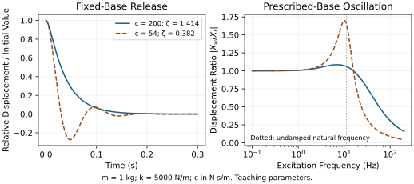
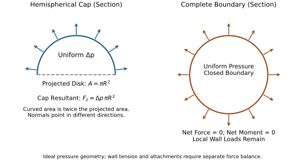

# Soft Tissue and Pliable Systems: Beyond the Rigid Body {#sec-soft_tissue_pliable}
[]{#ch-soft_tissue_pliable}

::: {.callout-note}
## Why Soft Tissue Matters in Golf

[]{#laymans-intro-softtissue}
A body segment can move approximately as a rigid object while its skin, muscle and other tissues move relative to its bones. That relative motion matters in two different ways: it changes forces and stored energy, and it changes what a surface-mounted sensor reports. A marker can therefore give a repeatable measurement without being a faithful measurement of the underlying bone.

Abdominal pressure adds another connection. Pressure acts on the surrounding structures, while muscles and connective tissues help contain that pressure. The resulting support depends on the whole force balance. A large pressure reading does not, by itself, reveal the load on a spinal joint, the energy reaching the club, or the likelihood of an injury.

This chapter builds small models that make those distinctions calculable. Their purpose is to decide which effects a golf or humanoid model must resolve and what evidence would validate it. The numerical examples are declared teaching systems, not measured anatomical parameters or instructions to change breathing or muscle activation.
:::

## The Rigid Body Assumption: Where It Works and Where It Fails {#the-rigid-body-assumptionwhere-it-works-and-where-it-fails}
[]{#sec-rigid_assumption}
[]{#constr-constraint-rigid_fails}

Rigid-segment modeling assumes that distances between material points assigned to a segment remain fixed. It does not require all joints to be hinges, all muscles to be inactive, or the club shaft to be rigid. A model can combine rigid bones, multiaxis joints, deformable tendons and a flexible club. The choice should follow the question and the available measurements.

Stiffness and strength are different properties. A bone's failure load does not establish how accurately a rigid approximation predicts its deformation under a particular load. Likewise, a rigid segment's center of mass and inertia must include the tissue assigned to it. Adding a wobbling mass to an anthropometric segment without subtracting that same mass from the rigid part counts tissue twice.

A useful rigid approximation reproduces specified outputs over a specified operating range. It may be adequate for a gross pose while inadequate for tissue stress or an impact peak. A small pose error does not guarantee a small force error, especially when forces depend on acceleration or contact deformation. There is no universal 15-degree-of-freedom model, or universal percentage accuracy, for coaching, inverse dynamics or injury assessment.

Pain and Challis modeled two heel-first drop landings by one man using subject-specific segment estimates and a partly calibrated wobbling-mass model [@Pain2006Wobble]. Their model and a rigid alternative produced similar gross kinematics but substantially different computed loading. Separate controlled impacts supplied tissue-motion comparisons; the trunk response lacked equivalent independent data. This is evidence that model choice can matter under those impact conditions. It does not establish a correction percentage or tissue-motion amplitude for golf.

The practical decision is therefore output-specific. Predicting where the ball flies requires a sufficiently accurate launch state and flight model; it does not automatically require every internal tissue mode. Predicting how the golfer creates that state, or estimating a particular tissue load, introduces different requirements. Validation must follow that distinction.

## Wobbling Mass: A Coupled Mechanical Model {#wobbling-massthe-muscle-jiggle-problem}
[]{#eq-wobble_eom}
[]{#sec-wobbling_mass}

Begin with two positive masses moving along a horizontal line. Let $x_r$ be the rigid part's position and $x_w$ the effective tissue mass's position. A spring of stiffness $k>0$ and a damper with coefficient $c\geq0$ connect them. Coordinates are measured from a configuration in which the spring is unstrained. The applied force $u$ acts on the rigid part. Gravity has no component along this particular line; that is a boundary assumption, not a property of soft tissue.

Define relative displacement $z=x_w-x_r$. The spring and damper exert equal and opposite forces, so the closed equations are

$$
\begin{aligned}
m_r\ddot x_r&=u+kz+c\dot z,\\
m_w\ddot x_w&=-kz-c\dot z.
\end{aligned}
$$

Adding them gives [$(m_r+m_w)\ddot x_{\mathrm{COM}}=u$]{.long-inline-math role="group" aria-label="Inline calculation 1; scroll horizontally" tabindex="0"}. Internal coupling can redistribute motion but cannot accelerate the complete system's center of mass without an external force. An effective tissue mass represents a selected deformation mode; it is not automatically the mass of every anatomically soft structure in the segment.

The mechanical energy and its rate are

$$
E=\tfrac12m_r\dot x_r^2+\tfrac12m_w\dot x_w^2+\tfrac12kz^2,
\qquad
\dot E=u\dot x_r-c\dot z^2.
$$

The spring stores energy; the damper removes mechanical energy at a nonnegative rate. Energy entering tissue motion is not necessarily already dissipated. It can return through the coupling. Over a simulation, integrated actuator work must equal the change in mechanical energy plus accumulated dissipation. This balance provides a stronger implementation check than a plausible-looking trajectory.

### Prescribed Motion and Free Motion Have Different Modes

If the rigid part follows an externally prescribed trajectory, the tissue equation becomes

$$
m_w\ddot z+c\dot z+kz=-m_w\ddot x_r.
$$

The base acceleration drives relative motion. Maintaining that prescribed base requires whatever reaction force the model predicts; it is not the same experiment as applying a fixed force to a freely moving rigid part.

For a fixed base, the undamped natural angular frequency and damping ratio are

$$
\omega_n=\sqrt{k/m_w},\qquad
\zeta=\frac{c}{2\sqrt{km_w}}.
$$

Take $m_w=1\,\mathrm{kg}$, [$k=5000\,\mathrm{N/m}$]{.long-inline-math role="group" aria-label="Inline calculation 2; scroll horizontally" tabindex="0"} and [$c=200\,\mathrm{N\,s/m}$]{.long-inline-math role="group" aria-label="Inline calculation 3; scroll horizontally" tabindex="0"}. Then [$\omega_n=70.7107\,\mathrm{rad/s}$]{.long-inline-math role="group" aria-label="Inline calculation 4; scroll horizontally" tabindex="0"}, equivalent to [$11.2540\,\mathrm{Hz}$]{.long-inline-math role="group" aria-label="Inline calculation 5; scroll horizontally" tabindex="0"}, and $\zeta=1.4142$. The homogeneous roots are [$-29.2893\,\mathrm{s^{-1}}$]{.long-inline-math role="group" aria-label="Inline calculation 6; scroll horizontally" tabindex="0"} and [$-170.7107\,\mathrm{s^{-1}}$]{.long-inline-math role="group" aria-label="Inline calculation 7; scroll horizontally" tabindex="0"}. This system is overdamped. A positive displacement released from rest decays without repeated oscillation. Describing these same parameters as an underdamped system with several cycles would contradict the equation.

If both masses move freely, subtract their acceleration equations. With reduced mass [$\mu=m_rm_w/(m_r+m_w)$]{.long-inline-math role="group" aria-label="Inline calculation 8; scroll horizontally" tabindex="0"},

$$
\mu\ddot z+c\dot z+kz=-\frac{m_w}{m_r+m_w}u.
$$

The unforced relative mode uses $\sqrt{k/\mu}$, not $\sqrt{k/m_w}$. For [$m_r=1.5\,\mathrm{kg}$]{.long-inline-math role="group" aria-label="Inline calculation 9; scroll horizontally" tabindex="0"} and the preceding tissue parameters, [$\mu=0.6\,\mathrm{kg}$]{.long-inline-math role="group" aria-label="Inline calculation 10; scroll horizontally" tabindex="0"} and the undamped relative frequency is [$91.2871\,\mathrm{rad/s}$]{.long-inline-math role="group" aria-label="Inline calculation 11; scroll horizontally" tabindex="0"}. Boundary conditions change the mode even when the component properties stay the same.

These examples do not identify a golfer's tissue parameters. A large acceleration also does not specify high-frequency excitation: a sustained acceleration and a short pulse can have the same peak and very different spectra. Oscillation amplitude additionally depends on initial conditions, forcing history, damping and the validity of the linear approximation.

On narrow screens, scroll the figure or [open it at full size](../figures/soft_tissue_response.svg).

::: {#fig-soft_tissue_model}
::: {.synthesis-diagram-scroll role="region" aria-label="soft tissue response; scroll horizontally" tabindex="0"}

:::

Boundary Conditions and Damping Determine Tissue Response. Both Plots Use a Fixed or Prescribed Base, a 1 kg Tissue Mass and 5000 N/m Stiffness; Parameters Illustrate a Model, Not Measured Golf Anatomy.
:::

### Effects of Wobbling Mass on Inverse Dynamics {#effects-of-wobbling-mass-on-inverse-dynamics}

Soft-tissue motion is physical, while its contribution to a bone-motion estimate is a measurement artifact. Those statements are compatible. A surface marker follows its local attachment, not necessarily the bone or the center of mass of an effective tissue mode.

In a local one-dimensional observation model,

$$
y(t)=x_r(t)+z_{\mathrm{marker}}(t)+\epsilon(t).
$$

The sensor observes their sum. Without additional information, changing the proposed bone trajectory by $a(t)$ and changing marker motion by $-a(t)$ leaves the same observation. A fitted decomposition therefore needs calibration, independent observations or justified constraints. Adding a tissue model does not automatically make the components identifiable.

Differentiation magnifies rapid motion and noise. For a sinusoidal marker displacement of amplitude $A$ and frequency $f$, acceleration amplitude is $A(2\pi f)^2$. At $A=0.01\,\mathrm{m}$ and $f=10\,\mathrm{Hz}$, it is [$39.4784\,\mathrm{m/s^2}$]{.long-inline-math role="group" aria-label="Inline calculation 12; scroll horizontally" tabindex="0"}. The same displacement at another frequency gives a different acceleration; an amplitude alone is insufficient.

Filtering can reduce noise or an identifiable transient, but tissue artifact need not occupy a separate frequency band. Fuller and colleagues compared skin-mounted and bone-pin marker arrays and found overlapping spectral content [@Fuller1997Markers]. Their results oppose a universal rule that low-pass filtering recovers skeletal motion. The task, attachment, smoothing method and reference measurement all matter.

An accelerometer further measures specific force in its sensor frame. Converting it to a point's coordinate acceleration requires orientation, gravity and reference-point conventions. Rotational motion, sensor offset, attachment motion, bias and timing errors can all enter. Neither a marker nor an accelerometer alone directly measures an individual muscle force.

For inverse dynamics, distinguish errors in motion, external forces, inertial parameters and the mechanical model. A net generalized-force estimate remains a combined result of muscles, passive tissues and constraints. Estimating individual tissue loads requires additional constitutive and force-allocation assumptions. The [inverse-dynamics chapters](./ch18_inverse_dynamics_parallel.html) develop that distinction.

### Effects of Wobbling Mass on the Drift Field {#effects-of-wobbling-mass-on-the-drift-field}

A useful frequency-domain calculation exposes what an effective inertia means. Prescribe a small harmonic base displacement [$x_r(t)=\operatorname{Re}(X_r e^{i\omega t})$]{.long-inline-math role="group" aria-label="Inline calculation 13; scroll horizontally" tabindex="0"} in the preceding linear model. Substitution into the tissue equation gives

$$
H(\omega)=\frac{X_w}{X_r}
=\frac{k+ic\omega}{k-m_w\omega^2+ic\omega},
\qquad
m_{\mathrm{dyn}}(\omega)=m_r+m_wH(\omega).
$$

The required external force amplitude is [$U=-\omega^2m_{\mathrm{dyn}}X_r$]{.long-inline-math role="group" aria-label="Inline calculation 14; scroll horizontally" tabindex="0"}. Both the spring and damper transmit base motion, so both belong in the numerator. Omitting its damping term changes the phase, reaction and energy balance.

At low frequency, $H$ approaches one and the dynamic mass approaches $m_r+m_w$. At sufficiently high frequency, $H$ approaches zero and the response approaches that of $m_r$, within this model's valid range. Around a mode, amplitude and phase depend on damping. A complex dynamic mass is a compact input-output description under harmonic forcing, not a new physical mass; its real part need not behave monotonically.

The mean input power provides an independent check:

$$
\overline P
=\tfrac12\operatorname{Re}\!\left[U(i\omega X_r)^*\right]
=\tfrac12c\omega^2|X_w-X_r|^2.
$$

The star denotes complex conjugation. In steady harmonic motion the average stored-energy change is zero, so input power equals damper loss. This identity and direct time integration test the response without relying on the same algebraic rearrangement.

Here $\omega$ is the frequency of a small imposed oscillation. It is not simply the golfer's angular speed. A rapid rotation need not excite the same mode as a rapidly varying perturbation, and a measured swing is not a steady sinusoid. The calculation therefore supplies a testable coupling mechanism, not an explanation that elite athletes exploit tissue decoupling.

In a state-space model, adding $z$ and $\dot z$ changes the state and the equations. It can also change the input map and observation map. Eliminating those states can introduce memory; a complex harmonic response should not be inserted into a time-domain equation as an ordinary constant inertia. Drift still means the vector field at the declared zero input, with the retained contact, gravity, elastic and activation mechanisms specified.

## Internal Motion in the Torso {#the-fluid-torsovisceral-dynamics}
[]{#sec-fluid_torso}

The torso contains deformable organs, muscles, connective tissues and fluids, with different attachments and material properties. It is not adequately characterized by assigning a single fraction of its mass to an unrestrained liquid. Total-body blood mass is not all located in the torso cavity, and organ masses cannot be added to an existing whole-torso estimate without checking what that estimate already includes.

For a declared rotating-frame illustration, a point at radius $r=0.15\,\mathrm{m}$ in a frame rotating steadily at [$\omega=10.5\,\mathrm{rad/s}$]{.long-inline-math role="group" aria-label="Inline calculation 15; scroll horizontally" tabindex="0"} has a centripetal acceleration magnitude [$\omega^2r=16.5375\,\mathrm{m/s^2}$]{.long-inline-math role="group" aria-label="Inline calculation 16; scroll horizontally" tabindex="0"} if it remains fixed in that frame. In rotating-frame force balance the corresponding centrifugal term points outward. This calculation gives an acceleration scale; it does not give an organ displacement or stress.

The complete acceleration transformation is

$$
\begin{aligned}
\mathbf a={}&\mathbf a_O+R\bigl[
\ddot{\boldsymbol\rho}
+2\boldsymbol\omega\times\dot{\boldsymbol\rho}
+\dot{\boldsymbol\omega}\times\boldsymbol\rho\\
&\hspace{35mm}
+\boldsymbol\omega\times(\boldsymbol\omega\times\boldsymbol\rho)
\bigr].
\end{aligned}
$$

Here $R$ maps components from the moving frame to the inertial frame, $\boldsymbol\rho$ is position relative to its origin, and the dotted relative quantities and $\boldsymbol\omega$ use moving-frame components. Frame translation, angular acceleration and relative motion add terms that a centrifugal-only argument omits. Attachment forces, gravity, contact and material response must balance the resulting dynamics.

Predicting deformation requires a constitutive law and boundary conditions. In a continuum description, local momentum balance is [$\rho\mathbf a=\nabla\!\cdot\boldsymbol\sigma+\rho\mathbf b$]{.long-inline-math role="group" aria-label="Inline calculation 17; scroll horizontally" tabindex="0"}, where $\rho$ is density, $\boldsymbol\sigma$ stress and $\mathbf b$ body force per unit mass. An approximately incompressible fluid can transmit pressure while having no static shear modulus; surrounding tissues can resist shear and tension. A lumped oscillator, a deformable solid and a fluid model make different assumptions.

### Time-Varying Inertia Tensor {#time-varying-inertia-tensor}

A rigid body's inertia about its center of mass is constant in a fixed body frame, while its components rotate in an inertial frame. Deformation can change even the body-frame inertia. Those are separate effects, and neither alone determines the complete angular momentum of a deforming body.

Choose an origin at the complete modeled system's center of mass and a rotating frame. With all quantities below expressed in that frame,

$$
\mathbf H=I\boldsymbol\omega+\mathbf h_{\mathrm{rel}},
\qquad
\boldsymbol\tau_{\mathrm{ext}}
=I\dot{\boldsymbol\omega}+\dot I\boldsymbol\omega
+\dot{\mathbf h}_{\mathrm{rel}}
+\boldsymbol\omega\times(I\boldsymbol\omega+\mathbf h_{\mathrm{rel}}).
$$

The relative angular momentum [$\mathbf h_{\mathrm{rel}}$]{.long-inline-math role="group" aria-label="Inline calculation 18; scroll horizontally" tabindex="0"} comes from material motion relative to the chosen frame. It generally cannot be inferred from the instantaneous inertia alone. Changing the system boundary or using an accelerating origin away from its center of mass requires the appropriate additional accounting.

A special scalar model with no relative angular momentum gives $\tau=d(I\omega)/dt$. At zero external torque, angular momentum is conserved. If $I$ changes from $3.00$ to [$3.18\,\mathrm{kg\,m^2}$]{.long-inline-math role="group" aria-label="Inline calculation 19; scroll horizontally" tabindex="0"} with initial angular speed $10\,\mathrm{rad/s}$, the final speed is [$9.43396\,\mathrm{rad/s}$]{.long-inline-math role="group" aria-label="Inline calculation 20; scroll horizontally" tabindex="0"}. The associated rotational energy falls from $150$ to [$141.5094\,\mathrm J$]{.long-inline-math role="group" aria-label="Inline calculation 21; scroll horizontally" tabindex="0"}. Reversing the shape change reverses that energy change in an ideal reversible process. It is not automatically heat.

If instead an actuator holds angular speed at $10\,\mathrm{rad/s}$ while that inertia rises uniformly over $0.2\,\mathrm s$, it must supply a $9\,\mathrm{N\,m}$ torque in this scalar model. Work associated with the shape change must also be accounted for. The term $\dot I\omega$ is not a viscous damper merely because it appears next to a velocity.

### Practical Implications {#practical-implications}

Internal motion can affect momentum, energy, sensor observations and local loading together. Its importance must be estimated from measurements or sensitivity analysis for the intended task. The chapter does not assign a universal percentage change to torso inertia or a measured displacement to organs during a golf transition.

Transition deserves investigation because velocities, activation and contact forces evolve there; a claim that visceral motion makes it the most dangerous or most powerful phase needs separate evidence. The [spine chapter](./ch21_spine_modeling.html) develops segment-level loading models. The [damping chapter](./ch29_joint_damping_friction.html) distinguishes elastic storage, local dissipation and effects on the complete coupled system.

## Intra-Abdominal Pressure: Define the Pressure Boundary {#intra-abdominal-pressure-iapthe-hydraulic-cylinder}
[]{#sec-iap}

Intra-abdominal pressure is pressure within the abdominal compartment. Its measured value depends on the measurement method, reference pressure, location, posture and task. Gastric or bladder measurements can provide useful information under defined protocols, but a pressure reading is not a direct measurement of every boundary traction.

### Anatomy of the Pressure-Generating System {#anatomy-of-the-pressure-generating-system}

The diaphragm separates thoracic and abdominal compartments; the abdominal wall and pelvic floor complete much of the surrounding boundary. Vertebral, fascial and muscular structures provide additional attachments and constraints. These structures deform and exert forces together. Treating the abdomen as a pressure vessel can clarify force balance, but a literal hydraulic cylinder with rigid end plates is only a simplified model.

Contraction and respiratory motion can change pressure, geometry and muscular tension at the same time. Their mechanical effects must be distinguished rather than assigned to pressure alone. The pressure difference across the diaphragm involves thoracic pressure as well as abdominal pressure. Raising an abdominal pressure relative to atmosphere does not specify that difference if thoracic pressure changes too.

### IAP as a Structural Support System {#iap-as-a-structural-support-system}

For a surface patch $S$ with unit normal $\mathbf n$ pointing from the cavity into its wall, the net pressure force and moment on the wall are

$$
\mathbf F_p=\int_S\Delta p\,\mathbf n\,dA,\qquad
\boldsymbol\tau_p=\int_S(\mathbf r-\mathbf r_O)
\times(\Delta p\,\mathbf n)\,dA.
$$

The pressure difference $\Delta p$ must compare the two sides of that wall. Wall tension, muscle forces and attachments remain separate terms. The force direction varies across a curved surface, so multiplying pressure by its total curved area does not usually give the vertical resultant.

For uniform $\Delta p$, the vertical force uses signed projected area:

$$
F_{p,z}=\Delta p\int_S n_z\,dA
=\Delta p\,A_{\mathrm{proj}}.
$$

A hemispherical cap of radius $R$ has curved area $2\pi R^2$ but vertical projected area $\pi R^2$. Its axial resultant is therefore $\Delta p\pi R^2$, not twice that value. Numerical surface integration verifies the distinction.

Using [$1\,\mathrm{mmHg}\approx133.3224\,\mathrm{Pa}$]{.long-inline-math role="group" aria-label="Inline calculation 22; scroll horizontally" tabindex="0"}, a declared pressure difference of $100\,\mathrm{mmHg}$ over projected area $0.04\,\mathrm{m^2}$ gives approximately $533.29\,\mathrm N$. Rounding pressure to [$13{,}300\,\mathrm{Pa}$]{.long-inline-math role="group" aria-label="Inline calculation 23; scroll horizontally" tabindex="0"} gives $532\,\mathrm N$. Neither number is automatically a reduction in spinal compression; it is one patch's resultant under the stated pressure and geometry.

For a complete closed boundary under uniform pressure,

$$
\oint_S p\,\mathbf n\,dA=\mathbf0,\qquad
\oint_S(\mathbf r-\mathbf r_O)\times(p\,\mathbf n)\,dA=\mathbf0.
$$

Opposing regions balance globally while individual regions remain loaded. A nonuniform pressure field can have a resultant associated with fluid weight or acceleration; the corresponding fluid balance must then be included. For the complete body, internal action-reaction pairs do not create a net external supporting force. They can nevertheless redistribute loads between structures.

On narrow screens, scroll the figure or [open it at full size](../figures/soft_tissue_pressure.svg).

::: {#fig-soft_tissue_pressure}
::: {.synthesis-diagram-scroll role="region" aria-label="soft tissue pressure; scroll horizontally" tabindex="0"}

:::

Pressure Acts Normal to a Surface. A Hemispherical Cap Has an Axial Resultant Based on Its Projected Disk; a Complete Uniform-Pressure Boundary Has Zero Net Force and Moment Despite Local Loading.
:::

This is why a diaphragm force cannot simply be subtracted from a joint load. The muscles and connective tissues containing the pressure contribute their own forces and moments. Their effects depend on geometry and activation. A comparison with one supposed typical back-extensor force omits that balance.

### IAP and Torso Stiffness {#iap-and-torso-stiffness}

Pressure can contribute to the response of a deformable structure through geometry and wall prestress. The work calculation shows the limit of a pressure-only explanation. For uniform internal pressure relative to a constant external reference, the pressure power delivered to a moving boundary is

$$
P_p=\int_S p\,\mathbf n\cdot\mathbf v\,dA=p\dot V,
\qquad
Q_{p,j}=p\frac{\partial V}{\partial q_j}.
$$

Here $V$ is cavity volume and $q_j$ a boundary-deformation coordinate. If a proposed ideal twist preserves volume, its direct hydrostatic pressure torque is zero. A fluid does not acquire a static shear modulus merely because its pressure is high.

The surrounding wall can still resist that twist through its material stiffness, tension and constrained geometry. Pressure can change those quantities and the resulting tangent response. A model must include them to predict the change. It cannot replace that derivation with a universal stiffness proportional to pressure or assume that damping increases by the same rule.

Hodges and colleagues used phrenic-nerve stimulation to raise pressure in three prone subjects and measured an increase in posteroanterior lumbar indentation stiffness [@Hodges2005IAPStiffness]. This supports a mechanical contribution under their controlled conditions. It does not supply a golf-specific torsional stiffness, prove stability of a moving swing, or establish an optimum pressure profile.

### Breathing Coordination and the Exhale Cue {#breathing-coordination-and-the-exhale-cue}

Inspiration, expiration, glottal state, abdominal activation and posture interact. Inhalation does not universally reduce IAP, and exhalation does not uniquely determine it. The diaphragm's action and pressure difference depend on what the surrounding structures do.

Shirley and colleagues measured a composite posteroanterior spinal response during respiratory tasks in eight subjects [@Shirley2003Respiration]. Both inspiratory and expiratory efforts could increase stiffness. Their analysis distinguished pressure, muscle activity and the measurement's composite nature. This contradicts a simple account in which inhalation necessarily removes support while exhalation guarantees it.

A breathing cue is therefore a behavioral intervention with several possible pathways. It may change timing, attention, muscle activity, pressure or comfort together. To explain its effect, measure the intended intermediate variables and the outcome. A plausible physiological account does not establish increased club speed or protection from a cardiovascular event.

## Pressure, Support and Golf Performance {#how-iap-helps-the-golf-swing}
[]{#sec-iap_helps}

The central question is how pressure and muscle action jointly change a specified outcome. Local stiffness, stability, tissue load, club speed and perceived effort are different outcomes. Evidence about one can guide the next experiment but does not settle it.

### Spine Stabilization and Load Distribution {#spine-stabilization-and-load-distribution}

Stokes and colleagues' static model included curved abdominal muscle paths, specified pressures and a force-allocation objective [@Stokes2010AbdominalPressure]. It predicted lower spinal compression when pressure increased under its tested loads. The authors also explained that optimized activation may underestimate real coactivation and compression. The result is conditional on the complete model, not on pressure alone.

An experiment by Nachemson and colleagues measured pressures and muscle activity in four subjects performing five isometric tasks [@Nachemson1986Valsalva]. Four tasks showed increased rather than decreased compression during Valsalva maneuvers. The two studies ask related questions under different activation and task conditions. Together they motivate explicit force balance and experimental validation rather than a universal unloading percentage.

Stability additionally concerns how perturbations evolve. A larger measured indentation stiffness does not by itself establish stability for a multiaxis moving system with delays, muscle limits and changing contacts. Nor does lower estimated compression prove lower injury risk: the relevant tissue, loading direction, duration, exposure and capacity still matter.

### Torso Stiffness and Energy Transmission {#torso-stiffness-and-energy-transmission}

An elastic deformation can store recoverable energy. A dissipative process converts mechanical energy into other forms. A compliant connection can therefore transmit and return energy without being a source of loss, while a stiff connection can still dissipate energy or demand substantial muscle work.

For a linear torsional spring with fixed reference,

$$
\tau_{\mathrm{spring}}=-K\theta,\qquad
V=\tfrac12K\theta^2.
$$

At fixed deformation, increasing $K$ increases stored energy. At fixed applied torque magnitude $T$ in static equilibrium, however, $\theta=T/K$ and $V=T^2/(2K)$, so increasing $K$ decreases the stored energy. The comparison changes when its boundary condition changes.

Neither result establishes that a stiffer torso produces greater shoulder speed for the same hip torque. The delivered motion also depends on timing, inertia, geometry, muscle activation, damping and constraints. A finite-horizon simulation or experiment should compare the desired output under matched conditions and include the work needed to produce the changed mechanical response.

### The X-Factor Stretch Mechanism {#the-x-factor-stretch-mechanism}

A measured thorax-pelvis separation depends on the segment definitions and angle convention. It is not automatically the strain of a single spring or the sum of lumbar joint rotations. A three-dimensional motion can change that reported angle through several coupled rotations.

To calculate elastic storage, identify a tissue or an effective constitutive element, its reference configuration and its force-deformation relation. For a nonlinear one-dimensional elastic element, stored energy is the integral of its restoring-force magnitude over deformation along the defined loading path. Hysteresis or active force production requires additional accounting.

If stiffness changes while the element is deformed,

$$
\frac{d}{dt}\left(\tfrac12K(t)\theta^2\right)
=K\theta\dot\theta+\tfrac12\dot K\theta^2.
$$

The last term is not free energy. Raising $K$ from $100$ to [$200\,\mathrm{N\,m/rad}$]{.long-inline-math role="group" aria-label="Inline calculation 24; scroll horizontally" tabindex="0"} at a clamped $0.1\,\mathrm{rad}$ deformation adds $0.5\,\mathrm J$ to this ideal storage element. The source of that energy and any losses must be modeled. Pressure or muscle activation can participate in such a change, but naming the mechanism does not remove its work cost.

### Breathing Coordination as a Performance Cue {#breathing-coordination-as-a-performance-cue}

A useful test starts with a reproducible outcome and a tolerable intervention that the participant can perform consistently. Record delivery, ball outcome and the relevant timing or pressure measurements over comparable trials. Separate an immediate performance change from retention, adaptation and changes in reported effort.

Within-person comparisons should address order, fatigue, familiarization and strike variability. Generalization requires additional golfers and sessions. If a cue changes pressure and activation together, the result identifies the combined intervention unless the design can distinguish their contributions. A single better shot cannot establish the proposed internal mechanism.

## Pressure and Health Outcomes {#how-iap-can-hurt}
[]{#sec-iap_risks}

Mechanical models are useful for formulating loading hypotheses. They do not establish a safe pressure threshold, a disease mechanism or a rehabilitation prescription without relevant clinical evidence. The chapter's teaching examples consequently do not prescribe breath holding, maximal bracing or a core-training protocol.

### IAP and Cardiovascular Pressures {#acute-blood-pressure-spike}

Abdominal, thoracic, arterial and intracranial pressures are different quantities, with different reference boundaries and time courses. Blood flow depends on pressure gradients and vascular properties; a pressure reading in one compartment cannot simply be assigned to another. Changes during a strain and its release need not have the same cardiovascular effect.

Haykowsky and colleagues reported three cases of subarachnoid hemorrhage associated with weight training and discussed a possible relation to straining [@haykowsky2003resistance]. A case report can identify a concern but cannot estimate a golfer's event probability or show that a particular exhalation cue prevents it. The physiological and clinical question requires its own measurements and study design.

### Pelvic-Floor and Hernia Claims {#hernias-and-pelvic-floor-dysfunction}

Pressure loads pelvic-floor and abdominal-wall structures, but loading is not identical to injury. Tissue properties, geometry, activation, exposure and individual history affect response. A mechanical force calculation does not show that repeated golf swings cause pelvic-floor weakness, hernia or incontinence.

Measurement also matters. Bø and Sherburn's review concerns methods for assessing pelvic-floor function and strength [@bo2004pelvic]; those are distinct outcomes, measured with different instruments. It does not establish a long-term golfer injury rate or an optimum swing-pressure schedule. A study claiming prevention must measure the relevant health outcome, not substitute a pressure peak or a model's preferred activation pattern.

### Testing Pressure Strategies {#the-balance-optimal-iap-strategy}

Specify what the proposed strategy should improve and how that effect will be measured. Pressure control may compete with mobility, comfort, fatigue or task performance, and a policy can shift load between structures. A numerical optimum is only an optimum for the chosen objective, constraints and model.

Clinical testing requires an appropriate population, exposure accounting, comparison and follow-up. Mechanical verification should precede that step, but it cannot replace it. The [synthesis chapter](./ch13_interdisciplinary.html) distinguishes a plausible mechanism, an identified intervention effect and evidence of improved health outcomes.

## Modifying the Equations of Motion for Pliable Systems {#modifying-the-equations-of-motion-for-pliable-systems}
[]{#sec-eom_pliable}
[]{#eq-standard_eom}

Start from a coordinate and energy definition. For independent generalized coordinates $\mathbf q$ and a declared input $\mathbf u$, a mechanical model can take the form

$$
M(\mathbf q)\ddot{\mathbf q}
+\mathbf c(\mathbf q,\dot{\mathbf q})
+\mathbf g(\mathbf q)+\mathbf f_{\mathrm{passive}}
=B(\mathbf q)\mathbf u+J(\mathbf q)^T\boldsymbol\lambda+\mathbf Q_{\mathrm{ext}}.
$$

The generalized mass matrix is not merely a list of segment inertia tensors. The vector $\mathbf c$ contains the velocity-dependent terms consistent with those coordinates. If $\mathbf u$ contains muscle forces, $B$ can contain moment-arm mappings; if it contains generalized torques, the corresponding map has a different meaning. Contact reactions, external loads and passive forces must be assigned once to the intended system boundary.

### Wobbling Mass Extension {#wobbling-mass-extension}

For the earlier two-mass example, choose coordinates $(x_r,z)$, with $x_w=x_r+z$. Substitution into the kinetic energy gives

$$
M=
\begin{bmatrix}
m_r+m_w&m_w\\
m_w&m_w
\end{bmatrix}.
$$

Its determinant is $m_rm_w>0$, and its off-diagonal terms express inertial coupling. The equations are

$$
M\begin{bmatrix}\ddot x_r\\\ddot z\end{bmatrix}
+\begin{bmatrix}0\\kz+c\dot z\end{bmatrix}
=\begin{bmatrix}u\\0\end{bmatrix}.
$$

The zero second input does not mean that the relative mode is uncontrollable; force on the rigid part acts through the coupled dynamics. It also does not mean that living tissue is passive in general. An active contractile element would require an explicit force law and activation state.

If these same coordinates instead point vertically upward, gravitational potential is [$g[(m_r+m_w)x_r+m_wz]$]{.long-inline-math role="group" aria-label="Inline calculation 25; scroll horizontally" tabindex="0"}. The generalized gravity vector is therefore [$(g(m_r+m_w),gm_w)^T$]{.long-inline-math role="group" aria-label="Inline calculation 26; scroll horizontally" tabindex="0"}. Its soft-coordinate component is not zero. Coordinate transformations determine which equations receive gravity and other forces.

### Time-Varying Inertia {#time-varying-inertia}

For a Lagrangian [$L(\mathbf q,\dot{\mathbf q},t)$]{.long-inline-math role="group" aria-label="Inline calculation 27; scroll horizontally" tabindex="0"}, derive

$$
\frac{d}{dt}\frac{\partial L}{\partial\dot q_i}
-\frac{\partial L}{\partial q_i}=Q_i.
$$

If [$L=\tfrac12\dot{\mathbf q}^TM(\mathbf q,t)\dot{\mathbf q}-V(\mathbf q,t)$]{.long-inline-math role="group" aria-label="Inline calculation 28; scroll horizontally" tabindex="0"}, this gives

$$
\sum_j M_{ij}\ddot q_j
+\sum_{j,k}\Gamma_{ijk}\dot q_j\dot q_k
+\sum_j\frac{\partial M_{ij}}{\partial t}\dot q_j
+\frac{\partial V}{\partial q_i}=Q_i,
$$

where [$\Gamma_{ijk}=\tfrac12(\partial_kM_{ij}+\partial_jM_{ik}-\partial_iM_{jk})$]{.long-inline-math role="group" aria-label="Inline calculation 29; scroll horizontally" tabindex="0"}. The explicit partial time derivative is separate from the coordinate-dependent terms. Adding the full total [$\dot M\dot{\mathbf q}$]{.long-inline-math role="group" aria-label="Inline calculation 30; scroll horizontally" tabindex="0"} to an already consistent Coriolis vector generally counts part of the inertia variation twice.

For a nondimensional example, [$L=\tfrac12(1+q^2)\dot q^2$]{.long-inline-math role="group" aria-label="Inline calculation 31; scroll horizontally" tabindex="0"} gives [$(1+q^2)\ddot q+q\dot q^2=u$]{.long-inline-math role="group" aria-label="Inline calculation 32; scroll horizontally" tabindex="0"}. At $q=1$, $\dot q=2$ and $u=0$, acceleration is $-2$. Appending an extra $\dot M\dot q$ incorrectly gives $-6$ and violates conservation of this system's kinetic energy.

When shape coordinates evolve dynamically, including them in the augmented state is often clearer than prescribing an unexplained $M(t)$. If their motion is prescribed, the actuation and work maintaining that prescription remain part of the model boundary. The general angular-momentum relation above is another way to expose omitted relative-motion terms.

### IAP Effects {#iap-effects}

Pressure can enter generalized forces through boundary tractions and can influence wall geometry, prestress and activation-dependent material response. It is not necessarily an independent control input. A pressure state requires a closure relation involving cavity volume, wall motion and the chosen physiological approximation.

A fitted local torsional impedance may summarize small perturbations around one posture and activation condition. Its coefficients require identification, uncertainty estimates and a stated frequency range. Labeling coefficients [$k_{\mathrm{IAP}}(P)$]{.long-inline-math role="group" aria-label="Inline calculation 33; scroll horizontally" tabindex="0"} and [$d_{\mathrm{IAP}}(P)$]{.long-inline-math role="group" aria-label="Inline calculation 34; scroll horizontally" tabindex="0"} does not establish their signs, linearity, causal interpretation or portability to a golf swing.

### Model Error Requires Validation {#the-key-insight-soft-tissue-effects-are-corrections}

More detail can improve representation while increasing uncertainty or making parameters harder to identify. A model with many soft-tissue states can fit surface motion without correctly estimating internal forces. A simpler model can also be adequate for one output and inadequate for another.

Use a sequence of checks: conservation and units, numerical convergence, parameter sensitivity, independent measurements, and performance on held-out tasks or participants. Validation should specify the output, reference method, error measure, sampling and uncertainty. A universal error percentage attached to a model class conceals those choices.

## When to Use Which Model {#when-to-use-which-model}
[]{#sec-model_choice}

For gross kinematics, begin with segment and joint definitions that match the observations and assess attachment error. For inverse dynamics, add synchronized external forces, consistent inertial properties and sensitivity to filtering and tissue motion. For local loading, specify the tissues, constitutive laws, geometry and force-allocation assumptions. For impact vibration, resolve the modes and contacts relevant to the measured bandwidth.

For a pressure hypothesis, compare measured pressure and activation with the complete modeled boundary forces; test whether the predicted intermediate response occurs. For a clinical claim, add the corresponding exposure and health outcomes. For a ball-flight question, first determine whether uncertainty in the launch state already dominates the proposed internal-model refinement.

These choices can be connected without forcing every investigation into one maximum-detail model. The strongest connection is a shared record of coordinates, system boundaries, measurements, uncertainty and the outputs each model has actually reproduced.

### Looking Ahead {#looking-ahead}

Soft tissues link dynamics, estimation and load distribution. The spine chapter develops a more detailed anatomical model, while the interdisciplinary synthesis explains how to connect its predictions to control, measurement and outcomes. Neither a rigid approximation nor a soft-tissue extension earns general authority from complexity alone.

## Chapter Exercises {#chapter-exercises}
[]{#ex-ch20_exercises}

1. For a tissue mass of $1\,\mathrm{kg}$ attached to a fixed base by [$k=5000\,\mathrm{N/m}$]{.long-inline-math role="group" aria-label="Inline calculation 35; scroll horizontally" tabindex="0"} and [$c=200\,\mathrm{N\,s/m}$]{.long-inline-math role="group" aria-label="Inline calculation 36; scroll horizontally" tabindex="0"}, calculate $\omega_n$, frequency in hertz, damping ratio and characteristic roots. Does release from a positive displacement at zero velocity ring? How does the unforced relative natural frequency change if a $1.5\,\mathrm{kg}$ base is free to move?

1. Derive the closed two-mass momentum and energy balances. Then use $(x_r,z)$ coordinates with a vertically upward axis to derive the mass matrix and gravity vector. Explain why zero direct input to $z$ does not mean zero response to force applied at $x_r$.

1. Derive $H(\omega)$ for prescribed harmonic base motion and verify that its mean input power equals damper loss. For a skin displacement of $0.01\,\mathrm m$ at $10\,\mathrm{Hz}$, calculate acceleration amplitude. Explain why filtering alone need not identify bone motion.

1. A hemispherical cap has radius $0.1\,\mathrm m$ and a uniform pressure difference of $100\,\mathrm{mmHg}$. Calculate its axial pressure resultant using [$133.3224\,\mathrm{Pa/mmHg}$]{.long-inline-math role="group" aria-label="Inline calculation 37; scroll horizontally" tabindex="0"}. Explain why total curved area gives the wrong answer and why a closed surface under the same uniform pressure has no net force or torque.

1. In the declared zero-external-torque scalar model, inertia increases from $3.00$ to [$3.18\,\mathrm{kg\,m^2}$]{.long-inline-math role="group" aria-label="Inline calculation 38; scroll horizontally" tabindex="0"} from an initial $10\,\mathrm{rad/s}$. Calculate final speed and rotational-energy change. Contrast this with constant-speed motion over a $0.2\,\mathrm s$ inertia change, and explain why neither calculation proves viscous dissipation.

1. Compare a torsional spring with stiffness $100$ and [$200\,\mathrm{N\,m/rad}$]{.long-inline-math role="group" aria-label="Inline calculation 39; scroll horizontally" tabindex="0"} under a fixed $0.1\,\mathrm{rad}$ deformation and under a fixed $10\,\mathrm{N\,m}$ torque. Calculate the energy in each case. What additional energy term appears when stiffness changes while deformed?

1. Design an evidence chain for the claim that a breathing intervention reduces a specified spinal load and improves a golfer's outcome. Distinguish pressure, activation, load estimation, performance and clinical outcomes; identify a measurement ambiguity and an alternative explanation that the experiment must address.

## Worked Answers

1. The fixed-base values are [$70.7107\,\mathrm{rad/s}$]{.long-inline-math role="group" aria-label="Inline calculation 40; scroll horizontally" tabindex="0"}, [$11.2540\,\mathrm{Hz}$]{.long-inline-math role="group" aria-label="Inline calculation 41; scroll horizontally" tabindex="0"} and $\zeta=1.4142$. Roots are $-29.2893$ and [$-170.7107\,\mathrm{s^{-1}}$]{.long-inline-math role="group" aria-label="Inline calculation 42; scroll horizontally" tabindex="0"}; the stated release decays without ringing. A free base gives reduced mass $0.6\,\mathrm{kg}$ and relative undamped frequency [$91.2871\,\mathrm{rad/s}$]{.long-inline-math role="group" aria-label="Inline calculation 43; scroll horizontally" tabindex="0"}. This comparison changes the boundary condition, not the material.

1. Adding the two force equations gives external force equal to total momentum rate. Multiplying each by its velocity and adding gives actuator power equal to mechanical-energy rate plus $c\dot z^2$. The transformed mass matrix is the one derived above, and the gravity vector is [$(g(m_r+m_w),gm_w)^T$]{.long-inline-math role="group" aria-label="Inline calculation 44; scroll horizontally" tabindex="0"}. Off-diagonal inertia couples the base force to the relative motion.

1. Substitution of $e^{i\omega t}$ motion gives the stated numerator $k+ic\omega$ and denominator [$k-m_w\omega^2+ic\omega$]{.long-inline-math role="group" aria-label="Inline calculation 45; scroll horizontally" tabindex="0"}. Averaging force times velocity over a cycle gives the nonnegative loss [$\tfrac12c\omega^2|X_w-X_r|^2$]{.long-inline-math role="group" aria-label="Inline calculation 46; scroll horizontally" tabindex="0"}. The marker acceleration amplitude is [$39.4784\,\mathrm{m/s^2}$]{.long-inline-math role="group" aria-label="Inline calculation 47; scroll horizontally" tabindex="0"}. Bone and marker-relative motions can share a frequency and sum to the same observation, so removing high frequencies cannot uniquely separate them.

1. Projected area is [$\pi(0.1)^2\,\mathrm{m^2}$]{.long-inline-math role="group" aria-label="Inline calculation 48; scroll horizontally" tabindex="0"}, giving approximately $418.84\,\mathrm N$. Curved area is twice as large, but its normals do not all point axially. On a complete uniform-pressure boundary, opposite contributions cancel in the vector force and moment integrals. Local loading remains even though the resultant is zero.

1. Angular momentum is [$30\,\mathrm{kg\,m^2/s}$]{.long-inline-math role="group" aria-label="Inline calculation 49; scroll horizontally" tabindex="0"}, final speed is [$9.43396\,\mathrm{rad/s}$]{.long-inline-math role="group" aria-label="Inline calculation 50; scroll horizontally" tabindex="0"} and rotational energy changes by [$-8.49057\,\mathrm J$]{.long-inline-math role="group" aria-label="Inline calculation 51; scroll horizontally" tabindex="0"}. Holding speed constant during the specified change instead requires $9\,\mathrm{N\,m}$ in the scalar angular equation. Internal shape work and actuator work complete the energy budget. Reversing an ideal shape change can restore the rotational energy; a viscous-loss explanation would require an actual dissipative mechanism.

1. At fixed angle the energies are $0.5$ and $1.0\,\mathrm J$. At fixed torque they are $0.5$ and $0.25\,\mathrm J$. The stiffness-change contribution to storage rate is [$\tfrac12\dot K\theta^2$]{.long-inline-math role="group" aria-label="Inline calculation 52; scroll horizontally" tabindex="0"}; clamping the angle while increasing stiffness in this example adds $0.5\,\mathrm J$. Identify its source before attributing later motion to passive recoil.

1. Calibrate the pressure reference and synchronize pressure, activation, motion and external load measurements. Validate the load estimate against independent information and vary uncertain force allocations. Compare matched intervention and control trials, including order, fatigue and strike variability. A change in pressure can accompany altered muscle coactivation, so reduced compression cannot be inferred from pressure alone. Better ball performance is another outcome, and a prevention claim additionally requires appropriate prospective health outcomes and exposure accounting.
