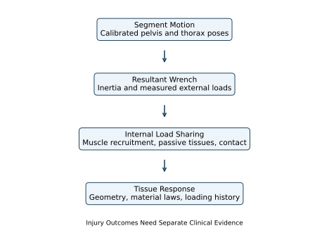

# Modeling the Spine: Motion, Load, and Evidence {#sec-spine_modeling}
[]{#ch-spine_modeling}

::: {.callout-tip}
## One Swing, Several Different Questions

[]{#intro:spine}
A golfer can reproduce a similar shoulder turn with different distributions of motion, muscle activity and spinal loading. A video may resolve the large-scale motion well while leaving those internal differences uncertain. The purpose of a spine model is to make the connection explicit: which parts move, which forces produce that motion, how those forces are shared, and what evidence tests the calculation.

The spine participates in a coupled system that includes the pelvis, rib cage, abdominal wall, head, limbs and club. It transmits forces and moments, deforms, stores and dissipates mechanical energy, and receives active muscle forces. None of those roles alone establishes an efficient swing or predicts pain. This chapter develops the mechanics needed to investigate them together, from measured segment orientations to multibody dynamics and tissue-level questions.
:::

## Why the Spine Matters for Golf
[]{#sec-spine_importance}

### The Mechanical Link
The pelvis and thorax interact through several anatomical load paths: vertebral structures, muscles spanning multiple levels, fascia, and the pressurized abdominal wall. A model that represents their interaction by one joint wrench aggregates those paths. It does not show that every joule arriving at the club passed through one disc, or that the legs generated all the energy later present in the upper body.

For a chosen body or subsystem, linear momentum changes according to its external forces and angular momentum according to its external moments about a fixed inertial point or the subsystem center of mass. An arbitrary accelerating reference point requires the corresponding transport terms. Internal muscle and joint forces redistribute momentum within the whole golfer–club system. They do not generate its total angular momentum without a compensating exchange. Ground contact can supply an external moment even when a stationary contact point does no mechanical work. Muscle work can occur throughout the body. Thus a sequence of segment-speed peaks is a useful kinematic observation, but it is not by itself a measurement of energy transferred along an anatomical chain.

At an interface point $O$, the instantaneous power delivered to a rigid segment is

$$
P_O=\bm F\cdot\bm v_O+\bm M_O\cdot\bm\omega.
$$
Force, moment, velocity and angular velocity must refer to the same frame and compatible points. Across a compliant connection, the two endpoint velocities can differ; the signed sum of powers delivered into the connection contributes to stored energy, dissipation and any active work inside it. Deformation is therefore not synonymous with lost power.

### What the X-Factor Measures

[]{#the-x-factor-depends-on-spinal-motion}
An X-factor is a declared measure of pelvis–upper-trunk separation. A difference between projected shoulder and hip lines is not generally the same as a three-dimensional relative axial angle. A shoulder-line marker set can also move relative to the rib cage through scapular motion and soft-tissue artifact. Report the segment definitions, projections, rotation sequence and sign convention before interpreting its magnitude.

If $R_{WP}$ and $R_{WT}$ map pelvis and thorax coordinates into a common world frame, the relative orientation is

$$
R_{PT}=R_{WP}^{T}R_{WT}.
$$
This describes the thorax relative to the pelvis, without yet assigning motion to individual vertebrae. Cervical motion changes the head relative to the thorax; it cannot be added as a source of this pelvis–thorax relative rotation. Similarly, a global change in thorax orientation can include pelvic rotation. Subtracting loosely defined rotation magnitudes does not separate these contributions.

Increasing separation may change muscle lengths, tissue deformation, moment arms and feasible future motion. Whether it improves club delivery, changes spinal load or aggravates symptoms requires additional information. There is no universal target angle implied by the definition.

### Pain and Injury Statistics Need Denominators

[]{#spine-injuries-in-golf-are-the-most-common}

Low-back problems are a substantial concern in golf, but the proportion of injuries affecting the back is different from the proportion of golfers with pain. A retrospective survey of 1,634 Australian amateur golfers reported that 17.6% had sustained at least one golf-related injury in the preceding year; the lower back accounted for 25% of reported injuries  [@McHardy2007BackSurvey]. A separate one-year prospective survey of 588 amateurs reported 15.8 injuries per 100 golfers, with the lower back comprising 18.3% of injury sites  [@McHardy2007Prospective]. These results do not establish that half of all golfers have chronic spinal injury.

A history of pain, an imaging finding, a modeled load and a diagnosed injury are different observations. A person may change a swing because of pain, so an association between movement and pain does not by itself establish which came first. Mechanical models help formulate testable explanations; prospective observation and appropriate clinical outcomes are needed to evaluate injury-related predictions.

## Anatomy and the Model Boundary

[]{#anatomy-of-the-spinethe-hardware}
[]{#sec-spine_anatomy}

### Vertebrae, Articulations, and Discs

[]{#the-33-vertebrae}
The usual description has seven cervical, twelve thoracic and five lumbar vertebrae above the sacrum. The sacrum ordinarily comprises five fused elements; the coccygeal count and degree of fusion vary. The familiar developmental count of about 33 is not a count of 33 independently moving adult joints. The atlas has no vertebral body, and upper-cervical articulations differ from typical disc-bearing levels  [@OpenStax2022VertebralColumn].

In typical anatomy there are 23 intervertebral discs, from C2–C3 through L5–S1. There is no disc between the skull and atlas or between atlas and axis. A model must list its actual connections: L1 through L5 supplies four internal lumbar intervertebral levels; including L5–S1 gives five, and adding T12–L1 gives six. Counts depend on the endpoints. An articulated chain with a fixed base and $n$ modeled three-rotation joints has $3n$ configuration coordinates; using compliant six-coordinate connections gives a different model. A floating base adds its own coordinates and constraints.

### Structures Carry Different Loads

[]{#the-vertebra-basic-structure}
A typical vertebra has a body, pedicles, laminae and processes. Intervertebral discs join neighboring bodies; paired facet articulations and their capsules provide posterior contact and restraint. Endplates, discs, facets and ligaments share loads according to geometry, deformation and contact state. Their contributions cannot be assigned from the net joint moment alone. The rib cage also alters thoracic mechanics; a model without it requires a correspondingly limited interpretation.

### The Intervertebral Disc

The nucleus pulposus, annulus fibrosus and endplates form a heterogeneous, hydrated structure. The annulus has alternating collagen-fiber families rather than a universal single fiber angle. Microscopy documents spatial gradients in lamellar organization  [@Cassidy1989DiscStructure]. The angle must be stated relative to its reference plane or axis; an angle measured from a transverse plane is not the same angle measured from the spine's long axis.

A water-rich nucleus is not mechanically identical to a volume of pure water. Experiments show time-dependent shear behavior, including different responses in stress relaxation and dynamic loading  [@Iatridis1997NucleusShear]. Whole-disc response additionally depends on the surrounding matrix, annular restraint, fluid transport, swelling and endplate conditions. An elastic spring can approximate a specified operating range; it does not reproduce all those mechanisms. A viscoelastic or poroelastic model needs internal states or a history law if loading duration and recovery matter.

### Ligaments and Contact

[]{#ligaments}
Ligaments provide passive tensile restraint, while facet contact is unilateral: a surface can push when engaged but cannot pull another surface through a gap. Different ligaments have different attachments, slack lengths and prestrain. It is inaccurate to assume that every ligament is slack in every neutral posture. The anterior longitudinal ligament resists extension; posterior structures contribute to restraint in flexion, with load sharing depending on posture and level  [@OpenStax2022VertebralColumn].

The activation of a muscle is a different mechanism. A balanced pair of active muscles can exert little net joint moment while still producing substantial compression and stiffness. A small net moment does not mean the connection is passive or unloaded.

### Curvature, Posture, and Hip Flexion

[]{#the-s-shaped-curve}

Lordosis and kyphosis describe anatomical sagittal curvatures. They should not be confused with the differential-geometric curvature of a configuration-space metric. Changes in posture affect lever arms, muscle lengths and contact, but a visible spinal curve does not directly determine tissue stress.

Forward inclination at address can combine hip flexion, pelvic tilt and regional spinal motion. Hip flexion is relative motion between pelvis and femur; lumbar flexion is relative motion within a specified spinal region. They are not numerically interchangeable. Report these separately rather than converting a global trunk inclination into an assumed lumbar deformation. Neither a drawing of a neutral posture nor a universal flexion cutoff supplies a clinical safety boundary.

On narrow screens, scroll the figure or [open it at full size](../figures/spine_evidence_model.svg).

::: {#fig-spine_segment}
::: {.aba-diagram-scroll role="region" aria-label="Spine model evidence; scroll horizontally" tabindex="0"}

:::

From Motion to Tissue Response: Each Stage Requires Its Own Evidence. A Single Measured Shoulder Turn Does Not Identify Every Internal Load.
:::

## Motion Segments and Measured Mobility

[]{#the-motion-segmenta-six-dof-joint}
[]{#sec-motion_segment}

### Three Rotations and Three Translations

[]{#three-translational-dof}

[]{#three-rotational-dof}
A typical functional spinal unit contains two adjacent vertebrae and their connecting disc, ligaments and facet articulations. Their relative rigid-body pose has three rotational and three translational components. Those six components are not six unrestrained, independently actuated motions: stiffness, contact, loading and neighboring anatomy govern their response.

For this chapter use right-handed axes $x$ anterior, $y$ left and $z$ superior in a declared local reference posture. Flexion–extension is associated with rotation about a mediolateral axis, lateral bending with an anteroposterior axis, and axial rotation with a superior–inferior axis. A motion occurring in a sagittal plane rotates about an axis normal to that plane; naming the plane as the rotation axis creates a convention error. Once the segment tilts, its local superior axis need not coincide with world vertical.

Anterior–posterior translation is along the local anterior direction, not along the spinal long axis. Compression and distraction concern the local axial component. Small translations can matter for contact, disc strain and load sharing even when they have little effect on a coarse reconstruction of shoulder turn. Omitting them is a task-dependent approximation, not a consequence of their being unimportant mechanically.

### Range of Motion Is a Test Result

[]{#range-of-motion-varies-dramatically-by-level}

A range-of-motion value requires a level or region, reference posture, direction, applied load, preload and measurement method. One-sided excursion from a reference differs from total excursion between opposite endpoints. Passive cadaveric loading, voluntary in-vivo movement and a particular golf swing are different experiments.

For example, Wilke and colleagues tested 68 isolated thoracic functional units using pure moments of $\pm7.5\,\mathrm{N\,m}$, with short rib remnants and no axial preload. Reported mean one-sided axial rotations included $5.9^{\circ}$ at T6–T7 and $3.3^{\circ}$ at T11–T12  [@Wilke2017ThoracicFlexibility]. These observations expose the error in assigning $20$–$30^{\circ}$ to every thoracic level. They are not individual golfer limits, and the preparation does not represent an intact loaded rib cage.

For coaxial rotations about the same fixed axis, signed angles add. For general spatial rotations, regional orientation is a product,

$$
R_{0n}=R_{01}R_{12}\cdots R_{n-1,n}.
$$
Adding independently measured maximum excursions may combine incompatible postures and loading conditions. Even if a scalar sum is a useful approximation for a particular test, its assumptions must be stated. A model result outside an expected range is a prompt to examine calibration, conventions and evidence, not an automatic diagnosis or a proof of anatomical impossibility.

## Coordinate Coupling and Physical Coupling

[]{#the-flexion-rotation-coupling-problem}
[]{#sec-flexion_rotation_coupling}

### A Tilted Axis Changes Components

[]{#single-segment-the-local-frame-problem}

[]{#the-problem-stated-simply}
Let $R$ map local vector components into the world frame. Angular velocity components satisfy $\bm\omega_b=R^T\bm\omega_W$. For a segment tilted by $\phi$ about $y$, take $R=R_y(\phi)$. A world-vertical angular velocity $\bm\omega_W=\Omega\bm e_z$ then has local components

$$
\bm\omega_b=\Omega(-\sin\phi,\,0,\,\cos\phi)^T.
$$
At $\phi=30^{\circ}$ and $\Omega=4\,\mathrm{rad/s}$ these are $(-2,0,2\sqrt3)\,\mathrm{rad/s}$. The local anteroposterior component appears because the local frame is tilted. This identity does not require a ligament, an intervertebral coupling law or an additional physical rotation imposed by anatomy. It is one vector described in two frames.

Actual anatomical coupling is a different question: for a declared applied wrench and constraints, which relative motions occur? A local linear compliance relation might be $\delta\bm\eta=C\,\delta\bm m$. Off-diagonal entries describe coupled response in those coordinates. A single projected angle cannot identify that matrix. Coupling can also arise through the whole-body inertia, other joint loads and contact changes.

### Euler Products Must Match the Stated Sequence

[]{#mathematical-formulation-euler-angles}
Use active right-handed matrices and column vectors. As a coordinate chart, define

$$
R=R_z(\alpha)R_y(\beta)R_x(\gamma).
$$
This is the product for successive rotations about fixed $x$, fixed $y$ and fixed $z$ axes, applied in that order. Equivalently it can describe moving-axis rotations in the reversed axis order. It is not the product for successively rotating about moving $x$, moving $y$, then moving $z$ axes. Here $\beta$ coincides with positive forward flexion only in the corresponding reference configuration; the chart labels are not three universal anatomical hinges.

Writing $c_a=\cos\alpha$, $s_a=\sin\alpha$, and similarly for $\beta,\gamma$, multiplication gives
[]{#eq-euler_angles}

$$
R=\begin{bmatrix}
c_a c_b & c_a s_b s_g-s_a c_g & c_a s_b c_g+s_a s_g\\
s_a c_b & s_a s_b s_g+c_a c_g & s_a s_b c_g-c_a s_g\\
-s_b & c_b s_g & c_b c_g
\end{bmatrix}.
$$
All three angles are represented, although not every entry depends on every angle. Differentiating the product and using $\widehat{\bm\omega_b}=R^T\dot R$ gives

$$
\bm\omega_b=
\begin{bmatrix}
1&0&-\sin\beta\\
0&\cos\gamma&\sin\gamma\cos\beta\\
0&-\sin\gamma&\cos\gamma\cos\beta
\end{bmatrix}
\begin{bmatrix}\dot\gamma\\\dot\beta\\\dot\alpha\end{bmatrix}
=E\dot{\bm q}_e.
$$
Thus Euler-angle rates are not generally angular-velocity components. Since $\det E=\cos\beta$, this chart becomes singular at $\beta=\pm\pi/2$. The orientation and physical angular velocity can remain regular there. A different chart, rotation matrix or unit quaternion can represent the motion; constraints and double covering must still be handled correctly.

### Moments and Generalized Torques Transform Together

[]{#from-local-to-global-coordinates}
Power invariance supplies the conjugate generalized load:

$$
\bm m_b^T\bm\omega_b=(E^T\bm m_b)^T\dot{\bm q}_e,
\qquad \bm Q_e=E^T\bm m_b.
$$
Using a physical moment component as an Euler generalized torque without this mapping changes the work. A consistent coordinate transformation does not make inverse dynamics physically ambiguous; it changes the components used to describe the same result. Muscle forces remain underdetermined for a separate reason: multiple muscles and passive structures can produce the same resultant.

If a local stiffness law is expressed in Euler coordinates, differentiating $E^T\bm m_b$ introduces derivatives of $E$ as well as the tissue law. A configuration-dependent coordinate matrix can therefore create apparent coupling in the reported tangent stiffness. Comparing stiffness numbers requires the operating load, pose, coordinate definitions and whether the derivative is taken at fixed activation or with feedback operating.

### What Motion Capture Can Identify

[]{#a-practical-resolution}

[]{#the-golf-swing-complication}
An isolated marker provides position, not a complete segment orientation. A noncollinear marker cluster plus calibration can estimate a rigid segment frame, with uncertainty from skin motion and model fit. Pelvis and thorax frames yield $R_{PT}$; recovering every intermediate vertebral pose requires additional measurements or assumptions. Many products of intervertebral rotations give the same endpoint orientation.

There is no single Euler sequence that reveals the historical order in which the anatomy moved. A declared convention makes measurements comparable within its domain. It does not remove missing observations. For a golf investigation, preserve the measured poses, document the decomposition and test conclusions against reasonable alternative calibrations. Distinguish a change of representation from a change in the physical model.

## Choose a Model That Can Answer the Question

[]{#practical-recommendation-choosing-your-model}

[]{#modeling-approachesfrom-simple-to-complex}
[]{#sec-modeling_approaches}

### From Segment Motion to Tissue Deformation

[]{#level-4-finite-element-model}

[]{#level-3-multi-segment-model-individual-vertebrae}

[]{#level-2-three-segment-model-pelvis-lumbar-thoracic}

[]{#level-1-single-rigid-segment-torso-as-one-block}
A rigid thorax connected to a separate pelvis can represent an aggregate trunk rotation. A single rigid body containing both cannot: their relative pose is fixed by construction. Neither model identifies the motion of individual lumbar levels. An aggregate joint is useful for whole-body momentum and club-delivery questions when its geometry and inertial properties adequately represent the task. Its joint torque is a resultant, not the force in a disc.

A model with separate lumbar and thoracic regions allows their contributions to vary and can include bending, twist and translation. Each additional freedom needs an inertia, a constraint or force law, and information to identify its state. More segments do not automatically supply those data. If only pelvis and thorax motion are observed, adding intermediate joints may create multiple equally plausible distributions of motion and load.

A vertebral chain exposes level-specific joint reactions and muscle moment arms. Its joint count follows the included interfaces: L1 through L5 supplies four internal interfaces, adding the sacrum supplies L5–S1, and adding T12 supplies T12–L1. The chosen fixed base, floating base, rotational joints and translational constraints determine the number of generalized coordinates. An anatomical count alone does not establish the model's degrees of freedom.

A finite element model resolves deformation within discs, vertebrae, ligaments or cartilage. It can estimate spatial stress and strain given boundary conditions, contact laws and constitutive properties. It cannot repair an incorrect applied load or an unidentified material law. Mesh convergence addresses discretization error; agreement with independent measurements addresses a different question. A detailed model with uncertain loading can give precise-looking stress maps with large physical uncertainty.

The useful hierarchy is therefore a sequence of questions: Does the model reproduce measured motion? Does it satisfy the measured external wrench balance? Are muscle and contact-force estimates supported? Are local deformation and material laws validated for the loading regime? Does any proposed injury relationship have separate clinical evidence? Success at one step does not establish all later steps.

### A Coupled Equation for the Golfer and Club
For independent joint coordinates $\bm q$ in a nonsingular chart, consider a fixed, ideal contact mode:

$$
M(\bm q)\ddot{\bm q}+\bm c(\bm q,\dot{\bm q})
+\nabla_{\bm q}\bigl(V_g(\bm q)+U(\bm q)\bigr)
=B(\bm q)\bm\tau-D(\bm q)\dot{\bm q}+J_c^T\bm\lambda.
$$
Here $M$ is the coupled mass matrix; $\bm c$ contains velocity-dependent inertial terms; $V_g$ and $U$ are gravitational and passive elastic potentials; $B\bm\tau$ is the generalized active load; and $D$ is a positive semidefinite damping matrix. The contact multiplier $\bm\lambda$ and acceleration must satisfy the constraint equations together. Applied club, ground or apparatus loads belong in the appropriate generalized-force terms if they are not already represented by included bodies and contacts. Do not count them twice.

The equation makes an important connection visible. Changing a hip or arm torque can change spinal acceleration through $M^{-1}$, even if no spine torque changes. Changing posture also changes inertia, moment arms, gravity, passive forces and contact geometry. A collection of uncoupled scalar springs cannot represent all those effects. Conversely, including a coupled mass matrix does not identify the individual muscles that generated a measured resultant.

For quaternion or other redundant orientation coordinates, write $\dot{\bm q}=N(\bm q)\bm v$ and formulate dynamics in generalized velocity $\bm v$. One must then use the corresponding force and energy gradients rather than silently identifying $\bm v$ with $\dot{\bm q}$. For contact impacts, lift-off or slip, the active equations and possibly the state reset change. A smooth equation applies within its stated mode.

### Inverse Dynamics and Internal Load Sharing
Choose a cut through the model and declare which tissues cross it. Measured motion, inertia and external loads can constrain the resultant wrench required across that cut. A simplified axial balance illustrates the remaining ambiguity:

$$
N_{\mathrm{contact}}+N_{\mathrm{muscle}}+N_{\mathrm{ligament}}
=N_{\mathrm{required}},
$$
with each quantity signed in the same free-body convention. Muscle forces also contribute moments through their attachment geometry. A joint reaction from one software model may include or exclude explicit muscle, disc or constraint forces differently from another. Compare definitions before comparing numbers.

For an illustrative antagonist pair with equal moment-arm magnitude $r$, the net moment is $\tau=r(F_+-F_-)$. Increasing both tensions by $\Delta F$ leaves that moment unchanged. If both have compressive components at the joint, the compression increases. Thus identical motion and net moment can coexist with different internal loads. EMG, muscle geometry, recruitment criteria and physiological constraints can narrow the possibilities; none should be hidden inside an unexplained “joint force.”

## Spinal Loads and Injury Evidence

[]{#spinal-loading-during-the-golf-swing}
[]{#sec-spinal_loading}

### Measured Inputs and Modeled Contact Forces

[]{#why-the-transition-is-most-dangerous}

[]{#peak-spinal-loads-during-downswing}
Lim, Chow and Chae studied five male collegiate golfers using an EMG-assisted optimization model. Their estimated L4–L5 mean peak compression exceeded six body weights during the downswing; reported shear peaks occurred during follow-through. These are model-based internal contact estimates informed by measurements, not forces measured by an instrument inside the disc. The participant group, recruitment assumptions, modeled level and definition of peak all matter.  [@Lim2012LumbarLoads]

The peak of an ensemble-average waveform need not equal the average of individual peaks: individual maxima can occur at different times. An anterior shear peak, a compression peak and a torsional-moment peak also need not coincide. Reporting only the largest absolute value discards sign, timing and concurrent loads. For transition, early downswing and follow-through, compare complete time histories with uncertainty and a common phase definition. No universal “most dangerous phase” follows from one model's largest force.

Body-weight normalization is useful for reporting scale, but it is not a tissue-strength criterion. For an illustrative $75\,\mathrm{kg}$ person with $g=9.81\,\mathrm{m/s^2}$, eight body weights correspond to $5886\,\mathrm{N}$. Dividing by an assumed $1800\,\mathrm{mm^2}$ area gives a mean normal traction magnitude:

$$
\frac{N}{A}=\frac{5886\,\mathrm{N}}{1800\,\mathrm{mm^2}}
=3.27\,\mathrm{MPa}.
$$
The area and load here are teaching inputs, not an anatomical measurement or a safe-load recommendation. This quotient cannot locate the peak annular stress, partition disc and facet load, or determine whether a golfer will develop pain.

### Normal and Shear Stress Are Different Tensor Components

[]{#types-of-spinal-loading}
Consider a homogeneous circular beam only to clarify the mechanics. Let $z$ run along the beam, $x,y$ be principal centroidal cross-section axes, and $N>0$ denote compression. With bending moments defined by the traction moment on the positive-$z$ face,

$$
\sigma_{zz}(x,y)=-\frac{N}{A}
+\frac{M_x y}{I_x}-\frac{M_y x}{I_y}.
$$
For Saint-Venant torsion of this circular beam,

$$
\sigma_{xz}=-\frac{T y}{J},\qquad
\sigma_{yz}=\frac{T x}{J},\qquad J=I_x+I_y.
$$
The normal and shear components act in different directions. Their signs depend on the declared face and axis conventions. They must enter a stress tensor and the traction relation $\bm t=\boldsymbol\sigma\bm n$; adding their scalar magnitudes does not produce a general “total disc stress.” Transverse shear from a net transverse force would require additional terms, and these circular-beam torsion equations are not formulas for an arbitrary cross-section.

A two-dimensional example makes the distinction concrete. If the nonzero components are a normal stress $\sigma$ and shear stress $s$, the matrix

$$
\begin{bmatrix}\sigma&s\\s&0\end{bmatrix}
$$
has principal stresses

$$
\sigma_{1,2}=\frac{\sigma}{2}
\pm\sqrt{\left(\frac{\sigma}{2}\right)^2+s^2}.
$$
These follow from its eigenvalues, not from $\sigma+s$. Even a correctly computed isotropic equivalent stress would not establish failure of an anisotropic, hydrated, heterogeneous disc. Fiber direction, matrix behavior, fluid transport, endplates, degeneration and loading history require their own constitutive description and evidence.

### Loading, Damage and Pain Require Separate Evidence

[]{#the-disc-herniation-mechanism}

Cadaver experiments by Adams and Hutton produced different lesions under compression and flexion depending on the loading conditions and disc degeneration. They help investigate mechanisms under controlled conditions; they do not supply a universal human golf-swing failure threshold.  [@Adams1982ProlapsedDisc]

An inferred high contact force is not a diagnosis of herniation, and pain is not a direct readout of one stress component. An injury argument needs a specified outcome, exposure duration and repetition, participant characteristics, competing explanations, and a study design that can test the proposed relationship. Cross-sectional differences between people with and without pain can reflect causes, consequences or adaptations. A model can generate a testable hypothesis about tissue loading without claiming that its preferred swing prevents injury.

This distinction strengthens the golf investigation. Instead of declaring a particular X-factor harmful, ask whether a change in the measured movement alters a validated load estimate under comparable club delivery, whether that result survives uncertainty in muscle recruitment and tissue properties, and whether the relevant exposure predicts the stated outcome in independent observations. Each link can succeed or fail separately.

## Elasticity, Active Stiffness and the Drift Field

[]{#the-spine-in-the-drift-field}
[]{#sec-spine_drift}

### A Passive Chain Does Not Create Extra Torque

[]{#intervertebral-disc-stiffness}

Take $n$ coaxial, linear torsional springs in series, with positive stiffnesses $k_i$, no intermediate applied moments and negligible intermediate acceleration. The same moment $\tau$ passes through each spring, so

$$
\theta_i=\frac{\tau}{k_i},\qquad
\Theta=\sum_i\theta_i,\qquad
k_{\mathrm{eq}}=\left(\sum_i\frac{1}{k_i}\right)^{-1}.
$$
Thus $\tau=k_{\mathrm{eq}}\Theta$. Adding an identical spring in series decreases the equivalent stiffness. At a fixed total angle it decreases the moment and stored energy. At a fixed applied moment it increases the total deflection and energy. Specifying what is held fixed resolves the apparent contradiction.

Angles in an energy calculation must be in radians. Consider five springs, each with stiffness $12\,\mathrm{N\,m/degree}$. Their combined stiffness is $k_{\mathrm{eq}}=2.4\,\mathrm{N\,m/degree}$. At a total angle of $20^\circ$, the moment is $48\,\mathrm{N\,m}$ and

$$
U_{\mathrm{total}}=\frac12\tau\Theta
=\frac12(48\,\mathrm{N\,m})\frac{20\pi}{180}
\approx8.38\,\mathrm{J}.
$$
These are synthetic teaching values. Real spinal joints have nonlinear, coupled responses; muscles can bridge several levels, facets can engage, and intersegmental inertia makes transmitted moments differ. The series result is a limiting example, not a method for multiplying a regional range of motion into an energy reserve.

### A Ligament Law Must Define Length and Units

[]{#ligament-resistance}

One illustrative tension-only law uses current length $L$, slack length $L_0$ and $k$ with units $\mathrm{N/m^2}$:

$$
F(L)=\begin{cases}
0,&L\le L_0,\\
k(L-L_0)^2,&L>L_0.
\end{cases}
$$
The continuous potential is

$$
U_L(L)=\frac{k}{3}\bigl[\max(L-L_0,0)\bigr]^3,
\qquad \bm Q_L=-F(L)\nabla_{\bm q}L.
$$
The second relation includes the geometry that converts tension to generalized load. If strain is used instead, its dimensionless definition and the coefficient's units must change consistently. A neutral joint pose does not imply every ligament is at its slack length; prestrain can produce tension there. The quadratic law illustrates a conservative nonlinear spring and omits hysteresis, damage and rate dependence. Those effects need additional state or constitutive terms.

### Changing Stiffness Can Require Mechanical Work

[]{#the-x-factor-stretch-in-the-drift-framework}

[]{#muscle-tone-and-co-contraction}

For a one-coordinate example, let

$$
U(\theta,t)=\tfrac12 k(t)\bigl(\theta-\theta_0(t)\bigr)^2,
\qquad \delta=\theta-\theta_0(t).
$$
With constant inertia $I$, applied torque $\tau_u$, and damping coefficient $d\ge0$, suppose

$$
I\ddot\theta=\tau_u-d\dot\theta-k\delta.
$$
For mechanical energy $E=\tfrac12I\dot\theta^2+U$, differentiation gives

$$
\dot E=\tau_u\dot\theta-d\dot\theta^2
+\tfrac12\dot k\,\delta^2-k\delta\dot\theta_0.
$$
Changing stiffness or equilibrium angle can therefore add or remove mechanical energy. For example, holding a nonzero deformation fixed while increasing $k$ increases stored energy; the mechanism changing stiffness supplies that energy. This is not free concentration of an unchanged energy store. Nor does simultaneous acceleration of adjacent segments necessarily dissipate energy: dissipation is associated with the relevant constitutive losses, such as $d\dot\theta^2$, not with acceleration itself.

Active muscle tension, short-range mechanical response, activation dynamics and feedback can all affect an estimated joint stiffness. Co-contraction can change stability, stiffness and compression together. Calling it entirely passive hides the maintained activation and its physiological cost. A mechanical energy equation also does not measure metabolic expenditure. These distinctions matter when comparing a golfer who stiffens the trunk with one who changes timing: a similar endpoint motion may arise from different force, energy and control histories.

### Gravity and Elastic Return Have Signed Contributions
An elastic restoring moment is $-\partial U/\partial\theta$, not an unsigned amount that always helps the downswing. Gravity contributes $-\partial V_g/\partial\theta$. Depending on pose, the two can reinforce or oppose one another, and their power depends on the sign of velocity. In a planar illustration, let $\theta$ be a mass's angle from the downward vertical, with center-of-mass distance $\ell$. Then

$$
V_g=-mg\ell\cos\theta,\qquad
\tau_g=-mg\ell\sin\theta.
$$
For a spring centered at zero, $\tau_e=-k\theta$. At a positive angle both moments point toward zero; if the angle is increasing, both have negative mechanical power. Their magnitudes alone do not identify energy transfer into the club. A full model must also include coupled motions and moving attachment points.

### Define the Zero Input Before Computing Drift

[]{#the-spinal-drift-field}
For a free, independent-coordinate model with fixed passive properties, let $\bm x=(\bm q,\bm v)$ and $\bm v=\dot{\bm q}$. Within a smooth mode,

$$
\dot{\bm x}=
\underbrace{\begin{bmatrix}
\bm v\\
M^{-1}(-\bm c-\nabla V-D\bm v)
\end{bmatrix}}_{\bm f(\bm x)}
+\underbrace{\begin{bmatrix}0\\M^{-1}B\end{bmatrix}}_{G(\bm x)}\bm\tau,
\qquad V=V_g+U.
$$
The drift is a state-velocity field. A torque expression alone has the wrong units and omits both the kinematic component and the inverse inertia. In a constrained mode, eliminate or solve the contact reaction consistently for both drift and controlled dynamics; simply deleting $J_c^T\bm\lambda$ changes the physical problem.

If muscle excitation is the input, include activation and other force-generating states. Zero excitation need not mean zero activation or immediate disappearance of muscle force. If stiffness or reference posture is commanded, their evolution and the associated work belong in the model. The same physical behavior can be split differently into drift and input after shifting the reference control. Consequently, a “passive percentage” is not established merely by assigning co-contraction to $\bm f$.

For a golf counterfactual, state which inputs become zero, which contacts remain, and which initial muscle, shaft and tissue states are retained. Compare forward trajectories over a declared interval. Removing an instantaneous torque term at one recorded posture does not by itself predict the subsequent delivery or the subsequent spinal load.

### Abdominal Pressure Requires a Free-Body Diagram
Pressure acts through distributed surface traction. On a chosen surface $S$ with consistent normal convention, the pressure-force and moment contributions involve

$$
\bm F_p=\int_S p\bm n\,dA,\qquad
\bm M_{p,O}=\int_S(\bm r-\bm r_O)\times p\bm n\,dA.
$$
Uniform pressure on a closed surface has zero net force and moment, although a portion of that surface can experience a nonzero resultant. The choice of subsystem is therefore essential. Multiplying pressure by one projected area computes one contribution under stated geometry; it does not automatically give the change in spinal compression. Abdominal wall tension and the forces needed to generate pressure must satisfy the same equilibrium.

Hodges and colleagues used artificial diaphragm stimulation to measure a trunk extension moment associated with pressure under controlled laboratory conditions. Stokes and colleagues modeled pressure together with curved abdominal wall muscles and recruitment optimization, predicting unloading under their specified static conditions. The latter authors also discuss limitations of optimized muscle recruitment. Neither result establishes that a particular breath during a dynamic golf swing reduces an individual's disc load.  [@Hodges2001IAPMoment; @Stokes2010AbdominalPressure]

The mechanical question is useful without a breathing prescription: when pressure changes, how do muscle forces, trunk moment, contact reactions and stiffness change together under the actual task constraints? A model that includes only the apparent extension moment and omits its muscular support cannot answer that question.

## A Reproducible Spine Investigation in Golf

[]{#red-flags-when-your-model-is-wrong}

[]{#for-injury-risk-assessment}

[]{#for-swing-mechanics-research}

[]{#for-coaching-and-teaching}

[]{#practical-recommendations-for-golf-swing-modeling}
[]{#sec-practical_recommendations}

Start with a stated comparison. For example: does redistributing relative motion between modeled lumbar and thoracic joints change estimated lumbar contact load while preserving a specified club-delivery task? Define the delivery tolerances, participant population, measured coordinates, phase events and load outputs before optimizing a movement. Otherwise a lower load may simply accompany a slower or different swing.

Measure and retain the quantities needed for the model: calibrated segment poses, external ground and club interactions, timing and, where relevant, EMG with its processing and normalization. Document sampling, filtering and differentiation because acceleration estimates and inverse dynamics depend on them. Check whole-body force and moment balance before interpreting a level-specific internal force. A successful fit to thorax markers is not validation of every vertebral motion.

Use the simplest model that resolves the proposed mechanism, then test sensitivity to added degrees of freedom and uncertain parameters. Compare plausible muscle recruitment, joint stiffness, attachment geometry, anthropometry and contact assumptions. If the sign of a proposed improvement changes across reasonable choices, report that dependence. Increasing model detail is valuable when new data constrain it or it changes a validated prediction, not because a larger model must be more accurate.

Separate calibration from evaluation. Fit parameters on one set of observations and assess predictions on independent trials or participants appropriate to the intended claim. Report errors in the actual measured outputs; do not invent a blanket accuracy percentage for a model class. Internal contact and tissue stress remain conditional estimates unless the corresponding quantities have independent validation. Any proposed clinical benefit requires outcome evidence beyond a mechanical simulation.

The resulting account can connect the swing's components without reducing them to one ideal angle. Preparation establishes posture, activation and elastic state. Ground interaction, muscle action and coupled inertia shape the subsequent motion. That motion changes force directions and moment arms; muscle recruitment and passive structures partition the required wrench. Tissue properties and history govern local deformation. The club-delivery objective constrains which alternatives are comparable. A rigorous explanation follows these links, names the assumptions at each one, and shows which conclusions survive uncertainty.

The muscle-force model in [the muscle-force chapter](ch17_muscle_force_generation.qmd) and the closed-chain mechanics in [the parallel-mechanisms chapter](ch09_parallel_mechanisms.qmd) supply complementary details about force generation and constraints. [The complete-swing chapter](ch14_complete_swing.qmd) connects these mechanisms to preparation, delivery and outcome across the complete swing.

## Chapter Exercises
1. **Joint Count.** A chain contains rigid T12, L1–L5 and sacrum bodies, with the sacrum fixed. Count adjacent interfaces. Determine the configuration dimension if each interface is an ideal three-rotation joint, and if instead each allows six independent relative motions. Explain why neither is an anatomical claim that all those motions are equally free.

1. **Tilted Spin.** For $R=R_y(\phi)$ and $\bm\omega_W=\Omega\bm e_z$, derive $\bm\omega_b$. Evaluate it for $\phi=30^\circ$ and $\Omega=4\,\mathrm{rad/s}$. Show that its norm is unchanged, and explain why the nonzero local $x$ component does not identify a tissue compliance coefficient.

1. **Euler Kinematics and Power.** Derive the displayed matrix $E$ from $R_z(\alpha)R_y(\beta)R_x(\gamma)$. Verify numerically at a nonsingular nonzero pose that $\bm m_b^T\bm\omega_b=(E^T\bm m_b)^T\dot{\bm q}_e$. What fails at $\beta=\pi/2$, and what physical quantity remains well defined?

1. **Finite Rotation Composition.** Compare $R_x(30^\circ)R_y(20^\circ)$ with the reversed product. Compute their action on $\bm e_z$. Explain why summing maximal regional angles cannot generally predict a thorax orientation.

1. **Load and Mean Traction.** Reproduce the $75\,\mathrm{kg}$, eight-body-weight, $1800\,\mathrm{mm^2}$ calculation. If the assumed area decreases by 20% at fixed force, what happens to the mean traction magnitude? List the additional information needed to interpret local disc stress and clinical risk.

1. **Stress Components.** For $\sigma=-3\,\mathrm{MPa}$ and $s=1\,\mathrm{MPa}$ in the displayed two-dimensional stress tensor, calculate its principal stresses. Compare them with $\sigma+s$. Explain why neither this tensor nor an isotropic equivalent stress is a validated annular failure law.

1. **Series Compliance.** Derive the equivalent stiffness and stored energy for five identical $12\,\mathrm{N\,m/degree}$ springs at a total $20^\circ$ rotation. Repeat with ten identical springs at the same total rotation, then at the same applied $48\,\mathrm{N\,m}$ moment. State the mechanical assumptions behind the comparison.

1. **Ligament Geometry.** For the tension-only law in this chapter, let $k=2\times10^7\,\mathrm{N/m^2}$, $L_0=0.020\,\mathrm m$, and $L=0.022\,\mathrm m$. Calculate tension, tangent length stiffness and stored energy. If $dL/d\theta=0.010\,\mathrm{m/rad}$, determine the signed generalized elastic moment. These are illustrative parameters.

1. **Controlled Stiffness Work.** Hold $\delta=0.10\,\mathrm{rad}$ fixed while increasing $k$ from $100$ to $200\,\mathrm{N\,m/rad}$. Calculate the change in stored energy. Reconcile the result with zero joint velocity and identify the energy term omitted by treating stiffness changes as free.

1. **Signed Gravity and Spring Moments.** Use the planar convention above with $m=10\,\mathrm{kg}$, $\ell=0.30\,\mathrm m$, $g=9.81\,\mathrm{m/s^2}$, $k=20\,\mathrm{N\,m/rad}$ and $\theta=30^\circ$. Calculate gravity and elastic moments, then their total power for $\dot\theta=+1$ and $-1\,\mathrm{rad/s}$. Explain the energy interpretation.

1. **Muscle Redundancy.** Two ideal antagonists have $r=0.050\,\mathrm m$, tensions $F_+=300\,\mathrm N$ and $F_-=100\,\mathrm N$, and equal compressive projection factors $0.8$. Compute their net moment and combined compressive contribution. Repeat after adding $150\,\mathrm N$ to each tension. What could motion and net-moment measurements alone distinguish?

1. **Pressure and Subsystems.** A uniform $5\,\mathrm{kPa}$ pressure acts on a planar projected area $0.10\,\mathrm{m^2}$. Calculate that surface's force contribution. Explain why the net force on the complete closed surface is zero and why neither result alone gives a $500\,\mathrm N$ reduction in lumbar compression.

1. **Coupled Acceleration.** At an instant in a two-rotation model, take $M=\left[\begin{smallmatrix}2&1\\1&2\end{smallmatrix}\right]\,\mathrm{kg\,m^2}$, zero other generalized loads, and applied torque $\bm\tau=(1,0)^T\,\mathrm{N\,m}$. Find both accelerations. Explain why a zero second torque does not imply zero second acceleration, and state how fixed contact constraints would alter the calculation.

1. **Peak Definitions and Injury Claims.** Two normalized compression histories at three common times are $(2,6,2)$ and $(2,2,6)$ body weights. Compare the peak of their mean history with the mean of their individual peaks. Explain what additional evidence would be required to turn either number into a claim about an injurious phase.

1. **A Testable Swing Comparison.** Design a study or simulation comparing two distributions of trunk motion under matched club delivery. Specify measurements, the input/activation convention, contact assumptions, uncertain parameters, independent validation outputs and the limit of the intended conclusion. Explain how you would report a predicted load reduction that disappears under another plausible muscle-recruitment model.
