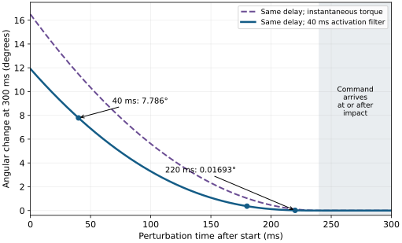
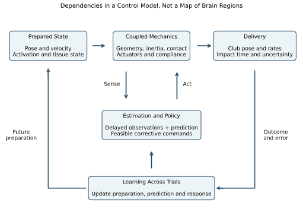

# Motor Control III: The Computational Brain {#sec-26_remarkable_brain}
[]{#ch-remarkable_brain}

::: {.callout-note}
## What This Chapter Is About

[]{#box:ch26_intro}
A golf swing asks the nervous system to prepare a moving body, estimate what it is doing, and influence a club whose delivery depends on the whole evolving system. The interesting question is how those operations cooperate. A successful swing does not show that the brain solved a particular optimization problem, stored a complete physics engine, or stopped using feedback near impact.

This chapter connects the control and learning models to mechanics. We will count the variables in an explicitly chosen model, calculate how much time a delayed correction has to act, distinguish drift from energy supply, and examine what stiffness and muscle coordination can accomplish. We will then ask which experiments distinguish competing explanations. Every numerical controller below is an illustrative model, not a measured neural controller or a prescription for grip pressure.

The resulting picture is more useful than a contest between conscious control and passive physics. Preparation changes the state from which the swing develops; mechanics changes the consequences of commands; prediction helps interpret delayed observations; feedback can alter the remaining trajectory; learning changes future preparation and responses. Each contribution has limits that can be investigated.
:::

## The Scale of the Problem the Brain Solves {#the-scale-of-the-problem-the-brain-solves}
[]{#sec-ch26_scale}

### The Dimensionality of the System {#the-dimensionality-of-the-system}
[]{#subsec-ch26_dimensionality}

Start by distinguishing a body from a model of that body. A coordinate count depends on which segments, joint motions, contacts and flexible modes the model retains. A shoulder represented by a ball joint has three rotational coordinates; a restricted two-axis shoulder is a different approximation. Two hands holding one club form a closed chain, and fixed-foot contact further restricts feasible motion. The club's pose is not an additional set of independent coordinates if those same coordinates have already been determined by the hands and shaft model.

Let $\bm q$ describe a configuration, $\bm v$ its independent generalized velocity, $\bm a$ muscle activation, and $\bm z$ additional tissue or actuator state. Flexible coordinates and their velocities must also be retained when their history affects delivery. A possible state is $\bm x=(\bm q,\bm v,\bm a,\bm z)$. Its precise dimension follows from a declared model and constraint rank, not from counting named body parts. Orientation coordinates may be redundant even when the physical velocity dimension is minimal.

A count that mixes bilateral joints with aggregate trunk or lower-limb coordinates is incomplete until each coordinate and constraint is specified. A defensible report supplies the actual joints, axes, constraints and retained states so that another reader can reproduce the count.

::: {.callout-important}
## Count Schedules, Dimensions and Feasible Motions Separately

[]{#box:ch26_numbers}
Suppose, purely for a combinatorial illustration, that a controller chooses among seven command levels for each of 200 channels over 30 intervals. The number of discrete command schedules is

$$
N=(7^{200})^{30}=7^{6000},\qquad
\log_{10}N=6000\log_{10}7\approx5070.58824.
$$

There are $6000$ scalar command entries, not $10^{5070}$ dimensions. The continuous command cube would be $[0,1]^{6000}$; at one instant it is $[0,1]^{200}$, a set with a boundary and corners. Neither number is an empirical count of neural commands or distinct successful swings. Activation dynamics, force limits, collisions and contacts make many schedules infeasible, and different schedules can produce indistinguishable observations.

Thirty 10ms intervals cover 300ms; a trajectory sampled at both endpoints has 31 sample instants. Selecting a numerical discretization does not establish a 100Hz neural clock. Evaluating every schedule at one nanosecond each would take approximately $10^{5061.58824}$ seconds. This illustrates why that particular enumeration is impractical, not why all other solution methods are impossible.
:::

### Constraints Reduce the Space {#constraints-reduce-the-space}
[]{#subsec-ch26_constraints}

A smooth parameterization, a learned policy and a physical constraint simplify different parts of a problem. Five coefficients at each of 30 intervals, each with seven levels, give $7^{150}$ schedules, with logarithm $126.76471$. Five unconstrained cubic time functions have 20 coefficients before boundary conditions, amplitude bounds and shared timing are imposed. These are alternative parameterizations, not equivalent estimates of what the brain stores.

Reducing the number of decision variables can make a numerical search easier while excluding a necessary motion. Conversely, a high-dimensional feedback policy may evaluate quickly after training, without searching over whole trajectories during execution. Learning cost, planning cost, online evaluation cost and physical response time are separate quantities. A large schedule count therefore motivates exploiting structure; it does not identify the structure or demonstrate human optimality.

For golf, the meaningful reduction is tied to the task. A family of motions that preserves clubhead speed but changes face orientation is not redundant for a directional shot. A family that preserves the full delivery state may still differ in balance, contact feasibility, tissue load or repeatability. The chosen outputs and constraints determine which differences can be ignored.

### The Constraint of Time {#the-constraint-of-time}
[]{#subsec-ch26_time_constraint}

Feedback uses information about a state or disturbance to change subsequent action. It need not be conscious, visual, or organized into a sequence of complete serial correction cycles. A continuous delayed loop can have many signals in transit simultaneously. Counting how often the movement duration can be divided by a latency is not a general measure of its control capacity.

::: {.callout-warning}
## Separate Delay, Activation and Remaining Time

[]{#box:ch26_time_constraint}
For a perturbation at $t_p$, let $L$ be the total delay before its corrective command reaches the actuator. Let $T$ be the impact time of the nominal example. Then $T-t_p-L$ is the time available for that command's mechanical effect, if positive. Muscle activation and force development can further attenuate the response during that interval.

A first-order activation time constant is not a dead time. In $T_a\dot a+a=e$, a step in excitation starts changing activation immediately and reaches about 63.2% of its eventual change after $T_a$. Measured latency to an EMG change, force change or detectable movement are different observables. Adding published values for all three may count the same physiological processes more than once.
:::

Primary experiments show why the distinction matters. Pruszynski and colleagues found rapid integration of shoulder and elbow information in arm perturbation tasks, with responses on a timescale of about 50ms [@Pruszynski2011Feedback]. Saunders and Knill found online corrections to virtual-hand perturbations during reaching. Their mean detected latency was 163ms; their analysis estimated a positive detection bias of about 25ms [@Saunders2003Feedback]. These are different tasks, signals and measurements. Neither result supplies a universal downswing latency, but both contradict the premise that fast movement categorically excludes feedback.

## How Prediction, Feedback and Mechanics Cooperate {#how-the-brain-manages-strategies-for-a-bandwidth-limited-controller}
[]{#sec-ch26_strategies}

### A Worked Remaining-Time Calculation

Consider the change in a single rotational coordinate caused by a corrective torque command. The illustrative actuator and rotor satisfy

$$
I\delta\ddot\theta=\tau_m,\qquad
T_a\dot\tau_m+\tau_m=U\,H(t-t_p-L),
$$

where $H$ is the unit step, all perturbation states initially vanish, and the command remains on until $T$. This is a response calculation after a correction has been chosen; it is not a complete feedback policy. Set $h=\max(T-t_p-L,0)$. Integration gives

$$
\delta\theta(T)=\frac{U}{I}
\left[\frac{h^2}{2}-T_a h+T_a^2(1-e^{-h/T_a})\right].
$$

The bracket has units of time squared. For $h\ll T_a$, expansion of the exponential gives $h^3/(6T_a)$ to leading order: activation filtering makes a very late angular correction smaller than the ideal instantaneous-torque result $Uh^2/(2I)$.

Take $T=0.300$s, $L=0.060$s, $T_a=0.040$s, $I=0.050$kg·m$^2$ and $U=0.50$N·m. Perturbations at 40, 180, 220 and 260ms give available times of 200, 60, 20 and 0ms. Their final angular changes are approximately 0.135892, 0.006430, 0.000296 and 0rad, respectively. The first is 7.786 degrees; the third is only 0.01693 degrees. Those differences arise with the same actuator and command amplitude. They are not measured golf corrections.

On narrow screens, scroll the figure or [open it at full size](../figures/brain_correction_window.svg).

::: {#fig-brain_correction_window}
::: {.aba-diagram-scroll role="region" aria-label="brain correction window; scroll horizontally" tabindex="0"}

:::

Remaining Time Changes the Same Command's Effect. The Declared Rotor Model Compares Instantaneous Torque With Activation Filtering After the Same 60ms Delay. These Are Illustrative Responses, Not Measured Golf Data.
:::

This example explains the value of advance preparation without declaring all feedback useless. Early errors can have an appreciable correction window; late errors may have little or none. Mechanical stiffness already present at the time of a disturbance can respond before a newly generated command arrives. A correction that changes final angular velocity may have little effect on final angle, so response capacity must name the output. The real golfer also has coupled coordinates, changing leverage, force bounds, measurement uncertainty and an impact time that may itself shift.

### Predictive Control and Anticipatory Activation {#strategy-4-predictive-control-and-anticipatory-activation}
[]{#subsec-ch26_predictive}

::: {.callout-important}
## Prediction Uses Information Already Available

[]{#box:ch26_anticipatory}
A forward model predicts a future state from a state estimate and a command. An estimator can propagate an old observation using intervening commands to improve feedback despite sensory delay. Prediction cannot reveal an unpredictable disturbance before information about it is available.
:::

For example, a model may propagate $\hat{\bm x}(t-L)$ through $\dot{\bm x}=F(\bm x,\bm u)$ using recorded commands to estimate $\hat{\bm x}(t)$. A discrepancy between predicted and observed signals can then update the estimate. Errors in initial state, activation, contact and the model accumulate during propagation. Replacing the unknown current state with a prediction is therefore useful only together with an account of prediction error.

Anticipatory activation changes the state before an expected event. It shifts work and information requirements earlier; it does not abolish neural conduction or muscle dynamics. A model of advance stabilization must say which muscles or actuators change, how that changes torque and impedance, and what the preparation costs. Neither address posture nor the duration of a pre-shot routine identifies those hidden quantities by itself.

On narrow screens, scroll the figure or [open it at full size](../figures/brain_control_loop.svg).

::: {#fig-brain_control_loop}
::: {.aba-diagram-scroll role="region" aria-label="brain control loop; scroll horizontally" tabindex="0"}

:::

Preparation, Mechanics, Estimation, Feedback and Learning Interact. Within-Trial Responses and Changes Across Trials Must Be Distinguished Experimentally.
:::

### Drift Is a Model Term, Not a Free Actuator {#strategy-1-exploit-driftuse-physics-as-the-primary-actuator}
[]{#subsec-ch26_exploit_drift}

For an input-affine model,

$$
\dot{\bm x}=\bm f(\bm x)+\bm G(\bm x)\bm u,
$$

$\bm f$ is the evolution when the declared input coordinates are zero. If the input is joint torque, this differs from a model whose input is neural excitation and whose state includes nonzero muscle activation. Zero new excitation does not instantly eliminate active force. Contact reactions and tissue forces must be treated consistently with the chosen coordinates and state.

An instantaneous ratio between drift and applied input can describe a trajectory under a declared scaling. It does not prove weak available control, low metabolic cost, or low sensitivity at impact. Linearizing a smooth, fixed-contact model around a nominal trajectory gives

$$
\delta\dot{\bm x}=\bm A(t)\delta\bm x+\bm B(t)\delta\bm u,
$$

$$
\delta\bm y(T)=\bm C_T\bm\Phi(T,0)\delta\bm x_0+
\int_0^T\bm C_T\bm\Phi(T,s)\bm B(s)\delta\bm u(s)\,ds.
$$

Here $\bm\Phi$ propagates perturbations, and $\bm C_T$ maps state changes into the selected delivery outputs. The kernel $\bm C_T\bm\Phi(T,s)\bm B(s)$, together with feasible inputs and their delays, determines first-order influence on those outputs. A norm of $\bm f$ alone omits that propagation and output geometry. Impact-event sensitivity adds a time-shift term when $T$ changes.

An abstract counterexample makes the logical issue explicit. Let $\dot x=c+ax+u$, with $x(0)=0$, $a=10$s$^{-1}$, $c=1$rad/s and $T=0.3$s. The sensitivity of $x(T)$ to a constant input $u$ is $(e^{aT}-1)/a\approx1.90855$s. Near the end, the nominal drift is about 20.0855rad/s. An input of 0.01rad/s is small compared with that drift but still changes the endpoint by about 0.01909rad. Large drift and appreciable input sensitivity coexist. This is a mathematical counterexample, not a proposed golf trajectory.

The [zero-torque counterfactual framework](./ch06_zero_torque_counterfactual.qmd#sec-zero_torque_counterfactual) can test a specified intervention in a golfer model. It must start from the same complete state, define the channels removed, evolve the resulting trajectory and verify that the assumed contacts remain feasible. Agreement with an observed phase ordering does not establish that the golfer silenced muscles or consciously relinquished control. Those are separate hypotheses requiring separate observations.

### Mechanical Impedance During a Moving Task {#strategy-2-impedance-controlcommand-stiffness-not-position}
[]{#subsec-ch26_impedance}

Mechanical impedance describes the relation between motion and interaction force or torque. In a local linear model it can include inertia, damping and stiffness. Stiffness is a derivative of restoring force with respect to displacement under specified conditions, not simply a synonym for grip pressure. Impedance control addresses the dynamics of interaction with an environment [@hogan1985impedance].

::: {.callout-important}
## A Moving Reference and Its Local Response

[]{#box:ch26_impedance_control}
An illustrative joint-torque law is

$$
\bm\tau=\bm\tau_{\rm ff}(t)
-\bm K(t)(\bm q-\bm q_d(t))
-\bm D(t)(\dot{\bm q}-\dot{\bm q}_d(t)).
$$

The feedforward term supports the nominal motion; the other terms respond to position and velocity errors. This is a generalized-torque model, not a claim that the nervous system independently commands every matrix entry. If the displayed linear law is valid, larger errors produce larger restoring torques. Saturation or a limited range of validity must be modeled explicitly.
:::

For a scalar spring-damper with fixed reference, positive constant stiffness $K$, nonnegative damping $D$, and no feedforward torque, write $e=q-q_d$ and $V=Ke^2/2$. Then

$$
\tau\dot q+\dot V=-D\dot q^2\leq0.
$$

This storage balance shows passivity at that mechanical port. Positive stiffness stores energy; it does not dissipate it. A compliant element may store and return energy, whereas damping dissipates it. Nor does this passive mechanical description imply zero metabolic cost in the muscles maintaining the state.

If $K$ varies, $\dot V$ contains $\dot K e^2/2$. At a clamped error of 0.1rad, increasing stiffness from 10 to 30N·m/rad increases stored energy by 0.1J despite zero joint motion. That energy has to come from the mechanism changing stiffness. If the reference moves, its work also enters. With constant $K,D$, no feedforward term and $\dot e=\dot q-\dot q_d$,

$$
\tau\dot q+\dot V=-D\dot e^2+\tau\dot q_d.
$$

The moving-reference term can be positive. A controller cannot be called passive merely because its torque equation contains a spring and a damper.

::: {.callout-tip}
## What This Means for Grip and Balance

[]{#ch26_impedance_golf}
Changing grip can change local hand-club compliance, available friction, muscle activation, posture and transmission of disturbances. These changes need not have the same effect on clubhead speed, face orientation and tissue loading. A firmer grip does not necessarily lock a wrist coordinate; a lighter grip does not necessarily destabilize the club. The comparison requires a specified load, contact model, perturbation direction and outcome.

In a whole-body model, an apparently helpful local correction may alter the contact wrench needed at the feet. A controller that corrects face angle while violating friction or losing balance has not solved the original task. Joint and endpoint impedance also differ through the configuration-dependent Jacobian and, under load, geometric stiffness terms.
:::

Burdet and colleagues investigated arm movement in an unstable robotic environment and found adaptation of impedance geometry [@Burdet2001Impedance]. That supports investigating directional stabilization. It does not establish a universal optimal grip stiffness, a fixed impedance throughout a swing, or an injury-prevention rule. Those require golf-specific measurements and appropriately matched comparisons.

### Synergies, Feasible Commands and Neural Evidence {#strategy-3-synergiesreduce-dimensionality-through-coordination}
[]{#subsec-ch26_synergies}

One meaning of a muscle synergy is a low-dimensional description of recorded muscle activity. Another is a hypothesis that neural circuitry restricts commands to coordinated groups. A third is a deliberately chosen control basis in a simulation. These uses should not be interchanged.

For a data matrix $\bm E$ of processed EMG signals, a factorization $\bm E\approx\bm W\bm H$ can summarize patterns. Its result depends on the recorded muscles, filtering, normalization, task set, chosen rank and validation procedure. EMG is an electrical observation, not a direct measurement of muscle force, excitation, joint torque or mechanical work. A good reconstruction of the training recordings need not predict another posture or a novel perturbation.

Kutch and Valero-Cuevas used cadaveric measurements and computational models to show that biomechanics and task selection can produce low-dimensional patterns without a controller that groups muscles [@Kutch2012Synergies]. This is a counterexample to a particular inference, not a disproof of all neural coordination. It motivates testing the mechanical alternatives alongside the neural hypothesis.

In a model, let $\bm R(\bm q)$ map muscle forces to generalized torque, with moment-arm sign convention $R_{ji}=-\partial l_i/\partial q_j$ for musculotendon length $l_i$. Even the simplified isometric relation

$$
\bm\tau=\bm R(\bm q)\operatorname{diag}(\bm F_{\max})\bm a,
\qquad 0\leq a_i\leq1,
$$

shows why equal activation need not mean zero net torque. Antagonists with moment arms 0.04 and $-0.03$m, force capacities 1000 and 800N, and equal activation 0.2 produce $8-4.8=3.2$N·m. Force-length-velocity effects, pennation, tendon state and history make the real relation more involved.

::: {.callout-tip}
## A Compact Basis Can Remove the Needed Action

[]{#ch26_synergies_example}
Consider two normalized opposing actuators with $\tau=a_1-a_2$. Independent commands in $[0,1]^2$ can produce any torque in $[-1,1]$. Restricting activation to the single coactivation vector $\bm a=c(1,1)^\top$ gives zero torque for every $c$. The basis has one dimension, yet it loses both directions of net torque. The same coactivation could change stiffness in a richer muscle model; that property is absent from this simple torque map and cannot be inferred from it.
:::

For $\bm a=\bm W\bm c$, the admissible coefficient set must satisfy $0\leq\bm W\bm c\leq1$ and any excitation-rate or activation constraints. Rank alone does not describe its feasible torque set. A claim that a small basis simplifies learning should therefore report both held-out prediction and the motions, forces and recovery actions the restriction excludes. No fixed number of golf synergies or universal explained-variance percentage is assumed here.

## The Brain as an Internal Model: What It Learns {#the-brain-as-an-internal-model-what-it-learns}
[]{#sec-ch26_internal_model_what}

Predicting sensory consequences, selecting a command and evaluating an outcome are different computational functions. They can be represented by a forward model, a policy and a value or cost model, respectively. A controller may combine learned dynamics, cached actions, explicit aiming strategies and feedback corrections. Good performance does not uniquely identify which combination produced it.

Writing $\hat{\bm f}$ and $\hat{\bm G}$ is useful when building an estimator for an affine mechanical model. It does not establish that the brain separately stores those functions or that a particular brain region implements each one. Many parameter combinations can explain the same observed movement. Changes in posture, activation or contact can also look like a change in the fitted dynamics if the state is incomplete.

### What Adaptation Experiments Can Establish {#how-do-we-know-the-brain-learns-physics}
[]{#subsec-ch26_brain_learns_physics}

::: {.callout-tip}
## Separate Task Error From Prediction Error

[]{#ch26_physics_evidence}
Mazzoni and Krakauer introduced a visuomotor rotation and supplied an explicit aiming strategy that initially corrected it. Continued implicit adaptation subsequently interfered with that strategy [@Mazzoni2006Strategy]. This demonstrates that explicit and implicit processes can coexist and conflict in that task. It does not show that all rapid learning is unconscious or that successful golf requires a uniquely identified internal physics model.
:::

A task error compares achieved and desired outcomes. A sensory prediction error compares an observation with its expected consequence. They can differ: a deliberate aiming offset may put a cursor on target while the cursor still appears away from the position predicted from the hand command. Removing a perturbation and observing an aftereffect helps distinguish adaptation from immediate compensation, but aftereffects alone do not reveal every learned variable or neural location.

Switching clubs is a useful proposed experiment, not a completed experiment with a universal trial count. The new club may change inertia, geometry, contact, visual cues and the shot objective. Comparing a driver swing with a putt changes the task as well as the tool. A stronger design perturbs a measured club property within a matched task, randomizes conditions, measures the initial response and learning curve, includes washout and retention tests, and assesses transfer to conditions withheld from training.

For a simple trial-to-trial model $z_{n+1}=az_n+be_n$, retention $a$ and error sensitivity $b$ are parameters to estimate under a declared observation model. Similar performance curves can arise from different hidden states, explicit strategies or changes in exploration. Fit quality is insufficient: compare predictions for error clamps, altered feedback, changed loads and delayed retention. The investigation should expose where the models disagree.

## Comparison With Artificial Intelligence: What Can Machines Learn? {#comparison-with-artificial-intelligence-what-can-machines-learn}
[]{#sec-ch26_brain_vs_ai}

### How Brain Learning Differs From AI Learning {#how-brain-learning-differs-from-ai-learning}
[]{#subsec-ch26_brain_vs_ai_learning}

::: {.callout-important}
## Specify a Comparable Benchmark

[]{#box:ch26_brain_ai_learning}
A meaningful comparison declares the task, body and actuators, observations, prior experience, allowed feedback, training data, computation budget and success criterion. It separates real interactions from simulated interactions and separates training from execution. A trial, an episode, a sensor sample and a gradient update are not interchangeable units of experience.
:::

An experienced adult learning a shot brings prior motor and perceptual experience. A pretrained robot can also bring demonstrations or learned representations. Counting only the final practice session on one side and all training on the other gives a misleading efficiency comparison. Conversely, a simulator can generate information unavailable to the physical agent; privileged state or perfect contact parameters must be disclosed.

There is no generic rule that reinforcement learning uses joint angles only, lacks internal models, or learns only from a final scalar reward. Dreamer, published in 2020, learned a world model from images and trained behavior using imagined latent trajectories [@dreamer2020scalable]. This is a concrete counterexample to that characterization, not evidence that it reproduces human golf learning or a claim about the best current algorithm.

### What Human Performance Contributes to the Comparison {#what-the-brain-does-better}
[]{#subsec-ch26_brain_better}

::: {.callout-important}
## Measure Adaptation and Transfer

[]{#box:ch26_brain_excel}
Useful comparisons ask how performance changes with altered club properties, uncertain ground contact, restricted sensing, fatigue or a new target. Report error distributions, recovery time, failures and retained learning. Transfer from another sport is a hypothesis to measure, not an assumed benefit for every learner. A demonstration that communicates a goal is also different from one that supplies an executable full-body policy.
:::

Humans and machines have different embodiments, sensing and learning histories. Those differences are scientifically interesting and need not be hidden to make a comparison. A specialized machine that repeats one swing may answer a repeatability question while saying little about general adaptation. A human who adapts successfully to a changed task does not thereby establish global optimality or robustness to every disturbance.

### What Computation Does and Does Not Guarantee {#what-ai-does-better}
[]{#subsec-ch26_ai_better}

::: {.callout-important}
## Deterministic Evaluation Is Not a Deterministic Shot

[]{#box:ch26_ai_excel}
A deterministic policy returns the same command for an identical represented input. Sensor noise, hidden tissue or actuator state, contact variability, model error and numerical or hardware differences can still change the physical outcome. Likewise, evaluating many candidate actions does not guarantee a global optimum for a nonlinear constrained problem. Such a guarantee requires a suitable problem class, algorithm and certificate.
:::

Frequency comparisons need equal care. A neural firing rate, a sampled command update rate, a feedback bandwidth and a shaft natural frequency describe different processes. For the delay-plus-activation part of our illustrative controller,

$$
H(i\omega)=\frac{e^{-i\omega L}}{1+i\omega T_a},\qquad
\arg H=-\omega L-\arctan(\omega T_a).
$$

With $L=0.06$s and $T_a=0.04$s, the phase contributions sum to approximately $-35.7$, $-101.8$ and $-159.5$ degrees at 1, 3 and 5Hz. The mechanical plant, sensor processing and controller add their own dynamics. These numbers are not a stability certificate, but they show why comparing an alleged neural clock with a shaft mode does not determine correction capacity. Sampling faster cannot by itself remove propagation delay.

Power comparisons must use a common system boundary. An illustrative processor drawing 20W for 0.3s consumes 6J. A 0.2kg clubhead moving at 50m/s has 250J of translational kinetic energy. Neither calculation measures human brain power or whole-body metabolic expenditure, and the 6J cannot be substituted for the mechanical energy supplied to the club. A fair embodied comparison includes the actuator energy, preparation, losses, support equipment and any energy recovered, with training energy reported separately when relevant.

## What Artificial Intelligence Could Learn From the Brain {#what-artificial-intelligence-could-learn-from-the-brain}
[]{#sec-ch26_ai_from_brain}

### Hierarchical Control {#hierarchical-control}
[]{#subsec-ch26_hierarchical}

::: {.callout-important}
## Organize Decisions by Their Role

[]{#box:ch26_hierarchical_brain}
A practical controller can separate shot selection, desired delivery, feasible motion generation and actuator feedback. Each layer passes constraints and uncertainty as well as a target. The lower layer must be able to reject an infeasible request. This is an engineering decomposition; a one-to-one map from those software layers to prefrontal, premotor and motor regions is not established by drawing the diagram.
:::

For example, an outer planner may request a delivery distribution rather than one exact club pose. A motion planner then considers contact, balance and muscle limits; a faster estimator and feedback law respond to the current observations. If the estimator detects a changed support condition, that information may need to modify the motion goal itself. Hierarchy does not mean that task information disappears from lower-level responses.

### Internal Models and Model-Based RL {#internal-models-and-model-based-rl}
[]{#subsec-ch26_model_based}

::: {.callout-tip}
## Use Prediction Where It Is Reliable

[]{#ch26_model_based_rl}
A model-based controller predicts consequences before selecting an action; a model-free policy or value estimate can select actions without an explicit dynamics rollout at decision time. Learned models, policies and value functions can be combined. The practical question is which combination performs well with the available data and computation, not whether every biological or artificial learner belongs to one category.
:::

An inaccurate model can recommend actions that exploit its own errors. Evaluate multi-step prediction at the speeds and contacts relevant to delivery, not only one-step accuracy on a familiar trajectory. Uncertainty estimates should widen outside measured conditions, and optimization should respect actuator and contact feasibility. A cached policy can reduce online computation while still relying on substantial prior optimization or training.

### Embodiment and Physics Exploitation {#embodiment-and-physics-exploitation}
[]{#subsec-ch26_embodiment}

::: {.callout-important}
## Mechanics Redistributes and Stores Energy

[]{#box:ch26_embodiment}
Geometry, inertia, compliant elements and contact determine how commands affect motion. They can make a task easier to execute or harder to recover from. Inertial coupling transfers influence and energy between coordinates; it is not an independent energy source. Elastic return requires earlier storage. A low-dimensional control description does not remove those energy requirements.
:::

For the illustrative 0.2kg head above, a 1m drop supplies only $m g\Delta h=1.962$J of gravitational work, about 0.785% of its 250J kinetic energy at 50m/s. This calculation concerns the head alone. A complete golfer-club budget must include all segments, their height changes, initial kinetic energy, elastic storage, actuator work and losses. It does not follow that gravity is negligible everywhere; it does rule out crediting the head's own 1m fall with supplying its full final energy.

Similarly, a natural frequency is a property of a specified linearization and boundary condition. A rapid, nonperiodic swing with changing supports and nonlinear muscle dynamics cannot be optimized simply by matching one resonance. A compliant design that filters high-frequency disturbances may also delay the desired action or amplify another frequency range. Mechanical design and control design must be assessed together against delivery and load constraints.

### Prediction-Driven Learning {#prediction-driven-learning}
[]{#subsec-ch26_prediction_learning}

::: {.callout-tip}
## Learn From Consequences, Then Test Transfer

[]{#ch26_self_supervised}
A robot can record commands and subsequent observations to train a predictive model without manually labeling every desired action. That does not make the task objective unnecessary, guarantee useful exploration, or eliminate model bias. The learned representation still needs testing on the loads, viewpoints and contact transitions relevant to the task.
:::

The analogous scientific question for human learning is which error signals alter which future behaviors. A changed sensory prediction, a missed target and an undesirable effort cost need not drive the same update. Experiments that manipulate them separately provide more information than describing every improvement as the brain learning physics. Predictive models are powerful tools for posing these questions; their success is not automatic evidence that the biological implementation uses the same variables.

## The Golf Swing as a Window Into Intelligence {#the-golf-swing-as-a-window-into-intelligence}
[]{#sec-ch26_window_into_intelligence}

### Why Golf Is a Useful Scientific Tool {#why-golf-is-a-useful-scientific-tool}
[]{#subsec-ch26_golf_science}

::: {.callout-important}
## Measure the Chain From Action to Outcome

[]{#box:ch26_golf_model_system}
Golf supplies a visible target and measurable delivery and ball-flight outcomes, but a stationary ball does not make the environment constant. Lie, friction, wind, club properties, contact location and the golfer's state vary. Differences between experts and novices also confound practice, age, strength, selection and other history unless the study design addresses them.
:::

Ball landing position alone is a poor identifier of the preceding control. Different combinations of face, path, strike location, speed and spin can produce similar landing points. Synchronized club, body, force and shaft measurements can narrow the possibilities, but estimating internal muscle state and separating causes still requires assumptions. Introspective reports are observations about experience; they are not direct measurements of neural commands.

::: {.callout-tip}
## A Discriminating Golf Experiment

[]{#ch26_golf_research}
To investigate a claimed grip-related reduction in face-angle sensitivity, measure the grip condition and a calibrated perturbation, randomize its timing and direction, and retain the same declared shot objective. Record pre-perturbation state, delivery, contact feasibility and trial-to-trial dispersion. Compare immediate mechanical response, delayed correction and adaptation across later trials. A smaller error can then be tested against alternatives such as changed initial state, increased stiffness, different input gain or a changed policy.
:::

A feasible experiment need not apply a hazardous disturbance during a full-speed swing. Instrumented slow tasks and controlled simulator studies can establish parts of the mechanism first, with their task boundaries stated. A simulator can verify a derivation and generate competing predictions; independent physical measurements are needed to validate those predictions for people.

### Open Questions That Golf Helps Address {#open-questions-in-motor-control-that-golf-helps-address}
[]{#subsec-ch26_open_questions}

::: {.callout-important}
## Ask Questions That Could Change the Model

[]{#box:ch26_open_questions}
Which delivery directions remain correctable at each perturbation time? Does an apparent improvement come from a more favorable prepared state, altered passive response or delayed feedback? Does a compact activation basis predict responses to unfamiliar loads? Which parameters transfer between clubs, and which must be relearned? Do competing estimators predict different effects when visual and proprioceptive information disagree?
:::

For small errors, a useful analysis combines the propagated initial-state covariance, disturbance covariance and the delivery Jacobian. More repeated swings do not cure systematic calibration bias. Correlated state and command errors must be retained when present; treating them as independent can misstate outcome variance. Near a grazing contact or a change of contact mode, a smooth linear covariance approximation may fail. Those limits are part of the model's domain, not inconvenient exceptions to ignore.

The same investigation applies to humanoid modeling. Contact constraints shape feasible accelerations and forces; geometry maps joint motion to an end-effector task; internal actuator state changes future force; estimation determines which corrections can be chosen; delay determines when they act. A golf swing is a demanding instance of this general coupled problem, not proof of one universal neural solution.

## Why Skilled Performance Sometimes Fails {#why-the-brain-sometimes-fails-the-remarkable-failures}
[]{#sec-ch26_failures}

### The Yips: Describe the Phenotype Before the Mechanism {#the-yips-a-corrupted-motor-program}
[]{#subsec-ch26_yips}

The term yips is used for task-related disruptions such as involuntary movements or loss of control during putting and other skilled actions. It does not by itself identify one cause. A missed putt, performance anxiety and a task-specific movement disorder are not interchangeable observations.

::: {.callout-important}
## Evidence Does Not Support a Single Corrupted Program

[]{#box:ch26_yips_theories}
Adler and colleagues studied 50 golfers using movement recordings and surface EMG. Findings depended on whether grouping used self-report or video-defined involuntary movement; the latter groups differed in pronation-supination movement, while the co-contraction comparison was a statistical trend [@Adler2011Yips]. This supports careful phenotype measurement, not a universal diagnosis or a demonstrated corrupted cerebellar trajectory.
:::

A model with an unstable reference, excessive gain or delayed correction can generate jerky motion. That establishes what the model can do, not what caused a particular golfer's symptoms. Several mechanisms can produce similar traces, and psychological and neurological factors need not form mutually exclusive categories. Persistent involuntary movement is a clinical assessment question; this chapter's equations do not identify its cause or treatment.

### Choking Under Pressure {#choking-under-pressure}
[]{#subsec-ch26_choking}

::: {.callout-tip}
## A Miss Is Not Its Own Explanation

[]{#ch26_choking_golf}
Imagine an all-square match on the last hole, with a putt that would win it. The golfer misses. That one outcome does not establish choking: a skill with a high success probability can still fail. Investigating a pressure effect requires a comparison with an appropriate performance distribution under matched conditions, preferably with pressure manipulated or measured independently.
:::

::: {.callout-important}
## Compare Attention and Pressure Hypotheses

[]{#box:ch26_choking_theory}
Explicit-monitoring accounts propose that attention to execution can disrupt some well-practiced skills. Distraction, altered arousal, changed risk preferences and mechanical changes in preparation are other candidate pathways. Beilock and Carr's putting experiments investigated skill knowledge, pressure and training conditions [@Beilock2001Fragility]. Their task-specific evidence does not establish that technical thought always harms performance or that one explanation covers every pressure-related miss.
:::

Studying mechanics between trials, learning a new movement and monitoring a highly practiced action during execution are different activities. The fact that one attention instruction changes performance cannot justify a blanket instruction to stop analyzing the swing. Nor can an observed benefit from a routine identify a particular amygdala or cerebellar mechanism without matching neural evidence.

::: {.callout-important}
## Test an Intervention Against the Intended Outcome

[]{#box:ch26_avoid_choking}
Compare a specific routine or attention instruction with a matched control condition, randomize order, account for skill and practice effects, and measure both performance and the intended manipulation. Distinguish immediate success from retention and transfer. A technique can be useful for a particular person or task without being a universal prevention strategy or proving the proposed neural explanation.
:::

## What the Combined Account Establishes {#the-humbling-conclusion}
[]{#sec-ch26_conclusion}

::: {.callout-important}
## The Computation Is Distributed Across Time and Mechanisms

[]{#box:ch26_extraordinary}
Preparing the state can reduce what must be corrected later. Existing mechanical impedance can shape a disturbance before a new command arrives. Prediction can improve estimates from delayed observations. Feasible feedback can change the remaining trajectory, and learning can improve future preparation and correction. The usefulness of each contribution depends on the task, state, uncertainty and time remaining.
:::

This account does not require gravity to supply most swing energy, the brain to enumerate all muscle schedules, or feedback to switch off at a universal phase boundary. It also does not require a perfect internal model. It asks for a model detailed enough to make a discriminating prediction and measurements capable of testing it.

::: {.callout-important}
## Key Takeaways

[]{#box:ch26_takeaways}
The coordinate dimension, command parameter count and number of discretized schedules are different. A finite delay limits when an observed disturbance can affect delivery; it does not forbid every correction. Drift magnitude, energy supply and terminal sensitivity require different calculations. Impedance includes dynamics and energy exchange, and its modulation can require work. A compact EMG factorization is not unique evidence of neural grouping. Adaptation, transfer and performance under pressure need controlled comparisons. Human and artificial controllers should be compared on declared tasks with common information and energy boundaries.
:::

The purpose of understanding these connections is practical as well as scientific: to know which change a model predicts, why it predicts it, and which observation could show that the explanation is wrong. That is the footing on which a useful reference for golf and general humanoid control can be built.

## Chapter Exercises {#chapter-exercises}
[]{#ex-ch26_exercises}

1. Compute the schedule count for 200 channels, seven levels and 30 intervals. Repeat for five channels. Explain why neither result is a dimension or a count of successful swings.
1. For $\bm a=\bm W\bm c$, derive the coefficient constraints induced by $0\leq\bm a\leq1$. Use $\tau=a_1-a_2$ to explain why the basis $(1,1)^\top$ loses torque authority despite reducing the command dimension.
1. Derive the constant-input endpoint sensitivity for $\dot x=c+ax+u$. Why does a large nominal drift not prove a small endpoint response? Identify the additional quantities needed for a golf delivery calculation.
1. Integrate the delayed actuator/rotor model. Reproduce the four perturbation-time examples and derive the $h^3/(6T_a)$ short-time limit. State precisely when this model predicts zero response before impact.
1. Derive the spring-damper storage balance for fixed and moving references. Calculate the energy added when stiffness increases from 10 to 30N·m/rad at a clamped 0.1rad error.
1. Explain how task error can vanish while sensory prediction error remains. Propose measurements that distinguish explicit aiming, implicit adaptation and a change in mechanical impedance after a club perturbation.
1. Compare model-based rollout, a cached policy and a learned value function. Which observations would be needed before attributing one of these computational descriptions to a neural implementation?
1. Propose a hierarchy for a humanoid golf controller. Describe information flowing upward as well as downward, and specify how the controller handles an infeasible delivery request.
1. A delayed feedback model produces jerky putting. Give two competing explanations and design a measurement that could distinguish them. Explain why simulation alone does not diagnose the yips.
1. Contrast explicit-monitoring and distraction accounts of performance under pressure. State a result that would count against each account in a specified task.
1. Design an attention experiment with novice and experienced putters. Include randomization, a pressure manipulation, a manipulation check, a performance outcome, and retention or transfer testing.
1. Derive the magnitude and phase of the delay-plus-activation transfer function at 1, 3 and 5Hz. Explain why neither neural firing rate nor shaft resonance alone specifies closed-loop bandwidth or stability.
1. Specify a human/robot golf benchmark with at least five matched conditions. Include prior experience, sensing, actuation, delivery uncertainty and energy boundaries. Distinguish processor energy from actuator work.
1. Design one experiment that separates prepared-state sensitivity, immediate mechanical response, delayed feedback and adaptation across trials. State which parts require additional measurements and where the inference could remain ambiguous.

### Worked Checks and Answer Guidance

For Exercise 1, the logarithms are 5070.58824 and 126.76471; the continuous schedule dimensions are 6000 and 150 before further constraints. Exercise 2 requires $0\leq\bm W\bm c\leq1$, plus any separately declared sign, rate or physiological bounds on $\bm c$; its example gives $\tau=0$ for every feasible coefficient.

For Exercise 3, differentiate $x(T)=(c+u)(e^{aT}-1)/a$ with respect to $u$, taking the limit $T$ when $a=0$. In a multi-state swing, use the propagated input kernel, the output Jacobian, feasible controls, latency and any event-time correction. For Exercise 4, integrate $\tau_m=U(1-e^{-s/T_a})$ over the remaining interval twice. Zero response occurs when $t_p+L\geq T$ under the stated zero initial perturbation and causal command assumptions. It does not assert zero motion or zero pre-existing muscle force.

For Exercise 5, differentiate $Ke^2/2$ and retain $\dot K e^2/2$ and the reference-work term. The clamped stiffness change adds 0.1J. For Exercise 6, record both aiming behavior and the sensory transformation; include aftereffects and controlled loads rather than interpreting a single improved outcome. Exercises 7 and 8 require distinguishing a useful computational architecture from evidence for its neural implementation, and passing contact/actuator feasibility information back to the planner.

Exercises 9–11 need explicit competing predictions, not a presupposed corrupted motor program. Baseline variability, involuntary movement, attention and pressure must be measured separately. For Exercise 12, the illustrative actuator magnitudes are approximately 0.970, 0.798 and 0.623; the unwrapped phases are $-35.7$, $-101.8$ and $-159.5$ degrees. These omit the remaining loop dynamics. Exercise 13 must account for the 6J processor example and the separate 250J clubhead energy without treating their ratio as an efficiency. Exercise 14 should use perturbation timing and within-trial versus between-trial responses to distinguish mechanisms while acknowledging hidden-state and measurement ambiguity.
