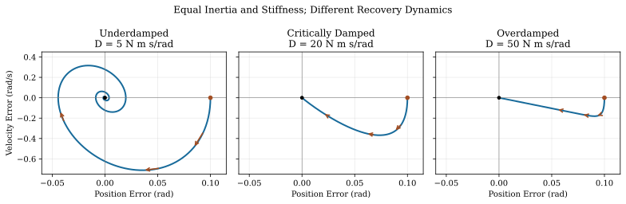

# Passive and Distributed Control: Mechanics, Feedback and Stability {#sec-passive_distributed_control}
[]{#ch-passive_distributed_control}

::: {.callout-note}
## What You'll Learn

[]{#lab-intro_passive}
A golfer's response to a disturbance depends on more than a corrective command. The initial posture, muscle activation, tendon strain, club flexibility and contact conditions already influence what moves next. Sensory feedback then changes the response on its own time scales. The useful question is how these mechanisms cooperate to deliver the club while resisting relevant disturbances.

This chapter distinguishes mechanical passivity, muscle impedance and distributed neural feedback. It derives what each model can establish, explains how to measure the distinctions, and separates those results from hypotheses about expert golf. Apparent effortlessness is an observation to explain, not a measurement of passive contribution.
:::

::: {.callout-note}
## Book Chapter vs. Standalone Article
This chapter provides the textbook treatment of impedance, mechanical passivity, and distributed neural feedback within *The Physics of Golf*. For the standalone conceptual article focused specifically on the Frans Bosch coordination framework, muscle-tendon elastic storage, and motor attractors, see [Passive Distributed Control: Frans Bosch Framework](../../passive-distributed-control.html).
:::

## Time Scales and the Distribution of Control {#the-computational-problem-why-the-brain-cant-micromanage}
[]{#sec-comp_problem}

Conscious instructions, descending motor commands, spinal processing, muscle activation and mechanical deformation are different processes. Their rates cannot be compared by treating a joint sample as a conscious decision. Multiplying a model's joint count by its numerical sampling frequency gives a sample count; it does not establish the brain's information capacity or the computational cost of biological control. A behavioral information-rate estimate is not a universal ceiling on neural activity.

Prediction, learned feedforward commands, intrinsic mechanics and feedback can operate together. A command prepared before movement can continue to require neural activity and muscle energy during movement. Automatic execution does not mean zero active input. Conversely, an immediate force response to imposed stretch need not await a newly generated neural correction.

::: {.callout-important}
## Separate Preparation From Execution

[]{#lab-myth_central}
A useful model can place a learned policy above a fast neuromechanical system. This is a modeling architecture, not proof that all gains are selected once, that the cortex is uninvolved during the downswing, or that every joint receives an independent millisecond instruction. Compare architectures using measured inputs, responses and prediction error.
:::

In a primary study of humans and rhesus monkeys, Pruszynski and colleagues found evidence for multi-joint feedback processing through primary motor cortex at roughly 50 ms after a mechanical perturbation [@Pruszynski2011Feedback]. This establishes that fast feedback need not be exclusively spinal. It does not identify the controller of a golf swing or imply that a response triggered by ball contact can alter the preceding impact state.

## Passive Mechanical Systems: Springs and Dampers {#passive-mechanical-systems-springs-and-dampers}
[]{#sec-passive_mechanics}

::: {.callout-note}
## Mechanical Passivity

[]{#lab-def_passive_control}
Declare an input/output power port and a nonnegative storage function $S$. A mechanically passive model satisfies

$$
S(t)-S(0)\leq\int_0^t \tau_{\mathrm{ext}}(s)\dot q(s)\,ds.
$$

It cannot deliver more mechanical energy through that port than it initially stores plus the energy supplied to it. Passivity is a work inequality; it is not a synonym for lack of consciousness, absence of neural feedback or convergence to a desired trajectory.
:::

For a fixed-base translational spring and damper,

$$
m\ddot x+c\dot x+kx=F_{\mathrm{ext}},\qquad
S=\frac12m\dot x^2+\frac12kx^2,
$$

with $m,k>0$ and $c\geq0$, differentiation gives

$$
\dot S=F_{\mathrm{ext}}\dot x-c\dot x^2.
$$

The spring can return stored energy; the damper dissipates it. With no input and no damping, motion can oscillate indefinitely. A damped pendulum near its downward equilibrium can converge, whereas its upright equilibrium can be unstable despite the same passive components. Storage, dissipation and stability require separate statements.

::: {.callout-note}
## What Mechanical Preparation Can Do

[]{#lab-hardware_stability}
Preparation changes the conditions under which a disturbance acts. At a declared activation and geometry, muscle-tendon mechanics can resist some imposed motions immediately. Maintaining activation still uses physiological resources. The response also depends on stretch direction, amplitude, velocity and history. A local spring approximation should not be extended to an entire swing without checking those dependencies.
:::

## Impedance as Part of Motion Control {#impedance-control-the-brains-real-job}
[]{#sec-impedance_control}

Hogan's impedance-control framework treats motion and mechanical interaction together. His 1985 manipulation paper explicitly includes both physical hardware and a real-time controller; it does not establish that the cortex controls impedance exclusively [@hogan1985impedance]. Earlier work examined coactivation of antagonist muscles as a way of modulating mechanical impedance [@Hogan:1984].

::: {.callout-note}
## Specify the Mechanical Port

[]{#lab-def_impedance}
For a small rotational perturbation $e$ about a declared operating condition, a constant-coefficient teaching model is

$$
I\ddot e+D\dot e+Ke=\tau_{\mathrm{ext}}.
$$

Here $I$ is rotational inertia, $K$ has units N m/rad, and $D$ has units N m s/rad. With zero initial perturbation, its dynamic stiffness and mechanical impedance are respectively

$$
\frac{\tau_{\mathrm{ext}}(s)}{e(s)}=Is^2+Ds+K,
\qquad
Z(s)=\frac{\tau_{\mathrm{ext}}(s)}{\dot e(s)}=Is+D+\frac{K}{s}.
$$

The first is torque per angle; the second is torque per angular velocity. They differ by a factor of $s$. State the convention when comparing reports. A static stiffness number alone does not specify the full frequency-dependent response.
:::

Real joint response can include activation-dependent intrinsic muscle mechanics, passive tissues, tendon compliance, reflex feedback, inertia and device dynamics. The fitted components depend on the observation window. A matrix model must also retain cross-joint effects when they matter. A single label such as "high impedance" is incomplete without direction, frequency and operating state.

For idealized opposing muscles with a constant moment arm $r$, net torque is $r(F_1-F_2)$. Increasing both forces equally can leave that torque unchanged while changing the local stiffness. If each muscle has positive local length stiffness $k_i$, the corresponding restoring joint stiffness in this simplified geometry is $r^2(k_1+k_2)$. Variable moment arms add geometric terms; tendon compliance changes the series response. This example explains why net torque cannot uniquely identify coactivation. It does not imply that stiffness and damping increase by the same factor or that coactivation has no metabolic cost.

::: {.callout-important}
## A Testable Impedance Hypothesis

[]{#lab-princ_impedance}
The nervous system may adjust mechanical response to the task's instability, uncertainty and costs. Test this with imposed perturbations and an identified response, while controlling for posture, mean force and movement. A plausible mechanism becomes stronger when it predicts a response that an alternative model does not.
:::

### The Impedance Profile of the Golf Swing {#the-impedance-profile-of-the-golf-swing}
[]{#subsec-impedance_profile}

There is no universal proximal-high, distal-low schedule established by the equations above. Different phases impose different objectives: preparation, transport, club delivery, collision and deceleration. Those objectives motivate measurements, not predetermined stiffness values. A phase-dependent response may reflect changing activation, geometry, feedback gains and shaft state simultaneously.

Burdet and colleagues studied horizontal arm reaching in a robot-created divergent force field. Participants adapted endpoint stiffness geometry in the destabilized direction; the setup constrained the trunk and wrist, and the learning analysis used five naive participants. The stiffness estimate used the interval 120--180 ms after perturbation onset [@Burdet2001Impedance]. That measured response should not be described as purely immediate intrinsic tissue stiffness. The experiment supports task-dependent impedance adaptation, not a measured golf-phase prescription.

::: {.callout-note}
## Interpreting Grip Tension

[]{#lab-novice_tension}
A firm grip can change contact and muscle activation, but visible tension does not identify a joint's dynamic impedance. A compliant wrist can still experience substantial torque, and a stiff joint can move under sufficient load. Compare club delivery and measured response within a golfer before inferring that a particular grip pattern improves speed or control.
:::

## Preparation, Reference Motion and Power {#the-pre-tuned-system-setting-the-springs-before-execution}
[]{#sec-pretuned}

A commonly used torque model is

$$
\tau=\tau_{\mathrm{ff}}(t)-K(t)(q-q_d(t))-D(t)(\dot q-\dot q_d(t)).
$$

It specifies a feedforward drive and a response around a moving reference. It is a candidate controller or local approximation, not a physiological identity. Even if its parameters are prepared in advance, its time-varying command remains an input. Updating gains during execution, or through feedback, changes the model again.

For $e=q-q_d$, the spring-like storage is $U_s=K(t)e^2/2$, giving

$$
\dot U_s=Ke\dot q-Ke\dot q_d+\frac12\dot K e^2.
$$

The second term accounts for motion of the reference; the third is parameter power. Holding a displaced spring while increasing its stiffness requires an energy source. For $e=0.1$ rad and $\dot K=20$ N m/(rad s), the parameter contribution is $0.1$ W. If $K=50$ N m/rad and $\dot q_d=0.2$ rad/s, the reference contribution is $-1$ W at the same error. The signs depend on the state and the prescribed change.

A damper relative to a moving reference also exchanges power with that reference. Its torque on the joint is $-D(\dot q-\dot q_d)$, so power delivered to the joint is $-D(\dot q-\dot q_d)\dot q$. This need not be negative. Dissipation in the relative damper coordinate is $D(\dot q-\dot q_d)^2$; the reference supplies or receives the remaining power.

::: {.callout-tip}
## What Parameter Counts Establish

[]{#lab-constraint_pretuning}
Twenty diagonal stiffnesses and twenty diagonal dampers give 40 scalar parameters. Two general symmetric $20\times20$ matrices instead have $2(20\cdot21/2)=420$ independent entries. Neither count includes a moving reference, a drive, muscle state or an estimator. Parameter count is not decisions per second, and dividing these quantities does not establish a neural speedup. Reduced models are useful when their predictions remain adequate for the chosen task.
:::

## Passive Forces in the Forward Counterfactual {#passive-control-in-the-ztcf-family-framework}
[]{#sec-passive_ztcf}

Let $x=(q,v)$ and consider an ideal generalized-torque-input model

$$
M(q)\dot v+h(q,v)=\tau_{\mathrm{imp}}(q,v)+B(q)u,
\qquad \dot q=v.
$$

Then the additive impedance vector field is

$$
f_{\mathrm{imp}}(x)=\begin{bmatrix}0\\M^{-1}(q)\tau_{\mathrm{imp}}(q,v)\end{bmatrix},
\qquad
\dot x=f_{\mathrm{bare}}(x)+f_{\mathrm{imp}}(x)+G(x)u.
$$

The zero in the top block matters: the bare field already contains $\dot q=v$. Adding another copy would double the kinematic velocity. Coupled inertia also means an impedance torque at one coordinate can alter accelerations elsewhere.

::: {.callout-note}
## Declare What Is Held and What Is Zeroed

[]{#lab-drift_impedance}
A forward zero-torque counterfactual (ZTCF) sets a specified active torque channel to zero from a declared initial state and integrates the resulting equations. Stored elastic energy and passive forces remain. If a maintained muscle controller is included in a closed-loop baseline, label that controller explicitly: zero additional command about this baseline is not zero muscle activation. In an excitation-driven model, zero excitation does not instantaneously erase activation or tendon strain.
:::

An augmented closed-loop drift can be a useful comparison, but it is a different counterfactual from removing all modeled active torque. A feedback law depends on measured or estimated state; representing it inside an autonomous augmented model does not make it physiologically passive. Delays require history or an appropriate augmented realization. Counterfactual comparisons must retain the initial activation, deformation, velocity and contact conditions relevant to the chosen intervention.

ZTCF denotes a counterfactual construction, not a fraction of the swing. If comparing trajectories, define an observable, time horizon, units, alignment and error statistic. A smaller trajectory error after adding fitted impedance does not uniquely identify the true mechanism or a percentage of motion caused by passive forces. It may also reflect additional fitting flexibility; evaluate prediction on held-out perturbations.

## Muscle Tone and Distributed Feedback {#muscle-tone-and-spinal-feedback}
[]{#sec-muscle_tone}

Resistance to imposed movement can contain non-neural tissue mechanics and ongoing neural activity. A relaxed instruction does not establish zero activation, and measurable resistance does not prove active contraction. Distinguish EMG, muscle force, short-range stiffness, tendon strain and the complete joint response; each measurement constrains a different part of the model.

### The Stretch Reflex Loop {#the-stretch-reflex-loop}
[]{#subsec-stretch_reflex}

Muscle spindles provide information affected by muscle length, velocity, history and fusimotor activity. The homonymous short-latency pathway includes spindle afferents exciting motor neurons to the same muscle. Actual limb responses also involve other muscles, spinal interneurons, descending modulation and longer pathways. It is not a set of independent identical controllers with one latency for every muscle.

An intrinsic force response, an EMG response and a later change in force have different onset times. Neither an EMG latency nor a conscious reaction-time estimate can stand in for all of them. Rapid multi-joint responses involving cortex further weaken a simple contrast between "spinal reflex" and "slow conscious control" [@Pruszynski2011Feedback].

### Gamma Drive and Task-Dependent Sensitivity {#gamma-drive-configuring-the-reflex}
[]{#subsec-gamma_drive}

Alpha motor neurons innervate force-producing extrafusal fibers; gamma motor neurons act on intrafusal spindle fibers. They are spinal motor neurons influenced by descending and local circuitry, not two direct commands emitted by the motor cortex. Gamma activity helps tune spindle encoding; overall reflex gain also depends on afferent transmission, motor-neuron excitability, background activation and mechanics.

An instructed-delay human experiment reported goal-dependent changes in spindle afferent activity and stretch responses during preparation [@Papaioannou2021Preparation]. This supports preparatory sensory tuning. It does not directly measure gamma motor-neuron firing or establish a fixed gamma schedule for golf. Avoid a one-to-one rule equating greater gamma drive with a known joint stiffness.

::: {.callout-tip}
## A Restoring Sign Does Not Guarantee Passivity

[]{#lab-spinal_controller}
For an imposed sinusoidal perturbation $e=A\cos(\omega t)$ and a delayed feedback torque $\tau_r=-k_r e(t-\Delta)$, mean power delivered to the moving coordinate over a cycle is

$$
\overline P_r=\frac12 k_r A^2\omega\sin(\omega\Delta).
$$

It is positive when $0<\omega\Delta<\pi$. Immediate viscous damping instead gives $\overline P_D=-DA^2\omega^2/2$. The controller can supply energy because the delayed torque is out of phase with current displacement. This manufactured calculation neither estimates human reflex gains nor proves instability of a complete delayed system; it demonstrates why a restoring sign alone is insufficient.
:::

## Coordination in the Coupled Chain {#self-organization-in-the-kinetic-chain}
[]{#sec-self_organization}

### Interpreting Proximal and Distal Energy Flow {#energy-flow-from-proximal-to-distal}
[]{#subsec-energy_flow}

Geometry and inertia couple segment accelerations, while active and passive forces determine the complete trajectory. An impedance gradient alone does not prescribe the direction or amount of energy transfer. A centripetal acceleration also does not, by itself, establish positive work: force must be paired with the velocity of its point of application.

For a chosen segment, evaluate work rates from forces and moments, changes in its kinetic and gravitational energy, and any stored elastic energy. At a shared joint, equal-and-opposite forces can exchange energy between segments even when their contribution cancels in the total system balance. With the same conventions, a joint couple's net power on the two segments depends on their relative angular velocity. Check these balances before assigning a proximal deceleration to energy received by a distal segment.

### The Whip Effect and Distal Acceleration {#the-whip-effect-emergent-distal-acceleration}
[]{#subsec-whip_effect}

A distal speed peak can follow a proximal peak in a coupled mechanism. That timing is compatible with several combinations of active torque, passive torque and geometry. It does not show that proximal speed is nearly zero, that a wrist command is absent, or that energy necessarily passes through a single cascade.

::: {.callout-important}
## Test the Mechanism Behind the Sequence

[]{#lab-princ_emergent}
Compare a model's force, power and acceleration histories with perturbation responses and held-out motion. If reducing distal impedance changes release timing in that model, report the initial state, input and contact conditions. The result is a model prediction, not a universal instruction to relax the wrists. The flexible-shaft state and grip motion can change the club response even with identical joint-level parameters.
:::

### Impedance and Impact Transmission {#impact-protection-through-high-distal-impedance}
[]{#subsec-impact_protection}

Force is measured in newtons, not kilograms. A collision impulse is the time integral of force; peak force additionally depends on its time profile and contact compliance. Neither a force magnitude nor a short impact duration determines how much load reaches a particular tissue.

Stiffness stores and returns energy; it is not a dissipator. Increasing distal stiffness can change contact motion, resonances and transmitted loads, but it does not form a universal barrier that absorbs an impact. Damping, shaft waves, grip contact, geometry and the golfer's initial activation all matter. A response initiated by the collision arrives after a finite delay; anticipatory preparation and reactions after contact are distinct mechanisms.

No injury-prevention prescription follows from the simplified impedance model. Inertia and impact duration alone cannot identify a safe wrist stiffness, because the loading, allowable motion, damping, contacts and tissue outcomes are unspecified. The separate impact and damping chapters develop their own system boundaries; this chapter does not substitute a spring analogy for those operators or for measured clinical outcomes.

## Stability Analysis: What the Model Establishes {#stability-analysis-is-the-swing-self-correcting}
[]{#sec-stability}

### Equilibrium Storage and Lyapunov Stability {#the-lyapunov-function}
[]{#subsec-lyapunov}

Consider a time-invariant mechanical model with fixed reference $q_0$:

$$
M(q)\ddot q+C(q,\dot q)\dot q+\nabla U_g(q)+K(q-q_0)+D\dot q
=\tau_{\mathrm{ext}}.
$$

Assume $M$ is positive definite, $K$ and $D$ are symmetric, and $\dot M-2C$ is skew-symmetric, as in a consistent Lagrangian representation. Write

$$
U(q)=U_g(q)+\frac12(q-q_0)^TK(q-q_0),\qquad
V=\frac12\dot q^TM(q)\dot q+U(q)-U(q_*),
$$

where $q_*$ is a strict isolated local minimum of $U$. The equilibrium need not be $q_0$: gravity can shift it. A positive-definite Hessian of the combined potential is sufficient for a strict local minimum; spring stiffness alone does not establish this condition. A semidefinite Hessian requires higher-order analysis.

Differentiating along the equations gives

$$
\dot V=\dot q^T\tau_{\mathrm{ext}}-\dot q^TD\dot q.
$$

The kinetic derivative's $\dot M$ term cancels the corresponding Coriolis contribution; it must not simply be discarded as a small force. With no external torque and positive-definite damping, $\dot V\leq0$. This is *negative semidefinite*, because it is zero whenever velocity is zero, including some displaced states.

::: {.callout-important}
## A Bounded Equilibrium Result

[]{#lab-thm_passive_stability}
In a compact invariant energy sublevel set contained in the neighborhood of an isolated strict minimum, the energy argument gives Lyapunov stability. With positive-definite damping and no other equilibria in that set, the largest invariant subset of $\dot V=0$ is the equilibrium, so invariant-set reasoning gives asymptotic convergence. If damping is only semidefinite, undamped motions must be examined separately. A non-increasing energy does not imply that each coordinate error decreases monotonically.
:::

Unknown external work cannot be removed by saying that damping is sufficiently large. A persistent load can shift equilibrium; an active environment can destabilize it. For example, $\ddot e+D\dot e-e=0$ has one positive real pole for every finite $D\geq0$. Damping does not turn a potential maximum into a minimum.

### Tracking and Finite-Time Recovery {#conditions-for-self-correction}
[]{#subsec-self_correction}

A golf swing is a moving, finite-duration task. Absolute kinetic energy is nonzero on its desired trajectory, so it is generally unsuitable as a positive-definite tracking-error measure. To make the distinction exact, use a constant-inertia teaching plant $I\ddot q=\tau+d$ with

$$
\tau=I\ddot q_d-D\dot e-Ke,\qquad e=q-q_d.
$$

Then

$$
I\ddot e+D\dot e+Ke=d,\qquad
V_e=\frac12I\dot e^2+\frac12Ke^2,\qquad
\dot V_e=-D\dot e^2+d\dot e.
$$

For $d=0$ and positive constants, error converges. Actual motion still requires the feedforward power and any reference work. This certificate is for the specified plant/controller pair; extending it to a variable-inertia humanoid requires consistent compensation or a different proof. Time-varying $K$ adds $\dot K e^2/2$ to the error-storage derivative.

With $I=1$ kg m$^2$ and $K=100$ N m/rad, the poles solve $Is^2+Ds+K=0$. At $D=5$ N m s/rad they are $-2.5\pm9.6825i$ s$^{-1}$; at $D=20$ the repeated pole is $-10$ s$^{-1}$; at $D=50$ they are approximately $-2.0871$ and $-47.9129$ s$^{-1}$. The middle case is critically damped, not a spiral. Excess damping produces a slower dominant decay. These values are manufactured examples, not wrist estimates.

On narrow screens, scroll the figure or [open it at full size](../figures/passive_damping_regimes.svg).

::: {#fig-passive-damping-regimes}
::: {.aba-diagram-scroll role="region" aria-label="Damping regimes; scroll horizontally" tabindex="0"}

:::

Manufactured Recovery With Equal Inertia and Stiffness: Only the Underdamped Case Spirals. All Curves Start at 0.1 rad With Zero Velocity; Orange Arrows Indicate Time Direction Over a Two-Second Interval.
:::

For a linearized trajectory perturbation, $\delta\dot x=A(t)\delta x$ gives $\delta x(t)=\Phi(t,t_0)\delta x(t_0)$. The transition matrix $\Phi$ can amplify some perturbations over a short interval even when a related equilibrium is asymptotically stable. Use a declared norm and physically meaningful state scales, then examine clubface orientation, strike position or another output through its local output map. A recovery that happens after impact may not improve the shot. Contact switches, delays and uncertain parameters require additional treatment.

::: {.callout-note}
## What Apparent Ease Can Tell Us

[]{#lab-effortless_swing}
Smooth motion and repeatable delivery are useful observations. They do not reveal how much muscle activation, elastic exchange or feedback was required. The explanatory target is a model that predicts both the motion and its response to relevant changes. A model that fits only an unperturbed swing can hide compensating errors in its controller and mechanics.
:::

## Learning and Identifying Impedance {#training-and-the-discovery-of-impedance}
[]{#sec-training}

### The Identification Problem {#the-pre-training-problem}
[]{#subsec-pre_training}

Impedance must be estimated from input and response, not assigned from experience level. Specify the perturbation, operating point, measurement bandwidth, noise and model class. For the local equation $I\ddot e+D\dot e+Ke=\tau$, measured angle alone cannot identify all three coefficients without information about the applied torque.

Even known torque at a single sinusoidal frequency does not necessarily identify all parameters: because $\ddot e=-\omega^2e$, inertia and stiffness enter through $K-I\omega^2$. Multiple informative frequencies or independent inertia information are needed to separate them. Neural delays and nonlinear mechanics can require richer models; a good fit of a spring-damper curve does not prove purely passive tissue behavior.

### Practice and Task-Dependent Adaptation {#practice-as-impedance-search}
[]{#subsec-practice_impedance}

Learning can change planned drive, sensory prediction, feedback policy and mechanical response. Burdet's directional adaptation is an example of measured task dependence [@Burdet2001Impedance]; it is not evidence that practice freezes all impedance parameters permanently. Compare adaptation, retention and transfer separately, including changes in mean force and posture that could explain an apparent gain change.

### Strength, Speed and Mechanical Capacity {#strength-and-speed-training}
[]{#subsec-strength_speed}

Strength and speed training can change the forces and motions a golfer can produce, but those labels do not uniquely specify changes in stiffness, damping or coactivation. A larger capacity can alter the feasible control strategies; which strategy is used remains a measurement question. Mechanical power, metabolic cost and variability are separate outcomes and need not improve together.

::: {.callout-important}
## Mechanical Conditions and Learning

[]{#lab-principle_conditions}
Changing a task's constraints can help investigate coordination, while motion and outcome measurements can test the result. Treat a coaching interpretation as a hypothesis unless supported by an appropriate comparison. A mechanically plausible story is not evidence that a particular instructional method outperforms another.
:::

## Practical Interpretation of Measurements {#practical-implications-the-art-of-pre-tuning}
[]{#sec-practical}

### Grip Pressure and Joint Response {#grip-pressure-not-light-or-firm-but-appropriate}
[]{#subsec-grip_pressure}

Grip sensors measure pressure or force at a contact. They do not directly measure wrist impedance. The same contact force can accompany different coactivation, posture and tendon state. Evaluate grip observations alongside club motion and, where appropriate, controlled identification data. There is no safe stiffness range or universal impact-timing instruction available from the equations in this chapter.

### Posture and the Mechanical Map {#the-address-position-setting-the-baseline-impedance}
[]{#subsec-address}

Posture changes moment arms, inertia and the Jacobian linking joint to hand motion. Virtual work gives $\tau=J^TF$. Differentiating this relation includes both $J^T\delta F$ and $(\delta J)^TF$; under preload, geometric terms can change tangent stiffness. A simple Jacobian transformation that omits them may be inadequate. A posture label alone does not identify these quantities or establish an efficient swing.

### What a Waggle Can Reveal {#the-waggle-calibrating-the-impedance}
[]{#subsec-waggle}

A waggle provides sensory information during a small movement, potentially about contact, load and familiarity. Describing it as an impedance calibration is a hypothesis. Its frequency, amplitude and activation differ from a downswing, so a familiar sensation does not demonstrate correct stiffness for impact. Repeated observations can test associations without turning subjective feel into an identified mechanical parameter.

### Combining Sensation and External Feedback {#feedback-for-training-proprioceptive-cues}
[]{#subsec-feedback}

Proprioception, video, launch measurements and EMG answer different questions. A sensation of increased tension does not supply a stiffness matrix; video does not directly identify force; EMG is not a complete torque or impedance measurement. Combine information according to the hypothesis, report uncertainty and test predictions outside the data used to fit the model. Simulations and existing controlled datasets are appropriate teaching tools for perturbation analysis.

## A Connected Model of Mechanics and Control {#toward-a-unified-picture-control-physics-and-self-organization}
[]{#sec-unified}

The muscle chapter explains how excitation, activation, geometry and tendon state produce force. The shaft chapter shows how those forces act through grip motion and flexible-club dynamics. Motor learning changes the policies and predictions used in repeated movement. Here, impedance describes a response around an operating condition, while stability analysis asks what happens to perturbations under explicitly stated dynamics.

::: {.callout-important}
## Key Takeaways

[]{#label-key_takeaways_ch27}
Mechanical passivity is an energy property of a declared port. Impedance can include active muscle mechanics and delayed feedback. A forward counterfactual requires a specific input intervention and full initial state. Equilibrium convergence does not establish finite-time club-delivery accuracy. Measured force, motion, EMG and pressure constrain different parts of the model. Together, these distinctions make coordination hypotheses testable without assuming that the entire swing is either consciously commanded or mechanically autonomous.
:::

## Chapter Exercises and Worked Answers {#chapter-exercises}

[]{#label-ex_ch27}

**1. Phase-Dependent Hypotheses**
[]{#ex-impedance_phase}
For address, backswing, transition, downswing, impact and follow-through, propose an observation that would constrain a phase-dependent model. Explain why the phase name alone does not prescribe stiffness.

**Answer.** Address constrains posture, mean load and initial activation; backswing constrains transport and changing geometry; transition constrains reversals and elastic state; downswing constrains delivery motion and available correction time; impact constrains contact impulse and initial mechanical state; follow-through constrains dissipation and deceleration. Perturbation response, when available from an appropriately controlled study, adds information beyond ordinary motion. Different combinations of drive, tissue response and feedback can produce similar unperturbed trajectories, so no universal stiffness schedule follows.

**2. What a Decreasing Storage Function Means**
[]{#ex-lyapunov_intuition}
For the unforced spring-damper model, consider a displaced state with zero velocity. Is the energy derivative strictly negative? What further argument is needed for convergence?

**Answer.** The energy is positive but $\dot V=-D\dot e^2=0$ at that instant. The restoring acceleration subsequently creates motion. In a bounded invariant neighborhood with an isolated energy minimum and positive damping, the only trajectory that can remain in the zero-derivative set is the equilibrium. That invariant-set argument establishes asymptotic convergence. It does not make every coordinate error decrease at every instant, nor does it establish tracking of a different moving reference.

**3. Parameters, Samples and Information**
[]{#ex-bandwidth_reduction}
Count stiffness and damping parameters for 20 independent scalar joints and for two symmetric coupled matrices. Compare these counts with a 1 kHz record of 20 joint variables.

**Answer.** The diagonal approximation has 40 parameters; the symmetric coupled case has 420. The record contains 20,000 scalar samples per second. Samples per second and a one-time parameter count have different units. Neither specifies bits without a coding/precision model, and neither establishes a brain-wide processing limit or a guaranteed reduction in biological computation.

**4. Distributed Feedback**
[]{#ex-spinal_reflex}
Distinguish an intrinsic force response, spindle afferent activity, a short-latency muscle response and a longer multi-joint response. Does lack of conscious correction imply mechanical passivity?

**Answer.** Intrinsic mechanics act through the existing tissue state. Spindle afferents encode signals influenced by motion and fusimotor state. Short-latency pathways can alter motor-neuron activity; longer pathways can integrate information across joints and include cortex. Their measured onsets and force consequences differ. An automatic neural controller can supply mechanical energy, so lack of consciousness does not establish passivity.

**5. Net Torque and Coactivation**
[]{#ex-novice_expert}
Two idealized opposing muscles have constant moment arm $r=0.03$ m and equal force. Initially each has local length stiffness 1000 N/m; after a change each has 2000 N/m. Compute net torque and restoring joint stiffness in both states. Can the result identify expertise?

**Answer.** Net torque is zero in both states because the forces cancel. Joint stiffness is $r^2(k_1+k_2)$, giving 1.8 and 3.6 N m/rad. Changing equal activation can change resistance without changing net torque; muscle energy consumption is not measured by net joint work. These manufactured states do not identify an expert or a novice, and the calculation omits variable moment arms and tendon compliance.

**6. Torque and Instantaneous Power**
[]{#ex-impedance_equation}
For a fixed reference $q_0=0$, let $K=50$ N m/rad, $D=5$ N m s/rad, $q=0.1$ rad and $\dot q=1$ rad/s. Find $\tau=-K(q-q_0)-D\dot q$ and its power. Does the spring always remove kinetic energy?

**Answer.** The spring and damper each contribute $-5$ N m, so total torque is $-10$ N m and power on the coordinate is $-10$ W. Spring storage increases at 5 W and the damper dissipates 5 W. When the same displaced spring moves toward its reference, spring power can be positive; viscous dissipation remains nonnegative. Resisting displacement and resisting velocity are different statements.

**7. Differentiate the Correct Storage**
[]{#ex-lyapunov_derivative}
Derive the energy identity for $I\ddot q=-K(q-q_0)-D\dot q$ with fixed positive constants. Then let $q_0(t)$ and $K(t)$ vary while retaining damping against absolute velocity.

**Answer.** For fixed reference, differentiation of $I\dot q^2/2+K(q-q_0)^2/2$ and substitution cancel the spring work, leaving $-D\dot q^2$. For varying reference and stiffness the derivative becomes

$$
\dot V=-D\dot q^2-K(q-q_0)\dot q_0+\frac12\dot K(q-q_0)^2.
$$

Reference motion and parameter changes can supply energy. Omitting these terms would turn an actively driven system into an incorrectly passive one on paper. Tracking requires a separate error-coordinate argument.

**8. Damping Regimes**
[]{#ex-phase_portrait}
Classify $\ddot e+D\dot e+100e=0$ for $D=5,20,50$. For the critical case with $e(0)=0.1$ and $\dot e(0)=0$, obtain $e(t)$ and $e(0.1)$.

**Answer.** The cases are underdamped, critically damped and overdamped. Only the first has complex poles and spiralling phase trajectories. The critical solution is $e(t)=0.1(1+10t)\exp(-10t)$, so $e(0.1)=0.2/\mathrm e\approx0.07358$. The overdamped system's slow pole is approximately $-2.0871$ s$^{-1}$, slower than the critical decay scale. Increasing damping indefinitely does not guarantee faster recovery.

**9. An Underdetermined Impact Estimate**
[]{#ex-impedance_tuning}
Given only rotational inertia $I=0.01$ kg m$^2$ and a time interval $T=0.005$ s, can one estimate a safe stiffness range? Interpret the dimensional scale $I/T^2$.

**Answer.** One cannot identify a safe range. The scale is 400 N m/rad under the usual dimensionless-radian convention; choosing $K=I/T^2$ merely imposes $\sqrt{K/I}\,T=1$. It supplies no loading, allowable excursion, damping, contact mechanics or tissue outcome. The interval is not automatically a forcing period, and resonance is not automatically instability. No injury or grip recommendation follows.

**10. A Waggle Association**
[]{#ex-waggle_experiment}
Suppose a golfer records perceived waggle tension and subsequent delivery error over repeated sessions. What can this association establish, and how might it be tested without treating sensation as stiffness?

**Answer.** It can describe a within-golfer association under the recorded conditions. Separate sessions used to formulate the hypothesis from those used to test it; record task, equipment and relevant setup changes. Fatigue, expectation and preparation may affect both sensation and outcome. No mechanical stiffness is identified without a known perturbation and force/motion response, and association alone does not show that changing the sensation causes improved delivery.

**11. What Identifies the Response?**
[]{#ex-grip_pressure}
For a simulated joint, let $e=A\cos(\omega t)$ and measure the required torque. Show why an unknown inertia and stiffness are confounded at that frequency. Does adding grip pressure solve this automatically?

**Answer.** The torque is $(K-I\omega^2)A\cos(\omega t)-DA\omega\sin(\omega t)$. The in-phase term identifies a combination of $I$ and $K$, not each separately. Known inertia or informative additional frequencies can resolve this within the stated model. Grip pressure does not automatically provide the missing rotational inertia, joint torque or operator; its relation to those quantities must be modeled and validated.

**12. Simulated Perturbation Recovery**
[]{#ex-perturbation_recovery}
Use a simulation of $\ddot e+20\dot e+100e=0$. At $t=0$, apply an initial velocity error of 0.1 rad/s with zero position error. Find the largest position error. How would delayed feedback change the inference?

**Answer.** The solution is $e(t)=0.1t\exp(-10t)$. It peaks at $t=0.1$ s with $e=0.01/\mathrm e\approx0.003679$ rad. Position error initially grows even though mechanical energy decreases. Adding delayed feedback requires a new response calculation and stability analysis; the undelayed result cannot certify it. Use a numerical perturbation or an existing controlled dataset for this exercise. A partner should not introduce an unexpected physical disturbance during a live golf swing.
