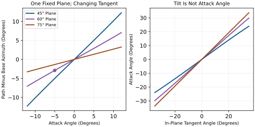
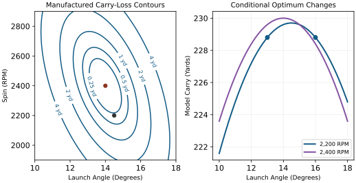

# Swing Plane, Clubface Control and Launch Optimization {#sec-31_swing_plane_launch}
[]{#ch-swing_plane_launch}

::: {.callout-note}
## From a Swing to a Shot

[]{#lay-launch_primacy}
Clubhead speed is one part of delivery. Two swings with the same speed can
produce different ball speeds, launch directions, spin vectors and landing
positions because their face orientations, strike locations and contact
conditions differ. A useful explanation follows the whole chain: preparation
and continuing actuation produce club motion; collision produces ball motion;
airflow and gravity produce flight; the chosen target determines whether the
result is useful. Geometry connects these stages, but cannot replace their
mechanics or their evidence.
:::

This chapter develops that chain with explicit coordinates and independently
checkable examples. The geometric identities and impulse balances are derived
results under stated assumptions. The launch-ratio observations are measurements
from a particular study. The quadratic distance surface introduced later is a
deliberately manufactured example, not a fitted golf-ball model or a suggested
launch window. These distinctions let the reader reuse the mathematics without
mistaking a teaching example for a validated prescription.

## Defining the Swing Plane {#defining-the-swing-plane}

Use a right-handed frame with $x$ horizontal toward the target, $y$ horizontal
to the target's left and $z$ upward. Azimuths in this chapter are positive to
the left. Convert a device's positive-right angles by changing the sign after
checking its handedness and target convention. Angles inside trigonometric
functions are in radians unless explicitly marked in degrees.

Let $r_C(t)$ and $v_C(t)$ denote the position and velocity of a specified point
on the clubhead. A geometric center, center of mass and face contact point are
generally different points. For a rigid head,

$$
v_C=v_G+\omega_H\times(r_C-r_G).
$$

Consequently, a change of reporting point can change speed, path and attack
angle even when the underlying motion is identical. A flexible shaft does not
invalidate rigid-head transport, but its deformation changes the head's pose
and velocity. Specify the reporting epoch too: first touch, maximum compression
and separation are not interchangeable events.

::: {.callout-note}
## A Plane Requires More Than One Direction

[]{#swing_plane}
A plane through $r_0$ with unit normal $n_P$ satisfies
$n_P^T(r-r_0)=0$. An instantaneous velocity supplies one tangent direction,
not a unique plane. Adding the vertical direction defines a vertical plane,
whose inclination to horizontal is $90^\circ$; it does not define an arbitrary
tilted swing plane. The inclination of a non-oriented plane can be reported as
$\beta=\arccos(|n_P^Te_z|)$ in $[0,90^\circ]$.
:::

An address construction might use a shaft line and a separate noncollinear
point, or the shaft and a horizontal target direction. Name that construction.
A ball position alone does not resolve the plane if it lies on the chosen line.
A shoulder-and-ball plane can be constructed from three noncollinear points,
but it changes when those points move. None of these planes must coincide with
the plane fitted to a segment of clubhead motion.

For a measured arc, subtract the sample mean from its three-dimensional
positions and form a covariance matrix. Its least-variance eigenvector is a
least-squares plane normal. Report the fitting interval, point definition,
weighting, residual distances and sensitivity to measurement error. A nearly
straight short arc does not identify a stable normal: two small eigenvalues
leave many planes almost equally plausible. An instantaneous osculating plane
instead uses $v_C\times a_C$, when that cross product is nonzero. It need not
equal the finite-arc fit, and differentiated acceleration amplifies noise.

Trackman's published swing-plane metric uses a finite segment of clubhead
motion, whereas attack angle describes a velocity direction at an impact
reference event. These are different measurements. The vendor also cautions
against using its swing-plane value as a direct lie-fitting measurement
[@Trackman2024SwingPlane; @Trackman2020Parameters].

### Why the Swing Plane Tilts {#why-the-swing-plane-tilts}

::: {.callout-important}
## Geometry Constrains the Available Motion

[]{#prin-plane_tilt}
Club length, stance, reach, posture and hand path affect the motions a golfer
can make. They do not supply a universal formula mapping height or shoulder
tilt to a unique delivery plane. A plane fitted after observing the motion is
a description of that motion, not proof of which anatomical variable caused it.
:::

The conventional club lie angle is measured between the shaft and the
horizontal ground or waterline in the specified reference configuration.
It is not measured from vertical. Thus a $57^\circ$ lie corresponds to a
$33^\circ$ complement to vertical. Forward shaft lean and sideways lie are
distinct aspects of three-dimensional orientation. Dynamic lie, static lie,
face orientation and arc inclination should therefore be reported separately.
Shaft bending can make the local shaft direction differ along its length.

Shorter clubs often accompany a more upright delivery, but player adaptation
and the metric definition matter. A static specification cannot establish the
attack angle, the energy transferred to the ball or an optimal technique.
Comparisons should match the task, define the arc and report actual data
instead of assigning all golfers a club-dependent plane table.

### Attack Angle and the Vertical Component of Club Path {#attack-angle-and-the-vertical-component-of-club-path}

::: {.callout-note}
## Attack Angle and Path From the Same Velocity

[]{#attack_angle}
For nonzero horizontal speed, define

$$
\alpha=\operatorname{atan2}(v_{Cz},\sqrt{v_{Cx}^2+v_{Cy}^2}),
\qquad \psi=\operatorname{atan2}(v_{Cy},v_{Cx}).
$$

Attack angle $\alpha$ is positive upward and negative downward. Path azimuth
$\psi$ is positive left in this frame. Attack angle is the elevation of a
velocity vector, not an acceleration, a shaft angle or a displacement from the
top of the backswing. At zero speed the direction is undefined; at purely
vertical speed the azimuth is undefined.
:::

A finite drop divided by a finite horizontal displacement gives the slope
of a chord. It does not determine the instantaneous tangent at impact.
To connect path with an ideal fixed swing plane, let its horizontal base
direction have azimuth $d$ and define orthonormal in-plane vectors

$$
b=(\cos d,\sin d,0)^T,\qquad
u=(-\sin d\cos\beta,\cos d\cos\beta,\sin\beta)^T.
$$

Choose the unit tangent $\hat v_C=\cos\chi\,b+\sin\chi\,u$, where $\chi$
describes its direction within that plane. Direct projection gives

$$
\sin\alpha=\sin\beta\sin\chi,\qquad
\psi-d=\operatorname{atan2}(\cos\beta\sin\chi,\cos\chi).
$$

Equivalently, on the forward-moving branch for $0<\beta<90^\circ$,

$$
\tan\alpha=\tan\beta\sin(\psi-d).
$$

This is a conditional geometric identity. It does not require constant speed
or prove that a real head follows one plane. For small $\chi$,
$\alpha\simeq\sin\beta\,\chi$; replacing $\sin\beta$ by $\beta$ additionally
requires small plane inclination, which is inappropriate for a $60^\circ$ plane.

At $\beta=60^\circ$ and $\alpha=-5^\circ$, the forward solution is
$\psi-d=-2.8953^\circ$: the path is right of the plane's base direction in
the stated coordinate convention. At the bottom of an ideal circular arc,
$\chi=0$, so attack is zero and path equals the base direction. Moving the
impact location along that fixed arc changes both quantities together.
Moving the arc itself is a different intervention.

On narrow screens, scroll the figure or [open it at full size](../figures/swing_plane_geometry.svg).

::: {#fig-swing_plane_geometry}
::: {.aba-diagram-scroll role="region" aria-label="swing plane geometry; scroll horizontally" tabindex="0"}

:::

Fixed-Plane Geometry Links Path and Attack Angle. Curves Use the Declared Positive-Left Frame and Forward Tangent Branch; They Are Geometric Calculations, Not Measured Swings.
:::

### Variation by Club: Driver vs. Short Irons {#variation-by-club-driver-vs.-short-irons}

[]{#tab-plane_by_club}

| **Quantity** | **Required Comparison** |
| --- | --- |
| Static Lie | Club specification, reference sole position and shaft axis. |
| Dynamic Lie | Local shaft direction at a declared event and reference plane. |
| Swing Plane | Point trajectory, fitting interval, inclination and residual. |
| Attack Angle | Elevation of the declared point's instantaneous velocity. |
| Club Path | Horizontal azimuth of that same velocity in the target frame. |

: Separate Definitions Before Comparing Clubs or Golfers. None of These Quantities Substitutes for Another. {#tbl-plane-by-club}

An upward driver strike and a downward iron strike are possible delivery
choices, not definitions of the clubs. The sign and useful magnitude depend
on the lie of the ball, intended flight, strike quality and equipment.
Population averages are not fitting targets. Even a fixed-plane identity
cannot determine performance without face orientation and collision mechanics.

::: {.callout-note}
## Source Contract for Launch and Direction Numbers

[]{#ref-ch31_source_contract}
An instrument's reported value combines observations, calibration, processing
and sometimes a fitted model. Identify the device, mode, point, event and
uncertainty rather than describing every output as directly measured. The
Wood study below supplies bounded launch-ratio evidence. The distance examples
later in this chapter are explicitly manufactured response surfaces. They
are not vendor regressions, population norms or empirical fitting advice.
:::

## Clubface Control in Three Dimensions {#clubface-control-in-three-dimensions}

The local face normal controls the direction of the contact normal force.
It is essential to the collision, but cannot by itself determine the shot.
The local surface velocity, head mass and inertia, ball properties, impact
offset, friction and deformation also matter. On a curved driver face, the
normal at the strike location need not equal the normal at the face center.

::: {.callout-important}
## Face Orientation and Joint Contributions

[]{#prin-face_three_params}
Let $R_H\in SO(3)$ map head coordinates to the reporting frame, and let $n_0$
be a unit face normal in head coordinates. For a fixed local surface point,
$n=R_Hn_0$. Define face azimuth and normal elevation by

$$
\phi=\operatorname{atan2}(n_y,n_x),\qquad
\ell=\operatorname{atan2}(n_z,\sqrt{n_x^2+n_y^2}).
$$

The latter is the local dynamic loft convention used here. These two angles
determine a normal direction, not the entire three-dimensional head orientation.
A third independent direction, such as a groove direction, completes the frame.
Toe-up/heel-up rotation and shaft-axis rotation are not definitions of face
azimuth. Near a vertical normal, azimuth becomes ill-conditioned.
:::

A planar approximation may express delivered loft using static loft and
shaft lean, with carefully declared signs. In three dimensions, ordered
rotations replace unrestricted scalar addition. Shaft twist, bending, grip
geometry and both arms enter through their actual kinematic relations, not
through fixed percentages of a final face angle.

### Face Angle Determination: The Joint Contributions {#face-angle-determination-the-joint-contributions}

For an illustrative serial chain, write

$$
R_H(q)=R_1(q_1)R_2(q_2)\cdots R_k(q_k)R_{\rm grip}R_{\rm head}.
$$

The axes and frame of each rotation must be specified. A real two-handed
grip creates a closed-chain constraint; joint coordinates cannot generally
be varied independently while preserving both contacts. Compliance adds
state variables and changes the relation between hand and head frames.

Finite rotations do not commute. Acting on $(1,0,0)^T$, a $90^\circ$ rotation
about $y$ followed by $90^\circ$ about $x$ gives $(0,1,0)^T$. Reversing the
order gives $(0,0,-1)^T$. A scalar sum of the two angles cannot distinguish
these different normals. Neither forearm pronation nor wrist deviation has
a universal signed contribution independent of arm, grip and club orientation.

### Sensitivity Analysis: Joint Angle Errors {#sensitivity-analysis-joint-angle-errors}

For a small spatial rotation $\delta\theta$ about unit axis $k$,
$\delta n=(k\times n)\delta\theta$. Differentiating face azimuth yields

$$
\frac{\partial\phi}{\partial\theta}
=\frac{n_x(k\times n)_y-n_y(k\times n)_x}{n_x^2+n_y^2}
=k_z-\tan\ell(k_x\cos\phi+k_y\sin\phi).
$$

The derivative is dimensionless when both angles use the same units. It is
local: a large finite error requires recomputing the orientation. The axis
$k$ is the joint axis transported to the reporting frame at the current
configuration, not merely its anatomical name.

::: {.callout-tip}
## A Joint's Axis Changes Its Face-Angle Gain

[]{#forearm_sensitivity}
At $\phi=0$ and $\ell=15^\circ$, rotations about spatial $z$, $x$ and $y$
have azimuth gains $1$, $-\tan15^\circ\simeq-0.26795$ and $0$ respectively.
These are geometric examples, not estimates of three anatomical joints.
A zero local azimuth derivative does not mean zero effect on loft, impact
position, future motion or higher-order face-angle change. A joint's useful
authority also depends on feasible torque, inertia, constraints and time.
:::

For several feasible small coordinate changes, assemble
$\delta\phi=J_\phi\delta q$. The corresponding variance approximation is
$\operatorname{Var}(\phi)\simeq J_\phi\Sigma_qJ_\phi^T$, retaining covariance.
If measured angles share errors, or if constraints correlate their motion,
their separate contributions cannot be added as independent percentages.
A large observed range of one joint does not establish its causal dominance.

### The Gate Concept: The Narrow Window at Impact {#the-gate-concept-the-narrow-window-at-impact}

::: {.callout-note}
## A Gate Is an Inverse Image of an Objective

[]{#gate}
Let $y=F(z,\eta)$ predict landing outcomes from delivery variables $z$ and
environment/model parameters $\eta$. For an acceptable outcome set $\mathcal A$,
the delivery gate is $\{z:F(z,\eta)\in\mathcal A\}$. A face-angle interval
is a slice of that set with the other variables held fixed. With uncertainty,
one might instead require $\Pr(F(z,\eta)\in\mathcal A)\ge p_0$.
:::

There is no universal three-to-five-degree gate implied by club speed alone.
The target width, carry, spin, strike location, wind and acceptable probability
must be supplied. A joint change may alter several delivery variables together,
so a face-only slice need not describe a physically achievable intervention.

### Drift vs. Control: Remaining Time Before Impact {#drift-vs.-control-the-final-50-milliseconds}

::: {.callout-important}
## Feedback Timing and Continuing Actuation

[]{#prin-face_control_window}
Muscle activation and force may continue through impact even when a newly
perceived error cannot produce a useful late correction. A predetermined
command, a response to earlier information and a new sensory correction are
different inputs. The [computational-brain chapter](./ch26_remarkable_brain.qmd#sec-26_remarkable_brain) derives a delayed-activation
example in which remaining time continuously changes the same command's effect.
It does not establish a universal instant at which all control switches off.
:::

For a declared input-affine model, $\dot x=f(x)+G(x)u$, the drift term $f$
depends on the chosen state and input. Zero neural excitation does not mean
zero retained muscle force. A local fixed-time delivery sensitivity has the form

$$
\delta z=C\Phi(T,0)\delta x_0+
\int_0^T C\Phi(T,s)B(s)\delta u(s)\,ds.
$$

Delay, activation dynamics and feasible commands must be included in this
calculation. The state includes velocities and relevant activation or elastic
history; club pose at the top alone cannot determine angular momentum.
Impact time is also an outcome. For a transverse contact event $g(x(T))=0$,

$$
\delta T=-\frac{g_x\delta x(T)}{g_x\dot x(T)},\qquad
\delta x_{\rm event}=\delta x(T)+\dot x(T)\delta T.
$$

This first-order expression assumes a differentiable event with nonzero
denominator and no intervening mode change. Near grazing contact it becomes
ill-conditioned. It explains why a sensitivity computed at fixed clock time
can miss an important delivery effect, without proving a neural strategy.

## The D-Plane and Modern Ball Flight Laws
[]{#sec-d_plane}

### Launch Direction: Measurements and Their Limits {#the-classical-model-vs.-reality}

For small horizontal angles, a local empirical approximation is

$$
\lambda\simeq w\phi+(1-w)\psi,
$$

where $\lambda$ is launch azimuth. The weight summarizes a particular data
range and measurement protocol. It is neither a force fraction nor a causal
percentage of an entire shot.

Wood and colleagues reported horizontal face weights of $76%\pm8%$ for
drivers, $69%\pm3%$ for 7-irons and $61%\pm7%$ for wedges, with the
table identifying these intervals as 95% confidence intervals. The respective
filtered sample sizes were 89, 172 and 28 shots, not the full 1,575 recorded
shots. The 157-player protocol included centered-strike and minimum face-to-path
filters; a separate 15-shot robot test gave $63%\pm4%$. The study was funded
by PING and used PING clubs. Its vertical ratios differ from the horizontal
ratios, so a value from one projection cannot validate a claim about the other
[@wood2018launch].

The practical conclusion is qualified face-dominant initial direction in
those tests, not a universal rejection or confirmation of every vendor rule.
The robot also changed delivered loft as face angle changed. Measurement
alignment, strike location and small denominators in launch-ratio estimates
limit interpretation. A reported confidence interval is not the spread of
individual golfers' future shots or a universal uncertainty band.

### Mathematical Formulation of Launch Direction {#mathematical-formulation-of-launch-direction}

::: {.callout-note}
## The D-Plane as a Geometric Construction

[]{#d_plane}
For nonparallel local face normal $n$ and incoming relative surface-velocity
direction $\hat v$, their span defines a plane with normal parallel to
$\hat v\times n$. This construction remains possible at an off-center strike.
What can fail there is the simplified prediction that the complete collision
remains planar. If the two vectors are parallel, no unique plane normal or
nonzero spin axis follows from them.
:::

Under an ideal planar contact model, with an initially stationary ball,
resolve the impulse on the ball as $J=J_n n+J_t t$, where
[$t=(\hat v-(n^T\hat v)n)/\|\hat v-(n^T\hat v)n\|$]{.long-inline-math role="group" aria-label="Contact tangent direction" tabindex="0"}. Then

$$
v_B^+=\frac{J_n n+J_t t}{m_B},\qquad
\hat v_B^+=\frac{J_n n+J_t t}{\|J_n n+J_t t\|}.
$$ {#eq-launch_weighted}

This is impulse balance, not a constant-weight direction law. A convex
combination of unit vectors generally has norm below one and must be
normalized if used as a direction. Moreover, a horizontal angle weight does
not automatically specify a three-dimensional vector weight.

Spin loft is the three-dimensional obliqueness
$\Phi=\arccos(n^T\hat v)$. With the earlier angle definitions,

$$
\cos\Phi=\cos\ell\cos\alpha\cos(\phi-\psi)+\sin\ell\sin\alpha.
$$

Only when the azimuths coincide does this reduce to $|\ell-\alpha|$ on the
relevant branch. Obliqueness is important, but does not eliminate dependence
on contact material, friction, velocity, deformation and head motion.

Henrikson and colleagues used a contact model with tangential compliance
and partial slip to explain a declining launch ratio at increasing obliqueness
even with fixed friction. Their parameter study also changed the ratio by
changing friction; in a low-incidence regime, lower friction could move launch
closer to path. This is a finite-regime result, not a statement about all
friction values. Their comparison reused the earlier player data, with a
separate ball-on-plate experiment supporting the contact model. The fixed
surface approximation and its treatment of normal inelasticity limit transfer
to a freely rotating head [@henrikson2020friction].

Thus neither a single coefficient per club nor an obliqueness-only formula
is a universal law. A strictly frictionless normal impulse on an initially
nonspinning sphere produces velocity along the local normal and no spin;
extrapolating a finite-friction trend to that limit can give the wrong answer.

### Spin Axis and the Vector Perpendicular to the D-Plane {#spin-axis-and-the-vector-perpendicular-to-the-d-plane}

The contact point lies on the ball's surface, not at its center. In a
spherical illustration with radius $R_B$, take $r_{B/C}=-R_Bn$ from the ball
center to contact. With isotropic rotational inertia $I_B$ and zero initial spin,

$$
\omega_B^+=\frac{r_{B/C}\times J}{I_B}
=-\frac{R_BJ_t}{I_B}\,n\times t.
$$ {#eq-spin_axis}

The impulse model supplies $J_t$ and therefore both spin magnitude and sign.
The unit axis is $\omega_B^+/\|\omega_B^+\|$ when spin is nonzero. A bare
cross product of directions cannot specify RPM. An actual ball's inertia
must be measured or modeled; $I_B=2m_BR_B^2/5$ describes a homogeneous solid
sphere, not every layered golf ball.

For a level incoming path along $+x$ and a face normal tilted upward,
positive tangential impulse along the projected path gives spin toward $-y$.
Then $\omega_B\times v_B$ points upward, consistent with backspin lift in
the usual positive-lift convention. With no tangential impulse the spin is
zero and an axis should not be reported. Pre-existing spin, a varying normal,
nonplanar friction and head rotation require the fuller contact calculation.

Gear effect concerns coupled rotation and tangential motion associated with
an eccentric clubhead impact. It is not caused simply by the fact that a
ball is touched on its surface. Off-center impact can rotate the head, change
the local normal and contact velocity, and alter the ball's spin. Bulge and
roll introduce an additional local-normal dependence.

### The Face-to-Path Difference and Shot Shape {#the-face-to-path-difference-and-shot-shape}

The horizontal difference is $\phi-\psi$ in the chosen frame. Under an
ordinary centered backspin-dominated impact it is useful for interpreting
draw or fade tendencies. It does not determine curvature independently of
loft, attack angle, spin magnitude, strike location and wind. Curvature during
flight depends on the full aerodynamic force history.

Using $w=0.76$ as an illustrative local weight, a path $2^\circ$ right and
square face give $\lambda=-0.48^\circ$ in this chapter's positive-left frame:
the ball starts $0.48^\circ$ right. This calculation predicts initial direction
only. A lower speed does not universally produce more time aloft or more
curvature. Even in vacuum at fixed elevation, flight time is proportional
to speed; real aerodynamic flight requires its own calculation.

## Launch Condition Optimization {#launch-condition-optimization}
[]{#sec-launch_optimization}

::: {.callout-important}
## Launch State and the Flight Model

[]{#prin-three_launch}
Ball speed, launch elevation and spin rate are useful summaries. A full
flight state includes position, the three-dimensional velocity vector and
the spin vector; ball orientation may also matter in a seam- or
surface-sensitive model. Predicting landing additionally requires gravity,
air density, wind, aerodynamic coefficients and a landing-surface definition.
Bounce and roll require ground-contact models. The objective may be carry,
total distance, a landing region, stopping behavior or expected score.
:::

For a representative quasi-steady model, let $v_r=v_B-w(r_B,t)$ be air-relative
velocity, $A_B$ a reference area and $\rho$ air density. Then

$$
m_B\dot v_B=m_Bg-\tfrac12\rho A_B C_D\|v_r\|v_r
+\tfrac12\rho A_B C_L\|v_r\|^2\hat l,
\qquad \dot r_B=v_B,
$$

where $\hat l$ is a declared lift direction, commonly along
$\omega_B\times v_r$ when that cross product is nonzero. A model must handle
its zero limit consistently. Coefficients depend on the chosen ball, flow
regime and spin parameters; rotational drag may evolve $\omega_B$. The
[aerodynamics chapter](./ch19_aerodynamic_drag.qmd#sec-aerodynamic-drag) develops these boundaries. A coefficient table from one
ball and operating range should not silently become a universal flight law.

### Ball Speed and the Smash Factor {#ball-speed-and-the-smash-factor}

Define smash factor $S$ using specified ball and club speed conventions:

$$
S=\frac{v_{\rm ball}}{v_{\rm club}},\qquad
v_{\rm ball}=S\,v_{\rm club}.
$$ {#eq-smash}

This is a definition, not a mechanism or an energy efficiency. At club speed
100 mph and $S=1.48$, ball speed is 148 mph. Ball energy scales with ball
mass and speed squared; a speed ratio larger than one does not violate energy
conservation. Collision restitution, effective mass, obliqueness and contact
losses determine which ratios are achievable. Club speed measured at a
different head point changes the reported ratio.

Improving strike location can change ball speed, launch and spin together.
Treating smash factor as independently adjustable while holding everything
else fixed is an intervention assumption to be tested, not a property of its
definition. Likewise, an increase in club speed is not numerically identical
to an increase in ball speed.

### Optimal Launch Angle for Distance {#optimal-launch-angle-for-distance}

Specify a prediction $D(z;\eta)$ and feasible launch set $\mathcal Z$ before
asking for $\arg\max_{z\in\mathcal Z}D$. Distinguish a ball-flight optimum
at fixed speed and spin from an equipment or swing intervention that changes
all three together. Carry and total-distance optima need not coincide. An
interior stationary point, a constrained boundary solution and a robust
choice under uncertainty obey different conditions.

For a checkable limiting example, neglect air resistance, spin effects and
initial height, and land at the launch elevation. With speed $v$,

$$
D=\frac{v^2}{g}\sin(2\theta),\qquad
T_f=\frac{2v\sin\theta}{g}.
$$

Here $45^\circ$ maximizes range at every positive speed. This is not a driver
fitting recommendation: it is a counterexample to a universal speed-only
rule for optimal angle. Lift, drag, launch height and feasible launch
conditions change the optimization problem.

For the remaining worked examples, define a manufactured local response
surface, expressed in yards, around 140 mph ball speed, $14^\circ$ launch
and 2,400 RPM spin:

$$
\delta v=v_{\rm ball}-140\ {\rm mph},\quad
\delta\theta=\theta-14^\circ,\quad
\delta\Omega=\Omega-2400\ {\rm RPM}.
$$

Use numerical deviations in the listed units, with dimensioned coefficients,

$$
D=230+2\delta v-\tfrac12 a\delta\theta^2
-b\delta\theta\delta\Omega-\tfrac12 c\delta\Omega^2,
$$ {#eq-spin_distance}

where $a=0.8$ yards/degree$^2$, $b=0.002$ yards/(degree RPM), and
$c=0.00002$ yards/RPM$^2$. The speed coefficient is 2 yards/mph.
These values define the example completely; they were not estimated from
launch-monitor data. The model is used locally, and should not be extrapolated
to negative spin, arbitrary speeds or extreme launch angles.

[]{#tab-launch_angle_opt}

| **Ball Speed** | **Launch** | **Spin** | **Model Carry** |
| --- | --- | --- | --- |
| 140 mph | $16^\circ$ | 2,200 RPM | 228.8 yd |
| 140 mph | $13^\circ$ | 2,200 RPM | 228.8 yd |
| 140 mph | $14.5^\circ$ | 2,200 RPM | 229.7 yd |
| 140 mph | $14^\circ$ | 2,400 RPM | 230.0 yd |

: Manufactured Local Surface: Coupled Launch and Spin Change Which Angle Is Best. These Are Calculated Examples, Not Golf Fitting Data. {#tbl-launch-angle-opt}

At fixed 2,200 RPM the optimum angle is $14.5^\circ$, because
$\delta\theta^*=-b\delta\Omega/a=0.5^\circ$. Calling a reduction from
$16^\circ$ to $13^\circ$ an improvement would be wrong in this explicit
example: both points have the same predicted carry. An observed carry value
at one launch condition cannot determine the response to an unmeasured change.

### Spin Rate Trade-Off: Lift and Air Resistance

::: {.callout-important}
## A Claimed Optimum Must Follow From the Model

[]{#prin-spin_tradeoff}
Backspin can support lift, while its associated aerodynamic changes can also
increase drag. The resulting carry optimum must be calculated using the
declared flight model and constraints. A polynomial
$A v^2-B\Omega-C\Omega^2$ with positive $B,C$ decreases for all nonnegative
spin; it cannot demonstrate a positive-spin interior optimum.
:::

In the manufactured surface, the launch-spin curvature matrix is

$$
H=\begin{pmatrix}a&b\\b&c\end{pmatrix},
\qquad ac-b^2=0.000012>0
$$

in the corresponding compound units. Since $a>0$ and the determinant is
positive, the quadratic loss is positive definite. The chosen center is
therefore a strict joint maximum at fixed speed. Fixing launch away from its
central value shifts the spin optimum to $\delta\Omega^*=-b\delta\theta/c$.
This coupling is exactly what separate one-variable target windows can conceal.

On narrow screens, scroll the figure or [open it at full size](../figures/swing_launch_optimum.svg).

::: {#fig-swing_launch_optimum}
::: {.aba-diagram-scroll role="region" aria-label="swing launch optimum; scroll horizontally" tabindex="0"}

:::

A Manufactured Launch Surface Shows Coupling and Curvature. The Elliptical One-Yard Loss Region and Conditional Optima Follow From the Stated Quadratic, Not a Golf Fitting Dataset.
:::

### The Launch Window {#the-launch-window}

A performance window should describe a level set or probability requirement,
not an unexplained collection of independent tolerances. For fixed speed in
the manufactured example, accepting at most one yard of modeled loss gives

$$
\tfrac12(\delta\theta,\delta\Omega)
H(\delta\theta,\delta\Omega)^T\le1\ {\rm yard}.
$$

It is an ellipse with coupled axes, not a rectangular launch-spin box.
At zero spin deviation the boundary is $|\delta\theta|=\sqrt{2/a}
\simeq1.581^\circ$; at zero launch deviation it is
$|\delta\Omega|=\sqrt{2/c}\simeq316.23$ RPM. Taking both individual limits
simultaneously generally violates the joint one-yard requirement.

[]{#tab-launch_window}

| **Window Choice** | **Meaning** |
| --- | --- |
| Deterministic Level Set | Outcomes under one declared model and environment. |
| Feasible Delivery Set | Launch combinations reachable by the golfer and equipment. |
| Chance Constraint | Required success probability under declared uncertainty. |
| Fitting Target | A tested intervention balancing outcome, repeatability and cost. |

: Define the Purpose of a Launch Window Before Using It as a Target. {#tbl-launch-window}

The useful target lies in the intersection of acceptable outcomes and
achievable delivery. It may favor a slightly different mean condition when
that condition reduces harmful variability or avoids a severe miss. Such a
choice requires a stated loss function, not a universal preference for either
maximum mean distance or minimum variability.

### Equipment Design and Launch Optimization {#equipment-design-and-launch-optimization}

Moving a clubhead's center of mass changes moment arms and inertia; it does
not by itself prescribe a change in launch angle or spin. Distinguish fixed
delivery from the golfer's adaptation to a changed club, and distinguish a
fixed location on the face from a fixed location relative to the center of mass.
Local loft, vertical and horizontal gear effect, shaft dynamics and impact
offset can change together.

A frictionless normal-impact illustration makes one effect explicit. For
ball mass $m_B$, head mass $M_H$, head inertia tensor $I_H$ about its center,
and contact offset $r_H$, the normal effective inverse mass for a spherical
ball is

$$
\kappa_n=\frac1{m_B}+\frac1{M_H}
+(r_H\times n)^T I_H^{-1}(r_H\times n).
$$

The spherical ball's normal impulse passes through its center, so it adds no
ball rotational term in this normal direction. For relative closing speed
$v_n>0$ and restitution $e_n$, $J_n=(1+e_n)v_n/\kappa_n$ under the stated
free-body impulse approximation. External hand/shaft impulses, tangential
coupling or deformable-body effects require a more complete model.

For $M_H=0.20$ kg, $m_B=0.04593$ kg, $I_H=0.0004$ kg m$^2$ about the
relevant rotation axis and a 0.020 m perpendicular offset, the added inverse
mass is $1$ kg$^{-1}$. The normal impulse is about $0.9640$ times the
centered value at the same closing speed and restitution. This is a mechanics
example, not a measured mishit penalty or a prediction of spin.

Face flexibility affects the transient collision and cannot be summarized
as the energy efficiency of the face alone. Restitution, characteristic-time
equipment tests and smash factor are different quantities. Apply the current
equipment rules and their test procedures when assessing conformity; a
launch fitting table cannot establish it. The [impact chapter](./ch28_impact_collision.qmd#sec-impact_collision) treats the
collision and equipment boundaries in more detail.

### Wind Effects on Optimal Launch Conditions {#wind-effects-on-optimal-launch-conditions}

Wind enters through $v_r=v_B-w$, not through an assumed ground-effect bonus.
A headwind generally increases air-relative speed for an outgoing shot and
a tailwind generally decreases it initially. Drag, lift and spin evolution
then alter the entire flight. Because those changes depend on the ball and
launch state, a fixed wind speed does not imply a universal degree adjustment
to the optimal launch angle.

For a real fitting calculation, specify the wind field, density, ball
coefficients, landing elevation and objective. Recompute feasible launch
choices and their uncertainty. If optimizing total distance, include the
landing angle, landing speed and ground behavior. A claim that more time
aloft is always beneficial is incompatible with these coupled costs.

## Sensitivity Analysis: What Matters Most? {#sensitivity-analysis-what-matters-most}
[]{#sec-launch_sensitivity}

### Partial Derivatives of Distance {#partial-derivatives-of-distance}

Sensitivity is local and conditional on which quantities are held fixed.
For the manufactured surface,

$$
\frac{\partial D}{\partial v_{\rm ball}}=2\ {\rm yards/mph},
$$ {#eq-sensitivity_speed}

$$
\frac{\partial D}{\partial\theta}=-a\delta\theta-b\delta\Omega,
$$ {#eq-sensitivity_angle}

$$
\frac{\partial D}{\partial\Omega}=-b\delta\theta-c\delta\Omega.
$$ {#eq-sensitivity_spin}

At a smooth interior optimum with the other variables held fixed, the relevant
first derivative is zero. A maximum is not generally the point of maximal
first-order sensitivity. Near it, curvature determines the leading loss.
At a boundary optimum, a nonzero gradient can be balanced by constraints.

At $(16^\circ,2200\ {\rm RPM})$, the angle derivative is $-1.2$ yards/degree.
A linear prediction for a $-3^\circ$ change gives a $+3.6$ yard gain. The
quadratic correction is $-\tfrac12 a(3)^2=-3.6$ yards, exactly canceling it.
The endpoints therefore have equal carry in this model. A local derivative
does not justify a large finite extrapolation without a remainder estimate.

Comparing the numbers 2 yards/mph and 0.002 yards/RPM without scaling is
meaningless as a ranking. Compare effects over plausible changes, achievable
interventions or uncertainty ranges. The parameter with the largest raw
derivative may not be the one that contributes most to actual error.

### Directional Sensitivity {#directional-sensitivity}

Ignore aerodynamic curvature for a moment and let $R$ be a fixed downrange
distance. The geometric lateral offset is $Y=R\tan\lambda$. Under the local
angle-weight model with constant $w$,

$$
\frac{\partial Y}{\partial\phi}=R\sec^2\lambda\,w,
$$ {#eq-sensitivity_face}

$$
\frac{\partial Y}{\partial\psi}=R\sec^2\lambda\,(1-w).
$$ {#eq-sensitivity_path}

These derivatives use radians. At $R=250$ yards, $\lambda=0$ and $w=0.76$,
they are approximately 3.316 yards/degree of face change and 1.047
yards/degree of path change. The familiar $250\tan1^\circ\simeq4.364$ yards
is for a one-degree *launch* change, not a one-degree face change under
this weighting.

Neither result includes curvature, changes in carry or a changing weight.
For actual flight, write $Y=F_Y(z,\eta)$ and propagate all delivery changes,
including spin-axis and speed changes. A path change can strongly affect spin
while contributing less to initial launch azimuth. It therefore does not
follow that path has a universally small effect on final lateral error.

### The Consistency Argument {#the-consistency-argument}

For small perturbations and a scalar outcome, the first-order variance is

$$
\operatorname{Var}(D)\simeq g_D\Sigma_zg_D^T,
\qquad g_D=\nabla_zD.
$$

Correlations can increase or decrease this variance. Measurement noise,
calibration bias, model discrepancy and genuine shot variability should be
estimated separately where the data permit. Outcome repeatability alone
does not identify which joint, muscle or controller produced it.

At fixed club speed 100 mph, a smash-factor *standard deviation* of
0.05 gives ball-speed standard deviation 5 mph. A smash-factor variance of
0.05 would instead give $100\sqrt{0.05}\simeq22.36$ mph. If both club speed
$V$ and smash factor $S$ vary independently, the exact product variance is

$$
\operatorname{Var}(VS)=\mu_V^2\sigma_S^2+
\mu_S^2\sigma_V^2+\sigma_V^2\sigma_S^2.
$$

For correlated variables, additional mixed moments enter the exact result;
the first-order approximation includes $2\mu_V\mu_S\operatorname{Cov}(V,S)$.
One cannot infer the total spread by holding a varying factor constant.

At the manufactured surface's launch-spin maximum, first-order propagation
alone gives zero sensitivity to these two variables, but nonzero fluctuations
still reduce mean carry. For mean-zero deviations with covariance $\Sigma$,

$$
E[D]=230-\tfrac12\operatorname{tr}(H\Sigma)
$$

at fixed 140 mph. This identity is exact for the quadratic model. With
launch standard deviation $1^\circ$, spin standard deviation 200 RPM and
correlation $+0.5$, mean loss is 1.0 yard. Changing only the correlation to
$-0.5$ gives 0.6 yard. Equal marginal spreads do not imply equal performance.

Mean distance and spread are distinct objectives. If a manufactured linear
distance model has slope 2 yards/mph, a 3 mph increase in mean ball speed
gives 6 yards of mean gain. Increasing speed standard deviation from 4 to
5 mph changes distance standard deviation from 8 to 10 yards; reducing it
to 2.5 mph gives 5 yards. Which intervention is preferable depends on the
target and the cost of misses. The second is more consistent in this example,
but that does not prove it has higher expected scoring value.

## The Zero-Torque Counterfactual Perspective on Launch {#the-ztcf-family-perspective-on-launch}
[]{#sec-ztcf_launch}

::: {.callout-important}
## Define the Counterfactual Intervention

[]{#prin-launch_drift}
A zero-torque counterfactual sets specified inputs to zero in a declared
model, at a specified time and state, while stating what happens to the
remaining inputs, contacts and controller. Its predicted launch is a
comparison within that model. It does not establish that a golfer actually
stops applying force, that all neural feedback ends at a common time, or
that the same result would follow from changing grip or equipment.
:::

For a useful golf investigation, propagate the complete pre-impact state to
the contact event, resolve the collision and then simulate flight. Compare
the specified intervention with a baseline under the same reported conventions.
Repeat with plausible parameter and measurement uncertainty. If a contact
mode changes or the club misses the ball, report that result rather than
silently comparing the state at an unrelated clock time.

### What a Late Correction Can Change {#the-control-window-closes-50100-ms-before-impact}

::: {.callout-tip}
## New Corrections and Continuing Force

[]{#control_illusion}
Suppose a newly detected error would require 60 ms before its corrective
command reaches an actuator, while impact is 30 ms away. That new command
cannot influence this impact through the stated delayed pathway. Existing
activation, prior commands and faster pathways are separate questions. This
timing example neither proves a universal golf delay nor says that the club
is mechanically free. It also does not determine the benefit of a prepared
response to information available earlier.
:::

The proper calculation combines pathway timing with output gain, remaining
time and feasible force. Reaching a desired face orientation may also require
preserving strike position, speed and contact constraints. A useful controller
must solve this coupled task rather than minimize face-angle error alone.

### Determinants of Delivery: State, Inputs and Constraints {#what-the-golfer-can-control-setup-for-drift}

Grip geometry establishes kinematic relations and possible contact forces.
Changing grip force can affect friction capacity and effective boundary
conditions; they do not change the intrinsic mass distribution of the club.
Posture changes moment arms, feasible directions and motion. Activation and
elastic deformation retain history. Ground reactions participate in the
multibody balance and may depend on the applied muscle forces and constraints.
Continuing actuator work and energy redistribution can coexist.

The model's ability to reproduce one club trajectory does not identify all
these internal mechanisms. Seek measurements that distinguish competing
explanations, or report the family of compatible models. A claim about a
particular grip's performance requires a defined task and intervention,
not only a geometric example in which one torque component is reduced.

## Integration of Impact Conditions With Equipment and Swing Dynamics {#conclusion-integration-with-equipment-and-instruction}

The explanatory chain is now explicit. A state and input history generate a
constrained head trajectory. The selected point, frame and event determine
reported delivery quantities. Local surface orientation and velocity, mass,
inertia and contact constitutive behavior determine impulse and ball spin.
Initial ball state and the environment determine flight. The target and loss
function determine whether the outcome is favorable.

Every link admits both uncertainty and a useful test. Check geometric
identities against independent coordinates; compare local gains with finite
perturbations; validate contact predictions against suitable impact data;
test flight models within their coefficient domains; evaluate interventions
with held-out outcomes and matched definitions. These steps strengthen the
argument for golf as a coupled control problem without asserting one
universal plane, release pattern, late-control cutoff or launch window.

## Problems and Thought Experiments {#problems-and-thought-experiments}
[]{#ex-launch}

1. **Swing Plane Geometry.** Use a fixed $60^\circ$ plane and
   attack angle $-5^\circ$. Find the forward-branch path offset from the base
   direction. Explain why a two-inch total drop over fifteen horizontal inches
   does not determine this attack angle, and convert a $57^\circ$ conventional
   lie to its complement to vertical.

1. **Face Angle Sensitivity.** At $\phi=0$, $\ell=15^\circ$,
   derive the azimuth gains for small spatial rotations about $x,y,z$.
   With fixed other delivery variables and the geometric $R=250$ yard,
   $w=0.76$ approximation, estimate lateral standard deviations for face
   standard deviations $2^\circ$ and $4^\circ$. State what has been omitted.

1. **Launch Optimization.** In the manufactured quadratic model,
   hold ball speed at 140 mph and spin at 2,200 RPM. Calculate carry at
   $16^\circ$, $13^\circ$ and the conditionally optimal launch. Explain why
   a first-order estimate for the three-degree change fails.

1. **D-Plane and Impulse.** For a path $2^\circ$ right and square
   face, apply the declared horizontal weight $w=0.76$. Separately derive spin
   from $r_{B/C}\times J$ for a level path and an upward-tilted face. What
   happens when the tangential impulse is zero? Does an off-center strike
   make the geometric span of two nonparallel vectors cease to exist?

1. **Control and Event Timing.** A new correction is delayed
   60 ms and impact is 30 ms away. Identify what this rules out and what it
   does not. Explain why a fixed-time face-angle sensitivity can differ from
   an impact-event sensitivity.

1. **Equipment and Effective Mass.** Use the masses, inertia
   and 20 mm offset in the equipment example. Compute the ratio of off-center
   to centered normal impulse at fixed restitution and closing speed. Explain
   why this does not predict the spin change from moving a driver's center of mass.

1. **Wind and Feasible Launch.** Specify the additional inputs
   needed to compare optimal shots in a 15 mph headwind and tailwind. Explain
   why the wind speed alone cannot supply a numerical angle correction or a
   complete total-distance prediction.

1. **Consistency and Objective.** Reproduce the quadratic mean
   losses for correlations $+0.5$ and $-0.5$ with the specified launch and spin
   spreads. Then compare the 3 mph mean-speed gain and the standard-deviation
   reduction in the linear example. Distinguish variance, standard deviation,
   mean outcome and expected scoring value.

### Worked Checks and Interpretation

1. The path offset is
   [$\arcsin(\tan(-5^\circ)/\tan60^\circ)=-2.8953^\circ$]{.long-inline-math role="group" aria-label="Worked path offset" tabindex="0"}, or right of the
   base direction. A finite chord does not specify an instantaneous tangent;
   the lie complement is $33^\circ$ and does not supply the missing motion data.

1. The gains are $-0.26795$, $0$ and $1$ respectively. The face-to-offset
   gain is $250(0.76)\pi/180\simeq3.316$ yards/degree, giving approximately
   6.63 and 13.26 yards of lateral standard deviation under the local independent
   face-error model. Curvature, correlated path, strike and speed changes,
   wind and model error are omitted; these are not predicted golfer dispersions.

1. The two endpoint carries are both 228.8 yards. The conditional
   optimum is $14.5^\circ$, giving 229.7 yards. The initial derivative predicts
   a 3.6-yard gain for the finite reduction, canceled by the exact 3.6-yard
   quadratic loss. This is why a local derivative cannot be used without scale.

1. Launch azimuth is $-0.48^\circ$, or $0.48^\circ$ right. With the
   defined tangent, $\omega_B=-R_BJ_t(n\times t)/I_B$; positive tangential
   impulse gives backspin toward $-y$. At $J_t=0$ the assumed initially
   nonspinning ball remains nonspinning. Nonparallel directions still define
   a plane off center, but head rotation and contact changes can invalidate
   the simplified planar outcome prediction.

1. The stated new delayed command arrives after contact. Earlier
   commands and activation remain possible; other pathways need their own
   latency and gain. A perturbation may move the contact time, adding
   $\dot x\delta T$ to the fixed-time state perturbation before collision.

1. The extra inverse mass is $(0.020)^2/0.0004=1$ kg$^{-1}$.
   The impulse ratio is

   $$
   \frac{5+1/0.04593}{6+1/0.04593}\simeq0.963993.
   $$

   The calculation is normal and frictionless. Predicting spin needs tangential
   contact mechanics, local velocity and orientation, and the complete change
   in head motion and strike geometry.

1. Supply initial state, ball aerodynamic and spin-decay model, wind
   field, density, landing geometry, feasible delivery and objective. Add a
   ground-contact model for bounce and roll. Evaluate both environments rather
   than assigning a universal positive or negative angle adjustment.

1. The covariance terms give
   $\tfrac12\operatorname{tr}(H\Sigma)=0.8+0.4\rho$ yards: 1.0 or 0.6 yard.
   In the linear example the mean gain is 6 yards, while distance standard
   deviations are 8 yards before intervention, 10 after the faster but more
   variable intervention, and 5 after the consistency intervention. These
   are different trade-offs. A target-specific loss or scoring model is needed
   to rank them as overall performance changes.
