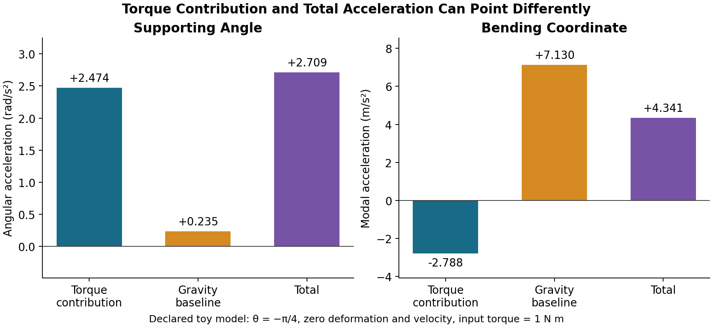

::: {.callout-important}
## Canonical Version

This is the **single-file edition** of the Drifter Manifesto, kept for readers who want the whole derivation on one page. The **maintained canonical version** is the multi-part series: [Theory Part 1](theory-part1.html) (state definition and affine derivation), [Part 2](theory-part2.html), [Part 3](theory-part3.html), [Part 4](theory-part4.html), and [Part 5](theory-part5.html), indexed at [The Drifter Manifesto — Series Index](../pages/drifter-manifesto.html). Where this page and the series differ, **the series is authoritative**.
<!-- Maintainer notice: substantive edits should be made in the multi-part series and mirrored here. -->
:::

::: {.callout-note}
## About This Document

The Drifter Manifesto establishes the control-affine framework, introduces key concepts (ZTCF, ZVCF, Drift-Control Ratio), and provides the notation used throughout AffineDrift research. The same material is developed, and maintained, in the Theory Part 1-5 series linked above.

**Provenance:** The control-affine form $\dot{x} = f(x) + G(x)u$ is established nonlinear-control material [@isidori1995nonlinear; @nijmeijer1990nonlinear; @khalil2002nonlinear]. The geometric treatment used here follows @bullo2004geometric and @bloch2003nonholonomic, and the recursive multibody foundations follow @featherstone2008rigid, @murray1994mathematical, and @lynch2017modern. The golf-oriented diagnostic terminology and synthesis are presented here as proposed research framing. The site does not establish priority or peer-reviewed validation of these applications. See [Critiques & Responses](../critiques/index.html) for documented limitations.
:::


## Part 1: State Definition and Affine Derivation {#sec-part1}

### Abstract

::: {.callout-note}
#### Novelty Status

- **Established (textbook):** Control-affine system formulation $\dot{x} = f(x) + G(x)u$ [@isidori1995nonlinear; @nijmeijer1990nonlinear; @khalil2002nonlinear]; Lagrangian derivation of rigid-body multibody dynamics [@goldstein2002classical; @lanczos2012variational; @arnold1989mathematical]; tangent space linearization.
- **Proposed golf application:** Applying the drift/input decomposition to golf biomechanics; the "Frozen Strategy" assumption for biological impedance; defining ZTCF and ZVCF as diagnostic tools for swing analysis.
- **Terminology:** The terms "drift" and "input" are standard in nonlinear control. "Zero Torque Counterfactual (ZTCF)" and "Zero Velocity Counterfactual (ZVCF)" are the authors' naming for these constructions in the golf context.
:::

::: {.callout-note}
#### Scope & Exclusions
This model captures the mechanical structure of coupled rigid bodies (golfer's limbs and torso) and a flexible shaft connected at the grip. It includes inertia, gravity, elastic and damping forces from shaft bending, and joint torques as declared inputs. It explicitly excludes aerodynamic drag, compliant or changing foot contact, marker dynamics, muscle activation delays, and impacts. Ideal fixed-base support reactions are retained through the constraints even when eliminated from the independent-coordinate equations. Terms retained in the chosen equations can be separated into autonomous and declared-input components; what is excluded lies outside the model's scope and must not be attributed by the decomposition.
:::



The golf swing is a high-speed, full-body motion executed by a mechanically complex, constrained multibody system. Conventional inverse dynamics can estimate net generalized loads consistent with motion and external-force measurements, but it does not identify individual-muscle forces, neural intent, or a unique real-world cause. This paper develops a strictly theoretical control-affine model and separates its instantaneous vector field into autonomous (drift) and declared-input terms. The ZTCF, ZVCF, and force taxonomy are model-conditioned diagnostics; empirical interpretation requires parameter identification, qualifying measurements, and validation.

Before writing equations, we ask a bounded question: at a specified model state, how much instantaneous evolution is assigned to the autonomous term, and how much to the declared torque input channel? This is mathematical bookkeeping inside a chosen mechanical model, not a direct reading of what the golfer intended or which muscles produced the motion.

```{=html}
<!-- In Layman's Terms Section - Simplified overview for non-technical readers -->
<section class="laymans-terms">
  <button type="button" class="laymans-terms-header" aria-expanded="false">
    <h2>In Layman's Terms</h2>
    <span class="laymans-terms-icon" aria-hidden="true">▼</span>
  </button>
  <div class="laymans-terms-content">
    <div class="laymans-terms-inner">
      <p class="laymans-terms-intro">
        New to control theory? Here's what this foundational article covers in everyday language.
      </p>

      <div class="laymans-item">
        <h3>The Core Question</h3>
        <p>
          At a specified state in the model, how much instantaneous motion is assigned to the autonomous dynamics, and how much is assigned to the declared input channel?
        </p>
        <div class="analogy">
          Imagine a skateboard model with gravity and a declared push force. The equations can report the term contributed by each channel at the same state, but that report does not measure the rider's intent, muscles, or biological effort.
        </div>
      </div>

      <div class="laymans-item">
        <h3>What is a "State"?</h3>
        <p>
          The "state" is a snapshot sufficient to predict the declared model under specified future inputs. Here it includes rigid configuration, shaft deformation, and their rates. Pose alone is insufficient, and a physiological model may need additional internal states.
        </p>
        <div class="key-takeaway">
          Given the current state, model parameters, and future declared inputs, the model predicts a trajectory. The state contains the model's represented "memory"; omitted biological states remain outside that prediction.
        </div>
      </div>

      <div class="laymans-item">
        <h3>The Modeling Simplifications</h3>
        <p>
          To make the math tractable, this framework makes some simplifying assumptions: body parts are treated as rigid (not squishy), the club shaft can bend but in predictable ways, and we ignore air resistance. These are standard engineering approximations.
        </p>
        <div class="analogy">
          It's like how weather models don't track every raindrop—they simplify to make predictions possible whose accuracy must be tested against the intended prediction.
        </div>
      </div>

    </div>
  </div>
</section>

<!-- Critics' Comments Section - Skeptical perspectives and counterarguments -->
<section class="critics-comments">
  <button type="button" class="critics-comments-header" aria-expanded="false">
    <h2>Critics' Comments</h2>
    <span class="critics-comments-icon" aria-hidden="true">💬</span>
  </button>
  <div class="critics-comments-content">
    <div class="critics-comments-inner">
      <p class="critics-intro">
        The following methodological objections are constructed for this article; they are not quotations or findings attributed to particular reviewers:
      </p>

      <div class="critic-item">
        <div class="critic-perspective">
          <span class="critic-label">Biomechanical Critique:</span>
          <h3>Muscles vs. Net Torque Abstraction</h3>
        </div>
        <p class="critic-argument">
          Biomechanists argue that modeling the golfer's input as a generalized torque vector $u$ is an oversimplification. Real muscles have complex force-length and force-velocity properties, meaning the available torque depends on the state $(q, \dot{q})$. By treating $u$ as an independent input, the affine model ignores the intrinsic impedance of the musculoskeletal system, potentially misattributing passive muscle stiffness (a "drift" effect) to active control.
        </p>
        <div class="author-response">
          <strong>Our Response:</strong> We acknowledge this biological reality. However, the affine decomposition $\dot{x} = f(x) + G(x)u$ remains valid if interpreted correctly: $u$ represents the <em>declared driving channel</em> after specifying the retained passive load law. Generalized damping is nonconservative too, so that label alone does not identify an active input. The "drift" term $f(x)$ captures the dynamics of the "Effective Plant"—the skeletal system plus the baseline impedance of the muscles. The ZTCF (Zero Torque Counterfactual) therefore asks "what if the net driving force vanished?", not "what if the muscles disappeared?".
        </div>
      </div>

      <div class="critic-item">
        <div class="critic-perspective">
          <span class="critic-label">Energy Dynamics:</span>
          <h3>The "Free Lunch" Fallacy</h3>
        </div>
        <p class="critic-argument">
          Critics suggest that emphasizing the "Drift" component implies that the resulting motion is "free" energy. However, the golfer must expend significant effort early in the swing to <em>create</em> the kinematic state where drift becomes dominant. By separating "Drift" from "Input" at the moment of release, the analysis might undervalue the active work done to set up the passive dynamics.
        </p>
        <div class="author-response">
          <strong>Our Response:</strong> The decomposition does not claim drift is free or passive in a physiological sense. It labels the autonomous term of the declared effective plant at the selected state. Work, metabolic effort, and the history that produced that state require separate calculations and measurements.
        </div>
      </div>

      <div class="critic-item">
        <div class="critic-perspective">
          <span class="critic-label">Methodological Concern:</span>
          <h3>Necessity of Affine Control Theory</h3>
        </div>
        <p class="critic-argument">
          Why introduce the complexity of affine control theory and Lie brackets? Standard inverse dynamics already calculates the net moments required for a motion. Critics argue that decomposing these moments into $f(x)$ and $G(x)u$ adds mathematical overhead without changing the fundamental physics of $F=ma$.
        </p>
        <div class="author-response">
          <strong>Our Response:</strong> Standard inverse dynamics provides the net generalized load consistent with a motion. A control-affine formulation adds reproducible bookkeeping: it separates the model's state-dependent autonomous term from its declared torque input term. That structure makes a precisely specified zero-input intervention well-posed, but physiological attribution still requires additional models, measurements, and identifiability evidence.
        </div>
      </div>

      <div class="academic-note">
        <strong>Note:</strong> Scientific discourse thrives on debate.
        These critiques strengthen our understanding by defining the boundaries of the theoretical model.
      </div>
    </div>
  </div>
</section>
```

#### Introduction

Traditional biomechanical analyses of the golf swing rely heavily on inverse dynamics to estimate generalized joint torques and hand forces from measured kinematics and external forces. Inverse dynamics provides net generalized loads consistent with the declared model and measurements; it does not by itself identify individual-muscle forces, intent, or biological effort.

This distinction is fundamental. Autonomous terms can be large during rapid phases, but their magnitude is not a direct indicator of biological effort. A decomposition can assign retained equation terms; it cannot determine a unique real-world cause from kinematics alone.

The aim of this manuscript is to establish a rigorous, strictly theoretical foundation for decomposing the chosen equations into two additive components:

-   **Drift terms** in the autonomous, state-dependent dynamics, and
-   **Input terms** produced by the declared generalized-torque channel.

The key mathematical observation is that the golfer--club--shaft system can be modeled as a *nonlinear control-affine mechanical system* [@isidori1995nonlinear; @bullo2004geometric]. Control-affine systems admit an additive decomposition of their dynamics into passive drift and linear control input channels [@nijmeijer1990nonlinear, Ch.~2]. Once the affine structure is established, counterfactual tools such as the *Zero Torque Counterfactual* (ZTCF) and *Zero Velocity Counterfactual* (ZVCF) follow naturally and enable clean mechanical attribution of forces within the model. The broader programme of using counterfactual reasoning to attribute causal structure to dynamical systems is laid out by @pearl2009causality; here we specialize that programme to the mechanical setting by exploiting the linear-in-input structure of the equations of motion.

This foundational treatment provides a declared mechanical model and illustrative numerical consistency checks. It does not report calibrated golfer simulations or experimental validation. The linked counterfactual and application articles develop proposed analyses; successful prediction, physiological interpretation, and technique comparisons require their own data and evidence.

A useful analogy is a model with a current-dependent baseline and a declared propulsion input. At one state, its equations assign an instantaneous contribution to each. Changing propulsion changes future state, so future baseline values also change. The resulting paths generally cannot be added as independent motions. The same distinction is essential when interpreting torque, shaft response, and subsequent contact in a golf-swing model.

The remainder of the paper is organized as follows:

-   **Part 1** defines the model and derives its coupled rigid–flexible control-affine equations.
-   **Part 2** develops the drift/input decomposition and ZTCF/ZVCF constructions.
-   **Part 3** examines drift invariance and the proposed force taxonomy.

The subsequent sections (Part 2 onwards) cover the counterfactual constructions (ZTCF/ZVCF), drift invariance, force taxonomy, and applications.

Detailed derivations, modal approximations, and toy examples are collected in the Appendices (Part IV).

To rigorously distinguish 'drift' from 'input', we must first define the mechanical universe in which these forces exist. The concepts of active and passive are not absolute; they are defined relative to the system boundary. A force that is 'external' to a sub-component may be 'internal' to the whole. Therefore, before deriving equations, we must explicitly fix the boundaries of the golfer--club--shaft system, specifying exactly which degrees of freedom are malleable (flexible modes) and which are directly actuated (joints).

#### System Definition and Modeling Assumptions

In this section we define the mathematical structure of the golfer--club--shaft system and state the modeling assumptions that bound the theoretical framework. The goal is not to fix a unique anatomical model but to specify a general class of multibody systems for which the subsequent analysis is valid.

##### Modeling Assumptions

::: callout-warning
#### Modeling Assumptions for the Theoretical Framework

These assumptions apply strictly to the theoretical decomposition presented in this manuscript (Part I). They define the mathematical boundaries of the model; empirical validation and relaxation of these assumptions will be addressed in later work.
:::

1.  **Rigid body segments.** All anatomical segments of the golfer (torso, arms, hands) are modeled as rigid bodies with fixed mass and inertia properties.
2.  **Flexible shaft via finite-dimensional modal approximation.** The shaft is modeled using $m$ vibration modes obtained from standard beam theory (e.g., Euler--Bernoulli or Timoshenko). Modal truncation approximates the distributed dynamics with a finite-dimensional representation.
3.  **No ball--club impact phase.** Ball impact is excluded from the domain of analysis due to its hybrid (non-smooth) dynamics. The continuous equations describe a declared phase before or after impact. A post-impact trajectory needs a separately specified initial state or an impact reset; these equations alone do not propagate the state through collision.
4.  **No aerodynamic forces.** Drag and lift forces on the clubhead and shaft are omitted in this theoretical treatment. Gravity and the ideal ground-support reactions remain. Internal interactions are included in the mechanical balance but are not external loads on the combined system.
5.  **Torques treated as generalized inputs.** Muscular physiology (activation dynamics, force--velocity, force--length, tendon elasticity) is abstracted into a net generalized torque vector $\tau = B(q) u$. These torques serve as the control inputs in the affine control formulation.
    -   *Mathematical Justification:* At fixed state, the Hill-type expression $\tau=\tau_{\max}f_{\text{FL}}(q)f_{\text{FV}}(\dot q)a$ is linear in activation $a$; its state-dependent gain belongs in the input map. We nevertheless declare the mechanical input at the net-torque level and treat physiological feasibility through $\mathcal{U}(x)$. Nonlinear activation dynamics, input-dependent impedance, saturation, or hysteresis require a richer model.
6.  **Ground contact modeled as holonomic constraint.** Feet--ground interaction is simplified as a fixed base with no slip or compliance; the golfer is treated as rooted at the ground.
7.  **Smooth dynamical evolution (no discontinuities).** Between impacts, the system evolves via smooth ordinary differential equations. Shaft deformation and all segmental interactions are continuous in time.
8.  **No measurement noise or parameter uncertainty.** The algebraic identities concern specified state values and parameters. Measurements and identified parameters are uncertain; the counterfactual treatment in Part 2 propagates such errors, while empirical magnitudes require data.

To translate these assumptions into a rigorous mathematical structure, we must first define the geometric manifold on which the system evolves. The assumptions above simplify the biomechanical reality into a deterministic state space, allowing us to describe the golfer not as a collection of tissues, but as a point moving along a curved surface defined by the joint constraints.

##### Generalized Coordinates and State

Let $q$ denote $n$ independent rigid-system coordinates in a local chart, and let $\eta\in\mathbb R^m$ denote the retained shaft coordinates. Write $z=(q,\eta)$ and $N=n+m$. The modeled configuration manifold is locally represented by these $N$ coordinates. A product $\mathcal Q_r\times\mathbb R^m$ is an assumption of this chosen modal representation; it is not a global anatomical description. Fixed-base joint models, joint limits, and hand-loop constraints determine $\mathcal Q_r$. They need not produce a free $SE(3)$ factor. Denavit–Hartenberg conventions and exponential-coordinate methods describe kinematics; spatial velocity vectors are not interchangeable configuration coordinates.

For independent coordinates with a nondegenerate kinetic-energy model,

$$
T(z,v)=\tfrac12v^\top M(z)v,\qquad v=\dot z,\qquad M(z)\succ0.
$$

The matrix represents a kinetic-energy metric on configuration space. Its entries change under coordinate transformations even though the physical energy does not. A redundant quaternion or constrained-coordinate representation requires its own constraints and does not justify inverting an arbitrary coordinate mass matrix.

The mechanical state belongs to the tangent bundle $T\mathcal Q$. A local representation, using the ordering retained below, is

$$
x=(q,\dot q,\eta,\dot\eta),\qquad \dim T\mathcal Q=2N.
$$

This gives $2N$ local numbers; it does not assert that the entire tangent bundle is globally Euclidean. Position and velocity close the declared torque-driven mechanical model only when its other quantities are specified. Activation, tendon, grip, hysteresis, or estimator states require additional variables if their evolution affects future loads. Alternatively, a prescribed time history makes the model explicitly time-dependent. A short swing duration does not establish that omitted states are constant.

The geometric equation is an equation for the **configuration curve** $z(t)$, not for the derivative of the full state $x(t)$. For the kinetic-energy Levi-Civita connection,

$$
(\nabla_{\dot z}\dot z)^k
=\ddot z^k+\Gamma^k_{ij}(z)\dot z^i\dot z^j.
$$

With potential $U$ and a nonconservative generalized force covector $Q_{\mathrm{nc}}$ on the right of the force balance,

$$
\nabla_{\dot z}\dot z
=-\operatorname{grad}_{M}U+M^{\sharp}Q_{\mathrm{nc}},
\qquad
\operatorname{grad}_{M}U=M^{-1}\partial_z U.
$$

Here $M^{\sharp}$ converts a force covector into a configuration tangent vector; its local matrix is $M^{-1}$. Applying another inverse mass to the already metric-defined gradient would be incorrect. If a dissipative load $d$ is written on the left, its contribution here is $-M^{-1}d$. The zero-input first-order drift is a vector field on $T\mathcal Q$, or a section of $T(T\mathcal Q)$. Only the kinetic, force-free part is the geodesic spray. Gravity, elasticity, and damping modify that field.

For example, a force-free particle with Cartesian coordinate $r>0$ and constant speed $\dot r$ has $\ddot r=0$. In the coordinate $y=r^2$, however, $\ddot y=2\dot r^2$. The metric becomes $M_y=m/(4y)$ and the connection coefficient is $\Gamma^y_{yy}=-1/(2y)$, so $\ddot y+\Gamma^y_{yy}\dot y^2=0$. Nonzero coordinate acceleration is compatible with zero physical force. Consequently, individual acceleration components and their numerical magnitudes must retain their coordinate convention, even when the complete geometric equation is consistent between charts.

These conventions follow the distinction between configuration curves, force covectors, and metric-raised forces in [Bullo and Lewis's geometric-mechanics workshop](https://motion.me.ucsb.edu/book-gcms/workshop/pdf/slides.pdf), especially the modeling discussion on PDF pages 18–22.

::: callout-note
#### Note on Constrained Subsystems (The Wrist)

The two-axis universal-joint representation is a modeling approximation to the wrist; forearm pronation and supination arise primarily at the radioulnar joints. For ideal constraints $A(z)v=0$, reaction loads have the form $A(z)^\mathsf{T}\lambda$ and annihilate admissible virtual velocities: $v^\mathsf{T}A^\mathsf{T}\lambda=0$. They lie in the range of the constraint Jacobian transpose, not generally in a null space of the actuation map $B$. Constraint reactions, actuator redundancy and muscle co-contraction are different concepts [@lynch2017modern, sec. 8.7]. See [Constraint Torques at the Wrist](wrist-universal-joint.html).
:::

##### Torque Inputs and Actuation Mapping

Muscular torques are abstracted as control inputs

$$u \in \mathbb{R}^{m_{u}}.$$

with

$$\tau = B(q)\, u,$$

where $\tau \in \mathbb{R}^{n}$ is the generalized joint torque vector and $B(q) \in \mathbb{R}^{n \times m_{u}}$ encodes actuation pathways and moment arms. At fixed configuration, $B(q)$ maps the declared input into the $n$ rigid-coordinate generalized-load components. The full map $\mathcal B=[B^\mathsf T,0]^\mathsf T$ takes values in the $N$-dimensional cotangent fiber $T_z^*\mathcal Q$. In the simplest case, $B$ is constant; more generally, it may depend on configuration. In either case, torques enter *linearly* in the equations of motion.

Throughout this paper we treat $u$ as the exogenous input at the mechanical level. The mapping from neural commands to $u$ is outside the scope of this theoretical work.

While inputs drive the system, they do not act in a vacuum. The golfer must contend with—and exploit—the environmental and inertial field. The effectiveness of any torque input is conditioned by the external forces that define the system's potential energy landscape and reaction constraints.

##### External Forces and Constraints

The mechanical balance retains gravity, ideal support reactions, passive joint loads, shaft elasticity and damping, and velocity-dependent inertial terms. Internal forces and coordinate-dependent inertial terms are not additional external forces on the combined system. In particular, the retained terms include:

-   gravitational loading,
-   inertial, Coriolis, and centrifugal effects arising from the multibody kinematics,
-   passive joint contributions (if modeled explicitly),
-   elastic and damping forces from shaft deformation.

Aerodynamic forces, impact forces, and non-holonomic contact effects are excluded under the assumptions above. Ground contact is modeled as a holonomic constraint that effectively fixes the base of the kinematic chain.

The remaining assembly step is to specify the hand–shaft interface and the flexible club geometry.

The grip transmits loads between the modeled golfer and club. A clamped proximal cross-section is compatible with a bending shaft. Relative grip compliance requires extra coordinates or constitutive laws; the interface assumption must match the Jacobians used to assemble inertia.

##### Hand–Club Kinematic Interface and Jacobian Formulation

Choose a hand-frame origin $a_h(q)$ and orientation $R_h(q)$. This subsection assumes a shaft clamped to that frame and small elastic deformation expressed through fixed body-frame trial functions. A finite-stiffness grip is a different interface model requiring relative coordinates and forces. One can weld the proximal shaft cross-section to the hand frame while retaining bending of the rest of the shaft; a clamped boundary does not make the entire club rigid.

For a reference centerline $r_0(s)$ and body-frame shape matrix $\Phi_B(s)$, use

$$
p(s,q,\eta)=a_h(q)+R_h(q)\bigl[r_0(s)+\Phi_B(s)\eta\bigr],
\qquad 0\leq s\leq L.
$$

In component notation, the local deformation is $w(s, t) = \sum_{i=1}^m \phi_i(s) \eta_i(t)$. The functions must satisfy the essential clamped conditions. Head mass, head rotary inertia, and the chosen tip connection also enter the dynamic boundary problem. Empty-cantilever natural modes are not automatically the exact modes of a shaft carrying a clubhead. Admissible assumed functions can still define an approximation, whose accuracy needs convergence and frequency/response checks.

Differentiating the actual placement gives

$$
\dot p=J_q(s,q,\eta)\dot q+J_\eta(s,q)\dot\eta,
\qquad
J_q=\partial_qp,\quad J_\eta=R_h(q)\Phi_B(s).
$$

The transport Jacobian depends on deformation because rotating a bent shaft transports a different position. The world-frame modal Jacobian depends on hand orientation. Dropping either dependence changes the velocity and kinetic energy. A hand twist and a point velocity also use different Jacobians; state the reference point and spatial/body convention before relating their components.

Let $\mu(s)$ be shaft **linear** mass density. When shaft cross-section rotary inertia is neglected, its translational kinetic energy is

$$
T_s=\tfrac12\int_0^L\mu(s)
\|J_q\dot q+J_\eta\dot\eta\|^2\,ds.
$$

This approximation should be stated explicitly; a beam model retaining cross-section rotation requires the corresponding additional energy. Expanding this square gives the two diagonal terms and the cross term $\dot q^\top\int\mu J_q^\top J_\eta ds\,\dot\eta$. The two scalar cross terms combine because they are transposes of one another, not because the two velocities are orthogonal.

For the head, use its center-of-mass position $p_C(z)$ and orientation $R_H(z)$, with body-frame inertia $I_C^B$ about that center. Define its center-of-mass Jacobian $J_C=\partial_zp_C$ and world angular-velocity Jacobian $J_\omega$ by $\omega_H=J_\omega\dot z$. Then

$$
T_H=\tfrac12m_H\|J_C\dot z\|^2
+\tfrac12(J_\omega\dot z)^\top
R_H I_C^B R_H^\top(J_\omega\dot z).
$$

The head center generally differs from the shaft endpoint. For an offset $c_C$ fixed in the head frame, $p_C=p(L,z)+R_H(z)c_C$; differentiating it retains the rotational offset velocity. Using the shaft-tip velocity with center-of-mass inertia would omit this contribution unless the center is explicitly assumed coincident with the tip.

Set $J_s=[J_q\ J_\eta]$. The complete retained mass matrix is assembled from the supporting rigid bodies, shaft, head translation, and head rotation:

$$
M(z)=M_{\mathrm{rigid}}(z)
+\int_0^L\mu J_s^\top J_s\,ds
+m_HJ_C^\top J_C
+J_\omega^\top R_HI_C^BR_H^\top J_\omega.
$$

Here $M_{\mathrm{rigid}}$ is embedded in the full $N$-coordinate space. Partitioning this **complete** matrix produces $M_{qq}$, $M_{q\eta}$, and $M_{\eta\eta}$; club-only translational integrals must not silently replace the whole system inertia. Symmetry follows from the energy construction, and positive definiteness requires that the retained independent velocities have positive kinetic energy.

Modal normalization is a choice of coordinates. It can make the reference modal mass identity when it includes every retained inertia contribution. It does not prove that an arbitrary nonlinear model has constant identity modal mass. If $\eta=S\xi$, then $M_{\xi\xi}=S^\top M_{\eta\eta}S$ and $M_{q\xi}=M_{q\eta}S$. The resulting energy is unchanged when velocities transform consistently. Altering stiffness can also alter natural mode shapes if those shapes are recomputed; claims of stiffness-independent coefficients must specify which representation is held fixed.

###### A Rotating Flexible-Link Check

Consider an illustrative planar assembly with rigid coordinates $(a,\theta)$ and one bending coordinate $\eta$. With $L=1$ m, use $r_0=(s,0)$, $\Phi_B=(0,(s/L)^2)^\top$, and hand origin $(a,0)$. Retain a shaft density of $0.1$ kg/m, a $0.2$ kg head, supporting inertia $\operatorname{diag}(1\ \mathrm{kg},0.2\ \mathrm{kg\,m^2})$, and head center offset $(0.1,0.05)$ m. For this small-slope toy model, take head orientation $\theta+2\eta/L$ and head inertia $0.03$ kg m$^2$.

The example isolates coordinate and coupling effects; these are chosen parameters, not identified golf equipment or anatomical data. At $\eta=0.02$ m, assembling the complete energy matrix and defining $\Gamma=-M_{\eta\eta}^{-1}M_{\eta q}$ gives approximately

$$
\begin{aligned}
\Gamma(\theta=0)&=(0.050389,-0.815210),\\
\Gamma(\theta=\pi/2)&=(0.636186,-0.815210).
\end{aligned}
$$

The first coefficient maps translational acceleration into modal acceleration and is dimensionless; the second maps angular acceleration and has units of meters per radian. Equipment parameters have not changed. The posture-dependent direction of the modal velocity changes its overlap with the fixed world translation, changing the first coupling coefficient. Rescaling the modal coordinate would change the coefficients again without changing the physical motion.

The [accompanying executable checks](https://github.com/D-sorganization/AffineDrift/blob/main/tests/test_manifesto_flexible_foundations.py) differentiate the point and head placements numerically, compare assembled and directly integrated kinetic energy, and recover acceleration using both the full mass matrix and its Schur complement. This is a reproducible mechanics check, not a claim that a real golfer should prefer either posture.

##### Notation Table

For reference, the following table summarizes the main symbols used in the manuscript.

| Symbol | Meaning |
|----------------------------------|--------------------------------------|
| $q$ | Independent rigid-system coordinates in a local chart |
| $\dot{q}, \ddot{q}$ | Generalized coordinate rates and accelerations |
| $\eta \in \mathbb{R}^{m}$ | Modal coordinates of the flexible shaft |
| $\dot{\eta}, \ddot{\eta}$ | Modal velocities and accelerations |
| $x$ | Mechanical state on $T\mathcal Q$, locally ordered as $(q,\dot q,\eta,\dot\eta)$ |
| $u \in \mathbb{R}^{m_{u}}$ | Control input vector (abstracted muscular torques) |
| $\tau \in \mathbb{R}^{n}$ | Generalized torque vector: $\tau = B(q) u$ |
| $B(q)$ | Input mapping matrix from control channels to generalized torques |
| $M(q,\eta)$ | Inertia matrix for coupled rigid--flexible system |
| $C(q,\dot{q},\eta,\dot{\eta})$ | Coriolis/centrifugal matrix |
| $G(q)$ | Gravitational torque vector |
| $K_{s}$ | Modal stiffness matrix of the shaft |
| $C_{s}$ | Modal damping matrix of the shaft |
| $f(x)$ | Drift vector field (passive dynamics) |
| $G(x)$ | Input vector fields defining linear influence of torque inputs |
| $F_{\text{drift}}$ | Generalized drift force (passive component) |
| $F_{\text{input}}$ | Generalized input force (torque-driven component) |
| $F_{\text{total}}$ | Total generalized force |
| ZTCF | Zero Torque Counterfactual |
| ZVCF | Zero Velocity Counterfactual |
| $\phi_i(s)$ | Declared body-frame deformation shape functions |
| $t$ | Time |

: Summary of main symbols {#tab:notation}

#### Unified Control-Affine Derivation (Rigid + Flexible System)

##### Lagrangian Formulation

Use the complete configuration $z=(q,\eta)$ and $v=\dot z$. In the stated smooth, independent-coordinate model, let $\mathcal L=T-U_g-\tfrac12\eta^\top K_s\eta$ and retain a separately declared passive joint load $\tau_{\mathrm{pas}}(q,\dot q)$. For constant symmetric modal stiffness and damping matrices, the generalized force balance is

$$
M(z)\dot v+C(z,v)v+g(z)
+\begin{bmatrix}\tau_{\mathrm{pas}}(q,\dot q)\\K_s\eta+C_s\dot\eta\end{bmatrix}
=\begin{bmatrix}B(q)u\\0\end{bmatrix}.
$$

Here $g(z)=\partial_z U_g(z)$ generally acts on both rigid and modal coordinates. The lower zero says that no **direct generalized input** is applied to the retained shaft coordinates. It does not set their acceleration, velocity, or restoring force to zero. Underactuation is a rank statement: the full $N$-row generalized-force input map has rank less than $N$ when $m>0$ and its lower block vanishes. An arbitrary number of channels need not equal its rank; redundant actuators are possible.

For a standard Christoffel choice of $C$, using indices for the complete coordinate $z$,

$$
C_{kj}(z,v)=\tfrac12\sum_{i=1}^{N}
\left(\partial_i M_{kj}+\partial_j M_{ki}-\partial_k M_{ij}\right)v_i.
$$

The resulting $\dot M-2C$ is skew-symmetric. The vector $Cv$ is fixed by this kinetic model, although a matrix representation of velocity-product terms need not be unique. The energy identity helps check the derivation: inertia and its velocity terms do not supply extra work.

If $\tau_{\mathrm{pas}}=\partial_q U_j+d_j$ and the damping loads satisfy $\dot q^\top d_j\geq0$ and $C_s\succeq0$, then

$$
E=T+U_g+U_j+\tfrac12\eta^\top K_s\eta,
\qquad
\dot E=\dot q^\top Bu-\dot q^\top d_j-\dot\eta^\top C_s\dot\eta.
$$

This balance assumes time-independent parameters and no additional work-doing external loads. A time-varying spring, moving support, aerodynamic load, or contact requires its own term. At impact a separate jump model replaces the smooth balance. Inertial coupling can redistribute energy among coordinates; it is not an additional energy source. Generalized mechanical power also does not measure metabolic expenditure.

##### Control-Affine State Space Form

Define the **entire** input-independent load consistently:

$$
h(x)=C(z,v)v+g(z)
+\begin{bmatrix}\tau_{\mathrm{pas}}(q,\dot q)\\K_s\eta+C_s\dot\eta\end{bmatrix}.
$$

Dropping the passive joint load here would define a different plant from the one just derived. With $H(z)=M(z)^{-1}$, write

$$
\begin{aligned}
a_{\mathrm{drift}}(x)&=-H(z)h(x),\\
A_{\mathrm{input}}(x)&=H(z)\begin{bmatrix}B(q)\\0\end{bmatrix},\\
\dot v&=a_{\mathrm{drift}}+A_{\mathrm{input}}u.
\end{aligned}
$$

These are acceleration contributions. The corresponding generalized force is $[Bu;0]$; force and acceleration should not be given the same name. Numerical implementations normally solve linear systems with $M$ rather than explicitly form its inverse. The following block inverse is an explanatory identity and an independent implementation check.

Partition $M$ into rigid and modal blocks. Because $M\succ0$, its principal block $M_{\eta\eta}$ and the Schur complement

$$
\Delta=M_{qq}-M_{q\eta}M_{\eta\eta}^{-1}M_{\eta q}
$$

are positive definite. From the lower row of $MH=I$,

$$
H_{\eta q}=-M_{\eta\eta}^{-1}M_{\eta q}H_{qq},
\qquad H_{qq}=\Delta^{-1}.
$$

This is a **positive-semidefinite reduction** of $M_{qq}$: $M_{qq}-\Delta\succeq0$. It need not be strictly positive in every direction. For example, $M_{qq}=3I_2$, $M_{q\eta}=(0.5,0)^\top$, and $M_{\eta\eta}=2$ give $\Delta=\operatorname{diag}(2.875,3)$; the second direction is unchanged. Calling this matrix an articulated-body spatial inertia without qualification would also obscure its coordinate meaning: it is an effective generalized-coordinate inertia after eliminating the modal acceleration from this block system.

Define the coupling matrix

$$
\Gamma(z)=-M_{\eta\eta}^{-1}M_{\eta q}.
$$

The input-induced accelerations at the **same state** satisfy

$$
\ddot q_{\mathrm{input}}=\Delta^{-1}Bu,\qquad
\ddot\eta_{\mathrm{input}}=\Gamma\ddot q_{\mathrm{input}}.
$$

This is the input contribution, not the total modal acceleration. The complete lower force balance instead gives

$$
\ddot\eta=\Gamma\ddot q-M_{\eta\eta}^{-1}h_\eta.
$$

Thus modal gravity, elasticity, damping, and velocity terms still act even when the instantaneous input-induced component vanishes. A coupling block can also vanish at a particular configuration without proving that the entire motion is dynamically decoupled. Geometry, velocity, and the other retained terms must be considered together.

The coefficients of $\Gamma$ depend on the current mass blocks, coordinate and modal normalization, modeled body geometry, and equipment parameters. They are not generally a fixed gear ratio of the club. Stiffness does not appear explicitly in this algebraic expression when $M$ and the basis are held fixed; it still changes trajectories and may change a basis computed from natural modes. An input history changes future state, and therefore future drift and input matrices, even though the same-state decomposition is additive.

##### From an Input Map to an Acceleration Set

A matrix alone is not a mobility ellipsoid. For a declared input set $\mathcal U(x)$, the instantaneous input-induced acceleration set is $A_{\mathrm{input}}\mathcal U(x)$. Ellipsoidal input bounds $u^\top Ru\leq1$ produce an ellipsoid in the image of $A_{\mathrm{input}}R^{-1/2}$, potentially of lower dimension. Box bounds produce a generally different set. Scaling, units, and rank must be stated before comparing its axes.

For a configuration output $y=Y(z)$, acceleration is $\ddot y=J_Y\dot v+\dot J_Yv$. Its input contribution is $J_YA_{\mathrm{input}}u$, while the kinematic $\dot J_Yv$ term remains in the same-state baseline. This output-dependent calculation is what connects a generalized-coordinate result to clubhead translation or another measured quantity. It still does not establish finite-horizon reachability, impact accuracy, or a coaching optimum.

The standard mass-matrix and force–velocity conventions are developed in [Lynch and Park's Lagrangian dynamics supplement](https://modernrobotics.northwestern.edu/nu-gm-book-resource/chapter-8-1-lagrangian-formulation-of-dynamics-part-1-of-2/) and [their mass-matrix interpretation](https://modernrobotics.northwestern.edu/nu-gm-book-resource/8-1-3-understanding-the-mass-matrix/). The rotating flexible-link and rank-deficient Schur examples above are independently constructed checks, not results those sources report about golf.

##### First-Order State-Space Form

We now express the dynamics in first-order form. Recall

$$x = [q^{T}, \dot{q}^{T}, \eta^{T}, \dot{\eta}^{T}]^{T}.$$

The state derivative is

$$\dot{x} =
  \begin{bmatrix}
    \dot{q} \\[0.2em]
    \ddot{q} \\[0.2em]
    \dot{\eta} \\[0.2em]
    \ddot{\eta}
  \end{bmatrix}
  =
  f(x) + G(x)\,u,$$

where

$$f(x) =
  \begin{bmatrix}
    \dot{q} \\
    [a_{\text{drift}}(x)]_{1:n} \\
    \dot{\eta} \\
    [a_{\text{drift}}(x)]_{n+1:n+m}
  \end{bmatrix},
  \qquad
  G(x) =
  \begin{bmatrix}
    0 \\
    [A_{\text{input}}(x)]_{1:n,:} \\
    0 \\
    [A_{\text{input}}(x)]_{n+1:n+m,:}
  \end{bmatrix}.$$

Here $[\cdot]_{1:n}$ and $[\cdot]_{n+1:n+m}$ denote the rigid and flexible components of the acceleration, and $[\cdot]_{:, :}$ denotes the appropriate block of the input matrix.

This is a nonlinear control-affine system:

$$\dot{x} = f(x) + G(x)\,u.$$

Both $f(x)$ and $G(x)$ may depend nonlinearly on state, including through shaft flexibility. The input dependence is linear in $u$ at a fixed state. The purely rigid-body model is recovered by setting $m = 0$.

##### Structural Consequences and the Golf Interpretation

The same-state decomposition is linear in the declared input at fixed state. Flexibility changes the state, energy, bias loads, and coupled inertia; it can therefore affect both drift and input matrices. It does not, by itself, remove control-affinity. State-dependent actuator gains can also be represented by a state-dependent input map $G(x)$ and do not by themselves break control-affinity. Nonlinear dependence on the chosen command, changing contact modes, or unmodeled actuator states requires a different or enlarged model.

Changing coordinates transforms the full vector fields consistently; it does not preserve every individual acceleration component or numerical ratio. Changing the declared input baseline is a different operation. If $u=\alpha(x)+\beta(x)w$, the new drift is $f+G\alpha$ and the new input matrix is $G\beta$. Zero $w$ is generally not zero $u$. The drift is intrinsic only after the model, input convention, retained environment, and intervention are fixed.

A zero-input trajectory must be integrated from a stated initial condition. Subtracting instantaneous terms at recorded states does not produce that trajectory automatically. Along two different controlled trajectories, the drift values can differ because the states differ. The decomposition neither partitions a finite motion into independent additive paths nor determines a unique biological cause from kinematics.

The proposed frozen-impedance baseline holds a specified passive joint law and its parameters fixed while removing the declared driving channel. It is a modeling intervention, not proof that a golfer can independently maintain the same biological stiffness with zero net drive. Co-contraction can change torque and impedance together; its identification needs actuator and tissue models and additional observations. A clamped shaft boundary also differs from a finite-stiffness grip, even if either model uses parameters that are constant in time.

For golf, these distinctions explain why posture, torque history, shaft response, and impact sensitivity are intertwined. Changing posture can change how torque influences a particular head-motion component. The resulting trajectory changes the state from which passive loads act. Shaft elasticity stores and returns energy, and the head offset changes both its translational velocity and its contribution to inertia. None of those observations alone establishes which technique delivers the desired contact with less effort or variability. That comparison needs a feasible input history, an explicit first-contact task, calibrated parameters, and an uncertainty-aware evaluation.

The present derivation is exact for its stated finite-dimensional equations, subject to their regularity and nondegeneracy assumptions. Approximation of a distributed shaft and a human golfer remains a separate question. Verify the assembly numerically, test mode/mesh convergence, compare predicted forces and motions with suitable data, and retain the limits of those comparisons. A successful algebraic check establishes consistency of a model calculation; it does not validate physiology or a universal swing prescription.

#### Related Articles

::: {.callout-note}
#### See Also

- **[Part 2: Counterfactual Diagnostics (ZTCF/ZVCF)](theory-part2.html)** — Uses the control-affine structure to define and analyze zero-torque and zero-velocity counterfactuals
- **[Part 3: Drift Invariance and Force Taxonomy](theory-part3.html)** — Examines same-state drift invariance under a declared input convention
- **[Affine Nature of the Golf Swing](affine-nature-golf-swing.html)** — Alternative treatment of the same foundations with more detail on the rigid+flexible system
- **[Sources of Nonlinearity](sources-of-nonlinearity.html)** — Catalog of biological and physical nonlinearities that fall outside the affine model scope
- **[Drift-Control Ratio](controllability-drift-ratio.html)** — Examines metric-dependent drift/input magnitudes and their limits
:::

#### Recommended Resources

Read these sources alongside the derivation, using their stated mechanical models and conventions:

- [Bullo and Lewis: Geometric Control of Mechanical Systems](https://motion.me.ucsb.edu/book-gcms/) supplies the geometric framework. Their [workshop slides, PDF pages 18–22](https://motion.me.ucsb.edu/book-gcms/workshop/pdf/slides.pdf), distinguish configuration acceleration, force covectors, and the kinetic-energy metric. The book treats mechanical control; it does not establish a golf-specific physiological interpretation.
- [Lynch and Park: Lagrangian Dynamics](https://modernrobotics.northwestern.edu/nu-gm-book-resource/chapter-8-1-lagrangian-formulation-of-dynamics-part-1-of-2/) derives mass, velocity-product, gravity, and applied-force terms. Their [mass-matrix supplement](https://modernrobotics.northwestern.edu/nu-gm-book-resource/8-1-3-understanding-the-mass-matrix/) explains configuration dependence and why force and acceleration generally need not align. Read the accompanying transcripts as well as the illustrations.
- [Featherstone's rigid-body dynamics teaching material](https://royfeatherstone.org/teaching/index.html) supports efficient multibody computation and spatial-vector conventions. Distinguish those spatial inertias from the generalized-coordinate Schur complement used here.

The flexible-link numerical example in this article is a reproducible model check with declared illustrative parameters. These references support its underlying mechanics; they do not supply measured golfer parameters, demonstrate an optimal swing, or validate the proposed biological counterfactual.

## Part 2: Drift/Input Decomposition, ZTCF, and ZVCF {#sec-part2}

### What the Two Baselines Ask

A swing carries the consequences of earlier action into its later motion. Joint torques change velocities, posture and shaft deformation; those state changes affect the forces and accelerations that follow. A large motion-dependent term near contact can therefore reflect earlier torque input. It does not establish that the golfer has stopped contributing.

The **Zero Torque Counterfactual (ZTCF)** sets a declared torque channel to zero in a specified model. The **Zero Velocity Counterfactual (ZVCF)** evaluates that model at a specified velocity-reset state. The first can define a future trajectory; the second is a state evaluation. Neither operation weighs the club as it feels to the golfer, identifies intention, or partitions clubhead speed into percentages supplied by “physics” and “the player.”

These names are this site's diagnostic terminology. Their underlying force balance and differential equations are established mechanics; applying them to golf does not itself demonstrate novelty or empirical validity.

### Drift vs. Input Decomposition {#drift-vs-input-decomposition}

Let $z=(q,\eta)$ collect independent rigid and flexible coordinates, $v=\dot z$, and $N=\dim z$. In one declared smooth contact mode, write

$$
M(z)\dot v+h(z,v)=\mathcal B(z)u,\qquad
a_d=-M^{-1}h,\qquad A=M^{-1}\mathcal B.
$$

Here $M$ is the complete positive-definite inertia matrix. The signed bias load $h$ includes the retained gravity, elastic, dissipative, velocity-dependent and external-load terms, with the conventions of Part 1. State-only does not mean biologically passive: an identified effective impedance can contain effects of sustained activation.

At the **same state**, $\dot v=a_d+Au$ and $\dot x=f(x)+G(x)u$. These are sums of acceleration or state-rate vectors. They are not separate paths whose positions add to the observed swing. Generalized forces are covectors; multiplication by the inverse inertia maps the force balance into coordinate acceleration. Integrating a force vector alone does not generate a trajectory.

The number of written input channels need not equal their rank. Instantaneous acceleration authority depends on $\operatorname{rank}\mathcal B$, its values, admissible inputs and constraints. Several actuators may have redundant effects, and unactuated coordinates can accelerate through coupling. Neither a large drift norm nor a channel count establishes finite-time uncontrollability.

With $u$ measured in torque units, the corresponding load bookkeeping is

$$
\tau_{\mathrm{ID}}=M\dot v+h=\mathcal B u,\qquad
\tau_{\mathrm{resultant}}=M\dot v=-h+\mathcal B u.
$$

The inverse-dynamics applied load and the resultant are different quantities. A force plate, a hand wrench, a generalized torque and $M\dot v$ cannot be interchanged without the appropriate model and mapping.

### Zero Torque Counterfactual (ZTCF)

#### A Pointwise Sample and a Freely Evolving Counterfactual

The [canonical ZTCF family](zero-torque-counterfactual.html#sec-ZTCF-canonical) distinguishes four constructions. A **pointwise sample** evaluates $f(x(t_b))$ at an actual state. A **stitched pointwise trace** collects such samples along the actual motion. A **forward trajectory** initializes once and follows the zero-input model. A **branched family** repeats the forward experiment from several actual states, keeping its branches separate.

For a branch time $t_b$, the forward construction is

$$
\dot x^0(t)=f(x^0(t)),\qquad x^0(t_b)=x(t_b).
$$

The model parameters, retained loads, input definition and initial state are specified, including auxiliary states such as activation if present. All subsequent evaluations use the evolving $x^0$, not the recorded $x(t)$. A stitched trace generally is not a solution of this initial-value problem. Even in the scalar model $\dot x=-x+1$, $x(0)=0$, integrating the drift sampled along the actual solution gives $-\int_0^t(1-e^{-s})\,ds$; the freely evolving zero-input solution remains zero.

Local uniqueness follows when the drift field is locally Lipschitz on the relevant state domain. It does not guarantee existence for an arbitrary duration, admissibility of zero input, avoidance of singularities, or continuation through contact. State explicitly whether a branch stops at first contact, at domain exit, or at a prescribed time. A hybrid continuation needs its own mode, contact and reset rules; different branches can reach different events or never reach the chosen event.

A time-dependent retained load or stiffness schedule requires $f(t,x)$ and a two-time solution map, or an augmented clock state. Keeping the recorded schedule is one intervention. Freezing its value at the branch is another.

#### Why the Trajectory Difference Is More Than the Input Term

For two trajectories in a common coordinate chart, let $e=x-x^0$. Their exact difference equation is

$$
\dot e=f(x)-f(x^0)+G(x)u,\qquad e(t_b)=0.
$$

The first difference accounts for the state changes induced after branching. Thus a forward contrast includes the consequences of altered geometry, velocity, gravity projection and shaft deformation. It is not simply an integral of the instantaneous input contribution. For $\dot x=-x+u$ with constant $u$ and matching initial states, $e(t)=u(1-e^{-(t-t_b)})$, whereas integrating $u$ alone gives $u(t-t_b)$.

For golf, report a defined output: for example, clubhead velocity in a specified frame, face orientation, or location at first admissible ball contact. A velocity-vector difference is not a speed difference, since taking a norm is nonlinear. A difference at equal clock time is not a difference at each branch's contact time. Comparisons that omit these distinctions can label altered event timing as an apparent force or speed contribution.

#### Using ZTCF With Inverse Dynamics



#### A Complete Torque and Power Example

Consider an illustrative damped pendulum with inertia $I=1\ \mathrm{kg\,m^2}$, point mass $m=1\ \mathrm{kg}$ at length $L=1\ \mathrm m$, damping $b=0.2\ \mathrm{N\,m\,s/rad}$, and $g=9.81\ \mathrm{m/s^2}$. Measure angle $\theta$ from downward vertical. At $\theta=\pi/6$, $\dot\theta=2\ \mathrm{rad/s}$ and applied torque $u=3\ \mathrm{N\,m}$,

$$
\begin{aligned}
h&=mgL\sin\theta+b\dot\theta=5.305\ \mathrm{N\,m},\\
a_d&=-5.305\ \mathrm{rad/s^2},\\
\ddot\theta&=(u-h)/I=-2.305\ \mathrm{rad/s^2}.
\end{aligned}
$$

The resultant torque is $-2.305\ \mathrm{N\,m}$, the drift load is $-5.305\ \mathrm{N\,m}$, and the input is $+3\ \mathrm{N\,m}$. Inverse dynamics returns $I\ddot\theta+h=3\ \mathrm{N\,m}$. This is a **pointwise generalized-torque decomposition** with a complete equation behind the arithmetic.

Applied power is $u\dot\theta=6\ \mathrm W$. Dissipation is $b\dot\theta^2=0.8\ \mathrm W$, so total mechanical energy increases at $5.2\ \mathrm W$. Nevertheless, kinetic energy decreases at $I\dot\theta\ddot\theta=-4.61\ \mathrm W$ while gravitational potential energy increases at $mgL\sin\theta\dot\theta=9.81\ \mathrm W$. Positive input work can accompany deceleration.

In general, for conjugate joint torque and velocity,

$$
P = \tau^\mathsf{T}\dot{q},\qquad
W = \int_{t_0}^{t_1}P(t)\,dt.
$$

A signed torque alone does not determine power, much less efficiency or the change in a remote segment's speed. The net input **does not identify individual muscle forces**. These are illustrative mechanical calculations, not measurements from a golfer.

### Output Tolerance Determines the Horizon

Nonlinearity does not imply chaos or exponential divergence. The scalar nonlinear system $\dot x=-x-x^3$ contracts: the separation of two solutions decreases at least as fast as $e^{-t}$ in its scalar coordinate. For a free double integrator, an initial velocity error produces linearly growing position error. Conversely, a linear system can have substantial transient amplification even when all eigenvalues have negative real parts.

To estimate sensitivity around a nominal zero-input branch, choose dimensionless state coordinates and a declared norm. The first-order perturbation satisfies

$$
\delta\dot x=J_f(t)\delta x+r(t),\qquad
J_f(t)=D_x f(x^0(t)),
$$

where $r$ represents the linearized parameter or forcing perturbation. The state-transition matrix solves $\dot\Phi=J_f\Phi$, $\Phi(s,s)=I$, giving

$$
\delta x(t)=\Phi(t,t_b)\delta x_b
 +\int_{t_b}^{t}\Phi(t,s)r(s)\,ds.
$$

This variational formula is a local approximation. A finite-error bound needs a Jacobian bound over a domain containing the segments between the perturbed and nominal states, together with bounds on model mismatch and continued domain membership. For the Euclidean logarithmic norm

$$
\mu_2(J)=\lambda_{\max}\!\left(\frac{J+J^\mathsf T}{2}\right),
$$

suppose $\mu_2(D_xf)\le \bar\mu(t)$ throughout that domain and the additive mismatch has norm at most $\bar r(t)$. Then

$$
\begin{aligned}
\|e(t)\|&\le E(t,t_b)\|e_b\|
 +\int_{t_b}^t E(t,s)\bar r(s)\,ds,\\
E(t,s)&=\exp\!\left(\int_s^t\bar\mu(\xi)\,d\xi\right).
\end{aligned}
$$

To obtain the bound, express the field difference as the Jacobian integrated along the segment between states. The logarithmic-norm bound gives the upper right derivative $D^+\|e\|\le\bar\mu\|e\|+\bar r$; scalar comparison and an integrating factor give the displayed result. Domain membership is required for that argument.

This is an upper bound, not a measured growth rate or a Lyapunov exponent. Bounds from a nominal Jacobian alone do not automatically cover finite nonlinear deviations. Raw mixed-unit state norms are also misleading: changing position units from meters to millimeters changes the Euclidean logarithmic norm of a position–velocity system. Fix scales or a physically justified metric before comparing growth.

For example, $J=[-1,10;0,-1]$ has stable eigenvalues but maps $e(0)=(0,1)$ to $e^{-t}(10t,1)$. At $t=1$, its error norm is about $3.70$, while the logarithmic-norm bound is $e^4\approx54.6$. Neither number is a measured golf-swing sensitivity. In $\dot e=-e+r$ with bounded $|r|\le0.005$ and $|e(0)|\le0.02$, the bound $0.02e^{-t}+0.005(1-e^{-t})$ decreases toward a model-error floor. A longer horizon need not always make the bound larger.

Translate state uncertainty into the output being judged. For a fixed-time output $Y(x)$, the first-order change is $D Y\,\delta x$. For a contact surface $\gamma(x)=0$ with $\nabla\gamma^\mathsf T F^-\ne0$, the first-order event-time correction is

$$
\delta t_c=-\frac{\nabla\gamma^\mathsf T\delta x^-}
                   {\nabla\gamma^\mathsf T F^-},\qquad
\delta x_c=\delta x^-+F^-\delta t_c.
$$

Apply the output derivative to $\delta x_c$, and include any impact reset derivative for post-impact outputs. Near grazing contact the denominator can be small, and this first-order event calculation can become unreliable. Contact existence and event ordering also need checking.

As a simple illustration, a projectile starting at the origin with constant velocities $(v_x,v_y)$ crosses the plane $x=D$ at height $y_c=v_yD/v_x$. At $D=1\ \mathrm m$, $v_x=2\ \mathrm{m/s}$ and $v_y=0.1\ \mathrm{m/s}$, $\partial y_c/\partial v_x=-0.025\ \mathrm s$. Horizontal-speed uncertainty changes height at contact through timing even though height at a fixed time has no such dependence.

Declare an output tolerance, parameter/measurement uncertainty, integration error allowance and domain/contact checks. A defensible horizon is where those requirements remain satisfied for the chosen branch and output. This article establishes no universal millisecond cutoff for trustworthy golf counterfactuals. Deterministic bounds are not confidence intervals; probability claims require a justified uncertainty distribution.

### Zero Velocity Counterfactual (ZVCF)

At a specified configuration, reset the declared velocity coordinates while retaining the other declared states. This evaluates configuration-dependent loads; it neither holds the club in equilibrium nor measures perceived heaviness. The force, acceleration and holding-load signs are made explicit below.



### Evidence Needed for a Golf Interpretation

An ordinary recorded swing does not directly reveal its alternative zero-input trajectory. Zero **net** torque can occur despite nonzero individual muscle forces; whether an entire zero-input branch is feasible depends on the actuator and contact model. The obstacle is counterfactual identification and intervention fidelity, not a universal impossibility of zero net torque.

Analytic solutions, energy checks and independent implementations verify the computations. Physical validation additionally requires measured states and external loads, identified parameters, held-out predictions and uncertainty propagation. Agreement with the same data used to fit the model is not an independent prediction test.

Nesbit's 2005 golf study uses measured motion to drive a coupled body/club model and reports forces, torques, work and shaft behavior. It supports measurement-conditioned mechanical analysis, not validation of this site's freely evolving zero-torque branches. See the [primary article](https://www.jssm.org/volume04/iss4/cap/jssm-04-499.pdf).

The practical research question is how earlier input builds the state, how current input changes its derivative, and how both affect delivery under constraints and uncertainty. Answering it requires those three levels to remain connected without treating their quantities as interchangeable.

## Part 3: Drift Invariance and Force Taxonomy {#sec-part3}

### What Remains Fixed When Input Changes

“Drift invariance” has a narrow mathematical meaning: at a fixed complete state and fixed model parameters, the declared drift field contains no current input variable. It does not say that trying harder leaves a human swing unchanged. Prior input changes posture, velocity, deformation and physiological state; those changes alter the drift sampled during the swing.

The useful question is therefore what a particular intervention holds fixed. Changing net joint torque, changing muscle excitation, changing grip stiffness, and changing equipment are different experiments. This part makes those distinctions explicit and connects force bookkeeping to acceleration, power, contact and evidence.

### Drift Invariance and Input Constraints

#### Same-State Definition and Consistent State Ordering

For independent coordinates $z=(q,\eta)$, velocity $v=(v_q,v_\eta)$, and complete force balance $M\dot v+h=\mathcal B u$, let $a_d=-M^{-1}h$ and $A=M^{-1}\mathcal B$. With the interleaved state convention of Part 1,

$$
\begin{aligned}
x&=(q,v_q,\eta,v_\eta),\\
f(x)&=(v_q,[a_d]_q,v_\eta,[a_d]_\eta),\\
G(x)u&=(0,[Au]_q,0,[Au]_\eta).
\end{aligned}
$$

The component groups on both sides must have the same order and dimensions. If positions and velocities are instead stacked as $(z,v)$, permute every vector and Jacobian consistently.

**Conditional proposition.** If $M$, $h$ and $\mathcal B$ contain no instantaneous $u$ at fixed state and parameters, then the model is affine in $u$, with

$$
\left.\frac{\partial f}{\partial u}\right|_{x,\mathrm{parameters}}=0,
\qquad
\left.\frac{\partial\dot v}{\partial u}\right|_x=M^{-1}\mathcal B.
$$

The proof is substitution into the force balance and inversion of the positive-definite $M$. Differentiating $-M^{-1}h$ with respect to an absent variable gives zero. This is a consequence of the model declaration, not an independent experiment establishing physiological separation.

In standard Lagrangian notation, the velocity load $C(z,v)v$ is quadratic in $v$ when $C$ is chosen linear in $v$; calling the matrix $C$ itself quadratic generally misstates the convention. The complete $h$ also includes retained passive joint forces, modal gravity, shaft elasticity and damping, and declared external loads. Omitting a term changes the model even when its control-affine structure survives.

Smoothness and affinity are separate properties. Any retained state-only damping can enter $h$, including nonlinear damping. Coulomb friction is nonsmooth at zero slip. Within a fixed sliding mode it can remain affine in input if its normal force is affine; sticking, contact switching and nonlinear input-dependent loads require their own solve or differential inclusion.

#### Changing the Input Zero Changes the Baseline

The zero-input drift is tied to a specified input convention. Under a new input $w$ defined by $u=\alpha(x)+\beta(x)w$,

$$
\dot x=\underbrace{f(x)+G(x)\alpha(x)}_{\widetilde f(x)}
       +\underbrace{G(x)\beta(x)}_{\widetilde G(x)}w.
$$

Setting $w=0$ keeps the original bias input $\alpha$; setting $u=0$ removes it. For a pure unit change with $\alpha=0$, zero is preserved. For a shifted or feedback-compensated command, the two zero-input experiments differ. Thus drift is not an input-coordinate-independent definition of “what physics alone contributes.”

For a fixed original model, changing the torque history leaves the function $f$ unchanged but generally changes $f(x(t))$. In a complete Markov state, previous inputs affect the future through that state; an omitted activation, hysteresis or fatigue variable appears as unexplained history dependence. Parameter changes can alter both $f$ and $G$, although a particular value or output can be unchanged by symmetry or cancellation.

#### A Stiffness Input Can Still Be Affine

Consider a one-coordinate translational model with physical mass $m>0$, damping $c$, baseline stiffness $k_0$, force input $u_f$ and stiffness increment $u_k$:

$$
m\ddot q=-k_0q-c\dot q+u_f-u_kq.
$$

At fixed $(q,\dot q)$ it is affine in the two inputs, with acceleration gain $(1/m,-q/m)$. The product $u_kq$ is bilinear in state and input and **still control-affine**. Stiffness has not been added to the inertia $m$. Effective frequency-response quantities may combine elastic and inertial effects, but that does not make an elastic coefficient a physical mass.

If stiffness instead depends on a dimensionless command $e_k$ through $k=k_0+k_{\mathrm{ref}}e_k^2$, where $k_{\mathrm{ref}}>0$ has stiffness units, acceleration is generally nonlinear in $e_k$. Reparameterizing by $\kappa=e_k^2$ changes the feasible set and can lose sign information; it is not an equivalent unconstrained actuator. If a model genuinely has $M(x,u)$, its acceleration must be inspected after inversion. Input-dependent inertia is neither required by changing stiffness nor automatically affine.

Prescribed time-varying stiffness is another case. For
$U(q,t)=\tfrac12 k(t)q^2$, the mechanical energy satisfies

$$
\dot E=u_f\dot q-c\dot q^2+\tfrac12\dot k(t)q^2.
$$

Maintaining a stiffness schedule can exchange energy through the parameter-changing mechanism. A scheduled-impedance baseline must account for this port; zero driving torque does not imply that the retained model has no active energy source. A fixed clamped boundary, finite grip compliance, and a scheduled stiffness law are distinct models.

#### Excitation, Torque Bounds and Feasible Interventions

An illustrative activation model uses a state $a$ and excitation $e$:

$$
\dot q=v,\qquad
I\dot v=\tau_{\max}(q,v)a-h(q,v),\qquad
\dot a=(e-a)/T_a.
$$

For constant $T_a>0$, this augmented system is affine in excitation $e$, even though its torque depends on state. Setting excitation to zero leaves $a(t)=a(t_b)e^{-(t-t_b)/T_a}$ and initially nonzero torque. Setting a torque-level input to zero is a different intervention. Real activation models require their own parameter identification, bounds and examination of input dependence; this equation is a teaching example.

A feasible set $u\in\mathcal U(x)$ restricts available inputs without changing an already specified vector field. It does not by itself encode delay, fatigue or activation dynamics. Those require state or history. Moreover, if $0\notin\mathcal U(x)$, a zero-input branch is outside the feasible control problem. It remains a formal relaxed-model calculation only where that model defines the field at zero. Velocity resets can likewise violate moving constraints or admissible contact states.

For a two-handed grip, multiple actuator or reaction-force allocations can produce the same generalized load. The forward motion for a given admissible load and well-posed initial state can still be unique; it is the inverse allocation that can be nonunique. Net torques cannot resolve antagonistic muscle recruitment or bilateral hand-force distribution without additional observations and assumptions.

### Force and Torque Taxonomy via the Affine Mapping



#### Constraints Change the Acceleration Map

Induced-acceleration analysis requires the correct constraint solve. For an ideal holonomic constraint with full-row-rank Jacobian $J$, write

$$
M a+h=\mathcal B u+J^\mathsf T\lambda,\qquad
Ja+\dot Jv=0.
$$

At the same state, an input perturbation obeys

$$
\begin{aligned}
\delta a&=P_M\mathcal B\,\delta u,\\
P_M&=M^{-1}-M^{-1}J^\mathsf T
 (JM^{-1}J^\mathsf T)^{-1}JM^{-1}.
\end{aligned}
$$

The fixed-state change in $\dot Jv$ is zero. The projected inverse inertia ensures $J\delta a=0$; using the unconstrained $M^{-1}\mathcal B$ can predict inadmissible acceleration. For $M=\operatorname{diag}(2,1)$, $J=(1,1)$ and a unit force in the first coordinate, the unconstrained response is $(1/2,0)$ while the constrained response is $(1/3,-1/3)$. Internal reaction changes are part of the response.

For a task point $p(z)$, acceleration is $J_p a+\dot J_pv$, and its same-state input contribution is $J_pP_M\mathcal B\,\delta u$. A measured hand wrench needs a corresponding reaction/output map in a declared frame and reference point. Fixed feet can transmit substantial reaction forces while an ideal stationary support performs no mechanical work. Fixed-base coordinates do not set those reactions to zero or model realistic pressure redistribution automatically.

#### Instantaneous Contributions, Recorded-Trajectory Analyses and Forward Experiments

An instantaneous decomposition evaluates all terms at one state. A recorded-trajectory analysis can transport contributions using coefficients evaluated on that recorded motion. A forward intervention instead recomputes the coefficients on the freely evolving counterfactual. These answer different questions.

Koike and colleagues' 2019 study demonstrates direct/indirect torque contributions for a **rugby place kick**. Its recurrence substitutes measured velocities into motion-dependent coefficients. It supports accounting for earlier input effects along measured motion; it does not validate freely evolving golf ZTCFs or population-wide speed percentages. See [Sections 2.2–2.3 of the primary manuscript](https://cpb-eu-w2.wpmucdn.com/blogs.lincoln.ac.uk/dist/9/8442/files/2020/05/Koike-et-al-2019-Direct-and-indirect-effects-AM.pdf).

This distinction preserves an important insight: motion-dependent effects are not independent of the inputs that generated the motion. An additive attribution under one declared transport convention need not equal the outcome change when that input is removed and the entire nonlinear trajectory changes.

### Limitations and a Testable Research Program

#### Identification and Residual Loads

The equations are identities for a specified model. Their evaluation uses estimated states and parameters, not perfect knowledge. Inverse dynamics gives a residual consistent with those choices. If the actual system obeys $Ma+h=\mathcal B u+\tau_{\mathrm{missing}}$, an estimator that omits the final term obtains

$$
\widehat\tau_{\mathrm{ID}}=\mathcal B u+\tau_{\mathrm{missing}}
$$

even before measurement and parameter errors are added. This residual is not necessarily a muscular torque or purely nonconservative forcing: omitted gravity, elasticity, constraints and bias errors can also contribute. Underactuation matters. With $\mathcal B=(1,0)^\mathsf T$ and residual $(3,-2)$, no scalar input reproduces both components; projecting onto the input image leaves an unexplained residual $(0,-2)$.

Equipment inertias, shaft boundary conditions, modal truncation, external loads and motion filtering all influence inference. Increased frame rate alone does not solve differentiation noise, calibration bias or parameter identifiability. Publish sensitivity to these choices, check external-force consistency, and test predictions on measurements not used for fitting.

Joint impedance is a local response to perturbations around a state or motion, not a synonym for net torque. Identifying an effective impedance from active movement does not establish that it would persist after a new neural intervention. Compare explicitly frozen-parameter, prescribed-schedule and augmented-activation models when that distinction affects the question. Their predictions can be compared with controlled perturbation data.

#### Power, Braking and Stability Are Different Measurements

A negative coordinate torque is not necessarily braking: its conjugate velocity may also be negative, giving positive power. Negative joint power means mechanical absorption at that port, but can coexist with increased clubhead speed through redistribution among segments and stores. A decrease in a segment's angular speed can also occur while its input supplies positive work, as the pendulum example in Part 2 demonstrates.

Likewise, a local stiffness change does not guarantee stability. Stability concerns a specified reference motion, perturbation dynamics, available feedback, constraints and time horizon. Lower nominal speed could accompany improved contact consistency, or a speed gain could accompany increased sensitivity; neither follows from a force label alone.

Separating these effects requires joint power, shaft energy and strain measurements, reaction-force constraints, perturbation responses and a declared output. Additional sensors can improve observability but do not automatically identify every muscle or causal mechanism. Optimization can compare objectives such as contact accuracy, work or activation under an explicit model; it does not establish the golfer's objective by reproducing one observed trajectory.

#### Scope of the Mechanical Approximation

Rigid anatomical segments omit soft tissue and marker motion. A reduced shaft model must converge for relevant displacement, orientation, load and energy outputs over the excitation bandwidth. A compliant interface can introduce resonances as well as attenuation; rigidity does not provide a universal upper bound on high-frequency authority. Aerodynamic, ground-contact and impact models should be included where their omission matters, with mode and reset conditions at transitions.

Same-state identities can remain exact while an inaccurate model predicts the wrong trajectory. Numerical verification and empirical validation therefore need separate evidence. The [appendices](theory-part4.html) supply explicit mathematical examples; [Part 5](theory-part5.html) specifies reproducibility and numerical checks. Neither supplies a calibrated, revision-bound full-golfer validation study.

### Conclusion and Future Directions

The strongest use of this framework connects three levels. First, inverse dynamics and a declared force balance characterize instantaneous loads. Second, forward and sensitivity calculations explain how input history changes posture, velocity and shaft storage. Third, an event-aware output evaluates the resulting delivery and uncertainty at contact. Each level adds assumptions and evidence requirements to the preceding one.

The force taxonomy has configuration-dependent, velocity-dependent and declared-input terms. A nonlinear interaction between experimental factors is a property of a chosen outcome contrast; it is not an additional universal force. Earlier torque can appear later through a motion-dependent term, and current torque can affect speed, direction, shaft deformation and contact timing together.

### Application of Research

For a concrete study, specify the output and intervention first. Comparing two shafts with the same torque history estimates a fixed-policy equipment effect. Allowing each simulated golfer to reoptimize estimates an adaptation permitted by that optimization problem. Testing actual players with both shafts addresses a further empirical question. These comparisons should not be given the same causal label.

Likewise, a timing study can perturb a torque pulse, report its same-state acceleration map, reintegrate the full swing, and compare first-contact outputs with uncertainty. Declare feasibility, input limits, retained grip behavior and contact rules throughout. Report both beneficial and adverse changes in the selected outputs; a large instantaneous gain alone does not show that a usable intervention exists.

This program can test how preparation, momentum transport, flexible storage and late corrections interact. It does not yet justify a coaching prescription, an optimal release time, a universal passive share of speed, or a claim that one player's strategy is more efficient.

## Part 4: Modal Approximation and Pendulum Dynamics {#sec-part4}

### What These Examples Establish

These appendices derive the equations of declared mechanical models and provide reproducible numerical examples. They show how gravity, shaft bending, torque, and boundary conditions interact. They also show why an input contribution can point in a different direction from the total acceleration.

The calculations check internal consistency. Whether a model predicts a golfer's motion or explains physiology requires suitable measurements and separate validation. A simpler model is useful when its assumptions and the question it can answer are explicit.

### Appendix A: Consistent Coupled Dynamics {#sec-app-derivations}

The purpose of these appendices is to make the mechanical calculation reproducible. An exact identity within a declared model does not prove that the model captures a golfer's physiology, contact behavior, or variability. The independent examples below separate those questions.

#### Coordinates, Loads, and the Complete Mass Matrix

Use independent local coordinates $z=(q,\eta)$, velocity $v=\dot z$, and state ordering $x=(q,\dot q,\eta,\dot\eta)$. The retained kinetic energy defines $M(z)$ by $T=\tfrac12v^\top Mv$. Assemble the rigid segments, shaft translation, and head translation and rotation using their actual placements and consistent reference frames, as developed in [Part 1](theory-part1.html). For independent coordinates with positive kinetic energy in every nonzero velocity direction, $M\succ0$. Redundant coordinates, ideal locks, singular charts, and changing constraints require an appropriate constrained formulation; adding an inverse symbol does not solve those cases.

Let $g_z=\partial_z U_g$ include **both rigid and modal gravity**. Keep a declared passive joint load $\tau_{\mathrm{pas}}$ in every equivalent form of the equations. With fixed modal stiffness and damping,

$$
M(z)\dot v+C(z,v)v+g_z(z)
+\begin{bmatrix}\tau_{\mathrm{pas}}\\K_s\eta+C_s\dot\eta\end{bmatrix}
=\begin{bmatrix}B(q)u\\0\end{bmatrix}.
$$ {#eq-appendix_eom}

The zero lower input block denotes absence of direct modal actuation. It does not eliminate modal loads or acceleration. The input matrix $G(x)$ below is different from the gravity load $g_z$. The blocks $M_{rr},M_{rf},M_{fr},M_{ff}$ are respectively $M_{qq},M_{q\eta},M_{\eta q},M_{\eta\eta}$; the rigid-coordinate block includes every body's contribution when the retained modal rates are zero. For the standard Christoffel construction in coordinate velocities, $\dot M-2C$ is skew-symmetric. Arbitrary velocity variables require their own kinematic and balance equations.

Define $h=Cv+g_z+[\tau_{\mathrm{pas}};K_s\eta+C_s\dot\eta]$. Then

$$
M\dot v=-h+\begin{bmatrix}Bu\\0\end{bmatrix}.
$$ {#eq-appendix_accel_base}

Solving the same system gives

$$
\dot v=-M^{-1}h+M^{-1}\begin{bmatrix}B\\0\end{bmatrix}u.
$$ {#eq-appendix_accel_split}

Thus the zero-input acceleration is

$$
a_{\mathrm{drift}}=-M^{-1}h,
$$ {#eq-appendix_drift_def}

with every retained load included. Numerical code normally solves $M a=b$ rather than explicitly constructing $M^{-1}$.

#### Block Elimination and First-Order Form

With $H=M^{-1}$ and $\Delta=M_{qq}-M_{q\eta}M_{\eta\eta}^{-1}M_{\eta q}$,

$$
H_{qq}=\Delta^{-1},\qquad
H_{\eta q}=-M_{\eta\eta}^{-1}M_{\eta q}\Delta^{-1}.
$$

Both $M_{\eta\eta}$ and $\Delta$ are positive definite when $M$ is. The reduction $M_{qq}-\Delta$ is positive semidefinite; uncoupled directions can remain unchanged. The acceleration input map is

$$
A_{\mathrm{input}}=
\begin{bmatrix}\Delta^{-1}B\\-M_{\eta\eta}^{-1}M_{\eta q}\Delta^{-1}B\end{bmatrix}.
$$ {#eq-appendix_Ainput}

This is a same-state contribution. The complete modal balance also retains $-M_{\eta\eta}^{-1}h_\eta$. A vanishing coupling coefficient at one state is insufficient to establish decoupling throughout a motion. Coordinate normalization and sign change its components.

Using the declared state ordering,

$$
\begin{aligned}
f(x)&=(\dot q,a_{\mathrm{drift},q},\dot\eta,a_{\mathrm{drift},\eta}),\\
G(x)u&=(0,A_{\mathrm{input},q}u,0,A_{\mathrm{input},\eta}u).
\end{aligned}
$$

At fixed $x$, changing $u$ changes the derivative by $G(x)\delta u$. Along different trajectories, the states and therefore the future drift values can differ. Smooth coordinate changes transform the complete vector fields consistently. An input-baseline change changes the definition of zero input. Neither operation identifies a unique biological source from measured kinematics.

### Appendix B: Beam Reduction and Boundary Conditions {#sec-app-modal}

#### A Declared Reference Beam

Start with a straight beam of reference coordinate $s\in[0,L]$, transverse displacement $w(s,t)$, linear density $\mu(s)$, and bending rigidity $EI(s)$. The linear Euler–Bernoulli approximation neglects shear deformation and shaft cross-section rotary inertia and assumes small transverse slopes about the declared reference. A tapered or materially varying shaft has variable coefficients. A real club can require torsion, bending in two planes, head offset, and other effects; this scalar model does not include them automatically.

For a stationary reference base, no damping, and distributed transverse load $\ell$,

$$
\mu(s)w_{tt}+\bigl(EI(s)w_{ss}\bigr)_{ss}=\ell(s,t).
$$ {#eq-beam_equation}

For constant rigidity this reduces to $\mu w_{tt}+EIw_{ssss}=\ell$. [David Parks's MIT beam lectures](https://www.ocw.mit.edu/courses/2-002-mechanics-and-materials-ii-spring-2004/bc25a56b5a91ad29ca5c7419616686f7_lec2.pdf) develop the small-deformation beam balance and vibration equation. A fourth-order spatial equation needs four boundary conditions; their choice is part of the physical model.

Take a clamped base, $w(0)=w_s(0)=0$, and a tip body whose center coincides with the endpoint, with mass $m_H$ and transverse rotary inertia $I_H$. The small-motion kinetic and strain energies are

$$
\begin{aligned}
T&=\tfrac12\int_0^L\mu w_t^2\,ds
+\tfrac12m_Hw_t(L)^2+\tfrac12I_Hw_{st}(L)^2,\\
U_s&=\tfrac12\int_0^L EI w_{ss}^2\,ds.
\end{aligned}
$$

For test functions $\psi$ with $\psi(0)=\psi_s(0)=0$, the weak force balance is

$$
\begin{aligned}
&\int_0^L\mu w_{tt}\psi\,ds
+m_Hw_{tt}(L)\psi(L)+I_Hw_{stt}(L)\psi_s(L)\\
&\qquad+\int_0^L EI w_{ss}\psi_{ss}\,ds
=\int_0^L\ell\psi\,ds+F_H\psi(L)+N_H\psi_s(L).
\end{aligned}
$$

The applied tip force $F_H$ and moment $N_H$ are defined by this virtual-work convention. Integration by parts gives the dynamic tip conditions

$$
\begin{aligned}
m_Hw_{tt}(L)-(EIw_{ss})_s(L)&=F_H,\\
I_Hw_{stt}(L)+EI(L)w_{ss}(L)&=N_H.
\end{aligned}
$$

Only an unloaded, inertia-free tip with zero applied loads gives the usual zero-moment/zero-shear conditions. A tip carrying a body does not satisfy those conditions during arbitrary vibration. [Chatterjee, Batra, and Natarajan's moving-cantilever model](https://arxiv.org/html/2407.16195v1) explicitly retains dynamic tip mass and rotary-inertia conditions; their coordinate runs from tip to base, so derivative signs must be transformed before comparing equations. Their translating laboratory beam is not a validated model of a rotating golf club.

#### Prescribed Base Motion Versus Coupled Motion

If the clamp translates by $a(t)$ along a fixed transverse axis, absolute displacement is $a+w$. The relative interior equation gains the inertial load $-\mu\ddot a$, and the tip mass acceleration becomes $\ddot a+w_{tt}(L)$. This is a prescribed-motion boundary problem. When the base angle changes, world acceleration also contains angular-acceleration, centrifugal, and twice-angular-velocity cross deformation-rate terms. A term merely proportional to handle translation is insufficient for that case.

In the full golfer–club model, handle motion follows the coupled equations; it is not independently prescribed as well as driven by a chosen torque. Derive the world placement and its derivatives, then assemble the complete kinetic energy. This retains the feedback of shaft/head reaction loads on the moving support. A finite-stiffness grip needs relative motion and force laws rather than a simultaneous clamped condition.

#### Assumed Functions, Loaded Modes, and Damping

Approximate the relative displacement by

$$
w(s,t)\approx\sum_{i=1}^{m}\phi_i(s)\eta_i(t).
$$ {#eq-modal_expansion}

Admissible assumed functions satisfy the essential base conditions and need not be exact eigenmodes. For the stationary, coincident-tip model above, projection gives

$$
\begin{aligned}
(M_m)_{ij}&=\int_0^L\mu\phi_i\phi_j\,ds
+m_H\phi_i(L)\phi_j(L)+I_H\phi_i'(L)\phi_j'(L),\\
(K_m)_{ij}&=\int_0^L EI\phi_i''\phi_j''\,ds.
\end{aligned}
$$

For a head offset or orientation depending on deformation, use the full center-of-mass and angular Jacobians; the simple endpoint formula above has stated limits. Exact distinct-frequency eigenmodes are orthogonal under the **loaded mass inner product**, including the two tip terms. Normalizing only the shaft integral omits part of the kinetic energy. A mass-normalized basis can make the reference mass matrix identity; its amplitudes then need not have units of tip displacement. With dimensionless assumed shapes, the amplitudes here have units of length.

For a declared viscous damping matrix $C_m\succeq0$, the projected linear problem is $M_m\ddot\eta+C_m\dot\eta+K_m\eta=Q_m$. Diagonal damping does not follow from mass normalization alone. When the modes also diagonalize stiffness and damping, the scalar equations may be written

$$
\ddot\xi_i+2\zeta_i\omega_i\dot\xi_i+\omega_i^2\xi_i
=\widetilde Q_i.
$$ {#eq-modal_eom_single}

Here $\widetilde Q_i$ is the consistently transformed and mass-divided right-hand side, not an unscaled force in newtons. In the rotating coupled problem, retain its full mass and velocity terms instead of replacing it wholesale with independent constant oscillators.

Choose the basis size by convergence of specified outputs and frequencies over the relevant excitation bandwidth. Tip displacement, head orientation, strain energy, and interface loads can converge differently. No universal two- or three-mode sufficiency or percentage-fidelity claim is established here. Preserving affinity in torque does not bound truncation error or validate a contact prediction.

### Appendix C: Reproducible Pendulum Examples {#sec-app-toy}

#### Rigid Point-Mass Pendulum

For a point mass $m$ at distance $L$ from a fixed pivot, a massless rod, and angle $\theta$ measured counterclockwise from the downward vertical,

$$
T=\tfrac12mL^2\dot\theta^2,\qquad U_g=mgL(1-\cos\theta).
$$

The torque-driven equation is

$$
mL^2\ddot\theta+mgL\sin\theta=u.
$$ {#eq-pendulum_planar}

Thus $\dot x=(\dot\theta,-g\sin\theta/L)+(0,1/(mL^2))u$. At the same state, the acceleration difference for two inputs is $(u_1-u_2)/(mL^2)$. At different states the sine term can differ. A spatial point-mass pendulum has configuration $S^2$; it does not acquire an independent axial orientation merely by writing a three-component angular velocity.

#### A Fully Specified Flexible Pendulum

For a separate illustrative model, let the supporting body have positive pivot inertia $I_0$ and its center of mass at the pivot. Attach a distributed shaft with density $\mu$, a point head mass $m_H$ at the tip, and one dimensionless assumed shape $\phi(s)=(s/L)^2$. This example neglects head rotary inertia and offset; the previous foundational example retains both. Neither is calibrated golf equipment.

The world placement of each shaft point is

$$
p(s,\theta,\eta)=R(\theta)
\begin{bmatrix}\phi(s)\eta\\-s\end{bmatrix},
$$

where $R$ is the planar rotation and $\eta$ is a signed displacement in meters. Its Jacobian columns are $R(s,\phi\eta)^\top$ and $R(\phi,0)^\top$. Direct integration of $\tfrac12\mu\|\dot p\|^2$ and the head energy yields

$$
T=\tfrac12(J_0+A\eta^2)\dot\theta^2
+B\dot\theta\dot\eta+\tfrac12A\dot\eta^2,
$$

with

$$
\begin{aligned}
J_0&=I_0+\mu L^3/3+m_HL^2,\\
A&=\mu L/5+m_H,\\
B&=\mu L^2/4+m_HL.
\end{aligned}
$$

The gravity and elastic potential is

$$
U=g\bigl[P(1-\cos\theta)+Q\eta\sin\theta\bigr]
+\tfrac12k\eta^2,
$$

where $P=\mu L^2/2+m_HL$ and $Q=\mu L/3+m_H$. In particular, $\partial_\eta U$ contains gravity even at zero deflection. With modal damping $c\dot\eta$, Euler–Lagrange gives

$$
\begin{aligned}
\begin{bmatrix}J_0+A\eta^2&B\\B&A\end{bmatrix}
\begin{bmatrix}\ddot\theta\\\ddot\eta\end{bmatrix}
&+\begin{bmatrix}2A\eta\dot\theta\dot\eta\\-A\eta\dot\theta^2\end{bmatrix}\\
&+\begin{bmatrix}g(P\sin\theta+Q\eta\cos\theta)\\gQ\sin\theta+k\eta+c\dot\eta\end{bmatrix}
=\begin{bmatrix}u\\0\end{bmatrix}.
\end{aligned}
$$ {#eq-pendulum_flex_block}

The complete lower equation is therefore

$$
A\ddot\eta=-B\ddot\theta+A\eta\dot\theta^2
-gQ\sin\theta-k\eta-c\dot\eta.
$$ {#eq-eta_planar}

This displays the coupling, centrifugal, modal-gravity, elastic, and damping terms explicitly. It is not generally just a base-acceleration-driven oscillator with constant frequency. With $h$ equal to all displayed non-acceleration terms,

$$
\begin{bmatrix}\ddot\theta\\\ddot\eta\end{bmatrix}
=-M^{-1}h+M^{-1}\begin{bmatrix}1\\0\end{bmatrix}u.
$$ {#eq-pendulum_flex_accel}

The energy check is $\dot E=\dot\theta u-c\dot\eta^2$, where $E=T+U$. The coupling terms cancel in total power; they do not provide an extra source of energy.

#### Numerical Values, Units, and a Sign Counterexample

Choose $L=1.1$ m, $\mu=0.1$ kg/m, $m_H=0.2$ kg, $I_0=0.4$ kg m$^2$, $k=2500$ N/m, $c=0.8$ N s/m, and $g=9.81$ m/s$^2$. These illustrative values and the complete shape above determine every coefficient. At $\eta=0$,

$$
\begin{aligned}
J_0&=0.686367\ \mathrm{kg\,m^2},\quad A=0.222000\ \mathrm{kg},\\
B&=0.250250\ \mathrm{kg\,m},\\
\Delta&=J_0-B^2/A=0.404272\ \mathrm{kg\,m^2},\\
\Gamma&=-B/A=-1.127252\ \mathrm{m/rad}.
\end{aligned}
$$

Radians are dimensionless in SI; retaining “per radian” clarifies the angular coordinate convention. The coupling has length units, not inverse-length units. Under a $1$ N m input, the **input-induced** accelerations are

$$
\begin{aligned}
\ddot\theta_{\mathrm{input}}&=2.473583\ \mathrm{rad/s^2},\\
\ddot\eta_{\mathrm{input}}&=-2.788352\ \mathrm{m/s^2}.
\end{aligned}
$$

At $\theta=-\pi/4$, $\eta=0$, and zero velocities, the **total** accelerations with that input are instead $\ddot\theta=2.708947$ rad/s$^2$ and $\ddot\eta=4.341333$ m/s$^2$. Gravity reverses the sign of the total modal acceleration relative to the input contribution in this example. An input contribution alone does not tell the reader which way the complete shaft will accelerate.

{#fig-modal-acceleration-components fig-alt="Two panels compare torque contribution, gravity baseline, and total acceleration. Angular values are 2.474, 0.235, and 2.709 radians per second squared; modal values are minus 2.788, 7.130, and 4.341 meters per second squared. The modal total opposes the input contribution."}

The panels have different physical units and scales. Their bars are components of an instantaneous model calculation, not percentages of swing outcome or experimental estimates of muscle action.

The coordinate sign is a convention: set $\xi=-\eta$ and simultaneously use shape $-\phi$. Physical displacement is unchanged, while the cross mass and coupling change sign. A positive coefficient in the transformed coordinates is equally consistent with the same physical response.

Even the frequency depends on the specified boundary experiment. For the **linearized zero-gravity model at zero deflection**, holding $\theta$ fixed gives $f=\sqrt{k/A}/(2\pi)=16.8894$ Hz. Allowing the supporting angle to move freely gives one zero-frequency mode and a nonzero frequency $\sqrt{k/(A-B^2/J_0)}/(2\pi)=22.0067$ Hz. Neither number establishes a typical shaft frequency, and gravity or a controlled support changes the linearization.

The [executable checks](https://github.com/D-sorganization/AffineDrift/blob/main/tests/test_modal_pendulum_rigor.py) independently integrate the distributed kinetic energy, differentiate the potential, verify the power balance and its time integral, solve the input and total accelerations, and check sign transformations and both frequency problems.

#### Spatial Rigid and Flexible Models

A rigid spatial pendulum with orientation $R\in SO(3)$, body angular velocity $\omega$, center vector $r_C$, and positive-definite pivot inertia $I$ satisfies

$$
\begin{aligned}
\dot R&=R\widehat\omega,\\
I\dot\omega+\omega\times(I\omega)&=u+\tau_g(R),\\
\tau_g(R)&=r_C\times R^\top(0,0,-mg)^\top.
\end{aligned}
$$

All torques here are body-frame components. The potential is $U_g=mg\,e_3^\top Rr_C$, and its directional derivative gives the opposite of gravitational virtual work. The gyroscopic term does no work because $\omega\cdot[\omega\times(I\omega)]=0$. The point-mass/massless-rod limit has singular pivot inertia along the rod; it does not permit this $I^{-1}$ formulation on all three angular components. A finite rigid body with the stated inertia does.

For a flexible spatial model, let $T(\eta,\omega,\dot\eta)$ be assembled from the actual body-frame placements, and $U(R,\eta)$ include gravity and elasticity. Body angular velocity is a velocity variable, not the time derivative of three globally valid orientation coordinates. With $p_\omega=\partial_\omega T$ and $p_\eta=\partial_{\dot\eta}T$, the body-rotation and shape balances take the form

$$
\begin{aligned}
\dot p_\omega+\omega\times p_\omega&=u+\tau_U-d_\omega,\\
\dot p_\eta-\partial_\eta T+\partial_\eta U&=-d_\eta.
\end{aligned}
$$

Here $\tau_U$ is defined by $\delta U=-\tau_U\cdot\delta\alpha$ for a body rotation $\delta R=R\widehat{\delta\alpha}$. The inertia is the Hessian of $T$ in $(\omega,\dot\eta)$.

The rotational variation obeys $\delta\omega=\delta\dot\alpha+\omega\times\delta\alpha$ rather than the variation of an ordinary coordinate derivative. [Holm, Marsden, and Ratiu](https://arxiv.org/pdf/chao-dyn/9801015), equations (1.13)–(1.26), derive this constrained variation and its momentum cross term. Adding free shape-coordinate variations and the declared potential/load terms gives the two balances above.

With positive-definite inertia, these equations can be collected as

$$
\widetilde M(R,\eta)
\begin{bmatrix}\dot\omega\\\ddot\eta\end{bmatrix}
+\widetilde h(R,\eta,\omega,\dot\eta)
=\begin{bmatrix}u\\0\end{bmatrix}.
$$ {#eq-3d_flex_block}

The bias includes the rotational momentum term and **all modal potential derivatives**. Together with $\dot R=R\widehat\omega$, it is affine in the declared body torque. Do not apply the ordinary coordinate Christoffel formula to body angular velocity without the additional rotation kinematics. These are structural equations, not a solved three-dimensional golfer simulation.

#### Verification and Golf Interpretation

These examples connect force transmission, shaft deformation, gravity, coordinate conventions, and energy. They show why an instantaneous torque effect, total acceleration, modal frequency, and delivered contact are different quantities. A passive mode can still accelerate under gravity and inertial coupling; changing the chosen mode coordinate cannot change physical motion; and changing support conditions can change vibration frequencies even with the same material parameters.

Compare independent assemblies, force-balance residuals, energy/work residuals, coordinate transformations, timestep refinement, and mode convergence before interpreting a simulation. Then compare the specified outputs with suitable measurements under declared uncertainty. Such numerical verification does not establish empirical validity. A zero-input forward trajectory is a new initial-value problem, not generally a subtraction of two completed paths. Instantaneous zero-velocity evaluation also retains the declared configuration, parameters, and auxiliary states.

The [numerical consistency article](theory-part5.html) describes a reproducible evaluation procedure. No particular Simulink implementation, measured accuracy, optimal golf technique, or biological causal attribution is established by the algebra in this appendix. The primary sources support the engineering methods; the examples and limitations here state what has actually been calculated.

### Related Articles

- [Part 1: Control-Affine Foundations](theory-part1.html) develops configuration geometry and the complete rigid–flexible inertia.
- [Part 2: Counterfactual Diagnostics](theory-part2.html) defines the selected zero-input and zero-velocity operations.
- [Part 3: Drift Invariance and Force Taxonomy](theory-part3.html) examines the same-state decomposition and its interpretation.
- [Part 5: Numerical Consistency Check](theory-part5.html) describes verification and evidence requirements.

## Part 5: Numerical Consistency Check (Planar Model) {#sec-part5}

### What This Numerical Procedure Establishes

A simulator can check whether an implementation solves its declared equations consistently. That is numerical verification. Whether those equations predict a golfer's motion and loads is an empirical validation question requiring separate measurements, identified parameters and uncertainty.

The proposed branch experiment sets the declared torque channel to zero while retaining the specified state and plant. It preserves momentum, elastic deformation and any declared auxiliary states. It does not establish that a golfer could reproduce the intervention, or that continued motion measures a passive share of performance.

A planar model can test force balance, modal coupling, energy accounting and solver convergence in its own degrees of freedom. It cannot establish spatial gyroscopic behavior involving the full angular-velocity cross product, bilateral grip-force allocation, or three-dimensional contact accuracy. The particular planar coordinates, constraints and shaft approximation must be specified; the word “planar” alone does not determine the number of degrees of freedom.

The checks below are a reproducibility protocol. They do not report a newly executed full-golfer Simulink study or establish novelty of the method. The [worked pendulum](theory-part4.html) supplies independently checkable mathematical examples; the [counterfactual discussion](theory-part2.html) supplies branch, uncertainty and event conventions.

### Simulink Forward Dynamics Modeling and Counterfactual Evaluation


