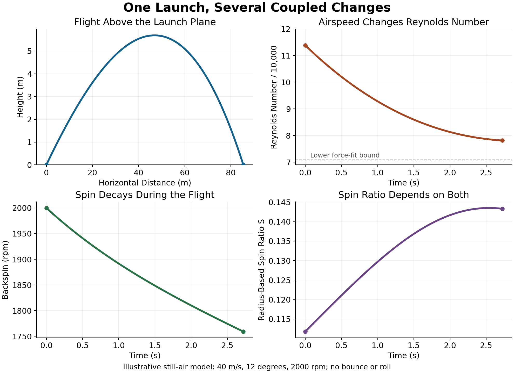

## The Physical Story

The swing prepares the club's motion and deformation. Contact converts that delivered state into ball velocity and spin. Flight then depends on those launch conditions, the ball's aerodynamic properties, wind, and the atmosphere.

These stages are intertwined. A shaft can change head orientation and velocity before contact; an off-centre impulse can rotate the head during contact; that rotation changes surface slip, which changes the ball's spin and launch direction. The flight model then turns those launch differences into a landing distribution.

For many ordinary centred strikes, launch direction is closer to the face normal than to the club's path. This is useful guidance, but two angles alone do not determine a shot. Strike location, contact speed, head inertia, ball deformation, and surface conditions matter too. Likewise, rapid face rotation creates a local timing sensitivity, but it does not by itself establish how accurately a golfer plays.

## Scope and Intent

This reference connects four tasks:

1. Describe delivered motion with a declared reference point, frame, and time.
2. Solve a collision whose impulse changes both bodies' translation and rotation.
3. Interpret launch measurements using the assumptions and uncertainty of the contact model.
4. Propagate launch conditions through an aerodynamic model with a stated range of validity.

A derived identity, an assumed model parameter, and a measured result have different evidential roles. Reproducing arithmetic verifies the calculation; agreement with independent measurements is needed to establish predictive accuracy.

::: {.callout-note}
## Conventions

Use a right-handed frame with $x$ along the target line, $y$ up, and $z$ right when looking along the target line. The face normal $\mathbf n$ points toward the ball. Unless a source specifies otherwise, incoming club quantities refer to immediately before first contact and outgoing ball quantities to separation. Maximum-compression values cannot be substituted into pre-impact restitution formulas.

Head inertia tensors and all vectors in the impulse calculation are expressed in the same world frame at the frozen contact configuration. A scalar ball inertia denotes an isotropic sphere.
:::

## Part I: Delivered Pose, Velocity, and Deformation

### Why a Single Path Is Not Enough

The instantaneous motion of a rigid head can be represented by angular velocity and the velocity of a named point $O$:

$$
\xi=(\boldsymbol\omega_c,\mathbf v_O).
$$

For another head-fixed point $P$,

$$
\mathbf v_P=\mathbf v_O+\boldsymbol\omega_c\times
(\mathbf p_P-\mathbf p_O).
$$

The velocities can differ, but do not always differ. For example, a separation parallel to $\boldsymbol\omega_c$ contributes no cross product. The [reference-point companion](reference-point-problem.html) derives the exact direction and speed changes.

A twist describes instantaneous velocity. It does not supply the head's pose, local face normal, strike position, or shaft deformation. Those are additional parts of the delivered state.

| Delivery Quantity | Mathematical Meaning |
|---|---|
| Club speed | $\|\mathbf v_O\|$ at a named point |
| Club path | Horizontal direction of that point's velocity |
| Attack angle | Elevation of that point's velocity |
| Face angle and dynamic loft | Azimuth and elevation of the local face normal |
| Closure rate | A declared angular component or angle derivative |
| Strike location | Contact position relative to head geometry and centre of mass |
| Spin loft | Angle between the local normal and a declared incident velocity |
| Swing plane | A specified trajectory-plane fit or local geometric construction |

The local normal changes across a curved face. A head-centre normal cannot replace the normal at a toe or high-face strike without accounting for bulge and roll. Handle motion also cannot determine head motion through a flexible shaft using a single rigid-body transform.

### Spin Loft Organises Obliqueness

Let face azimuth be $\phi$, path azimuth $\psi$, dynamic loft $\lambda$, and attack angle $\alpha$. For the incoming contact-point velocity of a head approaching a stationary ball,

$$
\hat n=(\cos\lambda\cos\phi,\ \sin\lambda,\ \cos\lambda\sin\phi),
$$

$$
\hat v=(\cos\alpha\cos\psi,\ \sin\alpha,\ \cos\alpha\sin\psi).
$$

Their dot product gives the exact identity

$$
\cos\Phi=\hat n\cdot\hat v
=\sin\lambda\sin\alpha+\cos\lambda\cos\alpha\cos(\phi-\psi).
$$

For zero face-to-path, $\Phi=|\lambda-\alpha|$ within the relevant angle range. In general, $\cos(\phi-\psi)\cos(\lambda-\alpha)$ is **not** the exact dot product. At face-to-path $30^\circ$, loft $40^\circ$, and attack $20^\circ$, the expressions already differ materially. Near a common elevation $\alpha$,

$$
\Phi^2\simeq(\lambda-\alpha)^2+
\cos^2\alpha(\phi-\psi)^2,
$$

with small angles in radians.

Spin loft describes geometry, not a complete spin law. If the ball is already moving or spinning, the relative surface velocity is needed as well. Contact speed, friction, compliance, and the head's response determine the impulse.

## Part II: The Collision

### One Coupled Impulse

Approximate the short contact by a resultant impulse $\mathbf J$ on the ball and $-\mathbf J$ on the head. Let ball and head masses be $m$ and $M$. Let their contact levers from their respective centres of mass be $\mathbf r_b$ and $\mathbf r_c$.

For a spherical ball and central local normal, $\mathbf r_b=-R\mathbf n$. Ignoring external impulses during contact gives

$$
m(\mathbf v_b^+-\mathbf v_b^-)=\mathbf J,
\qquad
M(\mathbf v_c^+-\mathbf v_c^-)=-\mathbf J,
$$

$$
I_b(\boldsymbol\omega_b^+-\boldsymbol\omega_b^-)
=\mathbf r_b\times\mathbf J,
$$

$$
I_c(\boldsymbol\omega_c^+-\boldsymbol\omega_c^-)
=-\mathbf r_c\times\mathbf J.
$$

These equations enforce equal and opposite contact action. They do not yet determine $\mathbf J$: a contact law supplies the missing relationship between incoming and outgoing relative motion.

This is a frozen-geometry rigid-impulse approximation. In a resolved collision, pressure and shear are distributed over a changing patch; levers and attitude can change. The shaft and support can also transmit impulses. Treating the head as free is appropriate only when those external contributions are negligible for the question and time scale being modelled.

### Contact-Point Effective Inverse Mass

Define the ball-surface velocity relative to the head surface:

$$
\mathbf w^-=
\mathbf v_b^-+\boldsymbol\omega_b^-\times\mathbf r_b
-\mathbf v_c^--\boldsymbol\omega_c^-\times\mathbf r_c.
$$

Let $[\mathbf r]_\times\mathbf a=\mathbf r\times\mathbf a$. Substituting the four momentum changes gives

$$
\mathbf w^+=\mathbf w^-+W\mathbf J,
$$

$$
\begin{aligned}
W={}&\left(\frac1m+\frac1M\right)I\\
&-[\mathbf r_b]_\times I_b^{-1}[\mathbf r_b]_\times\\
&-[\mathbf r_c]_\times I_c^{-1}[\mathbf r_c]_\times.
\end{aligned}
$$

The matrix $W$ has units of inverse mass. For positive masses and positive-definite inertias it is symmetric positive definite. Each rotational term is positive semidefinite because the skew matrix changes sign under transpose.

This matrix explains the coupling. A tangential impulse can change normal relative velocity if the head geometry and inertia give nonzero normal–tangential entries. A normal impulse can change tangential relative velocity. Solving two unrelated scalar collisions can therefore give an inconsistent answer.

If support constraints or other bodies matter, the effective operator must instead be obtained from the corresponding constrained multibody dynamics or compliant model. It cannot be repaired by simply adding shaft mass to $M$.

### II.1 Normal Restitution and Its Scalar Limit {#sec-normal}

Let $w_n=\mathbf n^{\mathsf T}\mathbf w$, with $w_n^-<0$ for approach. A Newton normal-restitution law is

$$
w_n^+=-e_n w_n^-.
$$

With $\mathbf J=J_n\mathbf n+\mathbf J_t$, it requires

$$
(\mathbf n^{\mathsf T}W\mathbf n)J_n
+\mathbf n^{\mathsf T}W\mathbf J_t
=-(1+e_n)w_n^-.
$$

The familiar scalar effective-mass formula follows only when tangential coupling is absent or the tangential impulse is known to vanish. For a spherical ball,

$$
\frac1{M_{\rm eff}}=
\frac1M+
(\mathbf r_c\times\mathbf n)^{\mathsf T}
I_c^{-1}(\mathbf r_c\times\mathbf n),
$$

and the decoupled normal impulse is

$$
J_n=\frac{-(1+e_n)w_n^-}{1/m+1/M_{\rm eff}}.
$$

For a stationary ball, a head translating normally at speed $V$, and a normal through the head centre of mass, $M_{\rm eff}=M$. The outgoing ball normal speed is then

$$
v_{b,n}^+=(1+e_n)\frac{M}{M+m}V.
$$

This is not a general formula for the magnitude of ball velocity in an oblique strike. It also does not make COR a universal material constant: measured restitution depends on the bodies, impact conditions, and test definition.

### Check Energy as Well as Momentum

For the closed, frozen-geometry model, the total kinetic-energy change is

$$
\Delta K=(\mathbf w^-)^{\mathsf T}\mathbf J
+\frac12\mathbf J^{\mathsf T}W\mathbf J.
$$

This provides a useful independent check on an implemented contact law. For example, a common scalar restitution law in every direction, $\mathbf w^+=-e\mathbf w^-$, gives

$$
\Delta K=
-\frac12(1-e^2)
(\mathbf w^-)^{\mathsf T}W^{-1}\mathbf w^-\leq0
$$

when $0\leq e\leq1$. That law is an algebraic example, not a substitute for friction-cone and contact-history checks.

Choosing separate normal and tangential restitution coefficients requires checking the resulting coupled energy balance. Bounds on the individual coefficients alone do not replace that check when the directional restitution operator and $W$ do not commute. A model with stored elastic energy or external impulses needs the corresponding terms in its energy accounting.

### COR and Characteristic Time Are Different Tests

Characteristic time (CT) is a pendulum-test measure of clubface spring effect. It is not the duration of a golf-ball collision and is not itself a restitution coefficient.

The USGA's historical technical account relates 239 microseconds plus an 18-microsecond test tolerance to the earlier COR limit of $0.822$ plus $0.008$. Thus $0.830$ has a documented regulatory origin; it is not an untraceable internet number. The correlation does not make those values interchangeable for arbitrary heads and impact speeds. [USGA/R&A, *Distance Insights Report*, 2020](https://www.usopen.com/content/dam/usga/pdf/2020/distance-insights/DIPR-FINAL-2020-usga.pdf).

Conformance involves the applicable club category, tested locations, protocol, and equipment rules. Historical thresholds explain the physics literature; they do not by themselves establish that a particular club conforms. Consult the [official equipment rules and testing sources](https://www.usga.org/equipment-standards/equipment-rules-2019/equipment-rules/toc.html).

### II.2 Tangential Impulse, Slip, and Grip {#sec-tangential}

Normal restitution alone leaves two tangential impulse components undetermined. A contact model must describe how friction and deformation change the relative tangential velocity.

For a fixed normal and constant Coulomb coefficient, sliding traction opposes local slip and its magnitude is bounded by $\mu N$. In a compliant patch, some regions can stick while others slip. Sticking means no relative motion of the contacting material locally; it does not mean that the ball behaves as a rigid sphere rolling on the face.

For an ideal point contact, a necessary integrated constraint is

$$
\|\mathbf J_t\|\leq\mu J_n.
$$

The same vector budget covers both tangential directions. Satisfying it is not sufficient to prove a particular slip–stick history. Elastic shear can reverse traction during restitution, and a time-varying normal force affects when sticking or renewed slipping occurs.

A tangential restitution model can prescribe

$$
\mathbf w_t^+=-e_t\mathbf w_t^-,
\qquad
\mathbf w_t=(I-\mathbf n\mathbf n^{\mathsf T})\mathbf w.
$$

Together with normal restitution, this supplies three algebraic conditions for $\mathbf J$. The solved impulse must still be admissible and energetically consistent. A resolved compliant-contact law instead evolves compression, shear, slip, and force over time.

### A Surface Experiment With Explicit Angle Conventions

For insight, consider an initially unspun sphere incident on an infinitely massive fixed plane at speed $V$. Let $\theta$ be the angle **from the surface**, so the normal approach speed is $V\sin\theta$ and tangential speed is $V\cos\theta$. The complementary angle from the normal is $\Phi=90^\circ-\theta$.

Assume isotropic inertia $I_b=\alpha mR^2$, zero normal-force moment, and full sliding without slip reversal. Then

$$
J_n=m(1+e_n)V\sin\theta,\qquad
|J_t|=\mu J_n,
$$

and the dimensionless outgoing spin is

$$
\frac{R|\omega_b^+|}{V}
=\frac{\mu(1+e_n)}{\alpha}\sin\theta.
$$

If normalised instead by the incoming **tangential** speed $V\cos\theta$, the right side contains $\tan\theta$. Those normalisations must not be confused.

In the zero-slip-at-separation approximation,

$$
\frac{R|\omega_b^+|}{V}
=\frac{\cos\theta}{1+\alpha}.
$$

The sliding branch reaches that condition at

$$
\tan\theta_*=
\frac{1}{\mu(1+e_n)(1+1/\alpha)}.
$$

For assumed $\mu=0.18$, $e_n=0.9$, and $\alpha=0.4$, $\theta_*\approx39.9^\circ$, or $\Phi_*\approx50.1^\circ$. Increasing friction decreases this threshold measured from the surface and increases its complement measured from the normal.

These are deductions from the stated plane model, not a universal driver or wedge threshold. Cross's low-speed granite experiments distinguish sliding and gripping and show why tangential elasticity can exceed a rolling approximation. Their conditions and fitted coefficients should not be transferred directly to a high-speed club impact. [Cross, 2002](https://www.physics.usyd.edu.au/~cross/PUBLICATIONS/GripSlip.pdf).

### Contact Duration, Force, and Ball Construction

Impulse is the integral of force. Knowing $J_n$ and a contact duration determines average normal force, not its peak or waveform. For an illustrative $J_n=3.2$ N s and duration $0.00045$ s, the mean is about $7.1$ kN. A peak-force claim needs a measured trace or a force–deformation model.

Hertz theory is a useful starting point for elastic contact, but a layered, viscoelastic golf ball and a flexible clubface need not satisfy its homogeneous, small-deformation assumptions over a full-speed collision. Constitutive parameters, loading-rate dependence, and the definition of contact area matter.

Water, grass, cover material, grooves, and roughness can change friction and the contact history. Lower friction does not imply a single monotonic change in every launch parameter over every obliqueness. A “flier” explanation should specify the surface condition and show how the resulting impulse changes launch and spin together.

### II.3 Moments Beyond the Central Point Model

A distributed normal reaction need not pass through the ball centre. Its moment, together with distributed shear, can affect ball spin. A finite patch can also transmit a torsional moment about the normal, which an ideal point-contact impulse omits.

If the normal resultant has a lever $\mathbf d_N$ and total normal impulse $J_n$, its angular impulse is $\mathbf d_N\times J_n\mathbf n$ when that lever is effectively constant. A general contact requires the time integral of the moment.

The existence of this mechanism does not establish its size for a golf drive. A lever measured for a different ball or impact condition cannot support a universal percentage of golf-ball spin.

## Part III: Gear Effect and Off-Centre Impact

An off-centre normal impulse has angular impulse $-\mathbf r_c\times J_n\mathbf n$ on the head. That changes head rotation, hence surface velocity, hence tangential slip and impulse. This is the mechanical basis of gear-effect coupling.

It is already present in the matrix $W$. Its normal–tangential terms show how a normal impulse can induce sideways relative motion even when the initial tangential slip is zero. The tangential impulse then changes both ball spin and head rotation again. The process is coupled rather than a sequence of independent kicks.

The magnitude depends on strike offset, centre-of-mass depth, the relevant inertia tensor, face curvature, contact properties, and delivered motion. Horizontal and vertical gear effects generally involve different levers and inertia axes. A fixed universal ratio between them is not justified.

### A Reproducible Coupled Example

Take an initially stationary, unspun ball and a head whose centre moves at 48 m/s along $+x$, with initial angular velocity $30\mathbf e_y$ rad/s. Set the local normal to $\mathbf e_x$ and the contact lever to $(0.04,0,0.02)$ m. The masses, inertias, and restitution below are illustrative inputs. Use $e_n=0.8$ and zero tangential relative velocity at separation.

```python
import numpy as np

m, radius, alpha = 0.04593, 0.021335, 0.4
head_mass = 0.2
ball_inertia = alpha * m * radius**2
head_inertia = 0.0004 * np.eye(3)
ball_lever = np.array([-radius, 0.0, 0.0])
head_lever = np.array([0.04, 0.0, 0.02])
head_velocity = np.array([48.0, 0.0, 0.0])
head_spin = np.array([0.0, 30.0, 0.0])

def cross_matrix(r: np.ndarray) -> np.ndarray:
    x, y, z = r
    return np.array([[0, -z, y], [z, 0, -x], [-y, x, 0]])

Sb, Sc = cross_matrix(ball_lever), cross_matrix(head_lever)
W = (1 / m + 1 / head_mass) * np.eye(3)
W -= Sb @ Sb / ball_inertia
W -= Sc @ np.linalg.solve(head_inertia, Sc)
w_before = -head_velocity - np.cross(head_spin, head_lever)
restitution = np.diag([0.8, 0.0, 0.0])
impulse = np.linalg.solve(W, -(np.eye(3) + restitution) @ w_before)
ball_velocity = impulse / m
ball_spin = np.cross(ball_lever, impulse) / ball_inertia
energy_change = w_before @ impulse + 0.5 * impulse @ W @ impulse
print(impulse, ball_velocity, ball_spin, energy_change)
```

The calculation gives impulse $(3.15422,0,0.0599562)$ N s, ball velocity $(68.6746,0,1.30538)$ m/s, and ball spin $(0,152.963,0)$ rad/s. Total kinetic energy decreases by about 15.2936 J. The impulse ratio $\|\mathbf J_t\|/J_n\approx0.0190$ passes an integrated friction bound with, for example, assumed $\mu=0.1$; this does not verify a transient sticking history.

The initial head surface moves toward $-z$ at contact, yet the solved tangential impulse on the ball points toward $+z$. The off-centre normal impulse changes head rotation strongly enough to reverse the net tangential requirement. This is exactly the interaction that adding an isolated pre-rotation spin estimate to an isolated normal collision can miss. The example checks the coupled model, not a calibrated prediction for a commercial driver.

### Face Curvature Changes the Same Collision

Bulge and roll alter the local face normal. This changes the normal impulse direction and the obliquity of the contact, as well as the initial launch direction used to compensate curvature in flight.

The compensation is conditional on speed, strike, spin, and aerodynamics. More inertia can reduce rotation for a specified angular impulse, but the impulse itself can change when the head's response changes. A design comparison should solve the collision again rather than vary inertia in one isolated gear-effect term.

The geometric face centre is not automatically the projected centre of mass or centre of percussion. State which “centre” defines the strike before claiming a gear effect vanishes.

### Pre-Existing Rotation and Gear Effect Share the Contact Law

Head angular velocity before impact enters $\mathbf w^-$. Rotation generated by the impulse enters $W\mathbf J$. Neither contribution is missing from a consistent rigid-body model.

Changing pre-impact rotation while holding centre velocity fixed differs from changing it while holding contact velocity fixed. The [rotation-induced spin derivation](rotation-induced-spin.html) demonstrates both cases, including why $\omega_b=5\omega_c/7$ is not a universal centred-strike prediction.

Laboratory tests on other balls, blocks, or bats can demonstrate the mechanism. Their numerical gains are not golf-club constants. A usable empirical gear-effect formula must state units, measured bodies, strike geometry, speed range, and how launch direction and spin were separated.

## Part IV: Ball Flight Laws {#sec-ballflight}

### IV.1 A Useful Rule With Physical Conditions

For many centred, initially unspun impacts, the ball launches between the contact-point velocity direction and the local face normal, generally closer to the normal. Tangential impulse produces spin whose direction follows from the same contact geometry.

This is more accurate than declaring that launch always equals club path. It is also more precise than declaring that the ball always starts exactly where the face points or that face and path alone determine curvature. Contact asymmetry, strike offset, initial spin, and head rotation can change the simple picture.

### IV.2 The D-Plane

The local normal and incident contact-point velocity define a plane when they are not parallel. In a centred, symmetric contact model with no initial ball spin, the impulse lies in that plane and ball spin is perpendicular to it.

Those conclusions require the mechanical symmetry, not merely the existence of two vectors. Off-centre head response, asymmetric contact, or a rotating normal can move the resulting impulse out of the initially defined plane. If the vectors are parallel, that construction does not pick a unique plane, and the ideal symmetric model generates no oblique-impact spin.

### IV.3 What Launch Ratios Measure {#sec-weighting}

For horizontal launch $\beta$, face angle $\phi$, and path $\psi$, an empirical launch ratio is

$$
k_h=\frac{\beta-\psi}{\phi-\psi}.
$$

For small angles, a constant-ratio approximation gives $\beta\approx k_h\phi+(1-k_h)\psi$. A ratio near one indicates launch close to the face angle; it is not a statement that this fraction of force, energy, or causal influence belongs to the face.

The ratio is ill-conditioned near $\phi=\psi$: small angle-measurement errors are divided by a small number. Horizontal and vertical ratios also refer to different projections and should not be interchanged.

Wood and colleagues reported these **95% confidence intervals**, after filtering near-centre strikes and, for horizontal ratios, requiring at least $1.5^\circ$ face-to-path:

::: {#launch-ratio-tables}

```{=html}
<style>
#quarto-document-content #launch-ratio-tables .table-wrapper > table {
  min-width: 0;
  width: 100%;
  max-width: 100%;
  table-layout: fixed;
}
#launch-ratio-tables th, #launch-ratio-tables td { white-space: normal; }
</style>
```

#### Horizontal Launch Ratios

| Club | Toward Face | Shots |
|---|---|---|
| Driver | 76% ± 8% | 89 |
| 7-Iron | 69% ± 3% | 172 |
| Wedge | 61% ± 7% | 28 |
| 7-Iron (Robot) | 63% ± 4% | 15 |

#### Vertical Launch Ratios

| Club | Toward Loft | Shots |
|---|---|---|
| Driver | 83% ± 8% | 137 |
| 7-Iron | 81% ± 5% | 252 |
| Wedge | 72% ± 6% | 36 |

:::

Counts refer to retained shots. The original dataset included 157 golfers for driver/7-iron testing and a ten-player wedge subset. The robot manipulation also changed dynamic loft, limiting interpretation as a change in face angle alone. [Wood, Henrikson, and Broadie, 2018, Table 1 and Discussion](https://doi.org/10.3390/proceedings2060249).

These results support face-dominated launch for those conditions. They do not establish a universal coefficient. A commonly used 85% driver approximation should be treated as a rule of thumb whose suitability depends on the population, plane, strike filtering, instrumentation, and contact conditions. The reported driver horizontal interval is approximately 68–84%; its rounded endpoint is not a sufficient basis for a blanket verdict on every 85% claim.

Nor are the many shots necessarily independent golfers. Interpreting uncertainty beyond what the paper reports would require the repeated-measures structure and underlying data.

### IV.4 Spin Axis Geometry

For an initially nonspinning spherical ball in a centred, symmetric oblique-impact model, spin direction is parallel to $\hat v\times\hat n$. This follows from the moment of tangential impulse at the ball contact point. It degenerates for parallel vectors. Gear effect, initial spin, asymmetric contact, and finite face rotation require additional mechanics.

Given outgoing unit velocity $\hat v_b$ and world-up vector $\hat e_y$, define

$$
\hat e_b=\frac{\hat v_b\times\hat e_y}
{\|\hat v_b\times\hat e_y\|},
\qquad
\hat e_u=\hat e_b\times\hat v_b,
\qquad
\mathbf s=\hat v\times\hat n.
$$

Here $\hat e_b$ is the positive backspin axis for the declared convention. One signed tilt convention is

$$
\gamma=\operatorname{atan2}(-\mathbf s\cdot\hat e_u,\
\mathbf s\cdot\hat e_b).
$$

State the sign convention when comparing monitor outputs. A vertical launch needs another frame construction. The cross product supplies a direction; the collision supplies the magnitude.

The frequently repeated $\arctan[\tan A/\tan L]$ relation is not a general identity for horizontal face-to-path $A$ and loft-minus-attack $L$. Full vectors retain both elevations and define the reference axis.

Yards per degree of face-to-path and yards per degree of spin-axis tilt have different denominators. Comparing such numbers without matching launch and flight conditions cannot establish a physical discrepancy.

### IV.5 One Spin Vector, Several Useful Components

The ball has one angular-velocity vector. “Backspin” and “sidespin” are legitimate components in a declared frame, not separate physical rotation processes. A component along the launch velocity, sometimes called rifle spin, is also possible.

For a general vector,

$$
\boldsymbol\omega_b
=(\boldsymbol\omega_b\cdot\hat e_b)\hat e_b
+(\boldsymbol\omega_b\cdot\hat e_u)\hat e_u
+(\boldsymbol\omega_b\cdot\hat v_b)\hat v_b.
$$

A two-component tilt description is complete only when the axial component is absent or specified separately. A total spin magnitude and one tilt angle are not a general three-dimensional spin-vector specification.

Aerodynamic force depends on spin relative to the air-relative velocity. The same tilt need not produce the same curve at different spin magnitudes, launch speeds, winds, or aerodynamic coefficients.

### IV.6 Launch and Spin Must Fit One Contact Model

For a stationary ball and impulse in the obliquity plane,

$$
m\mathbf v_b^+=J_n\hat n+J_t\hat t,
\qquad
\tan\delta_b=\frac{J_t}{J_n},
$$

where $\delta_b$ is launch deflection from the normal. The same $J_t$ changes angular momentum. A model cannot independently choose launch weighting and spin without checking that both arise from its contact solution.

Henrikson and colleagues' compliant-contact model reproduces a decrease in launch ratio with obliqueness even at constant friction. It also shows that the effect of changing friction depends on incidence angle and the slip–stick history. Their comparison motivates a mechanistic explanation beyond assigning different fixed percentages to different clubs. [Henrikson et al., 2020](https://doi.org/10.3390/proceedings2020049027).

A model comparison needs matched ball, surface, speed, local normal, strike, mass properties, and coefficient definitions. Fitting one output is weaker evidence than predicting both launch direction and spin on independent impacts.

## Part V: Aerodynamics and Trajectory

The collision supplies the ball's launch state. Aerodynamics maps that state to a flight, and the landing interaction maps the arriving state to bounce and roll. Each stage changes what the next stage receives. A carry estimate therefore cannot be read backwards as a unique diagnosis of the swing.

### V.1 Air-Relative Velocity and Force Conventions

Let $\mathbf r$ and $\mathbf v$ be ground-frame position and velocity, and let $\mathbf u_a(\mathbf r,t)$ be wind velocity in the same frame. Define

$$
\mathbf w=\mathbf v-\mathbf u_a,\qquad
V_a=\|\mathbf w\|,\qquad A=\pi R^2.
$$

For a spherical, spin-averaged model with isotropic moment of inertia $I_b$,

$$
\dot{\mathbf r}=\mathbf v,\qquad
m\dot{\mathbf v}=m\mathbf g+\mathbf F_D+\mathbf F_L,
\qquad I_b\dot{\boldsymbol\omega}=\boldsymbol\tau_a.
$$

The position derivative remains the **ground-frame** velocity. Replacing every occurrence of velocity by air-relative velocity would incorrectly move the ball's position with the air.

For nonzero $V_a$, use

$$
\mathbf F_D=-\tfrac12\rho A C_D V_a\mathbf w.
$$

When $\boldsymbol\omega\times\mathbf w\ne0$, define

$$
\hat{\boldsymbol\ell}
=\frac{\boldsymbol\omega\times\mathbf w}
{\|\boldsymbol\omega\times\mathbf w\|},
\qquad
\mathbf F_L=\tfrac12\rho A C_L V_a^2\hat{\boldsymbol\ell}.
$$

Here $C_D\ge0$ and $C_L$ is signed: negative $C_L$ reverses the stated lift direction. With forward $+x$, upward $+y$, and rightward $+z$, positive backspin is $+\omega_z$, which gives upward lift for forward motion.

A scalar $C_L$ defined for spin perpendicular to flow cannot automatically describe arbitrary axial spin. A general model must state its dependence on spin-axis inclination. At zero transverse spin the symmetric Magnus contribution needs a continuous zero-spin limit; a unit vector obtained by dividing a zero cross product is undefined. At zero airspeed the force law likewise needs its limiting definition. Orientation-dependent side forces require a richer model than the two terms above.

These conventions give two useful checks:

$$
\mathbf F_D\cdot\mathbf w
=-\tfrac12\rho A C_D V_a^3\le0,
\qquad
\mathbf F_L\cdot\mathbf w=0.
$$

They are air-relative power statements. Wind can supply ground-frame mechanical energy: a ball travelling forward more slowly than a following air mass can experience forward drag. In still air, lift does no instantaneous translational work, but it changes trajectory, flight time, gravity's contribution, and the drag accumulated later. “Lift does no work” does not mean lift has no effect on carry.

### V.2 A Flight Traces a Path Through Aerodynamic Conditions

With dynamic viscosity $\mu$ and kinematic viscosity $\nu=\mu/\rho$,

$$
Re=\frac{2RV_a}{\nu},\qquad
S=\frac{R\|\boldsymbol\omega\|}{V_a}.
$$

The spin ratio uses radius. A convention using diameter is twice this value; a torque coefficient also changes when its reference length changes. Revolutions per minute must be converted to radians per second before insertion into $S$.

For an illustrative diameter of 42.7 mm and $\nu=1.5\times10^{-5}$ m$^2$/s, airspeeds of 20, 40 and 75 m/s give approximately $5.69\times10^4$, $1.14\times10^5$ and $2.14\times10^5$. These are operating points, not universal launch or landing conditions.

A ball need not remain above its drag crisis. Short shots, high trajectories, winds, surface condition and ball design can move the flight into different regimes. Smooth-sphere transition is also affected by disturbance and roughness; a single transition number is not an absolute speed ceiling for golf.

Even the common statement that spin ratio rises throughout flight is conditional:

$$
\frac{\dot S}{S}
=\frac{d}{dt}\log\|\boldsymbol\omega\|
-\frac{\dot V_a}{V_a}.
$$

It rises when fractional airspeed loss exceeds fractional spin loss. A descending ball can regain airspeed; a gust can alter it abruptly. A model should evaluate its actual $(Re,S)$ path and report where that path leaves the measured domain.

This is why matching the coefficient at launch is insufficient. A small discrepancy sustained over much of a flight can matter more than a large discrepancy confined to an operating point the ball never visits.

### V.3 What Dimples Change

Dimples alter boundary-layer transition, local separation and reattachment, and the final separation that establishes the wake. They do not simply reduce all forms of drag.

Choi, Jeon and Choi studied a nonrotating 150 mm model with 392 dimples. They observed local separation, shear-layer instability and reattachment with increased near-wall momentum, followed by delayed main separation. Their approximately 110-degree separation result applies to the investigated regime and geometry. At $Re=5\times10^4$, reattachment still occurred locally, but the flow did not acquire enough near-wall momentum to delay final separation. Thus “no bubble forms” is not their low-speed finding. Their smoke-wire observations did not show the proposed vortex pairs in that experiment; they did not exclude such structures from every dimpled flow. [Choi et al., 2006, pp. 2–4](https://research.engineering.ucdavis.edu/biosport/wp-content/uploads/sites/24/2014/06/Choi-et-al-2006-Mechanism-of-drag-reduction-by-dimples-on-a-sphere.pdf).

The important comparison is at matched conditions. A dimpled sphere can have lower drag than a subcritical smooth sphere at the same Reynolds number while having greater drag than a smooth sphere in its own postcritical regime. Beratlis and colleagues' simulations identify a local dimple drag penalty in addition to the change in separation. [Beratlis, Balaras and Squires, 2019, abstract](https://doi.org/10.1017/jfm.2019.647). Depth, diameter, arrangement, coverage and surface condition affect that trade. A correlation with one geometric variable across a chosen set of balls is not proof that it alone governs drag.

Computational fluid dynamics can test mechanisms that force measurements cannot directly resolve. Its numerical resolution, turbulence treatment, actual geometry, rotation, boundary conditions and validation still need scrutiny. A computed coefficient is not automatically more authoritative than a measured one, and a smooth-sphere simulation is not a production golf-ball measurement.

### V.4 Evidence Supports Conditional Models

A model is more than the names attached to its coefficient curves. It includes the ball, coefficient definitions, atmosphere, spin evolution, measurement method, fitted domain and numerical implementation.

**Wind-tunnel measurements** can control speed and rotation and measure loads. Supports, blockage, turbulence and vibration must be accounted for. **Free-flight measurements** avoid a rotating support, but infer forces from positions, times and air properties. **Trajectory fits** infer parameters through an assumed dynamical model. These approaches have different error sources; none eliminates the need for validation.

Bearman and Harvey's 1976 study remains an important historical wind-tunnel reference. Its particular models and measurements are not a universal coefficient set for current balls. Smits and Smith's 1994 work incorporates spin decay and aerodynamic dependence into a flight model. Neither historical importance nor a convenient polynomial justifies extrapolating beyond an applicable domain. [Bearman and Harvey, 1976](https://doi.org/10.1017/S0001925900007617).

#### Production-Ball Measurements

Lyu and colleagues measured 13 production-ball models using repeated launches through still air. Their 2018 study fitted aerodynamic responses and then **simulated** flights with common launch conditions: 71.5 m/s, 6 degrees and 3000 rpm, assuming 4% spin loss per second. The resulting approximately 18 m carry spread is a model-based comparison, not a direct measurement of 13 complete flights under those conditions. It demonstrates sensitivity to the measured aerodynamic differences under the simulation assumptions; it does not establish a universal price ranking or an 18 m benefit for an individual player. [Lyu et al., 2018](https://doi.org/10.3390/proceedings2060238).

The same group's 2020 measurements found reverse Magnus behaviour in three production balls near $Re=5$–$7\times10^4$ and 750–2250 rpm. Reported minima differed, approximately $-0.10$ and $-0.15$. That is a comparison of complete ball models, not an isolated intervention on dimple shape. Positive lift returned at lower Reynolds numbers in the reported data, so “negative lift below a threshold” is also too broad. The authors specifically describe reverse Magnus as uncommon in long drives. [Lyu, Kensrud and Smith, 2020](https://doi.org/10.1007/s12283-020-0318-1).

The heuristic surface speeds $V_a\pm R\omega$ help explain how rotation can place opposite sides near different transition conditions. They do not turn a nonrotating drag curve into a complete local flow law. A sign change in lift requires the relevant flow state, not simply a sufficiently large spin ratio.

#### A Published Polynomial With an Explicit Domain

Naruo, Mizota and Shimozono published force and torque measurements on actual balls, together with robot-launch comparisons. Their lower-turbulence force measurements covered approximately $7.09\times10^4\le Re\le1.25\times10^5$ and $0.03\le S\le1.13$. Higher-speed measurements supported their qualitative spin-ratio dependence, but the authors identified greater turbulence and vibration-related drag overestimation; they used the lower-speed fits for quantitative flight calculations. This distinction is essential when applying the model. [Naruo et al., 2004, Sections 5–6](https://doi.org/10.1299/kikaib.70.2371).

Their equations (12)–(14), using radius-based $S$, are

$$
\begin{aligned}
C_D(S)={}&0.7510S^4-1.760S^3+1.098S^2\\
&+0.2148S+0.2049,\\
C_L(S)={}&-0.2158S^4+1.006S^3-1.644S^2\\
&+1.250S+0.0616,\\
C_M(S)={}&\exp(3.780S-6.707).
\end{aligned}
$$

Their torque convention uses **diameter**:

$$
\|\boldsymbol\tau_a\|
=\tfrac12\rho V_a^2 A(2R)C_M.
$$

Approximate collapse onto $S$ for these observations does not imply Reynolds independence for every ball or across a different transition region. Conversely, later reverse-Magnus measurements do not invalidate every use of the earlier fit inside its supported operating region.

The polynomial's positive lift intercept and the moment fit's positive value at $S=0$ expose an extrapolation problem: these fits do not supply a symmetric zero-spin limit. Clipping the argument to the fitted interval would conceal extrapolation rather than repair it.

### V.5 A Reproducible Flight Within a Stated Fit Domain

Here is a complete **model calculation**, using the preceding fits. It is not a newly measured shot or a validation of a current commercial ball.

Use still air with $\rho=1.2$ kg/m$^3$ and $\nu=1.5\times10^{-5}$ m$^2$/s. Set $m=0.0456$ kg, $R=0.02135$ m and $I_b=8.10\times10^{-6}$ kg m$^2$. Launch from zero height at 40 m/s, 12 degrees elevation, and 2000 rpm of backspin. The positive spin axis is $+z$; the planar state is $(x,y,v_x,v_y,\omega_z)$.

For forward planar motion the lift direction is $(-v_y,v_x)/V_a$. Integrate position, velocity **and spin**, stopping at the first descending crossing of the launch-height plane. Carry here means horizontal distance to that plane; there is no bounce, roll, turf or elevation model.

~~~python
from math import exp, pi, radians
import numpy as np
from scipy.integrate import solve_ivp

GRAVITY_M_S2 = 9.81
mass, radius, inertia = 0.0456, 0.02135, 8.10e-6
density, nu = 1.2, 1.5e-5
area = pi * radius**2

def coefficients(s: float) -> tuple[float, float, float]:
    cd = 0.7510*s**4 - 1.760*s**3 + 1.098*s**2
    cd += 0.2148*s + 0.2049
    cl = -0.2158*s**4 + 1.006*s**3 - 1.644*s**2
    cl += 1.250*s + 0.0616
    cm = exp(3.780*s - 6.707)
    return cd, cl, cm

def dynamics(time: float, state: np.ndarray) -> np.ndarray:
    del time
    velocity = state[2:4]
    speed = np.linalg.norm(velocity)
    omega = state[4]
    cd, cl, cm = coefficients(radius * omega / speed)
    load = 0.5 * density * area * speed**2
    lift_direction = np.array([-velocity[1], velocity[0]]) / speed
    acceleration = load / mass * (-cd * velocity / speed)
    acceleration += load / mass * cl * lift_direction
    acceleration[1] -= GRAVITY_M_S2
    omega_dot = -load * (2 * radius) * cm / inertia
    return np.r_[velocity, acceleration, omega_dot]

def landing(time: float, state: np.ndarray) -> float:
    del time
    return float(state[1])

landing.direction = -1
landing.terminal = True
angle = radians(12)
initial = [
    0, 0, 40*np.cos(angle), 40*np.sin(angle), 2000*2*pi/60
]
solution = solve_ivp(
    dynamics, (0, 10), initial, events=landing,
    rtol=1e-10, atol=1e-11, max_step=0.02, dense_output=True
)
if not solution.success or len(solution.t_events[0]) != 1:
    raise RuntimeError("A descending landing was not found.")
samples = solution.sol(np.linspace(0, solution.t[-1], 2001))
speeds = np.linalg.norm(samples[2:4], axis=0)
reynolds = 2 * radius * speeds / nu
ratios = radius * samples[4] / speeds
if not (
    reynolds.min() >= 7.09e4 and reynolds.max() <= 1.25e5
    and ratios.min() >= 0.03 and ratios.max() <= 1.13
):
    raise RuntimeError("This trajectory leaves the stated force-fit domain.")
print("Time, carry, final spin:",
      solution.t[-1], solution.y[0, -1], solution.y[4, -1])
print("Re range:", reynolds.min(), reynolds.max())
print("S range:", ratios.min(), ratios.max())
~~~

The calculation gives approximately **2.720636 s**, **85.4319 m carry**, and **184.2220 rad/s** final spin. The sampled Reynolds numbers remain approximately 78,136–113,867, and spin ratios 0.11179–0.14350. A separate fixed-step RK4 implementation, with step refinement and its own descending-contact interpolation, agrees on carry to a few micrometres. That agreement verifies the numerical calculation, not the empirical accuracy of its coefficients.

{fig-alt="Four plots of the illustrative flight show height rising and falling, Reynolds number decreasing, backspin decreasing, and spin ratio rising toward a maximum. The changing spin ratio depends on both airspeed and spin."}

The domain check samples the trajectory; it is a practical diagnostic, not a mathematical proof over every instant. This example has substantial margin from the force-fit boundaries. Being inside the reported bounding rectangle also does not mean every joint combination was independently measured. A general solver needs explicit event or interval handling near a boundary and a physically defined alternative model outside it.

For a modern high-speed drive, choosing these coefficients solely because they are available would require an additional applicability argument. The purpose of the example is to make the assumptions and calculation inspectable.

### V.6 Spin Decay Is a Dynamical Assumption

With isotropic inertia and a torque antiparallel to spin, the spin axis stays fixed in an inertial frame while magnitude decays. A torque with a transverse component changes that axis; a nonspherical inertia tensor requires full rotational dynamics.

A commonly used model form is

$$
\dot\omega=-\beta\frac{V_a}{R}\omega.
$$

For dimensionless $\beta$ and consistent length/time units, the instantaneous fractional decay rate is $\beta V_a/R$. Its inverse is an **instantaneous** time scale, not a constant for the whole flight.

Define air-relative path length

$$
s_a(t)=\int_0^t V_a(\tau)\,d\tau.
$$

For constant $\beta$ the exact solution is

$$
\omega(t)=\omega_0
\exp\!\left[-\frac{\beta}{R}s_a(t)\right].
$$

This is exponential in air-relative distance. Replacing $V_a(t)$ by launch speed changes the model.

A constant time-rate law $\dot\omega=-k\omega$ instead gives $\omega_0e^{-kt}$. Losing exactly 4% of the remaining spin each second corresponds to $k=-\log(0.96)\ {\rm s}^{-1}$, approximately 0.04082 s$^{-1}$, rather than exactly 0.04 s$^{-1}$. Both differ from a statement that spin loses four percentage points of its **initial** value each second.

A torque coefficient linear in $S$ can yield the velocity-proportional form, but its gain also depends on density, area, inertia and the reference length. If $C_M=cS$ with the diameter convention above,

$$
\dot\omega
=-\frac{\rho A R^2 c}{I_b}\,V_a\omega,
\qquad
\beta=\frac{\rho A R^3c}{I_b}.
$$

Changing radius to diameter in a definition without changing its coefficient introduces a factor of two. Changing revolutions per second to radians per second introduces $2\pi$. Neither is a physical disagreement.

Two datasets should be compared using matched balls, conditions, spin definitions and uncertainty. There is no basis here for declaring that only two decay models exist or that a quoted radar percentage universally disproves a different experiment. The effect on carry must be calculated with the same lift/drag model because changing spin changes both coefficients and the rest of the flight.

The energy balance gives a further check. In still air, with upward coordinate $y$ and the stated isotropic inertia,

$$
E=\tfrac12m\|\mathbf v\|^2+mgy
+\tfrac12I_b\|\boldsymbol\omega\|^2,
$$

$$
\dot E=-\tfrac12\rho A C_D\|\mathbf v\|^3
+\boldsymbol\tau_a\cdot\boldsymbol\omega.
$$

Both terms are nonpositive for dissipative drag and spin decay. This connects the flight model back to the collision's energy accounting while distinguishing aerodynamic dissipation from redistribution between height and speed.

### V.7 Precision, Repeatability, and Model Error

The 2020 Lyu study distinguishes sensor-propagated coefficient uncertainties, approximately 0.005 for drag and 0.0005 for lift, from mean repeat-shot standard deviations of approximately 0.02 and 0.01. Its calibration tolerances are another quantity. Those numbers represent different uncertainty components; their difference is not an internal contradiction. [Lyu et al., 2020, Section 3](https://doi.org/10.1007/s12283-020-0318-1).

Precision concerns variation associated with an instrument or repeated measurement. Bias concerns systematic error relative to an appropriate reference. Model discrepancy concerns a failure of the equations or parameterization to represent the process. Increasing the number of repeat shots can reduce uncertainty in an estimated mean without removing systematic bias or model discrepancy.

Force reconstruction also requires an explicit approximation. Over a short horizontal interval of length $\Delta x$, nearly constant drag with negligible vertical work gives

$$
\overline F_D
\approx\frac{m(V_1^2-V_2^2)}{2\Delta x},
$$

where $V_1$ is upstream speed, $V_2$ downstream speed, and the drag **magnitude** is positive during deceleration. Larger changes in height, direction, wind or coefficient require the full vector equations and gravitational work. A scalar short-baseline estimate is not an exact identity for arbitrary ball flight.

#### Inverse Fitting Does Not Uniquely Identify Every Mechanism

A trajectory fit chooses parameters to reduce a discrepancy between simulated and measured outputs. Errors in wind, density, launch measurements, spin decay, event detection or numerical integration can then be absorbed into the fitted coefficients. They need not be absorbed completely, or in the same way.

A simple identifiability example needs no complicated aerodynamics. In horizontal one-dimensional motion with constant drag coefficient and still air,

$$
\dot v=-kv^2,\qquad
k=\frac{\rho A C_D}{2m},
$$

so

$$
v(t)=\frac{v_0}{1+kv_0t},
\qquad
x(t)-x_0=\frac{\log(1+kv_0t)}{k}.
$$

Position observations identify the product $\rho C_D$ in this simplified experiment. They cannot separately determine density and coefficient without additional information. Likewise, matching one landing position cannot identify arbitrary lift, drag and spin-decay functions.

A learned model can improve predictions without uniquely recovering physical coefficients. McNally, Lambeth and Brekke used 90,233 shots, reserving the most recent 9024 for validation. Their matched position-plus-height comparison reports mean landing errors of **6.63 and 4.75 yards**, approximately 28% lower; 6.95 belongs to another baseline comparison. The method uses velocity/spin inputs and changes architecture and training, so its gain is not an isolated test of Reynolds dependence. Wind was unavailable, and the authors caution that the learned coefficients might not represent actual physics. The reported values are validation-set results used during model selection, not an untouched external test. [McNally et al., 2023, Sections 3.1–3.5 and Table 1](https://openaccess.thecvf.com/content/CVPR2023W/CVSports/papers/McNally_Combining_Physics_and_Deep_Learning_Models_To_Simulate_the_Flight_CVPRW_2023_paper.pdf).

That is useful comparative evidence. It also directly contradicts a blanket claim that published model comparisons do not exist. A stronger benchmark would publish matched launches, atmospheric conditions, full trajectories, spin histories, held-out ball models, coefficient definitions, numerical convergence and uncertainty—not merely a single average landing error.

### V.8 Atmosphere Changes Several Coupled Quantities

A **headwind lowers spin ratio at fixed ground velocity and spin**: the opposing wind increases $V_a$ in the denominator. It simultaneously raises Reynolds number when viscosity is fixed. The dynamic-pressure factor increases, but $C_L$ and $C_D$ may change in either direction along their actual response surfaces. A quadratic force factor alone does not prove a universal headwind-versus-tailwind carry asymmetry.

For spatially and temporally varying wind,

$$
\dot{\mathbf w}
=\dot{\mathbf v}
-\partial_t\mathbf u_a
-(\nabla\mathbf u_a)\mathbf v.
$$

Thus a gust or wind gradient changes the operating path as well as instantaneous force. Measured mean wind is not a complete description of turbulent fluctuations. Because force is nonlinear in relative velocity, force at the mean wind need not equal mean force. Laboratory disturbance effects and outdoor gust effects should be investigated separately.

At fixed total pressure $p$ and temperature $T$, a dry-air/water-vapour ideal-mixture approximation gives

$$
\rho=\frac{p-p_v}{R_dT}
+\frac{p_v}{R_vT},
\qquad R_v>R_d,
$$

where $p_v$ is water-vapour partial pressure. Increasing $p_v$ reduces density under those fixed conditions. The claim that humidity itself makes the air heavier has the sign wrong. Whether the resulting small density change increases a particular carry is a trajectory question because density scales both drag and lift.

Temperature affects density, viscosity and potentially the impact response of the conditioned ball. Kinematic viscosity already contains density through $\nu=\mu/\rho$; treating its change as independent of density can double-count an effect. Ball-temperature effects also depend on material, conditioning and collision conditions. These mechanisms interact through the trajectory and launch state; they are not independent yardage corrections that can automatically be added.

An atmospheric comparison must say what is fixed: launch state, club delivery, ball temperature, pressure, relative humidity, wind profile and landing elevation. A weather effect on a fixed launch is different from a weather effect that also changes the collision.

### V.9 Sensitivity Must Name the Baseline and the Output

Let a landing output be $Y(\xi,p)$, where $\xi$ contains launch conditions and $p$ contains aerodynamic and atmospheric parameters. A local approximation is

$$
\delta Y\approx D_\xi Y\,\delta\xi+D_pY\,\delta p.
$$

Each derivative belongs to a specified baseline, model, parameter definition and landing event. “Yards per 0.01 of drag coefficient” is incomplete unless it states how that coefficient changes across the whole $(Re,S)$ path.

In the reproducible 40 m/s example, adding **0.01 to $C_D$ throughout the flight**, while keeping the other coefficient functions and launch inputs fixed, reduces carry from 85.4319 m to approximately **84.3454 m**: about **1.1883 yards**. Subtracting 0.01 increases carry to approximately **86.5565 m**. These outputs are independently reproduced by the second integrator.

The centred local slope is approximately $-110.55$ m per unit coefficient. Extending that slope to an addition of 0.06 predicts approximately 78.80 m, whereas reintegration gives approximately **79.4133 m**. Even this simple smooth model demonstrates finite-change error. Neither its sensitivity nor a sensitivity computed for a fast drive is a universal conversion.

The same caution applies to comparing coefficient minima from different balls or years: a difference at two separate minima is not a constant difference along a matched flight. Multiplying it by a local derivative does not establish a 40-yard discrepancy.

#### Landing Time Is Part of the Derivative

For a flat plane $y=0$ crossed with $v_y(t_c)\ne0$, a fixed-time state perturbation gives

$$
\delta t_c=-\frac{\delta y(t_c)}{v_y(t_c)},
\qquad
\delta x_c=\delta x(t_c)+v_x(t_c)\delta t_c.
$$

Evaluating the horizontal perturbation at the unperturbed landing time omits this event contribution. An elevated or sloping landing surface needs its own event normal. Grazing contact makes the first-order formula ill-conditioned.

Carry, total distance, landing angle, peak height and stopping position are different outputs. Total distance additionally requires ground interaction. A sensitivity for total distance cannot be relabelled as a carry sensitivity.

For joint uncertainty $\zeta=(\xi,p)$ with covariance $\Sigma$,

$$
\operatorname{Var}(Y)\approx
DY\,\Sigma\,DY^{\mathsf T}.
$$

Correlations matter: launch speed and spin, face and path, or fitted lift and drag may vary together. Removing cross terms can either increase or decrease the predicted variance. This is the flight-stage counterpart of the delivery/contact covariance discussed above.

### V.10 Orientation and Conformance {#sec-orientation}

A real dimple pattern has discrete geometry. Rotating a ball into a different orientation relative to the spin axis can change its spin-averaged aerodynamic response. Spin averaging does not imply complete spherical symmetry.

Patent filings can contain useful primary descriptions and measurements, including coefficients and trajectories for different ball orientations. Their named designs, test definitions and claimed improvements need to be read as such; they are not independent confirmation of every physical explanation in the filing. A coefficient ratio, an average over several conditions, a carry difference and a conformance statistic are different quantities. [Example: Acushnet US7156757B2](https://patents.google.com/patent/US7156757B2/en).

An observed 3.8-yard orientation difference does not reveal why a regulator selected a 4.0-yard criterion. It also does not by itself establish conformity: the applicable procedure includes sample handling, orientations, launch conditions and statistical decisions.

The published USGA/R&A distance protocol uses a 317.0-yard overall-distance limit with a 3.0-yard test tolerance. Its symmetry procedure considers paired carry and flight-time differences, with 4.0-yard and 0.40-second criteria **and statistical significance**. Passing a quoted distance threshold alone is not a complete equipment-conformance determination. Consult the applicable full protocol rather than substituting the outputs of an illustrative simulator. [Overall Distance and Symmetry Test Protocol, version 4.0](https://www.usga.org/content/dam/usga/pdf/2025/equipment-standards/Overall-Distance-and-Symmetry-Test-Protocol-4.0-TPX.pdf).

**Status checked 5 September 2026:** the joint notice of **17 June 2026** states that the Overall Distance Standard testing approach will not change until **January 2030**. It also describes reconsideration of alternative approaches, including potential Model Local Rules. The earlier phased 2028/2030 implementation should therefore not be presented as the current schedule, and this notice should not be expanded into an unsupported claim that every future test parameter is settled. [USGA/R&A notice, hosted by the Japan Golf Association](https://www.jga.or.jp/data/wp-content/uploads/2026/06/Notice_to_Manufacturers_17_June_2026.pdf).

### V.11 What This Means for the Swing Argument

The swing controls a delivery process; the collision transforms delivery into launch; the atmosphere and ball transform launch into flight. Improving one stage can change the sensitivity of the next.

For example, a delivery change can increase ball speed while changing spin and strike location. That changes both the flight's starting point and its path through the coefficient domain. A change that reduces variability in one launch coordinate may increase it in another, and their covariance can determine whether the landing distribution narrows.

A technically convincing argument therefore follows the complete chain using matched definitions and uncertainty. It distinguishes a mechanical identity, a model prediction, a measurement, and an intervention result. The aim is to explain how the shot emerges from the coupled system while keeping each conclusion proportional to the evidence.

## Part VI: Closure Rate

Closure rate connects delivered orientation, reference-point kinematics, collision dynamics, and repeatability. It is not one scalar with a universal physical interpretation.

### VI.1 Define the Measured Rate

For the horizontal face angle $\phi=\operatorname{atan2}(n_z,n_x)$,

$$
\dot{\mathbf n}=\boldsymbol\omega_c\times\mathbf n,
$$

$$
\dot\phi=
\frac{n_x(\boldsymbol\omega_c\times\mathbf n)_z
-n_z(\boldsymbol\omega_c\times\mathbf n)_x}
{n_x^2+n_z^2}.
$$

This derivative is generally neither total angular speed nor handle twist. Near a forward-facing normal, $\dot\phi=-\omega_{c,y}$ in this article's convention.

Handle twist is an angular-velocity component along the handle's shaft axis. Face-to-path rate is the difference between face-azimuth rate and path-azimuth rate, when both are defined consistently. A speed-normalised rate divides an angle derivative by the speed of a specified point.

A two-component projection using handle twist, swing-plane angular rate, and lie angle is a model of the geometry. It is not a general identity for a flexible club or arbitrary three-dimensional head motion.

### VI.2 Reference-Point Velocity and Direction

For a separation $\mathbf r$,

$$
\delta\mathbf v=\boldsymbol\omega_c\times\mathbf r.
$$

This correction can change both speed and direction. For a small change in horizontal velocity,

$$
\delta\psi\approx
\frac{v_x\delta v_z-v_z\delta v_x}{v_x^2+v_z^2}.
$$

The special estimate $\Delta\theta\approx\omega d/v$ requires the appropriate perpendicular geometry. The [reference-point article](reference-point-problem.html) gives a complete example: an assumed 35 mm forward separation, 2000 degrees/s vertical-axis rotation, and 120 mph forward speed produce about $-1.305^\circ$ of path change and $0.0311$ mph of speed increase.

A reference correction describes the same physical motion at another point. It is not an extra force or a new spin mechanism. Two devices can disagree because of reference conventions, reconstruction errors, time definitions, or some combination; the cross-product identity alone does not identify which.

### VI.3 Rotation During Contact

Face-angle change over a contact interval is

$$
\Delta\phi=\int_{t_{\rm first}}^{t_{\rm sep}}\dot\phi(t)\,dt.
$$

If the rate were constant at 2000 degrees/s for 0.45 ms, the change would be $0.9^\circ$. This is an illustrative integration, not a measured constant rate. The contact impulse can change head angular velocity during that interval.

The effective direction of the normal impulse is determined by

$$
\mathbf J_N=\int N(t)\mathbf n(t)\,dt.
$$

It is not automatically the normal at first contact, maximum compression, the interval midpoint, or separation. A slowly varying normal and a known symmetric force history can motivate an approximation, but the weighting must be stated.

Comparing a pre-contact face angle with a face angle inferred from the resulting ball launch can therefore involve both measurement and modelling assumptions. If the inferred angle was calculated using a launch-ratio model, agreement with that same model is not independent validation.

### VI.4 Timing Sensitivity and Contact Events

A small shift along a prescribed face-angle trace gives

$$
\delta\phi\approx\dot\phi\,\delta t.
$$

At 2000 degrees/s, a 2 ms shift corresponds to $4^\circ$. This is a derivative calculation. It does not establish that a golfer has 2 ms of independent timing error, or that the associated shot must miss a fairway.

Physical contact occurs when a gap function reaches zero. Let the pre-contact state obey $\dot x=f(x)$ and first admissible contact satisfy $g(x(t_c))=0$, with a transverse crossing $Dg\,f\ne0$. A small fixed-time state perturbation $\delta x^-$ gives the first-order event-time change

$$
\delta t_c=
-\frac{Dg\,\delta x^-}{Dg\,f}.
$$

The state perturbation evaluated at its own shifted contact time is

$$
\delta x_c^-=\delta x^-+f\,\delta t_c.
$$

For a contact output map $y=\mathcal C(x_c^-)$,

$$
\delta y=D\mathcal C\,\delta x_c^-.
$$

These equations explain why independent timing noise is only one possible model. Changes in head position, velocity, orientation, and shaft state can change **when** contact occurs and **what state** reaches it. Their correlations can increase or reduce output variation. Near grazing contact the denominator becomes small and the linear event approximation can become unreliable.

The same logic links impact to the site's trajectory-sensitivity treatment: a fixed-time deviation and a deviation at each trial's first contact are not interchangeable.

### VI.5 What the Observational Evidence Establishes

Cheetham's study reports a mean handle twist of 1307 degrees/s for 94 tour professionals. Its accuracy analysis paired a captured swing with same-season fairway statistics for 70 players, finding $r=-0.14$ and no significant high/low-group difference. [Cheetham, 2014, Study 1](https://www.philcheetham.com/media/Phillip-Cheetham-Doctoral-Dissertation-2014.pdf).

The mean is not a median. Handle twist is not directly measured head face-azimuth rate. Season-level fairways hit is not the dispersion of the particular captured swing. The observational association does not estimate the effect of instructing one player to change closure rate.

A nonsignificant difference is also not an equivalence result. Using the rounded $r=-0.14$ and $n=70$, a conventional Fisher-transform approximation gives a 95% correlation interval of about $[-0.36,0.10]$, under its independent-sample assumptions. This is a calculation from the summary statistics, not an interval reported by the dissertation. It illustrates the uncertainty that a simple “no relationship” verdict hides.

Adaptation, correlated control, strike variability, and selection of successful tour players are possible explanations to investigate. They are not mechanisms identified by that correlation.

### VI.6 Bias, Dispersion, and Controlled Comparisons

For a fixed delivery, a reference-point offset is deterministic. Across swings it can have a mean and a variance. Neither must be zero. Face rotation during contact and off-centre response can also affect launch, but their signs and magnitudes depend on the full geometry and contact law.

A table assigning universal fade, draw, and timing contributions cannot substitute for solving that coupled problem. There is also no basis for declaring that one term always dominates without measuring the relevant variation.

When changing rotation in a model, say what is held fixed:

| Comparison | Immediate Consequence |
|---|---|
| Same centre velocity, different head rotation | Contact velocity generally changes |
| Same contact velocity, different head rotation | Centre velocity must compensate |
| Same physical motion, different reference point | Correctly transformed prediction stays unchanged |
| Same pre-contact face angle, different rotation history | Finite-duration normal and slip evolution may differ |

In a frozen-geometry impulse model, matched contact velocity, geometry, mass properties, and initial ball state give the same impulse under the same law. Additional effects require modelling contact duration, head/shaft response, or patch mechanics. The [rotation companion](rotation-induced-spin.html) derives this limit and the finite-head alternative.

### VI.7 What a Useful Measurement Program Would Record

A technically useful closure study would report the head's full pose and angular velocity, velocity of a named point, local face normal, impact location, and ball launch and spin. It would distinguish direct measurements from reconstructed quantities and state uncertainty at the relevant time scale.

Repeated trials within each player are needed to estimate delivery covariance and shot variability. An intervention that changes closure rate must also report changes in speed, posture, strike, and shaft state. Otherwise a change in outcome cannot be attributed to closure alone.

A robot can control some of these variables more tightly, but “matched delivery” still needs an explicit list of controlled quantities. Surface conditions and ball construction must be matched when testing a contact mechanism.

The [interactive closure explorer](https://d-sorganization.github.io/rate-of-closure-explorer/) can illustrate its chosen geometry. Agreement between implementations checks code consistency; it does not supply empirical validation of the assumed delivery or a prediction of player accuracy.

## Part VII: Connecting the Evidence

### What the Mechanics Establish

Rigid-body kinematics relates velocities at different points. Momentum balance couples ball and head responses to the same impulse. A contact law is required to determine that impulse, and energy and friction checks constrain its admissibility.

Within a symmetric oblique-contact model, launch and spin are linked by geometry and tangential impulse. A launch ratio is an empirical summary of this interaction, not a universal division of causal responsibility between face and path.

A local face-angle timing derivative is well defined. A population-level accuracy effect requires additional measurements and an appropriate study design.

### What Requires a Stated Model

Effective head mass, gear-effect gain, tangential restitution, force history, and the consequences of pre-existing rotation depend on geometry and modelling assumptions. Compliance can matter even when a rigid-impulse approximation reproduces one output.

A flight prediction additionally needs aerodynamic coefficients appropriate to its air-relative speed, spin, ball, and conditions. Agreement at launch does not validate the subsequent aerodynamic model, and agreement with one measured carry distance does not uniquely identify the collision and flight parameters.

### A Stronger Golf-Swing Investigation

Start with the outcome to be explained, then preserve the links in the chain:

1. **Delivery:** specify body, handle, shaft, and head states with measured uncertainty.
2. **Contact:** predict launch velocity and the complete spin vector using one consistent collision model.
3. **Flight:** propagate those launch conditions with matched aerodynamic and atmospheric assumptions.
4. **Repeatability:** propagate joint variation and contact-event timing rather than varying unrelated scalars independently.
5. **Intervention:** declare the changed input and what is fixed, then test predictions on data not used to choose the model.

This structure allows an argument about swing coordination to be technically strong without pretending that one measure—closure, path, torque, or spin loft—explains the whole shot.

## References

**Impact and contact mechanics**

- Cross, R. (2002). Grip-slip behavior of a bouncing ball. *American Journal of Physics* **70**(11), 1093–1102. [doi:10.1119/1.1507792](https://doi.org/10.1119/1.1507792) · [PDF](https://www.physics.usyd.edu.au/~cross/PUBLICATIONS/GripSlip.pdf)
- Cross, R. & Dewhurst, P. (2018). Launch speed, angle and spin in golf. *European Journal of Physics* **39**(6), 065003. [doi:10.1088/1361-6404/aadda8](https://doi.org/10.1088/1361-6404/aadda8)
- Maw, N., Barber, J.R. & Fawcett, J.N. (1976). The oblique impact of elastic spheres. *Wear* **38**(1), 101–114. [doi:10.1016/0043-1648(76)90201-5](https://doi.org/10.1016/0043-1648(76)90201-5)
- Maw, N., Barber, J.R. & Fawcett, J.N. (1981). The role of elastic tangential compliance in oblique impact. *Journal of Lubrication Technology* **103**(1), 74–80. [doi:10.1115/1.3251617](https://doi.org/10.1115/1.3251617)
- Stronge, W.J. (2018). *Impact Mechanics*, 2nd ed. Cambridge University Press. [doi:10.1017/9781139050227](https://doi.org/10.1017/9781139050227)
- Kensrud, J.R., Nathan, A.M. & Smith, L.V. (2017). Oblique collisions of baseballs and softballs with a bat. *American Journal of Physics* **85**(7), 503–509. [doi:10.1119/1.4982793](https://doi.org/10.1119/1.4982793) · [arXiv:1610.03464](https://arxiv.org/abs/1610.03464)
- Arakawa, K. et al. (2009). Dynamic deformation behavior of a golf ball during normal impact. *Experimental Mechanics* **49**(4), 471–477. [doi:10.1007/s11340-008-9156-y](https://doi.org/10.1007/s11340-008-9156-y)
- Roberts, J.R., Jones, R. & Rothberg, S.J. (2001). Measurement of contact time in short duration sports ball impacts. *Sports Engineering* **4**, 191–203.
- Tanaka, K. et al. (2006). Construction of the finite-element models of golf balls and simulations of their collisions. *Proc. IMechE Part L* **220**(1), 13–22. [doi:10.1243/14644207JMDA80](https://doi.org/10.1243/14644207JMDA80)
- Caldwell, A. & McPhee, J. (2024). Three-dimensional golf clubhead-ball impact models for drivers and irons. *Sports Engineering* **27**. [doi:10.1007/s12283-024-00456-6](https://doi.org/10.1007/s12283-024-00456-6)
- Cross, R. & Nathan, A.M. (2007). Experimental study of the gear effect in ball collisions. *American Journal of Physics* **75**(7), 658–664. [doi:10.1119/1.2713788](https://doi.org/10.1119/1.2713788)
- Cross, R. (2010). Impact of a ball on a surface with tangential compliance. *American Journal of Physics* **78**(7), 716–720. [doi:10.1119/1.3313455](https://doi.org/10.1119/1.3313455)
- Penner, A.R. (2001). The physics of golf: the convex face of a driver. *American Journal of Physics* **69**(10), 1073. [doi:10.1119/1.1380380](https://doi.org/10.1119/1.1380380)
- Williams, K.R. & Sih, B.L. (2002). Changes in golf clubface orientation following impact with the ball. *Sports Engineering* **5**(2), 65–80. [doi:10.1046/j.1460-2687.2002.00093.x](https://doi.org/10.1046/j.1460-2687.2002.00093.x)
- Leach, R.J., Forrester, S.E., Mears, A.C. & Roberts, J.R. (2017). How valid and accurate are measurements of golf impact parameters obtained using commercially available radar and stereoscopic optical launch monitors? *Measurement* **112**, 125–136. [doi:10.1016/j.measurement.2017.08.009](https://doi.org/10.1016/j.measurement.2017.08.009)

**Ball flight laws and launch conditions**

- Wood, P., Henrikson, E. & Broadie, C. (2018). The influence of face angle and club path on the resultant launch angle of a golf ball. *Proceedings* **2**(6), 249. [doi:10.3390/proceedings2060249](https://doi.org/10.3390/proceedings2060249)
- Henrikson, E., Wood, P., Broadie, C. & Nuttall, T. (2020). The role of friction and tangential compliance on the resultant launch angle of a golf ball. *Proceedings* **49**, 27. [doi:10.3390/proceedings2020049027](https://doi.org/10.3390/proceedings2020049027)
- Jorgensen, T.P. (1999). *The Physics of Golf*, 2nd ed. Springer. (D-plane: Technical Appendix, §3.)
- Cochran, A.J. & Stobbs, J. (1968). *The Search for the Perfect Swing*. Golf Society of Great Britain / J.B. Lippincott.
- Dewhurst, P. (2015). *The Science of the Perfect Swing*. Oxford University Press.
- Penner, A.R. (2003). The physics of golf. *Reports on Progress in Physics* **66**(2), 131–171. [doi:10.1088/0034-4885/66/2/202](https://doi.org/10.1088/0034-4885/66/2/202)
- McPhee, J. (2022). A review of dynamic models and measurements in golf. *Sports Engineering* **25**. [doi:10.1007/s12283-022-00387-0](https://doi.org/10.1007/s12283-022-00387-0)
- Tuxen, F. (2009). Secret of the straight shot. *TrackMan News* #4 (January) and #5 (July).

**Aerodynamics**

- Bearman, P.W. & Harvey, J.K. (1976). Golf ball aerodynamics. *The Aeronautical Quarterly* **27**(2), 112–122. [doi:10.1017/S0001925900007617](https://doi.org/10.1017/S0001925900007617)
- Smits, A.J. & Smith, D.R. (1994). A new aerodynamic model of a golf ball in flight. In *Science and Golf II*, 340–347. E&FN Spon.
- Choi, J., Jeon, W.-P. & Choi, H. (2006). Mechanism of drag reduction by dimples on a sphere. *Physics of Fluids* **18**, 041702. [doi:10.1063/1.2191848](https://doi.org/10.1063/1.2191848)
- Achenbach, E. (1972). Experiments on the flow past spheres at very high Reynolds numbers. *JFM* **54**(3), 565–575. [doi:10.1017/S0022112072000874](https://doi.org/10.1017/S0022112072000874)
- Achenbach, E. (1974). The effects of surface roughness and tunnel blockage on the flow past spheres. *JFM* **65**(1), 113–125. [doi:10.1017/S0022112074001285](https://doi.org/10.1017/S0022112074001285)
- Beratlis, N., Balaras, E. & Squires, K. (2019). On the origin of the drag force on dimpled spheres. *JFM* **879**, 147–167. [doi:10.1017/jfm.2019.647](https://doi.org/10.1017/jfm.2019.647)
- Mehta, R.D. (1985). Aerodynamics of sports balls. *Annual Review of Fluid Mechanics* **17**, 151–189.
- Lyu, B., Kensrud, J. & Smith, L. (2020). The reverse Magnus effect in golf balls. *Sports Engineering* **23**, article 3. [doi:10.1007/s12283-020-0318-1](https://doi.org/10.1007/s12283-020-0318-1)
- Lyu, B., Kensrud, J., Smith, L. & Tosaya, T. (2018). Aerodynamics of golf balls in still air. *Proceedings* **2**(6), 238. [doi:10.3390/proceedings2060238](https://doi.org/10.3390/proceedings2060238)
- Naruo, T., Mizota, T. & Shimozono, H. (2004). Aerodynamic force measurement of highly spinning golf ball in uniform flow and trajectory experiment. *Transactions of the JSME Series B* **70**(697), 2371–2377. [doi:10.1299/kikaib.70.2371](https://doi.org/10.1299/kikaib.70.2371)
- Li, J., Tsubokura, M. & Tsunoda, M. (2017). Numerical investigation of the flow around a golf ball at around the critical Reynolds number. *Flow, Turbulence and Combustion* **99**, 837–864. [doi:10.1007/s10494-017-9859-1](https://doi.org/10.1007/s10494-017-9859-1)
- Smith, C.E., Beratlis, N., Balaras, E., Squires, K. & Tsunoda, M. (2010). Numerical investigation of the flow over a golf ball in the subcritical and supercritical regimes. *International Journal of Heat and Fluid Flow* **31**(3), 262–273. [doi:10.1016/j.ijheatfluidflow.2010.01.002](https://doi.org/10.1016/j.ijheatfluidflow.2010.01.002)
- Tavares, G., Shannon, K. & Melvin, T. (1999). Golf ball spin decay model based on radar measurements. In *Science and Golf III*, 464–472. Human Kinetics.
- Lieberman, B. et al. (2001). Method for determining coefficients of lift and drag of a golf ball. US Patent 6,186,002 B1 (USGA). [Google Patents](https://patents.google.com/patent/US6186002B1/en)

- McNally, W., Lambeth, J. & Brekke, D. (2023). Combining physics and deep learning models to simulate the flight of a golf ball. *IEEE/CVF Conference on Computer Vision and Pattern Recognition Workshops*, 5119–5128. [Paper](https://openaccess.thecvf.com/content/CVPR2023W/CVSports/papers/McNally_Combining_Physics_and_Deep_Learning_Models_To_Simulate_the_Flight_CVPRW_2023_paper.pdf)

**Closure rate and clubhead delivery**

- Cheetham, P.J. (2014). *The Relationship of Club Handle Twist Velocity to Selected Biomechanical Characteristics of the Golf Drive*. Doctoral dissertation. [PDF](https://www.philcheetham.com/media/Phillip-Cheetham-Doctoral-Dissertation-2014.pdf)
- Betzler, N.F., Monk, S.A., Wallace, E.S. & Otto, S.R. (2012). Variability in clubhead presentation characteristics and ball impact location for golfers' drives. *Journal of Sports Sciences* **30**(5), 439–448. [doi:10.1080/02640414.2011.653981](https://doi.org/10.1080/02640414.2011.653981)
- Betzler, N.F. et al. (2012). Effects of golf shaft stiffness on strain, clubhead presentation and wrist kinematics. *Sports Biomechanics* **11**(2), 223–238. [doi:10.1080/14763141.2012.681796](https://doi.org/10.1080/14763141.2012.681796)
- Takagi, T. et al. (2017). Relationships between clubshaft motions and clubface orientation during the golf swing. *Sports Biomechanics* **16**(3), 387–398. [doi:10.1080/14763141.2017.1328528](https://doi.org/10.1080/14763141.2017.1328528)
- Kraśna, S. et al. (2019). Comparative analysis of golf clubhead motion at impact. *Facta Universitatis: Physical Education and Sport* **17**(3), 437–452. [doi:10.22190/FUPES191205039K](https://doi.org/10.22190/FUPES191205039K)

---

*This reference distinguishes derived mechanics, illustrative calculations and primary empirical evidence. Numerical agreement between implementations verifies a calculation; validation for a particular golfer or ball requires independent measurements.*
