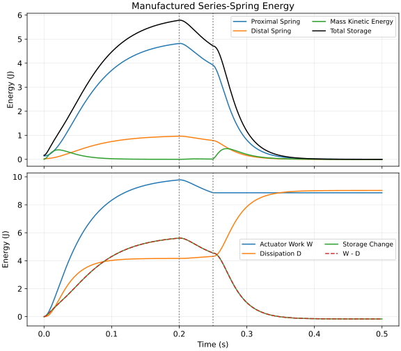

## The Question Behind Passive Distributed Control

The original publication date is unverified; the revision date appears above.

A golfer does not consciously prescribe every muscle force. Nevertheless, forces
must act, elastic structures must be loaded, and the club must reach suitable
impact conditions. A useful account explains how mechanical structure, retained
body states and control signals jointly shape that outcome.

Frans Bosch's *Strength Training and Coordination* (2015) motivates an integrated
view of coordination and physical preparation. The
[publisher's introduction](https://www.2010uitgevers.nl/wp-content/uploads/2020/10/9789490951276.pdf)
also acknowledges the use of hypothetical models. We use that framework to pose
mechanical questions. The equations below are explicit models for examining
those questions, not a verbatim Bosch quotation or a derivation of his complete
framework.

::: {.callout-note}
## Standalone Article and Book Chapter

This article develops the distinctions needed to interpret passive and
distributed control. [The Physics of Golf, Chapter 27](The_Physics_of_Golf/quarto/ch27_passive_distributed_control.html)
provides the separate textbook treatment of impedance, pre-tuning and feedback.
A result established for one model or chapter does not automatically validate a
different example.
:::

## Input, Passivity and Feedback Answer Different Questions

A control-affine model has the form

$$
\dot x=f_p(x)+G_p(x)u.
$$

Here $x$ is the complete retained state, $u$ is the **declared input**, and $p$
contains fixed model settings. A torque command, neural excitation and an
impedance setting are different input choices. Setting one of them to zero may
leave activation, elastic preload, damping and compatible constraint reactions
in the model. The [zero-torque counterfactual family](zero-torque-counterfactual.html)
therefore requires an explicit intervention and construction.

Mechanical passivity instead concerns **energy and a boundary power port**. For
storage $E\geq0$ and a collocated applied force $F$ and velocity $v$, a passive
mechanical subsystem satisfies

$$
E(t)-E(0)\leq\int_0^t F(s)v(s)\,ds.
$$

A spring can deliver positive power temporarily by releasing initial storage.
Its energy came from prior loading or another accounted source. Zero present
input does not make that initial energy free. Conversely, a nonzero holding
force can have zero mechanical power when its application point is stationary;
this says nothing by itself about metabolic expenditure.

The drift $f_p$ is a state derivative, not a power or an energy source. For a
smooth, time-independent storage function,

$$
\dot E=\nabla E(x)^{\mathsf T}f_p(x)
       +\nabla E(x)^{\mathsf T}G_p(x)u.
$$

Those terms need a physical boundary interpretation before they can be called
actuator work, dissipation or intersegment transfer. A norm of $f_p$, or the
[drift-control capacity ratio](drift-control-ratio.html), does not establish an
energy fraction or muscle-effort fraction.

Feedback adds another distinction. If $u=\pi(x)$, the resulting autonomous
closed-loop field is $f_p+G_p\pi$. Attraction observed under that policy belongs
to the controlled system. Expertise may involve different timing, sensing,
impedance or admissible inputs; there is no general theorem that expert
performance requires $u\to0$.

## Recurrence, Attraction and the Phase of a Movement

A repeated coordination pattern is an observation. Calling it an attractor
requires a stated dynamical system, an invariant set and convergence from
nearby initial conditions. Calling it a limit cycle further requires a periodic
orbit. A single finite downswing is not itself evidence for an asymptotically
stable cycle.

The distinction between ordinary contraction and orbital stability is visible
in a simple abstract example. On an annulus containing $r=1$, with phase $\theta$ taken modulo
$2\pi$, let

$$
\dot r=-\kappa(r-1),\qquad \dot\theta=\omega,
\qquad \kappa>0,\quad\omega>0.
$$

Radial errors decay as $e^{-\kappa t}$, while two trajectories retain their
initial phase offset. The circle $r=1$ attracts transversely. On the section
$\theta=0$, the return time is $T=2\pi/\omega$ and the transverse return
multiplier is $e^{-\kappa T}<1$. The phase direction of the periodic flow is
neutral, with multiplier one. Equal-time convergence of every state direction
would be a stronger and different claim.

[Manchester and Slotine's transverse-contraction treatment](https://arxiv.org/abs/1209.4433v2)
formalizes orbital convergence under specified dynamical and metric conditions.
A coaching label or recurring video pattern does not establish those conditions.
For a golf swing, a more direct question is how a declared perturbation changes
a later event, such as club delivery, under a specified feedback policy and
contact mode.

## Practice Variation and Mechanical Impedance

Freezing, freeing and exploiting degrees of freedom are useful descriptions
when they have operational meanings. Anatomical configuration dimension,
observed movement variability, muscle co-contraction, mechanical impedance and
neural feedback gain are separate quantities. Reduced movement at a joint does
not show which of these changed.

For a linear mechanical coordinate, let $m\ddot x+b\dot x+kx=F$ and choose
a constant reference $r$. Instantaneous proportional-derivative feedback with
the balancing force is $F=kr-k_p(x-r)-k_d\dot x$. Then $e=x-r$ satisfies

$$
m\ddot e+(b+k_d)\dot e+(k+k_p)e=0.
$$

Even at zero error and speed, the holding force $kr$ remains when the reference
is nonzero. With $m>0$, $k+k_p>0$ and $b+k_d>0$, this ideal error model is
asymptotically stable. Stiffness-like gain changes the undamped natural
frequency $\sqrt{(k+k_p)/m}$, while damping-like gain changes decay and overshoot.
This does not make gain identical to bandwidth or uncertainty. Delays,
actuator limits, noise and unmodeled modes can alter stability; a better forward
prediction does not automatically imply lower feedback bandwidth.

Differential learning uses deliberately varied practice, but universal
superiority and a unique neural explanation require evidence. In a
[2012 football pilot by Schöllhorn, Hegen and Davids](https://opensportssciencesjournal.com/VOLUME/5/PAGE/100/PDF/),
24 participants entered and only 12 completed the protocol, four per group.
Practice variation and corrective-feedback conditions differed together. Those
methodological features limit component-specific causal attribution and transfer
to golf; this article does not claim a complete statistical review of that study.

A noise analogy also needs an actual stochastic model. For the illustrative
scalar process $d\xi=-a\xi\,dt+\sigma\,dW_t$, with $a>0$ and initial variance
$V_0$,

$$
\operatorname{Var}\xi(t)=e^{-2at}V_0+
\frac{\sigma^2}{2a}\left(1-e^{-2at}\right).
$$

The variance follows $\dot V=-2aV+\sigma^2$. Its limiting value depends on both
restoring dynamics and forcing; it supplies no universal minimum exploration
radius. In several dimensions, unforced directions can remain deterministic.
Practice variability, outcome accuracy and learning retention must be measured
and compared, rather than inferred from this analogy.

## What Passive Walkers Establish

[McGeer's passive-dynamic walking study](https://courses.ece.ucsb.edu/ECE594/594D_F13Byl/papers/McGeer90.pdf)
shows that particular mechanisms can sustain stable stepping down a slope under
suitable conditions. Gravitational potential supplies the losses. Existence and
stability are separate questions: a periodic stepping solution need not be
stable. A return-map calculation must specify the section, impact/reset rule,
leg relabeling and reduced state. Absolute downhill position and gravitational
potential do not return to their original values each step.

[Collins and colleagues' level-ground robots](https://groups.csail.mit.edu/robotics-center/public_papers/Collins05.pdf)
combine favorable mechanics with actuation and different control architectures.
Their results support studying mechanical design together with control. They do
not establish that human walking or a golf downswing is an uncontrolled
attractor. Mechanical actuator work, electrical consumption and human metabolic
cost also have different accounting boundaries.

## Tendon Loading Is Not a Muscle-Contraction Label

Tendon extension and muscle-fascicle extension are different measurements. In
[Fukunaga and colleagues' walking experiment](https://pmc.ncbi.nlm.nih.gov/articles/PMC1088596/),
six men walked at 3 km/h while ultrasound, EMG, joint motion and ground reaction
were recorded. The reported near-isometric fascicle behavior coexisted with
estimated tendon stretching during support and recoil during push-off. Thus
tendon loading need not require eccentric fascicle motion. This walking evidence
does not quantify wrist-tendon behavior in golfers.

[Ker and colleagues' 1987 abstract](https://www.nature.com/articles/325147a0)
identifies the foot arch as an elastic contributor during running. That abstract
does not verify a particular Achilles percentage or a golf energy budget. We
therefore assign no universal percentage here. Any fraction needs its tissue,
activity, integration interval, denominator and measurement uncertainty stated.

A load–hold–release sequence can be a modeling choice. It is not a universal
optimal strategy demonstrated by the existence of elastic tissue. Tendon
hysteresis, slack, force–length–velocity effects, changing geometry and active
state evolution matter when replacing an ideal spring with an identified
muscle–tendon model.

## A Consistent Series-Spring Example

Consider one manufactured horizontal mechanical topology, with no gravitational
force along the modeled axis. A mass at displacement $x$ is
connected to fixed ground through two springs, with a **massless junction** at
$y$. The proximal spring has stiffness $k_m$ and extension $x-y$; the distal
spring has stiffness $k_t$ and extension $y$. A damper $b$ connects the mass
directly to ground. Applied force $F$ acts at that mass. Displacements are
measured from unloaded equilibrium, and both springs are ideal bilateral linear
elements. These labels are analogues, not identified muscle or tendon states.

The mass and junction balances are

$$
m\ddot x+b\dot x+k_m(x-y)=F,
\qquad k_m(x-y)=k_t y.
$$

There is no independent junction velocity law. Solving its algebraic balance
and substituting into the mass equation gives

$$
y=\frac{k_m}{k_m+k_t}x,\qquad
k_{\rm eff}=\frac{k_mk_t}{k_m+k_t},\qquad
m\ddot x+b\dot x+k_{\rm eff}x=F.
$$

A relaxation law proportional to the spring-force mismatch would instead add a
junction damping mechanism. It would require its own constitutive parameter
and dissipation term; a small numerical denominator does not enforce the
massless-junction constraint.

With $v=\dot x$, the reduced state equation is

$$
\frac{d}{dt}\begin{pmatrix}x\\v\end{pmatrix}
=
\begin{pmatrix}v\\-(bv+k_{\rm eff}x)/m\end{pmatrix}
+
\begin{pmatrix}0\\1/m\end{pmatrix}F.
$$

This is affine in the applied force at fixed parameters. Its storage is

$$
E=\frac12mv^2+\frac12k_m(x-y)^2+\frac12k_t y^2
 =\frac12mv^2+\frac12k_{\rm eff}x^2.
$$

Multiplying the reduced mass balance by $v$ yields the power and work identities

$$
\dot E=Fv-bv^2,\qquad
E(t)-E(0)=W(t)-D(t),
$$

where $W=\int Fv\,dt$ is signed actuator work and $D=\int bv^2\,dt\geq0$ is
dissipated energy. After $F$ becomes zero, stored elastic energy can become
kinetic energy while total storage decreases. This is a passive mechanical
statement with an explicit boundary and preload.

### Parameters, Preload and the Force Schedule

| Quantity | Illustrative Value | Unit |
|---|---:|---|
| Effective mass $m$ | 0.45 | kg |
| Grounded damping $b$ | 50 | N s/m |
| Proximal spring $k_m$ | 1000 | N/m |
| Distal spring $k_t$ | 5000 | N/m |
| Initial displacement $x(0)$ | 0.02 | m |
| Initial speed $v(0)$ | 0 | m/s |

These values give $k_{\rm eff}=2500/3$ N/m,
$y(0)=1/300$ m, equal initial spring forces $50/3$ N, and $E(0)=1/6$ J.
Choosing $y(0)=0.01$ m independently would instead give spring forces of 10 and
50 N, violating junction balance.

The damping ratio is

$$
\zeta=\frac{b}{2\sqrt{mk_{\rm eff}}}=\sqrt{5/3}>1.
$$

The unforced reduced model is **overdamped**, not an oscillatory catapult. Its
parameters have not been fitted to a golfer. We apply 100 N for 0.20 s, 80 N for
0.05 s, then zero for 0.25 s. Changing the applied force to 80 N does not impose
an isometric hold; displacement and speed remain dynamical outcomes.

### Reproducible Energy Accounting

The reusable solver integrates each constant-force interval separately, carries
position, velocity, work and dissipation continuously across switches, and
computes $y$ from the algebraic constraint. The source tests compare sampled
motion with an independent matrix-exponential solution. Work, storage and
losses are checked together; an energy plot alone would not establish closure.
The [article source](https://github.com/D-sorganization/AffineDrift/blob/main/articles/passive-distributed-control.qmd)
contains the runnable example below. The figure can be enlarged for inspection;
its [generator](https://github.com/D-sorganization/AffineDrift/blob/main/scripts/build_passive_control_figure.py)
uses the same solver without executing Python during site publication.

```python
from src.affine_control.series_elastic_demo import (
    LoadStage, SeriesElasticParameters, simulate_series_elastic,
)
parameters = SeriesElasticParameters()
stages = (LoadStage(0.20, 100.0), LoadStage(0.05, 80.0), LoadStage(0.25, 0.0))
trace = simulate_series_elastic(parameters, stages, initial=(0.02, 0.0))
```

Regenerate the figure from the repository root:

```bash
python -m scripts.build_passive_control_figure articles/figures/passive-control-energy.svg
```

{#fig-passive-series-energy fig-alt="Two panels show elastic and kinetic storage, then actuator work, dissipation and their difference compared with storage change."}

Elastic and kinetic storage appear above; signed actuator work, dissipation and
storage change appear below. Dotted lines mark force changes at 0.20 and 0.25 s.
The parameters and load schedule are illustrative, with no golfer-specific or
muscle-activation inference.


Actuator work can decrease when force and velocity have opposite signs: the
actuator then absorbs mechanical energy. Dissipation can exceed net supplied
work by drawing down the initial preload. Both effects are consistent with
$E-E(0)=W-D$; neither is evidence of energy generation.

## Coupling and Changing the Plant

In a multibody model, coupling may enter inertia, geometry, constraints and
constitutive forces. Even with a diagonal generalized-input map $B$, solving
$M\ddot q+h=Bu$ can produce a non-diagonal acceleration map $M^{-1}B$.
Constraint-compatible dynamics require the corresponding constrained solve.
Off-diagonal entries of a particular $G$ therefore do not identify fascial
transmission or its magnitude.

A proposed connective-tissue pathway needs a constitutive and geometric model,
measurements and an uncertainty analysis. Elastic effects cannot be assigned to
an inertial or damping matrix merely to call their treatment conservative. The
[force and mobility reference](force-mobility-matrices.html) develops the
load-to-acceleration distinction.

Changing impedance also changes the accounting problem. For a hypothetical
spring with prescribed positive $k(t)$, differentiating $E_s=k(t)x^2/2$ adds the term
$\dot k x^2/2$. A tuning mechanism or expanded internal-state model must account
for that energy exchange. The constant-parameter simulation above makes no such
intervention. A cue to relax may change several loads, settings and states;
it cannot be translated into one universal reduction of input or feedback gain.

## A Testable Golf-Swing Interpretation

The useful proposal is that a task can benefit from the interaction of
mechanical structure, initial state and control. To make that proposal testable,
declare the following together:

- **Task and boundary:** Which club-delivery outcome is evaluated, over what interval, and which bodies and power ports enter the energy budget?
- **Plant and input:** Which activation, elastic and controller states remain, which settings are fixed, and what input is varied or set to zero?
- **Perturbation and comparison:** Which matched initial conditions, feedback policies, constraints and uncertainty model define the counterfactual?
- **Measurements and falsifiers:** Which predictions would distinguish the proposed mechanism from alternative load sharing or control policies?

EMG and kinematics can constrain parts of this account. They do not alone
identify every tendon force, intrinsic impedance, energy transfer or causal
control law. [Intersegment power accounting](proximal-distal-energy-transfer.html)
and [prediction with action selection](ideomotor-theory-and-predictive-brain.html)
provide complementary pieces: mechanics determines what a command can do,
state determines the immediate response, and the task determines whether that
response is useful.

## Related Articles

- [The Physics of Golf, Chapter 27: Passive and Distributed Control](The_Physics_of_Golf/quarto/ch27_passive_distributed_control.html) — Separate textbook treatment of impedance, pre-tuning and feedback
- [Intentional Constraint Collapse](intentional-constraint-collapse.html) — Model and measurement questions behind a changing constraint description
- [Proximal-to-Distal Energy Transfer in the Golf Swing](proximal-distal-energy-transfer.html) — System boundaries and force–velocity accounting for segment energy
- [The Proximal-Distal Energy Transfer Monograph](proximal_distal_energy_transfer/index.html) — Methods, evidence and falsification program for intersegment transfer
- [Explore the Proximal–Distal Models](proximal-distal-model-workbench.html) — Interactive experiments with a declared two-segment model
- [Ideomotor Theory and the Predictive Brain Model](ideomotor-theory-and-predictive-brain.html) — Prediction, state estimation, objectives and action selection
- [Degrees of Freedom and the Curse of Dimensionality](degrees-of-freedom-and-dimensionality.html) — Configuration dimension, constraints and control choices
- [Volume III: Biomechanics — Biology to Systems](../books/biomechanics-biology-to-systems.html) — Muscle, tendon and multibody mechanics
- [Reference Books: Biomechanics](../resources/resources-books.html#biomechanics) — Reading on biomechanics and coordination
