::: {.companion-opening}
This is a story about a moving system. It follows energy from the ground,
through the body and hands, into a flexible club, and finally toward the ball.
The story uses ordinary scenes to make the mechanics visible, then shows where
those scenes stop being faithful. No swing instruction follows automatically
from a model. What follows is an invitation to see the questions more clearly.
:::

{#fig-companion-follow-energy width=100%}

## How to Read This Book {.unnumbered}

You can read straight through, or follow one of three paths:

- **The curious-reader path:** read the opening scene and the “Where the Picture
  Breaks” box in every chapter.
- **The mechanics path:** add the “Under the Hood” sections, which introduce the
  minimum mathematics needed to make each idea precise.
- **The evidence path:** follow “Go Deeper” links into the
  [complete technical paper](https://github.com/D-sorganization/UpstreamDrift/blob/main/docs/research/proximal_distal_energy_transfer/proximal_distal_energy_transfer.pdf?raw=1),
  its source, and the primary literature.

Three labels recur throughout:

**Model Result** means that an executable mathematical system produced the
result under declared assumptions. **Human Evidence** means people were
measured. **Hypothesis** means a proposed explanation still needs a decisive
test. These labels are intentionally difficult to overlook.

# Prologue: Follow the Energy {#sec-companion-prologue}

Imagine watching a relay race from high in the stands. You see one runner slow
as the next accelerates. It is tempting to say that “speed was passed” from one
runner to another. But speed is not an object. The baton is the object, chemical
energy powers both runners, the track pushes on their shoes, and the exchange
depends on where and when their hands meet.

A golf swing presents the same trap. Cameras show the pelvis peak first, then
the torso, arm, and club. That order is important and widely observed in skilled
golfers [@putnam1993; @tinmark2010]. Yet a sequence of speed peaks does not by
itself reveal the route taken by mechanical energy. To find the route, we need
forces, moments, motion, and time.

This book therefore follows a different question:

> When a distal segment becomes fast late in a linked motion, what carried,
> redirected, stored, supplied, or removed its energy along the way?

The answer will not be a slogan. Several pathways can operate at once. A joint
can do direct work. A force at a moving connection can transport power. Gravity
can add or remove energy. A shaft can temporarily store elastic energy. Damping
can dissipate it. The visible motion is the combined account.

::: {.callout-note title="The Theme"}
Think of the swing as a transport network whose roads change shape while the
traffic is moving. The useful question is not merely “which town became busy
first?” It is “what crossed each boundary, in which direction, at what rate,
and with what loss or storage?”
:::

## Where the Picture Breaks

Energy is not a colored fluid traveling down the body. It is a bookkeeping
quantity defined for a chosen system. A force does not carry a little packet
that can be photographed. The transport-network picture helps us ask where to
draw boundaries; the equations decide whether the account closes.

**Go Deeper:** The technical paper’s
[mechanical-energy ledger](https://github.com/D-sorganization/UpstreamDrift/blob/main/docs/research/proximal_distal_energy_transfer/proximal_distal_energy_transfer.pdf?raw=1#page=19)
develops the formal accounting, drawing on segment-energy methods established
by Robertson and Winter [@robertson1980].

# A Swing Is a Moving System {#sec-companion-state}

Suppose someone freezes a swing for a photograph. The picture tells us where
the body and club are, but not whether the club is rushing forward or drifting
backward. Two identical photographs can be followed by very different futures.

A dynamics model needs a more complete snapshot called the **state**. At its
simplest, the state contains configuration—where each part is—and velocity—how
each part is moving. A flexible model also needs internal variables such as
shaft deflection or muscle activation. Those variables remember loading that a
single pose cannot show.

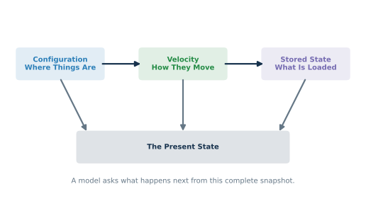{#fig-companion-state-snapshot width=92%}

## The Recipe and the Kitchen

A model is like a recipe that must name its ingredients and rules:

1. **Parts:** masses, lengths, inertias, joints, and contact points.
2. **State:** configuration, velocities, and any internal storage variables.
3. **Inputs:** applied forces, torques, or activation commands.
4. **Environment:** gravity, ground contact, air, and the ball.
5. **Evolution rule:** equations that turn the present state and inputs into
   acceleration and a new state.

Changing any one of these can change the answer. A fixed shoulder, a moving
base, and a full-body golfer are different systems—not higher and lower
resolutions of one automatic truth.

## Under the Hood: Why Acceleration Is Not Chosen Directly

For a linked mechanical system, a compact form is

$$
M(q)\ddot q + h(q,\dot q) = Bu + J(q)^T\lambda.
$$

Read it from left to right. The mass matrix $M$ describes how difficult the
current geometry is to accelerate. The term $h$ groups velocity-dependent
effects and gravity. The input $u$ holds declared actuators. The constraint
force $\lambda$ enforces contacts or connections through the Jacobian $J$.
Acceleration emerges only after those terms are reconciled.

::: {.callout-important title="Where the Picture Breaks"}
A model is not a miniature person. It is a deliberately incomplete argument.
Adding detail can answer a previously excluded question, but it can also add
unknown parameters. More parts do not guarantee more knowledge.
:::

**Go Deeper:** See the technical treatment’s
[model hierarchy and common observables](https://github.com/D-sorganization/UpstreamDrift/blob/main/docs/research/proximal_distal_energy_transfer/proximal_distal_energy_transfer.pdf?raw=1#page=83)
and Featherstone’s reference on rigid-body dynamics [@featherstone2008].

# Speed Is Not Energy {#sec-companion-speed-energy}

A light bicycle and a loaded truck can pass a sign at the same speed. Their
speedometers agree; their kinetic energies do not. Energy depends on both motion
and the properties of what is moving.

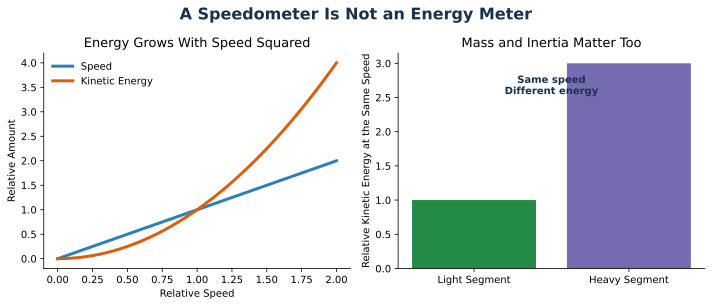{#fig-companion-speed-energy width=100%}

For a translating object, kinetic energy is $\tfrac12 mv^2$. For rotation, the
parallel expression is $\tfrac12 I\omega^2$, where $I$ is rotational inertia
and $\omega$ is angular speed. In a linked body, cross-terms also matter because
one segment carries another segment’s axis through space.

This distinction explains why a kinematic sequence is suggestive but not a
complete transfer measurement. A segment can slow while still receiving
positive power if its inertia or geometry is changing. Another can speed up
while an actuator removes energy, because interaction forces contribute even
more positive power.

## Power Is the Rate of the Exchange

Energy tells us how much is in an account. **Power** tells us how quickly the
balance changes. For a force at a moving point,

$$P = F\cdot v.$$

Only the part of force aligned with velocity contributes instantaneous power.
For a torque and angular velocity, $P=\tau\omega$. Power can be positive,
negative, or zero even when force and torque are large.

**Human Evidence:** Segmental kinetic-energy analyses have found ordered
outward energy patterns in golf, but the visible order and the energetic route
remain distinct measurements [@nesbit2005work; @kenny2008].

::: {.callout-important title="Where the Picture Breaks"}
The truck analogy treats mass as fixed and motion as simple translation. A
golfer changes geometry, rotates in three dimensions, interacts with the ground,
and deforms tissues and equipment. The analogy protects one lesson only: speed
alone is not an energy audit.
:::

**Go Deeper:** Read the technical paper’s
[distinction between kinematic sequence and energy transfer](https://github.com/D-sorganization/UpstreamDrift/blob/main/docs/research/proximal_distal_energy_transfer/proximal_distal_energy_transfer.pdf?raw=1#page=145).

# The Club Is Carried Before It Is Released {#sec-companion-carry}

Stand on a moving walkway while holding a suitcase. Before you swing the
suitcase relative to your arm, the walkway already carries you, and your arm
carries the suitcase. A distal object can acquire motion because its base is
moving even when the distal joint is quiet.

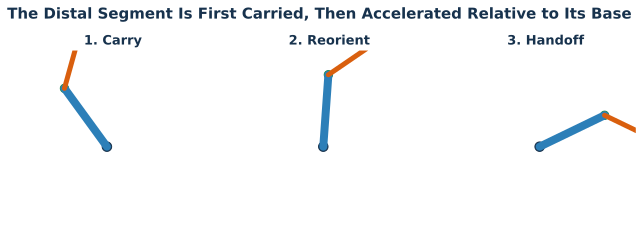{#fig-companion-carry-handoff width=100%}

This is the heart of delayed distal handoff. Early in the downswing, proximal
motion can carry the hands and club while the wrist angle remains comparatively
retained. Later, the club rotates rapidly relative to the hands. That pattern
does not mean the club was inert early or that all energy waited in one place.
It means base motion and relative motion contributed differently over time.

Classic double-pendulum studies found that modeled clubhead speed can benefit
when distal action is delayed rather than applied maximally from the top
[@milburn1982; @sprigings2000; @sprigings2002]. This does not make “delay” a
universal instruction. The selected onset depends on the model, objective,
limits, and starting state.

## Why Early Drive Can Be Costly

Unfolding the distal link early can move its mass farther from the proximal
rotation axis. That can increase the system’s effective rotational inertia
before proximal speed has developed. It also changes interaction forces and
the direction in which those forces act. The mechanism is geometric, not
mystical.

**Model Result:** In the baseline two-link comparison reported by the technical
paper, immediate wrist drive produced less terminal clubhead speed than the
passive-wrist case, while a selected later drive produced more. Those are
finite-model comparisons, not estimates of how many metres any person will gain.

::: {.callout-important title="Where the Picture Breaks"}
A whip tapers continuously and can carry traveling waves. A golf swing contains
active joints, two hands, a moving base, and a comparatively stiff but flexible
club. “Crack the whip” is therefore a poor mechanical identity. It can evoke
sequencing, but it hides the actual pathways.
:::

**Go Deeper:** Explore the paper’s
[92-command timing sweep](https://github.com/D-sorganization/UpstreamDrift/blob/main/docs/research/proximal_distal_energy_transfer/proximal_distal_energy_transfer.pdf?raw=1#page=40)
and the open double-pendulum literature [@milburn1982; @sprigings2000].

# Forces Travel Through Connections {#sec-companion-forces}

Push a shopping cart sideways while it rolls forward. Your force may turn the
cart much more than it speeds it up. Push along the handle’s path and more of
your effort changes forward speed. Direction determines the consequence.

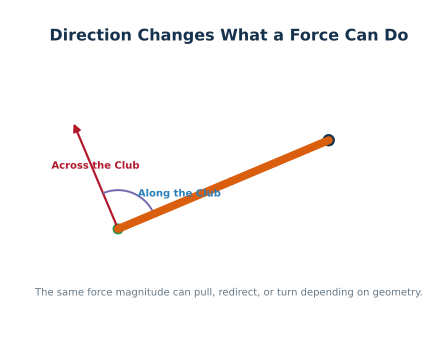{#fig-companion-force-direction width=86%}

A joint connection can transmit force even if the joint actuator is doing no
direct work. If the connection point moves, the force can transport power
across the boundary. In segment-energy accounting, this is not a metaphor:
$F\cdot v$ is the instantaneous boundary power.

The same force magnitude can therefore have different effects as the club
changes orientation. Its tangential projection can accelerate rotation. Its
radial projection can maintain curved motion. The moving hand path changes both
projections throughout the swing.

## Interaction Does Not Mean “Extra” Energy

Interaction forces redistribute and redirect energy within the linked system.
They do not create energy from nothing. If the distal segment gains energy
through a joint force, another account—proximal work, gravity, elastic storage,
or existing kinetic energy—must support that gain, apart from numerical error.

**Model Result:** The open hand-path attribution studies found cases in which
the pointwise drift contribution exceeded 100% of signed hand-path work because
the simultaneous control contribution opposed it. Percentages above 100% can
appear when signed terms cancel; they do not imply free energy.

::: {.callout-important title="Where the Picture Breaks"}
“Force travels down the chain” can sound like a pulse in a pipe. Constraint
forces are solved throughout the connected system at each state. Their values
depend on the whole geometry, motion, loading, and chosen contact model.
:::

**Go Deeper:** The
[hand-path force attribution chapter](https://github.com/D-sorganization/UpstreamDrift/blob/main/docs/research/proximal_distal_energy_transfer/proximal_distal_energy_transfer.pdf?raw=1#page=53)
reports the complete force, impulse, power, and work decomposition.

# Two Hands Can Make a Turning Effect {#sec-companion-two-hands}

Turn a steering wheel. One hand can push while the other pulls. The two forces
may nearly cancel as a net push yet still create a strong turning effect because
they act at separated points. Mechanics calls this a **couple**.

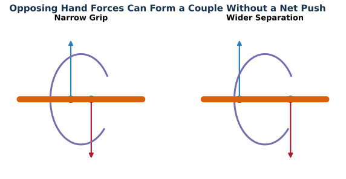{#fig-companion-two-hand-couple width=100%}

For two forces $F_1$ and $F_2$ applied at positions $r_1$ and $r_2$, the moment
about a declared reference point $r_0$ is

$$
M_{r_0}=(r_1-r_0)\times F_1+(r_2-r_0)\times F_2.
$$

When the forces are equal and opposite, the net force can vanish while the
couple remains. Increasing separation increases the moment for the same force
geometry. Reversing the moment arms reverses the couple. Making the points
coincident removes this particular mechanism.

**Model Result:** The reconstructed two-hand WSCG model and later forward
constrained models produced a negative force-generated grip couple with no
direct club torque in the declared branch. Coincident-grip controls collapsed
that couple to zero, and reversed moment arms reversed its sign.

**Human Evidence:** Instrumented-grip research shows that individual hand
forces can be measured and used in upper-limb kinetics [@koike2016; @koike2020].
Those measurements are the appropriate bridge from a feasible mechanism to a
claim about golfers.

::: {.callout-important title="Where the Picture Breaks"}
The steering wheel is rigid and fixed to a simple axis. A golf club translates,
rotates in three dimensions, bends, and receives forces from compliant hands.
The couple picture explains separated-force geometry, not anatomy or intent.
:::

**Go Deeper:** See the paper’s
[two-hand mechanism and zero-command controls](https://github.com/D-sorganization/UpstreamDrift/blob/main/docs/research/proximal_distal_energy_transfer/proximal_distal_energy_transfer.pdf?raw=1#page=69).

# Negative Torque Is Not a Negative Intention {#sec-companion-negative-torque}

The word *negative* sounds evaluative. In mechanics it usually means only
“opposite the chosen positive direction.” A negative torque is not bad, weak,
braking, passive, or conscious by definition.

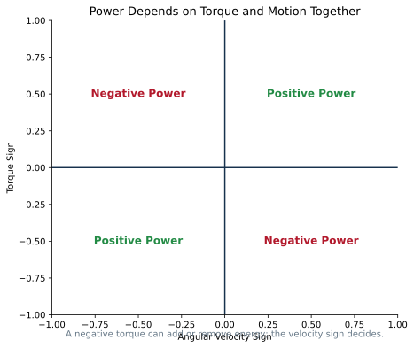{#fig-companion-power-sign width=78%}

Torque alone does not determine energy flow. Power is $P=\tau\omega$. If torque
and angular velocity share a sign, their product is positive. If their signs
differ, power is negative. A negative torque applied during negative angular
velocity supplies positive power.

Nor does a net joint torque uniquely identify muscle action. Many muscles can
contribute, opposing muscles can co-contract, and contact forces can create a
moment about the club without a direct wrist actuator. Inverse dynamics returns
a net requirement under a model; it does not read the nervous system.

## Passive Has Several Meanings

“Passive” might mean zero commanded torque, no positive work, no muscle
activation, or motion produced without conscious intent. These are not
equivalent. A zero-command model may still contain gravity, stiffness, damping,
contact forces, and stored energy. A living wrist may generate a net moment
through active co-contraction even if its angle changes little.

::: {.callout-warning title="Scientific Boundary"}
The model establishes that negative torque and negative force-generated couples
are mechanically possible under declared conditions. It does not establish
which muscles produced them, whether a golfer intended them, or whether they
are beneficial in a person. This is not a coaching instruction.
:::

## Where the Picture Breaks

A brake normally dissipates heat. Negative joint power can instead coexist
with energy transfer through contact forces or with elastic storage elsewhere.
Calling every negative torque a “brake” collapses distinct accounts.

**Go Deeper:** Read the technical paper’s
[torque, couple, and power sign audit](https://github.com/D-sorganization/UpstreamDrift/blob/main/docs/research/proximal_distal_energy_transfer/proximal_distal_energy_transfer.pdf?raw=1#page=74)
and the foundational discussion of multi-articular muscle action [@zajac1989].

# A Shaft Can Store and Return Energy {#sec-companion-shaft}

Press a spring and release it. The spring returns some stored energy, but never
chooses when to do so. Its release follows loading, stiffness, damping, and
boundary motion. A golf shaft behaves similarly in principle, with bending and
twisting distributed along its length.

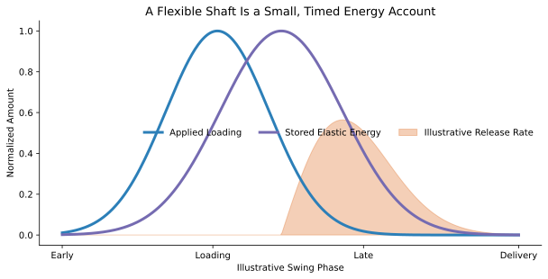{#fig-companion-shaft-storage width=100%}

The shaft is not a large hidden motor. It is a relatively small, timed account
inside a much larger system. Its influence depends on how its modal response
aligns with delivery. Fast load changes can excite modes that a one-mode model
misses; slow changes may be represented more faithfully.

**Model Result:** In the matched rigid/flexible reference case, flexibility
changed delivery speed modestly compared with gravity and damping ablations.
The distributed-shaft study also showed much larger reduced-model error under a
short pulse than a slow one. These findings argue for frequency-aware modeling,
not a universal shaft benefit.

## Under the Hood: Storage Is State

For a simple elastic coordinate $s$, stored energy is approximately
$\tfrac12ks^2$. Its rate depends on both deflection and deflection velocity.
That makes preparation history observable: two identical club poses can have
different futures if their internal shaft states differ.

::: {.callout-important title="Where the Picture Breaks"}
A single coil spring has one deformation coordinate. A real shaft is a tapered,
distributed structure with bending, torsion, damping, and clubhead boundary
conditions. The spring picture explains storage but not the full spectrum.
:::

**Go Deeper:** See the technical
[distributed-shaft verification study](https://github.com/D-sorganization/UpstreamDrift/blob/main/docs/research/proximal_distal_energy_transfer/proximal_distal_energy_transfer.pdf?raw=1#page=99).

# Timing by the Clock and Timing by the State {#sec-companion-triggering}

Traffic lights usually change by schedule or sensors. A scheduled light turns
green after a fixed time. A sensor-controlled light waits until a vehicle
arrives. When traffic speed varies, the sensor keeps the event tied to the
actual situation rather than the clock.

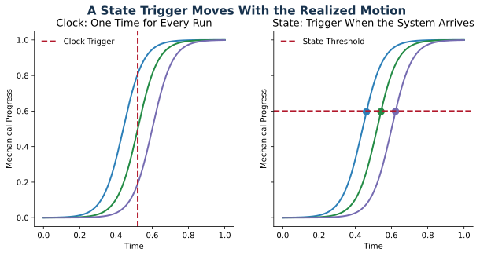{#fig-companion-clock-state width=100%}

A swing controller can be described the same way. A **clock trigger** changes
the command at a fixed time. A **state trigger** changes it when a measured
configuration or phase crosses a threshold. If the motion runs early or late,
state triggering can follow the realized trajectory.

But sensing is not free. Real state feedback has noise, delay, ambiguity, and
limited observability. A simulation with perfect state access is an upper bound
on what that trigger could accomplish.

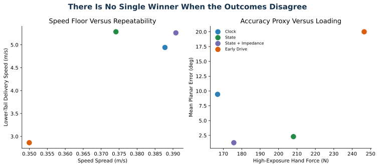{#fig-companion-tradeoffs width=100%}

**Model Result:** In fifteen held-out perturbations, the state-triggered program
raised the modeled tenth-percentile delivery speed from 4.94 to 5.28 m/s and
reduced mean planar face/path error from 9.44° to 2.29° relative to the clock
program. Its ninetieth-percentile peak hand force rose from 166.9 to 208.1 N.
All four registered programs remained Pareto-nondominated: none was best on
every objective. The complete numbers are in the
[machine-readable evidence](https://raw.githubusercontent.com/D-sorganization/UpstreamDrift/main/docs/research/proximal_distal_energy_transfer/data/transmission_robustness_study.json).

::: {.callout-important title="Where the Picture Breaks"}
A traffic sensor observes a simple event. Human movement estimates state from
vision, vestibular signals, proprioception, touch, and prediction, all with
delay. “Use state feedback” is a research design, not a simple cue.
:::

**Go Deeper:** Read
[Transmission Pathways, Robust Speed, and Task Stability](https://github.com/D-sorganization/UpstreamDrift/blob/main/docs/research/proximal_distal_energy_transfer/proximal_distal_energy_transfer.pdf?raw=1#page=141).

# Fast Once or Fast Repeatedly {#sec-companion-variability}

Suppose two archers each fire ten arrows. One hits the bullseye once and
scatters the rest. The other forms a tight group slightly off-center. “Best
shot” and “best system” now mean different things.

Performance has at least three layers:

- **Central tendency:** the typical speed or outcome.
- **Dispersion:** how widely trials vary.
- **Tail behavior:** how bad the weak trials are, or how costly the extreme
  loads become.

Optimizing only nominal club speed can choose a fragile motion. Minimizing all
movement variability can also be misguided, because some variation may occur
in directions that barely affect the task.

**Human Evidence:** Golf movement variability does not map one-to-one onto
outcome variability [@tucker2014]. Launch-monitor variables also have different
within- and between-session reliability, so observed dispersion must be
separated from measurement noise [@shaw2023].

## Robustness Means Naming the Disturbance

A motion is not robust in the abstract. It is robust *to something*: timing
error, a changed initial pose, command scaling, shaft stiffness, grip geometry,
or sensory delay. It must also be robust *for something*: speed, strike,
orientation, loading, or injury-relevant exposure.

::: {.callout-important title="Where the Picture Breaks"}
The archer can see the final target. A golfer’s delivery outcome is
multidimensional: speed, face, path, strike location, dynamic loft, attack
angle, and load all matter. A tight cluster in one coordinate may conceal a
poor or unsafe tradeoff elsewhere.
:::

**Go Deeper:** The technical paper’s
[paired held-out perturbation design](https://github.com/D-sorganization/UpstreamDrift/blob/main/docs/research/proximal_distal_energy_transfer/proximal_distal_energy_transfer.pdf?raw=1#page=143)
shows how identical disturbances can compare candidate strategies fairly.

# Many Motions Can Share One Outcome {#sec-companion-abundance}

Write your name twice. The letters remain recognizable although no two pen
paths are microscopically identical. The task allows many successful motions.
Biological systems often possess more adjustable variables than the task
strictly requires—a property called **motor abundance**.

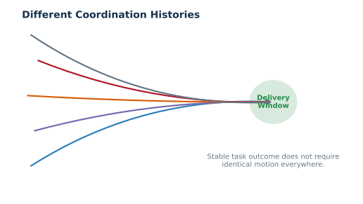{#fig-companion-many-paths width=90%}

Near one operating point, we can ask how small input changes affect selected
outcomes. The Jacobian $J_y$ maps input perturbations $\delta x$ to outcome
changes $\delta y$:

$$\delta y\approx J_y\delta x.$$

Directions in the null space of $J_y$ produce little first-order change in the
chosen outcomes. They are not “wasted motion”; they may permit adaptation,
comfort, or redistribution of internal load.

**Model Result:** The local eight-input, three-outcome map in the robustness
study had rank three and nullity five. Most declared perturbation variance
projected into the local task-null subspace. This is a property of that model,
operating point, covariance, and outcome definition—not evidence of a neural
synergy.

**Hypothesis:** Skilled golfers may organize variability so that delivery
variables remain stable while less consequential coordinates vary. That idea
requires participant-level repeated trials and nonlinear outcome analysis.

::: {.callout-important title="Where the Picture Breaks"}
The signature analogy has a generous success criterion: humans can read many
forms of the same name. Ball impact is less forgiving, and the relevant task
manifold may curve sharply. A direction that is harmless infinitesimally can
matter at larger amplitude.
:::

**Go Deeper:** The technical chapter’s
[local task-null analysis](https://github.com/D-sorganization/UpstreamDrift/blob/main/docs/research/proximal_distal_energy_transfer/proximal_distal_energy_transfer.pdf?raw=1#page=144)
connects the model result to movement-variability literature [@morrison2016].

# What the Models Can and Cannot Tell Us {#sec-companion-evidence}

An architect’s load calculation, a wind-tunnel model, a bridge prototype, and
a decade of field records can all be excellent evidence. They answer different
questions. A stronger equation does not automatically become field evidence;
a larger dataset does not automatically identify a mechanism.

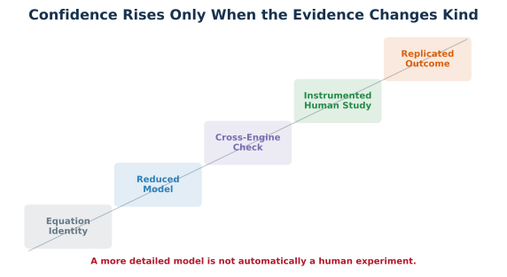{#fig-companion-evidence-ladder width=100%}

The project uses a ladder of model tiers:

1. A double pendulum isolates distal timing.
2. Prescribed two-hand models audit separated-force geometry.
3. Forward constrained models test whether the effect persists after inputs
   are removed.
4. Moving-base and flexible-shaft models admit additional pathways.
5. Spatial cross-engine studies test frame and implementation consistency.
6. A preregistered human protocol states what measurements could challenge the
   performance claims.

Each rung should earn one new sentence, not permission to restate every earlier
claim more confidently.

## Counterfactuals Ask Two Different Questions

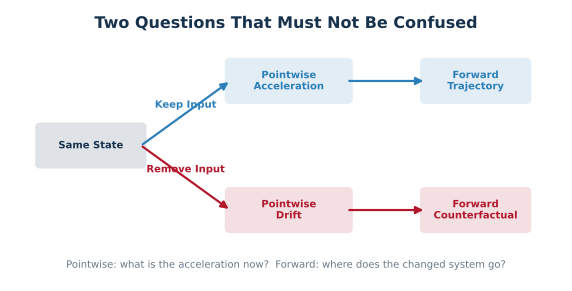{#fig-companion-counterfactual width=100%}

A **pointwise counterfactual** asks: at the exact achieved state, what
acceleration would the equations produce if a declared input were removed?
A **forward counterfactual** branches from that state and integrates the altered
system. The first attributes instantaneous acceleration. The second tests
persistence. A stitched series of pointwise answers is not the same as one
forward alternate history.

::: {.callout-warning title="What Current Evidence Does Not Establish"}
The current package does not establish a universal swing optimum, a causal
muscle strategy, passive human negative torque, injury reduction, or human
self-stabilization. It does not convert a planar face/path proxy into ball
flight. It does not identify individual-hand forces from a net wrench when the
allocation is nonunique.
:::

## Where the Picture Breaks

An evidence ladder is not a single score. A clean algebraic identity may be
more certain than a noisy human correlation, even though the human study is
closer to application. Certainty and applicability are different axes.

**Go Deeper:** Use the paper’s
[model-completion and falsification matrix](https://github.com/D-sorganization/UpstreamDrift/blob/main/docs/research/proximal_distal_energy_transfer/MODEL_COMPLETION_FALSIFICATION_MATRIX.md)
to see which claim belongs to which tier.

# A Research Program That Can Be Wrong {#sec-companion-falsification}

Good explanations take risks. They say what should happen, under which
conditions, and what observation would count against them. A story that can
explain every possible result after the fact has not explained enough.

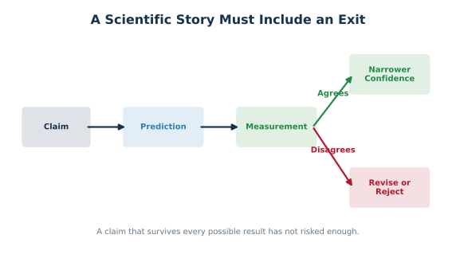{#fig-companion-falsification width=100%}

## Near-Term Tests

The strongest next experiment synchronizes whole-body motion capture,
force plates, bilateral hand wrenches, shaft response, electromyography, club
delivery, impact, and launch. It holds participants out of model selection,
propagates measurement error, and perturbs phase rather than merely comparing
self-selected swings.

The following observations **would count against** the proposed performance
interpretation:

1. State-relative handoff fails to predict a better speed–dispersion–load
   frontier than clock-relative timing in participant-held-out data.
2. Measured bilateral forces cannot reproduce the sign or geometry of the
   proposed late grip couple after reference-point transport.
3. The apparent advantage disappears when strike, face, path, and ball flight
   replace terminal model speed.
4. The effect is smaller than instrument uncertainty or session-to-session
   variability.
5. Subject-calibrated models require direct distal actuation inconsistent with
   the proposed interaction-force pathway.

Failure would not erase Newtonian mechanics. It would narrow which mechanism
matters in golfers and under which conditions. That is progress.

## A Neutral Practical Reading

The current work suggests questions for measurement rather than universal
cues:

- Does a transition follow the realized mechanical state or a fixed schedule?
- Which pathway supplies late club power: direct moment, moving contact force,
  elastic release, gravity, or a mixture?
- Does a higher-speed solution preserve face, path, strike, and acceptable
  loading across perturbations?
- Which movement variations are task-relevant, and which lie along an
  acceptable solution family?

These questions can organize experiments and individualized optimization.
They are not a coaching instruction.

::: {.callout-important title="Where the Picture Breaks"}
Science does not advance as a tidy staircase from ignorance to certainty.
Measurements disagree, definitions evolve, models fail for informative
reasons, and useful explanations retain explicit boundaries.
:::

**Go Deeper:** The project’s full
[adversarial review](https://github.com/D-sorganization/UpstreamDrift/blob/main/docs/research/proximal_distal_energy_transfer/ADVERSARIAL_TRANSMISSION_REVIEW.md)
lists each gap, counterexample, falsifier, and forward action.

# Glossary {.unnumbered}

**Acceleration:** The rate at which velocity changes. It includes changes in
speed and direction.

**Constraint:** A rule limiting possible motion, such as two modeled contact
points remaining on a grip.

**Control:** A declared model input. It need not correspond one-to-one with a
muscle, intention, or cue.

**Couple:** A turning effect produced by separated forces, often with little or
no net force.

**Distal / Proximal:** Farther from / closer to the body’s central attachment
along a linked chain.

**Drift:** The acceleration field remaining when declared control inputs are
set to zero at a state. Drift can still include gravity, velocity-dependent
terms, stiffness, damping, and constraints.

**Energy:** A conserved bookkeeping quantity for the ability of a declared
system to produce change, partitioned into kinetic, potential, elastic, and
other forms.

**Impedance:** The motion-dependent resistance created by inertia, stiffness,
damping, and control. It is not synonymous with simply “being stiff.”

**Inertia:** Resistance to acceleration. Rotational inertia depends on how mass
is distributed relative to an axis.

**Kinematic Sequence:** The observed order of segment angular-speed peaks. It
is not, by itself, an energy-pathway measurement.

**Momentum:** A state quantity associated with mass and velocity; angular
momentum is its rotational counterpart.

**Pareto-Nondominated:** No other tested candidate improves one objective
without worsening at least one other objective.

**Power:** The instantaneous rate of energy transfer or work. Translational
power is $F\cdot v$; rotational power is $\tau\omega$.

**Reference Frame / Reference Point:** The axes and point relative to which a
vector or moment is expressed. Moments must be transported consistently when
the point changes.

**Robustness:** Preservation of a declared outcome under declared disturbances.

**State:** The information required by a model to predict its next evolution,
usually configuration, velocity, and relevant internal variables.

**Task-Null Direction:** A local input change that produces little first-order
change in selected task outcomes.

**Torque or Moment:** A turning effect about an axis or point. Its sign alone
does not determine power.

**Work:** Energy transferred by a force or torque through motion, accumulated
over an interval.

**Wrench:** A force and moment expressed together at a declared point and in a
declared frame.

**ZTCF:** Zero-torque counterfactual. The term must specify whether it is a
pointwise same-state evaluation or a forward-integrated branch.

# References {.unnumbered .unlisted}

The bibliography below contains the primary and technical sources cited in the
book. Citation titles link to DOI, PubMed, publisher, or stable full-text pages
where the underlying entry provides one. The complete reproducible evidence,
code, limitations, and reviewer workbench remain available in the
[open technical resource](https://github.com/D-sorganization/UpstreamDrift/tree/main/docs/research/proximal_distal_energy_transfer).

::: {#refs}
:::
