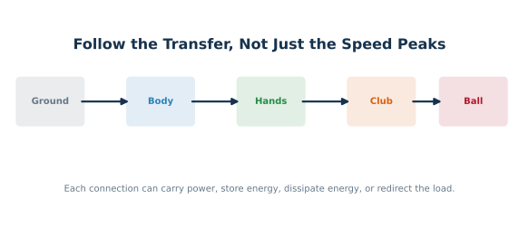

::: {.companion-opening}
This is a patient exploration of a moving system. It follows energy from the
ground, through the body and hands, into a flexible club, and toward the ball.
Ordinary scenes make the mechanics visible; equations and experiments keep the
scenes honest. No model result becomes swing instruction merely because it is
easy to picture. The purpose is to make the scientific questions understandable
enough that a reader can examine, challenge, and improve them.
:::

{#fig-companion-follow-energy width=100% fig-alt="A five-stage flow map connects ground, body, hands, club, and ball while noting that each boundary can transfer, store, redirect, or dissipate mechanical energy."}

## How to Read This Book {.unnumbered}

The book is organized as a long walk rather than a stack of definitions. Part I
builds the language of motion. Part II follows forces through a double
pendulum. Part III opens the two-hand and flexible-shaft mechanisms. Part IV
shows how models grow without pretending that the largest model is automatically
the best. Part V asks what is identifiable, robust, measured, and falsifiable.
The final part turns the argument into a reviewer path and a neutral practical
synthesis.

Every chapter has four recurring landmarks:

- **A Concrete Picture** begins with an ordinary situation that can be held in
  the mind while the mechanics develops.
- **How the Mechanism Works** supplies the sustained explanation, equations,
  figures, and worked reasoning.
- **Where the Picture Breaks** states exactly where the analogy or reduced model
  stops earning conclusions.
- **Go Deeper** links to the corresponding technical chapter, executable
  evidence, and real literature.

Claim labels recur throughout. **Model Result** means an executable mathematical
system produced a result under declared assumptions. **Human Evidence** means
people were measured. **Hypothesis** means a proposed explanation awaits a
decisive test. **Practical Interpretation** translates a question into ordinary
language without declaring a universal technique.

Readers who want to change the models can use the
[interactive proximal-distal workbench](proximal-distal-model-workbench.html).
Readers who want every equation and numerical contract can open the
[governed scientific monograph](proximal_distal_energy_transfer/index.html) or
[download its exact PDF](proximal_distal_energy_transfer/proximal_distal_energy_transfer.pdf).
Its models, claims, and evidence are pinned to
[UpstreamDrift commit `85cce4d3`](https://github.com/D-sorganization/UpstreamDrift/tree/85cce4d3307bb7ad3953d9fc6e583e370803515c/docs/research/proximal_distal_energy_transfer).

This book is **not a coaching instruction**. It explains testable mechanics,
evidence boundaries, and open questions. The preload discussion also links to
the machine-readable
[transmission robustness study](https://github.com/D-sorganization/UpstreamDrift/blob/85cce4d3307bb7ad3953d9fc6e583e370803515c/docs/research/proximal_distal_energy_transfer/data/transmission_robustness_study.json)
used by the technical analysis.
































## Glossary {.unnumbered}

**Acceleration:** The rate at which velocity changes. It can change speed,
direction, or both.

**Ablation:** A controlled model experiment in which one mechanism is removed
or neutralized while the remaining conditions are held as comparable as
possible.

**Constraint:** A rule limiting allowable motion, such as two linked segments
sharing a joint or two hands remaining attached to one grip.

**Coriolis Term:** A cross-speed part of a motion equation under a declared
coordinate convention. In the two-link example it requires simultaneous arm
rotation and relative wrist motion; it is not a new external or muscle force.

**Centripetal and Centrifugal:** In an inertial description, centripetal names
the inward requirement for curved motion. Centrifugal is the outward inertial
interpretation in a rotating description. They are not two forces to add.

**Counterfactual:** A carefully stated “what if” comparison used to attribute a
quantity or test whether a proposed mechanism persists.

**Drift:** The part of modeled acceleration produced by the current state and
passive terms when the declared control input is set to zero at that instant.

**Energy:** A scalar accounting quantity for the capacity of a chosen system to
produce change. Its numerical value depends on the system boundary and reference.

**Falsifier:** An observation or test result that would count against a claim.

**Identifiability:** Whether available observations can uniquely or usefully
determine a model parameter, internal force, or mechanism.

**Impulse:** Force integrated over time. Angular impulse is moment integrated
over time.

**Interaction Force:** A force transmitted at a connection between parts of a
linked system.

**Moment or Torque:** The turning effect of a force or a direct rotational
couple about a declared point and axis.

**Power:** The instantaneous rate of energy transfer or work, measured in watts.

**Preload:** A nonzero internal load already present before a command or event
changes.

**Robustness:** Performance retained across a declared set of disturbances,
uncertainties, participants, or model parameters.

**State:** The collection of variables needed by a model to predict its future
from the present, commonly configuration, velocity, and stored internal states.

**Squared-Speed Term:** A velocity-dependent equation term containing one
generalized speed squared. Its detailed allocation is coordinate-dependent.

**Wrench:** A combined force and moment expressed about a declared reference
point and in a declared coordinate frame.

**Work:** Energy transferred by a force through displacement or by a moment
through angular displacement.

**Pointwise Zero-Torque Counterfactual (ZTCF) Force:** The generalized-force
representation predicted at a declared state when the selected control input is set
to zero for a pointwise decomposition (the pointwise drift generalized force).

## References {.unnumbered .unlisted}
