```{=html}
<section class="laymans-terms">
  <h2>
  <button type="button" class="laymans-terms-header" aria-expanded="false">
    <span class="laymans-terms-header-title">In Layman's Terms</span>
    <span class="laymans-terms-icon" aria-hidden="true">▼</span>
  </button>
</h2>
  <div class="laymans-terms-content">
    <div class="laymans-terms-inner">
      <p class="laymans-terms-intro">
        Should a golfer actively push with their wrists early in the downswing, or hold the wrist angle ("lag") and release late?
      </p>

      <div class="laymans-item">
        <h3>What the Simplified Model Shows About Early Wrist Drive</h3>
        <p>
          In the baseline two-link simulation, driving the wrist joint from the start produced <strong>15% less clubhead speed</strong> than a passive wrist. The result illustrates how early uncocking can increase rotational inertia before proximal speed has developed. It is a model comparison, not an estimate of what any individual golfer will gain or lose.
        </p>
      </div>

      <div class="laymans-item">
        <h3>Retain Early, Release Late</h3>
        <p>
          Within the tested programs, the highest modeled speeds occurred when the wrist remained folded early and received positive drive later. Relative to the passive baseline, optimized late-drive programs were <strong>12% to 14% faster</strong>. Most late club-energy gain in the model came through joint-force transfer rather than direct wrist work.
        </p>
      </div>
    </div>
  </div>
</section>
```

::: {.callout-warning}
## Pinned Open Evidence

The hand-path drift/control extension is published from the exact
[UpstreamDrift merge commit `69eb7e9d`](https://github.com/D-sorganization/UpstreamDrift/commit/69eb7e9db32ccd17e45824619315b1d04b400c27).
The [local evidence snapshot](../data/proximal_distal_energy_transfer/hand_path_attribution_snapshot.json)
records the full 40-character commit, compact results for all three model tiers,
regeneration commands, and SHA-256 digests for every figure reproduced here.
The offline command
`python scripts/check_proximal_distal_evidence.py --require-pinned` verifies the
pin, artifact integrity, finite estimands, and force/couple/power/work closure.
The open evidence supports model-mechanics statements; it does not identify
muscle activation, metabolic effort, perceived effort, or a universal coaching
strategy.
:::

# Introduction {#sec-intro}

## Motivation

Clubhead speed at impact is the dominant controllable determinant of drive distance, and it correlates strongly with playing standard [@fradkin2004; @hellstrom2009; @hume2005]. The golf downswing is among the most-studied examples of a *sequenced* multi-segment rotation in sport biomechanics [@mcphee2022; @dillman1994]. Across measurement systems and populations, the downswing of a skilled golfer shows a characteristic order: the pelvis reaches its peak angular speed first, then the thorax, then the lead arm, and finally the club, with each successive segment peaking faster than the one before [@cheetham2008; @tinmark2010]. This pattern — the *kinematic sequence*, an instance of the general proximal-to-distal (P→D) sequencing observed in throwing and striking skills [@putnam1993] — is routinely interpreted as the visible signature of mechanical energy generated in the large proximal segments and transferred outward to the small, fast distal ones, and it has been translated into coaching doctrine accordingly [@smith2015].

That interpretation leaves a first-order question unanswered:

> **Should a golfer attempt to transfer energy from proximal to distal segments *early* in the downswing, or should energy be *retained* in the proximal segments early and the transfer deliberately *accelerated* late?**

The two strategies imply opposite coaching cues ("fire the club from the top" versus "hold the lag and let it release"), opposite torque programs at the wrists and torso, and different predictions for what counterfactual decompositions of a measured swing should show. The question also connects to a long-standing thread in the modeling literature: double-pendulum analyses have argued since the 1960s that the highest clubhead speeds arise when the distal joint is *not* driven early — when release is passively or actively delayed [@cochran1968; @jorgensen1970; @milburn1982; @pickering1999] — while the coaching translation of the kinematic sequence often emphasizes initiating distal motion promptly after transition.

This study approaches the question with *counterfactual dynamics*. A **pointwise ZTCF sample**, or pointwise drift vector, is the acceleration the model evaluates at one achieved state with applied control removed. A **stitched pointwise ZTCF trace** collects those same-state samples without integrating them. A **forward or branched ZTCF trajectory** integrates the drift after a torque killswitch and is required to test persistence. The **control contribution** is the same-state difference between total and drift acceleration. A **ZVCF is not the control contribution**: it is a separate zero-velocity construction used to isolate configuration-dependent terms under a declared convention.

::: {.callout-important}
## Definition Alignment & Cross-Reference

This article applies the canonical definitions in the [Zero-Torque Counterfactual glossary](zero-torque-counterfactual.html#sec-ztcf-canonical). The pointwise ZTCF sample is $f(\mathbf{x}) = M(\mathbf{q})^{-1}(-C(\mathbf{q},\dot{\mathbf{q}})\dot{\mathbf{q}} - \mathbf{g}(\mathbf{q}))$, while the same-state control contribution is $G(\mathbf{x})u$. A stitched trace evaluates $f$ at successive achieved states; it must not be used to infer persistence. A forward or branched ZTCF integrates $f$ after setting the declared applied torque channels to zero. ZVCF evaluates the declared model at zero velocity and must not be relabeled as pure control.
:::

## Research Questions

The document is organized around four questions:

- **RQ1 — Mechanism.** By what mechanical pathways does energy generated proximally reach the club, and what does each pathway imply about the *timing* of the handoff? (@sec-mechanics)
- **RQ2 — Evidence.** Where does the P→D transfer occur in measured swings, and how do skilled and less-skilled players differ — in sequence order, in magnitudes, or in transfer efficiency? (@sec-evidence)
- **RQ3 — Formalization.** How can "transfer early" versus "retain-early/release-late" be stated as falsifiable claims about measurable quantities, and what do the ZTCF/ZVCF counterfactuals predict under each? (@sec-timing-framework)
- **RQ4 — Model test.** What does a two-link model show when distal-handoff timing is manipulated directly and energy accounting and counterfactual decompositions are computed along each trajectory? (@sec-methods, @sec-results, @sec-discussion)
- **RQ5 — Attribution.** How much hand-path and joint force, impulse, power, and work is associated with pointwise drift versus same-state control, and how does that balance change with model topology, joint, and time window? (@sec-attribution-results)
- **RQ6 — Allocation and Preload.** For an identical club-moment task, how do arm-dominant and wrist-dominant actuator allocations change internal loading, and under what declared transmission model does preload preserve torque continuity? (@sec-allocation-preload)

# Mechanics of Sequenced Swings {#sec-mechanics}

## The Summation-of-Speed Principle

Sequential segment motion in human movement dates to Bunn's principle of summation of speed [@bunn1972]. When segments connected in series accelerate in sequence, the distal tip speed is not merely the sum of independent segment rotation rates; it is the compound result of base rotation carrying distal axes plus distal rotation relative to those axes [@putnam1991; @putnam1993].

In a planar 2-DOF chain with arm length $L_1$ and club length $L_2$, the clubhead velocity vector is:
$$
\mathbf{v}_{\text{head}} = L_1 \dot{\theta}_1 \mathbf{u}_1^\perp + L_2 (\dot{\theta}_1 + \dot{\theta}_2) \mathbf{u}_2^\perp,
$$
where $\mathbf{u}_1^\perp, \mathbf{u}_2^\perp$ are unit tangent vectors in the swing plane. The speed magnitude squared is:
$$
v_{\text{head}}^2 = L_1^2 \dot{\theta}_1^2 + L_2^2 (\dot{\theta}_1 + \dot{\theta}_2)^2 + 2 L_1 L_2 \dot{\theta}_1 (\dot{\theta}_1 + \dot{\theta}_2) \cos\theta_2.
$$
The cross-term $2 L_1 L_2 \dot{\theta}_1 (\dot{\theta}_1 + \dot{\theta}_2) \cos\theta_2$ reveals the geometric leverage of wrist cock $\theta_2$: when $\theta_2$ is near $-\pi/2$ (wrist cocked), the cross-term is small; as $\theta_2 \to 0$ (wrist uncocked), $\cos\theta_2 \to 1$, maximizing distal speed for given segment rates.

## Interaction Dynamics and Torque Handoffs

The equations of motion for the planar double pendulum express the causal coupling between joint torques and segment accelerations:
$$
M(\mathbf{q}) \ddot{\mathbf{q}} + C(\mathbf{q},\dot{\mathbf{q}})\dot{\mathbf{q}} + \mathbf{g}(\mathbf{q}) = \boldsymbol{\tau}.
$$
Explicitly expanding for the wrist acceleration $\ddot{\theta}_2$:
$$
\ddot{\theta}_2 = \frac{\tau_2 - C_{21}\dot{\theta}_1^2 - g_2(\mathbf{q})}{M_{22}} - \frac{M_{21}}{M_{22}}\ddot{\theta}_1.
$$
The term $-\frac{M_{21}}{M_{22}}\ddot{\theta}_1$ is the **inertial interaction acceleration**. Because $M_{21} = m_2 L_1 L_{c2} \cos\theta_2 + I_2 > 0$ for typical geometries, accelerating the arm ($\ddot{\theta}_1 > 0$) exerts an inertial torque on the wrist that acts to *increase* wrist cock (maintain lag). Conversely, decelerating the arm ($\ddot{\theta}_1 < 0$) uncocks the wrist and transfers energy to the club without requiring applied distal generalized torque in this model [@putnam1993; @herring1992]. This does not imply zero distal muscle force because co-contraction and passive structural loads are not identified by the generalized-torque counterfactual.

## Parametric Energy Transfer

As White [@white2006] and Miura [@miura2001] demonstrated, the dominant distal energy gain late in the downswing is *parametric*: the inward centripetal force exerted by the arm on the wrist joint performs mechanical work on the club segment as the hub path tightens and the club rotates toward alignment. The power delivered by this joint force is:
$$
P_{\text{joint}} = \mathbf{F}_{\text{wrist}} \cdot \mathbf{v}_{\text{wrist}}.
$$
This mechanism requires a high proximal speed $\dot{\theta}_1$ to establish a strong centripetal acceleration field ($L_1 \dot{\theta}_1^2$). Driving the wrist early truncates $\dot{\theta}_1$, destroying the centrifugal field needed for parametric amplification.

# Empirical Evidence in Golfers {#sec-evidence}

Empirical kinetic and kinematic studies confirm the P→D energy flow structure. Nesbit and Serrano [@nesbit2005work] showed that the torso and hips contribute 68.7–72.2% of total swing work, while shoulder and wrist joints contribute 24.3–28%. Power generation is concentrated early (torso), while clubhead speed conversion occurs late.

Recent findings by Rachnavy et al. [@frontiers2026footground] (Frontiers in Sports and Active Living, 2026, DOI: 10.3389/fspor.2026.1790645) demonstrate that foot-ground interaction variables alone account for 35.5% of clubhead speed variance, rising to 75.4% when trunk sequencing and *impulse-based energy transfer efficiency* are included. Mediation analysis confirms that transfer *efficiency*, rather than sequence *order* alone, distinguishes high-performing swings.

Segmental kinetic energy sequencing studies by Kenny et al. [@kenny2008] and Anderson et al. [@anderson2006] further document outward energy migration, showing that energy arrives late in the club after proximal peaks have passed.

## Force Along the Hand Path

MacKenzie, McCourt, and Champoux [@mackenzie2020energy] analyzed 76 amateur
golfers using three-dimensional club inverse dynamics. They reported that
**average force along the hand path** was strongly associated with clubhead
speed ($r=.96$ in their sample) and defined it through linear work divided by
hand-path length. This is an important net mechanical result. It does not identify biological effort:
the reconstructed grip force is an equivalent net
force on the club, and a coupled model can attribute part of that load to
configuration- and velocity-dependent interaction dynamics.

For hand velocity $\mathbf{v}_H$ above a declared threshold $\epsilon$, define

$$
\mathbf{e}_t = \frac{\mathbf{v}_H}{\lVert\mathbf{v}_H\rVert},
\qquad
F_{\parallel} = \mathbf{F}\mathbin{\cdot}\mathbf{e}_t.
$$

The MacKenzie-compatible path average is

$$
\overline{F}_{\parallel}
= \frac{\int F_{\parallel}\lVert\mathbf{v}_H\rVert\,dt}
       {\int \lVert\mathbf{v}_H\rVert\,dt}
= \frac{W_{\mathrm{linear}}}{L_H}.
$$

It is distinct from time-average force and from impulse. The planned
attribution therefore reports path length, signed path-average force, vector
impulse, signed/positive/negative/absolute tangent impulse, force and couple
power, and cumulative work as separate estimands.

::: {.callout-important}
## Mechanical Input Is Not Biological Effort

Neither total force nor the modeled control residual identifies muscle
activation, metabolic cost, or perceived effort. Muscle redundancy,
co-contraction, passive tissue impedance, activation history, and internal
two-hand loading can produce the same net wrench. Physiological interpretation
requires independent measurements or an explicitly declared actuator-cost
model.
:::

# The Timing Question and Counterfactual Framework {#sec-timing-framework}

## Formalizing the Strategies

We contrast two explicit strategies for distal energy handoff:
- **S1 (Early Drive):** Apply positive wrist torque $\tau_2 > 0$ immediately after transition ($t_{\text{on}} = 0$).
- **S2 (Retain Early, Release Late):** Apply zero or negative wrist torque $\tau_2 \le 0$ early (retaining wrist cock against centrifugal opening), releasing positive torque $\tau_2 > 0$ late in the downswing.

## What Falsifies S2?

Strategy S2 would be falsified if early distal drive produced higher clubhead speed than late drive under matched proximal torque effort $\tau_1(t)$.

## Pointwise vs. Re-Simulation Counterfactuals

The same-state affine decomposition splits instantaneous acceleration into drift and control:
$$
\ddot{\mathbf{q}}(t) = \underbrace{M(\mathbf{q})^{-1}(-C(\mathbf{q},\dot{\mathbf{q}})\dot{\mathbf{q}} - \mathbf{g}(\mathbf{q}))}_{\text{Pointwise Drift}} + \underbrace{M(\mathbf{q})^{-1}\boldsymbol{\tau}}_{\text{Same-State Control}}.
$$
Pointwise attribution evaluates both terms at an identical state and reference point. A killswitch rollout instead compares futures that begin from one state and then diverge. The latter is a counterfactual outcome difference, not an algebraic decomposition at later times.

## Completed Model Ladder and Reporting Contract

The completed extension uses three declared tiers: an exact planar double
pendulum, a one-arm mobile-hub/three-link point-mass model, and a mechanically
closed two-arm/floating-club model. The first two are forward trajectories. The
two-arm case is a prescribed, constraint-consistent local kinematic sweep and
must not be interpreted as realized swing work or a clubhead-speed prediction.

At every reported interface, total equals drift plus control for force, couple,
path projection, power, impulse, and work to numerical tolerance. Joint tables
retain signs and normalized-time quartiles rather than reducing vectors to one
norm or relabeling quartiles as anatomical swing phases. Signed shares are not
used near zero denominators; magnitude shares and cancellation indices are
reported separately. In the two-hand tier, the common mode is
$\mathbf{F}_R+\mathbf{F}_L$ and the differential mode is
$(\mathbf{F}_R-\mathbf{F}_L)/2$, preserving internal loading that a net club
wrench cannot identify.

# Arm--Wrist Allocation and Transmission Preload {#sec-allocation-preload}

## Same Club Task, Different Internal Loads

A net club moment can be produced by direct wrist moments, by the moment of two
separated hand forces about the club reference point, or by both. Club
kinematics and net wrench do not identify that allocation. The executable
[open evidence study](https://github.com/D-sorganization/UpstreamDrift/issues/8497)
therefore evaluates every allocation at the same state and constrains every
case to the same 8 N m control moment.

The two poles are mathematically defined actuator subspaces, not anatomical
labels. The proximal pole permits four shoulder and elbow generalized torques
and sets direct wrist moments to zero. The wrist pole permits two direct wrist
moments and sets proximal generalized torques to zero. Within each subspace,
the minimum-norm control is scaled to the common club task; convex mixtures
span the interval between them.

Across 19 club angles and 21 allocation fractions, the maximum task error is
$5.33\times10^{-15}$ N m, and direct wrist moment plus the force-generated
two-hand couple closes to the net moment within $4.44\times10^{-15}$ N m. The
internal demands are not equivalent: modeled RMS hand force spans 7.58--91.51
N and generalized-torque norm spans 5.74--25.45 N m. The allocation minimizing
one metric varies with geometry and need not minimize another. Consequently,
the model supplies a tradeoff surface; it does not establish a universal
arm-led or wrist-led technique.

## What “Slack” Means in This Test

“Slack” can mean a grip gap, series-elastic extension, low tangent stiffness,
activation delay, or low activation. These are not interchangeable. The
executed sensitivity study adopts one falsifiable definition only: a 0.012 rad
rotational dead zone followed by 600 N m rad$^{-1}$ series stiffness and an 18
ms first-order torque-development time. Those values are synthetic and are not
identified tissue, grip, or wrist properties.

Two programs share the same pre-transition net torque (6 N m) and
post-transition net torque (10 N m). In the persistent-direction program, the
arm channel stays positive while the wrist channel stays negative. In the
role-reversal program, both channels reverse sign. From loaded equilibrium,
the persistent-direction program has no zero-transmission interval and a
0.0717 N m s torque-error impulse. The role-reversal program crosses zero
transmission for 11.5 ms in the arm channel and 22.0 ms in the wrist channel,
with a 0.1954 N m s error impulse. A relaxed start increases the error to
0.2011 N m s for either program. The persistent-direction advantage appears in
11 of 12 dead-zone/time-constant sensitivity cases; the two programs are equal
to numerical precision in all three zero-dead-zone cases.

The conditional implication is narrow: if the relevant transmission behaves
like the declared gap-and-stiffness element, maintaining load direction can
preserve immediate torque transmission. Biological series elasticity can also
store energy, filter impact, and alter force-rise dynamics. Muscle preflexes
and short-range stiffness provide plausible but testable alternatives to a
literal gap element
([Araz et al., 2023](https://pmc.ncbi.nlm.nih.gov/articles/PMC10194126/)).
Co-contraction can increase task-relevant stiffness but has energetic and
control costs. Neither
zero compliance nor maximum preactivation is presumed optimal.

## Relation to Scapular and Wrist Activity

Scapular electromyography reports phase-dependent shoulder-girdle activity
([Jobe et al., 1995](https://pubmed.ncbi.nlm.nih.gov/7726345/)), and wrist
electromyography reports lead/trail asymmetries without establishing a
downswing EMG--clubhead-speed relationship in the cited subelite sample
([Robinson et al., 2023](https://pubmed.ncbi.nlm.nih.gov/37983261/)). Neither measurement
alone identifies hand-force direction, bilateral force couple, joint torque,
or mechanical work. A measured internal grip wrench is required to resolve
closed-chain upper-limb kinetics
([Choi and Park, 2020](https://pmc.ncbi.nlm.nih.gov/articles/PMC7374515/)).
The proximal control subspace must therefore
not be relabeled as scapular retraction, and passive resistance must not be
equated with muscular inactivity.

The decisive experiment combines bilateral six-axis grip wrenches, grip
pressure, full-body and club kinematics, shaft strain, ground reaction,
closed-chain inverse dynamics, forearm/shoulder/scapular EMG, and an estimate
of transition-aligned tangent stiffness or force-development delay. The model
is contradicted if matched club tasks lack the predicted allocation-dependent
internal forces, inferred reversal produces no transmission gap under a
documented gap or low stiffness, or any apparent advantage disappears on
participant-level holdout.

::: {.callout-important}
## Conditional Finding, Not Technique Advice

The persistent-direction case performs better only inside the declared
phenomenological transmission family. No human allocation, biological slack,
scapular muscle strategy, injury effect, or clubhead-speed benefit has been
measured. The complete equations, sensitivity grid, traces, and falsifiers are
maintained in the [open research epic](https://github.com/D-sorganization/UpstreamDrift/issues/8497).
:::

# Computational Methods {#sec-methods}

The numerical analyses use an open-source, backend-neutral double-pendulum model. The baseline is a planar, fixed-hub arm–club chain with a rigid shaft and deterministic fixed-step integration:

- **E1 Timing Sweep:** 92 torque programs sweeping wrist onset times $t_{\text{on}} \in [0.0, 0.35]$ s, wrist drive levels $\tau_2 \in \{0, 15\}$ N·m, and early restraint levels $R \in \{0, 5, 10\}$ N·m across shoulder torques $\tau_1 \in \{60, 100\}$ N·m.
- **E1b Bounded Actuator Sweep:** Linear torque-velocity motor bounds ($\tau(\omega) = \tau_{\text{iso}}(1 - \omega/\omega_{\text{max}})$).
- **E1c Robustness Evaluation:** Sensitivity analysis across 5 alternative impact criteria.
- **E1d Parameter Sensitivity:** One-at-a-time variation of arm length and mass, club length and head mass, swing-plane inclination, and joint damping across 13 declared cases; late-drive onset is re-optimized within each case.
- **E2 Drift/Control Split & E4 Robertson–Winter Accounting:** Pointwise ZTCF decomposition and interface power balance $\mathbf{F} \cdot \mathbf{v} + \tau \omega$.

# Results {#sec-results}

All reported values trace to versioned JSON/NPZ data and analysis code linked in @sec-open-materials.

## E1 — Timing Sweep Results

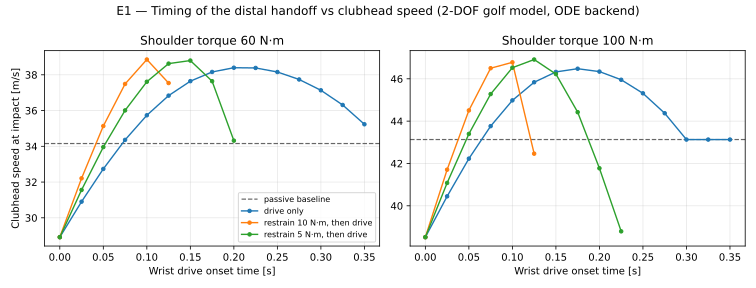{#fig-sweep alt="Clubhead speed rises with later wrist-drive onset, peaking near 0.2 s before falling; early drive degrades speed by 15%."}

| Program ($\tau_s = 60$ N·m) | $t_{\mathrm{on}}$ [s] | $t_{\mathrm{imp}}$ [s] | Clubhead speed [m/s] | vs. Passive |
|---|---|---|---|---|
| Passive wrist | — | 0.370 | 34.2 | — |
| Early drive (S1 pole) | 0.000 | 0.327 | 28.9 | **−15.3%** |
| Best drive-only | 0.200 | 0.352 | 38.4 | **+12.4%** |
| Best restrain-then-drive ($R=10$) | 0.100 | 0.349 | 38.9 | **+13.8%** |

: Representative programs at $\tau_s = 60$ N·m. {#tbl-representatives}

Key model-derived findings:
1. **Early wrist drive is lower than passive (−15.3%).** Driving from the top drops modeled speed from 34.2 m/s to 28.9 m/s.
2. **Identical torque applied late adds +12.4%.** Peak speed reaches 38.4 m/s at $t_{\text{on}} = 0.200$ s.
3. **Restrain-then-drive is optimal (+13.8%).** Timed active restraint ($R = 10$ N·m) reaches 38.9 m/s (and 46.9 m/s at $\tau_s = 100$ N·m).

## E1b — Torque-Velocity Actuator Bounds

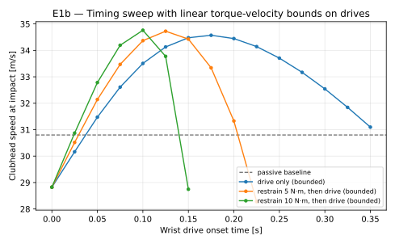{#fig-e1b alt="Under torque-velocity bounds, late drive maintains its superiority over early drive (+12.2% over passive)."}

The S2 ordering survives actuator bounds intact: early drive (28.8 m/s) < passive (30.8 m/s) < best late drive (34.6 m/s) < best restrain-then-drive (34.8 m/s).

## Kinematic Sequence & Segment Energies

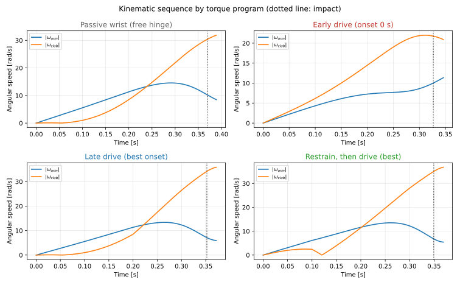{#fig-kinseq alt="Arm speed peaks before club speed; early drive suppresses arm peak speed, while late release maximizes both."}

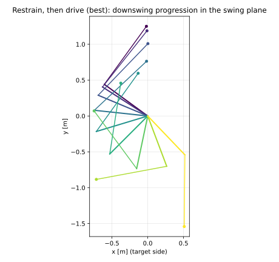{#fig-montage alt="Stick-figure progression showing wrist lag preservation during early downswing."}

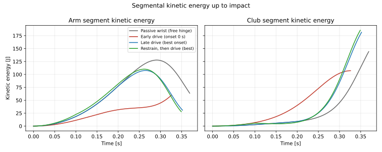{#fig-energies alt="Kinetic energy builds in the arm first before transferring rapidly to the clubhead late in the swing."}

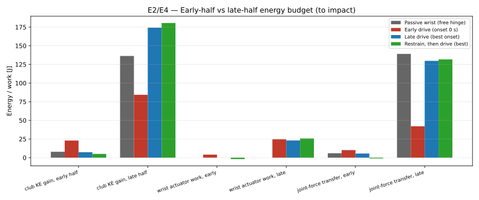{#fig-budget alt="Bar chart confirming early negative wrist work during active restraint and dominant late joint-force transfer."}

The energy budget demonstrates that the winning programs put the *least* energy into the club early (5.0 J vs. 22.9 J early drive) and bank energy in the arm (54.7 J shoulder work early). Active retention produces measurably *negative* early wrist work (−1.9 J).

## E4 Interface Powers & E2 Counterfactual Split

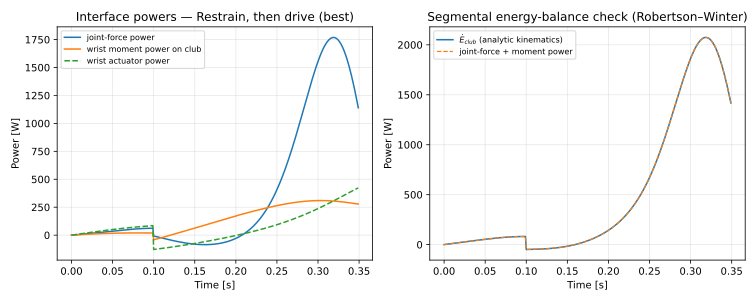{#fig-wristpower alt="Joint-force power surges late to 131.7 J, dwarfing late wrist actuator work of 25.7 J."}

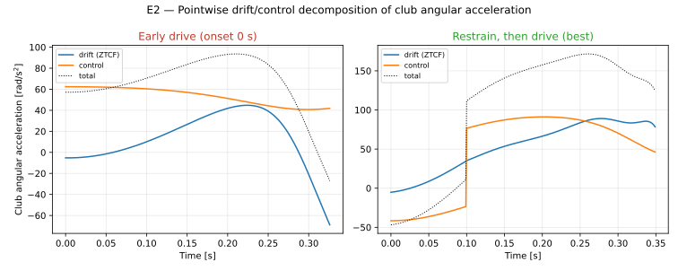{#fig-ztcf alt="Control opposes drift early (restraint) while drift delivers acceleration late."}

Robertson–Winter accounting confirms that late energy transfer is dominated by joint-force power (131.7 J) rather than active wrist work (25.7 J). The E2 counterfactual split confirms the S2 signature: **control retains early; drift delivers late.**

## Hand-Path Attribution Across the Model Ladder {#sec-attribution-results}

The MacKenzie-compatible primary estimand is the linear force-work delivered by
the golfer to the club divided by achieved hand-path length, $W_{\mathrm{linear}}/L_H$.
It is evaluated at the wrist in the open chains and at the net mid-grip point in
the closed loop. Table @tbl-hand-path-attribution reports the signed reference-case
values. ZVCF is projected onto the achieved path only as a configuration-dependent
diagnostic; because the ZVCF state has zero velocity, it does not traverse that
path itself.

| Model Tier | Trajectory Status | Path [m] | Total Work [J] | Drift Work [J] | Control Work [J] | Total $\overline{F}_{\parallel}$ [N] | Drift [N] | Control [N] |
|---|---|---:|---:|---:|---:|---:|---:|---:|
| Exact double pendulum | Forward simulation to first valid impact | 2.224 | 130.794 | 132.375 | −1.580 | 58.807 | 59.517 | −0.711 |
| One-arm, three-link point-mass | Forward simulation over the declared window | 2.734 | 27.802 | 28.781 | −0.979 | 10.170 | 10.528 | −0.358 |
| Two-arm floating-club closed loop | Prescribed local kinematic sweep | 0.0425 | −0.0038 | −0.0524 | +0.0485 | −0.0898 | −1.233 | +1.143 |

: Primary Hand-Path Force-Work Attribution in the Declared Reference Cases {#tbl-hand-path-attribution}

The first two cases demonstrate the central interpretive point. Drift supplies
101.2% and 103.5% of signed hand-path force-work, respectively, while the
same-state control residual is slightly negative. Those percentages exceed
100% because control opposes drift; they are not mixture probabilities. On a
magnitude basis, drift accounts for 98.8% of the double-pendulum split and
96.7% of the one-arm split. A large measured force along the hand path can
therefore coexist with little or negative same-state control contribution in a
declared mechanical model. This does not make the motion effortless: the
counterfactual does not observe muscle force, co-contraction, passive tissue
loading, stabilization, or metabolic cost.

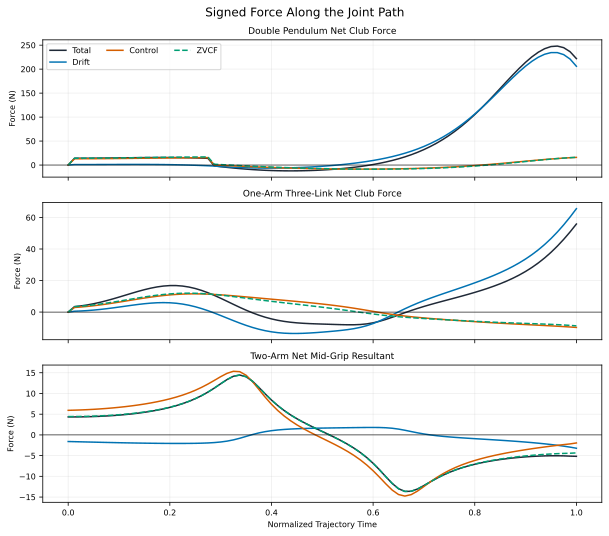{#fig-hand-path-components alt="Time histories compare total hand-path force with same-state drift, control, and separately defined zero-velocity diagnostic components for the double-pendulum, one-arm, and two-arm cases."}

### Geometry and Force-Vector Mechanisms

The vector plate in @fig-hand-path-vectors makes the geometry explicit. Each
arrow uses one declared force direction and one reference point; the tangent is
the achieved hand-path direction. A component can be large while projecting
weakly onto the tangent, and a control vector can point opposite the total or
drift vector while still satisfying the same-state closure identity. The
two-hand row retains both contact forces because equal-and-opposite differential
loading can create a couple without changing the common resultant.

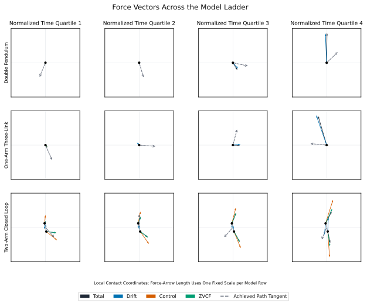{#fig-hand-path-vectors alt="Model poses show achieved hand-path tangents and separately scaled total, drift, control, and ZVCF force vectors, including both hand contacts in the closed-loop model."}

### Impulse, Work, Power, Joint, and Time-Window Structure

Impulse and work answer different questions. Vector impulse retains the
Cartesian direction of accumulated force, tangent impulse accumulates the
signed path-directed force in time, and force-work weights the tangent
projection by hand speed. The publication therefore exports signed, positive,
negative, and absolute tangent impulse alongside cumulative work instead of
substituting one quantity for another.

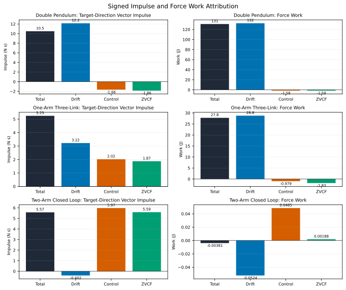{#fig-hand-path-impulse-work alt="Panels show cumulative signed tangent impulse and cumulative force work for drift and control across the three model tiers."}

The joint/time atlas evaluates every modeled interface: shoulder and wrist in
the double pendulum; shoulder, elbow, and wrist in the one-arm model; and both
shoulders, elbows, and hand contacts in the two-arm closed loop. Its four
windows are equal-duration normalized-time quartiles. They are bookkeeping
windows, not inferred transition, delivery, or impact phases.

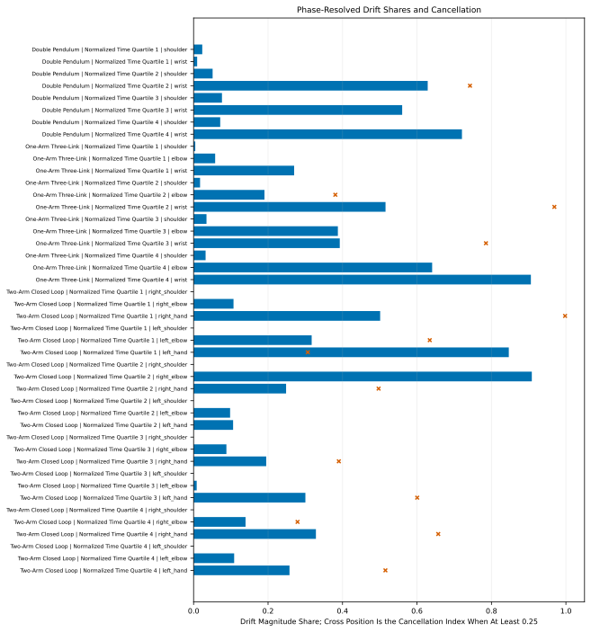{#fig-hand-path-joint-shares alt="A heat-map atlas reports drift magnitude shares for every joint and normalized-time quartile in all three models."}

Instantaneous power shares use
$|P_d|/(|P_d|+|P_c|)$, mask near-zero denominators, and mark strong
cancellation. This avoids presenting an unstable signed ratio as a physical
fraction when drift and control nearly cancel.

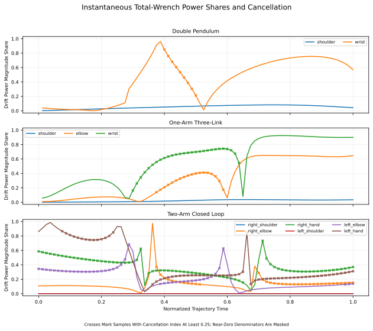{#fig-hand-path-power-shares alt="Time histories report cancellation-safe drift shares of total wrench power and identify intervals where opposing drift and control make signed fractions unstable."}

### Two-Hand Redundancy and the Late Negative-Couple Hypothesis

The two-hand reference case separates the common contact-force mode from the
differential mode. The common mode governs net translation; the differential
mode, acting through grip separation, contributes a couple. Consequently,
multiple hand-force and wrist-torque allocations can reproduce the same net
club wrench. A net inverse-dynamics solution cannot determine the unique
biological allocation between the hands.

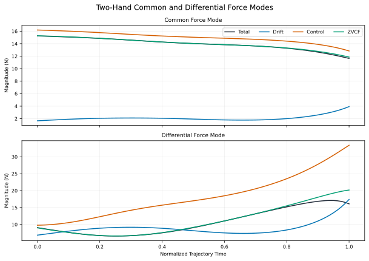{#fig-two-hand-common-differential alt="Plots separate the right-plus-left common force from half the right-minus-left differential force and show their different contributions to the club wrench."}

In the declared local sweep, drift and control almost cancel at the mid-grip:
their force-work magnitudes split 51.9% versus 48.1%, with a cancellation index
of 0.962. The late sign reversal appears in this local prescribed case, but its
tiny 0.0425 m path and near-zero net work preclude a swing-performance claim.
The result instead demonstrates why a two-hand model must retain contact-level
forces and couples: a negative net torque can arise from a differential push–pull
couple, wrist-joint torques, or combinations of both.

The bounded preview calculation tests one narrower signal-control hypothesis
using the archived WSCG planar traces. At the pointwise ZTCF minimum
($t=0.2148$ s), drift contributes −19.63 N·m of a −22.78 N·m target couple;
the required control residual is only −3.15 N·m. For a first-order actuator
with a 30 ms time constant, a 24 ms preview reduces late-window residual-couple
tracking RMSE from 1.252 to 0.531 N·m (57.6%). Across 10–50 ms time constants,
the best preview is 9–35 ms and the modeled RMSE reduction is 46.1–79.4%.
This is a delayed-actuator signal result, not evidence that golfers use muscle
preactivation and not a clubhead-speed optimization.

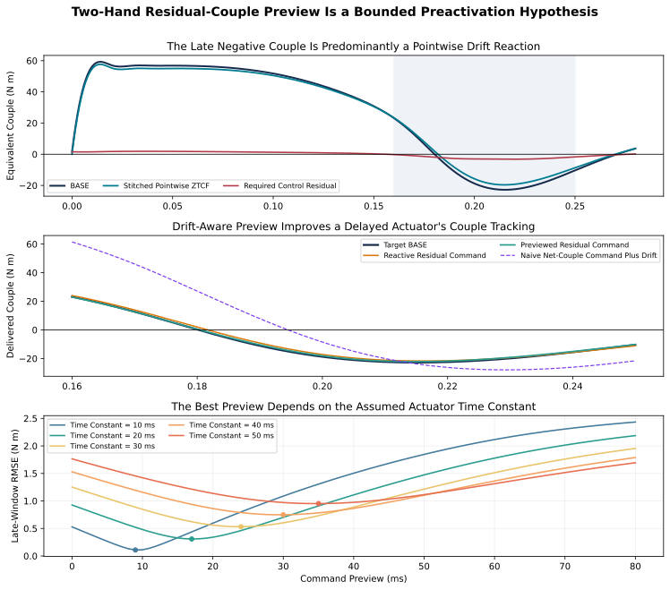{#fig-two-hand-preview alt="A bounded first-order actuator analysis compares reactive and previewed tracking of the small control residual after subtracting the large pointwise drift couple."}

### Closure and Sensitivity

All reference cases close total = drift + control for force, couple, power, and
work below $2.3\times10^{-13}$ in the exported records. The sensitivity panel
shows how the declared estimands respond to local parameter perturbations; it
does not represent population uncertainty or confidence intervals.

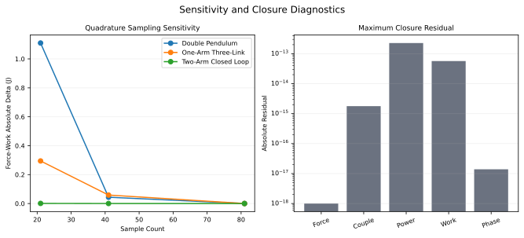{#fig-hand-path-sensitivity-closure alt="Panels summarize force, couple, power, and work closure residuals and local parameter sensitivity for the three model tiers."}

## E1c — Impact-Criterion Robustness

Evaluating all 92 trajectories under 5 alternative criteria (fixed hand position, ball-position sweep $v_x$, peak speed anywhere in first pass, matched arm angle $\theta_1=0.5$ rad, and validity-rule max arm angle sweep $1.5–2.5$ rad) preserved the retain-early/release-late ordering. This reduces sensitivity to the selected impact definition; it does not validate unmodeled impact physics.

## E1d — Model-Parameter Sensitivity

The ordering early drive < passive < best late drive < best restrain-then-drive persisted in all 13 one-at-a-time parameter cases. Across those cases, the best late-drive onset shifted from 0.175 to 0.225 s and the best restrained onset from 0.100 to 0.150 s. Speed ranges were 26.4–31.3 m/s for early drive, 32.9–35.6 m/s for passive, 36.5–40.6 m/s for optimized late drive, and 36.8–41.3 m/s for optimized restrain-then-drive.

These are local model perturbations, not confidence intervals or a population distribution. The stable ordering supports the modeled mechanism; the shifting optimum argues against a universal onset-time prescription.

# Ground-Reaction Drift Attribution {#sec-grf-drift}

Ground-reaction force is an external contact wrench and a constrained-dynamics
observable, not a directly commanded input. At one measured state, a
frame-explicit constrained model can write its reaction as

$$
\lambda=\lambda_0+\lambda_v+\lambda_u+\lambda_e,
$$

where the terms are the configuration-dependent, velocity-dependent,
control-induced, and other-external-load contributions. This is the additive
identity: **configuration + velocity + control + other external load**. A
pointwise ground-reaction ZTCF retains configuration, velocity, and declared
non-control external loads while setting controllable generalized torques to
zero. A pointwise ground-reaction ZVCF retains configuration and applied loads
while setting velocity to zero. ZTCF and ZVCF overlap in the
configuration/external terms and must not be added as complementary causes.

The first executable benchmark uses the fixed shoulder of the same planar
double pendulum as an ideal support. Across 161 achieved states, total, ZTCF,
ZVCF, and zero-velocity/zero-control support reactions close their independent
identities below $2\times10^{-13}$ N. Using pointwise ZTCF alone to predict the
modeled total support-reaction waveform gives componentwise $R^2$ values of
0.871 and 0.814, but its RMSE is 64.6 N and 89.8 N. The waveform association
therefore does not imply small amplitude error.

The vector impulses make the interpretation sharper. Total support impulse is
$(22.92,35.20)$ N s, ZTCF impulse is $(17.91,60.12)$ N s, and the control
contribution is $(5.01,-24.93)$ N s in the declared planar frame. The vertical
ZTCF impulse exceeds the total because control opposes it. A “percent passive”
ratio would exceed 100% and would not be a fraction of biological effort.

This is not a human force-plate validation. The fixed support has no feet,
center of pressure, free moment, pelvis, or three-dimensional contact geometry.
A combined resultant also cannot identify bilateral foot forces. A human test
requires synchronized bilateral six-axis force plates, whole-body and club
kinematics, inertial uncertainty, declared filtering and frames, and evaluation
on each held-out participant. Componentwise RMSE and bias, impulse error, peak
timing, loaded-sample COP error, free-moment error, residual pelvis wrench, and
parameter sensitivity should all be reported. A center-of-mass acceleration
baseline should be included so added model complexity must earn its claims.

The interpretation is consistent with evidence that golfers exhibit more than
one viable COP strategy [@ballbest2007] and that selected ground-force and
moment features are associated with clubhead speed without uniquely determining
it [@han2019; @watson2026grf]. It also corrects a common inference: measured GRF
minus modeled ZTCF contains control-induced reaction, model error, measurement
error, and omitted loads; it does not uniquely recover muscle torque.

# Discussion {#sec-discussion}

The numerical results support delayed distal release as a robust mechanism within the tested planar two-link model. Early wrist drive increases the system's moment of inertia about the shoulder hub before proximal speed has developed, reducing the modeled shoulder work converted into arm speed.

Qualifications and scope limits:
- Model scope is planar 2-DOF with a rigid shaft and fixed hub. The analysis does not include 3D motion, flexible-shaft energy, a moving hub, coupled arms, or human variability.
- Actuators use simplified linear bounds; physiological muscle activation dynamics remain an open refinement.
- Parameter variation is one-at-a-time and does not estimate coupled uncertainty or population effects.

# Conclusions {#sec-conclusions}

1. In the baseline model, early distal drive produces 15% less speed than the passive condition.
2. Optimized late wrist torque produces 12% to 14% more speed than the passive baseline.
3. The best tested retention program performs −1.9 J of early wrist work while preserving more arm energy.
4. Late club-energy gain is dominated by joint-force transfer in the representative model trajectory.
5. The qualitative ordering survives actuator bounds, alternative impact criteria, and the declared one-at-a-time parameter cases, while optimal timing shifts.
6. In the fixed-support benchmark, pointwise drift explains much of the modeled reaction waveform but not its amplitude; opposing control makes a component impulse exceed the total, so drift attribution is not a biological-effort percentage.

These findings demonstrate a mechanism in a simplified model. They do not establish a universal golfer-level effect or coaching prescription.

# Open Materials and Model Details {#sec-appendices}

## Code and Data Availability {#sec-open-materials}

The currently published timing-study code, tests, figures, parameter records,
and machine-readable outputs remain available in the [open-source research
directory](https://github.com/D-sorganization/UpstreamDrift/tree/main/docs/research/proximal_distal_energy_transfer).
The arm--wrist allocation implementation, complete sensitivity archive, and
falsification plan are tracked in
[UpstreamDrift epic #8497](https://github.com/D-sorganization/UpstreamDrift/issues/8497).
The hand-path analysis is pinned to
[UpstreamDrift commit `69eb7e9d`](https://github.com/D-sorganization/UpstreamDrift/tree/69eb7e9db32ccd17e45824619315b1d04b400c27/docs/research/proximal_distal_energy_transfer),
and the ground-reaction extension is pinned to
[UpstreamDrift commit `06a0ca63`](https://github.com/D-sorganization/UpstreamDrift/tree/06a0ca6317f6351e5b6da3789d2cd8e1e3dc53b5/docs/research/proximal_distal_energy_transfer),
while this repository carries a compact, hash-verified evidence snapshot and
the publication SVGs rather than a second simulation runtime. Run
`python scripts/check_proximal_distal_evidence.py --require-pinned` to verify
the local evidence boundary offline.

## Reproducibility

To re-run experiments and regenerate figures from source code:
```bash
python3 -m scripts.research.proximal_distal_energy.run_experiments
python3 -m scripts.research.proximal_distal_energy.make_figures
python3 -m scripts.research.proximal_distal_energy.e1b_bounded_torque
python3 -m scripts.research.proximal_distal_energy.e1c_impact_sensitivity
python3 -m scripts.research.proximal_distal_energy.e1d_parameter_sensitivity
python3 -m scripts.research.proximal_distal_energy.run_hand_path_attribution_study
python3 -m scripts.research.proximal_distal_energy.run_torque_allocation_preload_study
python3 -m scripts.research.proximal_distal_energy.run_grf_drift_study
```

## Model Parameters

| Parameter | Symbol | Value | Unit |
|---|---|---|---|
| Upper segment length | $L_1$ | 0.75 | m |
| Upper segment mass | $m_1$ | 7.5 | kg |
| Upper COM distance | $L_{c1}$ | 0.3375 | m |
| Lower segment length | $L_2$ | 1.0 | m |
| Lower segment mass | $m_2$ | 0.35 | kg |
| Lower COM distance | $L_{c2}$ | 0.7557 | m |
| Projected gravity | $g_{\text{proj}}$ | 8.033 | m/s$^2$ |

---

*Companion bibliography available in [proximal-distal-energy-transfer-bibliography.md](proximal-distal-energy-transfer-bibliography.md).*
