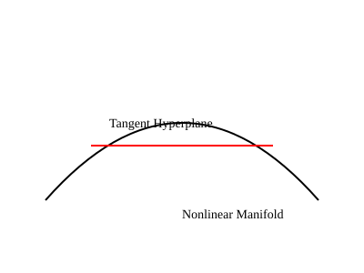

```{=html}
<aside class="status-banner status-banner--deprecated">
  <p class="status-banner__title">Status: <a href="../../../../pages/how-to-read.html#publication-states" class="status-badge status-badge--deprecated" title="Deprecated — Click to Read Publication State Definition"><svg class="status-badge__icon" aria-hidden="true" width="13" height="13" viewBox="0 0 24 24" fill="none" stroke="currentColor" stroke-width="2.2" stroke-linecap="round" stroke-linejoin="round"><path d="m21.73 18-8-14a2 2 0 0 0-3.48 0l-8 14A2 2 0 0 0 4 21h16a2 2 0 0 0 1.73-3Z"></path><line x1="12" y1="9" x2="12" y2="13"></line><line x1="12" y1="17" x2="12.01" y2="17"></line></svg><span class="status-badge__text">Deprecated</span></a></p>
  <p class="status-banner__body">
    This early working draft has been superseded by the canonical Tangent-Space Series. It is preserved strictly for historical context, backwards compatibility, and audit history.
  </p>
  <p class="status-banner__body">
    <strong>Canonical edition:</strong> Please consult <a href="../../../../articles/tangent-hyperplanes-series/part-1-geometry.html">Part 1: Geometry</a> or the <a href="../../../../pages/tangent-hyperplanes.html">Tangent-Space Series Hub</a> for the authoritative derivation and current evidence bounds.
  </p>
</aside>
```

## Technical Corrections to This Historical Draft

This source is retained for audit history and is excluded from the production reading path. The corrections below govern its interpretation; the original wording is preserved separately.

A $d$-dimensional embedded manifold has a $d$-dimensional tangent vector space; its translated affine tangent space is a hyperplane only when its codimension is one. The tangent space is an exact derivative object. Using it to approximate a finite displacement is a separate approximation problem.

For a regular level set $h(x)=0$ with full-row-rank derivative, $T_xM=\ker Dh(x)$. Under $C^1$ regularity the tangent approximation has a little-$o$ first-order error; a local quadratic bound needs stronger regularity, such as bounded second derivatives. The historical phrase “not an approximation” must not be read as exact finite geometry. See the canonical geometry article linked above.

Current reading path: [Canonical Series Article](/articles/tangent-hyperplanes-series/part-1-geometry.html).

::: {.callout-warning collapse="true" title="Historical Draft: Superseded Wording"}

## Overview

This article establishes the geometric foundations of tangent hyperplanes
for smooth nonlinear systems.

## Manifolds and Tangent Spaces

A smooth manifold admits a tangent space at every point. This tangent space
is a linear vector space defined by derivatives.

## Tangent Hyperplanes



The tangent hyperplane captures the exact first-order structure of the manifold.

## Exactness

The tangent hyperplane is not an approximation. It is the limit definition
of the derivative itself.

:::
