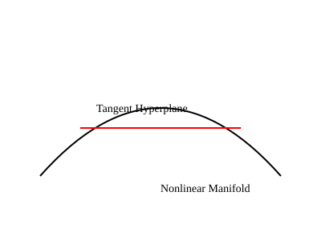

## Overview

This article establishes the geometric foundations of tangent hyperplanes
for smooth nonlinear systems.

## Manifolds and Tangent Spaces

A smooth manifold admits a tangent space at every point. This tangent space
is a linear vector space defined by derivatives.

## Tangent Hyperplanes

The tangent hyperplane captures the exact first-order structure of the manifold.

## Exactness

The tangent hyperplane is not an approximation. It is the limit definition
of the derivative itself.
