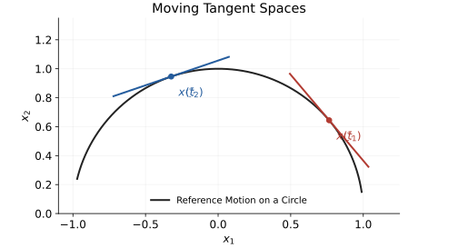

## First Variations Along a Reference Motion

Consider a smooth-mode control system $\dot x=f(x,u)$ in a local state chart, with $x\in\mathbb R^n$ and $u\in\mathbb R^m$. Its first variation is linear even when its finite trajectories are strongly nonlinear. This statement concerns derivatives of the flow, not the addition of complete swings.

Let $x_\epsilon(t),u_\epsilon(t)$ be a differentiable family of solutions on a common finite interval, with nominal pair $\bar x=x_0$, $\bar u=u_0$. Define

$$
\xi(t)=\left.\partial_\epsilon x_\epsilon(t)\right|_0,
\qquad
\nu(t)=\left.\partial_\epsilon u_\epsilon(t)\right|_0.
$$

Assume $f$ is $C^1$ in state and input, with sufficient continuity in time and in the parameterized controls to differentiate the solution's integral equation. Differentiation gives

$$
\begin{aligned}
\dot\xi&=A(t)\xi+B(t)\nu,\\
A&=D_xf(\bar x,\bar u),\\
B&=D_uf(\bar x,\bar u).
\end{aligned}
$$

The matrices have dimensions $n\times n$ and $n\times m$. This is exact for the derivative $\xi$. Control affinity is not required: a differentiable nonlinear dependence on $u$ also has a linear first derivative. Standard variational analysis and local optimal control use this object [@khalil2002nonlinear; @slotine1991applied; @jacobson1970ddp].

## Finite Differences Are Different Objects

For another actual solution define $\Delta x=x-\bar x$ and $\Delta u=u-\bar u$. Subtraction of the two dynamics gives

$$
\Delta\dot x=A\Delta x+B\Delta u+R_2.
$$

If $f$ is $C^2$ and its Hessian has operator norm at most $H$ along the relevant state-input line segments,

$$
\|R_2\|\le\frac H2\| (\Delta x,\Delta u)\|^2.
$$

Choose units or scales for the combined coordinates before using this norm. The Hessian includes mixed state-input terms. With only $C^1$ regularity one generally obtains a little-$o$ remainder, not this quadratic bound.

For a twice differentiable solution family, $x_\epsilon=\bar x+\epsilon\xi+O(\epsilon^2)$ on a suitable fixed interval. The factor $\epsilon$ matters: $\xi$ is a derivative with respect to the family parameter, while $\Delta x$ is a finite difference. The second-order term can vanish; nonlinear systems do not have a nonzero residual in every direction.

## Moving Tangent Spaces

{fig-alt="A reference trajectory carries tangent perturbations through changing tangent spaces."}

On an embedded $d$-dimensional manifold $M\subset\mathbb R^n$, admissible variations satisfy $\xi(t)\in T_{\bar x(t)}M$. Their ordinary ambient derivatives need not belong to that same tangent space. For the circle $\bar x(t)=(\cos t,\sin t)$, the unit tangent $\xi=(-\sin t,\cos t)$ has derivative $\dot\xi=-\bar x$, which is normal to the circle.

Let the columns of $E(t)\in\mathbb R^{n\times d}$ form a differentiable tangent basis, and write $\xi=E\eta$. Then

$$
E\dot\eta+\dot E\eta=AE\eta+B\nu.
$$

If the ambient variational field preserves admissibility, the right side minus $\dot E\eta$ lies in the range of $E$. Applying a left inverse $E^+=(E^TE)^{-1}E^T$ gives

$$
\dot\eta=E^+(AE-\dot E)\eta+E^+B\nu.
$$

A rectangular tangent basis has no ordinary matrix inverse. The transport term $\dot E\eta$ records the changing basis. In the unconstrained space $\mathbb R^n$, tangent spaces have a canonical common vector-space identification; no rotation is forced merely because the reference point moves.

## Superposition and Initial Conditions

For the same $A(t),B(t)$, two variational solutions add: $\xi_1+\xi_2$ solves the equation driven by $\nu_1+\nu_2$, with initial value $\xi_1(t_0)+\xi_2(t_0)$. The shared nominal trajectory is the usual way to ensure common coefficients. Variations around different nonlinear reference swings generally use different operators and cannot be combined this way.

This exact linear property does not imply that finite controlled trajectories add. State changes alter later drift and input maps. Even a control-affine system $f_0(x)+G(x)u$ normally has nonlinear finite input-to-trajectory behavior.

## Propagation Over a Finite Interval

For continuous, or bounded piecewise-continuous, coefficients on a smooth-mode interval, the state transition matrix satisfies

$$
\partial_t\Phi(t,s)=A(t)\Phi(t,s),\qquad \Phi(s,s)=I.
$$

The exact variation is

$$
\xi(t)=\Phi(t,t_0)\xi(t_0)
+\int_{t_0}^{t}\Phi(t,s)B(s)\nu(s)\,ds.
$$

For finite increments, the same expression using $\Delta x(t_0),\Delta u$ needs the additional term $\int\Phi R_2\,ds$. Large transition-matrix norms amplify that remainder. Instantaneous eigenvalues alone do not characterize general time-varying or nonnormal growth. An unstable system can still have perfectly valid infinitesimal dynamics; its useful finite prediction neighborhood may shrink with the horizon.

A state-triggered impact requires an event-timing map as well as smooth propagation. Piecewise-continuous coefficients alone do not account for perturbed contact times or velocity resets; [Part 6](./part-6-hybrid.html) supplies that step.

## What This Means for a Swing Model

Within a fixed contact mode, differentiate a simulated swing with respect to an initial joint angle, velocity or specified input profile. The resulting variation predicts the first-order change at the same physical time. Compare that prediction with nearby nonlinear rollouts over several perturbation sizes to test its finite range.

A clubface-at-impact measurement is different from a fixed-time measurement because the perturbation may change impact time. Account for that timing before interpreting a sensitivity as a change in launch conditions. Neither sensitivity calculation identifies a muscle strategy without an additional actuation and measurement model.

[Part 3](./part-3-control.html) uses these variations for local optimization. [Part 4](./part-4-residuals-curvature.html) derives an explicit bound for the finite trajectory discrepancy.

## Related Articles

::: {.callout-note title="See Also"}

- **[Tangent-Space Series](../../pages/tangent-hyperplanes.html)** — The series hub: full reading order, provenance, and companion material
- **[Superposition in Affine Control Systems](../superposition.html)** — Exact instantaneous superposition at a fixed state, the dynamics-level counterpart of this part's linearization
- **[Tangent Hyperplanes I: Geometry](part-1-geometry.html)** — The previous part of the series
- **[Tangent Hyperplanes III: Control](part-3-control.html)** — The next part of the series
:::
