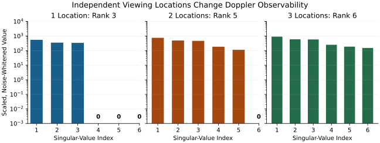
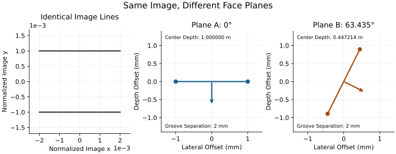

::: {.callout-tip}
## In Plain Language

A launch monitor does not receive a ready-made number called *club path* from the ball. It records echoes or images, uses calibration and models to reconstruct motion, and reports selected features of that motion. Those features can be useful and accurate. To compare them fairly, we need to know which point on the club they describe, when they were evaluated and how much uncertainty remains.

Two instruments can disagree because they use different definitions, because their observations contain different information, or because one of their estimates is wrong. A sensor label alone does not distinguish those possibilities.

The useful research idea is to estimate a common three-dimensional motion and derive clearly defined outputs from it. That makes reference-point changes explicit and allows radar, cameras and other measurements to constrain the same physical model. It also creates a demanding test: can the estimated club delivery predict independently observed ball launch within an honest uncertainty range?

The mathematics helps us expose missing information. It cannot replace it. Seeing two grooves is not automatically enough to recover a face plane; recording many Doppler returns is not automatically enough to recover six independent motion components; and a plausible simulated flight does not establish that the inferred impact conditions were unique.
:::

## Why This Article Exists {#why-this-article-exists}

The golf swing connects a golfer's changing body configuration, muscle and tendon forces, grip interaction, flexible shaft motion, club delivery, contact and ball flight. Launch monitors observe only part of that chain. Their value is substantial, but interpreting their outputs as if they directly revealed the whole chain can turn a measurement convention into a coaching theory.

This article develops a common language for comparing instruments and designing better experiments. Its central proposal is to represent clubhead motion with a declared pose and velocity field, combine observations through an explicit measurement model, and report the uncertainty of the quantities the golfer actually uses. Improvement must then be demonstrated against suitable references.

There are three distinct questions:

1. **What quantity is intended?** A face-center path immediately before first contact differs from a head-center path or an average taken during collision.
2. **What information supports it?** Radar frequency, receiver phase, calibrated image features and a ball-flight model constrain different combinations of the unknowns.
3. **What has been validated?** A correct formula, a patent disclosure and successful instrument performance are different kinds of evidence.

The [Launch Monitor Vendor Reference](launch-monitor-vendor-reference.html) records device-specific definitions and the scope of published comparisons. Here, named patents illustrate disclosed methods; they do not establish which algorithm a current product ships, its accuracy or the legal status of its claims. The proposed experiments below are an instrument-development programme, not a claim that a new monitor has already been validated.

## Part I: The Two Architectures {#part-i-the-two-architectures}

### Doppler Radar {#doppler-radar}

For a stationary monostatic radar, transmission and reception occur at essentially the same location. Let range increase away from the instrument and choose the processed Doppler sign to match that convention. In the usual nonrelativistic approximation,

$$
f_d=\frac{2\dot d}{\lambda},
\qquad \lambda=\frac{c}{f_c}.
$$

The factor of two comes from the outward and return propagation paths. With $c=299\,792\,458$ m/s and one mph equal to $0.44704$ m/s, a 24 GHz carrier gives about $71.576$ Hz per mph of radial velocity; 10.5 GHz gives $31.314$ Hz per mph. These are calculation examples, not specifications or accuracy claims for named monitors.

One unmodulated frequency channel does not by itself supply absolute range and two direction angles. Range-sensitive modulation, multiple frequencies, an antenna array or a complementary camera can add information. An FMCW beat frequency can contain both range and velocity contributions; the waveform and processing must separate them. A device's full observation model matters more than its carrier frequency alone.

For an ideal calibrated receiver pair with baseline $\mathbf d$, the far-field phase difference contains the directional projection

$$
\Delta\varphi=
\frac{2\pi}{\lambda}\mathbf d^\mathsf T\hat{\mathbf u}
+\varphi_{\rm cal}\pmod{2\pi}.
$$

The calibration term includes hardware phase offsets. Multiple suitable baselines can constrain two angular coordinates, but the phase wrapping, array geometry, front/back alternatives, scattering mixture and signal-to-noise ratio still matter. Adding receivers does not automatically remove every ambiguity.

#### Spin Frequency and Harmonics

For a persistent material feature on a rotating ball, its velocity relative to the center is $\boldsymbol\omega\times\mathbf r$. Its contribution to radial velocity depends on the sightline:

$$
\dot d_{\rm feature}\simeq
\hat{\mathbf u}^{\mathsf T}\mathbf v_C+
(\hat{\mathbf u}\times\boldsymbol\omega)^\mathsf T\mathbf r.
$$

This local approximation holds the sightline nearly fixed across the ball. For fixed-axis rotation, the varying term can be periodic, but its amplitude depends on the feature's distance from the axis and the axis's orientation to the radar. A feature on the axis contributes no rotational velocity. Rotation about the sightline has no first-order rotational radial-velocity component in this approximation.

Periodic scattering and phase modulation can create spectral lines separated by multiples of the rotation frequency. Identifying those lines requires more than finding a strong peak: harmonics, symmetry, changing aspect, observation duration and weak returns can obscure the fundamental. A pattern that repeats twice per revolution can produce a twofold ambiguity unless other evidence distinguishes the alternatives.

[US8845442B2](https://patents.google.com/patent/US8845442B2/en) discloses tracking harmonic features to estimate spin frequency. [US9868044B2](https://patents.google.com/patent/US9868044B2/en) describes phase-demodulated periodic features and a dielectric-lens mechanism. Those disclosures support the existence of different processing approaches. Neither justifies saying that every radar reads an unambiguous spin rate directly from comb spacing.

#### Spin Axis From Flight

One disclosed approach estimates spin direction from a three-dimensional trajectory. State the aerodynamic assumptions before attempting the inversion. Let $\mathbf v_a=\mathbf v-\mathbf w$ be air-relative velocity, with wind $\mathbf w$. Write the gravitational, drag and lift accelerations as $\mathbf g$, $\mathbf D$ and $\mathbf L$:

$$
\mathbf a=\mathbf g+\mathbf D+\mathbf L.
$$

If drag is parallel to $\mathbf v_a$ and lift is perpendicular to it, a nonzero airspeed permits the decomposition

$$
\mathbf D=
\frac{(\mathbf a-\mathbf g)^\mathsf T\mathbf v_a}
{\|\mathbf v_a\|^2}\mathbf v_a,
\qquad
\mathbf L=\mathbf a-\mathbf g-\mathbf D.
$$

This is a model-based projection of differentiated trajectory data. Wind uncertainty, tracking errors and filtering affect both velocity and acceleration. Unmodeled forces can enter the residual labeled lift.

The orthogonality condition $\mathbf L^\mathsf T\boldsymbol\omega=0$ alone does not identify a three-component spin vector from one instant. For example, under the more specific local model

$$
\mathbf L=k\,\boldsymbol\omega\times\mathbf v_a,
\qquad k>0,
$$

the recoverable perpendicular component is

$$
\boldsymbol\omega_\perp=
\frac{\mathbf v_a\times\mathbf L}
{k\|\mathbf v_a\|^2}.
$$

Adding any spin component parallel to $\mathbf v_a$ leaves that modeled lift unchanged. Even if a separate measurement supplies total spin magnitude, the parallel component can retain two possible signs. This example is an identifiability calculation under a stated lift law, not a universal aerodynamic coefficient model.

Multiple observations can help when they add independent information. If spin direction is assumed constant, stack the rows $\mathbf L(t_i)^\mathsf T$ into a matrix. In exact compatible data, rank two leaves a one-dimensional axis line; rank one leaves a plane of candidates. Normalization supplies length, not direction sign. Resolve sign through the declared force law and observations. With noise, assess the singular values and uncertainty rather than treating the smallest-singular-vector result as uniquely trustworthy.

The trajectory method in [US8845442B2](https://patents.google.com/patent/US8845442B2/en) illustrates these assumptions. Longer observed flight can improve the available geometry, but duration alone guarantees neither rank nor accuracy. Indoors and outdoors both involve measurement and inference; the question is how informative the actual observed segment is.

#### Spin Axis From Resolved Radar Structure

Trajectory inversion is not the only disclosed radar approach. [US10850179B2](https://patents.google.com/patent/US10850179B2/en) describes using receiver phase differences to associate angular positions with Doppler components across a rotating ball. In the disclosed geometry, those positions constrain a spin-axis projection transverse to the sightline.

That projection is not automatically the full three-dimensional spin vector. The patent discusses additional views, change of viewing geometry over time, other measurements or assumptions about the remaining component. Resolving different angular positions across a small ball also imposes an aperture, phase precision and signal-quality requirement. The distinction is consequential: a phase-resolved observation and a curvature-derived estimate can have different failure modes even though both are reported as “spin axis.”

### Photometric (Camera) Systems {#photometric-camera-systems}

Calibrated images can constrain three-dimensional ball positions and orientations. Stereo geometry, a known ball size or other model information supplies scale; timestamps and exposure determine the interval over which motion is observed. The capture volume, camera arrangement and marking requirements belong to the particular system, not to the word *camera*.

Position differences divided by elapsed time give an interval velocity. Estimating velocity at a specific event requires interpolation or a trajectory model. Camera calibration, lens distortion, image localization, synchronization and exposure blur enter that estimate.

Spin reconstruction can register ball markings or natural surface structure across frames. A registered relative rotation $\Delta R\in SO(3)$ constrains angular displacement. For a well-resolved, unaliased principal increment,

$$
\theta=\arccos\!\left(
\operatorname{clip}\!\left[
\frac{\operatorname{tr}\Delta R-1}{2},-1,1
\right]\right).
$$

For $0<\theta<\pi$, its directed rotation vector can be recovered from

$$
\boldsymbol\theta=
\frac{\theta}{2\sin\theta}
(\Delta R-\Delta R^\mathsf T)^\vee.
$$

Small-angle and near-$\pi$ cases need appropriate numerical branches. The unit-eigenvalue eigenvector alone has an unresolved sign, and at zero rotation there is no unique axis. Dividing the rotation vector by the frame interval gives the equivalent constant angular velocity for that increment; it need not equal instantaneous angular velocity when the axis changes during the exposure interval.

A simple aliasing example makes the limit explicit. Rotation by $270^\circ$ about $+z$ produces the same final orientation as $90^\circ$ about $-z$. Two perfect orientation samples cannot distinguish those histories without timing, speed bounds or intermediate observations. Repeated ball texture can create additional image-matching ambiguities.

[US7292711B2](https://patents.google.com/patent/US7292711B2/en) describes image preparation, perspective transformations and correlation of ball features, including natural structure and markings. Its processing also uses search constraints. It therefore illustrates how a camera-derived spin estimate can combine observations with assumptions; it is not evidence that all camera instruments operate without markers or priors.

### The Convergence {#the-convergence}

Radar and cameras can complement each other, but fusion is an estimation problem rather than a guarantee of accuracy. Calibration must place their observations in a common frame and time base. Shared errors, occlusion, incorrect feature associations and contradictory priors can survive the combination.

The relevant question is whether the additional measurement constrains a previously weak or unobserved component. A second report of the same modeled quantity may add little independent information. A well-calibrated new view of a known feature can add a great deal.

## Part II: The Measurement Chain {#part-ii-the-directness-hierarchy}

“Measured” and “modeled” are not opposites. Converting a sensor signal into a physical quantity already requires a model and calibration. What matters is whether that chain is explicit, sufficiently informative and validated for the intended use.

On very narrow screens, scroll the tables horizontally.

| Reported Quantity | What to Check |
|---|---|
| Ball Speed and Launch Direction | Position or velocity observations; target frame; reference time; trajectory fit and calibration. |
| Spin Rate and Axis | Rotation-sensitive observations; axis convention; ambiguity handling; any flight, texture or spin priors. |
| Carry | The landing definition and observed flight extent; any extrapolation, environment and aerodynamic model. |
| Club Speed, Path and Attack | Declared material or geometric reference point; event or averaging interval; reconstructed velocity field. |
| Face Angle and Dynamic Loft | The local face normal or specified face reference; projection convention; strike location and observation or inference method. |
| Impact Location | The registered face geometry, ball/contact model, timing and spatial uncertainty. |

A small formal covariance does not establish that the definition is correct or that systematic errors are included. Conversely, a model-derived estimate can be useful when the model is appropriate and independently tested. The [vendor reference](launch-monitor-vendor-reference.html) separates these questions for specific published definitions.

Leach and colleagues compared TrackMan Pro IIIe and GC2+HMT against a benchmark in a 240-shot protocol. Their reported agreement was generally stronger for ball quantities than for club quantities and varied with club and parameter. These findings concern the tested devices and setup; they do not certify every current monitor or imply that all club outputs are unusable. Their tolerance bands and reference system also require the interpretation described in the [accepted manuscript](https://repository.lboro.ac.uk/articles/journal_contribution/How_valid_and_accurate_are_measurements_of_golf_impact_parameters_obtained_using_commercially_available_radar_and_stereoscopic_optical_launch_monitors_/9562799).

Repeated human swings measure instrument variation together with real swing variation. A repeatability study is therefore not automatically an isolated sensor-error experiment. Likewise, correlation between two instruments does not establish agreement: both can follow the golfer's changing speed while retaining an offset or scale error.

## Part IIb: Which Point on the Clubhead Is “the Path”? {#part-iib-which-point-on-the-clubhead-is-the-path}

### The Velocity Field Across a Clubhead {#the-velocity-field-across-a-clubhead-is-not-uniform}

Approximate the head as rigid over the interval being analyzed. If $O$ is a declared body-fixed reference point and $P$ another point, all quantities expressed in the same Cartesian frame satisfy

$$
\mathbf v_P=\mathbf v_O+\boldsymbol\omega\times\mathbf r,
\qquad \mathbf r=\mathbf p_P-\mathbf p_O.
$$

The position difference and angular velocity together determine the correction. Separation alone does not. Pure translation gives the same velocity at every point, even if the body's trajectory curves through space. A curved point path does not, by itself, specify the head's angular velocity.

Use a right-handed target frame with $x$ forward, $y$ left and $z$ upward. For nonzero horizontal velocity, define

$$
\psi_P=\operatorname{atan2}(v_{P,y},v_{P,x}),
\qquad
\alpha_P=\operatorname{atan2}
\!\left(v_{P,z},\sqrt{v_{P,x}^2+v_{P,y}^2}\right).
$$

Here positive path azimuth is leftward. Other reporting conventions may choose the opposite sign; convert them explicitly. A projected path angle is undefined when horizontal velocity vanishes, and both direction angles lose meaning at rest.

### Reference Conventions and Their Differences {#the-two-conventions-and-the-gap-between-them}

Geometric center, center of mass, face center and actual strike point are distinct. The first depends on the geometric definition; the second on mass distribution; the third on a face convention; the fourth on the particular collision. They should not be substituted for one another without a documented approximation.

TrackMan's [historical club-data explanation](https://www.trackman.com/blog/club-data-definitions) gives a driver example in which a center-of-face path differs from a head-center convention by about three degrees. It also describes differences in how club quantities are evaluated. That is useful evidence that conventions matter, not a universal correction to apply to all shots or a rule dividing all radar and camera products into two camps.

A complete motion estimate can provide both reference-point outputs. Their uncertainties remain coupled because they come from the same estimated state. If head geometry or strike location is uncertain, those uncertainties must also enter the conversion.

On a curved face, such as one with bulge and roll, the local normal can vary across the surface. A head pose and a strike location together determine the relevant normal under a known shape model. A single global “face plane” may be only a reporting convention or local approximation.

### Why the Sign Depends on the Motion {#why-the-face-centre-is-further-left-and-shallower}

Consider a manufactured example in meters and seconds:

$$
\mathbf v_O=(45,0,-3),\qquad
\mathbf r=(0.04,0,0),\qquad
\boldsymbol\omega=(0,-10,30).
$$

The rotational contribution is $(0,1.2,0.4)$ m/s, so the forward face point moves leftward and more upward than $O$. Reverse the angular velocity and the contribution becomes $(0,-1.2,-0.4)$ m/s: the directional changes reverse. This is why “further left and shallower” cannot be a general theorem about a forward reference point.

It is also why one should not automatically add a “swing-arc rotation” to “face closure.” Both labels may already describe aspects of the same head angular velocity. A decomposition is valid only when its frames, relative motions and composition rule are declared. The [swing-plane chapter](The_Physics_of_Golf/quarto/ch31_swing_plane_launch.html) treats the distinction between a point trajectory, a fitted plane and orientation change.

### Does a Reference Convention Imply a Slice? {#does-this-build-in-a-slice}

A reference-point difference does not, by itself, predict a slice. The collision depends on the incoming relative velocity at the actual contact region, local face geometry, friction/compliance, head inertia, ball properties and other modeled conditions. Face center and contact point need not coincide.

A reported face-to-path quantity remains mathematically well-defined if its face and path conventions are stated. To use it inside a contact model, map those conventions to the model's variables. Describing one angle at the impact location and another at a head reference does not make the report meaningless; it makes that mapping necessary.

Nor does a convention difference prove that proprietary launch coefficients have absorbed a particular offset or that golfers necessarily learn to compensate for it. Those are additional hypotheses requiring data. A practical comparison should reproduce both definitions from synchronized reference measurements and then examine the residual disagreement.

### Face Inference From a Declared Launch Model

A simplified horizontal model may relate launch azimuth $\ell$, face azimuth $f$ and path azimuth $p$ by

$$
\ell\approx wf+(1-w)p.
$$

This can be a useful local empirical relation. It is not a universal three-dimensional vector law or a documented description of every radar face-angle algorithm. A rear sensor can also constrain orientation through visible head geometry, calibrated scattering structure, other views or complementary cameras. Direct visibility of the face surface is not necessary for every possible pose estimate.

In the centered-strike horizontal analysis reported by [Wood, Henrikson and Broadie](https://doi.org/10.3390/proceedings2060249), the estimated driver weight was approximately $0.76$, with a reported 95% confidence interval of $\pm0.08$. That interval describes uncertainty in the reported estimate, not shot-to-shot standard deviation. Their horizontal and vertical analyses, filtering and club results must be kept distinct. [Henrikson and colleagues](https://doi.org/10.3390/proceedings2020049027) further examine oblique impact and tangential compliance; this does not turn a fitted coefficient into a universal constant for every surface, strike and convention.

If the simplified horizontal relation is deliberately used as an inverse model and $w\ne0$,

$$
f=p+\frac{\ell-p}{w},
\qquad
\nabla f=
\left(
\frac1w,\;
1-\frac1w,\;
-\frac{\ell-p}{w^2}
\right),
$$

where the gradient is with respect to $(\ell,p,w)$. Angular inputs must use the same units. The coefficient derivative has those angular units because $w$ is dimensionless.

The launch-error gain is $1/0.76\approx1.316$, compared with $1/0.85\approx1.176$. The first gain is about 11.8% larger than the second. A gain of 1.316 means approximately 31.6% amplification relative to the launch-angle error itself; it does not mean twice the gain implied by 0.85.

For a manufactured independent-error example, take $\ell=0.5^\circ$, $p=-2^\circ$, $w=0.76$, with standard deviations $0.1^\circ$, $0.2^\circ$ and $0.03$. The inferred face angle is $1.2895^\circ$, and first-order propagation gives

$$
\sigma_f^2\approx\nabla f\,\Sigma_{\ell,p,w}\,\nabla f^\mathsf T,
\qquad
\sigma_f\approx0.1954^\circ.
$$

That result is conditional on the specified covariance and the adequacy of the model. Correlated errors change it; an uncertain impact location, coefficient bias or model discrepancy can add further error. If an algorithm also uses measured spin, its sensitivity to spin must be derived from that actual algorithm. One cannot infer it from the horizontal equation above, which contains no spin input.

Off-center contact is a particularly useful test because it can challenge a simplified impact model. But a failed prediction may implicate strike location, face geometry, incoming velocity, contact mechanics, sensor calibration or timing. Calling every discrepancy “gear effect” would hide the very alternatives the experiment should distinguish.

## Part III: The Screw-Theoretic Reformulation {#part-iii-the-screw-theoretic-reformulation}

### The Motion Representation

Let a body-fixed point have coordinates $\mathbf r_B$ in the head frame. Its world position is

$$
\mathbf x=\mathbf p+R\mathbf r_B,
\qquad
T=\begin{bmatrix}R&\mathbf p\\0&1\end{bmatrix}\in SE(3).
$$

Here $\mathbf p$ locates the head-frame origin $O$. Define spatial angular velocity by

$$
\dot R=[\boldsymbol\omega_s]_\times R,
\qquad
\boldsymbol\omega_B=R^\mathsf T\boldsymbol\omega_s,
\qquad
\dot R=R[\boldsymbol\omega_B]_\times.
$$

The bracket matrix represents a cross product. These body/spatial distinctions are developed in [Lynch and Park's angular-velocity treatment](https://modernrobotics.northwestern.edu/nu-gm-book-resource/3-2-2-angular-velocities/).

The point-referenced motion pair $(\boldsymbol\omega_s,\mathbf v_O)$ is convenient for club reporting, with $\mathbf v_O=\dot{\mathbf p}$. It must not be silently confused with the translational component of the spatial Lie-algebra matrix:

$$
\dot T T^{-1}=
\begin{bmatrix}
[\boldsymbol\omega_s]_\times&
\mathbf v_O-\boldsymbol\omega_s\times\mathbf p\\
0&0
\end{bmatrix}.
$$

The distinction comes from the reference origin, not from different physical motion. Similarly, the body twist has translational component $R^\mathsf T\mathbf v_O$. A declared convention makes these representations convertible.

This also explains the connection with force measurement. A wrench expressed as force $\mathbf f$ and moment $\boldsymbol\tau_O$ about the same point pairs with the motion through power:

$$
\mathcal P=\mathbf f^\mathsf T\mathbf v_O+
\boldsymbol\tau_O^\mathsf T\boldsymbol\omega_s.
$$

A force plate reconstructs a wrench from calibrated transducer signals; optical motion capture reconstructs positions and motion from images. Neither sensor directly receives an abstract six-component algebraic object. The shared representation makes their processed results compatible when points, frames and timing match. Likewise, a Doppler row is a linear functional on motion; that algebraic resemblance to a wrench pairing does not mean the radar measures a physical force.

For $\boldsymbol\omega_s\ne0$, the instantaneous screw axis passes through

$$
\mathbf p+\mathbf r_{\rm ISA},\qquad
\mathbf r_{\rm ISA}=
\frac{\boldsymbol\omega_s\times\mathbf v_O}
{\|\boldsymbol\omega_s\|^2},
\qquad
h=\frac{\boldsymbol\omega_s^\mathsf T\mathbf v_O}
{\|\boldsymbol\omega_s\|^2},
$$

in direction $\boldsymbol\omega_s$. The point-referenced velocity field evaluated on that line equals $h\boldsymbol\omega_s$, parallel to the axis. This directly verifies the construction.

Pure translation has zero angular velocity and no finite rotation axis supplied by this formula. At rest, no unique axis is selected. Near zero angular velocity, dividing by its squared magnitude makes axis position poorly conditioned. The finite-displacement screw theorem and an instantaneous screw-axis calculation describe related but different objects.

An ISA is also not a swing plane. A plane fitted to a specified point trajectory, an instantaneous plane constructed from declared vectors and the head's screw axis answer different geometric questions. Naming the ISA a “rigorous swing plane” would replace one hidden convention with another.

### What a Doppler Row Actually Constrains {#the-measurement-model}

Suppose a correctly associated material feature is at $\mathbf p_i$, the stationary monostatic sensor is at $\mathbf s$, and

$$
\mathbf r_i=\mathbf p_i-\mathbf p,\qquad
\hat{\mathbf u}_i=
\frac{\mathbf p_i-\mathbf s}{\|\mathbf p_i-\mathbf s\|}.
$$

Under the rigid-feature model, its instantaneous range rate is

$$
\dot d_i=
\hat{\mathbf u}_i^\mathsf T\mathbf v_O+
(\mathbf r_i\times\hat{\mathbf u}_i)^\mathsf T\boldsymbol\omega_s.
$$

The equation is linear in the six point-referenced motion components when the feature positions, associations and sightlines are treated as known. This is useful, but counting six unknowns and many rows does not establish that all six components are identifiable.

For a single monostatic location, use

$$
\mathbf r_i\times\hat{\mathbf u}_i
=(\mathbf s-\mathbf p)\times\hat{\mathbf u}_i.
$$

The part of $\mathbf r_i$ along the sightline contributes no cross product. Consequently,

$$
\dot d_i=
\hat{\mathbf u}_i^\mathsf T
\left[\mathbf v_O+
\boldsymbol\omega_s\times(\mathbf s-\mathbf p)\right].
$$

Every row depends on the same three-component combination. The instantaneous Doppler-only matrix has **rank at most three**, even with many noiseless features and nonparallel sightlines. An exact family of invisible changes is

$$
\delta\mathbf v_O=
\delta\boldsymbol\omega_s\times(\mathbf p-\mathbf s).
$$

Substituting these changes leaves all modeled range rates unchanged. Narrow angular coverage can make the remaining combinations poorly conditioned as well.

This is a statement about those Doppler equations, not an impossibility theorem for radar pose estimation. Range and angle measurements of associated known body features can themselves constrain pose; their evolution can constrain motion. Independently known translation, multiple viewing locations and other information can restrict the nullspace. A far-field approximation or a bound on plausible translation can also change what the estimator treats as available information; that assumption should remain visible.

As a manufactured algebraic check, thirty noncoplanar features near $(2,0.2,0.1)$ m give ranks 3, 5 and 6 when observed by one, two and three suitable, separately modeled monostatic sensors at $(0,0,0)$, $(0,1,0)$ and $(0,0,1)$ m. Two locations retain a null rotation along their baseline; a third noncollinear location removes it in this example. An arbitrary multi-receiver commercial array is not automatically equivalent to these three monostatic stations: its transmission paths and phase observables require their own model.

Scroll the figure horizontally, or [open it at full size](../static/images/launch-monitor-doppler-rank.svg).

::: {#fig-launch-monitor-doppler-rank}
::: {.launch-diagram-scroll role="region" aria-label="Doppler observability example; scroll horizontally" tabindex="0"}

:::

**Independent Viewing Locations and Doppler Observability**

Manufactured geometry, not instrument performance. Features lie within 5 cm of the declared origin along each axis. The parameter scales are 20 rad/s for each angular component and 1 m/s for each linear component; independent range-rate noise is assumed to have standard deviation 0.01 m/s. Nonzero values use a logarithmic axis; zeros are labeled at the bottom. The scales explain the figure's numerical conditioning and do not alter its exact nullspaces.
:::

### What the Common Representation Provides {#what-this-buys-immediately}

A sufficiently observed motion estimate can produce point speed, path and attack angle at any declared location. It can also provide angular velocity projected onto a declared shaft direction. That projection is not automatically the same as the derivative of a vendor's face-angle coordinate, because the latter can depend on orientation and projection conventions.

The same state can connect these reports to contact geometry and uncertainty. It does not identify muscle forces or joint torques from club delivery alone. Many body motions and force histories can lead to similar terminal head motion. Those upstream questions require additional observations, mechanical models and, for causal claims, suitable interventions.

Vena and colleagues applied ISA methods to pelvis, shoulder and arm motion in golf. Their work establishes relevant prior use of the representation. The public abstracts report predominantly rotational marker motion in Part 1 and a conventional peak-speed sequence in only two of five subjects in Part 2. Those observations do not validate a radar clubhead estimator or establish an ISA-based universal skill metric. See [Part 1](https://doi.org/10.1007/s12283-010-0058-8) and [Part 2](https://doi.org/10.1007/s12283-010-0059-7).

### The Anchor-and-Propagate Principle {#the-anchor-and-propagate-principle}

An earlier orientation observation can support an impact-time estimate if the intervening angular motion is sufficiently known. The correct propagation respects the order of rotations. For piecewise-constant spatial rates,

$$
R_{k+1}=
\exp([\boldsymbol\omega_{s,k}]_\times\Delta t_k)R_k;
$$

for piecewise-constant body rates,

$$
R_{k+1}=
R_k\exp([\boldsymbol\omega_{B,k}]_\times\Delta t_k).
$$

Composition follows the time order and the chosen convention. The exponential of a summed or integrated angular-velocity matrix is generally not the solution for changing, noncommuting axes.

An independent example quantifies the difference: a $60^\circ$ rotation about fixed $x$, followed by $45^\circ$ about fixed $y$, differs by about $22.5005^\circ$ from exponentiating the sum of the two rotation vectors. The latter loses the order information. For smooth changing rates, use a justified numerical integration scheme and check convergence as the time step decreases.

A measured face normal provides two orientation degrees of freedom, not a complete head pose. If only that normal is needed and spatial angular velocity is known, propagate it through $\dot{\mathbf n}=\boldsymbol\omega_s\times\mathbf n$. If the estimator needs the full head frame, additional orientation information is required. The same distinction applies to a visible shaft line, which does not by itself reveal rotation about the shaft.

Timing belongs in the error budget. At a declared angular velocity of 30 rad/s about vertical, a 100-microsecond timing error changes a horizontal face azimuth by about $0.172^\circ$. This calculation does not set a universal tolerance; it shows why synchronization and impact-event definitions matter alongside image resolution.

For a linearized error state, a discrete propagation step may be written

$$
\delta x_{k+1}=F_k\delta x_k+G_k\eta_k.
$$

If $P_k$ is state-error covariance, $Q_k$ is rate/input-error covariance and $C_k=\operatorname{Cov}(\delta x_k,\eta_k)$,

$$
P_{k+1}=
F_kP_kF_k^\mathsf T+
G_kQ_kG_k^\mathsf T+
F_kC_kG_k^\mathsf T+
G_kC_k^\mathsf TF_k^\mathsf T.
$$

Biases, calibration states and event-time uncertainty must be represented or bounded; colored errors may require an augmented state. A later anchor shortens propagation but can be blurrier, more occluded or more correlated with other observations. “Anchor as late as possible” is therefore a hypothesis to test against the complete error budget, not an unconditional design rule.

## Part IV: Face Orientation Without Impact-Model Inversion {#part-iv-determining-clubface-orientation-without-inverting-an-impact-model}

The useful proposal is to obtain independent constraints on face orientation and test whether they improve the contact-time estimate. Different candidate methods supply different information:

| Candidate Observation | Additional Requirements or Limitations |
|---|---|
| Face Markers | Known geometry, calibration, feature association, visibility and sufficient spatial resolution. |
| Natural Grooves or Head Features | A suitable geometric model and enough independent image constraints; a single line direction is insufficient. |
| Reflected Structured Illumination | Calibrated camera and light source; decoded pattern matches; a model of surface shape. |
| Silhouette or Head-Model Fit | Known or estimated head shape, sufficient viewing geometry and treatment of symmetric alternatives. |
| Specular Radar Feature | Identification of the reflecting surface, propagation geometry, lobe width, timing and competing glints. |
| RF Tags or Resolved Scatterers | Known tag positions; matched detections; enough independent range, angle and phase data. |
| Inertial Measurements | Sensor-to-head calibration, rate range, bandwidth, bias and mounting dynamics. |
| Polarimetric or ISAR Structure | A validated model of scattering and image formation; tests for unresolved ambiguity. |
| Contact-Model Inversion | Independently constrained contact inputs and an identifiable, adequately validated collision model. |

These are candidate information sources, not a novelty ranking or a table of demonstrated golf-monitor performance. Three deserve closer examination because the gap between a plausible idea and a valid measurement is especially instructive.

### Grooves as Natural Features

Two parallel lines in a calibrated image can supply a vanishing direction corresponding to the grooves' direction. A face normal must be perpendicular to that direction, but that condition leaves an orientation degree of freedom. Foreshortened spacing is entangled with distance and pose.

An explicit pinhole-camera example shows the ambiguity. Let the optical axis be $z$ and let infinitely extended grooves run parallel to $x$. Their normalized image heights are $y/z$. A pair of grooves in a front-facing plane, each one meter from the camera, can have image heights $-0.001$ and $+0.001$ and a physical separation of 2 mm.

A second pair, in a plane tilted by about $63.435^\circ$, can have exactly the same image heights and the same physical spacing, at a different distance. One construction has cross-section point depths approximately $0.446319$ m and $0.448108$ m, with $y=-0.001z$ on the first line and $y=+0.001z$ on the second. The two projected lines are identical even though the normals differ.

This counterexample uses ideal infinite lines; visible endpoints or other known face features could add constraints. That is precisely the point. Known metric geometry, additional nonparallel features, depth information, another view or a sufficiently informative temporal sequence can make reconstruction feasible. “Two grooves in one frame” alone does not establish a unique face plane or eliminate calibration.

Scroll the figure horizontally, or [open it at full size](../static/images/launch-monitor-groove-ambiguity.svg).

::: {#fig-launch-monitor-groove-ambiguity}
::: {.launch-diagram-scroll role="region" aria-label="Groove geometry counterexample; scroll horizontally" tabindex="0"}

:::

**Same Image, Different Face Planes**

An exact pinhole-projection counterexample. The right panels show local cross-sections perpendicular to the infinitely extended grooves, with equal millimeter scales on both axes. Arrows mark normal directions toward the camera side. The left panel shows their identical normalized image lines.
:::

### Deflectometry and Reflection Geometry

At a known reflection point, let $\hat{\mathbf l}$ point toward the illumination source and $\hat{\mathbf c}$ toward the camera. For an ideal specular reflection with a nondegenerate bisector,

$$
\mathbf n\parallel\hat{\mathbf l}+\hat{\mathbf c}.
$$

This relation already contains a physical model. The ray directions depend on geometry, including the reflection point. A recorded camera pixel paired with a decoded screen point does not, by itself, supply every unknown surface position and normal.

Burke and colleagues' [deflectometry review](https://arxiv.org/abs/2204.11592) explains the pointwise position/slope ambiguity, calibration requirements and global reconstruction approaches. Integrability and suitable geometric information can help resolve ambiguity; numerical conditioning can remain difficult even where an ideal model admits a unique reconstruction.

For a moving clubface, the research questions therefore include whether a pattern can be decoded within the available exposure, how face finish and grooves affect the reflection model, how surface position is constrained and how those errors propagate to the contact-time normal. Industrial use of deflectometry establishes a relevant method family, not a validated answer to those golf-specific questions.

### Specular Flash Timing

For an ideal planar reflector in a monostatic arrangement, a specular return can constrain a normal line aligned with the viewing direction. In a bistatic arrangement, the illumination and receiver directions determine the relevant bisector instead.

A real signal maximum must still be associated with the intended face surface. The crown, sole, edges, shaft or multipath can produce competing returns. A finite lobe produces an interval of plausible orientations rather than an exact mathematical event, and the face may be occluded from a rear view. A normal line also leaves rotation about that normal undetermined.

Multiple well-placed observations could strengthen the estimate. Their number alone is insufficient: the normals, timing and geometry must supply independent constraints. A useful prototype experiment would compare identified echoes against synchronized optical face geometry while deliberately changing viewing angle and head shape.

## Part V: What the Mathematics Can and Cannot Provide {#part-v-what-screw-theory-does-and-does-not-provide}

A consistent representation improves definitions, transformations and the ability to combine measurements. It does not create sensor information. Under an invertible change of coordinates, the information matrix transforms; its numerical entries need not remain the same, but the underlying information content is unchanged. Different implementations may still differ in bias, approximation error and robustness.

The practical benefits are concrete:

- Report speed, path and attack at declared reference points from one estimated velocity field.
- Distinguish face normal, full head pose, shaft-axis angular velocity and projected face-angle rate.
- Carry calibration, timing and state uncertainty into the reported quantities.
- Identify which additional observation could resolve a specific weak component.
- Test club-delivery estimates against independently observed contact or ball behavior.

The last item needs particular care. Let $z_B$ be measured ball-launch quantities and $f(\hat x_C)$ a contact-model prediction from an estimated club/contact state. Define

$$
r=z_B-f(\hat x_C).
$$

A first-order residual covariance is

$$
\Sigma_r\approx
\Sigma_B+J\Sigma_CJ^\mathsf T
-C_{BC}J^\mathsf T-JC_{BC}^\mathsf T,
$$

where $J=\partial f/\partial x_C$ and $C_{BC}$ is the cross-covariance between ball and club-state errors. Model discrepancy must also be represented where appropriate.

If the same ball data were used to infer the face angle, a small forward residual can be partly built into the estimation procedure. It is not an independent validation. Use held-out observations, an independent reference or a protocol that accounts for that dependence.

Even an independent residual does not uniquely diagnose its cause. A systematic offset may arise from calibration, contact-point mapping, timing or a deficient collision law. Controlled perturbations help distinguish them: change strike position while holding other rig conditions fixed; change viewpoint without changing the physical motion; or inject a known clock offset into recorded data.

This connects instrument development to the site's larger golf argument. A terminal ball or club measurement constrains the result of a coupled process. It does not uniquely identify which joint torque produced it, whether an observed wrist motion caused it, or how much new feedback was possible near impact. Those questions require the mechanics and state information developed in the [computational-brain chapter](The_Physics_of_Golf/quarto/ch26_remarkable_brain.html), [inverse-dynamics discussion](inverse-dynamics.html) and [impact chapter](The_Physics_of_Golf/quarto/ch28_impact_collision.html).

## Part VI: Conditioning and a Validation Programme {#part-vi-practical-conditioning-caveats}

### Separate Geometry, Noise and Priors

For known observation geometry and Gaussian errors with covariance $\Sigma_z$, weighted least squares is a useful local model. But uncertain scatterer positions and associations make the observation matrix uncertain too. Treating that matrix as exact can understate uncertainty even before considering systematic calibration error.

Do not compare raw singular values of columns expressed in rad/s and m/s. Declare parameter scales through $\xi=S q$, with dimensionless $q$, and examine the noise-whitened matrix

$$
A=\Sigma_z^{-1/2}HS.
$$

Use the same physically meaningful scales when comparing sensor configurations. Otherwise a change of units can appear to improve the smallest singular value without changing the instrument. Angular error at the face or uncertainty in contact-point velocity may be more useful design objectives than a generic condition number.

Temporal smoothing can add information through additional observations and an assumed motion model. For a local linearized state transition, the stacked sensitivity contains terms such as

$$
\mathcal O=
\begin{bmatrix}
H_0\\
H_1F_0\\
H_2F_1F_0\\
\vdots
\end{bmatrix}.
$$

Its rank and conditioning must be assessed for the actual augmented state, including relevant biases and nuisance parameters. If unconstrained motion can change between frames, one cannot simply assume that changing sightlines makes an earlier nullspace disappear. A strong prior can make an estimate numerically unique while leaving it largely determined by the prior.

### Track Material Motion, Not Every Bright Feature

The rigid-point velocity equation applies to material features fixed in the modeled head. A specular highlight can migrate across a curved surface as view and illumination change. Tracking that highlight as though it were an attached marker confuses optical motion with material motion.

Robust fitting can limit some outlier effects, but it cannot guarantee correct associations or recover information removed by rejecting observations. Record rejected detections and failure rates. Verify whether the remaining observations still constrain the requested output.

### Treat Contact as a Modeled Transition

Rigidity is an approximation with a scale and bandwidth. The shaft can flex before contact; local face and ball deformation matter during contact; and a useful rigid-body head approximation may coexist with a separate compliance model. There is no universal instant at which every rigid description becomes valid or invalid for exactly 500 microseconds.

State whether an output refers to first contact, maximum compression, separation or a specified preimpact extrapolation. These times are not interchangeable. If contact-time orientation is extrapolated from the last visible frame, include uncertainty in the extrapolation and in the event definition.

Continuing forces and elastic states can influence the collision even when a newly triggered corrective response cannot develop within it. That distinction is essential when linking measurements to the [multibody impact discussion](technology-heavy-hit-impact-coupling.html). Short contact duration does not justify declaring every existing muscle, grip or shaft force irrelevant.

### Use Priors as Testable Assumptions

A head screw axis near the hands or a small screw pitch might be a useful prior for a specified motion family. Neither follows universally from the appearance of a golf swing. Head rotation, hand translation, joint motion and shaft deformation can vary together.

Evaluate the estimator on motions that violate its favored prior as well as motions that satisfy it. A pendulum rig is useful only if its actual geometry, motion and sensor attachment are independently known. Add controlled translations, changing rotation axes and occlusion; a perfect result on one fixed-axis trajectory would not establish general observability.

### A Practical Experimental Sequence

1. **Define the measurands.** Fix coordinate axes, reference points, face geometry, time events, units and the intended operating range.
2. **Verify geometry and timing.** Use calibrated artifacts and synchronized motion references; retain their uncertainty in comparisons.
3. **Test controlled motion.** Separate translation, rotation and combined motion, including sign reversals and changing axes. Compare against analytical predictions where the rig supports them.
4. **Test observation failures.** Vary lighting, finish, markings, view, speed and occlusion. Report missing outputs and rejected samples alongside successful estimates.
5. **Test contact predictions independently.** Include centered and off-center strikes and preserve the distinction between fitting and validation data.
6. **Evaluate golfers last.** Quantify real swing variation, setup effects and between-session changes; avoid interpreting all observed spread as sensor noise.

Report signed bias, dispersion, coverage of stated uncertainty intervals, dependence on operating conditions and failure frequency. Angular statistics need care near wrap boundaries; coefficients of variation can be misleading for signed quantities centered near zero. Where a Gaussian residual test is used, its distributional and independence assumptions must be checked rather than assumed from the existence of a covariance matrix.

## What the Reader Can Conclude {#conclusion}

A useful launch-monitor number is a defined physical quantity supported by a traceable observation and inference chain. Reference conventions, sensor geometry, timing, contact mechanics and aerodynamic assumptions are intertwined because changing any of them can change the reported result or its interpretation.

The proposed common motion estimate makes those connections explicit. Its success would be demonstrated by better-calibrated uncertainty, valid reference-point conversions and improved predictions on independent experiments. It would not turn launch data alone into a complete explanation of how the golfer generated the swing.

For coaching and fitting, that distinction supports a practical habit: preserve the instrument's definitions, examine ball outcomes and repeatability, and investigate systematic discrepancies before treating a number as a universal movement target. For research, it defines the next experiments rather than claiming their answers in advance.

## References and Further Reading {#references-and-further-reading}

- Lynch, K. M. and Park, F. C. *Modern Robotics: Mechanics, Planning, and Control*. [Angular Velocities](https://modernrobotics.northwestern.edu/nu-gm-book-resource/3-2-2-angular-velocities/) explains the spatial rotation convention used here.
- Murray, R. M., Li, Z. and Sastry, S. S. (1994). *A Mathematical Introduction to Robotic Manipulation*. CRC Press. See the [author's book archive](https://www.cds.caltech.edu/~murray/mlswiki/index.php?title=Main_Page); its former public PDF was withdrawn in 2020.
- Wood, P., Henrikson, E. and Broadie, C. (2018). [The Influence of Face Angle and Club Path on the Resultant Launch Angle of a Golf Ball](https://doi.org/10.3390/proceedings2060249). *Proceedings*, 2(6), 249.
- Henrikson, E., Wood, P., Broadie, C. and Nuttall, T. (2020). [The Role of Friction and Tangential Compliance on the Resultant Launch Angle of a Golf Ball](https://doi.org/10.3390/proceedings2020049027). *Proceedings*, 49(1), 27.
- Leach, R. J., Forrester, S. E., Mears, A. C. and Roberts, J. R. (2017). [How Valid and Accurate Are Measurements of Golf Impact Parameters Obtained Using Commercially Available Radar and Stereoscopic Optical Launch Monitors?](https://doi.org/10.1016/j.measurement.2017.08.009) *Measurement*, 112, 125–136.
- Vena, A., Budney, D., Forest, T. and Carey, J. P. (2011). Three-Dimensional Kinematic Analysis of the Golf Swing Using Instantaneous Screw Axis Theory. [Part 1: Methodology and Verification](https://doi.org/10.1007/s12283-010-0058-8), *Sports Engineering*, 13, 105–123; [Part 2: Golf Swing Kinematic Sequence](https://doi.org/10.1007/s12283-010-0059-7), 13, 125–133.
- Burke, J., Pak, A., Höfer, S., Ziebarth, M., Roschani, M. and Beyerer, J. (2022). [Deflectometry for Specular Surfaces: An Overview](https://arxiv.org/abs/2204.11592). Sections on reflection geometry, calibration and reconstruction explain the limits discussed here.
- TrackMan. [Club Data Definitions](https://www.trackman.com/blog/club-data-definitions), historical explanation dated August 21, 2017. Interpret its examples with their stated conventions and date.
- [US8845442B2: Determination of Spin Parameters of a Sports Ball](https://patents.google.com/patent/US8845442B2/en).
- [US10850179B2: System and Method for Determining a Spin Axis of a Sports Ball](https://patents.google.com/patent/US10850179B2/en).
- [US9868044B2: Ball Spin Rate Measurement](https://patents.google.com/patent/US9868044B2/en).
- [US7292711B2: Flight Parameter Measurement System](https://patents.google.com/patent/US7292711B2/en).

The patent references support the described embodiments and assumptions. They are not a legal-status assessment, a comprehensive prior-art search or an independent performance comparison.

::: {.callout-note}
## Related Concepts

- [Launch Monitor Vendor Reference](launch-monitor-vendor-reference.html): device definitions, reference points and the limits of published comparisons.
- [Force Measurement Technology](technology-force-measurement.html): calibration and the quantities a force-sensing arrangement can support.
- [Motion Capture Technology](technology-motion-capture.html): reconstructing body and segment motion from observations.
- [Interpretation of Inverse Dynamics](inverse-dynamics.html): the additional assumptions needed to infer forces from motion.
- [Swing Plane, Clubface Control and Launch Optimization](The_Physics_of_Golf/quarto/ch31_swing_plane_launch.html): connecting delivery geometry, impact and flight.
- [Impact and Collision](The_Physics_of_Golf/quarto/ch28_impact_collision.html): relative contact velocity, impulse and deformation.
- [Club Fitting Simulation](technology-club-fitting.html): using measurements to constrain fitting predictions.
- [Multibody Impact Coupling and the Heavy Hit Hypothesis](technology-heavy-hit-impact-coupling.html): continuing forces and coupled dynamics during short contact.
:::
