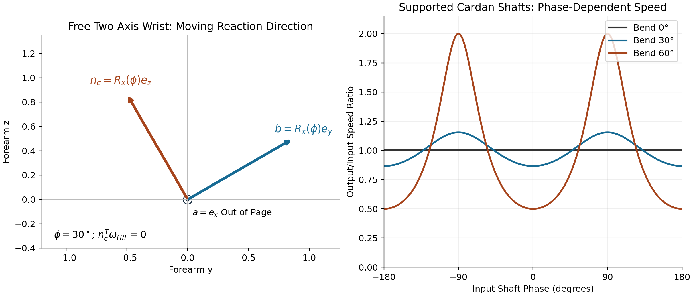



## Abstract

Grip geometry can change how the golfer's motion and forces affect the clubface.
Understanding that effect requires more than resolving a torque into two axes.
The wrist's allowed motion determines its reaction loads; the hand–club attachment
transforms those loads; the club's inertia and moving support determine its
response; and the face-orientation map determines which response matters at
impact. Muscle action, compliance and correlations between disturbances enter
the same chain. This article derives those connections using an ideal two-axis
wrist model, then identifies the measurements needed to qualify it. The result
is a testable grip-geometry hypothesis, not a demonstrated ranking of finger
and palm grips. Mechanical identities and illustrative numerical examples are
verified here; human performance and the author's historical Simscape model
are not validated by those checks.

::: {.callout-note}
## In Plain Language

A joint can pass a load between body segments without behaving like an extra
motor. Changing how the club sits in the hand can change the motion that this
load produces. But a load that is less disruptive in one configuration may
become larger there, and the golfer may change muscle action at the same time.
The useful question is therefore: **which measured grip geometry produces the
desired club delivery, with manageable effort and sensitivity, for this golfer?**
The equations below make each part of that question explicit.
:::

## Introduction

The investigation began with a concrete simulation problem. A model was driven
with prescribed joint motion, and the joint reported forces and torques. Could
those recorded values be fed back as actuator inputs to reproduce the motion
in forward dynamics? The obstacle was that a measured joint wrench and a set
of actuator inputs are different quantities. A joint can report three torque
components while having only two rotational coordinates. Some of its load
enforces the joint geometry rather than driving an independent rotation.

That observation motivates a broader golf question. Does the hand–club
attachment direct these loads into motion that develops useful clubhead speed,
or into motion that makes face control more sensitive? This is a worthwhile
mechanical hypothesis. Its answer depends jointly on geometry, dynamics and
the task. We will retain the question while replacing claims of automatic
transmission efficiency, inevitable variability accumulation and universal
grip superiority with quantities that can actually be calculated and tested.

[]{#wrist-coordinate-system}

### The Wrist as a Universal Joint

We distinguish the **wrist complex** from the **forearm's radioulnar joints**.
Flexion–extension and radial–ulnar deviation describe two prominent directions
of hand motion relative to the forearm. Pronation–supination involves the
radius and ulna and changes the frame carried to the wrist. It should be modeled
at the appropriate forearm joints, not counted as an unactuated third wrist
coordinate after it has already been prohibited by a two-coordinate model.

The ideal wrist used here consists of two intersecting revolute axes. Near a
chosen neutral posture, associate flexion–extension with a mediolateral axis
and deviation with an approximately dorsopalmar axis. Declare the anatomical
calibration and signs for the particular limb. These are modeling coordinates,
not a claim that anatomical or mechanical axes remain perfectly perpendicular
and fixed throughout a swing. Crisco and colleagues found oblique mechanical
axes in a six-cadaver-wrist study; their separate in-vivo study examined carpal
kinematics during dart-throwing motions. Neither study validates the present
golf model. [Crisco et al., 2011](https://pubmed.ncbi.nlm.nih.gov/21248214/),
[Crisco et al., 2005](https://pubmed.ncbi.nlm.nih.gov/16322624/).

[]{#note-on-3d-validation-scope}
[]{#limitations-of-the-analysis}
[]{#model-simplification}

### Limitations of the 2-DOF Wrist Model

A rigid joint is an approximation to motion under specified loads and time
scales. It can be useful when omitted relative motions have negligible influence
on the output being studied. That must be checked, especially for tissue loads,
contact transients and impact. A compliant extension introduces extra states,
constitutive parameters and possibly activation-dependent stiffness. Calling
an approximation “rigid” neither validates it nor makes it inherently invalid.

Two coordinates with two independent generalized torque inputs describe a
locally fully actuated wrist subsystem. Underactuation must instead be assessed
on the independent coordinates of the complete model, including its floating
base, contacts and actuator map. This is also a **spatial** model: a two-axis
joint is not a planar swing simply because it has two rotational coordinates.
Planar tests elsewhere in the project cannot validate its out-of-plane
face-orientation predictions.

## Universal Joints and Constraint Torques

### Mechanical Properties of Universal Joints

The perpendicular axes in a universal joint belong to its cross pins. The
centerlines of the connected shafts can form a range of bend angles; they
are not required to be perpendicular. Furthermore, a freely moving two-axis
relative joint and a driveshaft held in two fixed bearings are different
mechanisms. The bearings impose additional constraints. The familiar Cardan
speed-ratio formula describes the latter assembly and is derived separately
below. It cannot be assigned directly to wrist flexion and grip angle.

Let $R={}^{F}R_H=R_x(\phi)R_y(\psi)$ map hand-frame vectors into the
forearm frame. At the joint's common point, the two allowed relative angular
velocity directions, expressed in the forearm frame, are

$$
\mathbf a=\mathbf e_x,\qquad
\mathbf b=R_x(\phi)\mathbf e_y,\qquad
\boldsymbol\omega_{H/F}=\mathbf a\dot\phi+\mathbf b\dot\psi.
$$

The ideal reaction couple must do zero power against every allowed relative
angular velocity. Thus it lies along the reciprocal direction

$$
\mathbf n_c=\mathbf a\times\mathbf b=R_x(\phi)\mathbf e_z,
\qquad \boldsymbol\tau_c=\lambda_r\mathbf n_c,
\qquad \mathbf n_c^T\boldsymbol\omega_{H/F}=0.
$$

For this convention a local holonomic orientation constraint is
$\mathbf e_x^TR\mathbf e_y=0$. Its derivative gives the same instantaneous
restriction. The joint also imposes three translational constraints at the
common point, whose reactions are forces. If a wrench is reported at a
different point, those forces contribute an additional moment.

### Derivation for the Wrist Universal Joint

At $\phi=30^\circ$, $\psi=20^\circ$, the reciprocal unit direction is

$$
{}^F\mathbf n_c=(0,-0.5,0.866025)^T,
\qquad
{}^H\mathbf n_c=R^T{}^F\mathbf n_c=(-0.342020,0,0.939693)^T.
$$

It is generally neither a fixed forearm $z$-axis nor a fixed hand $z$-axis.
The constraint does not say that a chosen Euler angle rate or the forearm-frame
component $\omega_z$ vanishes. For example, the allowed deviation direction
$\mathbf b=(0,\cos\phi,\sin\phi)^T$ has a nonzero $z$ component when the
wrist is flexed. Confusing coordinate rates with angular-velocity components
would therefore label permitted motion “constrained.”

Because $\mathbf a$ and $\mathbf b$ are orthogonal unit vectors, this joint's
$3\times2$ angular-velocity Jacobian has rank two. Straight shaft alignment
does not cause gimbal lock in this model. Singularities of a supported
driveshaft assembly, an Euler chart, and a chosen golf task require their own
analyses. They are not interchangeable.

::: {.aba-diagram-scroll role="region" aria-label="Wrist and Cardan mechanisms; scroll horizontally" tabindex="0"}
{style="min-width: 1000px;" fig-alt="Left: in the forearm y-z plane at 30 degrees of flexion, allowed axis b and reciprocal direction n are perpendicular and both rotate with flexion; axis a points out of the page. Right: supported Cardan shaft speed ratios vary with input phase for bends of zero, 30 and 60 degrees."}
:::

The left panel shows the freely moving ideal wrist. The right panel includes
fixed shaft supports and therefore describes a different mechanism. Its phase
is not an anatomical wrist angle; the two panels must not be identified by
matching their angle symbols.

[]{#general-constraint-dynamics}
[]{#constraint-forces-in-the-equations-of-motion}

### Theoretical Formulation of Constraint Torques

Use redundant local generalized coordinates $\mathbf q\in\mathbb R^n$,
an independent constraint Jacobian $A\in\mathbb R^{k\times n}$, and an
actuator map $B\in\mathbb R^{n\times m}$. For stationary ideal constraints,

$$
M\ddot{\mathbf q}+\mathbf h
=B\mathbf u+\mathbf f+A^T\boldsymbol\lambda,
\qquad A\dot{\mathbf q}=0.
$$

$M$ is positive definite in this coordinate chart. The bias $\mathbf h$
includes gravity and velocity-dependent inertial terms; $\mathbf f$ contains
other declared generalized forces, including modeled passive forces if they
are not placed in $\mathbf h$. Use one convention consistently. The components
of $\boldsymbol\lambda$ are multipliers, not automatically anatomical torque
components: their units and meaning depend on how the constraint equations
are scaled. The physical generalized reaction is $A^T\boldsymbol\lambda$.

Differentiate the velocity constraint and substitute the dynamics:

$$
AM^{-1}A^T\boldsymbol\lambda
=-\dot A\dot{\mathbf q}-AM^{-1}(B\mathbf u+\mathbf f-\mathbf h).
$$

With independent rows of $A$, the left matrix is positive definite. Solve
this system rather than forming numerical inverses. In analytical notation,

$$
\frac{\partial\boldsymbol\lambda}{\partial\mathbf u}
=-(AM^{-1}A^T)^{-1}AM^{-1}B.
$$

**A reaction can depend immediately on actuator input even though the joint
has no actuator along its reciprocal direction.** For a transparent local
example, take $A=(0,0,1)$, $B=(\mathbf e_x,\mathbf e_y)$, zero bias,
and the illustrative inertia matrix

$$
M=\begin{bmatrix}2&0&0.5\\0&2&0\\0.5&0&2\end{bmatrix}.
$$

An input $(u,0)^T$ gives $\ddot q_x=u/2$, $\ddot q_z=0$ and
$\lambda=u/4$. A changed actuator input changes the constraint torque at
the same state. This counterexample is enough to disprove the blanket claim
that all constraint loads belong to uncontrollable drift. It does not show
that every desired reaction can be prescribed independently of motion.

Reactions annihilate allowed virtual velocities. They are not generally in
the null space of $B$, which acts on input vectors, or Euclidean-orthogonal
to every applied generalized force. Using a tangent basis $Z$ with $AZ=0$
eliminates ideal reactions from the reduced equations by multiplication with
$Z^T$. To compute actual joint loads, recover them from the full balance.
This is the distinction between reduced motion equations and reaction
reconstruction. [Modern Robotics, §8.7](https://modernrobotics.northwestern.edu/nu-gm-book-resource/8-7-constrained-dynamics/).

## Constraint Torque Transmission in the Golf Swing

### The Wrist as a Torque Transmission Pathway

At a common joint point $P$, let $(\mathbf F,\boldsymbol\tau)$ be the
ideal constraint wrench exerted on the hand by the forearm, expressed in one
inertial frame. The opposing wrench acts on the forearm. Their combined power is

$$
P_{c,H}+P_{c,F}
=\mathbf F^T(\mathbf v_{P,H}-\mathbf v_{P,F})
+\boldsymbol\tau^T(\boldsymbol\omega_H-\boldsymbol\omega_F)=0.
$$

The first term vanishes because the joint points coincide and have equal
velocity; the second vanishes for the reciprocal couple. Yet the individual
body powers need not be zero. For example, a $2\,\mathrm{N\,m}$ couple along
$\mathbf n_c$ and a common $10\,\mathrm{rad/s}$ angular-velocity component
along that direction give $+20\,\mathrm W$ to one body and $-20\,\mathrm W$
to the other. The ideal constraint redistributes energy without generating it.

This resolves the apparent contradiction between “does no work” and
“transmits energy.” Zero **combined** work is not zero work on each segment.
If a proximal motion is externally prescribed, its driving actuator can supply
energy to the modeled subsystem. For a moving constraint, the reduced subsystem
reaction power need not vanish. Muscle work, tissue energy storage, dissipation,
gravity and external contact power must be included in the appropriate system
boundary. A large transmitted torque alone measures none of those efficiencies.

### Inertia, Wrench Transport and a Moving Wrist

Describe grip attachment by a full rigid transform ${}^{H}T_C(g)$, where $g$
collects measured grip parameters. The attachment rotation and translation, along with any separate compliance model,
cannot generally be reconstructed from a single “finger versus palm” label.
For a force applied at $P$, a moment reported about club center of mass $C$ is

$$
\boldsymbol\tau_C=\boldsymbol\tau_P+
(\mathbf p_P-\mathbf p_C)\times\mathbf F.
$$

Then rotate both force and moment into the desired frame. A pure couple is
independent of reference point, but a wrench with nonzero force is not.
Similarly, express and transport the full club inertia tensor:

$$
I_P=I_C+m\big[(\mathbf r^T\mathbf r)\,\mathrm{Id}
-\mathbf r\mathbf r^T\big],\qquad
\mathbf r=\mathbf p_C-\mathbf p_P.
$$

At the center of mass, Euler's equation is
$\sum\boldsymbol\tau_C=I_C\dot{\boldsymbol\omega}
+\boldsymbol\omega\times(I_C\boldsymbol\omega)$.
For a body-fixed point $P$ accelerating with $\mathbf a_P$, the corresponding
balance is

$$
\sum\boldsymbol\tau_P
=I_P\dot{\boldsymbol\omega}
+\boldsymbol\omega\times(I_P\boldsymbol\omega)
+m\mathbf r\times\mathbf a_P.
$$

All vectors in an equation must share a frame. The last term is why dividing
a wrist moment by a grip-point inertia is not a complete moving-club model.
Off-diagonal inertia and velocity coupling can also matter. For a fixed pivot,
zero instantaneous angular velocity and a free rotational response,
$\dot{\boldsymbol\omega}=I_P^{-1}\boldsymbol\tau_P$. A one-axis constrained
response instead uses that axis's scalar inertia and supporting reactions.

For scale, a point head of mass $0.200\,\mathrm{kg}$ at $0.85\,\mathrm m$
from the grip and a thin uniform $0.100\,\mathrm{kg}$ shaft of length
$1.0\,\mathrm m$ give a **transverse** grip-point inertia

$$
I_\perp=0.200(0.85)^2+\tfrac13(0.100)(1.0)^2
=0.177833\,\mathrm{kg\,m^2}.
$$

This idealized geometry does not determine a realistic shaft-axis inertia.
That needs shaft radius, the head's intrinsic tensor and its offset from the
shaft. The earlier $0.005\,\mathrm{kg\,m^2}$ value cannot be called the
whole club's transverse grip inertia for this geometry. An assumed inertia
ratio of 2, 0.5 or 30 does not become a measured club property by appearing
in a simulator.

## The Grip Angle Hypothesis

[]{#club-coordinate-system}

### Coordinate System Definitions

Define a ground frame with $x$ toward the target, $z$ upward and $y$ completing
a right-handed frame. Let $\mathbf s$ denote the unit shaft direction and
$\mathbf n_f$ the outward face normal. A swing plane, when used, needs an
explicit construction and time interval. Rotation within that plane is about
its **normal**, not an axis lying in it. Shaft rotation is about $\mathbf s$.
Neither axis is automatically a principal inertia axis or a pure face-yaw axis.

Define face yaw by the horizontal projection of its normal:

$$
\gamma=\operatorname{atan2}(n_{f,y},n_{f,x}),\qquad
n_{f,x}^2+n_{f,y}^2>0.
$$

For a small spatial orientation perturbation $\delta\boldsymbol\theta$,
$\delta\mathbf n_f=\delta\boldsymbol\theta\times\mathbf n_f$, so

$$
\delta\gamma=
\frac{n_{f,x}\delta n_{f,y}-n_{f,y}\delta n_{f,x}}
{n_{f,x}^2+n_{f,y}^2}
=H_\gamma\,\delta\boldsymbol\theta.
$$

At a square face with loft $\ell$, choose
$\mathbf n_f=(\cos\ell,0,\sin\ell)^T$. Then
$H_\gamma=(-\tan\ell,0,1)$. Rotation about the vertical changes yaw;
rotation about the target direction also changes yaw when loft is nonzero.
Rotation about the face normal itself does not change that normal. This
derivation replaces an undefined “shaft angle” multiplier. A local derivative
also becomes poorly conditioned when the normal is nearly vertical; changing
the output definition may then be necessary.

[]{#case-1-grip-in-the-fingers-deep-grip}
[]{#case-2-grip-in-the-palm-shallow-grip}

### Grip Position Is a Geometric Parameter, Not a Verdict

In the ideal attachment, $R_{WC}=R_{WF}R_{FH}R_{HC}(g)$. Grip changes can alter
the expressed reaction direction, the moment arm of transmitted forces, the
effective inertia and the face measurement map. In a complete model they can
also alter allowable wrist posture, passive impedance, muscle moment arms
and contact closure through the second hand. A torque projection holds only
the first of these effects in view.

Under an intentionally restricted short-time calculation—fixed pivot,
frozen geometry, zero initial angular velocity and no other torque change—
a perturbation of a reaction couple gives

$$
\delta\ddot\gamma
\simeq H_\gamma I_P^{-1}\mathbf n_c\,\delta\lambda_r.
$$

The scalar $H_\gamma I_P^{-1}\mathbf n_c$ is a **local sensitivity**, not a
universal inertia ratio. A direction can have a small yaw sensitivity because
of geometry, not simply because its inertia is large. The same direction may
still change path, loft, strike location or speed. Moreover, $\lambda_r$
itself changes with grip and inputs; comparing identical reaction noise
between grips is an extra experimental assumption, not a consequence of the
constraint equations.

[]{#finger-grip-perpendicular-to-shaft}
[]{#palm-grip-aligned-with-shaft}

### Implications for Speed and Consistency

The hypothesis can now be stated precisely: some measured hand–club
attachments may reduce the sensitivity of selected impact outputs to a
specified perturbation distribution while preserving feasible delivery and
effort. Another attachment may perform better under different disturbances,
equipment or control policies. This is a design and identification problem.

Larger inertia reduces instantaneous acceleration for the same scalar torque
in a specified one-axis model. It also changes the torque needed to achieve
a desired motion. Inertia alone is not damping, does not dissipate energy,
and does not guarantee less terminal angle error. Likewise, a smaller yaw
sensitivity can coexist with greater speed variation. Study the joint output
vector—speed, direction, face normal and strike—before calling a perturbation
“performance-irrelevant.”

Descriptions such as “in the fingers,” “in the palm,” “strong” or “weak” can
help an instructor communicate, but they do not uniquely specify $T_{HC}$.
They should be accompanied by measured geometry when testing this mechanism.
No general optimum of 20–40 degrees, unavoidable palm-grip instability, or
increase in clubhead speed follows from the derivation above.

## Variability Accumulation Through the Kinematic Chain

State dependence and nonlinearity do not by themselves imply randomness,
unpredictability or chaos. Let $\boldsymbol\lambda=L(\mathbf x,\mathbf u,g,p)$,
where $p$ contains model parameters. A local perturbation has the form
$\delta\boldsymbol\lambda=L_x\delta\mathbf x+L_u\delta\mathbf u
+L_g\delta g+L_p\delta p$. Its covariance includes all cross terms.
Correlated variations can reinforce or cancel; a serial chain is not an
arithmetic accumulator of independent errors.

### Quantitative Example

To isolate integration, suppose a scalar torque error $\eta$ is constant
through a short interval $T$, has zero mean and standard deviation
$\sigma_\tau$, and acts on a single inertia $I$. Initial angle and velocity
errors are zero. Direct integration gives

$$
\delta\omega(T)=\frac{T}{I}\eta,\qquad
\delta\theta(T)=\frac{T^2}{2I}\eta,
\qquad \sigma_\theta=\frac{T^2}{2I}\sigma_\tau.
$$

Using the earlier article's **illustrative**, unmeasured values
$\sigma_\tau=0.15\,\mathrm{N\,m}$ and $T=0.010\,\mathrm s$:

| Assumed Scalar Inertia | Acceleration SD | Velocity SD at $T$ | Angle SD at $T$ |
|---|---:|---:|---:|
| $0.005\,\mathrm{kg\,m^2}$ | $30\,\mathrm{rad/s^2}$ | $0.300\,\mathrm{rad/s}$ | $0.0015\,\mathrm{rad}=0.08594^\circ$ |
| $0.00015\,\mathrm{kg\,m^2}$ | $1000\,\mathrm{rad/s^2}$ | $10.000\,\mathrm{rad/s}$ | $0.0500\,\mathrm{rad}=2.86479^\circ$ |

These are rotations of the hypothetical scalar coordinate, not measured
clubface yaw or shot dispersion. Their ratio is $33.333$, and the integration
factor is one-half. They establish a sensitivity under declared assumptions;
they establish neither typical club inertias nor a grip comparison. Converting
face orientation to ball flight would additionally require impact geometry,
club velocity, ball/face interaction and aerodynamics.

[]{#dynamic-complexity}

### Temporal Correlation and Feedback

For a time-varying scalar torque error with covariance
$C_\tau(s,t)=\mathbb E[\eta(s)\eta(t)]$, the same linear integrator gives

$$
\operatorname{Var}[\delta\theta(T)]
=\frac{1}{I^2}\int_0^T\int_0^T
(T-s)(T-t)C_\tau(s,t)\,ds\,dt.
$$

Frozen error gives $\sigma_\tau^2T^4/(4I^2)$. Ideal white torque noise with
$C_\tau(s,t)=Q_\tau\delta(s-t)$ instead gives
$Q_\tau T^3/(3I^2)$; $Q_\tau$ has torque-squared times time units and is not
a pointwise torque variance. A sampled random trace also needs its sample
interval, filtering and covariance specified. Resampling arbitrary independent
values without those choices changes the physical disturbance model.

For a nonlinear swing linearized along a nominal trajectory, collect all
perturbations in $\mathbf z$ and write
$\delta\dot{\mathbf x}=A(t)\delta\mathbf x+E(t)\delta\mathbf z$.
The transition matrix $\Phi(T,t)$ gives the terminal effect

$$
\delta\mathbf y(T)=C_T\Phi(T,0)\delta\mathbf x(0)
+\int_0^T C_T\Phi(T,t)E(t)\delta\mathbf z(t)\,dt.
$$

Grip affects $A$, $E$ and $C_T$, not just an isolated torque direction.
Feedback changes the state evolution; feedforward preparation changes the
nominal trajectory and correlations. Delays and actuator limits restrict
compensation, but they do not justify labeling every reaction uncontrollable.
If impact time itself changes, account for that event-time perturbation rather
than sampling every trial at a fixed clock time and calling it “impact.”

## Connection to Arm-Club Plane Separation

Two vectors can lie in the same plane without being parallel. Consequently,
“single plane” does not mathematically imply shaft–forearm collinearity, a
palm grip, or alignment with the wrist's reciprocal direction. A plane defined
by body landmarks and a plane fitted to a clubhead trajectory are also
different constructions. Declare the definition before comparing them.

Coleman and Rankin's seven-golfer kinematic study found that the chosen
left-arm plane changed during the downswing and the clubhead did not remain
in it. That challenges a fixed-plane representation for those observations;
it is not an experiment showing that deliberately creating plane separation
improves grip transmission. [Coleman and Rankin, 2005](https://pubmed.ncbi.nlm.nih.gov/15966340/).

MacKenzie's later simulation examined how club position relative to the swing
plane affects club delivery. Such a model can investigate a specific geometric
mechanism under its imposed torques and objective, but does not establish a
universal coaching rule or a causal finger-versus-palm effect.
[MacKenzie, club-position study](https://pubmed.ncbi.nlm.nih.gov/22900397/).

## Mathematical Framework: From Kinematics to Kinetics

### Constraint Torques in Forward Dynamics Simulation

In Simscape Multibody, a primitive's actuator-torque output concerns its
generalized actuation. Composite constraint torque and total torque are
three-component vectors resolved in a selected base or follower frame.
Total torque includes actuation, internal mechanics, limits and constraints.
Changing “base on follower” to “follower on base” reverses the composite sign.
These are software definitions; they do not identify which options were used
in a historical model. [MathWorks, Universal Joint](https://www.mathworks.com/help/sm/ref/universaljoint.html),
[force and torque sensing](https://www.mathworks.com/help/sm/ug/force-and-torque-sensing.html).

Consequently, a difference between a two-input torque vector and a sensed
three-component wrench is not evidence that mysterious extra torque has
appeared. Their dimensions, bases and roles differ. Map the physical wrench
to generalized forces by virtual power, and account separately for passive
elements. Do not add “inertial torque” or “Coriolis torque” to a measured total
wrench simply because those terms occur on the left of the equations of motion.

### The Forward-Inverse Dynamics Challenge

For a prescribed, constraint-consistent trajectory, define
$\mathbf d=M\ddot{\mathbf q}+\mathbf h-\mathbf f$. Inverse dynamics must solve

$$
\begin{bmatrix}B&A^T\end{bmatrix}
\begin{bmatrix}\mathbf u\\\boldsymbol\lambda\end{bmatrix}
=\mathbf d.
$$

The pair may be unique, underdetermined or infeasible, depending on actuation,
contacts and the prescribed motion. Closed chains and two-hand grip loads can
introduce internal-force indeterminacy. A least-squares answer with residual
is not exact physical replay; report the residual and any force-allocation
criterion. Reduced-coordinate inverse dynamics can determine net generalized
joint torques without uniquely identifying muscle forces or internal contact
loads.

To replay in forward dynamics, retain the same geometry, inertias, gravity,
passive forces, external loads, contact mode and compatible initial conditions.
Supply the recovered actuator inputs at their correct ports and allow reactions
to be solved again. Remove prescribed-motion drivers that would otherwise
overconstrain the replay. Compare motion, actuator work, joint loads and
constraint residuals under tighter solver tolerances. The distinction is
developed further in the [inverse-dynamics article](inverse-dynamics.qmd).

### Physical Demonstration of Constraint Torque Generation

An instrumented mechanical jig can make this distinction tangible. Support a
known two-axis joint, measure its configuration and applied primitive torques,
and record the six-component load at a calibrated sensor. Compare the measured
reaction with the constrained dynamics, including support motion and sensor
moment arms. Use zero-load, quasi-static and dynamic trials to isolate terms.

Holding one's wrist with the opposite hand can suggest that loads are coupled,
but it does not isolate a passive constraint torque. Voluntary co-activation,
forearm action, external restraint and tissue deformation are all involved.
The sensation is not an identification experiment or evidence that muscular
effort about another axis is absent.

## The Cardan Driveshaft Analogy

With shafts supported at a fixed bend $\delta$, $|\delta|<\pi/2$, choose
input phase $\varphi$ and output phase $\chi$ so that

$$
\chi=\operatorname{atan2}(\cos\delta\sin\varphi,\cos\varphi),
\qquad
\frac{\dot\chi}{\dot\varphi}
=\frac{\cos\delta}{1-\sin^2\delta\sin^2\varphi}.
$$

Continue the angle through branch cuts for complete revolutions. The derivative
has **no square root**. A phase origin shifted by $90^\circ$ yields the
cosine-squared form used in the Simscape Driveline documentation. Compare
phase definitions before comparing extrema.
[MathWorks, Driveline Universal Joint](https://www.mathworks.com/help/sdl/ref/universaljoint.html).

For a lossless, negligibly inertial coupling with stationary supports,
power-conjugate driving and delivered load magnitudes obey
$\tau_{\rm out}/\tau_{\rm in}=\dot\varphi/\dot\chi$. With both port
torques defined positive into the device, use the opposite sign in their
power balance. Finite component inertia, compliance, losses or moving supports
require their additional energy terms. Torque multiplication is not efficiency
greater than one.

At $\delta=30^\circ$, the speed ratio is $0.866025$ at
$\varphi=0$ and $1.154701$ at $\varphi=90^\circ$; the ideal torque ratios
are their reciprocals. Straight alignment gives a ratio of one everywhere.
The limiting right-angle assembly is outside this operating model. Neither
its degeneration nor an artificial 89-degree numerical clip represents an
extreme anatomical palm grip.

The [companion derivation](https://github.com/D-sorganization/AffineDrift/blob/main/content/wrist-as-universal-joint/MATHEMATICAL_DERIVATION.md)
separates this driveshaft calculation from the wrist hypothesis. A demo that
uses its bend angle also as a torque-projection angle makes an additional
synthetic choice. It does not solve wrist reactions, simulate the whole swing,
or validate grip recommendations. Independent derivative and full-revolution
checks are needed; multiplying two deliberately reciprocal formulas is only
an internal consistency check.

## Implications and Future Directions

[]{#proof-limitations}

### Testable Predictions

Define a baseline participant, club, contact configuration, task and measured
perturbation model. Then compare three questions separately:

| Comparison | Held Fixed | Allowed to Change | What It Tests |
|---|---|---|---|
| Fixed-Input Forward Simulation | Actuator policy, initial state specification and external conditions | Motion and reactions under feasible new geometry | Response to a particular intervention |
| Fixed-Motion Inverse Analysis | A feasible target motion and external loads | Required actuation and internal-load allocation | Effort and load consequences of reproducing motion |
| Reoptimized Control | Objective, constraints and resource limits | Policy, trajectory and reactions | Best achievable result within the chosen model |

Changing grip while imposing both all original torques and all original motion
is generally not an independently specifiable comparison. Even initial states
must be reconstructed to satisfy the new attachment and contact constraints.
Report failures of feasibility rather than quietly relaxing the task for one
condition. Speed and accuracy comparisons need the same definitions and units.

### Simulation Studies

Start with an analytic joint whose reactions and power balance are known.
Verify the spatial wrist kinematics, wrench transforms, inertia transport,
constraint residuals and inverse-to-forward replay. Add the second hand and
floating base with explicit closure, then add compliant structures when the
question requires them. Test time-step, differentiation and parameter
sensitivity before interpreting small differences between grips.

A useful result reports terminal-output covariance, actuator demand, tissue
or contact loads within the model, and the perturbations responsible for each
change. Check held-out perturbations and alternate plausible joint/club
parameters. A result that reverses when a reasonable assumption changes is
informative: it identifies what needs measuring before drawing a conclusion.

[]{#individual-variability-and-optimization}
[]{#measurement-challenges}

### Experimental Validation

Measure the hand–club transform, wrist/forearm motion, club delivery and
repeat-trial variability. Choose instrumentation and calibration appropriate
to the predicted effect. Separate measurement error from between-trial motor
variation, use participant-level comparisons, allow adaptation to grip changes,
and report uncertainty rather than selecting only successful shots.

Motion capture and force plates help constrain a whole-body inverse problem,
but they do not automatically identify how two hands share an internal grip
load. Instrumented grip wrenches or justified contact/load-sharing models may
be required. EMG measures electrical activity; it is not joint torque, muscle
force or “control burden” without an additional measurement/model relationship.
Use it as complementary evidence with its own normalization and uncertainty.

The hypothesis would be weakened if a predicted sensitivity change failed
in held-out trials after measurement uncertainty and adaptation were accounted
for. It would also be weakened if equally plausible contact or compliance
models reversed the ranking. Finding a benefit for one participant or output
would support that scoped result, not a universal rule for all golfers.

### Extension to Other Joints

The same accounting applies to humanoid feet, elbows, the spine and robot
grippers. A contact can remove motion directions while carrying forces;
actuation changes both motion and reactions; compliant elements add storage
and dissipation; and the chosen task decides which sensitivity matters.
Changing contact mode can invalidate a local linearization. Contact force
limits, friction and lift-off therefore belong in a whole-body analysis.

[]{#conceptual-cross-references}

## Theoretical Synthesis

### Affine Decomposition of Constraint Forces

At a fixed state and contact mode, a torque-driven constrained model can be
affine in its independent inputs. Eliminating reactions modifies both its
input map and bias. Input-dependent muscle activation, stiffness, geometry or
contact transitions may require a larger state or a different local model.
“Not independently commanded” does not mean “independent of command.”

### Geometric Rejection of Disturbance

Geometry can reduce a chosen output's response to a particular load. To claim
disturbance rejection over an interval, examine the complete propagation
$C_T\Phi(T,t)E(t)$, not merely the instantaneous projection of a torque. A
direction initially invisible to face yaw can affect it later through velocity,
orientation or feedback coupling. This explains why the promising local idea
needs a full dynamical treatment.

### The Null Space of Performance

For a task map $\mathbf y=h(\mathbf q)$, directions in
$\ker(Dh)$ preserve the task to first order at that configuration. They need
not preserve it after a finite step or preserve other delivery variables.
The uncontrolled-manifold approach analyzes how observed variance relates
to a specified task; it does not prove that the nervous system ignores those
directions or that constraint noise automatically enters them.
[Scholz and Schöner, 1999](https://pubmed.ncbi.nlm.nih.gov/10382616/).

[]{#the-grip-in-the-fingers-principle}

## Relationship to Instructional Practice

Grip advice may remain useful on the basis of practice, comfort, observation
or other evidence. This article neither proves nor disproves that broader
advice. It supplies a way to test one proposed mechanism. In practical terms,
measure what changes with the grip, decide which delivery variables matter,
and distinguish a geometrical explanation from evidence that an intervention
improves a golfer's performance. A more complete model should sharpen that
decision, not conceal assumptions behind more equations.

## Conclusion

The wrist can transmit constraint loads while retaining two independent motion
coordinates. Those loads are jointly determined by geometry, inertia, support
motion, external forces and actuation. Their effect on golf delivery depends
on the hand–club transform, the club's spatial dynamics, the face measurement
map and the time structure of perturbations. The resulting grip hypothesis is
conditional but constructive: identify geometries that make a feasible desired
delivery less sensitive to specified disturbances, and test that prediction
against measurements and alternative models. That connects the original
simulation puzzle to a rigorous program for golf and humanoid mechanics.

## Acknowledgments {.unnumbered}

The original discussion with Mike Duffey motivated questions about proximal
motion and wrist reactions. Lynch and Park's Modern Robotics material provided
the constrained-dynamics starting point. Discussion and analogy motivate the
investigation; they are not substitutes for the derivations or validation.

## Print and Interactive Companions

[Download the Revised Print Companion](../content/wrist-as-universal-joint/Wrist_Universal_Claude.pdf).
The [Cardan and Torque Projection Demonstration](../src/tools/wrist_universal_joint/grip_angle_simulator.html)
illustrates the supported-shaft calculation and a synthetic torque projection.
It does not calculate human wrist reactions or integrate clubface motion.

## References {.unnumbered}

The [annotated bibliography](https://github.com/D-sorganization/AffineDrift/blob/main/articles/wrist-universal-joint-bibliography.md) states which
source supports which claim and distinguishes abstract-level review, technical
documentation and empirical evidence. The main sources are linked at their
points of use above. The [companion validation guide](https://github.com/D-sorganization/AffineDrift/blob/main/content/wrist-as-universal-joint/VALIDATION_AND_TESTING.md)
defines reproducible mechanical checks and the remaining empirical questions.
