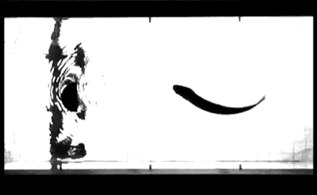

```{=html}
<section class="article-section">
  <div class="container">
    <article class="main-article">
      <div class="article-content">
        <section class="article-body">

          <div class="resource-grid" style="margin-top: 2rem;">
            <div class="resource-card" style="grid-column: 1 / -1;">
              <div class="resource-header">
                <span class="resource-type">Research</span>
                <h3>Dead Fish Swimming Upstream</h3>
              </div>
              <div style="text-align: center; margin: 2rem 0;">
                
              </div>
              <p class="resource-description">
                This fascinating demonstration shows a dead fish swimming upstream, illustrating remarkable fluid dynamics principles. 
                The phenomenon demonstrates how passive body shapes can generate propulsive forces through interaction with fluid flow, 
                even without active propulsion mechanisms. This research connects to fundamental questions about how passive dynamics 
                and active control interact in biomechanical systems—a core theme of the AffineDrift research framework.
              </p>
              <p style="margin-top: 1rem; font-size: 0.95rem; color: var(--text-light);">
                <strong>Research Source:</strong> 
                <em>The original research was conducted by fluid dynamics researchers studying passive propulsion mechanisms. 
                This demonstration highlights the complex interactions between body geometry, fluid flow, and motion generation.</em>
                <br>
                <a href="#" id="dead-fish-paper-link" style="margin-top: 0.5rem; display: inline-block; color: var(--accent-blue); text-decoration: none;" target="_blank" rel="noopener">
                  Read the research paper →
                </a>
              </p>
            </div>

            <div class="resource-card">
              <div class="resource-header">
                <span class="resource-type">Coming Soon</span>
                <h3>Unit Converter</h3>
              </div>
              <p class="resource-description">
                Convert between different units of measurement.
              </p>
            </div>

            <div class="resource-card">
              <div class="resource-header">
                <span class="resource-type">Coming Soon</span>
                <h3>RRT Path Planner</h3>
              </div>
              <p class="resource-description">
                Rapidly-exploring Random Tree path planning algorithm visualization and tool.
              </p>
            </div>

            <div class="resource-card">
              <div class="resource-header">
                <span class="resource-type">Coming Soon</span>
                <h3>Solar System Model</h3>
              </div>
              <p class="resource-description">
                Interactive model of the solar system with orbital mechanics.
              </p>
            </div>

            <div class="resource-card">
              <div class="resource-header">
                <span class="resource-type">Coming Soon</span>
                <h3>Games</h3>
              </div>
              <p class="resource-description">
                Interactive games and simulations.
              </p>
            </div>
          </div>

          <p style="margin-top: 3rem; font-style: italic; color: var(--text-light);">
            More projects will be added as they develop. Check back soon!
          </p>
        </section>
      </div>
    </article>
  </div>
</section>
```
