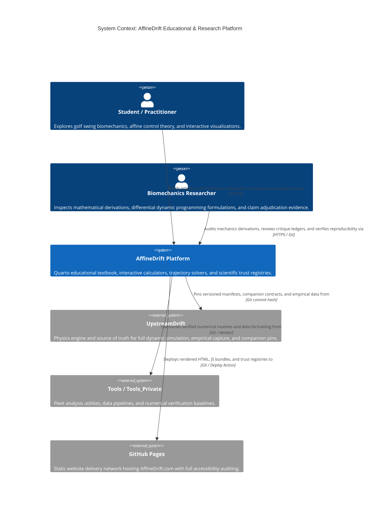
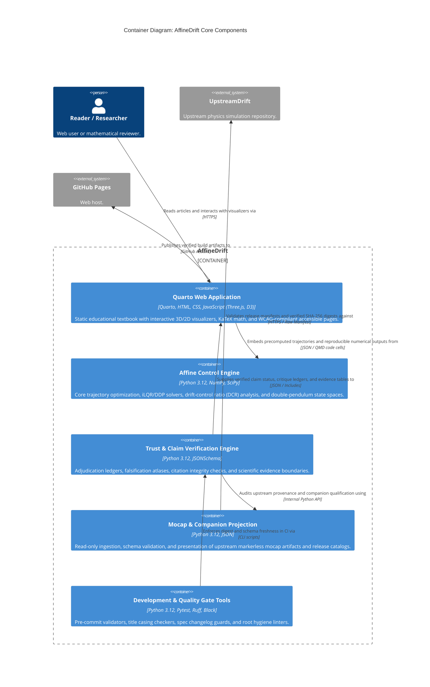

# AffineDrift Architecture Map

## 1. System Context View (C4Context)

## 2. Container View (C4Container)

## Feature Map

| Capability | Component | Interface | Evidence |
| --- | --- | --- | --- |
| Affine Swing Dynamics & iLQR Optimization | Affine Control Engine (`src/affine_control/`) | Python Module / Trajectory Solvers | `tests/test_affine_control/` |
| Drift-Control Ratio (DCR) & Reachability | Affine Control Engine (`src/affine_control/reachability.py`) | Python API / Analysis Scripts | `tests/test_dcr_reachability_contract.py` |
| Scientific Trust & Critique Adjudication | Trust Registry (`src/affine_control/falsification_atlas/`, `data/trust/`) | JSON Schemas / Validation Scripts | `tests/test_claim_critique_ledger.py`, `tests/test_proximal_distal_falsification_atlas.py` |
| Mocap & Programming Companion Ingestion | Companion Ingestion (`src/affine_control/programming_companion/`) | JSON Parsers / Manifest Verifiers | `tests/test_mocap_publication_projection.py` |
| Quarto Static Site & Visual Interactive Tools | Quarto Web Application (`articles/`, `pages/`, `js/`) | Web Browser / HTML & JS | `tests/test_e2e_playwright.py`, `tests/test_site_link_gate.py` |
| Repository Quality & Root Hygiene Gates | Development Tools (`scripts/`, `.github/workflows/`) | Python CLI / GitHub Actions | `tests/test_root_hygiene.py`, `tests/test_check_spec_changelog.py` |

## Architecture Change Log

| Date | PR / Issue | Description |
| --- | --- | --- |
| 2026-09-10 | #1595 | Baseline adoption of maintainable Mermaid C4 architecture maps (C4Context, C4Container, Feature Map, Change Log) |
