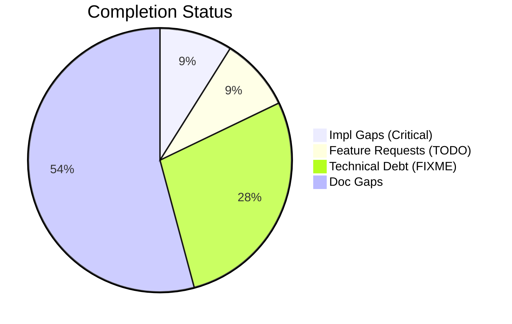
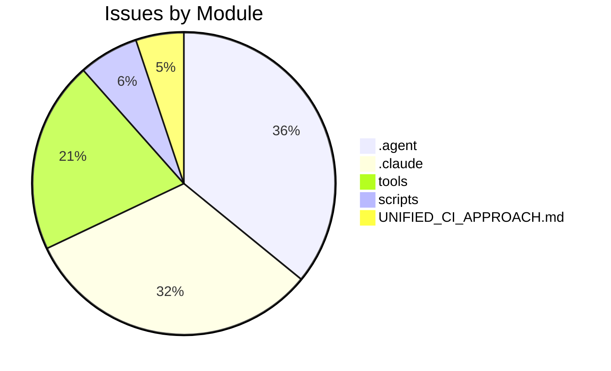

# Completist Report: 2026-02-05

## Executive Summary
- **Critical Gaps**: 16
- **Feature Gaps (TODO)**: 16
- **Technical Debt**: 50
- **Documentation Gaps**: 97

## Visualization
### Status Overview

### Top Impacted Modules

## Critical Incomplete (Top 50)
| File | Line | Type | Impact | Coverage | Complexity |
|---|---|---|---|---|---|
| `src/tools/publish_manual_article.py` | 100 | Stub | 3 | 2 | 4 |
| `src/tools/wrap_sidebars.py` | 34 | Stub | 3 | 2 | 4 |
| `src/tools/code_quality_check.py` | 176 | Stub | 3 | 2 | 4 |
| `src/tools/fix_html_validation.py` | 164 | Stub | 3 | 2 | 4 |
| `src/tools/utils/analysis_utils.py` | 16 | Stub | 3 | 2 | 4 |
| `src/tools/utils/analysis_utils.py` | 58 | Stub | 3 | 2 | 4 |
| `src/tools/matlab_utilities/scripts/matlab_quality_check.py` | 198 | Stub | 3 | 2 | 4 |
| `src/tools/code_quality_check.py` | 39 | NotImplementedError | 3 | 2 | 4 |
| `src/tools/code_quality_check.py` | 133 | NotImplementedError | 3 | 2 | 4 |
| `src/tools/code_quality_check.py` | 134 | NotImplementedError | 3 | 2 | 4 |
| `scripts/generate_completist_data.py` | 166 | Stub | 1 | 2 | 4 |
| `scripts/pragmatic_programmer_review.py` | 134 | Stub | 1 | 2 | 4 |
| `scripts/pragmatic_programmer_review.py` | 158 | Stub | 1 | 2 | 4 |
| `scripts/pragmatic_programmer_review.py` | 181 | Stub | 1 | 2 | 4 |
| `content/Wrist as Universal Joint/Universal_Joint_Model_Enhanced.py` | 987 | Stub | 1 | 2 | 4 |
| `src/affine_control/ddp.py` | 36 | Stub | 1 | 2 | 4 |

## Feature Gap Matrix
| Module | Feature Gap | Type |
|---|---|---|
| `AGENTS.md` | - **Read:** Codebase for TODO, FIXME, NotImplementedError, pass statements | TODO |
| `JULES_ARCHITECTURE.md` | if grep -r "TODO\\|FIXME" --include="*.py" src/; then | TODO |
| `UNIFIED_CI_APPROACH.md` | - **Common Issues**: TODO comments, console.log statements | TODO |
| `UNIFIED_CI_APPROACH.md` | 3. **No placeholders**: No TODO, FIXME, or NotImplementedError | TODO |
| `UNIFIED_CI_APPROACH.md` | - **Placeholders**: TODO, FIXME, NotImplementedError | TODO |
| `UNIFIED_CI_APPROACH.md` | 3. **Placeholders**: Remove TODO/FIXME comments | TODO |
| `.claude/skills/lint/SKILL.md` | description: Run linting tools (ruff, black, mypy) and fix placeholder/TODO statements | TODO |
| `.claude/skills/lint/SKILL.md` | - Search for `TODO`, `FIXME`, `XXX`, `HACK` comments | TODO |
| `.claude/skills/lint/SKILL.md` | grep -rn "TODO\\|FIXME\\|XXX\\|HACK\\|NotImplementedError\\|pass$" --include="*.py" . | TODO |
| `.agent/workflows/lint.md` | description: Run linting tools (ruff, black, mypy) and fix placeholder/TODO statements | TODO |
| `.agent/workflows/lint.md` | grep -rn "TODO\\|FIXME\\|XXX\\|HACK\\|NotImplementedError\\|pass$" --include="*.py" . | TODO |
| `.agent/skills/lint/SKILL.md` | description: Run linting tools (ruff, black, mypy) and fix placeholder/TODO statements | TODO |
| `.agent/skills/lint/SKILL.md` | - Search for `TODO`, `FIXME`, `XXX`, `HACK` comments | TODO |
| `.agent/skills/lint/SKILL.md` | grep -rn "TODO\\|FIXME\\|XXX\\|HACK\\|NotImplementedError\\|pass$" --include="*.py" . | TODO |
| `src/tools/code_quality_check.py` | (re.compile(r"\bTODO\b"), "TODO placeholder found"), | TODO |
| `src/tools/matlab_utilities/scripts/matlab_quality_check.py` | (r"\bTODO\b", "TODO placeholder found"), | TODO |

## Technical Debt Register
| File | Line | Issue | Type |
|---|---|---|---|
| `scripts/generate_completist_data.py` | 128 | markers = ["TOD" + "O", "FIX" + "ME", "XXX", "HACK", "TEMP"] | XXX |
| `.claude/skills/issues-10-sequential/SKILL.md` | 96 | \| 1 \| #XXX - Title \| #YYY \| Merged \| | XXX |
| `.claude/skills/issues-10-sequential/SKILL.md` | 97 | \| 2 \| #XXX - Title \| #YYY \| Merged \| | XXX |
| `.claude/skills/issues-5-combined/SKILL.md` | 63 | - #XXX: <brief description> | XXX |
| `.claude/skills/issues-5-combined/SKILL.md` | 64 | - #XXX: <brief description> | XXX |
| `.claude/skills/issues-5-combined/SKILL.md` | 65 | - #XXX: <brief description> | XXX |
| `.claude/skills/issues-5-combined/SKILL.md` | 66 | - #XXX: <brief description> | XXX |
| `.claude/skills/issues-5-combined/SKILL.md` | 67 | - #XXX: <brief description> | XXX |
| `.claude/skills/issues-5-combined/SKILL.md` | 69 | Closes #XXX, closes #XXX, closes #XXX, closes #XXX, closes #XXX | XXX |
| `.claude/skills/issues-5-combined/SKILL.md` | 84 | \| #XXX \| Title \| Brief fix description \| | XXX |
| `.claude/skills/issues-5-combined/SKILL.md` | 85 | \| #XXX \| Title \| Brief fix description \| | XXX |
| `.claude/skills/issues-5-combined/SKILL.md` | 86 | \| #XXX \| Title \| Brief fix description \| | XXX |
| `.claude/skills/issues-5-combined/SKILL.md` | 87 | \| #XXX \| Title \| Brief fix description \| | XXX |
| `.claude/skills/issues-5-combined/SKILL.md` | 88 | \| #XXX \| Title \| Brief fix description \| | XXX |
| `.claude/skills/issues-5-combined/SKILL.md` | 95 | Closes #XXX, closes #XXX, closes #XXX, closes #XXX, closes #XXX" | XXX |
| `.claude/skills/issues-5-combined/SKILL.md` | 140 | \| #XXX \| Title \| Fixed \| | XXX |
| `.claude/skills/issues-5-combined/SKILL.md` | 141 | \| #XXX \| Title \| Fixed \| | XXX |
| `.claude/skills/issues-5-combined/SKILL.md` | 142 | \| #XXX \| Title \| Fixed \| | XXX |
| `.claude/skills/issues-5-combined/SKILL.md` | 143 | \| #XXX \| Title \| Fixed \| | XXX |
| `.claude/skills/issues-5-combined/SKILL.md` | 144 | \| #XXX \| Title \| Fixed \| | XXX |
| `.claude/skills/update-issues/SKILL.md` | 132 | \| #XXX \| Title \| High \| assessment.md \| | XXX |
| `.claude/skills/update-issues/SKILL.md` | 137 | \| #XXX \| Title \| Fixed in commit abc123 \| | XXX |
| `.claude/skills/update-issues/SKILL.md` | 142 | \| Description \| #XXX \| | XXX |
| `.agent/workflows/issues-5-combined.md` | 44 | Closes #XXX, closes #XXX, closes #XXX, closes #XXX, closes #XXX | XXX |
| `.agent/skills/issues-10-sequential/SKILL.md` | 96 | \| 1 \| #XXX - Title \| #YYY \| Merged \| | XXX |
| `.agent/skills/issues-10-sequential/SKILL.md` | 97 | \| 2 \| #XXX - Title \| #YYY \| Merged \| | XXX |
| `.agent/skills/issues-5-combined/SKILL.md` | 63 | - #XXX: <brief description> | XXX |
| `.agent/skills/issues-5-combined/SKILL.md` | 64 | - #XXX: <brief description> | XXX |
| `.agent/skills/issues-5-combined/SKILL.md` | 65 | - #XXX: <brief description> | XXX |
| `.agent/skills/issues-5-combined/SKILL.md` | 66 | - #XXX: <brief description> | XXX |
| `.agent/skills/issues-5-combined/SKILL.md` | 67 | - #XXX: <brief description> | XXX |
| `.agent/skills/issues-5-combined/SKILL.md` | 69 | Closes #XXX, closes #XXX, closes #XXX, closes #XXX, closes #XXX | XXX |
| `.agent/skills/issues-5-combined/SKILL.md` | 84 | \| #XXX \| Title \| Brief fix description \| | XXX |
| `.agent/skills/issues-5-combined/SKILL.md` | 85 | \| #XXX \| Title \| Brief fix description \| | XXX |
| `.agent/skills/issues-5-combined/SKILL.md` | 86 | \| #XXX \| Title \| Brief fix description \| | XXX |
| `.agent/skills/issues-5-combined/SKILL.md` | 87 | \| #XXX \| Title \| Brief fix description \| | XXX |
| `.agent/skills/issues-5-combined/SKILL.md` | 88 | \| #XXX \| Title \| Brief fix description \| | XXX |
| `.agent/skills/issues-5-combined/SKILL.md` | 95 | Closes #XXX, closes #XXX, closes #XXX, closes #XXX, closes #XXX" | XXX |
| `.agent/skills/issues-5-combined/SKILL.md` | 140 | \| #XXX \| Title \| Fixed \| | XXX |
| `.agent/skills/issues-5-combined/SKILL.md` | 141 | \| #XXX \| Title \| Fixed \| | XXX |
| `.agent/skills/issues-5-combined/SKILL.md` | 142 | \| #XXX \| Title \| Fixed \| | XXX |
| `.agent/skills/issues-5-combined/SKILL.md` | 143 | \| #XXX \| Title \| Fixed \| | XXX |
| `.agent/skills/issues-5-combined/SKILL.md` | 144 | \| #XXX \| Title \| Fixed \| | XXX |
| `.agent/skills/update-issues/SKILL.md` | 132 | \| #XXX \| Title \| High \| assessment.md \| | XXX |
| `.agent/skills/update-issues/SKILL.md` | 137 | \| #XXX \| Title \| Fixed in commit abc123 \| | XXX |
| `.agent/skills/update-issues/SKILL.md` | 142 | \| Description \| #XXX \| | XXX |
| `src/tools/code_quality_check.py` | 37 | (re.compile(r"\bFIXME\b"), "FIXME placeholder found"), | FIXME |
| `src/tools/matlab_utilities/scripts/matlab_quality_check.py` | 286 | (r"\bFIXME\b", "FIXME placeholder found"), | FIXME |
| `src/tools/matlab_utilities/scripts/matlab_quality_check.py` | 287 | (r"\bHACK\b", "HACK comment found"), | HACK |
| `src/tools/matlab_utilities/scripts/matlab_quality_check.py` | 288 | (r"\bXXX\b", "XXX comment found"), | XXX |

## Recommended Implementation Order
Prioritized by Impact (High) and Complexity (Low).
| Priority | File | Issue | Metrics (I/C/C) |
|---|---|---|---|
| 1 | `src/tools/code_quality_check.py` | (re.compile(r"\bTODO\b"), "TODO placeholder found"), | 3/2/3 |
| 2 | `src/tools/matlab_utilities/scripts/matlab_quality_check.py` | (r"\bTODO\b", "TODO placeholder found"), | 3/2/3 |
| 3 | `src/tools/publish_manual_article.py` | wrap_in_article_section | 3/2/4 |
| 4 | `src/tools/wrap_sidebars.py` | wrap_file | 3/2/4 |
| 5 | `src/tools/code_quality_check.py` | check_ast_issues | 3/2/4 |
| 6 | `src/tools/fix_html_validation.py` | main | 3/2/4 |
| 7 | `src/tools/utils/analysis_utils.py` | get_python_metrics | 3/2/4 |
| 8 | `src/tools/utils/analysis_utils.py` | get_detailed_function_metrics | 3/2/4 |
| 9 | `src/tools/matlab_utilities/scripts/matlab_quality_check.py` | _analyze_matlab_file | 3/2/4 |
| 10 | `src/tools/code_quality_check.py` | (re.compile(r"NotImplementedError"), "NotImplementedError placeholder"), | 3/2/4 |
| 11 | `src/tools/code_quality_check.py` | # Ignore NotImplementedError in comments | 3/2/4 |
| 12 | `src/tools/code_quality_check.py` | if "NotImplementedError" in message and "#" in line: | 3/2/4 |
| 13 | `AGENTS.md` | - **Read:** Codebase for TODO, FIXME, NotImplementedError, pass statements | 1/2/3 |
| 14 | `JULES_ARCHITECTURE.md` | if grep -r "TODO\\|FIXME" --include="*.py" src/; then | 1/2/3 |
| 15 | `UNIFIED_CI_APPROACH.md` | - **Common Issues**: TODO comments, console.log statements | 1/2/3 |
| 16 | `UNIFIED_CI_APPROACH.md` | 3. **No placeholders**: No TODO, FIXME, or NotImplementedError | 1/2/3 |
| 17 | `UNIFIED_CI_APPROACH.md` | - **Placeholders**: TODO, FIXME, NotImplementedError | 1/2/3 |
| 18 | `UNIFIED_CI_APPROACH.md` | 3. **Placeholders**: Remove TODO/FIXME comments | 1/2/3 |
| 19 | `.claude/skills/lint/SKILL.md` | description: Run linting tools (ruff, black, mypy) and fix placeholder/TODO stat | 1/2/3 |
| 20 | `.claude/skills/lint/SKILL.md` | - Search for `TODO`, `FIXME`, `XXX`, `HACK` comments | 1/2/3 |

## Issues Created