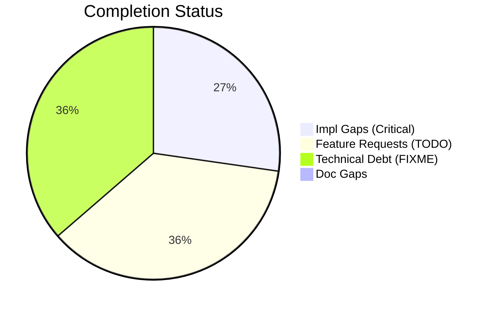
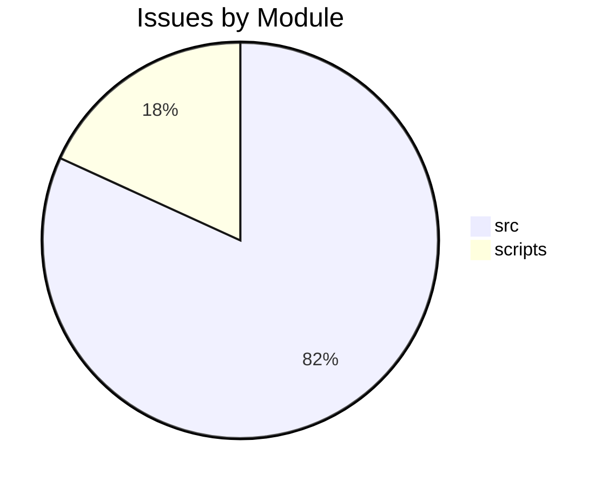

# Completist Report: 2026-01-31

## Executive Summary
- **Critical Gaps**: 3
- **Feature Gaps (TODO)**: 4
- **Technical Debt**: 4
- **Documentation Gaps**: 0

## Visualization
### Status Overview

### Top Impacted Modules

## Critical Incomplete (Top 50)
| File | Line | Type | Impact | Coverage | Complexity |
|---|---|---|---|---|---|
| `./src/tools/code_quality_check.py` | 39 | NotImplementedError | 3 | 2 | 4 |
| `./src/tangent_models/examples.py` | 10 | NotImplementedError | 1 | 2 | 4 |
| `./src/tangent_models/examples.py` | 18 | NotImplementedError | 1 | 2 | 4 |

## Feature Gap Matrix
| Module | Feature Gap | Type |
|---|---|---|
| `./scripts/pragmatic_programmer_review.py` | if "TODO" in content: | TODO |
| `./scripts/pragmatic_programmer_review.py` | "title": f"High TODO count ({len(todos)})", | TODO |
| `./src/tools/matlab_utilities/scripts/matlab_quality_check.py` | (r"\bTODO\b", "TODO placeholder found"), | TODO |
| `./src/tools/code_quality_check.py` | (re.compile(r"\bTODO\b"), "TODO placeholder found"), | TODO |

## Technical Debt Register
| File | Line | Issue | Type |
|---|---|---|---|
| `./src/tools/matlab_utilities/scripts/matlab_quality_check.py` | 286 | (r"\bFIXME\b", "FIXME placeholder found"), | FIXME |
| `./src/tools/matlab_utilities/scripts/matlab_quality_check.py` | 287 | (r"\bHACK\b", "HACK comment found"), | HACK |
| `./src/tools/matlab_utilities/scripts/matlab_quality_check.py` | 288 | (r"\bXXX\b", "XXX comment found"), | XXX |
| `./src/tools/code_quality_check.py` | 37 | (re.compile(r"\bFIXME\b"), "FIXME placeholder found"), | FIXME |

## Recommended Implementation Order
Prioritized by Impact (High) and Complexity (Low).
| Priority | File | Issue | Metrics (I/C/C) |
|---|---|---|---|
| 1 | `./src/tools/matlab_utilities/scripts/matlab_quality_check.py` | (r"\bTODO\b", "TODO placeholder found"), | 3/2/3 |
| 2 | `./src/tools/code_quality_check.py` | (re.compile(r"\bTODO\b"), "TODO placeholder found"), | 3/2/3 |
| 3 | `./src/tools/code_quality_check.py` | (re.compile(r"NotImplementedError"), "NotImplementedError placeholder"), | 3/2/4 |
| 4 | `./scripts/pragmatic_programmer_review.py` | if "TODO" in content: | 1/2/3 |
| 5 | `./scripts/pragmatic_programmer_review.py` | "title": f"High TODO count ({len(todos)})", | 1/2/3 |
| 6 | `./src/tangent_models/examples.py` | raise NotImplementedError | 1/2/4 |
| 7 | `./src/tangent_models/examples.py` | raise NotImplementedError | 1/2/4 |

## Issues Created