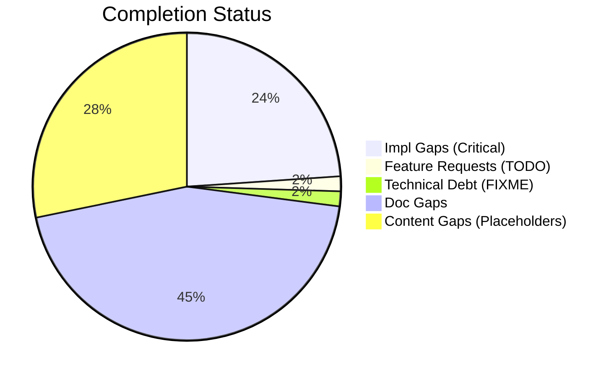
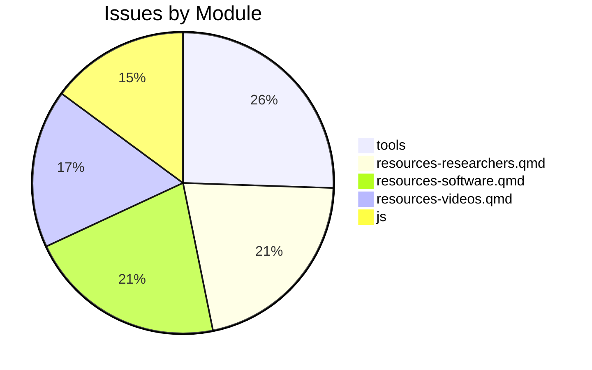

# Completist Report: 2026-02-15

## Executive Summary
- **Critical Gaps**: 61
- **Feature Gaps (TODO)**: 4
- **Content Gaps (Placeholders)**: 72
- **Technical Debt**: 4
- **Documentation Gaps**: 114

## Visualization
### Status Overview

### Top Impacted Modules

## Critical Incomplete (Top 50)
| File | Line | Type | Impact | Coverage | Complexity |
|---|---|---|---|---|---|
| `resources-papers.qmd` | 65 | Placeholder | 5 | 2 | 4 |
| `resources-researchers.qmd` | 214 | Placeholder | 5 | 2 | 4 |
| `resources-researchers.qmd` | 271 | Placeholder | 5 | 2 | 4 |
| `resources-researchers.qmd` | 303 | Placeholder | 5 | 2 | 4 |
| `resources-researchers.qmd` | 328 | Placeholder | 5 | 2 | 4 |
| `book-reviews.qmd` | 26 | Placeholder | 5 | 2 | 4 |
| `book-reviews.qmd` | 32 | Placeholder | 5 | 2 | 4 |
| `research-review-interaction-forces.qmd` | 73 | Placeholder | 5 | 2 | 4 |
| `script.js` | 1716 | Placeholder | 5 | 2 | 4 |
| `script.js` | 1717 | Placeholder | 5 | 2 | 4 |
| `script.js` | 1718 | Placeholder | 5 | 2 | 4 |
| `resources-software.qmd` | 39 | Placeholder | 5 | 2 | 4 |
| `resources-software.qmd` | 62 | Placeholder | 5 | 2 | 4 |
| `resources-software.qmd` | 82 | Placeholder | 5 | 2 | 4 |
| `resources-software.qmd` | 126 | Placeholder | 5 | 2 | 4 |
| `resources-software.qmd` | 154 | Placeholder | 5 | 2 | 4 |
| `resources-software.qmd` | 183 | Placeholder | 5 | 2 | 4 |
| `resources-software.qmd` | 210 | Placeholder | 5 | 2 | 4 |
| `resources-software.qmd` | 230 | Placeholder | 5 | 2 | 4 |
| `resources-software.qmd` | 250 | Placeholder | 5 | 2 | 4 |
| `resources-software.qmd` | 270 | Placeholder | 5 | 2 | 4 |
| `bibliography.qmd` | 38 | Placeholder | 5 | 2 | 4 |

## Content Gaps (Website Specific)
| File | Line | Content |
|---|---|---|
| `resources-papers.qmd` | 65 | Note: Detailed review of Carol Putnam's work on interaction forces and proximal-to-distal sequencing |
| `resources-researchers.qmd` | 214 |  |
| `resources-researchers.qmd` | 271 |  |
| `resources-researchers.qmd` | 303 |  |
| `resources-researchers.qmd` | 328 |  |
| `book-reviews.qmd` | 26 | <li>Book recommendations coming soon...</li> |
| `book-reviews.qmd` | 32 | <li>Book recommendations coming soon...</li> |
| `research-review-interaction-forces.qmd` | 73 | a placeholder reminder for the upcoming comprehensive review. |
| `script.js` | 1716 | const placeholder = input.getAttribute('placeholder'); |
| `script.js` | 1717 | if (placeholder) { |
| `script.js` | 1718 | input.setAttribute('aria-label', placeholder); |
| `custom.scss` | 153 | /* YouTube Embed Placeholder Styles */ |
| `custom.scss` | 154 | .youtube-placeholder { |
| `custom.scss` | 162 | .youtube-placeholder-content { |
| `custom.scss` | 168 | .youtube-placeholder-icon { |
| `custom.scss` | 173 | .youtube-placeholder-title { |
| `resources-software.qmd` | 39 |  |
| `resources-software.qmd` | 62 |  |
| `resources-software.qmd` | 154 |  |
| `resources-software.qmd` | 183 | Book recommendations coming soon...</li> | 5/2/4 |
| 13 | `book-reviews.qmd` | <li>Book recommendations coming soon...</li> | 5/2/4 |
| 14 | `research-review-interaction-forces.qmd` | a placeholder reminder for the upcoming comprehensive review. | 5/2/4 |

## Issues Created
- Created `docs/assessments/issues/Issue_2029_Incomplete_Placeholder_in_resources_papers_qmd_65.md`
- Created `docs/assessments/issues/Issue_2035_Incomplete_Placeholder_in_resources_researchers_qmd_214.md`
- Created `docs/assessments/issues/Issue_2044_Incomplete_Placeholder_in_resources_researchers_qmd_271.md`
- Created `docs/assessments/issues/Issue_2045_Incomplete_Placeholder_in_resources_researchers_qmd_303.md`