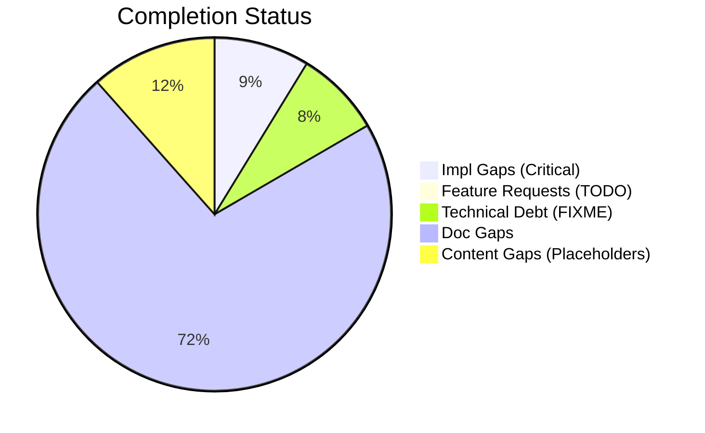
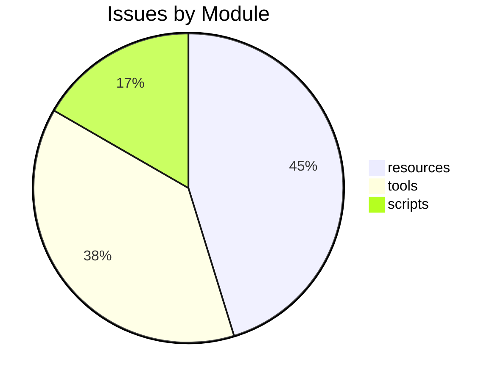

# Completist Report: 2026-03-29

## Executive Summary
- **Critical Gaps**: 62
- **Feature Gaps (TODO)**: 0
- **Content Gaps (Placeholders)**: 82
- **Technical Debt**: 56
- **Documentation Gaps**: 510

## Visualization
### Status Overview

### Top Impacted Modules

## Critical Incomplete (Top 50)
| File | Line | Type | Impact | Coverage | Complexity |
|---|---|---|---|---|---|
| `resources/resources-videos.qmd` | 202 | Placeholder | 5 | 2 | 4 |
| `resources/resources-videos.qmd` | 203 | Placeholder | 5 | 2 | 4 |
| `resources/resources-videos.qmd` | 204 | Placeholder | 5 | 2 | 4 |
| `resources/resources-videos.qmd` | 208 | Placeholder | 5 | 2 | 4 |
| `resources/resources-videos.qmd` | 344 | Placeholder | 5 | 2 | 4 |
| `resources/resources-videos.qmd` | 345 | Placeholder | 5 | 2 | 4 |
| `resources/resources-videos.qmd` | 346 | Placeholder | 5 | 2 | 4 |
| `resources/resources-videos.qmd` | 350 | Placeholder | 5 | 2 | 4 |
| `resources/resources-researchers.qmd` | 40 | Placeholder | 5 | 2 | 4 |
| `resources/resources-researchers.qmd` | 72 | Placeholder | 5 | 2 | 4 |
| `resources/resources-researchers.qmd` | 125 | Placeholder | 5 | 2 | 4 |
| `resources/resources-researchers.qmd` | 157 | Placeholder | 5 | 2 | 4 |
| `resources/resources-researchers.qmd` | 189 | Placeholder | 5 | 2 | 4 |
| `resources/resources-researchers.qmd` | 214 | Placeholder | 5 | 2 | 4 |
| `resources/resources-researchers.qmd` | 239 | Placeholder | 5 | 2 | 4 |
| `resources/resources-researchers.qmd` | 271 | Placeholder | 5 | 2 | 4 |
| `resources/resources-researchers.qmd` | 303 | Placeholder | 5 | 2 | 4 |
| `resources/resources-researchers.qmd` | 328 | Placeholder | 5 | 2 | 4 |
| `articles/rotation-converter.qmd` | 732 | Placeholder | 5 | 2 | 4 |
| `articles/rotation-converter.qmd` | 736 | Placeholder | 5 | 2 | 4 |
| `scripts/generate_completist_data.py` | 207 | Stub | 1 | 2 | 4 |
| `scripts/generate_completist_data.py` | 250 | Stub | 1 | 2 | 4 |
| `scripts/generate_completist_data.py` | 312 | Stub | 1 | 2 | 4 |
| `scripts/assess_repo.py` | 153 | Stub | 1 | 2 | 4 |

## Content Gaps (Website Specific)
| File | Line | Content |
|---|---|---|
| `scripts/generate_completist_data.py` | 208 | """Scan files for placeholder content.""" |
| `scripts/generate_completist_data.py` | 251 | """Scan Python files for stub/placeholder functions.""" |
| `scripts/generate_completist_data.py` | 256 | re.compile(r"return\s+None\s*#.*stub\|placeholder", re.IGNORECASE), |
| `scripts/check_bibliography_quality.py` | 6 | - No 'et al.' placeholder author entries |
| `resources/resources-videos.qmd` | 204 | <svg xmlns="http://www.w3.org/2000/svg" width="64" height="64" viewBox="0 0 24 24" fill="none" strok |
| `resources/resources-videos.qmd` | 346 | <svg xmlns="http://www.w3.org/2000/svg" width="64" height="64" viewBox="0 0 24 24" fill="none" strok |
| `resources/resources-researchers.qmd` | 72 |  |
| `resources/resources-researchers.qmd` | 271 |  |
| `resources/resources-researchers.qmd` | 303 |  |
| `resources/resources-researchers.qmd` | 328 |  |
| `articles/inverse-dynamics-bibliography.md` | 104 | # Note: Placeholder for a review if specific one exists, otherwise rely on Tutelman |
| `articles/rotation-converter.qmd` | 732 | // Screw axis placeholder |
| `articles/rotation-converter.qmd` | 736 | // Arc placeholder |
| `src/affine_control/ddp.py` | 112 | # Initial Forward pass (Placeholder) |
| `src/affine_control/ddp.py` | 126 | # Simulate on new grid (placeholder for full DDP backward/forward pass) |

## Feature Gap Matrix
| Module | Feature Gap | Type |
|---|---|---|

## Technical Debt Register
| File | Line | Issue | Type |
|---|---|---|---|
| `config/tech_debt_budget.json` | 26 | "HACK": 8, | HACK |
| `config/tech_debt_budget.json` | 27 | "XXX": 10 | XXX |
| `scripts/generate_completist_data.py` | 202 | markers = ["TOD" + "O", "FIX" + "ME", "XXX", "HACK", "TEMP"] | XXX |
| `scripts/check_tech_debt_budget.py` | 17 | MARKERS = ("TRACKED_TASK", "TRACKED_DEFECT", "HACK", "XXX") | XXX |
| `scripts/check_tech_debt_budget.py` | 18 | MARKER_RE = re.compile(r"\b(TRACKED_TASK\|TRACKED_DEFECT\|HACK\|XXX)\b", re.IGNORECASE) | XXX |

## Recommended Implementation Order
Prioritized by Impact (High) and Complexity (Low).
| Priority | File | Issue | Metrics (I/C/C) |
|---|---|---|---|
| 14 | `resources/resources-videos.qmd` | <svg xmlns="http://www.w3.org/2000/svg" width="64" height="64" viewBox="0 0 24 2 | 5/2/4 |
| 18 | `resources/resources-videos.qmd` | <svg xmlns="http://www.w3.org/2000/svg" width="64" height="64" viewBox="0 0 24 2 | 5/2/4 |

## Issues Created
- Created `docs/assessments/issues/Issue_2027_Incomplete_Placeholder_in_resources_papers_qmd_65.md`
- Created `docs/assessments/issues/Issue_2028_Incomplete_Placeholder_in_resources_researchers_qmd_214.md`
- Created `docs/assessments/issues/Issue_2029_Incomplete_Placeholder_in_resources_researchers_qmd_271.md`
- Created `docs/assessments/issues/Issue_2030_Incomplete_Placeholder_in_resources_researchers_qmd_303.md`
- Created `docs/assessments/issues/Issue_2031_Incomplete_Placeholder_in_resources_researchers_qmd_328.md`
- Created `docs/assessments/issues/Issue_2032_Incomplete_Placeholder_in_book_reviews_qmd_26.md`
- Created `docs/assessments/issues/Issue_2033_Incomplete_Placeholder_in_book_reviews_qmd_32.md`
- Created `docs/assessments/issues/Issue_2034_Incomplete_Placeholder_in_research_review_interaction_forces_qmd_73.md`
- Created `docs/assessments/issues/Issue_2035_Incomplete_Placeholder_in_resources_software_qmd_39.md`
- Created `docs/assessments/issues/Issue_2036_Incomplete_Placeholder_in_resources_software_qmd_126.md`
- Created `docs/assessments/issues/Issue_2051_Incomplete_Placeholder_in_rotation_converter_qmd_732.md`
- Created `docs/assessments/issues/Issue_2052_Incomplete_Placeholder_in_rotation_converter_qmd_736.md`
