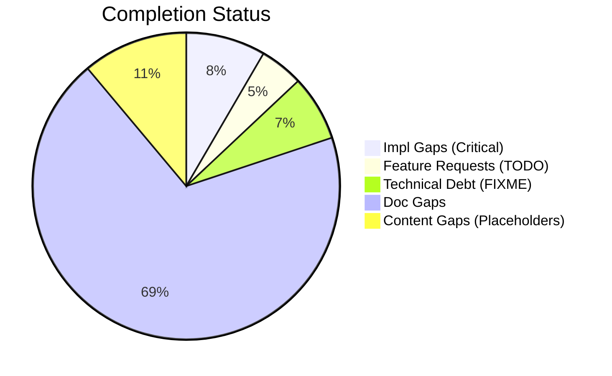
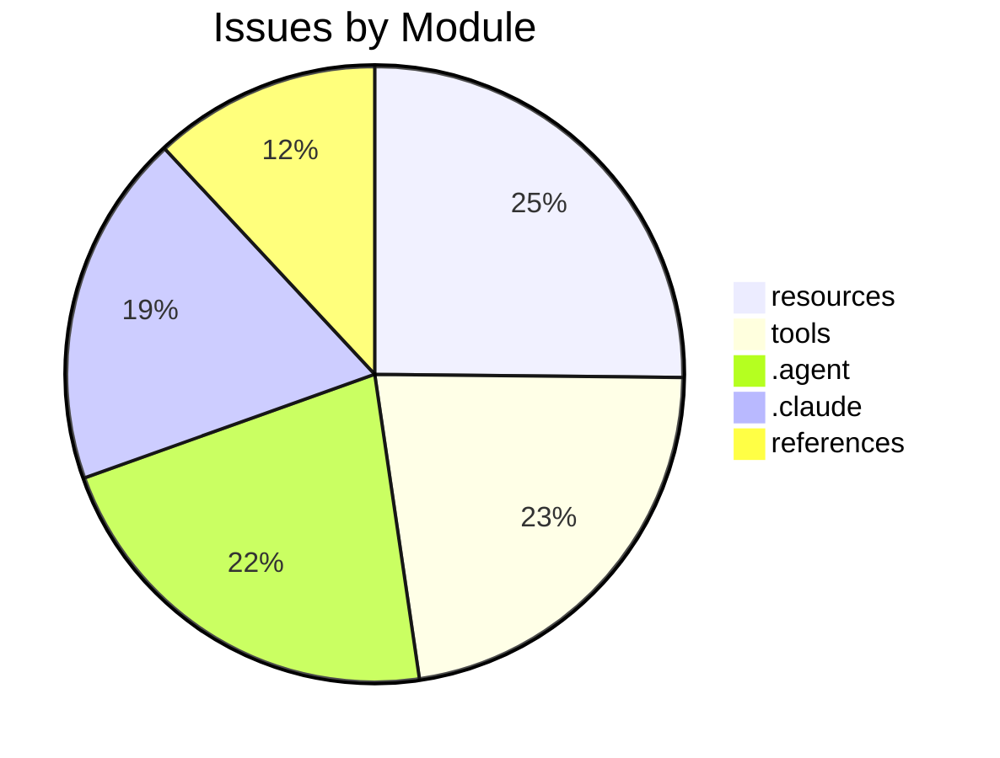

# Completist Report: 2026-03-23

## Executive Summary
- **Critical Gaps**: 62
- **Feature Gaps (TODO)**: 34
- **Content Gaps (Placeholders)**: 82
- **Technical Debt**: 51
- **Documentation Gaps**: 510

## Visualization
### Status Overview

### Top Impacted Modules

## Critical Incomplete (Top 50)
| File | Line | Type | Impact | Coverage | Complexity |
|---|---|---|---|---|---|
| `script.js` | 1716 | Placeholder | 5 | 2 | 4 |
| `script.js` | 1717 | Placeholder | 5 | 2 | 4 |
| `script.js` | 1718 | Placeholder | 5 | 2 | 4 |
| `styles.css` | 316 | Placeholder | 5 | 2 | 4 |
| `styles.css` | 2624 | Placeholder | 5 | 2 | 4 |
| `css/search-metrics.css` | 432 | Placeholder | 5 | 2 | 4 |
| `css/startup-launcher.css` | 384 | Placeholder | 5 | 2 | 4 |
| `js/accessibility.js` | 157 | Placeholder | 5 | 2 | 4 |
| `js/accessibility.js` | 158 | Placeholder | 5 | 2 | 4 |
| `js/accessibility.js` | 159 | Placeholder | 5 | 2 | 4 |
| `js/notes-workspace.js` | 136 | Placeholder | 5 | 2 | 4 |
| `resources/resources-videos.qmd` | 202 | Placeholder | 5 | 2 | 4 |
| `resources/resources-videos.qmd` | 203 | Placeholder | 5 | 2 | 4 |
| `resources/resources-videos.qmd` | 204 | Placeholder | 5 | 2 | 4 |
| `resources/resources-videos.qmd` | 208 | Placeholder | 5 | 2 | 4 |
| `resources/resources-videos.qmd` | 344 | Placeholder | 5 | 2 | 4 |
| `resources/resources-videos.qmd` | 345 | Placeholder | 5 | 2 | 4 |
| `resources/resources-videos.qmd` | 346 | Placeholder | 5 | 2 | 4 |
| `resources/resources-videos.qmd` | 350 | Placeholder | 5 | 2 | 4 |
| `resources/bibliography.qmd` | 38 | Placeholder | 5 | 2 | 4 |
| `resources/resources-researchers.qmd` | 40 | Placeholder | 5 | 2 | 4 |
| `resources/resources-researchers.qmd` | 72 | Placeholder | 5 | 2 | 4 |
| `resources/resources-researchers.qmd` | 125 | Placeholder | 5 | 2 | 4 |
| `resources/resources-researchers.qmd` | 157 | Placeholder | 5 | 2 | 4 |
| `resources/resources-researchers.qmd` | 189 | Placeholder | 5 | 2 | 4 |
| `resources/resources-researchers.qmd` | 214 | Placeholder | 5 | 2 | 4 |
| `resources/resources-researchers.qmd` | 239 | Placeholder | 5 | 2 | 4 |
| `resources/resources-researchers.qmd` | 271 | Placeholder | 5 | 2 | 4 |
| `resources/resources-researchers.qmd` | 303 | Placeholder | 5 | 2 | 4 |
| `resources/resources-researchers.qmd` | 328 | Placeholder | 5 | 2 | 4 |
| `articles/rotation-converter.qmd` | 732 | Placeholder | 5 | 2 | 4 |
| `articles/rotation-converter.qmd` | 736 | Placeholder | 5 | 2 | 4 |
| `src/tools/wrist_universal_joint/grip_angle_simulator.html` | 443 | Placeholder | 5 | 2 | 4 |
| `src/tools/fix_html_validation.py` | 168 | Stub | 3 | 2 | 4 |
| `src/tools/publish_manual_article.py` | 101 | Stub | 3 | 2 | 4 |
| `src/tools/wrap_sidebars.py` | 33 | Stub | 3 | 2 | 4 |
| `src/tools/latex_to_html.py` | 191 | Stub | 3 | 2 | 4 |
| `src/tools/utils/latex_utils.py` | 54 | Stub | 3 | 2 | 4 |
| `src/tools/utils/latex_utils.py` | 58 | Stub | 3 | 2 | 4 |
| `src/tools/utils/analysis_utils.py` | 91 | Stub | 3 | 2 | 4 |
| `src/tools/utils/analysis_utils.py` | 163 | Stub | 3 | 2 | 4 |
| `src/tools/code_quality/pattern_checker.py` | 123 | Stub | 3 | 2 | 4 |
| `src/tools/matlab_utilities/scripts/line_checks.py` | 93 | Stub | 3 | 2 | 4 |
| `src/tools/code_quality/pattern_checker.py` | 21 | NotImplementedError | 3 | 2 | 4 |
| `src/tools/code_quality/pattern_checker.py` | 147 | NotImplementedError | 3 | 2 | 4 |
| `src/tools/code_quality/pattern_checker.py` | 148 | NotImplementedError | 3 | 2 | 4 |
| `scripts/generate_completist_data.py` | 207 | Stub | 1 | 2 | 4 |
| `scripts/generate_completist_data.py` | 250 | Stub | 1 | 2 | 4 |
| `scripts/generate_completist_data.py` | 312 | Stub | 1 | 2 | 4 |
| `scripts/assess_repo.py` | 153 | Stub | 1 | 2 | 4 |

## Content Gaps (Website Specific)
| File | Line | Content |
|---|---|---|
| `custom.scss` | 156 | /* YouTube Embed Placeholder Styles */ |
| `custom.scss` | 157 | .youtube-placeholder { |
| `custom.scss` | 165 | .youtube-placeholder-content { |
| `custom.scss` | 171 | .youtube-placeholder-icon { |
| `custom.scss` | 176 | .youtube-placeholder-title { |
| `script.js` | 1716 | const placeholder = input.getAttribute('placeholder'); |
| `script.js` | 1717 | if (placeholder) { |
| `script.js` | 1718 | input.setAttribute('aria-label', placeholder); |
| `styles.css` | 316 | /* Lazy loading placeholder */ |
| `styles.css` | 2624 | Placeholder Content Styling (Issue #869) |
| `css/search-metrics.css` | 432 | Lazy Loading Placeholder |
| `css/startup-launcher.css` | 384 | /* Skeleton placeholder styles */ |
| `js/accessibility.js` | 157 | const placeholder = input.getAttribute("placeholder"); |
| `js/accessibility.js` | 158 | if (placeholder) { |
| `js/accessibility.js` | 159 | input.setAttribute("aria-label", placeholder); |
| `js/notes-workspace.js` | 136 | <textarea id="ad-notes-workspace-area" class="ad-notes-area" placeholder="Capture research notes, id |
| `scripts/generate_completist_data.py` | 208 | """Scan files for placeholder content.""" |
| `scripts/generate_completist_data.py` | 251 | """Scan Python files for stub/placeholder functions.""" |
| `scripts/generate_completist_data.py` | 256 | re.compile(r"return\s+None\s*#.*stub\|placeholder", re.IGNORECASE), |
| `scripts/check_bibliography_quality.py` | 6 | - No 'et al.' placeholder author entries |
| `resources/resources-videos.qmd` | 202 | 
 |
| `resources/resources-videos.qmd` | 203 | 
 |
| `resources/resources-videos.qmd` | 204 | <svg xmlns="http://www.w3.org/2000/svg" width="64" height="64" viewBox="0 0 24 24" fill="none" strok |
| `resources/resources-videos.qmd` | 208 | 
A. Sala Control Channel
 |
| `resources/resources-videos.qmd` | 344 | 
 |
| `resources/resources-videos.qmd` | 345 | 
 |
| `resources/resources-videos.qmd` | 346 | <svg xmlns="http://www.w3.org/2000/svg" width="64" height="64" viewBox="0 0 24 24" fill="none" strok |
| `resources/resources-videos.qmd` | 350 | 
Biomechanics of Movement
 |
| `resources/bibliography.qmd` | 38 | <input type="text" id="bib-search" placeholder="Search references by title, author, or concept..." s |
| `resources/resources-researchers.qmd` | 40 |  |
| `resources/resources-researchers.qmd` | 239 |  |
| `resources/resources-researchers.qmd` | 303 |  |
| `resources/resources-researchers.qmd` | 328 |  |
| `tests/test_check_links.py` | 30 | """External or placeholder links should be ignored.""" |
| `tests/test_matlab_quality_check_refactor.py` | 20 | "% <PLACEHOLDER>", |
| `tests/test_matlab_quality_check_refactor.py` | 42 | assert any("Angle bracket placeholder found" in issue for issue in issues) |
| `tests/test_assess_repo.py` | 73 | return None  # noqa: placeholder for test fixture |
| `articles/inverse-dynamics-bibliography.md` | 104 | # Note: Placeholder for a review if specific one exists, otherwise rely on Tutelman |
| `articles/rotation-converter.qmd` | 732 | // Screw axis placeholder |
| `articles/rotation-converter.qmd` | 736 | // Arc placeholder |
| `.hypothesis/constants/a6f6d219d65e194c` | 4 | ['#', '(?<![0-9])3\\.141', ':', 'Empty pass statement', 'GRAVITY_M_S2\\s*=\\s*', 'NotImplementedErro |
| `src/affine_control/ddp.py` | 79 | This skeleton serves as a placeholder for the algorithm structure. |
| `src/affine_control/ddp.py` | 112 | # Initial Forward pass (Placeholder) |
| `src/affine_control/ddp.py` | 126 | # Simulate on new grid (placeholder for full DDP backward/forward pass) |

## Feature Gap Matrix
| Module | Feature Gap | Type |
|---|---|---|
| `AGENTS.md` | - ❌ **DO NOT** leave `TODO`/`FIXME` markers for more than one sprint. | TODO |
| `AGENTS.md` | - **Read:** Codebase for TODO, FIXME, NotImplementedError, pass statements | TODO |
| `service-worker.js` | // TODO #1459: Replace hardcoded version with content-hash cache busting via build pipeline | TODO |
| `config/tech_debt_budget.json` | "TODO": 20, | TODO |
| `references/chicago-author-date.csl` | <!-- TODO: Replace with `part-number` label when CSL provides one --> | TODO |
| `references/chicago-author-date.csl` | <!-- TODO: Replace with `part-number` label when CSL provides one --> | TODO |
| `references/chicago-author-date.csl` | <!-- TODO: Replace with `supplement-number` label when CSL provides one --> | TODO |
| `references/chicago-author-date.csl` | <!-- TODO: remove when Zotero fixes mapping of performer to `author` --> | TODO |
| `references/chicago-author-date.csl` | <!-- TODO: remove conditional when Zotero stops double-mapping `event-place` and `publisher-place` - | TODO |
| `references/chicago-author-date.csl` | <!-- TODO: use `container-genre` here once available to allow a custom description of the journal vo | TODO |
| `references/chicago-author-date.csl` | <!-- TODO: If CSL adds `date-part` detection, add two further conditions to address CMOS18 14.74: de | TODO |
| `references/chicago-author-date.csl` | <!-- TODO: when CSL provides date part detection, volume should be lowercase if there is a month, bu | TODO |
| `references/chicago-author-date.csl` | <!-- TODO: use CSL term for `available-date` when available --> | TODO |
| `references/chicago-author-date.csl` | <!-- TODO: To prevent Zotero from printing `event-place`, due to its double-mapping of `publisher-pl | TODO |
| `references/chicago-author-date.csl` | <!-- TODO: We expect `event-title` to be used, but processors and applications may not be updated ye | TODO |
| `references/chicago-author-date.csl` | <!-- TODO: We expect `event-title` to be used, but processors and applications may not be updated ye | TODO |
| `references/chicago-author-date.csl` | <!-- TODO: `DOI` or `URL` detection is the only way to distinguish radio/TV from podcasts, but it is | TODO |
| `references/chicago-author-date.csl` | <!-- TODO: remove conditional when Zotero fixes double-mapping of `event-place` --> | TODO |
| `references/chicago-author-date.csl` | <!-- TODO: Is there a better CSL variable for a date of a multivolume work (CMOS18 14.21)? --> | TODO |
| `references/chicago-author-date.csl` | <!-- TODO: remove this conditional when `page` parsing is fixed for different locator types --> | TODO |
| `references/chicago-author-date.csl` | <!-- TODO: add variables for distributor and exhibitions if available in CSL --> | TODO |
| `references/chicago-author-date.csl` | <!-- TODO: Add `proposed` date here if that becomes available --> | TODO |
| `scripts/generate_completist_data.py` | """Scan files for completion markers (TODO, FIXME, etc).""" | TODO |
| `scripts/check_tech_debt_budget.py` | MARKERS = ("TODO", "FIXME", "HACK", "XXX") | TODO |
| `scripts/check_tech_debt_budget.py` | MARKER_RE = re.compile(r"\b(TODO\|FIXME\|HACK\|XXX)\b", re.IGNORECASE) | TODO |
| `src/tools/code_quality/pattern_checker.py` | (re.compile(r"\bTODO\b"), "TODO placeholder found"), | TODO |
| `.agent/workflows/lint.md` | description: Run linting tools (ruff, black, mypy) and fix placeholder/TODO statements | TODO |
| `.agent/workflows/lint.md` | grep -rn "TODO\\|FIXME\\|XXX\\|HACK\\|NotImplementedError\\|pass$" --include="*.py" . | TODO |
| `.agent/skills/lint/SKILL.md` | description: Run linting tools (ruff, black, mypy) and fix placeholder/TODO statements | TODO |
| `.agent/skills/lint/SKILL.md` | - Search for `TODO`, `FIXME`, `XXX`, `HACK` comments | TODO |
| `.agent/skills/lint/SKILL.md` | grep -rn "TODO\\|FIXME\\|XXX\\|HACK\\|NotImplementedError\\|pass$" --include="*.py" . | TODO |
| `.claude/skills/lint/SKILL.md` | description: Run linting tools (ruff, black, mypy) and fix placeholder/TODO statements | TODO |
| `.claude/skills/lint/SKILL.md` | - Search for `TODO`, `FIXME`, `XXX`, `HACK` comments | TODO |
| `.claude/skills/lint/SKILL.md` | grep -rn "TODO\\|FIXME\\|XXX\\|HACK\\|NotImplementedError\\|pass$" --include="*.py" . | TODO |

## Technical Debt Register
| File | Line | Issue | Type |
|---|---|---|---|
| `config/tech_debt_budget.json` | 25 | "TRACKED_DEFECT": 13, | TRACKED_DEFECT |
| `config/tech_debt_budget.json` | 26 | "HACK": 8, | HACK |
| `config/tech_debt_budget.json` | 27 | "XXX": 10 | XXX |
| `scripts/generate_completist_data.py` | 202 | markers = ["TOD" + "O", "FIX" + "ME", "XXX", "HACK", "TEMP"] | XXX |
| `.hypothesis/constants/c893c2aeb23dac40` | 4 | [b'\x00', 1024, '  %s: %d', '"""', '%s', "'''", ')\\b', '*', '--output-dir', '--repo-root', '--verbo | XXX |
| `src/tools/code_quality/pattern_checker.py` | 19 | (re.compile(r"\bFIXME\b"), "FIXME placeholder found"), | FIXME |
| `.agent/workflows/issues-5-combined.md` | 44 | Closes #XXX, closes #XXX, closes #XXX, closes #XXX, closes #XXX | XXX |
| `.agent/skills/update-issues/SKILL.md` | 132 | \| #XXX \| Title \| High \| assessment.md \| | XXX |
| `.agent/skills/update-issues/SKILL.md` | 137 | \| #XXX \| Title \| Fixed in commit abc123 \| | XXX |
| `.agent/skills/update-issues/SKILL.md` | 142 | \| Description \| #XXX \| | XXX |
| `.agent/skills/issues-10-sequential/SKILL.md` | 96 | \| 1 \| #XXX - Title \| #YYY \| Merged \| | XXX |
| `.agent/skills/issues-10-sequential/SKILL.md` | 97 | \| 2 \| #XXX - Title \| #YYY \| Merged \| | XXX |
| `.agent/skills/issues-5-combined/SKILL.md` | 63 | - #XXX: <brief description> | XXX |
| `.agent/skills/issues-5-combined/SKILL.md` | 64 | - #XXX: <brief description> | XXX |
| `.agent/skills/issues-5-combined/SKILL.md` | 65 | - #XXX: <brief description> | XXX |
| `.agent/skills/issues-5-combined/SKILL.md` | 66 | - #XXX: <brief description> | XXX |
| `.agent/skills/issues-5-combined/SKILL.md` | 67 | - #XXX: <brief description> | XXX |
| `.agent/skills/issues-5-combined/SKILL.md` | 69 | Closes #XXX, closes #XXX, closes #XXX, closes #XXX, closes #XXX | XXX |
| `.agent/skills/issues-5-combined/SKILL.md` | 84 | \| #XXX \| Title \| Brief fix description \| | XXX |
| `.agent/skills/issues-5-combined/SKILL.md` | 85 | \| #XXX \| Title \| Brief fix description \| | XXX |
| `.agent/skills/issues-5-combined/SKILL.md` | 86 | \| #XXX \| Title \| Brief fix description \| | XXX |
| `.agent/skills/issues-5-combined/SKILL.md` | 87 | \| #XXX \| Title \| Brief fix description \| | XXX |
| `.agent/skills/issues-5-combined/SKILL.md` | 88 | \| #XXX \| Title \| Brief fix description \| | XXX |
| `.agent/skills/issues-5-combined/SKILL.md` | 95 | Closes #XXX, closes #XXX, closes #XXX, closes #XXX, closes #XXX" | XXX |
| `.agent/skills/issues-5-combined/SKILL.md` | 140 | \| #XXX \| Title \| Fixed \| | XXX |
| `.agent/skills/issues-5-combined/SKILL.md` | 141 | \| #XXX \| Title \| Fixed \| | XXX |
| `.agent/skills/issues-5-combined/SKILL.md` | 142 | \| #XXX \| Title \| Fixed \| | XXX |
| `.agent/skills/issues-5-combined/SKILL.md` | 143 | \| #XXX \| Title \| Fixed \| | XXX |
| `.agent/skills/issues-5-combined/SKILL.md` | 144 | \| #XXX \| Title \| Fixed \| | XXX |
| `.claude/skills/update-issues/SKILL.md` | 132 | \| #XXX \| Title \| High \| assessment.md \| | XXX |
| `.claude/skills/update-issues/SKILL.md` | 137 | \| #XXX \| Title \| Fixed in commit abc123 \| | XXX |
| `.claude/skills/update-issues/SKILL.md` | 142 | \| Description \| #XXX \| | XXX |
| `.claude/skills/issues-10-sequential/SKILL.md` | 96 | \| 1 \| #XXX - Title \| #YYY \| Merged \| | XXX |
| `.claude/skills/issues-10-sequential/SKILL.md` | 97 | \| 2 \| #XXX - Title \| #YYY \| Merged \| | XXX |
| `.claude/skills/issues-5-combined/SKILL.md` | 63 | - #XXX: <brief description> | XXX |
| `.claude/skills/issues-5-combined/SKILL.md` | 64 | - #XXX: <brief description> | XXX |
| `.claude/skills/issues-5-combined/SKILL.md` | 65 | - #XXX: <brief description> | XXX |
| `.claude/skills/issues-5-combined/SKILL.md` | 66 | - #XXX: <brief description> | XXX |
| `.claude/skills/issues-5-combined/SKILL.md` | 67 | - #XXX: <brief description> | XXX |
| `.claude/skills/issues-5-combined/SKILL.md` | 69 | Closes #XXX, closes #XXX, closes #XXX, closes #XXX, closes #XXX | XXX |
| `.claude/skills/issues-5-combined/SKILL.md` | 84 | \| #XXX \| Title \| Brief fix description \| | XXX |
| `.claude/skills/issues-5-combined/SKILL.md` | 85 | \| #XXX \| Title \| Brief fix description \| | XXX |
| `.claude/skills/issues-5-combined/SKILL.md` | 86 | \| #XXX \| Title \| Brief fix description \| | XXX |
| `.claude/skills/issues-5-combined/SKILL.md` | 87 | \| #XXX \| Title \| Brief fix description \| | XXX |
| `.claude/skills/issues-5-combined/SKILL.md` | 88 | \| #XXX \| Title \| Brief fix description \| | XXX |
| `.claude/skills/issues-5-combined/SKILL.md` | 95 | Closes #XXX, closes #XXX, closes #XXX, closes #XXX, closes #XXX" | XXX |
| `.claude/skills/issues-5-combined/SKILL.md` | 140 | \| #XXX \| Title \| Fixed \| | XXX |
| `.claude/skills/issues-5-combined/SKILL.md` | 141 | \| #XXX \| Title \| Fixed \| | XXX |
| `.claude/skills/issues-5-combined/SKILL.md` | 142 | \| #XXX \| Title \| Fixed \| | XXX |
| `.claude/skills/issues-5-combined/SKILL.md` | 143 | \| #XXX \| Title \| Fixed \| | XXX |
| `.claude/skills/issues-5-combined/SKILL.md` | 144 | \| #XXX \| Title \| Fixed \| | XXX |

## Recommended Implementation Order
Prioritized by Impact (High) and Complexity (Low).
| Priority | File | Issue | Metrics (I/C/C) |
|---|---|---|---|
| 1 | `script.js` | const placeholder = input.getAttribute('placeholder'); | 5/2/4 |
| 2 | `script.js` | if (placeholder) { | 5/2/4 |
| 3 | `script.js` | input.setAttribute('aria-label', placeholder); | 5/2/4 |
| 4 | `styles.css` | /* Lazy loading placeholder */ | 5/2/4 |
| 5 | `styles.css` | Placeholder Content Styling (Issue #869) | 5/2/4 |
| 6 | `css/search-metrics.css` | Lazy Loading Placeholder | 5/2/4 |
| 7 | `css/startup-launcher.css` | /* Skeleton placeholder styles */ | 5/2/4 |
| 8 | `js/accessibility.js` | const placeholder = input.getAttribute("placeholder"); | 5/2/4 |
| 9 | `js/accessibility.js` | if (placeholder) { | 5/2/4 |
| 10 | `js/accessibility.js` | input.setAttribute("aria-label", placeholder); | 5/2/4 |
| 11 | `js/notes-workspace.js` | <textarea id="ad-notes-workspace-area" class="ad-notes-area" placeholder="Captur | 5/2/4 |
| 12 | `resources/resources-videos.qmd` | 
 | 5/2/4 |
| 13 | `resources/resources-videos.qmd` | 
 | 5/2/4 |
| 14 | `resources/resources-videos.qmd` | <svg xmlns="http://www.w3.org/2000/svg" width="64" height="64" viewBox="0 0 24 2 | 5/2/4 |
| 15 | `resources/resources-videos.qmd` | 
A. Sala Control Channel
 | 5/2/4 |
| 16 | `resources/resources-videos.qmd` | 
 | 5/2/4 |
| 17 | `resources/resources-videos.qmd` | 
 | 5/2/4 |
| 18 | `resources/resources-videos.qmd` | <svg xmlns="http://www.w3.org/2000/svg" width="64" height="64" viewBox="0 0 24 2 | 5/2/4 |
| 19 | `resources/resources-videos.qmd` | 
Biomechanics of Movement
 | 5/2/4 |
| 20 | `resources/bibliography.qmd` | <input type="text" id="bib-search" placeholder="Search references by title, auth | 5/2/4 |

## Issues Created
- Created `docs/assessments/issues/Issue_2037_Incomplete_Placeholder_in_script_js_1716.md`
- Created `docs/assessments/issues/Issue_2038_Incomplete_Placeholder_in_script_js_1717.md`
- Created `docs/assessments/issues/Issue_2039_Incomplete_Placeholder_in_script_js_1718.md`
- Created `docs/assessments/issues/Issue_2040_Incomplete_Placeholder_in_styles_css_316.md`
- Created `docs/assessments/issues/Issue_2041_Incomplete_Placeholder_in_styles_css_2624.md`
- Created `docs/assessments/issues/Issue_2042_Incomplete_Placeholder_in_search_metrics_css_432.md`
- Created `docs/assessments/issues/Issue_2043_Incomplete_Placeholder_in_startup_launcher_css_384.md`
- Created `docs/assessments/issues/Issue_2044_Incomplete_Placeholder_in_accessibility_js_157.md`
- Created `docs/assessments/issues/Issue_2045_Incomplete_Placeholder_in_accessibility_js_158.md`
- Created `docs/assessments/issues/Issue_2046_Incomplete_Placeholder_in_accessibility_js_159.md`