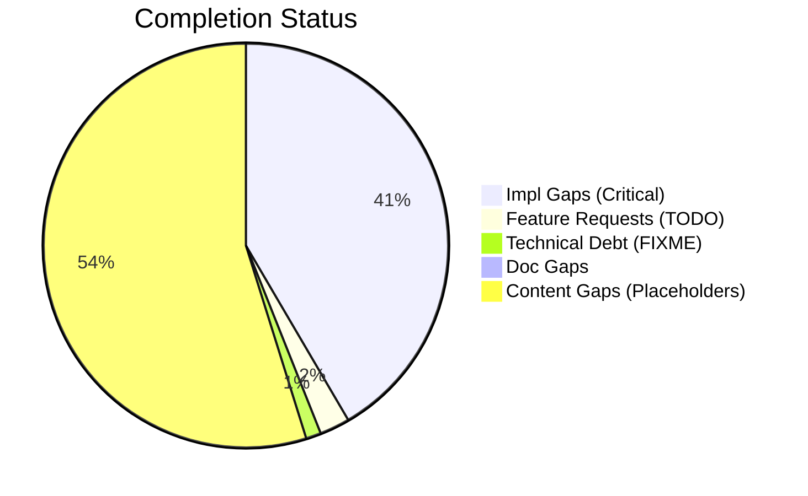
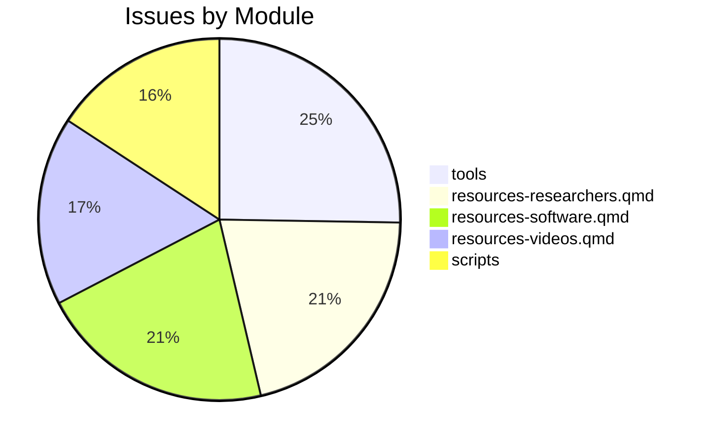

# Completist Report: 2026-02-15

## Executive Summary
- **Critical Gaps**: 69
- **Feature Gaps (TODO)**: 4
- **Content Gaps (Placeholders)**: 91
- **Technical Debt**: 2
- **Documentation Gaps**: 1

## Visualization
### Status Overview

### Top Impacted Modules

## Critical Incomplete (Top 50)
| File | Line | Type | Impact | Coverage | Complexity |
|---|---|---|---|---|---|
| `styles.css` | 310 | Placeholder | 5 | 2 | 4 |
| `styles.css` | 3318 | Placeholder | 5 | 2 | 4 |
| `resources-papers.qmd` | 65 | Placeholder | 5 | 2 | 4 |
| `resources-researchers.qmd` | 40 | Placeholder | 5 | 2 | 4 |
| `resources-researchers.qmd` | 72 | Placeholder | 5 | 2 | 4 |
| `resources-researchers.qmd` | 125 | Placeholder | 5 | 2 | 4 |
| `resources-researchers.qmd` | 157 | Placeholder | 5 | 2 | 4 |
| `resources-researchers.qmd` | 189 | Placeholder | 5 | 2 | 4 |
| `resources-researchers.qmd` | 214 | Placeholder | 5 | 2 | 4 |
| `resources-researchers.qmd` | 239 | Placeholder | 5 | 2 | 4 |
| `resources-researchers.qmd` | 271 | Placeholder | 5 | 2 | 4 |
| `resources-researchers.qmd` | 303 | Placeholder | 5 | 2 | 4 |
| `resources-researchers.qmd` | 328 | Placeholder | 5 | 2 | 4 |
| `book-reviews.qmd` | 26 | Placeholder | 5 | 2 | 4 |
| `book-reviews.qmd` | 32 | Placeholder | 5 | 2 | 4 |
| `research-review-interaction-forces.qmd` | 73 | Placeholder | 5 | 2 | 4 |
| `resources-videos.qmd` | 202 | Placeholder | 5 | 2 | 4 |
| `resources-videos.qmd` | 203 | Placeholder | 5 | 2 | 4 |
| `resources-videos.qmd` | 204 | Placeholder | 5 | 2 | 4 |
| `resources-videos.qmd` | 208 | Placeholder | 5 | 2 | 4 |
| `resources-videos.qmd` | 344 | Placeholder | 5 | 2 | 4 |
| `resources-videos.qmd` | 345 | Placeholder | 5 | 2 | 4 |
| `resources-videos.qmd` | 346 | Placeholder | 5 | 2 | 4 |
| `resources-videos.qmd` | 350 | Placeholder | 5 | 2 | 4 |
| `script.js` | 1716 | Placeholder | 5 | 2 | 4 |
| `script.js` | 1717 | Placeholder | 5 | 2 | 4 |
| `script.js` | 1718 | Placeholder | 5 | 2 | 4 |
| `resources-software.qmd` | 39 | Placeholder | 5 | 2 | 4 |
| `resources-software.qmd` | 62 | Placeholder | 5 | 2 | 4 |
| `resources-software.qmd` | 82 | Placeholder | 5 | 2 | 4 |
| `resources-software.qmd` | 126 | Placeholder | 5 | 2 | 4 |
| `resources-software.qmd` | 154 | Placeholder | 5 | 2 | 4 |
| `resources-software.qmd` | 183 | Placeholder | 5 | 2 | 4 |
| `resources-software.qmd` | 210 | Placeholder | 5 | 2 | 4 |
| `resources-software.qmd` | 230 | Placeholder | 5 | 2 | 4 |
| `resources-software.qmd` | 250 | Placeholder | 5 | 2 | 4 |
| `resources-software.qmd` | 270 | Placeholder | 5 | 2 | 4 |
| `bibliography.qmd` | 38 | Placeholder | 5 | 2 | 4 |
| `js/accessibility.js` | 157 | Placeholder | 5 | 2 | 4 |
| `js/accessibility.js` | 158 | Placeholder | 5 | 2 | 4 |
| `js/accessibility.js` | 159 | Placeholder | 5 | 2 | 4 |
| `css/layout.css` | 170 | Placeholder | 5 | 2 | 4 |
| `css/mobile.css` | 161 | Placeholder | 5 | 2 | 4 |
| `css/startup-launcher.css` | 384 | Placeholder | 5 | 2 | 4 |
| `css/search-metrics.css` | 432 | Placeholder | 5 | 2 | 4 |
| `src/js/seo-enhancements.js` | 100 | Placeholder | 5 | 2 | 4 |
| `src/js/global-search.js` | 170 | Placeholder | 5 | 2 | 4 |
| `src/css/startup-launcher.css` | 384 | Placeholder | 5 | 2 | 4 |
| `src/css/search-metrics.css` | 432 | Placeholder | 5 | 2 | 4 |
| `src/tools/wrist_universal_joint/grip_angle_simulator.html` | 443 | Placeholder | 5 | 2 | 4 |

## Content Gaps (Website Specific)
| File | Line | Content |
|---|---|---|
| `styles.css` | 310 | /* Lazy loading placeholder */ |
| `styles.css` | 3318 | Placeholder Content Styling (Issue #869) |
| `resources-papers.qmd` | 65 | Note: Detailed review of Carol Putnam's work on interaction forces and proximal-to-distal sequencing |
| `resources-researchers.qmd` | 40 |  |
| `resources-researchers.qmd` | 239 |  |
| `resources-researchers.qmd` | 303 |  |
| `resources-researchers.qmd` | 328 |  |
| `book-reviews.qmd` | 26 | <li>Book recommendations coming soon...</li> |
| `book-reviews.qmd` | 32 | <li>Book recommendations coming soon...</li> |
| `research-review-interaction-forces.qmd` | 73 | a placeholder reminder for the upcoming comprehensive review. |
| `resources-videos.qmd` | 202 | 
 |
| `resources-videos.qmd` | 203 | 
 |
| `resources-videos.qmd` | 204 | <svg xmlns="http://www.w3.org/2000/svg" width="64" height="64" viewBox="0 0 24 24" fill="none" strok |
| `resources-videos.qmd` | 208 | 
A. Sala Control Channel
 |
| `resources-videos.qmd` | 344 | 
 |
| `resources-videos.qmd` | 345 | 
 |
| `resources-videos.qmd` | 346 | <svg xmlns="http://www.w3.org/2000/svg" width="64" height="64" viewBox="0 0 24 24" fill="none" strok |
| `resources-videos.qmd` | 350 | 
Biomechanics of Movement
 |
| `script.js` | 1716 | const placeholder = input.getAttribute('placeholder'); |
| `script.js` | 1717 | if (placeholder) { |
| `script.js` | 1718 | input.setAttribute('aria-label', placeholder); |
| `custom.scss` | 153 | /* YouTube Embed Placeholder Styles */ |
| `custom.scss` | 154 | .youtube-placeholder { |
| `custom.scss` | 162 | .youtube-placeholder-content { |
| `custom.scss` | 168 | .youtube-placeholder-icon { |
| `custom.scss` | 173 | .youtube-placeholder-title { |
| `resources-software.qmd` | 39 |  |
| `resources-software.qmd` | 62 |  |
| `resources-software.qmd` | 154 |  |
| `resources-software.qmd` | 183 | <img src="https://mini.s-shot.ru/1024x768/PNG/350/Z100/?https://github.com/MingHanLee/GolfPose" alt= |
| `resources-software.qmd` | 210 | Book recommendations coming soon...</li> | 5/2/4 |
| 15 | `book-reviews.qmd` | <li>Book recommendations coming soon...</li> | 5/2/4 |
| 16 | `research-review-interaction-forces.qmd` | a placeholder reminder for the upcoming comprehensive review. | 5/2/4 |
| 17 | `resources-videos.qmd` | 
 | 5/2/4 |
| 18 | `resources-videos.qmd` | 
 | 5/2/4 |
| 19 | `resources-videos.qmd` | <svg xmlns="http://www.w3.org/2000/svg" width="64" height="64" viewBox="0 0 24 2 | 5/2/4 |
| 20 | `resources-videos.qmd` | 
A. Sala Control Channel
 | 5/2/4 |

## Issues Created
- Created `docs/assessments/issues/Issue_2027_Incomplete_Placeholder_in_styles_css_310.md`
- Created `docs/assessments/issues/Issue_2038_Incomplete_Placeholder_in_styles_css_3318.md`
- Created `docs/assessments/issues/Issue_2029_Incomplete_Placeholder_in_resources_papers_qmd_65.md`
- Created `docs/assessments/issues/Issue_2030_Incomplete_Placeholder_in_resources_researchers_qmd_40.md`
- Created `docs/assessments/issues/Issue_2031_Incomplete_Placeholder_in_resources_researchers_qmd_72.md`
- Created `docs/assessments/issues/Issue_2032_Incomplete_Placeholder_in_resources_researchers_qmd_125.md`
- Created `docs/assessments/issues/Issue_2033_Incomplete_Placeholder_in_resources_researchers_qmd_157.md`
- Created `docs/assessments/issues/Issue_2034_Incomplete_Placeholder_in_resources_researchers_qmd_189.md`
- Created `docs/assessments/issues/Issue_2035_Incomplete_Placeholder_in_resources_researchers_qmd_214.md`
- Created `docs/assessments/issues/Issue_2036_Incomplete_Placeholder_in_resources_researchers_qmd_239.md`