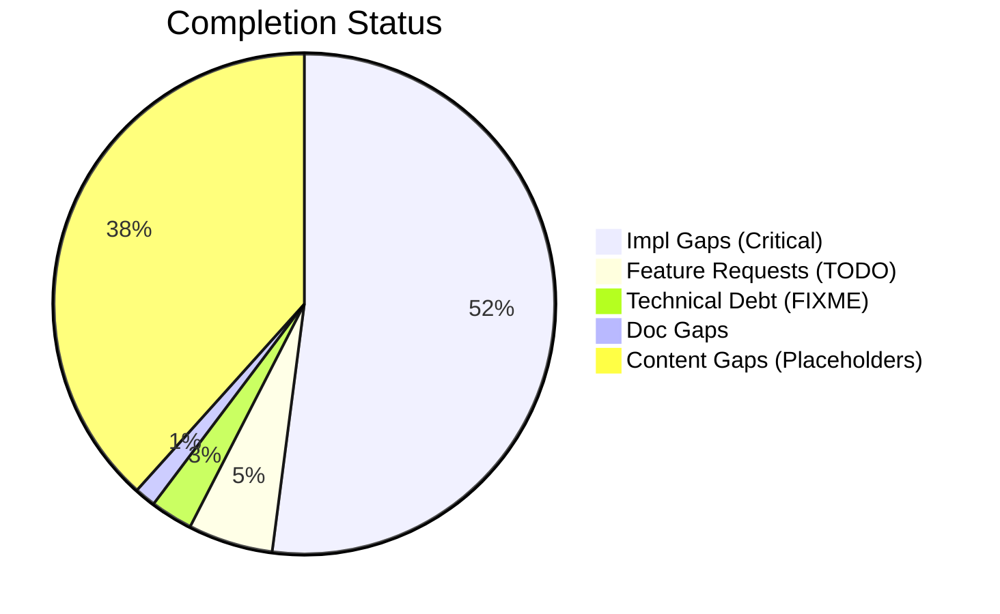
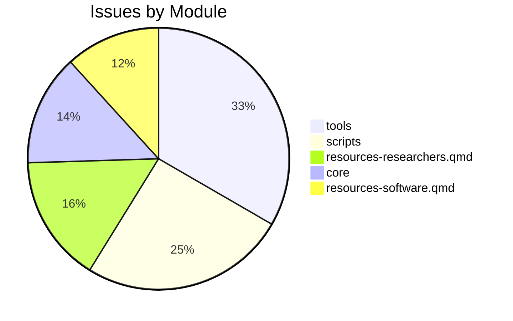

# Completist Report: 2026-02-26

## Executive Summary
- **Critical Gaps**: 38
- **Feature Gaps (TODO)**: 4
- **Content Gaps (Placeholders)**: 28
- **Technical Debt**: 2
- **Documentation Gaps**: 1

## Visualization
### Status Overview

### Top Impacted Modules

## Critical Incomplete (Top 50)
| File | Line | Type | Impact | Coverage | Complexity |
|---|---|---|---|---|---|
| `resources-papers.qmd` | 65 | Placeholder | 5 | 2 | 4 |
| `resources-researchers.qmd` | 214 | Placeholder | 5 | 2 | 4 |
| `resources-researchers.qmd` | 271 | Placeholder | 5 | 2 | 4 |
| `resources-researchers.qmd` | 303 | Placeholder | 5 | 2 | 4 |
| `resources-researchers.qmd` | 328 | Placeholder | 5 | 2 | 4 |
| `book-reviews.qmd` | 26 | Placeholder | 5 | 2 | 4 |
| `book-reviews.qmd` | 32 | Placeholder | 5 | 2 | 4 |
| `research-review-interaction-forces.qmd` | 73 | Placeholder | 5 | 2 | 4 |
| `resources-software.qmd` | 39 | Placeholder | 5 | 2 | 4 |
| `resources-software.qmd` | 126 | Placeholder | 5 | 2 | 4 |
| `resources-software.qmd` | 154 | Placeholder | 5 | 2 | 4 |
| `src/tools/publish_manual_article.py` | 98 | Stub | 3 | 2 | 4 |
| `src/tools/latex_to_html.py` | 188 | Stub | 3 | 2 | 4 |
| `src/tools/fix_html_validation.py` | 165 | Stub | 3 | 2 | 4 |
| `src/tools/utils/latex_utils.py` | 51 | Stub | 3 | 2 | 4 |
| `src/tools/utils/latex_utils.py` | 55 | Stub | 3 | 2 | 4 |
| `src/tools/utils/analysis_utils.py` | 88 | Stub | 3 | 2 | 4 |
| `src/tools/utils/analysis_utils.py` | 160 | Stub | 3 | 2 | 4 |
| `src/tools/code_quality/pattern_checker.py` | 120 | Stub | 3 | 2 | 4 |
| `src/tools/matlab_utilities/scripts/line_checks.py` | 90 | Stub | 3 | 2 | 4 |
| `./src/tools/code_quality/pattern_checker.py` | 18 | NotImplementedError | 3 | 2 | 4 |
| `./src/tools/code_quality/pattern_checker.py` | 144 | NotImplementedError | 3 | 2 | 4 |
| `./src/tools/code_quality/pattern_checker.py` | 145 | NotImplementedError | 3 | 2 | 4 |
| `scripts/assess_repo.py` | 146 | Stub | 1 | 2 | 4 |
| `scripts/assess_repo.py` | 367 | Stub | 1 | 2 | 4 |
| `scripts/generate_completist_data.py` | 208 | Stub | 1 | 2 | 4 |
| `scripts/generate_completist_data.py` | 251 | Stub | 1 | 2 | 4 |
| `scripts/generate_completist_data.py` | 313 | Stub | 1 | 2 | 4 |
| `content/Wrist as Universal Joint/Universal_Joint_Model_Enhanced.py` | 987 | Stub | 1 | 2 | 4 |
| `src/core/protocols.py` | 72 | Stub | 1 | 2 | 4 |
| `src/core/protocols.py` | 80 | Stub | 1 | 2 | 4 |
| `src/core/protocols.py` | 106 | Stub | 1 | 2 | 4 |
| `src/core/protocols.py` | 122 | Stub | 1 | 2 | 4 |
| `src/core/protocols.py` | 139 | Stub | 1 | 2 | 4 |
| `src/core/protocols.py` | 163 | Stub | 1 | 2 | 4 |
| `src/core/protocols.py` | 184 | Stub | 1 | 2 | 4 |
| `src/affine_control/ddp.py` | 60 | Stub | 1 | 2 | 4 |
| `./scripts/generate_completist_data.py` | 221 | NotImplementedError | 1 | 2 | 4 |

## Content Gaps (Website Specific)
| File | Line | Content |
|---|---|---|
| `resources-papers.qmd` | 65 | Note: Detailed review of Carol Putnam's work on interaction forces and proximal-to-distal sequencing |
| `resources-researchers.qmd` | 214 |  |
| `resources-researchers.qmd` | 271 |  |
| `resources-researchers.qmd` | 303 |  |
| `resources-researchers.qmd` | 328 |  |
| `book-reviews.qmd` | 26 | <li>Book recommendations coming soon...</li> |
| `book-reviews.qmd` | 32 | <li>Book recommendations coming soon...</li> |
| `research-review-interaction-forces.qmd` | 73 | a placeholder reminder for the upcoming comprehensive review. |
| `custom.scss` | 153 | /* YouTube Embed Placeholder Styles */ |
| `resources-software.qmd` | 39 |  |
| `resources-software.qmd` | 126 |  |
| `resources-software.qmd` | 154 |  |
| `articles/inverse-dynamics-bibliography.md` | 104 | # Note: Placeholder for a review if specific one exists, otherwise rely on Tutelman |
| `scripts/generate_completist_data.py` | 209 | """Scan files for placeholder content.""" |
| `scripts/generate_completist_data.py` | 252 | """Scan Python files for stub/placeholder functions.""" |
| `scripts/generate_completist_data.py` | 257 | re.compile(r"return\s+None\s*#.*stub\|placeholder", re.IGNORECASE), |
| `content/Wrist as Universal Joint/Archive/Wrist_Universal_Gemini.tex` | 26 | % Placeholder for the image provided in the prompt |
| `src/tools/CONVERSION_GUIDE.md` | 76 | - Displays `[Figure: See PDF version]` placeholder |
| `src/tools/CONVERSION_GUIDE.md` | 88 | \| Figures/TikZ    \| Placeholder text             \| Not converted          \| |
| `src/tools/latex_to_html.py` | 192 | # Simple placeholder replacement |
| `src/affine_control/ddp.py` | 76 | This skeleton serves as a placeholder for the algorithm structure. |
| `src/affine_control/ddp.py` | 109 | # Initial Forward pass (Placeholder) |
| `src/affine_control/ddp.py` | 123 | # Simulate on new grid (placeholder for full DDP backward/forward pass) |
| `src/tools/matlab_utilities/scripts/line_checks.py` | 9 | - append_banned_pattern_issues: Banned placeholder comment detection |
| `src/tools/matlab_utilities/scripts/line_checks.py` | 99 | (r"\bTODO\b", "Backlog marker placeholder found"), |
| `src/tools/matlab_utilities/scripts/line_checks.py` | 102 | (r"\bXXX\b", "Placeholder marker found"), |
| `src/tools/matlab_utilities/scripts/line_checks.py` | 103 | (r"<[A-Z_][A-Z0-9_]*>", "Angle bracket placeholder found"), |
| `src/tools/matlab_utilities/scripts/line_checks.py` | 104 | (r"\{\{.*?\}\}", "Template placeholder found"), |

## Feature Gap Matrix
| Module | Feature Gap | Type |
|---|---|---|
| `./src/tools/code_quality/pattern_checker.py` | (re.compile(r"\bTODO\b"), "TODO placeholder found"), | TODO |
| `./scripts/generate_completist_data.py` | """Scan files for completion markers (TODO, FIXME, etc).""" | TODO |
| `./scripts/check_tech_debt_budget.py` | MARKERS = ("TODO", "FIXME", "HACK", "XXX") | TODO |
| `./scripts/check_tech_debt_budget.py` | MARKER_RE = re.compile(r"\b(TODO\|FIXME\|HACK\|XXX)\b", re.IGNORECASE) | TODO |

## Technical Debt Register
| File | Line | Issue | Type |
|---|---|---|---|
| `./src/tools/code_quality/pattern_checker.py` | 16 | (re.compile(r"\bFIXME\b"), "FIXME placeholder found"), | FIXME |
| `./scripts/generate_completist_data.py` | 203 | markers = ["TOD" + "O", "FIX" + "ME", "XXX", "HACK", "TEMP"] | XXX |

## Recommended Implementation Order
Prioritized by Impact (High) and Complexity (Low).
| Priority | File | Issue | Metrics (I/C/C) |
|---|---|---|---|
| 1 | `resources-papers.qmd` | Note: Detailed review of Carol Putnam's work on interaction forces and proximal- | 5/2/4 |
| 2 | `resources-researchers.qmd` | Book recommendations coming soon...</li> | 5/2/4 |
| 7 | `book-reviews.qmd` | <li>Book recommendations coming soon...</li> | 5/2/4 |
| 8 | `research-review-interaction-forces.qmd` | a placeholder reminder for the upcoming comprehensive review. | 5/2/4 |
| 9 | `resources-software.qmd` | <img src="static/images/placeholder.svg" alt="OpenSim Logo" class="software-logo | 5/2/4 |
| 10 | `resources-software.qmd` | <img src="static/images/placeholder.svg" alt="MuJoCo Logo" class="software-logo" | 5/2/4 |
| 11 | `resources-software.qmd` | <img src="static/images/placeholder.svg" alt="Pinocchio Logo" class="software-lo | 5/2/4 |
| 12 | `./src/tools/code_quality/pattern_checker.py` | (re.compile(r"\bTODO\b"), "TODO placeholder found"), | 3/2/3 |
| 13 | `src/tools/publish_manual_article.py` | wrap_in_article_section | 3/2/4 |
| 14 | `src/tools/latex_to_html.py` | create_html_page | 3/2/4 |
| 15 | `src/tools/fix_html_validation.py` | main | 3/2/4 |
| 16 | `src/tools/utils/latex_utils.py` | read_latex_file | 3/2/4 |
| 17 | `src/tools/utils/latex_utils.py` | convert_file | 3/2/4 |
| 18 | `src/tools/utils/analysis_utils.py` | collect_python_file_metrics | 3/2/4 |
| 19 | `src/tools/utils/analysis_utils.py` | collect_function_details | 3/2/4 |
| 20 | `src/tools/code_quality/pattern_checker.py` | check_banned_patterns | 3/2/4 |

## Issues Created
- Created `docs/assessments/issues/Issue_2029_Incomplete_Placeholder_in_resources_papers_qmd_65.md`
- Created `docs/assessments/issues/Issue_2035_Incomplete_Placeholder_in_resources_researchers_qmd_214.md`
- Created `docs/assessments/issues/Issue_2044_Incomplete_Placeholder_in_resources_researchers_qmd_271.md`
- Created `docs/assessments/issues/Issue_2045_Incomplete_Placeholder_in_resources_researchers_qmd_303.md`
- Created `docs/assessments/issues/Issue_2051_Incomplete_Placeholder_in_resources_researchers_qmd_328.md`
- Created `docs/assessments/issues/Issue_2052_Incomplete_Placeholder_in_book_reviews_qmd_26.md`
- Created `docs/assessments/issues/Issue_2053_Incomplete_Placeholder_in_book_reviews_qmd_32.md`
- Created `docs/assessments/issues/Issue_2054_Incomplete_Placeholder_in_research_review_interaction_forces_qmd_73.md`
- Created `docs/assessments/issues/Issue_2063_Incomplete_Placeholder_in_resources_software_qmd_39.md`
- Created `docs/assessments/issues/Issue_2064_Incomplete_Placeholder_in_resources_software_qmd_126.md`