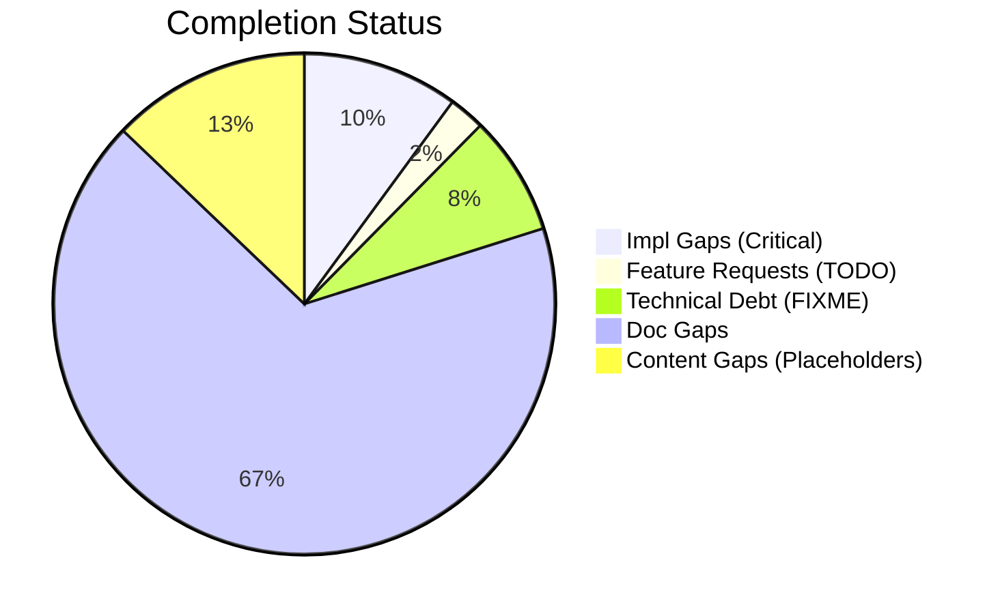
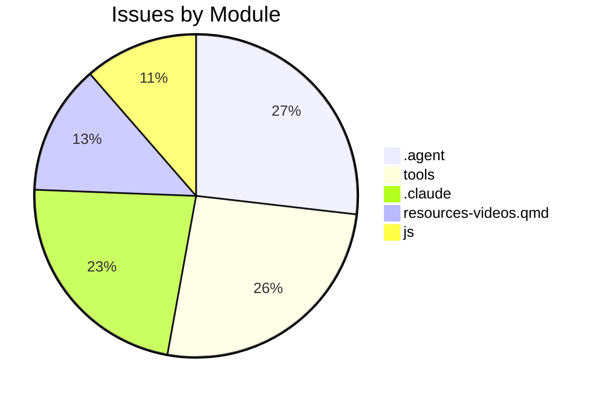

# Completist Report: 2026-03-05

## Executive Summary
- **Critical Gaps**: 65
- **Feature Gaps (TODO)**: 15
- **Content Gaps (Placeholders)**: 83
- **Technical Debt**: 50
- **Documentation Gaps**: 433

## Visualization
### Status Overview

### Top Impacted Modules

## Critical Incomplete (Top 50)
| File | Line | Type | Impact | Coverage | Complexity |
|---|---|---|---|---|---|
| `resources-papers.qmd` | 65 | Placeholder | 5 | 2 | 4 |
| `resources-researchers.qmd` | 214 | Placeholder | 5 | 2 | 4 |
| `resources-researchers.qmd` | 271 | Placeholder | 5 | 2 | 4 |
| `resources-researchers.qmd` | 303 | Placeholder | 5 | 2 | 4 |
| `resources-researchers.qmd` | 328 | Placeholder | 5 | 2 | 4 |
| `book-reviews.qmd` | 26 | Placeholder | 5 | 2 | 4 |
| `book-reviews.qmd` | 32 | Placeholder | 5 | 2 | 4 |
| `research-review-interaction-forces.qmd` | 73 | Placeholder | 5 | 2 | 4 |
| `resources-videos.qmd` | 202 | Placeholder | 5 | 2 | 4 |
| `resources-videos.qmd` | 203 | Placeholder | 5 | 2 | 4 |
| `resources-videos.qmd` | 204 | Placeholder | 5 | 2 | 4 |
| `resources-videos.qmd` | 208 | Placeholder | 5 | 2 | 4 |
| `resources-videos.qmd` | 344 | Placeholder | 5 | 2 | 4 |
| `resources-videos.qmd` | 345 | Placeholder | 5 | 2 | 4 |
| `resources-videos.qmd` | 346 | Placeholder | 5 | 2 | 4 |
| `resources-videos.qmd` | 350 | Placeholder | 5 | 2 | 4 |
| `script.js` | 1716 | Placeholder | 5 | 2 | 4 |
| `script.js` | 1717 | Placeholder | 5 | 2 | 4 |
| `script.js` | 1718 | Placeholder | 5 | 2 | 4 |
| `resources-software.qmd` | 39 | Placeholder | 5 | 2 | 4 |
| `resources-software.qmd` | 126 | Placeholder | 5 | 2 | 4 |
| `resources-software.qmd` | 154 | Placeholder | 5 | 2 | 4 |
| `bibliography.qmd` | 38 | Placeholder | 5 | 2 | 4 |
| `js/accessibility.js` | 157 | Placeholder | 5 | 2 | 4 |
| `js/accessibility.js` | 158 | Placeholder | 5 | 2 | 4 |
| `js/accessibility.js` | 159 | Placeholder | 5 | 2 | 4 |
| `js/notes-workspace.js` | 136 | Placeholder | 5 | 2 | 4 |
| `css/layout.css` | 170 | Placeholder | 5 | 2 | 4 |
| `css/mobile.css` | 161 | Placeholder | 5 | 2 | 4 |
| `css/startup-launcher.css` | 384 | Placeholder | 5 | 2 | 4 |
| `css/search-metrics.css` | 432 | Placeholder | 5 | 2 | 4 |
| `src/js/seo-enhancements.js` | 100 | Placeholder | 5 | 2 | 4 |
| `src/js/global-search.js` | 187 | Placeholder | 5 | 2 | 4 |
| `src/js/notes-workspace.js` | 136 | Placeholder | 5 | 2 | 4 |
| `src/css/startup-launcher.css` | 384 | Placeholder | 5 | 2 | 4 |
| `src/css/search-metrics.css` | 432 | Placeholder | 5 | 2 | 4 |
| `src/tools/wrist_universal_joint/grip_angle_simulator.html` | 443 | Placeholder | 5 | 2 | 4 |
| `src/tools/publish_manual_article.py` | 98 | Stub | 3 | 2 | 4 |
| `src/tools/latex_to_html.py` | 188 | Stub | 3 | 2 | 4 |
| `src/tools/fix_html_validation.py` | 165 | Stub | 3 | 2 | 4 |
| `src/tools/utils/latex_utils.py` | 51 | Stub | 3 | 2 | 4 |
| `src/tools/utils/latex_utils.py` | 55 | Stub | 3 | 2 | 4 |
| `src/tools/utils/analysis_utils.py` | 88 | Stub | 3 | 2 | 4 |
| `src/tools/utils/analysis_utils.py` | 160 | Stub | 3 | 2 | 4 |
| `src/tools/code_quality/pattern_checker.py` | 120 | Stub | 3 | 2 | 4 |
| `src/tools/matlab_utilities/scripts/line_checks.py` | 90 | Stub | 3 | 2 | 4 |
| `src/tools/code_quality/pattern_checker.py` | 18 | NotImplementedError | 3 | 2 | 4 |
| `src/tools/code_quality/pattern_checker.py` | 144 | NotImplementedError | 3 | 2 | 4 |
| `src/tools/code_quality/pattern_checker.py` | 145 | NotImplementedError | 3 | 2 | 4 |
| `scripts/assess_repo.py` | 153 | Stub | 1 | 2 | 4 |

## Content Gaps (Website Specific)
| File | Line | Content |
|---|---|---|
| `resources-papers.qmd` | 65 | Note: Detailed review of Carol Putnam's work on interaction forces and proximal-to-distal sequencing |
| `resources-researchers.qmd` | 214 |  |
| `resources-researchers.qmd` | 271 |  |
| `resources-researchers.qmd` | 303 |  |
| `resources-researchers.qmd` | 328 |  |
| `book-reviews.qmd` | 26 | <li>Book recommendations coming soon...</li> |
| `book-reviews.qmd` | 32 | <li>Book recommendations coming soon...</li> |
| `research-review-interaction-forces.qmd` | 73 | a placeholder reminder for the upcoming comprehensive review. |
| `resources-videos.qmd` | 202 | 
 |
| `resources-videos.qmd` | 203 | 
 |
| `resources-videos.qmd` | 204 | <svg xmlns="http://www.w3.org/2000/svg" width="64" height="64" viewBox="0 0 24 24" fill="none" strok |
| `resources-videos.qmd` | 208 | 
A. Sala Control Channel
 |
| `resources-videos.qmd` | 344 | 
 |
| `resources-videos.qmd` | 345 | 
 |
| `resources-videos.qmd` | 346 | <svg xmlns="http://www.w3.org/2000/svg" width="64" height="64" viewBox="0 0 24 24" fill="none" strok |
| `resources-videos.qmd` | 350 | 
Biomechanics of Movement
 |
| `script.js` | 1716 | const placeholder = input.getAttribute('placeholder'); |
| `script.js` | 1717 | if (placeholder) { |
| `script.js` | 1718 | input.setAttribute('aria-label', placeholder); |
| `custom.scss` | 153 | /* YouTube Embed Placeholder Styles */ |
| `custom.scss` | 154 | .youtube-placeholder { |
| `custom.scss` | 162 | .youtube-placeholder-content { |
| `custom.scss` | 168 | .youtube-placeholder-icon { |
| `custom.scss` | 173 | .youtube-placeholder-title { |
| `resources-software.qmd` | 39 |  |
| `resources-software.qmd` | 126 |  |
| `resources-software.qmd` | 154 |  |
| `bibliography.qmd` | 38 | <input type="text" id="bib-search" placeholder="Search references by title, author, or concept..." s |
| `articles/inverse-dynamics-bibliography.md` | 104 | # Note: Placeholder for a review if specific one exists, otherwise rely on Tutelman |
| `scripts/generate_completist_data.py` | 209 | """Scan files for placeholder content.""" |
| `scripts/generate_completist_data.py` | 252 | """Scan Python files for stub/placeholder functions.""" |
| `scripts/generate_completist_data.py` | 257 | re.compile(r"return\s+None\s*#.*stub\|placeholder", re.IGNORECASE), |
| `tests/test_assess_repo.py` | 73 | return None  # noqa: placeholder for test fixture |
| `tests/test_check_links.py` | 29 | """External or placeholder links should be ignored.""" |
| `tests/test_matlab_quality_check_refactor.py` | 20 | "% <PLACEHOLDER>", |
| `tests/test_matlab_quality_check_refactor.py` | 42 | assert any("Angle bracket placeholder found" in issue for issue in issues) |
| `js/accessibility.js` | 157 | const placeholder = input.getAttribute("placeholder"); |
| `js/accessibility.js` | 158 | if (placeholder) { |
| `js/accessibility.js` | 159 | input.setAttribute("aria-label", placeholder); |
| `js/notes-workspace.js` | 136 | <textarea id="ad-notes-workspace-area" class="ad-notes-area" placeholder="Capture research notes, id |
| `css/layout.css` | 170 | /* Lazy loading placeholder */ |
| `css/mobile.css` | 161 | Placeholder Content Styling (Issue #869) |
| `css/startup-launcher.css` | 384 | /* Skeleton placeholder styles */ |
| `css/search-metrics.css` | 432 | Lazy Loading Placeholder |
| `content/Wrist as Universal Joint/Archive/Wrist_Universal_Gemini.tex` | 26 | % Placeholder for the image provided in the prompt |
| `articles/The_Geometry_of_Motion/Volume_V/chapters/ch04_simulation.tex` | 71 | # Placeholder for general n-DOF |
| `articles/The_Geometry_of_Motion/Volume_V/chapters/ch10_golf_swing_project.tex` | 121 | drift[k] = 0.6 * self.clubhead_speed[k]  # Placeholder ratio |
| `articles/The_Geometry_of_Motion/Volume_V/chapters/ch10_golf_swing_project.tex` | 173 | analysis.joint_torques = np.random.randn(N, 3) * 10  # placeholder |
| `.claude/skills/lint/SKILL.md` | 3 | description: Run linting tools (ruff, black, mypy) and fix placeholder/TODO statements |
| `.claude/skills/lint/SKILL.md` | 27 | 4. **Find and fix placeholder statements**: |

## Feature Gap Matrix
| Module | Feature Gap | Type |
|---|---|---|
| `AGENTS.md` | - ❌ **DO NOT** leave `TODO`/`FIXME` markers for more than one sprint. | TODO |
| `AGENTS.md` | - **Read:** Codebase for TODO, FIXME, NotImplementedError, pass statements | TODO |
| `config/tech_debt_budget.json` | "TODO": 20, | TODO |
| `scripts/check_tech_debt_budget.py` | MARKERS = ("TODO", "FIXME", "HACK", "XXX") | TODO |
| `scripts/check_tech_debt_budget.py` | MARKER_RE = re.compile(r"\b(TODO\|FIXME\|HACK\|XXX)\b", re.IGNORECASE) | TODO |
| `scripts/generate_completist_data.py` | """Scan files for completion markers (TODO, FIXME, etc).""" | TODO |
| `.claude/skills/lint/SKILL.md` | description: Run linting tools (ruff, black, mypy) and fix placeholder/TODO statements | TODO |
| `.claude/skills/lint/SKILL.md` | - Search for `TODO`, `FIXME`, `XXX`, `HACK` comments | TODO |
| `.claude/skills/lint/SKILL.md` | grep -rn "TODO\\|FIXME\\|XXX\\|HACK\\|NotImplementedError\\|pass$" --include="*.py" . | TODO |
| `.agent/workflows/lint.md` | description: Run linting tools (ruff, black, mypy) and fix placeholder/TODO statements | TODO |
| `.agent/workflows/lint.md` | grep -rn "TODO\\|FIXME\\|XXX\\|HACK\\|NotImplementedError\\|pass$" --include="*.py" . | TODO |
| `.agent/skills/lint/SKILL.md` | description: Run linting tools (ruff, black, mypy) and fix placeholder/TODO statements | TODO |
| `.agent/skills/lint/SKILL.md` | - Search for `TODO`, `FIXME`, `XXX`, `HACK` comments | TODO |
| `.agent/skills/lint/SKILL.md` | grep -rn "TODO\\|FIXME\\|XXX\\|HACK\\|NotImplementedError\\|pass$" --include="*.py" . | TODO |
| `src/tools/code_quality/pattern_checker.py` | (re.compile(r"\bTODO\b"), "TODO placeholder found"), | TODO |

## Technical Debt Register
| File | Line | Issue | Type |
|---|---|---|---|
| `config/tech_debt_budget.json` | 25 | "FIXME": 13, | FIXME |
| `config/tech_debt_budget.json` | 26 | "HACK": 8, | HACK |
| `config/tech_debt_budget.json` | 27 | "XXX": 10 | XXX |
| `scripts/generate_completist_data.py` | 203 | markers = ["TOD" + "O", "FIX" + "ME", "XXX", "HACK", "TEMP"] | XXX |
| `.claude/skills/issues-10-sequential/SKILL.md` | 96 | \| 1 \| #XXX - Title \| #YYY \| Merged \| | XXX |
| `.claude/skills/issues-10-sequential/SKILL.md` | 97 | \| 2 \| #XXX - Title \| #YYY \| Merged \| | XXX |
| `.claude/skills/issues-5-combined/SKILL.md` | 63 | - #XXX: <brief description> | XXX |
| `.claude/skills/issues-5-combined/SKILL.md` | 64 | - #XXX: <brief description> | XXX |
| `.claude/skills/issues-5-combined/SKILL.md` | 65 | - #XXX: <brief description> | XXX |
| `.claude/skills/issues-5-combined/SKILL.md` | 66 | - #XXX: <brief description> | XXX |
| `.claude/skills/issues-5-combined/SKILL.md` | 67 | - #XXX: <brief description> | XXX |
| `.claude/skills/issues-5-combined/SKILL.md` | 69 | Closes #XXX, closes #XXX, closes #XXX, closes #XXX, closes #XXX | XXX |
| `.claude/skills/issues-5-combined/SKILL.md` | 84 | \| #XXX \| Title \| Brief fix description \| | XXX |
| `.claude/skills/issues-5-combined/SKILL.md` | 85 | \| #XXX \| Title \| Brief fix description \| | XXX |
| `.claude/skills/issues-5-combined/SKILL.md` | 86 | \| #XXX \| Title \| Brief fix description \| | XXX |
| `.claude/skills/issues-5-combined/SKILL.md` | 87 | \| #XXX \| Title \| Brief fix description \| | XXX |
| `.claude/skills/issues-5-combined/SKILL.md` | 88 | \| #XXX \| Title \| Brief fix description \| | XXX |
| `.claude/skills/issues-5-combined/SKILL.md` | 95 | Closes #XXX, closes #XXX, closes #XXX, closes #XXX, closes #XXX" | XXX |
| `.claude/skills/issues-5-combined/SKILL.md` | 140 | \| #XXX \| Title \| Fixed \| | XXX |
| `.claude/skills/issues-5-combined/SKILL.md` | 141 | \| #XXX \| Title \| Fixed \| | XXX |
| `.claude/skills/issues-5-combined/SKILL.md` | 142 | \| #XXX \| Title \| Fixed \| | XXX |
| `.claude/skills/issues-5-combined/SKILL.md` | 143 | \| #XXX \| Title \| Fixed \| | XXX |
| `.claude/skills/issues-5-combined/SKILL.md` | 144 | \| #XXX \| Title \| Fixed \| | XXX |
| `.claude/skills/update-issues/SKILL.md` | 132 | \| #XXX \| Title \| High \| assessment.md \| | XXX |
| `.claude/skills/update-issues/SKILL.md` | 137 | \| #XXX \| Title \| Fixed in commit abc123 \| | XXX |
| `.claude/skills/update-issues/SKILL.md` | 142 | \| Description \| #XXX \| | XXX |
| `.agent/workflows/issues-5-combined.md` | 44 | Closes #XXX, closes #XXX, closes #XXX, closes #XXX, closes #XXX | XXX |
| `.agent/skills/issues-10-sequential/SKILL.md` | 96 | \| 1 \| #XXX - Title \| #YYY \| Merged \| | XXX |
| `.agent/skills/issues-10-sequential/SKILL.md` | 97 | \| 2 \| #XXX - Title \| #YYY \| Merged \| | XXX |
| `.agent/skills/issues-5-combined/SKILL.md` | 63 | - #XXX: <brief description> | XXX |
| `.agent/skills/issues-5-combined/SKILL.md` | 64 | - #XXX: <brief description> | XXX |
| `.agent/skills/issues-5-combined/SKILL.md` | 65 | - #XXX: <brief description> | XXX |
| `.agent/skills/issues-5-combined/SKILL.md` | 66 | - #XXX: <brief description> | XXX |
| `.agent/skills/issues-5-combined/SKILL.md` | 67 | - #XXX: <brief description> | XXX |
| `.agent/skills/issues-5-combined/SKILL.md` | 69 | Closes #XXX, closes #XXX, closes #XXX, closes #XXX, closes #XXX | XXX |
| `.agent/skills/issues-5-combined/SKILL.md` | 84 | \| #XXX \| Title \| Brief fix description \| | XXX |
| `.agent/skills/issues-5-combined/SKILL.md` | 85 | \| #XXX \| Title \| Brief fix description \| | XXX |
| `.agent/skills/issues-5-combined/SKILL.md` | 86 | \| #XXX \| Title \| Brief fix description \| | XXX |
| `.agent/skills/issues-5-combined/SKILL.md` | 87 | \| #XXX \| Title \| Brief fix description \| | XXX |
| `.agent/skills/issues-5-combined/SKILL.md` | 88 | \| #XXX \| Title \| Brief fix description \| | XXX |
| `.agent/skills/issues-5-combined/SKILL.md` | 95 | Closes #XXX, closes #XXX, closes #XXX, closes #XXX, closes #XXX" | XXX |
| `.agent/skills/issues-5-combined/SKILL.md` | 140 | \| #XXX \| Title \| Fixed \| | XXX |
| `.agent/skills/issues-5-combined/SKILL.md` | 141 | \| #XXX \| Title \| Fixed \| | XXX |
| `.agent/skills/issues-5-combined/SKILL.md` | 142 | \| #XXX \| Title \| Fixed \| | XXX |
| `.agent/skills/issues-5-combined/SKILL.md` | 143 | \| #XXX \| Title \| Fixed \| | XXX |
| `.agent/skills/issues-5-combined/SKILL.md` | 144 | \| #XXX \| Title \| Fixed \| | XXX |
| `.agent/skills/update-issues/SKILL.md` | 132 | \| #XXX \| Title \| High \| assessment.md \| | XXX |
| `.agent/skills/update-issues/SKILL.md` | 137 | \| #XXX \| Title \| Fixed in commit abc123 \| | XXX |
| `.agent/skills/update-issues/SKILL.md` | 142 | \| Description \| #XXX \| | XXX |
| `src/tools/code_quality/pattern_checker.py` | 16 | (re.compile(r"\bFIXME\b"), "FIXME placeholder found"), | FIXME |

## Recommended Implementation Order
Prioritized by Impact (High) and Complexity (Low).
| Priority | File | Issue | Metrics (I/C/C) |
|---|---|---|---|
| 1 | `resources-papers.qmd` | Note: Detailed review of Carol Putnam's work on interaction forces and proximal- | 5/2/4 |
| 2 | `resources-researchers.qmd` | Book recommendations coming soon...</li> | 5/2/4 |
| 7 | `book-reviews.qmd` | <li>Book recommendations coming soon...</li> | 5/2/4 |
| 8 | `research-review-interaction-forces.qmd` | a placeholder reminder for the upcoming comprehensive review. | 5/2/4 |
| 9 | `resources-videos.qmd` | 
 | 5/2/4 |
| 10 | `resources-videos.qmd` | 
 | 5/2/4 |
| 11 | `resources-videos.qmd` | <svg xmlns="http://www.w3.org/2000/svg" width="64" height="64" viewBox="0 0 24 2 | 5/2/4 |
| 12 | `resources-videos.qmd` | 
A. Sala Control Channel
 | 5/2/4 |
| 13 | `resources-videos.qmd` | 
 | 5/2/4 |
| 14 | `resources-videos.qmd` | 
 | 5/2/4 |
| 15 | `resources-videos.qmd` | <svg xmlns="http://www.w3.org/2000/svg" width="64" height="64" viewBox="0 0 24 2 | 5/2/4 |
| 16 | `resources-videos.qmd` | 
Biomechanics of Movement
 | 5/2/4 |
| 17 | `script.js` | const placeholder = input.getAttribute('placeholder'); | 5/2/4 |
| 18 | `script.js` | if (placeholder) { | 5/2/4 |
| 19 | `script.js` | input.setAttribute('aria-label', placeholder); | 5/2/4 |
| 20 | `resources-software.qmd` | <img src="static/images/placeholder.svg" alt="OpenSim Logo" class="software-logo | 5/2/4 |

## Issues Created
- Created `docs/assessments/issues/Issue_2027_Incomplete_Placeholder_in_resources_papers_qmd_65.md`
- Created `docs/assessments/issues/Issue_2028_Incomplete_Placeholder_in_resources_researchers_qmd_214.md`
- Created `docs/assessments/issues/Issue_2029_Incomplete_Placeholder_in_resources_researchers_qmd_271.md`
- Created `docs/assessments/issues/Issue_2030_Incomplete_Placeholder_in_resources_researchers_qmd_303.md`
- Created `docs/assessments/issues/Issue_2031_Incomplete_Placeholder_in_resources_researchers_qmd_328.md`
- Created `docs/assessments/issues/Issue_2032_Incomplete_Placeholder_in_book_reviews_qmd_26.md`
- Created `docs/assessments/issues/Issue_2033_Incomplete_Placeholder_in_book_reviews_qmd_32.md`
- Created `docs/assessments/issues/Issue_2034_Incomplete_Placeholder_in_research_review_interaction_forces_qmd_73.md`
- Created `docs/assessments/issues/Issue_2035_Incomplete_Placeholder_in_resources_videos_qmd_202.md`
- Created `docs/assessments/issues/Issue_2036_Incomplete_Placeholder_in_resources_videos_qmd_203.md`