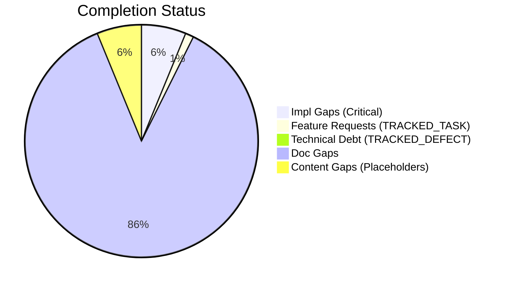
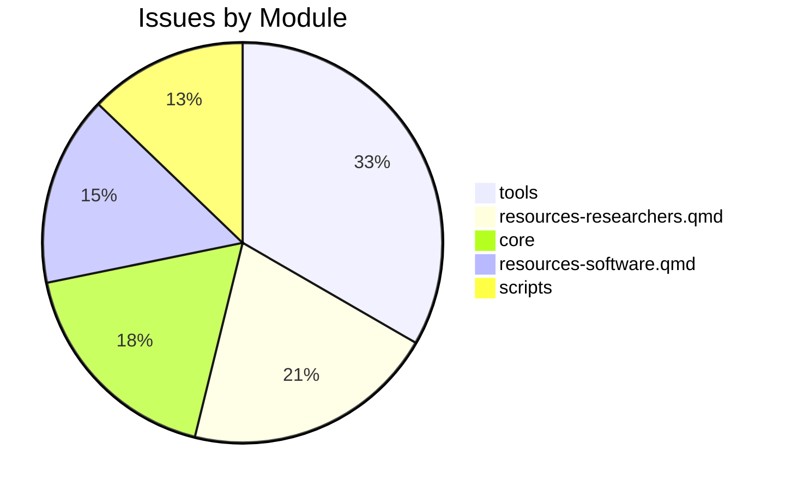

# Completist Report: 2026-03-22

## Executive Summary
- **Critical Gaps**: 32
- **Feature Gaps (TRACKED_TASK)**: 6
- **Content Gaps (Placeholders)**: 32
- **Technical Debt**: 3
- **Documentation Gaps**: 447

## Visualization
### Status Overview

### Top Impacted Modules

## Critical Incomplete (Top 50)
| File | Line | Type | Impact | Coverage | Complexity |
|---|---|---|---|---|---|
| `resources-papers.qmd` | 65 | Placeholder | 5 | 2 | 4 |
| `resources-researchers.qmd` | 214 | Placeholder | 5 | 2 | 4 |
| `resources-researchers.qmd` | 271 | Placeholder | 5 | 2 | 4 |
| `resources-researchers.qmd` | 303 | Placeholder | 5 | 2 | 4 |
| `resources-researchers.qmd` | 328 | Placeholder | 5 | 2 | 4 |
| `book-reviews.qmd` | 26 | Placeholder | 5 | 2 | 4 |
| `book-reviews.qmd` | 32 | Placeholder | 5 | 2 | 4 |
| `research-review-interaction-forces.qmd` | 73 | Placeholder | 5 | 2 | 4 |
| `resources-software.qmd` | 39 | Placeholder | 5 | 2 | 4 |
| `resources-software.qmd` | 126 | Placeholder | 5 | 2 | 4 |
| `resources-software.qmd` | 154 | Placeholder | 5 | 2 | 4 |
| `src/js/seo-enhancements.js` | 100 | Placeholder | 5 | 2 | 4 |
| `src/tools/publish_manual_article.py` | 98 | Stub | 3 | 2 | 4 |
| `src/tools/wrap_sidebars.py` | 30 | Stub | 3 | 2 | 4 |
| `src/tools/latex_to_html.py` | 188 | Stub | 3 | 2 | 4 |
| `src/tools/fix_html_validation.py` | 165 | Stub | 3 | 2 | 4 |
| `src/tools/utils/latex_utils.py` | 51 | Stub | 3 | 2 | 4 |
| `src/tools/utils/latex_utils.py` | 55 | Stub | 3 | 2 | 4 |
| `src/tools/utils/analysis_utils.py` | 88 | Stub | 3 | 2 | 4 |
| `src/tools/utils/analysis_utils.py` | 160 | Stub | 3 | 2 | 4 |
| `scripts/assess_repo.py` | 153 | Stub | 1 | 2 | 4 |
| `scripts/assess_repo.py` | 374 | Stub | 1 | 2 | 4 |
| `scripts/assess_repo.py` | 449 | Stub | 1 | 2 | 4 |
| `content/Wrist as Universal Joint/Universal_Joint_Model_Enhanced.py` | 987 | Stub | 1 | 2 | 4 |
| `src/core/protocols.py` | 72 | Stub | 1 | 2 | 4 |
| `src/core/protocols.py` | 80 | Stub | 1 | 2 | 4 |
| `src/core/protocols.py` | 106 | Stub | 1 | 2 | 4 |
| `src/core/protocols.py` | 122 | Stub | 1 | 2 | 4 |
| `src/core/protocols.py` | 139 | Stub | 1 | 2 | 4 |
| `src/core/protocols.py` | 163 | Stub | 1 | 2 | 4 |
| `src/core/protocols.py` | 184 | Stub | 1 | 2 | 4 |
| `src/affine_control/ddp.py` | 60 | Stub | 1 | 2 | 4 |

## Content Gaps (Website Specific)
| File | Line | Content |
|---|---|---|
| `resources-papers.qmd` | 65 | Note: Detailed review of Carol Putnam's work on interaction forces and proximal-to-distal sequencing |
| `resources-researchers.qmd` | 214 |  |
| `resources-researchers.qmd` | 271 |  |
| `resources-researchers.qmd` | 303 |  |
| `resources-researchers.qmd` | 328 |  |
| `AffineDrift_Adversarial_Review_2026-03-07.md` | 48 | ### 1.5 MEDIUM — Incomplete Sections with "Coming Soon" Placeholders |
| `AffineDrift_Adversarial_Review_2026-03-07.md` | 50 | Sixteen .qmd files contain placeholder text. Notable gaps include book-reviews.qmd (2 "coming soon"  |
| `AffineDrift_Adversarial_Review_2026-03-07.md` | 275 | 17. **Complete stub pages** or remove "coming soon" placeholders |
| `book-reviews.qmd` | 26 | <li>Book recommendations coming soon...</li> |
| `book-reviews.qmd` | 32 | <li>Book recommendations coming soon...</li> |
| `research-review-interaction-forces.qmd` | 73 | a placeholder reminder for the upcoming comprehensive review. |
| `resources-software.qmd` | 39 |  |
| `resources-software.qmd` | 126 |  |
| `resources-software.qmd` | 154 |  |
| `articles/inverse-dynamics-bibliography.md` | 104 | # Note: Placeholder for a review if specific one exists, otherwise rely on Tutelman |
| `tests/test_assess_repo.py` | 73 | return None  # noqa: placeholder for test fixture |
| `tests/test_check_links.py` | 30 | """External or placeholder links should be ignored.""" |
| `tests/test_matlab_quality_check_refactor.py` | 20 | "% <PLACEHOLDER>", |
| `tests/test_matlab_quality_check_refactor.py` | 42 | assert any("Angle bracket placeholder found" in issue for issue in issues) |
| `content/Wrist as Universal Joint/Archive/Wrist_Universal_Gemini.tex` | 26 | % Placeholder for the image provided in the prompt |
| `articles/The_Geometry_of_Motion/Volume_V/chapters/ch04_simulation.tex` | 71 | # Placeholder for general n-DOF |
| `articles/The_Geometry_of_Motion/Volume_V/chapters/ch10_golf_swing_project.tex` | 121 | drift[k] = 0.6 * self.clubhead_speed[k]  # Placeholder ratio |
| `articles/The_Geometry_of_Motion/Volume_V/chapters/ch10_golf_swing_project.tex` | 173 | analysis.joint_torques = np.random.randn(N, 3) * 10  # placeholder |
| `src/tools/publish_manual_article.py` | 121 | <!-- Manual TOC placeholder --> |
| `src/tools/wrap_sidebars.py` | 40 | # Define tag parts to avoid lint "Angle bracket placeholder" errors |
| `src/tools/CONVERSION_GUIDE.md` | 76 | - Displays `[Figure: See PDF version]` placeholder |
| `src/tools/CONVERSION_GUIDE.md` | 88 | \| Figures/TikZ    \| Placeholder text             \| Not converted          \| |
| `src/tools/latex_to_html.py` | 192 | # Simple placeholder replacement |
| `src/js/seo-enhancements.js` | 100 | * Add missing alt text to images (with placeholder) |
| `src/affine_control/ddp.py` | 76 | This skeleton serves as a placeholder for the algorithm structure. |
| `src/affine_control/ddp.py` | 109 | # Initial Forward pass (Placeholder) |
| `src/affine_control/ddp.py` | 123 | # Simulate on new grid (placeholder for full DDP backward/forward pass) |

## Feature Gap Matrix
| Module | Feature Gap | Type |
|---|---|---|
| `AGENTS.md` | - ❌ **DO NOT** leave `TRACKED_TASK`/`TRACKED_DEFECT` markers for more than one sprint. | TRACKED_TASK |
| `AGENTS.md` | - **Read:** Codebase for TRACKED_TASK, TRACKED_DEFECT, NotImplementedError, pass statements | TRACKED_TASK |
| `AffineDrift_Adversarial_Review_2026-03-07.md` | Sixteen .qmd files contain placeholder text. Notable gaps include book-reviews.qmd (2 "coming soon"  | TRACKED_TASK |
| `config/tech_debt_budget.json` | "TRACKED_TASK": 20, | TRACKED_TASK |
| `scripts/check_tech_debt_budget.py` | MARKERS = ("TRACKED_TASK", "TRACKED_DEFECT", "HACK", "XXX") | TRACKED_TASK |
| `scripts/check_tech_debt_budget.py` | MARKER_RE = re.compile(r"\b(TRACKED_TASK\|TRACKED_DEFECT\|HACK\|XXX)\b", re.IGNORECASE) | TRACKED_TASK |

## Technical Debt Register
| File | Line | Issue | Type |
|---|---|---|---|
| `config/tech_debt_budget.json` | 25 | "TRACKED_DEFECT": 13, | TRACKED_DEFECT |
| `config/tech_debt_budget.json` | 26 | "HACK": 8, | HACK |
| `config/tech_debt_budget.json` | 27 | "XXX": 10 | XXX |

## Recommended Implementation Order
Prioritized by Impact (High) and Complexity (Low).
| Priority | File | Issue | Metrics (I/C/C) |
|---|---|---|---|
| 1 | `resources-papers.qmd` | Note: Detailed review of Carol Putnam's work on interaction forces and proximal- | 5/2/4 |
| 2 | `resources-researchers.qmd` | Book recommendations coming soon...</li> | 5/2/4 |
| 7 | `book-reviews.qmd` | <li>Book recommendations coming soon...</li> | 5/2/4 |
| 8 | `research-review-interaction-forces.qmd` | a placeholder reminder for the upcoming comprehensive review. | 5/2/4 |
| 9 | `resources-software.qmd` | <img src="static/images/placeholder.svg" alt="OpenSim Logo" class="software-logo | 5/2/4 |
| 10 | `resources-software.qmd` | <img src="static/images/placeholder.svg" alt="MuJoCo Logo" class="software-logo" | 5/2/4 |
| 11 | `resources-software.qmd` | <img src="static/images/placeholder.svg" alt="Pinocchio Logo" class="software-lo | 5/2/4 |
| 12 | `src/js/seo-enhancements.js` | * Add missing alt text to images (with placeholder) | 5/2/4 |
| 13 | `src/tools/publish_manual_article.py` | wrap_in_article_section | 3/2/4 |
| 14 | `src/tools/wrap_sidebars.py` | wrap_file | 3/2/4 |
| 15 | `src/tools/latex_to_html.py` | create_html_page | 3/2/4 |
| 16 | `src/tools/fix_html_validation.py` | main | 3/2/4 |
| 17 | `src/tools/utils/latex_utils.py` | read_latex_file | 3/2/4 |
| 18 | `src/tools/utils/latex_utils.py` | convert_file | 3/2/4 |
| 19 | `src/tools/utils/analysis_utils.py` | collect_python_file_metrics | 3/2/4 |
| 20 | `src/tools/utils/analysis_utils.py` | collect_function_details | 3/2/4 |

## Issues Created
- Created `docs/assessments/issues/Issue_2027_Incomplete_Placeholder_in_resources_papers_qmd_65.md`
- Created `docs/assessments/issues/Issue_2028_Incomplete_Placeholder_in_resources_researchers_qmd_214.md`
- Created `docs/assessments/issues/Issue_2029_Incomplete_Placeholder_in_resources_researchers_qmd_271.md`
- Created `docs/assessments/issues/Issue_2030_Incomplete_Placeholder_in_resources_researchers_qmd_303.md`
- Created `docs/assessments/issues/Issue_2031_Incomplete_Placeholder_in_resources_researchers_qmd_328.md`
- Created `docs/assessments/issues/Issue_2032_Incomplete_Placeholder_in_book_reviews_qmd_26.md`
- Created `docs/assessments/issues/Issue_2033_Incomplete_Placeholder_in_book_reviews_qmd_32.md`
- Created `docs/assessments/issues/Issue_2034_Incomplete_Placeholder_in_research_review_interaction_forces_qmd_73.md`
- Created `docs/assessments/issues/Issue_2035_Incomplete_Placeholder_in_resources_software_qmd_39.md`
- Created `docs/assessments/issues/Issue_2036_Incomplete_Placeholder_in_resources_software_qmd_126.md`