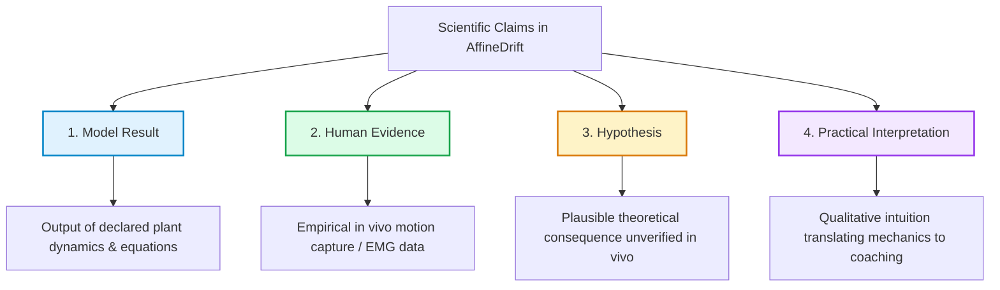

# Writing Style Guide

This guide defines the canonical prose standard for all rendered pages, articles, and textbook chapters in AffineDrift. It establishes measurable writing standards so that editorial quality is reviewable and consistent across contributors.

---

## 1. Sentence-Level Standards

### Measurable Sentence Metrics

High-density technical exposition requires controlled sentence length to maintain readability. AffineDrift enforces the following sentence metrics across all `.qmd` and `.tex` source files:

| Metric | Target | Hard Constraint |
| --- | --- | --- |
| **Mean sentence length** | 20–24 words | Monitored across sections |
| **Sentences > 30 words** | < 15% of paragraph | Flagged in editorial review |
| **Sentences > 45 words** | 0% (zero tolerance) | Must be broken into multiple sentences |

Short sentences deliver conclusions, definitions, and transitions. Longer compound sentences provide necessary technical qualifications and parameter bounds.

### Actor in the Subject Slot

Sentences should place the active physical or mathematical entity in the grammatical subject position. Avoid empty expletives (*There is*, *It was found that*) and buried actors.

```markdown
<!-- Good: concrete actor in subject slot -->
The shaft deflects laterally during the downswing as inertial torque peaks.
The iLQR solver computes the optimal control trajectory within 45 iterations.

<!-- Bad: buried actor, weak nominal opener -->
During the downswing, there is a lateral deflection occurring in the shaft.
The computation of the optimal trajectory is executed by the solver.
```

### Unpacking Nominalizations

Nominalizations (nouns created from verbs or adjectives, such as *utilization*, *optimization*, *computation*, *characterization*) obscure the underlying physical mechanism. Unpack nominalizations back into active verbs:

| Nominalized Phrasing | Unpacked Active Phrasing |
| --- | --- |
| *The calculation of torque was performed by the solver.* | *The solver calculated torque.* |
| *Utilization of counterfactuals provides an explanation of drift.* | *Counterfactuals explain drift.* |
| *The occurrence of deceleration in the lead arm is observed.* | *The lead arm decelerates.* |
| *Parameter estimation is conducted via nonlinear regression.* | *Nonlinear regression estimates parameters.* |

### Filler and Throat-Clearing Phrases

Technical prose should be free of empty rhetorical padding. Remove the following phrases during revision:

| Eliminate / Replace | Preferred Concise Phrasing |
| --- | --- |
| *It is important to note that* | *(Delete entirely — state the fact directly)* |
| *It should be remembered that* | *(Delete entirely)* |
| *In order to* | *To* |
| *Owing to the fact that* | *Because* |
| *At the present time* | *Currently* / *Now* |
| *For the purpose of* | *To* / *For* |
| *As a matter of fact* | *(Delete entirely)* |
| *It is interesting to observe that* | *(Delete entirely)* |
| *Needless to say* | *(Delete entirely)* |
| *There are several factors that affect* | *Several factors affect* |

### One Precise Hedge per Claim

Do not stack multiple defensive qualifiers. Compound hedging (*It may perhaps possibly suggest...*) weakens the scientific rigor of the text. Use exactly one quantified, bounded qualification per claim:

```markdown
<!-- Good: one bounded, precise qualification -->
Under the rigid-body assumption, the forward ZTCF trajectory predicts a 12% reduction in peak clubhead speed.

<!-- Bad: compound / vague hedging -->
It might perhaps be possible that the model could potentially suggest a speed reduction.
```

---

## 2. Paragraph and Section Structure

### Topic Sentence First

Every expository paragraph must open with its topic sentence. The first sentence establishes the thesis or physical claim of the paragraph. Subsequent sentences provide mathematical derivations, empirical citations, or explanatory mechanics.

### Given-New Information Flow (Old Information Before New)

Sentences within a paragraph should link logically by placing familiar context (given information established in preceding sentences) at the start, and novel technical quantities (new information) at the end:

```markdown
<!-- Good: Given-New progression -->
The proximal segment transmits torque to the distal segment through the joint coupling. This joint coupling generates a reaction moment that accelerates the club shaft.
```

### The Stress Position

The syntactic climax of a sentence or paragraph is its final clause (the stress position). Place the most critical technical result, conclusion, or takeaway at the very end of the sentence:

```markdown
<!-- Good: Key metric in the stress position -->
When control authority is constrained to physiological bounds, the drift acceleration dominates the clubhead trajectory.

<!-- Bad: Key takeaway buried in the middle -->
The drift acceleration, which dominates the clubhead trajectory when control is constrained, is significant.
```

### One Idea per Paragraph

Each paragraph must address a single mechanical mechanism or conceptual point. If a paragraph shifts from defining an equation to interpreting biomechanical limitations, split it into two distinct paragraphs.

### Logical Transitions

Use transitions that denote precise logical connections rather than generic additive words:

| Logical Relation | Preferred Transitions | Avoid |
| --- | --- | --- |
| **Causality / Result** | *consequently*, *therefore*, *as a result*, *thus* | *and so* |
| **Contrast / Boundary** | *in contrast*, *conversely*, *whereas*, *however* | *but also* |
| **Concession / Limitation** | *although*, *nevertheless*, *notwithstanding* | *even though anyway* |
| **Elaboration / Specifics** | *specifically*, *in particular*, *namely* | *furthermore, also* |

---

## 3. Precision and Claim Discipline

### The Four Evidence Classes

AffineDrift separates claims into four explicit evidence classes. Every claim must belong to one class and must not masquerade as another:



1. **Model Result**: Derived strictly from a mathematical plant model under declared assumptions (e.g., rigid links, frozen impedance).
2. **Human Evidence / In Vivo Data**: Empirical observations derived from biomechanical measurements (motion capture, force plates, electromyography) in peer-reviewed literature.
3. **Hypothesis**: A proposed biomechanical mechanism or theoretical implication that has not yet been directly isolated or measured experimentally.
4. **Practical Interpretation**: Qualitative translation of mechanical principles into coaching cues or golf instructional analogies.

### Model Results Are Never Golfer Facts

A result computed from a 3-DOF pendulum model is a property of the model, not an established physiological fact about human athletes:

```markdown
<!-- Good: Explicit attribution to the model -->
In the 3-link planar model, the forward ZTCF trajectory exhibits distal segment deceleration prior to impact.

<!-- Bad: Conflating model dynamics with human physiology -->
Golfers decelerate their lead arms before impact to maximize clubhead speed.
```

### Units and Provenance on Every Number

Every quantitative number must specify:
1. Standard SI or recognized physical units ($N$, $N\cdot m$, $m/s$, $rad/s$, $kg\cdot m^2$, $mph$, $\text{degrees}$, $\%$).
2. Direct provenance: cited literature `[@AuthorYear]`, an executable simulation script, or an explicit caveat keyword (`illustrative`, `hypothetical`, `synthetic`, `toy model`).

```markdown
<!-- Good: Unit and citation/caveat declared -->
Peak hand deceleration reaches $42\text{ m/s}^2$ in elite swings [@Smith2020], whereas the illustrative double-pendulum model yields $38\text{ m/s}^2$.

<!-- Bad: Naked number with no units or provenance -->
Hand deceleration reaches 42.
```

### Boundary Named Before Energy and Power Quantities

Energy, work, and power quantities are ill-defined without an explicit system boundary. Always declare the mechanical boundary or control volume before stating an energy value:

```markdown
<!-- Good: Boundary declared before energy quantity -->
Across the torso-arm interface, the positive mechanical work done by the shoulder actuators is $185\text{ J}$.

<!-- Bad: Energy quantity without boundary -->
The swing generates 185 J of work.
```

---

## 4. House Conventions

### Spelling and Language

- **US English**: Use standard American spelling throughout (`modeling`, `analyzed`, `center`, `counterfactual`, `behavior`, `program`).

### Terminology Locked to `NOTATION.md`

`NOTATION.md` is the normative single source of truth for all mathematical acronyms and symbols. Never invent variant expansions.

| Acronym | Canonical Expansion | First-Use Scope Qualifiers |
| --- | --- | --- |
| **ZTCF** | **Zero-Torque Counterfactual** | *pointwise*, *stitched*, *forward*, *branched*, *family* |
| **ZVCF** | **Zero-Velocity Counterfactual** | *instantaneous* |
| **DCR** | **Drift-Control Ratio** | *ratio* |
| **DgCR** | **Drag-Curve Ratio** | *ratio* |

- **ZTCF first-use requirement**: Every document mentioning ZTCF must identify its construction qualifier (*pointwise sample*, *stitched trace*, *forward trajectory*, *branched trajectory*, or *family*) in its first visible occurrence.
- **DCR vs DgCR**: The bare acronym **DCR** is strictly reserved for the Drift-Control Ratio ($\lVert W a_d(x)\rVert_2 / \sup \lVert W B_a(x)u\rVert_2$). The aerodynamic drag-curve ratio $((1-\text{COR})/(1+\text{COR}))$ must always be written **DgCR**.

### Mathematical Symbol Standards

- Complete autonomous drift vector field: $\mathbf{f}(x)$ or $f_p(x)$ (never lowercase $g(x)$).
- Input control matrix: $\mathbf{G}(x)$ or $G_p(x)$ (always uppercase $G$).
- Gravity generalized forces: $\mathbf{g}(q)$ (lowercase $g$, never uppercase $G$).
- Control vector: $\mathbf{u}$ (never mixed with exogenous disturbance channels).

### APA Title Case and Minor-Word Rules

All Markdown headings (`#`, `##`, `###`), YAML frontmatter `title` fields, Quarto navigation items, figure captions, chart titles (`plt.title`, `set_title`, `suptitle`), and LaTeX section titles must follow APA-style title case.

**Minor words to lowercase** (unless they occur as the first or last word of the title or immediately follow a colon, em dash, or question mark):

```text
a, an, and, as, at, but, by, for, in, nor, of, on, or, per, so, the, to, via, vs, yet
```

**Preserved case terms:**
- Lowercase SI units: `cm`, `kg`, `km`, `m`, `mm`, `mph`, `ms`, `nm`, `rad`, `s`.
- Lowercase name particles: `da`, `de`, `der`, `di`, `la`, `le`, `van`, `von` (e.g., *van der Pol Oscillator*).
- Preserved code and math literals: `SO(3)`, `so(3)`, `$x$`, `quarto.yml`, etc.

### Voice and Tense

- **Present tense**: Use for timeless mathematical proofs, equations, model definitions, and current software behavior (*Equation (4) defines the drift acceleration*).
- **Past tense**: Use for empirical experiments, historical data collection in literature, and legacy revisions (*Smith et al. (2018) measured lead-wrist EMG in 20 golfers*).
- **Third person**: Maintain objective third-person narration. First-person plural (*we*) is permitted sparingly in expository walkthroughs but should not replace direct technical descriptions.

### Punctuation

- **Serial (Oxford) comma**: Mandatory in all lists of three or more items (*mass, velocity, and acceleration*).
- **Em dashes**: Use unspaced em dashes (`—`) to set off parenthetical technical commentary.
- **Straight quotes in Markdown**: Use standard double quotes (`"..."`) in `.qmd` prose. Quarto’s typography renderer automatically converts them to typographical curly quotes.

### Figures and Equations Integration

- **Forward references**: Every figure and equation must be introduced and analyzed in prose before or immediately adjacent to its appearance using `@fig-...` or `@eq-...`.
- **Informative captions**: Figure captions must describe what is plotted, the axes and units, and the primary conclusion the reader should draw.

### Related Articles Component

Articles concluding with navigational or cross-reference reading must standardize on the canonical **Related Articles** component:

````markdown
## Related Articles

::: {.callout-note}
## See Also

- **[Article Title](relative-target.html)** — One-sentence rationale describing conceptual connection
- **[Second Article](relative-target.html)** — Another rationale with specific theoretical relevance
:::
````

**Rules for Related Articles:**
1. **Canonical heading**: Level-2 `## Related Articles`.
2. **Callout container**: `::: {.callout-note}` containing `## See Also`.
3. **Item format**: `- **[Title](relative-target.html)** — Rationale description` with an unspaced em dash (`—`).
4. **Link targets**: Always use bare-relative or correct relative `.html` targets (never `.qmd` extensions, never root-absolute `/...` paths, never over-traversed `../../` paths).
5. **No empty sections**: Every Related Articles component must contain curated links with clear editorial rationales.

---

## 5. Hard Constraints for Editors (CI-Enforced Rules)

Every prose and markup edit must satisfy the fourteen automated CI quality gates. Violating any of these checks blocks pull request merging:

| # | CI Enforcement Rule | Enforcing Script / Test | Defect Prevented & Action Required |
| --- | --- | --- | --- |
| 1 | **Single Title per Page** | `scripts/check_single_title.py` | Pages must not render duplicate `<h1>` headings. In book chapters, use the body `# Heading {#sec-...}` and omit YAML `title:`. In standalone pages, use YAML `title:`. Never leave a blank line after opening `---`. |
| 2 | **APA Title Case** | `scripts/check_title_case.py` | All headings, metadata titles, nav labels, figure captions, and chart titles must use APA title case with the approved minor-word list. |
| 3 | **Display Math Delimitation** | `scripts/check_display_math.py` | Display equations must be enclosed in `$$...$$` or raw LaTeX math environments (`\begin{align}`). Undelimited equations are silently converted into punctuation by Pandoc. |
| 4 | **No LaTeX Quotes in Prose** | `scripts/check_latex_quotes.py` | Do not write `` ``...'' `` in `.qmd` files; Markdown renders raw backticks. Use standard double quotes (`"..."`). |
| 5 | **No Non-Math LaTeX Environments** | `scripts/check_latex_environments.py` | Pandoc silently drops `\begin{table}`, `\begin{itemize}`, `\begin{tcolorbox}`, etc., losing their content entirely. Use standard Markdown tables, lists, and callout blocks instead. |
| 6 | **Canonical Acronym Expansions** | `scripts/check_terminology.py` | ZTCF, ZVCF, DCR, and DgCR must match `NOTATION.md`. First visible ZTCF in each file must include a construction qualifier (*forward*, *pointwise*, etc.). |
| 7 | **No Physiological Overclaims** | `scripts/check_terminology.py`, glossary tests | Counterfactuals (ZTCF, ZVCF) must never be described as biological muscle states (*no muscle*, *muscles vanished*, *flaccid limb*). |
| 8 | **No Unresolved Citation Markers** | `scripts/check_terminology.py` | Placeholders like `\citeneeded` or `[citation needed]` are banned. Replace with formal citations, derivations, or explicit modeling assumptions. |
| 9 | **Unsupported Claims Gate** | `scripts/check_textbook_claims.py` | Added lines containing quantitative units ($N$, $m/s$, $mph$, $\%$) or study language must have an inline citation or caveat within $\pm 1$ line. |
| 10 | **Quarto Math Syntax Integrity** | `scripts/scan_quarto_syntax.py` | No `\(` or `\[` delimiters (use `$` and `$$`); no spaces inside inline math (`$ x $` $\rightarrow$ `$x$`); no unescaped/escaped underscore errors; no empty math blocks. |
| 11 | **Cross-Reference Resolution** | `scripts/check_quarto_xrefs.py` | All `@sec-`, `@fig-`, `@eq-`, `@tbl-` references must resolve. Reference IDs must sit on section headings, never on callout block titles. |
| 12 | **Citation Key Integrity** | `scripts/check_qmd_citation_keys.py`, `check_bibliography_cross_file.py` | Every `[@Key]` citation must resolve to an entry in the configured bibliography file, and citation keys must be globally unique across `.bib` files. |
| 13 | **Clean Structural HTML** | `tests/test_content_lint_wrist_article.py`, `content_lint` mark | No malformed HTML tags, duplicated closers (`</li></li>`), paragraph-wrapped math/quotes (`<p>\begin{align}`), or invalid list structures. |
| 14 | **Visual Style & No Generic Formatters** | `scripts/check_style_discipline.py` | No inline `style="..."` or hex colors outside `css/tokens/`. **NEVER run generic Markdown formatters (Prettier, markdownlint) over `.qmd` files**, as they corrupt LaTeX math spacing and Quarto directives. |

---

## 6. Pre-PR Revision Checklist

Before opening a pull request containing prose or documentation updates, verify every item on this checklist:

- [ ] **Sentence length checked**: Mean length is between 20–24 words; no sentence exceeds 45 words.
- [ ] **Active voice verified**: Actor sits in the subject slot; nominalizations (*utilization*, *characterization*) unpacked into verbs.
- [ ] **Filler words eliminated**: Phrases such as *It is important to note that* and *In order to* have been pruned.
- [ ] **Claim discipline enforced**: Model predictions are distinguished from human golfer data; evidence class is explicit.
- [ ] **Units & provenance present**: All quantitative figures have physical units and inline citations or caveat keywords.
- [ ] **Terminology canonical**: ZTCF, ZVCF, DCR, and DgCR conform to `NOTATION.md`; first-use ZTCF qualifier present.
- [ ] **No physiological overclaims**: ZTCF is defined as zeroing the applied-control channel, not "zero muscle activation".
- [ ] **Title case validated**: All headings and figure captions follow APA title case with minor words lowercased.
- [ ] **Display math delimited**: All multi-line equations are enclosed in `$$...$$` or supported LaTeX math environments.
- [ ] **No raw LaTeX quote marks**: Double quotes (`"..."`) used in Markdown instead of TeX backtick pairs.
- [ ] **No dropped LaTeX blocks**: No `\begin{table}` or `\begin{itemize}` in `.qmd` (only math environments used).
- [ ] **Cross-references resolve**: All `@sec-`, `@fig-`, and `@eq-` anchors exist and are not stranded on callout titles.
- [ ] **Citations resolve**: All `[@AuthorYear]` tags exist in the bibliography without unresolved marker placeholders.
- [ ] **No generic auto-formatters applied**: Math-bearing `.qmd` files have not been mangled by generic formatters.
- [ ] **CI scripts run locally and pass**:
  ```powershell
  python scripts/check_terminology.py
  python scripts/check_title_case.py
  python scripts/check_single_title.py
  python scripts/check_display_math.py
  python scripts/check_latex_quotes.py
  python scripts/check_latex_environments.py
  python scripts/check_quarto_xrefs.py
  python scripts/scan_quarto_syntax.py
  python scripts/check_style_discipline.py
  ```
